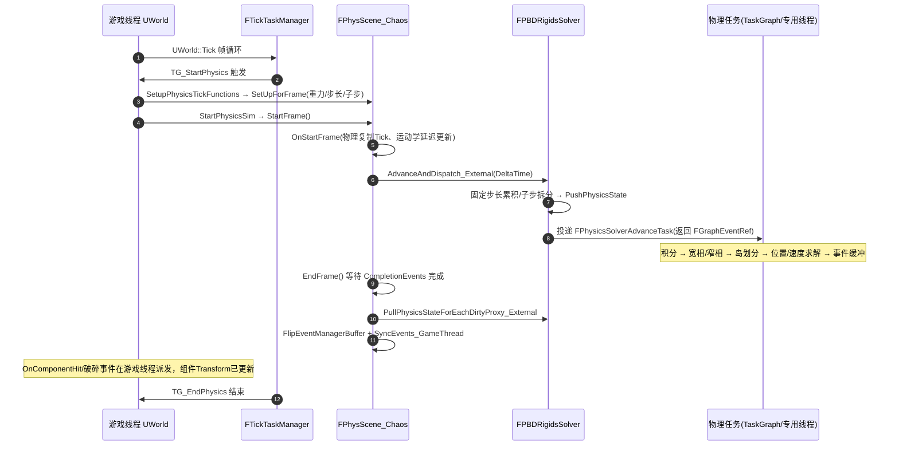

# UE 引擎源码分析 15：物理系统源码剖析（Chaos）
> 知识成熟度：L2（本轮审计修订时补标）
> 版本基准：UE 5.8.0 安装版（`Engine/Build/Build.version`：Major 5 / Minor 8 / Patch 0 / CL 55116800，分支 `++UE5+Release-5.8`）；本轮补深行号改以 **5.8.2 checkout**（`C:\Users\zhaozhiqi\Documents\GitHub\UnrealEngine`，分支 `UE5`）为准，详见 1.4 节「行号口径」。
> 验收边界：以 5.8.2 checkout 的 Engine/Source 只读源码为准（安装版 5.8.0 同名文件可能相差数行，见 1.4 节「行号口径」）；未在本文落地的主题不视为已完成源码覆盖。
> 源码依据：Engine/Source/Runtime/Engine/Private/World.cpp 6807 起；Engine/Source/Runtime/Engine/Private/PhysicsEngine/PhysLevel.cpp 137 起；Engine/Source/Runtime/PhysicsCore/Private/ChaosScene.cpp 326/500 起；Engine/Source/Runtime/Experimental/Chaos/Private/Chaos/Framework/PhysicsSolverBase.cpp 578/581 起；Engine/Source/Runtime/Experimental/Chaos/Private/Chaos/Collision/PBDCollisionContainerSolver.cpp 811 起（完整清单见 1.4 节）。
> 官方参考：[Unreal Engine 官方文档总页](https://dev.epicgames.com/documentation/en-us/unreal-engine)。
> 最后更新：2026-09-15（补深：13 个无引用句源码块全部换成 5.8.2 逐字块并补引用句；修正 `p.chaos.MaxPhysicsStepsPerGameTick`、`FPhysScene_Chaos::EndFrame`、`bIsInAir` 三处正文错误）。

> 对应知识点：[09-物理系统/01-Chaos物理引擎概览](01-Chaos物理引擎概览.md)
>
> 适用版本：UE 5.8（源码根目录 `C:\Program Files\Epic Games\UE_5.8\Engine\Source`，下文中"模块"均指
> `Engine/Source/Runtime` 下的真实路径，已逐一用 `Test-Path` / `findstr` 对照本机 5.8 源码验证）。
> 文中所有类名 / 函数名 / 宏名均为 UE 5.8 真实 API；标「节选」的代码是对超长函数做了裁剪、未改动任何符号；
> 标「示意」的片段仅用于表达调用结构，请以实际源码为准。
> 特别提示：UE 5.8 中部分经典类名已发生变化（例如 `FPBDCollisionConstraintSolver` 在 5.8 源码中
> 已不存在，实际求解器名为 `FPBDCollisionContainerSolver`；`FChaosScene` 已移入 PhysicsCore 模块），
> 本文一律以 5.8 实测类名为准。

## 一、概述

### 1.1 本篇回答的问题

- `UWorld` 与物理场景 `FPhysScene` 之间到底是谁创建谁、每帧谁驱动谁？
- Chaos 的"物理线程 / 游戏线程"同步机制在源码层面长什么样？`FPhysicsThreadContext` 是干什么的？
- 碰撞检测产出的数据是什么结构？5.8 里真正求解碰撞的类叫什么、怎么工作的？
- 刚体粒子（`FGeometryParticle`）、几何集合（`FGeometryCollection`）在 5.8 里如何进入仿真？
- 从 PhysX 时代到 Chaos，`FPhysScene` 的源码形态发生了哪些实质变化？
- 5.8 Chaos 的关键类清单（全部来自本机源码验证，不是记忆中的 UE4 旧名）。

### 1.2 与知识库文章的对应关系

| 知识库文章 | 讲清了什么 | 本篇补充的源码层内容 |
| --- | --- | --- |
| [09-物理系统/01-Chaos物理引擎概览](01-Chaos物理引擎概览.md) | Chaos 是什么、刚体/碰撞/约束的概念、游戏中的使用姿势 | `FChaosScene`/`FPhysScene_Chaos`/`FPBDRigidsSolver`/`FPBDCollisionContainerSolver` 的真实代码与调用链 |
| [09-物理系统/02-碰撞检测与物理材质](02-碰撞检测与物理材质.md) | 碰撞通道、Query 与命中事件的使用规则 | 碰撞约束数据 `FPBDCollisionConstraint` 的产生与求解过程 |
| [09-物理系统/03-物理约束与关节](03-物理约束与关节.md) | 关节约束的配置与行为 | `FPBDJointConstraints`、`TPBDJointContainerSolver` 在求解器中的位置 |

建议先读知识库概念文章，再读本篇；两者配合可以回答"物理为什么这样跑"与"性能问题该查哪个类"两类问题。

### 1.3 5.8 目录结构变化速览（与网上老教程最大的差异点）

UE 5.8 的物理源码目录与 UE4 时代相比有明确调整，老教程里的路径经常失效：

- `Engine/Public/PhysicsEngine` 目录在 5.8 **不存在**，公共物理头移到了 `Engine/Public/Physics`（含
  `Physics/Experimental` 子目录）。
- `Engine/Private/PhysicsEngine` 目录仍然存在，Chaos 相关实现位于其 `Experimental` 子目录。
- 低层场景类 `FChaosScene` 不在 Chaos 模块，而在 **PhysicsCore 模块**：
  `PhysicsCore/Public/Chaos/ChaosScene.h`。
- `FPhysScene` 不再是独立类，而是 `FPhysScene_Chaos` 的 typedef（见
  `PhysicsCore/Public/PhysicsInterfaceDeclaresCore.h`），世界场景直接就是 Chaos 场景。
- `FPBDCollisionConstraintSolver`（UE5.0~5.3 时代的名字）在 5.8 已不存在，取而代之的是
  `FPBDCollisionContainerSolver`（含 `PBDCollisionContainerSolverJacobi.h` /
  `PBDCollisionContainerSolverSimd.h` 变体）。

### 1.4 行号口径与本节引用规则

- 本文行号以 **5.8.2 checkout**（`C:\Users\zhaozhiqi\Documents\GitHub\UnrealEngine`，分支 `UE5`，`CompatibleChangelist 55116800`）为准。
- 同版本号的安装版 **UE 5.8.0（CL 55116800）** 同名文件可能相差数行：定位请以「符号名 + 引用句」为主、行号为辅。
- 每个源码块前的引用句给出**完整相对路径**（相对 checkout 根，即以 `Engine/Source/...` 起）；块内第一个非省略标记行逐字等于该行号所指源码行，`//……` 表示中间省略（仅为阅读便利，省略处不改变逐字性）。

本轮（2026-09-15）逐字引用的文件与行号：

| 文件（相对 checkout 根） | 本轮引用行号 |
| --- | --- |
| `Engine/Source/Runtime/Engine/Private/World.cpp` | 6807-6824、6827-6845 |
| `Engine/Source/Runtime/Engine/Private/PhysicsEngine/PhysLevel.cpp` | 137-212（分段）、215-235、239-245、257-288 |
| `Engine/Source/Runtime/Engine/Public/Physics/Experimental/PhysScene_Chaos.h` | 116-126、154-158、167-171、223-226、232、241、267-270、508-509、521-524、530-532 |
| `Engine/Source/Runtime/Engine/Private/PhysicsEngine/Experimental/PhysScene_Chaos.cpp` | 2272-2317 |
| `Engine/Source/Runtime/PhysicsCore/Public/Chaos/ChaosScene.h` | 68-79、84-101、122-128、140-145、152、177-182、191-198 |
| `Engine/Source/Runtime/PhysicsCore/Private/ChaosScene.cpp` | 326-393（分段）、500-598（分段） |
| `Engine/Source/Runtime/Experimental/Chaos/Public/Framework/Threading.h` | 21-50、168-222 |
| `Engine/Source/Runtime/Experimental/Chaos/Private/Chaos/Framework/PhysicsSolverBase.cpp` | 578-579、581-694（分段） |
| `Engine/Source/Runtime/Experimental/Chaos/Public/Chaos/Framework/PhysicsSolverBase.h` | 260、269、346 |
| `Engine/Source/Runtime/Experimental/Chaos/Public/Chaos/ParticleHandleFwd.h` | 24、28-29、113-115 |
| `Engine/Source/Runtime/Experimental/Chaos/Public/Chaos/ParticleHandle.h` | 2761-2832（分段） |
| `Engine/Source/Runtime/Experimental/Chaos/Public/PBDRigidsSolver.h` | 87、111-121、132-147、160-163、192-195、251-259 |
| `Engine/Source/Runtime/Experimental/Chaos/Public/Chaos/PBDRigidsEvolutionGBF.h` | 50-68、133-143 |
| `Engine/Source/Runtime/Experimental/Chaos/Public/Chaos/Collision/PBDCollisionConstraint.h` | 37-38、224、268、274、462、878、1002、1026 |
| `Engine/Source/Runtime/Experimental/Chaos/Public/Chaos/Collision/PBDCollisionContainerSolver.h` | 22-49（分段）、54-58、85-99 |
| `Engine/Source/Runtime/Experimental/Chaos/Private/Chaos/Collision/PBDCollisionContainerSolver.cpp` | 811-901（分段） |
| `Engine/Source/Runtime/Experimental/Chaos/Public/Chaos/Island/IslandManager.h` | 37-40、94-98、148-150、454-466 |
| `Engine/Source/Runtime/Experimental/Chaos/Public/Chaos/Joint/PBDJointContainerSolver.h` | 21-33 |
| `Engine/Source/Runtime/Experimental/Chaos/Public/PhysicsProxy/GeometryCollectionPhysicsProxy.h` | 142、266-268、779 |
| `Engine/Source/Runtime/Engine/Classes/PhysicsEngine/PhysicsSettings.h` | 317、325、337、341、345 |
| `Engine/Source/Runtime/Engine/Classes/GameFramework/CharacterMovementComponent.h` | 1327 |
| `Engine/Source/Runtime/Engine/Classes/GameFramework/Character.h` | 689 |

维护提示：本轮新增/改写的源码块一律由脚本按行区间机械抽取（`.kb_work/cache/15-splice.ps1`），不做"等价重写"。

## 二、源码定位

> 下表所有路径均已在本机 `C:\Program Files\Epic Games\UE_5.8\Engine\Source` 下用 `Test-Path` 验证存在，
> 关键符号均已用 `findstr` 验证类名/函数名真实存在；行号为验证时的实际行号，后续小版本可能漂移。

| 模块 | 文件（相对 Engine/Source/Runtime） | 关键符号 | 作用 |
| --- | --- | --- | --- |
| PhysicsCore | `Engine/Source/Runtime/PhysicsCore/Public/Chaos/ChaosScene.h` | `FChaosScene`（L84）、`FChaosSceneSimCallback`（L75）、`FChaosSceneCallbackInput`（L68） | 低层 Chaos 场景：持有求解器、帧推进、重力 SimCallback |
| PhysicsCore | `Engine/Source/Runtime/PhysicsCore/Private/ChaosScene.cpp` | `FChaosScene::SetUpForFrame`（L331）、`StartFrame`（L363）、`OnSyncBodies`（L389）、`EndFrame`（L500）、`WaitPhysScenes`（L579） | 场景帧驱动与结果同步实现 |
| PhysicsCore | `Engine/Source/Runtime/PhysicsCore/Public/PhysicsInterfaceDeclaresCore.h` | `typedef FPhysScene_Chaos FPhysScene;`（L90）、`using FPhysicsActorHandle = Chaos::FSingleParticlePhysicsProxy*;`（L76）、`using FPhysicsMaterial = Chaos::FChaosPhysicsMaterial;`（L63） | 物理接口统一 typedef：5.8 全部指向 Chaos |
| Engine | `Engine/Source/Runtime/Engine/Public/Physics/Experimental/PhysScene_Chaos.h` | `FPhysScene_Chaos`（L116） | 世界级场景：代理映射、碰撞事件、复制、异步物理状态 |
| Engine | `Engine/Source/Runtime/Engine/Private/PhysicsEngine/Experimental/PhysScene_Chaos.cpp` | `FPhysScene_Chaos::OnStartFrame`（L2272） | 场景每帧开始回调（复制 Tick、运动学延迟更新） |
| Engine | `Engine/Source/Runtime/Engine/Private/World.cpp` | `UWorld::CreatePhysicsScene`（L6807）、`UWorld::SetPhysicsScene`（L6827） | 世界创建物理场景入口 |
| Engine | `Engine/Source/Runtime/Engine/Private/PhysicsEngine/PhysLevel.cpp` | `UWorld::SetupPhysicsTickFunctions`（L137）、`StartPhysicsSim`（L215）、`FinishPhysicsSim`（L226）、`FStartPhysicsTickFunction::ExecuteTick`（L239） | 物理 Tick 函数注册与驱动（TG_StartPhysics/TG_EndPhysics） |
| Chaos | `Engine/Source/Runtime/Experimental/Chaos/Public/Framework/Threading.h` | `FPhysicsThreadContext`（L171）、`CHAOS_SCENE_LOCK_TYPE` | 线程上下文（非 Shipping 编译）与场景锁类型 |
| Chaos | `Engine/Source/Runtime/Experimental/Chaos/Public/ChaosSolversModule.h` | `FChaosSolversModule`（L145） | 求解器模块单例：创建/管理所有求解器 |
| Chaos | `Engine/Source/Runtime/Experimental/Chaos/Public/PBDRigidsSolver.h` | `FPBDRigidsSolver`（L87） | 刚体求解器：注册对象、推进仿真、进化体与约束入口 |
| Chaos | `Engine/Source/Runtime/Experimental/Chaos/Public/Chaos/Framework/PhysicsSolverBase.h` | `FPhysicsSolverBase`（L346）、`EThreadingModeTemp`（L260）、`FPhysicsSolverEvents`（L269） | 求解器基类：线程模式、事件回调 |
| Chaos | `Engine/Source/Runtime/Experimental/Chaos/Private/Chaos/Framework/PhysicsSolverBase.cpp` | `FPhysicsSolverBase::AdvanceAndDispatch_External`（L581） | 固定步长累积、子步拆分、任务投递 |
| Chaos | `Engine/Source/Runtime/Experimental/Chaos/Public/Chaos/PBDRigidsEvolutionGBF.h` | `FPBDRigidsEvolutionGBF`（L50） | 进化体：碰撞检测、求解、集群的统一驱动器 |
| Chaos | `Engine/Source/Runtime/Experimental/Chaos/Public/Chaos/ParticleHandle.h` | `TGeometryParticle`（L2763） | 几何粒子模板（外部线程侧） |
| Chaos | `Engine/Source/Runtime/Experimental/Chaos/Public/Chaos/ParticleHandleFwd.h` | `using FGeometryParticle = TGeometryParticle<FReal, 3>;`（L113）、`FGeometryParticleHandle`（L24） | 粒子类型别名 |
| Chaos | `Engine/Source/Runtime/Experimental/Chaos/Public/Chaos/Collision/PBDCollisionConstraint.h` | `FPBDCollisionConstraint`（L224） | 碰撞约束（接触流形）数据结构 |
| Chaos | `Engine/Source/Runtime/Experimental/Chaos/Public/Chaos/Collision/PBDCollisionContainerSolver.h` | `FPBDCollisionContainerSolver`（L22） | 碰撞容器求解器（5.8 实际求解器） |
| Chaos | `Engine/Source/Runtime/Experimental/Chaos/Private/Chaos/Collision/PBDCollisionContainerSolver.cpp` | `SolvePositionImpl`（L811）、`SolveVelocityImpl`（L877） | 位置/速度求解循环实现 |
| Chaos | `Engine/Source/Runtime/Experimental/Chaos/Public/Chaos/Island/IslandManager.h` | `FPBDIslandManager`（L454，`Chaos::Private`）、`FPBDIslandParticle`（L40） | 岛管理：把约束图切分为可并行求解的岛 |
| Chaos | `Engine/Source/Runtime/Experimental/Chaos/Public/Chaos/Joint/PBDJointContainerSolver.h` | `TPBDJointContainerSolver`（L25） | 关节容器求解器 |
| Chaos | `Engine/Source/Runtime/Experimental/Chaos/Public/PhysicsProxy/GeometryCollectionPhysicsProxy.h` | `FGeometryCollectionPhysicsProxy`（L142） | 几何集合物理代理（破碎等） |
| PhysicsCore | `Engine/Source/Runtime/PhysicsCore/Public/Chaos/ChaosPhysicalMaterial.h` | `UChaosPhysicalMaterial`（L22）、`class FChaosPhysicsMaterial;`（L14） | 物理材质 |
| Engine | `Engine/Source/Runtime/Engine/Public/Physics/PhysScene.h` | `FPhysScene_Base`（L9，模板） | 遗留的场景模板壳（兼容层） |

## 三、物理引擎入口：UWorld ↔ FPhysScene

### 3.1 UWorld 创建物理场景

`UWorld` 在 `InitializeNewWorld` 时按初始化值决定是否创建物理场景，5.8 中世界场景直接就是 Chaos 场景：

`UWorld` 在初始化时按初始化值决定是否创建物理场景，5.8 中世界场景直接就是 Chaos 场景。以下为 5.8.2 checkout 的逐字源码（2026-09-15：原块首行是手写注释、`Appendf` 的参数被省略号替换，已整块换成真实源码）：

摘自 `Engine/Source/Runtime/Engine/Private/World.cpp`（第 6807 行起）
```cpp
void UWorld::CreatePhysicsScene(const AWorldSettings* Settings)
{
#if CHAOS_SOLVER_DEBUG_NAME
	TStringBuilder<128> PhysicsSceneNameBuilder;
 	PhysicsSceneNameBuilder.Appendf(TEXT("%s | %s | World Type [%s]"), IsNetMode(NM_DedicatedServer) ? TEXT("Server") : TEXT("Client"), *GetMapName(), LexToString(WorldType));

	#if UE_WITH_REMOTE_OBJECT_HANDLE
 		PhysicsSceneNameBuilder.Appendf(TEXT(" | Remote Server ID [%s]"), *FRemoteServerId::GetLocalServerId().ToString());
	#endif

	const FName PhysicsName = FName(PhysicsSceneNameBuilder);

	FPhysScene* NewScene = new FPhysScene(nullptr, PhysicsName);
#else
	FPhysScene* NewScene = new FPhysScene(nullptr);
#endif

	SetPhysicsScene(NewScene);
	//……
void UWorld::SetPhysicsScene(FPhysScene* InScene)
{
	// Clear world pointer in old FPhysScene (if there is one)
	if(PhysicsScene != NULL)
	{
		PhysicsScene->SetOwningWorld(nullptr);
		delete PhysicsScene;
	}

	// Assign pointer
	PhysicsScene = InScene;

	if(PhysicsScene != NULL)
	{
		// Set pointer in scene to know which world its coming from
		PhysicsScene->SetOwningWorld(this);
	}
}

```

逐行解释：

- `new FPhysScene(nullptr, PhysicsName)`：这里的 `FPhysScene` 在 5.8 是
  `FPhysScene_Chaos` 的 typedef（`PhysicsInterfaceDeclaresCore.h:90`），第一个参数是 SolverActor
  （`AChaosSolverActor`），世界场景传 `nullptr` 表示使用默认求解器；第二个参数是调试名（世界名 + 网络模式）。
- `SetPhysicsScene` 负责双向绑定：先解除旧场景的 `OwningWorld` 并删除，再设置新场景的
  `OwningWorld` 为 `this`。此后 `UWorld::GetPhysicsScene()` 拿到的就是 Chaos 场景。
- 场景名调试功能由宏 `CHAOS_SOLVER_DEBUG_NAME` 控制，用于 Chaos Visual Debugger 区分场景。

### 3.2 每帧物理由两个 Tick 函数驱动

物理模拟不是 `UWorld::Tick` 直接调的，而是注册了两个专用 Tick 函数，**物理 Tick 函数的注册组合**（2026-09-15 补充）：`UWorld::SetupPhysicsTickFunctions` 只有在 `bEnablePhysics != IsTickFunctionRegistered()` 且 `PersistentLevel` 有效时才改注册状态；`bEnablePhysics` 在编辑器下是 `bShouldSimulatePhysics || bEnableTraceCollision`，运行时只有 `bShouldSimulatePhysics`。这是"编辑器里能命中物理、打包后同一场景没有物理"一类问题的源码根因。
挂在
`TG_StartPhysics` / `TG_EndPhysics` 上（`Engine/Private/PhysicsEngine/PhysLevel.cpp`）：挂在
`TG_StartPhysics` / `TG_EndPhysics` 上（`Engine/Private/PhysicsEngine/PhysLevel.cpp`）：

物理模拟不是 `UWorld::Tick` 直接调的，而是注册了两个专用 Tick 函数，挂在 `TG_StartPhysics` / `TG_EndPhysics` 上（`Engine/Source/Runtime/Engine/Private/PhysicsEngine/PhysLevel.cpp`）。先看注册流程与 `SetUpForFrame` 下发（2026-09-15：原示意块已替换为 5.8 源码逐字版，原文把多处多行语句压缩成单行）：

摘自 `Engine/Source/Runtime/Engine/Private/PhysicsEngine/PhysLevel.cpp`（第 137 行起）
```cpp
void UWorld::SetupPhysicsTickFunctions(float DeltaSeconds)
{
	StartPhysicsTickFunction.bCanEverTick = true;
	StartPhysicsTickFunction.Target = this;

	EndPhysicsTickFunction.bCanEverTick = true;
	EndPhysicsTickFunction.Target = this;

	//……
	// see if we need to update tick registration;
	bool bNeedToUpdateTickRegistration = (bEnablePhysics != StartPhysicsTickFunction.IsTickFunctionRegistered())
		|| (bEnablePhysics != EndPhysicsTickFunction.IsTickFunctionRegistered());

	if (bNeedToUpdateTickRegistration && PersistentLevel)
	{
		if (bEnablePhysics && !StartPhysicsTickFunction.IsTickFunctionRegistered())
		{
			StartPhysicsTickFunction.TickGroup = TG_StartPhysics;
			StartPhysicsTickFunction.RegisterTickFunction(PersistentLevel);
		}
		else if (!bEnablePhysics && StartPhysicsTickFunction.IsTickFunctionRegistered())
		{
			StartPhysicsTickFunction.UnRegisterTickFunction();
		}

		if (bEnablePhysics && !EndPhysicsTickFunction.IsTickFunctionRegistered())
		{
			EndPhysicsTickFunction.TickGroup = TG_EndPhysics;
			EndPhysicsTickFunction.RegisterTickFunction(PersistentLevel);
			EndPhysicsTickFunction.AddPrerequisite(this, StartPhysicsTickFunction);
		}
		else if (!bEnablePhysics && EndPhysicsTickFunction.IsTickFunctionRegistered())
		{
			EndPhysicsTickFunction.RemovePrerequisite(this, StartPhysicsTickFunction);
			EndPhysicsTickFunction.UnRegisterTickFunction();
		}
	}
	//……
	FPhysScene* PhysScene = GetPhysicsScene();
	if (PhysicsScene == NULL)
	//……
	FVector DefaultGravity( 0.f, 0.f, GetGravityZ() );
	//……
	static const auto CVar_MaxPhysicsDeltaTime = IConsoleManager::Get().FindTConsoleVariableDataFloat(TEXT("p.MaxPhysicsDeltaTime"));

	UPhysicsSettings* Settings = UPhysicsSettings::Get();

	float MinPhysicsDeltaTime = Settings->MinPhysicsDeltaTime;
	float MaxPhysicsDeltaTime = Settings->MaxPhysicsDeltaTime;
	float MaxSubstepDeltaTime = Settings->MaxSubstepDeltaTime;
	//……
	PhysScene->SetUpForFrame(&DefaultGravity, DeltaSeconds, MinPhysicsDeltaTime, MaxPhysicsDeltaTime, MaxSubstepDeltaTime, Settings->MaxSubsteps, Settings->bSubstepping);
```

启停入口与两个 Tick 函数的 `ExecuteTick`（`FStartPhysicsTickFunction` 在 239 行、`FEndPhysicsTickFunction` 在 257 行）：

摘自 `Engine/Source/Runtime/Engine/Private/PhysicsEngine/PhysLevel.cpp`（第 215 行起）
```cpp
void UWorld::StartPhysicsSim()
{
	FPhysScene* PhysScene = GetPhysicsScene();
	if (PhysScene == NULL)
	{
		return;
	}

	PhysScene->StartFrame();
}

void UWorld::FinishPhysicsSim()
{
	FPhysScene* PhysScene = GetPhysicsScene();
	if (PhysScene == NULL)
	{
		return;
	}

	PhysScene->EndFrame();
}
	//……
void FStartPhysicsTickFunction::ExecuteTick(float DeltaTime, enum ELevelTick TickType, ENamedThreads::Type CurrentThread, const FGraphEventRef& MyCompletionGraphEvent)
{
	QUICK_SCOPE_CYCLE_COUNTER(FStartPhysicsTickFunction_ExecuteTick);
	CSV_SCOPED_TIMING_STAT_EXCLUSIVE(Physics);
	check(Target);
	Target->StartPhysicsSim();
}
	//……
void FEndPhysicsTickFunction::ExecuteTick(float DeltaTime, enum ELevelTick TickType, ENamedThreads::Type CurrentThread, const FGraphEventRef& MyCompletionGraphEvent)
{
	QUICK_SCOPE_CYCLE_COUNTER(FEndPhysicsTickFunction_ExecuteTick);
	CSV_SCOPED_TIMING_STAT_EXCLUSIVE(Physics);

	check(Target);
	FPhysScene* PhysScene = Target->GetPhysicsScene();
	if (PhysScene == NULL)
	{
		return;
	}

	FGraphEventArray PhysicsComplete = PhysScene->GetCompletionEvents();
	if (!PhysScene->IsCompletionEventComplete())
	{
		// don't release the next tick group until the physics has completed and we have run FinishPhysicsSim
		DECLARE_CYCLE_STAT(TEXT("FSimpleDelegateGraphTask.FinishPhysicsSim"),
			STAT_FSimpleDelegateGraphTask_FinishPhysicsSim,
			STATGROUP_TaskGraphTasks);

		MyCompletionGraphEvent->DontCompleteUntil(
			FSimpleDelegateGraphTask::CreateAndDispatchWhenReady(
				FSimpleDelegateGraphTask::FDelegate::CreateUObject(Target, &UWorld::FinishPhysicsSim),
				GET_STATID(STAT_FSimpleDelegateGraphTask_FinishPhysicsSim), &PhysicsComplete, ENamedThreads::GameThread
			)
		);
	}
	else
	{
		// it was already done, so let just do it.
		Target->FinishPhysicsSim();
	}
```

逐行解释：

- `StartPhysicsTickFunction` 注册到 `TG_StartPhysics`、`EndPhysicsTickFunction` 注册到
  `TG_EndPhysics`，且 `End` 以 `Start` 为前提（`AddPrerequisite`），保证引擎内"先启动物理、后结束物理"。
- `SetupPhysicsTickFunctions` 每帧还会把当前重力、最大/最小物理步长、子步参数通过
  `SetUpForFrame` 传给场景——这就是游戏里改 `WorldSettings` 重力后下一帧立刻生效的代码路径。
- `TG_StartPhysics` 与 `TG_EndPhysics` 之间的 `TG_DuringPhysics` 组内组件可以**与物理并行执行**，
  这就是为什么 `TG_DuringPhysics` 的代码不能假设物理结果已就绪（与《08-Tick与模块系统源码》呼应）。

## 四、Chaos 场景与线程模型

### 4.1 FChaosScene：低层场景类（PhysicsCore 模块）

5.8 中 `FChaosScene` 的注释是"Low level Chaos scene used when building custom simulations that don't exist in the main world physics scene"，它被 `FPhysScene_Chaos` 继承后用于世界物理。
本节代码全部取自 `PhysicsCore` 模块的真实头文件（2026-09-15：原示意块已替换为 5.8 源码逐字版）：

摘自 `Engine/Source/Runtime/PhysicsCore/Public/Chaos/ChaosScene.h`（第 68 行起）
```cpp
struct FChaosSceneCallbackInput : public Chaos::FSimCallbackInput
{
	Chaos::FVec3 Gravity;

	void Reset() {}
};

struct FChaosSceneSimCallback : public Chaos::TSimCallbackObject<FChaosSceneCallbackInput>
{
	virtual void OnPreSimulate_Internal() override;
	virtual FName GetFNameForStatId() const override;
};
	//……
class FChaosScene
#if WITH_ENGINE
	: public FGCObject
#endif
{
public:
	PHYSICSCORE_API FChaosScene(
		UObject* OwnerPtr
		, Chaos::FReal InAsyncDt
		, const FName& DebugName = NAME_None
	);

	PHYSICSCORE_API virtual ~FChaosScene();

	/**
	 * Get the internal Chaos solver object
	 */
	Chaos::FPhysicsSolver* GetSolver() const { return SceneSolver; }
	//……
	PHYSICSCORE_API void WaitPhysScenes();

	/**
	 * Copies the acceleration structure out of the solver, does no thread safety checking so ensure calls
	 * to this are made at appropriate sync points if required
	 */
	PHYSICSCORE_API void CopySolverAccelerationStructure();
	//……
	PHYSICSCORE_API void StartFrame();
	PHYSICSCORE_API void SetUpForFrame(const FVector* NewGrav,float InDeltaSeconds,float InMinPhysicsDeltaTime,float InMaxPhysicsDeltaTime,float InMaxSubstepDeltaTime,int32 InMaxSubsteps,bool bSubstepping);
	PHYSICSCORE_API void EndFrame();

	DECLARE_MULTICAST_DELEGATE_OneParam(FOnPhysScenePostTick,FChaosScene*);
	FOnPhysScenePostTick OnPhysScenePostTick;
	//……
	PHYSICSCORE_API FGraphEventArray GetCompletionEvents();
	//……
	virtual float OnStartFrame(float InDeltaTime){ return InDeltaTime; }
	PHYSICSCORE_API virtual void OnSyncBodies(Chaos::FPhysicsSolverBase* Solver);
	//Engine interface END

	float MDeltaTime;
	float MNetworkDeltaTimeScale = 1.f; // Scale passed in delta time by this. Used by NetworkPrediction to make clients slow down or catch up when needed
	//……

	template <typename TSolver>
	void SyncBodies(TSolver* Solver);

	// Taskgraph control
	FGraphEventArray CompletionEvents;

	FChaosSceneSimCallback* SimCallback;
```

逐行解释：

- `SceneSolver` 是本场景对应的 `Chaos::FPhysicsSolver*`（实际为 `FPBDRigidsSolver`），
  `GetSolver()` 是游戏线程访问求解器的唯一入口。
- `FChaosSceneSimCallback` 是 **SimCallback** 机制：游戏线程通过
  `SimCallback->GetProducerInputData_External()->Gravity = Acceleration` 写入重力，
  物理线程在 `OnPreSimulate_Internal` 里消费。这是 Chaos 跨线程传数据的标准范式
  （生产者/消费者双缓冲），比锁更高效。
- `MNetworkDeltaTimeScale`：网络预测（NetworkPrediction）用来缩放 DeltaTime 的系数，
  客户端追赶/减速用。
- `CompletionEvents` 保存每帧 `AdvanceAndDispatch_External` 返回的任务事件，
  `EndFrame` 先等它完成再做结果同步。

### 4.2 FPhysScene_Chaos：世界级场景

`FPhysScene_Chaos : public FChaosScene`（`Engine/Source/Runtime/Engine/Public/Physics/Experimental/PhysScene_Chaos.h:116`）补齐了引擎需要的一切"业务"能力。下面按"类头 → 代理注册 → 成员映射"给出真实源码节选（2026-09-15：原示意块已替换为 5.8 源码逐字版）：

摘自 `Engine/Source/Runtime/Engine/Public/Physics/Experimental/PhysScene_Chaos.h`（第 116 行起）
```cpp
class FPhysScene_Chaos : public FChaosScene
{
public:

	using Super = FChaosScene;

	ENGINE_API FPhysScene_Chaos(AActor* InSolverActor=nullptr
#if CHAOS_SOLVER_DEBUG_NAME
	, const FName& DebugName=NAME_None
#endif
);
	//……
	ENGINE_API void AddObject(UPrimitiveComponent* Component, FSkeletalMeshPhysicsProxy* InObject);
	ENGINE_API void AddObject(UPrimitiveComponent* Component, FStaticMeshPhysicsProxy* InObject);
	ENGINE_API void AddObject(UPrimitiveComponent* Component, Chaos::FSingleParticlePhysicsProxy* InObject);
	ENGINE_API void AddObject(UPrimitiveComponent* Component, FGeometryCollectionPhysicsProxy* InObject);
	ENGINE_API void AddObject(UPrimitiveComponent* Component, Chaos::FClusterUnionPhysicsProxy* InObject);
	//……
	ENGINE_API void RemoveObject(FSkeletalMeshPhysicsProxy* InObject);
	ENGINE_API void RemoveObject(FStaticMeshPhysicsProxy* InObject);
	ENGINE_API void RemoveObject(Chaos::FSingleParticlePhysicsProxy* InObject);
	ENGINE_API void RemoveObject(FGeometryCollectionPhysicsProxy* InObject);
	ENGINE_API void RemoveObject(Chaos::FClusterUnionPhysicsProxy* InObject);
	//……
	ENGINE_API void SetOwningWorld(UWorld* InOwningWorld);

	ENGINE_API UWorld* GetOwningWorld();
	ENGINE_API const UWorld* GetOwningWorld() const;
	//……
	ENGINE_API void AddForce_AssumesLocked(FBodyInstance* BodyInstance, const FVector& Force, bool bAllowSubstepping, bool bAccelChange);
	//……
	ENGINE_API bool MarkForPreSimKinematicUpdate(USkeletalMeshComponent* InSkelComp, ETeleportType InTeleport, bool bNeedsSkinning);
	//……
	DECLARE_MULTICAST_DELEGATE_TwoParams(FOnPhysScenePreTick, FPhysScene_Chaos*, float /*DeltaSeconds*/);
	FOnPhysScenePreTick OnPhysScenePreTick;
	DECLARE_MULTICAST_DELEGATE_TwoParams(FOnPhysSceneStep, FPhysScene_Chaos*, float /*DeltaSeconds*/);
	FOnPhysSceneStep OnPhysSceneStep;
	//……
	// RWLock for thread safe access to PhysicsProxyToComponentMap and ComponentToPhysicsProxyMap.
	mutable FRWLock PhysicsProxyComponentMapsLock;
	//……
	TMap<IPhysicsProxyBase*, TWeakObjectPtr<UPrimitiveComponent>> PhysicsProxyToComponentMap;

	// Maps Component to PhysicsProxy that is created
	TMap<UPrimitiveComponent*, TArray<IPhysicsProxyBase*>> ComponentToPhysicsProxyMap;
	//……
	TWeakObjectPtr<AActor> SolverActor;

	TObjectPtr<UChaosEventRelay> ChaosEventRelay;
```

逐行解释：

- `AddObject / RemoveObject`：`UPrimitiveComponent` 创建物理状态（`FBodyInstance` → 物理代理）时
  把代理注册进场景，销毁时移除。代理类型包括单粒子代理、几何集合代理、簇联合代理等。
- `PhysicsProxyToComponentMap / ComponentToPhysicsProxyMap` 是双向映射，配合
  `FRWLock`（`PhysicsProxyComponentMapsLock`）支持游戏线程与物理线程并发访问；
  命名后缀 `_AssumesLocked` 的函数要求调用者已持有场景锁。
- `PendingCollisionNotifies` + `ContactPairToPendingNotifyMap`：物理线程产生碰撞事件后，
  场景先缓存"待派发的通知"，在游戏线程同步阶段统一分发（`DispatchPendingCollisionNotifies`），
  保证 `OnComponentHit` 等回调一定发生在游戏线程。
- `OnPhysScenePreTick / OnPhysSceneStep` 是引擎内部委托，物理子系统的"预物理 Tick"都挂在这里。

### 4.3 线程模型：场景锁与 FPhysicsThreadContext

`Framework/Threading.h` 定义了场景锁类型、`FPhysicsThreadContext` 调试上下文与它们的编译开关（2026-09-15：原示意块已替换为 5.8 源码逐字版）。先看控制宏与锁类型定义：

摘自 `Engine/Source/Runtime/Experimental/Chaos/Public/Framework/Threading.h`（第 21 行起）
```cpp
#ifndef PHYSICS_THREAD_CONTEXT
	#if (!UE_BUILD_SHIPPING && !UE_BUILD_TEST)
		#define PHYSICS_THREAD_CONTEXT 1
	#else
		#define PHYSICS_THREAD_CONTEXT 0
	#endif
#endif


/**
 * Scene lock types
 * @see CHAOS_SCENE_LOCK_TYPE
 */
#define CHAOS_SCENE_LOCK_SCENE_GUARD 0            // Unfair RW lock
#define CHAOS_SCENE_LOCK_RWFIFO_SPINLOCK 1        // Fair RW spinlock, non yielding
#define CHAOS_SCENE_LOCK_RWFIFO_CRITICALSECTION 2 // Fair RW spinlock, yielding
#define CHAOS_SCENE_LOCK_FRWLOCK 3                // Recurrant RW lock based on FRwLock (uses platform sync primitives)
#define CHAOS_SCENE_LOCK_SIMPLE_MUTEX 4           // Just a critical section (not an RWLock). Provided For profiling/debugging only. Not recommended

/** Controls the scene lock type. See above. */
#if WITH_EDITOR
	#ifndef CHAOS_SCENE_LOCK_TYPE
	#define CHAOS_SCENE_LOCK_TYPE CHAOS_SCENE_LOCK_RWFIFO_CRITICALSECTION
	#endif
#else
	#ifndef CHAOS_SCENE_LOCK_TYPE
	#define CHAOS_SCENE_LOCK_TYPE CHAOS_SCENE_LOCK_FRWLOCK
	#endif
#endif
```

再看到受该宏保护的线程语义上下文类（`IsInPhysicsSimContext()` 在源码中是多行函数体，旧文曾把它压缩成单行）：

摘自 `Engine/Source/Runtime/Experimental/Chaos/Public/Framework/Threading.h`（第 168 行起）
```cpp
#if PHYSICS_THREAD_CONTEXT

/** Debug helper to ensure threading mistakes are caught. Do not use for ship */
class FPhysicsThreadContext : public TThreadSingleton<FPhysicsThreadContext>
{
public:
	bool IsInPhysicsSimContext() const
	{
		return PhysicsSimContext > 0;
	}

	bool IsInGameThreadContext() const
	{
		return (IsInGameThread() || GameThreadContext > 0) && !bFrozenGameThread;
	}

	void IncPhysicsSimContext()
	{
		++PhysicsSimContext;
	}

	void DecPhysicsSimContext()
	{
		check(PhysicsSimContext > 0);	//double delete?
		--PhysicsSimContext;
	}

	void IncGameThreadContext()
	{
		++GameThreadContext;
	}

	void DecGameThreadContext()
	{
		check(GameThreadContext > 0);	//double delete?
		--GameThreadContext;
	}

	void FreezeGameThreadContext()
	{
		ensure(!bFrozenGameThread);
		bFrozenGameThread = true;
	}

	void UnFreezeGameThreadContext()
	{
		ensure(bFrozenGameThread);
		bFrozenGameThread = false;
	}

private:
	int32 PhysicsSimContext = 0;
	int32 GameThreadContext = 0;
	bool bFrozenGameThread = false;
};
```

逐行解释：

- 编辑器下默认 `CHAOS_SCENE_LOCK_RWFIFO_CRITICALSECTION`（公平 RW 锁、可让步），
  运行时默认 `CHAOS_SCENE_LOCK_FRWLOCK`（基于 `FRwLock` 的可重入 RW 锁）——因为编辑器里
  PIE 场景与工具代码更频繁地抢锁，公平性更重要。
- `FPhysicsThreadContext` 是 **TThreadSingleton**（每线程 TLS 单例），只统计"语义上下文"
  而不区分具体线程：`IncPhysicsSimContext()` 标记当前线程正处于物理仿真上下文，
  `IsInGameThreadContext()` 判断是否处于游戏线程语义（允许游戏线程借物理线程执行时
  `FreezeGameThreadContext` 冻结判断，用于重演/冻结帧）。
- 注意 `PHYSICS_THREAD_CONTEXT` 宏只在非 Shipping/Test 构建下为 1（`Threading.h` 顶部），
  它本质是**调试辅助**，用于 `CHAOS_CHECK_*_ASSUMPTION` 系列宏检测"是否持锁访问"，
  发布版全部展开为空。

### 4.4 帧推进：SetUpForFrame → StartFrame → EndFrame

`PhysicsCore/Private/ChaosScene.cpp` 是线程同步的核心，`SetUpForFrame`（第 331 行）、`StartFrame`（第 363 行）、`OnSyncBodies`（第 389 行）逐段解读（2026-09-15：原示意块已替换为 5.8 源码逐字版；`SetGravity` 是 SimCallback 写入重力的真实落点，一并给出）：

摘自 `Engine/Source/Runtime/PhysicsCore/Private/ChaosScene.cpp`（第 326 行起）
```cpp
void FChaosScene::SetGravity(const Chaos::FVec3& Acceleration)
{
	SimCallback->GetProducerInputData_External()->Gravity = Acceleration;
}

void FChaosScene::SetUpForFrame(const FVector* NewGrav,float InDeltaSeconds /*= 0.0f*/,float InMinPhysicsDeltaTime /*= 0.0f*/,float InMaxPhysicsDeltaTime /*= 0.0f*/,float InMaxSubstepDeltaTime /*= 0.0f*/,int32 InMaxSubsteps,bool bSubstepping)
	//……
	using namespace Chaos;
	SetGravity(*NewGrav);

	InDeltaSeconds *= MNetworkDeltaTimeScale;

	if(bSubstepping)
	{
		MDeltaTime = InMaxSubstepDeltaTime > 0.f ? FMath::Min(InDeltaSeconds, InMaxSubsteps * InMaxSubstepDeltaTime) : InDeltaSeconds;
	}
	else
	{
		MDeltaTime = InMaxPhysicsDeltaTime > 0.f ? FMath::Min(InDeltaSeconds, InMaxPhysicsDeltaTime) : InDeltaSeconds;
	}
	//……
	if(FPhysicsSolver* Solver = GetSolver())
	{
		if(bSubstepping)
		{
			Solver->SetMaxDeltaTime_External(InMaxSubstepDeltaTime);
			Solver->SetMaxSubSteps_External(InMaxSubsteps);
		}
		else
		{
			Solver->SetMaxDeltaTime_External(InMaxPhysicsDeltaTime);
			Solver->SetMaxSubSteps_External(1);
		}
		Solver->SetMinDeltaTime_External(InMinPhysicsDeltaTime);
	}
}
	//……
void FChaosScene::StartFrame()
{
	using namespace Chaos;

	SCOPE_CYCLE_COUNTER(STAT_Scene_StartFrame);

	if(CVar_ChaosSimulationEnable.GetValueOnGameThread() == 0)
	{
		return;
	}

	const float UseDeltaTime = OnStartFrame(MDeltaTime);
	//……
	TArray<FPhysicsSolverBase*> SolverList = GetPhysicsSolvers();
	for(FPhysicsSolverBase* Solver : SolverList)
	{
		if(FGraphEventRef SolverEvent = Solver->AdvanceAndDispatch_External(UseDeltaTime))
		{
			if(SolverEvent.IsValid())
			{
				CompletionEvents.Add(SolverEvent);
			}
		}
	}
}
	//……
void FChaosScene::OnSyncBodies(Chaos::FPhysicsSolverBase* Solver)
{
	struct FDispatcher {} Dispatcher;
	Solver->PullPhysicsStateForEachDirtyProxy_External(Dispatcher);
}
```

逐行解释：

- `SetUpForFrame`：把重力经 SimCallback 写入；`MDeltaTime` 按"是否子步"取 `Min(帧时间, 上限)`；
  把最大/最小步长与最大子步数下发到求解器（`_External` 后缀 = 游戏线程安全入口）。
- `StartFrame`：先走 `OnStartFrame`（`FPhysScene_Chaos` 覆写，见 4.5），随后对**本场景关联的
  所有求解器**调用 `AdvanceAndDispatch_External(UseDeltaTime)`，把"推进一帧"异步投递出去，
  返回的 `FGraphEventRef` 记录到 `CompletionEvents`——游戏线程不阻塞，这就是并行的起点。
- `OnSyncBodies`：同步阶段把每个**脏代理**的物理结果拉回游戏线程侧（
  `PullPhysicsStateForEachDirtyProxy_External`），对应代理把结果写进 `FBodyInstance`，
  组件 Transform 才会更新。

`PhysicsCore/Private/ChaosScene.cpp` 是线程同步的核心：`EndFrame` 先校验物理任务已完成，再拷贝加速结构、拉回脏代理状态并翻事件缓冲；`WaitPhysScenes` 补上了"异步结果模式下必须单独排空任务"的原因（2026-09-15：原示意块已替换为 5.8 源码逐字版）：

摘自 `Engine/Source/Runtime/PhysicsCore/Private/ChaosScene.cpp`（第 500 行起）
```cpp
void FChaosScene::EndFrame()
{
	using namespace Chaos;
	using SpatialAccelerationCollection = ISpatialAccelerationCollection<FAccelerationStructureHandle,FReal,3>;

	SCOPE_CYCLE_COUNTER(STAT_Scene_EndFrame);

	if(CVar_ChaosSimulationEnable.GetValueOnGameThread() == 0 || GetSolver() == nullptr)
	{
		return;
	}
	//……
	check(IsCompletionEventComplete())
	//check(PhysicsTickTask->IsComplete());
	CompletionEvents.Reset();
	//……
	TArray<FPhysicsSolverBase*> SolverList = GetPhysicsSolvers();

	// Flip the buffers over to the game thread and sync
	{
		SCOPE_CYCLE_COUNTER(STAT_FlipResults);

		//update external SQ structure
		//for now just copy the whole thing, stomping any changes that came from GT
		CopySolverAccelerationStructure();
	//……
		for(FPhysicsSolverBase* Solver : SolverList)
		{
			Solver->CastHelper([&SolverList, Solver, this](auto& Concrete)
			{
				SyncBodies(&Concrete);
				Solver->FlipEventManagerBuffer();
				Concrete.SyncEvents_GameThread();
				{
					SCOPE_CYCLE_COUNTER(STAT_SqUpdateMaterials);
					Concrete.SyncQueryMaterials_External();
				}
			});
		}
	//……
	OnPhysScenePostTick.Broadcast(this);
	//……
void FChaosScene::WaitPhysScenes()
{
	if(!IsCompletionEventComplete())
	{
		QUICK_SCOPE_CYCLE_COUNTER(STAT_FPhysScene_WaitPhysScenes);
		FTaskGraphInterface::Get().WaitUntilTasksComplete(CompletionEvents,ENamedThreads::GameThread);
	}

	// CompletionEvents only captures the return value of AdvanceAndDispatch_External, which in
	// async physics mode (IsUsingAsyncResults()==true) intentionally returns the event from the
	// previous frame rather than the newly-dispatched tasks. Those tasks run independently and
	// are not tracked in CompletionEvents. WaitOnPendingTasks_External drains them directly.
	for (Chaos::FPhysicsSolverBase* Solver : GetPhysicsSolvers())
	{
		if (Solver && Solver->IsUsingAsyncResults())
		{
			Solver->WaitOnPendingTasks_External();
		}
	}
}
```

逐行解释：

- `EndFrame` 是 `TG_EndPhysics` 回调触发的，此时物理任务（TaskGraph）应已完成；
  `check(IsCompletionEventComplete())` 把"物理还没跑完"直接变成崩溃——这正是物理超时
  （`p.MaxPhysicsStepsPerGameTick` 触发 `AsyncBlockMode::DoNoBlock` 限流、导致 `NumPendingSolverAdvanceTasks` 堆积）时的常见崩点；旧文写作 `p.chaos.MaxPhysicsStepsPerGameTick` 的名字在 5.8 中不存在，真实 cvar 见 4.6 节。
- `CopySolverAccelerationStructure`：游戏线程做射线/形状查询（`SweepSingleByChannel` 等）
  用的是游戏线程侧的加速结构副本，物理线程侧的 AABB 树更新不影响查询。
- `FlipEventManagerBuffer` + `SyncEvents_GameThread`：碰撞/破碎/尾迹事件采用双缓冲，
  物理线程写"后台缓冲"，游戏线程翻面后派发，事件回调（`OnComponentHit`、破碎事件）
  因此总在游戏线程。
- `WaitPhysScenes()`：`UWorld` 在 `EndPlay` 等时机调用；它对 `CompletionEvents` 执行
  `WaitUntilTasksComplete(..., GameThread)`，并在异步结果模式下额外排空
  `WaitOnPendingTasks_External()`（注释说明异步模式下 `AdvanceAndDispatch_External`
  返回的是上一帧事件，真正任务需单独等待）。

### 4.5 求解器如何拆分步长并投递任务

`FPhysicsSolverBase::AdvanceAndDispatch_External`（`Engine/Source/Runtime/Experimental/Chaos/Private/Chaos/Framework/PhysicsSolverBase.cpp:581`）。先看"每帧最多推进几步"的上限来源——这是 **CVar 名与旧文写法不一致** 的地方（2026-09-15 更正）：

摘自 `Engine/Source/Runtime/Experimental/Chaos/Private/Chaos/Framework/PhysicsSolverBase.cpp`（第 578 行起）
```cpp
	int32 MaxPhysicsStepsPerGameTick = 3;
	FAutoConsoleVariableRef CVarMaxPhysicsStepsPerGameTick(TEXT("p.MaxPhysicsStepsPerGameTick"), MaxPhysicsStepsPerGameTick, TEXT("The maximum number of physics steps per gametick frame."));
```

随后是固定步长累积、子步拆分与任务投递主体：

摘自 `Engine/Source/Runtime/Experimental/Chaos/Private/Chaos/Framework/PhysicsSolverBase.cpp`（第 581 行起）
```cpp
	FGraphEventRef FPhysicsSolverBase::AdvanceAndDispatch_External(FReal InDt)
	{
		LLM_SCOPE(ELLMTag::ChaosScene);
		const bool bSubstepping = MMaxSubSteps > 1;
		SetSolverSubstep_External(bSubstepping);
		const FReal DtWithPause = bPaused_External ? 0.0f : InDt;
		FReal InternalDt = DtWithPause;
		int32 NumSteps = 1;

		if(IsUsingFixedDt())
		{
			AccumulatedTime += DtWithPause;
			if(InDt == 0)	//this is a special flush case
			{
				//just use any remaining time and sync up to latest no matter what
				InternalDt = AccumulatedTime;
				NumSteps = 1;
				AccumulatedTime = 0;
			}
			else
			{
				InternalDt = AsyncDt;
				NumSteps = FMath::FloorToInt32(AccumulatedTime / InternalDt);
				AccumulatedTime -= InternalDt * static_cast<FReal>(NumSteps);
			}
		}
	//……
		else if (bSubstepping && InDt > 0)
		{
			NumSteps = FMath::CeilToInt32(DtWithPause / MMaxDeltaTime);
			if (NumSteps > MMaxSubSteps)
			{
				// Hitting this case means we're losing time, given the constraints of MaxSteps and MaxDt we can't
				// fully handle the Dt requested, the simulation will appear to the viewer to run slower than realtime
				NumSteps = MMaxSubSteps;
				InternalDt = MMaxDeltaTime;
			}
			else
			{
				InternalDt = DtWithPause / static_cast<FReal>(NumSteps);
			}
		}

		if(InDt > 0)
		{
			ExternalSteps++;	//we use this to average forces. It assumes external dt is about the same. 0 dt should be ignored as it typically has nothing to do with force
		}

		// Eventually drop physics steps in mode 2
		if (AsyncBlockMode == EAsyncBlockMode::DoNoBlock)
		{
			// Make sure not to accumulate too many physics solver tasks.
			const int32 MaxPhysicsStepToKeep = MaxPhysicsStepsPerGameTick;
			const int32 MaxNumSteps = MaxPhysicsStepToKeep - NumPendingSolverAdvanceTasks;
			if (NumSteps > MaxNumSteps)
			{
				CSV_CUSTOM_STAT(ChaosPhysicsSolver, PhysicsFrameDropped, NumSteps - MaxNumSteps, ECsvCustomStatOp::Accumulate);
				// NumSteps + NumPendingSolverAdvanceTasks shouldn't be bigger than MaxPhysicsStepToKeep
				NumSteps = FMath::Min<int32>(NumSteps, MaxNumSteps);
			}
		}

		if (NumSteps > 0)
		{
			//make sure any GT state is pushed into necessary buffer
			PushPhysicsState(InternalDt, NumSteps, FMath::Max(ExternalSteps, 1));
			ExternalSteps = 0;
		}
	//……
		if(IsStandaloneSolver())
		{
			return {};
		}

		// Ensures we block on any tasks generated from previous frames
		FGraphEventRef BlockingTasks = PendingTasks;
	//……
			if(ThreadingMode == EThreadingModeTemp::SingleThread)
			{
				ensure(!PendingTasks || PendingTasks->IsComplete());	//if mode changed we should have already blocked
				FAllSolverTasks ImmediateTask(*this, PushData);
#if !UE_BUILD_SHIPPING
				if(bStealAdvanceTasksForTesting)
				{
					StolenSolverAdvanceTasks.Emplace(MoveTemp(ImmediateTask));
				}
				else
				{
					ImmediateTask.AdvanceSolver();
				}
#else
				ImmediateTask.AdvanceSolver();
#endif
			}
```

逐行解释：

- 固定步长模式（`bTickPhysicsAsync` 开启时默认）：`AccumulatedTime` 累积游戏帧时间，
  按 `AsyncDt`（如 1/60）整除得到 `NumSteps`，余数留到下一帧——这就是"物理固定步长、
  游戏可变帧率"的实现。
- 子步模式（`bSubstepping`）：`NumSteps = Ceil(Dt / MaxDeltaTime)`，超上限时钳制为
  `MMaxSubSteps` 并丢弃多余时间（注释明说"模拟看起来比实时慢"）。
- `PushPhysicsState` 把游戏线程的输入（变换、速度、命令）写入**输入缓冲**；
  `MarshallingManager.StepInternalTime_External()` 逐次取出一份输入交给仿真。
- 线程模式来自 `EThreadingModeTemp`（`PhysicsSolverBase.h:260`）：
  `DedicatedThread`（专用物理线程）/ `TaskGraph`（任务图）/ `SingleThread`（完全同步）。
  单线程模式直接 `ImmediateTask.AdvanceSolver()`；多线程模式走 `FPhysicsSolverAdvanceTask`
  之类的任务对象，返回 `FGraphEventRef` 供场景 `EndFrame` 等待。

### 4.6 FPhysScene_Chaos::OnStartFrame：每帧开头真正做了什么

定位表把 `FPhysScene_Chaos::OnStartFrame` 记在 L2272，它由 4.4 节的 `FChaosScene::StartFrame` 在推进求解器之前调用。

摘自 `Engine/Source/Runtime/Engine/Private/PhysicsEngine/Experimental/PhysScene_Chaos.cpp`（第 2272 行起）
```cpp
float FPhysScene_Chaos::OnStartFrame(float InDeltaTime)
{
	using namespace Chaos;
	float UseDeltaTime = InDeltaTime;

	SCOPE_CYCLE_COUNTER(STAT_Scene_StartFrame);

#if WITH_EDITOR
	if (IsOwningWorldEditor() && GetSolver())
	{
		// Ensure editor solver is enabled
		GetSolver()->SetIsPaused_External(false);

		// Only pause the solver if the solver is not a standalone one
		if(!GetSolver()->IsStandaloneSolver())
		{
			UseDeltaTime = 0.0f;
		}
	}
#endif
	ensure(DeferredCreatePhysicsStateComponents.Num() == 0);

	// CVar determines if this happens before or after phys replication.
	if (GEnableKinematicDeferralStartPhysicsCondition == 0)
	{
		// Update any skeletal meshes that need their bone transforms sent to physics sim
		UpdateKinematicsOnDeferredSkelMeshes();
	}

	if (PhysicsReplication)
	{
		PhysicsReplication->Tick(UseDeltaTime);
	}

	// CVar determines if this happens before or after phys replication.
	if (GEnableKinematicDeferralStartPhysicsCondition)
	{
		// Update any skeletal meshes that need their bone transforms sent to physics sim
		UpdateKinematicsOnDeferredSkelMeshes();
	}

	OnPhysScenePreTick.Broadcast(this,UseDeltaTime);
	OnPhysSceneStep.Broadcast(this,UseDeltaTime);

	return UseDeltaTime;
}
```
### 4.7 求解器基类的线程模式与事件基类
`EThreadingModeTemp`（260 行）的成员就是 FAQ Q3 里那三种模式；`FPhysicsSolverEvents`（269 行）存放物理求解前后的事件；`FPhysicsSolverBase`（346 行）继承它并派生 `FPBDRigidsSolver`。
摘自 `Engine/Source/Runtime/Experimental/Chaos/Public/Chaos/Framework/PhysicsSolverBase.h`（第 260 行起）
```cpp
	enum class EThreadingModeTemp: uint8
	//……
	class FPhysicsSolverEvents
	//……
	class FPhysicsSolverBase : public FPhysicsSolverEvents
```
## 五、刚体与约束：粒子体系

### 5.1 FGeometryParticle：外部线程侧的几何粒子

Chaos 里"一个刚体"在游戏线程侧叫 `FGeometryParticle`（即 `TGeometryParticle<FReal, 3>`），物理线程侧叫 `FGeometryParticleHandle`。
先看两个类型别名本身（2026-09-15：原示意块已替换为 5.8 源码逐字版）：

摘自 `Engine/Source/Runtime/Experimental/Chaos/Public/Chaos/ParticleHandleFwd.h`（第 24 行起）
```cpp
	using FGeometryParticleHandle = TGeometryParticleHandle<FReal, 3>;
	//……

	using FTransientGeometryParticleHandle = TTransientGeometryParticleHandle<FReal, 3>;
	//……
	using FGeometryParticle = TGeometryParticle<FReal, 3>;
	using FKinematicGeometryParticle = TKinematicGeometryParticle<FReal, 3>;
	using FPBDRigidParticle = TPBDRigidParticle<FReal, 3>;
```

外部粒子本体由 `TGeometryParticle` 模板定义（注意：类声明在 **2754** 行，构造函数在 **2763** 行，两者不是同一行）：

摘自 `Engine/Source/Runtime/Experimental/Chaos/Public/Chaos/ParticleHandle.h`（第 2761 行起）
```cpp
protected:

	TGeometryParticle(const FGeometryParticleParameters& StaticParams = FGeometryParticleParameters())
	{
		Type = EParticleType::Static;
		Proxy = nullptr;
		MUserData = nullptr;
		GeometryParticleDefaultConstruct<T, d>(*this, StaticParams);
	}

public:
	static TUniquePtr<TGeometryParticle<T, d>> CreateParticle(const FGeometryParticleParameters& Params = FGeometryParticleParameters())
	{
		return TUniquePtr< TGeometryParticle<T, d>>(new TGeometryParticle<T, d>(Params));
	}
	//……
	const TVector<T, d>& X() const { return MXR.Read().X(); }
	const TVector<T, d>& GetX() const { return MXR.Read().X(); }
	void SetX(const TVector<T, d>& InX, bool bInvalidate = true);
	//……
	FUniqueIdx UniqueIdx() const { return MNonFrequentData.Read().UniqueIdx(); }
	void SetUniqueIdx(const FUniqueIdx UniqueIdx, bool bInvalidate = true)
	{
		MNonFrequentData.Modify(bInvalidate,MDirtyFlags,Proxy,[UniqueIdx](auto& Data){ Data.SetUniqueIdx(UniqueIdx);});
	}

	const FParticleID& ParticleID() const { return MNonFrequentData.Read().ParticleID(); }
	void SetParticleID(const FParticleID& ParticleID, bool bInvalidate = true)
	//……
	const TRotation<T, d> R() const { return MXR.Read().R(); }
	const TRotation<T, d> GetR() const { return MXR.Read().R(); }
	void SetR(const TRotation<T, d>& InR, bool bInvalidate = true);
```

逐行解释：

- 粒子类型由 `EParticleType` 区分（`GeometryParticlesfwd.h`）：`Static / Kinematic / Rigid /
  Clustered / StaticMesh / SkeletalMesh / GeometryCollection / Unknown`。
- `X() / R()` 读取位置/旋转；`SetX / SetR` 走 `MXR.Modify(...)`，会通过 `MDirtyFlags` 把粒子
  标记为脏——脏标记是 4.4 节 `PullPhysicsStateForEachDirtyProxy_External` 只回传变化粒子的基础。
- `FUniqueIdx` 是粒子全局唯一索引（析构时置为无效，用于悬垂句柄检测）。
- `FPhysicsActorHandle = Chaos::FSingleParticlePhysicsProxy*`（`PhysicsInterfaceDeclaresCore.h:76`），
  即引擎侧"物理 Actor 句柄"就是代理指针，代理内部再持有外部粒子与物理线程句柄的映射。

### 5.2 FPBDRigidsSolver：刚体求解器

（2026-09-15：原示意块已替换为 5.8 源码逐字版；`RegisterObject` 在 5.8 共 6 个重载，`FClusterUnionPhysicsProxy`、`FSuspensionConstraint`、`FCharacterGroundConstraint` 是旧文未列出的新增项）

摘自 `Engine/Source/Runtime/Experimental/Chaos/Public/PBDRigidsSolver.h`（第 87 行起）
```cpp
	class FPBDRigidsSolver : public FPhysicsSolverBase
	//……
		typedef FPBDRigidsSOAs FParticlesType;
		typedef FPBDRigidDirtyParticlesBuffer FDirtyParticlesBuffer;

		typedef Chaos::FGeometryParticle FParticle;
		typedef Chaos::FGeometryParticleHandle FHandle;
		typedef Chaos::FPBDRigidsEvolutionGBF FPBDRigidsEvolution;

		typedef FPBDRigidDynamicSpringConstraints FRigidDynamicSpringConstraints;
		typedef FPBDPositionConstraints FPositionConstraints;

		using FJointConstraints = FPBDJointCombinedConstraints;
	//……
		CHAOS_API void RegisterObject(FSingleParticlePhysicsProxy* Proxy);
		CHAOS_API void UnregisterObject(FSingleParticlePhysicsProxy* Proxy);

		CHAOS_API void RegisterObject(FGeometryCollectionPhysicsProxy* InProxy);
		CHAOS_API void UnregisterObject(FGeometryCollectionPhysicsProxy* InProxy);

		CHAOS_API void RegisterObject(FClusterUnionPhysicsProxy* Proxy);
		CHAOS_API void UnregisterObject(FClusterUnionPhysicsProxy* Proxy);

		CHAOS_API void RegisterObject(Chaos::FJointConstraint* GTConstraint);
		CHAOS_API void UnregisterObject(Chaos::FJointConstraint* GTConstraint);

		CHAOS_API void RegisterObject(Chaos::FSuspensionConstraint* GTConstraint);
		CHAOS_API void UnregisterObject(Chaos::FSuspensionConstraint* GTConstraint);

		CHAOS_API void RegisterObject(Chaos::FCharacterGroundConstraint* GTConstraint);
	//……
		FDirtyParticlesBuffer* GetDirtyParticlesBuffer() const { return MDirtyParticlesBuffer.Get(); }

		CHAOS_API int32 NumJointConstraints() const;
		CHAOS_API int32 NumCollisionConstraints() const;
	//……
		void SetPositionIterations(const int32 InNumIterations) { GetEvolution()->SetNumPositionIterations(InNumIterations); }
		void SetVelocityIterations(const int32 InNumIterations) { GetEvolution()->SetNumVelocityIterations(InNumIterations); }
		void SetProjectionIterations(const int32 InNumIterations) { GetEvolution()->SetNumProjectionIterations(InNumIterations); }
		void SetCollisionCullDistance(const FReal InCullDistance) { GetEvolution()->GetCollisionConstraints().SetCullDistance(InCullDistance); }
	//……
		FPBDRigidsEvolution* GetEvolution() { return MEvolution.Get(); }
		FPBDRigidsEvolution* GetEvolution() const { return MEvolution.Get(); }
	//……
		FParticlesType& GetParticles() { return Particles; }
	//……
		FEventManager* GetEventManager() { return MEventManager.Get(); }
		virtual void FlipEventManagerBuffer() { MEventManager->FlipBuffersIfRequired(); }
```

逐行解释：

- 求解器 = 场景在 Chaos 侧的"大脑"：`MEvolution`（进化体）负责每步仿真，
  `Particles`（`FPBDRigidsSOAs`，SOA 布局的粒子容器）存放全部刚体，
  `MDirtyParticlesBuffer` 记录本帧被改动的粒子。
- `RegisterObject` 系列是游戏线程把代理/约束注册进求解器的入口（内部经命令队列
  在物理线程执行，保证线程安全）。
- 位置/速度迭代次数、碰撞裁剪距离（CullDistance）等全部透传到进化体，
  这就是 `PhysicsSettings` 里那些参数的最终落点。

### 5.3 FPBDRigidsEvolutionGBF：进化体

（2026-09-15：原示意块已替换为 5.8 源码逐字版；`Advance`/`AdvanceOneTimeStep` 与三个 `Get*` 之间省略的是碰撞检测器句柄等声明）

摘自 `Engine/Source/Runtime/Experimental/Chaos/Public/Chaos/PBDRigidsEvolutionGBF.h`（第 50 行起）
```cpp
	class FPBDRigidsEvolutionGBF : public FPBDRigidsEvolutionBase
	{
	public:
		using Base = FPBDRigidsEvolutionBase;

		using FGravityForces = FPerParticleGravity;
		using FCollisionConstraints = FPBDCollisionConstraints;
		using FCollisionDetector = FSpatialAccelerationCollisionDetector;
		using FExternalForces = FPerParticleExternalForces;
		using FJointConstraints = FPBDJointCombinedConstraints;

		// Default settings for FChaosSolverConfiguration
		static constexpr int32 DefaultNumPositionIterations = 8;
		static constexpr int32 DefaultNumVelocityIterations = 2;
		static constexpr int32 DefaultNumProjectionIterations = 1;
		static constexpr FRealSingle DefaultCollisionMarginFraction = 0.05f;
		static constexpr FRealSingle DefaultCollisionMarginMax = 10.0f;
		static constexpr FRealSingle DefaultCollisionCullDistance = 3.0f;
		static constexpr FRealSingle DefaultCollisionMaxPushOutVelocity = 1000.0f;
	//……
		CHAOS_API void Advance(const FReal Dt, const FReal MaxStepDt, const int32 MaxSteps);
		CHAOS_API void AdvanceOneTimeStep(const FReal dt, const FSubStepInfo& SubStepInfo = FSubStepInfo());
	//……
		FORCEINLINE FCollisionConstraints& GetCollisionConstraints() { return CollisionConstraints; }
		FORCEINLINE const FCollisionConstraints& GetCollisionConstraints() const { return CollisionConstraints; }

		FORCEINLINE FCollisionDetector& GetCollisionDetector() { return CollisionDetector; }
		FORCEINLINE const FCollisionDetector& GetCollisionDetector() const { return CollisionDetector; }

		FORCEINLINE FGravityForces& GetGravityForces() { return GravityForces; }
		FORCEINLINE const FGravityForces& GetGravityForces() const { return GravityForces; }
```

逐行解释：

- `Advance` / `AdvanceOneTimeStep` 是物理线程每步执行的函数：重力 → 外力 → 积分 →
  碰撞检测 → 岛划分 → 约束求解 → 集群更新，全部在这里面完成（实现位于
  `Chaos/Private/Chaos/PBDRigidsEvolutionGBF.cpp`）。
- 默认迭代数：位置 8 次、速度 2 次、投影 1 次；默认 CullDistance = 3.0（单位 cm）。
  游戏里 `ChaosSolverActor` / `PhysicsSettings` 的迭代数设置最终修改的就是这些值。
- `FCollisionDetector = FSpatialAccelerationCollisionDetector`：宽相+窄相的检测器，
  见第六节。

### 5.4 约束体系与几何集合

- 关节约束：`FPBDJointConstraints`（容器）由 `TPBDJointContainerSolver`
  （`Chaos/Joint/PBDJointContainerSolver.h:25`，`class TPBDJointContainerSolver : public
  FConstraintContainerSolver`）求解；5.8 还引入了 `FPBDJointCombinedConstraints`
  （`FPBDRigidsSolver::FJointConstraints` 的别名）把线性/角度/驱动合并管理。
- 几何集合：`FGeometryCollectionPhysicsProxy`
  （`PhysicsProxy/GeometryCollectionPhysicsProxy.h:142`）是破碎体的物理代理，
  `FPhysScene_Chaos::AddObject(UPrimitiveComponent*, FGeometryCollectionPhysicsProxy*)`
  把它注册进场景；它内部管理一簇 `FClusterHandle` 粒子（源码成员
  `TArray<FClusterHandle*> SolverParticleHandles`），破碎时簇解体的过程就是这些句柄
  从"一个岛"变成"多个岛"的过程。

## 六、碰撞检测与求解

### 5.5 约束与几何集合的真实声明（逐字节选）

第五节的几处"成员/别名"断言在 5.8 源码中的真实位置如下（2026-09-15 补）：

摘自 `Engine/Source/Runtime/Experimental/Chaos/Public/Chaos/Joint/PBDJointContainerSolver.h`（第 21 行起）
```cpp
		 * For RBAN, there is one FPBDJointCombinedConstraints with two TPBDJointContainerSolvers (linear & nonlinear) that solves all joints in the simulation in the order that
		 * they occur in the container.
		*/
		template <typename JointSolverType>
		class TPBDJointContainerSolver : public FConstraintContainerSolver
		{
		public:
			TPBDJointContainerSolver(FPBDJointConstraints& InConstraintContainer, const int32 InPriority);
			~TPBDJointContainerSolver();

			// FConstraintContainerSolver impl
			virtual int32 GetNumConstraints() const override final { return ContainerIndices.Num();}
			virtual void AddConstraints() override final;
```
摘自 `Engine/Source/Runtime/Experimental/Chaos/Public/PhysicsProxy/GeometryCollectionPhysicsProxy.h`（第 142 行起）
```cpp
class FGeometryCollectionPhysicsProxy : public TPhysicsProxy<FGeometryCollectionPhysicsProxy, FStubGeometryCollectionData, FGeometryCollectionProxyTimestamp>
	//……
	TArray<FClusterHandle*>& GetSolverParticleHandles() { return SolverParticleHandles; }

	FClusterHandle* GetSolverClusterHandle_Internal(int32 Index) const
	//……
	TArray<FClusterHandle*> SolverParticleHandles;// make a TArray of base class and join with above
```
摘自 `Engine/Source/Runtime/Experimental/Chaos/Public/Chaos/Island/IslandManager.h`（第 37 行起）
```cpp
	/**
	* A particle in the constraint graph.
	*/
	class FPBDIslandParticle
	//……
				uint32 bIsDynamic : 1;
				uint32 bIsSleeping : 1;
				uint32 bIsMoving : 1;
				uint32 bNeedsResim : 1;
				uint32 bWasUpdated : 1;
	//……
	* A constraint in the constraint graph.
	*/
	class FPBDIslandConstraint
	//……
	class FPBDIslandManager
	{
	public:
		CHAOS_API FPBDIslandManager(FPBDRigidsSOAs& InParticles);
		CHAOS_API ~FPBDIslandManager();

		// The number of registered constraint containers
		CHAOS_API int32 GetNumConstraintContainers() const;

		// Particles management
		int32 GetNumParticles() const { return Nodes.Num(); }
		CHAOS_API void AddParticle(FGeometryParticleHandle* Particle);
		CHAOS_API void RemoveParticle(FGeometryParticleHandle* Particle);
```
要点：`FPBDIslandParticle`（40 行）的位标志正是 `bIsDynamic / bIsSleeping / bIsMoving / bNeedsResim`（94~97 行）；`FPBDIslandManager` 的类声明在 **454** 行（不是 452，452 行是注释尾行）；几何集合代理的粒子句柄数组成员 `TArray<FClusterHandle*> SolverParticleHandles` 在 779 行，通过 `GetSolverParticleHandles()`（266 行）取用。
### 6.1 碰撞数据流总览（示意）

```text
游戏线程                          物理线程（求解器侧）
  FBodyInstance                        FPBDRigidsEvolutionGBF::AdvanceOneTimeStep
    │ SetX/SetV 等                        ├─ 积分（重力/外力 → 速度/位置）
    ▼                                     ├─ 宽相：FSpatialAcceleration（AABB 树/网格）
  脏标记 DirtyParticlesBuffer             ├─ 窄相：生成/更新接触流形
    │                                     │     → FPBDCollisionConstraints 容器
    ▼                                     │     → FPBDCollisionConstraint（流形点）
  FChaosScene::EndFrame                   ├─ 岛划分：FPBDIslandManager
  PullPhysicsStateForEachDirtyProxy       └─ 求解：FPBDCollisionContainerSolver
  → FBodyInstance 更新 Transform              （位置 8 次 + 速度 2 次迭代）
```

### 6.2 碰撞数据结构：FPBDCollisionConstraint

（2026-09-15：原示意块已替换为 5.8 源码逐字版；`FPBDCollisionConstraintContainerCookie` 定义在 163 行，成员 `ContainerCookie`、`Material` 分别在 1002、1026 行）

摘自 `Engine/Source/Runtime/Experimental/Chaos/Public/Chaos/Collision/PBDCollisionConstraint.h`（第 37 行起）
```cpp
	UE_DEPRECATED(4.27, "Use FPBDCollisionConstraint instead")
	typedef FPBDCollisionConstraint FRigidBodyPointContactConstraint;
	//……
	class FPBDCollisionConstraint final : public FPBDCollisionConstraintHandle
	//……
		static CHAOS_API FPBDCollisionConstraint MakeTriangle(const FImplicitObject* Implicit0);
	//……
		static CHAOS_API FPBDCollisionConstraint MakeCopy(const FPBDCollisionConstraint& Source);
	//……
		const FPBDCollisionConstraintMaterial& GetCollisionMaterial() const { return Material; }
	//……
		const FPBDCollisionConstraintHandle* GetConstraintHandle() const { return this; }
	//……
		FPBDCollisionConstraintContainerCookie ContainerCookie;
	//……
		FPBDCollisionConstraintMaterial Material;
```

逐行解释：

- 一个 `FPBDCollisionConstraint` 描述**一对形状之间的一次接触**（接触流形），
由窄相检测（`CollisionDetector.cpp`，5.8 更名）生成后放进 `FPBDCollisionConstraints` 容器。
- 它既是"数据"也是"句柄"（继承 `FPBDCollisionConstraintHandle`），
  `ContainerCookie` 用于在容器中索引，`Material` 是组合后的碰撞材质（摩擦/恢复系数）。
- 4.27 时代的 `FRigidBodyPointContactConstraint` 已折叠进此类（源码中的弃用 typedef），
  网上老文章提到的名字在 5.8 不存在。

### 6.3 FPBDCollisionContainerSolver：5.8 的实际碰撞求解器

它是"把一组碰撞约束收集进一段连续有序缓冲区"的容器求解器，类声明在 22 行（2026-09-15：原示意块已替换为 5.8 源码逐字版）：

摘自 `Engine/Source/Runtime/Experimental/Chaos/Public/Chaos/Collision/PBDCollisionContainerSolver.h`（第 22 行起）
```cpp
	class FPBDCollisionContainerSolver : public FConstraintContainerSolver
	{
	public:
	//……
		//
		virtual void AddConstraints() override final;
		virtual void AddConstraints(const TArrayView<Private::FPBDIslandConstraint*>& ConstraintHandles) override final;
		virtual void AddBodies(FSolverBodyContainer& SolverBodyContainer) override final;
		virtual void GatherInput(const FReal Dt) override final;
		virtual void GatherInput(const FReal Dt, const int32 BeginIndex, const int32 EndIndex) override final;
		virtual void ScatterOutput(const FReal Dt) override final;
		virtual void ScatterOutput(const FReal Dt, const int32 BeginIndex, const int32 EndIndex) override final;
		virtual void ApplyPositionConstraints(const FReal Dt, const int32 It, const int32 NumIts) override final;
		virtual void ApplyPositionConstraints(const FReal Dt, const int32 It, const int32 NumIts, const int32 BeginIndex, const int32 EndIndex) override final;
		virtual void ApplyVelocityConstraints(const FReal Dt, const int32 It, const int32 NumIts) override final;
		virtual void ApplyVelocityConstraints(const FReal Dt, const int32 It, const int32 NumIts, const int32 BeginIndex, const int32 EndIndex) override final;
		virtual void ApplyProjectionConstraints(const FReal Dt, const int32 It, const int32 NumIts) override final;
		virtual void ApplyProjectionConstraints(const FReal Dt, const int32 It, const int32 NumIts, const int32 BeginIndex, const int32 EndIndex) override final;
	//……
	private:
		virtual void ResetImpl(const int32 InMaxCollisions) override final;
		virtual bool SupportsPartitioning() const override final { return true; }
		virtual bool SortConstraintsByPartitionIndex(const TArray<int32>& PartitionIndices, const TArray<int32>& PrefixSum) override final;
		virtual void GetAllConstrainedParticles(TArray<const FGeometryParticleHandle*>& ParticleHandles) const override final;
	//……
		// Buffer for all allocations for this tick (solvers and manifold points)
		Private::FScratchBuffer Scratch;

		// The start of the solver array in the scratch buffer
		Private::FPBDCollisionSolver* CollisionSolvers;
		int32 NumCollisionSolvers;

		// The start of the manifold points array in the scratch buffer
		Private::FPBDCollisionSolverManifoldPoint* CollisionSolverManifoldPoints;
		int32 NumCollisionSolverManifoldPoints;
		int32 MaxCollisionSolverManifoldPoints;

		// Whether we need to run incremental collision for each constraint (LevelSets only now)
		TArray<bool> bCollisionConstraintPerIterationCollisionDetection;
		bool bPerIterationCollisionDetection;
```

逐行解释：

- 类注释：它是"一组碰撞约束的求解器，把所有数据收集进一段连续有序的缓冲区"——
  `Scratch`（`FScratchBuffer`）每帧一次性分配求解器数组与流形点数组，避免逐约束
  new/delete，这也是 Chaos 相比 PhysX 更利于缓存友好的设计。
- `SupportsPartitioning() = true`：碰撞约束支持按分区（岛）排序后并行求解，
  `ApplyPositionConstraints(Dt, It, NumIts, BeginIndex, EndIndex)` 的分段版本被任务图并行调用。
- `FConstraintContainerSolver` 是 5.8 求解器体系的统一基类（关节、碰撞、字符约束都继承它），
  求解流程固定为：`AddConstraints → GatherInput → [ApplyPositionConstraints × N] →
  [ApplyVelocityConstraints × M] → ScatterOutput`。

求解实现位于 `Engine/Source/Runtime/Experimental/Chaos/Private/Chaos/Collision/PBDCollisionContainerSolver.cpp`（注意：5.8 的实现文件在 `Private/Chaos/Collision/` 下，没有 `Private/Chaos/Framework/` 版本）：

摘自 `Engine/Source/Runtime/Experimental/Chaos/Private/Chaos/Collision/PBDCollisionContainerSolver.cpp`（第 811 行起）
```cpp
	void FPBDCollisionContainerSolver::SolvePositionImpl(const FReal InDt, const int32 It, const int32 NumIts, const int32 ConstraintBeginIndex, const int32 ConstraintEndIndex, const FPBDCollisionSolverSettings& SolverSettings)
	{
		SCOPE_CYCLE_COUNTER(STAT_Collisions_Apply);
		if (!CVars::bChaos_PBDCollisionSolver_Position_SolveEnabled)
		{
			return;
		}

		if (ConstraintEndIndex <= ConstraintBeginIndex)
		{
			return;
		}

	//……
		UpdatePositionShockPropagation(InDt, It, NumIts, BeginIndex, EndIndex, SolverSettings);

		// We run collision detection here under two conditions (normally it is run after Integration and before the constraint solver phase):
		// 1) When deferring collision detection until the solver phase for better joint-collision behaviour (RBAN). In this case, we only do this on the first iteration.
		// 2) When using no manifolds or incremental manifolds, where we may add/replace manifold points every iteration.
		const bool bRunDeferredCollisionDetection = (It == 0) && ConstraintContainer.GetDetectorSettings().bDeferNarrowPhase;
		if (bRunDeferredCollisionDetection || bPerIterationCollisionDetection)
		{
			UpdateCollisions(InDt, BeginIndex, EndIndex);
		}

		// Only apply friction for the last few (tunable) iterations
		// Adjust max pushout to attempt to make it iteration count independent
		const FSolverReal Dt = FSolverReal(InDt);
		const bool bApplyStaticFriction = (It >= (NumIts - SolverSettings.NumPositionFrictionIterations));
		const FSolverReal MaxPushOut = FSolverReal(0);	// Now handled in UpdateCollisionSolverContactPointFromConstraint
	//……
		if (bApplyStaticFriction)
		{
			for (int32 SolverIndex = BeginIndex; SolverIndex < EndIndex; ++SolverIndex)
			{
				CollisionSolvers[SolverIndex].SolvePositionWithFriction(Dt, MaxPushOut);
			}
		}
		else
		{
			for (int32 SolverIndex = BeginIndex; SolverIndex < EndIndex; ++SolverIndex)
			{
				CollisionSolvers[SolverIndex].SolvePositionNoFriction(Dt, MaxPushOut);
			}
		}
	//……
	void FPBDCollisionContainerSolver::SolveVelocityImpl(const FReal InDt, const int32 It, const int32 NumIts, const int32 ConstraintBeginIndex, const int32 ConstraintEndIndex, const FPBDCollisionSolverSettings& SolverSettings)
	{
		SCOPE_CYCLE_COUNTER(STAT_Collisions_ApplyPushOut);
		if (!CVars::bChaos_PBDCollisionSolver_Velocity_SolveEnabled)
		{
			return;
		}
	//……
		UpdateVelocityShockPropagation(InDt, It, NumIts, BeginIndex, EndIndex, SolverSettings);

		const FSolverReal Dt = FSolverReal(InDt);
		const bool bApplyDynamicFriction = (It >= NumIts - SolverSettings.NumVelocityFrictionIterations);

```

逐行解释：

- **位置求解**：每迭代先做冲击传播（shock propagation，把穿透"往上"传导到堆叠物体，
  解决箱子堆不稳问题）；摩擦只在最后几轮迭代启用（`NumPositionFrictionIterations`），
  保证摩擦不干扰主要的穿透修正。
- `bPerIterationCollisionDetection`：LevelSet 等形状需要每迭代基于修正后的位置重新检测，
  其它形状用预生成流形，这是"迭代内碰撞检测"开关的由来。
- **速度求解**：`SolveVelocity` 施加法向冲量与动摩擦（`bApplyDynamicFriction` 控制最后几轮），
  恢复系数在 `FPBDCollisionSolver` 内部按相对速度与 `RestitutionThreshold` 决定。

### 6.4 岛系统：FPBDIslandManager

`IslandManager.h` 在 `Chaos::Private` 命名空间提供 `FPBDIslandManager`（L454），配套
`FPBDIslandParticle`（L40，约束图节点）、`FPBDIslandConstraint`（L150，边）、
`FPBDIsland`（L232）。进化体每个物理步先基于接触/关节构建约束图，再把图切成互不相连的
"岛"；岛与岛之间没有依赖，因此可以**并行求解**，这是 5.8 多线程物理扩展性的核心。
`FPBDIslandParticle` 的位标志（`bIsDynamic / bIsSleeping / bIsMoving / bNeedsResim`）同时
驱动睡眠判定与重演（Resim）标记。

## 七、Mermaid 运行流程

### 7.1 一帧物理的完整时序（游戏线程视角）



### 7.2 跨线程数据流


## 八、与 PhysX 时代对比

5.8 源码中仍能看到 PhysX 的"影子文件"，但都只是兼容壳：

| 对比项 | PhysX 时代（UE4 / UE5.0 早期） | UE 5.8 Chaos |
| --- | --- | --- |
| 场景类 | `FPhysScene` 内含 `PxScene*`（PhysX SDK 场景），`FPhysScene_PhysX` | `FPhysScene` 是 `FPhysScene_Chaos` 的 typedef（`PhysicsInterfaceDeclaresCore.h:90`），内部持有 `Chaos::FPhysicsSolver*` |
| 残留文件 | - | `PhysScene_PhysX.h` / `PhysScene_ImmediatePhysX.h` / `PhysicsInterfacePhysX.h` 仍存在于 `Engine/Public/Physics`，但主链路不再经过它们（ImmediatePhysX 仅为兼容路径） |
| 场景数量 | 同步 + 异步两个 `PxScene`（`SceneType` 0/1） | 一个求解器多缓冲；`FChaosScene::GetPhysicsSolvers()` 支持一个场景多个求解器（SolverActor 场景） |
| 线程模型 | PhysX 专用线程 + `PxScene::simulate/fetchResults` | `EThreadingModeTemp::DedicatedThread / TaskGraph / SingleThread`；`AdvanceAndDispatch_External` 返回任务事件，`EndFrame` 等待 |
| 碰撞数据 | `PxContactPair` + 回调 | `FPBDCollisionConstraint`（流形）+ `FPBDCollisionConstraints` 容器 + 事件双缓冲 |
| 求解器 | PhysX SDK 内部 `PxSolver`（黑盒） | `FPBDCollisionContainerSolver` / `TPBDJointContainerSolver`，全部 UE 源码可读、可调迭代数 |
| 物理材质 | `PxMaterial`（经 `FPhysicsMaterial` 包装） | `FChaosPhysicsMaterial`（`using FPhysicsMaterial = Chaos::FChaosPhysicsMaterial;`，`PhysicsInterfaceDeclaresCore.h:63`） |
| 几何 | `PxShape` / `PxGeometry` | `FImplicitObject` 体系（球/盒/胶囊/凸包/LevelSet），`FPhysicsGeometry = Chaos::FImplicitObject` |
| 查询 | `PxScene::raycast/sweep/overlap` | 游戏线程侧加速结构副本（`CopySolverAccelerationStructure`），`Chaos::FSpatialAcceleration` |

## 九、5.8 Chaos 关键类速查表（全部实测验证）

| 类名 | 文件（Runtime 下） | 一句话职责 |
| --- | --- | --- |
| `FChaosScene` | `PhysicsCore/Public/Chaos/ChaosScene.h` | 低层场景：持有求解器、帧推进、重力 SimCallback |
| `FPhysScene_Chaos` | `Engine/Public/Physics/Experimental/PhysScene_Chaos.h` | 世界场景：代理映射、事件、复制、异步物理状态 |
| `FPhysScene` | `PhysicsCore/Public/PhysicsInterfaceDeclaresCore.h` | 即 `FPhysScene_Chaos` 的 typedef |
| `FPhysicsThreadContext` | `Chaos/Public/Framework/Threading.h` | 线程语义上下文（调试用，非 Shipping 编译） |
| `FChaosSolversModule` | `Chaos/Public/ChaosSolversModule.h` | 求解器模块：按 Owner 管理求解器集合 |
| `FPhysicsSolverBase` | `Chaos/Public/Chaos/Framework/PhysicsSolverBase.h` | 求解器基类：线程模式、事件、任务投递 |
| `FPBDRigidsSolver` | `Chaos/Public/PBDRigidsSolver.h` | 刚体求解器（世界场景默认求解器） |
| `FPBDRigidsEvolutionGBF` | `Chaos/Public/Chaos/PBDRigidsEvolutionGBF.h` | 进化体：每步仿真总控 |
| `FPBDCollisionConstraints` | `Chaos/Public/Chaos/PBDCollisionConstraints.h` | 碰撞约束容器 |
| `FPBDCollisionConstraint` | `Chaos/Public/Chaos/Collision/PBDCollisionConstraint.h` | 接触流形数据 |
| `FPBDCollisionContainerSolver` | `Chaos/Public/Chaos/Collision/PBDCollisionContainerSolver.h` | 碰撞求解器（5.8 实际名） |
| `FPBDIslandManager` | `Chaos/Public/Chaos/Island/IslandManager.h` | 岛划分（并行求解基础） |
| `TPBDJointContainerSolver` | `Chaos/Public/Chaos/Joint/PBDJointContainerSolver.h` | 关节求解器 |
| `FGeometryParticle` / `FGeometryParticleHandle` | `Chaos/Public/Chaos/ParticleHandleFwd.h` | 外部粒子 / 物理线程粒子句柄 |
| `FSingleParticlePhysicsProxy` | `Chaos/Public/PhysicsProxy/SingleParticlePhysicsProxy.h` | 单粒子代理（`FPhysicsActorHandle` 即它） |
| `FGeometryCollectionPhysicsProxy` | `Chaos/Public/PhysicsProxy/GeometryCollectionPhysicsProxy.h` | 几何集合（破碎）代理 |
| `FChaosPhysicsMaterial` | `PhysicsCore/Public/Chaos/ChaosPhysicalMaterial.h` | 物理材质 |

## 十、与业务关联

- **帧率与物理步长**：查 `FPBDRigidsSolver` 相关 CVar（如固定步长 `AsyncDt`、每帧最大步数 `p.MaxPhysicsStepsPerGameTick`）时，
  先看 `AdvanceAndDispatch_External` 的 `AccumulatedTime / NumSteps` 逻辑——掉步（物理变慢）
  的本质是 `NumSteps` 被 `MaxPhysicsStepToKeep` 钳制。
- **TG_DuringPhysics 的坑**：物理与 `TG_DuringPhysics` 并行，碰撞回调（`OnComponentHit`）
  要等 `EndFrame` 的 `SyncEvents_GameThread` 才触发，因此在 DuringPhysics 里读 `HitResult`
  可能拿到上一帧数据。
- **编辑器 vs 运行锁**：编辑器默认公平 RW 锁（`RWFIFO_CRITICALSECTION`），PIE 下大量
  游戏线程代码与物理并发访问代理映射，若自定义插件直接遍历
  `PhysicsProxyToComponentMap`，务必走 `GetOwningComponent`（内部持锁）而不是裸访问。
- **碰撞性能**：`FPBDCollisionContainerSolver` 的 scratch 缓冲与岛并行意味着"接触对数量"
  是主要开销；`SetCollisionCullDistance`（默认 3.0）与每迭代重检测（LevelSet）是调优重点。
- **物理事件在游戏线程派发**：`OnComponentHit`、破碎、尾迹事件全部经事件双缓冲在游戏线程
  回调，业务代码不需要加锁，但要注意回调时机在 `TG_EndPhysics` 之后。

## 十一、FAQ

**Q1：网上教程说 Chaos 场景类是 `FChaosScene`，为什么我 5.8 里在 Chaos 模块找不到？**
答：5.8 中 `FChaosScene` 位于 PhysicsCore 模块 `PhysicsCore/Public/Chaos/ChaosScene.h`（L84），
Chaos 模块只有它的前向引用。这是 5.8 目录调整的结果，本文源码定位表已按实测路径更新；`FChaosScene::EndFrame`（同名方法在 PhysicsCore 的 ChaosScene.cpp:500）与 `FPhysScene_Chaos` 是两个类，查代码时注意区分。

**Q2：`FPBDCollisionConstraintSolver` 这个类还存在吗？**
答：5.8 中不存在（findstr 全目录无匹配）。实际碰撞求解器是
`FPBDCollisionContainerSolver`（`Chaos/Collision/PBDCollisionContainerSolver.h:22`），
另有 Jacobi / Simd 两个变体头文件。

**Q3：物理一定跑在"物理线程"上吗？**
答：不一定。`EThreadingModeTemp` 有三种模式：`DedicatedThread`（专用物理线程）、
`TaskGraph`（任务图线程池）、`SingleThread`（游戏线程直接跑）。
`AdvanceAndDispatch_External` 按模式选择投递任务或直接 `AdvanceSolver()`。

**Q4：`FPhysicsThreadContext` 有什么用？游戏里能用吗？**
答：它是非 Shipping 构建的调试辅助（`PHYSICS_THREAD_CONTEXT` 宏控制），记录当前线程的
"物理仿真/游戏线程"语义上下文，配合 `CHAOS_CHECK_*_ASSUMPTION` 宏在开发期抓线程误用；
发布版编译为空。游戏逻辑不应依赖它。

**Q5：物理结果什么时候回写到 `USceneComponent`？**
答：`TG_EndPhysics` 走 `UWorld::FinishPhysicsSim` → `FChaosScene::EndFrame`（`Engine/Source/Runtime/PhysicsCore/Private/ChaosScene.cpp:500`；`FPhysScene_Chaos` 并未再定义同名函数，旧文的限定写法在 5.8 中检索不到）→ `SyncBodies` →
`PullPhysicsStateForEachDirtyProxy_External` 只更新脏代理；组件级 Transform 更新随后由
物理代理的同步回调完成。因此 `TG_PostPhysics` 读 `GetComponentLocation()` 才可靠。

**Q6：`OnComponentHit` 回调里能改刚体速度吗？**
答：回调在游戏线程派发，改 `FBodyInstance` 速度走的是命令/缓冲路径（内部会经
`AddForce_AssumesLocked` 等接口），安全；但若在 `TG_DuringPhysics` 直接改代理数据则可能
与物理线程竞争，应使用 `_AssumesLocked` 接口或物理线程命令。

**Q7：判断角色是否在空中该调哪个 API？`bIsInAir` 存在吗？**
答：`bIsInAir` 这个记号在 5.8 的 `Engine/Source/Runtime` 全树检索不到（命令：`rg -w bIsInAir Engine/Source/Runtime`，0 命中）。真实写法是查角色移动组件的 `IsFalling()`：
`Engine/Source/Runtime/Engine/Classes/GameFramework/CharacterMovementComponent.h:1327`
（`ENGINE_API virtual bool IsFalling() const override;`，实现在同模块的 `CharacterMovementComponent.cpp`；`ACharacter` 自身只有 `bWasJumping`（`Character.h:689`）与 `IsJumpProvidingForce()`（`Character.h:886`）这类"跳跃意图"状态）。服务器/客户端判定近战、落地伤害时请用移动组件的状态推断，不要自造 `bIsInAir` 成员。

## 十二、关联阅读

- [09-物理系统/01-Chaos物理引擎概览](01-Chaos物理引擎概览.md)（本文的概念基础，建议先读）
- [09-物理系统/02-碰撞检测与物理材质](02-碰撞检测与物理材质.md)（碰撞通道与 Query 的使用）
- [09-物理系统/03-物理约束与关节](03-物理约束与关节.md)（关节约束行为）
- [09-物理系统/04-布娃娃与物理动画](04-布娃娃与物理动画.md)（物理动画、模拟方案）
- [08-Tick与模块系统源码](../../03-引擎架构与资源系统/运行架构与任务调度/08-Tick与模块系统源码.md)（`TG_StartPhysics / TG_EndPhysics` 的调度机制）
- [10-渲染线程与RHI源码](../渲染管线与光照/10-渲染线程与RHI源码.md)（另一条"多线程 + 双缓冲 + 帧同步"的对照实现）

---

> 本文所有类名/函数名/行号均对照 5.8.2 checkout（`C:\Users\zhaozhiqi\Documents\GitHub\UnrealEngine`）的 `Engine/Source` 验证；
> 行号随小版本可能漂移，请以源码为准。验证的关键类名搜索回执：
> `FChaosScene` → `PhysicsCore/Public/Chaos/ChaosScene.h`（class，L84）；
> `FPhysScene_Chaos` → `Engine/Public/Physics/Experimental/PhysScene_Chaos.h`（class，L116）；
> `FPBDCollisionContainerSolver` → `Chaos/Public/Chaos/Collision/PBDCollisionContainerSolver.h`（class，L22）。