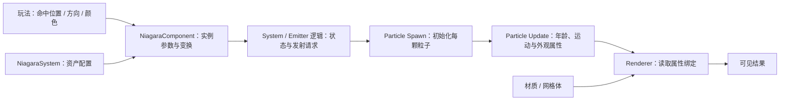

# 01 Niagara 粒子系统基础

> 知识成熟度：L2。主要承诺是官方资料支持的概念、接口边界与教学方案；没有把示例设计当作运行结果。
> 最后更新：2026-10-09。版本基准：2026-10-09 实际读取、页面标题标为 **Unreal Engine 5.8** 的官方文档与 API；Cascade GPU 能力另引用 UE4.27 历史资料。文档 URL 会随官方站点更新，末尾列出本次核对章节，不代表本机安装了 UE5.8。
> 适用范围：普通有状态 Niagara 发射器、客户端视觉表现、编辑器入门与蓝图/C++ 调用。轻量无状态发射器有不同限制，不能直接套用本篇所有模块操作。
> 证据边界：未读取引擎实现源码或本地 `Build.version`，未启动 UE、PIE、目标编译、GPU、性能或网络实验；本文不承诺线程调度细节、跨平台确定性或性能容量。

## 1. 先明确要做什么

以“命中点出现一组短暂火花”为例：玩法提供位置、法线和颜色；特效决定生成几颗粒子、怎么移动、怎么衰减；渲染器把结果画出来。若把这三个职责混在一起，很容易出现参数设置太晚、粒子已经死了组件却没结束、切到 GPU 后事件链失效等问题。

读完本篇，应能完成一个有限寿命的单次特效，并解释：

- System 资产、运行时 Component、Emitter、Particle、Module 和 Renderer 各管什么
- 外部参数在哪里被读取，为什么“设置了值”仍可能不影响已有粒子
- CPU/GPU 选择影响哪些模拟阶段，渲染类型如何另行选择
- 粒子死亡、系统完成、停用组件、归还组件池和销毁组件有什么区别

前置知识是基本材质、Actor/Component 和向量坐标空间。复杂 DI、事件链、流体与性能分析继续阅读[高级技巧](./02-Niagara高级技巧.md)、[VFX 性能优化](./03-VFX性能优化.md)和[流体模拟](./04-Niagara流体模拟.md)；这些链接是后续学习入口，不表示这些文章已经由本篇验证。

## 2. 核心对象与数据流

### 2.1 资产和运行实例分开看

| 对象 | 职责 | 容易混淆的边界 |
| --- | --- | --- |
| `UNiagaraSystem` | 保存整套特效配置，组织发射器及系统级逻辑 | 资产不是场景中正在播放的组件；销毁一个实例不等于删除资产 |
| `UNiagaraComponent` | 在世界中承载一次系统实例，提供变换、参数覆盖与激活控制 | 同一资产可以有多个组件实例，各自接收参数 |
| Emitter | 描述一组粒子的发射、更新与输出；可作为可复用资产或系统中的发射器配置 | 一个 Emitter 可以配置多个 Renderer，不必为每种外观复制模拟 |
| Particle | 一条随模拟变化的属性记录 | 不应把普通 Sprite/Mesh 粒子理解成逐颗生成的 Actor/UObject |
| Module | 在所属执行组中读取输入、运算、写出参数 | Niagara 图、Scratch Pad 与自定义 HLSL 不等同于 Actor 蓝图事件图 |
| Renderer | 读取绑定的属性，产生 Sprite、Mesh、Ribbon 等输出 | 不是粒子更新模块；栈中显示位置不等于最终绘制顺序 |

例如一个爆炸 System 可以有“火焰、烟、碎屑”三个发射器；若两种外观共用同一粒子运动，也可以尝试一个发射器加多个渲染器。前者便于独立控制，后者避免复制部分模拟工作；两者都不能仅凭 System 数量推断 Draw Call 数。对象与模块依据 S1、S7、S10、S12。



这张图是教学数据流，不是引擎线程图。它解释了排查顺序：输入有值，不代表模块读到了；属性正确，不代表渲染器绑定正确；渲染器有输出，也不代表当前视角与质量设置允许显示。

### 2.2 命名空间、绑定与类型

| 命名空间或入口 | 用途 | 入门规则 |
| --- | --- | --- |
| `User.` | 从组件、蓝图、C++ 等传入的外部输入 | 先在资产声明名称与类型，再在模块中绑定实际读取点 |
| `System.` | 系统范围的数据 | 适合整套特效共享状态；不能任意从粒子脚本反写上层状态 |
| `Emitter.` | 发射器范围的数据 | 例如发射器年龄、循环与发射控制 |
| `Particles.` | 每颗粒子的属性 | 例如位置、速度、颜色、年龄 |
| `Engine.` | 引擎提供的上下文 | 按编辑器允许的读写范围使用，不把它当作任意外部参数入口 |

“绑定”是数据依赖，不是按同名自动连线。假设 `Initialize Particle` 的 Color 输入读取 `User.FlashColor`：它只在出生时复制颜色，随后改变 User 值，不会自动重写所有已有粒子的 Color。若设计上要让存活粒子持续变色，应在 Particle Update 中明确读取该值，并处理与其他 Color 模块的覆盖顺序。这里的因果推导来自 Spawn/Update 执行时机（S1、S4、S5）。

参数还必须匹配类型与含义。方向/速度使用 Vector，位置使用 Niagara Position；大世界坐标下不能把 `Particles.Position` 一概写成 `FVector3f`，也不能直接把任意三浮点量当作绝对世界坐标。`SetVariableVec3` 与 `SetVariablePosition` 的选择取决于资产参数类型，二者不能仅因 C++ 都接收 FVector 而混用（S9、S12）。

## 3. 执行组：什么时候写入哪一层数据

### 3.1 Spawn 与 Update

| 执行组 | 对象与时机 | 常见任务 |
| --- | --- | --- |
| System Spawn / Update | 初始化系统 / 系统模拟更新 | 系统级初值和状态逻辑 |
| Emitter Spawn | 发射器初始化 | 发射器级初值 |
| Emitter Update | 发射器模拟 Tick | Emitter State、生成发射请求 |
| Particle Spawn | 每颗新粒子的出生阶段 | Initialize Particle、初始位置/速度/颜色 |
| Particle Update | 粒子的模拟更新阶段 | 年龄与存活、运动、衰减 |
| Event Handler | 接收所配置的事件 | 接收数据并修改或产生粒子 |
| Simulation Stage | 额外配置的模拟工作 | 网格、邻域等高级数据处理，见流体篇 |
| Renderer 组 | 配置输出及属性绑定 | 不作为“最后一段 Particle Update”理解 |

同一执行组内按栈顺序处理模块；不能把整张编辑器视图理解成所有线程每帧顺序执行一次的脚本。暂停、裁剪、预热、手动推进与插值发射会改变观察到的模拟次数。这里的“每帧”指相应模拟更新机会，不保证与屏幕刷新一一对应。初始化也不能被解释为组件对象整个寿命中永远只发生一次；重置/重新初始化需要重新看实例状态。依据 S1–S5、S12。

### 3.2 发射模块管数量，Spawn 组管初值

| 模块 | 生成规则 | 适合的教学用途 |
| --- | --- | --- |
| Spawn Burst Instantaneous | 在设定时机发射一批 | 命中闪光；是否再次爆发取决于循环和时间配置 |
| Spawn Rate | 按时间速率发射 | 烟、喷泉等持续效果 |
| Spawn Per Frame | 每次相应帧/更新发射固定量 | 故意按更新计数的效果；要注意与更新频率耦合 |
| Spawn Per Unit | 根据移动距离发射 | 轨迹采样；还要核对移动量来源与空间 |

发射请求随后交给 Particle Spawn 做逐粒子初始化。`Initialize Particle` 通常放在 Particle Spawn 前部，不是一个每帧重置寿命的 Update 模块。Update 中常见 `Particle State`、`Gravity Force`、`Drag`、`Curl Noise Force`、`Vortex Force`、`Scale Sprite Size`、颜色模块与速度/力求解器；具体模块可用执行组、依赖与名称以资产编辑器为准（S3–S5）。

**正确例：**先在 Spawn 设置初始速度，Update 中按需累积力，再由求解器更新运动。**反例：**把某个持续加速度计算只放在初始化阶段，不能指望它以后每步继续作用；只累积力却没有执行消费该力的求解逻辑，也不能等价于位置已经更新。不要为了复现反例把不支持该执行组的模块强行拖入栈；可用自定义标量追踪练习理解次数：Spawn 把 `Particles.Count` 设为 1，Update 每步加 1，连续两次更新后的手算值为 3。这是读写时机示意，不是 UE 运行输出。

## 4. 属性、空间和外部数据

### 4.1 常用属性怎样参与效果

| 属性 | 意义与使用边界 |
| --- | --- |
| `Particles.Position` / `Velocity` | 位置与速度；位置保留 Position 语义，速度不是位置 |
| `Particles.Color` / `SpriteSize` | 颜色与四边形尺寸；必须有相应渲染器和材质读取 |
| `Particles.Age` / `Lifetime` | 年龄与寿命；年龄增长和死亡策略依赖所用模块 |
| `Particles.NormalizedAge` | 存在，常用于生命周期曲线；通常按 Age/Lifetime 理解 |
| `Particles.Mass` | 供相关力学模块读取；单独设置不产生刚体行为 |
| `Particles.ID` / `UniqueID` | 持久标识与生成标识各有用途，不等于稳定数组下标 |
| `Particles.RibbonID` / `RibbonLinkOrder` | 丝带分组与连接顺序；不能只用生成数猜测连接关系 |
| `Particles.DynamicMaterialParameter` | 四通道数据，非单个 float；还需渲染与材质端对应绑定 |
| `Particles.MeshOrientation` | Mesh 朝向属性；使用匹配的朝向输入和绑定 |

属性是学习层面的数据模型，不代表本文已核对 CPU/GPU 缓冲区布局、SoA 实现或 Free List 回收算法。普通粒子死亡只是退出活跃模拟，不应从中推出组件已经销毁、系统已经结束或组件池已经归还。属性与绑定依据 S5、S7、S9。

归一化年龄举例：寿命 0.5 秒、年龄 0.25 秒时，曲线输入为 0.5。自定义计算必须规定 Lifetime 非正时怎么办；不要用一个除零结果去驱动尺寸。若关闭按寿命杀死粒子的选项，粒子也不会仅因属性名叫 Lifetime 就自动遵守期待的死亡时刻。基础模板应显式保留 `Particle State` 的年龄/寿命处理。

外观衰减可以让尺寸/颜色模块读取 NormalizedAge 曲线，例如将初始 Alpha 乘以 `1 - clamp(NormalizedAge, 0, 1)`；年龄走到一半时透明度因子为 0.5。透明度变为零只是看不见，不等于粒子已经死亡。要按空间结束粒子，可用 `Kill Particles in Volume` 配置体积和内/外条件；其结果可反转，不能固定解释成“只杀区域外”。模块依赖与插值发射要求仍要按实际资产核对（S5）。

### 4.2 Local Space、附着和确定性

Local Space 决定粒子模拟相对组件还是采用世界空间语义；`Spawn System Attached` 决定组件跟随哪个父组件或插槽。它们是两项独立选择：组件附着到手掌，同时让已出生的粒子留在世界中，可以形成运动尾迹；让粒子处在 Local Space，则更适合随手掌整体移动的光团。不能用“拖尾必须局部空间”或“局部空间必然抖动”代替设计判断。大世界下的内部模拟坐标还应遵循 Position 转换规则（S6、S9、S11）。

Determinism 控制随机过程的可重复性；还要约束种子、脚本、输入与时间步长。勾选它不会自动启用网络复制、锁定帧步长或证明不同机器逐位相同。回放与联机若依赖视觉重现，需要另行记录输入和验证；玩法结果不应由装饰性粒子随机数裁决（S6）。

### 4.3 Data Interface 解决的是数据访问

DI 提供访问数据的函数，而不是“任何平台都能调用的免费桥梁”。先确定数据来自哪里、何时更新、CPU/GPU 是否支持，再选择模块。常见用途包括：

- Skeletal Mesh / Static Mesh：采样骨骼、插槽、表面，生成贴附或散落效果
- Spline、Curve、Noise、Audio Spectrum：沿路径分布、按曲线或信号驱动
- Collision Query：给碰撞相关模块提供查询能力；碰撞事件还需另行配置
- Render Target、Grid、Neighbor Grid：纹理/网格演化与邻域处理，属于高级篇/流体篇范围
- Particle Attribute Reader、Export Particle Data：读取其他粒子数据，或把受支持数据交给外部接收者

例如“读取骨骼表面位置”本身不会保证角色销毁后数据仍可用；“能取到碰撞信息”也不等于已生成可被另一发射器接收的事件。这里保留选择入口，不列未经逐项核对的函数名或声称所有 DI 两端均受支持。依据 S1、S5、S8、S15。

## 5. CPU/GPU 与 Renderer 是两次选择

### 5.1 先确认功能约束，再比较成本

| 问题 | CPU 模拟 | GPU 模拟 |
| --- | --- | --- |
| 哪些工作受 Sim Target 影响 | 粒子模拟由 CPU 执行 | 主要改变 Particle Spawn/Update 与相关 Simulation Stage 的目标；System/Emitter 仍有 CPU 工作 |
| 标准 Niagara Events / Event Handler | 可按模块与 Persistent ID 要求配置 | 本次官方事件文档不支持这条事件处理路径 |
| 外部读取粒子数据 | 仍需规定访问接口和时机，不能拿任意内部数据地址 | Export DI 等有专门路径，可能有延迟；不能称为“不可能回读” |
| 选择依据 | 功能、模拟负载、实例数、现有 CPU 预算 | 功能、GPU/显存预算、平台与渲染负载 |

本篇选择 CPU 作为小型入门练习的起点，方便单独理解阶段和参数；这不是“低于一万颗必须 CPU”的阈值规则。粒子数量不能独自决定瓶颈，减少模拟耗时也不保证半透明绘制成本下降。跨目标迁移要重新检查 DI、事件、碰撞、边界和平台支持。依据 S8、S10、S15。

Fixed Bounds 用于描述效果可能占据的范围，以便裁剪。GPU 入门教程要求给示例设置边界；设置过小会错误裁剪，设得过大会削弱裁剪效果。不能把它讲成 GPU 粒子容量配额，也不能规定所有效果一律使用同样的大盒子。移动范围很长的效果尤其需要结合轨迹与实际边界策略判断（S10、S22）。

### 5.2 选择如何表现粒子

| Renderer | 可用来表现什么 | 首先检查什么 |
| --- | --- | --- |
| Sprite | 火花、烟雾、火焰等面片 | 材质、尺寸、Facing/Alignment；面向相机是模式之一 |
| Mesh | 碎屑、花瓣等网格外观 | Mesh、材质及位置/朝向/缩放绑定 |
| Ribbon | 拖尾、丝带、束状效果 | 分组、连接顺序、宽度、朝向与 UV |
| Light | 粒子驱动光照 | 数量、半径与受影响区域的预算 |
| Component | 由粒子数据驱动组件属性 | 组件类型、数量上限、绑定和创建成本 |

“Screen Facing Ribbon”是 Ribbon 的朝向设置，不是额外的“2D Ribbon”渲染器类别。Mesh 粒子也不会自动成为独立碰撞刚体。材质负责着色、透明度与 SubUV 等外观计算，Renderer 负责把粒子数据提供给相应输出；仅改 `Particles.Color` 不保证不使用 Particle Color 的材质跟着变化。S7 列表另含 Decal Renderer，本文不展开其配置。

## 6. 有限效果与组件生命周期

### 6.1 四个不同的“结束”

1. **粒子死亡**：例如 `Particle State` 根据寿命让这颗粒子退出模拟；其他粒子仍可能存在
2. **Emitter/System 完成**：由循环、执行状态、存活粒子与资产逻辑共同决定；一次 Burst 不代表整个 System 必定是一次性
3. **组件停止或收到完成通知**：`Deactivate()`、立即停止与 `OnSystemFinished` 是不同入口/通知；不要互相替代
4. **组件资源处置**：复用、自动销毁、归还池或显式销毁，取决于创建策略和管理责任

`Emitter State` 的 Inactive Response 明确区分 Complete、Kill 与 Continue。因此不能无条件承诺“Deactivate 永远让所有旧粒子自然播完”。要先确定谁管理生命周期、停用后的响应，以及是否有无限循环或其他发射器继续运行（S3）。

有限命中特效的设计条件是：不再循环地产生新粒子；每颗粒子有有限寿命与有效死亡逻辑；停发后允许系统完成。相反，循环火焰即使任意时刻每颗粒子寿命只有 0.5 秒，也可能一直补充新粒子，永远不自然完成。

### 6.2 谁管理组件，与它跟随谁不是同一问题

Actor 自带的 Niagara Component 适合“这个角色存活期间一直拥有的效果”。World Location 生成适合场景中的一次表现；Attached 生成适合跟随组件/插槽。选择 Attached 时仍需确定组件管理方式和结束路径，不能只凭附着关系或传入 `this` 就断言调用者取得对象所有权。`WorldContextObject` 是世界上下文输入，`AttachToComponent` 是附着输入；Owner 可通过组件的归属链查询（S11、S17、S18）。

若需要跟随 Actor 生命周期、随时更新并明确取消，入门阶段可在 Actor 蓝图里添加 Niagara Component，关闭 Auto Activate，在 BeginPlay/明确事件中设置参数再激活，在取消/EndPlay 路径清理应用侧句柄与监听。运行时自行创建组件还涉及注册；不能只有 `NewObject` 就假定它已进入场景（S17）。

### 6.3 池化是组件复用合同

| 创建/管理策略 | 使用范围 | 结束时的责任 |
| --- | --- | --- |
| `None` + Auto Destroy | 单次有限效果 | 完成后自动销毁；调用侧不把返回指针当长期句柄 |
| `None` + 不自动销毁 | 持续控制或计划重复激活 | 管理者安排停止、复用或销毁；完成通知本身不释放管理责任 |
| `AutoRelease` | 配置后即放手的池化单次效果 | 自动归还池；官方枚举说明警告不要在生成 tick 之后继续交互 |
| `ManualRelease` | 需要跨帧调参的池化效果 | 使用方最终调用 `ReleaseToPool()`；调用后立即放弃交互，即使对象仍有效 |

这里“使用方管理”是池化使用合同，不是把 UObject 的 Outer 改成调用者。组件池与粒子属性存储不是同一个池。`ReleaseToPool()` 不等于对 UObject 执行 `delete`，也不能用 `DestroyComponent()` 混作池化归还。归还后，非空指针乃至弱引用仍然有效，都不能证明该组件仍属于上一次效果。复用期间参数是否重置、内部归还与委托广播顺序，本篇未读实现，不作保证（S10、S13、S14）。

销毁也不同于“内存立刻消失”：`UActorComponent::DestroyComponent` 的公开说明是注销、移出所属 Actor 的组件数组并标记待销毁。对非池化组件执行显式销毁前要先停止应用侧继续调用它；对池化组件则遵守池接口（S18）。

### 6.4 完成回调能证明什么

`OnSystemFinished` 通知的是特效系统完成，不是“所有 gameplay 工作必定成功”的证明。绑定应发生在第一次激活前；有限效果也可能因为创建失败、剔除、取消、关卡退出或监听对象生命周期而无法走完你期待的普通播放流程。应用必须有这些路径的单独处理，不能无限等待回调来结算伤害或解除唯一资源锁（S12、S16；异常处理是应用设计约束）。

在蓝图中，从返回的 Niagara Component 绑定 `On System Finished` 生成匹配的事件节点。先在非池化有限例中验证普通完成；不要直接把示例切成 AutoRelease 后保存组件跨帧修改，或在完成处理里同时手动 Destroy 与 Release。需要连锁视觉时，也要允许前段未播放时跳过/取消链路；游戏规则由独立状态控制。

### 6.5 常用控制接口速查

| 入口 | 合理用途与边界 |
| --- | --- |
| `Activate(bool bReset)` / `Deactivate()` | 激活、请求停用；结束方式结合资产状态判断 |
| `SetAutoActivate(bool)` | 控制自动激活意图；基类文档限定在构造脚本阶段安全使用，不当作运行时启停接口 |
| `IsActive()` | 活跃状态查询，不能代替“上一轮已经完成且已归还池”判断 |
| `SetPaused(bool)` | 暂停/恢复，不等价于完成或销毁 |
| `AdvanceSimulation(int32 TickCount, float TickDeltaSeconds)` | 按步数与时间步推进；不是传入 TickGroup 的接口 |
| `ReinitializeSystem()` / `SetAsset(...)` | 重新初始化或切换资产；须重新核对参数与实例状态 |
| `SetLODDistance(float InLODDistance, float InMaxLODDistance)` | 公开签名有两个距离参数；本次未读实现，不据名称推出模块组合切换规则 |
| `OnSystemFinished` | 完成通知；与粒子 Death Event 分属组件层和粒子事件层 |

这些是公开 API 级定位（S12、S18），不是源码调用链。质量/距离控制应从 Effect Type、可扩展性和项目策略理解。另有 `SetPreviewLODDistance(bool, float, float)`，不能将它与上表距离接口混为一谈，也不能仅据签名承诺通用的运行时模块组合切换。

## 7. 最小教学例：一束可结束的命中火花

以下是**未运行的制作与验证方案**。数值只用于追踪逻辑，不是生产效果或性能预算。初版故意让 8 颗粒子同向重合，便于隔离参数错误；因此画面可能看起来只像一个亮点，应通过粒子数观察而非肉眼数点。确认机制后再添加空间分布。

### 7.1 资产配置

在内容浏览器选择 FX → Niagara System，从可用的普通 CPU Sprite 模板或普通发射器建立 `NS_Hit_Basics`。保留单个发射器，清楚检查模板遗留配置，然后完成以下合同：

| 位置 | 明确设置 |
| --- | --- |
| Emitter Properties | CPU 模拟，Local Space 关闭；初版不使用插值发射、事件、碰撞、预热 |
| System State | Loop Behavior=Once，Loop Duration=0.1 秒，Inactive Response=Complete；不使用无限循环 |
| Emitter State | Life Cycle Mode=Self，Loop Behavior=Once，Loop Duration=0.1 秒，Inactive Response=Complete |
| Emitter Update | 一个 Spawn Burst Instantaneous：Time=0，Count=8；去掉持续 Spawn Rate |
| User Parameters | `User.Speed` 为 Float=100；`User.ImpactNormal` 为 Vector=(0,0,1)；`User.FlashColor` 为 Linear Color=红色 |
| Particle Spawn | Initialize Particle：Lifetime=0.5 秒、SpriteSize=(10,10)、Color 绑定 FlashColor；粒子初始位置使用系统位置 |
| Particle Spawn 后续 | 在允许的 Set Parameters/模块输入中将 Velocity 设为 `User.ImpactNormal * User.Speed`；不要再叠加模板遗留速度 |
| Particle Update | Particle State 保留年龄和按寿命死亡；用 Solve Forces and Velocity 更新位置；初版不加重力、阻力和噪声 |
| Renderer | 一个 Sprite Renderer，正确绑定 Color/Position/Size；材质使用 Particle Color，Alpha 非零 |

模块之间若出现依赖错误，先依据提示检查是否缺少初始化/求解器或放错阶段，再预览；不要隐藏错误继续做参数测试。模板名称和 UI 排列会变化，上表的输入、类型、读取点和有限生命周期才是复现条件（S1、S3–S5、S7）。

验证时可从 Tools → Debug → Niagara Debugger 打开工具，或在编辑器中 Watch Emitter/Watch Parameter；将过滤器限定到 `NS_Hit_Basics`，查看粒子数量、执行状态、边界和少量粒子属性。确认没有启用调试器的强制 Loop，否则一次性效果也会被反复播放。这里介绍的是后续观察方法，本次没有打开工具或改变设置（S23）。

**手算预期：**以出生时刻为 t=0、关闭力与额外速度改写，位置沿法线以 100 cm/s 变化；t=0.25 秒相对出生位置前进 25 cm，NormalizedAge 为 0.5；寿命终止后不再补发。实际结果需在 UE 里记录采样时刻和模拟设置，不能把这个连续匀速计算当作逐帧实测。把 Count 设为 0 时应没有可见粒子；把 Speed 设为 0 时应留在出生位置。

### 7.2 蓝图调用顺序

```text
收到已由玩法确认的命中信息
  → Spawn System at Location
      Asset = NS_Hit_Basics
      Location = 命中世界位置
      Auto Activate = false
      Auto Destroy = true
      Pooling Method = None
  → 检查返回组件是否有效；无效则跳过本次视觉表现
  → Set Niagara Variable (Float): User.Speed
  → Set Niagara Variable (Vector3): User.ImpactNormal，传入单位方向
  → Set Niagara Variable (Linear Color): User.FlashColor
  → 如需记录完成，先绑定 On System Finished
  → Activate
```

先禁止自动激活，是为了让出生阶段在明确初始化后读取参数。反例是先激活、之后才给速度和颜色赋值：Spawn-only 输入可能已经被使用，之后的赋值不能追溯改变那次出生。另一反例是只声明 User 参数却没有在模块中读取，调用 setter 成功也不会改变画面。

改为 Attached 时，给出真实父组件、存在的插槽及合适的附着变换规则，同时重新决定 Local Space。调用返回空或被裁剪时，保持玩法流程继续，不在当帧反复创建直到“看见”为止。

### 7.3 C++：只演示设置后激活

这是调用节选，未经过 UBT/UHT 编译或 PIE；使用已启用 Niagara 的 C++ 项目，调用所在模块需声明 Niagara 依赖，Core/CoreUObject/Engine 等项目基础依赖也需存在。输入位置、方向与颜色约定为有限数值；`System` 是调用者已解析并保持有效的资产，不在命中时同步加载硬编码资源路径。API 参数顺序与三个 setter 对照 S11、S12；函数返回值只表示已发出激活请求，不表示必定可见或完成。

```cpp
#include "CoreMinimal.h"
#include "NiagaraComponent.h"
#include "NiagaraFunctionLibrary.h"
#include "NiagaraSystem.h"

bool PlayHitVisual(
    UObject* WorldContextObject,
    UNiagaraSystem* System,
    const FVector& HitLocation,
    const FVector& HitNormal,
    const FLinearColor& FlashColor)
{
    if (!IsValid(WorldContextObject) || !IsValid(System))
    {
        return false;
    }

    UNiagaraComponent* FX = UNiagaraFunctionLibrary::SpawnSystemAtLocation(
        WorldContextObject, System, HitLocation,
        FRotator::ZeroRotator, FVector::OneVector,
        true,                  // bAutoDestroy：非池化有限效果
        false,                 // bAutoActivate：先设参数
        ENCPoolMethod::None,
        true);                 // bPreCullCheck：仍检查返回值

    if (!IsValid(FX))
    {
        return false;
    }

    FVector Direction = HitNormal.GetSafeNormal();
    if (Direction.IsNearlyZero())
    {
        Direction = FVector::UpVector;
    }
    FX->SetVariableFloat(FName(TEXT("User.Speed")), 100.0f);
    FX->SetVariableVec3(FName(TEXT("User.ImpactNormal")), Direction);
    FX->SetVariableLinearColor(FName(TEXT("User.FlashColor")), FlashColor);
    FX->Activate(true);
    return true;
}
```

这里不返回组件作为长期控制句柄，也不演示混合回收策略。若工程需要完成回调，先在自己的 UObject/Actor 类中声明与实际委托匹配的处理函数，并在激活前绑定；若需要跨帧取消或更新，则改为明确管理的非池化组件或 ManualRelease 合同，同时实现退出路径。`OnSystemFinished` 的公开类型页面未提供完整参数宏，本篇不把未经头文件/编译核对的手写委托声明当作已验证代码。

## 8. 标准事件链与 Cascade 迁移

### 8.1 从一个发射器触发另一个

标准 Niagara 事件至少需要“生成者、事件数据、接收者”。以 CPU 火箭粒子死亡后产生爆点为教学扩展：在来源发射器满足 Persistent ID 要求后配置 Generate Death Event，在目标发射器添加 Event Handler Properties、选择对应 Source，再添加匹配的 Receive 模块及出生初始化。只有粒子寿命到达但没有生成模块，不会自动出现完整事件链；只有生成者没有接收者，也不会凭空产生次级粒子（S8）。

碰撞链还要先有有效 Collision 模块。CPU 与 GPU 的碰撞来源和限制不同；把 Sim Target 切成 GPU 后不能保留“标准 Event Handler 一定照常工作”的期待。Data Channel、Attribute Reader、Export DI 是另外的数据机制，不把它们的 GPU 能力套到标准事件组上。次级视觉事件也不能替代服务器/玩法的权威碰撞与伤害判断。

### 8.2 迁移不是一键行为等价

Niagara 的优势是可组合脚本、参数与 DI 的数据流，而不是“Cascade 从未有 GPU、事件或 LOD”。历史 UE4.27 文档明确存在 Cascade GPU Sprites；本次读取的转换器文档也仍讨论 Cascade 资产及未来移除，不能据此写“所有 UE5 已删除 Cascade”（S19、S20）。

迁移时保留原资产，使用转换器生成新 Niagara 资产，再看转换日志及未支持项。重点比较发射数量/时序、局部空间、寿命曲线、材质、Ribbon UV、事件链和距离质量变化；官方表指出有事件模块、Beam/AnimTrail 等未支持项，Ribbon/LOD 转换也有限制。处理完警告后仍要在目标项目逐项对照外观与结束行为，转换成功不是等价证明。新项目可从 Niagara 开始，旧内容的迁移优先级取决于维护成本与具体需求。

## 9. 实践与故障排查

资产命名如 `NS_`、`NE_` 可作为项目约定，不是引擎强制前缀。只把需要外部控制的输入暴露成 `User.`，内部常量和模块默认值仍有价值；暴露所有值会让参数合同难以维护。先做最小可见、可结束的效果，再逐个加入碰撞、事件、GPU 和复用策略，便于定位是哪一项改变了结果。

| 现象 | 先查什么 | 为什么 |
| --- | --- | --- |
| 完全看不见 | 资产/返回组件、发射数、寿命、尺寸/Alpha、材质与 Renderer | 区分没有粒子和粒子存在但没有可见输出 |
| 参数变了却没变化 | 名称、类型、实例、模块绑定、读的是 Spawn 还是 Update | 输入覆盖与读取点不是同一件事 |
| 移动角色后效果偏移 | Attached 变换、Local Space、Position 类型/空间转换 | 坐标来源和模拟空间可能不一致 |
| 离开画面边缘突然消失 | Bounds、距离/可见性裁剪、质量与平台覆盖 | 裁剪依据可能没有包住实际效果 |
| Burst 播完却不触发完成 | 系统/发射器循环、其他发射器、Inactive Response、死亡逻辑 | 可见粒子清空不必然代表系统完成 |
| GPU 后事件链失效 | 是否仍依赖标准事件组，DI/碰撞是否支持 | 模拟目标会改变可用路径 |
| 持续粒子数很高 | Rate、Lifetime、循环、事件产生的额外粒子 | 可用 Rate×平均寿命估计稳定存活量，但不是精确容量公式 |
| 偶尔改到了别的特效 | 是否持有已 AutoRelease/ReleaseToPool 的组件 | 池中对象可能已经被另一实例使用 |
| 移动端缺失或慢 | 实际平台/RHI、设备配置、材质/DI/模拟支持与质量档 | 编辑器预览和泛泛的 ES3.1 标签不能证明设备兼容 |

Rate×寿命的估算假设恒定发射、寿命分布稳定且没有事件补发/裁剪等改变；Burst 峰值、存活数、累计生成数与分配容量必须分开记录。可见性异常时先验证输入与边界，再决定是否做性能分析，不靠无限扩大边界或关闭全部裁剪掩盖问题。

官方 Content Examples 可用作模板组合的学习材料；应选择与项目版本相符的样例，并记录实际资产配置。把相似模拟合并为一个发射器、多渲染器或池化，都是需要测量的优化候选，不能承诺一定更少 Draw Call 或一定更快（S10、S15）。

## 10. 尚未执行的验证计划

本次只完成文档/API 静态核对，下面各项均**未运行**。要提升到运行或测试证据，需要在实际项目记录 UE 完整版本、平台/RHI、资产配置、构建目标、操作步骤、原始日志与观察结果。

| 验证对象 | 输入/操作 | 应观察的结果或反例 |
| --- | --- | --- |
| 最小资产 | 第 7 节的 8 粒子、0.5 秒寿命、一次 Burst | 数量与方向符合配置，停止发射后能完成；保存实际完成时间 |
| 初值时机 | 激活前/激活后改 Spawn-only 颜色；另做 Update 读取版本 | 解释已有粒子与后来出生粒子的不同，不能只看一帧截图 |
| 无效输入 | 空资产、零方向、Count=0 | 调用方不崩溃；零方向使用约定退路；无可见粒子不阻塞玩法 |
| 回调边界 | 普通完成、循环资产、取消、组件销毁、关卡退出 | 记录各路径是否通知；应用侧不能依赖每次都回调 |
| 坐标 | Attached 与世界位置生成，分别比较 Local/World Space | 观察组件移动与已生粒子的关系；另测大世界位置类型 |
| 事件路径 | CPU 配置生成/接收，再做缺生成者、缺接收者等反例 | 标准事件链只在满足合同的条件下生效 |
| 组件复用 | 分别验证 None、AutoRelease、ManualRelease | 参数串用、重复释放和旧句柄使用应由应用设计防止；记录释放路径 |
| 可见性/平台 | 正常与过小边界、目标平台质量档 | 分清错误裁剪、平台不支持和没有发射 |
| C++ 集成 | 项目声明依赖后编译节选并在客户端触发 | 通过真实编译与运行才可称接口集成可用 |

标准事件、GPU/DI 兼容性与性能的进一步验证应在获得相应环境和执行范围后进行。本篇没有运行这些验证，也没有使用模型或合成计时来替代 UE 结果。

## 11. 官方来源与实际核对范围

核对日期为 2026-10-09。除 S20 为 UE4.27 历史页，以下成功读取页的标题均标为 UE5.8；Python 枚举页保留其 Experimental API 文档身份，仅用作枚举契约资料。API 页的 Header File 栏是官方定位，不能算本次读取了该头文件或实现。未成功读取的版本化入口不支撑正文结论。

| 编号 | 官方来源 | 本次使用的范围 |
| --- | --- | --- |
| S1 | [Niagara Overview](https://dev.epicgames.com/documentation/en-us/unreal-engine/overview-of-niagara-effects-for-unreal-engine) | 核心对象、模块数据流、参数、创建流程；不把页中遗留 UE4 措辞扩写为版本结论 |
| S2 | [System Spawn](https://dev.epicgames.com/documentation/en-us/unreal-engine/system-spawn-group-reference-for-niagara-effects-in-unreal-engine)、[System Update](https://dev.epicgames.com/documentation/en-us/unreal-engine/system-update-group-reference-for-niagara-effects-in-unreal-engine) | 执行组开头与系统状态说明 |
| S3 | [Emitter Update](https://dev.epicgames.com/documentation/en-us/unreal-engine/emitter-update-group-reference-for-niagara-effects-in-unreal-engine) | Emitter State、Inactive Response、循环与发射模块 |
| S4 | [Particle Spawn](https://dev.epicgames.com/documentation/en-us/unreal-engine/particle-spawn-group-reference-for-niagara-effects-in-unreal-engine) | 出生执行、Initialize Particle、初始力/速度与依赖 |
| S5 | [Particle Update](https://dev.epicgames.com/documentation/en-us/unreal-engine/particle-update-group-reference-for-niagara-effects-in-unreal-engine) | 力/求解、Particle State、年龄、Dynamic Material Parameter、ID、Ribbon 属性及 DI 类型表 |
| S6 | [Emitter Settings](https://dev.epicgames.com/documentation/en-us/unreal-engine/emitter-settings-reference-for-niagara-effects-in-unreal-engine) | Local Space、Determinism、Sim Target、插值发射与 Persistent ID |
| S7 | [Niagara Renderers](https://dev.epicgames.com/documentation/en-us/unreal-engine/render-module-reference-for-niagara-effects-in-unreal-engine) | Renderer 列表、Component 限制、Sprite/Light/Mesh/Ribbon 及绑定 |
| S8 | [Events and Event Handlers](https://dev.epicgames.com/documentation/en-us/unreal-engine/events-and-event-handlers-in-niagara-effects-for-unreal-engine) | CPU 限制、生成者、Persistent ID、接收设置与事件种类 |
| S9 | [Large World Coordinates in Niagara](https://dev.epicgames.com/documentation/en-us/unreal-engine/large-world-coordinates-in-niagara-for-unreal-engine) | Position/Vector 区别与空间解释；没有执行页面中的设置或测试步骤 |
| S10 | [Scalability and Best Practices](https://dev.epicgames.com/documentation/en-us/unreal-engine/scalability-and-best-practices-for-niagara) | 发射器成本、GPU/CPU 范围、多个 Renderer、组件池与 Bounds；没有实测性能 |
| S11 | [UNiagaraFunctionLibrary](https://dev.epicgames.com/documentation/unreal-engine/API/Plugins/Niagara/UNiagaraFunctionLibrary) | SpawnSystemAtLocation、SpawnSystemAttached 的公开签名 |
| S12 | [UNiagaraComponent](https://dev.epicgames.com/documentation/unreal-engine/API/Plugins/Niagara/UNiagaraComponent) | OnSystemFinished、参数 setter、Activate/Deactivate、AdvanceSimulation 与生命周期相关 API；不含实现 |
| S13 | [ENCPoolMethod](https://dev.epicgames.com/documentation/unreal-engine/API/Plugins/Niagara/ENCPoolMethod?lang=en-US) | None、AutoRelease、ManualRelease 公共枚举 |
| S14 | [NCPoolMethod 反射 API](https://dev.epicgames.com/documentation/en-us/unreal-engine/python-api/class/NCPoolMethod) | AutoRelease 生成 tick 之后交互警告、ManualRelease 归还责任 |
| S15 | [Audio Effects：Exporting Particle Data](https://dev.epicgames.com/documentation/unreal-engine/how-to-create-audio-effects-in-niagara-for-unreal-engine?lang=en-US) | Export DI 对 GPU 的支持、延迟与使用成本；没有实现音频系统 |
| S16 | [FOnNiagaraSystemFinished](https://dev.epicgames.com/documentation/unreal-engine/API/Plugins/Niagara/FOnNiagaraSystemFinished) | 仅完成通知含义；页面没有给出完整委托参数宏 |
| S17 | [Components](https://dev.epicgames.com/documentation/en-us/unreal-engine/components-in-unreal-engine) | Actor/Scene/Primitive Component 职责与注册 |
| S18 | [UActorComponent](https://dev.epicgames.com/documentation/unreal-engine/API/Runtime/Engine/UActorComponent) | GetOwner、IsActive、DestroyComponent、EndPlay 的公开说明 |
| S19 | [Cascade to Niagara Converter](https://dev.epicgames.com/documentation/en-us/unreal-engine/cascade-to-niagara-effects-converter-plugin-for-unreal-engine) | 新资产/转换日志、迁移限制与未来移除措辞 |
| S20 | [UE4.27 GPUSprites Type Data](https://dev.epicgames.com/documentation/en-us/unreal-engine/gpusprites-type-data?application_version=4.27) | 只用于证明历史 Cascade 有 GPU Sprites；不沿用旧移动设备兼容表 |
| S21 | [Lightweight Emitters](https://dev.epicgames.com/documentation/en-us/unreal-engine/niagara-lightweight-emitters-overview) | 无状态发射器的固定功能与自定义模块限制 |
| S22 | [GPU Sprite Effect](https://dev.epicgames.com/documentation/en-us/unreal-engine/how-to-create-a-gpu-sprite-effect-in-niagara-for-unreal-engine) | GPU 示例的 Sim Target 与 Fixed Bounds 要求；未运行示例 |
| S23 | [Niagara Debugger](https://dev.epicgames.com/documentation/unreal-engine/niagara-debugger-for-unreal-engine) | 打开/观察入口、HUD 属性与状态、Loop 控制；没有执行其性能、GPU 回读或设置操作 |

## 12. 关联阅读

- [特效粒子与流体仿真目录](./README.md)：本分类导航
- [02 Niagara 高级技巧](./02-Niagara高级技巧.md)：DI、事件与交互的后续主题
- [03 VFX 性能优化](./03-VFX性能优化.md)：预算、裁剪与分析的后续主题
- [04 Niagara 流体模拟](./04-Niagara流体模拟.md)：网格与 Simulation Stage 的后续主题
- [17 Niagara 源码](./17-Niagara源码.md)：实现层阅读入口；本篇未核对其中实现结论
- [材质系统详解](../材质地形与世界表现/02-材质系统详解.md)：透明度、着色与粒子材质基础
