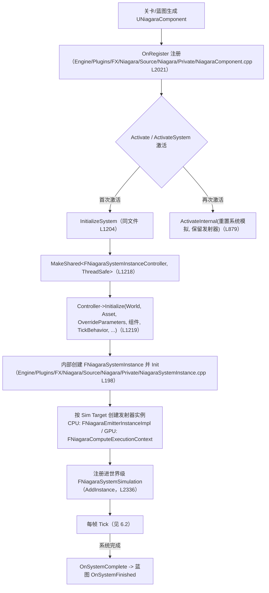
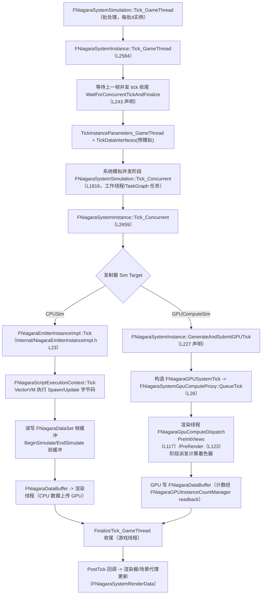
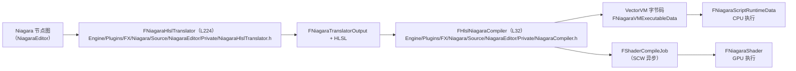

# UE 引擎源码分析 17：Niagara 源码剖析（UE 5.8）
> 知识成熟度：L2（本轮审计修订时补标）
> 版本基准：UE 5.8.0（本机 `Engine/Build/Build.version`：Major 5 / Minor 8 / Patch 0 / CL 55116800，分支 `++UE5+Release-5.8`）。
> 源码依据：本轮补深的逐行引用均取自 5.8.2 checkout `C:\Users\zhaozhiqi\Documents\GitHub\UnrealEngine`（分支 `UE5`，`CompatibleChangelist 55116800`）。
> Niagara 运行时与编辑器位于 `Engine/Plugins/FX/Niagara/Source`，VectorVM 依赖位于 `Engine/Source/Runtime/VectorVM/Public/VectorVM.h`。
> 适用范围：编辑器资产编译、客户端/服务端运行时系统实例、CPU VectorVM、GPU Compute 与渲染线程派发；GPU 模拟和渲染部分仍需按目标平台能力单独验收。
> 兼容性边界：UE 4.27 及 UE 5.0–5.7 仅作为迁移背景；插件目录、实例实现拆分和编译器私有类均以 UE 5.8 实际源码为准，不承诺跨版本 ABI。
> 官方参考：[Unreal Engine 官方文档总页](https://dev.epicgames.com/documentation/en-us/unreal-engine)。
> 最后更新：2026-09-15（补深：把 29 个源码块改为 5.8.2 checkout 按行区间机械抽取的逐字节选，逐块补「摘自 <完整相对路径>（第 N 行起）」引用句，修正 3 处行号不符、新增 3.10 批处理与 DataSet 双缓冲小节）。

> 行号口径：下文所有行号以 **5.8.2 checkout**（`C:\Users\zhaozhiqi\Documents\GitHub\UnrealEngine`）为准；安装版 **UE 5.8.0（CL 55116800）** 同名文件可能相差数行，定位请以「符号名 + 引用句」为主、行号为辅。

> 对应知识点：[11-VFX与Niagara/01-Niagara粒子系统基础](01-Niagara粒子系统基础.md)
>
> 适用版本：UE 5.8（`Build.version` 实测：MajorVersion 5 / MinorVersion 8 / Changelist 55116800 / BranchName `++UE5+Release-5.8`）。
> 源码根目录：`C:\Program Files\Epic Games\UE_5.8\Engine\Plugins\FX\Niagara\Source`（注意是 **Plugins\FX\Niagara**，
> 不是网上老教程常见的 `Engine\Source\Runtime\Niagara`；本机 5.8 不存在 Runtime 版 Niagara 目录）。
> 文中所有类名 / 函数名 / 文件行号均在 5.8.2 checkout 上逐块机械抽取并复核（本轮补深）；
> 标「摘自 <完整相对路径>（第 N 行起）」的代码块是从该文件按行区间逐字抽取后仅做节选裁剪，未改动任何符号；
> 标「作者示例（非引擎源码）」的 Mermaid / 文本图仅用于表达调用关系，不是源码逐字节选。
>
> 特别提示：UE 5.8 的 Niagara 头文件布局与 UE4 ~ UE5.3 时代的老教程差异很大，例如：
> `NiagaraComponent.h` 已从 `Classes/` 移到 `Public/`；`NiagaraDataSet.h` 仍留在 `Classes/`；
> 5.3 时代的 `FNiagaraSystemInstanceImpl` 在 5.8 已不存在（实现合并回 `FNiagaraSystemInstance`，另有
> `Internal/NiagaraEmitterInstanceImpl.h` 承载发射器实现）；编译器 `FHlslNiagaraCompiler` 位于
> `NiagaraEditor/Private/`。本文一律以 5.8 实测为准，不沿用记忆中的旧名。

## 一、概述

### 1.1 本篇回答的问题

- 一个 `UNiagaraComponent` 挂到场景里之后，到底是谁在驱动它每帧模拟？组件与 `FNiagaraSystemInstance` 之间为什么隔着一个 `FNiagaraSystemInstanceController`？
- 5.8 里「CPU 模拟」和「GPU 模拟」分别由哪些类执行？粒子数据存在哪里？
- `FNiagaraDataSet` 和 `FNiagaraDataBuffer` 是什么关系？为什么说 Niagara 的数据是「帧缓冲」式的？
- 蓝图里拖出来的各种「数据接口」（骨骼网格、粒子读取、RenderTarget 等）在 C++ 层是什么结构、如何被调用？
- Niagara 资产从节点图到可执行的 VM 字节码 / HLSL，经过了哪些类？（`FNiagaraHlslTranslator` → `FHlslNiagaraCompiler`）
- 5.8 的 Niagara 有哪些关键类清单（全部为本机源码验证，非记忆中的 UE4 旧名）？

### 1.2 与知识库文章的对应关系

| 知识库文章 | 讲清了什么 | 本篇补充的源码层内容 |
| --- | --- | --- |
| [11-VFX与Niagara/01-Niagara粒子系统基础](01-Niagara粒子系统基础.md) | Niagara 是什么、组件/系统/发射器/模块的层级概念、与 Cascade 的区别 | `UNiagaraComponent`→`FNiagaraSystemInstanceController`→`FNiagaraSystemInstance` 的真实调用链与每帧流程 |
| 11-VFX与Niagara 后续文章（若存在） | 具体模块用法、参数与数据接口操作 | `UNiagaraDataInterface` 基类虚函数、常用子类真实头文件位置 |

建议先读知识库概念文章，再读本篇；两者配合可以回答「Niagara 为什么这样跑」与「性能问题该查哪个类」两类问题。

### 1.3 5.8 目录结构变化速览（与网上老教程最大的差异点）

- Niagara 是 **插件**：源码在 `Engine/Plugins/FX/Niagara/Source`，模块有 `Niagara`（运行时）、`NiagaraCore`、
  `NiagaraShader`（着色器绑定）、`NiagaraVertexFactories`（渲染工厂）、`NiagaraEditor`（编辑器/编译）等。
- `Niagara/Classes/` 与 `Niagara/Public/` 并存：UPROPERTY 反射类（UObject 类）多在 `Classes/`，
  纯 C++ 结构/类（`FNiagaraSystemInstance`、`FNiagaraSystemSimulation`、`FNiagaraSystemInstanceController`）在 `Public/`；
  但 `FNiagaraDataSet`、`FNiagaraEmitterInstance`、`FNiagaraScriptExecutionContext` 等又在 `Classes/`——
  因此定位文件时以实际路径为准，不能只凭目录名猜。
- 新增 `Niagara/Internal/` 目录：内部实现类（如 `FNiagaraEmitterInstanceImpl`）与 5.8 新引入的
  Stateless（无状态粒子）体系（`Internal/Stateless/`）放在这里。
- `FNiagaraSystemInstanceController`（`Engine/Plugins/FX/Niagara/Source/Niagara/Public/NiagaraSystemInstanceController.h`）是 5.0 起引入的
  线程安全访问层，5.8 中组件对实例的所有操作都必须经由它。

## 二、源码定位

> 下表所有路径均已在 `C:\Program Files\Epic Games\UE_5.8\Engine\Plugins\FX\Niagara\Source` 下用
> `Test-Path` 验证存在，关键符号均已用 `findstr /s /m` 验证类名真实存在；行号为验证时的实测行号，
> 后续小版本可能漂移。

| 模块 | 文件（相对 Source） | 关键符号（实测行号） | 作用 |
| --- | --- | --- | --- |
| Niagara | `Engine/Plugins/FX/Niagara/Source/Niagara/Public/NiagaraComponent.h` | `UNiagaraComponent`（L57，继承 `UFXSystemComponent`）；`SystemInstanceController` 成员（L150）；`GetSystemInstanceController()`（L408） | 场景中的粒子组件：资产的持有者与激活入口 |
| Niagara | `Engine/Plugins/FX/Niagara/Source/Niagara/Private/NiagaraComponent.cpp` | `UNiagaraComponent::InitializeSystem`（L1204）；`ActivateSystem`（L870）；`Activate`（L1274）；`Deactivate`（L1560）；`OnRegister`（L2021） | 组件生命周期：创建控制器、激活/停用、注册 |
| Niagara | `Engine/Plugins/FX/Niagara/Source/Niagara/Public/NiagaraSystemInstanceController.h` | `FNiagaraSystemInstanceController`（L56）；`Initialize`（L68）；`Release`（L71）；`SetVariable` 重载（L173~）；`NIAGARA_SYSTEM_INSTANCE_CONTROLLER_SHIM`（L29） | 线程安全的系统实例控制接口（组件与实例之间的中间层） |
| Niagara | `Engine/Plugins/FX/Niagara/Source/Niagara/Public/NiagaraSystemInstance.h` | `FNiagaraSystemInstance`（L81，继承 `FNiagaraSystemInstanceFixLayout`）；`EResetMode`（L102）；`Tick_GameThread/Tick_Concurrent/FinalizeTick_GameThread`（L217~225）；`TickDataInterfaces`（L251）；`GenerateAndSubmitGPUTick`（L227）；`GetParameterIndex`/`FlipParameterBuffers`（L168~182） | 单个系统实例：运行一个 `UNiagaraSystem` 资产的模拟状态机 |
| Niagara | `Engine/Plugins/FX/Niagara/Source/Niagara/Private/NiagaraSystemInstance.cpp` | `FNiagaraSystemInstance::Init`（L198）；`Activate`（L582）；`Reset`（L775）；`TickDataInterfaces`（L1863）；`Tick_GameThread`（L2584）；`Tick_Concurrent`（L2659） | 系统实例各阶段实现 |
| Niagara | `Engine/Plugins/FX/Niagara/Source/Niagara/Public/NiagaraSystemSimulation.h` | `FNiagaraSystemSimulation`（L247）；`Tick_GameThread/Tick_Concurrent`（L262~264）；`Spawn_GameThread`（L272）；`NiagaraSystemTickBatchSize`（L40） | 世界级批处理：把同一资产的所有实例打包模拟（批大小 4） |
| Niagara | `Engine/Plugins/FX/Niagara/Source/Niagara/Classes/NiagaraEmitterInstance.h` | `FNiagaraEmitterInstance`（L25，抽象基类）；`ResetSimulation/HandleCompletion/Tick`（L35~46 纯虚接口）；`GetSimTarget()`（L54） | 发射器实例接口（CPU 有状态 / Stateless 两种实现） |
| Niagara | `Engine/Plugins/FX/Niagara/Source/Niagara/Internal/NiagaraEmitterInstanceImpl.h` | `FNiagaraEmitterInstanceImpl`（L23，`final`）；`FEventInstanceData`（L30） | 有状态发射器实例实现（5.8 内部实现类） |
| Niagara | `Engine/Plugins/FX/Niagara/Source/Niagara/Classes/NiagaraDataSet.h` | `FNiagaraSharedObject`（L21）；`FNiagaraDataBuffer`（L86）；`FNiagaraDataSet`（L267）；`RequiresPersistentIDs`（L305）；`BeginSimulate/EndSimulate`（L288/L291） | 粒子数据容器：数据集（布局）+ 双缓冲帧数据 |
| Niagara | `Engine/Plugins/FX/Niagara/Source/Niagara/Classes/NiagaraScriptExecutionContext.h` | `FNiagaraScriptExecutionContextBase`（L129）；`FNiagaraScriptExecutionContext`（L200）；`FNiagaraSystemScriptExecutionContext`（L224） | CPU（VectorVM）脚本执行上下文 |
| Niagara | `Engine/Plugins/FX/Niagara/Source/Niagara/Classes/NiagaraComputeExecutionContext.h` | `FNiagaraComputeExecutionContext`（L67，继承 `INiagaraComputeDataBufferInterface`） | GPU 计算执行上下文 |
| Niagara | `Engine/Plugins/FX/Niagara/Source/Niagara/Classes/NiagaraGPUSystemTick.h` | `FNiagaraGPUSystemTick`、`FNiagaraComputeInstanceData`（L22） | GPU Tick 描述：游戏线程构造、渲染线程消费 |
| Niagara | `Engine/Plugins/FX/Niagara/Source/Niagara/Public/NiagaraSystemGpuComputeProxy.h` | `FNiagaraSystemGpuComputeProxy`（L14）；`QueueTick`（L28）；`PendingTicks`（L59） | 系统实例在渲染线程侧的代理，收集待派发 GPU Tick |
| Niagara | `Engine/Plugins/FX/Niagara/Source/Niagara/Public/NiagaraGpuComputeDispatchInterface.h` | `FNiagaraGpuComputeDispatchInterface`（L31，继承 `FFXSystemInterface`）；`static Get(UWorld*)`（L37）；`AddGpuComputeProxy`（L50） | GPU 计算派发的公共接口（FX 系统接口） |
| Niagara | `Engine/Plugins/FX/Niagara/Source/Niagara/Private/NiagaraGpuComputeDispatch.h` | `FNiagaraGpuComputeDispatch`（L85，接口的私有实现）；`PreInitViews`（L117）；`PreRender`（L123） | 渲染线程上的计算派发器（每场景一个） |
| Niagara | `Engine/Plugins/FX/Niagara/Source/Niagara/Public/NiagaraCommon.h` | `ENiagaraSimTarget`（L176：`CPUSim` / `GPUComputeSim`） | 模拟目标枚举：CPU 还是 GPU |
| Niagara | `Engine/Plugins/FX/Niagara/Source/Niagara/Classes/NiagaraDataInterface.h` | `UNiagaraDataInterface`（L584，继承 `UNiagaraDataInterfaceBase`）；`GetFunctions`（L882）；`GetVMExternalFunction`（L698） | 所有数据接口的基类 |
| Niagara | `Engine/Plugins/FX/Niagara/Source/Niagara/Classes/NiagaraDataInterfaceSkeletalMesh.h` | `UNiagaraDataInterfaceSkeletalMesh`（L700）；`SourceMode`（L707） | 骨骼网格采样数据接口 |
| Niagara | `Engine/Plugins/FX/Niagara/Source/Niagara/Classes/NiagaraDataInterfaceParticleRead.h` | `UNiagaraDataInterfaceParticleRead`（L12，继承 `UNiagaraDataInterfaceRWBase`）；`FShaderParameters`（L16~30） | 粒子属性读取（GPU 直接读另一发射器的粒子缓冲） |
| Niagara | `Engine/Plugins/FX/Niagara/Source/Niagara/Classes/NiagaraDataInterfaceNeighborGrid3D.h` | `UNiagaraDataInterfaceNeighborGrid3D` | 3D 邻居网格（流体/邻域查询） |
| Niagara | `Engine/Plugins/FX/Niagara/Source/Niagara/Classes/NiagaraDataInterfaceRenderTarget2D.h` | `UNiagaraDataInterfaceRenderTarget2D` | 2D RenderTarget 读写（GPU 绘制） |
| Niagara | `Engine/Plugins/FX/Niagara/Source/Niagara/Classes/NiagaraDataInterfaceGrid2DCollection.h` | `UNiagaraDataInterfaceGrid2DCollection` | 2D 网格集合（Grid2D 模拟） |
| Niagara | `Engine/Plugins/FX/Niagara/Source/Niagara/Classes/NiagaraDataInterfaceCollisionQuery.h` | `UNiagaraDataInterfaceCollisionQuery` | 场景碰撞查询 |
| Niagara | `Engine/Plugins/FX/Niagara/Source/Niagara/Classes/NiagaraSystem.h` | `UNiagaraSystem`（L238，继承 `UFXSystemAsset`）；`GetEmitterHandles`（L313） | 系统资产：发射器句柄容器 + 系统级脚本 |
| Niagara | `Engine/Plugins/FX/Niagara/Source/Niagara/Public/NiagaraSystemRenderData.h` | `FNiagaraSystemRenderData` | 渲染数据（渲染线程持有） |
| NiagaraEditor | `Engine/Plugins/FX/Niagara/Source/NiagaraEditor/Public/INiagaraCompiler.h` | `FNiagaraCompileResults`（L29）；`INiagaraCompiler` | 编译结果与编译器接口 |
| NiagaraEditor | `Engine/Plugins/FX/Niagara/Source/NiagaraEditor/Private/NiagaraCompiler.h` | `FNiagaraCompilerJob`（L19）；`FHlslNiagaraCompiler`（L32）；`FNiagaraShaderMapCompiler`（L64） | HLSL 编译器实现（VM 字节码 + Shader 提交） |
| NiagaraEditor | `Engine/Plugins/FX/Niagara/Source/NiagaraEditor/Private/NiagaraHlslTranslator.h` | `FNiagaraHlslTranslator`（L224）；`CodeChunks`（L248）；`FDataSetAccessInfo`（L228） | 节点图 → HLSL 翻译器 |
| Niagara | `Engine/Plugins/FX/Niagara/Source/Niagara/Private/NiagaraAsyncCompile.h` / `.cpp` | `FNiagaraAsyncCompile`（存在） | 异步编译任务 |
| VectorVM（引擎模块） | `Engine/Source/Runtime/VectorVM/Public/VectorVM.h` | `VectorVM::Runtime::FVectorVMState`（L24） | CPU 模拟的字节码虚拟机 |

## 三、运行时架构剖析

### 3.1 入口：UNiagaraComponent（组件）

`Engine/Plugins/FX/Niagara/Source/Niagara/Public/NiagaraComponent.h`（5.8 中位于 `Public/`，不再是老版本的 `Classes/`）中组件类声明（第 56 行起）：

摘自 `Engine/Plugins/FX/Niagara/Source/Niagara/Public/NiagaraComponent.h`（第 56 行起）
```cpp
UCLASS(ClassGroup = (Rendering, Common), Blueprintable, hidecategories = Object, hidecategories = Physics, hidecategories = Collision, showcategories = Trigger, editinlinenew, meta = (BlueprintSpawnableComponent, DisplayName = "Niagara Particle System Component"), MinimalAPI)
class UNiagaraComponent : public UFXSystemComponent
```

逐行解释：
- `UCLASS(..., Blueprintable, ..., meta = (BlueprintSpawnableComponent, ...))`：可在蓝图里作为组件生成，
  对应编辑器里「Add Niagara Particle System Component」。
- `class UNiagaraComponent : public UFXSystemComponent`：5.8 中 Niagara 组件继承的是特效系统组件的
  抽象基类 `UFXSystemComponent`（FX 系统的统一入口，Cascade 组件同样继承它），而不是直接继承
  `UPrimitiveComponent`。组件本身仍是 primitive 组件（提供场景代理与渲染）。

组件与系统实例之间隔着控制器。`NiagaraComponent.h` 中的关键成员与访问器：

组件与系统实例之间隔着控制器。`Engine/Plugins/FX/Niagara/Source/Niagara/Public/NiagaraComponent.h` 中的关键成员与访问器：

摘自 `Engine/Plugins/FX/Niagara/Source/Niagara/Public/NiagaraComponent.h`（第 34 行起）
```cpp
using FNiagaraSystemInstanceControllerPtr = TSharedPtr<FNiagaraSystemInstanceController, ESPMode::ThreadSafe>;
using FNiagaraSystemInstanceControllerConstPtr = TSharedPtr<const FNiagaraSystemInstanceController, ESPMode::ThreadSafe>;
	// …（节选：省略第 36~149 行，共 114 行）
	FNiagaraSystemInstanceControllerPtr SystemInstanceController;
	// …（节选：省略第 151~407 行，共 257 行）
	FNiagaraSystemInstanceControllerPtr GetSystemInstanceController() { return SystemInstanceController; }
	FNiagaraSystemInstanceControllerConstPtr GetSystemInstanceController() const { return SystemInstanceController; }
```

逐行解释：
- 组件不直接持有 `FNiagaraSystemInstance*`，而是持有 `FNiagaraSystemInstanceControllerPtr`
  （`TSharedPtr<..., ESPMode::ThreadSafe>`）。这是因为 5.x 起 Niagara 系统实例的并发 tick
  （`Tick_Concurrent` 可在工作线程执行）使裸指针访问变得不安全，控制器成了唯一的合法访问通道。
- `GetSystemInstanceController()` 是外部（包括游戏代码、渲染代理）获取控制器的标准入口；
  组件内部大量逻辑也通过它转发（见 3.2）。

控制器在哪里创建？`Engine/Plugins/FX/Niagara/Source/Niagara/Private/NiagaraComponent.cpp` 的 `InitializeSystem()`：

控制器在哪里创建？`Engine/Plugins/FX/Niagara/Source/Niagara/Private/NiagaraComponent.cpp` 的 `InitializeSystem()`：

摘自 `Engine/Plugins/FX/Niagara/Source/Niagara/Private/NiagaraComponent.cpp`（第 1204 行起）
```cpp
bool UNiagaraComponent::InitializeSystem()
{
	if (SystemInstanceController.IsValid() == false)
	{
		LLM_SCOPE(ELLMTag::Niagara);
		CSV_SCOPED_TIMING_STAT_EXCLUSIVE(Effects);

		UWorld* World = GetWorld();
		check(World);
		check(Asset);

		const bool bPooled = PoolingMethod != ENCPoolMethod::None;
		OverrideParameters.MarkParametersDirty(); // new system instance means new lwc tile, so any position user params need to be re-evaluated

		SystemInstanceController = MakeShared<FNiagaraSystemInstanceController, ESPMode::ThreadSafe>();
		SystemInstanceController->Initialize(*World, *Asset, &OverrideParameters, this, TickBehavior, bPooled, RandomSeedOffset, RequiresSoloMode(), bOverrideWarmupSettings ? WarmupTickCount : -1, WarmupTickDelta);
		SystemInstanceController->SetOnPostTick(FNiagaraSystemInstance::FOnPostTick::CreateUObject(this, &UNiagaraComponent::PostSystemTick_GameThread));
		SystemInstanceController->SetOnComplete(FNiagaraSystemInstance::FOnComplete::CreateUObject(this, &UNiagaraComponent::OnSystemComplete));
```

逐行解释：
- `MakeShared<FNiagaraSystemInstanceController, ESPMode::ThreadSafe>()`：创建控制器（线程安全共享对象）。
- `SystemInstanceController->Initialize(*World, *Asset, &OverrideParameters, this, TickBehavior, ...)`：
  把世界、系统资产、用户参数覆盖、宿主组件、Tick 行为、是否池化、随机种子偏移、是否 Solo、
  预烘焙（Warmup）参数一次性交给控制器，由控制器内部创建真正的 `FNiagaraSystemInstance`。
- `SetOnPostTick / SetOnComplete`：把组件自己的回调注册给实例的委托，模拟完成一帧/系统结束后组件
  能得到通知（例如 `OnSystemComplete` 触发蓝图 `OnSystemFinished`）。

组件侧的激活入口在 `Engine/Plugins/FX/Niagara/Source/Niagara/Private/NiagaraComponent.cpp`（第 870 行起，函数完整体）：

摘自 `Engine/Plugins/FX/Niagara/Source/Niagara/Private/NiagaraComponent.cpp`（第 870 行起）
```cpp
void UNiagaraComponent::ActivateSystem(bool bFlagAsJustAttached)
{
	// Attachment is handled different in niagara so the bFlagAsJustAttached is ignored here.
	if (IsActive())
	{
		// If the system is already active then activate with reset to reset the system simulation but
		// leave the emitter simulations active.
		bool bResetSystem = true;
		bool bIsFromScalability = false;
		ActivateInternal(bResetSystem, bIsFromScalability);
	}
	else
	{
		// Otherwise just follow the standard activate path.
		Activate();
	}
}
```

逐行解释：已激活时再次调用只重置系统模拟（保留发射器模拟），未激活时走标准 `Activate()` 路径
（`Activate()` 在 L1274，内部最终调用 `ActivateInternal` → `InitializeSystem` → 控制器激活实例）。

### 3.2 中间层：FNiagaraSystemInstanceController（控制器）

`Engine/Plugins/FX/Niagara/Source/Niagara/Public/NiagaraSystemInstanceController.h`：

`Engine/Plugins/FX/Niagara/Source/Niagara/Public/NiagaraSystemInstanceController.h`：

摘自 `Engine/Plugins/FX/Niagara/Source/Niagara/Public/NiagaraSystemInstanceController.h`（第 11 行起）
```cpp
#ifndef NIAGARA_SYSTEM_INSTANCE_CONTROLLER_ASYNC
/** When true, instance handle operations are asynchronous. Otherwise, the interface is pass-through */
#define NIAGARA_SYSTEM_INSTANCE_CONTROLLER_ASYNC 0
#endif
	// …（节选：省略第 15~27 行，共 13 行）
/** Used to expose FNiagaraSystemInstance methods without actually providing the interface */
#define NIAGARA_SYSTEM_INSTANCE_CONTROLLER_SHIM(MethodName, FuncMod) \
	template <typename... ArgTypes> \
	inline auto MethodName(ArgTypes... Args) FuncMod { ensure(IsValid()); return SystemInstance->MethodName(Forward<ArgTypes>(Args)...); }
	// …（节选：省略第 32~52 行，共 21 行）
/**
 * This is the main asynchronous interface for controlling operation of a single instance of a Niagara System.
 */
class FNiagaraSystemInstanceController
	: public TSharedFromThis<FNiagaraSystemInstanceController, ESPMode::ThreadSafe>
	, private FGCObject
{
```

逐行解释：
- `NIAGARA_SYSTEM_INSTANCE_CONTROLLER_ASYNC` 默认 0：控制器目前是「透传」模式；若置 1 则所有操作
  进入延迟队列异步执行（接口通过延迟队列表达异步执行边界）。
- `NIAGARA_SYSTEM_INSTANCE_CONTROLLER_SHIM`：宏批量生成转发方法——`MethodName(...)` 展开为
  `ensure(IsValid()); return SystemInstance->MethodName(...)`，把控制器方法直接转发给内部实例，
  同时用 `ensure` 保证实例仍有效。
- 类继承 `TSharedFromThis<..., ESPMode::ThreadSafe>`（配合组件的 `TSharedPtr` 持有）与 `FGCObject`
  （保证控制器引用的 UObject 不被 GC 回收）。


摘自 `Engine/Plugins/FX/Niagara/Source/Niagara/Public/NiagaraSystemInstanceController.h`（第 67 行起）
```cpp
	/** Initializes the controller with an instance of the provided system */
	void Initialize(UWorld& World, UNiagaraSystem& System, FNiagaraUserRedirectionParameterStore* OverrideParameters, USceneComponent* AttachComponent,
		ENiagaraTickBehavior TickBehavior, bool bPooled, int32 RandomSeedOffset, bool bForceSolo, int32 WarmupTickCount, float WarmupTickDelta);
	/** Deactivates the underlying system and queues it up for destruction. After calling, this interface is unusable unless you call Initialize again */
	void Release();

	inline bool IsValid() const { return SystemInstance.IsValid(); }
	// …（节选：省略第 74~162 行，共 89 行）
	//Internal use only. DO NOT USE.
	void SetVariable_InternalUseOnly_Deferred(const FNiagaraVariableBase& Variable, const FNiagaraVariant& Variant);
	// …（节选：省略第 165~172 行，共 8 行）
	void SetVariable(FName InVariableName, bool InValue);
	void SetVariable(FName InVariableName, int32 InValue);
	void SetVariable(FName InVariableName, float InValue);
	void SetVariable(FName InVariableName, FVector2f InValue);
	void SetVariable(FName InVariableName, FVector3f InValue);
	void SetVariable(FName InVariableName, FVector InValue);
	void SetVariable(FName InVariableName, FVector4f InValue);
	void SetVariable(FName InVariableName, FLinearColor InValue);
	void SetVariable(FName InVariableName, FQuat4f InValue);
	void SetVariable(FName InVariableName, const FMatrix44f& InValue);
	void SetVariable(FName InVariableName, TWeakObjectPtr<UObject> Object);
	void SetVariable(FName InVariableName, TWeakObjectPtr<UMaterialInterface> Object);
	void SetVariable(FName InVariableName, TWeakObjectPtr<UStaticMesh> Object);
	void SetVariable(FName InVariableName, TWeakObjectPtr<UTexture> Texture);
	void SetVariable(FName InVariableName, TWeakObjectPtr<UTextureRenderTarget> TextureRenderTarget);

	void SetVariable(FNiagaraVariableBase Variable, FNiagaraVariant Variant);

	NIAGARA_SYSTEM_INSTANCE_CONTROLLER_SHIM(SetRequestedExecutionState,)
```

逐行解释：
- `Initialize(...)`：唯一合法的创建入口，参数与组件侧一一对应（池化、随机种子、Solo、Warmup 等）。
- `GetSystemInstance_Unsafe()`：返回裸指针，注释明确警告「可能被并发访问」；只有 Solo 系统
  （`GetSoloSystemInstance`）可以安全直接访问实例——因为 Solo 系统手动 tick、不参与并发批处理。
- `SetVariable` 系列：游戏代码设置用户参数的最终转发点（蓝图 `Set Niagara Variable` 走这里）。

### 3.3 核心：FNiagaraSystemInstance（系统实例）

`Engine/Plugins/FX/Niagara/Source/Niagara/Public/NiagaraSystemInstance.h`。5.8 中 5.3 时代的 `FNiagaraSystemInstanceImpl` 已不存在，
实现合并回主类（实测 `findstr` 全树搜索 `FNiagaraSystemInstanceImpl` 无任何头文件命中），
而是引入了一个小的布局基类：

`Engine/Plugins/FX/Niagara/Source/Niagara/Public/NiagaraSystemInstance.h`。5.8 中 5.3 时代的 `FNiagaraSystemInstanceImpl` 已不存在，
实现合并回主类（实测 `findstr` 全树搜索 `FNiagaraSystemInstanceImpl` 无任何头文件命中），
而是引入了一个小的布局基类：

摘自 `Engine/Plugins/FX/Niagara/Source/Niagara/Public/NiagaraSystemInstance.h`（第 81 行起）
```cpp
class FNiagaraSystemInstance : public FNiagaraSystemInstanceFixLayout
{
	friend class FNiagaraSystemSimulation;
	friend class FNiagaraGPUSystemTick;
	friend class FNiagaraDebugHud;
	friend class UNiagaraSimCache;

public:
	DECLARE_DELEGATE(FOnPostTick);
	DECLARE_DELEGATE_OneParam(FOnComplete, bool /*bExternalCompletion*/);
	// …（节选：省略第 91~94 行，共 4 行）
	DECLARE_MULTICAST_DELEGATE(FOnReset);
	DECLARE_MULTICAST_DELEGATE(FOnDestroyed);
#endif

public:

	/** Defines modes for resetting the System instance. */
	enum class EResetMode : uint8
	{
		/** Resets the System instance and simulations. */
		ResetAll,
		/** Resets the System instance but not the simulations */
		ResetSystem,
		/** Full reinitialization of the system and emitters.  */
		ReInit,
		/** No reset */
		None
	};
	// …（节选：省略第 113~125 行，共 13 行）
	NIAGARA_API FNiagaraSystemInstance(UWorld& InWorld, UNiagaraSystem& InAsset, FNiagaraUserRedirectionParameterStore* InOverrideParameters = nullptr,
		USceneComponent* InAttachComponent = nullptr, ENiagaraTickBehavior InTickBehavior = ENiagaraTickBehavior::UsePrereqs, bool bInPooled = false);
```

逐行解释：
- 一个 `FNiagaraSystemInstance` = 场景中「一个组件实例」运行的「一份系统资产模拟」，是模拟状态机的
  主体（状态机本身见 `ENiagaraSystemInstanceState SystemInstanceState`，L114）。
- `EResetMode` 定义重置粒度：`ResetAll` 连发射器一起重置；`ResetSystem` 只重置系统层；`ReInit`
  完全重建；`None` 不重置——组件 `ActivateSystem` 的注释里提到的「重置系统但保留发射器模拟」对应 `ResetSystem`。
- 构造函数直接接收世界、资产、参数覆盖、宿主组件、Tick 行为、是否池化。

每帧的三段式 tick 接口（L217~228）：
每帧的三段式 tick 接口（第 217 行起）：

摘自 `Engine/Plugins/FX/Niagara/Source/Niagara/Public/NiagaraSystemInstance.h`（第 217 行起）
```cpp
	/** Initial phase of system instance tick. Must be executed on the game thread. */
	void Tick_GameThread(float DeltaSeconds);
	/** Secondary phase of the system instance tick that can be executed on any thread. */
	void Tick_Concurrent(bool bEnqueueGPUTickIfNeeded = true);
	/**
		Final phase of system instance tick. Must be executed on the game thread.
		Returns whether the Finalize was actually done. It's possible for the finalize in a task to have already been done earlier on the GT by a WaitForAsyncAndFinalize call.
	*/
	void FinalizeTick_GameThread(bool bEnqueueGPUTickIfNeeded = true);

	void GenerateAndSubmitGPUTick();
	void InitGPUTick(FNiagaraGPUSystemTick& OutTick);
```

逐行解释：CPU 模拟被拆成「游戏线程阶段 → 并发阶段 → 游戏线程收尾」三段，配合 TaskGraph 并行；
GPU 模拟则由 `GenerateAndSubmitGPUTick` 在游戏线程构造 `FNiagaraGPUSystemTick` 并提交给渲染线程
（见 3.8）。实例还持有双缓冲参数区（`GetParameterIndex`/`FlipParameterBuffers`，L168~182，
`GlobalParameters/SystemParameters/OwnerParameters/EmitterParameters` 各两份），避免并发读写竞争。

数据接口的实例数据查找（L323-330）：

实例持有的双缓冲参数区（`GetParameterIndex`/`FlipParameterBuffers` 与其访问器，第 168 行起）：

摘自 `Engine/Plugins/FX/Niagara/Source/Niagara/Public/NiagaraSystemInstance.h`（第 168 行起）
```cpp
	inline uint32 GetParameterIndex(bool PreviousFrame = false) const
	{
		return (!!(PreviousFrame && ParametersValid) ^ !!CurrentFrameIndex) ? 1 : 0;
	}

	inline void FlipParameterBuffers()
	{
		CurrentFrameIndex = ~CurrentFrameIndex;

		// when we've hit both buffers, we'll mark the parameters as being valid
		if (CurrentFrameIndex == 1)
		{
			ParametersValid = true;
		}
	}

	inline const FNiagaraGlobalParameters& GetGlobalParameters(bool PreviousFrame = false) const { return GlobalParameters[GetParameterIndex(PreviousFrame)]; }
	inline const FNiagaraSystemParameters& GetSystemParameters(bool PreviousFrame = false) const { return SystemParameters[GetParameterIndex(PreviousFrame)]; }
	inline const FNiagaraOwnerParameters& GetOwnerParameters(bool PreviousFrame = false) const { return OwnerParameters[GetParameterIndex(PreviousFrame)]; }
	inline const FNiagaraEmitterParameters& GetEmitterParameters(int32 EmitterIdx, bool PreviousFrame = false) const { return EmitterParameters[EmitterIdx * 2 + GetParameterIndex(PreviousFrame)]; }
	inline FNiagaraEmitterParameters& EditEmitterParameters(int32 EmitterIdx) { return EmitterParameters[EmitterIdx * 2 + GetParameterIndex()]; }
```

逐行解释：每个数据接口在系统实例里有一块「每实例数据」（per-instance data，例如骨骼网格 DI 持有的
蒙皮数据句柄），以 `TWeakObjectPtr<UNiagaraDataInterface> → 偏移` 的映射记录，`FindDataInterfaceInstanceData`
按接口对象反查偏移并返回内存块首地址；`TickDataInterfaces`（见 4.3）会驱动这些数据的更新与重建。

### 3.4 批量调度：FNiagaraSystemSimulation（系统模拟）

`Engine/Plugins/FX/Niagara/Source/Niagara/Public/NiagaraSystemSimulation.h`：

`Engine/Plugins/FX/Niagara/Source/Niagara/Public/NiagaraSystemSimulation.h`：

摘自 `Engine/Plugins/FX/Niagara/Source/Niagara/Public/NiagaraSystemSimulation.h`（第 40 行起）
```cpp
#define NiagaraSystemTickBatchSize 4
typedef TArray<FNiagaraSystemInstance*, TInlineAllocator<NiagaraSystemTickBatchSize>> FNiagaraSystemTickBatch;
	// …（节选：省略第 42~246 行，共 205 行）
class FNiagaraSystemSimulation : public TSharedFromThis<FNiagaraSystemSimulation, ESPMode::ThreadSafe>
	// …（节选：省略第 248~261 行，共 14 行）
	void Tick_GameThread(float DeltaSeconds, const FGraphEventRef& MyCompletionGraphEvent);
	/** Second phase of system sim tick that can run on any thread. */
	void Tick_Concurrent(FNiagaraSystemSimulationTickContext& Context);
	// …（节选：省略第 265~271 行，共 7 行）
	void Spawn_GameThread(float DeltaSeconds, bool bPostActorTick);
	/** Spawn any pending instances */
	void Spawn_Concurrent(FNiagaraSystemSimulationTickContext& Context);
	// …（节选：省略第 275~286 行，共 12 行）
	void AddInstance(FNiagaraSystemInstance* Instance);
```

逐行解释：
- 「系统模拟」是世界级（每世界、每系统资产）的批处理对象：同一个 `UNiagaraSystem` 的几十个实例
  会注册进同一个 `FNiagaraSystemSimulation`（`AddInstance`），按批（每批 4 个实例，
  `NiagaraSystemTickBatchSize`）打包执行系统脚本，摊薄脚本调用开销。
- 同样拆成 `Tick_GameThread`（游戏线程，负责生成任务）与 `Tick_Concurrent`（任意线程，实际执行模拟），
  通过 `FGraphEventRef` 完成图事件与游戏线程同步。
- `Spawn_GameThread / Spawn_Concurrent` 专门处理本帧新激活的实例（延迟生成，避免在 tick 中途插入）。

并发任务的实际载体在 `Engine/Plugins/FX/Niagara/Source/Niagara/Private/NiagaraSystemSimulation.cpp`（第 312 行起；其上一行 L311 是注释 `// Task to run FNiagaraSystemSimulation::Tick_Concurrent`）：

摘自 `Engine/Plugins/FX/Niagara/Source/Niagara/Private/NiagaraSystemSimulation.cpp`（第 312 行起）
```cpp
struct FNiagaraSystemSimulationTickConcurrentTask
{
	FNiagaraSystemSimulationTickConcurrentTask(FNiagaraSystemSimulationTickContext InContext, FGraphEventRef& CompletionGraphEvent)
		: Context(InContext)
	{
		TaskThread = NiagaraSimulationTaskPriority::GetTickGroupPriority(Context.Owner->GetTickGroup(), Context.System->AsyncWorkCanOverlapTickGroups());
		CompletionTask = TGraphTask<FNiagaraSystemSimulationAllWorkCompleteTask>::CreateTask(nullptr, ENamedThreads::GameThread).ConstructAndHold(Context.CompletionEvents);
		CompletionGraphEvent = CompletionTask->GetCompletionEvent();
	}

	FORCEINLINE TStatId GetStatId() const { RETURN_QUICK_DECLARE_CYCLE_STAT(FNiagaraSystemSimulationTickConcurrentTask, STATGROUP_TaskGraphTasks); }
	ENamedThreads::Type GetDesiredThread() { return TaskThread; }
	static ESubsequentsMode::Type GetSubsequentsMode() { return ESubsequentsMode::TrackSubsequents; }
	// …（节选：省略第 325~325 行，共 1 行）
	void DoTask(ENamedThreads::Type CurrentThread, const FGraphEventRef& MyCompletionGraphEvent)
	{
		PARTICLE_PERF_STAT_CYCLES_GT(FParticlePerfStatsContext(Context.World, Context.System), TickConcurrent);
#if NIAGARA_SYSTEMSIMULATION_DEBUGGING
		NiagaraSystemSimulationLocal::DebugDelayConcurrentTask();
#endif
		CSV_SCOPED_TIMING_STAT_EXCLUSIVE(Effects);

		Context.Owner->Tick_Concurrent(Context);
		CompletionTask->Unlock();
	}

	ENamedThreads::Type TaskThread;
	FNiagaraSystemSimulationTickContext Context;
	TGraphTask<FNiagaraSystemSimulationAllWorkCompleteTask>* CompletionTask = nullptr;
};
```

逐行解释：`TGraphTask` 把 `FNiagaraSystemSimulation::Tick_Concurrent` 包成一个可并行的任务，
`CompletionTask`（`FNiagaraSystemSimulationAllWorkCompleteTask`）在全部并发工作完成后解锁并通知游戏线程收尾。

### 3.5 发射器：FNiagaraEmitterInstance / FNiagaraEmitterInstanceImpl

`Engine/Plugins/FX/Niagara/Source/Niagara/Classes/NiagaraEmitterInstance.h`（第 22 行起，节选）：

摘自 `Engine/Plugins/FX/Niagara/Source/Niagara/Classes/NiagaraEmitterInstance.h`（第 22 行起）
```cpp
/**
* Base class for different emitter instances
*/
class FNiagaraEmitterInstance
{
	friend class UNiagaraSimCache;

public:
	explicit FNiagaraEmitterInstance(FNiagaraSystemInstance* InParentSystemInstance);
	virtual ~FNiagaraEmitterInstance() = default;

	//~Begin: Define Emitter Interface
	virtual void Init(int32 InEmitterIdx);
	virtual void ResetSimulation(bool bKillExisting = true) = 0;
	virtual void SetEmitterEnable(bool bNewEnableState) = 0;
	virtual void OnPooledReuse() = 0;
	virtual bool HandleCompletion(bool bForce = false) = 0;

	virtual void BindParameters(bool bExternalOnly) = 0;
	virtual void UnbindParameters(bool bExternalOnly) = 0;
	virtual void RebindParameterCollection(UNiagaraParameterCollectionInstance* OldCollection, UNiagaraParameterCollectionInstance* NewCollection) = 0;

	virtual bool ShouldTick() const = 0;
	virtual void PreTick() {}
	virtual void Tick(float DeltaSeconds) = 0;
	//~End: Define Emitter Interface

	FNiagaraSystemInstance* GetParentSystemInstance() const { return ParentSystemInstance; }
	bool IsLocalSpace() const { return bLocalSpace; }
	bool IsDeterministic() const { return bDeterministic; }
	bool NeedsPartialDepthTexture() const { return bNeedsPartialDepthTexture; }
	bool NeedsEarlyViewUniformBuffer() const { return bNeedsEarlyViewUniformBuffer; }
	ENiagaraSimTarget GetSimTarget() const { return SimTarget; }
```

逐行解释：
- 5.8 中 `FNiagaraEmitterInstance` 是**抽象基类**（纯虚 `Tick`/`ResetSimulation`/`HandleCompletion` 等），
  不再直接承载实现；注释 "Base class for different emitter instances" 说明了它的定位。
- `GetSimTarget()` 返回 `ENiagaraSimTarget`（`CPUSim` / `GPUComputeSim`，定义于 `NiagaraCommon.h:176`），
  即发射器是 CPU 模拟还是 GPU 模拟由资产的 Sim Target 决定。


摘自 `Engine/Plugins/FX/Niagara/Source/Niagara/Internal/NiagaraEmitterInstanceImpl.h`（第 20 行起）
```cpp
/**
* Implementation of a stateful Niagara particle simulation
*/
class FNiagaraEmitterInstanceImpl final : public FNiagaraEmitterInstance
{
	using Super = FNiagaraEmitterInstance;

	friend class UNiagaraSimCache;

private:
	struct FEventInstanceData
	{
		TArray<FNiagaraScriptExecutionContext> EventExecContexts;
		TArray<FNiagaraParameterDirectBinding<int32>> EventExecCountBindings;
	// …（节选：省略第 34~34 行，共 1 行）
		TArray<FNiagaraDataSet*> UpdateScriptEventDataSets;
		TArray<FNiagaraDataSet*> SpawnScriptEventDataSets;
	// …（节选：省略第 37~40 行，共 4 行）
		/** Data required for handling events. */
		TArray<FNiagaraEventHandlingInfo> EventHandlingInfo;
		int32 EventSpawnTotal = 0;
	};
```

逐行解释：`FNiagaraEmitterInstanceImpl`（`final`，不可再继承）是「有状态」发射器的实现，
持有事件处理数据（`FEventInstanceData`：每个事件的执行上下文、事件数据集、事件产生的粒子数等）；
5.8 新增的 Stateless（无状态）发射器则走 `Internal/Stateless/` 下的另一套实现
（`FNiagaraStatelessEmitterInstance`），两者都挂在 `FNiagaraEmitterInstance` 接口之下。

### 3.6 数据：FNiagaraDataSet / FNiagaraDataBuffer

粒子数据是「布局（DataSet）+ 帧缓冲（DataBuffer）」两层结构，位于 `Engine/Plugins/FX/Niagara/Source/Niagara/Classes/NiagaraDataSet.h`：

粒子数据是「布局（DataSet）+ 帧缓冲（DataBuffer）」两层结构，位于 `Engine/Plugins/FX/Niagara/Source/Niagara/Classes/NiagaraDataSet.h`（第 19 行起）：

摘自 `Engine/Plugins/FX/Niagara/Source/Niagara/Classes/NiagaraDataSet.h`（第 19 行起）
```cpp
//Base class for objects in Niagara that are owned by one object but are then passed for reading to other objects, potentially on other threads.
//This class allows us to know if the object is being used so we do not overwrite it and to ensure it's lifetime so we do not access freed data.
class FNiagaraSharedObject
	// …（节选：省略第 22~84 行，共 63 行）
/** Buffer containing one frame of Niagara simulation data. */
class FNiagaraDataBuffer : public FNiagaraSharedObject
	// …（节选：省略第 87~94 行，共 8 行）
	inline TRefCountPtr<FNiagaraDataBuffer> UnlockForRead()
	{
		int32 Expected = INDEX_NONE;
		ensureAlwaysMsgf(ReadRefCount.CompareExchange(Expected, 1), TEXT("Trying to release a write lock on a Niagara shared object that is not locked for write."));
		return TRefCountPtr<FNiagaraDataBuffer>(this, false);
	}
```

摘自 `Engine/Plugins/FX/Niagara/Source/Niagara/Classes/NiagaraDataSet.h`（第 85 行起）
```cpp
/** Buffer containing one frame of Niagara simulation data. */
class FNiagaraDataBuffer : public FNiagaraSharedObject
	// …（节选：省略第 87~101 行，共 15 行）
	NIAGARA_API FNiagaraDataBuffer(FNiagaraDataSet* InOwner);
	NIAGARA_API void Allocate(uint32 NumInstances, bool bMaintainExisting = false);
	NIAGARA_API void ReleaseCPU();

	NIAGARA_API void AllocateGPU(FRHICommandListBase& RHICmdList, uint32 InNumInstances, ERHIFeatureLevel::Type FeatureLevel, const TCHAR* DebugSimName);
	NIAGARA_API void SwapGPU(FNiagaraDataBuffer* BufferToSwap);
	NIAGARA_API void ReleaseGPU();

	NIAGARA_API void SwapInstances(uint32 OldIndex, uint32 NewIndex);
	NIAGARA_API void KillInstance(uint32 InstanceIdx);
	NIAGARA_API void CopyTo(FNiagaraDataBuffer& DestBuffer, int32 SrcStartIdx, int32 DestStartIdx, int32 NumInstances) const;
	NIAGARA_API void CopyToUnrelated(FNiagaraDataBuffer& DestBuffer, int32 SrcStartIdx, int32 DestStartIdx, int32 NumInstances) const;
	NIAGARA_API void GPUCopyFrom(const float* GPUReadBackFloat, const int* GPUReadBackInt, const FFloat16* GPUReadBackHalf, int32 StartIdx, int32 NumInstances, uint32 InSrcFloatStride, uint32 InSrcIntStride, uint32 InSrcHalfStride);
	NIAGARA_API void PushCPUBuffersToGPU(const TArray<FNiagaraDataBufferRef>& SourceBuffers, bool bReleaseRef, FRHICommandList& RHICmdList, ERHIFeatureLevel::Type FeatureLevel, const TCHAR* DebugSimName, bool bAllocate=true);
	// …（节选：省略第 116~120 行，共 5 行）

```

逐行解释：
- `FNiagaraSharedObject` 用原子 `ReadRefCount` 做读写仲裁：`INDEX_NONE`（-1）表示正在被写入，
  `>0` 表示正被读取；`TryLock` 用 `CompareExchange` 从 0 → `INDEX_NONE`，保证「无读者才允许写」。
  这样一帧数据可以被渲染线程/事件接收者安全引用（`TRefCountPtr`），而模拟线程不会覆盖仍在使用的缓冲。
- `FNiagaraDataBuffer` 是「一帧粒子数据」：按 Float/Int/Half 三类分量分块存储；`Allocate` 分配 CPU 侧，
   `AllocateGPU/SwapGPU/ReleaseGPU` 管理 GPU 侧缓冲（CPU 模拟也可把结果推到 GPU 供渲染），
  `KillInstance` 支持持久 ID 系统下的粒子移除。

同一文件的 `FNiagaraDataSet`（第 264 行起）：

摘自 `Engine/Plugins/FX/Niagara/Source/Niagara/Classes/NiagaraDataSet.h`（第 264 行起）
```cpp
/**
General storage class for all per instance simulation data in Niagara.
*/
class FNiagaraDataSet
{
	friend FNiagaraDataBuffer;
	friend class FNiagaraGpuComputeDispatch;

public:

	NIAGARA_API FNiagaraDataSet();
	NIAGARA_API ~FNiagaraDataSet();
	FNiagaraDataSet& operator=(const FNiagaraDataSet&) = delete;

	/** Initialize the data set with the compiled data */
	NIAGARA_API void Init(const FNiagaraDataSetCompiledData* InDataSetCompiledData, int32 DefaultNumBuffers=0);

	/** Resets current data but leaves variable/layout information etc intact. */
	NIAGARA_API void ResetBuffers();

	/** Allocates a new buffer from this data set, or reuses an unused one. */
	NIAGARA_API FNiagaraDataBuffer& AllocateBuffer();

	/** Begins a new simulation pass and grabs a destination buffer. Returns the new destination data buffer. */
	NIAGARA_API FNiagaraDataBuffer& BeginSimulate(bool bResetDestinationData = true);

	/** Ends a simulation pass and sets the current simulation state. */
	NIAGARA_API void EndSimulate(bool SetCurrentData = true);
	// …（节选：省略第 292~302 行，共 11 行）
	inline ENiagaraSimTarget GetSimTarget() const { return CompiledData->SimTarget; }
	inline FNiagaraDataSetID GetID() const { return CompiledData->ID; }
	inline bool RequiresPersistentIDs() const { return CompiledData->bRequiresPersistentIDs; }

	inline TArray<int32>& GetFreeIDTable() { return FreeIDsTable; }
	inline TArray<int32>& GetSpawnedIDsTable() { return SpawnedIDsTable; }
	// …（节选：省略第 309~314 行，共 6 行）
	inline FRWBuffer& GetGPUFreeIDs() { return GPUFreeIDs; }
```

逐行解释：
- `FNiagaraDataSet` 描述**布局**：变量列表、每个变量的分量偏移（`CompiledData`，编译期确定），
  以及一组数据缓冲（双缓冲/多缓冲）。`Init` 用编译数据初始化布局。
- `BeginSimulate()` 拿到「目标缓冲」（destination），`EndSimulate()` 把目标缓冲提升为「当前数据」
  （current），天然形成帧间双缓冲——这是理解 Niagara 数据流的核心模式。
- 持久 ID（`bRequiresPersistentIDs`，L305）需要维护空闲 ID 表与新生 ID 表（`FreeIDsTable`/`SpawnedIDsTable`，
  GPU 侧为 `GPUFreeIDs`），保证粒子在事件/读取场景下有稳定身份。

### 3.7 CPU 执行上下文：FNiagaraScriptExecutionContext（VectorVM）


摘自 `Engine/Plugins/FX/Niagara/Source/Niagara/Classes/NiagaraScriptExecutionContext.h`（第 129 行起）
```cpp
struct FNiagaraScriptExecutionContextBase
{
	UNiagaraScript* Script;

protected:
	TSharedPtr<const FNiagaraScriptRuntimeData> ScriptRuntimeData;
public:

	VectorVM::Runtime::FVectorVMState* VectorVMState = nullptr;

	/** Table of external function delegate handles called from the VM. */
	TArray<const FVMExternalFunction*> FunctionTable;

	/**
	Table of user ptrs to pass to the VM.
	*/
	TArray<void*> UserPtrTable;

	/** Parameter store. Contains all data interfaces and a parameter buffer that can be used directly by the VM or GPU. */
	FNiagaraScriptInstanceParameterStore Parameters;

	TArray<FDataSetMeta, TInlineAllocator<2>> DataSetMetaTable;

	TArray<FNiagaraDataSetExecutionInfo, TInlineAllocator<2>> DataSetInfo;
```

`FNiagaraSystemScriptExecutionContext` 是系统脚本（System Spawn/Update）的特化（第 223 行起）：

摘自 `Engine/Plugins/FX/Niagara/Source/Niagara/Classes/NiagaraScriptExecutionContext.h`（第 223 行起）
```cpp
/** Specialized exec context for system scripts. Allows us to better handle the added complication of Data Interfaces across different system instances. */
struct FNiagaraSystemScriptExecutionContext : public FNiagaraScriptExecutionContextBase
{
protected:

	struct FExternalFuncInfo
	{
		FVMExternalFunction Function;
	};
```

逐行解释：
- CPU 模拟的脚本执行单位是「执行上下文」：它持有脚本运行时数据（`FNiagaraScriptRuntimeData`，
  包含编译产物 `FNiagaraVMExecutableData` 的运行时视图）、VectorVM 虚拟机状态（`FVectorVMState`，
  定义于引擎模块 `Engine/Source/Runtime/VectorVM/Public/VectorVM.h`）、外部函数表
  （`FunctionTable`/`LocalFunctionTable`，数据接口的函数通过 `FVMExternalFunction` 委托注册进来）、
  参数存储与数据集绑定（`DataSetInfo`）。
- `FNiagaraScriptExecutionContext::Tick(Instance, SimTarget)`：每帧驱动 VM 执行该脚本；
  `FNiagaraSystemScriptExecutionContext`（L224）是系统脚本（System Spawn/Update）的特化，
  额外处理跨实例的数据接口绑定。

### 3.8 GPU 执行：从 FNiagaraGPUSystemTick 到 FNiagaraGpuComputeDispatch

GPU 模拟不走 VectorVM，而是把粒子数据放 GPU 缓冲，由计算着色器驱动。游戏线程构造 Tick 描述、
渲染线程执行派发，相关类链如下：

`Engine/Plugins/FX/Niagara/Source/Niagara/Classes/NiagaraGPUSystemTick.h`（L22-54 摘选；L56-70 的文件头注释说明它「游戏线程创建、渲染线程消费」）：

`Engine/Plugins/FX/Niagara/Source/Niagara/Classes/NiagaraGPUSystemTick.h`（第 22 行起节选；该文件第 1~7 行说明它的创建与消费线程）：

摘自 `Engine/Plugins/FX/Niagara/Source/Niagara/Classes/NiagaraGPUSystemTick.h`（第 22 行起）
```cpp
struct FNiagaraComputeInstanceData
{
	UE_NONCOPYABLE(FNiagaraComputeInstanceData);

	struct FPerStageInfo
	{
		uint16		SimStageIndex = 0;
		uint16		NumIterations = 0;
		uint16		LoopIndex = 0;
		uint16		NumLoops = 0;
		FIntVector	ElementCountXYZ = FIntVector::ZeroValue;
	};
	// …（节选：省略第 34~34 行，共 1 行）
	FNiagaraGpuSpawnInfo SpawnInfo;
	uint8* EmitterParamData = nullptr;
	uint8* ExternalParamData = nullptr;
	uint32 ExternalParamDataSize = 0;
	FNiagaraComputeExecutionContext* Context = nullptr;
	TArray<FNiagaraDataInterfaceProxy*> DataInterfaceProxies;
	TArray<FNiagaraDataInterfaceProxyRW*> IterationDataInterfaceProxies;
	TArray<FPerStageInfo, TInlineAllocator<1>> PerStageInfo;
	// …（节选：省略第 43~47 行，共 5 行）

	FNiagaraComputeInstanceData() = default;
	bool IsOutputStage(FNiagaraDataInterfaceProxy* DIProxy, uint32 CurrentStage) const;
	bool IsInputStage(FNiagaraDataInterfaceProxy* DIProxy, uint32 CurrentStage) const;
	bool IsIterationStage(FNiagaraDataInterfaceProxy* DIProxy, uint32 CurrentStage) const;
	FNiagaraDataInterfaceProxyRW* FindIterationInterface(uint32 SimulationStageIndex) const;
};
```

逐行解释：`FNiagaraGPUSystemTick` 及其内部的 `FNiagaraComputeInstanceData` 打包了
「一个系统实例的一帧 GPU 模拟」所需的一切：产生粒子数（`FNiagaraGpuSpawnInfo`）、参数数据、
执行上下文指针、每个数据接口的渲染线程代理（`FNiagaraDataInterfaceProxy`）、每个模拟阶段
（Simulation Stage）的迭代信息。注释明确：**游戏线程创建、渲染线程消费**。


摘自 `Engine/Plugins/FX/Niagara/Source/Niagara/Public/NiagaraSystemGpuComputeProxy.h`（第 14 行起）
```cpp
class FNiagaraSystemGpuComputeProxy
{
	friend class FNiagaraGpuComputeDispatch;
	// …（节选：省略第 17~17 行，共 1 行）
public:
	FNiagaraSystemGpuComputeProxy(FNiagaraSystemInstance* OwnerInstance);
	~FNiagaraSystemGpuComputeProxy();

	void AddToRenderThread(FNiagaraGpuComputeDispatchInterface* ComputeDispatchInterface);
	void RemoveFromRenderThread(FNiagaraGpuComputeDispatchInterface* ComputeDispatchInterface, bool bDeleteProxy);
	void ClearTicksFromRenderThread(FNiagaraGpuComputeDispatchInterface* ComputeDispatchInterface);

	FNiagaraSystemInstanceID GetSystemInstanceID() const { return SystemInstanceID; }
	ENiagaraGpuComputeTickStage::Type GetComputeTickStage() const { return ComputeTickStage; }
	void QueueTick(FNiagaraGPUSystemTick& Tick);
	void ReleaseTicks(int32 NumTicksToRelease, bool bLastViewFamily);
	// …（节选：省略第 30~57 行，共 28 行）
	TArray<FNiagaraComputeExecutionContext*>	ComputeContexts;
	TArray<FNiagaraGPUSystemTick>				PendingTicks;
```

逐行解释：每个有 GPU 发射器的系统实例在渲染线程侧有一个 `FNiagaraSystemGpuComputeProxy`，
`QueueTick` 把游戏线程提交的 `FNiagaraGPUSystemTick` 挂进 `PendingTicks`，等待渲染线程派发阶段消费。


摘自 `Engine/Plugins/FX/Niagara/Source/Niagara/Public/NiagaraGpuComputeDispatchInterface.h`（第 29 行起）
```cpp
// Public API for Niagara's Compute Dispatcher
// This is generally used with DataInterfaces or Custom Renderers
class FNiagaraGpuComputeDispatchInterface : public FFXSystemInterface
	// …（节选：省略第 32~36 行，共 5 行）
	static NIAGARA_API FNiagaraGpuComputeDispatchInterface* Get(class UWorld* World);
	// …（节选：省略第 38~48 行，共 11 行）
	/** Add system instance proxy to the batcher for tracking. */
	virtual void AddGpuComputeProxy(FNiagaraSystemGpuComputeProxy* ComputeProxy) = 0;
	/** Remove system instance proxy from the batcher. */
	virtual void RemoveGpuComputeProxy(FNiagaraSystemGpuComputeProxy* ComputeProxy) = 0;
	// …（节选：省略第 53~66 行，共 14 行）
	virtual bool AddSortedGPUSimulation(FRHICommandListBase& RHICmdList, struct FNiagaraGPUSortInfo& SortInfo) = 0;
```

逐行解释：这是 Niagara GPU 计算派发的**公共接口**，继承自 FX 系统的 `FFXSystemInterface`，
可通过 `Get(UWorld*)` 从世界拿到；数据接口与自定义渲染器通过它注册排序任务等。


摘自 `Engine/Plugins/FX/Niagara/Source/Niagara/Private/NiagaraGpuComputeDispatch.h`（第 85 行起）
```cpp
class FNiagaraGpuComputeDispatch : public FNiagaraGpuComputeDispatchInterface
{
public:
	static const FName Name;
	// …（节选：省略第 89~95 行，共 7 行）
	/** Add system instance proxy to the batcher for tracking. */
	virtual void AddGpuComputeProxy(FNiagaraSystemGpuComputeProxy* ComputeProxy) override;

	/** Remove system instance proxy from the batcher. */
	virtual void RemoveGpuComputeProxy(FNiagaraSystemGpuComputeProxy* ComputeProxy) override;
	// …（节选：省略第 101~116 行，共 16 行）
	virtual void PreInitViews(FRDGBuilder& GraphBuilder, bool bAllowGPUParticleUpdate, const TArrayView<const FSceneViewFamily*> &ViewFamilies, const FSceneViewFamily* CurrentFamily) override;
	// …（节选：省略第 118~122 行，共 5 行）
	virtual void PreRender(FRDGBuilder& GraphBuilder, TConstStridedView<FSceneView> Views, FSceneUniformBuffer &SceneUniformBuffer, bool bAllowGPUParticleUpdate) override;
```

逐行解释：`FNiagaraGpuComputeDispatch` 是每场景一个的派发器，挂接渲染器的
`PreInitViews`/`PreRender` 等阶段（RDG 图构建期），把 `PendingTicks` 里的 GPU tick 按
`ENiagaraGpuComputeTickStage`（`NiagaraCommon.h`，如 PostOpaqueRender）分批派发计算着色器；
`FNiagaraGPUInstanceCountManager`（`Engine/Plugins/FX/Niagara/Source/Niagara/Classes/NiagaraGPUInstanceCountManager.h`）负责粒子计数缓冲
（GPU 每帧写回粒子数，CPU 侧通过 readback 获取）。

### 3.9 一帧 CPU 运行流程（代码摘选 + 逐行解释）

`Engine/Plugins/FX/Niagara/Source/Niagara/Private/NiagaraSystemInstance.cpp` 的 `Tick_GameThread`（第 2584 行起，函数完整体）：

摘自 `Engine/Plugins/FX/Niagara/Source/Niagara/Private/NiagaraSystemInstance.cpp`（第 2584 行起）
```cpp
void FNiagaraSystemInstance::Tick_GameThread(float DeltaSeconds)
{
	SCOPE_CYCLE_COUNTER(STAT_NiagaraSystemInst_TickGT);
	LLM_SCOPE(ELLMTag::Niagara);

	FNiagaraCrashReporterScope CRScope(this);

	FScopeCycleCounter SystemStat(System->GetStatID(true, false));

	// We should have no pending async operations, but wait to be safe
	WaitForConcurrentTickAndFinalize(true);

	// If the attached component is marked pending kill the instance is no longer valid
	if ( GetAttachComponent() == nullptr )
	{
		Complete(true);
		return;
	}

	if (IsComplete())
	{
		return;
	}

	// If the interfaces have changed in a meaningful way, we need to potentially rebind and update the values.
	if (OverrideParameters->GetInterfacesDirty())
	{
		Reset(EResetMode::ReInit);

		if (USceneComponent* Component = GetAttachComponent())
		{
			Component->MarkRenderStateDirty();
		}
		return;
	}

	CachedDeltaSeconds = DeltaSeconds;
	FixedBounds_CNC = FixedBounds_GT;

	TickInstanceParameters_GameThread(DeltaSeconds);

	TickDataInterfaces(DeltaSeconds, false);

	Age += DeltaSeconds;
	TickCount += 1;

#if UE_WITH_PSO_PRECACHING
	for (const FNiagaraEmitterInstanceRef& EmitterRef : Emitters)
	{
		//TODO (mga) add a flag to the system instance to skip iterating over the emitters if they are all done with PSOs
		if (EmitterRef->IsWaitingForPSOCaching())
		{
			EmitterRef->UpdatePSOStatus();
		}
	}
#endif

#if WITH_EDITOR
	// We need to tick the rapid iteration parameters when in the editor
	for (const FNiagaraEmitterInstanceRef& EmitterRef : Emitters)
	{
		//-TODO:Stateless: Avoid Casting
		FNiagaraEmitterInstanceImpl* Emitter = EmitterRef->AsStateful();
		if (Emitter == nullptr)
		{
			continue;
		}
		if (Emitter->ShouldTick())
		{
			Emitter->TickRapidIterationParameters();
		}
	}
#endif
}
```

逐行解释（`Tick_GameThread` 到本函数结束为止，见第 2584~2657 行）：
- `WaitForConcurrentTickAndFinalize(true)`：先等上一帧的并发 tick 收尾，确保没有未决异步工作（该函数声明见 `Engine/Plugins/FX/Niagara/Source/Niagara/Public/NiagaraSystemInstance.h` 第 243 行）。
- 宿主组件失效 → `Complete(true)`；实例已完成 → 直接返回（不再模拟）。
- `OverrideParameters->GetInterfacesDirty()`：用户参数里的数据接口变了（蓝图运行时换 DI），
  需要 `Reset(EResetMode::ReInit)` 重建并重绑，并 `MarkRenderStateDirty()` 后 return——注意这一帧不会走到下面的模拟路径。
- 正常路径：缓存 DeltaSeconds → 更新实例参数（`TickInstanceParameters_GameThread`）→
  数据接口预模拟 tick（`TickDataInterfaces(DeltaSeconds, false)`）→ 累计 `Age`/`TickCount`。
- 函数尾部的两个条件编译块只做「旁路工作」：`UE_WITH_PSO_PRECACHING` 下推进等待 PSO 预缓存的发射器，
  `WITH_EDITOR` 下 tick 快速迭代（Rapid Iteration）参数，不参与模拟本身。
- 注意：`Tick_GameThread` 到此结束，**并发阶段由外部调度**——控制器/系统模拟随后创建 `FNiagaraSystemSimulationTickConcurrentTask`
  （见 3.4）来跑 `FNiagaraSystemInstance::Tick_Concurrent`（同文件第 2659 行起），里面逐发射器 `Tick`、内部执行
  `FNiagaraScriptExecutionContext` 的 VectorVM 脚本，最后 `FinalizeTick_GameThread` 收尾并提交 GPU tick（见 3.8、3.10）。

### 3.10 批处理与数据集的双缓冲：并发入口如何落到 DataSet

批处理任务真正的执行体是 `FNiagaraSystemSimulation::Tick_Concurrent`（由 3.4 的 `FNiagaraSystemSimulationTickConcurrentTask::DoTask` 调入）：

摘自 `Engine/Plugins/FX/Niagara/Source/Niagara/Private/NiagaraSystemSimulation.cpp`（第 1816 行起）
```cpp
void FNiagaraSystemSimulation::Tick_Concurrent(FNiagaraSystemSimulationTickContext& Context)
{
	SCOPE_CYCLE_COUNTER(STAT_NiagaraSystemSim_TickCNC);
	LLM_SCOPE(ELLMTag::Niagara);

	FScopeCycleCounterUObject AdditionalScope(Context.System, GET_STATID(STAT_NiagaraOverview_GT_CNC));
	if (!bCanExecute || !Context.Instances.Num())
	{
		return;
	}

	FNiagaraCrashReporterScope CRScope(this);

	if (GbDumpSystemData || Context.System->bDumpDebugSystemInfo)
	{
		UE_LOGF(LogNiagara, Log, "==========================================================");
		UE_LOGF(LogNiagara, Log, "Niagara System Sim Tick_Concurrent(): %ls", *Context.System->GetName());
		UE_LOGF(LogNiagara, Log, "==========================================================");
	}

#if STATS
	FScopeCycleCounter SystemStatCounter(Context.System->GetStatID(true, true));
#endif

	if (bRunUpdateScript == false)
	{
		const int32 NumInstances = Context.Instances.Num();
		const int32 FirstSpawnedInstance = NumInstances - Context.SpawnNum;
		if (bRunSpawnScript)// && Context.SpawnNum > 0)
		{
			for (int32 iSystemInstance = FirstSpawnedInstance; iSystemInstance < NumInstances; ++iSystemInstance)
	// …（节选：省略第 1847~1875 行，共 29 行）
			//-OPT: We should be able to avoid this but will require a lot of changes to the system simulation
			//      We might want to consider having different system simulation types
			{
				Context.DataSet.BeginSimulate();
				Context.DataSet.Allocate(Context.Instances.Num());
				Context.DataSet.GetDestinationDataChecked().SetNumInstances(Context.Instances.Num());
				Context.DataSet.EndSimulate();
	// …（节选：省略第 1883~1884 行，共 2 行）

```

逐行说明：
- `Context.Instances` 是本批实例；`bRunUpdateScript == false` 时只跑 Spawn 阶段（新激活实例的首帧），
  逐实例先做 `TickInstanceParameters_Concurrent()` 再 `SpawnSystemInstances(Context)`。
- `Context.DataSet` 是这批实例共用的 `FNiagaraDataSet`（系统脚本的数据集），此处正是 3.6 讲的双缓冲 API 的真实调用点：
  `BeginSimulate()` 取目标缓冲 → `Allocate(N)` 分配实例空间 → `EndSimulate()` 把目标缓冲提升为当前数据。
- 因此「同资产实例按批共享一个数据集」不是概念描述，而是 `NiagaraSystemTickBatchSize`（=4）、`FNiagaraSystemTickBatch`
  与 `Context.DataSet` 三者在源码里的直接结果：批越大，系统脚本与数据集切换的固定开销被摊得越薄。

## 四、数据接口剖析

### 4.1 基类：UNiagaraDataInterface

`Engine/Plugins/FX/Niagara/Source/Niagara/Classes/NiagaraDataInterface.h`（L582-604, 697-698, 879-891 摘选）：

`Engine/Plugins/FX/Niagara/Source/Niagara/Classes/NiagaraDataInterface.h`（第 582 行起节选）：

摘自 `Engine/Plugins/FX/Niagara/Source/Niagara/Classes/NiagaraDataInterface.h`（第 582 行起）
```cpp
/** Base class for all Niagara data interfaces. */
UCLASS(abstract, EditInlineNew, MinimalAPI)
class UNiagaraDataInterface : public UNiagaraDataInterfaceBase
{
	GENERATED_UCLASS_BODY()

public:
	NIAGARA_API virtual ~UNiagaraDataInterface() override;
	// …（节选：省略第 590~597 行，共 8 行）
#if WITH_EDITOR
	/** Does this data interface need setup and teardown for each stage when working a sim stage sim source? */
	virtual bool SupportsSetupAndTeardownHLSL() const { return false; }
	/** Generate the necessary HLSL to set up data when being added as a sim stage sim source. */
	virtual bool GenerateSetupHLSL(FNiagaraDataInterfaceGPUParamInfo& DIInstanceInfo, TConstArrayView<FNiagaraVariable> InArguments, bool bSpawnOnly, bool bPartialWrites, TArray<FText>& OutErrors, FString& OutHLSL) const { return false;}
	/** Generate the necessary HLSL to tear down data when being added as a sim stage sim source. */
	// …（节选：省略第 604~696 行，共 93 行）
	/** Returns the delegate for the passed function signature. */
	virtual void GetVMExternalFunction(const FVMExternalFunctionBindingInfo& BindingInfo, void* InstanceData, FVMExternalFunction &OutFunc) { };
	// …（节选：省略第 699~878 行，共 180 行）
	// deprecated function for backwards compatibility.  Callers should be using GetFunctionSignatures
	// and sub classes should be implementing GetFunctionsInternal().
	UE_DEPRECATED(5.4, "GetFunctions() should be renamed GetFunctionsInternal() and guarded with WITH_EDITORONLY_DATA.")
	virtual void GetFunctions(TArray<FNiagaraFunctionSignature>& OutFunctions)
	{
#if WITH_EDITORONLY_DATA
		GetFunctionsInternal(OutFunctions);
#endif
	}

#if WITH_EDITORONLY_DATA
	virtual void GetFunctionsInternal(TArray<FNiagaraFunctionSignature>& OutFunctions) const {};
#endif
```

逐行解释：
- `UCLASS(abstract, EditInlineNew)`：数据接口是**可内联编辑的抽象 UObject**，所有 DI 都是它的子类，
  在发射器/系统里作为 `UNiagaraDataInterface*` 属性内嵌（`EditInlineNew` 使编辑器可以创建实例）。
- `GetFunctions()` / `GetFunctionsInternal()`：向编译器申报本 DI 暴露给节点的**函数签名表**
  （如骨骼网格的 `GetBoneTransform`），编辑器的函数调用节点据此生成。
- `GetVMExternalFunction(...)`：CPU 侧把签名映射为实际的 `FVMExternalFunction` 委托
  （绑定到 `FNiagaraScriptExecutionContext::FunctionTable`），VM 执行到该函数时回调。
- `GenerateSetupHLSL` 等：GPU 侧生成 HLSL 声明（Setup/Teardown 阶段，供 Simulation Stage 使用）。

### 4.2 常用子类

| 数据接口（5.8 实测类名） | 头文件 | 典型用途 |
| --- | --- | --- |
| `UNiagaraDataInterfaceSkeletalMesh` | `Engine/Plugins/FX/Niagara/Source/Niagara/Classes/NiagaraDataInterfaceSkeletalMesh.h`（L700） | 采样骨骼网格：骨骼矩阵、蒙皮顶点、UV、三角面 |
| `UNiagaraDataInterfaceParticleRead` | `Engine/Plugins/FX/Niagara/Source/Niagara/Classes/NiagaraDataInterfaceParticleRead.h`（L12） | 粒子属性读取（读其他发射器的粒子缓冲） |
| `UNiagaraDataInterfaceNeighborGrid3D` | `Engine/Plugins/FX/Niagara/Source/Niagara/Classes/NiagaraDataInterfaceNeighborGrid3D.h` | 3D 邻居网格（邻域搜索，如流体） |
| `UNiagaraDataInterfaceRenderTarget2D` | `Engine/Plugins/FX/Niagara/Source/Niagara/Classes/NiagaraDataInterfaceRenderTarget2D.h` | 2D RenderTarget 读写（粒子画贴图） |
| `UNiagaraDataInterfaceGrid2DCollection` | `Engine/Plugins/FX/Niagara/Source/Niagara/Classes/NiagaraDataInterfaceGrid2DCollection.h` | 2D 网格集合（Grid2D 流体模拟） |
| `UNiagaraDataInterfaceCollisionQuery` | `Engine/Plugins/FX/Niagara/Source/Niagara/Classes/NiagaraDataInterfaceCollisionQuery.h` | 场景碰撞查询（`QuerySceneCollision` 等） |


摘自 `Engine/Plugins/FX/Niagara/Source/Niagara/Classes/NiagaraDataInterfaceParticleRead.h`（第 11 行起）
```cpp
UCLASS(EditInlineNew, Category = "ParticleRead", CollapseCategories, meta = (DisplayName = "Particle Attribute Reader"), MinimalAPI)
class UNiagaraDataInterfaceParticleRead : public UNiagaraDataInterfaceRWBase
{
	GENERATED_UCLASS_BODY()

	BEGIN_SHADER_PARAMETER_STRUCT(FShaderParameters, )
		SHADER_PARAMETER(uint32,			IsLocalSpace)
		SHADER_PARAMETER(int,				NumSpawnedParticles)
		SHADER_PARAMETER(int,				SpawnedParticlesAcquireTag)
		SHADER_PARAMETER(uint32,			InstanceCountOffset)
		SHADER_PARAMETER(uint32,			ParticleStrideFloat)
		SHADER_PARAMETER(uint32,			ParticleStrideInt)
		SHADER_PARAMETER(uint32,			ParticleStrideHalf)
		SHADER_PARAMETER(int,				AcquireTagRegisterIndex)
	// …（节选：省略第 25~25 行，共 1 行）
		SHADER_PARAMETER_SRV(Buffer<int>,	IDToIndexTable)
		SHADER_PARAMETER_SRV(Buffer<float>,	InputFloatBuffer)
		SHADER_PARAMETER_SRV(Buffer<int>,	InputIntBuffer)
		SHADER_PARAMETER_SRV(Buffer<half>,	InputHalfBuffer)
	END_SHADER_PARAMETER_STRUCT()

public:
	/** Selects which emitter the data interface will bind to, i.e the emitter we are contained within or a named emitter. */
	UPROPERTY(EditAnywhere, Category = "Emitter")
	FNiagaraDataInterfaceEmitterBinding EmitterBinding;
```

逐行解释：
- 继承 `UNiagaraDataInterfaceRWBase`（定义于 `Classes/NiagaraDataInterfaceRW.h`）——读写型 DI 基类，
  支持 GPU 模拟阶段（Simulation Stage）的读写。
- `BEGIN_SHADER_PARAMETER_STRUCT(FShaderParameters, ...)`：GPU 侧绑定的参数结构——粒子缓冲的
  float/int/half 三类分量的 stride、实例计数偏移、ID 表 SRV 等。CPU 模拟时这些变成普通读取路径；
  GPU 模拟时粒子数据就是这些 GPU 缓冲本身。
- `EmitterBinding` 属性决定读取哪个发射器（自身或命名发射器）。

### 4.3 数据接口的每实例数据生命周期

`Engine/Plugins/FX/Niagara/Source/Niagara/Private/NiagaraSystemInstance.cpp` 的 `TickDataInterfaces`（第 1863 行起，`bPostSimulate == true` 分支）：

摘自 `Engine/Plugins/FX/Niagara/Source/Niagara/Private/NiagaraSystemInstance.cpp`（第 1863 行起）
```cpp
void FNiagaraSystemInstance::TickDataInterfaces(float DeltaSeconds, bool bPostSimulate)
{
	if (!GetSystem() || IsDisabled())
	{
		return;
	}

	bool bRebindVMFuncs = false;
	if (bPostSimulate)
	{
		for (int32 DIPairIndex : PostTickDataInterfaces)
		{
			TPair<TWeakObjectPtr<UNiagaraDataInterface>, int32>& Pair = DataInterfaceInstanceDataOffsets[DIPairIndex];
			if (UNiagaraDataInterface* Interface = Pair.Key.Get())
			{
				//Ideally when we make the batching changes, we can keep the instance data in big single type blocks that can all be updated together with a single virtual call.
				if (Interface->PerInstanceTickPostSimulate(&DataInterfaceInstanceData[Pair.Value], this, DeltaSeconds))
				{
					// Destroy per instance data in order to not cause any errors on check(...) inside DIs when initializing
					Interface->DestroyPerInstanceData(&DataInterfaceInstanceData[Pair.Value], this);
					Interface->InitPerInstanceData(&DataInterfaceInstanceData[Pair.Value], this);
					bRebindVMFuncs = true;
				}
			}
		}
	}
```

逐行解释：
- 每帧模拟后，需要「后模拟 tick」的数据接口会收到 `PerInstanceTickPostSimulate(实例数据, 系统实例, DeltaSeconds)`。
- 若返回 `true` 表示「实例数据已失效」：先 `DestroyPerInstanceData` 销毁、再 `InitPerInstanceData` 重建，
  并置 `bRebindVMFuncs` 让外部函数表重绑（因为 `FVMExternalFunction` 里绑定的实例数据指针变了）。

同一函数在 `bPostSimulate == false` 的分支（第 1889 行起）对 `PreTickDataInterfaces` 调用 `PerInstanceTick(...)`，
失效判定与重建流程完全相同——即「预模拟 tick」与「后模拟 tick」共用同一套实例数据生命周期。
完整函数体（第 1863~1900 行）请查阅源文件。

## 五、Niagara 资产编译（NiagaraCompiler 简述）

Niagara 资产（系统/发射器/模块）在编辑器中编译：节点图 → 翻译成 HLSL/VM 中间码 → 分别产出
VectorVM 字节码（CPU 模拟）与计算着色器（GPU 模拟）。5.8 的编译器位于 **NiagaraEditor** 模块。

### 5.1 编译结果：FNiagaraCompileResults

`Engine/Plugins/FX/Niagara/Source/NiagaraEditor/Public/INiagaraCompiler.h`（第 28 行起节选）：

摘自 `Engine/Plugins/FX/Niagara/Source/NiagaraEditor/Public/INiagaraCompiler.h`（第 28 行起）
```cpp
/** Defines information about the results of a Niagara script compile. */
struct FNiagaraCompileResults
{
	/** Whether or not the script compiled successfully for VectorVM */
	bool bVMSucceeded = false;
	/** Whether or not the script compiled successfully for GPU compute */
	bool bComputeSucceeded = false;

	/** The actual final compiled data.*/
	TSharedPtr<FNiagaraVMExecutableData> Data;
	float CompilerWallTime = 0.0f;
	float CompilerPreprocessTime = 0.0f;
	float CompilerWorkerTime = 0.0f;

	/** Tracking any compilation warnings or errors that occur.*/
	TArray<FNiagaraCompileEvent> CompileEvents;
	uint32 NumErrors = 0;
	uint32 NumWarnings = 0;
	FString DumpDebugInfoPath;
```

逐行解释：一次编译同时面向两条执行路径——`bVMSucceeded`（VectorVM 字节码，CPU）与
`bComputeSucceeded`（GPU compute），最终数据 `FNiagaraVMExecutableData` 包含字节码、参数布局、
数据接口信息等；`CompileEvents` 记录错误/警告（编辑器里显示为节点图上的红/黄标记）。

### 5.2 编译器实现：FHlslNiagaraCompiler

`Engine/Plugins/FX/Niagara/Source/NiagaraEditor/Private/NiagaraCompiler.h`（第 19 行起节选）：

摘自 `Engine/Plugins/FX/Niagara/Source/NiagaraEditor/Private/NiagaraCompiler.h`（第 19 行起）
```cpp
struct FNiagaraCompilerJob
{
	TRefCountPtr<FShaderCompileJob> ShaderCompileJob;
	FNiagaraCompileResults CompileResults;
	double StartTime;
	FNiagaraTranslatorOutput TranslatorOutput;
	// …（节选：省略第 25~31 行，共 7 行）
class FHlslNiagaraCompiler : public INiagaraCompiler
{
protected:
	/** Captures information about a script compile. */
	FNiagaraCompileResults CompileResults;

public:

	NIAGARAEDITOR_API FHlslNiagaraCompiler();
	virtual ~FHlslNiagaraCompiler() = default;

	//Begin INiagaraCompiler Interface
	UE_DEPRECATED(5.4, "Please update to supply the GroupName directly as this will be removed in a future version.")
	NIAGARAEDITOR_API virtual int32 CompileScript(const class FNiagaraCompileRequestData* InCompileRequest, const FNiagaraCompileOptions& InOptions, const FNiagaraTranslateResults& InTranslateResults, FNiagaraTranslatorOutput* TranslatorOutput, FString& TranslatedHLSL) override;

	NIAGARAEDITOR_API virtual int32 CompileScript(const FStringView GroupName, const FNiagaraCompileOptions& InOptions, const FNiagaraTranslateResults& InTranslateResults, const FNiagaraTranslatorOutput& TranslatorOutput, const FString& TranslatedHLSL) override;
	NIAGARAEDITOR_API virtual uint32 CompileScriptVM(const FStringView GroupName, const FNiagaraCompileOptions& InOptions, const FNiagaraTranslateResults& InTranslateResults, const FNiagaraTranslatorOutput& TranslatorOutput, const FString& TranslatedHLSL, FNiagaraShaderType* NiagaraShaderType);
	NIAGARAEDITOR_API virtual int32 CreateShaderIntermediateData(const FStringView GroupName, const FNiagaraCompileOptions& InOptions, const FNiagaraTranslateResults& InTranslateResults, const FNiagaraTranslatorOutput& TranslatorOutput, const FString& TranslatedHLSL);
	virtual TOptional<FNiagaraCompileResults> GetCompileResult(int32 JobID, bool bWait = false) override;

	NIAGARAEDITOR_API virtual void Error(FText ErrorText) override;
	NIAGARAEDITOR_API virtual void Warning(FText WarningText) override;

private:
	TUniquePtr<FNiagaraCompilerJob> CompilationJob;

	NIAGARAEDITOR_API void DumpDebugInfo(const FNiagaraCompileResults& CompileResult, const FShaderCompilerInput& Input, bool bGPUScript);

	/** SCW doesn't have access to the VM op code names so we do a fixup pass to make these human readable after we get the data back from SCW. */
	NIAGARAEDITOR_API void FixupVMAssembly(FString& Asm);
};
	// …（节选：省略第 63~63 行，共 1 行）
class FNiagaraShaderMapCompiler
{
```

逐行解释：
- `FNiagaraCompilerJob`（第 19 行）：一次编译任务——持有 `FShaderCompileJob`（Shader 编译任务句柄）、
  编译结果与翻译输出；构造函数里用 `FPlatformTime::Seconds()` 记 `StartTime` 用于统计。
- `FHlslNiagaraCompiler : INiagaraCompiler`（第 32 行）：编译器实现。带 `GroupName` 的 `CompileScript`（第 47 行）提交 HLSL 给
  Shader 编译系统（SCW）；`CompileScriptVM`（第 48 行）负责从翻译输出生成 VectorVM 字节码（VM 指令）；
  第 45 行是 5.4 起标记 deprecated 的旧签名（`InCompileRequest` 版本）。
- `FNiagaraShaderMapCompiler`（第 64 行）：负责把编译结果登记进 Niagara Shader 映射（按 `FNiagaraVMExecutableDataId`
  缓存，避免重复编译）。
- 异步编译任务在 `Engine/Plugins/FX/Niagara/Source/Niagara/Private/NiagaraAsyncCompile.h/.cpp`（`FNiagaraAsyncCompile`，存在），
  编辑器保存资产后后台编译、完成后回调刷新。

### 5.3 翻译器：FNiagaraHlslTranslator

`Engine/Plugins/FX/Niagara/Source/NiagaraEditor/Private/NiagaraHlslTranslator.h` 的 `FNiagaraHlslTranslator`（第 224 行起）：

摘自 `Engine/Plugins/FX/Niagara/Source/NiagaraEditor/Private/NiagaraHlslTranslator.h`（第 224 行起）
```cpp
class FNiagaraHlslTranslator : public INiagaraHlslTranslator
{
public:

	struct FDataSetAccessInfo
	{
		//Variables accessed.
		TArray<FNiagaraVariable> Variables;
		/** Code chunks relating to this access. */
		TArray<int32> CodeChunks;
	};
	// …（节选：省略第 235~246 行，共 12 行）
	/** The set of all generated code chunks for this script. */
	TArray<FNiagaraCodeChunk> CodeChunks;

	/** Array of code chunks of each different type. */
	TArray<int32> ChunksByMode[(int32)ENiagaraCodeChunkMode::Num];
	// …（节选：省略第 252~263 行，共 12 行）
	FDataSetAccessInfo InstanceRead;
	FDataSetAccessInfo InstanceWrite;
```

逐行解释：`FNiagaraHlslTranslator` 把节点图（`UNiagaraGraph`）遍历为**代码块**（`FNiagaraCodeChunk`），
跟踪每个数据集的读/写访问（`InstanceRead`/`InstanceWrite`、`FDataSetAccessInfo`），最终拼出完整 HLSL 字符串
（`FNiagaraTranslatorOutput`），再交给 `FHlslNiagaraCompiler` 编译成 VM 字节码与 GPU Shader。

作者示例（非引擎源码）：下图为编译链路示意，不是任何源文件的逐字节选。

```text
模块/发射器节点图（UNiagaraGraph）
        │ FNiagaraHlslTranslator::Translate
        ▼
  HLSL + FNiagaraTranslatorOutput（代码块、数据集访问信息、参数布局）
        │ FHlslNiagaraCompiler::CompileScript / CompileScriptVM
        ├─► VectorVM 字节码（FNiagaraVMExecutableData，CPU 模拟）
        └─► FShaderCompileJob（GPU 计算着色器，SCW 异步编译）
                │ FNiagaraShaderMapCompiler
                ▼
        FNiagaraShader / FNiagaraScriptRuntimeData（运行时加载）
```

## 六、Mermaid 运行流程

### 6.1 组件生命周期与系统实例创建

作者示例（非引擎源码）：本图为调用关系示意，节点中的行号对应 5.8.2 checkout 的实测行。



### 6.2 每帧模拟（CPU / GPU 双路径）

作者示例（非引擎源码）：本图为调用关系示意，节点中的行号对应 5.8.2 checkout 的实测行。



### 6.3 资产编译流程

作者示例（非引擎源码）：本图为调用关系示意，节点中的行号对应 5.8.2 checkout 的实测行。



## 七、与业务关联

- **性能定位先分路径**：CPU 模拟慢 → 查 `FNiagaraScriptExecutionContext`（VectorVM 脚本、外部函数表）与
  `FNiagaraDataSet` 的分配；GPU 模拟慢 → 查 `FNiagaraGpuComputeDispatch` 的派发阶段与
  `FNiagaraGPUInstanceCountManager` 的计数 readback；两者共用的问题（发射器太多）→
  查 `FNiagaraSystemSimulation` 的批处理与 `NiagaraSystemTickBatchSize`。
- **实例数多时优先批处理**：同一资产的大量实例共享一个 `FNiagaraSystemSimulation`，系统脚本按批执行；
  业务上应避免让每个实例都 Solo（Solo 系统不走批处理、手动 tick，仅调试/需要精确控制时使用——
  `GetSoloSystemInstance` 的注释印证了这一点）。
- **跨线程访问红线**：游戏代码不要直接拿 `FNiagaraSystemInstance*` 操作（`GetSystemInstance_Unsafe`
  已被标记危险），一律走组件 `GetSystemInstanceController()` → 控制器方法/`SetVariable`。
- **数据接口是性能分水岭**：`UNiagaraDataInterface` 的 CPU 路径（`GetVMExternalFunction`）与 GPU 路径
  （`GenerateSetupHLSL` + `FShaderParameters` SRV）决定数据能否留在 GPU。粒子读取（ParticleRead）、
  RenderTarget、Grid2D 等读写型 DI 继承 `UNiagaraDataInterfaceRWBase`，用于 GPU 端到端模拟；
  骨骼网格采样（SkeletalMesh DI）注意 `SourceMode` 与每实例数据的重建开销
  （`PerInstanceTickPostSimulate` 返回 true 时会销毁重建实例数据）。
- **固定 tick 与 Warmup**：`Initialize` 参数里的 `WarmupTickCount/WarmupTickDelta` 支持预热；
  固定 tick 相关字段在 `FNiagaraTickInfo`（`NiagaraSystemSimulation.h` L28）。
- **持久 ID 与事件**：需要事件/稳定粒子身份时开启持久 ID——`FNiagaraDataSet::RequiresPersistentIDs`
  与 `FreeIDsTable/SpawnedIDsTable` 会引入额外开销，非必要不开启。
- **参数更新**：蓝图 `Set Niagara Variable` 最终走控制器 `SetVariable` 重载 → 参数存储；
  实例参数是双缓冲的（`FlipParameterBuffers`），避免并发读写竞争，业务代码不应绕过它直接改参数缓冲。

## 八、FAQ

**Q1：为什么组件不直接持有 FNiagaraSystemInstance，而要隔一层 Controller？**
因为 5.x 起系统实例的 `Tick_Concurrent` 在工作线程执行，裸指针访问不安全。
`FNiagaraSystemInstanceController` 是线程安全的共享指针（`TSharedPtr<..., ESPMode::ThreadSafe>`）封装，
并提供 `ensure(IsValid())` 的转发层（`NIAGARA_SYSTEM_INSTANCE_CONTROLLER_SHIM`），
还保留了异步化兼容开关（`NIAGARA_SYSTEM_INSTANCE_CONTROLLER_ASYNC`），是否启用必须以本机 5.8 的宏定义和构建配置为准。

**Q2：FNiagaraDataSet 和 FNiagaraDataBuffer 有什么区别？**
`FNiagaraDataSet` 是「布局 + 缓冲池」：保存编译期确定的变量/分量布局（`FNiagaraDataSetCompiledData`）
与一组帧缓冲；`FNiagaraDataBuffer` 是「一帧实际粒子数据」（float/int/half 三块 + 计数），
模拟用 `BeginSimulate/EndSimulate` 在缓冲间切换，形成帧间双缓冲。

**Q3：CPU 模拟和 GPU 模拟的代码路径分别是什么？**
CPU：`FNiagaraSystemSimulation::Tick_Concurrent` → `FNiagaraEmitterInstanceImpl::Tick` →
`FNiagaraScriptExecutionContext::Tick` → VectorVM 字节码执行，数据在 `FNiagaraDataSet` 的 CPU 缓冲。
GPU：游戏线程 `GenerateAndSubmitGPUTick` 构造 `FNiagaraGPUSystemTick` →
`FNiagaraSystemGpuComputeProxy::QueueTick` → 渲染线程 `FNiagaraGpuComputeDispatch`
在 `PreInitViews/PreRender` 派发计算着色器。

**Q4：数据接口的「每实例数据」是什么？**
每个系统实例为每个 DI 分配一块内存（`DataInterfaceInstanceData`），由 `InitPerInstanceData` 初始化、
`PerInstanceTick(PostSimulate)` 更新；失效时销毁重建并重绑 VM 函数。查找入口
`FNiagaraSystemInstance::FindDataInterfaceInstanceData`。

**Q5：编译出来的东西到底是什么？**
一次编译产出两条产物：VectorVM 字节码（CPU 模拟执行，`FNiagaraVMExecutableData`）与
计算着色器（GPU 模拟执行）。`FNiagaraCompileResults::bVMSucceeded/bComputeSucceeded` 分别标记两者成败。

**Q6：5.8 里 FNiagaraSystemInstanceImpl 去哪了？**
已不存在（`findstr` 全树无命中）。5.3 拆分出的实现类在 5.8 合并回 `FNiagaraSystemInstance`
（类体直接包含实现），内部实现类移到 `Niagara/Internal/`（如 `FNiagaraEmitterInstanceImpl`）。

**Q7：NiagaraComponent.h 为什么在 Public/ 而不是 Classes/?**
5.8 中 UObject 类头文件分布有调整，`NiagaraComponent.h` 位于 `Niagara/Public/`，
而 `NiagaraDataSet.h`、`NiagaraEmitterInstance.h` 等仍在 `Classes/`；定位源码以本文「二、源码定位」
表格（已逐一 Test-Path 验证）为准，不要凭目录名猜测。

**Q8：如何判断一个发射器是 CPU 还是 GPU？**
资产/发射器的 Sim Target 对应 `ENiagaraSimTarget`（`NiagaraCommon.h` L176）：
`CPUSim` 与 `GPUComputeSim`；运行时可通过 `FNiagaraEmitterInstance::GetSimTarget()` 查询。

## 九、关联阅读

- [11-VFX与Niagara/01-Niagara粒子系统基础](01-Niagara粒子系统基础.md)：本文的
  概念前置（组件/系统/发射器/模块层级、Niagara 与 Cascade 的差异），建议先读。
- `12-引擎源码分析` 目录下其他源码剖析文章（渲染线程、Tick 系统等），可与本文的
  `PreInitViews/PreRender` 派发、`TaskGraph` 并发等章节互相印证。
- 本机源码速查（均为 5.8.2 checkout 路径）：
  - 运行时：`C:\Users\zhaozhiqi\Documents\GitHub\UnrealEngine\Engine\Plugins\FX\Niagara\Source\Niagara`
  - 编译：`C:\Users\zhaozhiqi\Documents\GitHub\UnrealEngine\Engine\Plugins\FX\Niagara\Source\NiagaraEditor`
  - CPU 虚拟机：`C:\Users\zhaozhiqi\Documents\GitHub\UnrealEngine\Engine\Source\Runtime\VectorVM\Public\VectorVM.h`

---

> 本文所有路径、类名、函数名与行号均于 2026-09-15 在 5.8.2 checkout（`C:\Users\zhaozhiqi\Documents\GitHub\UnrealEngine`）上逐块机械抽取并复核；
> 如引擎升级导致行号漂移，请以「符号名 + 引用句」重新定位（安装版 5.8.0 可能相差数行）。
