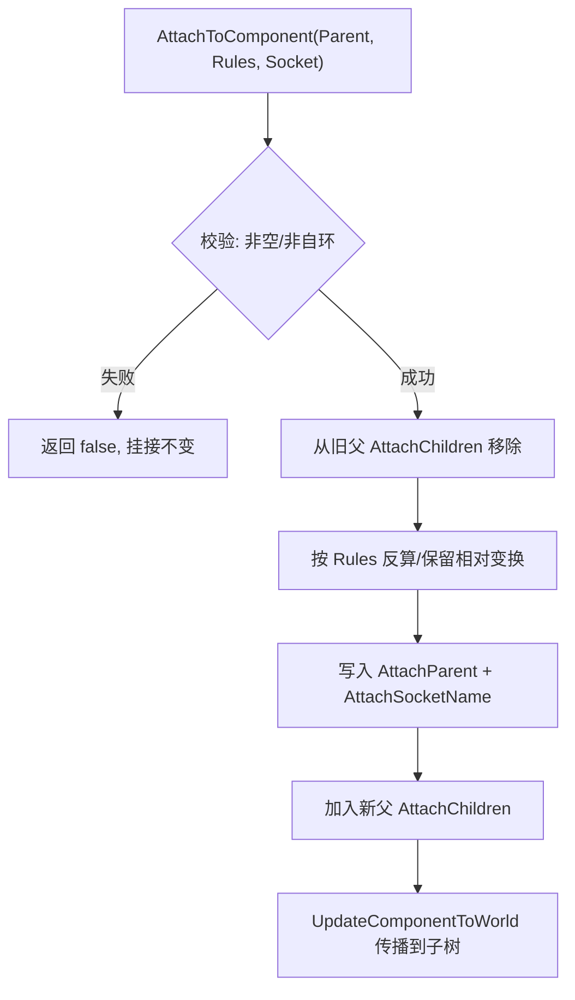

# 05 场景组件与变换体系
> 知识成熟度：L2（本轮审计修订时补标）。

## 一、概述

`USceneComponent` 是虚幻引擎中一切"带空间位置"的组件的基类：网格（`UStaticMeshComponent`）、碰撞（`UCapsuleComponent` 等 `UShapeComponent` 派生）、灯光、音效、摄像机、粒子等全部挂载在以它为基础的**组件树（Component Hierarchy）**之下。它与普通 `UActorComponent` 的核心区别只有一条：**拥有 Transform（位置/旋转/缩放），并且可以挂接到其他场景组件之下**，从而让子组件自动跟随父组件的移动、旋转与缩放。

本文回答四个问题：

1. `UActorComponent` → `USceneComponent` → `UPrimitiveComponent` 这条继承链上，每一层各自负责什么；
2. 组件树是如何建立的——`SetupAttachment`（构造期）与 `AttachToComponent`（运行期）的区别、规则与内部流程；
3. 相对变换（Relative）与世界变换（World）如何换算，`bAbsolute*`、Mobility、Socket 挂点在其中扮演什么角色；
4. 如何高效地查询组件（`GetComponentByClass` / `GetComponents`），以及组件注册与变换更新的内部机制。

阅读本文前建议先读 [02-Actor与Component生命周期.md](../../03-引擎架构与资源系统/对象模型与生命周期/02-Actor与Component生命周期.md)，本文是它在"空间与层级"维度上的延伸。

> 版本基准：保留原文 UE 5.8.0（CL 55116800 / `++UE5+Release-5.8`）阅读背景；2026-10-01 增量以 Epic 在线 API 合同核阅，此轮未访问该 UE 安装或重新确认 CL。
> 历史源码定位：`Engine/Source/Runtime/Engine/Classes/Components`；原有源码定位供后续复查，新增示例仅为独立数学实验，不冒称目标引擎运行结果。
> 兼容性边界：UE 4.27 仅作为组件/变换 API 迁移对照，不作为当前基准。
> 最后更新：2026-10-01（空间语义、非均匀缩放表示边界、Sweep/Teleport 与状态切换）。
> 官方参考：[Unreal Engine UE5.8 官方文档总页](https://dev.epicgames.com/documentation/en-us/unreal-engine)。

## 二、核心概念

| 概念 | 说明 | 关键点 |
| --- | --- | --- |
| `UActorComponent` | Actor 功能组件基类，无 Transform | 生命周期由所属 Actor 驱动（见 02 篇） |
| `USceneComponent` | 带 Transform 的场景组件基类 | `class USceneComponent : public UActorComponent`（SceneComponent.h） |
| `UPrimitiveComponent` | 可渲染、可参与物理的组件基类 | `class UPrimitiveComponent : public USceneComponent, ...`（PrimitiveComponent.h） |
| `AttachParent` / `AttachChildren` | 组件树中的父子关系 | 一个组件最多一个父，可有多个子 |
| `SetupAttachment` | 未注册组件的预挂接 | 通常用于构造函数；关键条件是尚未注册 |
| `AttachToComponent` | 运行期挂接 | 携带 `FAttachmentTransformRules` 与 Socket 参数 |
| `FAttachmentTransformRules` | 挂接时的变换处理规则 | `KeepRelativeTransform` / `KeepWorldTransform` / `SnapToTarget*`（EngineTypes.h） |
| `EAttachmentRule` | 位置/旋转/缩放各组分的规则枚举 | `KeepRelative` / `KeepWorld` / `SnapToTarget` |
| `RelativeLocation/Rotation/Scale3D` | 相对父级的变换分量 | 世界变换 = 相对变换 × 父级世界变换 |
| `GetComponentTransform` | 世界变换缓存（`FTransform`） | 随组件树自顶向下传播更新 |
| `Socket` | 组件上的命名挂点 | 骨骼/网格 Socket；`GetSocketLocation` 等 API |
| `Mobility` | 移动性：`Static/Stationary/Movable` | `Static` 组件运行期 SetWorld* 会触发警告 |
| `bAbsoluteLocation/Rotation/Scale` | 对应变换组分忽略父级 | 分别控制位置、旋转、缩放，不是 X/Y/Z 轴 |
| `RegisterComponent` | 将组件注册进世界 | 触发 `OnRegister`；注册后才能参与 Tick/渲染 |
| `GetComponentByClass` | 按类查询第一个组件 | 蓝图单数 Get Component By Class；取多个用 GetComponents |
| `GetComponents` | 取所有指定类组件 | 模板版本，可包含子 Actor 的组件 |
| Actor/Component 复制配置 | 挂接、移动、业务状态分别配置 | 不存在“打开挂接开关就自动同步全部动画”的保证 |

## 三、原理详解

### 3.1 类层级：每一层负责什么

```text
UObject
└── UActorComponent            // 通用组件：拥有者、注册、生命周期、Tick（无 Transform）
    └── USceneComponent        // 场景组件：Transform、挂接树、Socket、变换传播
        └── UPrimitiveComponent // 图元组件：渲染（材质/网格）、物理（碰撞/质量/模拟）
            └── UMeshComponent / UShapeComponent / ...
// ULightComponent 属于 USceneComponent 的另一分支，不是 UPrimitiveComponent 子类。
```

| 层级 | 核心职责 | 典型成员/方法 |
| --- | --- | --- |
| `UActorComponent` | 组件通用生命周期与注册 | `RegisterComponent`、`OnRegister`、`InitializeComponent`、`BeginPlay`、`PrimaryComponentTick` |
| `USceneComponent` | 空间变换与层级挂接 | `RelativeLocation`、`SetWorldLocation`、`AttachToComponent`、`GetSocketLocation`、`SetMobility` |
| `UPrimitiveComponent` | 渲染与物理表现 | `SetMaterial`、`SetCollisionEnabled`、`SetSimulatePhysics`、`OnComponentHit` |

理解分层的关键：**上层（UActorComponent）管"何时存在"，中层（USceneComponent）管"在哪"，下层（UPrimitiveComponent）管"长什么样、撞不撞"**。因此判断一个自定义组件该继承谁，只需问：它需要位置吗？需要被渲染/碰撞吗？

### 3.2 组件树：挂接与分离

#### SetupAttachment（构造期）

在构造函数中通过 `CreateDefaultSubobject` 创建组件后，用 `SetupAttachment` 指定"将来要挂到谁下面"：

```cpp
Muzzle = CreateDefaultSubobject<USceneComponent>(TEXT("Muzzle"));
Muzzle->SetupAttachment(RootComponent);            // 挂到根组件
Sight = CreateDefaultSubobject<UStaticMeshComponent>(TEXT("Sight"));
Sight->SetupAttachment(Mesh, TEXT("SightSocket")); // 挂到网格的 Socket 上
```

它设置注册时采用的父组件与 Socket 意向。[官方合同](https://dev.epicgames.com/documentation/en-us/unreal-engine/API/Runtime/Engine/USceneComponent/SetupAttachment)推荐在组件尚未注册时使用，通常位于所属 Actor 构造函数；不能将“通常构造期”误写为“只能在构造函数”。动态创建但尚未注册的组件也属于该条件。已注册组件改变挂接关系则使用 `AttachToComponent`，并检查返回值。具体 ensure 条件须在目标版本源码核对。

#### AttachToComponent（运行期）

```cpp
bool AttachToComponent(USceneComponent* InParent,
                       const FAttachmentTransformRules& AttachmentRules,
                       FName InSocketName = NAME_None);
```

`FAttachmentTransformRules` 决定挂接瞬间"你的世界位置怎么处理"（定义在 `Engine/Classes/Engine/EngineTypes.h`，注意 5.8 中它已不在 SceneComponent.h 里）：

| 预设规则 | Location/Rotation/Scale 效果 | 典型用途 |
| --- | --- | --- |
| `KeepRelativeTransform` | 保留当前相对变换，**世界位置可能跳变** | 逻辑挂接、UI 跟随 |
| `KeepWorldTransform` | 反算相对变换，**世界位置保持不变** | 拿枪/放物到手上、拾取 |
| `SnapToTargetNotIncludingScale` | 位置/旋转贴合；挂接瞬间维持世界缩放 | 缩放需另行约定的对位 |
| `SnapToTargetIncludingScale` | 位置为零偏移、旋转为单位旋转、相对缩放为 1 | 完全采用挂点变换 |

底层规则分别作用于位置、旋转、缩放三个组分，不是三个坐标轴。每个组分使用 `EAttachmentRule`：`KeepRelative`（保留相对值）、`KeepWorld`（反算相对值以维持世界值）、`SnapToTarget`（位置归零、旋转归单位、缩放归 1）。因此可以混搭，例如只让位置贴合、旋转保留：

```cpp
FAttachmentTransformRules Rules(EAttachmentRule::SnapToTarget,   // 位置
                                EAttachmentRule::KeepWorld,      // 旋转
                                EAttachmentRule::KeepRelative,   // 缩放
                                /*bWeldSimulatedBodies=*/false);
Comp->AttachToComponent(Parent, Rules);
```

#### DetachFromComponent

分离使用 `FDetachmentTransformRules`（`KeepRelativeTransform` 保留相对值分离、`KeepWorldTransform` 保持世界值分离），并有 `bCallModify` 控制是否记录编辑器修改。蓝图侧对应 `Detach From Component` 节点（`K2_DetachFromComponent`）。

#### 内部流程

`AttachToComponent` 的核心动作（SceneComponent.cpp）：

1. 校验父组件非空、非自身、不构成环；
2. 若旧父存在，先从旧父的 `AttachChildren` 中移除自己；
3. 按规则计算新的 `RelativeLocation/Rotation/Scale3D`（`KeepWorld` 时用"世界变换除以父世界变换"反算）；
4. 写入 `AttachParent`、`AttachSocketName`，加入新父的 `AttachChildren`；
5. 调用 `UpdateComponentToWorld` 把新变换传播给整棵子树。



### 3.3 相对变换与世界变换

`USceneComponent` 把变换拆成两组：

- **相对变换**：`RelativeLocation`、`RelativeRotation`、`RelativeScale3D` 三个 `UPROPERTY` 成员（SceneComponent.h），描述"相对于父级（或世界，若没有父）"的值；
- **世界变换**：`ComponentToWorld`（`FTransform` 缓存），描述"在世界坐标系"下的最终值，由 `GetComponentTransform()` 返回。

换算公式（SceneComponent.h 中 `UpdateComponentToWorldWithParent` 附近）：

```text
WorldTransform = RelativeTransform × ParentWorldTransform
// 有 Socket 时: WorldTransform = RelativeTransform × Parent->GetSocketTransform(SocketName)
```

[TTransform::Multiply 官方合同](https://dev.epicgames.com/documentation/unreal-engine/API/Runtime/Core/TTransform/Multiply)规定 `A * B` 逻辑上先 A 后 B。这里乘法记号是类型/API 的约定，不能由“左手坐标系”推导；换用列向量矩阵时，表示同一应用顺序的书写乘积会反过来。组合的表示能力限制见 3.8。

#### Set/Get 家族

| API | 作用 | 签名要点（5.8） |
| --- | --- | --- |
| `SetRelativeLocation(FVector, bSweep, OutSweepHitResult, Teleport)` | 设相对位置 | `bSweep` 扫掠碰撞、`ETeleportType` 控制物理传送 |
| `SetWorldLocation(...)` | 设世界位置 | 内部换算成相对值后走同一链路 |
| `SetRelativeRotation(FRotator/FQuat, ...)` | 设相对旋转 | 有 `FRotator` 与 `FQuat` 两个重载 |
| `SetWorldRotation(FRotator/FQuat, ...)` | 设世界旋转 | 同上 |
| `SetRelativeScale3D(FVector)` | 设相对缩放 | 缩放没有 sweep/teleport 参数 |
| `SetWorldScale3D(FVector)` | 设世界缩放 | 反算相对缩放 |
| `AddLocalOffset` / `AddWorldOffset` | 增量位移 | 蓝图节点名 `Add Local Offset` / `Add World Offset` |
| `GetRelativeLocation/Rotation/Scale3D` | 读相对值 | 另有 `_Direct`/`_DirectMutable` 变体绕开缓存 |
| `GetComponentLocation/Rotation/Scale` | 读世界值 | 从 `GetComponentTransform()` 解包，`K2_*` 为蓝图版本 |
| `GetRelativeTransform` | 读相对 `FTransform` | |

关键细节：

- **设置世界位置要经过父挂点的逆变换**。只有父变换为纯平移（且未采用独立 absolute 语义）时，才能仅做 `World - ParentTranslation`。父没有旋转但缩放为 2 时仍须除以 2；有 Socket 时参考的是父 Socket 变换，而不是父组件原点。对单点使用 `ParentSocket.InverseTransformPosition(WorldPoint)` 表达意图，零缩放和复合 shear 另见 3.8；
- **`bAbsoluteLocation/Rotation/Scale`**：三个独立布尔，置 `true` 后对应的位置/旋转/缩放组分使用世界语义，而不是仅脱离某个 X/Y/Z 轴。蓝图面板的 "Absolute Location/Rotation/Scale" 复选框就是它；
- **读写都有缓存**：读侧 `GetComponentTransform()` 缓存世界变换，写侧通过 `UpdateComponentToWorld` 让缓存失效并自顶向下重建。`SetRelativeLocation` 等走 `ConditionalUpdateComponentToWorld` 保证下次读取前缓存最新（`bComponentToWorldUpdated` 脏标记）；
- **低层直接成员访问**：不要把绕过 setter 的写法当通用优化；它可能绕过传播、物理、Overlap 与渲染更新。先用受支持的 setter，再根据目标版本和性能证据选择批处理机制。

### 3.4 Socket 挂点机制

Socket 是组件上的**命名空间点**。`USceneComponent` 定义了通用接口，具体实现交给子类：

| 方法（SceneComponent.h） | 作用 |
| --- | --- |
| `HasAnySockets()` | 该组件是否定义了 Socket |
| `DoesSocketExist(FName)` | 指定 Socket 是否存在 |
| `GetSocketLocation(FName)` | Socket 的世界位置 |
| `GetSocketRotation(FName)` | Socket 的世界旋转 |
| `GetSocketQuaternion(FName)` | Socket 的世界四元数 |
| `GetSocketTransform(FName, ERelativeTransformSpace)` | Socket 的完整 `FTransform`，可指定 `RTS_World`/`RTS_Actor`/`RTS_Component` |

常见实现：

- `USkeletalMeshComponent`：骨骼即 Socket，可在动画工具里添加虚拟 Socket（挂在某根骨上，跟随骨骼动画）；
- `UStaticMeshComponent`：静态网格资源中的 Socket 列表；
- 其他组件：默认没有 Socket，`NAME_None` 表示"组件根变换"。

用途：枪口火焰、握持点、视线起点、拖拽点等"会随父级动"的锚点。挂接时把 `InSocketName` 传给 `AttachToComponent`/`SetupAttachment`，即可让子组件自动定位到 Socket 上；若 Socket 不存在，引擎回退到父组件根变换。

### 3.5 注册与变换更新

组件必须**注册**才能进入世界的 Tick/渲染/物理流程（详见 02 篇）。`UActorComponent::RegisterComponent()` 触发 `OnRegister()`；对 `USceneComponent` 而言，注册还有一个额外动作：**执行延迟的挂接**。若之前只调用了 `SetupAttachment`，注册时会真正完成 `AttachToComponent`，并把初始相对变换换算成正确位置。

与变换强相关的两个概念：

**Mobility（移动性）**：`Static/Stationary/Movable` 决定组件运行时可变化的方式及渲染优化假设，具体限制与组件类别相关。运行期需要移动的组件应选择支持该移动的配置；不要把某个光源的 Stationary 行为概括成所有组件的统一物理规则，也不要依赖更改 Mobility 解决空间换算问题。

**变换传播（Transform Propagation）**：父组件变换变化时，引擎调用 `UpdateComponentToWorld(UpdateTransformFlags, Teleport)`，沿 `AttachChildren` 递归刷新整棵子树的 `ComponentToWorld` 缓存。`ETeleportType` 的官方枚举包括 `None`、`TeleportPhysics`、`ResetPhysics`，不能笼统称只有两种。对本页位置移动 API：

- `None`：不按物理传送处理，位置变化可影响物理速度；不是“速度插值/平滑”的保证；
- `TeleportPhysics`：保留物理速度，不让这次位置跳变重新推导速度；**不会清零已有线速度或角速度**；
- `ResetPhysics`：枚举表示重置物理状态，但具体调用入口/组件支持需核对，不能将其当所有移动 API 上通用的“停住”按钮。

依据：[ETeleportType](https://dev.epicgames.com/documentation/en-us/unreal-engine/API/Runtime/Engine/ETeleportType)、[SetWorldLocation 参数](https://dev.epicgames.com/documentation/en-us/unreal-engine/API/Runtime/Engine/USceneComponent/K2_SetWorldLocation)。传送后是否保留运动是玩法决策；若要停止模拟体，必须另外明确处理速度或改用所属移动系统的停止接口。

### 3.6 组件查询与遍历

常用查询 API 全部定义在 `AActor` 上（5.8 位于 `Classes/GameFramework/Actor.h`）：

| API | 返回 | 说明 |
| --- | --- | --- |
| `GetComponentByClass<T>()` | `T*`（第一个匹配） | 模板版本，内部走 `FindComponentByClass(T::StaticClass())` |
| `GetComponentByClass(TSubclassOf<UActorComponent>)` | `UActorComponent*` | 原生非模板版本 |
| `FindComponentByClass` | `UActorComponent*` | 同 `GetComponentByClass`，语义上用于"查找" |
| `GetComponents<T>(TArray&, bIncludeFromChildActors)` | 填充数组 | 可指定是否包含子 Actor（`UChildActorComponent`）的组件 |
| `GetComponentsByTag(ComponentClass, FName Tag)` | `TArray<UActorComponent*>` | 按组件 Tag 过滤 |
| `K2_GetComponentsByClass(TSubclassOf)` | `TArray<UActorComponent*>` | 蓝图节点 `Get Components By Class` |

注意区分：

- `GetComponentByClass` 返回**第一个**匹配组件（不要依赖其返回顺序作为稳定业务身份），同类型多组件时应改用 `GetComponents` 遍历并校验；
- 蓝图侧 `Get Component By Class` 只能拿单个，取全部用 `Get Components By Class`；
- 查询有遍历成本；同类多组件请用明确属性引用、Tag 或枚举后校验。缓存必须在拥有者重建/组件销毁时失效，不能假设一个未核对的通用增删委托名适用于所有 Actor；
- 子 Actor 组件的组件默认**不算**本 Actor 的组件，除非显式传 `bIncludeFromChildActors = true`。

### 3.7 网络复制要点（简述）

组件树、Actor 挂接复制与 Actor 移动复制不是同一份状态。`AActor` 的挂接状态有自己的复制处理；可复制 SceneComponent 的相对变换与父关系也要按目标版本和组件复制配置核对，不应声称所有组件都走同一个 `FRepMovement` 管线。

- Actor 与相关组件需分别符合网络复制和可寻址条件；服务器的权威挂接操作、动态生成顺序与客户端接收时机需一致。
- 动画驱动 Socket 的结果由本地姿态决定；复制挂接关系并不保证两端恰好同帧求值，也不自动同步动画、物理姿态或命中查询。
- 不把没有核对的 `bReplicatesAttachment` / `ReplicateAttachedComponents` 当可直接打开的公共开关。进入[复制基础](../../07-网络与游戏服务端/状态复制与兴趣管理/01-网络架构与复制基础.md)和[RPC 与属性同步](../../07-网络与游戏服务端/状态复制与兴趣管理/02-RPC与属性同步.md)继续核对真实入口。

### 3.8 先写空间合同，再谈变换乘法

给每个值同时写出**物理含义、单位、坐标系、采样时刻**。例如 `MuzzlePositionWS_cm` 是某帧枪口世界位置，`GripOffsetInHand_cm` 是手骨局部偏移，`AimDirectionWS` 是无量纲方向；三个 FVector 不能因为类型相同就相加。

| 数据 | 正确的空间操作 | 容易混淆的错误 |
| --- | --- | --- |
| 位置点 | 缩放、旋转、平移；逆变换反向撤销三步 | 只减父位置，忘记父缩放和 Socket 偏移 |
| 位移/几何向量；静止坐标系中的速度换基 | 线性部分（缩放+旋转），不加平移 | 把向量当点，或忽略移动参考系的额外速度项 |
| 仅表达朝向的方向 | 根据合同选择旋转-only，随后检查单位长度 | 不加区分地乘非均匀缩放，射线长度被方向模长改变 |
| 表面法线 | 对一般可逆线性变换用逆转置，再归一化 | 把法线按切向量变换，导致与表面不再垂直 |

这里的“速度换基”限定为静止坐标系或同一瞬时几何向量的表达转换。如果速度是移动父系内位置的时间导数，`p_world(t)=M(t)*p_local(t)+t_parent(t)` 的导数还包含 `M_dot*p_local+t_parent_dot`；旋转父系会出现角速度与偏移的叉积项，变化缩放也有额外项。只调用 TransformVector 不能计算随移动平台运动的完整世界速度。

方向是否需要缩放取决于问题：把局部线段的两个端点变到世界再相减，会包含实际缩放；表达“角色面对哪边”的纯朝向往往只要旋转。不要用一个 `NoScale` 规则覆盖两种需求。

#### 单个 TRS 的点变换与逆变换

用列向量数学记号解释一个变换（这不是 UE 运算符的拼写）：

```text
p_world = R * (S * p_local) + t
p_local = S_inverse * (R_inverse * (p_world - t))
```

逆序是减平移 → 逆旋转 → 逆缩放。官方 [InverseTransformPosition](https://dev.epicgames.com/documentation/unreal-engine/API/Runtime/Core/TTransform/InverseTransformPosition)表达的正是对位置做逆操作；对存在旋转和非均匀缩放的情况，不要想当然把 `T.Inverse().TransformPosition(P)` 与专门的逆位置操作视为普遍等价。

零缩放会丢失维度，数学上不存在唯一逆；接近零的缩放会放大误差。引擎安全倒数可能返回有限替代值来防 NaN，但那不是恢复了原始信息。导入单位换算、游戏尺寸、镜像和“临时隐藏”应是不同操作，不要用 scale=0 隐藏后再依赖可逆换算。

#### 非均匀缩放为什么能产生单个 TRS 放不下的结果

[FTransform/TTransform](https://dev.epicgames.com/documentation/en-us/unreal-engine/API/Runtime/Core/TTransform)以平移、旋转、三轴缩放为主要表示，并非任意仿射矩阵。以下为数学推导，不是某版本引擎的实测输出：

1. 子节点先旋转 45°，父节点再沿 X 放大 2 倍、Y 保持 1 倍。
2. 对列向量，完整线性复合为 `M = S_parent * R_child`。
3. 变换后的两条单位基轴点积为 `-1.5`，不再正交。
4. 单个 `R * diagonal_scale` 的基轴仍相互正交，因此不可能无损表示这次完整复合。

这叫表示集合对一般组合**不封闭**。四元数归一化、改乘法书写顺序、把矩阵再塞回 FTransform 都不能凭空增加 shear 自由度。UE 的组合/分解如何取舍还涉及具体实现与负缩放分支；本页只证明“不能普遍等价”，不声称玩具模型返回值就是引擎的实际返回值。

工程选项与代价：

- 在可旋转的挂接链上优先保持单位/均匀缩放，把非均匀尺寸烘到叶子网格；代价是资产变体、碰撞与骨骼重验。
- 若算法确实需要完整仿射结果，在自己的计算中保留矩阵或顺序应用变换；再写回组件 TRS 时仍面对表示损失，不能保证编辑器/物理也接受 shear。
- 对镜像（负 determinant）明确 winding、法线、碰撞和骨骼约束策略；不要把负缩放与仅旋转180°混同。
- 测位置时不能只看原点：两种线性变换可能映射相同原点，却映射不同基轴/顶点。至少检查原点、三基轴、代表性挂点与碰撞尺寸。

### 3.9 从挂接驱动切换到物理驱动

同一个物体在某一时刻应有明确的位置写者：组件树、移动组件、物理模拟或网络校正。让 Tick 强制 SetWorldLocation 同时又开模拟，会形成竞争；问题不一定是坐标公式。

[SetSimulatePhysics 官方合同](https://dev.epicgames.com/documentation/unreal-engine/API/Runtime/Engine/UPrimitiveComponent/SetSimulatePhysics)区分简单单刚体与骨骼等多刚体组件：简单体启用模拟会从现有父级脱离，停止模拟不会自动重新挂接；骨骼组件各 body 可独立运动，不能套用相同的自动脱离假设。

可复用的单刚体持握状态机（方案示意）：

```text
Held：模拟关闭 → 校验父/Socket存在 → 挂接成功 → 应用持握偏移
Release：保存所需世界位姿 → 分离保留世界 → 配置碰撞 → 启用模拟
         → 按设计继承/设置线速度、角速度或冲量
Pickup：停止模拟 → 验证挂点和对象生命期 → 重新挂接并检查返回值
        → 应用本次持握的姿态与碰撞策略
```

这不是顺序万能模板：物理约束、焊接、骨骼布娃娃、网络权威和异步物理各有额外合同。`bWeldSimulatedBodies` 也不等于普通父子跟随。与[碰撞检测](../物理求解与动力学/02-碰撞检测与物理材质.md)、[物理约束](../物理求解与动力学/03-物理约束与关节.md)和[布娃娃](../物理求解与动力学/04-布娃娃与物理动画.md)对照后选择实现。

## 四、代码示例

以下 UE 片段用于说明调用位置，省略完整工程头文件/类声明，未在本轮编译；可直接独立编译的仅是 4.4 数学模型。

### 4.1 C++：默认挂接 + 运行期挂到 Socket

```cpp
// AWeapon.h
UCLASS()
class AMyWeapon : public AActor
{
    GENERATED_BODY()
public:
    AMyWeapon();
    UPROPERTY(VisibleAnywhere)
    USceneComponent* Root;
    UPROPERTY(VisibleAnywhere)
    UStaticMeshComponent* Mesh;
    UPROPERTY(VisibleAnywhere)
    USceneComponent* Muzzle;   // 枪口
};

// AWeapon.cpp 构造函数：建立默认组件树
AMyWeapon::AMyWeapon()
{
    Root = CreateDefaultSubobject<USceneComponent>(TEXT("Root"));
    SetRootComponent(Root);                    // 根组件

    Mesh = CreateDefaultSubobject<UStaticMeshComponent>(TEXT("Mesh"));
    Mesh->SetupAttachment(Root);               // 构造期用 SetupAttachment

    Muzzle = CreateDefaultSubobject<USceneComponent>(TEXT("Muzzle"));
    Muzzle->SetupAttachment(Mesh, TEXT("MuzzleSocket")); // 声明意向；资源就绪后仍须校验挂点
    // 引擎可能回退到组件原点，生产代码不能把回退当枪口校验成功。
}
```

```cpp
// 角色运行时把武器挂到手上，保持武器当前世界位置不变
void AMyCharacter::EquipWeapon(AMyWeapon* Weapon)
{
    if (!Weapon || !GetMesh() || !GetMesh()->DoesSocketExist(TEXT("WeaponSocket"))) return;
    // KeepWorldTransform：挂接瞬间世界位置不跳变
    const bool bAttached = Weapon->AttachToComponent(GetMesh(),
        FAttachmentTransformRules::KeepWorldTransform,
        TEXT("WeaponSocket"));
    if (!bAttached) { return; } // 实际项目记录失败，勿继续当作装备成功
}

// 读取枪口世界位置（发射子弹起点）
FVector AMyWeapon::GetMuzzleWorldLocation() const
{
    return Muzzle ? Muzzle->GetSocketLocation(NAME_None) : GetActorLocation();
}
```

### 4.2 C++：相对/世界变换切换与组件查询

```cpp
// 相对父级偏移（武器后坐：沿本地后轴退 10cm）
Muzzle->AddLocalOffset(FVector(-10.f, 0.f, 0.f));

// 直接设世界位置：保留已有物理速度，不因位移跳变重算速度
Mesh->SetWorldLocation(TargetLocation, /*bSweep=*/false, nullptr, ETeleportType::TeleportPhysics);

// 查询：拿第一个碰撞盒
UCapsuleComponent* Capsule = GetComponentByClass<UCapsuleComponent>();

// 查询：拿所有静态网格组件（含子 Actor）
TArray<UStaticMeshComponent*> Meshes;
GetComponents<UStaticMeshComponent>(Meshes, /*bIncludeFromChildActors=*/true);

// 蓝图版等价的 C++ 调用
TArray<UActorComponent*> All =
    K2_GetComponentsByClass(UStaticMeshComponent::StaticClass());
```

### 4.3 蓝图节点速查

| 节点 | 对应 C++ | 用途 |
| --- | --- | --- |
| `Attach To Component` | `K2_AttachToComponent` | 运行期挂接（可选手/保持世界/贴合） |
| `Detach From Component` | `K2_DetachFromComponent` | 分离 |
| 组件面板父子层级 | C++ 常用 `SetupAttachment` | 不把它当通用 Event Graph 节点；注册后改变关系用 Attach |
| `Set Relative Location` / `Set World Location` | `K2_SetRelativeLocation` / `K2_SetWorldLocation` | 设置位置（可开 Sweep/Teleport） |
| `Add Local Offset` / `Add World Offset` | `K2_AddLocalOffset` / `K2_AddWorldOffset` | 增量位移 |
| `Get Socket Location` / `Get Socket Transform` | `GetSocketLocation` / `GetSocketTransform` | 读挂点 |
| `Get Components By Class` | `K2_GetComponentsByClass` | 取全部指定类组件 |
| `Get Component By Class` | `GetComponentByClass` | 取第一个指定类组件 |

### 4.4 可运行反例：先证明数学合同，再比对引擎

以下为**独立二维仿射模型**，C++11 编译，无 UE 依赖。二维已足以证明不封闭；它没有模拟 FTransform 的近似合成、组件传播、物理或骨骼，因此输出不能标成 UE 验证通过。

```cpp
#include <cassert>
#include <cmath>
#include <iostream>

struct V { double x, y; };
struct M { double a, b, c, d; }; // 列向量，第一行 a,b；第二行 c,d
V add(V a, V b) { return {a.x+b.x, a.y+b.y}; }
V sub(V a, V b) { return {a.x-b.x, a.y-b.y}; }
V mul(M m, V v) { return {m.a*v.x+m.b*v.y, m.c*v.x+m.d*v.y}; }
M compose(M a, M b) { // 数学矩阵 a*b，先 b 后 a；不是 UE operator*
    return {a.a*b.a+a.b*b.c, a.a*b.b+a.b*b.d,
            a.c*b.a+a.d*b.c, a.c*b.b+a.d*b.d};
}
double dot(V a, V b) { return a.x*b.x+a.y*b.y; }
bool near(double a, double b) { return std::abs(a-b) < 1e-9; }
bool near(V a, V b) { return near(a.x,b.x) && near(a.y,b.y); }
bool inverse(M m, M& out) {
    const double det=m.a*m.d-m.b*m.c;
    // 教学阈值：适合本例单位尺度，不是通用数值稳健求逆器。
    if (!std::isfinite(det) || std::abs(det)<1e-12) return false;
    out={m.d/det,-m.b/det,-m.c/det,m.a/det};
    return std::isfinite(out.a) && std::isfinite(out.b) &&
           std::isfinite(out.c) && std::isfinite(out.d);
}
int main() {
    const double q=std::sqrt(0.5);
    const M rotate45{q,-q,q,q}, scaleX{2,0,0,1};
    const M exact=compose(scaleX,rotate45);
    const V axisX=mul(exact,{1,0}), axisY=mul(exact,{0,1});
    assert(near(dot(axisX,axisY),-1.5)); // 非正交，单个R*对角S无法表达
    const M swapped=compose(rotate45,scaleX);
    assert(near(dot(mul(swapped,{1,0}),mul(swapped,{0,1})),0.0));
    assert(!near(mul(exact,{1,1}),mul(swapped,{1,1}))); // 交换不是修复

    const V translation{10,20}, local{1,1};
    const V world=add(mul(exact,local),translation);
    M inv{};
    assert(inverse(exact,inv));
    assert(near(mul(inv,sub(world,translation)),local)); // 完整逆还原
    assert(!near(sub(world,translation),local)); // 仅减父平移不够

    const V tangent{1,0}, normal{0,1};
    const M invTranspose{inv.a,inv.c,inv.b,inv.d};
    assert(near(dot(mul(exact,tangent),mul(invTranspose,normal)),0.0));
    assert(!near(dot(mul(exact,tangent),mul(exact,normal)),0.0));
    assert(!inverse({0,0,0,1},inv)); // 奇异缩放不能唯一反演
    assert(near(mul(compose({2,0,0,2},rotate45),local),
                mul(compose(rotate45,{2,0,0,2}),local))); // 均匀缩放对照
    std::cout << "PASS: 10 affine-space assertions\n";
}
```

保存为 `transform_contract.cpp`，执行：

```bash
g++ -std=c++11 -Wall -Wextra -Werror -pedantic transform_contract.cpp -o transform_contract
./transform_contract
g++ -std=c++11 -Wall -Wextra -Werror -pedantic -fsanitize=undefined -fno-sanitize-recover=all transform_contract.cpp -o transform_contract_ubsan
./transform_contract_ubsan
```

模型的 `inverse` 刻意只处理本例尺度；工程求逆还要做条件数/误差分析、输入有界性与失败输出合同，不能把固定 determinant 阈值复制成万能方案。

## 五、最佳实践

1. **先判注册状态**：未注册组件通常用 `SetupAttachment` 预约挂接；已注册后用 `AttachToComponent` 并检查结果；
2. **挂接瞬间的位置语义想清楚**：捡起/放下物体用 `KeepWorldTransform`，逻辑父子关系（如枪口特效）用 `KeepRelativeTransform` 或 `SnapToTarget*`；
3. **传送与停速分开**：`TeleportPhysics` 保留已有速度。是否停速、保留动量或让 CharacterMovement 接管，应由移动/物理状态机决定；
4. **Socket 优先于手工坐标**：凡是"跟着某个部件动"的锚点都定义 Socket，不要在 Tick 里手动把子组件位置对齐到父级（多一次反算，还容易抖动）；
5. **高频查询组件先缓存**：`GetComponentByClass` 是线性查找，Tick 里每帧调用不可取；缓存后随拥有者与组件生命周期失效；
6. **注意 Mobility**：运行期要移动的组件一开始就设 `Movable`；`Static` 组件运行期移动不仅警告，还会破坏渲染/光照优化结果；
7. **非均匀缩放加旋转先检查表示能力**：完整仿射复合可能含 shear，单个 TRS 不能普遍无损表达；不要把视觉不符都归因“矩阵求逆错了”；
8. **销毁顺序**：先 `DetachFromComponent` 或直接 `DestroyComponent`（会自动处理挂接关系），不要在父组件已销毁后仍持有子组件引用；
9. **网络下两端挂接条件保持一致**，并把持握点定义在 Socket 上，减少变换复制量；
10. **根组件与跨 Actor 挂接**：Actor 的 RootComponent 仍可挂到其他 Actor 的组件；它是本 Actor 的根，不是整个世界组件树中不能有父的节点。读取 Actor 位置时还要区分根与脱离后模拟的子网格位置。

## 六、常见问题 FAQ

### Q1：`SetupAttachment` 和 `AttachToComponent` 有什么区别？

前者针对尚未注册组件预约父/Socket，通常在构造函数使用；后者改变挂接并应用规则。核心分界是注册状态，不是“代码在不在构造函数”。

### Q2：`AttachToComponent` 之后物体位置跳了？

检查变换规则：`KeepRelativeTransform` 保留相对值，挂到新父后世界位置可能变化；想要"原地挂上"用 `KeepWorldTransform`。此外父级有非等比缩放时，`KeepWorld` 反算也会产生视觉偏移。

### Q3：`GetSocketLocation` 返回的是组件位置，Socket 没生效？

`DoesSocketExist` 先确认 Socket 存在；网格组件需要资源内定义 Socket（或骨骼里添加），运行时新增 Socket 需在资源里保存。`NAME_None` 常用于表示不指定挂点，但不要用它推导 `DoesSocketExist(NAME_None)` 必然返回 true；缺失具体挂点应显式报错而非接受回退。

### Q4：运行期 `SetWorldLocation` 报"Static component"警告？

`Mobility` 是 `Static`/`Stationary`。先 `SetMobility(EComponentMobility::Movable)` 再移动；或者该组件本就不该动，检查是否误调用了移动接口。

### Q5：改了父组件位置，子组件没跟着动？

正常链路是 `UpdateComponentToWorld` 递归传播。常见原因：子组件用了 `bAbsoluteLocation=true`（位置组分采用世界语义）；或手动 `_Direct` 系列写了成员但没调用 `UpdateComponentToWorld`；或子组件未注册。

### Q6：`GetComponentByClass` 拿到的是哪个组件？

返回一个匹配组件，不应依赖创建顺序来区分业务身份。同类型多个组件时必须用 `GetComponents` 遍历，或给组件打 Tag 后用 `GetComponentsByTag` 精确取。

### Q7：子 Actor（`UChildActorComponent`）的组件算我的组件吗？

默认不算。`GetComponents` 传 `bIncludeFromChildActors=true` 才包含；`GetComponentByClass` 永远不包含子 Actor 的组件。

### Q8：为什么"传送"后物理体还是飞出去？

先读实际物理速度：`TeleportPhysics` 本就保留已有速度，不能使运动物体停住。也要区分根组件、模拟体、CharacterMovement 是否仍在下一 tick 继续驱动；不要只反复设置世界坐标掩盖多写者冲突。

### Q9：蓝图里 `Set Relative Location` 勾了 Sweep 但没碰撞结果？

输出引脚只用于观察结果，不是碰撞生效条件。检查参与移动的碰撞体、Query 设置、通道响应和阻挡结果；子组件不会因为父移动就自动各自 sweep。Sweep 决定路径查询/阻挡，Teleport 决定物理状态处理，两者不是优先级开关。旋转扫掠支持须另查 API，不能由平移推导。

### Q10：组件变换在客户端和服务器对不上？

检查：Actor `bReplicates`；组件复制配置、动态对象可寻址性、权威挂接状态与接收顺序；是否依赖了仅本地存在的 Socket。骨骼驱动的持握点建议只复制"挂接关系"，位置交给动画插值。

## 七、验证练习与证据边界

先预测结果，再在目标 UE 版本运行；不要把矩阵数学结果与引擎表示结果混成同一基准。

| 用例 | 操作 | 核对证据 |
| --- | --- | --- |
| 基础空间 | 父纯平移、均匀缩放、旋转分别加入 | 原点/基轴/局部点回转，单位与坐标系标记 |
| 非均匀链 | 父(2,1,1)、子旋转45°；再改均匀缩放 | 顺序点变换、完整矩阵、合成 FTransform 三条结果分别记录 |
| Socket | 有效挂点、缺失挂点、组件原点三种输入 | 缺失明确报错，不接受静默回退当正确挂接 |
| 规则与absolute | 四种挂接规则后改变父缩放 | 区分挂接瞬间KeepWorld与持续不继承缩放；检查 SetAbsolute 前后 |
| Sweep/Teleport | 简单碰撞根移动，带碰撞子件跟随；四种布尔组合 | 阻挡位置、Hit结果、已有速度分别观测，不假设互相覆盖 |
| 模拟切换 | 单刚体 held→release→pickup 重复循环 | 真正模拟组件、父关系、世界位姿与速度；关闭模拟后显式重挂 |
| 动画/IK | 同一挂点在姿态更新前后取样 | 记录帧/tick阶段；排除把上一帧姿态当空间换算错误 |

练习：把二维反例改为任意角度，再找出均匀缩放或特殊轴对齐时不产生上述非正交结果的条件。解释“一个点对上了”为什么不能证明两个变换等价。继续在[骨骼基础](../动画求值与角色表现/07-动画资产与骨骼基础.md)、[IK 重定向](../动画求值与角色表现/06-动画重定向与IKRetargeter.md)区分骨局部、组件和世界空间，勿将重定向偏移直接当世界偏移。

2026-10-01 本次只核阅官方合同并运行 4.4 独立 C++11 数学模型；未重新验证旧源码行号、UE 编译/UHT、组件实际传播、Chaos/骨骼或多人运行。上表是待执行实验，不是通过记录；maturity 保持 L2，verified 保持空列表。

## 八、关联阅读

- [02-Actor与Component生命周期.md](../../03-引擎架构与资源系统/对象模型与生命周期/02-Actor与Component生命周期.md)：注册/OnRegister/销毁与本文的挂接、变换传播同属组件生命周期主线；
- [03-Gameplay框架与游戏模式.md](../../03-引擎架构与资源系统/模块化框架与对象通信/03-Gameplay框架与游戏模式.md)：Pawn/Character 的 `GetMesh()` 挂接实践（武器/装备系统）；
- [06-定时器与引擎Ticker.md](../../03-引擎架构与资源系统/运行架构与任务调度/06-定时器与引擎Ticker.md)：Tick 与定时器是"组件树建好后"驱动它动起来的两种方式；
- [07-World关卡与Subsystem体系.md](../../03-引擎架构与资源系统/世界组织与资源加载/07-World关卡与Subsystem体系.md)：组件所属的 World 上下文、流送关卡与 Subsystem 的配合；
- 引擎源码：`Engine/Source/Runtime/Engine/Classes/Components/SceneComponent.h`、`Private/Components/SceneComponent.cpp`、`Classes/Engine/EngineTypes.h`（`FAttachmentTransformRules`）、`Classes/GameFramework/Actor.h`（组件查询）；
- 后续分类：物理系统（碰撞/扫掠与 `bSweep`）、动画系统（Socket 与骨骼）、网络同步（变换复制）、渲染与图形（Mobility 与光照）。

## 官方合同补充

- [TTransform](https://dev.epicgames.com/documentation/en-us/unreal-engine/API/Runtime/Core/TTransform)：表示与逆变换 API；shear 不封闭结论另有本文数学反例支持
- [FAttachmentTransformRules](https://dev.epicgames.com/documentation/en-us/unreal-engine/API/Runtime/Engine/FAttachmentTransformRules)：位置、旋转、缩放分别选择规则
- [ULightComponent 继承链](https://dev.epicgames.com/documentation/en-us/unreal-engine/API/Runtime/Engine/ULightComponent)：校正组件层级示意
- [AActor::AttachToComponent](https://dev.epicgames.com/documentation/en-us/unreal-engine/API/Runtime/Engine/AActor/AttachToComponent)：Actor 根组件也可挂到另一组件
