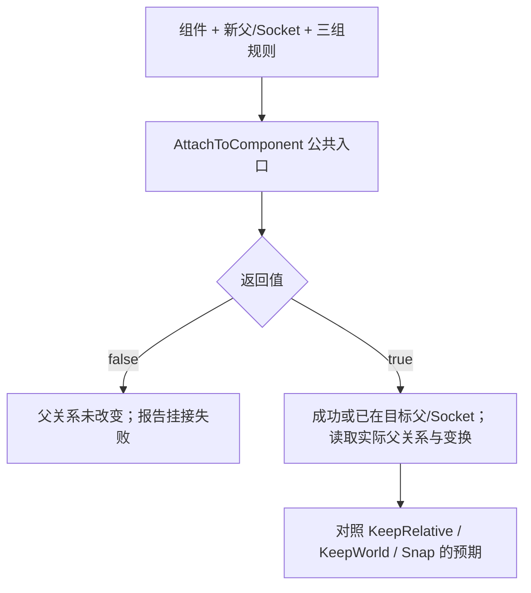

# 05 场景组件与变换体系
> 知识成熟度：L2（公开 API 合同静态核对与数学推导；正常蓝图方案和 UE 目标实验均为 NOT_RUN）。

## 一、概述

`USceneComponent` 是虚幻引擎中一切"带空间位置"的组件的基类：网格（`UStaticMeshComponent`）、碰撞（`UCapsuleComponent` 等 `UShapeComponent` 派生）、灯光、音效、摄像机、粒子等全部挂载在以它为基础的**组件树（Component Hierarchy）**之下。它与普通 `UActorComponent` 的主要区别在于：**拥有 Transform（位置/旋转/缩放），并且可以挂接到其他场景组件之下**，从而让子组件自动跟随父组件的移动、旋转与缩放。

本文回答四个问题：

1. `UActorComponent` → `USceneComponent` → `UPrimitiveComponent` 这条继承链上，每一层各自负责什么；
2. 组件树如何建立，怎样用完整蓝图例从局部输入推到世界结果，以及 `SetupAttachment` 与 `AttachToComponent` 的推荐场景；
3. 相对变换（Relative）与世界变换（World）如何换算，`bAbsolute*`、Mobility、Socket 挂点在其中扮演什么角色；
4. 注册、移动、碰撞与物理模拟分别负责什么，怎样查询正确组件并判断空间错误的来源。

阅读本文前建议先读 [02-Actor与Component生命周期.md](../../03-引擎架构与资源系统/对象模型与生命周期/02-Actor与Component生命周期.md)，本文是它在"空间与层级"维度上的延伸。

> 当前教学目标：UE 5.8 的 SceneComponent 公开 API 与第四节蓝图方案。2026-10-10 成功返回的官方页面标题标为 Unreal Engine 5.8；带 `application_version=5.8` 的精确查询入口未能读取，不能把无版本参数 URL 当作永久版本锁。
> 历史阅读背景：原文记录 UE 5.8.0（CL 55116800 / `++UE5+Release-5.8`）；本轮没有该安装、Build.version 或源码 checkout，未重新确认 CL。原有 `Engine/Source/...` 路径仅作为后续复查入口，不是本轮逐行源码证据。
> 范围：单机、正常父子组件、非模拟移动与空间换算为教学主线；UE 4.27 仅保留为历史迁移背景，不声称已做兼容验证。碰撞、物理和网络边界单列，不从数学模型推导运行结果。
> 最后更新：2026-10-10（补全正常父子链、世界目标反算、挂接规则与公共合同边界）。UE/UHT、蓝图编译、PIE、Chaos、目标设置与性能实验全部 NOT_RUN；本轮也未重跑原有独立 C++11 模型。
> 本轮来源选读、失败入口及历史证据边界见第九节。

## 二、核心概念

| 概念 | 说明 | 关键点 |
| --- | --- | --- |
| `UActorComponent` | Actor 功能组件基类，无 Transform | 生命周期由所属 Actor 驱动（见 02 篇） |
| `USceneComponent` | 带 Transform 的场景组件基类 | `class USceneComponent : public UActorComponent`（SceneComponent.h） |
| `UPrimitiveComponent` | 可渲染、可参与物理的组件基类 | `class UPrimitiveComponent : public USceneComponent, ...`（PrimitiveComponent.h） |
| `AttachParent` / `AttachChildren` | 组件树中的父子关系 | 一个组件最多一个父，可有多个子 |
| `SetupAttachment` | 未注册组件的预挂接 | 通常用于构造函数；关键条件是尚未注册 |
| `AttachToComponent` | 应用规则的挂接操作 | 注册前后均可调用；未注册时优先 SetupAttachment |
| `FAttachmentTransformRules` | 挂接时的变换处理规则 | `KeepRelativeTransform` / `KeepWorldTransform` / `SnapToTarget*`（EngineTypes.h） |
| `EAttachmentRule` | 位置/旋转/缩放各组分的规则枚举 | `KeepRelative` / `KeepWorld` / `SnapToTarget` |
| `RelativeLocation/Rotation/Scale3D` | 相对父挂点的变换分量 | 常规继承下按 Relative × ParentSocketWorld 合成；absolute 与 TRS 表示限制另述 |
| `GetComponentTransform` | 当前 component-to-world（`FTransform`） | 子世界结果依赖父挂点；具体更新时机另核对 |
| `Socket` | 组件上的命名挂点 | 骨骼/网格 Socket；`GetSocketLocation` 等 API |
| `Mobility` | 移动性：`Static/Stationary/Movable` | 运行时移动须符合组件的移动性约束 |
| `bAbsoluteLocation/Rotation/Scale` | 对应变换组分忽略父级 | 分别控制位置、旋转、缩放，不是 X/Y/Z 轴 |
| `RegisterComponent` | 建立组件注册及相关状态 | 注册是进入世界流程的条件；是否 Tick/渲染还取决于组件能力和配置 |
| `GetComponentByClass` | 按类查询第一个组件 | 蓝图单数 Get Component By Class；取多个用 GetComponents |
| `GetComponents` | 取所有指定类组件 | 模板版本，可包含子 Actor 的组件 |
| Actor/Component 复制配置 | 挂接、移动、业务状态分别配置 | 不存在“打开挂接开关就自动同步全部动画”的保证 |

## 三、先理解组件与空间

### 3.1 类层级：每一层负责什么

```text
UObject
└── UActorComponent            // 通用组件：拥有者、注册、生命周期、Tick（无 Transform）
    └── USceneComponent        // 场景组件：Transform、挂接树、Socket、变换传播
        └── UPrimitiveComponent // 图元组件：渲染（材质/网格）、物理（碰撞/质量/模拟）
            └── UMeshComponent / UShapeComponent / ...
// ULightComponent 属于 USceneComponent 的另一分支，不是 UPrimitiveComponent 子类。
```

| 层级 | 核心职责 | 典型成员/方法 |
| --- | --- | --- |
| `UActorComponent` | 组件通用生命周期与注册 | `RegisterComponent`、`OnRegister`、`InitializeComponent`、`BeginPlay`、`PrimaryComponentTick` |
| `USceneComponent` | 空间变换与层级挂接 | `RelativeLocation`、`SetWorldLocation`、`AttachToComponent`、`GetSocketLocation`、`SetMobility` |
| `UPrimitiveComponent` | 渲染与物理表现 | `SetMaterial`、`SetCollisionEnabled`、`SetSimulatePhysics`、`OnComponentHit` |

理解分层的关键：**上层（UActorComponent）管"何时存在"，中层（USceneComponent）管"在哪"，下层（UPrimitiveComponent）管"长什么样、撞不撞"**。因此判断一个自定义组件该继承谁，只需问：它需要位置吗？需要被渲染/碰撞吗？

### 3.2 相对变换与世界变换

`USceneComponent` 把变换拆成两组：

- **相对变换**：`RelativeLocation`、`RelativeRotation`、`RelativeScale3D` 三个 `UPROPERTY` 成员（SceneComponent.h），描述"相对于父级（或世界，若没有父）"的值；
- **世界变换**：`ComponentToWorld`（`FTransform` 缓存），描述"在世界坐标系"下的最终值，由 `GetComponentTransform()` 返回。

常规继承（无 absolute 组分、父挂点有效）下，用 UE 的组合约定表达为：

```text
WorldTransform = RelativeTransform * ParentWorldTransform
// 有 Socket 时，使用父挂点的世界变换：
WorldTransform = RelativeTransform * Parent->GetSocketTransform(SocketName, RTS_World)
```

[TTransform::Multiply 官方合同](https://dev.epicgames.com/documentation/unreal-engine/API/Runtime/Core/TTransform/Multiply)规定 `A * B` 逻辑上先 A 后 B。这里乘法记号是类型/API 的约定，不能由“左手坐标系”推导；换用列向量矩阵时，表示同一应用顺序的书写乘积会反过来。组合的表示能力限制见 5.5。

### 3.3 数据的空间合同与单次点变换

给每个值同时写出**物理含义、单位、坐标系、采样时刻**。例如 `MuzzlePositionWS_cm` 是某帧枪口世界位置，`GripOffsetInHand_cm` 是手骨局部偏移，`AimDirectionWS` 是无量纲方向；三个 FVector 不能因为类型相同就相加。

| 数据 | 正确的空间操作 | 容易混淆的错误 |
| --- | --- | --- |
| 位置点 | 缩放、旋转、平移；逆变换反向撤销三步 | 只减父位置，忘记父缩放和 Socket 偏移 |
| 位移/几何向量；静止坐标系中的速度换基 | 线性部分（缩放+旋转），不加平移 | 把向量当点，或忽略移动参考系的额外速度项 |
| 仅表达朝向的方向 | 根据合同选择旋转-only，随后检查单位长度 | 不加区分地乘非均匀缩放，射线长度被方向模长改变 |
| 表面法线 | 对一般可逆线性变换用逆转置，再归一化 | 把法线按切向量变换，导致与表面不再垂直 |

这里的“速度换基”限定为静止坐标系或同一瞬时几何向量的表达转换。如果速度是移动父系内位置的时间导数，`p_world(t)=M(t)*p_local(t)+t_parent(t)` 的导数还包含 `M_dot*p_local+t_parent_dot`；旋转父系会出现角速度与偏移的叉积项，变化缩放也有额外项。只调用 TransformVector 不能计算随移动平台运动的完整世界速度。

点/向量与逆转置法线的区别可对照 [PBRT 4e §3.9 与 §3.10](https://www.pbr-book.org/4ed/Geometry_and_Transformations/Applying_Transformations)；本文没有采用 PBRT 的对象类型或把其矩阵乘法拼写套成 UE API。

方向是否需要缩放取决于问题：把局部线段的两个端点变到世界再相减，会包含实际缩放；表达“角色面对哪边”的纯朝向往往只要旋转。不要用一个 `NoScale` 规则覆盖两种需求。

#### 单个 TRS 的点变换与逆变换

用列向量数学记号解释一个变换（这不是 UE 运算符的拼写）：

```text
p_world = R * (S * p_local) + t
p_local = S_inverse * (R_inverse * (p_world - t))
```

逆序是减平移 → 逆旋转 → 逆缩放。官方 [InverseTransformPosition](https://dev.epicgames.com/documentation/unreal-engine/API/Runtime/Core/TTransform/InverseTransformPosition)表达的正是对位置做逆操作；对存在旋转和非均匀缩放的情况，不要想当然把 `T.Inverse().TransformPosition(P)` 与专门的逆位置操作视为普遍等价。

零缩放会丢失维度，数学上不存在唯一逆；接近零的缩放会放大误差。引擎安全倒数可能返回有限替代值来防 NaN，但那不是恢复了原始信息。导入单位换算、游戏尺寸、镜像和“临时隐藏”应是不同操作，不要用 scale=0 隐藏后再依赖可逆换算。

## 四、完整正常例：把局部锚点变到世界，再移动它

### 4.1 目标、版本与输入

目标是理解一个工具尖端的三个不同数值：尖端相对安装座的位置、尖端原点的世界位置、尖端局部某一点的世界位置。之后给尖端一个世界目标，再移动整台工具，确认一次 `SetWorldLocation` 并不会解除父子关系。

**目标版本：UE 5.8；本节是完整蓝图搭建方案，状态 `NOT_RUN`。** 2026-10-10 核对的是标为 Unreal Engine 5.8 的 Epic 公开 API 页面，不是安装包、UHT、蓝图编译或 PIE 结果。数字是下面的纸面推导值，不是截图或实测日志。

前提：用 UE 5.8 新建任意空白 Blueprint 项目和空关卡，创建基于 `Actor` 的 `BP_TransformRig`。不需要 Starter Content、网格、骨骼、Socket 资产或插件；没有 C++ 模块构建步骤。所有对象都在同一关卡、同一个 Actor 内；Actor 不附着到其他 Actor；没有 Construction Script、Tick、Sequencer、移动组件或物理模拟同时改写变换。所有长度单位为 cm，三轴缩放均非零；组件的 Absolute Location/Rotation/Scale 均关闭。

在 Components 面板添加三个 `Scene Component`，把 `RootScene` 拖到 DefaultSceneRoot 上替换默认根；`Mount` 拖到 `RootScene` 下；`Tip` 拖到 `Mount` 下。三者 Mobility 设为 `Movable`。务必核对缩进，不能把 Tip 与 Mount 做成兄弟：

```text
BP_TransformRig（Actor，不再挂到别的 Actor）
└── RootScene（SceneComponent，根）
    └── Mount（SceneComponent）
        └── Tip（SceneComponent）
```

在蓝图组件默认值中设置：

| 组件 | 相对 Location | 相对 Rotation | 相对 Scale |
| --- | --- | --- | --- |
| RootScene | 原点 | 零旋转 | (1,1,1)；关卡实例的 Actor 变换见下文 |
| Mount | (10,0,5) | Pitch=0、Yaw=0、Roll=0 | (1,1,1) |
| Tip | (5,0,0) | Pitch=0、Yaw=0、Roll=0 | (1,1,1) |

将一个 `BP_TransformRig` 实例拖入关卡，在**关卡实例 Actor** 的 Details 中设置 Location=(100,200,50)、Rotation 的 Z/Yaw=90°（X/Roll=0、Y/Pitch=0）、Scale=(2,2,2)。这给根组件提供世界变换；不要又把同样的平移/旋转复制到 Mount。单位缩放的 Mount、Tip 继承根的均匀缩放 2。

纯 `USceneComponent` 本身没有渲染或碰撞能力，所以本例以 Output Log 的向量为观察结果，不以“画面中看见网格”作为成功条件。[SceneComponent 公共职责](https://dev.epicgames.com/documentation/en-us/unreal-engine/API/Runtime/Engine/USceneComponent)

### 4.2 先在纸上推出初始结果

本例只用 Yaw；[TRotator 的公开约定](https://dev.epicgames.com/documentation/unreal-engine/API/Runtime/Core/TRotator)中正 Yaw 向右转。这里 Yaw=90° 的坐标操作明确写成 `(x,y,z) → (-y,x,z)`，即局部 +X 变为世界 +Y。不能把这一条旋转公式直接套到 Pitch/Roll 的符号上。

根的点变换是：

```text
Root(p) = (100,200,50) + Rz90(2*p)
MountWorldOrigin = Root((10,0,5))
                 = (100,200,50) + (0,20,10)
                 = (100,220,60)
TipInRoot        = (10,0,5) + (5,0,0) = (15,0,5)
TipWorldOrigin   = Root((15,0,5)) = (100,230,60)
```

现在考虑尖端坐标系中的点 `P_Tip=(2,3,0)`，它不是尖端原点，也不是世界偏移：

```text
P_Mount = (5,0,0) + (2,3,0) = (7,3,0)
P_Root  = (10,0,5) + (7,3,0) = (17,3,5)
P_World = Root((17,3,5))
        = (100,200,50) + (-6,34,10)
        = (94,234,60)
```

本例子级旋转为单位旋转、父级均匀缩放，因此逐级应用变换与可表示的合成 TRS 一致。到非均匀缩放加旋转的链上，不能直接扩大这个等价结论，见 5.5。

### 4.3 蓝图的每条执行线与数据线

先在 `BP_TransformRig` 新建非 Pure 函数 `LogVector`，输入为 `Label`（String）和 `Value`（Vector），无返回值。函数内部：

1. `Value` 接 `To String (Vector)`；转换结果接 `Append` 的 B，`Label` 接 A。Label 自带末尾空格，便于阅读
2. `Append` 的输出接 `Print String` 的 `In String`；打开 `Print to Log`，`Print to Screen` 可关闭
3. Function Entry 的执行引脚接 `Print String`，再接函数 Return

从 Components 面板将 RootScene、Mount、Tip 拖入 Event Graph，选择 Get，得到明确组件引用。以下从 `Event BeginPlay` 开始**顺序串接白色执行线**，不要使用 Tick，也不要把纯 Getter 当成缓存快照：

| 次序 | 执行节点及固定输入 | 数据线 |
| --- | --- | --- |
| 1 | `LogVector`，Label=`Initial Mount WS: ` | Mount 引用 → `Get World Location` → Value |
| 2 | `LogVector`，Label=`Initial Tip WS: ` | Tip 引用 → `Get World Location` → Value |
| 3 | `LogVector`，Label=`Tip point WS: ` | Tip 引用 → `Get World Transform` → `Transform Location` 的 T；Location=(2,3,0)；其 Return Value → Value |
| 4 | `Set World Location` | Target=Tip；New Location=(140,240,70)；Sweep=false；Teleport=true |
| 5 | `LogVector`，Label=`After set Tip relative: ` | Tip 引用 → `Get Relative Location`（属性 Getter）→ Value |
| 6 | `LogVector`，Label=`After set Tip WS: ` | Tip 引用 → `Get World Location` → Value |
| 7 | `Add World Offset` | Target=RootScene；Delta Location=(100,0,0)；Sweep=false；Teleport=true |
| 8 | `LogVector`，Label=`After root move Tip WS: ` | Tip 引用 → `Get World Location` → Value |
| 9 | `LogVector`，Label=`After root move Tip relative: ` | Tip 引用 → `Get Relative Location` → Value |

[Transform Location](https://dev.epicgames.com/documentation/en-us/unreal-engine/BlueprintAPI/Math/Transform/TransformLocation)把给定 Transform 应用于位置；这里传的是 Tip 的**世界** Transform，输入才应当是 Tip 的局部点。如果把 `Get Relative Transform` 接入 T，输出只到父坐标系，不会凭节点名称自动变成世界位置。

此例的 Sweep=false、Teleport=true 只是把输入写全。SceneComponent 没有碰撞体，本例不验证扫掠、速度或模拟；不要从这些设置推出碰撞已正确配置。蓝图的 Teleport 是 bool，C++ 对应入口常用 `ETeleportType`，两种签名不要混写。

方案的执行入口是：Compile 蓝图、保存、打开包含该实例的关卡、PIE 一次，在 Output Log 中按上述 Label 查找。同一份关卡放多个实例会产生多组输出，初学时只留一个。需要重试时停止 PIE 再开始，让组件默认值与关卡实例变换恢复；不要在已移动的运行实例上重复手算“初始值”。**这些构建、设置和运行步骤本轮均未执行。**

### 4.4 世界目标如何反算，以及为什么仍然跟随

步骤 4 的 Tip 世界目标为 `W=(140,240,70)`。它的父组件是 Mount，父世界位置为 `(100,220,60)`，世界旋转为 Yaw90°，世界缩放为 2。因此 Tip 的新相对位置是：

```text
delta_W = W - MountWorldOrigin = (40,20,10)
delta_unrotated = Rz(-90)(40,20,10) = (20,-40,10)
TipRelativeNew = delta_unrotated / 2 = (10,-20,5)
```

注意减的是 Mount 的世界位置，不是 Actor 的世界位置；逆旋转与除缩放也不能省略。正向检查：`(100,220,60) + Rz90(2*(10,-20,5)) = (140,240,70)`。若误把世界目标直接输入 `Set Relative Location`，本例结果会成为 `(-380,500,200)`，而不是目标点；这是坐标系错用，不是浮点精度误差。

[SetWorldLocation 合同](https://dev.epicgames.com/documentation/en-us/unreal-engine/API/Runtime/Engine/USceneComponent/K2_SetWorldLocation)是通过更新相对位置达到世界目标，并没有把 Tip 改为绝对位置或解除挂接。步骤 7 把 RootScene 沿**世界 +X** 移动 100，父子整体移动；Tip 的相对值不变，世界位置变为 `(240,240,70)`。若希望它持续钉在世界某处，应明确选择 absolute、分离或独立的世界锚点策略，不能把一次世界 setter 当作这种策略。

在上述前提下，预期观察如下；坐标是推导值，不是本轮运行输出。比较向量距离可先用 0.01 cm 作为本例的浮点容差，不是通用精度标准：

| Label | 预期 XYZ（cm） | 为什么 |
| --- | --- | --- |
| Initial Mount WS | (100,220,60) | 根变换作用于 Mount 原点 |
| Initial Tip WS | (100,230,60) | 两段局部偏移累积后再进入世界 |
| Tip point WS | (94,234,60) | 局部点含有非零 Y，能暴露旋转方向错误 |
| After set Tip relative | (10,-20,5) | 父世界逆变换作用于目标 |
| After set Tip WS | (140,240,70) | setter 的目标 |
| After root move Tip WS | (240,240,70) | 父沿世界 X 平移 100 |
| After root move Tip relative | (10,-20,5) | 挂接保持，相对偏移保持 |

若第一行就不对，先检查关卡实例的 Actor 变换、组件树父子关系、单位和 absolute 配置；不要继续用错误的父变换解释后续数值。只有初始两行正确而局部点错误时，检查 `Transform Location` 的 T 和 Location 是否分别接了世界变换与局部点；只有世界设置后的相对值错误时，检查读取的是 Tip 还是 Mount。若数值在之后的帧才改变，再检查是否有其他位置写者，别先归咎于矩阵顺序。

## 五、从正常链路扩展到挂接、更新与边界

### 5.1 组件树：挂接与分离

#### SetupAttachment（未注册时优先）

在构造函数中通过 `CreateDefaultSubobject` 创建组件后，用 `SetupAttachment` 指定"将来要挂到谁下面"：

```cpp
Muzzle = CreateDefaultSubobject<USceneComponent>(TEXT("Muzzle"));
Muzzle->SetupAttachment(RootComponent);            // 挂到根组件
Sight = CreateDefaultSubobject<UStaticMeshComponent>(TEXT("Sight"));
Sight->SetupAttachment(Mesh, TEXT("SightSocket")); // 挂到网格的 Socket 上
```

它设置注册时采用的父组件与 Socket 意向。[官方合同](https://dev.epicgames.com/documentation/en-us/unreal-engine/API/Runtime/Engine/USceneComponent/SetupAttachment)推荐在组件尚未注册时使用，通常位于所属 Actor 构造函数；不能将“通常构造期”误写为“只能在构造函数”。动态创建但尚未注册的组件也属于该条件。已注册组件改变挂接关系则使用 `AttachToComponent`，并检查返回值。[AttachToComponent 合同](https://dev.epicgames.com/documentation/unreal-engine/API/Runtime/Engine/USceneComponent/AttachToComponent?lang=en-US)也明确允许对未注册组件调用它，只是这时优先采用 SetupAttachment；这是一条使用建议，不是“注册前不能 Attach”的硬分界。具体 ensure 条件须在目标版本源码核对。

#### AttachToComponent（按规则应用挂接）

```cpp
bool AttachToComponent(USceneComponent* InParent,
                       const FAttachmentTransformRules& AttachmentRules,
                       FName InSocketName = NAME_None);
```

`FAttachmentTransformRules` 决定挂接瞬间"你的世界位置怎么处理"（官方 API 定位为 `Engine/Source/Runtime/Engine/Classes/Engine/EngineTypes.h`；这里不据此推断它在哪个版本迁移过头文件）：

| 预设规则 | Location/Rotation/Scale 效果 | 典型用途 |
| --- | --- | --- |
| `KeepRelativeTransform` | 保留当前相对变换，**世界位置可能跳变** | 逻辑挂接、UI 跟随 |
| `KeepWorldTransform` | 反算相对变换，挂接瞬间保持世界变换 | 原地改父、拾取过渡；不会自动把枪对齐到手 |
| `SnapToTargetNotIncludingScale` | 位置/旋转贴合；挂接瞬间维持世界缩放 | 缩放需另行约定的对位 |
| `SnapToTargetIncludingScale` | 位置为零偏移、旋转为单位旋转、相对缩放为 1 | 完全采用挂点变换 |

底层规则分别作用于位置、旋转、缩放三个组分，不是三个坐标轴。每个组分使用 `EAttachmentRule`：`KeepRelative`（保留相对值）、`KeepWorld`（反算相对值以维持世界值）、`SnapToTarget`（位置归零、旋转归单位、缩放归 1）。因此可以混搭，例如只让位置贴合、旋转保留：

```cpp
FAttachmentTransformRules Rules(EAttachmentRule::SnapToTarget,   // 位置
                                EAttachmentRule::KeepWorld,      // 旋转
                                EAttachmentRule::KeepRelative,   // 缩放
                                /*bWeldSimulatedBodies=*/false);
const bool bAttached = Comp->AttachToComponent(Parent, Rules);
if (!bAttached) { return; } // 调用方按业务处理失败，不继续当作挂接成功
```

#### DetachFromComponent

分离使用 `FDetachmentTransformRules`（`KeepRelativeTransform` 保留相对值分离、`KeepWorldTransform` 保持世界值分离），并有 `bCallModify` 控制是否记录编辑器修改。蓝图侧对应 `Detach From Component` 节点（`K2_DetachFromComponent`）。

#### 从调用结果理解挂接，别把概念图当源码顺序

需要同时完成三个逻辑任务：父/Socket 关系合法；所选规则产生新相对变换；世界结果与子树状态随后保持一致。原有源码阅读把它归纳为“检查关系、移除旧父记录、计算相对值、写入新父和子列表、更新世界变换”；这一组职责仍有帮助，但本轮未读 `SceneComponent.cpp`，不能保证内部逐项调用顺序，也不能覆盖全部拒绝条件或回调。



官方失败保证具体是 `AttachParent` 不变，不应扩写为“函数完全无副作用”。成功也可能表示已附着到所请求的父和 Socket；不要依赖向同一父重复 Attach 来重置偏移，需重置时明确设置相对变换。

把第四节初始状态的 Tip 从 Mount 改挂到 RootScene，Socket 留空，Rotation/Scale 也选各自同名规则，可纸面预测位置：

| 三组规则均取 | 新的 Tip RelativeLocation | 新的 Tip WorldLocation | 原因 |
| --- | --- | --- | --- |
| KeepRelative | (5,0,0) | (100,210,50) | 原相对值改由 RootScene 解释 |
| KeepWorld | (15,0,5) | (100,230,60) | 新父逆变换还原原世界原点 |
| SnapToTarget | (0,0,0) | (100,200,50) | 原点贴合新父 |

这是三个**从相同初始状态分别开始**的方案，不是接连调用的三次结果。目标节点是 `Attach Component To Component`，Target=Tip、Parent=RootScene、Socket Name=None、Weld Simulated Bodies=false；把 Return Value 接 Branch，False 分支打印失败并停止，True 才读取结果。此变体也是 NOT_RUN。这里只展示位置；在没有 absolute、可表示且非零缩放的前提下，表中预设还分别控制旋转和缩放，不能从“原点对上”推断整个几何形状完全等价。

### 5.2 Socket 挂点机制

Socket 是组件上的**命名空间点**。`USceneComponent` 定义了通用接口，具体实现交给子类：

| 方法（SceneComponent.h） | 作用 |
| --- | --- |
| `HasAnySockets()` | 该组件是否定义了 Socket |
| `DoesSocketExist(FName)` | 指定 Socket 是否存在 |
| `GetSocketLocation(FName)` | Socket 的世界位置 |
| `GetSocketRotation(FName)` | Socket 的世界旋转 |
| `GetSocketQuaternion(FName)` | Socket 的世界四元数 |
| `GetSocketTransform(FName, ERelativeTransformSpace)` | Socket 的完整 `FTransform`，可指定 `RTS_World`/`RTS_Actor`/`RTS_Component` |

常见实现：

- `USkeletalMeshComponent`：查询接口可使用骨骼名或 Socket 名；Socket 是挂在骨骼上的命名偏移，可在资产编辑器配置并随骨骼姿态运动。骨骼、Socket 与 Virtual Bone 是不同概念；
- `UStaticMeshComponent`：静态网格资源中的 Socket 列表；
- 其他组件：默认没有 Socket，`NAME_None` 表示"组件根变换"。

用途：枪口火焰、握持点、视线起点、拖拽点等“会随父级动”的锚点。`InSocketName` 选择相对变换所参照的挂点，**不会单独决定子组件是否贴在挂点原点**：KeepWorld 可以原地保持，KeepRelative 仍保留偏移；要原点/方向对齐，应选对应 Snap 规则或显式设置相对偏移。SetupAttachment 也不等于自动清零已有相对位置。

读取缺失挂点可能得到组件原点一类回退值，不能把“返回了有限坐标”当作资源配置成功。该回退在原文及本轮返回的旧版 GetSocketTransform 文档中有记录；5.8 单方法页面本轮读取失败，具体子类和目标版本的缺失行为未重新核对。实际使用先验证资源已加载，再调用 `DoesSocketExist` 检查明确的 Socket/骨骼名；缺失则停止装备/发射并报告资产与名称，不能静默把组件根当作枪口。`NAME_None` 只用于本来就不需要具体 Socket 的方案。

### 5.3 注册、Mobility 与移动职责

组件的所有权、挂接关系和注册是三个问题：Outer/Owner 说明归谁管理，AttachParent 说明以谁的空间为参照，注册则建立进入世界所需的相关状态。[RegisterComponent 合同](https://dev.epicgames.com/documentation/en-us/unreal-engine/API/Runtime/Engine/UActorComponent/RegisterComponent)说明它创建适用的渲染/物理状态并把组件加入所属 Actor 的组件集合；注册不意味着普通 SceneComponent 凭空有碰撞或渲染能力，也不保证所有组件都会 Tick。

默认子对象/蓝图组件的注册一般由 Actor 框架处理。SetupAttachment 保存注册时采用的父/Socket 意向；原文记录的 `OnRegister`、延迟 Attach 与世界变换计算可作为源码复查线索，本轮只核对前述公开合同，没有重新确认内部的精确调用链。动态 `NewObject` 出来的组件则须由创建逻辑处理所有权、初始化、挂接和注册，不能只调 SetupAttachment 就期待渲染出现；完整生命周期继续见 02 篇。

与变换强相关的两个概念：

**Mobility（移动性）**：`Static/Stationary/Movable` 决定组件运行时可变化的方式及渲染优化假设，具体限制与组件类别相关。运行期需要移动的组件应选择支持该移动的配置；不要把某个光源的 Stationary 行为概括成所有组件的统一物理规则，也不要依赖更改 Mobility 解决空间换算问题。

**变换传播（Transform Propagation）**：常规继承下，子组件的世界结果依赖父挂点的世界结果；父变换变化后，相关子组件结果也要更新。`UpdateComponentToWorld`、`AttachChildren` 和 `ComponentToWorld` 是原有源码阅读的关键定位，但本轮不把这个依赖关系扩写成所有路径都立即递归刷新整棵树的保证。`ETeleportType` 的官方枚举包括 `None`、`TeleportPhysics`、`ResetPhysics`，不能笼统称只有两种。对本页位置移动 API：

- `None`：不按物理传送处理，位置变化可影响物理速度；不是“速度插值/平滑”的保证；
- `TeleportPhysics`：保留物理速度，不让这次位置跳变重新推导速度；**不会清零已有线速度或角速度**；
- `ResetPhysics`：枚举表示重置物理状态，但具体调用入口/组件支持需核对，不能将其当所有移动 API 上通用的“停住”按钮。

依据：[ETeleportType](https://dev.epicgames.com/documentation/en-us/unreal-engine/API/Runtime/Engine/ETeleportType)、[SetWorldLocation 参数](https://dev.epicgames.com/documentation/en-us/unreal-engine/API/Runtime/Engine/USceneComponent/K2_SetWorldLocation)。传送后是否保留运动是玩法决策；若要停止模拟体，必须另外明确处理速度或改用所属移动系统的停止接口。

#### 变换移动不会替你选择碰撞主体

第四节的 RootScene 只是空间锚点。即使给它下面添加带碰撞的网格，再把根沿一条路径移动，也不能假定每个子件都各自执行了一次 sweep。此处依据前述 SetWorldLocation 参数合同，重点是整棵树由根移动的路径。对通过 Actor/根组件移动整棵树的常见路径，应明确哪一个根碰撞体承担阻挡查询；挂在下面的子件跟随移动。若希望整台工具由盒体阻挡，需选择适合的 Primitive 根和碰撞设置，或设计专门的多形状查询，不能只给子网格勾选碰撞便宣称根移动会受它阻挡。

`Sweep` 处理移动路径查询与阻挡，`Teleport` 处理这次位置变化怎样影响物理状态；它们不是互斥优先级。判断结果时分别看最终位置、Hit 的阻挡信息以及已有速度。Query 开关、通道响应、初始穿透、模拟状态也影响结果；第四节没有这些设置或实验。这里也不把“子件随父移动不逐个 sweep”扩写为“单独移动子 Primitive 永远不检测碰撞”，后者需核对实际移动入口。旋转 sweep 的支持范围另查相应 API，不能由位置 API 推导。

### 5.4 Set/Get 家族与 absolute


| API | 作用 | 使用要点（重载以目标 API/头文件为准） |
| --- | --- | --- |
| `SetRelativeLocation(FVector, bSweep, OutSweepHitResult, Teleport)` | 设相对位置 | `bSweep` 扫掠碰撞、`ETeleportType` 控制物理传送 |
| `SetWorldLocation(...)` | 设世界位置 | 公共合同说明会更新相对位置以达到世界目标 |
| `SetRelativeRotation(FRotator/FQuat, ...)` | 设相对旋转 | 有 `FRotator` 与 `FQuat` 两个重载 |
| `SetWorldRotation(FRotator/FQuat, ...)` | 设世界旋转 | 同上 |
| `SetRelativeScale3D(FVector)` | 设相对缩放 | 缩放没有 sweep/teleport 参数 |
| `SetWorldScale3D(FVector)` | 设世界缩放 | 反算相对缩放 |
| `AddLocalOffset` / `AddWorldOffset` | 增量位移 | 蓝图节点名 `Add Local Offset` / `Add World Offset` |
| `GetRelativeLocation/Rotation/Scale3D` | 读相对值 | 优先使用公开 Getter；低层访问不能当作自动传播的替代 |
| `GetComponentLocation/Rotation/Scale` | 读世界值 | 从 `GetComponentTransform()` 解包，`K2_*` 为蓝图版本 |
| `GetRelativeTransform` | 读相对 `FTransform` | |

关键细节：

- **设置世界位置要经过父挂点的逆变换**。只有父变换为纯平移（且未采用独立 absolute 语义）时，才能仅做 `World - ParentTranslation`。父没有旋转但缩放为 2 时仍须除以 2；有 Socket 时参考的是父 Socket 变换，而不是父组件原点。对单点使用 `ParentSocket.InverseTransformPosition(WorldPoint)` 表达意图，零缩放和复合 shear 另见 5.5；
- **`bAbsoluteLocation/Rotation/Scale`**：三个独立布尔，置 `true` 后对应的位置/旋转/缩放组分使用世界语义，而不是仅脱离某个 X/Y/Z 轴。蓝图面板的 "Absolute Location/Rotation/Scale" 复选框就是它；
- **世界结果由组件维护**：`GetComponentTransform()` 读当前 component-to-world。官方类页列出 `ConditionalUpdateComponentToWorld` 在 `bComponentToWorldUpdated` 为 false 时调用更新；这不证明每个 Setter 都是“置脏，等下次读才重算”。即时/延迟移动、子类回调及物理/渲染状态更新须结合目标源码和调用阶段核对；
- **低层直接成员访问**：不要把绕过 setter 的写法当通用优化；它可能绕过传播、物理、Overlap 与渲染更新。先用受支持的 setter，再根据目标版本和性能证据选择批处理机制。


#### KeepWorld 是挂接瞬间的规则，absolute 是后续解释方式

例如一个世界缩放为 (1,1,1) 的子件，挂到均匀缩放 (2,2,2) 的父上，采用 `SnapToTargetNotIncludingScale` 且关闭所有 absolute。为了在挂接瞬间保持世界缩放 1，相对缩放应为 (0.5,0.5,0.5)；此后父变为 (4,4,4)，子件世界缩放便变为 (2,2,2)。这说明“不包含缩放”不是永远不继承父缩放。

`SetAbsolute` 控制位置、旋转、缩放三个**组分**取父系还是世界系语义，仍不等于把整个组件从树中移走。[公开类页](https://dev.epicgames.com/documentation/en-us/unreal-engine/API/Runtime/Engine/USceneComponent)只保证这项语义选择；不要把切换标志本身当成自动保持当前姿态的 KeepWorld 操作。若切换时要保留当前世界结果，应先保存所需世界位置/旋转/缩放，再切换对应标志并通过公开世界 setter 显式恢复；还要核对物理写者、可逆性和 TRS 表示条件。本轮未执行该变体。

### 5.5 非均匀缩放为什么能产生单个 TRS 放不下的结果


[FTransform/TTransform](https://dev.epicgames.com/documentation/en-us/unreal-engine/API/Runtime/Core/TTransform)以平移、旋转、三轴缩放为主要表示，并非任意仿射矩阵。以下为数学推导，不是某版本引擎的实测输出：

1. 子节点先旋转 45°，父节点再沿 X 放大 2 倍、Y 保持 1 倍。
2. 对列向量，完整线性复合为 `M = S_parent * R_child`。
3. 令 `q=sqrt(0.5)`，两条单位基轴被映射为 `(2q,q)` 与 `(-2q,q)`；点积为 `-4q²+q²=-1.5`，不再正交。
4. 单个 `R * diagonal_scale` 的基轴仍相互正交，因此不可能无损表示这次完整复合。

这叫表示集合对一般组合**不封闭**。四元数归一化、改乘法书写顺序、把矩阵再塞回 FTransform 都不能凭空增加 shear 自由度。UE 的组合/分解如何取舍还涉及具体实现与负缩放分支；本页只证明“不能普遍等价”，不声称玩具模型返回值就是引擎的实际返回值。

工程选项与代价：

- 在可旋转的挂接链上优先保持单位/均匀缩放，把非均匀尺寸烘到叶子网格；代价是资产变体、碰撞与骨骼重验。
- 若算法确实需要完整仿射结果，在自己的计算中保留矩阵或顺序应用变换；再写回组件 TRS 时仍面对表示损失，不能保证编辑器/物理也接受 shear。
- 对镜像（负 determinant）明确 winding、法线、碰撞和骨骼约束策略；不要把负缩放与仅旋转180°混同。
- 测位置时不能只看原点：两种线性变换可能映射相同原点，却映射不同基轴/顶点。至少检查原点、三基轴、代表性挂点与碰撞尺寸。


### 5.6 从挂接驱动切换到物理驱动

同一个物体在某一时刻应有明确的位置写者：组件树、移动组件、物理模拟或网络校正。让 Tick 强制 SetWorldLocation 同时又开模拟，会形成竞争；问题不一定是坐标公式。

[SetSimulatePhysics 官方合同](https://dev.epicgames.com/documentation/unreal-engine/API/Runtime/Engine/UPrimitiveComponent/SetSimulatePhysics)区分简单单刚体与骨骼等多刚体组件：简单体启用模拟会从现有父级脱离，停止模拟不会自动重新挂接；骨骼组件各 body 可独立运动，不能套用相同的自动脱离假设。

可复用的单刚体持握状态机（方案示意）：

```text
Held：模拟关闭 → 校验父/Socket存在 → 挂接成功 → 应用持握偏移
Release：保存所需世界位姿 → 分离保留世界 → 配置碰撞 → 启用模拟
         → 按设计继承/设置线速度、角速度或冲量
Pickup：停止模拟 → 验证挂点和对象生命期 → 重新挂接并检查返回值
        → 应用本次持握的姿态与碰撞策略
```

这不是顺序万能模板：物理约束、焊接、骨骼布娃娃、网络权威和异步物理各有额外合同。`bWeldSimulatedBodies` 也不等于普通父子跟随。与[碰撞检测](../物理求解与动力学/02-碰撞检测与物理材质.md)、[物理约束](../物理求解与动力学/03-物理约束与关节.md)和[布娃娃](../物理求解与动力学/04-布娃娃与物理动画.md)对照后选择实现。

### 5.7 组件查询与遍历

以下查询入口属于 `AActor`（公开 API 定位 `Engine/Source/Runtime/Engine/Classes/GameFramework/Actor.h`），不要和只沿附着树遍历的接口混为一谈：

| API | 返回 | 说明 |
| --- | --- | --- |
| `GetComponentByClass<T>()` | `T*`（第一个匹配） | 模板便捷入口；内部转发细节本轮未读源码 |
| `GetComponentByClass(TSubclassOf<UActorComponent>)` | `UActorComponent*` | 原生非模板版本 |
| `FindComponentByClass` | `UActorComponent*` | 同 `GetComponentByClass`，语义上用于"查找" |
| `GetComponents<T>(TArray&, bIncludeFromChildActors)` | 填充数组 | 可指定是否包含子 Actor（`UChildActorComponent`）的组件 |
| `GetComponentsByTag(ComponentClass, FName Tag)` | `TArray<UActorComponent*>` | 按组件 Tag 过滤 |
| `K2_GetComponentsByClass(TSubclassOf)` | `TArray<UActorComponent*>` | 蓝图节点 `Get Components By Class`；官方建议 C++ 使用 GetComponents |

注意区分：

- `GetComponentByClass` 返回**第一个**匹配组件（不要依赖其返回顺序作为稳定业务身份），同类型多组件时应改用 `GetComponents` 遍历并校验；
- 蓝图侧 `Get Component By Class` 只能拿单个，取全部用 `Get Components By Class`；
- 查询有遍历成本；同类多组件请用明确属性引用、Tag 或枚举后校验。缓存必须在拥有者重建/组件销毁时失效，不能假设一个未核对的通用增删委托名适用于所有 Actor；
- 子 Actor 组件的组件默认**不算**本 Actor 的组件，除非显式传 `bIncludeFromChildActors = true`。

### 5.8 网络复制要点（简述）

组件树、Actor 挂接复制与 Actor 移动复制不是同一份状态。`AActor` 的挂接状态有自己的复制处理；可复制 SceneComponent 的相对变换与父关系也要按目标版本和组件复制配置核对，不应声称所有组件都走同一个 `FRepMovement` 管线。

- Actor 与相关组件需分别符合网络复制和可寻址条件；服务器的权威挂接操作、动态生成顺序与客户端接收时机需一致。
- 动画驱动 Socket 的结果由本地姿态决定；复制挂接关系并不保证两端恰好同帧求值，也不自动同步动画、物理姿态或命中查询。
- 不把没有核对的 `bReplicatesAttachment` / `ReplicateAttachedComponents` 当可直接打开的公共开关。进入[复制基础](../../07-网络与游戏服务端/状态复制与兴趣管理/01-网络架构与复制基础.md)和[RPC 与属性同步](../../07-网络与游戏服务端/状态复制与兴趣管理/02-RPC与属性同步.md)继续核对真实入口。

## 六、保留用途的 C++ 片段与数学模型

以下保留武器/枪口、组件查询与二维数学模型的原有用途。UE C++ 部分是教学片段，省略工程头文件、模块导出宏和角色完整声明；不是第四节蓝图例的必需步骤，也未在本轮编译。6.4 是无 UE 依赖的完整 C++11 数学模型，历史运行声明与本轮未运行状态见第九节。

### 6.1 C++：默认挂接 + 运行期挂到 Socket

```cpp
// MyWeapon.h（类声明节选）
UCLASS()
class AMyWeapon : public AActor
{
    GENERATED_BODY()
public:
    AMyWeapon();
    FVector GetMuzzleWorldLocation() const;
    UPROPERTY(VisibleAnywhere)
    USceneComponent* Root;
    UPROPERTY(VisibleAnywhere)
    UStaticMeshComponent* Mesh;
    UPROPERTY(VisibleAnywhere)
    USceneComponent* Muzzle;   // 枪口
};

// MyWeapon.cpp 构造函数：建立默认组件树
AMyWeapon::AMyWeapon()
{
    Root = CreateDefaultSubobject<USceneComponent>(TEXT("Root"));
    SetRootComponent(Root);                    // 根组件

    Mesh = CreateDefaultSubobject<UStaticMeshComponent>(TEXT("Mesh"));
    Mesh->SetupAttachment(Root);               // 构造期用 SetupAttachment

    Muzzle = CreateDefaultSubobject<USceneComponent>(TEXT("Muzzle"));
    Muzzle->SetupAttachment(Mesh, TEXT("MuzzleSocket")); // 声明意向；资源就绪后仍须校验挂点
    // 引擎可能回退到组件原点，生产代码不能把回退当枪口校验成功。
}
```

```cpp
// 角色运行时把武器挂到手上，保持武器当前世界位置不变
void AMyCharacter::EquipWeapon(AMyWeapon* Weapon)
{
    if (!Weapon || !GetMesh() || !GetMesh()->DoesSocketExist(TEXT("WeaponSocket"))) return;
    // KeepWorldTransform：挂接瞬间世界位置不跳变
    const bool bAttached = Weapon->AttachToComponent(GetMesh(),
        FAttachmentTransformRules::KeepWorldTransform,
        TEXT("WeaponSocket"));
    if (!bAttached) { return; } // 实际项目记录失败，勿继续当作装备成功
}

// 读取枪口世界位置（发射子弹起点）
FVector AMyWeapon::GetMuzzleWorldLocation() const
{
    return Muzzle ? Muzzle->GetSocketLocation(NAME_None) : GetActorLocation();
}
```

这里的 Mesh 还没有配置 Static Mesh 资源。真实武器资产必须有 `MuzzleSocket`，角色的 Skeletal Mesh 必须有 `WeaponSocket`，资源就绪后先校验名称；创建组件不等于创建了这两个 Socket。GetMuzzleWorldLocation 的 fallback 只是保留片段原意，实际发射逻辑应在装备/初始化阶段拒绝缺失 Muzzle 的状态。EquipWeapon 的 KeepWorld 只负责不跳变；若目标是直接握到手里，应按资产握持轴约定选 Snap 并应用持握偏移。

### 6.2 C++：相对/世界变换切换与组件查询

```cpp
// 枪口局部后退示意（例如后坐表现偏移，只移动 Muzzle，不会自动带动整把武器）
// 组件自身局部轴的增量，与在父坐标系直接改 RelativeLocation 区分
// 此调用表达沿 Muzzle 本地 -X 方向偏移；缩放下的世界距离需另核对
Muzzle->AddLocalOffset(FVector(-10.f, 0.f, 0.f));

// 直接设世界位置：保留已有物理速度，不因位移跳变重算速度
Mesh->SetWorldLocation(TargetLocation, /*bSweep=*/false, nullptr, ETeleportType::TeleportPhysics);

// 查询：拿第一个胶囊组件；同类多个时不作身份保证
UCapsuleComponent* Capsule = GetComponentByClass<UCapsuleComponent>();

// 查询：拿所有静态网格组件（含子 Actor）
TArray<UStaticMeshComponent*> Meshes;
GetComponents<UStaticMeshComponent>(Meshes, /*bIncludeFromChildActors=*/true);

// 蓝图包装入口的签名示意；实际 C++ 查询优先使用上面的 GetComponents
TArray<UActorComponent*> All =
    K2_GetComponentsByClass(UStaticMeshComponent::StaticClass());
```

### 6.3 蓝图节点速查

| 节点 | 对应 C++ | 用途 |
| --- | --- | --- |
| `Attach Component To Component` | `USceneComponent::K2_AttachToComponent` | Target 是组件；按位置/旋转/缩放分别选规则并检查 bool |
| `Detach From Component` | `K2_DetachFromComponent` | 分离 |
| 组件面板父子层级 | C++ 常用 `SetupAttachment` | 不把它当通用 Event Graph 节点；注册后改变关系用 Attach |
| `Set Relative Location` / `Set World Location` | `K2_SetRelativeLocation` / `K2_SetWorldLocation` | 设置位置（可开 Sweep/Teleport） |
| `Add Local Offset` / `Add World Offset` | `K2_AddLocalOffset` / `K2_AddWorldOffset` | 增量位移 |
| `Get Socket Location` / `Get Socket Transform` | `GetSocketLocation` / `GetSocketTransform` | 读挂点 |
| `Get Components By Class` | `K2_GetComponentsByClass` | 取全部指定类组件 |
| `Get Component By Class` | `GetComponentByClass` | 取第一个指定类组件 |

### 6.4 独立数学反例：先证明表示限制，再比对引擎

以下为**独立二维仿射模型**，C++11 编译，无 UE 依赖。二维已足以证明不封闭；它没有模拟 FTransform 的近似合成、组件传播、物理或骨骼，因此输出不能标成 UE 验证通过。

```cpp
#include <cassert>
#include <cmath>
#include <iostream>

struct V { double x, y; };
struct M { double a, b, c, d; }; // 列向量，第一行 a,b；第二行 c,d
V add(V a, V b) { return {a.x+b.x, a.y+b.y}; }
V sub(V a, V b) { return {a.x-b.x, a.y-b.y}; }
V mul(M m, V v) { return {m.a*v.x+m.b*v.y, m.c*v.x+m.d*v.y}; }
M compose(M a, M b) { // 数学矩阵 a*b，先 b 后 a；不是 UE operator*
    return {a.a*b.a+a.b*b.c, a.a*b.b+a.b*b.d,
            a.c*b.a+a.d*b.c, a.c*b.b+a.d*b.d};
}
double dot(V a, V b) { return a.x*b.x+a.y*b.y; }
bool near(double a, double b) { return std::abs(a-b) < 1e-9; }
bool near(V a, V b) { return near(a.x,b.x) && near(a.y,b.y); }
bool inverse(M m, M& out) {
    const double det=m.a*m.d-m.b*m.c;
    // 教学阈值：适合本例单位尺度，不是通用数值稳健求逆器。
    if (!std::isfinite(det) || std::abs(det)<1e-12) return false;
    out={m.d/det,-m.b/det,-m.c/det,m.a/det};
    return std::isfinite(out.a) && std::isfinite(out.b) &&
           std::isfinite(out.c) && std::isfinite(out.d);
}
int main() {
    const double q=std::sqrt(0.5);
    const M rotate45{q,-q,q,q}, scaleX{2,0,0,1};
    const M exact=compose(scaleX,rotate45);
    const V axisX=mul(exact,{1,0}), axisY=mul(exact,{0,1});
    assert(near(dot(axisX,axisY),-1.5)); // 非正交，单个R*对角S无法表达
    const M swapped=compose(rotate45,scaleX);
    assert(near(dot(mul(swapped,{1,0}),mul(swapped,{0,1})),0.0));
    assert(!near(mul(exact,{1,1}),mul(swapped,{1,1}))); // 交换不是修复

    const V translation{10,20}, local{1,1};
    const V world=add(mul(exact,local),translation);
    M inv{};
    assert(inverse(exact,inv));
    assert(near(mul(inv,sub(world,translation)),local)); // 完整逆还原
    assert(!near(sub(world,translation),local)); // 仅减父平移不够

    const V tangent{1,0}, normal{0,1};
    const M invTranspose{inv.a,inv.c,inv.b,inv.d};
    assert(near(dot(mul(exact,tangent),mul(invTranspose,normal)),0.0));
    assert(!near(dot(mul(exact,tangent),mul(exact,normal)),0.0));
    assert(!inverse({0,0,0,1},inv)); // 奇异缩放不能唯一反演
    assert(near(mul(compose({2,0,0,2},rotate45),local),
                mul(compose(rotate45,{2,0,0,2}),local))); // 均匀缩放对照
    std::cout << "PASS: 10 affine-space assertions\n";
}
```

保存为 `transform_contract.cpp`，执行：

```bash
g++ -std=c++11 -Wall -Wextra -Werror -pedantic transform_contract.cpp -o transform_contract
./transform_contract
g++ -std=c++11 -Wall -Wextra -Werror -pedantic -fsanitize=undefined -fno-sanitize-recover=all transform_contract.cpp -o transform_contract_ubsan
./transform_contract_ubsan
```

模型的 `inverse` 刻意只处理本例尺度；工程求逆还要做条件数/误差分析、输入有界性与失败输出合同，不能把固定 determinant 阈值复制成万能方案。

## 七、最佳实践

1. **先判注册状态**：未注册组件通常用 `SetupAttachment` 预约挂接；已注册后用 `AttachToComponent` 并检查结果；
2. **挂接瞬间的位置语义想清楚**：需要原地改父用 KeepWorld；需要手中对位用 Snap 加持握偏移；要复用已有局部偏移才用 KeepRelative。拾取这一业务名不能单独决定规则；
3. **传送与停速分开**：`TeleportPhysics` 保留已有速度。是否停速、保留动量或让 CharacterMovement 接管，应由移动/物理状态机决定；
4. **让合适的层级表达跟随**：资产上的命名持握点优先用 Socket；程序化偏移可用中间 SceneComponent（第四节的 Mount）。通常无需每帧手动对齐子件；确需独立更新时明确采样阶段与位置写者；
5. **组件引用先解决身份，再考虑成本**：已知业务组件用属性引用；需要反复查询时衡量遍历成本再缓存，缓存随拥有者与组件生命周期失效。本轮没有查询性能测量，不能把“一次每帧查询”统一判为瓶颈；
6. **注意 Mobility**：运行期要移动的组件应按类型预先配置为支持移动的模式，本例用 Movable；不要忽略静态性警告，也不要把某一种组件的 Stationary 规则推成全体组件行为；
7. **非均匀缩放加旋转先检查表示能力**：完整仿射复合可能含 shear，单个 TRS 不能普遍无损表达；不要把视觉不符都归因“矩阵求逆错了”；
8. **销毁顺序**：先 `DetachFromComponent` 或直接 `DestroyComponent`（会自动处理挂接关系），不要在父组件已销毁后仍持有子组件引用；
9. **网络下两端挂接条件保持一致**，可用挂接关系与 Socket 表达持握，但是否减少复制量及姿态是否一致仍取决于复制和动画方案，不能单凭用了 Socket 保证；
10. **根组件与跨 Actor 挂接**：Actor 的 RootComponent 仍可挂到其他 Actor 的组件；它是本 Actor 的根，不是整个世界组件树中不能有父的节点。读取 Actor 位置时还要区分根与脱离后模拟的子网格位置。

## 八、常见问题 FAQ

### Q1：`SetupAttachment` 和 `AttachToComponent` 有什么区别？

前者针对尚未注册组件预约父/Socket，通常在构造函数使用；后者改变挂接并应用规则。未注册优先 SetupAttachment，注册后改关系用 Attach；AttachToComponent 本身允许注册前后调用，不能把建议场景当 API 禁令。

### Q2：`AttachToComponent` 之后物体位置跳了？

检查变换规则：`KeepRelativeTransform` 保留相对值，挂到新父后世界位置可能变化；想要"原地挂上"用 `KeepWorldTransform`。若涉及非均匀缩放与旋转，还要区分原点位置和整个形状：所需相对结果可能含单个 TRS 无法表示的 shear，并非只要存在非均匀缩放就必然发生位置跳变。

### Q3：`GetSocketLocation` 返回的是组件位置，Socket 没生效？

`DoesSocketExist` 先确认名称存在并检查网格/骨骼资产是否已经加载。资产作者应在相应编辑器中定义并保存要随资源发布的 Socket；运行时临时锚点可用独立 SceneComponent，不应假定对运行实例的修改会自动保存为资产。`NAME_None` 常用于表示不指定挂点，但不要用它推导 `DoesSocketExist(NAME_None)` 必然返回 true；缺失具体挂点应显式报错而非接受回退。

### Q4：运行期 `SetWorldLocation` 报"Static component"警告？

先确认发出警告的组件和其 Mobility；确需移动的组件按类型在初始化时选择支持移动的配置，第四节统一用 Movable。如果它本来应当静止，修正错误的位置写者。Stationary 的限制依组件类别而异，不能统一当作 Static；临时改 Mobility 也不是空间换算修复。

### Q5：改了父组件位置，子组件没跟着动？

先查实际 AttachParent 和 Socket，再查 absolute、是否脱离/模拟，以及是否通过受支持的 setter 更新。直接改低层成员可能绕过传播；组件也可能尚未进入预期注册/更新阶段。不能仅凭“父坐标变了”认定所有子类、所有调用阶段的物理/渲染状态都已同步。

### Q6：`GetComponentByClass` 拿到的是哪个组件？

返回一个匹配组件，不应依赖创建顺序来区分业务身份。同类型多个组件时必须用 `GetComponents` 遍历，或给组件打 Tag 后用 `GetComponentsByTag` 精确取。

### Q7：子 Actor（`UChildActorComponent`）的组件算我的组件吗？

默认不算。`GetComponents` 传 `bIncludeFromChildActors=true` 才包含；`GetComponentByClass` 永远不包含子 Actor 的组件。

### Q8：为什么"传送"后物理体还是飞出去？

先读实际物理速度：`TeleportPhysics` 本就保留已有速度，不能使运动物体停住。也要区分根组件、模拟体、CharacterMovement 是否仍在下一 tick 继续驱动；不要只反复设置世界坐标掩盖多写者冲突。

### Q9：蓝图里 `Set Relative Location` 勾了 Sweep 但没碰撞结果？

输出引脚只用于观察结果，不是碰撞生效条件。检查参与移动的碰撞体、Query 设置、通道响应和阻挡结果；子组件不会因为父移动就自动各自 sweep。Sweep 决定路径查询/阻挡，Teleport 决定物理状态处理，两者不是优先级开关。旋转扫掠支持须另查 API，不能由平移推导。

### Q10：组件变换在客户端和服务器对不上？

检查：Actor `bReplicates`；组件复制配置、动态对象可寻址性、权威挂接状态与接收顺序；是否依赖了仅本地存在的 Socket。骨骼持握点可由挂接关系加本地姿态重建，但需要另外保证相应动画状态、姿态时序和网络校正符合玩法；不把“只复制关系”作为对所有情况都完整的同步方案。

## 九、验证练习与证据边界

### 9.1 待执行验证与历史模型

先预测结果，再在目标 UE 版本运行；不要把矩阵数学结果与引擎表示结果混成同一基准。

| 用例 | 操作 | 核对证据 |
| --- | --- | --- |
| 基础空间 | 父纯平移、均匀缩放、旋转分别加入 | 原点/基轴/局部点回转，单位与坐标系标记 |
| 非均匀链 | 父(2,1,1)、子旋转45°；再改均匀缩放 | 顺序点变换、完整矩阵、合成 FTransform 三条结果分别记录 |
| Socket | 有效挂点、缺失挂点、组件原点三种输入 | 缺失明确报错，不接受静默回退当正确挂接 |
| 规则与absolute | 四种挂接规则后改变父缩放 | 区分挂接瞬间KeepWorld与持续不继承缩放；检查 SetAbsolute 前后 |
| Sweep/Teleport | 简单碰撞根移动，带碰撞子件跟随；四种布尔组合 | 阻挡位置、Hit结果、已有速度分别观测，不假设互相覆盖 |
| 模拟切换 | 单刚体 held→release→pickup 重复循环 | 真正模拟组件、父关系、世界位姿与速度；关闭模拟后显式重挂 |
| 动画/IK | 同一挂点在姿态更新前后取样 | 记录帧/tick阶段；排除把上一帧姿态当空间换算错误 |

练习：把二维反例改为任意角度，再找出均匀缩放或特殊轴对齐时不产生上述非正交结果的条件。解释“一个点对上了”为什么不能证明两个变换等价。继续在[骨骼基础](../动画求值与角色表现/07-动画资产与骨骼基础.md)、[IK 重定向](../动画求值与角色表现/06-动画重定向与IKRetargeter.md)区分骨局部、组件和世界空间，勿将重定向偏移直接当世界偏移。

历史证据原文记录：2026-10-01 核阅官方合同并运行了独立 C++11 数学模型；未重新验证旧源码行号、UE 编译/UHT、组件实际传播、Chaos/骨骼或多人运行。本轮保留该历史声明与模型，未追认其原始运行环境或补写输出，也没有重跑模型。上表以及第四节和挂接变体均是待执行方案，不是通过记录；maturity 保持 L2，verified 保持空列表。

### 9.2 本轮实际读了什么

核对日期为 2026-10-10。下表的“已读”表示工具实际返回并选读相关条目，不等于在引擎中运行；线上文档版本标签也不证明旧 CL。未把受限源码或外部书籍全文加入正文。

| 来源与版本标识 | 实际选读范围 | 支持本文什么；不支持什么 |
| --- | --- | --- |
| [TTransform::Multiply](https://dev.epicgames.com/documentation/en-us/unreal-engine/API/Runtime/Core/TTransform/Multiply)，返回标题 UE 5.8 | Description、函数签名 | A*B 的逻辑应用顺序；不保证一般非均匀链等于完整仿射矩阵 |
| [InverseTransformPosition](https://dev.epicgames.com/documentation/en-us/unreal-engine/API/Runtime/Core/TTransform/InverseTransformPosition)，UE 5.8 | 逆操作说明及签名 | 单个 TRS 的逆位置顺序；不能恢复零缩放丢失的信息 |
| [TTransform 类页](https://dev.epicgames.com/documentation/unreal-engine/API/Runtime/Core/TTransform?lang=en-US)，UE 5.8 | 三组分构造、位置/向量变换、ToMatrixWithScale、GetSafeScaleReciprocal 与矩阵辅助入口条目 | 类型表示与查询入口；未读函数体或 SIMD/负缩放实现 |
| [SetupAttachment](https://dev.epicgames.com/documentation/en-us/unreal-engine/API/Runtime/Engine/USceneComponent/SetupAttachment) 与 [AttachToComponent](https://dev.epicgames.com/documentation/unreal-engine/API/Runtime/Engine/USceneComponent/AttachToComponent?lang=en-US)，UE 5.8 | 意向、推荐调用场景、注册前后有效性及 bool 结果 | 更正注册硬分界与失败保证；未核对内部调用顺序 |
| [FAttachmentTransformRules](https://dev.epicgames.com/documentation/en-us/unreal-engine/API/Runtime/Engine/FAttachmentTransformRules) 与 [EAttachmentRule](https://dev.epicgames.com/documentation/unreal-engine/API/Runtime/Engine/EAttachmentRule?lang=en-US)，UE 5.8 | 三组规则、预设名及枚举语义 | 挂接时选规则；不验证焊接/模拟效果 |
| [USceneComponent 类页](https://dev.epicgames.com/documentation/en-us/unreal-engine/API/Runtime/Engine/USceneComponent)，UE 5.8 | 类职责；GetComponentTransform、GetRelativeLocation、SetAbsolute、Direct setter、AddWorldOffset 与 K2 节点条目 | 正常例节点和职责分工；未核对每个方法实现、全类所有条目或组件传播运行 |
| [SetWorldLocation](https://dev.epicgames.com/documentation/en-us/unreal-engine/API/Runtime/Engine/USceneComponent/K2_SetWorldLocation) 与 [ETeleportType](https://dev.epicgames.com/documentation/en-us/unreal-engine/API/Runtime/Engine/ETeleportType)，UE 5.8 | 世界目标回写相对值、Sweep/Teleport 参数、枚举值 | 目标语义和运动状态区分；不代替实际碰撞/速度实验 |
| [Transform Location](https://dev.epicgames.com/documentation/en-us/unreal-engine/BlueprintAPI/Math/Transform/TransformLocation) 与 [TRotator](https://dev.epicgames.com/documentation/unreal-engine/API/Runtime/Core/TRotator)，UE 5.8 | Transform 输入含义、角度单位及 Yaw/Pitch/Roll 约定 | 局部点换算与本例 Yaw；未编译蓝图 |
| [RegisterComponent](https://dev.epicgames.com/documentation/en-us/unreal-engine/API/Runtime/Engine/UActorComponent/RegisterComponent) 与 [SetSimulatePhysics](https://dev.epicgames.com/documentation/en-us/unreal-engine/API/Runtime/Engine/UPrimitiveComponent/SetSimulatePhysics)，UE 5.8 | 注册作用、单刚体/骨骼模拟的脱离差异 | 注册和物理主责；未运行 Chaos 或恢复挂接 |
| [K2_GetComponentsByClass](https://dev.epicgames.com/documentation/unreal-engine/API/Runtime/Engine/AActor/K2_GetComponentsByClass)，UE 5.8 | 返回类型、蓝图用途与 C++ 推荐 | 查询入口用途；不证明性能预算或身份顺序 |
| [PBRT 4e §3.9](https://www.pbr-book.org/4ed/Geometry_and_Transformations/Transformations) 与 [§3.10](https://www.pbr-book.org/4ed/Geometry_and_Transformations/Applying_Transformations) | §3.9.1/.4/.5 的坐标、平移、缩放；§3.10 点/向量/法线和组合的返回片段 | 数学概念对照；本文具体数值为独立推导，不是 PBRT 或 UE 运行输出 |

读取边界：带 `application_version=5.8` 的 Multiply、InverseTransformPosition、SetupAttachment、AttachToComponent、SetWorldLocation、FAttachmentTransformRules 和 GetSocketTransform 入口均返回不可读取；前六项随后从无版本参数的 UE 5.8 标签页面读到。GetSocketTransform 的 5.8 单方法页及部分 SetAbsolute/AddWorldOffset 单方法入口仍失败；后两者改查成功返回的 SceneComponent 类页条目，不能把失败页记为已读。缺失 Socket 回退仅有 [UE 5.5 GetSocketTransform 返回片段](https://dev.epicgames.com/documentation/unreal-engine/API/Runtime/Engine/Components/USceneComponent/GetSocketTransform?application_version=5.5)与历史原文支持，未作 5.8 子类行为重验。

本轮证据状态：官方合同选读 `STATIC_REVIEW`；第四节数字、挂接表与非正交推导 `DERIVED`；蓝图编译/PIE、C++/UHT、组件注册/传播、碰撞、物理、Socket 资产、网络、设置和性能实验均 `NOT_RUN`。独立 C++11 数学模型保留历史运行声明，本轮状态同样是 `NOT_RUN`。不能用静态文档检查、模型代码存在或纸面算对替代这些运行证据。

## 十、关联阅读

- [02-Actor与Component生命周期.md](../../03-引擎架构与资源系统/对象模型与生命周期/02-Actor与Component生命周期.md)：注册/OnRegister/销毁与本文的挂接、变换传播同属组件生命周期主线；
- [03-Gameplay框架与游戏模式.md](../../03-引擎架构与资源系统/模块化框架与对象通信/03-Gameplay框架与游戏模式.md)：Pawn/Character 的 `GetMesh()` 挂接实践（武器/装备系统）；
- [06-定时器与引擎Ticker.md](../../03-引擎架构与资源系统/运行架构与任务调度/06-定时器与引擎Ticker.md)：Tick 与定时器是"组件树建好后"驱动它动起来的两种方式；
- [07-World关卡与Subsystem体系.md](../../03-引擎架构与资源系统/世界组织与资源加载/07-World关卡与Subsystem体系.md)：组件所属的 World 上下文、流送关卡与 Subsystem 的配合；
- 引擎源码：`Engine/Source/Runtime/Engine/Classes/Components/SceneComponent.h`、`Private/Components/SceneComponent.cpp`、`Classes/Engine/EngineTypes.h`（`FAttachmentTransformRules`）、`Classes/GameFramework/Actor.h`（组件查询）；
- 后续分类：物理系统（碰撞/扫掠与 `bSweep`）、动画系统（Socket 与骨骼）、网络同步（变换复制）、渲染与图形（Mobility 与光照）。

## 官方合同补充（保留来源入口）

- [TTransform](https://dev.epicgames.com/documentation/en-us/unreal-engine/API/Runtime/Core/TTransform)：表示与逆变换 API；shear 不封闭结论另有本文数学反例支持
- [FAttachmentTransformRules](https://dev.epicgames.com/documentation/en-us/unreal-engine/API/Runtime/Engine/FAttachmentTransformRules)：位置、旋转、缩放分别选择规则
- [ULightComponent 继承链](https://dev.epicgames.com/documentation/en-us/unreal-engine/API/Runtime/Engine/ULightComponent)：原有组件层级来源入口，本轮未重新选读该页
- [AActor::AttachToComponent](https://dev.epicgames.com/documentation/en-us/unreal-engine/API/Runtime/Engine/AActor/AttachToComponent)：原有 Actor 根组件挂接来源入口，本轮未重新选读该页
