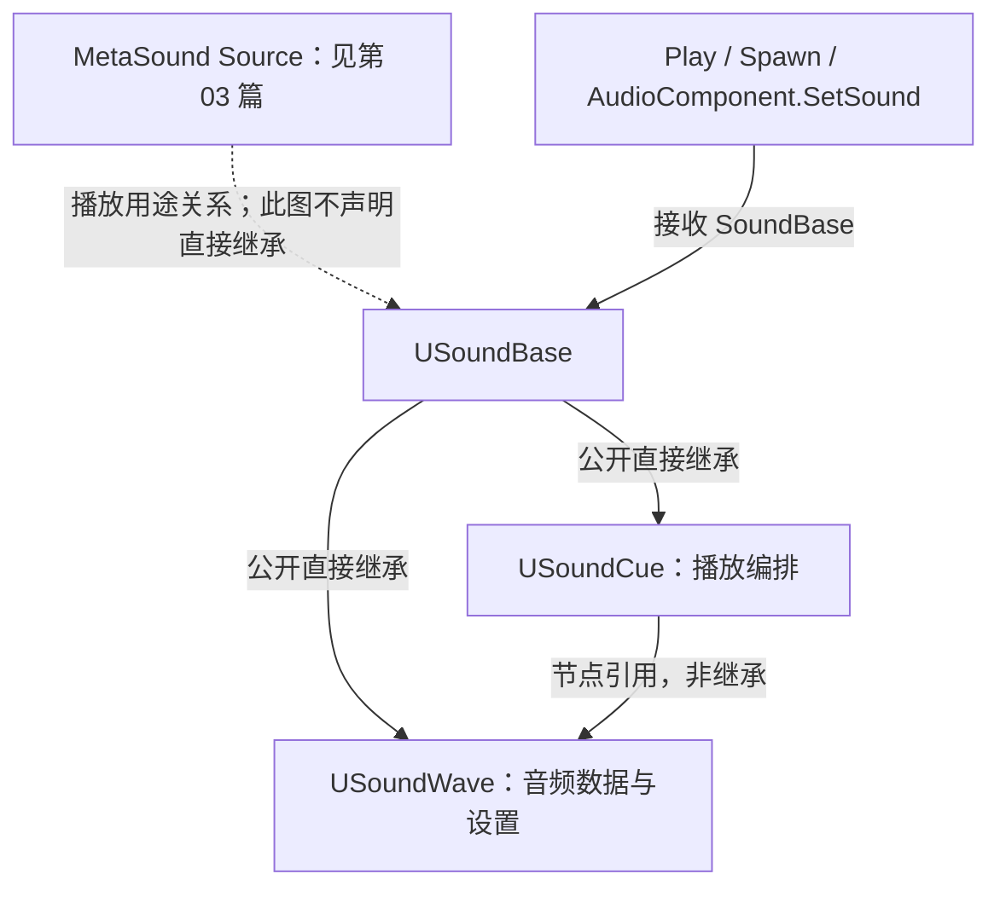
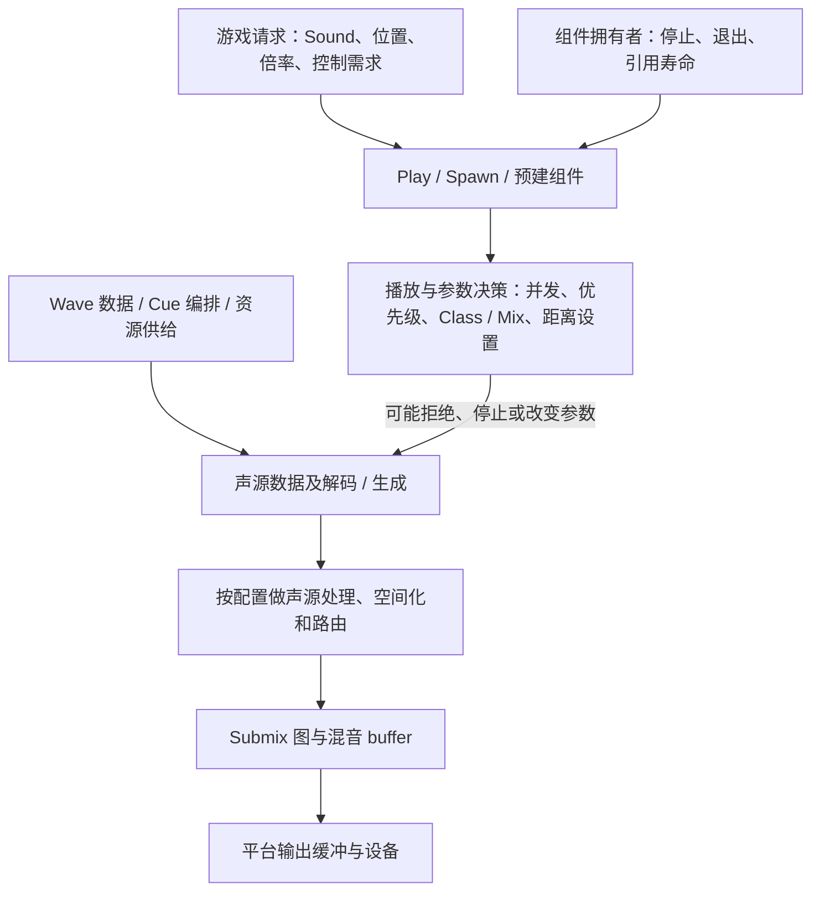
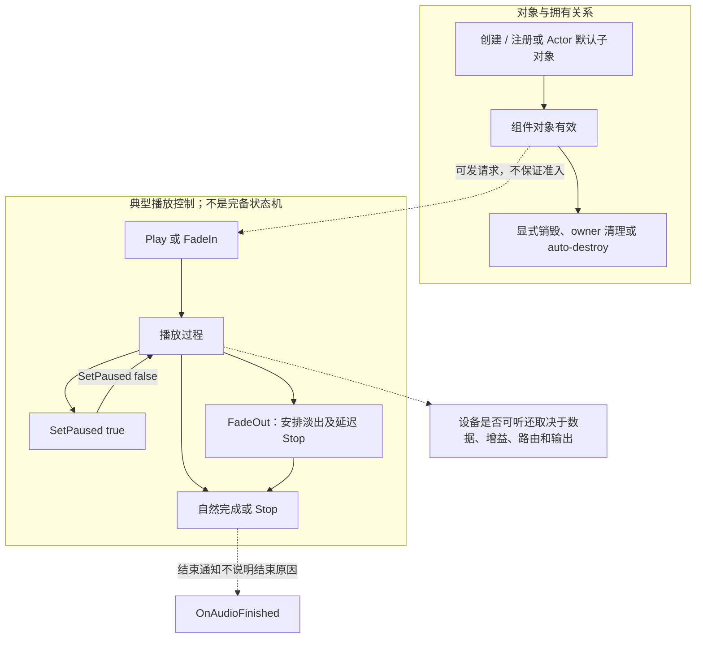
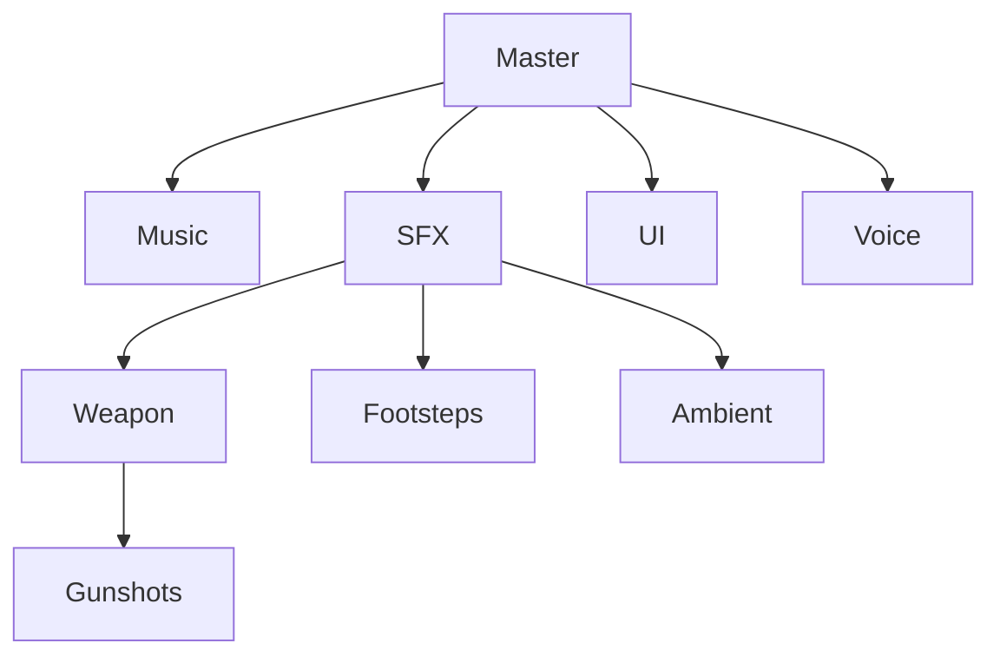
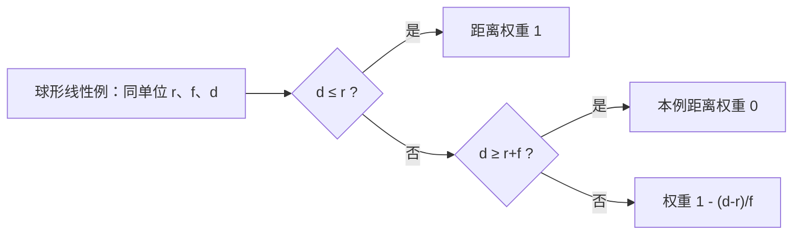
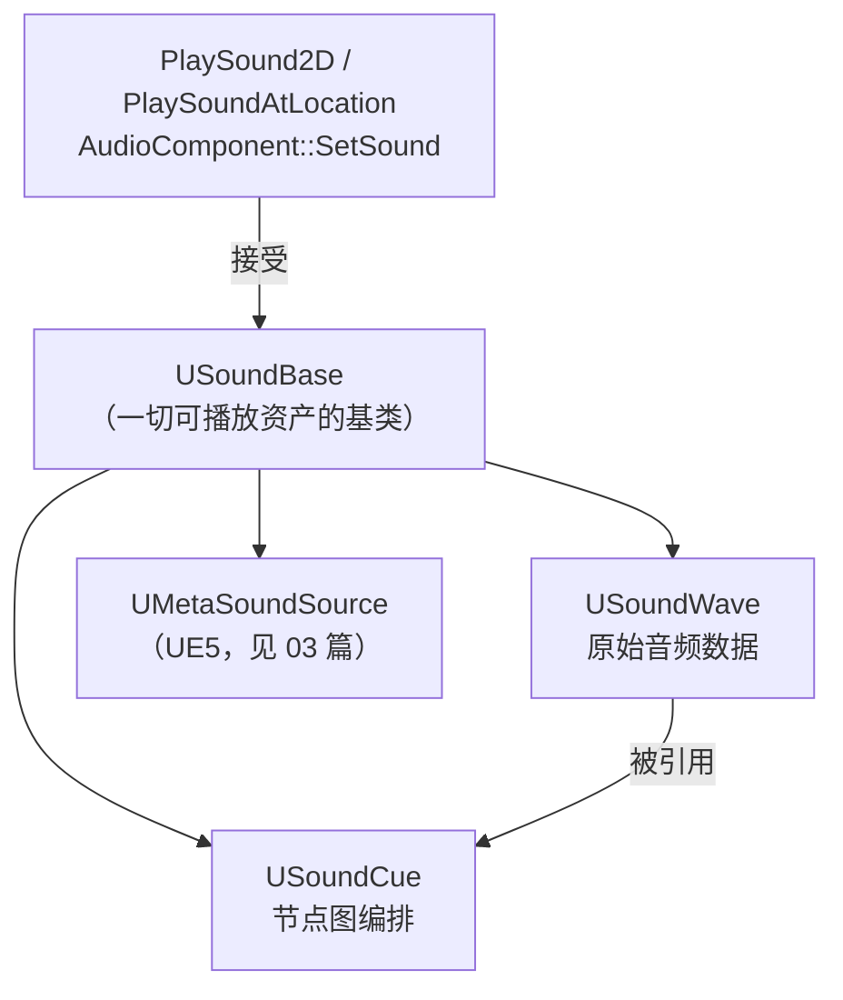
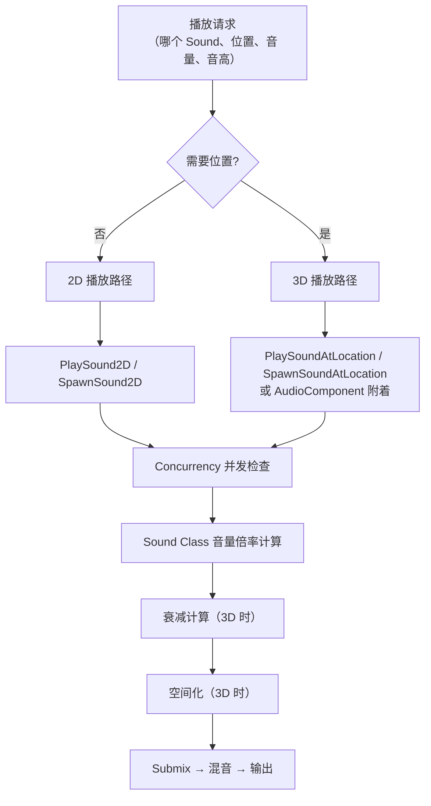
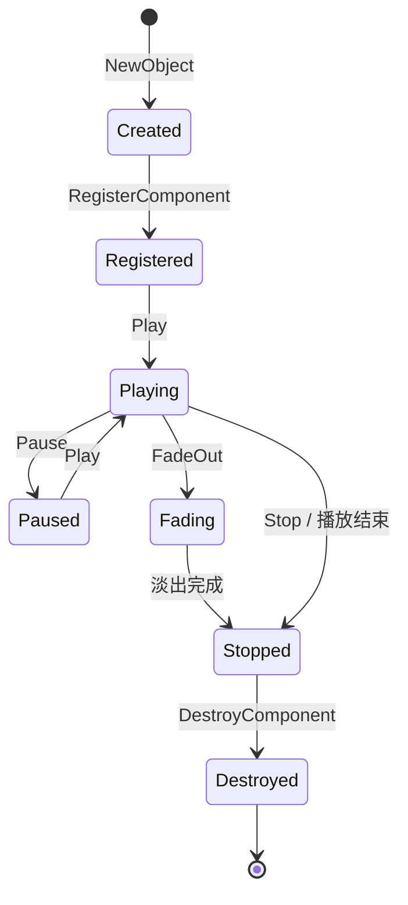
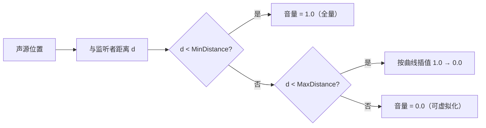

# 01 音频基础与播放
> 知识成熟度：L2。依据公开文档与静态推导整理，未做引擎运行验证。

> 所属系列：音频播放与程序化声音（原 10-音频系统，UE 客户端）
> 版本基准：主体依据 Epic UE 5.6 公开文档；GameplayStatics 的具体 C++ 签名和 Loading Behavior 枚举依据实际可读的 UE 5.5 页面，使用处分别标注。
> 适用范围：SoundWave / SoundCue、播放入口、组件所有权、Sound Class / Mix、Submix 职责，以及衰减入门。
> 前置知识：UE 编辑器基础、蓝图基础（或 C++ 基础）。示例面向有本地音频输出的游戏实例。
> 最后更新：2026-10-09（公开资料核对及全文静态整改）。
> 证据边界：本轮未读取本机 Build.version、受限引擎源码、项目资产与音频原文件，未运行 UE、UHT、编译、播放、设备采集或性能实验。原文的 UE 5.8.0 / CL 55116800 / 本机源码路径保存在文末历史原文，不能由公共 API 页面重新认证；UE 4.27 迁移也未在本轮验证。

## 一、概述

从磁盘素材到耳机中的枪声，需要先回答五个问题：导入的是什么数据、cook 后怎样编码、怎样请求播放、谁负责后续控制、怎样进入混音与输出。它们相互关联，但不是每次播放都在同一个线程上严格依次执行的清单。

本文保留五条实践主线：

1. **音频资产**：分别选择源文件格式、发布编码、装载与解码策略，估算容量并识别首播准备的边界。
2. **SoundBase 体系**：区分 Wave 的数据与 Cue 的播放编排，用变体和叠层制作开火音。
3. **播放方式**：为 UI、枪声、脚步、篝火和载具选择一次性调用或有明确拥有者的组件。
4. **音量与混音**：用 Class 分组、Mix 调整参数，用成对的请求实现进入商店或战斗区域时压低 BGM，并保存用户音量设置。
5. **衰减入门**：理解距离、衰减形状和空间化的不同作用，为第 02 篇建立输入概念。

读完应能画清某个声音的资产、调用者、退出路径和排查入口。播放请求被调用、组件有效、播放被接纳、设备真的发声，以及游戏业务完成，是五件不同的事。下面的示例只承担各自写明的局部职责；不会以声音结束来决定开火、车辆关闭或任务完成。

本文不展开 MetaSound、Submix DSP 图或完整空间音频系统，相关主题保留在第 02、03 篇。公开依据见 [Audio Engine Overview 5.6](https://dev.epicgames.com/documentation/en-us/unreal-engine/audio-engine-overview-in-unreal-engine?application_version=5.6) 和 [Audio Mixer Overview 5.6](https://dev.epicgames.com/documentation/en-us/unreal-engine/audio-mixer-overview-in-unreal-engine?application_version=5.6)。

## 二、核心概念（表格）

| 概念 | 类别 | 一句话作用 | 使用边界 |
| --- | --- | --- | --- |
| USoundBase | C++ 基类 | 播放 API 接受的声音对象类型 | 类型兼容不证明资源就绪或播放成功 |
| USoundWave | 声音资产 | 保存导入音频及相关播放、cook、装载属性 | 源扩展名不等于运行时编码与内存形态 |
| USoundCue | 声音资产 | 用节点图选择、组合和调制声音 | Wave 是其可引用的输入，不是其父类 |
| UAudioComponent | 场景组件 | 提供位置、附着和播放控制入口 | 有效对象不等于正在播放，更不等于可听 |
| PlaySound2D | 静态函数 | 请求非空间化、无距离衰减的播放 | fire-and-forget，无组件返回值 |
| PlaySoundAtLocation | 静态函数 | 在给定世界位置请求播放 | 不跟随 Actor；空间化、衰减取决于配置 |
| SpawnSound2D / AtLocation / Attached | 静态函数 | 创建并启动声音，返回组件供控制 | 要核返回值、附着方式、auto-destroy 和退出责任 |
| USoundClass | 分组资产 | 按声音类别组织参数及部分继承关系 | Class 树不是 Submix 音频 buffer 路由图 |
| USoundMix | 调整资产 | 对指定 Sound Class 施加参数变化 | 激活、持续时间、fade 和调用端配对分别管理 |
| USoundAttenuation | 设置资产 | 描述音量衰减、空间化及其他距离相关设置 | 衰减和空间化可独立配置 |
| USoundConcurrency | 规则资产 | 对同组播放施加数量、重触发及解决规则 | 准入不等于可听；规则计数不等于总设备 voice 数 |
| USoundSubmix | 混音总线 | 汇集音频 buffer，组织路由及效果处理 | 与 Class / Mix 调整参数的职责不同 |

（表 1：核心概念及容易混淆的边界）

## 三、原理详解

### 3.1 音频资产：格式、采样率与装载方式

#### 3.1.1 把原来的“三种形态”拆成三个选择轴

| 选择轴 | 选择的对象 | 典型问题 | 不能据此推出什么 |
| --- | --- | --- | --- |
| 导入源文件 | WAV、FLAC 等被导入的素材 | 该版本支持哪些格式、位深和声道布局？ | FLAC 源文件不表示游戏运行时继续解码 FLAC |
| cook / 发布编码 | 项目、平台和资产设置选定的 codec 与质量 | 包体、解码成本、质量怎样折中？ | Ogg 不是所有 UE 项目的默认，也没有固定 1/10 压缩比 |
| 装载、缓存与解码 | inline、流送、首 chunk 的请求与保留等 | 首播需要哪些数据，何时读入，哪些会被逐出？ | Streaming 不是与 WAV、压缩互斥的第三种文件格式 |

一个压缩编码的长音乐可以采用流送；PCM 数据也不能仅凭扩展名断言一定全部常驻。选型时先固定目标平台与 cook 配置，再讨论数据供给。5.6 导入文档给出的默认压缩选项为 Bink Audio；这是该页描述，不是对当前项目实配的观察。压缩后大小由内容、codec、质量与目标设置共同决定，不能拿固定比例做内存预算。[Importing Audio Files 5.6](https://dev.epicgames.com/documentation/en-us/unreal-engine/importing-audio-files?application_version=5.6)

未压缩 PCM 的数据体积可先手算：60 秒 × 44,100 样本帧/秒 × 2 声道 × 16/8 字节 = **10,584,000 字节，即 10.584 MB 或约 10.094 MiB**。这里不含文件头，也不等于 cook 包大小、解码缓冲或整条播放链的常驻内存。

| 原使用目的 | 可执行的资产选择思路 | 后续应取得的证据 |
| --- | --- | --- |
| 短 UI 提示、频繁枪声 | 先保证所需资产与首播数据准备，再选质量及装载策略 | 对象加载、数据准备与实际首播各自的记录 |
| 长 BGM、环境循环 | 评估流送和缓存工作集；可控组件负责退出 | 首 chunk、持续供给、cache 压力和停止行为 |
| 对白、过场 | 区分整段资源准备与当前段数据；保留打断路径；若需 seek 或非零 StartTime，先核目标 codec 能力（[导入与编码 5.6](https://dev.epicgames.com/documentation/en-us/unreal-engine/importing-audio-files?application_version=5.6)） | 加载失败、跳过、关卡退出时业务仍能结束；有 StartTime 参数不代表所有编码均支持 seek |

以上是规划输入，没有“短音必 PCM”“长音必极小内存”或“预加载后必零延迟”的保证。

#### 3.1.2 采样率、位深与声道各管一件事

- **采样率**：44.1 kHz、48 kHz 是常见素材规格。源采样率、cook 时的重采样、运行中采样率转换（SRC）和输出设备率需分别记录；导入不意味着一律转换到项目统一值，混音器也没有本文可认证的全平台固定默认率。
- **位深**：5.6 导入页列出 16 / 24-bit，并说明内部转换为 16-bit WAV，24-bit 转换不做 dither。因此保留高质量源文件有利于制作，但不能假设导入后仍原样保存 24-bit 数据或导出必然得到原件。[Audio Mixer Overview 5.6](https://dev.epicgames.com/documentation/en-us/unreal-engine/audio-mixer-overview-in-unreal-engine?application_version=5.6) 对编码声源的描述是：先解码为未压缩的 **32-bit float buffer**，再做采样率转换，供后续音频渲染使用。这与前述 16 / 24-bit 导入约束属于不同阶段；浮点仍有精度边界，也不能避免输出端饱和或掩盖素材问题。
- **声道**：mono 常作为点声源的制作起点；stereo 可用于音乐，也可在受支持的 panning 空间化中设置声道展开。是否适合某个 HRTF / 第三方空间化插件，要核那个插件和目标版本，不能由 mono / stereo 标签包办。

**官方文档冲突要显式保留**：5.6 [Sound Cue Reference](https://dev.epicgames.com/documentation/en-us/unreal-engine/sound-cue-reference-for-unreal-engine?application_version=5.6) 的旧段落称 stereo 不空间化，但同页又列 3D Stereo Spread；5.6 [Audio Engine Overview](https://dev.epicgames.com/documentation/en-us/unreal-engine/audio-engine-overview-in-unreal-engine?application_version=5.6) 与 [Sound Attenuation](https://dev.epicgames.com/documentation/en-us/unreal-engine/sound-attenuation-in-unreal-engine?application_version=5.6) 描述了 stereo 空间化相关行为。本文采用“内建 panning 支持 mono / stereo”的限定说法，不把冲突页推广为所有 stereo / HRTF 组合的承诺。

#### 3.1.3 对象加载、首 chunk 与解压不是同一个开关

5.6 `USoundWave::DecompressionType` 的公开说明是加载时决定所需缓冲区的类型。原文把 Details 写成 Synchronous / Asynchronous / Streaming 三选一，没有相应公开字段合同支持，应改为核具体版本的资产装载属性与平台 cook 设置。[USoundWave 5.6](https://dev.epicgames.com/documentation/unreal-engine/API/Runtime/Engine/USoundWave?application_version=5.6)

下表按实际可读的 **5.5 ESoundWaveLoadingBehavior** 名称解释；适用该页注明的 stream caching 条件。继承与覆盖关系需按具体字段检查，不能将枚举用作所有 Class 属性的统一继承开关。

| 具名 Loading Behavior | 局部意义 | 首播与寿命边界 |
| --- | --- | --- |
| Inherited | 从适用的上层配置继承装载行为 | 需继续追溯 Class / 项目层，不能从本项猜最终行为 |
| RetainOnLoad | 加载时保留首个音频 chunk | 5.5 枚举页限定至 Wave 销毁或调用 ReleaseCompressedAudioData；不等于全曲 PCM 常驻，有内存代价 |
| PrimeOnLoad | 加载时请求首个 chunk | prime 后仍可能因 cache 压力被逐出 |
| LoadOnDemand | 首 chunk 到播放或显式 prime 时才请求装载 | 首次请求可能等待数据，不能预设固定毫秒数 |
| ForceInline | 按枚举所述使用非流送解码路径 | 需结合 cook 与资源预算，不等于无 CPU 或无延迟 |

来源：[Loading Behavior 5.5](https://dev.epicgames.com/documentation/unreal-engine/API/Runtime/Engine/Sound/ESoundWaveLoadingBehavior?application_version=5.5)、[Stream Caching 5.6](https://dev.epicgames.com/documentation/en-us/unreal-engine/an-overview-of-audio-stream-caching-in-unreal-engine?application_version=5.6)。5.6 的 Wave 类页有 Loading Behavior 相关成员；本轮未取得固定 5.6 枚举正文，不能将 5.5 数值默认为 5.6 实现。

**另一个文档冲突**：5.6 stream cache 指南在 Prime on Load 与 Retain on Load 两段均给 `au.streamcache.DefaultSoundWaveLoadingBehavior` 数值 `2`；5.5 枚举页分别给 Prime=`2`、Retain=`1`。本文使用上表具名设置，不复制矛盾 cvar 来修改项目，也不以跨版本枚举裁决 5.6 源码。该指南的 cache 单位和“无延迟”措辞不作为本项目预算或时延事实。

完整准备链是：软引用可被解析 → UObject 加载完成 → 所需音频数据有供给条件 → 播放请求满足相关规则 → 混音与设备输出。链中任一前件都不足以证明最后一件成立。Asset Manager / 软引用预加载主要解决对象依赖，首 chunk 与持续流送仍需自己的策略；曾经 prime 的对象也可能再次触发 I/O。

### 3.2 USoundBase 体系：Wave、Cue 与播放编排



（图 1：继承、资产引用和接口用途分别标注。MetaSound 固定 5.6 继承页本轮未读到，不用动态当前页补造直接继承箭头。）

`USoundBase` 提供播放对象的共同类型；`USoundWave` 管音频与设置；`USoundCue` 将 Wave Player、Random、Mixer、Delay、Modulator 等节点组织为播放图。Cue 不会改写导入的源文件，但其混合、调制等操作会影响听到的结果，因此“完全不改变音频数据”也容易误导。[USoundCue 5.6](https://dev.epicgames.com/documentation/unreal-engine/API/Runtime/Engine/USoundCue?application_version=5.6)、[Sound Cue Reference 5.6](https://dev.epicgames.com/documentation/en-us/unreal-engine/sound-cue-reference-for-unreal-engine?application_version=5.6)

| 需求 | Wave | Cue |
| --- | --- | --- |
| 一个确定声音 | 可直接请求播放；直接 Wave 的循环用 `bLooping`，配置链见下段 | 可以只引用一条 Wave；循环由 Wave Player 的 Looping 配置，见下段 |
| 每次选一种开火变体 | 调用者自己选择输入 | Random 按权重选择分支；检查 without replacement / preselect 设置 |
| 同时叠枪声与机械声 | 调用者负责多个请求 | Mixer 叠层，各分支配置相对音量 |
| 音高或音量变化 | 播放入口或组件参数 | Modulator 等节点；不是 Random 节点上的虚构 Randomize Pitch 开关 |
| 成本判断 | 依赖 codec、voice、资源供给等 | 另有图求值与可能增加的分支 / voice；不能凭资产类型固定排名 |

**循环资产配置（UE 5.6）**：直接播放 `USoundWave` 时启用该资产的 `bLooping`；其公开说明限定直接播放，不将这个开关当作经 Cue 播放的循环配置。使用 `USoundCue` 时，在引用所需 Wave 的 **Wave Player** 节点启用 **Looping**，并将该节点的音频链连接到 **Output**。组件的 Auto Destroy 管寿命，不是循环开关；以上配置也不保证源素材或任意 Cue 组合天然无接缝。依据：[USoundWave 5.6 的 bLooping](https://dev.epicgames.com/documentation/unreal-engine/API/Runtime/Engine/USoundWave?application_version=5.6)、[Sound Cue Reference 5.6 的 Wave Player / Output](https://dev.epicgames.com/documentation/en-us/unreal-engine/sound-cue-reference-for-unreal-engine?application_version=5.6)。

制作示例：项目可准备 3～5 条枪声 Wave，由 Random 选一条，再用 Mixer 叠较轻的机械声，最后经 Output 输出。3～5 是制作选择，不是引擎阈值。随机音高可放入口或 Modulator；避免无意同时随机两次。变体不会自动消除相位叠加，也不证明性能安全。

### 3.3 播放方式：先选择位置和控制权

| 入口 | 位置与移动 | 后续控制 | 典型用途 |
| --- | --- | --- | --- |
| PlaySound2D | 不做空间化或距离衰减 | 无返回组件 | UI 点击、短提示 |
| PlaySoundAtLocation | 给定世界位置，不随调用者移动 | 无返回组件 | 开火、爆炸、允许独立尾音的脚步 |
| SpawnSound2D | 2D 路径 | 返回组件，调用即启动 | 可打断的音乐或界面声音 |
| SpawnSoundAtLocation | 固定世界位置 | 返回组件，调用即启动 | 不移动的篝火循环 |
| SpawnSoundAttached | 按指定父组件、插槽和附着规则移动 | 返回组件，调用即启动 | 需要随物体移动的声音 |
| 预建 UAudioComponent | 可附着在 Actor 的根或网格组件 | 配置与回调可先完成，再选 Play 或 FadeIn 启动 | 角色脚步组件、载具引擎声 |

Play 的一次性请求与 Spawn 返回控制对象是接口合同，不能据此臆造 PlaySoundAtLocation 内部一定创建临时 AudioComponent。`OwningActor` 用于按 owner 限制并发，不负责附着，也不意味着自动网络复制。SpawnAtLocation 的返回值也不使位置自动跟随 owner。[PlaySoundAtLocation 5.5](https://dev.epicgames.com/documentation/unreal-engine/API/Runtime/Engine/Kismet/UGameplayStatics/PlaySoundAtLocation/2?application_version=5.5)、[SpawnSound2D 5.5](https://dev.epicgames.com/documentation/unreal-engine/API/Runtime/Engine/Kismet/UGameplayStatics/SpawnSound2D?application_version=5.5)、[Spawn Sound at Location 5.6](https://dev.epicgames.com/documentation/en-us/unreal-engine/BlueprintAPI/Audio/SpawnSoundatLocation?application_version=5.6)

#### 3.3.1 职责与数据流，不把示意图当完整执行顺序



（图 2：职责和音频数据流示意，不声明线程间的全局先后，也不表示每个声音都启用图中所有效果。）

Class / Mix 调整声音参数；Submix 汇集和处理音频 buffer。衰减改变与距离有关的量，空间化生成方向感，两者可以独立开关。解码、流送和输出缓冲也有自己的执行时机，不能只排一条“Class → 衰减 → 空间化”链就证明最终样本顺序。[Audio Mixer Overview 5.6](https://dev.epicgames.com/documentation/en-us/unreal-engine/audio-mixer-overview-in-unreal-engine?application_version=5.6)

并发规则有拒绝新请求、停止旧声音等不同选择；多个适用的 Concurrency 规则需要共同满足。文档指出 active components 可参与其计数，不能简单把计数等同“此刻听得到的声音数”。全局 Max Channels / voice 选择、虚拟化、静音参数和数据供给又是其他因素。`PlayWhenSilent` 的说明包括继续占用 voice；`Restart` 的循环恢复行为也不能推广为所有无声对象均被销毁。[Sound Concurrency 5.6](https://dev.epicgames.com/documentation/en-us/unreal-engine/sound-concurrency-reference-guide?application_version=5.6)、[VirtualizationMode 5.6](https://dev.epicgames.com/documentation/unreal-engine/API/Runtime/Engine/EVirtualizationMode?application_version=5.6)

#### 3.3.2 UAudioComponent 的对象、播放和可听性分开看



（图 3：三个视角的局部关系。回调时间、跨线程队列和设备尾音没有在图中建模。）

| 操作 / 属性 | 可依据的公开合同 | 调用者仍须承担的事 |
| --- | --- | --- |
| bAutoActivate=false | 禁用组件自动激活，便于显式启动 | 它不证明下一次 Play 一定获准或发声 |
| Play / FadeIn | FadeIn 本身会启动播放并加入淡入 | 两者择一启动；Spawn 已启动，不紧接着再 Play |
| SetPaused(true / false) | 暂停 / 恢复控制 | 不把 Play 当作专用的恢复操作 |
| FadeOut | 在给定时长曲线下调整音量并延迟 Stop | 常规淡出后不立即 Stop，否则会打断淡出意图 |
| Stop / OnAudioFinished | Stop 停止播放；完成通知也可能由提前 Stop 引起 | 通知不携带“玩家听完”或业务成功的保证 |
| bAutoDestroy | 自动销毁策略影响完成后是否仍有组件对象 | 需按创建入口显式选择，不跨帧保存无保护的裸指针 |
| bStopWhenOwnerDestroyed | 控制组件相应 owner 销毁时的停止行为 | 固定位置 Spawn 示例仍明确自己的退出路径，不猜归属 |

对应依据：[UAudioComponent 5.6](https://dev.epicgames.com/documentation/unreal-engine/API/Runtime/Engine/UAudioComponent?application_version=5.6)、[FadeIn 5.6](https://dev.epicgames.com/documentation/unreal-engine/API/Runtime/Engine/UAudioComponent/FadeIn?application_version=5.6)、[FadeOut 5.6](https://dev.epicgames.com/documentation/unreal-engine/API/Runtime/Engine/UAudioComponent/FadeOut?application_version=5.6)。

对 Actor 拥有、要重复使用的组件，成员用 `UPROPERTY() TObjectPtr<UAudioComponent>`，并把配置、回调绑定放在启动之前；结束 owner 时停止并撤下自己绑定的回调。对 `bAutoDestroy=true` 的一次生命周期组件，可保存 `TWeakObjectPtr`，每次操作前取有效指针。weak 不延长寿命，UPROPERTY 强引用也不能阻止显式 DestroyComponent。[Object Pointers 5.6](https://dev.epicgames.com/documentation/en-us/unreal-engine/object-pointers-in-unreal-engine?application_version=5.6)、[Components 5.6](https://dev.epicgames.com/documentation/en-us/unreal-engine/components-in-unreal-engine?application_version=5.6)

这些是对象访问规则，不是异步静默协议：解绑、Stop、指针变空或 OnAudioFinished 都不能单独证明引擎及硬件所有排队工作已经排空。本篇有限例中没有外部异步任务需要取消；业务退出独立完成，不等待音频回调。对自动销毁、并发拒绝、owner 结束等情况，也不能假设总有一个回调为业务收尾。

### 3.4 音量与混音：Class、Mix、Submix 分工

#### 3.4.1 Sound Class 分组树



（图 4：项目可采用的 Sound Class 分组，不是所有项目已有的默认树。）

检查声音最终使用的 Class 归属，不假设所有新资产都明确指向同一个 Master。不同属性的继承规则不同。只为解释音量路径，假定本例没有其他调整，Master `0.8` × SFX `0.9` × Weapon `1.0` × Gunshots `1.0` = `0.72`，单位是**线性倍率**，不是 dB 或测得响度。再明确增加独立的 `0.3` 因子，纸面结果才是 `0.216`；不能用此公式预测所有 Mix 重叠结果。[Sound Classes 5.6](https://dev.epicgames.com/documentation/en-us/unreal-engine/sound-classes-in-unreal-engine?application_version=5.6)

#### 3.4.2 Sound Mix：写清资产设置和激活拥有者

Sound Mix 的 `SoundClassEffects` 列表包含 `FSoundClassAdjuster`。Adjuster 指定目标 Class、音量与音高调整、是否影响子 Class 等；资产的 `FadeInTime`、`FadeOutTime`、`InitialDelay`、`Duration` 和 `EQPriority` 属于 **USoundMix**，不是每个 Adjuster 都存一套 fade / voice Priority。`SetSoundMixClassOverride` 的 FadeInTime 是该运行时调用的插值参数，要与上述资产字段分开。[USoundMix 5.6](https://dev.epicgames.com/documentation/unreal-engine/API/Runtime/Engine/USoundMix?application_version=5.6)、[FSoundClassAdjuster 5.6](https://dev.epicgames.com/documentation/unreal-engine/API/Runtime/Engine/FSoundClassAdjuster?application_version=5.6)、[SetSoundMixClassOverride 5.5](https://dev.epicgames.com/documentation/unreal-engine/API/Runtime/Engine/Kismet/UGameplayStatics/SetSoundMixClassOverride?application_version=5.5)

本篇战斗 / 商店 duck 例限定为**一个本地 owner 管一个专用 Mix**：

1. 创建 `SM_CombatDuck`，只添加 Music Adjuster：VolumeAdjuster=`0.3`、PitchAdjuster=`1.0`；是否影响 Music 子类通过 `bApplyToChildren` 明确配置。
2. Mix 资产设 InitialDelay=`0` 秒、FadeInTime=`0.5` 秒、FadeOutTime=`0.5` 秒。为事件控制退出，Duration 选负值（本例 `-1`），避免正持续时间先结束。5.6 API 将负 Duration 描述为持续到另一个 Mix 被设置；这不是所有激活方式与其他系统干预下无限维持的保证。
3. 这个专用 Mix 不同时充当 Base Mix、Passive Sound Mix 或其他 owner 的共享控制项。由本 owner 的首次 Enter 发一次 Push，Exit 发对应 Pop；重复事件用调用端标志去重。
4. 标志只表示“本 owner 已经发出未配对的 Push 请求”，不表示当前 duck 仍有效或可听。资产配置变化、其他系统干预和 world 退出须与该含义区分。

```cpp
// 两个不同事件中的对应动作，不是连续调用的播放示例。
// 前提：有效本地 World、专用 CombatMix、同一 owner；完整去重/退出见示例 5。
UGameplayStatics::PushSoundMixModifier(this, CombatMix); // 首次 Enter
UGameplayStatics::PopSoundMixModifier(this, CombatMix);  // 对应 Exit
```

Push / Pop 不能理解为普通容器 LIFO，更不能假设每 Push 一次就将增益再乘一次。公开 `FSoundMixState` 有 active / passive 引用与 fade 状态字段，但仅凭字段不证明跨 owner 的撤销算法。多个区域共同影响一个 Mix 时，需要另行设计共有 owner 或计数策略；本文 bool 例不覆盖它。[FSoundMixState 5.6](https://dev.epicgames.com/documentation/unreal-engine/API/Runtime/Engine/FSoundMixState?application_version=5.6)

`SetBaseSoundMix` 用于基线方案；过场也可用 Mix 压环境、抬对白。两者仍需明确谁设置、谁恢复，以及与临时 duck 的关系，不能靠“最后 Pop 自动恢复一切”管理多个系统。

#### 3.4.3 用户音量和输出链各层

| 层次 | 控制对象 | 排查时的含义 |
| --- | --- | --- |
| 单次播放 / 组件 | VolumeMultiplier、PitchMultiplier | 本次请求的参数，均是倍率 |
| Sound Class | 类别参数与树关系 | 为 Music / SFX / UI / Voice 提供分组 |
| Sound Mix | 对 Class 的临时或设置调整 | 检查是否被激活、持续时间、其他影响者 |
| 距离相关设置 | 衰减及空间化 | 固定位置、监听者、形状、距离、路由分别检查 |
| Submix | 音频 buffer 路由和 DSP | 不是 Class 参数树的别名 |
| 平台 / 设备 | 输出缓冲、设备音量和路由 | 上层参数正常仍不能证明可听 |

这不是从高到低的强制运算顺序。倍率超过 `1.0` 不必然已经削波，倍率都低于 `1.0` 也不能保证叠加后的信号不超范围：样本 `0.1 × 2 = 0.2`，两路样本 `0.7 + 0.6 = 1.3`，还需结合后续 DSP 和最终输出范围判断。听感响度也不能仅用某个瞬时样本代表。

设置界面保留 Master / Music / SFX / Voice 四路数值。可采用专用的用户设置 Mix：加载有效资产后应用各 Class override，并由一个本地 owner 负责激活一次及退出清理；临时 duck 另有职责。不要每次拖动滑块就追加 Push。存档链是：

1. 滑块值采用项目选定的线性倍率范围，例如 `[0, 1]`；若使用 dB UI，明确另做转换，不把数字直接混用。
2. 将四个值写入项目自己的 SaveGame 字段或配置对象；保存结果失败时保留当前会话值并按项目交互提示，不能声称已持久化。
3. 下次读取时检查槽位结果、对象类型、字段版本、有限数值及范围；缺失或非法采用明示默认值，再做限幅。
4. 资源与本地 world 就绪后，用 `SetSoundMixClassOverride` 等已核接口将值应用到设置 Mix 的相应 Class，并按该 Mix 的 owner 策略激活。加载数值本身不会改变听到的声音。

保存用户选择，不调用声音资产的 `SaveConfig()` 来假装保存了偏好；本文也不依赖未核实的通用“Set Sound Class Volume”蓝图节点。[Saving and Loading 5.6](https://dev.epicgames.com/documentation/en-us/unreal-engine/saving-and-loading-your-game-in-unreal-engine?application_version=5.6)

### 3.5 音频衰减基础（第 02 篇预告）

`USoundAttenuation` 可作为可复用设置，由 Sound 引用或在播放入口覆盖。选中资产本身不代表音量衰减、空间化和遮挡全都开启，要分别核对相应开关。

以**球形、线性音量衰减**为有限教学例：Inner Radius=`r`，Falloff Distance=`f` 是从内半径之外延伸的长度；外边界为 `r+f`，不是把 Falloff Distance 当绝对 Max Distance。`r`、`f`、监听者距离 `d` 全部采用 Unreal Units（UU），且 `r ≥ 0, f > 0`。本例权重在内圈为 1、外圈为 0、中间为 `1-(d-r)/f`。



（图 5：仅表示本例距离权重。权重 0 不表示组件销毁、并发计数归零或必然虚拟化。）

例如 `r=100 UU, f=900 UU, d=550 UU`，权重为 `0.5`。其他形状、曲线与 Natural Sound 的边界模式必须按其设置解释；不能断言所有声音超过某个“Max”都突然不可听。距离低通、空气吸收等也可能让远处更闷；空间化则处理方向，不应把两者混作同一音量函数。[Sound Attenuation 5.6](https://dev.epicgames.com/documentation/en-us/unreal-engine/sound-attenuation-in-unreal-engine?application_version=5.6)、[Sound Cue Reference 5.6](https://dev.epicgames.com/documentation/en-us/unreal-engine/sound-cue-reference-for-unreal-engine?application_version=5.6)

## 四、代码 / 蓝图示例

### 4.1 C++ 示例

以下是**静态教学片段**：成员声明放入项目相应 UCLASS 的头文件，方法定义放入 `.cpp`；省略项目模块导出宏、generated header 和完整类壳，不是本轮编译通过的独立工程。各类按标注继承 AActor 或 ACharacter，头文件保留所需父类 / 类型声明及 UFUNCTION；项目需要 Engine 模块。资产在编辑器中指定，本轮未创建这些资产。GameplayStatics 调用签名按 [5.5 类索引](https://dev.epicgames.com/documentation/en-us/unreal-engine/API/Runtime/Engine/Kismet/UGameplayStatics?application_version=5.5) 核对，组件行为按 5.6 文档核对；不能据此声称任意版本可直接编译。

所有示例在本地游戏线程的有效 world 生命周期中调用；没有跨线程原始 UObject 访问、外部异步任务或跨 world 管理。`VolumeMultiplier` / `PitchMultiplier` 是线性倍率，StartTime 和 fade 时长是秒，FVector 世界坐标采用 UU。

#### 示例 1：2D 播放（UI 音效）

场景：一个本地 `AUIAudioExample : AActor` 为按钮提供声音。一次点击只发一个请求，按钮的业务结果独立处理。`bIsUISound=true` 明确 UI 声音分类意图；UI 分组和暂停期间行为还需核项目设置。

```cpp
// AUIAudioExample.h 类内：USoundBase 需声明或包含其头文件。
UPROPERTY(EditDefaultsOnly, Category="Audio")
TObjectPtr<USoundBase> UIAsset = nullptr;
void PlayButtonSound();

// AUIAudioExample.cpp
#include "Kismet/GameplayStatics.h"
#include "Sound/SoundBase.h"

void AUIAudioExample::PlayButtonSound()
{
    if (!GetWorld() || !IsValid(UIAsset.Get()))
    {
        return; // 音频输入不可用；不阻塞按钮业务。
    }
    UGameplayStatics::PlaySound2D(
        this, UIAsset.Get(), 1.0f, 1.0f, 0.0f,
        /*ConcurrencySettings*/ nullptr,
        /*OwningActor*/ this, /*bIsUISound*/ true);
}
```

该调用没有可停止的组件返回值，不能将正常返回当“用户已听到”。若这条 UI 声音要在关闭弹窗时淡出，应改为明确 owner 的组件路径并定义关闭策略，不能给 fire-and-forget 临时补一个猜测的全局 Stop。

#### 示例 2：3D 一次性播放（开火音）

场景：`AWeaponAudioExample : AActor` 接受已计算好的枪口**世界坐标**。调用者先确认 mesh 与 socket 存在，再传位置；不存在时由项目决定备用位置或跳过声音，不能把一个无效 socket 的位置误作枪口证据。FireAttenuation 与 FireConcurrency 为项目配置输入，可留空以使用相应资产 / 默认策略，但应记录最终使用哪套规则。

```cpp
// AWeaponAudioExample.h 类内；声明 USoundBase / USoundAttenuation / USoundConcurrency。
UPROPERTY(EditDefaultsOnly, Category="Audio")
TObjectPtr<USoundBase> FireSound = nullptr;
UPROPERTY(EditDefaultsOnly, Category="Audio")
TObjectPtr<USoundAttenuation> FireAttenuation = nullptr;
UPROPERTY(EditDefaultsOnly, Category="Audio")
TObjectPtr<USoundConcurrency> FireConcurrency = nullptr;
void PlayFireSound(const FVector& MuzzleWorldLocation);

// AWeaponAudioExample.cpp
#include "Kismet/GameplayStatics.h"
#include "Sound/SoundBase.h"
#include "Sound/SoundAttenuation.h"
#include "Sound/SoundConcurrency.h"

void AWeaponAudioExample::PlayFireSound(const FVector& MuzzleWorldLocation)
{
    if (!GetWorld() || !IsValid(FireSound.Get()))
    {
        return;
    }
    UGameplayStatics::PlaySoundAtLocation(
        this, FireSound.Get(), MuzzleWorldLocation, FRotator::ZeroRotator,
        1.0f, FMath::RandRange(0.95f, 1.05f), 0.0f,
        FireAttenuation.Get(), FireConcurrency.Get(),
        /*OwningActor: 用于 owner 并发规则*/ this,
        /*InitialParams*/ nullptr);
}
```

`0.95～1.05` 是此项目示例的轻微随机倍率。若 Cue 已有 Modulator，先决定随机放哪一层。固定位置适合一次性枪声；位置不会随后续武器运动而改变。该入口不自动复制，远端玩家声音需要项目自己的事件策略；本例没有网络实验，也不以播放回执决定弹药、伤害或开火是否成功。

#### 示例 3：生成可控音频组件（篝火循环音）

场景限定为 `ACampfireAudioExample : AActor` 的**一轮启动至结束**。篝火不移动；FireLoopSound 按 3.2“循环资产配置”设置：直接 Wave 启用 `bLooping`；Cue 在 Wave Player 启用 Looping，并连接 Output。SpawnAtLocation 创建即启动，`bAutoDestroy=true`；成员 weak 仅用于后续控制，不持有组件。失败不重试、不等待完成回调，业务仍可关闭篝火。本例不处理停止过程中重新点燃；需要多轮重用时应另定生命周期方案。

```cpp
// ACampfireAudioExample.h 类内；头文件包含 Components/AudioComponent.h。
UPROPERTY(EditDefaultsOnly, Category="Audio")
TObjectPtr<USoundBase> FireLoopSound = nullptr;
UPROPERTY(EditDefaultsOnly, Category="Audio")
TObjectPtr<USoundAttenuation> FireAttenuation = nullptr;
TWeakObjectPtr<UAudioComponent> FireAC;
bool bStartAttempted = false;
bool bEndRequested = false;
void StartFireSound(const FVector& FireWorldLocation);
void FadeFireSound();
virtual void EndPlay(const EEndPlayReason::Type EndPlayReason) override;

// ACampfireAudioExample.cpp
#include "Kismet/GameplayStatics.h"
#include "Components/AudioComponent.h"
#include "Sound/SoundBase.h"
#include "Sound/SoundAttenuation.h"

void ACampfireAudioExample::StartFireSound(const FVector& FireWorldLocation)
{
    if (bStartAttempted || bEndRequested || !GetWorld() ||
        !IsValid(FireLoopSound.Get()))
    {
        return;
    }
    bStartAttempted = true; // 只记录调用尝试，不证明已经可听。
    FireAC = UGameplayStatics::SpawnSoundAtLocation(
        this, FireLoopSound.Get(), FireWorldLocation, FRotator::ZeroRotator,
        1.0f, 1.0f, 0.0f, FireAttenuation.Get(), nullptr,
        /*bAutoDestroy*/ true);
    // 不再调用 Play。返回空、规则拒绝或之后失效都不阻塞篝火业务。
}

void ACampfireAudioExample::FadeFireSound()
{
    if (bEndRequested)
    {
        return;
    }
    bEndRequested = true;
    if (UAudioComponent* AC = FireAC.Get())
    {
        AC->FadeOut(0.5f, 0.0f); // API 安排淡出与延迟 Stop；不紧接着 Stop。
    }
}

void ACampfireAudioExample::EndPlay(const EEndPlayReason::Type EndPlayReason)
{
    bEndRequested = true;
    if (UAudioComponent* AC = FireAC.Get())
    {
        AC->Stop(); // owner 退出采用立即停止策略，可能打断尚未完成的淡出。
    }
    FireAC.Reset();
    Super::EndPlay(EndPlayReason);
}
```

FadeOut 的 `0.5` 是请求的秒数，不是硬件输出精确归零的实测时刻。这里没有绑定 OnAudioFinished：Spawn 已启动后才有返回值，不能假装“返回后绑定”覆盖了所有早期情况。组件自然完成、Stop 后 auto-destroy、已失效 weak 都按有效性检查处理；业务结束由 `bEndRequested` 表达自己的请求，不代表引擎已完全静默。

#### 示例 4：附着在角色上的音频组件（脚步）

场景：`AMyCharacter : ACharacter` 拥有一个可重复使用的组件。它是默认子对象，Actor 生命周期负责注册与销毁；无需每次脚步都 NewObject。组件不 auto-destroy，避免下一次脚步使用已销毁对象。资产在本例生命周期内固定，PlayFootstep 从 BeginPlay 完成后的动画事件调用。此例采用**单组件重触发**，不承诺多次脚步尾音独立叠放；需要独立尾音可改用示例 2 的每次固定位置请求。

```cpp
// AMyCharacter.h 类内；包含 Components/AudioComponent.h，并声明 USoundBase。
UPROPERTY(VisibleAnywhere, Category="Audio")
TObjectPtr<UAudioComponent> FootstepAC = nullptr;
UPROPERTY(EditDefaultsOnly, Category="Audio")
TObjectPtr<USoundBase> FootstepCue = nullptr;
bool bAudioOwnerEnding = false;
bool bObservedFinishedNotification = false; // 仅诊断，不是业务成功。
UFUNCTION()
void OnFootstepAudioFinished();
AMyCharacter();
virtual void BeginPlay() override;
void PlayFootstep();
virtual void EndPlay(const EEndPlayReason::Type EndPlayReason) override;

// AMyCharacter.cpp
#include "Components/AudioComponent.h"
#include "Sound/SoundBase.h"

AMyCharacter::AMyCharacter()
{
    FootstepAC = CreateDefaultSubobject<UAudioComponent>(TEXT("FootstepAudio"));
    FootstepAC->SetupAttachment(GetRootComponent()); // ACharacter 已有根组件。
    FootstepAC->bAutoActivate = false;
    FootstepAC->bAutoDestroy = false;
    FootstepAC->bStopWhenOwnerDestroyed = true;
}

void AMyCharacter::BeginPlay()
{
    Super::BeginPlay();
    if (!IsValid(FootstepAC.Get()))
    {
        return;
    }
    FootstepAC->SetSound(FootstepCue.Get());
    FootstepAC->SetVolumeMultiplier(0.8f);
    FootstepAC->OnAudioFinished.AddDynamic(
        this, &AMyCharacter::OnFootstepAudioFinished); // 在首次请求前绑定。
}

void AMyCharacter::PlayFootstep()
{
    if (bAudioOwnerEnding || !IsValid(FootstepAC.Get()) ||
        !IsValid(FootstepCue.Get()))
    {
        return;
    }
    bObservedFinishedNotification = false;
    FootstepAC->Play(); // 动画脚步事件发请求，动画与移动不等待音频。
}

void AMyCharacter::OnFootstepAudioFinished()
{
    if (!bAudioOwnerEnding)
    {
        bObservedFinishedNotification = true; // 自然完成或 Stop 都可能通知。
    }
}

void AMyCharacter::EndPlay(const EEndPlayReason::Type EndPlayReason)
{
    bAudioOwnerEnding = true;
    if (IsValid(FootstepAC.Get()))
    {
        FootstepAC->OnAudioFinished.RemoveDynamic(
            this, &AMyCharacter::OnFootstepAudioFinished);
        FootstepAC->Stop();
    }
    Super::EndPlay(EndPlayReason); // 默认子对象由 Actor 清理。
}
```

`bObservedFinishedNotification` 只观察“收到过通知”。它不关联某次动画脚步的成功，也不区分自然结束与停止；重触发场景不能拿它作为逐请求完成凭据。本例没有异步回调工作需要排空；RemoveDynamic 与 owner 标志仅限定此对象自己的处理，不能外推为引擎、设备或所有委托已经静默。若手动在运行时 NewObject 创建组件，则要另外安排有效 Outer、SceneComponent 附着、注册和销毁；不要混用默认子对象与手工注册两套示例。

#### 示例 5：Sound Mix 控制（本地 owner 与成对请求）

场景：`ALocalMixExample : AActor` 在有本地输出的客户端拥有专用 CombatDuckMix，资产按 3.4.2 配置 InitialDelay、负 Duration 和 fade。不能把服务器 GameMode 当客户端发声拥有者；这是基于 [Game Mode and Game State 5.6](https://dev.epicgames.com/documentation/en-us/unreal-engine/game-mode-and-game-state-in-unreal-engine?application_version=5.6) 角色划分的设计选择，未做网络运行验证。

```cpp
// ALocalMixExample.h 类内；声明 USoundMix。
UPROPERTY(EditDefaultsOnly, Category="Audio")
TObjectPtr<USoundMix> CombatDuckMix = nullptr;
UPROPERTY()
TObjectPtr<USoundMix> HeldDuckMix = nullptr; // 保留这次 Push 的确切资产。
bool bDuckRequested = false;
void EnterCombat();
void ExitCombat();
virtual void EndPlay(const EEndPlayReason::Type EndPlayReason) override;

// ALocalMixExample.cpp
#include "Kismet/GameplayStatics.h"
#include "Sound/SoundMix.h"

void ALocalMixExample::EnterCombat()
{
    if (bDuckRequested || !GetWorld() || !IsValid(CombatDuckMix.Get()))
    {
        return;
    }
    HeldDuckMix = CombatDuckMix;
    bDuckRequested = true;
    UGameplayStatics::PushSoundMixModifier(this, HeldDuckMix.Get());
}

void ALocalMixExample::ExitCombat()
{
    if (!bDuckRequested)
    {
        return;
    }
    bDuckRequested = false;
    if (GetWorld() && IsValid(HeldDuckMix.Get()))
    {
        UGameplayStatics::PopSoundMixModifier(this, HeldDuckMix.Get());
    }
    HeldDuckMix = nullptr;
}

void ALocalMixExample::EndPlay(const EEndPlayReason::Type EndPlayReason)
{
    ExitCombat();
    Super::EndPlay(EndPlayReason);
}
```

正常 world 内 Enter / Enter / Exit / Exit 只发一次 Push 和一次 Pop，避免重复事件改变本 owner 的请求数量；保存 HeldDuckMix 避免属性被换成另一个资产后 Pop 错对象。`bDuckRequested` 不是引擎 active 状态。若到 EndPlay 时 world 已不可用，此例只清自己的记录，不声称已执行 Pop 或完成 fade；专用 Mix 的可用 world 期间退出应由 owner 提前调用 ExitCombat。多区域共享、Base / Passive Mix、跨世界持续音乐均超出此单 owner 例，不能拿这个 bool 解决所有混音归属。

### 4.2 蓝图示例

以下“启动 / 关闭 / 释放”等是项目自定义事件名称；Play / Spawn / Fade 等才是对应引擎入口。每个例先确定资产、owner 和业务退出，再连节点。

#### 示例 A：UI 按钮点击音效（2D）

1. 本地按钮 OnClicked 先按业务规则处理按钮动作；音频支路检查 Sound 已指定。
2. 接 Play Sound 2D，Sound=`W_ButtonClick` 或 Cue；Volume 为项目选定的非负倍率，Pitch 为正倍率，Start Time=`0` 秒，按需求明确 Is UI Sound。
3. 资产归入 UI Class 分支；暂停期间是否继续响与该分组、UI 标志分别核对。没有位置输入，也没有后续控制组件。
4. 无声时按钮动作不等待音频完成。需可打断提示时改为带 owner 的组件，不把 Void 请求输出当可听结果。

#### 示例 B：武器开火音效（位置与变体）

1. 本地 Fire 音频事件确认 mesh 与枪口 socket；用 Get Socket Location 得到世界坐标（UU）。业务开火、伤害与音频支路分开。
2. Play Sound at Location 的 Sound=`SC_Gun_Fire`，Location 接上述坐标，衰减和并发输入明确指定或注明使用资产配置。
3. Cue 的 Random 选 Wave 变体；若不在 Cue 内调 pitch，入口 Pitch Multiplier 可接 `Random Float in Range(0.95, 1.05)`。
4. Owning Actor 用于 owner 并发规则，不产生跟随或网络复制。该一次性调用不负责开火以后中途打断声音。

#### 示例 C：循环引擎声（附着、音高与退出）

1. 在车辆蓝图上预建 Audio Component，附着车辆根或合适 mesh / socket；Auto Activate=false、Auto Destroy=false；Sound 按 3.2“循环资产配置”设置：直接 Wave 启用 `bLooping`，Cue 在 Wave Player 启用 Looping 并连接 Output。这一例只覆盖一次启动、关闭和 owner 结束，暂停也使用 Set Paused 的独立路径。
2. 本 owner 的 `StartRequested` / `EndRequested` 初始均为 false。自定义 EngineStarted 只在两者均为 false 且组件有效时置 StartRequested=true，再调用 Fade In（例如 `0.2` 秒、目标倍率 `1.0`）。Fade In 已启动，不再 Play；标志表示请求，不表示已经发声。
3. 项目将 RPM 按明确 `IdleRPM < MaxRPM` 归一化后限幅到 `[0,1]`，映射为例如 `[0.75,1.5]` 的正 pitch 倍率，并按项目选定速度平滑，再接 Set Pitch Multiplier。不要把原始 RPM 或可为 0 的归一化值直接当 pitch；这些范围不是通用发动机声学模型。
4. EngineStopped 先独立完成车辆业务状态；音频支路仅当 EndRequested=false 时置其为 true，然后对本轮有效组件请求 Fade Out（例如 `0.5` 秒到 `0`）。不紧接 Stop，不等待 On Audio Finished 才关闭车辆；此有限流程不在淡出途中再次启动。
5. 车辆 EndPlay 先置 EndRequested=true，再对有效组件立即 Stop，由 owner 清理组件；该路径可中断淡出。若需要退出后仍播放尾音，应另设有明确寿命的 owner，不能假设强引用或完成通知自动保存尾音。

#### 示例 D：进入区域压低 BGM（过滤和配对）

1. 限定一个区域、一个指定本地玩家 Pawn 和其一个指定碰撞组件（例如该 Pawn 的 Capsule）。区域碰撞与该组件需按项目配置产生 overlap；先保存这两个确切对象引用。此例不覆盖多玩家、多碰撞体或重叠区域共享 Mix。
2. 使用能取得 Other Actor / Other Comp 的组件 Begin Overlap：只有 Other Actor 等于指定 Pawn 且 Other Comp 等于指定 Capsule 才继续。若本区域 `DuckRequested=false`，保存此次专用 Mix，置 true，再 Push；重复 Begin 不再 Push。
3. End Overlap 使用同样的 Actor 与 Component 过滤，再调用项目自定义 ReleaseDuck：仅在 bool 为 true 时置 false，并在有效 world 内 Pop 当初保存的同一 Mix。其他 Actor 或组件离开不能替玩家解除 duck。
4. 区域 EndPlay 或指定玩家销毁 / 更换前，也由拥有者调用同一个 ReleaseDuck；不要只等待 End Overlap。若项目注册了玩家退出通知，先注册再启用区域交互，在区域退出时撤掉自己的注册。无有效 world 时只能完成本地清理，不能声称已输出淡回效果。
5. Mix 的 Music Adjuster=`0.3`、InitialDelay=`0` 秒、Duration=`-1`、FadeIn / FadeOut=`0.5` 秒，适用 3.4.2 的专用 Mix 前提。多个区域共用一个方案时另设统一管理者；单 bool 不能解决“最后一个区域离开”的计数问题。

## 五、最佳实践

1. **制定素材与响度规范**：记录源采样率、目标平台 cook / 输出设置、对白与音乐相对关系。44.1 / 48 kHz 可作为制作选择；原文 -18～-14 LUFS 不是游戏通用验收值，应由项目确定测量口径与目标。
2. **按声源选择声道**：mono 适合作为点声源起点；stereo 的 panning / spread 与 HRTF 插件条件另核。不要用“只有 mono 才能空间化”限制素材设计。
3. **按编排需求选 Wave / Cue**：确定素材可直接 Wave；变体、层叠、延迟等用 Cue 节点表达。音频成本要看实际分支、voice、codec 和 DSP，不能按 Wave / Cue 名称断言排名。
4. **先决定控制权**：无需后续控制才用 fire-and-forget；需要停止、淡出或随物体移动，就选符合位置要求的组件入口，并指定拥有者及退出责任。
5. **循环音写全启动至退出**：Spawn 已启动，FadeIn 也启动；不要重复 Play。常规 FadeOut 后不立刻 Stop；owner EndPlay 的立即停止策略单独写明。
6. **随机化要有制作目标**：例如枪声 pitch `0.95～1.05`，或脚步选择 Wave 变体；检查入口与 Cue 是否重复调制。随机并不自动解决相位、响度或并发问题。
7. **音量分组与路由分开**：Class 管类别，Mix 管调整，Submix 管音频路由和效果；每个临时 Mix 都有明确 owner 和成对请求。
8. **保存用户音量数值**：至少为 Master / Music / SFX / Voice 提供项目范围内的控制；保存失败、读回校验、默认值和重新应用不可省略，不修改声音资产充当设置存档。
9. **按内容配置并发**：从目标声场和平台预算选择 Max Count、Limit to Owner、Resolution Rule、Retrigger 与 Voice Steal Release Time。原文“4～8 就安全”没有测量依据；还需与全局 voice 预算、虚拟化分别分析。
10. **命名服务于检索**：可沿用项目约定的 `SC_`（Cue）、`W_`（Wave）、`A_`（Attenuation）、`M_`（Mix）、`S_`（Submix）；这些不是引擎强制前缀。引用和资产类型才决定行为。
11. **为发布走查准备可核记录**：覆盖最密集战斗、安静对白、暂停、进出区域和切关卡；记录设备、版本、输出设置、实际响度和异常时刻。此处是后续走查计划，本轮没有音频采集或设备验证，不能填造测值。
12. **把预加载分成对象与数据**：软引用 / Asset Manager 可安排对象依赖；stream cache 的首 chunk 与持续供给另行管理。异步加载不保证没有 hitch，priming 不保证永久缓存或零延迟。

## 六、常见问题 FAQ

**Q1：PlaySound2D 调用了却听不到？**

先确认请求来自有效本地 world、Sound 输入有效且目标包包含其资源，再检查 UI / 暂停分类、单次倍率、Class / Mix 调整、并发准入与全局 voice 条件，最后确认 Submix 路由、平台静音与设备输出。把请求时间与各层证据对齐；不能由调用返回、非空组件或某条预设 LogAudio 警告推断成功或失败原因。并发拒绝也未必按原文所称固定方式打印警告。

**Q2：PlaySoundAtLocation 没声音？**

先检查 Location 是实际枪口世界坐标而非相对坐标、监听者在哪里，再核本次 Attenuation override 是否替换了资产设置、形状与 Inner Radius / Falloff Distance 的单位及开关。继续区分遮挡 / 低通、空间化方法、Class / Mix 与资源供给。stereo 不是“一定无 3D 声”的诊断结论；固定位置入口也不会随武器离开原位置。

**Q3：声音有 Click / Pop？**

区分素材头尾不连续或 DC 偏移、突然截断 / 重触发、并发劫夺、输出欠载，以及叠加 / DSP / 输出范围问题。FadeOut 可平滑正常退出，但不能修复所有素材与供给问题。仅看到总倍率大于 1 不能证明削波；两路声音叠加也可能在各自倍率都小于 1 时超出后续范围。要看实际样本或采集证据，本轮没有这些记录。

**Q4：循环声音怎样优雅停止？**

对仍有效的可控组件请求 FadeOut，例如项目选择 `0.2～0.5` 秒到 `0`；该 API 自带延迟 Stop，不在下一行再 Stop。owner 先结束时可选立即 Stop，但要承认该路径中断淡出。若声音是 fire-and-forget，则一开始就不适合需要中途控制的循环用途。业务退出不依赖 OnAudioFinished 是否到达。

**Q5：同一种声音太多，糊成一团？**

先确认这些声音是否共享同一 Concurrency 规则，以及 Limit to Owner 是否改变分组范围；再选 Max Count 和实际的 Resolution Rule 名称，例如 Prevent New 或 Stop Oldest，并考虑重触发间隔和 Voice Steal Release Time。不要把未核的“Steal Newest / Oldest”菜单名或固定 4～8 上限当配置答案。并发控制、全局 voice、声音优先级与虚拟化各有职责，需分别定位。[Sound Concurrency 5.6](https://dev.epicgames.com/documentation/en-us/unreal-engine/sound-concurrency-reference-guide?application_version=5.6)

**Q6：设置界面音量怎样持久化？**

遵循 3.4.3：保存项目自己的四路数值 → 检查保存结果 → 下次加载校验类型、版本、有限值和范围 → 缺失用默认 → 本地音频资源就绪后应用设置 Mix。`SetSoundMixClassOverride` 调整运行时参数，不替你存档；资产 `SaveConfig()` 也不能代替完整用户偏好链。滑块拖动更新值，不重复 Push 设置 Mix。

**Q7：首次播放明显 hitch？**

先区分 UObject / 依赖加载、音频 chunk I/O、解码工作、游戏线程其他阻塞，以及音频 underrun；“hitch”和“声音迟到”可能不是同一症状。记录相应时间点后再选择对象预加载、具名装载策略或资源缩减，不能直接在虚构的 Synchronous / Asynchronous 菜单之间切换。异步对象加载、streaming、prime 各解决部分供给问题，任何一种都不能承诺零卡顿。

**Q8：UI 音效被 3D 音效“带跑”或暂停后不响？**

确认调用入口是 PlaySound2D / SpawnSound2D、声音归入预期 UI Class、Is UI Sound 与暂停需求相符；再检查 UI 是否被临时 Mix 或共享路由一起压低。2D 只说明不按世界位置做空间化和距离衰减，不代表它免受分组、暂停规则、并发或输出配置影响。

**Q9：切关卡后音效仍在响？**

先追踪是谁创建并持有它、是否预期跨关卡，以及 SpawnSound2D 的 `bPersistAcrossLevelTransition` 等相关配置。预期随关卡结束的声音应由相应 owner 在有效退出阶段清理；预期持续的音乐才交给明确的持续 owner，并安排新旧 world 的引用边界。不能一律搬到 GameInstance，也不使用本轮未核实的 `UGameplayStatics::StopAllSounds()` 当全局清理答案。UObject 引用、组件播放和输出尾音是不同寿命；Stop 不等于设备缓冲瞬时消失。

**Q10：移动端音效延迟大？**

分解输入事件、游戏线程请求、资源准备、音频渲染 / 排队、平台 API 与硬件输出。平台文档有 Mixer Sample Rate、Callback Buffer Size、Buffers to Enqueue、Max Channels 等设置，但应以目标设备测量支持变更；降低 buffer 与减少排队可能增加 CPU 压力和 underrun 风险。固定 frames 时降低采样率反而增长单块时长：256 frames / 48,000 frames/s 约 `5.33 ms`，256 / 24,000 约 `10.67 ms`。这只是单块时长，不是端到端延迟；减少 Submix 效果是否改善延迟也需定位真实瓶颈。[Platform Audio Settings 5.6](https://dev.epicgames.com/documentation/en-us/unreal-engine/platform-audio-settings-in-unreal-engine?application_version=5.6)

**Q11：SoundCue 的 Random 看起来不随机？**

检查各输入是否真的连接不同 Wave、权重是否使某分支极难出现、without replacement / preselect 是否符合预期，以及链路是否最终接到 Output。Random 负责选择输入；随机 pitch / volume 需要相应 Modulator 或入口参数，不是原文虚构的 Random 节点 Randomize Pitch / Volume 设置。小样本连续重复也不自动证明随机失效；不要凭一次听感给统计结论。[Sound Cue Reference 5.6](https://dev.epicgames.com/documentation/en-us/unreal-engine/sound-cue-reference-for-unreal-engine?application_version=5.6)

**Q12：离远后声音突然断掉，没有渐弱？**

先核实际衰减形状、曲线末端与边界模式，球形例区分 Inner Radius 和外延的 Falloff Distance；再区分并发劫夺、全局 voice 变化、虚拟化 / 恢复、owner Stop 与流送供给异常。只有证据指向距离权重，才调整对应曲线或范围。扩大一个被误叫作 Max Distance 的值不能解决所有断音问题；无声也不证明对象已释放。

## 七、关联阅读

- 下一篇：[02-衰减与3D空间音效.md](./02-衰减与3D空间音效.md)：继续学习衰减曲线、空间化、HRTF、Audio Volume、遮挡与环境区域音效。
- 第 03 篇：[03-MetaSound与程序化音频.md](./03-MetaSound与程序化音频.md)：继续学习程序化音频、Submix 与 DSP；本文不替代其版本和插件核对。
- 分类导航：[README.md](../../../00_Index/学习路线/图形动画与物理仿真.md)
- 相关分类：Gameplay 的 AI 听觉感知、动画的音画同步、UI 的反馈规范。业务感知、动画事件与玩家真的听到声音不能自动互相替代。
- 官方入口：[Audio Engine Overview 5.6](https://dev.epicgames.com/documentation/en-us/unreal-engine/audio-engine-overview-in-unreal-engine?application_version=5.6)，具体 API 与冲突版本见各小节链接和第九节。

## 八、有限纸面核对与因果排查

本节全部为 **PAPER_EXPECTED**：根据明示前提手算或追踪调用，没有运行目标模型、UE 或音频设备。它们用来检查教学是否自洽，不是性能、时延或听感测试成绩。

| 编号 | 前提与纸面输入 | 预期推导 | 不能推出 |
| --- | --- | --- | --- |
| E1 容量 | 60 秒、44,100 frames/s、16-bit、2 声道的 PCM | 60×44,100×2×2=10,584,000 B；10.584 MB；10.09368896484375 MiB | cook 大小、压缩比、常驻内存 |
| E2 增益与样本 | 只按示例 Class 路径；另明定独立 duck 因子 0.3 | 0.8×0.9×1×1=0.72；再乘得 0.216；另有 0.7+0.6=1.3、0.1×2=0.2 | 任意 Mix 重叠算法、最终削波或响度 |
| E3 淡出 | 组件有效且已播放，无其他中断；请求 0.5 秒 FadeOut | API 安排淡出及延迟 Stop；紧接 Stop 会破坏该意图 | 设备恰在 0.5 秒归零，或通知必为自然完成 |
| E4 播放选择 | 单 owner、一次请求，排除网络、多实例和其他干预 | Play 无控制返回；Spawn 已启动；预建组件择一 Play / FadeIn；失效 weak 不再解引用 | 请求被接纳、一定有通知、玩家已听到 |
| E5 并发 | A / B 各一个活动实例，共享唯一 MaxCount=2 规则；新 C；无其他限制 | Prevent New 拒 C；Stop Oldest 以规则选最旧者腾位，需再考虑实际退出处理 | 准入等于可听、全局 voice 正好 2、设备无尾音 |
| E6 缓存 | stream caching 启用；对象已 load，首 chunk 曾 prime，之后有逐出压力 | 对象仍有效与首 chunk 仍可用不是同一事实；后续请求可能仍需供给 | prime 永久常驻、retain 全曲 PCM、零 I/O |
| E7 owner / 设置 | 单 owner、专用 Mix、有效 world、bool 初始 false；Enter/Enter/Exit/Exit | 调用端一次 Push、一次 Pop；用户值 0.4 保存后还须成功读回并重新应用，失败走默认 | 引擎 refcount 算法、当前 duck 状态、存档必成功 |
| E8 距离 / buffer | 球形线性 r=100 UU、f=900 UU、d=550 UU；另取给定 frames 与采样率 | 权重 0.5；256/48,000≈5.33 ms，512/48,000≈10.67 ms，256/24,000≈10.67 ms | 通用衰减边界、虚拟化决策、端到端延迟 |

| 现象 | 首先拆开的原因 | 最少需要的观察证据 | 本轮状态 |
| --- | --- | --- | --- |
| 对象有效但无声 | 准入、增益 / 暂停、数据、路由、输出 | 请求输入、规则和参数状态，必要时设备记录 | 未取得运行记录 |
| FadeOut 后骤停 | 下一行 Stop、owner EndPlay、并发停止或其他系统干预 | 按时序记录控制调用与退出原因 | 仅静态发现原例立即 Stop |
| 区域退出仍 duck | 重复 Push、错 owner / Mix、没有 Exit、持续时间或其他激活者 | 过滤后的事件及成对请求，Mix 配置 | 仅纸面单 owner 配对 |
| 首播慢或 hitch | 对象依赖、首 chunk、解码、线程工作与队列 | 各阶段时间线，不以异步名称代替证据 | 没有 profiler / 采集 |
| 远处断音 | 距离权重、规则劫夺、虚拟化、owner / 资源退出 | 位置和设置、规则及控制时序 | 没有目标场景实验 |

后续若要升级证据，应先指定引擎构建、项目资产、平台、设备和要区分的因果，再在项目中验证。本文仍为 L2、`verified: []`；代码阅读、字节保全和手算不能当作编译或运行验证事件。

## 九、来源版本、读取缺口与本轮替换范围

上述链接均为 Epic 一手公开文档，核对日期为 2026-10-09。URL 的 `application_version` 及所见页面标题标记了本次阅读范围；网页可后续维护，不是不可变源码 commit。

| 来源组 | 已采用的公开范围 | 限制 |
| --- | --- | --- |
| 导入、Wave、stream caching、平台设置 | 5.6；Loading Behavior 枚举为 5.5 | 不认证本项目 codec、缓存参数、设备率；Prime / Retain cvar 矛盾见 3.1.3 |
| 播放、组件、指针和组件注册 | 组件 / 指针 / BP 为 5.6；GameplayStatics C++ 为 5.5 | 只采用实际可读类索引 / 专页合同，不背书内部临时对象、委托顺序或硬件时刻 |
| Wave / Cue、衰减与空间化 | 5.6 | 保留 Cue stereo 文字冲突；MetaSound 固定 5.6 继承页缺失，不推直接父类 |
| Class、Mix、Adjuster、MixState | 5.6；SetSoundMixClassOverride 签名为 5.5 | 字段存在不能证明全部算法；Mix 单 owner 是本篇设计约束 |
| 并发、虚拟化、Mixer、存档、GameMode | 5.6 | 公开说明支持局部设计，不代替目标工程、网络或设备观察 |

来源保全区分首次抓取与后续补读：初次保存的 stream caching 5.6 原流只有页头，GameplayStatics 5.5 类索引可见签名也不完整；这两份最初抓取不能算已读完整正文。后续独立核对取得 stream cache 相关正文与所需 GameplayStatics 签名，按独立来源保留，未覆盖原来的不足记录。其他截取也只证明对应相关段落，不是每页全量审读。

部分固定 5.8 页面、固定 5.6 枚举 / MetaSound 页和个别 API 专页访问失败；未把失败说成该版本不存在功能，也未拿动态当前页补成固定版本事实。原文所称本机版本、源码目录、原音频和历史作者实际实验都没有本轮可读原始记录。公开页面不能认证旧 CL 或补出缺失测值。

活动内容的替换保留了原用途：资产三轴取代互斥格式分类；局部职责图取代完整链顺序；带 owner 的播放例取代重复 Play / 即刻 Stop；成对 Mix 与用户数值存档取代全局栈及资产 SaveConfig；12 项实践和 12 个 FAQ 都保留了对应问题与可执行排查路径。文末旧代码与说法只用于历史回拼，不能继续作为推荐步骤。

## 十、历史原文与可回拼差异

此处保留原件，不是当前推荐做法；旧本机/CL/路径声明、错误API、代码与数值均属历史记录，未在本轮执行或认证。

### 完整 current 原文：单份

<!-- AUDIO_PLAYBACK_ORIGINAL_CURRENT_BEGIN -->
````````text
---
type: Concept
title: "01 音频基础与播放"
status: stable
verified: []
maturity: L2
---
# 01 音频基础与播放
> 知识成熟度：L2（本轮审计修订时补标）。

> 所属系列：10-音频系统（UE 客户端）
> 版本基准：UE 5.8.0（本机 `Engine/Build/Build.version`：CL 55116800，分支 `++UE5+Release-5.8`）。
> 源码依据：`C:\Program Files\Epic Games\UE_5.8\Engine\Source\Runtime\Engine\Classes\Sound`、`Engine\Source\Runtime\AudioMixer`。
> 适用范围：SoundWave/SoundCue、播放调用、Sound Class/Mix、Submix 的运行时使用。
> 兼容性边界：UE 4.27 仅作为历史兼容性/迁移对照，当前行为以 UE 5.8 为准。
> 前置知识：UE 编辑器基础、蓝图基础（或 C++ 基础）
> 最后更新：2026-08-05（统一 UE5.8 版本基线）。
> 官方参考：[Unreal Engine UE5.8 官方文档总页](https://dev.epicgames.com/documentation/en-us/unreal-engine)。

---

## 一、概述

从"磁盘上的一个 WAV 文件"到"玩家耳机里的一声枪响"，UE 的音频链路大致为：

**导入 → 资产（USoundWave / USoundCue）→ 播放调用 → 音效类混音（Sound Class / Sound Mix）→ 衰减与空间化 → Submix → 输出设备**

本文覆盖这条链路的前半段，包含五个部分：

1. **音频资产**：WAV / 压缩 / 流送三种形态的差异与选择；
2. **SoundBase 体系**：USoundBase、USoundWave、USoundCue 的职责与关系；
3. **播放方式**：PlaySound2D / PlaySoundAtLocation / PlaySoundAtLocation / UAudioComponent 四种打法及适用场景；
4. **音量与混音**：Sound Class 树与 Sound Mix 的全局音量控制；
5. **衰减入门**：理解衰减资产的基本概念，为第 02 篇做铺垫。

学完本文，你应该能：把一段音频放进游戏并用正确的方式播放出来；为 UI、武器、脚步配置不同的播放路径；实现"进入商店压低 BGM"之类的混音玩法；并且知道声音"不响、太响、糊成一团"时该去哪里排查。

> 说明：本文不涉及 MetaSound 与 Submix DSP 效果链，相关内容见第 03 篇；衰减与空间化的完整内容见第 02 篇。

---

## 二、核心概念（表格）

| 概念 | 类别 | 一句话作用 | 关键点 |
| ---- | ---- | ---- | ---- |
| USoundBase | C++ 类 | 一切可播放音频的基类 | PlaySound 系列接口接收它作为参数 |
| USoundWave | 资产 | 单个音频数据（WAV / Ogg / FLAC） | 可循环、可流送、可设置解压方式 |
| USoundCue | 资产 | 节点图形式的"播放编排" | 随机、混合、延迟、条件分支 |
| UAudioComponent | Actor 组件 | 挂在场景里的发声体 | 有位置、可附着、可淡入淡出 |
| PlaySound2D | 静态函数 | 播放 2D 声音 | 不参与 3D 空间化，适合 UI / 全局 |
| PlaySoundAtLocation | 静态函数 | 在指定坐标播放 3D 声音 | fire-and-forget，不返回可控句柄 |
| SpawnSound2D / AtLocation | 静态函数 | 生成可控制的音频组件 | 返回 UAudioComponent* |
| USoundClass | 资产 | 音量的分组与树状管理 | 可嵌套，可整体调音量倍率 |
| USoundMix | 资产 | 一组"音量调整方案" | 配合 Sound Class Adjuster 使用 |
| USoundAttenuation | 资产 | 距离衰减与空间化设置 | 本文入门，第 02 篇详解 |
| USoundConcurrency | 资产 | 并发播放限制 | 防止同组音效"叠成音海" |
| USoundSubmix | 资产 | 混音总线 | 本文提及，第 03 篇详解 |

（表 1：01 篇核心概念速览）

---

## 三、原理详解

### 3.1 音频资产：格式、采样率与解压方式

#### 3.1.1 三种资产形态

| 形态 | 代表格式 | 内存占用 | 播放延迟 | 适用场景 |
| ---- | ---- | ---- | ---- | ---- |
| 无损 PCM | WAV (PCM) | 大 | 低（可流送） | 关键短音效、语音 |
| 有损压缩 | Ogg Vorbis | 小 | 需解压 | 音乐、环境长音 |
| 流送 Streaming | 任意格式边读边播 | 极小 | 首次播放可能卡 | 超长音乐、过场语音 |

要点：

- **WAV（PCM）**：未压缩的采样数据，音质无损但体积大。1 分钟 44.1kHz / 16bit / 立体声约为 10.6 MB。适合短促、高频触发的音效。
- **压缩（Ogg Vorbis）**：UE 导入时默认转为 Ogg Vorbis 有损压缩，体积约为 WAV 的 1/10。代价是解码 CPU 开销与音质损失，压缩质量（Compression Quality，0~100）可在导入设置里调整。
- **流送（Streaming）**：不把整段音频载入内存，而是从磁盘（或打包后的 .pak）按需读取解码。适合数分钟长的音乐与语音。首次触发时可能有几十毫秒的读取延迟，可通过预加载缓解。
- **FLAC**：UE5 亦支持无损压缩格式，介于 WAV 与 Ogg 之间，按需选用。

#### 3.1.2 采样率、位深与声道

- **采样率**：建议全项目统一 44.1kHz 或 48kHz。混音器内部按项目设置处理（默认 48kHz），导入时会做重采样。
- **位深**：16bit 是行业主流；24bit 适合高动态范围素材；引擎内部混音为浮点（32bit float），不会在混音阶段丢精度。
- **声道数**：**单声道（Mono）是 3D 音效的标准**——单声道素材才能被"空间化"；立体声素材用于 2D / BGM；多声道（5.1 / 7.1）用于影院级内容。

> 一个常见误区：把立体声素材当 3D 音效播放，空间感会很弱。3D 空间化（Pan / HRTF）主要作用于单声道素材，详见第 02 篇。

#### 3.1.3 Decompression Type（解压方式）

在 Sound Wave 资产的 Details 面板中：

| 选项 | 行为 | 适用场景 |
| ---- | ---- | ---- |
| Synchronous（同步） | 加载时立即解压进内存 | 短音效、需要极低播放延迟 |
| Asynchronous（异步） | 后台线程解压，避免主线程卡顿 | 大多数压缩音效 |
| Streaming（流送） | 边播边解压 | 长音乐、长语音 |

另外还有 **Loading Behavior**（按需加载 / 常驻）等设置，发布前建议在 Project Settings → Audio 里统一检查。

### 3.2 USoundBase 体系：Wave、Cue 与它们的继承关系



（图 1：SoundBase 继承关系与播放接口）

- **USoundBase**：抽象基类，定义了播放所需的统一接口（时长、是否循环、衰减引用、Sound Class 归属等）。所有"能播的东西"都继承它，因此播放接口只需依赖它。
- **USoundWave**：最底层的"数据容器"。它持有音频缓冲（或流送句柄）、采样率、声道数、时长等信息。它自己也可以被直接播放（此时没有编排逻辑）。
- **USoundCue**：一个由节点组成的**播放图**：Sound Wave Player 节点引用具体 Wave，再通过 Random / Mixer / Delay / Modulator 等节点组合出"每次播放有 20% 概率换一个变体、30% 概率改一下音高"之类的行为。它是纯 CPU 侧的编排，不改变音频数据本身。

| 对比项 | USoundWave | USoundCue |
| ---- | ---- | ---- |
| 内容 | 音频数据 | 播放逻辑图 |
| 随机 / 变体 | 不支持 | 支持（Random 节点） |
| 混合多个声音 | 不支持 | 支持（Mixer 节点） |
| 运行开销 | 最低 | 有少量节点求值开销 |
| 适合 | 单一、确定的声音 | 需要变化 / 组合的声音 |

> 实践：同一个枪械开火音，通常会做成一个 SoundCue：内部用 Random 节点在 3~5 个 Wave 变体间随机，再叠加一个低音量机械音 Wave。

### 3.3 播放方式：四种打法与选择

UE 提供了从"最省事"到"最可控"的播放接口，选择依据是：**要不要位置？要不要后续控制？**

| 接口 | 2D/3D | 可控性 | 适用场景 |
| ---- | ---- | ---- | ---- |
| PlaySound2D | 2D | 无（fire-and-forget） | UI 点击、系统提示、全局反馈 |
| PlaySoundAtLocation（蓝图节点） | 3D | 无 | 用世界位置的即发音效 |
| PlaySoundAtLocation | 3D | 无 | 武器开火、爆炸、脚步 |
| SpawnSound2D / SpawnSoundAtLocation | 2D/3D | 返回 AudioComponent | 循环音、需要 Fade / 停止的音 |
| UAudioComponent（手动挂载） | 3D | 完全可控 | 角色身上常驻组件、载具引擎声 |

#### 3.3.1 播放流程总览



（图 2：音频播放完整流程）

#### 3.3.2 各方式详解

**PlaySound2D**：把声音作为"全局声音"播放，没有位置、没有衰减、不做空间化。音量受 Sound Class 与 Master 音量控制。典型用途：UI 点击、任务完成提示。

**PlaySoundAtLocation**：在世界坐标播放 3D 声音。引擎内部创建一个临时的音频组件，播放结束后自动销毁。注意：它**不返回句柄，无法中途停止或淡出**；如果需要在 3 秒后打断它，请改用 SpawnSoundAtLocation 保存组件引用。

**SpawnSound2D / SpawnSoundAtLocation**：返回 `UAudioComponent*`。保存引用后可调用 `Play / Stop / FadeIn / FadeOut / SetVolumeMultiplier / SetPitchMultiplier`。循环音效（引擎声、风扇声、篝火声）几乎必用这条路径。

**UAudioComponent（手动创建 / 挂载）**：把音频组件挂在角色或 Actor 上，`AttachToComponent` 后位置随 Actor 移动，适合持续发声的物体（载具引擎、飞行器、NPC 说话）。

#### 3.3.3 UAudioComponent 生命周期



（图 3：UAudioComponent 生命周期状态机）

关键行为：

- `bAutoActivate = false` 时，`Play()` 才真正发声；否则 `RegisterComponent()` 后立即按 `bAutoActivate` 播放。
- `FadeIn(float FadeInDuration, float FadeVolumeLevel)` / `FadeOut(...)` 用于淡入淡出，避免爆音（Click/Pop）。
- 播放自然结束后组件不会自动销毁，`OnAudioFinished` 委托会触发；若 Spawn 系列函数传了 `bAutoDestroy = true`，则在结束后自动销毁。

### 3.4 音量与混音：Sound Class 与 Sound Mix

#### 3.4.1 Sound Class 树

Sound Class 是一棵音量树，任何 Sound 资产都要指定一个 Sound Class（默认 Master）：


（图 4：典型 Sound Class 树）

- 每个节点都有 `Volume`（倍率，默认 1.0），**实际音量 = 沿树一路乘下来的结果**。例如：Master 0.8 × SFX 0.9 × Weapon 1.0 × Gunshots 1.0 = 0.72。
- 运行时可用「Set Sound Class Volume」（蓝图）调整某个 Class 的音量；但更推荐用 Sound Mix 做"临时方案"，因为 Mix 支持入栈出栈、自动淡入淡出。

#### 3.4.2 Sound Mix：临时混音方案

**USoundMix** 资产包含一个 **SoundClassAdjuster** 列表：每个 Adjuster 针对某个 Sound Class 设置 `VolumeAdjuster`（倍率）、`PitchAdjuster`、`Priority` 等，并带**淡入淡出时间**（Fade In / Fade Out Time）。

典型玩法：进战斗时压低 BGM：

1. 创建 `USoundMix` 资产，命名如 `SM_CombatDuck`；
2. 添加一个 Adjuster：目标 Sound Class = Music，VolumeAdjuster = 0.3，Fade In Time = 0.5s；
3. 进入战斗：`Push Sound Mix Modifier`；退出战斗：`Pop Sound Mix Modifier`（自动按 Fade Out Time 淡回）。

- **Push / Pop 是栈式**：可以压多层（例如"死亡时再压低所有音效"），Pop 时逐层恢复。
- **SetBaseSoundMix**：设置"常驻基线"混音，通常用于不同区域的基础混音风格切换。
- Sound Mix 也常用于**过场动画**：压低环境音、抬高对白。

```cpp
// C++：推入 / 弹出混音
UGameplayStatics::PushSoundMixModifier(this, CombatMix);
UGameplayStatics::PopSoundMixModifier(this, CombatMix);
```

#### 3.4.3 音量层级总览（从高到低）

| 层级 | 控制方式 | 典型值 |
| ---- | ---- | ---- |
| 平台 / 系统音量 | OS 音量 | 由平台管理 |
| Master 音量 | Sound Class Master | 1.0 |
| Sound Class 树 | 各级 Volume 倍率 | 0.0 ~ 2.0 |
| Sound Mix Adjuster | Push / Pop 栈 | 0.0 ~ 1.0 |
| 单次播放倍率 | PlaySound 参数 / 组件 VolumeMultiplier | 0.0 ~ 1.5 |
| 衰减 | 距离计算（3D 时） | 0.0 ~ 1.0 |

### 3.5 音频衰减基础（第 02 篇预告）

衰减（Attenuation）决定"声音离得越远越轻"。核心概念先行铺垫：

- **USoundAttenuation 资产**：一份可复用的衰减配置，可在 Sound 资产上直接引用，也可以在播放时覆盖（PlaySoundAtLocation 的 AttenuationSettings 参数）。
- **Falloff Distance**：Min Distance（衰减起始距离）与 Max Distance（衰减结束距离）。Min 之内音量不变，Min~Max 之间按曲线下降，超过 Max 听不见（可被虚拟化）。
- **衰减曲线**：线性 / 对数 / 自然 / 反向对数等算法，影响"远近距离感"的听感。
- **附加衰减**：还可以随距离增加低通滤波（越来越闷）、降低空间化权重等。



（图 5：衰减判定流程；曲线形态与空间化细节见第 02 篇）

---

## 四、代码 / 蓝图示例

### 4.1 C++ 示例

#### 示例 1：2D 播放（UI 音效）

```cpp
// 头文件
#include "Kismet/GameplayStatics.h"

// 播放 2D 音效，不关心位置
UGameplayStatics::PlaySound2D(this, UIAsset, /*VolumeMultiplier*/ 1.0f,
                              /*PitchMultiplier*/ 1.0f, /*StartTime*/ 0.0f);
```

#### 示例 2：3D 一次性播放（开火音）

```cpp
// 在枪口位置播放开火音，fire-and-forget
UGameplayStatics::PlaySoundAtLocation(
    this,
    FireSound,                          // USoundBase*
    MuzzleLocation,                     // FVector：枪口世界坐标
    FRotator::ZeroRotator,              // 旋转（影响多声道朝向，一般忽略）
    1.0f,                               // VolumeMultiplier
    FMath::RandRange(0.95f, 1.05f),     // PitchMultiplier：轻微随机，避免机械感
    0.0f,                               // StartTime
    FireAttenuation,                    // USoundAttenuation*（覆盖资产自带配置）
    nullptr,                            // USoundConcurrency*
    nullptr                             // AActor* OwningActor（用于声源归属 / 调试）
);
```

#### 示例 3：生成可控音频组件（循环音效）

```cpp
// 生成篝火循环音，保存引用以便淡出
UAudioComponent* FireAC = UGameplayStatics::SpawnSoundAtLocation(
    this, FireLoopSound, FireLocation, FRotator::ZeroRotator,
    1.0f, 1.0f, 0.0f, FireAttenuation, nullptr, /*bAutoDestroy*/ true);

// ……若干秒后淡出并停止
if (FireAC)
{
    FireAC->FadeOut(0.5f, 0.0f); // 0.5 秒淡出到静音
    FireAC->Stop();              // 可在 FadeOut 结束后调用
}
```

#### 示例 4：附着在角色上的音频组件

```cpp
// 在角色初始化中创建脚步音频组件
UAudioComponent* FootstepAC = NewObject<UAudioComponent>(this);
FootstepAC->bAutoActivate = false;   // 不自动播放
FootstepAC->AttachToComponent(GetRootComponent(),
    FAttachmentTransformRules::KeepRelativeTransform);
FootstepAC->RegisterComponent();     // 注册后组件才生效
FootstepAC->SetSound(FootstepCue);
FootstepAC->SetVolumeMultiplier(0.8f);

// 需要时播放（SoundCue 内部可随机变体）
void AMyCharacter::PlayFootstep()
{
    FootstepAC->Play();
}
```

#### 示例 5：Sound Mix 控制

```cpp
// 头文件
UPROPERTY(EditDefaultsOnly, Category = "Audio")
TObjectPtr<USoundMix> CombatDuckMix;

void AMyGameMode::EnterCombat()
{
    UGameplayStatics::PushSoundMixModifier(this, CombatDuckMix);
}

void AMyGameMode::ExitCombat()
{
    UGameplayStatics::PopSoundMixModifier(this, CombatDuckMix);
}
```

### 4.2 蓝图示例

#### 示例 A：UI 按钮点击音效（2D）

1. 在按钮的 OnClicked 事件中拖出 **Play Sound 2D** 节点；
2. Sound 参数选 `W_ButtonClick`（一个 Sound Wave 或 Cue）；
3. 完成，不需要任何位置信息。

#### 示例 B：武器开火音效（3D，带随机音高）

1. 在武器 Fire 事件中拖出 **Play Sound at Location**；
2. Sound = `SC_Gun_Fire`（SoundCue，内部 Random 节点已随机变体）；
3. Location = 枪口 Socket 的世界位置（`Get Socket Location`）；
4. Pitch Multiplier 接 `Random Float in Range(0.95, 1.05)`。

#### 示例 C：循环引擎声（可控组件）

1. 拖出 **Spawn Sound at Location**（或 Spawn Sound 2D），Sound = `W_EngineLoop`（勾选 Looping）；
2. 用 **Promote to Variable** 保存返回的 Audio Component 引用；
3. 车辆启动时对它 `Play()`，关闭时 `Fade Out` + `Stop()`；
4. 若引擎声随转速变化，用 `Set Pitch Multiplier` 接 RPM 归一化值。

#### 示例 D：进入区域压低 BGM（Sound Mix）

1. 在关卡里放一个 Trigger Volume；
2. Overlap Begin 时 `Push Sound Mix Modifier(SM_CombatDuck)`；
3. Overlap End 时 `Pop Sound Mix Modifier(SM_CombatDuck)`；
4. 别忘了在 Sound Mix 资产里把 Music 的 VolumeAdjuster 设为 0.3 左右并设置 Fade In / Out Time。

---

## 五、最佳实践

1. **统一采样率与响度标准**：全项目 44.1kHz 或 48kHz；响度以 -18 ~ -14 LUFS 为目标，避免逐个调音量。
2. **3D 音效用单声道素材**：空间化依赖单声道；立体声素材做 2D / BGM。
3. **短音效用 Wave 直连，有变体需求才上 Cue**：Cue 有节点求值开销，数量少无所谓，成百上千并发时要谨慎。
4. **Fire-and-forget 与可控组件要分清**：需要停止 / 淡出的声音必须走 Spawn 系列并保存引用。
5. **循环音效统一走组件 + FadeIn / FadeOut**：直接 Play / Stop 循环音容易爆音。
6. **音高随机化**：开火、脚步等高频音效给 Pitch 加 ±5% 随机，减少"机械感"与相位堆积。
7. **音量分层管理**：不要在每个播放点写死音量倍率，用 Sound Class 树做全局分层、Sound Mix 做临时变化。
8. **主音量可调**：游戏设置里至少提供 Master / Music / SFX / Voice 四路音量，映射到 Sound Class。
9. **相同音效并发限制**：给脚步、开火等高频音效配置 Sound Concurrency（如最大 4~8 个并发 + 劫夺策略），防止"音海"。
10. **资源命名规范**：`SC_`（SoundCue）、`W_`（SoundWave）、`A_`（Attenuation）、`M_`（SoundMix）、`S_`（Submix）。
11. **发布前做响度走查**：用 Audio Mixer 的响度统计或外部工具检查最响 / 最弱场景，统一动态范围。
12. **异步加载音频**：UI 或过场用的大音效建议通过 Asset Manager / 软引用预加载，避免首次播放卡顿。

---

## 六、常见问题 FAQ

**Q1：PlaySound2D 播放了但听不到声音？**
按顺序排查：① Master 音量 / 平台音量是否为 0；② 该 Sound 的 Sound Class 树某级音量是否为 0；③ 是否有 Sound Mix 把它压到 0；④ 声音是否被 Concurrency 拒绝（看 LogAudio 警告）；⑤ 资产是否 Cook 进包。

**Q2：PlaySoundAtLocation 播了但没声音？**
① 位置是否在监听者可听范围内（超出 Max Distance）；② 衰减资产是否被意外覆盖（Min / Max 过小）；③ 是否被几何体遮挡且 Occlusion 开得过大；④ 声音是否为立体声且空间化权重过低。

**Q3：声音有爆音（Click / Pop）？**
① 循环音直接 Stop 而不是 FadeOut；② 素材本身头尾有 DC 偏移；③ 音量倍率链相乘超过 1.0 造成削波；④ 并发数过多导致 Voice 被硬切（劫夺时无淡出）。

**Q4：循环声音怎么优雅停止？**
`FadeOut(0.2~0.5s, 0.0f)` 后再 `Stop()`。注意在销毁 Actor 前停止组件，避免残留声音。

**Q5：同一种音效同时播放太多，糊成一团？**
给该 Sound（或 Cue）配置 USoundConcurrency：Max Count = 4~8，Resolution Rules 选"Steal Newest / Oldest"等；再配合 Sound Class 的 Priority。

**Q6：游戏设置里的音量怎么持久化？**
把 Sound Class 的音量倍率保存到 SaveGame / Config，进游戏时用「Set Sound Class Volume」或直接设置 `USoundClass::Properties.Volume` 并 `SaveConfig()`。

**Q7：播放时明显卡顿（Hitch）？**
① 该声音是同步解压且首次播放——改为 Asynchronous 或 Streaming；② 使用软引用 / 资产预加载；③ 检查是否在游戏线程触发了磁盘 IO。

**Q8：UI 音效被 3D 音效"带跑"了？**
确认 UI 音效用的是 PlaySound2D（不走空间化），且 Sound Class 挂在 UI 分支下。

**Q9：切关卡后音效还在响？**
旧关卡的音频组件在 Level 卸载时未销毁。把长音效组件挂到 GameInstance / 持久 Actor，或用 `UGameplayStatics::StopAllSounds()` 做关卡切换处理。

**Q10：移动端上音效延迟大？**
移动端音频延迟与平台 API 有关；UE 提供 Audio Mixer 平台设置与延迟补偿（Latency）。可尝试降低采样率、减少 Submix 效果链。

**Q11：SoundCue 里的 Random 节点不随机？**
检查 Random 节点的 `Randomize Pitch` / `Randomize Volume` 设置与各分支的 Weight；确认节点输出正确连接到 Output 节点。

**Q12：为什么监听者离远了声音直接"断掉"而不是渐弱？**
衰减曲线的 Max Distance 设小了，或曲线末端斜率过陡；调大 Max Distance 并把曲线末端改为缓降。

---

## 七、关联阅读

- 下一篇：[02-衰减与3D空间音效.md](./02-衰减与3D空间音效.md)：衰减曲线、空间化、HRTF、Audio Volume 混响、遮挡传播、环境区域音效。
- 第 03 篇：[03-MetaSound与程序化音频.md](./03-MetaSound与程序化音频.md)：MetaSound 节点图、Submix 与 DSP 效果链、性能优化与中间件集成。
- 分类导航：[README.md](../../../00_Index/学习路线/图形动画与物理仿真.md)
- 官方文档：Unreal Engine 文档 → Audio 概述（Sound / Audio Components / Sound Mixes / Sound Classes）。
- 相关分类：Gameplay（AI 听觉感知）、动画（音画同步）、UI（UI 音效规范）。
````````
<!-- AUDIO_PLAYBACK_ORIGINAL_CURRENT_END -->

### 全部已见 Git 版本的复原目录

差异方向统一为 CURRENT → 目标历史版本；每个 PATCH 都独立应用于原 CURRENT，不能串联。零上下文避免在围栏内引入仅有一个空格的 diff 上下文行。

| Git blob | bytes | SHA-256 | 回拼配方 |
| --- | --- | --- | --- |
| `c6ddc400c2305b17355d5e5ce5d46dfd5debb0c8` | 23386 | `08893984bdb8922fc8648b6304d953359b80377dde9ff48ad998c277f2a9562e` | CURRENT |
| `abd7b06ee1df5ec4ad3fd34ad91dac598ab2a7c0` | 23372 | `8853565f215362f55a9c72f61f805cd162b54237cba5b07d8f456767dbd49a91` | CURRENT + PATCH_H01 |
| `a64a0100a27b42ac59703e476f9947dacd3a575d` | 23336 | `69d4c468395d4965957b7f79ec9b0afde88709121467f2ec0c3d53b314bb121a` | CURRENT + PATCH_H02 |
| `8880f9fa7c24c1f6ddb11566af9451cafd6ee5fe` | 23239 | `aba1c7bc66b385ce534e3d7434cb7f78193703802884f298958d1d66c1d98540` | CURRENT + PATCH_H03 |
| `675e13e6e3602b2d6a6381d642f6629a0f8a2c61` | 23180 | `e6606df133b1f9ee91a5056020e5d05c57524ca8f72700c466f199c26da4397d` | CURRENT + PATCH_H04 |
| `3821b58966fce70ed58bfdc7a176f60ecba1232e` | 23058 | `e68174431fadca4caa5c67757b961c05cfbe91ce2e72ec1f1c75e49ffa255d07` | CURRENT + PATCH_H05 |
| `c4b410c121c3b722ec77e20ec54aeb8c044815a9` | 22657 | `eff0bdd1c35c9db6437d4673e050565101ebfa55bc1bf475c38bfa23e1b61c32` | CURRENT + PATCH_H06 |
| `eb4e6983d72a17457623c4abf06595ad340cb6cc` | 22641 | `5cdda5099668df251437c55963fec1260ea6b95ac76edfe2bdf0aa915ef14679` | CURRENT + PATCH_H07 |

#### PATCH_H01

<!-- AUDIO_PLAYBACK_PATCH_H01_BEGIN -->
````````diff
diff --git a/c6ddc400c2305b17355d5e5ce5d46dfd5debb0c8 b/abd7b06ee1df5ec4ad3fd34ad91dac598ab2a7c0
index c6ddc40..abd7b06 100644
--- a/c6ddc400c2305b17355d5e5ce5d46dfd5debb0c8
+++ b/abd7b06ee1df5ec4ad3fd34ad91dac598ab2a7c0
@@ -449 +449 @@ void AMyGameMode::ExitCombat()
-- 分类导航：[README.md](../../../00_Index/学习路线/图形动画与物理仿真.md)
+- 分类导航：[README.md](../../../游戏知识/10-音频系统/README.md)
````````
<!-- AUDIO_PLAYBACK_PATCH_H01_END -->

#### PATCH_H02

<!-- AUDIO_PLAYBACK_PATCH_H02_BEGIN -->
````````diff
diff --git a/c6ddc400c2305b17355d5e5ce5d46dfd5debb0c8 b/a64a0100a27b42ac59703e476f9947dacd3a575d
index c6ddc40..a64a010 100644
--- a/c6ddc400c2305b17355d5e5ce5d46dfd5debb0c8
+++ b/a64a0100a27b42ac59703e476f9947dacd3a575d
@@ -449 +449 @@ void AMyGameMode::ExitCombat()
-- 分类导航：[README.md](../../../00_Index/学习路线/图形动画与物理仿真.md)
+- 分类导航：[README.md](./README.md)
````````
<!-- AUDIO_PLAYBACK_PATCH_H02_END -->

#### PATCH_H03

<!-- AUDIO_PLAYBACK_PATCH_H03_BEGIN -->
````````diff
diff --git a/c6ddc400c2305b17355d5e5ce5d46dfd5debb0c8 b/8880f9fa7c24c1f6ddb11566af9451cafd6ee5fe
index c6ddc40..8880f9f 100644
--- a/c6ddc400c2305b17355d5e5ce5d46dfd5debb0c8
+++ b/8880f9fa7c24c1f6ddb11566af9451cafd6ee5fe
@@ -1,7 +0,0 @@
----
-type: Concept
-title: "01 音频基础与播放"
-status: stable
-verified: []
-maturity: L2
----
@@ -449 +442 @@ void AMyGameMode::ExitCombat()
-- 分类导航：[README.md](../../../00_Index/学习路线/图形动画与物理仿真.md)
+- 分类导航：[README.md](./README.md)
````````
<!-- AUDIO_PLAYBACK_PATCH_H03_END -->

#### PATCH_H04

<!-- AUDIO_PLAYBACK_PATCH_H04_BEGIN -->
````````diff
diff --git a/c6ddc400c2305b17355d5e5ce5d46dfd5debb0c8 b/675e13e6e3602b2d6a6381d642f6629a0f8a2c61
index c6ddc40..675e13e 100644
--- a/c6ddc400c2305b17355d5e5ce5d46dfd5debb0c8
+++ b/675e13e6e3602b2d6a6381d642f6629a0f8a2c61
@@ -1,7 +0,0 @@
----
-type: Concept
-title: "01 音频基础与播放"
-status: stable
-verified: []
-maturity: L2
----
@@ -9 +1,0 @@ maturity: L2
-> 知识成熟度：L2（本轮审计修订时补标）。
@@ -449 +441 @@ void AMyGameMode::ExitCombat()
-- 分类导航：[README.md](../../../00_Index/学习路线/图形动画与物理仿真.md)
+- 分类导航：[README.md](./README.md)
````````
<!-- AUDIO_PLAYBACK_PATCH_H04_END -->

#### PATCH_H05

<!-- AUDIO_PLAYBACK_PATCH_H05_BEGIN -->
````````diff
diff --git a/c6ddc400c2305b17355d5e5ce5d46dfd5debb0c8 b/3821b58966fce70ed58bfdc7a176f60ecba1232e
index c6ddc40..3821b58 100644
--- a/c6ddc400c2305b17355d5e5ce5d46dfd5debb0c8
+++ b/3821b58966fce70ed58bfdc7a176f60ecba1232e
@@ -1,7 +0,0 @@
----
-type: Concept
-title: "01 音频基础与播放"
-status: stable
-verified: []
-maturity: L2
----
@@ -9 +1,0 @@ maturity: L2
-> 知识成熟度：L2（本轮审计修订时补标）。
@@ -18 +9,0 @@ maturity: L2
-> 官方参考：[Unreal Engine UE5.8 官方文档总页](https://dev.epicgames.com/documentation/en-us/unreal-engine)。
@@ -449 +440 @@ void AMyGameMode::ExitCombat()
-- 分类导航：[README.md](../../../00_Index/学习路线/图形动画与物理仿真.md)
+- 分类导航：[README.md](./README.md)
````````
<!-- AUDIO_PLAYBACK_PATCH_H05_END -->

#### PATCH_H06

<!-- AUDIO_PLAYBACK_PATCH_H06_BEGIN -->
````````diff
diff --git a/c6ddc400c2305b17355d5e5ce5d46dfd5debb0c8 b/c4b410c121c3b722ec77e20ec54aeb8c044815a9
index c6ddc40..c4b410c 100644
--- a/c6ddc400c2305b17355d5e5ce5d46dfd5debb0c8
+++ b/c4b410c121c3b722ec77e20ec54aeb8c044815a9
@@ -1,7 +0,0 @@
----
-type: Concept
-title: "01 音频基础与播放"
-status: stable
-verified: []
-maturity: L2
----
@@ -9 +1,0 @@ maturity: L2
-> 知识成熟度：L2（本轮审计修订时补标）。
@@ -12,4 +4 @@ maturity: L2
-> 版本基准：UE 5.8.0（本机 `Engine/Build/Build.version`：CL 55116800，分支 `++UE5+Release-5.8`）。
-> 源码依据：`C:\Program Files\Epic Games\UE_5.8\Engine\Source\Runtime\Engine\Classes\Sound`、`Engine\Source\Runtime\AudioMixer`。
-> 适用范围：SoundWave/SoundCue、播放调用、Sound Class/Mix、Submix 的运行时使用。
-> 兼容性边界：UE 4.27 仅作为历史兼容性/迁移对照，当前行为以 UE 5.8 为准。
+> 适用引擎：UE 4.27 / UE 5.x（以 UE5.3+ 为主，版本差异单独标注）
@@ -17,2 +6 @@ maturity: L2
-> 最后更新：2026-08-05（统一 UE5.8 版本基线）。
-> 官方参考：[Unreal Engine UE5.8 官方文档总页](https://dev.epicgames.com/documentation/en-us/unreal-engine)。
+> 最后更新：2026-08-04
@@ -449 +437 @@ void AMyGameMode::ExitCombat()
-- 分类导航：[README.md](../../../00_Index/学习路线/图形动画与物理仿真.md)
+- 分类导航：[README.md](./README.md)
````````
<!-- AUDIO_PLAYBACK_PATCH_H06_END -->

#### PATCH_H07

<!-- AUDIO_PLAYBACK_PATCH_H07_BEGIN -->
````````diff
diff --git a/c6ddc400c2305b17355d5e5ce5d46dfd5debb0c8 b/eb4e6983d72a17457623c4abf06595ad340cb6cc
index c6ddc40..eb4e698 100644
--- a/c6ddc400c2305b17355d5e5ce5d46dfd5debb0c8
+++ b/eb4e6983d72a17457623c4abf06595ad340cb6cc
@@ -1,7 +0,0 @@
----
-type: Concept
-title: "01 音频基础与播放"
-status: stable
-verified: []
-maturity: L2
----
@@ -9 +1,0 @@ maturity: L2
-> 知识成熟度：L2（本轮审计修订时补标）。
@@ -12,4 +4 @@ maturity: L2
-> 版本基准：UE 5.8.0（本机 `Engine/Build/Build.version`：CL 55116800，分支 `++UE5+Release-5.8`）。
-> 源码依据：`C:\Program Files\Epic Games\UE_5.8\Engine\Source\Runtime\Engine\Classes\Sound`、`Engine\Source\Runtime\AudioMixer`。
-> 适用范围：SoundWave/SoundCue、播放调用、Sound Class/Mix、Submix 的运行时使用。
-> 兼容性边界：UE 4.27 仅作为历史兼容性/迁移对照，当前行为以 UE 5.8 为准。
+> 适用引擎：UE 4.27 / UE 5.x（以 UE5.3+ 为主，版本差异单独标注）
@@ -17,2 +6 @@ maturity: L2
-> 最后更新：2026-08-05（统一 UE5.8 版本基线）。
-> 官方参考：[Unreal Engine UE5.8 官方文档总页](https://dev.epicgames.com/documentation/en-us/unreal-engine)。
+> 最后更新：2026-08-04
@@ -32 +20 @@ maturity: L2
-3. **播放方式**：PlaySound2D / PlaySoundAtLocation / PlaySoundAtLocation / UAudioComponent 四种打法及适用场景；
+3. **播放方式**：PlaySound2D / PlaySound3D / PlaySoundAtLocation / UAudioComponent 四种打法及适用场景；
@@ -136 +124 @@ UE 提供了从"最省事"到"最可控"的播放接口，选择依据是：**
-| PlaySoundAtLocation（蓝图节点） | 3D | 无 | 用世界位置的即发音效 |
+| PlaySound3D（蓝图节点） | 3D | 无 | 用世界位置的即发音效 |
@@ -449 +437 @@ void AMyGameMode::ExitCombat()
-- 分类导航：[README.md](../../../00_Index/学习路线/图形动画与物理仿真.md)
+- 分类导航：[README.md](./README.md)
````````
<!-- AUDIO_PLAYBACK_PATCH_H07_END -->

当前与legacy两条路径的可读Git历史已合并去重；仅证明这些Git blob可复原。旧原始WAV/音频采集、UE工程、Build.version及受限源码未提供，不能从Markdown或公共API恢复。
