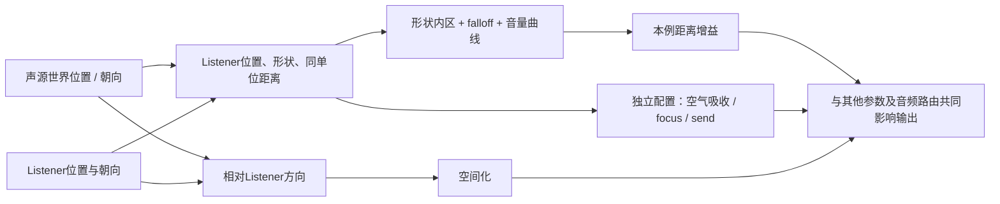
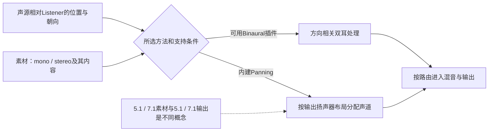
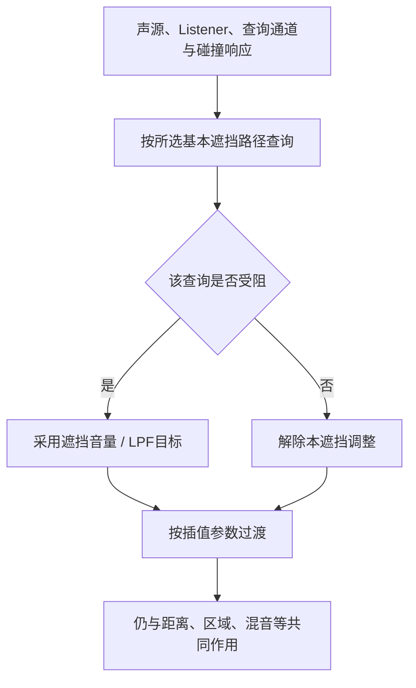

# 02 衰减与 3D 空间音效
> 知识成熟度：L2。公开资料核对与有限静态推导；没有引擎运行或听测证据。

> 所属系列：音频播放与程序化声音（原 10-音频系统，UE 客户端）
> 版本基准：主体采用实际可读的 Epic UE 5.6 文档；监听者覆写、PlaySoundAtLocation 签名、Interior LPF 与混响 DSP 字段采用固定 5.5 页面，使用处分别标明。5.5 的衰减对象和基类成员仅取得官方搜索返回选段，不能冒充专页完整阅读或 5.6 源码。
> 适用范围：距离与方向、衰减资产、空间化、基本遮挡、区域混响和环境声的配置与生命周期；示例限定一个本地监听者、一个有效 world 和明确的音频拥有者。
> 前置知识：[01 音频基础与播放](./01-音频基础与播放.md) 的播放入口、资产/组件寿命、Class/Mix 与 Submix 分工。
> 最后更新：2026-10-10（公开资料核对与全文静态修订）。
> 证据边界：未读取本机 Build.version、受限引擎实现、项目资产或音频原件，未运行 UE、PIE、UHT、编译、播放、录音、音频模型、GPU、网络目标、设备设置或性能实验。旧 UE 5.8.0 / CL 55116800 / `++UE5+Release-5.8` 及本机源码路径只保留历史身份，公共 API 不能重新认证它们；UE 4.27 兼容性也未验证。

## 一、概述

第 01 篇解决怎样请求播放，本篇解决声音怎样与场景建立关系：枪声来自哪个位置、离开多远开始变轻、隔墙后为何变闷、进入洞穴为何出现尾音，以及环境循环由谁停止。

- **衰减**改变随距离或方向变化的参数；音量衰减与距离滤波需要分别配置
- **空间化**处理相对监听者的方向；同样的距离权重可以配合不同空间化方法
- **混响与反射**提供间接声与空间感；常规混响预设不等于从洞穴网格自动求解所有反射
- **遮挡与传播**区分直达路径受阻和沿其他路径到达；基本遮挡查询不能独自完成后者
- **环境音与区域**组合氛围层、点缀和过渡，并保留进入、离开、owner 退出时的控制权

核心配置容器是 `USoundAttenuation`；`UAudioComponent` 提供位置及播放控制，Audio Volume 提供区域设置，Ambient Sound Actor 提供关卡放置入口。最终输出包含增益、滤波、方向处理和干/湿声路由，不能写成“衰减 × 空间化 × 混响 × 遮挡”这一条标量公式。本文各图解释职责，不声明完整 DSP 或线程执行顺序。[Audio Engine Overview 5.6](https://dev.epicgames.com/documentation/en-us/unreal-engine/audio-engine-overview-in-unreal-engine?application_version=5.6)

## 二、核心概念

| 概念 | 作用 | 边界 |
| --- | --- | --- |
| 声源 / Listener | 提供世界位置与方向关系 | Listener 不必等于 Pawn 原点；附着偏移与世界坐标要分清 |
| USoundAttenuation | 可复用的衰减设置对象 | 是配置，不是播放实例或资源所有者 |
| FSoundAttenuationSettings | 音量、滤波、空间化等设置值 | 继承基础形状/曲线字段；各开关相互独立 |
| Inner Radius / Falloff Distance | 球形内区半径 / 从内区外延的长度 | Falloff 不是一对 Min/Max 成员，也不是外半径 |
| Distance Algorithm | 选择距离映射 | 曲线名不保证物理精确性或固定听感 |
| Panning / Binaural | 输出声道分配 / 双耳空间化路径 | 素材声道、扬声器布局和插件能力是三个条件 |
| HRTF | 用方向相关双耳响应表达定位线索 | 不自动提供遮挡、墙材透射或传播路径 |
| Audio Volume | 根据区域选择混响与 Ambient Zone 设置 | 不把 Interior Volume 当“室内=true”的标记 |
| Reverb send / Effect | 决定送多少声 / 怎样处理该声 | send level、effect gain、decay time 不是同一量 |
| Occlusion | 按声源到监听者的遮挡检查调节直达声 | 不是完整传播求解器，也不是自动部分遮挡分级 |
| Obstruction / Propagation | 部分阻碍的术语 / 声学路径问题 | 具体产品定义与实现分别核对，不按名字排名成本 |
| Ambient Sound Actor | 在关卡放置声音 | Auto Activate 管启动；循环由声音配置决定 |
| Concurrency / Voice / Virtualization | 准入规则 / 渲染资源 / 无实声时的策略 | 无声、拒绝、停止、虚拟化与对象销毁不能互相替代 |

（表 1：配置、声学处理与寿命分别看。）

## 三、原理详解

### 3.1 距离、形状与曲线

#### 3.1.1 先确定坐标和单位

设声源世界位置为 `S`，用于距离的监听者位置为 `L`，球形例的距离是 `d = |S-L|`。用于方向判断的向量是 `S-L` 在监听者朝向基底中的表示；不能把“声源位置减监听者朝向”当方向向量。两者重合时方向不唯一，近场过渡需要单独设计。

本篇世界距离使用 Unreal Units（UU），纸面例明确采用默认厘米尺度：`100 UU = 1 m`，因此 `300 UU = 3 m`、`5000 UU = 50 m`。把“50 米”直接填成 `50` 会造成百倍范围差；显示单位与项目尺度另核，不据界面显示猜数值含义。时间写秒、截止频率写 Hz、线性音量倍率与 dB 分开。[Units of Measurement 5.6](https://dev.epicgames.com/documentation/unreal-engine/units-of-measurement-in-unreal-engine?application_version=5.6)

第三人称镜头可能离角色很远，先决定距离按哪个位置计算、方向按哪个朝向计算。固定 **5.5** 的 `SetAudioListenerOverride` 文档区分：有 AttachToComponent 时 Location/Rotation 为相对偏移，否则为绝对位置/旋转；`APlayerController` 的公开选段还区分仅覆盖 attenuation 位置的接口。这里只说明核对入口，不提供跨版本默认监听者实现或自动同步保证。[SetAudioListenerOverride 5.5](https://dev.epicgames.com/documentation/unreal-engine/API/Runtime/Engine/GameFramework/APlayerController/SetAudioListenerOverride?application_version=5.5)、[APlayerController 5.5](https://dev.epicgames.com/documentation/unreal-engine/API/Runtime/Engine/GameFramework/APlayerController?application_version=5.5)



（图 1：衰减及相关效果的输入关系；图中箭头不是引擎完整调用链。）

#### 3.1.2 形状先决定从哪里开始衰减

| 形状 | 内区参数的意思 | 适合表达的范围 |
| --- | --- | --- |
| Sphere | Inner Radius 是从声源原点起算的半径 | 枪口、篝火等点状来源 |
| Capsule | Half Height 与 Radius 定义长条内区 | 管道、水渠等延伸来源 |
| Box | X/Y/Z Extents 从原点量到各边界 | 房间底噪的覆盖区 |
| Cone | Radius、Angle、Falloff Angle、Offset 定义定向范围 | 扩音器等有朝向的来源 |

形状控制衰减区域，不证明引擎已把一根管道变成沿全长分布的声学发射面。非球形还要考虑朝向和边界，不能把所有参数套进球形的 `r+f`。设计上先画内区，再向外延伸 Falloff Distance；范围与声音定位宽度分开调整。[Sound Attenuation 5.6：Shape / Inner Shape / Falloff](https://dev.epicgames.com/documentation/en-us/unreal-engine/sound-attenuation-in-unreal-engine?application_version=5.6)

#### 3.1.3 曲线选择与一个能手算的例子

| 算法 | 局部选择直觉 | 不应推出的结论 |
| --- | --- | --- |
| Linear | 距离权重线性变化，便于检查覆盖/过渡 | 线性幅度不等于主观响度线性 |
| Logarithmic | 较近距离变化更明显，远段较缓 | 不是全项目必选的默认方案 |
| Inverse | 与 Log 相似但近远变化更突出 | 不能直接把未读引擎公式写成裸 `1/d` |
| LogReverse | 较大内外范围中保持存在感，远段变化更快 | 不代表范围无限或没有 voice 成本 |
| NaturalSound | 自然化的距离设计，并有末端 dB/边界模式 | 不等于完整声场物理模拟 |
| Custom | 用自定义曲线表达制作需求 | 曲线、横轴范围与边界行为都需检查 |

这些是选择曲线的起点，不是某个音效必然好听的结论。[Sound Attenuation 5.6：Attenuation Function](https://dev.epicgames.com/documentation/en-us/unreal-engine/sound-attenuation-in-unreal-engine?application_version=5.6)

为便于核对，只取**球形、Linear、启用音量衰减、没有 focus 距离缩放或其他增益**的纸面模型：`r ≥ 0`，`f > 0`，内区权重 `1`，外边界 `r+f`，中间权重 `1-(d-r)/f`，外部权重 `0`。这是局部教学表达，不是复制引擎实现。

```text
距离权重 a(d)                       r = 300 UU, f = 4700 UU
1.0 |──────────●                    外边界 r+f = 5000 UU
    |           \
0.5 |            ●                  d = 2650 UU 时 a = 0.5
    |             \
0.0 |              ●──────────► d
    0           r  r+f              图只示意 Linear，横轴非等比例
```

原文“Min=300、Max=5000”的教学目标可换算为 Inner Radius=`300`、Falloff Distance=`4700`。如果误填 Falloff=`5000`，外边界变成 `5300`，不会仍是 50 米。`f=0` 时上式除法无定义，不把硬边界例混入该公式。

Natural Sound 需另看 Attenuation At Max (dB) 与 Falloff Mode；固定 5.6 Cue 参考列出继续衰减、静音或保持末值的选择条件，不能把 Linear 的零边界推广为所有曲线。Custom 的 Volume 曲线与 Air Absorption 的滤波曲线也各有职责，没有通用的“Volume / Pitch / LowPass 都在一个距离曲线开关里”。[Sound Cue Reference 5.6：Attenuation Node](https://dev.epicgames.com/documentation/en-us/unreal-engine/sound-cue-reference-for-unreal-engine?application_version=5.6)

保留原文的制作尺度作为**待项目选择的候选范围**：枪声/爆炸约 30～80 m、近距离对白约 15～30 m、局部环境点缀约 20～40 m、广域氛围可更大。必须先明确这些数表示哪个几何边界，再换算 UU；它们不是听力极限、引擎阈值或性能预算，环境声也不宜用“无穷 Max”替代区域设计。

#### 3.1.4 距离滤波、音高与其他控制分工

- Air Absorption 用距离范围与低通/高通截止设置塑造频谱；5.6 字段包括 `bAttenuateWithLPF`、`LPFRadiusMin/Max`、`LPFFrequencyAtMin/Max` 等。不能凭此宣称内建模型读取了湿度或天气
- Listener Focus 可按相对朝向调整距离尺度、音量或优先级；隔离它后再检查基础距离曲线
- Near-field 的 non-spatialized 半径处理近处方向过渡；不要写成通用的“越远越退化为2D”权重
- 音高变化另由组件倍率、Cue/MetaSound 或 Doppler 设计承担。固定 5.6 文档的 Doppler 在 Sound Cue 节点中，按相对运动改变 pitch；静止声源仅仅更远不自动意味着 pitch 更低

字段依据：[FSoundAttenuationSettings 5.6](https://dev.epicgames.com/documentation/en-us/unreal-engine/API/Runtime/Engine/FSoundAttenuationSettings?application_version=5.6)。Doppler 入口见 [Sound Cue Reference 5.6：Doppler](https://dev.epicgames.com/documentation/en-us/unreal-engine/sound-cue-reference-for-unreal-engine?application_version=5.6)。

### 3.2 空间化：相对方向、输出布局与插件



（图 2：空间化选择，不把多声道素材直接当第三种万能 3D 算法。）

**Panning** 按声源相对朝向分配输出通道增益。5.6 概览明确列出 mono/stereo 输入和 stereo、5.1、7.1 输出布局；stereo 的左右输入还可有世界空间 spread。项目有 linear/equal-power 两种 panning 选择。用两声道增益示意可帮助理解，但原文未限定角度的 `cos(θ)/sin(θ)` 不能充当引擎算法；仅左右强弱也不能独自提供完整上下/前后频谱线索。[Audio Engine Overview 5.6：Spatialized Sounds](https://dev.epicgames.com/documentation/en-us/unreal-engine/audio-engine-overview-in-unreal-engine?application_version=5.6)

**Binaural/HRTF** 用方向相关双耳信息帮助定位，通常面向耳机。选择 Binaural 前核对目标平台实际选择的 Spatialization Plugin、输入声道支持及该插件的设置资产；安装插件、选了方法、产生预期结果是不同层。声源数量、插件实现和目标设备共同决定代价，本轮没有数据支持“任何平台都行”“固定更贵多少”或“FPS必接某插件”。[Sound Attenuation 5.6：Spatialization Method](https://dev.epicgames.com/documentation/en-us/unreal-engine/sound-attenuation-in-unreal-engine?application_version=5.6)

原文列 Oculus/Meta、Steam Audio、Windows Sonic、Dolby Atmos 作为选型线索；这些名字可能涉及 UE 插件、平台渲染器或输出生态，不能当成可互换的一个下拉框。本轮未核其插件版本/UE兼容表，不在此承诺具体产品支持哪些输入、平台或传播功能。

| 要核的设置 | 用途 | 常见误判 |
| --- | --- | --- |
| 组件 Allow Spatialization 与设置 bSpatialize | 两处共同决定是否允许空间化 | 仅勾资产开关就认定整条路径已启用 |
| Spatialization Method | Panning 或 Binaural 路径 | 选择方法即证明目标插件有效 |
| Non-spatialized 近场过渡 | 大声源靠近时减小方向突变 | 把近场过渡当距离音量衰减 |
| Stereo Spread / Normalize | 管 stereo 左右虚拟间距和相加时增益 | stereo必不能定位，或归一化保证所有混音都不削波 |
| Binaural Radius | 启动时的非双耳切换条件之一 | 和 non-spatialized 半径混成同一功能 |

**同版本资料也有差异**：5.6 衰减指南仍用单一 Non-Spatialized Radius，5.6 `FSoundAttenuationSettings` API 已列 Start/End/Mode；不要直接抄一个旧字段名到新代码。Cue 参考的旧文字称 stereo 不空间化，但同页、概览和衰减指南又描述 stereo spread。此处采用“内建 panning 可支持 stereo”的有限结论，HRTF 的声道条件另核，不用旧段落覆盖明确的功能说明。[设置 API 5.6](https://dev.epicgames.com/documentation/en-us/unreal-engine/API/Runtime/Engine/FSoundAttenuationSettings?application_version=5.6)、[组件 API 5.6](https://dev.epicgames.com/documentation/unreal-engine/API/Runtime/Engine/UAudioComponent?application_version=5.6)

### 3.3 混响、Audio Volume 与 Ambient Zone

#### 3.3.1 区域选择与声学求解分开

Audio Volume 可承载 Reverb 和 Ambient Zone 设置。先核 Enabled、覆盖范围及 Priority；重叠体积采用更高优先级的设置，等优先级重叠的顺序未定义，不按“自动权重混合”设计。Audio Volume 的几何形状是区域选择边界，不会自动把洞穴的大小、材质和拐角转换为物理反射。[Audio Volume Actor 5.6](https://dev.epicgames.com/documentation/en-us/unreal-engine/audio-volume-actor-in-unreal-engine?application_version=5.6)


（图 3：洞穴/走廊/户外原用途保留；没有虚构的 Interior=true/false 开关。）

#### 3.3.2 各层参数分别调什么

| 层 | 参数/概念 | 正确调节方向 |
| --- | --- | --- |
| Audio Volume | Apply Reverb、Reverb Effect、Volume、Fade Time | 是否使用所选效果、效果级别、区域转换时间（秒） |
| 声源 attenuation | Enable Reverb Send、send method、send level/range | 送多少声到 master reverb；与直达声增益分开 |
| 效果 DSP | Decay Time、早/晚反射、Density/Diffusion、高频响应 | 决定尾音长度、颗粒/密度和频谱，不是体积里的一串通用同名字段 |
| 自定义 Submix | 显式 send、效果预设和输出连接 | 确定实际被处理/混合的信号及其路由 |

Volume=`1` 不是全链“100% Wet”。Reverb Gain 调增益，Decay Time 调衰减时间；延迟、增益、密度也各有单位和职责。原文“经典 Schroeder 模型”“Reverb Intensity / HF Damping 都在 Audio Volume”没有本轮实现依据，不作为菜单合同。[Audio Volumes 5.6：Reverb](https://dev.epicgames.com/documentation/en-us/unreal-engine/audio-volumes-in-unreal-engine?application_version=5.6)

为保留“洞穴声音又闷又长”的调节用途，固定 **5.5** `FSubmixEffectReverbSettings` 提供一个具名 DSP 对照：`DecayTime` 单位秒；`DecayHFRatio` 表示高频相对低频的衰减速度；`GainHF` 调高频反射增益；`ReflectionsDelay` / `LateDelay` 是不同延迟；`DryLevel` / `WetLevel` 是该效果的干湿级别。先确认正在用的是这类效果，再调对应量，不能把“HF Damping 调高/调低”一条规则套给所有插件。[FSubmixEffectReverbSettings 5.5](https://dev.epicgames.com/documentation/unreal-engine/API/Runtime/AudioMixer/SubmixEffects/FSubmixEffectReverbSettings?application_version=5.5)

#### 3.3.3 混响为何没有生效

传统区域混响先建立：world 的默认混响或 Audio Volume 的有效效果选择 → 声音的 Sound Class 允许相应 reverb → 有效 reverb send → 处理和输出路由。缺少送入信号，即使效果参数很强也不会得到预期湿声；只检查一个体积不能证明链路完整。[Sound Attenuation 5.6：Reverb](https://dev.epicgames.com/documentation/en-us/unreal-engine/sound-attenuation-in-unreal-engine?application_version=5.6)

自定义 Reverb Submix 是另一条明确路由的设计：声源 send 到已含效果的 Submix，再进入输出图；本轮资料不支持“放了 Audio Volume 就会自动驱动任何自定义 Submix 的所有参数”。第 03 篇保留作为程序化音频/DSP 扩展入口，不是使用内建 Audio Volume 的必修实现依赖。

#### 3.3.4 Ambient Zone 的内外关系

Interior/Exterior 命名描述**声音在体积哪一侧，Listener在另一侧时怎样调节**，不是对建筑做真假标记：

| Listener | 声源 | 本单区域例要看的设置 |
| --- | --- | --- |
| 体积内 | 体积外 | Exterior Volume / LPF 与对应过渡时间 |
| 体积外 | 体积内 | Interior Volume / LPF 与对应过渡时间 |
| 与声源同侧 | 同侧 | 不因这一个跨界规则压低对方；其他增益和滤波仍可存在 |

声音归属的 Sound Class 还需启用 Apply Ambient Volumes。固定 5.6 Ambient Zones 指南要求在放置/移动相应静态 Sound Actor 后重建关卡几何以更新内外归属；这条是该教程的配置前提，不代表本轮已执行重建，也不外推为任意运行时动态声源的更新算法。[Ambient Zones 5.6](https://dev.epicgames.com/documentation/en-us/unreal-engine/ambient-zones-in-unreal-engine?application_version=5.6)

**LPF 单位冲突不隐藏**：5.6 Ambient Zones 写 LPF multiplier，并用 `0.1` 解释最大滤波；5.6 Audio Volume Actor 页同类描述却用 `1.0`。实际可读的 **5.5 FInteriorSettings** 将 InteriorLPF/ExteriorLPF 定义为 **Hz 截止频率**。本篇不把 `0.2/0.5` 直接填为 5.6 LPF，也不拿 5.5 跨版本裁决 5.6 实现；示例先用 Volume 区分内外，LPF 保持目标项目已有中性值，待核目标版本字段/提示后再明确 Hz 或倍率。[FInteriorSettings 5.5](https://dev.epicgames.com/documentation/unreal-engine/API/Runtime/Engine/Sound/FInteriorSettings?application_version=5.5)

### 3.4 遮挡查询与传播边界

#### 3.4.1 基本 Occlusion 的因果链

内建 Occlusion 检查声源与 Listener 之间是否有阻挡，再按设置改变音量与低通。公开概览称其为异步 trace；这不足以确认未读实现的全部采样数量、形状、线程或调度。不能从原文的三分支图推导内建自动区分“完全挡住/部分挡住”的比例。[Audio Engine Overview 5.6：Occlusion](https://dev.epicgames.com/documentation/en-us/unreal-engine/audio-engine-overview-in-unreal-engine?application_version=5.6)



（图 4：查询结果与参数目标的局部关系；未建模衍射、透射、混响路径。）

| 参数 | 所在配置与单位 | 为什么影响结果 |
| --- | --- | --- |
| Enable Occlusion / Occlusion Trace Channel | Attenuation 设置；查询通道 | 墙要对该查询通道产生预期阻挡，不是要求“声源和墙是同一通道” |
| Use Complex Collision for Occlusion | Attenuation 设置 | 改变查询所用碰撞几何；更细几何不等于更正确声学 |
| Occlusion Low Pass Filter Frequency | Attenuation 设置；Hz | 指定受阻时的频谱目标；不把它与组件手动 LPF 字段混名 |
| Occlusion Volume Attenuation | Attenuation 设置；线性倍率 | 指定受阻时的音量目标 |
| Occlusion Interpolation Time | Attenuation 设置；秒 | 控制效果变化的过渡时间 |
| OcclusionCheckInterval | UAudioComponent；秒 | 控制再次检查的间隔，与上述插值时长不是一个参数 |

设置字段由 [FSoundAttenuationSettings 5.6](https://dev.epicgames.com/documentation/en-us/unreal-engine/API/Runtime/Engine/FSoundAttenuationSettings?application_version=5.6) 与 [UAudioComponent 5.6](https://dev.epicgames.com/documentation/unreal-engine/API/Runtime/Engine/UAudioComponent?application_version=5.6) 分别支持。原文 `Occlusion Sampling Interval` 放在衰减资产的步骤应改成组件的具名间隔设置；`0.15 s` 只作项目候选值，不能保证每0.15秒恰好完成查询，也不是普遍性能安全值。

例如同一静态位置、有/无一面正确响应查询通道的墙，是区分“距离变化”与“遮挡变化”的对照；若墙忽略该通道，查询不受阻属于配置因果，不是音频失效。`0.2` 音量倍率与 `2000 Hz` 截止仅可作待选择目标，不代表木墙、石墙的测得声学系数。

#### 3.4.2 为什么不等于完整传播

一条直达路径被挡住，并不回答声音能否绕门、绕墙角、穿过墙材或经多次反射到达。传播方案还要定义哪些几何/材质进入模型、哪些路径被求解、结果怎样送入音频渲染。Obstruction 与 Occlusion 在不同中间件里的术语及直达/混响处理范围可能不同，不能用一个“部分=轻量、完全=昂贵”表替代产品合同。

Steam Audio、Wwise、FMOD 保留为原文提出的扩展调研方向；本轮未核固定插件版本的反射、衍射、透射、烘焙或平台能力，不写成“安装后全部拥有”。UE 的 HRTF/平台空间音频同样不能单凭名字证明完整传播。先确认需要解决的是定位、遮挡还是路径传播，再为相应需求单独选实现。

### 3.5 环境音与区域组合

Ambient Sound Actor 可承载循环或非循环声音。Auto Activate 决定是否自动启动，不是循环开关；Sound 必须有有效声音输入。直接 Wave 的循环设置和 Cue 的 Wave Player Looping 配置沿用第 01 篇合同，Cue 链要接 Output。[Ambient Sound Actor 5.6](https://dev.epicgames.com/documentation/unreal-engine/ambient-sound-actor-user-guide-in-unreal-engine?application_version=5.6)

森林可继续采用原文三层制作法，但每层各有退出责任：

1. **基底氛围**：风/树叶等2～3层是制作选择。用合适形状覆盖区域，必要时关闭定位但保留距离变化；避免仅用中心大球让整个区域都像一个点
2. **局部点缀**：鸟叫、树枝声用有限一次请求或受控随机调度；owner离开/销毁时取消自己的定时触发，不能继续生成场景外声音
3. **区域过渡**：Audio Volume 选择 reverb/ambient zone；若用 Trigger + Sound Mix 调类别，沿用01的指定本地玩家/组件过滤、单owner、Push/Pop配对。Mix调整参数不负责自动启动/停止环境组件

放在关卡中的固定 Ambient Sound 不会因为玩家离开听觉范围就自动变成“已经释放的声音资产”。要随车辆/生物移动时选择正确附着入口；固定位置 Spawn 不随 Actor 移动。

### 3.6 从无声到释放：六个不同问题

| 要问的问题 | 相关对象/规则 | 不能用什么替代答案 |
| --- | --- | --- |
| 配置/素材对象还有效吗 | SoundBase、Attenuation、GC引用和数据供给 | 有对象不表示首chunk或所有音频数据都已准备 |
| 组件还有效吗 | owner、Auto Destroy、显式销毁 | 有组件不表示有播放实例或可听输出 |
| 这次请求获准了吗 | 所有适用Concurrency规则、重触发条件等 | 调了Play或拿到非空对象不是准入回执 |
| 实例是否继续参与播放/管理 | 停止、暂停、虚拟化及具体模式 | 距离权重为0不表示实例被销毁 |
| 是否分配/使用渲染voice | 全局通道、优先级、实现与模式 | 并发Max Count不等于实际设备voice总数 |
| 最终是否听得到 | 数据、增益、滤波、路由、平台输出 | OnAudioFinished不证明玩家听完或硬件已清空 |

Concurrency 可以拒绝新声或停止旧声，多个规则需要共同满足；公开指南明确 active components 的计数不能直接当“可听声数”，Retrigger拒绝还忽略虚拟化设置。缩小衰减范围并不自动把这几层资源全部回收。[Sound Concurrency 5.6](https://dev.epicgames.com/documentation/en-us/unreal-engine/sound-concurrency-reference-guide?application_version=5.6)

固定5.6 `EVirtualizationMode` 区分 Disabled、PlayWhenSilent、Restart，并列出实验性的 SeekRestart。该页明确 PlayWhenSilent 在静音时继续使用voice、并不虚拟化；Restart对循环声的重新实声化从头开始。不能把“开启虚拟化”统一解释成停止混音且无成本保留正确进度，更不能将其等同组件Auto Destroy或资产卸载。[EVirtualizationMode 5.6](https://dev.epicgames.com/documentation/unreal-engine/API/Runtime/Engine/EVirtualizationMode?application_version=5.6)

循环声的生命周期由owner管理：启动前完成输入/衰减配置，正常离开可请求FadeOut，owner先结束则执行自己的立即Stop策略；业务离开不等待声音回调。资产强引用、组件注册、播放实例、voice与设备尾音分别有寿命。`UPROPERTY() TObjectPtr` 保持所需UObject引用，weak只便于有效性检查；强引用也不能阻止显式组件销毁。[Object Pointers 5.6](https://dev.epicgames.com/documentation/en-us/unreal-engine/object-pointers-in-unreal-engine?application_version=5.6)

## 四、代码 / 蓝图示例

以下全部是**静态教学片段**，没有创建UE工程、资产或运行声音。成员声明放入项目相应 `UCLASS` 的头文件，方法放 `.cpp`；类壳、项目导出宏、generated header与模块配置需按项目补齐，不是本轮编译通过的独立代码。例中拥有者继承 `AActor`，只在有效本地world的游戏线程生命周期内使用；没有异步加载、跨world或网络控制。

### 4.1 C++：保留三种使用目的

#### 示例1：运行时创建一个有拥有者的衰减设置对象

用途仍是运行时准备个别声音的设置，但不把 `NewObject` 产生的临时对象说成已经创建/保存到Content Browser的资产。先按蓝图示例A制作 `BaseAttenuation`，确认它的形状、范围、曲线、空间化和send；下面复制它，再选择自己的空气吸收/遮挡参数。这样也不需要猜不同形状在Extents中的编码。

```cpp
// AAttenuationOwner : AActor 的类内声明。
UPROPERTY(EditDefaultsOnly, Category="Audio")
TObjectPtr<USoundAttenuation> BaseAttenuation = nullptr;
UPROPERTY(Transient)
TObjectPtr<USoundAttenuation> RuntimeAttenuation = nullptr;
UPROPERTY(EditDefaultsOnly, Category="Audio")
TObjectPtr<USoundBase> FireSound = nullptr;
UPROPERTY(EditDefaultsOnly, Category="Audio")
TObjectPtr<USoundConcurrency> FireConcurrency = nullptr;
bool bOwnerEnding = false;
bool BuildRuntimeAttenuation();
void PlayFireAt(const FVector& WorldLocation);
virtual void EndPlay(const EEndPlayReason::Type EndPlayReason) override;

// .cpp；头文件须声明或包含成员涉及的类型。
#include "Sound/SoundAttenuation.h"
#include "Sound/SoundBase.h"
#include "Sound/SoundConcurrency.h"
#include "Kismet/GameplayStatics.h"

bool AAttenuationOwner::BuildRuntimeAttenuation()
{
    if (bOwnerEnding || !GetWorld() || !IsValid(BaseAttenuation.Get()))
    {
        return false;
    }
    if (IsValid(RuntimeAttenuation.Get()))
    {
        return true; // 本owner只建立一份，不在播放期间改共享配置。
    }
    RuntimeAttenuation = NewObject<USoundAttenuation>(
        this, NAME_None, RF_Transient);
    FSoundAttenuationSettings& S = RuntimeAttenuation->Attenuation;
    S = BaseAttenuation->Attenuation;
    S.bAttenuate = true;
    S.bSpatialize = true;
    S.bAttenuateWithLPF = true;
    S.LPFRadiusMin = 300.0f;       // UU；与音量内半径独立的滤波范围。
    S.LPFRadiusMax = 6000.0f;      // UU；两个值需严格递增。
    S.LPFFrequencyAtMin = 18000.0f; // Hz，示例目标，不是素材测值。
    S.LPFFrequencyAtMax = 4000.0f;
    S.bEnableOcclusion = true;
    S.OcclusionTraceChannel = ECC_Visibility;
    S.bUseComplexCollisionForOcclusion = false;
    S.OcclusionLowPassFilterFrequency = 2000.0f;
    S.OcclusionVolumeAttenuation = 0.2f;
    S.OcclusionInterpolationTime = 0.1f; // 秒；不是查询间隔。
    return true; // 只表示配置对象准备好，不表示已发声。
}
```

在该Actor的BeginPlay或首次音频请求前调用一次建立函数；失败就跳过声音，不循环重试。Outer表达归属，`UPROPERTY`成员承担这里需要的强引用；只返回一个裸指针而不说明调用者怎样持有，会遗漏GC寿命。

`USoundAttenuation::Attenuation` 与基础 `FalloffDistance` 的成员形态依据实际取得的 **5.5官方搜索选段**，专页正文未完整取得；`FalloffDistance` 是float，不可再写 `S.FalloffDistance.MinDistance/MaxDistance`。空气吸收、遮挡成员按实际可读5.6设置API核对；原来属于组件的 `bEnableLowPassFilter/LowPassFilterFrequency` 不应错写在该结构体上。[USoundAttenuation 5.5](https://dev.epicgames.com/documentation/unreal-engine/API/Runtime/Engine/Sound/USoundAttenuation?application_version=5.5)、[FBaseAttenuationSettings 5.5](https://dev.epicgames.com/documentation/unreal-engine/API/Runtime/Engine/Engine/FBaseAttenuationSettings?application_version=5.5)、[FSoundAttenuationSettings 5.6](https://dev.epicgames.com/documentation/en-us/unreal-engine/API/Runtime/Engine/FSoundAttenuationSettings?application_version=5.6)

#### 示例2：播放时显式传入衰减对象

```cpp
void AAttenuationOwner::PlayFireAt(const FVector& WorldLocation)
{
    if (bOwnerEnding || !GetWorld() || !IsValid(FireSound.Get()) ||
        !IsValid(RuntimeAttenuation.Get()))
    {
        return;
    }
    UGameplayStatics::PlaySoundAtLocation(
        this, FireSound.Get(), WorldLocation, FRotator::ZeroRotator,
        1.0f, 1.0f, 0.0f, RuntimeAttenuation.Get(),
        FireConcurrency.Get(), this, nullptr);
}

void AAttenuationOwner::EndPlay(const EEndPlayReason::Type EndPlayReason)
{
    bOwnerEnding = true; // 本owner不再发起新请求。
    RuntimeAttenuation = nullptr; // 撤掉自己的引用，不代表销毁所有使用者。
    Super::EndPlay(EndPlayReason);
}
```

调用者传入已确认的枪口世界坐标（UU）；本例模板为球形，所以零旋转不改变该形状。方向锥形模板则要传真实发射朝向。本调用仍传入 `USoundAttenuation*`，不能称为“不建对象的临时参数结构”接口。签名依据固定 **5.5**：该位置不随Actor移动，OwningActor只用于owner并发规则，接口不自动网络复制，也不返回可停止组件。[PlaySoundAtLocation 5.5](https://dev.epicgames.com/documentation/en-us/unreal-engine/API/Runtime/Engine/Kismet/UGameplayStatics/PlaySoundAtLocation/2?application_version=5.5)

本例允许独立的一次性枪声尾音，EndPlay仅阻止本owner继续发请求，不声称已经停止所有旧声或清空设备。需要owner结束时停止声音，应从开始就选有控制权的组件路径。开火、扣弹药和伤害不等待音频结束。

#### 示例3：切换区域设置，显式停止并重新请求循环

场景限定：一个不移动的本地声源，项目用“Listener在户外/洞穴”这个已过滤的业务事件选择两套衰减设置；这是一项制作选择，不是Audio Volume自动帮它更换资产。若只是想换房间混响，应先用3.3的区域设置，不必改变声源距离模型。

旧例在 `SpawnSoundAtLocation` **已经启动后**写字段，缺少当前实例何时读取新值的证据。这里改成可重复使用的预建组件，每次有效区域变化先Stop，再为下一次播放调整设置并从头Play；明确接受不连续和进度重置，不承诺无缝热切换。`AdjustAttenuation` 的类索引只证明它修改组件设置，不证明每种字段都能热更新当前实例。

```cpp
// ASpatialLoopExample : AActor 的类内声明；需包含AudioComponent头文件。
UPROPERTY(VisibleAnywhere, Category="Audio")
TObjectPtr<UAudioComponent> LoopAudio = nullptr;
UPROPERTY(EditDefaultsOnly, Category="Audio")
TObjectPtr<USoundBase> LoopSound = nullptr;
UPROPERTY(EditDefaultsOnly, Category="Audio")
TObjectPtr<USoundAttenuation> OutdoorAttenuation = nullptr;
UPROPERTY(EditDefaultsOnly, Category="Audio")
TObjectPtr<USoundAttenuation> CaveAttenuation = nullptr;
bool bEnding = false;
bool bHasZoneRequest = false;
bool bRequestedInside = false;
ASpatialLoopExample();
virtual void BeginPlay() override;
void SelectZone(bool bInside);
virtual void EndPlay(const EEndPlayReason::Type EndPlayReason) override;

// .cpp
#include "Components/AudioComponent.h"
#include "Sound/SoundBase.h"
#include "Sound/SoundAttenuation.h"

ASpatialLoopExample::ASpatialLoopExample()
{
    LoopAudio = CreateDefaultSubobject<UAudioComponent>(TEXT("LoopAudio"));
    SetRootComponent(LoopAudio.Get()); // 本Actor的场景根，也是声音位置。
    LoopAudio->bAutoActivate = false;
    LoopAudio->bAutoDestroy = false;
    LoopAudio->bStopWhenOwnerDestroyed = true;
    LoopAudio->bCanPlayMultipleInstances = false;
    LoopAudio->bAllowSpatialization = true;
    LoopAudio->OcclusionCheckInterval = 0.15f; // 秒，候选设置。
}

void ASpatialLoopExample::BeginPlay()
{
    Super::BeginPlay();
    if (IsValid(LoopAudio.Get()) && IsValid(LoopSound.Get()))
    {
        LoopAudio->SetSound(LoopSound.Get());
        SelectZone(false); // 本有限场景约定初始在户外。
    }
}

void ASpatialLoopExample::SelectZone(bool bInside)
{
    if (bEnding || !GetWorld() || !IsValid(LoopAudio.Get()) ||
        !IsValid(LoopSound.Get()) ||
        (bHasZoneRequest && bRequestedInside == bInside))
    {
        return;
    }
    USoundAttenuation* Chosen = bInside
        ? CaveAttenuation.Get() : OutdoorAttenuation.Get();
    if (!IsValid(Chosen))
    {
        return; // 配置缺失时保留原请求，不先停止后再发现无输入。
    }
    bHasZoneRequest = true;
    bRequestedInside = bInside; // 记录自己的请求选择，不代表播放已获准。
    LoopAudio->Stop();
    LoopAudio->AdjustAttenuation(Chosen->Attenuation);
    LoopAudio->Play(0.0f); // 重新请求，从头开始；不宣称无缝。
}

void ASpatialLoopExample::EndPlay(const EEndPlayReason::Type EndPlayReason)
{
    bEnding = true;
    if (IsValid(LoopAudio.Get()))
    {
        LoopAudio->Stop();
    }
    Super::EndPlay(EndPlayReason); // 默认子对象随owner清理。
}
```

前提：LoopSound在这段生命周期内不更换，并按01的Wave/Cue合同配置循环；两套设置资产也固定。BeginPlay配置之后才能接收区域事件，事件由同一个拥有者筛选指定本地Pawn及指定碰撞组件，重复同区事件不重启。若外部规则拒绝/停止声音，`bHasZoneRequest` 不会自动纠正为引擎播放状态，本例不做隐式补播；业务区域变化照常完成。

本例不绑定OnAudioFinished、不把它当区域切换成功回执，也没有需要排空的外部异步工作。Stop不证明设备瞬时静默；两套衰减设置之间的连续过渡、双路跨淡化及其中途重入仍需另设计实例/owner和结束策略；只改变同一声音的音量，可看蓝图示例E，不能把该补例外推为衰减设置的通用热更新。组件控制合同见 [UAudioComponent 5.6](https://dev.epicgames.com/documentation/unreal-engine/API/Runtime/Engine/UAudioComponent?application_version=5.6)，默认子对象注册及场景根概念见 [Components 5.6](https://dev.epicgames.com/documentation/en-us/unreal-engine/components-in-unreal-engine?application_version=5.6)；与第01篇的Spawn即启动、FadeIn择一启动、FadeOut延迟Stop保持一致。

### 4.2 蓝图与资产配置

以下是待项目实施的配置步骤，本轮未在编辑器中执行；所有数字都是有限示例输入。

#### 示例A：制作并使用武器衰减模板

1. 在Content Browser创建Sound Attenuation，沿用 `A_Weapon_Medium` 命名；名字不是引擎保留前缀
2. Enable Volume Attenuation=true；Shape=Sphere；Inner Radius=`300 UU`，Falloff Distance=`5700 UU`，外边界为`6000 UU`；先Linear核对范围，再按制作目的选择Logarithmic
3. Enable Spatialization=true，Spatialization Method=Panning；组件路径也核Allow Spatialization，近场设置先保持明确的项目默认，不用未经核对的旧字段名
4. 在声音资产、Cue节点或播放入口明确选择其中所需的配置来源；本有限例使用单一路径，不叠多处Attenuation节点再猜覆盖顺序
5. 纸面先核`300+5700=6000`，再检查单位和实际Listener；任何后续引擎/听感走查另记结果，不将上述算式当可听范围测量

#### 示例B：洞穴/走廊区域混响与内外声

1. 放置Enabled的Audio Volume覆盖洞穴；若走廊体积嵌套，给它明确更高Priority，例如洞穴`1`、走廊`2`，不使用等优先级猜胜者
2. 在洞穴Reverb中启用Apply Reverb并选择存在的Reverb Effect；Volume可先设`0.5`、Fade Time=`1 s`作制作起点。Decay Time等参数到实际效果资产里调，不在Audio Volume里寻找“Interior=true”
3. 声源侧确认所属Sound Class允许相应reverb，启用Reverb Send；为隔离区域效果，先用Manual及明确的非零send（例如`0.2`），再决定是否改用距离send曲线
4. 若要内外环境声变化，放一个静态声源在体积内、一个在体积外，两个声音的Class都启用Apply Ambient Volumes；例如Exterior Volume=`0.5`、Interior Volume=`0.2`，相应Time=`1 s`
5. LPF先不复制旧指南的倍率例，按3.3.4保留中性配置并核目标版本单位。该5.6教程的静态区域归属需要几何重建；此处只列依赖，本轮未重建
6. 预期配置关系是进洞时外声受Exterior调整、出洞时内声受Interior调整，混响按选中区域转换。若使用自定义Submix，单独核send、效果和输出，不假定Audio Volume自动连接它

#### 示例C：单墙遮挡对照

1. 取一个静止的点声源、固定距离的Listener和一面墙；先用已知正常的播放/路由配置，避免距离同时变化
2. Attenuation启用Occlusion，Trace Channel选项目已约定的通道；若用Visibility，确认墙对该查询为Block，且没有为音频破坏其他系统所需的响应
3. 选简单碰撞起步；Occlusion Volume Attenuation=`0.15`、Occlusion Low Pass Filter Frequency=`1500 Hz`、Interpolation Time=`0.1 s`是示例目标
4. 组件的OcclusionCheckInterval可设`0.15 s`；它不是插值参数，也不保证响应延迟恰等于这个值
5. 纸面对照：墙Block应使查询具备受阻条件；同墙Ignore不能因视觉挡住就被当成查询阻挡。实际查询结果、听感和成本都需后续项目证据，本轮未运行

#### 示例D：森林环境声铺设与退出

1. 放置Ambient Sound Actor并设置Sound=`W_ForestWind`，明确直接Wave循环或Cue Wave Player Looping；没有配置循环的资产只按其本身方式播放
2. 广域模板 `A_Ambient_Large` 可选择合适Box或Sphere；若采用Sphere示例`r=1000 UU`、`f=49000 UU`，外边界是`50000 UU=500 m`。这是纸面设计，不能由范围推导开销或一定覆盖所有地形
3. 鸟叫/流水可放不同位置与适当音量；2～3个副本仅是制作起点。统一的Ambient Class便于控制，复制同一循环还要防止不想要的叠加
4. 触发式方案关闭Auto Activate；首次进入发一次Play或FadeIn，离开请求FadeOut且不紧接Stop；owner EndPlay单独立即Stop，取消自己的点缀触发。此有限流程不在淡出途中重新进入
5. 若另用Sound Mix过渡，按01的指定玩家/组件过滤及成对Push/Pop；组件退出与Mix退出各自处理，不能把区域外无声当作二者均已清理

#### 示例E：同一循环持续播放，只调整音量

若进入区域只是想把同一层风声压低，再在离开时恢复，可以固定声音和衰减资产，用 `Adjust Volume` 调整正在播放实例的音量。下面用一条定时序列模拟“进区→出区”，先给可接完的正常路径；不与示例3的 `SelectZone` 同时控制一个组件。

1. 新建 Actor 蓝图，添加 `Audio` 组件并命名 `LoopAudio`；指定一个按第01篇配置好循环的声音，以及一份固定衰减资产。关闭 Auto Activate 和 Play Multiple Instances，Volume Multiplier=`1`。把Actor放在测试关卡，Listener保持在有非零距离增益的位置
2. 在事件图建立唯一启动链：`Event BeginPlay → Play（Target=LoopAudio，Start Time=0）→ Delay（Duration=2）→ Adjust Volume（Target=LoopAudio，Adjust Volume Duration=1，Adjust Volume Level=0.35，Fade Curve=Linear）→ Delay（Duration=3）→ Adjust Volume（同一Target，Duration=1，Level=1，Curve=Linear）`。两个Delay的Completed分别接后续执行引脚；第二个Delay接第一次Adjust Volume的执行输出，不等待一个虚构的“淡化完成”回调
3. 新建Bool变量 `bEnding`，默认false；每个Delay之后、Adjust Volume之前，先检查 `!bEnding` 与 `Is Valid(LoopAudio)`，通过才继续该链。另接 `Event EndPlay → 设置bEnding=true → Is Valid(LoopAudio) → Stop（Target=LoopAudio）`，owner结束后不再发新的音量请求
4. 正常例约定声音已获准持续播放，Actor/组件有效、world未暂停，无其他系统停止声音或同时修改音量。`Adjust Volume` 只调整这一路音量；它没有换声音、距离形状、空间化方法、遮挡或混响资产。`0.35` 是该接口的目标级别，不是35%的最终主观响度，也不是0.35dB

**PAPER_EXPECTED：** BeginPlay只请求一次Play；约2秒后开始用1秒降到目标0.35，约5秒后开始用1秒恢复到1，之后循环继续，owner结束才请求Stop。中间两次变化都没有调用Play或Stop，因此这条控制序列不会主动把循环重播；时间是配置追踪，未测实际音频线程时刻、采样连续性或听感。不要把这里的Adjust Volume换成Fade Out：后者会在淡化后请求Stop，即使填的目标不是零。[UAudioComponent 5.6：AdjustVolume / FadeOut / Play](https://dev.epicgames.com/documentation/unreal-engine/API/Runtime/Engine/UAudioComponent?application_version=5.6)

固定5.6的AudioComponent说明还要求在声音启动前调整Attenuation，因为设置在新Active Sound启动时传入。因此本例保留同一份衰减设置；整套设置切换仍采用示例3已说明会重启的路径。这不是两实例交叉淡化方案，也不覆盖并发抢占、虚拟化恢复或中途反向过渡。[AudioComponent 5.6参数说明](https://dev.epicgames.com/documentation/en-us/unreal-engine/python-api/class/AudioComponent?application_version=5.6)、[Linear曲线5.6](https://dev.epicgames.com/documentation/en-us/unreal-engine/python-api/class/AudioFaderCurve?application_version=5.6)、[Delay蓝图引脚5.6](https://dev.epicgames.com/documentation/unreal-engine/BlueprintAPI/Utilities/FlowControl/Delay?application_version=5.6)

本例是蓝图接线提案，UE编辑器、播放及听测均为 **NOT_RUN**；没有为本例创建项目或音频资产，本轮范围明确排除UE/音频/编译运行。实际接入区域事件时，应沿用示例3的指定本地Pawn/组件过滤与重复事件处理，并另外确定淡化未完成时的重入规则。

## 五、最佳实践

1. **复用模板，保留有效配置来源**：武器、对白、环境、爆炸可分别命名，但要记录资产/组件/Cue节点/入口究竟哪层提供设置，避免改错层
2. **距离服务于玩法**：覆盖交战距离或对白范围前先画形状和Listener策略；缩短范围不自动减少所有实例、voice或内存
3. **按目的选声道**：mono是点声源的清晰起点；stereo panning/spread可用，HRTF插件支持条件另核；UI/音乐是否2D由用途决定
4. **查询与插值分别选**：墙体响应、简单/复杂碰撞、检查间隔和过渡时长各有作用；原文0.1～0.3秒只保留为候选，不能充当通用性能保证
5. **体积边界和优先级明确**：小区域嵌套需不同Priority；同优先级结果未定义，不靠增加体积数量自动改善声场
6. **内外关系先画表**：Ambient Zone不是室内布尔标签；Class opt-in、声源归属、Listener位置和LPF单位一起核对
7. **按输出与插件能力选择空间化**：耳机可考虑Binaural，扬声器可考虑Panning；不在未测目标设备上断言某个方法必优
8. **干声、send、wet和尾音分别调**：小send起步是制作策略；原文“-6dB以下”不能无单位映射到任意Volume/Wet滑块，也不是所有内容的标准
9. **环境声分层并有owner**：基底、点缀、过渡各有启动和退出；随机调度与混音请求不能脱离区域owner继续存活
10. **提交前先做静态配置清单**：核形状、Listener、区域、查询通道、Class、并发和退出路径。运行可视化/计数工具属于另一次实际验证；本轮没有执行Stat Audio或采集成绩
11. **Doppler与距离衰减分开**：Cue Doppler的Intensity/Smoothing处理相对运动；不要找Attenuation里的虚构Doppler开关，也不把任意0.5～1.0强度当标准
12. **区域过渡明确中断策略**：常规FadeOut、owner EndPlay立即Stop、重新入区或双实例跨淡化不是同一个流程；每个方案先写允许的事件顺序

## 六、常见问题 FAQ

**Q1：距离稍远就完全听不到？**

先核有效Listener/声源坐标和单位，再核实际设置来源、形状、Inner Radius与外延Falloff、曲线边界。还需区分并发拒绝/停止、虚拟化、owner Stop、数据供给和输出路由；不能只把一个误叫Max的值调大。近处能响仅能缩小排查范围。

**Q2：声音忽大忽小、距离感不稳定？**

检查Listener或声源是否跳变、自定义曲线是否有非单调段、focus是否改距离尺度、遮挡是否在边界反复变化、是否还有区域/Mix调整。关键点少不等于曲线必抖，多普勒也主要改pitch。先隔离一个变量再解释因果。

**Q3：声音像贴在耳朵上，空间化没效果？**

核是否2D入口、组件Allow Spatialization、设置bSpatialize、Listener朝向和近场过渡范围，再核方法、素材及输出布局。stereo不自动判为错误；带固定宽度的录制素材也会影响制作选择。

**Q4：Binaural/HRTF选了但没变化？**

确认目标平台实际选择并支持的插件、素材声道、插件设置及其近场条件；Panning与Binaural是不同路径。耳机用途和设备链也要有证据；当前没有插件配置或听测记录，不能从勾选项认定已生效。

**Q5：Audio Volume放好了但没有混响？**

依次核Enabled、Listener是否在目标区域、重叠Priority、Apply Reverb/有效效果/Volume，再看Sound Class许可、声源send及实际混音路由。自定义Submix另核效果和send；不默认缺的是一个必须手建的Reverb Submix，也不把无声推成插件未装。

**Q6：隔墙没有变闷？**

先核遮挡开关及墙对查询通道的响应，确认实际参与的碰撞几何，再核遮挡LPF目标、音量目标、检查间隔与插值时间。Visual墙不必阻挡该通道，声源与墙也不需要“同一种对象通道”；其他滤波还可能遮住对照差异。

**Q7：怀疑遮挡查询导致卡顿？**

先取得指向查询工作的证据，区分数量、几何、更新策略与其他音频处理。需要优化时再评估对哪些声源查询、是否需要复杂碰撞、间隔是否适合运动速度；Visibility是通道名，不等于简单碰撞模式。本文未计时，不承诺调到0.2～0.3秒就安全。

**Q8：环境音在区域边界重叠很乱？**

先分清是多个实例叠加、衰减覆盖重叠、Ambient Zone关系错误，还是重复Push/没有Pop。独立Ambient Class便于调类别，但不会停止重复生成的循环。按单owner记录进入/退出，取消点缀触发，常规淡出与销毁路径分别收尾。

**Q9：多普勒音高变化太夸张？**

定位实际Cue Doppler节点或项目自己的pitch控制，核相对运动输入、Intensity以及Use Smoothing，检查组件/Cue是否重复调pitch。降低具名强度是选择之一，但不能用固定0.5～1.0代替素材和玩法判断；调整发生在真实控制层。

**Q10：转头后声音方向不对？**

核Listener位置、朝向、附着对象和偏移的空间含义；第三人称距离参考与方向参考可能需要分别设计。固定5.5的监听者接口给的是有无附着时不同语义，不能把世界坐标误传成组件偏移。也核声音是否仍停在旧的AtLocation位置。

**Q11：移动端空间化代价较大？**

先定位是voice数量、解码/流送、空间化插件、遮挡还是效果链，依据目标设备证据选择Panning、较少实例或合适并发规则。减少并发与关闭某插件会改变表现，不能在没有测量时称其默认正确；PlayWhenSilent仍可能占用voice。

**Q12：洞穴枪声只有长，没有闷？**

“长”先找Decay Time，“闷”先决定是直达声LPF、间接声高频增益/衰减，还是特定墙体遮挡。没有墙阻挡时不必强加Occlusion；固定5.5混响字段中DecayHFRatio/GainHF/AirAbsorptionGainHF各有含义，不能照旧文统一说“HF Damping调低”就一定正确。效果、send和区域选择也须匹配。

## 七、关联阅读

- 上一篇：[01 音频基础与播放](./01-音频基础与播放.md)：播放入口、owner、资产/组件寿命、Class/Mix及Submix分工
- 下一篇：[03 MetaSound与程序化音频](./03-MetaSound与程序化音频.md)：程序化环境音与DSP扩展；不将该篇的自定义Reverb Submix作为传统Audio Volume生效的唯一前提
- 分类导航：[图形动画与物理仿真学习路线](../../../00_Index/学习路线/图形动画与物理仿真.md)
- 官方入口：[Sound Attenuation 5.6](https://dev.epicgames.com/documentation/en-us/unreal-engine/sound-attenuation-in-unreal-engine?application_version=5.6)、[Audio Volumes 5.6](https://dev.epicgames.com/documentation/en-us/unreal-engine/audio-volumes-in-unreal-engine?application_version=5.6)、[Ambient Sound Actor 5.6](https://dev.epicgames.com/documentation/unreal-engine/ambient-sound-actor-user-guide-in-unreal-engine?application_version=5.6)
- 相关方向：物理碰撞的查询通道影响遮挡；AI听觉感知是业务机制，不能把玩家音频衰减范围自动当AI感知范围；两者若联动需明确项目规则

## 八、有限纸面追踪与反例

全部为 **PAPER_EXPECTED**，只按明示前提手算或追踪配置/调用；没有运行UE或音频模型。这些结果不是声音测量、性能成绩、准入回执或设备完成证据。

| 编号 | 有限输入 | 预期与原因 | 反例/边界 |
| --- | --- | --- | --- |
| E1 距离 | Sphere+Linear，r=300、f=4700 UU；无focus/其他增益 | d=300时1，d=2650时0.5，d=5000时0；外边界5000 | 把Falloff填5000则边界5300；f=0不能代入除法；不用于其他形状/曲线 |
| E2 方向 | 固定S/L位置，只改变Listener朝向；无focus等额外控制 | 距离不变，Listener基底中的方向变；可出现不同panning | 用S减朝向不是位置差；与Listener重合时不能定义唯一方向 |
| E3 遮挡 | S/L距离固定，同一墙在查询通道Block或Ignore | 碰撞响应改变查询受阻的条件，而不是改变距离曲线 | 视觉挡住不等于trace受阻；未模拟绕门传播 |
| E4 区域 | 单Volume，内/外各一个已归属静态声源，Class已opt-in | Listener进入时看外声的Exterior设置，离开时看内声的Interior设置 | Interior Volume不是bool；未核LPF单位不能套旧倍率 |
| E5 实例 | 唯一MaxCount=2规则，A/B已活动，新C，无其他限制 | Prevent New拒C；Stop Oldest选择旧声腾位；由规则引起不同结果 | 不能由零距离权重推出A/B不计数；多个规则还要共同满足 |
| E6 无声 | 只知道某距离权重为0 | 只能确定这个局部增益；还要查模式和播放管理 | 不能推组件销毁、资产卸载、必然虚拟化或voice为0 |
| E7 切换 | 示例3从户外启动，Enter/Enter/Exit，资产固定有效 | 初次户外请求，首次Enter停后以洞穴设置重启，重复Enter无请求，Exit停后户外重启 | bool只记请求；准入失败不自动重试；每次重启不保持进度 |
| E8 寿命 | 普通FadeOut后owner先EndPlay | owner的立即Stop可打断淡出；业务结束照常完成 | OnAudioFinished/Stop/清空指针都不等于硬件缓冲已排空 |

后续验证若获授权，应先固定引擎构建、项目资产、Listener/输出条件与要区分的变量，再单独记录实际配置、调用、查询和听感/测量。本文没有这些结果，不因此增加verified事件或提升L2。

## 九、证据范围与历史贡献

本轮核对日期为2026-10-10。版本固定URL和返回标题限定所读资料，但网页仍可能被维护，不是不可变引擎源码revision；这里只采用实际返回的相关选段。

| 资料组 | 实际采用的版本和范围 | 未覆盖 |
| --- | --- | --- |
| 衰减指南、引擎概览、Cue参考 | 5.6；距离/形状、空间化、遮挡、send、Doppler、循环 | 具体引擎公式、插件全能力、线程/trace内部实现 |
| Audio Volume / Ambient Zone / Ambient Sound | 5.6；区域选择、配置职责、启动/循环 | LPF指南文字冲突仍在；目标场景和动态区域更新未运行 |
| 设置结构与组件、指针 | 5.6；实际读到的字段和控制合同 | AdjustAttenuation专页未取得；不保证所有字段热更新 |
| 连续音量补例 | 5.6组件API、AudioComponent与AudioFaderCurve的Python文档、Delay蓝图页；音量接口/参数、Linear和延时引脚 | Python页标Experimental，只作公开合同选段，不是Python运行；没有读取引擎实现或验证采样连续性 |
| 并发与VirtualizationMode | 5.6；准入规则、计数提示、各模式具名说明 | 全局调度实现、真实voice数量、恢复进度/性能 |
| Listener、InteriorSettings、Reverb DSP、PlaySoundAtLocation | 5.5固定页；各自具名参数 | 不据跨版本文档认证5.6/5.8的实现与兼容性 |
| USoundAttenuation、FBaseAttenuationSettings | 5.5官方搜索实际返回的成员选段 | 直接打开正文失败或空页；只能支持已见成员，不算专页完整阅读 |

固定5.6若干API专页、5.5部分专页和其他版本尝试返回不可访问、cache miss或空正文，均不是“该版本没有此功能”的证据。5.8动态当前页曾作为搜索发现线索，但不用于替代本篇固定版本依据。没有用公共页面认证历史CL或本机源码，也没有补造声音、图表或性能测值。

原教学的距离设计、四张机制图、曲线示意、三类C++用途、四组蓝图配置、森林三层方案、十二项实践、十二个FAQ和邻篇/导航用途均在相应章节延续；错误字段、默认循环、通用虚拟化和“室内布尔开关”等改为可核对的局部合同。

历史作者贡献保留在原Git记录：fantuan812最早的音频教学稿及后续版本说明/元数据整理，赵志琦（Zhao Zhiqi）的八域迁移与导航收敛。本篇历史身份为 `kb-3e5ebc24740d`，legacy路径为 `游戏知识/10-音频系统/02-衰减与3D空间音效.md`；当前只在现有Canonical上修订，不建立另一份权威正文。可从[PR17时期原文](https://github.com/fantuan812/learning/blob/49b0a565f5c36f4646b020dc026c3f82501d1780/%E7%9F%A5%E8%AF%86/04-%E5%9B%BE%E5%BD%A2%E5%8A%A8%E7%94%BB%E4%B8%8E%E7%89%A9%E7%90%86%E4%BB%BF%E7%9C%9F/%E9%9F%B3%E9%A2%91%E6%92%AD%E6%94%BE%E4%B8%8E%E7%A8%8B%E5%BA%8F%E5%8C%96%E5%A3%B0%E9%9F%B3/02-%E8%A1%B0%E5%87%8F%E4%B8%8E3D%E7%A9%BA%E9%97%B4%E9%9F%B3%E6%95%88.md)追溯当时正文；其旧说法不是当前推荐。本轮的完整历史字节审计保存在仓外交付证据中，不声称正文或将来的PR附带了一份完整历史归档；书籍、工作日志、附件和旧raw均未改写。
