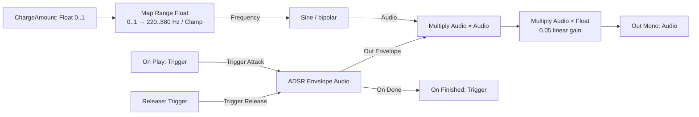
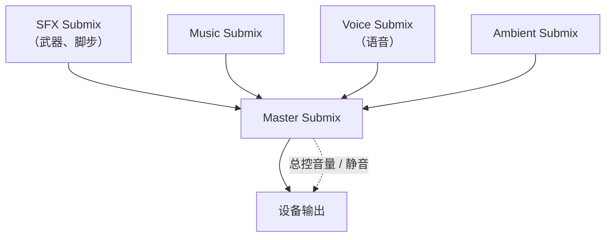
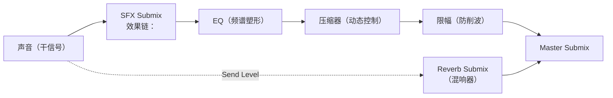
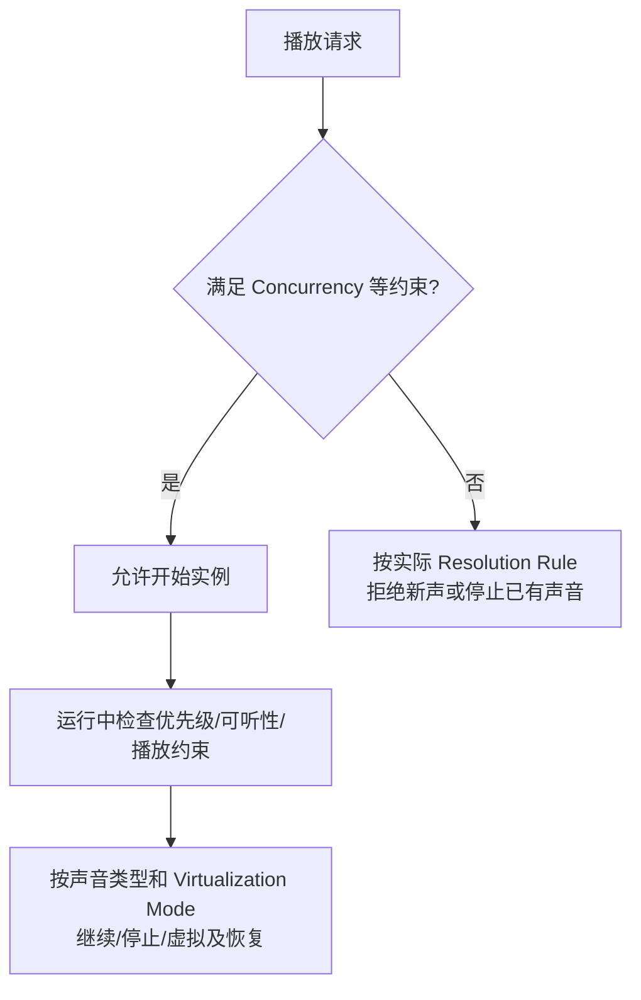

# 03 MetaSound 与程序化音频
> 知识成熟度：L2（官方文档与 API 静态核对；自建图、蓝图与 C++ 未在 UE 中编译或播放）。

> 所属系列：音频播放与程序化声音（UE 客户端）。
> 版本基准：图、引脚与 Submix/Concurrency 教学核对固定 UE 5.6 官方文档；文末列出的当前 C++ API 与 Audio Modulation 页面在 2026-10-10 实际返回 UE 5.8。两者各标范围，不据此保证所有中间版本或插件组合一致。
> 适用范围：自建单声道 MetaSound Source、普通 Actor/AudioComponent 参数驱动和结束；Submix、调制、中间件和性能部分保留为选择及排查指南。
> 前置知识：[01-音频基础与播放](./01-音频基础与播放.md)、[02-衰减与3D空间音效](./02-衰减与3D空间音效.md)；会创建蓝图 Actor、组件和自定义事件。
> 最后更新：2026-10-10（补全正常合成、播放、更新、释放、结束路线，修正单位、返回值及虚拟化边界）。
> 证据范围：没有本次 UE checkout、PIE、打包、设备播放或性能测量；未执行本文的编辑器操作或插件设置。预期结果是学习验收步骤，不是实测报告。

历史身份：旧稿 2026-08-05 标注 UE 5.8.0、CL 55116800、`++UE5+Release-5.8`，并将 `C:\Program Files\Epic Games\UE_5.8\Engine\Plugins\Runtime\Metasound` 和 `Engine\Plugins\Runtime\AudioModulation` 记作来源位置。本轮未访问该机器或路径，不能把旧标注当作当前源码核对。旧稿 L2 不提升，`verified` 继续为空。

---

## 一、概述

前两篇讲的是"播放现成录音"。本篇讲"**合成与加工声音**"：

- **MetaSound**：用节点图实时"算"出声音（程序化音频），并暴露参数给蓝图 / C++ 驱动；
- **Sound Submix 与 DSP**：把音频路由进效果链（EQ、压缩、混响、延迟），搭建专业混音总线；
- **Audio Modulation（音频调制）**：用 LFO / 包络等自动调制音量、音高、滤波（UE5 特性）；
- **中间件集成**：Wwise / FMOD 与 UE 音频系统的关系与取舍；
- **音频性能优化**：并发数、虚拟化、内存、CPU 预算与调试工具。

本文先解决一个具体问题：技能蓄力值从 0 变到 1 时，声音如何由 220 Hz 升到 880 Hz；释放后如何平滑归零并结束这个声音实例。读完应能按图搭出这条正常路线，区分素材、音频数据和触发事件，再把声音送入混音总线。性能措施是待测的选择，不承诺给定节点数或配置就能满足项目预算。

---

## 二、核心概念（表格）

| 概念 | 类别 | 一句话作用 | 关键点 |
| ---- | ---- | ---- | ---- |
| MetaSound | 资产 | 节点图形式的音频"程序" | UE5.0+，节点驱动 DSP |
| MetaSound Source | 资产 | 能独立作为声音来源播放 | 图的音频输出接到 Source 输出 |
| MetaSound Patch / Preset | 复用资产 | Patch 封装子图；Preset 覆盖继承图的输入默认值 | Patch 不能单独当声音播放；Preset 不复制一份自由编辑的图 |
| Input / Output 节点 | 节点 | 暴露参数 / 输出音频 | 蓝图可驱动 |
| ADSR Envelope | 节点 | 音量包络（起音/衰减/保持/释放） | 合成器基础 |
| Sine / Saw / Square / Noise | 节点 | 周期波形或噪声发生器 | Sine 的 Frequency 是 Hz；Noise 是独立声源 |
| Midi To Frequency | 节点 | MIDI 音符转频率 | 音乐系统 |
| USoundSubmix | 资产 | 混音总线节点 | 可嵌套、可挂效果器 |
| Submix Effect | 效果器 | DSP 效果（EQ/压缩/混响/延迟） | 挂到 Submix 的效果链 |
| Master Submix | 资产 | 默认混音图的最终输出总线 | 自定义 endpoint 或其他音频运行时另论 |
| Send Level | 参数 | 向额外 Submix 发送的信号增益 | 不等于自动归一化的干/湿比例 |
| Audio Modulation | 系统 | 参数调制（LFO/包络/随机） | UE5 特性，替代部分蓝图每帧驱动 |
| USoundConcurrency | 资产 | 并发数量与超限处理规则 | 与声音的虚拟化模式分开 |
| Virtualization | 功能 | 在播放约束下处理声音实例的策略 | 无声不等于已经释放 voice |
| Wwise / FMOD | 中间件 | 第三方音频工作流与运行时 | 可与原生音频分工，需明确资源和事件归属 |

（表 1：03 篇核心概念速览）

---

## 三、原理详解

### 3.1 MetaSound：节点图与参数化

#### 3.1.1 图里流动的是什么

MetaSound 是 DSP 数据流图。它既能计算振荡器，也能用 Wave Player 播放录音，并将两者混合；“使用 MetaSound”不等于“不使用 SoundWave”。音频引脚传一块采样数据，Float 传控制数值，Trigger 传触发时刻。蓝图执行线、持续的 bool 状态和音频采样不能互换。

| 身份 | 何时选用 | 本文中的角色 |
| --- | --- | --- |
| MetaSound Source | 需要独立播放的完整声源 | 自建 `MS_ChargeUp`，输出 mono audio，并通知结束 |
| MetaSound Patch | 多个图共用包络、滤波等功能 | 以后可提取合成模块；本例不需要新建 |
| MetaSound Preset | 同一父图只改变默认输入 | 例如低频/高频配置；父图只读继承，父图更改会传播 |
| SoundWave / Wave Player | 已有录音素材要进入图 | Wave Player 读取 SoundWave；不是 Patch 或 Preset 的另一个名字 |

资产身份及 pin 类型依据 [MetaSounds Reference Guide 的 Asset Types / Presets / Pin Types](https://dev.epicgames.com/documentation/en-us/unreal-engine/metasounds-reference-guide-in-unreal-engine?application_version=5.6)。旧稿已纠正“Source/Patch 在UE5.5更名为 OneShot/Graph”的说法，这个正确校订保留。本次当前5.8 API仍列出 [UMetaSoundSource](https://dev.epicgames.com/documentation/en-us/unreal-engine/API/Plugins/MetasoundEngine/UMetaSoundSource) 和 [UMetaSoundPatch](https://dev.epicgames.com/documentation/en-us/unreal-engine/API/Plugins/MetasoundEngine/UMetaSoundPatch)；前者通过 SoundWaveProcedural/Wave 继承 SoundBase，后者是嵌入其他图的资产。本例的 `UE.Source.OneShot` 是接口身份，不能拿它替换 Source 类名。


常用节点的学习用途仍包括：Sine/Saw/Square/Noise 制作音色；AD/ADSR 塑造起止；One-Pole 或状态变量滤波器塑形；Delay/Flanger 做时间变化；Add/Multiply/Map Range 合成与换算；MIDI To Frequency 接音乐音高；Trigger 工具组织事件。先让最小声源和结束链成立，再一次添加一种效果，观察它改变的是音频还是控制量。具体节点类型以本节引用的固定版本目录为准。

#### 3.1.2 从空资产搭出可结束的合成图

目标是一个无外部音频素材的蓄力音。下面是**待在目标 UE 中搭建和验收的教学步骤**，本轮没有创建资产或播放声音。MetaSound 编辑器可用是前提；若缺失先核目标引擎及插件状态，不从本例推导“所有工程默认启用”。

1. Content Browser → Add → Audio → MetaSound Source，创建 `MS_ChargeUp`。保留 `UE.Source.OneShot` 接口，Output Format 选 Mono；图中使用 `On Play`、`On Finished` 和 `Out Mono`。若只有 stereo 输出，先统一输出格式，不能把一条线当成立体声两条已接好。
2. 新建 Float graph input `ChargeAmount`，默认 0；新建 Trigger graph input `Release`。可从对应引脚拖出，选择 Promote to Graph Input 再重命名。参数必须是 Graph Input，普通内部 Variable 不成为外部参数。
3. 加入 `Map Range (Float)`：`In Range A/B = 0/1`、`Out Range A/B = 220/880`、`Clamped = true`。`ChargeAmount` 接 `In`，`Out Value` 接 `Sine` 的 `Frequency`。Sine 启用 `Enabled`、`Bi Polar`；Glide 先设 0，其他波形算法选项保留默认。
4. 加入 **ADSR Envelope (Audio)**。设置 `Attack Time = 0.02 s`、`Sustain Level = 1.0`、`Release Time = 0.10 s`，Attack/Decay/Release Curve 均为 1。其余保持新建默认；本例 sustain 与峰值都为 1，衰减段不会改变其幅度。`On Play` 接 `Trigger Attack`，`Release` 接 `Trigger Release`。
5. 加入 `Multiply (Audio)`，将 `Sine.Audio` 和 `ADSR.Out Envelope` 接它的两个 Audio 操作数输入。将结果接第二个 `Multiply (Audio by Float)` 的 Audio 输入，Float 操作数填 `0.05`，结果接 `Out Mono`。从对应类型的线拖出再搜索 Multiply，可避免误选纯 Float 版本。这里用“两个操作数”指其输入插槽，不把文档未列出的 UI 显示名编造成固定引脚名。
6. `ADSR.On Done` 接 Source 的 `On Finished`。这条是 Trigger 线，不连接到 `Out Mono`。保存图；本文的最小图没有延迟或混响尾音，因而包络结束即可通知 Source 结束。



（图 1：同一张图里的控制值、音频流和完成事件；具体连线见上面步骤。）

从因果关系看，Sine 持续产生波形，包络决定什么时候让它可听。开始时 Attack 将幅度从 0 拉起；到 Sustain 后保持；只改变 `ChargeAmount` 不会结束声音；收到 `Release` 后包络降到 0，再由 `On Done` 通知整个 Source 可结束。只把增益设为 0 会静音，不能代替结束通知。若以后增加 Delay/Reverb 节点，须把其尾音纳入结束条件，不能照搬这条 `On Done` 连线提前截断。

节点类型、Hz、Time 和触发语义核对 [节点参考的 Sine、Map Range、Multiply、Envelopes](https://dev.epicgames.com/documentation/en-us/unreal-engine/metasound-function-nodes-reference-guide-in-unreal-engine?application_version=5.6)。该参考 ADSR 表有 `Delay Time` 字样；本例不据这个拼写要求新增延迟节点，也不声称读到了目标安装的节点截图。ADSR 需要独立的 Release trigger，bool Gate 不能直接代替它。

#### 3.1.3 单位与可手算的正常轨迹

| 输入或中间值 | 类型/单位 | 本例约定 |
| --- | --- | --- |
| ChargeAmount | Float，无量纲 | 有限数值；0..1 表示蓄力比例，超界被 Clamp |
| Frequency | Float，Hz | `220 + 660 × clamp(ChargeAmount, 0, 1)` |
| Release | Trigger | 一次释放事件，没有“保持 true”的持续语义 |
| Attack / Release Time | Time，秒 | 0.02 / 0.10；不是毫秒数 20 / 100 |
| Out Envelope | Audio，每采样的线性系数 | 使用 Audio 版本，sustain 为 1 |
| 最后一级增益 | Float，线性倍数 | 0.05；不是 0.05 dB，也不是设备音量保证 |

手算输入 0、0.5、1，频率应分别为 220、550、880 Hz；-1、2 应钳制到两端。这些数只是教学参数，不是某技能应采用的音高设计。`ChargeAmount = 0.5` 若直接接 Frequency，只给出 0.5 Hz，并不等于“一半音高”。在游戏端还应拒绝 NaN/Inf，不把 Clamp 当成非有限值清洗。

ADSR 有 Audio（audio-rate）和 Float（block-rate）版本。前者能在同一块中产生随采样变化的幅度，后者是块级控制值；“都是一个浮点数”不能证明可以随意替换。对于采样率 Fs 和一块 N 个样本，样本间隔为 `1/Fs`，块时长为 `N/Fs`；例如假设 Fs=48000、N=256，分别约 0.0208 ms 和 5.33 ms。它们是计算例，不是当前工程配置。

MetaSound 的图内触发可按采样位置处理，但外部蓝图 Tick、定时器、游戏线程发参数以及最终设备输出还要经过调度和缓冲。因此不能把“Set Trigger 在这一帧调用”写成“扬声器在该时刻零延迟响应”。[MetaSound 概览](https://dev.epicgames.com/documentation/en-us/unreal-engine/metasounds-the-next-generation-sound-sources-in-unreal-engine?application_version=5.6)说明图内时序和异步渲染；[Audio Mixer 的线程/缓冲说明](https://dev.epicgames.com/documentation/en-us/unreal-engine/audio-mixer-overview-in-unreal-engine?application_version=5.6)区分 audio thread、audio render thread 与硬件回调。游戏对象的公开组件 API 在正常游戏逻辑中调用，不从自定义 DSP 算子直接修改 Actor/UObject。

#### 3.1.4 播放入口与结束是两个契约

| 入口 | 返回/持有方式 | 适合的用途 |
| --- | --- | --- |
| Play Sound 2D / Play Sound at Location | 即发即弃，不能从该调用拿到 AudioComponent | 无需后续参数或停止控制的声音 |
| Spawn Sound 2D | 返回 AudioComponent，生成时开始播放 | 外部保存引用，再设置参数/释放；必须处理返回为空及自动销毁 |
| Actor 的 AudioComponent | Actor 持有组件，显式设置 Sound 和 Play | 本文正常路线，方便绑定结束事件并重用组件 |

这里不是凭名字猜返回值：[PlaySound2D API](https://dev.epicgames.com/documentation/en-us/unreal-engine/API/Runtime/Engine/UGameplayStatics/PlaySound2D)实际返回 `void`，[SpawnSound2D API](https://dev.epicgames.com/documentation/en-us/unreal-engine/API/Runtime/Engine/UGameplayStatics/SpawnSound2D)返回 `UAudioComponent*` 且生成时开始播放；后者的官方蓝图用法也见 [Quick Start 第4节](https://dev.epicgames.com/documentation/en-us/unreal-engine/metasounds-quick-start?application_version=5.6)。它们不是网络复制的声音事件协议。

`SetFloatParameter("ChargeAmount", value)` 更新实例输入；C++ 的 `SetTriggerParameter("Release")` 对应当前 API 中的蓝图显示名 **Execute Trigger Parameter**。该方法由参数控制接口继承，不能因组件总页未直接列出就判断它不存在。[Trigger API](https://dev.epicgames.com/documentation/unreal-engine/API/Runtime/AudioExtensions/IAudioParameterControllerInterfa-/SetTriggerParameter)明确 trigger 不缓存，只在声音已播放时执行。本例用 On Play 开始包络，避免在 Play 前发送一个被丢弃的 Start trigger。

正常结束走 `Release → ADSR → On Finished`；强制取消走组件 `Stop`，或 `Fade Out` 渐变后停止。组件的 `OnAudioFinished` 也可能来自 Stop，不等于“玩家完成蓄力”。玩法成功/取消由游戏逻辑自己记录，音频通知只负责清理或放开下一次播放。

### 3.2 程序化音频生成（合成器简述）

程序化音频 = 用算法实时生成波形，而非播放录音。适用场景：

- **无限变化的音效**：脚步（每步随机细节）、引擎转速、武器充能（参数连续变化）；
- **动态音乐**：根据战斗状态实时改变节奏 / 配器；
- **减少录音素材需求**：纯合成可不带录音采样，但图资产、节点状态、输出缓冲和 CPU 仍有成本；混入 Wave Player 后还要计入录音资源。

基础合成套路：

```text
振荡器（音色） → 包络（响度形状） → 滤波（频谱） → 增益 → 输出
```

常用数学：`频率 = MIDI 音符号 → 440 × 2^((n−69)/12)`；包络用 ADSR 四段线性 / 指数插值；噪声（白 / 粉）做风声、打击乐瞬态。

> 注意：程序化音频的"听感打磨"成本高，小团队建议"录音为主、合成点缀"；MetaSound 特别适合**参数连续变化**的声音（引擎、脚步、氛围）。

### 3.3 Sound Submix 与 DSP 效果链

#### 3.3.1 Submix 是什么

**Submix（混音子总线）**是音频路由节点。图2展示常见的默认 Master 路线：各类声音进入相应 Submix，沿父级路由汇入 Master 输出。额外声源发送或自定义 endpoint 需要另画路由，不能由这张简图推定。



（图 2：典型 Submix 路由结构）

#### 3.3.2 Submix 效果链（DSP）

每个 Submix 可以挂一串**效果器**（Submix Effect Chain），按顺序处理：



（图 3：Submix 效果链 + Send 混响）

| 效果器 | 作用 | 典型设置 |
| ---- | ---- | ---- |
| Submix EQ（参量均衡） | 修正频谱：去浑浊、提亮 | 低切 80Hz、中频 -2dB |
| Dynamics Processor（压缩器） | 压动态、提升响度感 | 阈值 -18dB、Ratio 3:1 |
| Submix Effect Reverb | 空间混响 | Decay 1.5s、Wet -6dB |
| Delay（延迟） | 回声 / 立体声加宽 | 反馈 30% |
| Limiter | 保护不削波 | 输出上限 -1dB |

关键概念：

- **干 / 湿比（Dry / Wet）**：直达与处理后信号的关系；Send Level 控制发送支路增益，Reverb 自身 Wet/Dry 还会影响结果，不能把 Send=0.25 自动解释成“总输出25%湿、75%干”；
- **Parent Submix**：嵌套路由，例如"所有 UI 音效 → UI Submix → Master"；
- **Solo / Mute**：调试利器，单独听某条总线；
- 声音归属：在 SoundWave / SoundCue / MetaSound Source 的 Submix 属性指定基础总线，额外的 Submix Sends 从声源发出。组件运行时发送使用公开 Set Submix Send 接口。旧稿直接写 `SoundSubmixOverride` 未获本次 API 页支持，不能作为已核对的通用成员赋值示例。

[UE5.6 Submixes Overview](https://dev.epicgames.com/documentation/en-us/unreal-engine/overview-of-submixes-in-unreal-engine?application_version=5.6)区分基础 Submix、声源额外 sends、组件动态 sends 和 Audio Volume；基础信号不会因增加一条 send 自动消失。图2/图3是路由意图，具体效果器数值只是调音起点。

### 3.4 Audio Modulation 简述（UE5 特性）

Audio Modulation 将共享的音量、音高或滤波控制组织为参数、Control Bus、Bus Mix、Parameter Patch 和 Generator，再接到 Modulation Destination。Generator 可以产生 LFO 或包络；Parameter 描述单位和混合语义；Bus 让多处共同引用一个控制量。它和 MetaSound 图内 ADSR 是不同层面的功能，不是同一种资产。

典型用途仍是让风缓慢起伏、让一组声音随状态统一变化。先确定目的对象的 Modulation Destination，再选择其路由和 modulator；不能把一个 LFO 名字写入任意 Float 输入就期待生效，也不保证改用调制后一定更省 CPU。

[Audio Modulation Reference Guide](https://dev.epicgames.com/documentation/en-us/unreal-engine/audio-modulation-reference-guide-in-unreal-engine)本次返回 UE5.8，列明资产和 destination；固定5.6尝试未返回可用正文，故不冒充5.6逐项核对。本节没有启用插件、重启编辑器或实际配置工程。

### 3.5 中间件集成简述（Wwise / FMOD）

UE 原生和 Wwise / FMOD 都能承担项目音频工作。选择取决于团队已有资产、作者工具、混音/状态需求、平台支持和合同成本，不存在“原生必然中等、中间件必然高级”的统一评分。

| 选择问题 | 原生路线 | 中间件路线 |
| --- | --- | --- |
| 谁编辑声音逻辑 | Unreal 资产、MetaSound/Submix 等 | 对应 Authoring 工程及 UE 集成资产 |
| 谁消费玩法参数 | AudioComponent / 原生音频接口 | 插件事件、参数与对应运行时 |
| 谁管理资源 | UE 引用、Cook 与目标平台设置 | 还需管理对应版本的事件/Bank 或等价资源 |
| 项目维护成本 | 核对引擎版本、平台及功能需求 | 同时核对插件兼容、资源构建和当前许可条款 |

保留旧稿的集成思路：安装匹配插件、准备声音事件、由 UE 玩法触发、明确工具和资源的归属。[Wwise 2024.1.5 官方资产条目](https://www.audiokinetic.com/en/public-library/2024.1.5_8803/?id=pg_features_objects_assets.html&source=UE4)的本次检索摘录将 `UAkAudioEvent` 列为 Event 资产；原页未能打开，因此这里只区分事件资产与关卡触发行为，不交付该版逐步集成或API签名。具体调用与资源构建仍须按已选 Wwise/FMOD 版本核对。

两套系统可以有明确分工，例如一种负责音乐、另一种负责技能合成；同一业务声音避免重复触发。跨系统的总线、空间化、停止、音量设置和打包依赖需要单独验证，不能据“都能响”认定一套 Submix 就控制了另一套混音。

### 3.6 音频性能优化

#### 3.6.1 并发音效数与虚拟化



（图 4：并发准入与虚拟化分别判断；规则选择可能让新声音开始，或直接拒绝；图不把所有超限分支合成同一动作。）

- **Concurrency**：限制组内活跃声音并决定超限处理。`Stop Oldest` 才是停止最老的声音；`Prevent New` 拒绝新的声音。计数不能只看耳朵听到几条，活跃但无音频输出的合成组件也可能占该组名额。
- **Virtualization**：声音受播放约束后的行为，需与源类型、循环和恢复方式一并理解。当前5.8 `EVirtualizationMode` 包含 Disabled、PlayWhenSilent、Restart、SeekRestart；最后一项文档标实验性，不能倒写成5.6均有。
- **PlayWhenSilent**：API 明确说无声时仍播放并占用 voice，不是通用“省 CPU 挂起”。旧稿的 PlayWhenSilentNoVirtualize / Throttle / Pause 没有被本次枚举支持，不再当作这一个枚举的选项。
- **Priority**：是资源策略的输入之一，不代替每组具体规则。“语音优先于环境音”可以是项目设计，不是引擎默认事实。

依据：[固定5.6 Concurrency Reference](https://dev.epicgames.com/documentation/en-us/unreal-engine/sound-concurrency-reference-guide?application_version=5.6)、[当前5.8 EVirtualizationMode](https://dev.epicgames.com/documentation/en-us/unreal-engine/API/Runtime/Engine/EVirtualizationMode)。

#### 3.6.2 内存与流送

- 短音效：按加载行为、目标平台解码和首播延迟选择驻留/解码策略，不能用 Asynchronous 一词概括所有设置；
- 长音乐 / 长语音：评估 **Streaming**，同时计入缓存、chunk、解码与预读内存，并验证访问延迟；
- **Max Channels** 约束同时输出的 voice，不是项目中声音资产总数；有效值和平台覆盖应查实际工程，调大后需重新测 CPU / 内存；
- Cook 前检查：`LogAudio` 或打包报告中的声音大小统计，砍掉用不到的音效。

#### 3.6.3 CPU 预算

| 开销来源 | 控制手段 |
| ---- | ---- |
| 解码 | 按目标平台支持的编码、加载方式和首播延迟测量；避免大量同步解压 |
| 空间化 | 单声道素材、Pan 优先；HRTF 只在必要平台开 |
| 遮挡采样 | 从可接受的响应时间选择采样频率；0.1~0.3s 仅是可尝试值 |
| Submix 效果链 | 效果算法、声道数、采样率及实例数量共同决定成本；测量后再决定共享或拆分 |
| MetaSound | 算子类型、实例并发、块大小、采样率和更新率共同决定开销 |
| 采样率转换 | 核素材、目标混音采样率和音高变化；统一素材率不能消除所有重采样 |

#### 3.6.4 调试工具

- **Stat Audio**：并发数、CPU 占用、活跃声源数；
- **音频调试视图**：核目标版本实际可用的声音、衰减和虚拟化显示；名称及功能不能由旧稿泛称 AudioDebugger 推定；
- **LogAudio**：结合实际日志类别及 verbosity 检查播放请求和拒绝线索，不保证每种拒绝都输出一条可识别日志；
- **静音观察**：可以观察请求、参数和状态，但静音不证明声音已到设备，也不证明算法听感正确。真正试听/录制、打包及性能验证应另行进行。

---

## 四、代码 / 蓝图示例

### 4.1 蓝图：一个拥有组件的 Actor

先搭好3.1的 `MS_ChargeUp`，再创建 `BP_ChargeAudio`，加 AudioComponent 命名 `ChargeAudio`。其 Sound 设为该 Source，Auto Activate 关闭，Allow Spatialization 关闭；保持参数更新允许。这里使用 Actor 的成员组件，不使用 Spawn 后自动销毁的组件；不要把 Spawn 节点的 Auto Destroy 参数当作必须在成员组件 Details 找到的开关。单实例教学不叠加空间衰减、并发劫夺或多实例播放，以免把这些条件误当作图错误。

创建 bool `bReleasing`（默认 false），并绑定组件的 `On Audio Finished`：将 `bReleasing` 设 false。所有下述 Target 都是同一个 `ChargeAudio` 组件，不是资产本身。

| Actor 事件 | 按顺序连接的节点 | 目的 |
| --- | --- | --- |
| `StartCharge` | 若组件 Is Playing 或 bReleasing 则返回；Set Float Parameter（ChargeAmount=0）→ Play | 先确定初值，再由 Source.On Play 起音 |
| `UpdateCharge(Value)` | 仅在 Is Playing 且非 bReleasing；将有限 Value Clamp 0..1 → Set Float Parameter（ChargeAmount） | 持续改同一实例的音高 |
| `ReleaseCharge` | 仅在 Is Playing 且非 bReleasing；设 bReleasing=true → Execute Trigger Parameter（Release） | 只发一次释放，等待包络结束 |
| `CancelCharge` | 清 bReleasing → Stop | 立即取消；需要柔和退出时可另选 Fade Out |
| `EndPlay` | Stop | Actor 生命周期结束时关闭自身声音 |

若 UI 中找不到 Execute Trigger Parameter，可从 AudioComponent 引用拖出并搜索 Trigger，核该版显示名；C++ 对应函数名仍是 SetTriggerParameter。组件已有归属，所以不需要额外创建一个匿名 AudioComponent 再猜哪个实例响应。

**最小验证接线（待执行）**：把 Actor 放到空关卡。Event BeginPlay → StartCharge → Delay(1s) → UpdateCharge(0.5) → Delay(1s) → UpdateCharge(1) → Delay(1s) → ReleaseCharge。Delay 仅用于人能区分阶段的教学触发，不是样本精确计时工具。预期先低音、后升高两次，释放后约0.10s包络下降并触发完成；组件随后不再播放，下一次 StartCharge 可重新开始。设备缓冲会影响听到及回调的墙钟时刻，不能用这条链测端到端延迟。

先在图中检查频率映射和最终 Audio 输出，再核 Actor 组件、参数名称和完成事件。若本机不具备音频输出，最多核对图/事件，不能记录“已听到”。若启动被并发或平台状态拒绝，先恢复这些前提；不要循环 Spawn 大量实例来掩盖失败。

### 4.2 C++：同一资产和组件生命周期

下面是游戏模块中一个 Actor 的完整教学候选；类文件名 `ChargeAudioActor.h/.cpp`，需目标工程现有 `Core`、`CoreUObject`、`Engine` 模块。资产使用 `USoundBase` 类型持有，运行前在该 Actor 蓝图子类的 Class Defaults 将 `ChargeSound` 设为 `MS_ChargeUp`。该属性仍须通过 SetSound 安装到实际组件；下例在派发蓝图 BeginPlay 前完成这一步及结束事件绑定。无需在此代码中构造 MetaSound 图，也不据代码存在声称已编译。跨模块导出时采用自己模块的导出宏。

```cpp
// ChargeAudioActor.h
#pragma once
#include "CoreMinimal.h"
#include "GameFramework/Actor.h"
#include "ChargeAudioActor.generated.h"

class UAudioComponent;
class USoundBase;

UCLASS()
class AChargeAudioActor : public AActor
{
    GENERATED_BODY()
public:
    AChargeAudioActor();
    UFUNCTION(BlueprintCallable) void StartCharge();
    UFUNCTION(BlueprintCallable) void UpdateCharge(float Value);
    UFUNCTION(BlueprintCallable) void ReleaseCharge();
    UFUNCTION(BlueprintCallable) void CancelCharge();
protected:
    virtual void BeginPlay() override;
    virtual void EndPlay(const EEndPlayReason::Type Reason) override;
    UPROPERTY(EditDefaultsOnly, Category="Audio")
    TObjectPtr<USoundBase> ChargeSound;
    UPROPERTY(VisibleAnywhere, Category="Audio")
    TObjectPtr<UAudioComponent> ChargeAudio;
private:
    UFUNCTION() void HandleAudioFinished();
    bool bReleasing = false;
};
```

```cpp
// ChargeAudioActor.cpp
#include "ChargeAudioActor.h"
#include "Components/AudioComponent.h"
#include "Sound/SoundBase.h"

AChargeAudioActor::AChargeAudioActor()
{
    PrimaryActorTick.bCanEverTick = false;
    ChargeAudio = CreateDefaultSubobject<UAudioComponent>(TEXT("ChargeAudio"));
    SetRootComponent(ChargeAudio);
    ChargeAudio->bAutoActivate = false;
    ChargeAudio->bAutoDestroy = false;
    ChargeAudio->bAllowSpatialization = false;
    ChargeAudio->bStopWhenOwnerDestroyed = true;
}

void AChargeAudioActor::BeginPlay()
{
    // 先准备蓝图 BeginPlay 中 StartCharge 会使用的组件状态。
    ChargeAudio->OnAudioFinished.AddDynamic(
        this, &AChargeAudioActor::HandleAudioFinished);
    ChargeAudio->SetSound(ChargeSound.Get());
    Super::BeginPlay(); // 再允许基类派发蓝图 BeginPlay。
}

void AChargeAudioActor::StartCharge()
{
    if (!ChargeSound || bReleasing || ChargeAudio->IsPlaying()) return;
    ChargeAudio->SetFloatParameter(TEXT("ChargeAmount"), 0.0f);
    ChargeAudio->Play(0.0f);
}

void AChargeAudioActor::UpdateCharge(float Value)
{
    if (!FMath::IsFinite(Value) || bReleasing || !ChargeAudio->IsPlaying()) return;
    ChargeAudio->SetFloatParameter(TEXT("ChargeAmount"), FMath::Clamp(Value, 0.0f, 1.0f));
}

void AChargeAudioActor::ReleaseCharge()
{
    if (bReleasing || !ChargeAudio->IsPlaying()) return;
    bReleasing = true;
    ChargeAudio->SetTriggerParameter(TEXT("Release"));
}

void AChargeAudioActor::HandleAudioFinished()
{
    bReleasing = false; // 完成或停止均可到达；不在这里判技能成功。
}

void AChargeAudioActor::CancelCharge()
{
    bReleasing = false;
    ChargeAudio->Stop();
}

void AChargeAudioActor::EndPlay(const EEndPlayReason::Type Reason)
{
    CancelCharge();
    ChargeAudio->OnAudioFinished.RemoveDynamic(
        this, &AChargeAudioActor::HandleAudioFinished);
    Super::EndPlay(Reason);
}
```

此处原生 BeginPlay 的顺序是：**绑定完成事件 → SetSound 安装声源 → Super::BeginPlay → 蓝图 Event BeginPlay → StartCharge**。先完成前两步，蓝图子类才能在自己的 Event BeginPlay 中直接使用4.1的三秒 StartCharge/Delay/Update/Release 链。只给 ChargeSound 属性赋值不代表组件的 Sound 已安装；若先调用 Super，再 SetSound，蓝图首次 Play 就可能早于实际声源准备。

这个顺序的依据是 Epic [UE-10138 的 Developer Notes](https://issues.unrealengine.com/issue/UE-10138)：原生 AActor::BeginPlay 会调用蓝图 ReceiveBeginPlay，需要先运行的自定义原生初始化应放在 Super 调用前。该说明属于历史问题记录（版本字段4.7）；本次 [AActor 当前API](https://dev.epicgames.com/documentation/en-us/unreal-engine/API/Runtime/Engine/AActor)返回5.8，仍列出 ReceiveBeginPlay 的 BlueprintImplementableEvent / BeginPlay 显示名。它支持公开事件身份，不等于本次读过5.8 Actor.cpp或运行过首播；这里依据官方说明对本例控制流作静态安排。

播放仍由 StartCharge 显式开始，原生初始化没有增加一次额外 Play。它不需要 Actor Tick；真实技能已有蓄力变化时调用 UpdateCharge 即可。组件由 Actor 持有且不自动销毁，结束后可以重用；SpawnSound2D 若选择 AutoDestroy，则不能照搬“永远持有同一个组件”的假设。

这是单次播放期间不重启的简化契约：释放中不接受新 Start，完成后才再次启动。若 Release 名称或 On Finished 线遗漏，bReleasing 会保持到取消或真正结束；按3.1修图，CancelCharge 是恢复入口。要支持快速重入、异步资源加载、复杂尾音和声音劫夺，应另外设计状态及验收，不能从本例外推。

[UAudioComponent](https://dev.epicgames.com/documentation/en-us/unreal-engine/API/Runtime/Engine/UAudioComponent)、[ISoundParameterControllerInterface](https://dev.epicgames.com/documentation/unreal-engine/API/Runtime/Engine/ISoundParameterControllerInterfa-)和前述 Trigger API 支持公开接口及继承关系；本次未检查引擎实现源码，也未验证某工程 Build.cs、UHT 或打包。

### 4.3 Submix 示例：资产配置与运行时发送

旧稿动态 `NewObject<USoundSubmix>`、注册设备、创建 EQPreset 的代码没有给 GC 持有、设备生命周期和有效 EQ 频段；仅凭注册与追加数组不能认定运行中效果链已经生效。本轮不把 API 搜索未命中当成不存在，而把主示例落到可配置的资产路径：先按下文创建 Submix 与 Effect Preset，在资产 Details 中保存其效果链，再让声源引用它。

运行时增加已有混响总线的发送，可在确认组件和 Submix 非空后调用已核对的公开接口；下列是接入片段，不是另一个完整 Actor：

```cpp
#include "Components/AudioComponent.h"
#include "Sound/SoundSubmix.h"

void SetReverbSend(UAudioComponent* AudioComponent, USoundSubmixBase* Reverb)
{
    if (IsValid(AudioComponent) && IsValid(Reverb))
    {
        AudioComponent->SetSubmixSend(Reverb, 0.25f);
    }
}
```

它保留“按实例动态路由”的用途；基础 Submix 则在声音资产上配置。旧稿 `SoundWave->MarkPackageDirty()` 标记资产包待保存的意图属于编辑器资产编辑，不是运行时把缓冲路由生效的调用，不再混作游戏播放步骤。直接写组件 `SoundSubmixOverride` 的旧例不作为本轮已核对 API 交付。

#### 示例 B：搭 Submix 总线

1. Content Browser → Audio → Mix → **Sound Submix**，创建 `S_Master`、`S_Music`、`S_SFX`、`S_Voice`、`S_Reverb`；
2. 将 Music / SFX / Voice / Reverb 的输出路由到 S_Master，再确认 S_Master 的输出到项目实际 Master。命名为 S_Master 并不会自动替换项目 Master 设置；
3. 创建适用的 Dynamics Processor Effect Preset 并选择限幅模式，放在 S_Master 链末端；阈值例如 -1dB 是调音起点，不保证没有更早的削波；
4. S_SFX 的 Submix Effect Chain 引用 EQ 与 Dynamics Processor Preset，设置有效频段及阈值；效果资产没有进链就不会处理这条总线；
5. 给武器 SoundCue 的基础 Submix 设为 S_SFX；
6. 音乐 SoundWave 设 S_Music；语音设 S_Voice——之后就能在总线上统一处理。

#### 示例 C：Send 混响

1. `S_Reverb` 上挂 **Submix Effect Reverb**（Decay 1.8s，Wet 大一点）；
2. 在需要混响的**声源资产** Submix Sends 增加 S_Reverb，或在它的 AudioComponent 调 Set Submix Send，Send Level 从0.25试起；基础路由仍走 S_SFX；
3. 只给这些声源增加发送不会自动让所有 S_SFX 声音都发混响。检查 Reverb Wet/Dry 和两支总增益，避免重复干声；这里没有执行或试听这些设置。

#### 示例 D：并发与虚拟化配置

1. Content Browser → 右键 → Audio → **Sound Concurrency**，命名 `C_GunShots`；
2. Max Count = 6；Resolution Rule 选 Stop Oldest，表示超限时停止组内最老的声音；
3. 虚拟化在声音的相应设置中另行选择，不把它放进 Concurrency 资产的规则列表；若用 PlayWhenSilent，要接受无声仍占 voice 的代价；
4. 在枪械 SoundCue 的 Concurrency 里引用它；
5. 使用同一组的可控触发对照组内活动数和拒绝/停止行为；全局 Stat Audio 计数含其他声音，不能仅凭全局峰值判这条规则通过。本轮未运行。

---

## 五、最佳实践

1. **录音为主、MetaSound 点缀**：MetaSound 适合"参数连续变化"的声音；一次性音效用录音更省心。
2. **MetaSound 命名约定**：`MS_` 是项目可选前缀；输入应体现单位与用途（ChargeAmount / FrequencyHz / Release），避免同名 Pitch 同时表示Hz、半音或倍率。
3. **暴露输入克制**：只暴露真正会被驱动的参数，其余在资产内部固定，减少误用与每帧开销。
4. **Submix 分层**：按需要划分 Music / SFX / Voice / Ambient；总处理可放 Master，只有某类声音需要的效果放相应分支。
5. **有选择地发送混响**：用 Send 决定哪些声源参与一条共享效果支路；与其他混音方案比较成本和听感，不声称一定更省CPU。
6. **给最终输出保留余量**：按需要在链末端限幅，同时控制前级峰值；末端处理不能修复早已削波的输入。
7. **并发策略先行**：高频音效组（枪、脚步）配置 Concurrency，再按真实负载测量；它有助于控制成本，但不能保证移动端帧率。
8. **虚拟化模式按需**：根据恢复是否需保持时间、能否重播以及 voice 成本选择，先核该版枚举与源类型，不能把 PlayWhenSilent 当成通用省资源项。
9. **优先级排序**：语音 > 关键玩法音效 > 环境音；被劫夺的声音要设计得"听感损失小"（环境音优先牺牲）。
10. **性能预算化**：按真实场景定 voice 和耗时目标，结合实例及全局数据检查；超预算后按瓶颈调整，缩衰减范围不保证 PlayWhenSilent 释放voice。
11. **移动端按测量简化**：评估空间化、MetaSound 并发、Max Channels 和遮挡频率；增大遮挡采样间隔才能减少采样次数，但会增加响应滞后。
12. **中间件尽早评估**：将事件、资产、打包和平台工作流迁移成本纳入决策；不把某种工具选择当成所有项目的先验结论。

---

## 六、常见问题 FAQ

**Q1：MetaSound 有底噪、点击或失真？**

先区分故障：起止不连续可产生点击，检查 Attack/Release；求和或增益过大会削波；周期波形的高频谐波可能混叠；缓冲供应不足又是 underrun。频率/单位、输出峰值和负载分别查，不能把“Output 接了多个节点”当成统一混叠原因。一个 Audio 输入通常先用 Mixer/Multiply 等明确组合。

**Q2：蓝图改参数没反应？**

核 Graph Input、名称、类型、同一播放实例以及组件是否禁用了播放期间参数更新。Release 用 Execute Trigger Parameter；在 Play 前发 trigger 不会缓存。先用0/0.5/1核频率映射，不用高频 Tick 掩盖名称错误。

**Q3：Submix 效果器没生效？**

先核源→基础/发送支路→目标 Submix→输出的真实路由，再核效果 Preset 是否被链引用、频段/阈值及链顺序。光创建资产或注册对象不能证明音频经过它。

**Q4：混响效果器挂上了但很干？**

检查声源 send 是否到正确实例、Send Level、Reverb 的 Wet/Dry 与目标输出。Audio Volume 的区域混响还涉及对应设置，见02篇；不是任意 Reverb 资产存在就会自动生效。

**Q5：声音一多就爆音/破音？**

先分清削波和 underrun。削波追踪源、各总线和发送叠加的峰值/余量；Limiter 无法修复它之前已损坏的波形。underrun 则核生成/解码/调度负载。降低 Max Channels 可以减少负载，但不保证修复任意失真。

**Q6：移动端一开打就卡？**

分别观察声音并发、解码/流送、空间化、DSP、参数更新和遮挡开销。减少无用更新、降低昂贵节点并发或增大遮挡采样间隔后重新测，不能把改用 Audio Modulation、统一采样率当成必然收益。

**Q7：虚拟化后恢复有跳变？**

先核采用的恢复方式、循环位置和声音类型，区分从头重播、时间连续和自定义合成状态重新初始化。需要平滑可设计包络/淡入，但没有“一律 Fade 就恢复原相位”的保证。

**Q8：Wwise 和 UE 原生声音混在一起乱？**

保留清楚的资源/事件分工，避免同一个业务事件在两处触发。一个系统的停止、并发、混音不应默认能管理另一个系统；按已选集成版本验证。

**Q9：MetaSound 在 Cook 后行为不一样？**

查资源引用与 Cook 收录、所需插件/节点运行时可用性、默认输入和游戏端赋值、平台音频设置及打包日志。旧稿“Cook 后必取资产默认值”等说法不是通用规律，需逐项复现，不能仅比采样率。

**Q10：Stat Audio 有大量 voice 但耳朵里没声？**

可能是静音、增益/衰减、路由、未释放的合成实例、设备或虚拟化相关状态。先查具体实例，PlayWhenSilent 本来就可能无声仍占 voice；不要仅凭无声断言“正常虚拟化”。

**Q11：Submix EQ 听不出区别？**

先隔离目标路由，再用容易观察的频段/增益核处理前后，随后调到目标值；Q值、输入频谱和链顺序都会影响效果。输出仪表和实际听感是不同证据，本轮二者都未测。

**Q12：全局音乐如何做 Ducking？**

事件型衰减可从01篇 Sound Mix / SoundClass 路线入手；由另一音频信号驱动的动态压缩应选择支持 sidechain 的处理路径。本篇节点参考中 Compressor 有 Sidechain 输入，因此不能断言所有细粒度侧链都必须自写DSP或使用中间件；跨总线接入仍须按目标系统设计。

**Q13：释放后没有声音了，但组件一直没结束？**

核 Release→Trigger Release 和 ADSR.On Done→Source.On Finished 两条线，以及是否保留了 OneShot 接口。无声、graph完成、组件停止和Actor销毁是四个状态；本例只在正确完成或取消后允许下一次播放。

### 正反例验收表（未运行）

| 操作 | 预期/判定 | 它暴露的机制 |
| --- | --- | --- |
| C++蓝图子类首次 Event BeginPlay 调 StartCharge | 调用前完成事件已绑定、实际组件 Sound 已设为MS_ChargeUp；不靠另一次Play补救 | 派发蓝图前先准备其依赖 |
| 正常0→0.5→1→Release | 映射220→550→880Hz；包络释放后 Source 完成，组件停止 | 参数、音频与结束闭环 |
| 将0.5直接接Sine Frequency | 得到0.5Hz，不是预期550Hz | 单位错误 |
| 漏接Trigger Release | 包络持续，外部“释放”没有正确路径 | 游戏事件不自动等于音频结束 |
| 漏接Source On Finished | 包络可归零，却不能凭静音证明实例结束 | 完成通知独立于幅度 |
| Play前发送Release | 不应把该trigger当成已排队缓存 | 外部trigger的播放前提 |
| 使用Play Sound 2D后期待Return Value | 无该组件返回值，控制链无法照此建立 | 播放入口契约 |
| CancelCharge并确认旧组件停止、结束通知已处理后再次开始 | 新开始重设ChargeAmount=0 | 正常取消/重用边界，不覆盖快速重入 |

这些用例需要在实际目标版本图/组件中执行并保存输入与观察，才能升级为运行证据。当前只核了文档支持、逻辑、链接和文本；没有测试记录、截图、录音或性能结果可宣称成功。

---

## 七、关联阅读

- 上一篇：[02-衰减与3D空间音效.md](./02-衰减与3D空间音效.md)：Audio Volume 混响依赖本篇的 Reverb Submix；遮挡与空间化是性能优化的对象。
- 第 01 篇：[01-音频基础与播放.md](./01-音频基础与播放.md)：播放方式与 Sound Mix 混音。
- 分类导航：[README.md](../../../00_Index/学习路线/图形动画与物理仿真.md)
- 官方原始资料：正文各节的固定版本链接和当前API链接分别支持图语义、路由、并发及函数契约；文档页面不是源码 checkout。
- 相关：Gameplay（技能参数驱动 MetaSound）、性能（Stat Audio / 优化）、美术（音频资产规范）。

## 八、来源定位与未验证边界

| 核对来源 | 实际版本/定位 | 本文支持范围 |
| --- | --- | --- |
| [MetaSound Reference](https://dev.epicgames.com/documentation/en-us/unreal-engine/metasounds-reference-guide-in-unreal-engine?application_version=5.6) | 固定5.6，Asset Types / Presets / Pin Types / Inputs | Source、Patch、Preset及数据类型 |
| [Function Nodes Reference](https://dev.epicgames.com/documentation/en-us/unreal-engine/metasound-function-nodes-reference-guide-in-unreal-engine?application_version=5.6) | 固定5.6，Sine / Map Range / Multiply / ADSR / Wave Player / Compressor | 节点语义；不声称实际节点图已编译 |
| [MetaSound Quick Start](https://dev.epicgames.com/documentation/en-us/unreal-engine/metasounds-quick-start?application_version=5.6) | 固定5.6，1B / 3B / 4B | Source输出、OneShot和Spawn后参数控制 |
| [Audio Mixer Overview](https://dev.epicgames.com/documentation/en-us/unreal-engine/audio-mixer-overview-in-unreal-engine?application_version=5.6) | 固定5.6，Buffer Generation / Threading Model | 渲染线程和缓冲边界 |
| [Submix Overview](https://dev.epicgames.com/documentation/en-us/unreal-engine/overview-of-submixes-in-unreal-engine?application_version=5.6) | 固定5.6，Sending Audio / Properties | 基础总线与额外发送区分 |
| [Concurrency Reference](https://dev.epicgames.com/documentation/en-us/unreal-engine/sound-concurrency-reference-guide?application_version=5.6) | 固定5.6，Details | Max Count / Resolution Rule及活跃组件计数 |
| [UAudioComponent](https://dev.epicgames.com/documentation/en-us/unreal-engine/API/Runtime/Engine/UAudioComponent)、[参数接口](https://dev.epicgames.com/documentation/unreal-engine/API/Runtime/Engine/ISoundParameterControllerInterfa-) | 2026-10-10返回5.8；成员、公开方法和继承表 | SetSound / Play / Stop / OnAudioFinished / 参数与SetSubmixSend |
| [Trigger API](https://dev.epicgames.com/documentation/unreal-engine/API/Runtime/AudioExtensions/IAudioParameterControllerInterfa-/SetTriggerParameter) | 2026-10-10返回5.8，Description / Syntax | 不缓存trigger、显示名及函数名 |
| [UE-10138](https://issues.unrealengine.com/issue/UE-10138)、[AActor API](https://dev.epicgames.com/documentation/en-us/unreal-engine/API/Runtime/Engine/AActor) | 历史Developer Notes（版本字段4.7）；2026-10-10返回5.8的公开事件身份 | 派发蓝图BeginPlay前准备本例所需状态；不是5.8源码或运行认证 |
| [Virtualization枚举](https://dev.epicgames.com/documentation/en-us/unreal-engine/API/Runtime/Engine/EVirtualizationMode)、[Audio Modulation](https://dev.epicgames.com/documentation/en-us/unreal-engine/audio-modulation-reference-guide-in-unreal-engine) | 2026-10-10返回5.8 | 当前枚举和调制资产身份；不倒推旧版本 |

固定5.8的MetaSound资料读取失败后采用可读的固定5.6资料；部分固定5.6 API链接及节点图片同样未取到，当前API页是独立的新读取，不补作失败来源的成功。没有本地源码定位、引擎编译、PIE、Cook、播放/录制、设备或性能验证。旧稿历史版本记录不承担这些证据。
