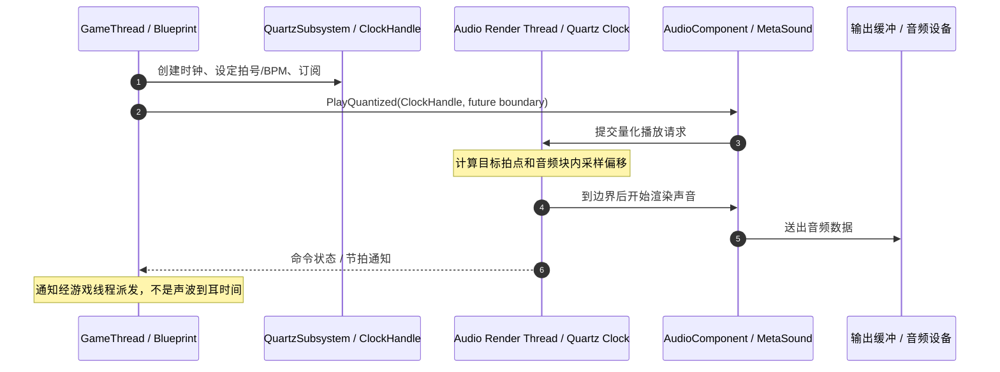
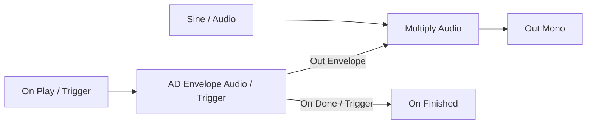

# 04 Quartz 音频时钟与节奏同步（Quantized Audio Clock & Musical Timing）

> 知识成熟度：L2。已核对官方原始资料中的调度原理、公开 API 与蓝图示例；下面是可按图搭建的教学方案，未在 UE 中编译、播放或测量。
> 版本基准：2026-10-10 读取的 Epic 官方页面标题为 **Unreal Engine 5.8 Documentation**。网页是滚动文档，不等于取得 5.8.0 安装包或某个 CL 的源码快照。
> 最后更新：2026-10-10。
> 适用范围：有音频设备的 UE 客户端；单关卡、单本地主时钟、4/4 拍的短音节拍器及小节线变速。严格音游判定、跨关卡音乐和联机同步另有边界。
> 证据边界：旧文中的“本机 UE 5.8.0 / CL 55116800 / 全部源码已核对”没有随文可复核的原始读取流，本次不承接为已验证事实；也没有把旧叙述改写成新实测。本文的秒数与节奏表均为配置推导。

## 1. Quartz 解决的是哪一种“不准”

设想在游戏线程每隔 0.5 秒调用一次普通播放：Timer/Tick 先受帧调度影响，播放请求再跨线程进入音频渲染。音频通常按缓冲块处理命令，刚错过一个块还要等下一块。Quartz 让你**提前提交未来拍点上的播放**，由音频渲染端算出块内的起始采样位置；它不会把迟到的请求送回过去，也不会消除声卡、系统或蓝牙的输出延迟。[官方原理与线程流程](https://dev.epicgames.com/documentation/en-us/unreal-engine/overview-of-quartz-in-unreal-engine)

例如 48 kHz 下，2048 个采样帧约占 42.67 ms。这个数是缓冲时长的算术结果，不是本文实测的设备总延迟。Quartz 的价值是在缓冲块内部安放已及时到达的命令，而不是把整个游戏变成每秒 Tick 48000 次。



`UQuartzSubsystem` 管理访问入口，`UQuartzClockHandle` 是游戏线程代理；`FQuartzClock` 保存待执行命令，`FQuartzMetronome` 负责音乐计数，clock manager 推进时钟。不能把这概括成“全链路双向无锁所以不会爆音”：公开 API 还列有受互斥保护的缓存状态。调度精度、线程通信和音频 underrun 是不同问题。[Clock 实现边界](https://dev.epicgames.com/documentation/en-us/unreal-engine/API/Runtime/AudioMixer/FQuartzClock)

适合用 Quartz 的是音乐分轨入场、小节线变速、节拍音效与节奏演出。普通 UI 点击、环境声或无音乐拍点要求的对白可以直接播放；网络游戏还需要独立的权威时间基准。

## 2. 先把音乐单位和参考系说清楚

| 概念 | 含义 | 本文配置中的值 |
| --- | --- | --- |
| Clock | 一根独立的音乐时间轴；创建不等于已经运行 | 名称 `QuartzLessonClock`，由本关卡独占 |
| Clock Handle | 控制时钟、接收通知的 UObject 代理 | 存入蓝图变量，不能只依赖临时返回值 |
| Time Signature | 拍号；NumBeats 是分子，BeatType 是分母单位 | 4 / QuarterNote；Pulse Override 数组为空 |
| Tempo / BPM | 速度；本例以四分音符为一拍 | 120 次/分钟，即 0.5 秒/拍 |
| Beat / Bar | 拍与小节，不能互换 | 每小节 4 拍，2 秒/小节 |
| Transport | 时钟的音乐位置，不是正在播放的 WAV 游标 | Bars、Beat、BeatFraction、Seconds |
| Quantization Boundary | 命令执行位置的完整描述 | 单位、倍数、参考点、启动/取消等开关 |

拍号字段见 [FQuartzTimeSignature](https://dev.epicgames.com/documentation/en-us/unreal-engine/API/Runtime/Engine/FQuartzTimeSignature)，时间戳字段见 [FQuartzTransportTimeStamp](https://dev.epicgames.com/documentation/en-us/unreal-engine/API/Runtime/Engine/FQuartzTransportTimeStamp)。`BeatFraction` 是拍内比例，不能直接当秒或毫秒；查询结果也不能直接与 `FPlatformTime::Seconds()` 相减。

### 2.1 量化单位

以下秒数仅针对本例 **4/4、四分音符 120 BPM、无 Pulse Override**，由 60 / 120 推导：

| EQuartzCommandQuantization | 音乐含义 | 本例时长 | 使用场景 |
| --- | --- | --- | --- |
| `Bar` | 一个小节 | 2 秒 | 分轨/乐段入场 |
| `Beat` | 时钟拍号和脉冲配置定义的拍 | 0.5 秒 | 基础节拍 |
| `QuarterNote` | 四分音符 | 0.5 秒 | 明确按音符时值调度 |
| `EighthNote` | 八分音符 | 0.25 秒 | 半拍切分 |
| `SixteenthNote` | 十六分音符 | 0.125 秒 | 密集节奏 |
| `ThirtySecondNote` / `Tick` | 1/32 音符的音乐刻度 | 0.0625 秒 | 更细的音乐分割 |
| `None` | 不要求音乐量化 | 不填固定时长 | 本例初始化 tempo |

`Tick` 是音乐刻度，不是音频采样，也不是游戏帧；62.5 ms 的音乐间隔可以在采样级位置执行。枚举另有 Half/Whole、附点和三连音，`Count` 是枚举计数项。Beat 不能在所有拍号下都解释成四分音符。[量化枚举](https://dev.epicgames.com/documentation/en-us/unreal-engine/API/Runtime/Engine/EQuartzCommandQuantization)、[Tick rate 的 1/32 定义](https://dev.epicgames.com/documentation/en-us/unreal-engine/API/Runtime/Engine/FQuartzClockTickRate)

换拍号、启用不等长脉冲或变速后，优先用 `GetDurationOfQuantizationTypeInSeconds(QuantizationType, Multiplier)` 取得当前配置的时长，再与手算核对，别沿用“Bar 永远两秒”。

### 2.2 “下一拍”还需要参考点

`CountingReferencePoint` 的类型实际拼作 `EQuarztQuantizationReference`，不要自行把符号改成 Quartz。三种参考模式分别是 `TransportRelative`、`BarRelative`、`CurrentTimeRelative`。[官方枚举](https://dev.epicgames.com/documentation/en-us/unreal-engine/API/Runtime/Engine/EQuarztQuantizationReference)

- **Transport Relative**：对齐 transport 的网格。本例使用它，让低音和高音共享节奏起点。
- **Bar Relative**：以小节为参照，适合表达小节内的音乐结构；使用不同倍数时需明确拍号。
- **Current Time Relative**：从请求所依据的当前时刻向后数指定时长；“等一拍”不能自动解释成“对齐已有音乐的下一拍”。

以本例理想 transport 为参照，在 1.2 秒且请求及时到达时，Beat 网格的后续边界是 1.5 秒；“从当前再等 0.5 秒”的目标则是 1.7 秒。跨线程传递与临界点会影响请求最终赶上哪个边界，这只是说明参考系差异的手算例。

`Multiplier = 1` 在这里表示一个量化单位；它不是 BPM、音量或循环次数。`bFireOnClockStart` 只描述尚未启动时钟的启动行为；`bCancelCommandIfClockIsNotRunning` 为 true 会取消对未运行时钟的命令；`bResetClockOnQueued` / `bResumeClockOnQueued` 会附带重置/恢复。要显式配置，不能把所有开关都打开。[边界字段语义](https://dev.epicgames.com/documentation/en-us/unreal-engine/API/Runtime/Engine/FQuartzQuantizationBoundary)

## 3. 完整教学例：低音数拍，高音标小节

目标是听出稳定的“高低、低、低、低”四拍结构，再按一次键让下一小节开始变慢。教学素材全部由振荡器生成，不需要下载音乐、引用商业采样或使用其他文章的项目资产。以下步骤供读者在目标 UE 5.8 工程中搭建；本文没有执行这些操作。

### 3.1 自建两个可正常结束的短音

在 Content Browser 中通过 **Audio → MetaSound Source** 创建 `MS_QuartzLow`。设 Output Format 为 **Mono**，保留 `UE.Source.OneShot`，按以下图连线：



明确设置：Sine 的 Frequency = **220 Hz**、Enabled = true、Bi Polar = true；AD Envelope 选 **Audio** 版本，Attack Time = **0.005 秒**、Decay Time = **0.1 秒**、Attack/Decay Curve = **1**、Looping = false。`Sine.Audio` 与 `Out Envelope` 接乘法两个音频输入，乘积接 `Out Mono`；包络结束事件接 `On Finished`。复制为 `MS_QuartzHigh`，仅把 Frequency 改为 **440 Hz**。

短起音避免突然开启振荡器，衰减把波形拉回零，`On Finished` 结束这次声音实例。只有连音频线而漏掉完成线，会留下未完成的 OneShot。官方 Quick Start 使用同类短音图；其 Decay Time 命名与节点参考页表格中的 “Delay Time” 文案不一致，搭图按实际 AD Envelope 的衰减引脚与 Quick Start 图核对，不另加一个 Delay 节点。[Quick Start §1](https://dev.epicgames.com/documentation/en-us/unreal-engine/quartz-quick-start)、[AD Envelope / Sine 节点](https://dev.epicgames.com/documentation/en-us/unreal-engine/metasound-function-nodes-reference-guide-in-unreal-engine)、[OneShot 和输出格式](https://dev.epicgames.com/documentation/en-us/unreal-engine/metasounds-reference-guide-in-unreal-engine)

读者先分别预听，预期每次只响一个约 0.105 秒的短音；高音比低音高一个八度。这是素材验证预期，不是本文听音记录。素材未正确发声/结束时，先修该图，不要靠增大 Quartz 队列掩盖问题。

### 3.2 准备变量与边界

在单个测试关卡的 **Level Blueprint** 中保存这些变量：

| 变量 | 类型与初值 | 用途 |
| --- | --- | --- |
| `ClockHandle` | Quartz Clock Handle 对象引用，初始为空 | 持有本例时钟代理 |
| `LowAudio`、`HighAudio` | Audio Component 对象引用，初始为空 | 复用两个短音播放入口 |
| `AcceptScheduling` | Boolean，false | 初始化完成后允许订阅回调提交命令 |
| `OwnsClock` | Boolean，false | 只清理本例实际创建的时钟 |
| `SlowRequested` | Boolean，false | 一次练习只提交一次变速 |

用 **Make Quartz Quantization Boundary** 建立两种播放边界；除 Quantization 不同外完全一致：

| 字段 | `BeatBoundary` | `BarBoundary` |
| --- | --- | --- |
| Quantization | Beat | Bar |
| Multiplier | 1 | 1 |
| Counting Reference Point | Transport Relative | Transport Relative |
| Fire On Clock Start | false | false |
| Cancel Command If Clock Is Not Running | true | true |
| Reset Clock On Queued | false | false |
| Resume Clock On Queued | false | false |

本例先启动、随后由节拍通知预约下一边界，因此播放边界不用 Fire On Clock Start；初始化 tempo 则使用另一份 `InitBoundary`：Quantization = None、Multiplier = 1、Fire On Clock Start = true、Cancel Command If Clock Is Not Running = false、Reset/Resume 均 false。不要把播放用的“未运行即取消”边界误接到初始化变速上。

### 3.3 BeginPlay 的连线顺序

1. **Get Quartz Subsystem**，确认返回对象有效；用 **Does Clock Exist** 检查 `QuartzLessonClock`。若已存在，显示“时钟名已占用”并结束本次初始化，不覆盖别人的时钟，也不删除它。
2. **Create New Clock**：Clock Name = `QuartzLessonClock`；Make QuartzClockSettings 中 TimeSignature 的 NumBeats = 4、BeatType = QuarterNote、OptionalPulseOverride 为空；Ignore Level Change = false；Override Settings If Clock Exists = false；Use Audio Engine Clock Manager = true。保存返回值到 `ClockHandle`，有效后置 `OwnsClock = true`。
3. 从句柄调用 **Set Beats Per Minute**，BPM = 120、Quantization Boundary = `InitBoundary`。它配置速度，不能代替 Start Clock。
4. 调用两次 **Create Sound 2D**，Sound 分别选自建的 Low/High 资产；Volume Multiplier = 0.1、Pitch Multiplier = 1、Start Time = 0、Concurrency Settings 留空、Persist Across Level Transition = false、Auto Destroy = false。分别保存返回组件到 `LowAudio`、`HighAudio`，并对两者执行 **Set Play Multiple Instances = true**。Create Sound 2D 只准备组件，尚未播放；关闭 Auto Destroy 让一次短音结束后仍可使用同一组件。[CreateSound2D 语义](https://dev.epicgames.com/documentation/en-us/unreal-engine/API/Runtime/Engine/UGameplayStatics/CreateSound2D)
5. 创建两次 **Subscribe to Quantization Event**：第一项 In Quantization Event = Beat，第二项 = Bar。每个委托引脚通过 **Create Event → Create a matching event** 生成签名，命名为 `OnBeat` / `OnBar`。本文只订阅需要的两种单位，不接 All Events 后对所有事件都播音。
6. 上述对象均有效后置 `AcceptScheduling = true`，再对 `ClockHandle` 调用 **Start Clock**。不要在回调中每拍重新建 clock、重设 BPM 或 Reset Transport。

`CreateNewClock` 也可能返回已有时钟的句柄，不等于“重建并从零开始”；步骤 1 的专用名字检查使所有权清楚。公共创建/删除接口见 [UQuartzSubsystem](https://dev.epicgames.com/documentation/en-us/unreal-engine/API/Runtime/AudioMixer/UQuartzSubsystem)。保存 Handle 和组件变量、订阅/启动的整体组织参见官方 [Quick Start §2](https://dev.epicgames.com/documentation/en-us/unreal-engine/quartz-quick-start)。

### 3.4 回调怎样变成真正的声音

`OnBeat` 检查 `AcceptScheduling`、Clock Name 与本例相同、`ClockHandle`/`LowAudio` 有效，然后调用 **Play Quantized**：

- Target = `LowAudio`，In Clock Handle = `ClockHandle`，In Quantization Boundary = `BeatBoundary`
- In Start Time = 0，In Fade In Duration = 0，In Fade Volume Level = 1，In Fade Curve = Linear
- In Delegate 接一个匹配的 `OnLowCommand` 事件，记录 Event Type 和 Name

`OnBar` 对应地使用 `HighAudio`、`BarBoundary`、`OnHighCommand`。两种回调都可打印 Clock Name、Quantization Type、Num Bars、Beat、Beat Fraction 供观察；打印的机器时间只表示日志何时到达游戏线程。

Play Quantized 的 Target 是 **Audio Component**，不是 GameplayStatics；它提交一次播放请求，不会因 Multiplier = 1 自动永久循环。这里的重复来自每个 Beat/Bar 通知再次提交请求。[蓝图节点引脚](https://dev.epicgames.com/documentation/en-us/unreal-engine/BlueprintAPI/Audio/Components/Audio/PlayQuantized)

关键因果是：某拍已经发生 → 游戏线程收到该拍通知 → 为未来 Beat 网格提交短音 → 音频渲染端在那个未来边界起音。它没有让迟到的回调“补响在刚才那拍”。在正常负载下提前量足够时，每拍续约形成稳定节奏；游戏线程卡住超过可用提前量，仍可能漏拍或推迟到更后的边界。生产乐段应提前安排足够长的音频内容，不能把这一回调驱动练习当作抗任意卡顿的保证。

### 3.5 正常结果与一个按键变速

开始后的首次通知相位、线程派发和入队时机会影响最初哪一拍有声音，先留出两小节进入稳定观察段。以其中一个**同时响高低音的小节线为相对 0**，在无漏排且 tempo 恒定时应得到：

| 相对音乐时间 | 低音 220 Hz | 高音 440 Hz | 含义 |
| --- | --- | --- | --- |
| 0 秒 | 响 | 响 | 小节首拍 |
| 0.5 秒 | 响 | — | 下一拍 |
| 1.0 秒 | 响 | — | 下一拍 |
| 1.5 秒 | 响 | — | 下一拍 |
| 2.0 秒 | 响 | 响 | 下一小节首拍 |

在同一 Level Blueprint 添加 **键盘 1 的 Pressed 事件**。进入 PIE 后让游戏视口获得键盘焦点；Pressed → 检查 `AcceptScheduling`、`Is Clock Running`、`SlowRequested == false` → `Set Beats Per Minute`，BPM = **90**、边界 = `BarBoundary`、委托 = 匹配事件 `OnTempoCommand` → `SlowRequested = true`。命令失败或取消时，在委托中把该标志还原并显示原因；不要在每个 Tick 上重复请求变速。若工程吞掉这个按键，先确认 Pressed 日志能出现，再查输入路由，不改音频线程配置。

**输入到输出的追踪例**：假定旧速度的小节线为 0、2、4、6、8 秒，按键在 6.3 秒被处理且命令及时到达。变速目标是 8 秒的小节线；之后四分音符间隔为 60/90 ≈ 0.6667 秒，小节间隔为 4×60/90 ≈ 2.6667 秒。声音仍是 220/440 Hz 的短音，改变的是后续起音之间的间隔。若命令到得太晚，不能要求必落在 8 秒；检查命令状态与实际生效位置。上述是配置下的预期追踪，不是设备计时结果。

反例也应能听懂：将播放边界换成 None，回调什么时候到就尽快播放，帧抖动重新进入节奏；将每次入队的 Reset Clock On Queued 打开，则不断扰动共同 transport；使用普通 Play 也没有提供未来音乐边界。

### 3.6 只保留必要的失败与退出路径

- 初始化遇到空 Subsystem/Handle/音源/组件：保持 `AcceptScheduling = false`，显示哪一步失败，清理已由本例取得的资源后退出；不要继续空句柄订阅，也不无限重试。
- 命令委托返回 Failed To Queue / Canceled：记录这是低音、高音还是变速请求，检查时钟运行状态和组件有效性；持续失败时关闭 `AcceptScheduling` 并走统一清理。只见 Queued 不能当成已经听到。
- EndPlay 或主动结束：先 `AcceptScheduling = false` → 有效句柄 `Unsubscribe From All Time Divisions` → 若 OwnsClock 则 `Stop Clock(Cancel Pending Events = true)` → 对仍有效的 Low/High 组件 `Stop`、`Destroy Component` → 若仍可取得 Subsystem 且 OwnsClock 则 `Delete Clock By Name(QuartzLessonClock)` → 清空变量和 OwnsClock。

关闭自动销毁后，组件由本例负责清理；停止时钟不会替你停止所有已经发声的组件，停止一个组件也不等于删除音乐时钟。清理逻辑只针对本例独占资源，不能用于别处共享的 BGM 时钟。[Handle 的启停/取消订阅接口](https://dev.epicgames.com/documentation/en-us/unreal-engine/API/Runtime/AudioMixer/UQuartzClockHandle)、[AudioComponent 的 Stop](https://dev.epicgames.com/documentation/en-us/unreal-engine/API/Runtime/Engine/UAudioComponent)

## 4. C++ 对照：改正入口与参数顺序

蓝图是上面完整练习的实现路线。以下仅给函数体内的 **C++ 调用节选**，不是独立翻译单元或已编译 Actor。调用者已经声明有效 `UWorld* World`、`UQuartzClockHandle* Handle`、`UAudioComponent* Audio`；Handle/Audio 是已创建、由拥有者以反射引用持有的左值，调用发生在游戏线程。所需模块为 Engine / AudioMixer，头文件是 `Components/AudioComponent.h`、`Quartz/AudioMixerClockHandle.h`、`Sound/QuartzQuantizationUtilities.h`。

```cpp
FOnQuartzCommandEventBP CommandDelegate; // 可 BindDynamic 到匹配的 UFUNCTION

FQuartzQuantizationBoundary Boundary;
Boundary.Quantization = EQuartzCommandQuantization::Beat;
Boundary.Multiplier = 1.0f;
Boundary.CountingReferencePoint = EQuarztQuantizationReference::TransportRelative;
Boundary.bFireOnClockStart = false;
Boundary.bCancelCommandIfClockIsNotRunning = true;
Boundary.bResetClockOnQueued = false;
Boundary.bResumeClockOnQueued = false;

if (IsValid(Handle) && IsValid(Audio) && Handle->IsClockRunning(World))
{
    Audio->PlayQuantized(World, Handle, Boundary, CommandDelegate,
        0.0f, 0.0f, 1.0f, EAudioFaderCurve::Linear);
}

// 对已经运行的本例时钟，安排在未来小节线变速。
Boundary.Quantization = EQuartzCommandQuantization::Bar;
if (IsValid(Handle) && Handle->IsClockRunning(World))
{
    Handle->SetBeatsPerMinute(World, Boundary, CommandDelegate, Handle, 90.0f);
}
```

`SetBeatsPerMinute` 的顺序是 WorldContext、Boundary、Delegate、Handle 引用、BPM；旧文把 Handle 放第二位的写法不符合本次读取的公开签名。`PlayQuantized` 则属于 `UAudioComponent`，不能写成 `UGameplayStatics::PlayQuantized(World, Handle, Sound, Boundary)`。`UGameplayStatics::CreateSound2D` 可以先创建组件；声音资产是在组件上指定的。[Handle 签名](https://dev.epicgames.com/documentation/en-us/unreal-engine/API/Runtime/AudioMixer/UQuartzClockHandle)、[组件签名](https://dev.epicgames.com/documentation/en-us/unreal-engine/API/Runtime/Engine/UAudioComponent)

## 5. Delegate、时间戳和音游判定是三件事

### 5.1 两类委托不要混用

| 通知 | 代表什么 | 不能推出什么 |
| --- | --- | --- |
| Metronome delegate | 某个 Beat/Bar 等音乐事件；参数有 ClockName、QuantizationType、NumBars、Beat、BeatFraction | 回调到达时间就是采样发生时间；BeatFraction 就是玩家输入相位 |
| Command delegate | 某一命令的 FailedToQueue、Queued、Canceled、AboutToStart、Started 状态 | Queued 已经播放；Started 已经到达扬声器；这些状态是每拍订阅 |
| Audio 完成事件 / MetaSound On Finished | 一次声音实例的结束 | Quartz clock 自动停止或被删除 |

状态名字来自 [EQuartzCommandDelegateSubType](https://dev.epicgames.com/documentation/en-us/unreal-engine/API/Runtime/Engine/EQuartzCommandDelegateSubType)。Handle 在游戏线程侧接收 Quartz 通知；这些委托适合 UI/灯光/镜头反馈与状态观察，不能用其到达时间证明采样级精度。[Handle 的线程角色](https://dev.epicgames.com/documentation/en-us/unreal-engine/API/Runtime/AudioMixer/UQuartzClockHandle)

### 5.2 为什么“最近一次回调 + 80ms”判错

旧例在收到节拍通知时把 `FPlatformTime::Seconds()` 存为 LastBeat，再计算输入到它的绝对差。这同时混入通知延迟，而且只比较上一拍。例如真实目标拍为 1.00 秒，玩家在 0.96 秒提前 40 ms 输入，本应落在 ±80 ms 窗口内；若仅与上一拍 0.50 秒比较，会得到 460 ms 而拒绝它。回调迟到还会把本来晚的输入误算为准拍。

严格判定需要先定义**同一时间轴**：谱面目标拍的音乐时间、音乐启动参考点、输入采集时间、暂停/变速分段，以及设备/用户校准偏移。下式仅作符号约定的分析模型，不是可以直接套用的 UE API 或实测校准公式：

```text
所有时刻先映射到同一单调时间轴
t_heard = t_render + L_output
t_action ≈ t_input_received - L_input
signed_error = t_action - t_heard
判断：abs(signed_error) <= 窗口，并比较最近的合法目标音符
```

若用的是“已补偿到可听时间”的谱面参考点，就不能再重复加输出延迟。变速时按 tempo 段积分，暂停时明确音乐与谱面是否同时停；命中后还要消费目标音符，避免同一拍重复得分。这些是完整音游判定系统的额外输入，本节没有声称实现它。

`FQuartzTransportTimeStamp` 提供音乐位置，但 `FQuartzClock` 明确维护供游戏线程读取的缓存副本；`GetEstimatedRunTime` 官方也提示有延迟误差。因此把旧例换成“直接用 timestamp 就权威无延迟”仍然不对。回调参数、缓存查询、输入事件与最终听觉时间都需要建立映射。`GetBeatProgressPercent` 可用于 UI 相位显示，不能单独充当竞技判定证据。[缓存状态](https://dev.epicgames.com/documentation/en-us/unreal-engine/API/Runtime/AudioMixer/FQuartzClock)、[查询 API](https://dev.epicgames.com/documentation/en-us/unreal-engine/API/Runtime/AudioMixer/UQuartzClockHandle)

设备输出延迟会受音频后端、缓冲、设备、连接方式与负载影响。本文不给 Windows/Android/iOS 一组“固定正确”的毫秒数；正式校准需记录实际输出设备、测量方法、原始时间流和用户偏移的正负号。Quartz 的线程往返延迟查询也不能代替声学端到端测量。

## 6. 扩展到音乐系统时如何选择

### 6.1 命令类型与控制 API

| 需求 | 入口或概念 | 边界 |
| --- | --- | --- |
| 量化起音 | `UAudioComponent::PlayQuantized`；PlaySound / QueueSoundToPlay | 不把排队机制称为磁盘预加载或解码保证 |
| 重复节奏 | 本例每拍预约；内部还有 RetriggerSound 命令类型 | 枚举存在不表示 PlayQuantized 有一个“循环”开关 |
| 小节变速 | `SetBeatsPerMinute`；TickRateChange | 到边界改变速度，不自动保证渐变 BPM 或对长音频做时间拉伸 |
| 暂停/恢复 | PauseClock / ResumeClock | 与正在播放组件的暂停策略一起设计 |
| 重置位置 | ResetTransport / ResetTransportQuantized | 修改音乐坐标，不等于所有音频资产 seek 到零 |
| 对齐另一个时钟 | StartOtherClock；StartOtherClock 命令 | 需要另一个已存在、由你管理的时钟 |
| 单次边界通知 | NotifyOnQuantizationBoundary；Notify | 不会因通知自动产生声音 |
| 自定义调度 | Custom | 需要专门实现与版本核对 |

这些命令类型由 [EQuartzCommandType](https://dev.epicgames.com/documentation/en-us/unreal-engine/API/Runtime/Engine/EQuartzCommandType) 列出，具体公开控制函数见 [UQuartzClockHandle](https://dev.epicgames.com/documentation/en-us/unreal-engine/API/Runtime/AudioMixer/UQuartzClockHandle)。`QueueQuantizedSound` 属于包含组件命令信息的较低层入口；初学者从 AudioComponent 的 Play Quantized 路线开始，不给它虚构 Sound 参数或 RetriggerSound 蓝图引脚。

### 6.2 MetaSound 联动

本例已包含完整分工：Quartz 选起音时刻，MetaSound 图产生波形和包络。把 MetaSound Source 交给组件播放，不需要先在图里创建一个叫 `OnBeat` 的输入，也不会因输入叫这个名字而自动连上 Quartz。

持续音色可通过显式 Input 和 AudioComponent 的参数接口控制；从游戏线程到图的普通参数更新不能自动继承 Quartz 的采样级排程。Output Watching 用于**读出正在播放的 MetaSound 输出**来驱动游戏，不是向图内注入节拍的输入通道。节拍包络做 ducking、滤波器随音乐律动、真正的侧链压缩分别需要相应 DSP 图与控制源，不能仅改一个 Cutoff 就称为已实现侧链。[MetaSound 输入、输出监看](https://dev.epicgames.com/documentation/en-us/unreal-engine/metasounds-reference-guide-in-unreal-engine)

### 6.3 拍号、多个时钟与资源代价

`OptionalPulseOverride` 在 `FQuartzTimeSignature` 内，元素 `FQuartzPulseOverrideStep` 用 NumberOfPulses 和 PulseDuration 描述非均匀拍长。它能表达不等长脉冲分组，不等于一个开关就让 3/4 与 4/4 两首音乐自动对齐，也不自动切换每小节的拍号。[Pulse Override 定义](https://dev.epicgames.com/documentation/en-us/unreal-engine/API/Runtime/Engine/FQuartzPulseOverrideStep)

音乐、演出优先共享一个主时钟；确需不同拍号/乐段时再设计多时钟起点、共同交汇点与 StartOtherClock。只订阅需要的单位，避免无意义的全单位回调、每帧建钟与重复入队。资源成本还取决于发声实例、并发设置、虚拟化与图复杂度，不能给“时钟必须个位数”当成通用性能上限。

## 7. 常见问题与排障 FAQ

**Q1：Play Quantized 没声音，先查什么？** 先分别验证两个音源能完成一次短音，再查组件引用、clock 名称、IsClockRunning、Command delegate。创建不等于启动；本例播放边界明确把未运行时钟的命令取消。时钟在走但无声时，再查音量、路由、并发和音频设备，别只反复 Start Clock。

**Q2：为什么第一次不是立刻响？** 本例播放靠通知预约未来边界，启动时允许有空拍。需要统一首拍时，另行设计“启动前入队、Fire On Clock Start、启动顺序”和素材准备，并分别验证；不能把 Fire On Clock Start 当成 Start Clock。

**Q3：暂停菜单怎样处理？** 决定是音乐继续还是音乐/谱面一起停。`SetQuartzSubsystemTickableWhenPaused` 控制子系统暂停时的 Tick；它不是“一行代码保证时钟、组件、委托和 UI 都按同一策略暂停/恢复”。需要同时核对 PauseClock/ResumeClock、组件播放状态、世界暂停与菜单音频策略。[Subsystem 接口](https://dev.epicgames.com/documentation/en-us/unreal-engine/API/Runtime/AudioMixer/UQuartzSubsystem)

**Q4：关卡切换能只设 Ignore Level Change 吗？** 该字段确实存在，但 clock、UObject handle、组件和持有它们的 owner 是不同资源；CreateSound2D 也另有 Persist Across Level Transition。跨关卡还需明确谁保存句柄、重新取得世界子系统、退订旧世界监听并最终销毁。本例刻意只做单关卡，不以一个 bool 保证跨关卡安全。[ClockSettings](https://dev.epicgames.com/documentation/en-us/unreal-engine/API/Runtime/Engine/FQuartzClockSettings)、[CreateSound2D](https://dev.epicgames.com/documentation/en-us/unreal-engine/API/Runtime/Engine/UGameplayStatics/CreateSound2D)

**Q5：通知晚了，声音也一定晚了吗？** 不一定。已提前入队的声音可以按音频时间渲染，GT 通知可能后来才到；但尚未提交、依赖该通知继续排程的下一次声音会受卡顿影响。分别记录“命令调度”和“通知到达”，不要混为一个延迟。

**Q6：Dedicated Server 能用于样本级战斗判定吗？** 本例需要客户端音频设备。官方 FQuartzClock 还提供无 Audio Device 时的 LowResolutionTick，并明确它不具有采样级精度；所以既不能断言所有无音频环境完全没有 Quartz，也不能把低精度时钟当音频硬件时钟。联机节奏应另外设计服务器权威时间、同步与客户端校准，不让本地听到哪一拍直接决定服务器命中。[低精度路径](https://dev.epicgames.com/documentation/en-us/unreal-engine/API/Runtime/AudioMixer/FQuartzClock)

**Q7：怎样变音高但保持 BPM？** 本例的频率属于自建振荡器，BPM 只改变未来播放间隔，两者已分离。对于一段录好的长音乐，改变播放速率会改变时长；保持时长的变调/时间拉伸需要另选受目标版本支持的处理方案。Quartz 自己不做这项 DSP，也不能凭空指定一个通用 “Time Stretch Audio” 节点。

**Q8：同一小节能做复合节奏吗？** 可以先在同一主时钟上选择不同音符分割；不等长拍群再研究 Pulse Override。多拍号同时推进还必须定义共同时间参照和重新相遇的边界，不能把 Beat 在不同配置下的计数直接比较。

**Q9：怎样观察，不误称实测精度？**

| 观察入口 | 能回答的问题 | 不能证明的事 |
| --- | --- | --- |
| DoesClockExist / IsClockRunning | 找得到这个 clock 吗、是否运行 | 已经听到声音 |
| GetBeatsPerMinute / GetDurationOfQuantizationTypeInSeconds | 当前速度与单位时长是否匹配配置 | 设备端到端延迟 |
| GetCurrentTimestamp / GetBeatProgressPercent | 音乐位置和显示相位是否在推进 | 无延迟的输入判定真值 |
| Beat/Bar 回调与 Command 状态日志 | 是未订阅、未入队、取消还是已开始 | 采样级音频误差上限 |
| Quartz 的 GT→音频、音频→GT、往返延迟查询 | 线程通信延迟趋势 | 声卡/DAC/扬声器总延迟 |

调试控制台命令与日志类别需在目标版本核对后使用；不能把未核实的 ShowClocks/ShowMetronome/DumpQueue 名称当成可执行验收。要声称音频误差或端到端延迟，需要另有授权下的渲染/回环记录和测量方法，不能拿 Print String 的间隔代替。

## 8. 关联阅读与来源定位

- [01-音频基础与播放](01-音频基础与播放.md)：音频格式、组件、并发和 AudioMixer 基础
- [02-衰减与3D空间音效](02-衰减与3D空间音效.md)：本例使用 2D 短音，扩展到空间音效前先理解衰减
- [03-MetaSound与程序化音频](03-MetaSound与程序化音频.md)：继续学习图、参数与程序化声音；本文的最小音源已自足
- [GameplayAbilitySystem能力系统](../../05-Gameplay与交互系统/技能战斗与属性结算/01-GameplayAbilitySystem能力系统.md)：技能与节奏时序的职责边界
- [动画蒙太奇与混合空间](../动画求值与角色表现/02-动画蒙太奇与混合空间.md)：动画速率、混合与音乐表现
- [相机系统与视口](../../05-Gameplay与交互系统/输入移动与交互/07-相机系统与视口.md)：节拍通知驱动镜头演出
- [16-音频系统源码](16-音频系统源码.md)：音频设备与混音线程；其源码证据范围需按该文单独判断

官方主入口为 [Quartz Overview](https://dev.epicgames.com/documentation/en-us/unreal-engine/overview-of-quartz-in-unreal-engine) 和 [Quartz Quick Start](https://dev.epicgames.com/documentation/en-us/unreal-engine/quartz-quick-start)。旧文保留的 [Quantized Audio Clock and Transport 入口](https://dev.epicgames.com/documentation/en-us/unreal-engine/quantized-audio-clock-and-transport-in-unreal-engine) 仅供历史追踪；本文具体结论以实际读取的新入口与各 API 页为依据。

公开 API 标注的可移植源码位置包括 `Engine/Source/Runtime/AudioMixer/Public/Quartz/QuartzSubsystem.h`、`AudioMixerClockHandle.h`、`AudioMixerClock.h`，以及 `Engine/Source/Runtime/Engine/Classes/Sound/QuartzQuantizationUtilities.h` 和 `Components/AudioComponent.h`。这些是官方索引给出的定位，不代表本次访问过本机 UE 源码。源码实现、Blueprint 编译、听音、暂停/切图、移动设备与网络表现均未运行验证。
