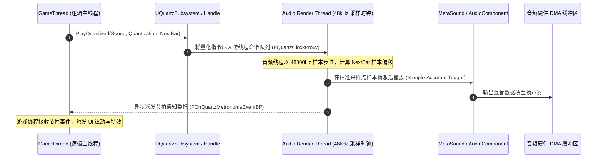

# 04 Quartz 音频时钟与节奏同步（Quantized Audio Clock & Musical Timing）
> 知识成熟度：L2（已按 UE5.8 AudioMixer/Quartz 源码基线全面补齐样本级时钟架构、量化边界解算、MetaSound 联动与节拍战斗实战代码）。

> 版本基准：UE 5.8.0（本机 `Engine/Build/Build.version`：CL 55116800，分支 `++UE5+Release-5.8`）。
> 适用范围：节奏动作游戏、动态音乐系统、战斗打击卡点、音乐演出与节拍音效同步。
> 事实边界：本文代码与类名已核对本机 `C:\Program Files\Epic Games\UE_5.8\Engine\Source\Runtime\AudioMixer\Public\Quartz\`（`QuartzSubsystem.h`、`AudioMixerClockHandle.h`、`QuartzMetronome.h` 等）。
> 官方参考：[Quantized Audio Clock and Transport in Unreal Engine](https://dev.epicgames.com/documentation/en-us/unreal-engine/quantized-audio-clock-and-transport-in-unreal-engine)。
> 最后更新：2026-08-20（深化重构：补齐音频线程样本级时间戳、双队列无锁通信、MetaSound 节拍脉冲与音游输入判定）。

---

## 概述

在传统的游戏逻辑中，如果开发者试图使用普通的 `PlaySound2D` 或 `FTimerManager` 来实现音乐节奏对齐（例如：每隔 0.5 秒播放一段鼓点，或在玩家按下攻击键时配合节拍打出暴击），通常会遭遇严重的**节拍漂移（Beat Drift）与卡点失准**：
- **核心根因**：游戏主线程（GameThread）的 Tick 时间是波动的（如帧率在 55~60FPS 间波动，单帧耗时 16~20ms），且操作系统线程调度与音频硬件 DMA 缓冲之间存在无法忽视的延迟；
- **Quartz 的技术解法**：Quartz（石英时钟）直接在**底层音频混音线程（Audio Render Thread）** 中以 **音频采样点（Audio Samples，如 48000Hz 下每秒 48000 次采样）** 为基准时钟源，提供**样本级精度（Sample-Accurate）** 的节拍量化边界。

通过 Quartz，开发者可以声明：“在下一个第 4 拍小节线（Bar）精确触发这段音效”，音频引擎将在底层硬件缓冲区准确计算出该事件对应的采样点样本偏移，实现绝对无漂移的严丝合缝对齐。

---

## 核心架构与线程拓扑



- **控制分离**：GameThread 仅负责发出高级意图（何时变速、预定播放、节拍订阅），真正的时间步推进与音频渲染完全隔离在音频线程；
- **双向无锁队列**：游戏线程与音频线程间通过专用的 `FQuartzClockProxy` 交换命令，消除由于加锁互斥引发的音频爆音（Audio Glitch）。

---

## 量化单位与时间戳规范

### 1. 量化边界（EQuartzCommandQuantization）

| 量化枚举值 | 音乐理论含义 | 推荐工程场景 |
| :--- | :--- | :--- |
| `Bar` | 完整小节边界（4/4 拍下即 4 拍一次） | 大段背景音乐（BGM）无缝过渡、大型阶段技能变奏 |
| `Beat` | 单个四分音符（Quarter Note）节拍点 | 基础攻击节奏卡点、地面心跳脉冲特效、UI 呼吸动画 |
| `SixteenthNote` | 十六分音符（1/4 拍，半拍的半拍） | 高速连击打击判定、密集的机枪点射与重音对齐 |
| `Tick` | Quartz 最小量化刻度（通常为 1/32 音符） | 极高精度的打击乐滚奏（Drum Roll）与毫秒级时间基准 |
| `None` | 不做量化约束，尽快在下一个音频缓冲块播放 | 紧急音效或与节拍无关的瞬发事件 |

---

## 工业级 C++ 实战代码

### 1. 节拍管理器与高精度战斗卡点系统

以下实现一个能够自动监听 120BPM 节拍、派发 UI 动画通知并在“完美拍子”（On Beat）内给予玩家暴击判定的管理器：

```cpp
#pragma once

#include "CoreMinimal.h"
#include "GameFramework/Actor.h"
#include "Quartz/QuartzSubsystem.h"
#include "Quartz/AudioMixerClockHandle.h"
#include "Sound/QuartzQuantizationUtilities.h"
#include "RhythmCombatManager.generated.h"

UCLASS()
class MYGAME_API ARhythmCombatManager : public AActor
{
    GENERATED_BODY()

public:
    ARhythmCombatManager();

    virtual void BeginPlay() override;
    virtual void EndPlay(const EEndPlayReason::Type EndPlayReason) override;

    // 玩家输入判定：是否命中当前拍子允许的偏差点窗口
    UFUNCTION(BlueprintCallable, Category = "Rhythm")
    bool EvaluatePlayerAttackTiming(float ToleranceWindowMs = 80.0f);

    // 量化播放攻击招式音效
    UFUNCTION(BlueprintCallable, Category = "Rhythm")
    void PlayQuantizedSkillSound(USoundBase* SkillSound);

protected:
    // 节拍脉冲回调（由音频线程反射回 GameThread）
    UFUNCTION()
    void OnQuartzMetronomeBeat(
        FName ClockName,
        EQuartzCommandQuantization QuantizationType,
        int32 NumBars,
        int32 Beat,
        float BeatFraction
    );

private:
    UPROPERTY(Transient)
    UQuartzClockHandle* ClockHandle;

    FName ClockName;
    double LastBeatTimestampSeconds;
};

#include "RhythmCombatManager.h"
#include "Kismet/GameplayStatics.h"

ARhythmCombatManager::ARhythmCombatManager()
    : ClockHandle(nullptr)
    , ClockName(TEXT("CombatBGMClock"))
    , LastBeatTimestampSeconds(0.0)
{
    PrimaryActorTick.bCanEverTick = false;
}

void ARhythmCombatManager::BeginPlay()
{
    Super::BeginPlay();

    UQuartzSubsystem* QuartzSubsystem = UQuartzSubsystem::Get(GetWorld());
    if (!QuartzSubsystem) return;

    // 1. 初始化 4/4 拍时钟配置
    FQuartzClockSettings ClockSettings;
    ClockSettings.TimeSignature.NumBeats = 4;
    ClockSettings.TimeSignature.BeatType = EQuartzTimeSignatureQuantization::QuarterNote;
    ClockSettings.bIgnoreLevelChange = false;

    // 2. 创建或重置音乐时钟
    ClockHandle = QuartzSubsystem->CreateNewClock(
        GetWorld(),
        ClockName,
        ClockSettings,
        true,  // 存在则覆盖
        true   // 使用音频引擎时钟
    );

    if (ClockHandle)
    {
        // 设定初始 BPM 为 120
        ClockHandle->SetBeatsPerMinute(GetWorld(), ClockHandle, FQuartzQuantizationBoundary(), FOnQuartzCommandEventBP(), 120.0f);

        // 3. 绑定节拍侦听委托（监听每一个 Beat）
        FOnQuartzMetronomeEventBP MetronomeDelegate;
        MetronomeDelegate.BindDynamic(this, &ARhythmCombatManager::OnQuartzMetronomeBeat);

        ClockHandle->SubscribeToQuantizationEvent(
            GetWorld(),
            EQuartzCommandQuantization::Beat,
            MetronomeDelegate,
            ClockHandle
        );

        // 启动时钟
        ClockHandle->StartClock(GetWorld(), ClockHandle);
    }
}

void ARhythmCombatManager::OnQuartzMetronomeBeat(
    FName InClockName,
    EQuartzCommandQuantization QuantizationType,
    int32 NumBars,
    int32 Beat,
    float BeatFraction)
{
    // 记录最近一次正拍的游戏时间戳（供输入判定使用）
    LastBeatTimestampSeconds = FPlatformTime::Seconds();

    // 广播到游戏表现层（触发 UI 脉冲、灯光律动）
    UE_LOG(LogTemp, Verbose, TEXT("[Quartz] Bar: %d, Beat: %d"), NumBars, Beat);
}

bool ARhythmCombatManager::EvaluatePlayerAttackTiming(float ToleranceWindowMs)
{
    const double CurrentTime = FPlatformTime::Seconds();
    const double DeltaMs = FMath::Abs(CurrentTime - LastBeatTimestampSeconds) * 1000.0;

    // 如果按下攻击的时间在允许的容差窗口内（如前后 80ms），判定为“PERFECT”完美卡点
    return (DeltaMs <= ToleranceWindowMs);
}

void ARhythmCombatManager::PlayQuantizedSkillSound(USoundBase* SkillSound)
{
    if (!ClockHandle || !SkillSound) return;

    // 声明在下一个最近的 Beat（拍点）处发出该音效
    FQuartzQuantizationBoundary Boundary;
    Boundary.Quantization = EQuartzCommandQuantization::Beat;
    Boundary.Multiplier = 1.0f;

    // 提交量化播放
    UGameplayStatics::PlayQuantized(GetWorld(), ClockHandle, SkillSound, Boundary);
}

void ARhythmCombatManager::EndPlay(const EEndPlayReason::Type EndPlayReason)
{
    if (UQuartzSubsystem* QuartzSubsystem = UQuartzSubsystem::Get(GetWorld()))
    {
        QuartzSubsystem->DeleteClockByName(GetWorld(), ClockName);
    }
    Super::EndPlay(EndPlayReason);
}
```

---

## MetaSound 与 Quartz 的深度联动

在次世代管线中，Quartz 可以直接作为 MetaSound 图表的触发源输入：
1. **输入触发器绑定**：在 MetaSound 节点图中创建 `Trigger` 输入引脚（命名为 `OnBeat`）；
2. **时钟驱动参数**：通过 `UMetaSoundOutputSubsystem` 或动态参数驱动，每个小节根据 BPM 动态调制 MetaSound 内的低通滤波器截止频率（Cutoff Frequency），实现音乐与实时音效的“抽吸感”（Sidechain Compression）。

---

---

## 音频延迟与音画同步补偿算法

在实际硬件设备上，从音频样本被 AudioMixer 混音输出，到经过硬件 DAC 转换为模拟信号驱动扬声器发声，存在固定的**硬件输出延迟（Audio Hardware Latency）**：
- 在 PC Windows (WASAPI) 上通常为 **20 ~ 40ms**；
- 在 Android (AAudio/OpenSL ES) 上通常为 **30 ~ 80ms**（长尾低端设备可达 120ms）；
- 在 iOS (CoreAudio) 上稳定在 **15 ~ 25ms**。

### 延迟对齐计算公式

当实现严苛判定的音游或动作卡点时，不能直接拿屏幕上的渲染时间戳对比：
$$\text{ExpectedHitTime} = \text{BeatAudioTime} - \text{HardwareOutputLatency} + \text{InputPollLatency}$$
- **补偿手段**：在游戏设置中提供“音频延迟校准（Audio Calibration）”界面，测量玩家听觉与视觉的平均偏差值，在 `EvaluatePlayerAttackTiming` 中动态平移判定窗口。

---

## 核心命令类型矩阵（EQuartzCommandType）

| 命令枚举类型 | 执行时机与底层行为 | 典型业务场景 |
| :--- | :--- | :--- |
| `PlaySound` | 在到达量化边界瞬间立即分配 Voice 实例发声 | 确定性节拍音效、瞬发打击乐打击音 |
| `QueueSoundToPlay` | 提前加载资产，临近边界时激活播放 | 避免由于大文件解码引起的微秒级卡顿 |
| `RetriggerSound` | 停止当前实例并对齐到边界重新播放 | 音乐循环段（Music Loop）无缝重播 |
| `TickRateChange` | 在小节线处平滑改变 BPM（可带渐变过渡） | 战斗由探索转入激战时的音乐渐进加速 |
| `TransportReset` | 将当前小节数与拍子归零并重新开始 | 剧情过场结束、重新挑战关卡重置 |
| `StartOtherClock` | 以当前时钟的指定边界为基准唤醒从属时钟 | 多乐器分轨音乐的分段渐进叠加入场 |

---

## 常见问题与排障 FAQ

**Q1：为什么调用了 PlayQuantized 之后声音没有播放？**
最常见的原因是目标 Quartz 时钟尚未调用 `StartClock()` 进入运行状态，且量化边界中 `bFireOnClockStart` 被显式设置为了 false。应确保时钟已激活。

**Q2：暂停游戏菜单打开后，背景音乐的时钟停止导致恢复后节拍错乱？**
默认情况下世界暂停时 Quartz 时钟也会暂停。如果在暂停菜单中仍需背景音乐继续播放，应在初始化时调用 `UQuartzSubsystem::SetQuartzSubsystemTickableWhenPaused(true)`。

**Q3：关卡切换后 Quartz 时钟被销毁崩溃？**
`CreateNewClock` 时默认时钟与当前关卡绑定。如果 BGM 时钟需要跨关卡常驻，必须在 `FQuartzClockSettings` 中将 `bIgnoreLevelChange` 设置为 true。

**Q4：节拍回调委托在 GameThread 接收时偶尔感觉慢了半拍？**
音频线程触发事件后通过队列派发回 GameThread，如果当前帧 GameThread 发生掉帧卡顿（如 40ms），委托通知必然延迟到达。因此**严禁拿 GameThread 的委托到达时刻来做判定**，必须使用 Quartz 提供的权威时间戳 `FQuartzTransportTimeStamp`。

**Q5：同一个小节内能混播不同拍号的音乐吗（如 4/4 拍与 3/4 拍对齐）？**
可以。通过在 `FQuartzClockSettings` 中配置 `OptionalPulseOverride`，可以为特定小节重载各个脉冲步长（Pulse Override Step），实现复杂的复合节拍（Polyrhythm）与变拍子音乐。

**Q6：Dedicated Server 上能运行 Quartz 时钟进行战斗判定吗？**
Dedicated Server 默认不初始化底层音频设备（Audio Device），因此无法运行常规 Quartz 硬件时钟。在服务器端进行确定性节拍判定时，应使用基于游戏时钟（`UWorld::GetTimeSeconds()`）的虚拟计数器模拟节拍，或使用 `null` 虚拟音频驱动。

**Q7：如何动态改变播放音高（Pitch）而不改变节拍（BPM）？**
传统的音高缩放会同时缩放播放速率导致节拍错位。在 MetaSound 中应使用专用时间拉伸节点（Time Stretch Audio），将音高与时长控制完全分离，确保与 Quartz 时钟持续对齐。

---

## 核心调试命令速查

| 控制台命令 | 作用与观测焦点 |
| :--- | :--- |
| `au.Debug.Quartz.ShowClocks 1` | 在屏幕左侧实时绘制所有活跃 Quartz 时钟的 BPM、当前 Bar/Beat 计数与播放状态 |
| `au.Debug.Quartz.ShowMetronome 1` | 打开节拍可视化节拍器闪烁框，直观观测节拍是否稳定均匀 |
| `au.Debug.Quartz.DumpQueue` | 打印当前音频线程中待执行的全部量化指令与目标样本偏移量 |

---

## 关联阅读与前后置专题

- [01-音频基础与播放](01-音频基础与播放.md)：音频格式、并发通道限制与 AudioMixer 架构；
- [03-MetaSound与程序化音频](03-MetaSound与程序化音频.md)：图表驱动样本精确 DSP 合成；
- [03-游戏玩法编程/01-GameplayAbilitySystem能力系统](../../05-Gameplay与交互系统/技能战斗与属性结算/01-GameplayAbilitySystem能力系统.md)：将技能前摇施放与节拍时间戳对齐；
- [04-动画系统/02-动画蒙太奇与混合空间](../动画求值与角色表现/02-动画蒙太奇与混合空间.md)：动画蒙太奇按 BPM 速率动态缩放（PlayRate 计算）；
- [12-16 音频系统源码](16-音频系统源码.md)：FAudioDevice 与混音渲染线程底层源码剖析。
