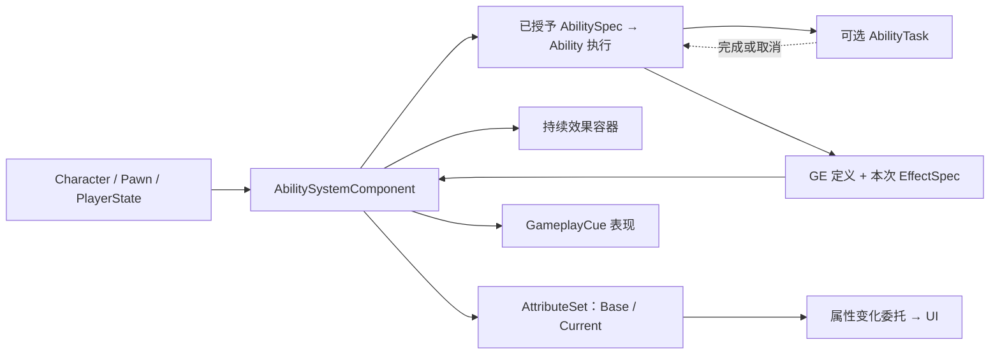
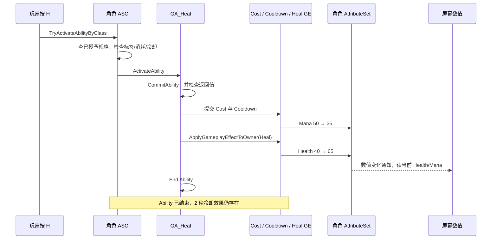
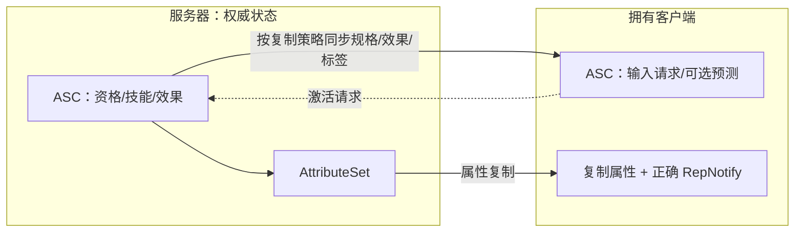

# 01 Gameplay Ability System（GAS）能力系统

> 知识成熟度：L2。主要承诺是依据 Epic 公开文档解释 GAS，并提供边界明确的首个技能接线方案；没有 UE 编译或运行证据，`verified` 保持空列表。
> 版本基准：2026-10-10 实际读取的 Epic 文档与公开 API 页，页面标题标注 Unreal Engine 5.8。未读取本机引擎、`Build.version`、CL 或受限实现源码；不把旧版安装路径当成本次证据。带版本参数的部分链接未能读取，采用实际可读的官方入口，不声称锁定某个补丁版本。
> 最后更新：2026-10-10（补齐自身治疗首例与公开 API 接线；仅静态核对，未编译或运行）。
> 教学目标：理解“能力资格 → 激活 → 提交消耗/冷却 → GE 改属性 → 显示结果 → 结束”的因果关系，再配置一个消耗法力的自身治疗技能。
> 适用范围：同一个 C++ 游戏模块中的 Character、ASC、原生 AttributeSet，加 Blueprint Ability 与数据型 GE；正常操作以单人 Standalone 为限。多人权威、预测与重生放在后文说明，未完成 PIE、打包、网络或目标平台验证。

## 一、为什么需要 GAS

假设“治疗术”需要消耗 15 法力、恢复 25 生命、冷却 2 秒。只写 `Health += 25` 可以得到一次数值变化，却没有回答：技能是否已授予、法力是否足够、冷却由谁记录、UI 何时更新、客户端能否自行认定成功。再加入减速、免疫、装备和打断，每个技能独立维护这些规则会越来越难组合。

GAS 把**执行过程**、**数值/状态变化的规则**与**角色拥有的运行时状态**分开。GA 组织一次行为；GE 描述属性如何改变；ASC 管理这个角色当前拥有哪些能力、效果与标签；AttributeSet 定义属性及其边界。需要等待动画或目标确认时，AbilityTask 再承担异步步骤。框架不替项目决定伤害公式、目标是否合法、满血是否允许治疗，或取消后是否退还消耗。

小项目只有几个同步动作时，普通组件与计时器仍可更简单。GAS 的收益主要来自大量可组合规则、能力状态管理和网络玩法；启用插件本身不会让业务规则自动正确。[官方总览](https://dev.epicgames.com/documentation/unreal-engine/gameplay-ability-system-for-unreal-engine)

## 二、核心对象与运行时身份

| 对象 | 职责 | 不能混淆的边界 |
| --- | --- | --- |
| `UAbilitySystemComponent`（ASC） | 角色访问 GAS 的入口，管理能力规格、活动效果、标签及属性交互 | 不是“所有对象各只有一个实例”的仓库；能力、规格、效果各有不同生命周期 |
| `UGameplayAbility`（GA） | 定义激活条件与执行步骤，例如自身治疗、施放火球 | 给 Actor 授予能力不等于立即执行；激活也不等于已扣费 |
| `FGameplayAbilitySpec` / Handle | 把某能力类以等级、输入等信息授予一个 ASC；Handle 标识该授予记录 | 与一次激活、某个 GA UObject 实例分开 |
| `UGameplayEffect`（GE） | 通常由数据型 Blueprint 类的默认数据描述变化规则 | 不把共享定义当作每次施法可随意修改的实例 |
| `FGameplayEffectSpec` | 一次应用准备的等级、上下文、捕获值、SetByCaller 等运行时数据 | 持续效果进入活动容器后还有活动句柄；权威端执行的 Instant 不会留下同样的活动记录 |
| `UAttributeSet`（AS） | 声明 `FGameplayAttributeData` 属性及数值约束 | 数值不是因类型存在就自动完成网络复制 |
| `UAbilityTask`（AT） | 等待延迟、动画、GameplayEvent、TargetData 等步骤 | 依附 Ability；自定义外部订阅仍须配对解绑 |
| GameplayCue | 音效、特效、飘字等表现通知；通常使用 `GameplayCue.` 标签 | Cue 不是权威伤害或治疗的结算入口，也不是一种叫 `UGameplayCue` 的通用实例 |
| TargetData / GameplayTag | 前者携带目标信息，后者表达分类与状态查询 | 目标数据和标签都不天然证明客户端请求可信 |

这些身份区分对应 [ASC API](https://dev.epicgames.com/documentation/unreal-engine/API/Plugins/GameplayAbilities/UAbilitySystemComponent)、[GA API](https://dev.epicgames.com/documentation/unreal-engine/API/Plugins/GameplayAbilities/UGameplayAbility) 与 [GE 生命周期](https://dev.epicgames.com/documentation/unreal-engine/gameplay-effects-for-the-gameplay-ability-system-in-unreal-engine)。

## 三、把一次技能串起来



ASC 对应具体拥有者；GE 定义可以被许多角色共用，本次 Spec 才携带此次应用的信息。持续效果能留在活动容器中；本例权威端 Instant 的结果保留在属性中，不能据此要求它仍有活动计时器。

下面是第 5 节的正常治疗路径。异步火球只是在“提交”与“施加伤害”之间增加目标获取、动画、命中等步骤，不能以未定义的 `TargetASC` 省掉目标来源。



这幅图强调业务阶段，**不承诺 Cost 与 Cooldown 内部应用的相对顺序，也不表示数据库式的原子事务**。初次资格检查与后续提交是两个时刻；如中间插入前摇，法力和状态可能已变化。`TryActivateAbilityByClass` 返回 true 也不是最终结果收据，官方说明后续激活仍可能失败。[激活接口](https://dev.epicgames.com/documentation/en-us/unreal-engine/API/Plugins/GameplayAbilities/UAbilitySystemComponent/TryActivateAbilityByClass)

## 四、支撑这条路径的原理

### 4.1 ASC、Owner 与 Avatar

`InitAbilityActorInfo(OwnerActor, AvatarActor)` 建立能力使用的对象信息：Owner 是逻辑拥有者，Avatar 是执行行为的物理 Actor，两者可以相同。第 5 节把 ASC 放在 Character 上，因此传 `(this, this)`。它既便于观察，也让 ASC 与该角色一起销毁。[初始化合同](https://dev.epicgames.com/documentation/unreal-engine/API/Plugins/GameplayAbilities/UAbilitySystemComponent/InitAbilityActorInfo)

需要跨死亡重生保留能力和状态时，可以把 ASC 放到 PlayerState：Owner 是 PlayerState，Avatar 是当前 Pawn。服务器 possession 和客户端获得相应复制对象后，各自需要正确初始化；换 Pawn 时更新 Avatar，清理旧 Pawn 的监听及仍依赖它的行为。PlayerState 不是所有多人游戏的默认最佳选择，它还改变复制相关性、状态寿命和角色间的接口访问方式。

先在构造函数创建默认 ASC/AttributeSet 子对象，再在适当的运行时节点初始化 ActorInfo。不要在 `PostInitializeComponents` 中调用 `CreateDefaultSubobject`。一个 ASC 可以登记不同类的多个 AttributeSet；常规接线采用单一、明确的 ASC 入口。`FGameplayAbilityActorInfo` 是上下文缓存，不是给同一 Actor 上任意多个 ASC 自动分流的路由器。[AttributeSet 注册说明](https://dev.epicgames.com/documentation/unreal-engine/gameplay-attributes-and-attribute-sets-for-the-gameplay-ability-system-in-unreal-engine)

按问题查 ASC 接口：能力授予/激活看 `GiveAbility`、`TryActivateAbility` 和 ByClass/ByTag；效果准备/应用看 `MakeOutgoingSpec` 与 Apply；标签变化看 `AddLooseGameplayTag`、`RemoveLooseGameplayTag`、`RegisterGameplayTagEvent`；属性 Base 访问看 `GetNumericAttributeBase` / `SetNumericAttributeBase`。Loose Tag 没有 GE 替它管理持续时间，添加、移除和所选复制语义要由调用者负责，不能当成免费永久状态开关。

### 4.2 激活、提交与结束是三个不同的动作

| 阶段 | 工作 | 项目要保证什么 |
| --- | --- | --- |
| 授予 | 权威端用 `GiveAbility(FGameplayAbilitySpec(...))` 添加资格 | 不在客户端 OnRep 中重复授予；保存或查找规格，避免重复授予 |
| 尝试激活 | 通过 ASC 的 `TryActivateAbility` 或 ByClass/ByTag 入口检查与激活 | 不直接调用 `ActivateAbility` 来绕开常规检查 |
| 执行 | GA 的 `ActivateAbility` 或 Blueprint 事件组织行为 | 异步等待可在函数返回后继续，函数返回不代表技能结束 |
| 提交 | `CommitAbility` 尝试应用配置的消耗和冷却 | 检查布尔结果；失败后不继续治疗/伤害；不要重复 Commit 或再次手工扣同一笔费用 |
| 结束 | `EndAbility` / End Ability 结束本次执行 | 成功和失败分支都收束；取消可走 `CancelAbility`，其行为受可取消条件约束 |

这些职责由 [Gameplay Ability 使用说明](https://dev.epicgames.com/documentation/en-us/unreal-engine/using-gameplay-abilities-in-unreal-engine)、[CommitAbility 节点](https://dev.epicgames.com/documentation/en-us/unreal-engine/BlueprintAPI/Ability/CommitAbility) 和 [End Ability 节点](https://dev.epicgames.com/documentation/en-us/unreal-engine/BlueprintAPI/Ability/EndAbility) 支撑。结束 Ability 不表示撤销已经成功应用的治疗、退回 Cost 或清除独立的 Cooldown GE。需要退款或蓄力中断政策时，应额外设计，而不是把 `bWasCancelled` 当事务回滚开关。

| 常用配置 | 用途与边界 |
| --- | --- |
| AssetTags（兼容旧名 `AbilityTags`） | 标识能力类别；5.8 API 保留旧字段并提供 `GetAssetTags` / `SetAssetTags`，新代码不要依赖旧字段永远公开 |
| `ActivationRequiredTags` / `ActivationBlockedTags` | 拥有者必须具备 / 不能具备的状态标签 |
| `ActivationOwnedTags` | 本次能力活动期间授予的标签，不等于永久拥有 |
| `CancelAbilitiesWithTag` / `BlockAbilitiesWithTag` | 取消已执行能力 / 阻止其他匹配能力；取消标签不是“任何标签冲突均拒绝”的检查 |
| Cost / Cooldown Gameplay Effect Class | 消耗和冷却的 GE 定义；配置冷却时还要让对应状态标签实际授予目标 |
| `InstancingPolicy` | `InstancedPerActor` 复用实例，`InstancedPerExecution` 每次激活使用实例；`NonInstanced` 使用 CDO，不能存每次状态或绑定执行期委托 |
| `NetExecutionPolicy` | `LocalPredicted`、`LocalOnly`、`ServerInitiated`、`ServerOnly`；四者的运行位置不同 |
| `ReplicationPolicy` | 能力 UObject 的复制设置；与激活/结束消息、ASC 效果复制和属性复制分开 |

初学蓝图能力显式使用 `InstancedPerActor`，不依赖引擎默认值。重复执行时不能误用上一轮遗留成员状态。上述配置可在 [GA 公共 API](https://dev.epicgames.com/documentation/unreal-engine/API/Plugins/GameplayAbilities/UGameplayAbility) 与官方使用说明中对应定位。

### 4.3 GE 何时改变数值

下表先讨论权威端的普通应用。客户端预测 Instant 可能采用临时活动表示以便校正，不能用这张表推断客户端所有中间状态，见第 6.2 节。

| Duration Policy | 普通非周期 Modifier 的含义 | 示例 |
| --- | --- | --- |
| `Instant` | 执行一次，改变属性 Base；不作为持续效果留存 | 治疗 +25、法力 -15、伤害 -20 |
| `HasDuration` | 在指定时长内保留效果；对 Current 的临时修饰通常从应用时就参与计算 | 5 秒减速、2 秒冷却标签 |
| `Infinite` | 持续到显式移除等条件发生 | 装备加成、光环 |

`HasDuration` / `Infinite` 配合非零 Period 可以周期执行，例如每 2 秒扣血。周期是否在应用时立即执行还取决于相应配置。**持续时间不是“等待这段时间才修改属性”**。GE 的应用条件、持续条件、叠加与免疫也可能影响结果。[GE 生命周期与配置](https://dev.epicgames.com/documentation/unreal-engine/gameplay-effects-for-the-gameplay-ability-system-in-unreal-engine)

Modifier 指定属性、运算与数值来源。不要把教学字段表伪装成可编译的 `FGameplayModifierInfo` 定义：实际类型和成员以公开 API 为准。Magnitude 有四种政策：`ScalableFloat`、`AttributeBased`、`CustomCalculationClass`、`SetByCaller`；曲线表是 ScalableFloat 的一种数据来源。MMC 计算幅度，Execution Calculation 可以组织更复杂的捕获与输出修饰；不能因为都能算数就认为它们拥有相同预测能力。[幅度枚举](https://dev.epicgames.com/documentation/en-us/unreal-engine/API/Plugins/GameplayAbilities/EGameplayEffectMagnitudeCalculat-)

需要“护甲减伤 → 暴击 → 输出伤害”等复合计算时，可以在 `UGameplayEffectExecutionCalculation` 原生子类覆写 `Execute_Implementation`，通过执行参数与捕获数据生成输出 Modifier；不是直接覆写反射入口 Execute。[执行计算入口](https://dev.epicgames.com/documentation/unreal-engine/API/Plugins/GameplayAbilities/UGameplayEffectExecutionCalculat-/Execute)

非 Instant 效果的叠加类型是 `None`、`AggregateBySource`、`AggregateByTarget`。前者允许每次独立实例；后两者分别按同来源或同目标聚合。层数上限、刷新时长、重置周期、到期移除多少层仍要独立配置；不是写一个“StackByAggregator”便决定全部行为。[叠加枚举](https://dev.epicgames.com/documentation/en-us/unreal-engine/API/Plugins/GameplayAbilities/EGameplayEffectStackingType)

5.8 的 GE Components 将许多效果行为拆为组件，例如给目标授予标签、免疫、移除其他效果或授予能力。GE 的 Asset Tags 只描述资产，**不会因此自动成为角色拥有的标签**。第 5 节明确使用 `UTargetTagsGameplayEffectComponent`（编辑器显示 Grant Tags to Target Actor）授予冷却标签；免疫和驱散等扩展查对应组件，不能把旧版 `GrantedTags`、`ApplicationImmunityTags` 等名字当成所有版本通用的配置入口。[GE 组件说明](https://dev.epicgames.com/documentation/unreal-engine/gameplay-effects-for-the-gameplay-ability-system-in-unreal-engine)、[Target Tags 组件](https://dev.epicgames.com/documentation/unreal-engine/API/Plugins/GameplayAbilities/UTargetTagsGameplayEffectCompone-)

例如免疫看 `UImmunityGameplayEffectComponent`，驱散看 `URemoveOtherGameplayEffectComponent`；“拾取后解锁二段跳”可使用 [Grant Gameplay Abilities 组件](https://dev.epicgames.com/documentation/unreal-engine/API/Plugins/GameplayAbilities/UAbilitiesGameplayEffectComponen-)，并明确效果失效时能力的移除政策。GEComponent 也属于共享定义，不能拿它存每个角色本轮施法的可变状态。

### 4.4 Attribute 的 Base、Current 与变化通知

`FGameplayAttributeData` 同时存 Base 和 Current。Base 不是“永远不变的原始值”，Instant 治疗和消耗就会改变它；Current 包含当前生效的临时修饰。[属性数据 API](https://dev.epicgames.com/documentation/unreal-engine/API/Plugins/GameplayAbilities/FGameplayAttributeData)

例如移速 Base=600，临时乘数 0.5 时 Current=300；若基础移速变为 700，减速仍在则 Current=350；移除减速后为 700。治疗例没有 Health/Mana 的临时修饰，因而观察到的 Current 与 Base 相同。这是示例前提，不能推广为“属性只存一个值”。

`PostGameplayEffectExecute` 针对执行导致的 Base 修改；单纯应用一个持续移速增益不会走这个回调。需要约束其他变化时，再考虑 `PreAttributeChange`、`PreAttributeBaseChange` 等钩子。约束数值与“死亡只触发一次”的业务决策也要分开。[执行后回调合同](https://dev.epicgames.com/documentation/en-us/unreal-engine/API/Plugins/GameplayAbilities/UAttributeSet/PostGameplayEffectExecute)

UI 应观察 ASC 的属性变化委托并读取当前值，绑定后主动做一次初始显示。多人复制还需要 `ReplicatedUsing`、OnRep 内 `GAMEPLAYATTRIBUTE_REPNOTIFY` 与 `DOREPLIFETIME_CONDITION_NOTIFY`，而不只是声明 `FGameplayAttributeData`。[属性复制步骤](https://dev.epicgames.com/documentation/unreal-engine/gameplay-attributes-and-attribute-sets-for-the-gameplay-ability-system-in-unreal-engine)

## 五、首个普通技能：按 H 消耗法力并治疗自己

这里给出**原生属性/宿主文件与完整资产接线方案**。代码是按公开接口编写的项目示例，不是引擎源码节选；本次没有 UHT、编译、创建资源或运行。可复查的承诺是依赖、对象、输入和结果均写明，不声称已经得到“复制即编译通过”的工程。

选择自身治疗是为了把目标固定为同一个 ASC，先学会普通技能主线。火球的射线、目标验证、投射物和伤害计算留给第 6 节与关联篇，不用占位目标冒充已完成的攻击系统。

### 5.1 明确前提与文件

教学项目为 UE 5.8 的 C++ 项目 `GasLesson`，模块也叫 `GasLesson`；下面四个文件全部放在此模块中，导出宏为 `GASLESSON_API`。启用 Gameplay Abilities 插件；在已有 `GasLesson.Build.cs` 的依赖列表中保留原项并加入：

```csharp
PublicDependencyModuleNames.AddRange(new string[]
{
    "Core", "CoreUObject", "Engine", "InputCore",
    "GameplayAbilities", "GameplayTags", "GameplayTasks"
});
```

这只是模块依赖段，不替换完整 Build.cs。若使用其他模块名，要同步替换导出宏。`InputCore` 支持本例的 H 键；不额外引入 Enhanced Input 映射资源。插件及模块接入见 [Epic GAS 设置说明](https://dev.epicgames.com/documentation/ko-kr/unreal-engine/gameplay-ability-system-for-unreal-engine)；使用的 GAS 类型及头文件见前面的 5.8 API。

正常例约定：一个被本地 PlayerController 控制的 Character；Health 初值 40、MaxHealth 固定 100、Mana 初值 50；没有其他修改这三项属性的效果、免疫、叠加或自定义执行器。先在单人 Standalone 按顺序理解结果。

### 5.2 属性声明与边界

`GASLessonAttributes.h`：

```cpp
#pragma once

#include "CoreMinimal.h"
#include "AttributeSet.h"
#include "AbilitySystemComponent.h"
#include "GASLessonAttributes.generated.h"

#define GAS_LESSON_ACCESSORS(ClassName, PropertyName) \
    GAMEPLAYATTRIBUTE_PROPERTY_GETTER(ClassName, PropertyName) \
    GAMEPLAYATTRIBUTE_VALUE_GETTER(PropertyName) \
    GAMEPLAYATTRIBUTE_VALUE_SETTER(PropertyName) \
    GAMEPLAYATTRIBUTE_VALUE_INITTER(PropertyName)

UCLASS()
class GASLESSON_API UGASLessonAttributes : public UAttributeSet
{
    GENERATED_BODY()

public:
    UGASLessonAttributes();

    UPROPERTY(BlueprintReadOnly, ReplicatedUsing=OnRep_Health, Category="Vitals")
    FGameplayAttributeData Health;
    GAS_LESSON_ACCESSORS(UGASLessonAttributes, Health)

    UPROPERTY(BlueprintReadOnly, ReplicatedUsing=OnRep_MaxHealth, Category="Vitals")
    FGameplayAttributeData MaxHealth;
    GAS_LESSON_ACCESSORS(UGASLessonAttributes, MaxHealth)

    UPROPERTY(BlueprintReadOnly, ReplicatedUsing=OnRep_Mana, Category="Vitals")
    FGameplayAttributeData Mana;
    GAS_LESSON_ACCESSORS(UGASLessonAttributes, Mana)

    virtual void PostGameplayEffectExecute(
        const FGameplayEffectModCallbackData& Data) override;
    virtual void GetLifetimeReplicatedProps(
        TArray<FLifetimeProperty>& OutLifetimeProps) const override;

private:
    UFUNCTION()
    void OnRep_Health(const FGameplayAttributeData& OldValue);
    UFUNCTION()
    void OnRep_MaxHealth(const FGameplayAttributeData& OldValue);
    UFUNCTION()
    void OnRep_Mana(const FGameplayAttributeData& OldValue);
};

#undef GAS_LESSON_ACCESSORS
```

`GAS_LESSON_ACCESSORS` 是本文定义的组合宏；不要只复制一个没有定义的 `ATTRIBUTE_ACCESSORS` 名字。`generated.h` 必须是头文件最后一个 include。

`GASLessonAttributes.cpp`：

```cpp
#include "GASLessonAttributes.h"
#include "GameplayEffectExtension.h"
#include "Net/UnrealNetwork.h"

UGASLessonAttributes::UGASLessonAttributes()
    : Health(40.f), MaxHealth(100.f), Mana(50.f)
{
}

void UGASLessonAttributes::PostGameplayEffectExecute(
    const FGameplayEffectModCallbackData& Data)
{
    Super::PostGameplayEffectExecute(Data);
    if (Data.EvaluatedData.Attribute == GetHealthAttribute())
    {
        SetHealth(FMath::Clamp(GetHealth(), 0.f, GetMaxHealth()));
    }
    else if (Data.EvaluatedData.Attribute == GetManaAttribute())
    {
        SetMana(FMath::Max(0.f, GetMana()));
    }
}

void UGASLessonAttributes::GetLifetimeReplicatedProps(
    TArray<FLifetimeProperty>& OutLifetimeProps) const
{
    Super::GetLifetimeReplicatedProps(OutLifetimeProps);
    DOREPLIFETIME_CONDITION_NOTIFY(UGASLessonAttributes, Health,
        COND_None, REPNOTIFY_Always);
    DOREPLIFETIME_CONDITION_NOTIFY(UGASLessonAttributes, MaxHealth,
        COND_None, REPNOTIFY_Always);
    DOREPLIFETIME_CONDITION_NOTIFY(UGASLessonAttributes, Mana,
        COND_None, REPNOTIFY_Always);
}

void UGASLessonAttributes::OnRep_Health(const FGameplayAttributeData& OldValue)
{
    GAMEPLAYATTRIBUTE_REPNOTIFY(UGASLessonAttributes, Health, OldValue);
}

void UGASLessonAttributes::OnRep_MaxHealth(const FGameplayAttributeData& OldValue)
{
    GAMEPLAYATTRIBUTE_REPNOTIFY(UGASLessonAttributes, MaxHealth, OldValue);
}

void UGASLessonAttributes::OnRep_Mana(const FGameplayAttributeData& OldValue)
{
    GAMEPLAYATTRIBUTE_REPNOTIFY(UGASLessonAttributes, Mana, OldValue);
}
```

构造函数常量只确定这个教学例的初值；项目可换成初始化 GE 或数据表。此处 MaxHealth 固定，Health/Mana 只由 Instant GE 修改，所以钳制有清楚适用条件；它不是可随意加入临时生命增益、动态上限与死亡流程的完整属性库。Mana 的非负钳制也不能替代提交前的费用检查，否则会把“法力不足仍治疗”掩盖成 0。

### 5.3 Character 持有 ASC，接输入并显示属性

`GASLessonCharacter.h`：

```cpp
#pragma once

#include "CoreMinimal.h"
#include "GameFramework/Character.h"
#include "AbilitySystemInterface.h"
#include "GASLessonCharacter.generated.h"

class UAbilitySystemComponent;
class UGameplayAbility;
class UGASLessonAttributes;
struct FOnAttributeChangeData;

UCLASS()
class GASLESSON_API AGASLessonCharacter
    : public ACharacter, public IAbilitySystemInterface
{
    GENERATED_BODY()

public:
    AGASLessonCharacter();
    virtual UAbilitySystemComponent* GetAbilitySystemComponent() const override;
    virtual void PossessedBy(AController* NewController) override;
    virtual void OnRep_Controller() override;

protected:
    virtual void BeginPlay() override;
    virtual void EndPlay(const EEndPlayReason::Type EndPlayReason) override;
    virtual void SetupPlayerInputComponent(UInputComponent* PlayerInputComponent) override;

    UPROPERTY(VisibleAnywhere, Category="GAS")
    TObjectPtr<UAbilitySystemComponent> AbilitySystem;
    UPROPERTY()
    TObjectPtr<UGASLessonAttributes> Attributes;
    UPROPERTY(EditDefaultsOnly, Category="GAS")
    TSubclassOf<UGameplayAbility> HealAbility;

private:
    void TryHeal();
    void OnVitalChanged(const FOnAttributeChangeData& Data);
    void ShowVitals() const;
    FDelegateHandle HealthChangedHandle;
    FDelegateHandle ManaChangedHandle;
};
```

`GASLessonCharacter.cpp`：

```cpp
#include "GASLessonCharacter.h"
#include "GASLessonAttributes.h"
#include "AbilitySystemComponent.h"
#include "Abilities/GameplayAbility.h"
#include "Components/InputComponent.h"
#include "Engine/Engine.h"
#include "InputCoreTypes.h"

AGASLessonCharacter::AGASLessonCharacter()
{
    bReplicates = true;
    AbilitySystem = CreateDefaultSubobject<UAbilitySystemComponent>(TEXT("ASC"));
    AbilitySystem->SetIsReplicated(true);
    AbilitySystem->SetReplicationMode(EGameplayEffectReplicationMode::Full);
    Attributes = CreateDefaultSubobject<UGASLessonAttributes>(TEXT("Attributes"));
}

UAbilitySystemComponent* AGASLessonCharacter::GetAbilitySystemComponent() const
{
    return AbilitySystem.Get();
}

void AGASLessonCharacter::PossessedBy(AController* NewController)
{
    Super::PossessedBy(NewController);
    AbilitySystem->InitAbilityActorInfo(this, this);
}

void AGASLessonCharacter::OnRep_Controller()
{
    Super::OnRep_Controller();
    AbilitySystem->InitAbilityActorInfo(this, this);
}

void AGASLessonCharacter::BeginPlay()
{
    Super::BeginPlay();
    AbilitySystem->InitAbilityActorInfo(this, this);

    HealthChangedHandle = AbilitySystem->GetGameplayAttributeValueChangeDelegate(
        UGASLessonAttributes::GetHealthAttribute()).AddUObject(
            this, &AGASLessonCharacter::OnVitalChanged);
    ManaChangedHandle = AbilitySystem->GetGameplayAttributeValueChangeDelegate(
        UGASLessonAttributes::GetManaAttribute()).AddUObject(
            this, &AGASLessonCharacter::OnVitalChanged);

    if (HasAuthority() && HealAbility &&
        !AbilitySystem->FindAbilitySpecFromClass(HealAbility))
    {
        AbilitySystem->GiveAbility(FGameplayAbilitySpec(HealAbility, 1, INDEX_NONE, this));
    }
    if (!HealAbility)
    {
        UE_LOG(LogTemp, Error, TEXT("Assign GA_Heal to the Character's HealAbility"));
    }
    ShowVitals();
}

void AGASLessonCharacter::SetupPlayerInputComponent(UInputComponent* PlayerInputComponent)
{
    Super::SetupPlayerInputComponent(PlayerInputComponent);
    PlayerInputComponent->BindKey(EKeys::H, IE_Pressed, this,
        &AGASLessonCharacter::TryHeal);
    ShowVitals(); // 本地输入就绪后再显示一次，覆盖 BeginPlay 早于 possession 的顺序。
}

void AGASLessonCharacter::TryHeal()
{
    if (!IsLocallyControlled() || !HealAbility)
    {
        return;
    }
    const bool bStarted = AbilitySystem->TryActivateAbilityByClass(HealAbility, true);
    if (!bStarted)
    {
        UE_LOG(LogTemp, Display, TEXT("Heal was not activated; inspect cost/cooldown/grant"));
    }
}

void AGASLessonCharacter::OnVitalChanged(const FOnAttributeChangeData& Data)
{
    ShowVitals();
}

void AGASLessonCharacter::ShowVitals() const
{
    if (GEngine && IsLocallyControlled())
    {
        GEngine->AddOnScreenDebugMessage(static_cast<uint64>(GetUniqueID()), 5.f,
            FColor::Green, FString::Printf(TEXT("Health %.0f / %.0f | Mana %.0f"),
                Attributes->GetHealth(), Attributes->GetMaxHealth(), Attributes->GetMana()));
    }
}

void AGASLessonCharacter::EndPlay(const EEndPlayReason::Type EndPlayReason)
{
    AbilitySystem->GetGameplayAttributeValueChangeDelegate(
        UGASLessonAttributes::GetHealthAttribute()).Remove(HealthChangedHandle);
    AbilitySystem->GetGameplayAttributeValueChangeDelegate(
        UGASLessonAttributes::GetManaAttribute()).Remove(ManaChangedHandle);
    Super::EndPlay(EndPlayReason);
}
```

构造先建 ASC，再建角色上的 AttributeSet；接口返回该 ASC，属性集按官方子对象注册路径供它使用。BeginPlay 负责本次角色的授予和观察，possession/controller 变化只刷新 ActorInfo，**不重复扣初值或授予**。接口可见不等于客户端拥有授予权限，`HasAuthority()` 分支仍必需。

H 直接调用按类激活，因此这里 `InputID=INDEX_NONE` 有意留空；它不会阻止 ByClass 激活。项目改用 Enhanced Input 时，把 Action 的开始事件接到同一意图入口即可；不要每帧 Triggered 都重复施放。`BindKey` 是普通键盘 API，非 GAS 专有绑定。[输入签名](https://dev.epicgames.com/documentation/en-us/unreal-engine/API/Runtime/Engine/UInputComponent/BindKey)

### 5.4 三个 GE 与一个 Ability 的确定配置

原生类成功构建并被编辑器识别后，创建以下 Blueprint 类资产；GE 的父类为 `GameplayEffect`，GA 的父类为 `GameplayAbility`。使用 Blueprint Class 的全部类选择器查找父类，不依赖某个固定右键分类名称。

先在 Project Settings → Gameplay Tags 中添加 `Cooldown.Heal`。这是项目自己的状态标签名字；本例不需要其他标签。

| 资产 | 必须配置的字段 | 本例含义 |
| --- | --- | --- |
| `GE_Heal` | Duration Policy = Instant；一个 Modifier：Attribute = GASLessonAttributes.Health，Operation = Add，Magnitude = Scalable Float，Value = 25，未引用曲线 | 每次成功执行恢复 25，最终由 AS 限制到 100 |
| `GE_HealCost` | Instant；一个 Modifier：GASLessonAttributes.Mana，Add，Scalable Float = -15 | 提交时消耗 15 法力；不要填正 15 |
| `GE_HealCooldown` | Has Duration；Duration Magnitude = Scalable Float 2；Period = 0；无属性 Modifier；Components 中增加 Grant Tags to Target Actor，在 Add Tags 的 Added（显示名 Add to Inherited）中加入 `Cooldown.Heal` | 2 秒内目标拥有冷却状态；不要只加到 Asset Tags |
| `GA_Heal` | Instancing = Instanced Per Actor；Net Execution = Server Only；Cost Gameplay Effect Class = GE_HealCost；Cooldown Gameplay Effect Class = GE_HealCooldown；Activation Blocked Tags 含 `Cooldown.Heal` | 把费用、冷却与激活条件接到本次能力 |

其余组件、Executions、概率、应用要求和叠加均不添加；GA 不改写 CanActivate/Commit，不启用 Retrigger Instanced Ability，不添加其他激活条件。这里额外把冷却标签明确列入 Activation Blocked Tags，让“拥有这个标签时不能重放”的接线可直接检查；仅设置 2 秒 Duration 而不授予标签，不能表达这个条件。Added/Combined/Removed 的继承关系见 [FInheritedTagContainer](https://dev.epicgames.com/documentation/unreal-engine/API/Plugins/GameplayAbilities/FInheritedTagContainer)。

在 `GA_Heal` 事件图逐条连线：

1. `Event ActivateAbility` 的执行线接 `CommitAbility`（Target=self）。
2. Commit 的执行输出接 Branch，Return Value 接 Condition。
3. Branch True 接 `ApplyGameplayEffectToOwner`：Target=self，Gameplay Effect Class=GE_Heal，Gameplay Effect Level=1，Stacks=1。
4. Apply 的执行输出接 `End Ability`（Target=self）。
5. Branch False 直接接另一个 `End Ability`。此分支不施加 GE_Heal。

Commit 是需要主动调用并检查返回值的节点；End Ability 是结束调用，不能把它误当成会自动执行的事件。上面使用的是 **Gameplay Ability 的 ApplyGameplayEffectToOwner**，不是 ASC 的同名外观包装；参数按 [该节点公开输入](https://dev.epicgames.com/documentation/en-us/unreal-engine/BlueprintAPI/Ability/ApplyGameplayEffectToOwner) 设置。Instant 不保留持续效果句柄，所以本例用最终属性变化判定结果，不以返回的活动句柄是否有效断言治疗成功或失败。

### 5.5 放进场景并从输入走到可见结果

1. 创建 `BP_GASLessonCharacter`，父类选 `GASLessonCharacter`；Class Defaults 的 Heal Ability 选 `GA_Heal`，保存。
2. 创建 `BP_GASLessonMode`，父类选 `GameModeBase`；Default Pawn Class 选 `BP_GASLessonCharacter`，PlayerController Class 保持普通 `PlayerController`。
3. 新建有地面的测试关卡并放一个 PlayerStart；World Settings 的 GameMode Override 选 `BP_GASLessonMode`。不要另外放一个自动占有的旧角色与默认 Pawn 竞争输入。
4. 在开发环境以 Standalone 单人进入，点进游戏窗口让键盘焦点在游戏中。输入就绪后的屏幕显示应是 `Health 40 / 100 | Mana 50`。角色可以没有模型和动画，本例的观察对象是屏幕调试数值，不依赖 Shipping 构建保留调试消息。
5. 按一次 H。按上述配置推导，最终显示应是 `Health 65 / 100 | Mana 35`；两秒内再按不会发生第二次治疗。超过两秒再按一次，最终是 `Health 90 / 100 | Mana 20`。

属性通知分别对应消耗和治疗，过程中可以先看到 `Health 40 | Mana 35`，再看到最终状态。显示使用同一条屏幕消息键替换，持续五秒；它是演示用视图，不是“整笔技能事务只发一次 UI 事件”的承诺。生产 UI 可以绑定同样的委托并独立决定展示策略。

| 输入序列（预期，未运行） | Health / Mana | 判定依据 |
| --- | --- | --- |
| 新角色初始 | 40 / 50 | 本例构造初值 |
| 首次 H | 65 / 35 | Commit 消耗 15，Heal 增加 25 |
| 冷却未结束再按 H | 65 / 35 | 冷却标签阻止重激活 |
| 冷却结束后第二次有效 H | 90 / 20 | 下一次独立技能执行 |
| 再等冷却，第三次有效 H | 100 / 5 | 90+25 被属性集钳制到上限 |
| 再等冷却，第四次 H | 100 / 5 | Cost 不足，不能得到免费治疗 |

这组数字是配置推导，没有生成 UE 测试日志。它提供正常结果与两个必要反例：冷却期间不能重复扣费，余额不足不能只靠钳到 0 后继续执行。若要禁止满血施法，应另加不带副作用的资格条件；本例没有这种规则。

## 六、在正常技能之后扩展

### 6.1 C++ 的 Spec 调用与 SetByCaller

原生能力和 ASC 都能准备效果，但 API 层次不同。`UGameplayAbility::MakeOutgoingGameplayEffectSpec` 是能力便捷入口；ASC 对应的是 `MakeOutgoingSpec(Class, Level, Context)`。ASC 的原生 `ApplyGameplayEffectSpecToSelf/Target` 接受 `const FGameplayEffectSpec&`；Blueprint 包装入口则接 Handle。不能混用名称与参数。[ASC API](https://dev.epicgames.com/documentation/unreal-engine/API/Plugins/GameplayAbilities/UAbilitySystemComponent)

下面是**独立的服务器侧调用节选**，不需要加入第 5 节：前提是调用方已从权威逻辑拿到有效 `ASC`、Instant 的 `DamageEffectClass`、注册好的 `Data.Damage` 标签，以及非负有限的 `Amount`。该 GE 的 Health Modifier 为 Add，Magnitude=SetByCaller，Data Tag=`Data.Damage`。

```cpp
// 调用节选；外层负责权威身份、目标合法性和参数检查。
FGameplayEffectContextHandle Context = ASC->MakeEffectContext();
FGameplayEffectSpecHandle Spec = ASC->MakeOutgoingSpec(DamageEffectClass, 1.f, Context);
if (Spec.IsValid())
{
    const FGameplayTag DamageTag = FGameplayTag::RequestGameplayTag(FName(TEXT("Data.Damage")));
    Spec.Data->SetSetByCallerMagnitude(DamageTag, -Amount);
    ASC->ApplyGameplayEffectSpecToSelf(*Spec.Data.Get());
}
```

负号由本例“Add 到 Health”的配置决定，不能把正伤害值直接当负修饰。其他项目可把正 Damage 写入元属性，再由执行计算扣 Health，但那是另一份合同。传入数值必须与 GE 上的 SetByCaller 键一致；只在 C++ 写一个 DamageValue 属性而不把它接进 Spec，不会影响伤害。[SetByCaller 接口](https://dev.epicgames.com/documentation/en-us/unreal-engine/API/Plugins/GameplayAbilities/FGameplayEffectSpec/SetSetByCallerMagnitude)

对他人施法时，先由目标获取得到 Actor，再明确取该 Actor 的 ASC，验证目标、阵营、距离与当前状态，最后对那个 ASC 应用；`FGameplayAbilityTargetDataHandle` 是传递候选目标信息的载体。`AGameplayAbilityTargetActor` 及其 [SingleLineTrace 子类](https://dev.epicgames.com/documentation/unreal-engine/API/Plugins/GameplayAbilities/AGameplayAbilityTargetActor_Sing-) 可参与瞄准与确认，但创建一个 TargetActor 不等于完成目标的权威验证。本文不提供未实现的 `TargetASC` 变量来冒充火球闭环。

### 6.2 服务器权威与客户端预测



服务器授予能力，并拥有最终玩法裁定权。`ServerOnly` 让能力逻辑在服务器运行；属性、角色状态等仍可按各自复制规则让客户端观察。`LocalPredicted` 则允许拥有客户端先执行可预测部分，服务器随后确认或拒绝。`LocalOnly` 和 `ServerInitiated` 是另外两种策略，不应遗漏。[网络执行政策](https://dev.epicgames.com/documentation/en-us/unreal-engine/using-gameplay-abilities-in-unreal-engine)

预测依赖 PredictionKey 把预测副作用与权威结果关联，避免重复表现，并在拒绝/确认后处理对应状态。它不自动回滚任意项目代码：普通变量写入、外部奖励、文件写入等不会因选择 LocalPredicted 就获得撤销逻辑。公开预测说明还区分普通属性 Modifier 与 Execution、周期效果、移除等边界；跨延迟回调也不能假设最初预测窗口仍有效。[预测合同](https://dev.epicgames.com/documentation/en-us/unreal-engine/API/Plugins/GameplayAbilities/FPredictionKey)

第 5 节虽然写出复制属性和基本 ActorInfo 刷新入口，**正常例仍只承诺 Standalone 接线**。若转多人，应另验：客户端规格何时到达、controller/Owner/Avatar 是否就绪、服务器拒绝是否反馈、不同网络角色是否看到正确属性、Full/Mixed/Minimal 的效果可见范围，以及断线或换 Pawn 后的行为。不要只把 ServerOnly 改成 LocalPredicted 就称完成了预测版本。

`bReplicateInputDirectly` 是 GA 的输入按下/释放直接复制选项，并不是一个叫 `bReplicateInput` 的 ASC 总开关，也不替代输入映射与激活请求。第 5 节没有按住蓄力任务，因此不需要把直接复制输入当作起步前提。[GA 字段](https://dev.epicgames.com/documentation/unreal-engine/API/Plugins/GameplayAbilities/UGameplayAbility)

标签表达游戏规则，不能代替安全授权。客户端声称拥有某标签、发来 TargetData 或 Request 成功，只是需要核验的输入。服务器应根据自己的能力授予、费用、冷却和业务目标检查作决定；网络执行与安全政策也应独立选择。

### 6.3 异步任务、取消与对象寿命

火球、蓄力等行为可以在 GA 中使用任务，等待完成后继续施加效果，再结束 Ability。GA 能跨帧存活；`ActivateAbility` 这次函数调用返回不等于 Ability 已结束。任务的工厂创建、绑定委托、`ReadyForActivation` 与结束清理有明确顺序。

| 内置任务 | 学习用途 |
| --- | --- |
| `UAbilityTask_WaitDelay` | 等待指定时间后 OnFinish |
| `UAbilityTask_WaitGameplayEvent` | 等待匹配的 GameplayEvent |
| `UAbilityTask_WaitTargetData` | 目标产生、确认与取消 |
| `UAbilityTask_WaitAbilityCommit` | 等待能力提交；不是当前 GA 自动执行 Commit 的替代品 |
| `UAbilityTask_MoveToLocation` | 在给定时间内移至位置；有碰撞和移动模式等使用限制，不替代一般寻路 |

接口入口见 [AbilityTask 类清单](https://dev.epicgames.com/documentation/unreal-engine/API/Plugins/GameplayAbilities)、[等待 Commit](https://dev.epicgames.com/documentation/unreal-engine/API/Plugins/GameplayAbilities/UAbilityTask_WaitAbilityCommit) 与 [MoveToLocation](https://dev.epicgames.com/documentation/unreal-engine/API/Plugins/GameplayAbilities/UAbilityTask_MoveToLocation)。

在 C++ 使用内置 WaitDelay 的**调用节选**时，可写成：

```cpp
// 位于已激活的实例化 Ability 内；OnWindupFinished 是该类的 UFUNCTION 回调。
UAbilityTask_WaitDelay* Task = UAbilityTask_WaitDelay::WaitDelay(this, 0.5f);
Task->OnFinish.AddDynamic(this, &UMyGameplayAbility::OnWindupFinished);
Task->ReadyForActivation();
```

这段不属于治疗例，也不是完整类；需要 `Abilities/Tasks/AbilityTask_WaitDelay.h` 和真实回调定义。它替代“自定义 WaitConfirm 但省略监听”的假完整例：要实现自定义任务，必须明确谁发事件、正常完成如何广播/结束、何时解绑。Ability 结束会通知所属任务收束；自建订阅、计时器和外部对象引用不能因此随意遗留。进一步实现使用现有 [GameplayTask 任务框架](../玩法架构与任务协作/09-GameplayTask任务框架.md)，不在本篇重写另一套任务框架。

取消前摇是否退费取决于 Commit 放在哪里及项目规则：前摇前已扣费，结束任务不会自动退款；把 Commit 放到命中前，则需要处理等待期间法力或目标失效。瞬时治疗示例没有等待，成功与提交失败均直接结束，也没有悬挂任务。

### 6.4 Cue、配置与实践取舍

- GameplayCue 专注表现，可以由 GE 或 GA 发起。`UGameplayCueNotify_Static` 与 `AGameplayCueNotify_Actor` 满足不同表现寿命；Executed、OnActive、WhileActive、Removed 等通知取决于调用方式与效果寿命，不等于“所有 Cue 自动发给所有客户端”。伤害/治疗的权威数值仍由效果与业务逻辑决定。
- 状态用 Tag、数值用 Attribute 是有用分工，但“有某 Tag”需要实际规则消费，标签本身不会自动禁止移动。复杂伤害用 Execution 或项目结算逻辑，配置不要依赖未经确认的客户端输入。
- 数值可从 ScalableFloat、曲线、数据表或 SetByCaller 取得。教程常量用于让输入和预期结果可追踪；不是要求项目里每个常量都必须变成资产。
- 一项能力保持明确职责，需要组合时用能力授予、GameplayEvent 等机制。别为了统一把普通瞬时治疗也扩展为通用战斗会话框架。
- 实例化策略、ASC 放置、复制模式和表现通道都是取舍。使用任务/动态委托的能力不能照搬无实例 CDO 写法；UI 替换或 Pawn 切换时要解绑旧 ASC，并主动读取新实例初值。
- 调试构建可结合 `showdebug abilitysystem` 观察实际目标的 GAS 状态，并对照本例的属性数值、激活记录和冷却标签。官方 [Developer Settings](https://dev.epicgames.com/documentation/unreal-engine/API/Plugins/GameplayAbilities/UGameplayAbilitiesDeveloperSetti-) 说明了该命令的 HUD 目标选择设置；不能把未核实的其他控制台名称或 Shipping 可用性当成通用保证。

## 七、常见问题 FAQ

**Q1：按 H 后什么也没发生，或 CanActivateAbility 失败？**
先确认实际控制的是 `BP_GASLessonCharacter`、游戏窗口有焦点、HealAbility 已指向 GA_Heal、服务器已有该规格、ActorInfo 的 Owner/Avatar 正确，再看 Cost 和冷却标签。ByClass 路径不依赖有效 InputID。区分 ActivationBlocked、BlockAbilities 与 CancelAbilities 的语义；不要把取消列表一律说成拒绝条件。输出日志中的“not activated”是排查入口，不代替具体失败原因。

**Q2：GE 已调用却没有预期属性变化？**
确认 Modifier 指向实际注册的 AttributeSet 属性、操作符和正负号正确、幅度和等级正确、SetByCaller 键匹配，再查应用/持续要求、免疫与叠加。HasDuration/Infinite 的普通 Modifier 通常立即影响 Current；“它们需等待时长结束才修改”是错误解释。Instant 不留活动句柄也不等于没执行。

**Q3：服务器变了，客户端或 UI 没变？**
分别检查 Actor/ASC 复制、属性的 ReplicatedUsing、OnRep 中 GAS RepNotify、Lifetime 注册，及客户端 UI 是否绑定正确实例。变化委托在 ASC 上；不能凭一个假定的通用蓝图“Get Gameplay Attribute Value Change Delegate”节点完成所有 UI 接线。本例提供 C++ 绑定桥梁。不要在 OnRep 再做一次治疗或扣费；复制回调是接收状态，不是重新执行技能。

**Q4：CommitAbility 失败、冷却不阻挡，或结束后还不能施放？**
先看配置的 Cost/Cooldown 和当前条件；预先 `CheckCost` / `CheckCooldown` 只能反映检查当时，不能免掉提交判断。冷却 GE 要有持续时间并真正授予对应标签，本例还显式设置 Activation Blocked Tags。Ability 结束后冷却仍存在是预期；若没有正确 End，活动状态或阻挡关系也会残留。公开 API 有 `GetCooldownTimeRemaining`，不要假设存在适用于所有项目的 `OnCooldownReady` 内置事件。

**Q5：AddDynamic 报错？**
接收动态委托的回调要声明为 UFUNCTION，签名与委托一致。C++ 原生多播委托常用 AddUObject；Lambda 是否安全要看捕获对象寿命。不要把 AddDynamic 套到所有类型的委托上。

**Q6：技能结束或切换角色后仍有旧回调？**
检查是谁拥有订阅。AbilityTask 的结束通知不替任意外部注册表移除条目；自定义任务在 OnDestroy 解除自己的监听。UI 应在解绑旧 ASC 后再绑定新 ASC，不能跨 Pawn 保留裸指针。本例角色在 EndPlay 配对移除 Health/Mana 的两个句柄。

**Q7：GAS 与普通技能组件怎么选？**
需要复杂可组合属性、状态、效果与网络能力时，GAS 的统一规则更有价值；只有少量简单动作时，先评估框架学习、调试和资产维护成本。选择 GAS 后也应从第 5 节这种可追踪普通技能起步，再加入任务、目标和预测。

## 八、关联阅读

- [03-GameplayTag与数据资产](../玩法架构与任务协作/03-GameplayTag与数据资产.md)：标签层次、查询与数据配置。
- [04-委托事件与对象通信](../../03-引擎架构与资源系统/模块化框架与对象通信/04-委托事件与对象通信.md)：属性变化、能力结束、任务回调的对象通信。
- [05-蓝图与C++协作](../玩法架构与任务协作/05-蓝图与C%2B%2B协作.md)：反射声明与原生/蓝图职责划分。
- [06-网络同步](../../../00_Index/学习路线/网络与游戏服务端.md)：权威、RPC、复制与预测。
- [04-动画系统](../../../游戏知识/04-动画系统/README.md)：AnimNotify、GameplayEvent 与能力表现联动。
- [03-技能释放完整链路](03-技能释放完整链路.md)：跨输入、目标、权威结算与同步的系统设计，范围大于本文的首个技能。

## 九、来源定位与验证边界

| 已读公开资料 | 本文使用范围 |
| --- | --- |
| [GAS 总览](https://dev.epicgames.com/documentation/unreal-engine/gameplay-ability-system-for-unreal-engine) | ASC、Ability、Attribute、GE、Task 的职责 |
| [Using Gameplay Abilities](https://dev.epicgames.com/documentation/en-us/unreal-engine/using-gameplay-abilities-in-unreal-engine) | 授予权限、激活/结束、标签、实例化与网络策略 |
| [Attributes and Attribute Sets](https://dev.epicgames.com/documentation/unreal-engine/gameplay-attributes-and-attribute-sets-for-the-gameplay-ability-system-in-unreal-engine) | 子对象注册、访问宏、变化通知与属性复制 |
| [Gameplay Effects](https://dev.epicgames.com/documentation/unreal-engine/gameplay-effects-for-the-gameplay-ability-system-in-unreal-engine) | 定义/Spec、Instant/持续/周期、GE Components |
| [ASC API](https://dev.epicgames.com/documentation/unreal-engine/API/Plugins/GameplayAbilities/UAbilitySystemComponent)、[GA API](https://dev.epicgames.com/documentation/unreal-engine/API/Plugins/GameplayAbilities/UGameplayAbility) | InitActorInfo、GiveAbility、ByClass、MakeOutgoingSpec、原生/蓝图包装签名 |
| [PredictionKey](https://dev.epicgames.com/documentation/en-us/unreal-engine/API/Plugins/GameplayAbilities/FPredictionKey) | 预测窗口、与权威结果关联、可预测行为与限制 |
| [WaitDelay](https://dev.epicgames.com/documentation/en-us/unreal-engine/API/Plugins/GameplayAbilities/UAbilityTask_WaitDelay)、[Pawn API](https://dev.epicgames.com/documentation/unreal-engine/API/Runtime/Engine/APawn) | 异步延迟任务接口；possession/controller 生命周期入口 |

本次是公开文档/API 的静态核对与项目接线推导。没有执行 UE/UHT、C++ 编译、Blueprint 编译、PIE/Standalone、客户端预测、弱网、打包或性能实验；没有把历史“本机源码已核对”陈述倒填为本次观察。后续若做运行验证，应保存确切引擎版本、四个源文件及资产设置、真实输入/输出，并分别报告正常技能、失败分支与多人扩展的覆盖范围。
