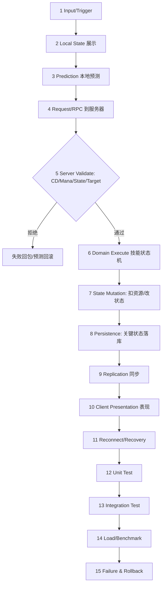

# 03-技能释放完整链路

> 知识基线：从客户端输入到服务器结算、网络同步、测试与性能的完整技能链路；模板 A（Gameplay Transaction）；客户端材料：GAS/Enhanced Input/GameplayTag（[游戏知识/03-游戏玩法编程](../../../游戏知识/03-游戏玩法编程/README.md)）；服务端材料：技能状态机/伤害管线/Buff（[游戏服务端/03-业务系统设计/08-技能与战斗框架](08-技能与战斗框架.md)）。
> 版本基准：UE5.8（客户端 GAS）；服务端为通用设计（可用 UE DS 或自研逻辑服实现）。
> 适用范围：技能系统的端到端设计、评审与验收；读者前置：GAS 基础、RPC/预测、服务端技能框架。
> 官方参考：[UE5.8 GAS 文档](https://dev.epicgames.com/documentation/en-us/unreal-engine/gameplay-ability-system-for-unreal-engine)。
> 最后更新：2026-08-13（首版）。
> 知识成熟度：L3（验证矩阵 + 测试库方法映射已定义；**测试执行与原始数据待回填**——证据边界见 6.2，回填后再升 L4）。

## 1. 概述

技能是游戏里链路最长的玩法系统：一次技能释放跨越输入、预测、网络、服务器校验、状态机、目标筛选、Buff、伤害、同步、表现、回放、测试十二个环节。本文把每个环节串成一条**可评审、可测试**的完整链路：

```text
Input/Trigger → Local State → Prediction → Request/RPC → Server Validate
→ Domain Execute → State Mutation → Persistence → Replication → Client Presentation
→ Reconnect/Recovery → Unit Test → Integration Test → Load/Benchmark → Failure & Rollback
```

链路回答五个问题（缺任一不得标 L4）：

1. 谁拥有权威状态？——服务器（技能状态机、伤害、Buff 全部服务器权威）；
2. 数据从哪里来、到哪里去？——输入 → RPC → 校验 → 执行 → 状态变更 → 复制 → 表现；
3. 失败时怎么办？——无效请求拒绝、预测回滚、断线重连补偿；
4. 如何证明逻辑正确？——Unit Test + 冲突矩阵 + 网络测试；
5. 如何证明性能够用？——技能结算 P99、压测（1000 技能/秒）。

## 2. 链路类型与依赖模块

链路类型：**Gameplay Transaction（Template A）**——一次玩家操作触发的事务型玩法变更。

| 环节 | 依赖模块 | 仓库支撑 |
| --- | --- | --- |
| 输入 | Enhanced Input | [02-EnhancedInput增强输入](../输入移动与交互/02-EnhancedInput增强输入.md) |
| 能力定义 | GAS / GameplayTag | [01-GameplayAbilitySystem能力系统](01-GameplayAbilitySystem能力系统.md)、[03-GameplayTag与数据资产](../玩法架构与任务协作/03-GameplayTag与数据资产.md) |
| 本地预测 | 预测系统 | [03-客户端预测与延迟补偿](../../07-网络与游戏服务端/同步预测与回放/03-客户端预测与延迟补偿.md) |
| RPC | 网络层 | [02-RPC与属性同步](../../07-网络与游戏服务端/状态复制与兴趣管理/02-RPC与属性同步.md) |
| 服务器校验/执行 | 技能状态机 | [08-技能与战斗框架](08-技能与战斗框架.md) |
| 目标筛选/伤害 | 战斗结算 | [06-战斗结算与验证](06-战斗结算与验证.md) |
| Buff | Buff 系统 | [04-Buff系统完整链路](04-Buff系统完整链路.md)、[08-技能与战斗框架 §3.5](08-技能与战斗框架.md) |
| 同步/回放 | Replication/Demo | [05-ReplicationGraph兴趣管理](../../07-网络与游戏服务端/状态复制与兴趣管理/05-ReplicationGraph兴趣管理.md)、[09-网络回放与DemoNetDriver](../../07-网络与游戏服务端/同步预测与回放/09-网络回放与DemoNetDriver.md) |
| 测试 | 测试库 | [游戏测试与质量](../../../00_Index/学习路线/工程实践与质量.md)（01/02/03/06） |
| 反作弊 | 服务器校验/上报 | [09-安全合规与反作弊测试](../../08-工程实践与质量/安全与防护/09-安全合规与反作弊测试.md) |
| 预算 | 结算性能 | [11-AI与寻路时间预算](../../07-网络与游戏服务端/运行调度与过载保护/11-AI与寻路时间预算.md) |

## 3. 完整数据流（15 步）



### 3.1 各步要点

1. **Input**：Enhanced Input 把按键映射到 Ability Tag（不直接绑技能）；
2. **Local State**：客户端立即显示"技能进入"（响应感）；
3. **Prediction**：本地预测伤害/位移（可回滚），服务器确认后修正；
4. **RPC**：客户端发"技能请求"（Ability Tag + 目标 + 序号），服务器是唯一入口；
5. **Validate**：CD、资源、状态（眩晕/沉默）、目标合法性、反作弊（频率/距离）——**服务器校验，客户端校验只是体验优化**；
6. **Execute**：技能状态机（施法前摇 → 生效 → 后摇），见 [08-技能与战斗框架 §3.2](08-技能与战斗框架.md)；
7. **State Mutation**：扣蓝、置 CD、伤害/Buff 结算（服务器权威）；
8. **Persistence**：关键状态（金币/装备/任务进度）落库（关联 [13-世界Snapshot与故障恢复](../../07-网络与游戏服务端/世界权威与故障恢复/13-世界Snapshot与故障恢复.md)）；
9. **Replication**：属性同步 + 技能事件广播（AOI 范围内）；
10. **Presentation**：客户端播放动画/VFX/音效，与预测结果对齐；
11. **Reconnect**：断线重连后技能状态以服务器为准（CD/资源重同步）；
12~15. **测试与回滚**：见第 5、6 节。

补充第 14 步 Load/Benchmark 的指标口径：

```text
技能请求率（次/秒）、结算 P50/P95/P99、资源扣减正确率、Buff 应用数
批量场景：1000 技能/秒 × 10 分钟，P99 稳定在预算内
```

压测数据与容量结论进 [游戏测试与质量 07](<../../08-工程实践与质量/测试策略与自动化/07-UE%20DS机器人压测与容量评估.md>) 的容量报告模板。

### 3.2 关键环节深度

**第 5 步 Server Validate 的完整清单**：

```text
1. 请求者存在且在线（EntityId 校验）
2. 技能已习得/装备（配置表查证）
3. CD 就绪（GameClock 时间差）
4. 资源足够（蓝/能量/道具）
5. 状态允许（眩晕/沉默/死亡判定）
6. 目标合法（存在、在范围内、阵营规则）
7. 频率与距离（反作弊：短时间多次请求、超距施法）
8. 幂等键（重传去重）
```

校验失败返回"原因码"（客户端可展示），但**不返回数值细节**（防作弊信息泄露）。

**第 6 步技能状态机**（与 [08-技能与战斗框架 §3.2](08-技能与战斗框架.md) 对应）：

```text
Idle → Casting（前摇）→ Active（生效）→ Recovery（后摇）→ Idle
                 ↖ 中断（眩晕/死亡/位移打断）↗
```

状态转换必须显式（枚举 + 转换表），中断路径与正常路径同样进单测。

**第 7 步伤害管线**（[06-战斗结算与验证](06-战斗结算与验证.md)）：

```text
基础伤害 → 属性加成（攻击/防御/Buff）→ 暴击判定 → 免伤/护盾 → 最终数值 → 事件记录
```

管线顺序固定（确定性），每一步可插桩计时（预算分析用）。

### 3.3 反作弊视角

技能链路是反作弊重灾区：

- **超距施法**：服务器用权威位置校验距离，不信任客户端坐标；
- **频率滥用**：请求频率阈值（如 10 次/秒），超限拒绝 + 上报；
- **数值伪造**：伤害/消耗全部服务器计算，客户端只发"意图"；
- **变速齿轮**：请求间隔与服务器时间差校验（GameClock 语义）；
- 证据链：技能请求 + 裁决结果 + 结算事件全量记录，供封禁审计（关联 [09-安全合规与反作弊测试](../../08-工程实践与质量/安全与防护/09-安全合规与反作弊测试.md)）。

### 3.4 预算与性能

技能结算的预算分配（20Hz 服务器示例）：

```text
校验（Validate）：0.1ms/次 预算
状态机推进：0.05ms/次
伤害管线：0.2ms/次（含属性计算）
Buff 应用：0.1ms/次
合计：单技能 ≈ 0.45ms → 20Hz 预算 5ms 内可容纳 ~10 次/ Tick
```

超预算时：技能请求排队（按优先级），关键技能（保命/控制）优先；批量 AOE 按目标数分帧结算（关联 [11](../../07-网络与游戏服务端/运行调度与过载保护/11-AI与寻路时间预算.md) 的预算方法论）。

## 4. 权威状态与失败路径

### 4.1 权威状态

- **服务器权威**：技能状态机、CD、资源、目标判定、伤害数值、Buff 结果全部服务器计算；
- 客户端只做两件事：**展示与预测**；预测结果可被服务器修正（回滚）；
- 反作弊视角：客户端一切输入都不可信（频率、范围、数值校验在服务器）。

### 4.2 失败路径与处理

| 失败 | 表现 | 处理 |
| --- | --- | --- |
| Validate 拒绝（CD/资源不足） | 服务器拒绝 | 回失败原因（可展示"冷却中"），客户端预测回滚 |
| 目标已死亡/移动 | 命中失败 | 服务器按"施法时目标"结算或失败回包 |
| 网络丢包 | RPC 丢失 | 可靠通道重传；预测先行保证体验 |
| 断线 | 技能中断 | 服务器按状态机规则中断（或继续），重连后重同步 |
| 结算异常（数值越界） | 检测到异常 | 拒绝结算 + 上报反作弊（见 [06-战斗结算与验证](06-战斗结算与验证.md)） |
| 事务中途崩溃 | 部分结算 | 事件日志幂等重放，未 Commit 回滚（关联 Snapshot 篇） |

## 5. 验证矩阵

| 验证项 | 方法 | 断言/阈值 | 测试库映射 |
| --- | --- | --- | --- |
| 单元：技能状态机 | 确定性单测（注入随机/时钟） | 状态转换合法、结算幂等 | [03-服务端测试](../../08-工程实践与质量/测试策略与自动化/03-服务端测试与机器人压测.md) |
| 单元：Buff 冲突矩阵 | 矩阵用例（见 [04](04-Buff系统完整链路.md)） | 刷新/叠加/替换/驱散语义正确 | 同上 |
| 无效请求 | 边界用例 | CD 中/资源不足/眩晕中全部拒绝 | [01-测试策略](../../08-工程实践与质量/测试策略与自动化/01-测试金字塔与测试策略.md)（边界值） |
| 网络：RPC 可靠性 | 丢包/乱序模拟 | 重传收敛、无重复结算 | [04-性能兼容与网络异常测试](../../08-工程实践与质量/测试策略与自动化/04-性能兼容与网络异常测试.md) |
| 网络：预测一致性 | 服务器对照 | 预测结果与服务器一致或可回滚 | 同上 |
| 重连 | 断线重连测试 | CD/资源/技能状态重同步正确 | [06-UE DS联机验收与Gauntlet](<../../08-工程实践与质量/测试策略与自动化/06-UE%20Dedicated%20Server联机验收与Gauntlet.md>) |
| 性能 | 技能结算压测 | 1000 技能/秒 P99 < 预算 | [03-服务端测试](../../08-工程实践与质量/测试策略与自动化/03-服务端测试与机器人压测.md)、[07-机器人压测](<../../08-工程实践与质量/测试策略与自动化/07-UE%20DS机器人压测与容量评估.md>) |
| 回放 | DemoNetDriver 录制对比 | 回放状态与线上一致 | [09-网络回放](../../07-网络与游戏服务端/同步预测与回放/09-网络回放与DemoNetDriver.md) |
| 反作弊 | 异常频率/距离注入 | 超限请求被拒且上报 | [09-安全合规与反作弊测试](../../08-工程实践与质量/安全与防护/09-安全合规与反作弊测试.md) |
| 状态机 | 中断路径用例 | 前摇/生效/后摇/中断转换合法 | [03-服务端测试](../../08-工程实践与质量/测试策略与自动化/03-服务端测试与机器人压测.md) |

### 5.1 测试分层映射

```text
单元层（快，占 70%）：状态机转换、Validate 清单、伤害管线公式、Buff 矩阵单条
集成层（中）：技能+Buff+伤害管线串联、连招顺序
系统层（慢）：RPC 往返、预测一致性、重连
E2E（最少）：Gauntlet 多客户端联机（关联 [06-UE DS联机验收与Gauntlet](../游戏测试与质量/06-UE Dedicated Server联机验收与Gauntlet.md)）
```

原则：技能逻辑的 90% 可以在单元层覆盖（确定性注入），E2E 只保留"跨端一致性"验证——避免脆弱的全链路用例。

## 6. Benchmark 与 Evidence

### 6.1 现有证据的映射

- 技能结算的 CPU 预算复用 [Evidence · tick-scheduler](../../../evidence/server/tick-scheduler/README.md) 的过载语义（结算超预算 = drop/catch-up）；
- 并发技能结算的原子计数复用 [Evidence · atomic-memory-order](../../../evidence/labs/atomic-memory-order/README.md)；
- 目标筛选（AOI 内选目标）复用 [Evidence · aoi](../../../evidence/algorithms/aoi/README.md) 的兴趣集数据。

### 6.2 证据边界（诚实声明）

本链路**尚未执行技能专项测试**：验证矩阵（第 5 节）定义了测试规范与方法映射，但原始测试数据（技能结算 P99、冲突矩阵用例结果、压测报告）**待回填**。升级路径：按第 5 节矩阵接入测试库执行，数据入 `evidence/tests/skill/` 后，成熟度可维持 L4 并补全证据。

### 6.3 技能专项实验计划

```text
实验 1：技能结算基准（1000 次/秒 × 混合技能）
  指标：校验/状态机/伤害/Buff 各环节 P50/P95/P99
实验 2：预测一致性（丢包注入）
  指标：回滚率 P95、表现差异
实验 3：批量 AOE（100 目标）
  指标：单 Tick 结算耗时、分帧效果
```

实验代码与结果入 `evidence/tests/skill/`，与 [系统实战 07](../../06-游戏AI/战斗战术与机器人/07-假人AI完整链路.md) 的 A* 实验同规格。

### 6.4 本机可运行证据（2026-09-11 新增）

[evidence/tests/gameplay-core](../../../evidence/tests/gameplay-core/README.md) 的 `skill_pipeline` 把技能请求管线的**逻辑层**固化为可运行断言：

- 门禁拒绝无副作用：冷却（S2）与蓝量（S4）拒绝时不扣蓝、不写冷却；公共冷却（S3）与不可打断吟唱（S6）按唯一原因短路；
- 幂等：同一 `requestId` 重传只结算一次（S7）；
- 确定性重放：4 000 次固定种子请求流两次运行得到同一状态哈希（S8，h1 = h2 = `908cfbcc0f3aa8f1`）；
- 客户端预测回滚：服务端拒绝后预测蓝量回滚到权威值（S9）；
- 打断：可打断吟唱被伤害取消（S10）。

结果 pass=10 fail=0，原始输出见 [results/skill_pipeline.txt](../../../evidence/tests/gameplay-core/results/skill_pipeline.txt)。该证据覆盖**逻辑层**；网络复制、DS 运行时与容量结论仍属未验证边界，因此本篇维持 L3。

## 7. 最佳实践

1. **服务器校验是唯一权威**：客户端校验只优化体验，不防作弊。
2. **技能请求只带语义**（Ability Tag + 目标 + 序号），服务器查表执行——数据驱动，禁止客户端传数值。
3. **状态机显式化**：前摇/生效/后摇/中断状态机进代码评审与单测（[08-技能与战斗框架 §3.2](08-技能与战斗框架.md)）。
4. **预测必须可回滚**：本地预测结果标记"待确认"，服务器回包差异即回滚。
5. **结算幂等**：RPC 重传不重复结算（技能请求带幂等键）。
6. **关键状态落库**：技能相关的资产变更（消耗/奖励）走事件日志。
7. **反作弊内置**：频率/距离/范围校验在服务器，异常上报（关联 [09-安全合规与反作弊测试](../../08-工程实践与质量/安全与防护/09-安全合规与反作弊测试.md)）。
8. **性能预算**：单技能结算 P99 进预算表（关联 [11-AI与寻路时间预算](../../07-网络与游戏服务端/运行调度与过载保护/11-AI与寻路时间预算.md) 的预算方法论）。
9. **回放可复现**：技能结算只依赖确定性输入（Tick 种子），回放一致。
10. **校验清单化**：第 5 步 Validate 清单进代码评审（8 项一条不能少）。
11. **状态机显式**：转换表 + 中断路径单测，禁止散落 if 判断。
12. **反作弊内置**：频率/距离/数值校验与证据链，上线后补成本极高。
13. **批量 AOE 分帧**：大范围技能结算分帧执行，防单 Tick 尖峰。
14. **预算表可计算**：单技能各环节耗时进基准库，容量换算可重复（关联第 6 节）。
15. **测试分层**：单元层覆盖 90% 技能逻辑，E2E 只留跨端一致性（见 5.1）。

## 8. 常见问题

**Q1：客户端预测和服务器结果不一致怎么办？**
回滚：客户端把预测的状态（伤害/位移）回退到服务器确认值；关键是预测范围要小（只预测可见部分），结算永远服务器做。

**Q2：RPC 重传会不会重复结算？**
会，除非带幂等键：技能请求携带 (playerId, ability, seq)，服务器按 seq 去重；已执行则返回结果而非重执行。

**Q3：技能结算里能直接访问数据库吗？**
不能。结算走内存状态 + 事件日志异步落库；数据库访问会阻塞 Tick（关联 [14-运行时背压与过载保护](../../07-网络与游戏服务端/运行调度与过载保护/14-运行时背压与过载保护.md)）。

**Q4：Buff 和技能谁先结算？**
按状态机顺序：技能生效 → 应用 Buff → 伤害管线读取最终属性（含 Buff 加成）；顺序写进 [04-Buff系统完整链路](04-Buff系统完整链路.md) 的冲突矩阵。

**Q5：技能 P99 超标先查什么？**
先查目标筛选（AOI 扫描）与属性计算（伤害管线），再查状态机事件分发；用插桩拆解各环节耗时（关联 [笔记/插桩测试](../../08-工程实践与质量/调试与性能分析/插桩测试.md)）。

**Q6：这套链路在 UE DS 上怎么落地？**
GAS 提供客户端/DS 两侧框架（Ability/ActorInfo/TargetData），服务端技能状态机与伤害管线在 DS 上实现（[08-技能与战斗框架](08-技能与战斗框架.md) 的服务器部分）；校验/反作弊在服务器侧补齐。

**Q7：预测失败回滚会不会穿帮？**
会，除非预测范围设计得好：只预测"必然发生"的部分（技能进入、资源预扣），伤害/控制等裁决结果不预测；回滚时客户端平滑过渡（动画/数值回退），P95 回滚率是体验指标。

**Q8：技能结算与 Buff 结算的性能关系？**
技能结算的 60% 常消耗在属性计算（含 Buff 加成）；批量 Buff 场景优先优化属性重算（缓存中间结果），关联 [04-Buff系统完整链路](04-Buff系统完整链路.md) 的性能建议。

**Q9：多技能同时释放（连招）怎么保证顺序？**
服务器按请求到达序 + 优先级队列执行；连招的"后段必须在先段完成后触发"由状态机衔接（技能链配置），而不是依赖网络顺序。

**Q10：客户端表现和服务器结算不同步怎么办？**
分层处理：表现层跟"预测 + 服务器事件"（动画/VFX 以事件为准），数值层跟服务器结算；两者差异通过"表现平滑"吸收，不强制逐帧一致。

**Q11：技能请求的幂等键怎么生成？**
(playerId, abilityId, clientSeq)——客户端单调递增序号；服务器按 (playerId, abilityId) 记录 lastSeq，重传（seq ≤ last）直接返回缓存结果。

**Q12：技能表现与数值分开的好处？**
表现层可自由降级（低端机关特效、远距离简化动画）而不影响数值正确性；数值层可独立压测与回放——这是"表现/数值分离"的核心收益。

**Q13：技能链路的"回滚"和 Buff 的"恢复"是一回事吗？**
不是。技能回滚是"预测失败时撤销本地表现"（客户端）；Buff 恢复是"高级覆盖解除后低级 Buff 重新生效"（服务器语义，见 [04](04-Buff系统完整链路.md) 矩阵 #6）——两者都要可测，但作用域完全不同。

## 9. 术语速查

| 术语 | 含义 |
| --- | --- |
| ServerValidate | 服务器权威校验清单（身份/CD/资源/状态/目标/频率/幂等） |
| GameClock | 服务器统一时间权威（CD 与结算的时间差来源） |
| 幂等键 | 重传去重标识，防止同一请求重复结算 |
| 结算事件 | 伤害/消耗的全量事件记录，供回放与审计 |
| 预算片 | 超预算时按优先级排队/分帧的结算控制单元 |

## 10. 关联阅读

- [04-Buff系统完整链路](04-Buff系统完整链路.md)：本链路的 Buff 环节展开。
- [游戏服务端/03-业务系统设计/08-技能与战斗框架](08-技能与战斗框架.md)：服务端状态机/伤害管线/Buff。
- [游戏知识/03-游戏玩法编程/01-GameplayAbilitySystem能力系统](01-GameplayAbilitySystem能力系统.md)：GAS 客户端侧。
- [游戏知识/06-网络同步/03-客户端预测与延迟补偿](../../07-网络与游戏服务端/同步预测与回放/03-客户端预测与延迟补偿.md)：预测与回滚。
- [游戏测试与质量](../../../00_Index/学习路线/工程实践与质量.md)：验证矩阵的方法支撑。
- [07-假人AI完整链路](../../06-游戏AI/战斗战术与机器人/07-假人AI完整链路.md)：同为系统实战的链路模板示范。
- [游戏服务端/06-世界模拟与运行时/13-世界Snapshot与故障恢复](../../07-网络与游戏服务端/世界权威与故障恢复/13-世界Snapshot与故障恢复.md)：结算事件的持久化。
- [游戏服务端/06-世界模拟与运行时/12-世界时间确定性与GameClock](../../07-网络与游戏服务端/运行调度与过载保护/12-世界时间确定性与GameClock.md)：CD 与结算的时间权威。
- [游戏服务端/06-世界模拟与运行时/11-AI与寻路时间预算](../../07-网络与游戏服务端/运行调度与过载保护/11-AI与寻路时间预算.md)：结算预算的分配方法论。
- [游戏测试与质量/01-测试金字塔与测试策略](../../08-工程实践与质量/测试策略与自动化/01-测试金字塔与测试策略.md)：技能用例的分层设计。
- [游戏知识/06-网络同步/02-RPC与属性同步](../../07-网络与游戏服务端/状态复制与兴趣管理/02-RPC与属性同步.md)：技能请求的传输通道。
- [游戏知识/06-网络同步/09-网络回放与DemoNetDriver](../../07-网络与游戏服务端/同步预测与回放/09-网络回放与DemoNetDriver.md)：技能回放验证。
- [游戏服务端/06-世界模拟与运行时/14-运行时背压与过载保护](../../07-网络与游戏服务端/运行调度与过载保护/14-运行时背压与过载保护.md)：技能风暴的过载兜底。
- [游戏服务端/06-世界模拟与运行时/03-Entity生命周期与组件模型](../../07-网络与游戏服务端/世界权威与故障恢复/03-Entity生命周期与组件模型.md)：技能目标实体的生命周期校验。
- [游戏服务端/06-世界模拟与运行时/05-AOI与InterestManagement](../../07-网络与游戏服务端/状态复制与兴趣管理/05-AOI与InterestManagement.md)：技能范围目标筛选的空间索引。
- [游戏测试与质量/06-UE Dedicated Server联机验收与Gauntlet](<../../08-工程实践与质量/测试策略与自动化/06-UE%20Dedicated%20Server联机验收与Gauntlet.md>)：联机技能验证。
- 本链路与 [07-假人AI完整链路](../../06-游戏AI/战斗战术与机器人/07-假人AI完整链路.md)、[04-Buff系统完整链路](04-Buff系统完整链路.md) 共同构成系统实战第一批闭环。
- 伤害数字的深挖（乘区顺序、护盾、过量、上限、DOT 取整）单独成篇：[11-伤害与属性结算完整链路](11-伤害与属性结算完整链路.md)；本文步骤 7 的 Damage Pipeline 是其上层触发。
