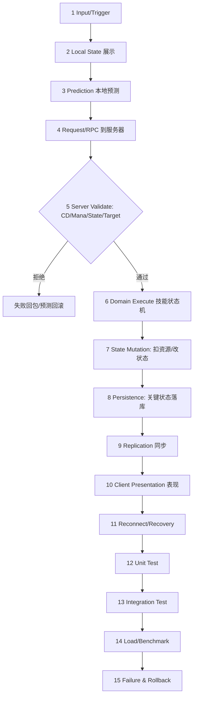

# 03-技能释放完整链路

> 知识基线：从客户端输入到服务器结算、网络同步、测试与性能的完整技能链路；模板 A（Gameplay Transaction）；客户端材料：GAS/Enhanced Input/GameplayTag（[游戏知识/03-游戏玩法编程](../../../游戏知识/03-游戏玩法编程/README.md)）；服务端材料：技能状态机/伤害管线/Buff（[游戏服务端/03-业务系统设计/08-技能与战斗框架](08-技能与战斗框架.md)）。
> 版本基准：UE5.8（客户端 GAS）；服务端为通用设计（可用 UE DS 或自研逻辑服实现）。
> 适用范围：技能系统的端到端设计、评审与验收；读者前置：GAS 基础、RPC/预测、服务端技能框架。
> 官方参考：[UE5.8 GAS 文档](https://dev.epicgames.com/documentation/en-us/unreal-engine/gameplay-ability-system-for-unreal-engine)。
> 最后更新：2026-10-04（技能门禁合同与教学边界修订；首版 2026-08-13）。
> 知识成熟度：L2（全文主要是经资料/源码核对的端到端设计；旧 L3 以测试矩阵和局部模型代替主要实现运行，现予校准。独立 C++ 接纳模型的实际运行单列于 6.4；UE/网络/负载仍待验证，verified 保持空列表）。

## 1. 概述

技能是游戏里链路最长的玩法系统：一次技能释放跨越输入、预测、网络、服务器校验、状态机、目标筛选、Buff、伤害、同步、表现、回放、测试十二个环节。本文把每个环节串成一条**可评审、可测试**的完整链路：

```text
Input/Trigger → Local State → Prediction → Request/RPC → Server Validate
→ Domain Execute → State Mutation → Persistence → Replication → Client Presentation
→ Reconnect/Recovery → Unit Test → Integration Test → Load/Benchmark → Failure & Rollback
```

链路回答五个评审问题；是否达到更高成熟度还取决于这些承诺实际得到什么证据支持：

1. 谁拥有权威状态？——服务器（技能状态机、伤害、Buff 全部服务器权威）；
2. 数据从哪里来、到哪里去？——输入 → RPC → 校验 → 执行 → 状态变更 → 复制 → 表现；
3. 失败时怎么办？——无效请求拒绝、预测回滚、断线重连补偿；
4. 如何证明逻辑正确？——Unit Test + 冲突矩阵 + 网络测试；
5. 如何证明性能够用？——标明服务器/分片/核的负载口径，测量技能结算与排队 P99；1000 技能/秒仅为下文实验目标。

## 2. 链路类型与依赖模块

链路类型：**Gameplay Transaction（Template A）**——一次玩家操作触发的事务型玩法变更。

| 环节 | 依赖模块 | 仓库支撑 |
| --- | --- | --- |
| 输入 | Enhanced Input | [02-EnhancedInput增强输入](../输入移动与交互/02-EnhancedInput增强输入.md) |
| 能力定义 | GAS / GameplayTag | [01-GameplayAbilitySystem能力系统](01-GameplayAbilitySystem能力系统.md)、[03-GameplayTag与数据资产](../玩法架构与任务协作/03-GameplayTag与数据资产.md) |
| 本地预测 | 预测系统 | [03-客户端预测与延迟补偿](../../07-网络与游戏服务端/同步预测与回放/03-客户端预测与延迟补偿.md) |
| RPC | 网络层 | [02-RPC与属性同步](../../07-网络与游戏服务端/状态复制与兴趣管理/02-RPC与属性同步.md) |
| 服务器校验/执行 | 技能状态机 | [08-技能与战斗框架](08-技能与战斗框架.md) |
| 目标筛选/伤害 | 战斗结算 | [06-战斗结算与验证](06-战斗结算与验证.md) |
| Buff | Buff 系统 | [04-Buff系统完整链路](04-Buff系统完整链路.md)、[08-技能与战斗框架 §3.5](08-技能与战斗框架.md) |
| 同步/回放 | Replication/Demo | [05-ReplicationGraph兴趣管理](../../07-网络与游戏服务端/状态复制与兴趣管理/05-ReplicationGraph兴趣管理.md)、[09-网络回放与DemoNetDriver](../../07-网络与游戏服务端/同步预测与回放/09-网络回放与DemoNetDriver.md) |
| 测试 | 测试库 | [游戏测试与质量](../../../00_Index/学习路线/工程实践与质量.md)（01/02/03/06） |
| 反作弊 | 服务器校验/上报 | [09-安全合规与反作弊测试](../../08-工程实践与质量/安全与防护/09-安全合规与反作弊测试.md) |
| 预算 | 结算性能 | [11-AI与寻路时间预算](../../07-网络与游戏服务端/运行调度与过载保护/11-AI与寻路时间预算.md) |

## 3. 完整数据流（15 步）



这张图串联的是职责、故障恢复与验证活动，不是一次请求必须同步执行的调用栈；12–15 是工程验收活动。第 8 步仅对需要耐久保证的资产变更适用，并不表示每次技能都要等数据库写完才复制。提交点、持久化确认与可见性要按业务合同设计。

### 3.1 各步要点

1. **Input**：Enhanced Input 的 Input Action / Mapping Context 提供输入动作；由项目适配层把动作转成 Ability Tag 或能力选择，不是框架自动完成该映射；
2. **Local State**：客户端立即显示"技能进入"（响应感）；
3. **Prediction**：本篇采用保守项目策略，先预测起手表现和可撤销的资源显示；最终伤害/控制由服务器裁决。位移或属性预测另按实际效果路径、预测键与撤销能力评审；
4. **RPC**：客户端发"技能请求"（Ability Tag + 目标 + 序号），服务器是唯一入口；
5. **Validate**：CD、资源、状态（眩晕/沉默）、目标合法性、反作弊（频率/距离）——**服务器校验，客户端校验只是体验优化**；
6. **Execute**：技能状态机（施法前摇 → 生效 → 后摇），见 [08-技能与战斗框架 §3.2](08-技能与战斗框架.md)；
7. **State Mutation**：明确资源/CD 在请求接纳还是生效时提交，伤害/Buff 按配置顺序结算；取消是否返还另定。本地 toy 在接纳时立即扣蓝、写 CD/GCD 与施法字段，尚未执行伤害/Buff；
8. **Persistence**：金币、装备等耐久资产的变更使用其事务/结果记录合同（见 [05-背包道具完整链路](../背包装备与存档/05-背包道具完整链路.md) 与 [13-世界Snapshot与故障恢复](../../07-网络与游戏服务端/世界权威与故障恢复/13-世界Snapshot与故障恢复.md)）；瞬时技能状态不能仅凭一条事件日志就声称崩溃可回滚；
9. **Replication**：属性同步 + 技能事件广播（AOI 范围内）；
10. **Presentation**：客户端播放动画/VFX/音效，与预测结果对齐；
11. **Reconnect**：断线重连后技能状态以服务器为准（CD/资源重同步）；
12~15. **测试与回滚**：见第 5、6 节。

补充第 14 步 Load/Benchmark 的指标口径：

```text
技能请求率（次/秒）、结算 P50/P95/P99、资源扣减正确率、Buff 应用数
计划负载：1000 技能/秒 × 10 分钟；先标明单服/分片/核与技能分布
分别测服务耗时、排队延迟、完成率；P99 阈值由已分配预算决定
```

压测数据与容量结论进 [游戏测试与质量 07](<../../08-工程实践与质量/测试策略与自动化/07-UE%20DS机器人压测与容量评估.md>) 的容量报告模板。

### 3.2 关键环节深度

**第 5 步 Server Validate 的项目评审清单**（不是 toy 已实现的八项证明）：

```text
1. 请求者存在且在线（EntityId 校验）
2. 技能已习得/装备（配置表查证）
3. CD 就绪（GameClock 时间差）
4. 资源足够（蓝/能量/道具）
5. 状态允许（眩晕/沉默/死亡判定）
6. 目标合法（存在、在范围内、阵营规则）
7. 频率与距离（反作弊：短时间多次请求、超距施法）
8. 幂等键（重传去重）
```

校验失败返回约定原因码；哪些数值细节可以展示由信息披露与可观测性策略决定，不能用隐藏数值替代服务器校验。

本地 `Handle` 的调用前提是：单写者、已认证并正确选定的 Actor、有效已有状态、有效且执行期间不变的技能定义（非负消耗/时长、有限且有序的非负范围）、非负且在模拟内不倒退的权威时间、计数器仍可递增。距离由可信适配器计算或验证；目标存在性、代际、阵营与技能习得也由适配层处理。toy 仅检查 hostile 技能的 targetId 非零，并不具备世界查询或认证能力。

实际新增的输入拒绝仅是时间可表示性：全部旧 gate 通过后，对本次选定技能会计算的 CD、cast、GCD 三个加法先检查边界并计算候选，再改玩法字段；任一超出 int64 返回 `time-overflow`，整个 Actor 仅 `rejected + 1`。不扫描未选定义，不先计算溢出表达式再检测。有限距离守卫仍保留；这不是通用配置/请求验证框架。

**第 6 步技能状态机**（与 [08-技能与战斗框架 §3.2](08-技能与战斗框架.md) 对应）：

```text
Idle → Casting（前摇）→ Active（生效）→ Recovery（后摇）→ Idle
                 ↖ 中断（眩晕/死亡/位移打断）↗
```

完整状态机的转换应显式（枚举 + 转换表），正常与中断路径同样进单测。当前 toy 只记录 castingUntil/castingSkill/interruptible，没有推进 Active/Recovery、施法结束目标复查或伤害事件接线。显式 `Interrupt` 只清可打断施法的两个字段，不返还蓝量、CD/GCD 或已接纳 ID；S10 测的是这个直接调用。

**第 7 步伤害管线**（[06-战斗结算与验证](06-战斗结算与验证.md)）：

```text
基础伤害 → 属性加成（攻击/防御/Buff）→ 暴击判定 → 免伤/护盾 → 最终数值 → 事件记录
```

项目须固定并测试管线顺序，每一步可插桩计时。Buff 先于本次伤害还是之后生效、属性在施法时快照还是命中时重取均是玩法规则；需要当前属性时先完成相应刷新/读屏障，再建立结算快照（见 [11-伤害与属性结算完整链路](11-伤害与属性结算完整链路.md)）。仅固定顺序并不能证明跨平台确定性。

### 3.3 反作弊视角

技能链路是反作弊重灾区：

- **超距施法**：服务器用权威位置校验距离，不信任客户端坐标；
- **频率滥用**：请求频率阈值（如 10 次/秒），超限拒绝 + 上报；
- **数值伪造**：伤害/消耗全部服务器计算，客户端只发"意图"；
- **变速齿轮**：请求间隔与服务器时间差校验（GameClock 语义）；
- 证据链：技能请求 + 裁决结果 + 结算事件全量记录，供封禁审计（关联 [09-安全合规与反作弊测试](../../08-工程实践与质量/安全与防护/09-安全合规与反作弊测试.md)）。

### 3.4 预算与性能

以下是预算算例，不是已测耗时：20Hz 的整个 Tick 为 50ms；假设其中另分配 5ms 给单个串行技能执行域，其余预算留给其他系统。

```text
校验（Validate）：0.1ms/次 预算
状态机推进：0.05ms/次
伤害管线：0.2ms/次（含属性计算）
Buff 应用：0.1ms/次
合计：单技能 ≈ 0.45ms
5ms 技能子预算约容纳 10 次/Tick（留余量），即约 200 次/秒
稳态平均 1000 次/秒 ÷ 20 Tick/秒 = 平均 50 次/Tick，算例需求约 22.5ms/Tick
```

这个平均换算不保证每 Tick 都恰好 50 次，突发分布仍需单独测量。因此不能同时把 5ms 子预算与 1000 次/秒说成单核单域已有容量；多核/分片也须计算同步与分布成本。超预算可选择接纳前限流/拒绝、预算内排队或改变负载配置，且须测排队延迟、饥饿与公平性。优先级改变技能顺序；已提交效果不能因调度器有 drop 示例就丢掉。

AOE 分帧也会改变语义：选目标时刻、逐目标生效时刻、目标移出/死亡时是否重查，以及攻击者/受击者属性是冻结还是实时值都须明确。只有游戏规则允许且顺序可复现时才采用分帧（关联 [11](../../07-网络与游戏服务端/运行调度与过载保护/11-AI与寻路时间预算.md) 的预算方法论）。

## 4. 权威状态与失败路径

### 4.1 权威状态

- **服务器权威**：技能状态机、CD、资源、目标判定、伤害数值、Buff 结果全部服务器计算；
- 客户端只做两件事：**展示与预测**；预测结果可被服务器修正（回滚）；
- 反作弊视角：客户端一切输入都不可信（频率、范围、数值校验在服务器）。

### 4.2 失败路径与处理

| 失败 | 表现 | 处理 |
| --- | --- | --- |
| Validate 拒绝（CD/资源不足） | 服务器拒绝 | 回失败原因（可展示"冷却中"），客户端预测回滚 |
| 目标已死亡/移动 | 依玩法决定是否失效 | 明确施法时快照或生效时重查，并定义失效时消耗/退款；toy 未实现 |
| 网络丢包 | 请求/确认延迟或缺失 | 按可靠性合同重传与去重；预测改善响应但不能保证结果或体验 |
| 断线 | 技能中断 | 服务器按状态机规则中断（或继续），重连后重同步 |
| 时间候选或结算数值不可表示 | 明确拒绝 | 在相关玩法写入前检查；记录诊断，不能未经归因便认定作弊（见 [06-战斗结算与验证](06-战斗结算与验证.md)） |
| 事务中途崩溃 | 可能部分结算 | 耐久资产按已实现的原子提交/恢复协议处理；toy 无崩溃恢复或分配异常强回滚保证 |

## 5. 验证矩阵

| 验证项 | 方法 | 断言/阈值 | 测试库映射 |
| --- | --- | --- | --- |
| 单元：技能状态机 | 确定性单测（注入随机/时钟） | 状态转换合法、结算幂等 | [03-服务端测试](../../08-工程实践与质量/测试策略与自动化/03-服务端测试与机器人压测.md) |
| 单元：Buff 冲突矩阵 | 矩阵用例（见 [04](04-Buff系统完整链路.md)） | 刷新/叠加/替换/驱散语义正确 | 同上 |
| 无效请求 | 边界用例 | CD 中/资源不足/眩晕中全部拒绝 | [01-测试策略](../../08-工程实践与质量/测试策略与自动化/01-测试金字塔与测试策略.md)（边界值） |
| 网络：RPC 可靠性 | 丢包/乱序模拟 | 重传收敛、无重复结算 | [04-性能兼容与网络异常测试](../../08-工程实践与质量/测试策略与自动化/04-性能兼容与网络异常测试.md) |
| 网络：预测一致性 | 服务器对照 | 预测结果与服务器一致或可回滚 | 同上 |
| 重连 | 断线重连测试 | CD/资源/技能状态重同步正确 | [06-UE DS联机验收与Gauntlet](<../../08-工程实践与质量/测试策略与自动化/06-UE%20Dedicated%20Server联机验收与Gauntlet.md>) |
| 性能（待执行） | 标明执行域的技能结算压测 | 实验目标 1000 次/秒；服务/排队 P99 与完成率分别验收 | [03-服务端测试](../../08-工程实践与质量/测试策略与自动化/03-服务端测试与机器人压测.md)、[07-机器人压测](<../../08-工程实践与质量/测试策略与自动化/07-UE%20DS机器人压测与容量评估.md>) |
| 回放 | DemoNetDriver 录制对比 | 录制覆盖的复制可见对象/属性/事件一致；不等同完整权威逻辑输入重放 | [09-网络回放](../../07-网络与游戏服务端/同步预测与回放/09-网络回放与DemoNetDriver.md) |
| 反作弊 | 异常频率/距离注入 | 超限请求被拒且上报 | [09-安全合规与反作弊测试](../../08-工程实践与质量/安全与防护/09-安全合规与反作弊测试.md) |
| 状态机 | 中断路径用例 | 前摇/生效/后摇/中断转换合法 | [03-服务端测试](../../08-工程实践与质量/测试策略与自动化/03-服务端测试与机器人压测.md) |

### 5.1 测试分层映射

```text
单元层（快）：状态机转换、Validate 清单、伤害管线公式、Buff 矩阵单条
集成层（中）：技能+Buff+伤害管线串联、连招顺序
系统层（慢）：RPC 往返、预测一致性、重连
E2E（高成本）：Gauntlet 多客户端联机、部署与关键业务闭环（关联下方标准链接）
```

原则：可注入时钟/随机/定义的逻辑优先在单元层验证；网络与真实生命周期交互须由集成、系统和 E2E 补齐。按项目风险和漏错成本确定覆盖目标，不把 70%/90% 当通用事实。联机入口见 [06-UE DS联机验收与Gauntlet](<../../08-工程实践与质量/测试策略与自动化/06-UE%20Dedicated%20Server联机验收与Gauntlet.md>)。

## 6. Benchmark 与 Evidence

### 6.1 现有证据的映射

- [Evidence · tick-scheduler](../../../evidence/server/tick-scheduler/README.md) 提供调度策略实验；技能可借用计时/预算方法，但是否跳过、延后或追赶已提交效果必须由玩法合同决定，不能直接继承 drop/catch-up；
- [Evidence · atomic-memory-order](../../../evidence/labs/atomic-memory-order/README.md) 可辅助理解计数同步，不证明技能状态的事务性或线程安全；
- 目标筛选（AOI 内选目标）复用 [Evidence · aoi](../../../evidence/algorithms/aoi/README.md) 的兴趣集数据。

### 6.2 证据边界（诚实声明）

技能接纳的独立 C++ 小模型已有历史及当前逻辑证据，见下表；第 5 节覆盖的 UE 状态机/网络复制、真实预测确认、重连、AOE 与负载性能尚未由这些运行验证。单机串行有限输入的通过不能提升为整条链路 L4，也不能推出线上容量。新实测应绑定源码/定义版本、输入、环境和原始输出，不能复用旧性能数字替新逻辑背书。

### 6.3 技能专项实验计划

```text
实验 1：技能结算基准（1000 次/秒 × 混合技能）
  指标：校验/状态机/伤害/Buff 各环节 P50/P95/P99
实验 2：预测一致性（丢包注入）
  指标：按已定义会话窗口统计拒绝/修正次数及对应请求分母，报告拒绝/修正率
  另测每次修正的延迟 P50/P95/P99 与表现差异，说明采样起止和超时/丢失样本处理
实验 3：批量 AOE（100 目标）
  指标：单 Tick 结算耗时、分帧效果
```

实验代码与结果入 `evidence/tests/skill/`，与 [系统实战 07](../../06-游戏AI/战斗战术与机器人/07-假人AI完整链路.md) 的 A* 实验同规格。

### 6.4 可运行证据与各自边界

[evidence/tests/gameplay-core](../../../evidence/tests/gameplay-core/README.md) 保留以下不同时间、不同覆盖的记录，不把它们混成一次运行：

| 记录 | 实际支持 | 入口 |
| --- | --- | --- |
| 2026-09-11 Windows 历史 S1–S10，10/0 | 若干接纳/门禁、已接纳 ID 重传、局部 hash 重复、单标量纠正、直接 Interrupt | [历史 raw](../../../evidence/tests/gameplay-core/results/skill_pipeline.txt) |
| 2026-09-30 Linux S1–S14，14/0 | 保留前十例，新增 NaN/正负无穷拒绝及有限范围边界 | [边界 raw](../../../evidence/tests/gameplay-core/results/skill_pipeline_linux_gcc.txt) |
| 2026-10-04 批次窄合同 | 完整 Actor 字段与独立字面状态、请求/裁决账本、时间候选边界及真实负控；实际采集时段/构建/数量以新摘要为准 | [当前摘要](../../../evidence/tests/gameplay-core/results/skill_contract_20261004.txt)、[完整技术 raw](../../../evidence/tests/gameplay-core/results/skill_contract_20261004.raw.jsonl.gz) |

S2 原断言只看冷却拒绝与蓝量，S4 看蓝量和无该 CD 项；S3/S6 仅核理由，不能将旧全绿解释为完整状态无变化。新合同逐字段比较 alive、mana/maxMana、GCD、全部 cast 字段、整个 cooldown map、accepted ID set、历史 hash 与两个计数；正常拒绝容许且只容许 rejected 增一。真实 GCD 拒绝时错误扣 1 蓝的变体能通过旧 14 例，但必须被新完整状态检查杀死；编译失败、崩溃或超时不算语义负控成功。

S8 的 4000 请求重复流仍保留历史 h1=h2=`908cfbcc0f3aa8f1`。它是组合 ID/skill 的自定义整数折叠与少数计数/蓝量的局部遥测投影，不是标准 FNV-1a 全请求散列，也不覆盖 CD、cast、target、时钟/定义来源或真实世界效果。相同投影而 CD 不同有直接反例；新字面逐步状态与输入账本是另外的检查。无论重复流还是完整有限用例，都不证明跨平台、线程安全或生产回放。

S9 确实验证了一次“服务端拒绝后纠正本地蓝量整数”的赋值，移除它会失败；它没有客户端 Actor/world、pending map、确认次序、回滚历史或剩余输入重放。测试中的独立 Actor 值拷贝/错误别名及两个 pending 的反例仅是隔离教学，不能算实现了预测系统。S10 是显式调用 Interrupt，无伤害事件接线。时间溢出新增拒绝在玩法写入前完成，但容器分配异常仍可能打断后续写入，因此不承诺异常强原子性。

### 6.5 引擎参考与项目策略

以下只校准术语，未运行 UE/GAS。2026-10-04 阅读的 Epic 页面显示 UE5.8：[Enhanced Input](https://dev.epicgames.com/documentation/en-us/unreal-engine/enhanced-input-in-unreal-engine) 说明输入动作/映射上下文；动作到技能选择仍需项目代码。[FPredictionKey](https://dev.epicgames.com/documentation/en-us/unreal-engine/API/Plugins/GameplayAbilities/FPredictionKey) 说明用预测键关联预测副作用、拒绝与复制追上后的处理，同时列出效果路径的限制。

| 对象 | 本篇策略/边界 |
| --- | --- |
| 起手表现、资源显示 | 可先展示可撤销的预测，必须能按请求归属清理 |
| GAS 属性 modifier / Cue | 引擎文档有相应预测路径，须满足预测键/窗口等条件；不是本 toy 的实现 |
| Execution、周期效果、伤害 meta attribute | 参考页列有限制，不能概括成“所有伤害都能预测”或“所有属性都不能预测” |
| 最终命中/控制、世界状态 | 本篇保守项目策略交服务器裁决；若扩展预测，另验效果归属、基线版本、乱序确认与重放 |


## 7. 最佳实践

1. **服务器校验是唯一权威**：客户端校验只优化体验，不防作弊。
2. **技能请求表达意图**（能力、目标、请求键及瞄准等参数），服务器查表并核验参数；不能把客户端上报的伤害/消耗等数值当作权威结算。
3. **状态机显式化**：前摇/生效/后摇/中断状态机进代码评审与单测（[08-技能与战斗框架 §3.2](08-技能与战斗框架.md)）。
4. **预测具有归属与修正协议**：待确认副作用关联预测键；拒绝时撤销对应部分，权威基线更新后保留/重放其余未确认输入。单标量赋值仅覆盖一个窄例。
5. **区分三种合同**：已接纳请求去重、陈旧序号拒绝、按键返回原结果分别设计；可靠 RPC 本身不提供业务 exactly-once。
6. **耐久资产有确认合同**：消耗/奖励按其原子提交、持久化确认或恢复协议处理；单写异步事件日志不能保证已确认资产不丢失。
7. **反作弊内置**：频率/距离/范围校验在服务器，异常上报（关联 [09-安全合规与反作弊测试](../../08-工程实践与质量/安全与防护/09-安全合规与反作弊测试.md)）。
8. **性能预算**：单技能结算 P99 进预算表（关联 [11-AI与寻路时间预算](../../07-网络与游戏服务端/运行调度与过载保护/11-AI与寻路时间预算.md) 的预算方法论）。
9. **回放有完整输入合同**：固定初始状态、定义版本、时钟、随机和事件顺序，并逐步比较结果/完整状态；相同局部 hash 不是完整回放证明。
10. **校验清单化**：第 5 步逐项明确实现位置、适配层责任和测试，不能将清单存在当成已执行。
11. **状态机显式**：转换表 + 中断路径单测，禁止散落 if 判断。
12. **反作弊内置**：频率/距离/数值校验与证据链，上线后补成本极高。
13. **批量 AOE 有时点合同**：确认目标/属性快照和顺序规则允许后再分帧，并测试延后带来的玩法变化。
14. **预算表可计算**：单技能各环节耗时进基准库，容量换算可重复（关联第 6 节）。
15. **测试分层**：按风险分配单元、集成、系统和 E2E，不承诺通用覆盖比例（见 5.1）。

## 8. 常见问题

**Q1：客户端预测和服务器结果不一致怎么办？**
按所选预测合同修正：维护独立预测状态、请求键与权威基线版本，撤销被拒绝请求拥有的副作用，并处理重复/迟到确认和剩余未确认输入。S9 只把一个本地蓝量整数改回服务器值，没有多请求重放；两个 pending 请求时直接赋权威值会抹掉另一个预测。

**Q2：RPC 重传会不会重复结算？**
可能。业务层需要明确去重域和记忆寿命。本模型在单个 Actor 生命周期内保存已接纳的 opaque requestId；重传返回 duplicate，拒绝尝试不入集合，也不保存原结果。跨会话去重、原结果重放与意图冲突检查需要另外设计，不能由一个 set 或可靠通道推出。

**Q3：技能结算里能直接访问数据库吗？**
避免在同步 Tick 热路径等待数据库，否则延迟会阻塞推进；可把耐久事务交给独立服务/异步流程，但必须定义何时向玩家确认成功、资源如何预留及失败如何恢复。已确认的耐久资产需要其原子提交/持久化确认或恢复协议，单纯“先改内存再异步写日志”并不保证不丢失。实现路线取决于业务一致性要求（关联 [05-背包道具完整链路](../背包装备与存档/05-背包道具完整链路.md) 与 [14-运行时背压与过载保护](../../07-网络与游戏服务端/运行调度与过载保护/14-运行时背压与过载保护.md)）。

**Q4：Buff 和技能谁先结算？**
没有通用的先后规则。若本技能先施 Buff 再读当前属性，Buff 可影响本次伤害；若伤害使用更早快照或先结算伤害，则效果不同。固定并测试提交顺序、快照时点和属性读屏障（见 [04-Buff系统完整链路](04-Buff系统完整链路.md) 与 [11-伤害与属性结算完整链路](11-伤害与属性结算完整链路.md)）；本 toy 未串联二者。

**Q5：技能 P99 超标先查什么？**
先查目标筛选（AOI 扫描）与属性计算（伤害管线），再查状态机事件分发；用插桩拆解各环节耗时（关联 [笔记/插桩测试](../../08-工程实践与质量/调试与性能分析/插桩测试.md)）。

**Q6：这套链路在 UE DS 上怎么落地？**
GAS 提供客户端/DS 两侧框架（Ability/ActorInfo/TargetData），服务端技能状态机与伤害管线在 DS 上实现（[08-技能与战斗框架](08-技能与战斗框架.md) 的服务器部分）；校验/反作弊在服务器侧补齐。

**Q7：预测失败回滚会不会穿帮？**
可能出现视觉跳变，起手/资源预显示也可能被拒绝，不能称为必然发生。本篇保守策略见 3.1；引擎是否支持某种预测须看具体效果路径。按会话窗口统计拒绝/修正率，并测修正延迟与视觉差异，不用没有样本定义的“P95 回滚率”代替体验验收。

**Q8：技能结算与 Buff 结算的性能关系？**
本库没有支持固定 60% 占比的证据。先插桩目标筛选、属性聚合、状态推进与效果分发，再决定优化点。缓存必须保留变更后的 dirty/刷新/读取合同；历史 Attribute 计时不代表新校验成本（关联 [04-Buff系统完整链路](04-Buff系统完整链路.md)）。

**Q9：多技能同时释放（连招）怎么保证顺序？**
先定义所需偏序与连招前置条件，再选择队列和显式序号策略；到达序/优先级可能改变可接受顺序，不能天然保证连招。当前 toy 直接按调用顺序处理，低 ID 晚到仍可能接纳；它没有队列或技能链状态机。

**Q10：客户端表现和服务器结算不同步怎么办？**
数值与可恢复状态按带版本的权威基线及请求确认纠正，预测状态/副作用按 Q1 的归属处理；平滑只能改善视觉差异，不能代替拒绝纠正或状态收敛。瞬时动画/VFX 事件另须定义漏收、重复与迟到处理；需要重连恢复的持续效果应能从状态重建，不能只依赖曾经发过的一次事件。不要求表现逐帧相同，但必须说清其允许偏差。

**Q11：技能请求的幂等键怎么生成？**
本模型的 requestId 是 Actor 内 opaque 去重键，不是 lastSeq 高水位：ID 2 先到、未见过的 ID 1 后到可分别接纳。若协议要求有序，可按 epoch/序号明确拒绝陈旧或缺口请求；若允许乱序，可设计窗口及缺口记忆。要返回“这一次请求”的原结果，必须按对应键保存意图/结果及保留期限；只有 lastSeq 和一份最后结果会把另一请求的结果错给低序号。跨技能是否共用动作序列、会话重置和回绕均须单独定义，添加 abilityId 不能自动解决它们。

**Q12：技能表现与数值分开的好处？**
表现层可自由降级（低端机关特效、远距离简化动画）而不影响数值正确性；数值层可独立压测与回放——这是"表现/数值分离"的核心收益。

**Q13：技能链路的"回滚"和 Buff 的"恢复"是一回事吗？**
不是。预测回滚/纠正作用于该请求的预测状态与副作用，并可能需要基于新权威状态重放剩余未确认输入，不仅是撤销表现；本 toy 的 S9 仅有单标量纠正。Buff 恢复则是在时效与组内赢家规则允许时，被压制条目重新生效（见 [04](04-Buff系统完整链路.md) 矩阵 #6）。两者都要可测，但状态所有者、触发条件和证据不同。

## 9. 术语速查

| 术语 | 含义 |
| --- | --- |
| ServerValidate | 服务器权威校验清单（身份/CD/资源/状态/目标/频率/幂等） |
| GameClock | 服务器统一时间权威（CD 与结算的时间差来源） |
| 幂等键 / 原结果记录 | 去重身份与按该身份保存的结果是两种数据；本 toy 只有 Actor 内已接纳 ID 集合 |
| 结算事件 | 伤害/消耗的全量事件记录，供回放与审计 |
| 预算片 | 超预算时按优先级排队/分帧的结算控制单元 |

## 10. 关联阅读

- [04-Buff系统完整链路](04-Buff系统完整链路.md)：本链路的 Buff 环节展开。
- [游戏服务端/03-业务系统设计/08-技能与战斗框架](08-技能与战斗框架.md)：服务端状态机/伤害管线/Buff。
- [游戏知识/03-游戏玩法编程/01-GameplayAbilitySystem能力系统](01-GameplayAbilitySystem能力系统.md)：GAS 客户端侧。
- [游戏知识/06-网络同步/03-客户端预测与延迟补偿](../../07-网络与游戏服务端/同步预测与回放/03-客户端预测与延迟补偿.md)：预测与回滚。
- [游戏测试与质量](../../../00_Index/学习路线/工程实践与质量.md)：验证矩阵的方法支撑。
- [07-假人AI完整链路](../../06-游戏AI/战斗战术与机器人/07-假人AI完整链路.md)：同为系统实战的链路模板示范。
- [游戏服务端/06-世界模拟与运行时/13-世界Snapshot与故障恢复](../../07-网络与游戏服务端/世界权威与故障恢复/13-世界Snapshot与故障恢复.md)：结算事件的持久化。
- [游戏服务端/06-世界模拟与运行时/12-世界时间确定性与GameClock](../../07-网络与游戏服务端/运行调度与过载保护/12-世界时间确定性与GameClock.md)：CD 与结算的时间权威。
- [游戏服务端/06-世界模拟与运行时/11-AI与寻路时间预算](../../07-网络与游戏服务端/运行调度与过载保护/11-AI与寻路时间预算.md)：结算预算的分配方法论。
- [游戏测试与质量/01-测试金字塔与测试策略](../../08-工程实践与质量/测试策略与自动化/01-测试金字塔与测试策略.md)：技能用例的分层设计。
- [游戏知识/06-网络同步/02-RPC与属性同步](../../07-网络与游戏服务端/状态复制与兴趣管理/02-RPC与属性同步.md)：技能请求的传输通道。
- [游戏知识/06-网络同步/09-网络回放与DemoNetDriver](../../07-网络与游戏服务端/同步预测与回放/09-网络回放与DemoNetDriver.md)：技能回放验证。
- [游戏服务端/06-世界模拟与运行时/14-运行时背压与过载保护](../../07-网络与游戏服务端/运行调度与过载保护/14-运行时背压与过载保护.md)：技能风暴的过载兜底。
- [游戏服务端/06-世界模拟与运行时/03-Entity生命周期与组件模型](../../07-网络与游戏服务端/世界权威与故障恢复/03-Entity生命周期与组件模型.md)：技能目标实体的生命周期校验。
- [游戏服务端/06-世界模拟与运行时/05-AOI与InterestManagement](../../07-网络与游戏服务端/状态复制与兴趣管理/05-AOI与InterestManagement.md)：技能范围目标筛选的空间索引。
- [游戏测试与质量/06-UE Dedicated Server联机验收与Gauntlet](<../../08-工程实践与质量/测试策略与自动化/06-UE%20Dedicated%20Server联机验收与Gauntlet.md>)：联机技能验证。
- 本链路与 [07-假人AI完整链路](../../06-游戏AI/战斗战术与机器人/07-假人AI完整链路.md)、[04-Buff系统完整链路](04-Buff系统完整链路.md) 共同构成系统实战第一批闭环。
- 伤害数字的深挖（乘区顺序、护盾、过量、上限、DOT 取整）单独成篇：[11-伤害与属性结算完整链路](11-伤害与属性结算完整链路.md)；本文步骤 7 的 Damage Pipeline 是其上层触发。
