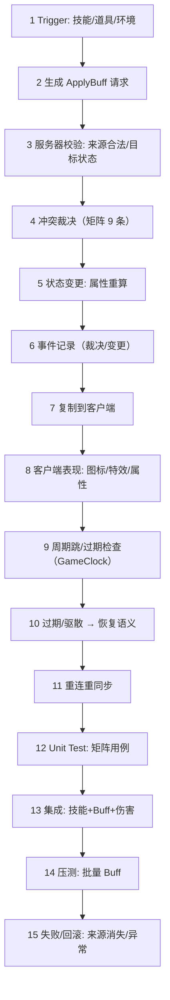

# 04-Buff系统完整链路

> 知识基线：Buff 从应用、叠加、冲突到驱散、过期的完整生命周期；冲突矩阵是正确性核心；服务端材料：[08-技能与战斗框架 §3.5 Buff 系统](08-技能与战斗框架.md)；客户端材料：GAS（[游戏知识/03-游戏玩法编程/01-GameplayAbilitySystem能力系统](01-GameplayAbilitySystem能力系统.md)）。
> 版本与核对范围：2026-10-04 核对 Epic 公开页面标注的 UE 5.8 Gameplay Effects 生命周期/Stacking/Components 与 UGameplayEffect 的时长刷新、周期重置和抑制恢复策略字段；仅作引擎概念接口参考，未读取或认证任何私有 UE changelist，也未执行 UE/GAS。
> 适用范围：Buff 端到端设计、冲突语义评审，以及独立 C++17 单目标最小模型的状态合同；生产时钟、属性、网络与恢复仍是集成设计。
> 官方参考：[Gameplay Effects](https://dev.epicgames.com/documentation/unreal-engine/gameplay-effects-for-the-gameplay-ability-system-in-unreal-engine?lang=en-US)、[UGameplayEffect API](https://dev.epicgames.com/documentation/unreal-engine/API/Plugins/GameplayAbilities/UGameplayEffect?lang=en-US)。
> 最后更新：2026-10-04；首版 2026-08-13。
> 知识成熟度：L2（按全文主要承诺重新标定：完整链路仍以源码/公开资料核对与设计推导为主，不能由一个局部测试的最高等级代表全文）。第 6 节单列实际运行的 Buff 状态合同与未覆盖项；`verified: []` 不因本地通过而自动生成审核事件。

## 1. 概述

Buff 是"看起来简单、错起来隐蔽"的系统：伤害加成、减速、眩晕、持续治疗、护盾叠加……每个 Buff 都要回答**叠加还是刷新、冲突怎么裁决、过期怎么恢复**。语义错误不报错，只在数值上"差一点"——所以必须用**冲突矩阵**把它变成可测试的规格。

本文把 Buff 从应用到失效的完整链路串起来，并给出 9 条核心冲突语义：

```text
same buff refresh（同 Buff 刷新） | stack（叠加） | replace（替换）
| exclusive group（互斥组） | high-level covers low-level（高级覆盖低级）
| high-level expires → low-level resumes（高级过期后低级恢复）
| remove/dispel（移除/驱散） | source changes（来源变化）
| periodic re-apply（周期性重挂）
```

链路回答五个问题：

1. 谁拥有权威状态？——服务器（Buff 实例、时长、层数、来源）；
2. 数据从哪里来？——技能/道具/环境 → ApplyBuff → 状态变更 → 复制 → 表现；
3. 失败时怎么办？——冲突裁决、来源消失、驱散、过期恢复；
4. 如何证明正确？——冲突矩阵用例 + 时长确定性测试；
5. 如何证明够用？——Buff 结算 P99、批量 Buff 压测。

## 2. 链路类型与依赖模块

链路类型：**Gameplay Transaction（Template A）**——状态效果的事务型生命周期（应用/变更/移除）。这里先区分业务拒绝与提交：被拒绝的请求不改变可见状态；这不自动等于内存分配失败、进程崩溃或数据库事务的强原子性，最小模型未实现这些保证。

| 环节 | 依赖模块 | 仓库支撑 |
| --- | --- | --- |
| Buff 定义 | 数据驱动配置 | [08-技能与战斗框架 §3.5](08-技能与战斗框架.md) |
| 应用入口 | 技能/道具/环境 | [03-技能释放完整链路](03-技能释放完整链路.md) |
| 冲突裁决 | Buff 管理器 | 本文第 3 节（矩阵） |
| 属性影响 | 属性系统 | [08-技能与战斗框架 §3.6.1](08-技能与战斗框架.md) |
| 时长/周期 | GameClock | [12-世界时间确定性与GameClock](../../07-网络与游戏服务端/运行调度与过载保护/12-世界时间确定性与GameClock.md) |
| 同步/表现 | Replication/GAS | [02-RPC与属性同步](../../07-网络与游戏服务端/状态复制与兴趣管理/02-RPC与属性同步.md)、[01-GameplayAbilitySystem能力系统](01-GameplayAbilitySystem能力系统.md) |
| 测试 | 冲突矩阵用例 | [游戏测试与质量](../../../00_Index/学习路线/工程实践与质量.md)（03 确定性测试） |
## 3. 冲突矩阵（正确性核心）

### 3.1 先把“存在”和“生效”分开

为什么刷新时长会造成双倍加成？旧代码在同 ID 重挂时把 `suppressed` 直接置为 false；低级 120 → 高级 121 → 再次 120，存活表虽仍只有两项，却让两项同时有效。另一处循环只看第一个同组条目：低 → 中 → 高后，中和高都有效；低 → 高 → 中则可能绕过后面的高。只修一条刷新赋值不能解决整组裁决。

本模型采用两层集合：**存活集合**包括尚未到期的 Active 和 Suppressed；**有效集合**只含每个非空组的最高等级幸存者。同级不同 ID 的替换消除并列，因此每组恰有一个有效者。刷新、来源重绑定和叠层可以改变存活数据，不能独自授予生效资格。`Apply`、`PeriodicReapply`、`Tick`、`Dispel` 在返回前都维持这一不变量，外部观察者不必等下一帧来“修好”它。

### 3.2 九类问题与已选合同

这些是明确选定的教学模型政策，并非所有游戏或 GAS 的默认行为。右栏保留生产设计要问的问题，不能用左栏单测代替集成验收。

| # | 最小模型的可执行合同 | 生产扩展需要另外固定 |
| --- | --- | --- |
| R1 刷新 | 一个 `BuffSystem` 隐含一个目标；同定义 ID 是同一逻辑条目，普通 Apply 刷新为完整 duration；不可叠者始终 1 层 | Refresh/Extend/None 的具体配置；按来源还是按目标聚合 |
| R2 叠加 | 普通 Apply 对已有可叠 ID 加 1 层，封顶仍刷新时间并重绑定 source；受压也可加层但继续受压 | 独立层计时、溢出效果、上限时拒绝还是刷新 |
| R3 替换 | 无更高级幸存者时，同组同级不同 ID 替换，旧条目删除，新条目 1 层/完整时长/新来源 | 多槽、平级优先级、真正的 BuffInstanceId |
| R4 方向性排除 | 成功普通 Apply 才执行 `excludesGroups` 的整组删除；旧者被删除，不等待恢复 | 对称配置或持续互斥约束；不可擅自把有向施加事件当永久无向图 |
| R5 强弱裁决 | 新 ID 若组内存在更高级则拒绝；已有低级 ID 仍可刷新。新高级压制所有已存低级 | 别的游戏可允许新低级排队，本模型未选此政策 |
| R6 恢复 | 所有存活计时继续消耗；到期删除后，最高幸存者恢复，过期条目永不复活 | 冻结计时是另一合法政策，需重写时间轴与用例 |
| R7 驱散 | 按 school 删除全部匹配者，包含被压制者；返回前恢复各组最高幸存者 | 数量限制、优先级、施加序、来源消失联动 |
| R8 来源变化 | 同 ID 来自新 source 时重绑定同一条目，保留已有层数再按普通叠层规则处理 | 来源死亡/下线后的保留、终止或转换；当前没有来源生命周期接口 |
| R9 周期重挂 | 已存 child 的 `PeriodicReapply` 仅刷新时间/source，不加层、不重复一次性跨组排除；缺失 child 第一次走完整 Apply | 真正周期调度、每跳伤害/治疗、追补/丢跳、抑制解除时重置周期 |

合法输入前提：定义 ID 唯一，定义在施加前注册且存活期间不变，`maxStacks >= 1`，duration 有限，调用串行；duration ≤0 返回 `expired-on-apply`，未知 ID 返回 `unknown-buff`，均无状态变化。`Tick(dt)` 要求有限且非负，内部没有为负数/NaN/Inf、重复注册、热更做配置校验。排除的合法配置前提是 `excludesGroups` 不含自身 group；这里没有新增自排除的校验或玩法政策，自排除和更广的规则图不据此获得生产保证。本例没有永久/瞬时效果体系，也未实现容量策略或分配异常强保证。

### 3.3 接纳、提交与全组仲裁

```text
普通 Apply(id, source)
→ 查定义/时长；失败立即返回
→ 若同 ID 尚未存活，扫描整个组；存在更高级则拒绝
→ 接纳后才执行定义配置的一次性跨组删除
→ 重新查同 ID：刷新/加层；或替换同级不同 ID；或插入新条目
→ 全组重算：每组最高幸存者有效，其余受压
→ 返回裁决结果；生产系统再按约定发布属性变化与事件
```

这里特意区分两项 **2026-10-04 行为变更**：D4 把旧“即使拒绝也先删除别组”改为拒绝无排除副作用；D5 把驱散后的恢复从下一次 Tick 提前到 Dispel 返回前。这是本模型选定的观察边界；其他项目若选择“净化后尝试添加”或帧末统一恢复，也可以成立，但必须说明中间状态能否被读取并另行测试。

例如新低级 301 排除 group31，而 group30 已有高级 302：拒绝 301 时 group31 的 303 必须原样保留。反过来，已经存在且受压的低级 601 再次普通 Apply 仍属接纳，所以它配置的一次性跨组删除会执行，601 自身仍受压。已有 601 的周期刷新则不重复删除，这是 D7 的事件区别。

**历史影响存储，不影响最高赢家合同。** 三层 1/2/3 的六个排列，最终都只有 3 生效，但存活集分别可能为 `{1,2,3}`、`{1,3}`、`{2,3}` 或 `{3}`：先出现高级时，后来的全新低级被拒绝。确定性指同一初态、事件序列与政策得到同一结果，不等于不同施加顺序必须有相同存储集。

### 3.4 时间轴与实例身份

选定继续计时后的具体时间轴：t=0 施加低级 12 秒；Tick(2) 后低级余 10 秒；施加高级 6 秒；Tick(6.5) 后高级删除，低级余 **3.5 秒**恢复。低级在受压时自己的剩余时间已耗尽，就直接过期；同时剩 6 秒时 Tick(6) 两者都删除。若受压低级中途被刷新，高级结束时使用刷新后的实际剩余值，不重启一个完整 duration。

`Tick(6.5)` 与 `Tick(3)` + `Tick(3.5)` 的该例终态一致，只说明无周期效果的计时状态；不证明期间每跳伤害积分、事件顺序或跨机器浮点确定性。当前代码接收调用者传入的 `double dt`，并未连接 GameClock；生产应通过统一 [GameClock](../../07-网络与游戏服务端/运行调度与过载保护/12-世界时间确定性与GameClock.md) 固定暂停、倍速、时间量化及跨服迁移语义，不能直接把墙钟秒数混入世界时间。

生产实例模型仍需要比此小程序更丰富的身份与生命周期：

```cpp
struct BuffInstance {                 // 设计示意，不是本实验实现
    BuffInstanceId instanceId;         // 稳定实例/代次句柄，精确定向移除与回放
    BuffId         id;                 // 定义 ID
    EntityId       source, target;
    int32          stacks;
    WorldTime      endTime;            // 继续计时方案用世界时间结束点
    WorldTime      nextTick;
    int32          dispelPriority;
    BuffState      state;              // Active / Suppressed / PendingRemove
};
```

- Active/Suppressed 分离是“保留而不生效”的基础；PendingRemove 服务于生产批处理的发布边界
- 最小模型只有 id/stacks/remaining/sourceId/suppressed；目标隐含，没有稳定 instanceId、代次、事件历史或按来源多实例
- 同 ID 换 source 是同一逻辑条目续用；同级不同 ID 替换、真正删除后再 Apply 都是新生命周期
- 不能把逻辑续用理解为 C++ 地址稳定：vector 插入/删除会使观察指针失效；测试读取 value snapshot，不写内部标志修补状态
- BuffManager 按目标持有实例，批量操作需预算上限；来源死亡/下线如何影响实例必须由玩法定义

### 3.5 周期 Buff 的结算细节

“周期性调用一个刷新函数”和“拥有完整周期调度器”是两件事。旧 R9 只用不可叠 child，无法发现可叠 child 被悄悄加层：2 层的 101 调一次旧 PeriodicReapply 会变 3 层，却返回 `refreshed-no-extra-stack`。新合同用可叠、不可叠、封顶及受压 child 分别检查；2 层刷新后仍是 2 层，只更新时间与来源。

生产调度的设计流程仍应明确：

```text
每 Tick：遍历应执行的周期 Buff（固定 nextTick 顺序和同刻 tie-break）
→ 到期：结算一跳（伤害/治疗/属性）→ 更新 nextTick
→ 期间被抑制/驱散：按政策跳过、暂停或终止
→ 解除抑制：按政策决定是否重置周期、立即执行或继续原时间轴
→ 超预算：明确追补、分帧或丢弃，不把策略藏在循环里
```

周期跳数与时刻应由 GameClock 统一，每跳效果走审计事件；单 Tick 可设预算（例如评估 1000 跳只是压测输入，不是本例已测容量），参见[运行时间预算](../../07-网络与游戏服务端/运行调度与过载保护/11-AI与寻路时间预算.md)。本模型的 `periodicChild` 只是元数据，`Tick` 不读取它、不自动产生 child、不结算伤害/治疗，不能由 R9 宣称调度已经实现。

## 4. 完整数据流（15 步）



以上 15 步是端到端集成路线；本地最小模型只覆盖其中冲突裁决与局部状态生命周期，未实现事件、复制或故障恢复。各步要点：

- **3 校验**：来源（施法者仍存活？）、目标（是否可被施加）、次数限制；
- **5 状态变更**：属性增量（伤害/移速）统一走属性系统，重算顺序固定；
- **6 事件记录**：Buff 实例 ID + 裁决结果，回放与测试断言的数据源；
- **10 恢复语义**：覆盖解除后最高幸存者恢复（R6）；来源死亡按配置决定保留/终止/转换，不能默认一律终止（R8 的生产扩展）；
- **11 重连**：服务器下发 Buff 列表（ID/类型/剩余时长/层数），客户端重建表现。

### 4.1 重连与跨服恢复细节

```text
重连：服务器下发 Buff 快照（实例列表）→ 客户端重建图标/特效
跨服：剩余时长按世界时间差换算（迁移 Ticket 携带）
恢复（崩溃）：Buff 属于"可重建状态"还是"必须恢复"？
  - 玩家长时 Buff（增益/惩罚）→ 随玩家快照恢复
  - 战斗临时 Buff → 不恢复（世界重建后重新施加）
```

判定原则：**影响资产/数值平衡的 Buff 恢复，纯战斗表现的 Buff 丢弃**——与 [13-世界Snapshot与故障恢复](../../07-网络与游戏服务端/世界权威与故障恢复/13-世界Snapshot与故障恢复.md) 的"必须恢复 vs 可重建"分类一致。

### 4.2 结算事件示例

```text
事件：buff.apply    (buffId, target, source, stacks=1, remainMs, tickIndex)
事件：buff.stack    (buffId, target, stacks=2, remainMs, tickIndex)
事件：buff.suppress (buffId, target, by=highBuffId, remainMs, tickIndex)
事件：buff.resume   (buffId, target, remainMs, tickIndex)
事件：buff.expire   (buffId, target, totalStacks, tickIndex)
事件：buff.dispel   (buffId, target, source, dispelPriority, tickIndex)
```

这些是建议的事件字段；精确定向还要包含稳定 instanceId/代次与事件序号。生产可逐条断言并用于审计回放；本地模型只返回裁决字符串，没有发出这套事件，因此现有测试不证明事件流完整或可恢复。

## 5. 验证矩阵

| 验证项 | 方法与关键断言 | 本次证据边界 |
| --- | --- | --- |
| 刷新/来源/叠层 | 检查完整 id/source/stacks/remaining/suppressed；低级刷新不能获得高层资格 | 本地合同已运行 |
| 组内强弱 | 三层六排列，分别断言各历史的存活集及唯一最高有效者 | 已运行；不要求排列间存储相同 |
| 同级替换 | 旧 ID 消失，新 ID 1 层/新来源/完整时间；更高者存在时拒绝新低级替换 | 已运行 |
| 过期与恢复 | 三层自然 Apply 到达状态；顶层过期恢复中层再恢复底层；受压者自行到期不复活 | 已运行 |
| 驱散 | 按 school 精确计数，包括 suppressed；不同 school 的最高幸存者在返回前生效 | 已运行；优先级/数量限制未实现 |
| 跨组排除 | 被拒候选不删别组；成功普通刷新重做排除；已有周期刷新不重做；缺失 child 首次全 Apply | 已运行；不是持续对称互斥图 |
| 周期重挂 | 可叠 child 2 层刷新仍 2 层；上限、来源、受压和首次插入 | 已运行；调度/追补/每跳效果未实现 |
| 时长 | 精确边界、跨越边界、Tick(0)、指定分帧终态 | 已运行；暂停/减速/GameClock 集成未运行 |
| 来源死亡 | 死亡/下线注入，验证来源依赖策略 | 设计待验收 |
| 网络/重连 | 丢包/重连，服务器实例列表与客户端重建一致 | 设计待验收 |
| 迁移 | 世界时间差换算并验证量化误差（如约定 ±1 Tick） | 设计待验收 |
| 崩溃恢复 | 玩家长时效果快照、战斗临时效果的重建策略 | 设计待验收 |
| 性能 | 按真实定义数/活跃数/事件比例量出裁决、属性与周期结算 P99，再对预算判断 | 本批无新 Buff 性能基准或生产容量结论 |

### 5.1 从单点矩阵到状态轨迹

用例 = `(前置状态, 事件序列, 每个关键观察点的期望状态)`，例如：

```text
低级400：level1、20s、Curse；中级401：level2、10s、Curse；高级402：level3、4s、Magic
Apply400 → Apply401 → Apply402：{400(S,20),401(S,10),402(A,4)}
Tick4：{400(S,16),401(A,6)}，有效集合只含401
Tick6：{400(A,10)}，再Tick10后为空
另一支：三者施加后Tick1，再Dispel(Magic)
返回即为{400(S,19),401(A,9)}，不等待Tick0修复
```

S/A 是抑制/有效状态；期望时间、来源与层数用独立字面值写出。单看 `GroupCount==1` 不够：它可能选错赢家，也可能把被压制者删没了。测试同时核完整存活表、有效 ID 集合、公开查询一致性和独立最高等级不变量；再用测试专属 `100 + Σ(有效 potency × stacks)` 投影作可读反证。例如低120的 potency10、高121的20，合法只高生效为120；旧双有效为130。这里的 potency 只是测试夹具，**没有调用 GAS 或仓库属性计算器**。

33 场景、323 条检查是本次覆盖清单，不是充分性定理；不同模式重复执行也不增加独立业务场景。普通 `assert` 在 NDEBUG 下可消失，因此这里使用显式失败计数、明确 FAIL 行及非零退出。负控要修改真正模型逻辑并让字面值 oracle 失败，编译失败、超时或崩溃都不能当作“抓住了语义缺陷”。

## 6. Benchmark 与 Evidence

### 6.1 来源分层与历史反例

公开一手资料只支撑引擎概念：Epic 的 [Gameplay Effects](https://dev.epicgames.com/documentation/unreal-engine/gameplay-effects-for-the-gameplay-ability-system-in-unreal-engine?lang=en-US) 区分定义资产、运行期 Spec、Duration 和 Stacking；[UGameplayEffect](https://dev.epicgames.com/documentation/unreal-engine/API/Plugins/GameplayAbilities/UGameplayEffect?lang=en-US) 分别暴露时长刷新、周期重置、抑制解除的策略。2026-10-04 核对公开页的 UE 5.8 标识；这不证明本模型等价于某个项目引擎分支，也不是私有 CL 或运行期行为认证。

旧 [results/buff_conflict.txt](../../../evidence/tests/gameplay-core/results/buff_conflict.txt) 保留 2026-09-11 批次的历史 `pass=12 fail=0`。这 12 个场景本身仍有用，但没有覆盖同 ID 受压刷新、三层全组裁决、可叠 child 的周期刷新等组合。基线源码 SHA256 `fa07b0162b6d0f077f31c017ccca7bbe6b622d86cfa41af11926f3a3c9938505` 的直接轨迹已经能反证这些更强承诺，不能把旧绿灯当成整套矩阵正确。

| 旧局部检查遗漏 | 可观察反例 | 当前教学合同 |
| --- | --- | --- |
| 刷新只查时间 | 120→121→120 令低高双有效 | 存活更新不改变组内资格 |
| 只处理首个同组元素 | 低→中→高遗漏中层；低→高→中绕过高层 | 全组接纳与全组赢家 |
| 周期只测不可叠 child | 101 原2层，周期调用后错误3层 | 现有周期事件只刷新 |
| 恢复依 vector 遍历顺序 | 顶层消失后可能先恢复最弱者 | 最高幸存者恢复 |
| 排除先于拒绝、驱散不重算 | 被拒低级仍删别组；驱散后读取有效集合短暂为空 | D4/D5 明确选定的新政策，非普适游戏定律 |

### 6.2 当前可复现实验

- 实现：[buff_conflict.cpp](../../../evidence/tests/gameplay-core/src/buff_conflict.cpp)；独立合同：[buff_contract.cpp](../../../evidence/tests/gameplay-core/tests/buff_contract.cpp)；入口：[run_buff_contract.py](../../../evidence/tests/gameplay-core/scripts/run_buff_contract.py)
- 环境：2026-10-04 Linux x86_64，g++-14 14.2.0，C++17；严格 `-Wall -Wextra -Werror -pedantic`，分别 O0+NDEBUG、O2、UBSan。每种模式原12场景通过、合同33场景/323检查零失败
- 8 个真实源码负控分别重引入刷新解除压制、只处理首个低级、周期加层、首幸存者恢复、驱散延迟恢复、拒绝仍排除、受压冻结计时、周期重复排除；均编译成功，目标场景明确 FAIL 且返回1。它们只证明测试可识别这些已知错误
- Python `-O` 下入口保护夹具已运行，检查空/缺失/重复/畸形报告、native失败、编译失败遗留可执行文件、超时、日志写失败、旧输出及路径别名拒绝、原始字节保全。原始证据、源码及只读捕获 helper 的 SHA256 见[本次记录](../../../evidence/tests/gameplay-core/results/buff_contract_20261004.txt)

从仓库根运行，先选两个从未存在过的仓库外目录（父目录需已存在）：

```bash
python3 -B evidence/tests/gameplay-core/scripts/run_buff_contract.py --output-dir /tmp/buff-contract-UNIQUE --cxx g++-14 --mode all --negative-controls
python3 -B -O evidence/tests/gameplay-core/scripts/run_buff_contract.py --output-dir /tmp/buff-driver-UNIQUE --self-test
```

`--mode` 可单选 `o0-ndebug|o2|ubsan`；默认 `all`，真实负控默认启用。`--self-test` 只跑隔离的假编译器/程序及受控进程夹具，不触发其它 gameplay 模型。`--timeout-seconds` 默认30，有限且范围 `(0,600]`；输出目录存在、指向仓库或别名落入仓库都拒绝，绝不覆盖历史 raw。

runner 只读导入 Inventory 已有通用 `run/fresh_output/write_new/format_record/child_environment` 等捕获函数，不执行其 Inventory suite。stdout/stderr 的 base64、字节数和 SHA256 才是权威记录，文本是可读转义展示。超时按原 POSIX 进程组清理，采用有限 regular-file 快照，不等待后代 pipe EOF；已经逃逸的后代不保证被终止或完整捕获，快照也不是与并发写者原子一致。夹具真实验证同组终止和短寿命逃逸边界，不能由此宣称通用进程沙箱。

### 6.3 局部结果不替代整条链路

[atomic-memory-order](../../../evidence/labs/atomic-memory-order/README.md) 是并发基础材料，[tick-scheduler](../../../evidence/server/tick-scheduler/README.md) 是时间预算材料；它们没有调用本 Buff 模型，不能作为 Buff 属性并发、周期调度或容量测量证据。GameClock 章节也是设计依赖，不代表这里已经对齐暂停、倍速或迁移时钟。

本次未运行 Windows/MSVC、UE/GAS、真实网络、生产服务器/数据库、来源死亡/驱散优先级、事件重放、真实属性集成、分配失败强异常安全或新的 CPU benchmark。UBSan 无诊断只覆盖所跑输入，不能推广为全输入安全；本地入口通过也不是远端 CI 已通过或生产已上线。完整15步仍需各自集成与故障注入证据。

## 7. 最佳实践

1. **冲突语义进矩阵，不进代码注释**：每条语义有编号、有用例。
2. **裁决确定性**：顺序固定 + 事件日志，回放与对账可依赖。
3. **生产时长统一 GameClock**：明确暂停/减速/迁移映射；本地 dt 模型不能代替时钟集成验收。
4. **来源与所有权**：Buff 记录施法者 ID，来源死亡/下线按语义处理（矩阵 #8）。
5. **属性重算统一入口**：所有 Buff 的数值影响走属性系统，禁止直接改数值。
6. **批量操作有上限**：单 Tick 可施加/移除的 Buff 数有预算（关联 [11-AI与寻路时间预算](../../07-网络与游戏服务端/运行调度与过载保护/11-AI与寻路时间预算.md) 的预算方法论）。
7. **客户端只表现**：Buff 图标/时长/层数以服务器复制为准，客户端不自行裁决。
8. **测试即规格**：冲突矩阵用例挂在 CI，任何语义变更先改用例。
9. **实例模型显式**：生产 Active/Suppressed/PendingRemove 与稳定实例句柄进合同；不要把本地定义 ID 或 vector 地址当实例句柄。
10. **周期结算预算化**：每 Tick 跳数上限 + 分帧，防战斗密集区尖峰。
11. **迁移换算统一**：剩余时长按世界时间差换算，单一实现（复用 GameClock）。
12. **重连快照化**：Buff 列表作为玩家快照的一部分，重连/迁移统一出口。
13. **恢复分类明确**：长时 Buff 恢复、战斗 Buff 重建——分类写进定义配置。
14. **用例即规格**：矩阵用例挂 CI，语义变更先改用例（见 5.1）。
15. **事件语义完整**：apply/stack/refresh/suppress/resume/expire/dispel 按发布边界进日志（见 4.2），同刻事件要有确定顺序。

## 8. 常见问题

**Q1：刷新和叠加怎么区分？**
生产可用 `stackPolicy`（None/Stack）与 `refreshPolicy`（Refresh/Extend/None）分开表达。本模型按隐含目标+定义 ID 聚合，不按 source 分实例；普通 Apply 可加层且刷新，已有 PeriodicReapply 只刷新。身份键和事件类型必须先写清，不能只说“同 Buff”。

**Q2：高级覆盖低级时低级 Buff 还在计时吗？**
两种都可设计。本模型明确继续计时，恢复时也可能已经过期，见 3.4 时间轴。若玩法改为冻结，要更新时钟和恢复用例，不能继续引用当前运行结果为它背书。

**Q3：驱散按什么顺序移除？**
生产必须选择先负面、优先级或施加序等政策，并固定同优先级 tie-break。本模型只有按 school 全部删除，不实现优先级与数量限制；返回前重算最高幸存者。

**Q4：施法者死亡后持续性 Buff（中毒）怎么办？**
生产可将中毒定义为来源无关而保留，将治疗链定义为来源依赖而终止；具体规则写进定义和生命周期事件。R8 小程序只验证同 ID 重绑定 source，未模拟施法者死亡。

**Q5：重连后 Buff 表现怎么重建？**
服务器下发 Buff 列表（类型/剩余时长/层数），客户端按表现模板重建图标与特效；不依赖断线期间的事件流。

**Q6：Buff 结算 P99 超标怎么查？**
插桩拆环节：冲突裁决、属性重算、事件记录各占多少（关联 [笔记/插桩测试](../../08-工程实践与质量/调试与性能分析/插桩测试.md)）；批量场景重点查属性重算。

**Q7：GAS 的 GameplayEffect 和自研 Buff 怎么对应？**
GE 可承载 Buff/Debuff，但 Duration、Stacking、Modifiers 和周期策略的具体组合要逐项映射；本模型的 higher-wins 与 D4–D7 不是 GAS 等价实现。客户端用 GAS、逻辑服自研时，以约定的服务器合同为权威，再对版本、预测、复制和移除时点做集成对照。

**Q8：层数上限的数值谁定？**
策划配置（Buff 定义里 `maxStacks`）；服务器只执行上限，不解释数值。叠层到上限时"刷新剩余时长"还是"拒绝新层"由 `stackPolicy` 配置决定。

**Q9：驱散是"随机驱散 1 个"还是"按优先级"？**
这是玩法政策。优先级方案需固定 tie-break；随机方案若固定候选集合顺序、随机源/种子或记录抽样结果，也可测试和回放。本例二者都未实现，不能由 school 全删推导随机驱散不可行。

**Q10：Buff 属性加成怎么叠加（加法/乘法）？**
属性系统定义加成类型（flat/percent/独立乘区），Buff 只提供数值与类型；叠加规则在属性系统统一实现，不在 Buff 里散落判断（关联 [08-技能与战斗框架 §3.6.1](08-技能与战斗框架.md)）。

**Q11：大量同类型 Buff（如 50 个玩家互相上减速）性能会怎样？**
属性重算按"变更批次"合并（同一 Tick 多次变更合并重算一次）；周期跳分帧；同时用"实例上限 + 每 Tick 结算预算"兜底（关联 [11](../../07-网络与游戏服务端/运行调度与过载保护/11-AI与寻路时间预算.md) 的预算方法论）。

**Q12：Buff 事件日志要记录什么？**
基本字段包括（BuffId, 目标, 来源, 操作类型, 层数, 剩余时长, tickIndex），操作类型含 apply/stack/refresh/suppress/resume/expire/dispel。日志可服务审计与事件重放；稳定 instanceId/代次、事件序号及重复事件处理还需明确。快照重连不必依赖断线期间完整事件流；故障恢复采用快照还是快照加日志，是另外的协议合同，这组简短字段本身不构成完整恢复协议。

**Q13：Buff 和 Debuff 的驱散优先级谁高？**
按配置的 dispelPriority 字段排序（常见：负面高优先被驱散）；"先驱散哪个负面"也按此排序 + 施加顺序——排序规则进矩阵用例，不靠直觉。

**Q14：Buff 实例数量有上限吗？**
生产宜配置单实体上限与全局周期跳预算；例如 32 个只是待评估配置。超限可拒绝或按已声明优先级挤出，必须写清对关键效果的影响。本模型未设容量上限，也未测这一容量。

## 9. 术语速查

| 术语 | 含义 |
| --- | --- |
| BuffInstance | 生产运行期实例；定义 ID 与稳定实例/代次身份应区分，本模型仅按定义 ID 聚合 |
| Suppressed | 仍在存活集合但不在有效集合；本模型计时继续 |
| on-apply 排除 | 接纳普通施加时的一次性方向删除；已有周期刷新不重复执行 |
| 冲突矩阵 | 九条刷新/叠加/替换/驱散语义的确定性裁决表 |
| nextTick | 周期 Buff 下一跳时刻（由 GameClock 决定） |
| 结算事件 | 每跳伤害/治疗的审计事件（可重放） |

## 10. 关联阅读

- [03-技能释放完整链路](03-技能释放完整链路.md)：Buff 的应用入口。
- [游戏服务端/03-业务系统设计/08-技能与战斗框架](08-技能与战斗框架.md)（§3.5）：服务端 Buff 实现。
- [游戏知识/03-游戏玩法编程/01-GameplayAbilitySystem能力系统](01-GameplayAbilitySystem能力系统.md)：GAS 客户端侧。
- [12-世界时间确定性与GameClock](../../07-网络与游戏服务端/运行调度与过载保护/12-世界时间确定性与GameClock.md)：时长语义。
- [游戏测试与质量/03-服务端测试与机器人压测](../../08-工程实践与质量/测试策略与自动化/03-服务端测试与机器人压测.md)：确定性测试方法。
- [07-假人AI完整链路](../../06-游戏AI/战斗战术与机器人/07-假人AI完整链路.md)：同为系统实战链路模板。
- [游戏服务端/06-世界模拟与运行时/13-世界Snapshot与故障恢复](../../07-网络与游戏服务端/世界权威与故障恢复/13-世界Snapshot与故障恢复.md)：Buff 状态的恢复分类。
- [游戏测试与质量/01-测试金字塔与测试策略](../../08-工程实践与质量/测试策略与自动化/01-测试金字塔与测试策略.md)：矩阵用例的分层归属。
- [游戏服务端/03-业务系统设计/06-战斗结算与验证](06-战斗结算与验证.md)：属性结算的最终出口。
- [游戏知识/06-网络同步/02-RPC与属性同步](../../07-网络与游戏服务端/状态复制与兴趣管理/02-RPC与属性同步.md)：Buff 复制通道。
- [游戏服务端/06-世界模拟与运行时/14-运行时背压与过载保护](../../07-网络与游戏服务端/运行调度与过载保护/14-运行时背压与过载保护.md)：批量 Buff 的过载兜底。
- [游戏知识/03-游戏玩法编程/03-GameplayTag与数据资产](../玩法架构与任务协作/03-GameplayTag与数据资产.md)：Buff 标签体系。
- [游戏服务端/06-世界模拟与运行时/03-Entity生命周期与组件模型](../../07-网络与游戏服务端/世界权威与故障恢复/03-Entity生命周期与组件模型.md)：Buff 实例的实体归属。
- [游戏知识/06-网络同步/05-ReplicationGraph兴趣管理](../../07-网络与游戏服务端/状态复制与兴趣管理/05-ReplicationGraph兴趣管理.md)：Buff 复制的兴趣裁剪。
- [游戏知识/06-网络同步/03-客户端预测与延迟补偿](../../07-网络与游戏服务端/同步预测与回放/03-客户端预测与延迟补偿.md)：Buff 预测边界。
