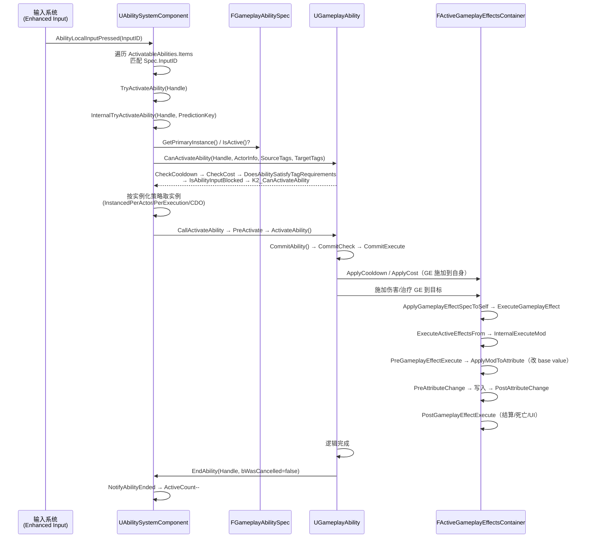
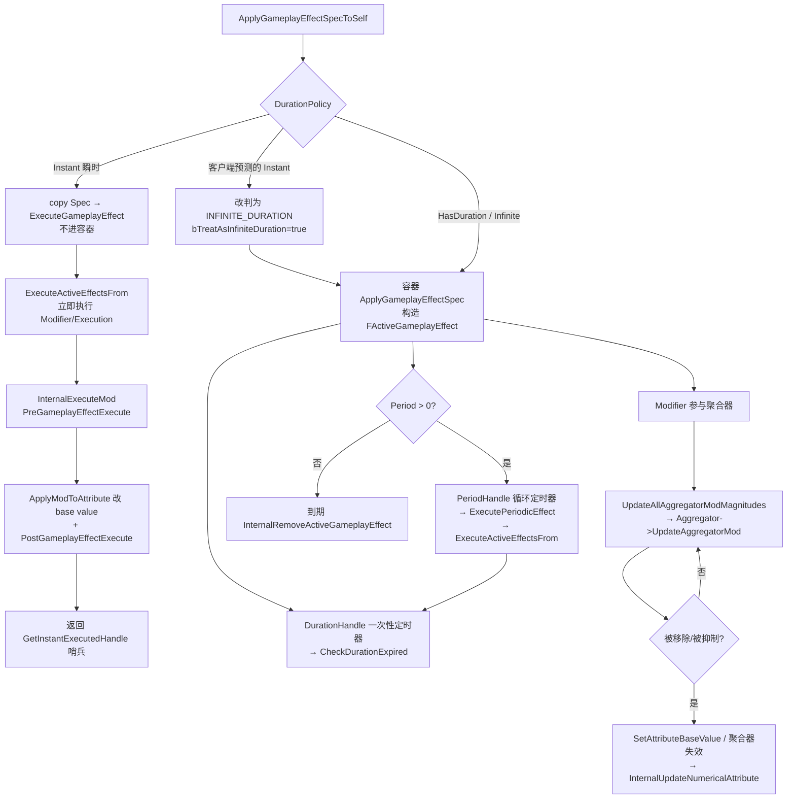

# UE 引擎源码分析 05：GAS 能力系统源码剖析
> 知识成熟度：L2（本轮审计修订时补标）。
> 源码基线：UE 5.8.2（证据源为本机源码 checkout `C:\Users\zhaozhiqi\Documents\GitHub\UnrealEngine`；`Engine/Build/Build.version`：Major 5 / Minor 8 / Patch 2 / `CompatibleChangelist` 55116800 / `BranchName` `UE5`；Git 分支 `release`，HEAD `16d75d84714512edfb744e1fd0a59e9c74d57873`，tag `5.8.2-release`。注意该 checkout 的 `Changelist` 字段为 `0`，与安装版 5.8.0 一样只提供 `CompatibleChangelist`）。
> 行号口径：本文所有行号均以该 5.8.2 checkout 为准；Epic 安装版 UE 5.8.0（CL 55116800）与被引文件可能相差数行，按行号定位时请以同名的函数/成员名为准。
> 验收边界：本文所有 `cpp` 代码块都由脚本按 `文件 + 行区间` 机械抽取（剥除行尾空白，保留原始缩进与英文注释），不做手打、不做"等价重写"；单块取自函数的子区间时，块内首行标注省略的真实行区间与行数。作者自写的示意块一律显式标注「作者示例（非引擎源码）」，`mermaid` 图标注「作者绘制」。
> 官方参考：[Unreal Engine 官方文档总页](https://dev.epicgames.com/documentation/en-us/unreal-engine)。

> 本文对应知识库《03-游戏玩法编程/01-GameplayAbilitySystem能力系统.md》（应用层的技能、Buff、伤害公式、Tag 架构讲解），本篇从引擎源码角度拆解 GAS 的四条核心链路：
>
> 1. **激活链**：输入/调用 → `TryActivateAbility` → `InternalTryActivateAbility` → `UGameplayAbility::CallActivateAbility` → `ActivateAbility`；
> 2. **效果链**：`FGameplayEffectSpec` → `FActiveGameplayEffect` → `ExecuteActiveEffectsFrom` → `InternalExecuteMod` → 属性写入；
> 3. **回调链**：`PreGameplayEffectExecute` → `ApplyModToAttribute` / `SetAttributeBaseValue` → `PreAttributeChange` → `PostGameplayEffectExecute` / `PostAttributeChange` → `FGameplayAttributeData` 数值落盘；
> 4. **预测链**：`FPredictionKey` → `FScopedPredictionWindow` → `ScopedPredictionKey` → `FPredictionKeyDelegates` 的 CaughtUp/Rejected 回滚。

---

## 元数据

- **版本基准**：UE 5.8.2（源码 checkout `C:\Users\zhaozhiqi\Documents\GitHub\UnrealEngine`；`Engine/Build/Build.version`：Major 5 / Minor 8 / Patch 2 / `CompatibleChangelist` 55116800 / `BranchName` `UE5`；Git 分支 `release`，HEAD `16d75d84714512edfb744e1fd0a59e9c74d57873`，tag `5.8.2-release`）。安装版 UE 5.8.0 的同一文件只给出 `CL 55116800` 与分支 `++UE5+Release-5.8`。
- **适用范围**：GAS 引擎源码层深读——技能激活链路、GameplayEffect 执行链、属性回调链、预测键与 AbilityTask/GameplayTask 边界；资产配置与业务用法见 03-游戏玩法编程/01。
- **行号口径**：全文行号以该 5.8.2 checkout 为准；Epic 安装版 UE 5.8.0（CL 55116800）与被引文件可能相差数行，按行号定位时请以同名的函数/成员名为准。
- **验收边界**：本文所有 `cpp` 代码块都由脚本按 `文件 + 行区间` 机械抽取（剥除行尾空白，保留原始缩进与英文注释），不做手打、不做"等价重写"；节选块在块内首行标注省略的真实行区间与行数，脚本输出与文章逐行比对为完全一致（76/76 块逐字相等；2026-09-15 续写新增 10 块后重新核验）。作者自写的示意块一律显式标注「作者示例（非引擎源码）」，`mermaid` 图标注「作者绘制」。
- **源码依据**（全部以该 5.8.2 checkout 逐行核验；逐块对照表见第十五节 15.2）：
  - `Engine\Plugins\Runtime\GameplayAbilities\Source\GameplayAbilities\Private\AbilitySystemComponent_Abilities.cpp`（`GiveAbility` 第 292~331 行、`CreateNewInstanceOfAbility` 第 1196~1223 行、`NotifyAbilityEnded` 第 1225~1275 行、`TryActivateAbility` 第 1604~1683 行、`IsAbilityInputBlocked` 第 1685~1695 行、`InternalTryActivateAbility` 第 1704~1994 行、`AbilityLocalInputPressed` 第 2793~2844 行、`AbilityLocalInputReleased` 第 2846~2873 行、`ServerSetInputPressed/Released` 第 2885~2902 行、`CallServerTryActivateAbility` 第 4254~4277 行）
  - `Engine\Plugins\Runtime\GameplayAbilities\Source\GameplayAbilities\Private\AbilitySystemComponent.cpp`（`ApplyGameplayEffectSpecToSelf` 第 996~1179 行、周期效果禁预测闸门第 1021~1034 行、`ExecutePeriodicEffect` 第 1203~1206 行、`ExecuteGameplayEffect` 第 1208~1231 行、`CheckDurationExpired` 第 1233~1236 行、`SetBlockedAbilityBindings` / `GetBlockedAbilityBindings` 第 3463~3477 行）
  - `Engine\Plugins\Runtime\GameplayAbilities\Source\GameplayAbilities\Private\Abilities\GameplayAbility.cpp`（`CanActivateAbility` 第 457~576 行、`CommitAbility` 第 592~609 行、`CommitAbilityCooldown` 第 611~629 行、`CommitAbilityCost` 第 631~646 行、`CommitCheck` 第 648~682 行、`CommitExecute` 第 684~689 行、`IsEndAbilityValid` 第 771~800 行、`EndAbility` 第 802~902 行、`ActivateAbility` 第 904~938 行、`PreActivate` 第 940~1018 行、`CallActivateAbility` 第 1020~1024 行、`CheckCooldown` 第 1064~1104 行、`ApplyCooldown` 第 1106~1113 行、`CheckCost` 第 1115~1136 行、`ApplyCost` 第 1138~1145 行、`ApplyGameplayEffectSpecToTarget` 第 2131~2151 行）
  - `Engine\Plugins\Runtime\GameplayAbilities\Source\GameplayAbilities\Private\Abilities\GameplayAbility_CharacterJump.cpp`（`ActivateAbility` 第 21~34 行、`CanActivateAbility` 第 44~53 行）
  - `Engine\Plugins\Runtime\GameplayAbilities\Source\GameplayAbilities\Private\Abilities\Tasks\AbilityTask.cpp`（`UAbilityTask::OnDestroy` 第 114~142 行）、`...\Private\Abilities\Tasks\AbilityTask_WaitGameplayEvent.cpp`（第 17~102 行）
  - `Engine\Plugins\Runtime\GameplayAbilities\Source\GameplayAbilities\Private\GameplayAbilitySpecHandle.cpp`（`GenerateNewHandle` 第 9~14 行）、`...\Private\GameplayAbilityTypes.cpp`（`GetPrimaryInstance` / `ShouldReplicateAbilitySpec` 第 207~231 行、`FGameplayAbilitySpec` 三个构造函数第 316~355 行）
  - `Engine\Plugins\Runtime\GameplayAbilities\Source\GameplayAbilities\Private\GameplayEffect.cpp`（时长常量第 47~54 行、`ExecuteActiveEffectsFrom` 第 3210~3370 行、`UpdateAllAggregatorModMagnitudes` / `UpdateAggregatorModMagnitudes` 第 3623~3673 行、`InternalUpdateNumericalAttribute` 第 3945~3984 行、`InternalExecuteMod` 第 4090~4153 行、`ApplyModToAttribute` 第 4155~4169 行、`ApplyGameplayEffectSpec` 第 4171~4563 行（含时长/周期定时器注册第 4480~4508 行）、`InternalExecutePeriodicGameplayEffect` 第 4762~4794 行、`CheckDuration` 第 5369~5398 行）
  - `Engine\Plugins\Runtime\GameplayAbilities\Source\GameplayAbilities\Private\GameplayPrediction.cpp`（`GenerateNewPredictionKey` 第 189~197 行、`CreateNewPredictionKey` / `CreateNewServerInitiatedKey` 第 223~252 行、`FScopedPredictionWindow` 第 387~406 行）、`...\Private\GameplayCueManager.cpp`（第 322~330 行）、`...\Private\AttributeSet.cpp`（`FGameplayAttribute::SetNumericValueChecked` 第 72~117 行）
  - `Engine\Plugins\Runtime\GameplayAbilities\Source\GameplayAbilities\Public\AbilitySystemComponent.h`（Cue 接口第 887~898 行）、`...\Public\Abilities\GameplayAbility.h`（输入虚函数第 373~376 行、`ActivateAbility` 声明第 574 行）、`...\Public\Abilities\Tasks\AbilityTask.h`（第 89~95 行）
  - `Engine\Plugins\Runtime\GameplayAbilities\Source\GameplayAbilities\Public\AttributeSet.h`（`FGameplayAttributeData` 第 19~54 行、三对属性回调第 196~234 行）、`...\Public\GameplayAbilitySpec.h`（`FGameplayAbilityActivationInfo` 第 113~161 行、`FGameplayAbilitySpec` 第 167~297 行）
  - `Engine\Plugins\Runtime\GameplayAbilities\Source\GameplayAbilities\Public\GameplayEffect.h`（`FGameplayEffectSpec` 第 1013~1291 行、`FActiveGameplayEffect` 第 1354~1464 行、`GameplayEffects_Internal` 第 1909~1916 行）、`...\Public\GameplayEffectExtension.h`（`FGameplayEffectModCallbackData` 第 17~30 行）、`...\Public\GameplayEffectTypes.h`（`FGameplayModifierEvaluatedData` 第 192~233 行、`FGameplayCueParameters` 第 839~933 行）、`...\Public\GameplayCueManager.h`（`ShouldSyncLoadMissingGameplayCues` / `ShouldAsyncLoadMissingGameplayCues` 第 380~384 行）、`...\Public\GameplayPrediction.h`（`FPredictionKey` 第 294~414 行、`FScopedPredictionWindow` 第 479~504 行）
  - `Engine\Source\Runtime\GameplayTasks\Classes\GameplayTask.h`（第 145~300 行）、`Engine\Source\Runtime\GameplayTasks\Private\GameplayTask.cpp`（`UGameplayTask::Activate` 第 298~303 行）
- **官方参考**：[Unreal Engine 官方文档总页](https://dev.epicgames.com/documentation/en-us/unreal-engine)。
- **最后更新**：2026-09-15（补深：把全文引擎代码块改为按 5.8.2 checkout 行区间机械逐字抽取的 66 块，替换 17 处自称摘自源码实为中文改写/顺序错误/分流写错的示意块，新增 3.4 节与第十三~十六节，并逐块给出引用句、省略行区间与覆盖率核验方法；同日续写：修正 9 处「引用行号与块首行不符」的位置敏感缺陷（`MISMATCH 0`），新增 9.3 节（三种时长的源码分流点）与 16.4 节（补验 16.3 的四条未核实点），引擎代码块增至 76 块、受检 1568 行全部逐字命中）。

---

## 一、概述

| 项目 | 内容 |
| --- | --- |
| 对应知识点 | 03-游戏玩法编程/01-GameplayAbilitySystem能力系统 |
| 涉及模块 | GameplayAbilities（引擎插件）、GameplayTasks（引擎 Runtime 模块）、GameplayTags |
| 核心类 | UAbilitySystemComponent、UGameplayAbility、UGameplayEffect、UAttributeSet |
| 核心结构 | FGameplayAbilitySpec、FGameplayEffectSpec、FActiveGameplayEffect、FGameplayAttributeData、FPredictionKey |
| 阅读主线 | 激活一条线（Ability）、生效一条线（Effect）、数值一条线（Attribute）、预测一条线（Prediction） |

GAS 是 UE 中最复杂的玩法系统之一，但它的**骨架**并不复杂：`UAbilitySystemComponent`（简称 ASC）是挂在 Pawn/Character 上的"能力中枢"，持有能力列表（`FGameplayAbilitySpecContainer ActivatableAbilities`）和生效效果列表（`FActiveGameplayEffectsContainer ActiveGameplayEffects`）；`UGameplayAbility` 描述"能做什么"，`UGameplayEffect` 描述"造成什么改变"，`UAttributeSet` 描述"角色有什么数值"。

`Samples\Games\Lyra` 里 `ULyraAbilitySystemComponent`、`ULyraGameplayAbility`、`ULyraAttributeSet` 都是这三个基类的直系子类，因此本文的引擎侧结论可直接迁移到 Lyra 项目层阅读（见本文第十二节关联阅读）。

## 二、源码定位

以下路径均相对源码 checkout 根目录（即 `Engine/` 与 `Samples/` 同级的目录），GameplayAbilities 位于 Plugins 下：

| 文件路径 | 作用 |
| --- | --- |
| `Engine/Plugins/Runtime/GameplayAbilities/Source/GameplayAbilities/Public/AbilitySystemComponent.h` | ASC 声明：激活接口、Spec 管理、Effect 容器、输入绑定、Cue 接口 |
| `Engine/Plugins/Runtime/GameplayAbilities/Source/GameplayAbilities/Private/AbilitySystemComponent.cpp` | ASC 基础实现（GE 施加、属性读写、容器、调试等） |
| `Engine/Plugins/Runtime/GameplayAbilities/Source/GameplayAbilities/Private/AbilitySystemComponent_Abilities.cpp` | 激活流程（TryActivateAbility / InternalTryActivateAbility 等）、GiveAbility、输入处理、网络预测实现（5.8 拆分的子文件） |
| `Engine/Plugins/Runtime/GameplayAbilities/Source/GameplayAbilities/Public/GameplayAbilitySpec.h` | `FGameplayAbilitySpec` / `FGameplayAbilityActivationInfo` / `FGameplayAbilitySpecContainer` 定义 |
| `Engine/Plugins/Runtime/GameplayAbilities/Source/GameplayAbilities/Public/GameplayAbilitySpecHandle.h` | `FGameplayAbilitySpecHandle`（全局递增 int32 句柄） |
| `Engine/Plugins/Runtime/GameplayAbilities/Source/GameplayAbilities/Public/Abilities/GameplayAbility.h` | UGameplayAbility 声明：ActivateAbility / CommitAbility / EndAbility / 实例化策略（5.8 位于 Abilities 子目录） |
| `Engine/Plugins/Runtime/GameplayAbilities/Source/GameplayAbilities/Public/Abilities/GameplayAbilityTypes.h` | `EGameplayAbilityInstancingPolicy` / `EGameplayAbilityNetExecutionPolicy` 等枚举 |
| `Engine/Plugins/Runtime/GameplayAbilities/Source/GameplayAbilities/Private/Abilities/GameplayAbility.cpp` | 能力生命周期实现、GE 的创建与施加（2371 行） |
| `Engine/Plugins/Runtime/GameplayAbilities/Source/GameplayAbilities/Public/GameplayEffect.h` | UGameplayEffect 定义、FGameplayEffectSpec、FActiveGameplayEffect、FActiveGameplayEffectsContainer |
| `Engine/Plugins/Runtime/GameplayAbilities/Source/GameplayAbilities/Private/GameplayEffect.cpp` | 效果实例化、容器执行、Modifier 计算（6528 行；本文引用 47~54、3210~3260、3372~3382、3623~3673、3945~3984、4090~4153、4155~4169、4171~4191、4310~4380、4480~4508、4762~4794、5369~5398） |
| `Engine/Plugins/Runtime/GameplayAbilities/Source/GameplayAbilities/Public/AttributeSet.h` | UAttributeSet、FGameplayAttribute、FGameplayAttributeData；**三个属性回调的默认实现就在本头文件内**（类内内联空函数） |
| `Engine/Plugins/Runtime/GameplayAbilities/Source/GameplayAbilities/Private/AttributeSet.cpp` | `FGameplayAttributeData`/`FGameplayAttribute` 的取值与写入、`GetAllAttributeProperties` 等辅助实现（**不含** `PreAttributeChange`/`PostGameplayEffectExecute` 的定义） |
| `Engine/Plugins/Runtime/GameplayAbilities/Source/GameplayAbilities/Public/GameplayEffectTypes.h` | `FGameplayEffectContext`、`FGameplayCueParameters`、`FGameplayModifierEvaluatedData` |
| `Engine/Plugins/Runtime/GameplayAbilities/Source/GameplayAbilities/Public/GameplayEffectExtension.h` | 仅剩 `FGameplayEffectModCallbackData`（文件头自述为 legacy cruft） |
| `Engine/Plugins/Runtime/GameplayAbilities/Source/GameplayAbilities/Public/GameplayPrediction.h` | `FPredictionKey`、`FPredictionKeyDelegates`、`FScopedPredictionWindow` |
| `Engine/Plugins/Runtime/GameplayAbilities/Source/GameplayAbilities/Private/GameplayPrediction.cpp` | 预测键生成与 CaughtUp/Rejected 广播实现 |
| `Engine/Plugins/Runtime/GameplayAbilities/Source/GameplayAbilities/Public/GameplayCueManager.h` | GameplayCue 的加载与分发管理 |
| `Engine/Plugins/Runtime/GameplayAbilities/Source/GameplayAbilities/Private/GameplayCueManager.cpp` | Cue 运行时查找与通知实现 |
| `Engine/Plugins/Runtime/GameplayAbilities/Source/GameplayAbilities/Public/Abilities/Tasks/AbilityTask.h` | `UAbilityTask : public UGameplayTask` 声明 |
| `Engine/Plugins/Runtime/GameplayAbilities/Source/GameplayAbilities/Private/Abilities/Tasks/AbilityTask.cpp` | AbilityTask 计数、销毁、调试记录实现 |
| `Engine/Source/Runtime/GameplayTasks/Classes/GameplayTask.h` | `UGameplayTask` 基类：`Activate` / `TickTask` / `EndTask` / `OnDestroy` |

> 说明：源码版本以 UE 5.8.2 checkout 为准；与 UE 4.26 相比 API 名称变化较大（本文给出真实替身），与 5.0~5.5 相比主要差异是 `NonInstanced` 弃用、`EGameplayEffectComponent` 模块化改造、`FGameplayAbilitySpec` 的 `ActivationInfo`/`DynamicAbilityTags` 弃用。

## 三、激活主链路：TryActivateAbility → InternalTryActivateAbility → ActivateAbility

### 3.1 入口：TryActivateAbility

技能激活的最常见入口是 ASC 的 `TryActivateAbility`，蓝图节点 "Try Activate Ability by Handle"、输入绑定、GameplayEvent 触发最终都会汇聚到这里。

摘自 `Engine/Plugins/Runtime/GameplayAbilities/Source/GameplayAbilities/Private/AbilitySystemComponent_Abilities.cpp`（第 1604 行起，`UAbilitySystemComponent::TryActivateAbility` 全函数，第 1604~1683 行，未节选）：

```cpp
bool UAbilitySystemComponent::TryActivateAbility(FGameplayAbilitySpecHandle AbilityToActivate, bool bAllowRemoteActivation)
{
	FGameplayTagContainer FailureTags;
	FGameplayAbilitySpec* Spec = FindAbilitySpecFromHandle(AbilityToActivate);
	if (!Spec)
	{
		ABILITY_LOG(Warning, TEXT("TryActivateAbility called with invalid Handle"));
		return false;
	}

	// don't activate abilities that are waiting to be removed
	if (Spec->PendingRemove || Spec->RemoveAfterActivation)
	{
		return false;
	}

	UGameplayAbility* Ability = Spec->Ability;

	if (!Ability)
	{
		ABILITY_LOG(Warning, TEXT("TryActivateAbility called with invalid Ability"));
		return false;
	}

	const FGameplayAbilityActorInfo* ActorInfo = AbilityActorInfo.Get();

	// make sure the ActorInfo and then Actor on that FGameplayAbilityActorInfo are valid, if not bail out.
	if (ActorInfo == nullptr || !ActorInfo->OwnerActor.IsValid() || !ActorInfo->AvatarActor.IsValid())
	{
		return false;
	}


	const ENetRole NetMode = ActorInfo->AvatarActor->GetLocalRole();

	// This should only come from button presses/local instigation (AI, etc).
	if (NetMode == ROLE_SimulatedProxy)
	{
		return false;
	}

	bool bIsLocal = AbilityActorInfo->IsLocallyControlled();

	// Check to see if this a local only or server only ability, if so either remotely execute or fail
	if (!bIsLocal && (Ability->GetNetExecutionPolicy() == EGameplayAbilityNetExecutionPolicy::LocalOnly || Ability->GetNetExecutionPolicy() == EGameplayAbilityNetExecutionPolicy::LocalPredicted))
	{
		if (bAllowRemoteActivation)
		{
			ClientTryActivateAbility(AbilityToActivate);
			return true;
		}

		ABILITY_LOG(Log, TEXT("Can't activate LocalOnly or LocalPredicted ability %s when not local."), *Ability->GetName());
		return false;
	}

	if (NetMode != ROLE_Authority && (Ability->GetNetExecutionPolicy() == EGameplayAbilityNetExecutionPolicy::ServerOnly || Ability->GetNetExecutionPolicy() == EGameplayAbilityNetExecutionPolicy::ServerInitiated))
	{
		if (bAllowRemoteActivation)
		{
			FScopedCanActivateAbilityLogEnabler LogEnabler;
			if (Ability->CanActivateAbility(AbilityToActivate, ActorInfo, nullptr, nullptr, &FailureTags))
			{
				// No prediction key, server will assign a server-generated key
				CallServerTryActivateAbility(AbilityToActivate, Spec->InputPressed, FPredictionKey());
				return true;
			}
			else
			{
				NotifyAbilityFailed(AbilityToActivate, Ability, FailureTags);
				return false;
			}
		}

		ABILITY_LOG(Log, TEXT("Can't activate ServerOnly or ServerInitiated ability %s when not the server."), *Ability->GetName());
		return false;
	}

	return InternalTryActivateAbility(AbilityToActivate);
}
```

**在做什么**：这是一个"薄"入口——它只做三件事：查 Spec 与基础有效性、按网络角色分流、把真正的工作交给 `InternalTryActivateAbility`。

**关键判断为什么这样写**：

1. 第 1606 行的 `FGameplayTagContainer FailureTags;` 是**本函数局部**的失败原因容器，只在第 1660~1680 行的 ServerOnly/ServerInitiated 分支里被 `CanActivateAbility` 填充并交给 `NotifyAbilityFailed`。走 LocalOnly/LocalPredicted 分支（第 1648 行）与最终 `InternalTryActivateAbility` 分支（第 1682 行）时它都不参与——后者用的是 ASC 自己的 `InternalTryActivateAbilityFailureTags` 成员。
2. 第 1615 行的 `Spec->PendingRemove || Spec->RemoveAfterActivation` 是"等待移除的技能不再激活"的闸门。`PendingRemove` 由 `ABILITYLIST_SCOPE_LOCK` 期间延迟移除置位（见 `FGameplayAbilitySpec` 第 225~227 行），`RemoveAfterActivation` 对应 `RemoveAbilityOnEnd` 语义。放在最前面是因为一旦这类 Spec 进入激活链，后面的 `EndAbility` 收尾会与移除路径竞争。
3. 第 1628~1634 行连续校验 `ActorInfo`、`OwnerActor`、`AvatarActor` 三者——这是 GAS 中最容易被忽略却最常触发的失败路径：角色死亡/换 Pawn 的瞬间 `AvatarActor` 会短暂失效。
4. 第 1637 行取的是 `ActorInfo->AvatarActor->GetLocalRole()`（注意不是 `AbilityActorInfo` 所在 ASC 的 `GetOwnerRole()`），第 1640 行据此拒绝 `ROLE_SimulatedProxy`。**SimulatedProxy 上的 ASC 只负责接收复制，不应该发起激活**。
5. 第 1648 行的条件是 `!bIsLocal &&（LocalOnly || LocalPredicted）`：非本地控制端调用"本地限定"能力时，只有在 `bAllowRemoteActivation` 为真时才转成 `ClientTryActivateAbility` RPC 发给拥有者客户端，并且**立刻 `return true`**——注意这个 `true` 表示"RPC 已发出"，不代表技能已经成功激活。
6. 第 1660~1680 行是 5.8 里**原文完全遗漏的第四个分支**：非 Authority 端调用 `ServerOnly`/`ServerInitiated` 能力时，先在本地跑一次 `CanActivateAbility` 做"廉价预检"（用 `FScopedCanActivateAbilityLogEnabler` 打开日志），通过则 `CallServerTryActivateAbility(AbilityToActivate, Spec->InputPressed, FPredictionKey())`——**传入的是空预测键**，注释明确写着 "No prediction key, server will assign a server-generated key"。不通过则 `NotifyAbilityFailed(AbilityToActivate, Ability, FailureTags)` 并返回 false。
7. 第 1682 行的 `InternalTryActivateAbility(AbilityToActivate)` 只传了第一个参数，其余四个参数走默认值（`InPredictionKey = FPredictionKey()`、`OutInstancedAbility = nullptr`、`OnGameplayAbilityEndedDelegate = nullptr`、`TriggerEventData = nullptr`）。

**与相邻阶段如何衔接**：上行由 `AbilityLocalInputPressed`（第 2839 行）、`TryActivateAbilitiesByTag`（第 1596 行附近）、GameplayEvent 触发点调用；下行分三路——本地/Authority 走 `InternalTryActivateAbility`，非本地 + LocalOnly/LocalPredicted 走 `ClientTryActivateAbility`，非 Authority + ServerOnly/ServerInitiated 走 `CallServerTryActivateAbility`。

**容易误解的点**：

- `FGameplayAbilitySpecHandle` 在 5.8 中就是一个**全局递增的 `int32`**，不是 4.26 时代被误传的 `FPrimaryAssetId`。签发实现见下块：

摘自 `Engine/Plugins/Runtime/GameplayAbilities/Source/GameplayAbilities/Private/GameplayAbilitySpecHandle.cpp`（第 9 行起，`FGameplayAbilitySpecHandle::GenerateNewHandle` 全函数，第 9~14 行，未节选）：

```cpp
void FGameplayAbilitySpecHandle::GenerateNewHandle()
{
	// Must be in C++ to avoid duplicate statics accross execution units
	static int32 GHandle = 1;
	Handle = GHandle++;
}
```

  `static int32 GHandle = 1;` 是函数内静态变量，注释解释了为什么必须放在 .cpp 里："Must be in C++ to avoid duplicate statics accross execution units"（跨编译单元的重复静态变量）。
- 旧版用于"预测期防重触发"的 `GetPredictingAbilitySpec` 在 5.8 已不存在（检索范围：整个 `Engine/Plugins/Runtime/GameplayAbilities/Source/GameplayAbilities` 模块，大小写敏感检索 `GetPredictingAbilitySpec` 无命中）。当前防重触发由 `InternalTryActivateAbility` 里的 `Spec->IsActive()` + `bRetriggerInstancedAbility` 承担，见 3.2。
- `bAllowRemoteActivation` 的默认值是 `true`（见 `AbilitySystemComponent.h` 声明），所以"客户端能远程激活服务端技能"是默认行为，不是特例。

### 3.2 核心调度：InternalTryActivateAbility

`InternalTryActivateAbility` 是激活逻辑真正的"总闸"。它以 291 行的体量完成了：句柄校验 → 能力列表加锁 → 网络角色判定 → 网络策略闸门 → 事件响应判定 → `CanActivateAbility` → 实例化重触发判定 → 预测键建立 → 实例化分发 → `CallActivateAbility`。下面按真实行序分五段逐段解构。

**第 1 段：签名、句柄校验与能力列表加锁（第 1704~1751 行）**

摘自 `Engine/Plugins/Runtime/GameplayAbilities/Source/GameplayAbilities/Private/AbilitySystemComponent_Abilities.cpp`（第 1704 行起）：

```cpp
	// …（节选：省略第 1752~1994 行，共 243 行）
bool UAbilitySystemComponent::InternalTryActivateAbility(FGameplayAbilitySpecHandle Handle, FPredictionKey InPredictionKey, UGameplayAbility** OutInstancedAbility, FOnGameplayAbilityEnded::FDelegate* OnGameplayAbilityEndedDelegate, const FGameplayEventData* TriggerEventData)
{
	const FGameplayTag& NetworkFailTag = UAbilitySystemGlobals::Get().ActivateFailNetworkingTag;

	InternalTryActivateAbilityFailureTags.Reset();

	if (Handle.IsValid() == false)
	{
		ABILITY_LOG(Warning, TEXT("InternalTryActivateAbility called with invalid Handle! ASC: %s. AvatarActor: %s"), *GetPathName(), *GetNameSafe(GetAvatarActor_Direct()));
		return false;
	}

	FGameplayAbilitySpec* Spec = FindAbilitySpecFromHandle(Handle);
	if (!Spec)
	{
		ABILITY_LOG(Warning, TEXT("InternalTryActivateAbility called with a valid handle but no matching ability was found. Handle: %s ASC: %s. AvatarActor: %s"), *Handle.ToString(), *GetPathName(), *GetNameSafe(GetAvatarActor_Direct()));
		return false;
	}

	// Lock ability list so our Spec doesn't get destroyed while activating
	ABILITYLIST_SCOPE_LOCK();

	const FGameplayAbilityActorInfo* ActorInfo = AbilityActorInfo.Get();

	// make sure the ActorInfo and then Actor on that FGameplayAbilityActorInfo are valid, if not bail out.
	if (ActorInfo == nullptr || !ActorInfo->OwnerActor.IsValid() || !ActorInfo->AvatarActor.IsValid())
	{
		return false;
	}

	// This should only come from button presses/local instigation (AI, etc)
	ENetRole NetMode = ROLE_SimulatedProxy;

	// Use PC netmode if its there
	if (APlayerController* PC = ActorInfo->PlayerController.Get())
	{
		NetMode = PC->GetLocalRole();
	}
	// Fallback to avataractor otherwise. Edge case: avatar "dies" and becomes torn off and ROLE_Authority. We don't want to use this case (use PC role instead).
	else if (AActor* LocalAvatarActor = GetAvatarActor_Direct())
	{
		NetMode = LocalAvatarActor->GetLocalRole();
	}

	if (NetMode == ROLE_SimulatedProxy)
	{
		return false;
	}
```

- **在做什么**：清空 `InternalTryActivateAbilityFailureTags`（这是 ASC 的成员，与 3.1 里的局部 `FailureTags` 是两套东西）、校验 `Handle.IsValid()`、`FindAbilitySpecFromHandle`、`ABILITYLIST_SCOPE_LOCK()`、ActorInfo 校验、NetMode 判定、SimulatedProxy 拒绝。
- **为什么这样写**：第 1724 行的 `ABILITYLIST_SCOPE_LOCK()` 宏展开为 `FScopedAbilityListLock ActiveScopeLock(*this);`（定义在 `GameplayAbilitySpec.h` 第 351~360 行），它自增 `AbilityScopeLockCount`，使 `GiveAbility`/`RemoveAbility` 改走 pending 列表，从而保证本函数持有的 `Spec` 指针在激活期间不被销毁。注释写得很直白："Lock ability list so our Spec doesn't get destroyed while activating"。
- **容易误解的点**：第 1735~1746 行的 NetMode **优先取 PlayerController 的 LocalRole**，只有拿不到 PC 才回退到 `GetAvatarActor_Direct()->GetLocalRole()`。注释解释了原因："Edge case: avatar 'dies' and becomes torn off and ROLE_Authority. We don't want to use this case (use PC role instead)"——角色死亡后 Avatar 会变成 torn off 的 Authority 对象，直接读它会误判为本端授权。
- **与前一段的区别**：3.1 里 `TryActivateAbility` 用的是 `AvatarActor->GetLocalRole()`；这里改成了 PC 优先。两条路径的 NetMode 取值口径并不完全一致，这是 5.8 的实际状态。

**第 2 段：网络策略闸门与事件响应判定（第 1796~1859 行）**

摘自 `Engine/Plugins/Runtime/GameplayAbilities/Source/GameplayAbilities/Private/AbilitySystemComponent_Abilities.cpp`（第 1796 行起）：

```cpp
	// …（节选：省略第 1704~1795 行、第 1860~1994 行，共 227 行）
	// If it's an instanced one, the instanced ability will be set, otherwise it will be null
	UGameplayAbility* InstancedAbility = Spec->GetPrimaryInstance();
	UGameplayAbility* AbilitySource = InstancedAbility ? InstancedAbility : Ability;

	if (TriggerEventData)
	{
		if (!AbilitySource->ShouldAbilityRespondToEvent(ActorInfo, TriggerEventData))
		{
			UE_LOGF(LogAbilitySystem, Verbose, "%ls: Can't activate %ls because ShouldAbilityRespondToEvent was false.", *GetNameSafe(GetOwner()), *Ability->GetName());
			UE_VLOG(GetOwner(), VLogAbilitySystem, Verbose, TEXT("Can't activate %s because ShouldAbilityRespondToEvent was false."), *Ability->GetName());

			NotifyAbilityFailed(Handle, AbilitySource, InternalTryActivateAbilityFailureTags);
			return false;
		}
	}

	{
		const FGameplayTagContainer* SourceTags = TriggerEventData ? &TriggerEventData->InstigatorTags : nullptr;
		const FGameplayTagContainer* TargetTags = TriggerEventData ? &TriggerEventData->TargetTags : nullptr;

		FScopedCanActivateAbilityLogEnabler LogEnabler;
		if (!AbilitySource->CanActivateAbility(Handle, ActorInfo, SourceTags, TargetTags, &InternalTryActivateAbilityFailureTags))
		{
			// At least let the user know that the native CanActivateAbility rejected it
			if (InternalTryActivateAbilityFailureTags.IsEmpty())
			{
				InternalTryActivateAbilityFailureTags.AddTag(GetDefault<UGameplayAbilitiesDeveloperSettings>()->ActivateFailCanActivateAbilityTag);
			}

			// CanActivateAbility with LogEnabler will have UE_LOG/UE_VLOG so don't add more failure logs here
			NotifyAbilityFailed(Handle, AbilitySource, InternalTryActivateAbilityFailureTags);
			return false;
		}
	}

	// If we're InstancedPerActor and we're already active, don't let us activate again as this breaks the graph
	if (Ability->GetInstancingPolicy() == EGameplayAbilityInstancingPolicy::InstancedPerActor)
	{
		if (Spec->IsActive())
		{
			if (Ability->bRetriggerInstancedAbility && InstancedAbility)
			{
				UE_LOGF(LogAbilitySystem, Verbose, "%ls: Ending %ls prematurely to retrigger.", *GetNameSafe(GetOwner()), *Ability->GetName());
				UE_VLOG(GetOwner(), VLogAbilitySystem, Verbose, TEXT("Ending %s prematurely to retrigger."), *Ability->GetName());

				constexpr bool bReplicateEndAbility = true;
				constexpr bool bWasCancelled = false;
				const FGameplayAbilityActivationInfo& ActivationInfo = InstancedAbility->GetCurrentActivationInfoRef();
				InstancedAbility->EndAbility(Handle, ActorInfo, ActivationInfo, bReplicateEndAbility, bWasCancelled);
			}
			else
			{
				UE_LOGF(LogAbilitySystem, Verbose, "Can't activate instanced per actor ability %ls when their is already a currently active instance for this actor.", *Ability->GetName());
				return false;
			}
		}
	}

	// Make sure we have a primary
	if (Ability->GetInstancingPolicy() == EGameplayAbilityInstancingPolicy::InstancedPerActor && !InstancedAbility)
	{
		UE_LOGF(LogAbilitySystem, Warning, "InternalTryActivateAbility called but instanced ability is missing! NetMode: %d. Ability: %ls", (int32)NetMode, *Ability->GetName());
		return false;
	}
```

- **在做什么**：取 `InstancedAbility = Spec->GetPrimaryInstance()`，用它（存在时）作为 `AbilitySource`；事件触发时先过 `ShouldAbilityRespondToEvent`；然后调用 `CanActivateAbility(Handle, ActorInfo, SourceTags, TargetTags, &InternalTryActivateAbilityFailureTags)`；失败时若失败容器为空则补一个 `GetDefault<UGameplayAbilitiesDeveloperSettings>()->ActivateFailCanActivateAbilityTag`，再 `NotifyAbilityFailed`。
- **关键判断为什么这样写**：
  - 网络失败原因 Tag 来自 `UAbilitySystemGlobals::Get().ActivateFailNetworkingTag`（第 1706 行），两个网络闸门失败时都会 `InternalTryActivateAbilityFailureTags.AddTag(NetworkFailTag)`，**但只在 `NetworkFailTag.IsValid()` 时**——默认配置下这个 Tag 可能是空的，所以"失败但没有原因 Tag"是正常表现。
  - 第 1766 行对 `LocalPredicted` 额外加了 `&& !InPredictionKey.IsValidKey()`：注释说明 "If we have a valid prediction key, the ability was started on the local client so it's okay"。换句话说，服务端收到客户端带预测键的 `ServerTryActivateAbility` 时，即使 `bIsLocal` 为假也放行——这是 LocalPredicted 能跑通的关键。
  - `SourceTags`/`TargetTags` 只在有 `TriggerEventData` 时取自 `TriggerEventData->InstigatorTags` / `TriggerEventData->TargetTags`，否则传 `nullptr`。
- **与相邻阶段如何衔接**：`CanActivateAbility` 的失败 Tag 会被上层的 `OnAbilityFailed` 委托消费，蓝图 `WaitAbilityFailed` 类节点就是监听它。
- **容易误解的点（原文顺序写反了）**：真实代码里 `CanActivateAbility`（第 1817 行）**先于** `InstancedPerActor` 重触发判定（第 1832 行）执行。原文的示意块把重触发判定放在了 `CanActivateAbility` 之前，顺序与 5.8 不符；顺序有实际影响：冷却中/被阻塞的技能不会走到"先 EndAbility 再重触发"那条会打断正在运行实例的路径。
- 第 1836 行的成员名是 `bRetriggerInstancedAbility`（旧名 `bAllowRetrigger` 在 5.8 全模块 0 命中），且**只对 `InstancedPerActor` 生效**；`InstancedPerExecution` 不需要这个开关。第 1841~1842 行的 `constexpr bool bReplicateEndAbility = true; constexpr bool bWasCancelled = false;` 说明重触发走的是"正常结束"而非"取消"。
- 第 1855~1859 行是一道补充防线：`InstancedPerActor` 却拿不到主实例时直接报错返回——正常情况下 `GiveAbility` 已经建好实例（见第四节），走到这里说明能力列表状态被破坏了。

**第 3 段：ActivationInfo 与预测键建立（第 1861~1923 行）**

摘自 `Engine/Plugins/Runtime/GameplayAbilities/Source/GameplayAbilities/Private/AbilitySystemComponent_Abilities.cpp`（第 1861 行起）：

```cpp
	// …（节选：省略第 1704~1860 行、第 1924~1994 行，共 228 行）
PRAGMA_DISABLE_DEPRECATION_WARNINGS
	// We have deprecated NonInstanced and Spec.ActivationInfo but keep backwards compatibility
	const bool bNonInstanced = Ability->GetInstancingPolicy() == EGameplayAbilityInstancingPolicy::NonInstanced;
	FGameplayAbilityActivationInfo NewActivationInfo;
	FGameplayAbilityActivationInfo& ActivationInfo = bNonInstanced ? Spec->ActivationInfo : NewActivationInfo;
PRAGMA_ENABLE_DEPRECATION_WARNINGS

	// Setup a fresh ActivationInfo (possibly overwriting the Spec's ActivationInfo if non-instanced)
	ActivationInfo = FGameplayAbilityActivationInfo(ActorInfo->OwnerActor.Get());

	// If we are the server or this is local only
	if (Ability->GetNetExecutionPolicy() == EGameplayAbilityNetExecutionPolicy::LocalOnly || (NetMode == ROLE_Authority))
	{
		// if we're the server and don't have a valid key or this ability should be started on the server create a new activation key
		bool bCreateNewServerKey = NetMode == ROLE_Authority &&
			(!InPredictionKey.IsValidKey() ||
			 (Ability->GetNetExecutionPolicy() == EGameplayAbilityNetExecutionPolicy::ServerInitiated ||
			  Ability->GetNetExecutionPolicy() == EGameplayAbilityNetExecutionPolicy::ServerOnly));
		if (bCreateNewServerKey)
		{
			ActivationInfo.ServerSetActivationPredictionKey(FPredictionKey::CreateNewServerInitiatedKey(this));
		}
		else if (InPredictionKey.IsValidKey())
		{
			// Otherwise if available, set the prediction key to what was passed up
			ActivationInfo.ServerSetActivationPredictionKey(InPredictionKey);
		}

		// we may have changed the prediction key so we need to update the scoped key to match
		FScopedPredictionWindow ScopedPredictionWindow(this, ActivationInfo.GetActivationPredictionKey());

		// ----------------------------------------------
		// Tell the client that you activated it (if we're not local and not server only)
		// ----------------------------------------------
		if (!bIsLocal && Ability->GetNetExecutionPolicy() != EGameplayAbilityNetExecutionPolicy::ServerOnly)
		{
			if (TriggerEventData)
			{
				ClientActivateAbilitySucceedWithEventData(Handle, ActivationInfo.GetActivationPredictionKey(), *TriggerEventData);
			}
			else
			{
				ClientActivateAbilitySucceed(Handle, ActivationInfo.GetActivationPredictionKey());
			}

			// This will get copied into the instanced abilities
			ActivationInfo.bCanBeEndedByOtherInstance = Ability->bServerRespectsRemoteAbilityCancellation;
		}

		// ----------------------------------------------
		//	Call ActivateAbility (note this could end the ability too!)
		// ----------------------------------------------

		// Create instance of this ability if necessary
		if (Ability->GetInstancingPolicy() == EGameplayAbilityInstancingPolicy::InstancedPerExecution)
		{
			InstancedAbility = CreateNewInstanceOfAbility(*Spec, Ability);
			InstancedAbility->CallActivateAbility(Handle, ActorInfo, ActivationInfo, OnGameplayAbilityEndedDelegate, TriggerEventData);
		}
		else
		{
			AbilitySource->CallActivateAbility(Handle, ActorInfo, ActivationInfo, OnGameplayAbilityEndedDelegate, TriggerEventData);
		}
```

- **在做什么**：设定 `ActivationInfo`（`FGameplayAbilityActivationInfo(ActorInfo->OwnerActor.Get())`，构造时按 OwnerActor 的 LocalRole 决定 ActivationMode 是 `Authority` 还是 `NonAuthority`）；在 Authority 或 LocalOnly 分支里决定预测键：满足 `bCreateNewServerKey` 时用 `FPredictionKey::CreateNewServerInitiatedKey(this)` 新建服务端键，否则若 `InPredictionKey.IsValidKey()` 就沿用客户端键；随后用 `FScopedPredictionWindow(this, ActivationInfo.GetActivationPredictionKey())` 把该键挂成当前作用域预测键；非本地且非 ServerOnly 时通过 `ClientActivateAbilitySucceed(WithEventData)` 通知拥有者客户端，并把 `ActivationInfo.bCanBeEndedByOtherInstance = Ability->bServerRespectsRemoteAbilityCancellation`。
- **关键判断为什么这样写**：
  - `bCreateNewServerKey` 的三条件形式（第 1875~1878 行）值得逐字读：`NetMode == ROLE_Authority &&（!InPredictionKey.IsValidKey() || ServerInitiated || ServerOnly）`。也就是说 **ServerInitiated/ServerOnly 即使客户端给了预测键，服务端也会另起一个服务端键**——因为这两类策略本来就不允许客户端预测。
  - 第 1890 行的 `FScopedPredictionWindow` 用的是 `(ASC*, FPredictionKey, bool = true)` 这个重载（`GameplayPrediction.h` 第 485 行），它的实现只在 `IsNetSimulating() == false`（即非网络客户端）时生效，把 `ScopedPredictionKey` 换成本次激活的键，出作用域后还原。详见第十三节。
  - 第 1895 行的条件 `!bIsLocal && != ServerOnly` 决定了"是否要通知客户端开始预测"。ServerOnly 能力服务端跑完就完了，不需要通知。
  - 第 1907~1908 行把 `Ability->bServerRespectsRemoteAbilityCancellation` 拷进 `ActivationInfo`，这样客户端后续的 EndAbility RPC 才有权结束服务端实例。
- **与相邻阶段如何衔接**：第 1915~1923 行按实例化策略分发——`InstancedPerExecution` 先 `CreateNewInstanceOfAbility` 再在新实例上调 `CallActivateAbility`；其余（含 `NonInstanced`）直接在 `AbilitySource` 上调。`AbilitySource` 在 `NonInstanced` 时就是 CDO。
- **容易误解的点**：`NonInstanced` 的兼容路径（第 1861~1866 行被 `PRAGMA_DISABLE_DEPRECATION_WARNINGS` 包住）会把结果写回 `Spec->ActivationInfo` 而**不是**局部 `NewActivationInfo`。这是"弃用但保留向后兼容"的显式实现，注释原文："We have deprecated NonInstanced and Spec.ActivationInfo but keep backwards compatibility"。

**第 4 段：LocalPredicted 预测分支（第 1925~1967 行）**

摘自 `Engine/Plugins/Runtime/GameplayAbilities/Source/GameplayAbilities/Private/AbilitySystemComponent_Abilities.cpp`（第 1925 行起）：

```cpp
	// …（节选：省略第 1704~1924 行、第 1968~1994 行，共 248 行）
	else if (Ability->GetNetExecutionPolicy() == EGameplayAbilityNetExecutionPolicy::LocalPredicted)
	{
		PrePredictionActivation(Ability);

		// This execution is now officially EGameplayAbilityActivationMode:Predicting and has a PredictionKey
		FScopedPredictionWindow ScopedPredictionWindow(this, true);

		ActivationInfo.SetPredicting(ScopedPredictionKey);

		// This must be called immediately after GeneratePredictionKey to prevent problems with recursively activating abilities
		if (TriggerEventData)
		{
			ServerTryActivateAbilityWithEventData(Handle, Spec->InputPressed, ScopedPredictionKey, *TriggerEventData);
		}
		else
		{
			CallServerTryActivateAbility(Handle, Spec->InputPressed, ScopedPredictionKey);
		}

		// When this prediction key is caught up, we better know if the ability was confirmed or rejected
		ScopedPredictionKey.NewCaughtUpDelegate().BindUObject(this, &UAbilitySystemComponent::OnClientActivateAbilityCaughtUp, Handle, ScopedPredictionKey.Current);

		if (Ability->GetInstancingPolicy() == EGameplayAbilityInstancingPolicy::InstancedPerExecution)
		{
			// For now, only NonReplicated + InstancedPerExecution abilities can be Predictive.
			// We lack the code to predict spawning an instance of the execution and then merge/combine
			// with the server spawned version when it arrives.

			if (Ability->GetReplicationPolicy() == EGameplayAbilityReplicationPolicy::ReplicateNo)
			{
				InstancedAbility = CreateNewInstanceOfAbility(*Spec, Ability);
				InstancedAbility->CallActivateAbility(Handle, ActorInfo, ActivationInfo, OnGameplayAbilityEndedDelegate, TriggerEventData);
			}
			else
			{
				ABILITY_LOG(Error, TEXT("InternalTryActivateAbility called on ability %s that is InstancedPerExecution and Replicated. This is an invalid configuration."), *Ability->GetName() );
			}
		}
		else
		{
			AbilitySource->CallActivateAbility(Handle, ActorInfo, ActivationInfo, OnGameplayAbilityEndedDelegate, TriggerEventData);
		}
	}
```

- **在做什么**：客户端预测路径。先 `PrePredictionActivation(Ability)`（内部对 LocalPredicted 能力调 `UCharacterMovementComponent::FlushServerMoves()`，把激活前的移动 RPC 先冲出去，避免根运动/位移类技能引发网络修正），再用 `FScopedPredictionWindow(this, true)` 生成**依赖预测键**（`GenerateDependentPredictionKey`，见第十三节），`ActivationInfo.SetPredicting(ScopedPredictionKey)`，然后把 `ServerTryActivateAbility(WithEventData)` 发给服务器。
- **关键判断为什么这样写**：
  - 注释 "This must be called immediately after GeneratePredictionKey to prevent problems with recursively activating abilities" 解释了为什么 `SetPredicting` 与 RPC 紧挨着写——中间插入任何可能再次激活能力的代码都会打乱预测键链。
  - 第 1945 行用 `ScopedPredictionKey.NewCaughtUpDelegate().BindUObject(this, &UAbilitySystemComponent::OnClientActivateAbilityCaughtUp, Handle, ScopedPredictionKey.Current)` 注册"复制状态追上该键"时的回调，这是预测确认的落点。
  - 第 1947~1961 行是一个硬约束：`InstancedPerExecution` + 预测时**必须** `EGameplayAbilityReplicationPolicy::ReplicateNo`，否则 `ABILITY_LOG(Error, ...)`。源码注释给出了原因："We lack the code to predict spawning an instance of the execution and then merge/combine with the server spawned version when it arrives."——引擎没有实现"客户端预测出来的实例与服务端复制下来的实例合并"。
- **与相邻阶段如何衔接**：与第 3 段是**互斥分支**（`if (LocalOnly || ROLE_Authority) ... else if (LocalPredicted) ...`）。同一份代码在服务端走第 3 段、在预测客户端走第 4 段，两端通过 `ScopedPredictionKey` 对齐。

**第 5 段：收尾（第 1969~1994 行）**

摘自 `Engine/Plugins/Runtime/GameplayAbilities/Source/GameplayAbilities/Private/AbilitySystemComponent_Abilities.cpp`（第 1969 行起）：

```cpp
	// …（节选：省略第 1704~1968 行，共 265 行）
	if (InstancedAbility)
	{
		if (OutInstancedAbility)
		{
			*OutInstancedAbility = InstancedAbility;
		}

		// UGameplayAbility::PreActivate actually sets this internally (via SetCurrentInfo) which happens after replication (this is only set locally).  Let's cautiously remove this code.
		if (CVarAbilitySystemSetActivationInfoMultipleTimes.GetValueOnGameThread())
		{
			InstancedAbility->SetCurrentActivationInfo(ActivationInfo);	// Need to push this to the ability if it was instanced.
		}
	}

	MarkAbilitySpecDirty(*Spec);

	const UWorld* LocalWorld = GetWorld();
	if (ensureMsgf(LocalWorld, TEXT("%hs: Could not GetWorld during activation of %s"), __func__, *GetNameSafe(Ability)))
	{
		AbilityLastActivatedTime = LocalWorld->GetTimeSeconds();
	}

	UE_LOGF(LogAbilitySystem, Log, "%ls: Activated [%ls] %ls. Level: %d. PredictionKey: %ls.", *GetNameSafe(GetOwner()), *Spec->Handle.ToString(), *GetNameSafe(AbilitySource), Spec->Level, *ActivationInfo.GetActivationPredictionKey().ToString());
	UE_VLOG(GetOwner(), VLogAbilitySystem, Log, TEXT("Activated [%s] %s. Level: %d. PredictionKey: %s."), *Spec->Handle.ToString(), *GetNameSafe(AbilitySource), Spec->Level, *ActivationInfo.GetActivationPredictionKey().ToString());
	return true;
}
```

- `OutInstancedAbility` 只在 `InstancedAbility` 非空时回写；`MarkAbilitySpecDirty(*Spec)` 让 FastArraySerializer 把这次变更纳入复制（注意这里用的是 1 参重载，`GiveAbility` 里用的是 2 参 `MarkAbilitySpecDirty(OwnedSpec, true)`）。
- `AbilityLastActivatedTime = LocalWorld->GetTimeSeconds()` 用 `ensureMsgf` 包住 `GetWorld()`——注释说明它用于"防止同一帧重复激活"的调试/限流。
- 日志里同时打印 `Spec->Level` 与 `ActivationInfo.GetActivationPredictionKey().ToString()`，对应 `FPredictionKey::ToString` 的 `[%d/%d]`（Current/Base）或 `[Srv: %d]` 格式。
- **容易误解的点**：`InstancedAbility->SetCurrentActivationInfo(ActivationInfo)` 这段被 `CVarAbilitySystemSetActivationInfoMultipleTimes` 开关控制，且注释明说 "Let's cautiously remove this code"——默认路径下能力实例的激活信息是由 `PreActivate` → `SetCurrentInfo` 设置的，不在这里重复设置。

### 3.3 实例化策略与 CallActivateAbility

`EGameplayAbilityInstancingPolicy` 是理解 GAS 内存模型的关键枚举，真实定义在 `Engine/Plugins/Runtime/GameplayAbilities/Source/GameplayAbilities/Public/Abilities/GameplayAbilityTypes.h`（第 36~56 行）：

| 策略 | 枚举值 | 激活时发生了什么 | 适用场景 |
| --- | --- | --- | --- |
| NonInstanced | `EGameplayAbilityInstancingPolicy::NonInstanced` | 直接调用 CDO 的 `ActivateAbility`，**不能存成员变量**；枚举项被标注 `UE_DEPRECATED_FORGAME(5.5, "Use InstancedPerActor as the default to avoid confusing corner cases")` | 纯函数式、无状态技能（如引擎自带的 `UGameplayAbility_CharacterJump`） |
| InstancedPerActor | `EGameplayAbilityInstancingPolicy::InstancedPerActor` | ASC 在 `GiveAbility` 时为 Spec 缓存一个实例（`Spec->GetPrimaryInstance()`），每次激活复用；同一时刻最多一个激活 | 绝大多数带状态的技能（连击、蓄力、持续引导） |
| InstancedPerExecution | `EGameplayAbilityInstancingPolicy::InstancedPerExecution` | 每次激活都 `NewObject` 一个新实例；枚举注释写明 "Replication currently unsupported" | 需要每次激活独立状态的场景（并发多次激活同一技能） |

原文第 3.3 节这里的"实例化逻辑"示意图是**示意改写**，与 5.8 的真实代码结构不符（真实代码把 `CreateNewInstanceOfAbility` 与 `CallActivateAbility` 分开写，且没有 `else` 包裹）。**（2026-09-15：原示意块已替换为 5.8 源码逐字版）**

实例创建的落点在 `CreateNewInstanceOfAbility`。摘自 `Engine/Plugins/Runtime/GameplayAbilities/Source/GameplayAbilities/Private/AbilitySystemComponent_Abilities.cpp`（第 1196 行起，第 1196~1223 行，未节选）：

```cpp
UGameplayAbility* UAbilitySystemComponent::CreateNewInstanceOfAbility(FGameplayAbilitySpec& Spec, const UGameplayAbility* Ability)
{
	check(Ability);
	check(Ability->HasAllFlags(RF_ClassDefaultObject));

	AActor* Owner = GetOwner();
	check(Owner);

	UGameplayAbility * AbilityInstance = NewObject<UGameplayAbility>(Owner, Ability->GetClass());
	check(AbilityInstance);

#if UE_WITH_REMOTE_OBJECT_HANDLE
	UE_LOGF(LogAbilitySystem, Verbose, "%s: %ls (%ls)", __FUNCTION__, *GetNameSafe(AbilityInstance), *FRemoteObjectId(AbilityInstance).ToString());
#endif

	// Add it to one of our instance lists so that it doesn't GC.
	if (AbilityInstance->GetReplicationPolicy() != EGameplayAbilityReplicationPolicy::ReplicateNo)
	{
		Spec.ReplicatedInstances.Add(AbilityInstance);
		AddReplicatedInstancedAbility(AbilityInstance);
	}
	else
	{
		Spec.NonReplicatedInstances.Add(AbilityInstance);
	}

	return AbilityInstance;
}
```

- `check(Ability->HasAllFlags(RF_ClassDefaultObject))` 断言传进来的必须是 CDO，`NewObject<UGameplayAbility>(Owner, Ability->GetClass())` 的 Outer 是**拥有该 ASC 的 Actor**——这决定了实例的生命周期与外层 Actor 绑定。
- 实例按 `EGameplayAbilityReplicationPolicy` 分流到 `Spec.ReplicatedInstances` 或 `Spec.NonReplicatedInstances`，注释 "Add it to one of our instance lists so that it doesn't GC" 点明了放数组里的第二重作用：**防止被 GC**。
- 因此 `FGameplayAbilitySpec::GetPrimaryInstance()` 的实现顺序是"先 NonReplicatedInstances[0]，再 ReplicatedInstances[0]"（`GameplayAbilityTypes.cpp` 第 207~221 行），不是原文暗示的"Replicated 优先"。

`CallActivateAbility` 本身只有两行——它的价值在于把"激活前置"与"激活"分成两步。摘自 `Engine/Plugins/Runtime/GameplayAbilities/Source/GameplayAbilities/Private/Abilities/GameplayAbility.cpp`（第 1020 行起，第 1020~1024 行，未节选）：

```cpp
void UGameplayAbility::CallActivateAbility(const FGameplayAbilitySpecHandle Handle, const FGameplayAbilityActorInfo* ActorInfo, const FGameplayAbilityActivationInfo ActivationInfo, FOnGameplayAbilityEnded::FDelegate* OnGameplayAbilityEndedDelegate, const FGameplayEventData* TriggerEventData)
{
	PreActivate(Handle, ActorInfo, ActivationInfo, OnGameplayAbilityEndedDelegate, TriggerEventData);
	ActivateAbility(Handle, ActorInfo, ActivationInfo, TriggerEventData);
}
```

`PreActivate` 是 `Spec->ActiveCount` 的唯一自增点，也是"这一步做完才算激活中"的语义边界。摘自 `Engine/Plugins/Runtime/GameplayAbilities/Source/GameplayAbilities/Private/Abilities/GameplayAbility.cpp`（第 997 行起，节选其尾部；`PreActivate` 签名在第 940 行）：

```cpp
	// …（节选：省略第 1018 行，共 1 行）
	Comp->NotifyAbilityActivated(Handle, this);

	Comp->ApplyAbilityBlockAndCancelTags(GetAssetTags(), this, true, BlockAbilitiesWithTag, true, CancelAbilitiesWithTag);

	// Spec's active count must be incremented after applying blockor cancel tags, otherwise the ability runs the risk of cancelling itself inadvertantly before it completely activates.
	FGameplayAbilitySpec* Spec = Comp->FindAbilitySpecFromHandle(Handle);
	if (!Spec)
	{
		ABILITY_LOG(Warning, TEXT("PreActivate called with a valid handle but no matching ability spec was found. Handle: %s ASC: %s. AvatarActor: %s"), *Handle.ToString(), *(Comp->GetPathName()), *GetNameSafe(Comp->GetAvatarActor_Direct()));
		return;
	}

	// make sure we do not incur a roll over if we go over the uint8 max, this will need to be updated if the var size changes
	if (LIKELY(Spec->ActiveCount < UINT8_MAX))
	{
		Spec->ActiveCount++;
	}
	else
	{
		ABILITY_LOG(Warning, TEXT("PreActivate %s called when the Spec->ActiveCount (%d) >= UINT8_MAX"), *GetName(), (int32)Spec->ActiveCount)
	}
```

- **关键判断为什么这样写**：第 1001 行的注释解释了 `ActiveCount++` 为什么必须放在 `ApplyAbilityBlockAndCancelTags` 之后——"Spec's active count must be incremented after applying block or cancel tags, otherwise the ability runs the risk of cancelling itself inadvertantly before it completely activates"。如果先自增，本能力刚激活就会因为自己授予的 `CancelAbilitiesWithTag` 而把自己取消掉。
- 第 1010~1017 行用 `Spec->ActiveCount < UINT8_MAX` 防回绕——这就是为什么 `ActiveCount` 是 `uint8` 且 `NotReplicated`（见第四节）。
- **容易误解的点**：`bIsActive = true` / `bIsBlockingOtherAbilities = true` / `bIsCancelable = true` 三个标志（第 963~968 行）只对**非 NonInstanced** 生效；`NonInstanced` 能力的 `CanBeCanceled()` / `IsBlockingOtherAbilities()` 无条件返回 true（`GameplayAbility.cpp` 第 691~725 行），没有状态可存。

### 3.4 `CanActivateAbility`：可激活性检查的真实顺序（本轮新增）

原文在 3.2 里把检查顺序描述为"`AbilityTags` 与阻塞 Tag → 冷却 → 成本 → 蓝图条件"，与 5.8 的真实顺序不符。真实实现在 `UGameplayAbility::CanActivateAbility`。

摘自 `Engine/Plugins/Runtime/GameplayAbilities/Source/GameplayAbilities/Private/Abilities/GameplayAbility.cpp`（第 459 行起；`CanActivateAbility` 签名在第 457 行，函数体首行为第 459 行）：

```cpp
	// …（节选：省略第 540~548 行、第 576 行，共 10 行）
	// Don't set the actor info, CanActivate is called on the CDO

	// A valid AvatarActor is required. Simulated proxy check means only authority or autonomous proxies should be executing abilities.
	AActor* const AvatarActor = ActorInfo ? ActorInfo->AvatarActor.Get() : nullptr;
	if (AvatarActor == nullptr || !ShouldActivateAbility(AvatarActor->GetLocalRole()))
	{
		return false;
	}

	//make into a reference for simplicity
	static FGameplayTagContainer DummyContainer;
	DummyContainer.Reset();

	// make sure the ability system component is valid, if not bail out.
	UAbilitySystemComponent* const AbilitySystemComponent = ActorInfo->AbilitySystemComponent.Get();
	if (!AbilitySystemComponent)
	{
		return false;
	}

	FGameplayAbilitySpec* Spec = AbilitySystemComponent->FindAbilitySpecFromHandle(Handle);
	if (!Spec)
	{
		ABILITY_LOG(Warning, TEXT("CanActivateAbility %s failed, called with invalid Handle"), *GetName());
		return false;
	}

	if (AbilitySystemComponent->GetUserAbilityActivationInhibited())
	{
		/**
		 *	Input is inhibited (UI is pulled up, another ability may be blocking all other input, etc).
		 *	When we get into triggered abilities, we may need to better differentiate between CanActivate and CanUserActivate or something.
		 *	E.g., we would want LMB/RMB to be inhibited while the user is in the menu UI, but we wouldn't want to prevent a 'buff when I am low health'
		 *	ability to not trigger.
		 *
		 *	Basically: CanActivateAbility is only used by user activated abilities now. If triggered abilities need to check costs/cooldowns, then we may
		 *	want to split this function up and change the calling API to distinguish between 'can I initiate an ability activation' and 'can this ability be activated'.
		 */

		if (FScopedCanActivateAbilityLogEnabler::IsLoggingEnabled())
		{
			UE_LOGF(LogAbilitySystem, Verbose, "%ls: %ls could not be activated due to GetUserAbilityActivationInhibited", *GetNameSafe(ActorInfo->OwnerActor.Get()), *GetNameSafe(Spec->Ability));
			UE_VLOG(ActorInfo->OwnerActor.Get(), VLogAbilitySystem, Verbose, TEXT("%s could not be activated due to GetUserAbilityActivationInhibited"), *GetNameSafe(Spec->Ability));
		}
		return false;
	}

	UAbilitySystemGlobals& AbilitySystemGlobals = UAbilitySystemGlobals::Get();

	if (!AbilitySystemGlobals.ShouldIgnoreCooldowns() && !CheckCooldown(Handle, ActorInfo, OptionalRelevantTags))
	{
		if (FScopedCanActivateAbilityLogEnabler::IsLoggingEnabled())
		{
			UE_LOGF(LogAbilitySystem, Verbose, "%ls: %ls could not be activated due to Cooldown (%ls)", *GetNameSafe(ActorInfo->OwnerActor.Get()), *GetNameSafe(Spec->Ability), OptionalRelevantTags ? *OptionalRelevantTags->ToStringSimple() : TEXT("Unknown"));
			UE_VLOG(ActorInfo->OwnerActor.Get(), VLogAbilitySystem, Verbose, TEXT("%s could not be activated due to Cooldown (%s)"), *GetNameSafe(Spec->Ability), OptionalRelevantTags ? *OptionalRelevantTags->ToStringSimple() : TEXT("Unknown"));
		}
		return false;
	}

	if (!AbilitySystemGlobals.ShouldIgnoreCosts() && !CheckCost(Handle, ActorInfo, OptionalRelevantTags))
	{
		if (FScopedCanActivateAbilityLogEnabler::IsLoggingEnabled())
		{
			UE_LOGF(LogAbilitySystem, Verbose, "%ls: %ls could not be activated due to Cost (%ls)", *GetNameSafe(ActorInfo->OwnerActor.Get()), *GetNameSafe(Spec->Ability), OptionalRelevantTags ? *OptionalRelevantTags->ToStringSimple() : TEXT("Unknown"));
			UE_VLOG(ActorInfo->OwnerActor.Get(), VLogAbilitySystem, Verbose, TEXT("%s could not be activated due to Cost (%s)"), *GetNameSafe(Spec->Ability), OptionalRelevantTags ? *OptionalRelevantTags->ToStringSimple() : TEXT("Unknown"));
		}
		return false;
	}

	if (!DoesAbilitySatisfyTagRequirements(*AbilitySystemComponent, SourceTags, TargetTags, OptionalRelevantTags))
	{	// If the ability's tags are blocked, or if it has a "Blocking" tag or is missing a "Required" tag, then it can't activate.
		if (FScopedCanActivateAbilityLogEnabler::IsLoggingEnabled())
		{
			UE_LOGF(LogAbilitySystem, Verbose, "%ls: %ls could not be activated due to Blocking Tags or Missing Required Tags (%ls)", *GetNameSafe(ActorInfo->OwnerActor.Get()), *GetNameSafe(Spec->Ability), OptionalRelevantTags ? *OptionalRelevantTags->ToStringSimple() : TEXT("Unknown"));
			UE_VLOG(ActorInfo->OwnerActor.Get(), VLogAbilitySystem, Verbose, TEXT("%s could not be activated due to Blocking Tags or Missing Required Tags (%s)"), *GetNameSafe(Spec->Ability), OptionalRelevantTags ? *OptionalRelevantTags->ToStringSimple() : TEXT("Unknown"));
		}
		return false;
	}

	// Check if this ability's input binding is currently blocked
	if (AbilitySystemComponent->IsAbilityInputBlocked(Spec->InputID))
	if (bHasBlueprintCanUse)
	{
		FGameplayTagContainer K2FailTags;
		if (K2_CanActivateAbility(*ActorInfo, Handle, K2FailTags) == false)
		{
			if (FScopedCanActivateAbilityLogEnabler::IsLoggingEnabled())
			{
				UE_LOGF(LogAbilitySystem, Verbose, "%ls: CanActivateAbility on %ls failed, Blueprint override returned false", *GetNameSafe(ActorInfo->OwnerActor.Get()), *GetNameSafe(Spec->Ability));
				UE_VLOG(ActorInfo->OwnerActor.Get(), VLogAbilitySystem, Verbose, TEXT("CanActivateAbility on %s failed, Blueprint override returned false"), *GetNameSafe(Spec->Ability));
			}

			if (OptionalRelevantTags)
			{
				const FGameplayTag& FailTag = GetDefault<UGameplayAbilitiesDeveloperSettings>()->ActivateFailCanActivateAbilityTag;
				if (FailTag.IsValid())
				{
					OptionalRelevantTags->AddTag(FailTag);
				}

				OptionalRelevantTags->AppendTags(K2FailTags);
			}

			return false;
		}
	}

	return true;
```

真实检查顺序（源码行号即顺序）：

| 序 | 检查 | 行号 | 失败时的表现 |
| --- | --- | --- | --- |
| 1 | `AvatarActor` 有效 + `ShouldActivateAbility(AvatarActor->GetLocalRole())` | 462~466 | **不写任何失败 Tag**，直接 false |
| 2 | ASC 有效 | 473~477 | 直接 false |
| 3 | `FindAbilitySpecFromHandle(Handle)` 找到 Spec | 479~484 | 直接 false |
| 4 | `GetUserAbilityActivationInhibited()`（UI 弹出、输入被抑制） | 486~504 | 直接 false |
| 5 | `CheckCooldown` | 508~516 | 追加 `UAbilitySystemGlobals::Get().ActivateFailCooldownTag` |
| 6 | `CheckCost` | 518~526 | 追加 `ActivateFailCostTag` |
| 7 | `DoesAbilitySatisfyTagRequirements` | 528~536 | 追加阻塞/缺失的 Tag |
| 8 | `IsAbilityInputBlocked(Spec->InputID)` | 539~547 | 直接 false |
| 9 | `bHasBlueprintCanUse` → `K2_CanActivateAbility` | 549~573 | 追加 `ActivateFailCanActivateAbilityTag` + 蓝图返回的 `K2FailTags` |

**容易误解的点**：

- **Tag 阻塞（第 7 步）在冷却/成本（第 5、6 步）之后**，与原文描述相反。第 5、6 步都受 `ShouldIgnoreCooldowns()` / `ShouldIgnoreCosts()` 全局开关控制，第 3 步失败被显式注释为 "Don't set the actor info, CanActivate is called on the CDO"——`CanActivateAbility` 是 **const 函数且在 CDO 上执行**，所以它不能依赖任何能力实例成员。
- 第 4 步的源码注释是一段设计讨论，指出 `CanActivateAbility` 目前语义上更接近 "CanUserActivate"，"We may want to split this function up"——这是 5.8 仍未解决的历史包袱。
- 第 1 步内部的 `ShouldActivateAbility` 还会检查 `NetSecurityPolicy`（`GameplayAbility.cpp` 第 445~449 行），非服务端遇到 `ServerOnly` / `ServerOnlyExecution` 策略时返回 false。
- 蓝图侧 `K2_CanActivateAbility` 的失败原因以 `FGameplayTagContainer& K2FailTags` 出参返回，最终 `OptionalRelevantTags->AppendTags(K2FailTags)`；所以"蓝图中自定义的失败原因"会与 `ActivateFailCanActivateAbilityTag` **同时**出现在失败容器里。

## 四、FGameplayAbilitySpec：能力的运行时"档案"

`FGameplayAbilitySpec` 不是 `UGameplayAbility` 本身，而是"某个 Actor 身上的某条能力记录"。同一个 `UGameplayAbility` 蓝图类可以被不同 Actor 持有，每个 Actor 的 ASC 里都有一份独立的 `FGameplayAbilitySpec`。

摘自 `Engine/Plugins/Runtime/GameplayAbilities/Source/GameplayAbilities/Public/GameplayAbilitySpec.h`（第 168 行起；`USTRUCT(BlueprintType)` 宏在第 167 行）：

```cpp
	// …（节选：省略第 183~192 行、第 232~235 行、第 251 行、第 273 行、第 291~297 行，共 23 行）
struct FGameplayAbilitySpec : public FFastArraySerializerItem
{
	GENERATED_USTRUCT_BODY()

PRAGMA_DISABLE_DEPRECATION_WARNINGS
	FGameplayAbilitySpec(const FGameplayAbilitySpec&) = default;
	FGameplayAbilitySpec(FGameplayAbilitySpec&&) = default;
	FGameplayAbilitySpec& operator=(const FGameplayAbilitySpec&) = default;
	FGameplayAbilitySpec& operator=(FGameplayAbilitySpec&&) = default;
	~FGameplayAbilitySpec() = default;
PRAGMA_ENABLE_DEPRECATION_WARNINGS

	FGameplayAbilitySpec()
		: Ability(nullptr), Level(1), InputID(INDEX_NONE), SourceObject(nullptr), ActiveCount(0), InputPressed(false), RemoveAfterActivation(false), PendingRemove(false), bActivateOnce(false)
	{ }
	/** Handle for outside sources to refer to this spec by */
	UPROPERTY()
	FGameplayAbilitySpecHandle Handle;

	/** Ability of the spec (Always the CDO. This should be const but too many things modify it currently) */
	UPROPERTY()
	TObjectPtr<UGameplayAbility> Ability;

	/** Level of Ability */
	UPROPERTY()
	int32	Level;

	/** InputID, if bound */
	UPROPERTY()
	int32	InputID;

	/** Object this ability was created from, can be an actor or static object. Useful to bind an ability to a gameplay object */
	UPROPERTY()
	TWeakObjectPtr<UObject> SourceObject;

	/** A count of the number of times this ability has been activated minus the number of times it has been ended. For instanced abilities this will be the number of currently active instances. Can't replicate until prediction accurately handles this.*/
	UPROPERTY(NotReplicated)
	uint8 ActiveCount;

	/** Is input currently pressed. Set to false when input is released */
	UPROPERTY(NotReplicated)
	uint8 InputPressed:1;

	/** If true, this ability should be removed as soon as it finishes executing */
	UPROPERTY(NotReplicated)
	uint8 RemoveAfterActivation:1;

	/** Pending removal due to scope lock */
	UPROPERTY(NotReplicated)
	uint8 PendingRemove:1;

	/** This ability should be activated once when it is granted. */
	UPROPERTY(NotReplicated)
	uint8 bActivateOnce : 1;
	/** Activation state of this ability. This is not replicated since it needs to be overwritten locally on clients during prediction. */
	UE_DEPRECATED(5.5, "ActivationInfo on the Spec only applies to NonInstanced abilities (which are now deprecated; instanced abilities have their own per-instance CurrentActivationInfo)")
	UPROPERTY(NotReplicated)
	FGameplayAbilityActivationInfo	ActivationInfo;

	/** Optional ability tags that are replicated.  These tags are also captured as source tags by applied gameplay effects. */
	UE_DEPRECATED(5.5, "Use GetDynamicSpecSourceTags() which better represents what this variable does")
	UPROPERTY()
	FGameplayTagContainer DynamicAbilityTags;

PRAGMA_DISABLE_DEPRECATION_WARNINGS
	/** Optional tags that are replicated with this AbilitySpec.  The specified tags are captured as a GESpec's Source tags by GE's created with this ability spec (@see UGameplayAbility::MakeOutgoingGameplayEffectSpec). */
	FGameplayTagContainer& GetDynamicSpecSourceTags() { return DynamicAbilityTags; }
	const FGameplayTagContainer& GetDynamicSpecSourceTags() const { return DynamicAbilityTags; }
PRAGMA_ENABLE_DEPRECATION_WARNINGS
	/** Additional Ability Triggers that can be used in order to trigger the ability associated with this spec. */
	UPROPERTY()
	TArray<FAbilityTriggerData> DynamicAbilityTriggers;

	/** Non replicating instances of this ability. */
	UPROPERTY(NotReplicated)
	TArray<TObjectPtr<UGameplayAbility>> NonReplicatedInstances;

	/** Replicated instances of this ability.. */
	UPROPERTY()
	TArray<TObjectPtr<UGameplayAbility>> ReplicatedInstances;

	/**
	 * Handle to GE that granted us (usually invalid). FActiveGameplayEffectHandles are not synced across the network and this is valid only on Authority.
	 * If you need FGameplayAbilitySpec -> FActiveGameplayEffectHandle, then use AbilitySystemComponent::FindActiveGameplayEffectHandle.
	 */
	UPROPERTY(NotReplicated)
	FActiveGameplayEffectHandle	GameplayEffectHandle;

	/** Passed on SetByCaller magnitudes if this ability was granted by a GE */
	TMap<FGameplayTag, float> SetByCallerTagMagnitudes;
	/** Returns the primary instance, only valid on InstancedPerActor abilities (returns nullptr otherwise) */
	UE_API UGameplayAbility* GetPrimaryInstance() const;

	/** interface function to see if the ability should replicated the ability spec or not */
	UE_API bool ShouldReplicateAbilitySpec() const;

	/** Returns all instances, which can include InstancedPerExecution abilities */
	TArray<UGameplayAbility*> GetAbilityInstances() const
	{
		TArray<UGameplayAbility*> Abilities;
		Abilities.Append(ReplicatedInstances);
		Abilities.Append(NonReplicatedInstances);
		return Abilities;
	}

	/** Returns true if this ability is active in any way */
	UE_API bool IsActive() const;
```

逐项解读（行号均指该头文件）：

1. **`Handle`（第 194~195 行）**：外部引用这条 Spec 的句柄，`FGameplayAbilitySpecHandle` 是全局递增 `int32`，用来在函数间安全传递"哪条能力"，避免裸指针悬垂。注意 `UPROPERTY()` 上没有 `BlueprintReadOnly`——原文示例块给它加了 `BlueprintReadOnly`，与真实声明不符。
2. **`Ability`（第 197~199 行）**：注释原文 "Ability of the spec (Always the CDO. This should be const but too many things modify it currently)"。**始终是 CDO**，实例在 `ReplicatedInstances` / `NonReplicatedInstances` 里。`FGameplayAbilitySpec` 中不存在 `AbilityClass` 成员（`AbilityClass` 在模块内的命中全部是函数形参名，如 `K2_GiveAbility(TSubclassOf<UGameplayAbility> AbilityClass, ...)`，见 `AbilitySystemComponent.h` 第 969 行）。
3. **`Level`（第 201~203 行）**：技能等级，被 `GetAbilityLevel(Handle, ActorInfo)` 读取并写进 GE Spec。
4. **`InputID`（第 205~207 行）**：绑定的输入 ID，默认 `INDEX_NONE`。`AbilityInputID` 在 5.8 全模块 **0 命中**，资产侧已无该字段。
5. **`SourceObject`（第 209~211 行）**：`TWeakObjectPtr<UObject>`，"Object this ability was created from, can be an actor or static object"——这是把能力绑定到武器/道具等玩法对象的正式入口。
6. **`ActiveCount`（第 213~215 行）**：`uint8` + `UPROPERTY(NotReplicated)`。注释解释了为什么不复制："Can't replicate until prediction accurately handles this"。真实语义是"已激活次数减已结束次数"，`InstancedPerActor` 下即当前活跃实例数。
7. **`InputPressed` / `RemoveAfterActivation` / `PendingRemove` / `bActivateOnce`（第 217~231 行）**：都是 `uint8 : 1` 位域且 `NotReplicated`。`bActivateOnce` 由 `GiveAbilityAndActivateOnce` 置位（`AbilitySystemComponent_Abilities.cpp` 第 356 行）。
8. **`GameplayEventData`（第 233~234 行）**：`TSharedPtr<FGameplayEventData>`，"Cached GameplayEventData if this ability was pending for add and activate due to scope lock"——配合 `AbilityScopeLockCount > 0` 时的延迟添加路径（见 `GiveAbility` 第 309~314 行）。
9. **`ActivationInfo`（第 236~239 行）**：已被 `UE_DEPRECATED(5.5, ...)` 标注，原文 "ActivationInfo on the Spec only applies to NonInstanced abilities (which are now deprecated; instanced abilities have their own per-instance CurrentActivationInfo)"。**它仍然存在**，只是只服务 `NonInstanced`。
10. **`DynamicAbilityTags`（第 241~244 行）**：`UE_DEPRECATED(5.5, "Use GetDynamicSpecSourceTags() which better represents what this variable does")`。第 246~250 行的 `GetDynamicSpecSourceTags()` 就是官方替身，且 `PRAGMA_DISABLE_DEPRECATION_WARNINGS` 包住实现，说明"成员还在、只是不要直接碰"。ASC 上不存在 `AddDynamicTag` 接口（全模块 0 命中）。
11. **`NonReplicatedInstances` / `ReplicatedInstances`（第 256~262 行）**：前者 `NotReplicated`、后者复制。注释里的两个点号 "this ability.." 是源码原文，非本文误写。
12. **`ShouldReplicateAbilitySpec()`（第 277~278 行）**：声明在 `FGameplayAbilitySpec` 上、实现是转发给能力的虚函数。`FGameplayAbilitySpec` 里**没有** `EGameplayAbilityReplicationPolicy` 成员——复制策略存在 `UGameplayAbility` 上，Spec 只做转发。

`GetPrimaryInstance` / `ShouldReplicateAbilitySpec` 的真实实现。摘自 `Engine/Plugins/Runtime/GameplayAbilities/Source/GameplayAbilities/Private/GameplayAbilityTypes.cpp`（第 207 行起，第 207~231 行，未节选）：

```cpp
UGameplayAbility* FGameplayAbilitySpec::GetPrimaryInstance() const
{
	if (Ability && Ability->GetInstancingPolicy() == EGameplayAbilityInstancingPolicy::InstancedPerActor)
	{
		if (NonReplicatedInstances.Num() > 0)
		{
			return NonReplicatedInstances[0];
		}
		if (ReplicatedInstances.Num() > 0)
		{
			return ReplicatedInstances[0];
		}
	}
	return nullptr;
}

bool FGameplayAbilitySpec::ShouldReplicateAbilitySpec() const
{
	if (Ability && Ability->ShouldReplicateAbilitySpec(*this))
	{
		return true;
	}

	return false;
}
```

- `GetPrimaryInstance()` 的两道闸门：能力本身必须是 `InstancedPerActor`，且数组非空；**返回顺序是 NonReplicated 优先**。
- `ShouldReplicateAbilitySpec()` 把决定权交给 `Ability->ShouldReplicateAbilitySpec(*this)`——这意味着"这条 Spec 要不要复制"由能力类实现，而不是由 Spec 上的开关。`FGameplayAbilitySpecContainer::ShouldWriteFastArrayItem`（`GameplayAbilitySpec.h` 第 323~338 行）在 FastArray 序列化时调用它，客户端侧还额外要求 `Item.ReplicationID != INDEX_NONE`。

`GiveAbility` 是 Spec 的诞生方式。摘自 `Engine/Plugins/Runtime/GameplayAbilities/Source/GameplayAbilities/Private/AbilitySystemComponent_Abilities.cpp`（第 292 行起，第 292~331 行，未节选）：

```cpp
FGameplayAbilitySpecHandle UAbilitySystemComponent::GiveAbility(const FGameplayAbilitySpec& Spec)
{
	if (!IsValid(Spec.Ability))
	{
		ABILITY_LOG(Error, TEXT("GiveAbility called with an invalid Ability Class."));

		return FGameplayAbilitySpecHandle();
	}

	if (!IsOwnerActorAuthoritative())
	{
		ABILITY_LOG(Error, TEXT("GiveAbility called on ability %s on the client, not allowed!"), *Spec.Ability->GetName());

		return FGameplayAbilitySpecHandle();
	}

	// If locked, add to pending list. The Spec.Handle is not regenerated when we receive, so returning this is ok.
	if (AbilityScopeLockCount > 0)
	{
		UE_LOGF(LogAbilitySystem, Verbose, "%ls: GiveAbility %ls delayed (ScopeLocked)", *GetNameSafe(GetOwner()), *GetNameSafe(Spec.Ability));
		AbilityPendingAdds.Add(Spec);
		return Spec.Handle;
	}

	ABILITYLIST_SCOPE_LOCK();
	FGameplayAbilitySpec& OwnedSpec = ActivatableAbilities.Items[ActivatableAbilities.Items.Add(Spec)];

	if (OwnedSpec.Ability->GetInstancingPolicy() == EGameplayAbilityInstancingPolicy::InstancedPerActor)
	{
		// Create the instance at creation time
		CreateNewInstanceOfAbility(OwnedSpec, Spec.Ability);
	}

	OnGiveAbility(OwnedSpec);
	MarkAbilitySpecDirty(OwnedSpec, true);

	UE_LOGF(LogAbilitySystem, Log, "%ls: GiveAbility %ls [%ls] Level: %d Source: %ls", *GetNameSafe(GetOwner()), *GetNameSafe(Spec.Ability), *Spec.Handle.ToString(), Spec.Level, *GetNameSafe(Spec.SourceObject.Get()));
	UE_VLOG(GetOwner(), VLogAbilitySystem, Log, TEXT("GiveAbility %s [%s] Level: %d Source: %s"), *GetNameSafe(Spec.Ability), *Spec.Handle.ToString(), Spec.Level, *GetNameSafe(Spec.SourceObject.Get()));
	return OwnedSpec.Handle;
}
```

- **服务端授权**：第 301~306 行 `!IsOwnerActorAuthoritative()` 直接返回无效句柄，日志原文 "GiveAbility called on ability %s on the client, not allowed!"。多人游戏里能力列表只有服务端一个事实来源。
- **锁内延迟添加**（第 308~314 行）：`AbilityScopeLockCount > 0` 时把 Spec 塞进 `AbilityPendingAdds` 并**直接返回 `Spec.Handle`**。注释原文 "The Spec.Handle is not regenerated when we receive, so returning this is ok."——这就是原文所说"5.8 直接沿用 Spec 自带句柄，不再重新生成"的真实依据。
- `FGameplayAbilitySpec` 的构造函数有三处会签发 Handle（`GameplayAbilitySpec.h` 第 185、188、191 行的三个 `UE_API` 构造），`GiveAbility` 本身不签发。
- `ActivatableAbilities` 是 `FGameplayAbilitySpecContainer`，内部就是 `TArray<FGameplayAbilitySpec> Items`（`GameplayAbilitySpec.h` 第 300~312 行），并带 `Owner` 反向指针用于 `PreReplicatedRemove` 等回调。

## 五、UGameplayAbility 生命周期三件套

### 5.1 ActivateAbility：技能的"主函数"

`ActivateAbility` 是每个技能蓝图/C++ 子类必须实现的核心虚函数。摘自 `Engine/Plugins/Runtime/GameplayAbilities/Source/GameplayAbilities/Public/Abilities/GameplayAbility.h`（第 574 行）：

```cpp
	UE_API virtual void ActivateAbility(const FGameplayAbilitySpecHandle Handle, const FGameplayAbilityActorInfo* ActorInfo, const FGameplayAbilityActivationInfo ActivationInfo, const FGameplayEventData* TriggerEventData);
```

引擎侧默认实现**不是**只调用蓝图事件，而是按"蓝图是否实现了对应事件"分四条路。**（2026-09-15：原示意块已替换为 5.8 源码逐字版；原文写的 `K2_ActivateAbility(Handle, ActorInfo, ActivationInfo, TriggerEventData)` 四参形式在 5.8 不存在）**

摘自 `Engine/Plugins/Runtime/GameplayAbilities/Source/GameplayAbilities/Private/Abilities/GameplayAbility.cpp`（第 904 行起，第 904~938 行，未节选）：

```cpp
void UGameplayAbility::ActivateAbility(const FGameplayAbilitySpecHandle Handle, const FGameplayAbilityActorInfo* ActorInfo, const FGameplayAbilityActivationInfo ActivationInfo, const FGameplayEventData* TriggerEventData)
{
	if (TriggerEventData && bHasBlueprintActivateFromEvent)
	{
		// A Blueprinted ActivateAbility function must call CommitAbility somewhere in its execution chain.
		K2_ActivateAbilityFromEvent(*TriggerEventData);
	}
	else if (bHasBlueprintActivate)
	{
		// A Blueprinted ActivateAbility function must call CommitAbility somewhere in its execution chain.
		K2_ActivateAbility();
	}
	else if (bHasBlueprintActivateFromEvent)
	{
		UE_LOGF(LogAbilitySystem, Warning, "Ability %ls expects event data but none is being supplied. Use 'Activate Ability' instead of 'Activate Ability From Event' in the Blueprint.", *GetName());
		constexpr bool bReplicateEndAbility = false;
		constexpr bool bWasCancelled = true;
		EndAbility(Handle, ActorInfo, ActivationInfo, bReplicateEndAbility, bWasCancelled);
	}
	else
	{
		// Native child classes should override ActivateAbility and call CommitAbility.
		// CommitAbility is used to do one last check for spending resources.
		// Previous versions of this function called CommitAbility but that prevents the callers
		// from knowing the result. Your override should call it and check the result.
		// Here is some starter code:

		//	if (!CommitAbility(Handle, ActorInfo, ActivationInfo))
		//	{
		//		constexpr bool bReplicateEndAbility = true;
		//		constexpr bool bWasCancelled = true;
		//		EndAbility(Handle, ActorInfo, ActivationInfo, bReplicateEndAbility, bWasCancelled);
		//	}
	}
}
```

- **关键判断为什么这样写**：`bHasBlueprintActivateFromEvent` 与 `bHasBlueprintActivate` 是 `UGameplayAbility` 上的两个位标志，由蓝图编译期回填。四条分支的优先级是：有事件数据 + 实现了 FromEvent → `K2_ActivateAbilityFromEvent(*TriggerEventData)`；否则实现了普通 Activate → `K2_ActivateAbility()`（**零参数**）；否则"期望事件数据却没人给" → 打 Warning 并 `EndAbility(bReplicateEndAbility=false, bWasCancelled=true)`；否则（纯 C++ 子类未覆写）什么都不做。
- **容易误解的点**：第 925~936 行的注释是一段"官方模板"，明确告诉大家原生子类应当自己调 `CommitAbility` 并检查返回值："Previous versions of this function called CommitAbility but that prevents the callers from knowing the result."——所以 5.8 里**引擎不再隐式 Commit**，这与 4.x 的行为不同，也是 FAQ Q3 的根因。
- 第 919~920 行用 `constexpr bool bReplicateEndAbility = false; constexpr bool bWasCancelled = true;`：这是"配置错误"而不是"被取消"，所以本地结束即可，不需要复制。

一个真实的最小能力实现是引擎自带的 `UGameplayAbility_CharacterJump`。**（2026-09-15：原 `UMyAttackAbility` 示意块已替换为 5.8 源码逐字版）** 摘自 `Engine/Plugins/Runtime/GameplayAbilities/Source/GameplayAbilities/Private/Abilities/GameplayAbility_CharacterJump.cpp`（第 21 行起）：

```cpp
	// …（节选：省略第 35~43 行，共 9 行）
void UGameplayAbility_CharacterJump::ActivateAbility(const FGameplayAbilitySpecHandle Handle, const FGameplayAbilityActorInfo* ActorInfo, const FGameplayAbilityActivationInfo ActivationInfo, const FGameplayEventData* TriggerEventData)
{

	if (HasAuthorityOrPredictionKey(ActorInfo, &ActivationInfo))
	{
		if (!CommitAbility(Handle, ActorInfo, ActivationInfo))
		{
			return;
		}

		ACharacter * Character = CastChecked<ACharacter>(ActorInfo->AvatarActor.Get());
		Character->Jump();
	}
}
bool UGameplayAbility_CharacterJump::CanActivateAbility(const FGameplayAbilitySpecHandle Handle, const FGameplayAbilityActorInfo* ActorInfo, const FGameplayTagContainer* SourceTags, const FGameplayTagContainer* TargetTags, OUT FGameplayTagContainer* OptionalRelevantTags) const
{
	if (!Super::CanActivateAbility(Handle, ActorInfo, SourceTags, TargetTags, OptionalRelevantTags))
	{
		return false;
	}

	const ACharacter* Character = CastChecked<ACharacter>(ActorInfo->AvatarActor.Get(), ECastCheckedType::NullAllowed);
	return (Character && Character->CanJump());
}
```

- **在做什么 / 关键点**：真实能力用 `HasAuthorityOrPredictionKey(ActorInfo, &ActivationInfo)` 做网络闸门（而不是手写 `GetLocalRole()`），这是"服务端执行 + 客户端预测"两种情形都放行的标准写法（实现见 `GameplayAbility.cpp` 第 1999~2001 行，转发到 ASC 的同名函数）。`CommitAbility` 失败时只 `return`，把收尾交给框架——注意它**没有**额外调用 `EndAbility`。
- `CanActivateAbility` 里先 `Super::CanActivateAbility(...)` 再叠加 `Character->CanJump()` 自检，这是"自定义激活条件"的标准扩展点。
- 第 18 行的构造函数把 `InstancingPolicy = EGameplayAbilityInstancingPolicy::NonInstanced;` 写死——引擎自带的跳跃能力仍是 NonInstanced，这与第三节的弃用标注并存，说明弃用不等于删除。

"技能 → 效果"的标准桥是 `ApplyGameplayEffectSpecToTarget`。摘自 `Engine/Plugins/Runtime/GameplayAbilities/Source/GameplayAbilities/Private/Abilities/GameplayAbility.cpp`（第 2131 行起，第 2131~2151 行，未节选）：

```cpp
TArray<FActiveGameplayEffectHandle> UGameplayAbility::ApplyGameplayEffectSpecToTarget(const FGameplayAbilitySpecHandle AbilityHandle, const FGameplayAbilityActorInfo* ActorInfo, const FGameplayAbilityActivationInfo ActivationInfo, const FGameplayEffectSpecHandle SpecHandle, const FGameplayAbilityTargetDataHandle& TargetData) const
{
	TArray<FActiveGameplayEffectHandle> EffectHandles;

	if (SpecHandle.IsValid() && HasAuthorityOrPredictionKey(ActorInfo, &ActivationInfo))
	{
		TARGETLIST_SCOPE_LOCK(*ActorInfo->AbilitySystemComponent);
		for (TSharedPtr<FGameplayAbilityTargetData> Data : TargetData.Data)
		{
			if (Data.IsValid())
			{
				EffectHandles.Append(Data->ApplyGameplayEffectSpec(*SpecHandle.Data.Get(), ActorInfo->AbilitySystemComponent->GetPredictionKeyForNewAction()));
			}
			else
			{
				ABILITY_LOG(Warning, TEXT("UGameplayAbility::ApplyGameplayEffectSpecToTarget invalid target data passed in. Ability: %s"), *GetPathName());
			}
		}
	}
	return EffectHandles;
}
```

- 返回 `TArray<FActiveGameplayEffectHandle>`（**不是**单个句柄，因为一份 TargetData 可以含多个目标）；目标载体是 `FGameplayAbilityTargetDataHandle`，逐个 `Data->ApplyGameplayEffectSpec(...)`。
- 预测键取 `ActorInfo->AbilitySystemComponent->GetPredictionKeyForNewAction()`——**每次新动作取一个新键**，而不是沿用激活键。
- `TARGETLIST_SCOPE_LOCK(*ActorInfo->AbilitySystemComponent)` 对应 `FScopedTargetListLock`（`GameplayAbilitySpec.h` 第 363~375 行），作用域内锁住能力列表，防止遍历目标数据时能力被移除。
- 对自己施加效果改用 `ApplyGameplayEffectSpecToOwner`；`UGameplayAbility` 上不存在 `ApplyGameplayEffectSpecToSelf`（该名字在 `GameplayAbility.cpp` / `GameplayAbility.h` 里 0 命中，模块内 28 处命中全部是 `UAbilitySystemComponent::ApplyGameplayEffectSpecToSelf`）。

### 5.2 CommitAbility：扣费与进冷却

摘自 `Engine/Plugins/Runtime/GameplayAbilities/Source/GameplayAbilities/Private/Abilities/GameplayAbility.cpp`（第 592 行起，第 592~609 行，未节选）：

```cpp
bool UGameplayAbility::CommitAbility(const FGameplayAbilitySpecHandle Handle, const FGameplayAbilityActorInfo* ActorInfo, const FGameplayAbilityActivationInfo ActivationInfo, OUT FGameplayTagContainer* OptionalRelevantTags)
{
	// Last chance to fail (maybe we no longer have resources to commit since we after we started this ability activation)
	if (!CommitCheck(Handle, ActorInfo, ActivationInfo, OptionalRelevantTags))
	{
		return false;
	}

	CommitExecute(Handle, ActorInfo, ActivationInfo);

	// Fixme: Should we always call this or only if it is implemented? A noop may not hurt but could be bad for perf (storing a HasBlueprintCommit per instance isn't good either)
	K2_CommitExecute();

	// Broadcast this commitment
	ActorInfo->AbilitySystemComponent->NotifyAbilityCommit(this);

	return true;
}
```

- **原文遗漏的两件事**：`CommitAbility` 除了 `CommitCheck` + `CommitExecute`，还会调 `K2_CommitExecute()`（蓝图钩子）并 `ActorInfo->AbilitySystemComponent->NotifyAbilityCommit(this)`（广播 `AbilityCommitCallbacks` / `OnAbilityCommit`）。源码在第 602 行留了一条 "Fixme" 注释，讨论是否应当无条件调用蓝图钩子。
- 顺序不可交换：先 `CommitCheck` 后 `CommitExecute`，所以"检查不过 → 什么都没扣"。

`CommitCheck` 是"最后一刻再检查一次"的闸门。摘自 `Engine/Plugins/Runtime/GameplayAbilities/Source/GameplayAbilities/Private/Abilities/GameplayAbility.cpp`（第 658 行起；`CommitCheck` 签名在第 648 行，第 650~656 行是函数内的设计说明注释）：

```cpp
	// …（节选：省略第 682 行，共 1 行）
	const bool bValidHandle = Handle.IsValid();
	const bool bValidActorInfoPieces = (ActorInfo && (ActorInfo->AbilitySystemComponent != nullptr));
	const bool bValidSpecFound = bValidActorInfoPieces && (ActorInfo->AbilitySystemComponent->FindAbilitySpecFromHandle(Handle) != nullptr);

	// Ensure that the ability spec is even valid before trying to process the commit
	if (!bValidHandle || !bValidActorInfoPieces || !bValidSpecFound)
	{
		ABILITY_LOG(Warning, TEXT("UGameplayAbility::CommitCheck provided an invalid handle or actor info or couldn't find ability spec: %s Handle Valid: %d ActorInfo Valid: %d Spec Not Found: %d"), *GetName(), bValidHandle, bValidActorInfoPieces, bValidSpecFound);
		return false;
	}

	UAbilitySystemGlobals& AbilitySystemGlobals = UAbilitySystemGlobals::Get();

	if (!AbilitySystemGlobals.ShouldIgnoreCooldowns() && !CheckCooldown(Handle, ActorInfo, OptionalRelevantTags))
	{
		return false;
	}

	if (!AbilitySystemGlobals.ShouldIgnoreCosts() && !CheckCost(Handle, ActorInfo, OptionalRelevantTags))
	{
		return false;
	}

	return true;
```

- 第 650~656 行的块注释解释了为什么**不直接复用 `CanActivateAbility`**："an ability can start activating, play an animation, wait for a user confirmation/target data, and then actually commit"；`CanActivateAbility()` 会连输入抑制一起检查，而"开始激活"这个动作本身就可能让它变成不可激活。所以 `CommitCheck` 只查冷却 + 成本，另外先校验 Handle / ActorInfo / Spec 三件套。
- 与 `CanActivateAbility` 一致：`CommitCheck` 的顺序也是**先冷却后成本**，且同样受 `ShouldIgnoreCooldowns()` / `ShouldIgnoreCosts()` 控制。

`CommitExecute` 就是两行。摘自 `Engine/Plugins/Runtime/GameplayAbilities/Source/GameplayAbilities/Private/Abilities/GameplayAbility.cpp`（第 684 行起，第 684~689 行，未节选）：

```cpp
void UGameplayAbility::CommitExecute(const FGameplayAbilitySpecHandle Handle, const FGameplayAbilityActorInfo* ActorInfo, const FGameplayAbilityActivationInfo ActivationInfo)
{
	ApplyCooldown(Handle, ActorInfo, ActivationInfo);

	ApplyCost(Handle, ActorInfo, ActivationInfo);
}
```

`CommitAbilityCost` 与 `CommitAbilityCooldown`（旧名 `CommitCost` / `CommitCooldown` 在 5.8 全模块 0 命中）的实现思路非常统一：**把成本/冷却建模成 GameplayEffect**，动态创建并施加到自身。**（2026-09-15：原示意块已替换为 5.8 源码逐字版）**

摘自 `Engine/Plugins/Runtime/GameplayAbilities/Source/GameplayAbilities/Private/Abilities/GameplayAbility.cpp`（第 631 行起，第 631~646 行，未节选）：

```cpp
bool UGameplayAbility::CommitAbilityCost(const FGameplayAbilitySpecHandle Handle, const FGameplayAbilityActorInfo* ActorInfo, const FGameplayAbilityActivationInfo ActivationInfo, OUT FGameplayTagContainer* OptionalRelevantTags)
{
	if (UAbilitySystemGlobals::Get().ShouldIgnoreCosts())
	{
		return true;
	}

	// Last chance to fail (maybe we no longer have resources to commit since we after we started this ability activation)
	if (!CheckCost(Handle, ActorInfo, OptionalRelevantTags))
	{
		return false;
	}

	ApplyCost(Handle, ActorInfo, ActivationInfo);
	return true;
}
```

摘自 `Engine/Plugins/Runtime/GameplayAbilities/Source/GameplayAbilities/Private/Abilities/GameplayAbility.cpp`（第 611 行起，第 611~629 行，未节选）：

```cpp
bool UGameplayAbility::CommitAbilityCooldown(const FGameplayAbilitySpecHandle Handle, const FGameplayAbilityActorInfo* ActorInfo, const FGameplayAbilityActivationInfo ActivationInfo, const bool ForceCooldown, OUT FGameplayTagContainer* OptionalRelevantTags)
{
	if (UAbilitySystemGlobals::Get().ShouldIgnoreCooldowns())
	{
		return true;
	}

	if (!ForceCooldown)
	{
		// Last chance to fail (maybe we no longer have resources to commit since we after we started this ability activation)
		if (!CheckCooldown(Handle, ActorInfo, OptionalRelevantTags))
		{
			return false;
		}
	}

	ApplyCooldown(Handle, ActorInfo, ActivationInfo);
	return true;
}
```

- 两者的第一道闸门都是全局开关：`ShouldIgnoreCosts()` / `ShouldIgnoreCooldowns()` 为真时**直接返回 true**（视为成功，不做任何事）。
- 冷却版本多一个 `ForceCooldown` 参数：为真时**跳过 `CheckCooldown` 直接施加**。这是"技能即使当前冷却中也强行重置冷却"的入口。
- 注意签名差异：`CommitAbilityCost` 的第 5 个参数是 `OUT FGameplayTagContainer* OptionalRelevantTags` 且**没有默认值**（头文件第 338 行给了 `= nullptr`），而 `CommitAbility` / `CommitCheck` 的实现里都是显式传参。

真正的扣费/进冷却落在 `CheckCooldown` / `ApplyCooldown` / `CheckCost` / `ApplyCost` 上。

摘自 `Engine/Plugins/Runtime/GameplayAbilities/Source/GameplayAbilities/Private/Abilities/GameplayAbility.cpp`（第 1066 行起；`CheckCooldown` 签名在第 1064 行、形参右括号在第 1065 行）：

```cpp
	// …（节选：省略第 1104 行，共 1 行）
	if (!ensure(ActorInfo))
	{
		return true;
	}

	const FGameplayTagContainer* CooldownTags = GetCooldownTags();
	if (CooldownTags)
	{
		if (!CooldownTags->IsEmpty())
		{
			if (UAbilitySystemComponent* AbilitySystemComponent = ActorInfo->AbilitySystemComponent.Get())
			{
				if (AbilitySystemComponent->HasAnyMatchingGameplayTags(*CooldownTags))
				{
					if (OptionalRelevantTags)
					{
						const FGameplayTag& FailCooldownTag = UAbilitySystemGlobals::Get().ActivateFailCooldownTag;
						if (FailCooldownTag.IsValid())
						{
							OptionalRelevantTags->AddTag(FailCooldownTag);
						}

						// Let the caller know which tags were blocking
						OptionalRelevantTags->AppendMatchingTags(AbilitySystemComponent->GetOwnedGameplayTags(), *CooldownTags);
					}

					return false;
				}
			}
		}
		else if (UE::AbilitySystem::Private::CVarWarnCooldownEffectWithoutTagsValue > 0 && CooldownGameplayEffectClass != nullptr)
		{
			// Unless this function is overridden, a CooldownGameplayEffectClass that doesn't grant tags isn't effective as cooldown.
			// Log a runtime warning when an ability's cooldown is checked while having this misconfiguration.
			UE_LOGF(LogAbilitySystem, Warning, "CooldownGameplayEffectClass '%ls' grants no tags. A GameplayEffect class must grant tags (Component: Grant Tags to Target Actor) to be used as cooldown.", *CooldownGameplayEffectClass->GetName());
		}
	}
	return true;
```

- **冷却的真实判定方式是"查 Tag"**：`GetCooldownTags()` 拿到冷却 GE 会授予的 Tag 集合，然后 `AbilitySystemComponent->HasAnyMatchingGameplayTags(*CooldownTags)`。所以冷却 GE **必须授予 Tag 才有效**——第 1096~1101 行为此专门加了运行时警告：`"CooldownGameplayEffectClass '%ls' grants no tags. A GameplayEffect class must grant tags (Component: Grant Tags to Target Actor) to be used as cooldown."`（由 CVar `UE::AbilitySystem::Private::CVarWarnCooldownEffectWithoutTagsValue` 控制）。这条是排查"冷却没生效"的第一现场。
- 失败时会 `OptionalRelevantTags->AppendMatchingTags(AbilitySystemComponent->GetOwnedGameplayTags(), *CooldownTags)`——把**具体是哪几个 Tag 在挡**写进失败原因。

摘自 `Engine/Plugins/Runtime/GameplayAbilities/Source/GameplayAbilities/Private/Abilities/GameplayAbility.cpp`（第 1106 行起，第 1106~1113 行，未节选）：

```cpp
void UGameplayAbility::ApplyCooldown(const FGameplayAbilitySpecHandle Handle, const FGameplayAbilityActorInfo* ActorInfo, const FGameplayAbilityActivationInfo ActivationInfo) const
{
	UGameplayEffect* CooldownGE = GetCooldownGameplayEffect();
	if (CooldownGE)
	{
		ApplyGameplayEffectToOwner(Handle, ActorInfo, ActivationInfo, CooldownGE, GetAbilityLevel(Handle, ActorInfo));
	}
}
```

摘自 `Engine/Plugins/Runtime/GameplayAbilities/Source/GameplayAbilities/Private/Abilities/GameplayAbility.cpp`（第 1115 行起，第 1115~1136 行，未节选）：

```cpp
bool UGameplayAbility::CheckCost(const FGameplayAbilitySpecHandle Handle, const FGameplayAbilityActorInfo* ActorInfo, OUT FGameplayTagContainer* OptionalRelevantTags) const
{
	UGameplayEffect* CostGE = GetCostGameplayEffect();
	if (CostGE)
	{
		UAbilitySystemComponent* AbilitySystemComponent = ActorInfo ? ActorInfo->AbilitySystemComponent.Get() : nullptr;
		if (ensure(AbilitySystemComponent))
		{
			if (!AbilitySystemComponent->CanApplyAttributeModifiers(CostGE, GetAbilityLevel(Handle, ActorInfo), MakeEffectContext(Handle, ActorInfo)))
			{
				const FGameplayTag& CostTag = UAbilitySystemGlobals::Get().ActivateFailCostTag;

				if (OptionalRelevantTags && CostTag.IsValid())
				{
					OptionalRelevantTags->AddTag(CostTag);
				}
				return false;
			}
		}
	}
	return true;
}
```

摘自 `Engine/Plugins/Runtime/GameplayAbilities/Source/GameplayAbilities/Private/Abilities/GameplayAbility.cpp`（第 1138 行起，第 1138~1145 行，未节选）：

```cpp
void UGameplayAbility::ApplyCost(const FGameplayAbilitySpecHandle Handle, const FGameplayAbilityActorInfo* ActorInfo, const FGameplayAbilityActivationInfo ActivationInfo) const
{
	UGameplayEffect* CostGE = GetCostGameplayEffect();
	if (CostGE)
	{
		ApplyGameplayEffectToOwner(Handle, ActorInfo, ActivationInfo, CostGE, GetAbilityLevel(Handle, ActorInfo));
	}
}
```

- **施加方式**：`ApplyCooldown` / `ApplyCost` 都调 `ApplyGameplayEffectToOwner(Handle, ActorInfo, ActivationInfo, CooldownGE/CostGE, GetAbilityLevel(Handle, ActorInfo))`，等级取**能力等级**。所以"冷却时长随技能等级变化"是通过冷却 GE 的 DurationMagnitude 读能力等级实现的。
- **检查方式**：`CheckCost` 不查 Tag，而是 `AbilitySystemComponent->CanApplyAttributeModifiers(CostGE, GetAbilityLevel(...), MakeEffectContext(...))`——即"把这组 Modifier 试算一遍，看属性会不会被压到非法区间"。这与冷却的 Tag 判定是两种完全不同的机制。
- 这两个 CPP 块在原文里是紧邻的两个围栏，其中第二个（`CommitAbilityCooldown`）原文把围栏语言标注写空了，本轮统一标注为 `cpp`。

这就是为什么"技能冷却"在 GAS 里其实是"一个施加到自己身上的持续时间效果"：`CheckCooldown` 只是去查自己身上有没有匹配的冷却 Tag。理解了这一点，就理解了为什么冷却可以被"缩短/移除/暂停"——它们都只是对这个 GE（及其授予的 Tag）的操作。

### 5.3 EndAbility：优雅收尾

`IsEndAbilityValid` 是"不能重复 End"的保护。摘自 `Engine/Plugins/Runtime/GameplayAbilities/Source/GameplayAbilities/Private/Abilities/GameplayAbility.cpp`（第 771 行起，第 771~800 行，未节选）：

```cpp
bool UGameplayAbility::IsEndAbilityValid(const FGameplayAbilitySpecHandle Handle, const FGameplayAbilityActorInfo* ActorInfo) const
{
	// Protect against EndAbility being called multiple times
	// Ending an AbilityState may cause this to be invoked again
	if ((bIsActive == false || bIsAbilityEnding == true) && GetInstancingPolicy() != EGameplayAbilityInstancingPolicy::NonInstanced)
	{
		UE_LOGF(LogAbilitySystem, Verbose, "IsEndAbilityValid returning false on Ability %ls due to EndAbility being called multiple times", *GetName());
		return false;
	}

	// check if ability has valid owner
	UAbilitySystemComponent* AbilityComp = ActorInfo ? ActorInfo->AbilitySystemComponent.Get() : nullptr;
	if (AbilityComp == nullptr)
	{
		UE_LOGF(LogAbilitySystem, Verbose, "IsEndAbilityValid returning false on Ability %ls due to AbilitySystemComponent being invalid", *GetName());
		return false;
	}

	// check to see if this is an NonInstanced or if the ability is active.
	const FGameplayAbilitySpec* Spec = AbilityComp->FindAbilitySpecFromHandle(Handle);
	const bool bIsSpecActive = Spec ? Spec->IsActive() : IsActive();

	if (!bIsSpecActive)
	{
		UE_LOGF(LogAbilitySystem, Verbose, "IsEndAbilityValid returning false on Ability %ls due spec not being active", *GetName());
		return false;
	}

	return true;
}
```

- 三道检查：`(bIsActive == false || bIsAbilityEnding == true) && 非 NonInstanced`（注意 NonInstanced **不做**重复保护）、`AbilityComp` 有效、`Spec->IsActive()`（拿不到 Spec 时回退到能力自己的 `IsActive()`）。
- `bIsAbilityEnding` 是一个独立于 `bIsActive` 的标志，专门用来挡住"结束过程中的递归 EndAbility"。

摘自 `Engine/Plugins/Runtime/GameplayAbilities/Source/GameplayAbilities/Private/Abilities/GameplayAbility.cpp`（第 802 行起，第 802~902 行，未节选）：

```cpp
void UGameplayAbility::EndAbility(const FGameplayAbilitySpecHandle Handle, const FGameplayAbilityActorInfo* ActorInfo, const FGameplayAbilityActivationInfo ActivationInfo, bool bReplicateEndAbility, bool bWasCancelled)
{
	if (IsEndAbilityValid(Handle, ActorInfo))
	{
		if (ScopeLockCount > 0)
		{
			UE_LOGF(LogAbilitySystem, Verbose, "Attempting to end Ability %ls but ScopeLockCount was greater than 0, adding end to the WaitingToExecute Array", *GetName());
			WaitingToExecute.Add(FPostLockDelegate::CreateUObject(this, &UGameplayAbility::EndAbility, Handle, ActorInfo, ActivationInfo, bReplicateEndAbility, bWasCancelled));
			return;
		}

        if (GetInstancingPolicy() != EGameplayAbilityInstancingPolicy::NonInstanced)
        {
            bIsAbilityEnding = true;
        }

		// Give blueprint a chance to react
		K2_OnEndAbility(bWasCancelled);

		// Protect against blueprint causing us to EndAbility already
		if (bIsActive == false && GetInstancingPolicy() != EGameplayAbilityInstancingPolicy::NonInstanced)
		{
			return;
		}

		// Stop any timers or latent actions for the ability
		UWorld* MyWorld = GetWorld();
		if (MyWorld)
		{
			MyWorld->GetLatentActionManager().RemoveActionsForObject(this);
			if (FAbilitySystemTweaks::ClearAbilityTimers)
			{
				MyWorld->GetTimerManager().ClearAllTimersForObject(this);
			}
		}

		// Execute our delegate and unbind it, as we are no longer active and listeners can re-register when we become active again.
		OnGameplayAbilityEnded.Broadcast(this);
		OnGameplayAbilityEnded.Clear();

		OnGameplayAbilityEndedWithData.Broadcast(FAbilityEndedData(this, Handle, bReplicateEndAbility, bWasCancelled));
		OnGameplayAbilityEndedWithData.Clear();

		if (GetInstancingPolicy() != EGameplayAbilityInstancingPolicy::NonInstanced)
		{
			bIsActive = false;
			bIsAbilityEnding = false;
		}

		// Tell all our tasks that we are finished and they should cleanup
		for (int32 TaskIdx = ActiveTasks.Num() - 1; TaskIdx >= 0 && ActiveTasks.Num() > 0; --TaskIdx)
		{
			UGameplayTask* Task = ActiveTasks[TaskIdx];
			if (Task)
			{
				Task->TaskOwnerEnded();
			}
		}
		ActiveTasks.Reset();	// Empty the array but don't resize memory, since this object is probably going to be destroyed very soon anyways.

		if (UAbilitySystemComponent* const AbilitySystemComponent = ActorInfo->AbilitySystemComponent.Get())
		{
			if (bReplicateEndAbility)
			{
				AbilitySystemComponent->ReplicateEndOrCancelAbility(Handle, ActivationInfo, this, false);
			}

			// Remove tags we added to owner
			AbilitySystemComponent->RemoveLooseGameplayTags(ActivationOwnedTags, 1, UAbilitySystemGlobals::Get().ShouldReplicateActivationOwnedTags() ? EGameplayTagReplicationState::CountToOwner : EGameplayTagReplicationState::None);

			// Remove tracked GameplayCues that we added
			for (FGameplayTag& GameplayCueTag : TrackedGameplayCues)
			{
				AbilitySystemComponent->RemoveGameplayCue(GameplayCueTag);
			}
			TrackedGameplayCues.Empty();

			if (CanBeCanceled())
			{
				// If we're still cancelable, cancel it now
				AbilitySystemComponent->HandleChangeAbilityCanBeCanceled(GetAssetTags(), this, false);
			}

			if (IsBlockingOtherAbilities())
			{
				// If we're still blocking other abilities, cancel now
				AbilitySystemComponent->ApplyAbilityBlockAndCancelTags(GetAssetTags(), this, false, BlockAbilitiesWithTag, false, CancelAbilitiesWithTag);
			}

			AbilitySystemComponent->ClearAbilityReplicatedDataCache(Handle, CurrentActivationInfo);

			// Tell owning AbilitySystemComponent that we ended so it can do stuff (including MarkPendingKill us)
			AbilitySystemComponent->NotifyAbilityEnded(Handle, this, bWasCancelled);
		}

		if (IsInstantiated())
		{
			CurrentEventData = FGameplayEventData{};
		}
	}
}
```

逐段解构（行号指该 .cpp）：

1. **`ScopeLockCount > 0` 时延迟执行（第 806~811 行）**：把 `EndAbility` 自身包成 `FPostLockDelegate` 塞进 `WaitingToExecute`。原文示意块完全没提这条——它意味着"在能力列表锁内调用 EndAbility 不会立即结束"，是很多"技能结束时机不对"问题的根因。
2. **`bIsAbilityEnding = true`（第 813~816 行）**：只对非 NonInstanced 设置。
3. **`K2_OnEndAbility(bWasCancelled)`（第 819 行）**：蓝图侧钩子**先于**所有委托广播，原文"5.8 中先于 NotifyAbilityEnded 调用"的说法对，但更准确的说法是它先于**同一函数里的所有其它步骤**。
4. **蓝图可能反过来结束能力（第 822~825 行）**：`K2_OnEndAbility` 之后立刻复查 `bIsActive == false` 并直接 `return`——注释 "Protect against blueprint causing us to EndAbility already"。
5. **清计时器与潜在动作（第 828~836 行）**：`RemoveActionsForObject(this)` 清 `UWorld` 延迟动作；清 timer 受 `FAbilitySystemTweaks::ClearAbilityTimers` 控制（**默认不一定会清**，这是 5.8 新增的可调行为）。
6. **委托广播并立即 Clear（第 839~843 行）**：注释明确 "Execute our delegate and unbind it, as we are no longer active and listeners can re-register when we become active again."。原文只说了"广播"，没说 `Clear()`——`OnGameplayAbilityEnded` 与 `OnGameplayAbilityEndedWithData` 都被清空，且 `FAbilityEndedData(this, Handle, bReplicateEndAbility, bWasCancelled)` 的第三个参数是 `bReplicateEndAbility`（与 `NotifyAbilityEnded` 里构造的 `FAbilityEndedData(Ability, Handle, false, bWasCancelled)` 不同，那里第三参恒为 false）。
7. **结束所有 AbilityTask（第 852~860 行）**：倒序遍历 `ActiveTasks` 调 `Task->TaskOwnerEnded()`，然后 `ActiveTasks.Reset()`（保留内存不缩容）。
8. **复制结束 + 摘 Tag + 摘 Cue（第 862~877 行）**：`ReplicateEndOrCancelAbility(Handle, ActivationInfo, this, false)`；`RemoveLooseGameplayTags(ActivationOwnedTags, 1, ...)`，复制与否由 `ShouldReplicateActivationOwnedTags()` 决定；遍历 `TrackedGameplayCues` 逐个 `RemoveGameplayCue`。
9. **撤销阻塞/取消（第 885~889 行）**：`IsBlockingOtherAbilities()` 为真才调 `ApplyAbilityBlockAndCancelTags(..., false, ...)`——与 `PreActivate` 里的对称操作。
10. **`NotifyAbilityEnded`（第 894 行）** 是最后一步；第 897~900 行再清 `CurrentEventData`。

`NotifyAbilityEnded` 在 ASC 侧完成 `ActiveCount--`。摘自 `Engine/Plugins/Runtime/GameplayAbilities/Source/GameplayAbilities/Private/AbilitySystemComponent_Abilities.cpp`（第 1225 行起）：

```cpp
	// …（节选：省略第 1263~1275 行，共 13 行）
void UAbilitySystemComponent::NotifyAbilityEnded(FGameplayAbilitySpecHandle Handle, UGameplayAbility* Ability, bool bWasCancelled)
{
	check(Ability);
	FGameplayAbilitySpec* Spec = FindAbilitySpecFromHandle(Handle);
	if (Spec == nullptr)
	{
		// The ability spec may have been removed while we were ending. We can assume everything was cleaned up if the spec isnt here.
		return;
	}

	UE_LOGF(LogAbilitySystem, Log, "%ls: Ended [%ls] %ls. Level: %d. WasCancelled: %d.", *GetNameSafe(GetOwner()), *Handle.ToString(), Spec->GetPrimaryInstance() ? *Spec->GetPrimaryInstance()->GetName() : *Ability->GetName(), Spec->Level, bWasCancelled);
	UE_VLOG(GetOwner(), VLogAbilitySystem, Log, TEXT("Ended [%s] %s. Level: %d. WasCancelled: %d."), *Handle.ToString(), Spec->GetPrimaryInstance() ? *Spec->GetPrimaryInstance()->GetName() : *Ability->GetName(), Spec->Level, bWasCancelled);

	ENetRole OwnerRole = GetOwnerRole();

	// If AnimatingAbility ended, clear the pointer
	if (LocalAnimMontageInfo.AnimatingAbility.Get() == Ability)
	{
		ClearAnimatingAbility(Ability);
	}

	// check to make sure we do not cause a roll over to uint8 by decrementing when it is 0
	if (ensureMsgf(Spec->ActiveCount > 0, TEXT("NotifyAbilityEnded called when the Spec->ActiveCount <= 0 for ability %s"), *Ability->GetName()))
	{
		Spec->ActiveCount--;
	}

	// Broadcast that the ability ended
	AbilityEndedCallbacks.Broadcast(Ability);
	OnAbilityEnded.Broadcast(FAbilityEndedData(Ability, Handle, false, bWasCancelled));

	// Above callbacks could have invalidated the Spec pointer, so find it again
	Spec = FindAbilitySpecFromHandle(Handle);
	if (!Spec)
	{
		ABILITY_LOG(Error, TEXT("%hs(%s): %s lost its active handle halfway through the function."), __func__, *GetNameSafe(Ability), *Handle.ToString());
		return;
	}
```

- 第 1231~1233 行：Spec 已经不在了就直接 return，注释 "The ability spec may have been removed while we were ending. We can assume everything was cleaned up if the spec isnt here."。
- 第 1241~1244 行：若结束的是 `LocalAnimMontageInfo.AnimatingAbility`，清指针。
- 第 1247~1250 行：`ensureMsgf(Spec->ActiveCount > 0, ...)` 后才 `Spec->ActiveCount--`，与 `PreActivate` 的 `UINT8_MAX` 防回绕配套。
- 第 1253~1254 行：**ASC 侧还有自己的委托** `AbilityEndedCallbacks.Broadcast(Ability)` 与 `OnAbilityEnded.Broadcast(FAbilityEndedData(...))`——与能力实例上的 `OnGameplayAbilityEnded` 是两组不同的委托，原文只提了后者。
- 第 1256~1262 行：注释 "Above callbacks could have invalidated the Spec pointer, so find it again" ——委托里可能增删能力，必须重新查找 Spec。
- 第 1265~1275 行：`InstancedPerExecution` 且需要复制时才在 Authority 上从 `Spec->ReplicatedInstances` 移除并 `RemoveReplicatedInstancedAbility`。

## 六、GameplayEffect：从 Spec 到属性变更

### 6.1 FGameplayEffectSpec：效果的一次"具体化"

`UGameplayEffect` 是**资产**（配置：Duration、Modifiers、Tags、Stacking 规则），`FGameplayEffectSpec` 是资产在运行时的一次**实例化快照**（把 Level、SetByCaller、动态 Tag 等运行时信息冻结进去）。**（2026-09-15：原示意块已替换为 5.8 源码逐字版，原文示例块给成员加了不存在的 `UPROPERTY(BlueprintReadOnly)` 与不存在的中文注释）**

摘自 `Engine/Plugins/Runtime/GameplayAbilities/Source/GameplayAbilities/Public/GameplayEffect.h`（第 1013 行起）：

```cpp
	// …（节选：省略第 1017~1199 行、第 1259~1277 行，共 202 行）
USTRUCT(BlueprintType)
struct FGameplayEffectSpec
{
	GENERATED_USTRUCT_BODY()
public:

	/** GameplayEfect definition. The static data that this spec points to. */
	UPROPERTY()
	TObjectPtr<const UGameplayEffect> Def;

	/** A list of attributes that were modified during the application of this spec */
	UPROPERTY()
	TArray<FGameplayEffectModifiedAttribute> ModifiedAttributes;

	/** Attributes captured by the spec that are relevant to custom calculations, potentially in owned modifiers, etc.; NOT replicated to clients */
	UPROPERTY(NotReplicated)
	FGameplayEffectAttributeCaptureSpecContainer CapturedRelevantAttributes;

	/** other effects that need to be applied to the target if this effect is successful */
	UE_DEPRECATED(5.3, "These TargetEffectSpecs are not replicated, thus can only apply to the server. Use UAdditionalGameplayEffectComponent instead (or roll your own solution)")
	TArray< FGameplayEffectSpecHandle > TargetEffectSpecs;

	/**
	 * The duration in seconds of this effect
	 * instantaneous effects should have a duration of FGameplayEffectConstants::INSTANT_APPLICATION
	 * effects that last forever should have a duration of FGameplayEffectConstants::INFINITE_DURATION
	 */
	UPROPERTY()
	float Duration;

	/** The period in seconds of this effect, nonperiodic effects should have a period of FGameplayEffectConstants::NO_PERIOD */
	UPROPERTY()
	float Period;

	/** Captured Source Tags on GameplayEffectSpec creation */
	UPROPERTY(NotReplicated)
	FTagContainerAggregator	CapturedSourceTags;

	/** Tags from the target, captured during execute */
	UPROPERTY(NotReplicated)
	FTagContainerAggregator	CapturedTargetTags;

	/** Tags that are granted and that did not come from the UGameplayEffect def. These are replicated. */
	UPROPERTY()
	FGameplayTagContainer DynamicGrantedTags;

private:
	/**
	 * Tags that are on this effect spec and that did not come from the UGameplayEffect def. These are replicated.
	 * To access use AddDynamicAssetTag, AppendDynamicAssetTags, or GetDynamicAssetTags as appropriate, removal is no longer supported
	 */
	UPROPERTY()
	FGameplayTagContainer DynamicAssetTags;

public:
	/** The calculated modifiers for this effect */
	UPROPERTY()
	TArray<FModifierSpec> Modifiers;

private:
	/** Total number of stacks of this effect. Use GetStackCount and SetStackCount to access. */
	UPROPERTY()
	int32 StackCount;
	/** Map of set by caller magnitudes */
	TMap<FName, float>			SetByCallerNameMagnitudes;
	TMap<FGameplayTag, float>	SetByCallerTagMagnitudes;

private:

	/** This tells us how we got here (who / what applied us) */
	UPROPERTY()
	FGameplayEffectContextHandle EffectContext;

	/** The level this effect was applied at */
	UPROPERTY()
	float Level;
};
```

逐项解读（行号指该头文件）：

1. **`Def`（第 1202~1204 行）**：`TObjectPtr<const UGameplayEffect>`。注意是 **const 指针**——Spec 不修改资产。
2. **`ModifiedAttributes`（第 1206~1208 行）**：`TArray<FGameplayEffectModifiedAttribute>`，"A list of attributes that were modified during the application of this spec"。
3. **`Duration` / `Period`（第 1218~1228 行）**：注释给出取值约定——瞬时效果 `FGameplayEffectConstants::INSTANT_APPLICATION`，永久效果 `INFINITE_DURATION`，无周期 `NO_PERIOD`。真实取值见下。
4. **`DynamicGrantedTags`（第 1238~1240 行）**：public 且复制；而 `DynamicAssetTags`（第 1242~1248 行）是 **private**，注释明确 "To access use AddDynamicAssetTag, AppendDynamicAssetTags, or GetDynamicAssetTags as appropriate, removal is no longer supported"。原文示例块把这两个容器混成了一个 `DynamicGrantedTags`。
5. **`Modifiers`（第 1251~1253 行）**：`TArray<FModifierSpec>`——确如原文所说，Spec 侧是 `FModifierSpec`，Def 侧仍是 `FGameplayModifierInfo`。
6. **`StackCount`（第 1255~1258 行）**：private，注释 "Total number of stacks of this effect. Use GetStackCount and SetStackCount to access."。原文"堆叠层数与来源上下文在 5.8 中为私有成员"的说法正确。
7. **`SetByCallerNameMagnitudes` / `SetByCallerTagMagnitudes`（第 1278~1280 行）**：两张表都在，原文只提了 Tag 表并顺带提了 Name 表，正确。
8. **`EffectContext`（第 1284~1286 行）与 `Level`（第 1288~1290 行）**：都是 private，分别用 `SetContext()/GetContext()` 与 `SetLevel()/GetLevel()`（第 1097~1127 行）访问。
9. 原文示例块里写的 `float Duration` 与 `float Level` 的 `UPROPERTY()` 标注在真实代码里**确实是** `UPROPERTY()`，但它前面的注释是本文档的解读——本轮已全部换成源码原注释。

三类时长模型的**真实取值**。摘自 `Engine/Plugins/Runtime/GameplayAbilities/Source/GameplayAbilities/Private/GameplayEffect.cpp`（第 47 行起，第 47~54 行，连续四条常量定义）：

```cpp
const float FGameplayEffectConstants::INFINITE_DURATION = -1.f;
const float FGameplayEffectConstants::INSTANT_APPLICATION = 0.f;
const float FGameplayEffectConstants::NO_PERIOD = 0.f;
const float FGameplayEffectConstants::INVALID_LEVEL = -1.f;

const float UGameplayEffect::INFINITE_DURATION = FGameplayEffectConstants::INFINITE_DURATION;
const float UGameplayEffect::INSTANT_APPLICATION =FGameplayEffectConstants::INSTANT_APPLICATION;
const float UGameplayEffect::NO_PERIOD = FGameplayEffectConstants::NO_PERIOD;
```

| 时长类型 | Duration 值 | 生命周期 |
| --- | --- | --- |
| Instant（瞬时） | `FGameplayEffectConstants::INSTANT_APPLICATION` = **0.f** | 施加后立刻执行一次修改，不进容器（例外：客户端预测的瞬时效果会被改成无限时长，见 6.3） |
| HasDuration（定时） | > 0 | 生效 Duration 秒后到期移除，由 `FActiveGameplayEffect::DurationHandle` 定时器驱动 |
| Infinite（无限时） | `FGameplayEffectConstants::INFINITE_DURATION` = **-1.f**（不是极大值） | 常驻容器，直到被显式移除（Buff/光环/被动） |

`Period > 0` 时，效果在持续期间还会**周期性执行**：5.8 用 `FActiveGameplayEffect::PeriodHandle`（`FTimerHandle`）配合 `TimerManager.SetTimer(..., Period, true)` 循环触发，回调是 `FTimerDelegate::CreateUObject(Owner, &UAbilitySystemComponent::ExecutePeriodicEffect, AppliedActiveGE->Handle)`（`GameplayEffect.cpp` 第 4499~4507 行），进而 `FActiveGameplayEffectsContainer::ExecutePeriodicGameplayEffect` → `ExecuteActiveEffectsFrom(ActiveEffect.Spec)`（第 4784 行）。**这一点原文说"不再依赖容器 tick 轮询"是正确的**。

### 6.2 FActiveGameplayEffect：容器里的"活效果"

摘自 `Engine/Plugins/Runtime/GameplayAbilities/Source/GameplayAbilities/Public/GameplayEffect.h`（第 1354 行起）：

```cpp
	// …（节选：省略第 1365~1377 行、第 1383~1408 行，共 39 行）
USTRUCT(BlueprintType)
struct FActiveGameplayEffect : public FFastArraySerializerItem
{
	GENERATED_USTRUCT_BODY()

	// ---------------------------------------------------------------------------------------------------------------------------------
	//  IMPORTANT: Any new state added to FActiveGameplayEffect must be handled in the copy/move constructor/operator
	// ---------------------------------------------------------------------------------------------------------------------------------

	FActiveGameplayEffect() = default;
	UE_API FActiveGameplayEffect(FActiveGameplayEffectHandle InHandle, const FGameplayEffectSpec& InSpec, float CurrentWorldTime, float InStartServerWorldTime, FPredictionKey InPredictionKey);
	float GetDuration() const
	{
		return Spec.GetDuration();
	}

	bool operator==(const FActiveGameplayEffect& Other)
	{
		return Handle == Other.Handle;
	}

	// ---------------------------------------------------------------------------------------------------------------------------------

	/** Globally unique ID for identify this active gameplay effect. Can be used to look up owner. Not networked. */
	FActiveGameplayEffectHandle Handle;

	UPROPERTY()
	FGameplayEffectSpec Spec;

	UPROPERTY()
	FPredictionKey	PredictionKey;

	/** Handles of Gameplay Abilities that were granted to the target by this Active Gameplay Effect */
	UPROPERTY()
	TArray<FGameplayAbilitySpecHandle> GrantedAbilityHandles;

	/** Server time this started */
	UPROPERTY()
	float StartServerWorldTime = 0.0f;

	/** Used for handling duration modifications being replicated */
	UPROPERTY(NotReplicated)
	float CachedStartServerWorldTime = 0.0f;

	UPROPERTY(NotReplicated)
	float StartWorldTime = 0.0f;

	// Not sure if this should replicate or not. If replicated, we may have trouble where IsInhibited doesn't appear to change when we do tag checks (because it was previously inhibited, but replication made it inhibited).
	UPROPERTY(NotReplicated)
	bool bIsInhibited = true;

	/** When replicated down, we cue the GC events until the entire list of active gameplay effects has been received */
	mutable bool bPendingRepOnActiveGC = false;
	mutable bool bPendingRepWhileActiveGC = false;

	bool IsPendingRemove = false;

	/** Last StackCount that the client had. Used to tell if the stackcount has changed in PostReplicatedChange */
	int32 ClientCachedStackCount = 0;

	FTimerHandle PeriodHandle;
	FTimerHandle DurationHandle;

	/** Cached pointer.  Since these ActiveGE's can be reused in-place, this should *not* be copied during copy/move operations */
	FActiveGameplayEffect* PendingNext = nullptr;

	/** All the bindable events for this active effect (bundled to allow easier non-const access to these events via the ASC) */
	FActiveGameplayEffectEvents EventSet;

	/** Signifies an active effect that was predicted and has now been replicated back to the client */
	bool bPostPredictObject = false;
};
```

逐项解读（行号指该头文件）：

1. **`Handle` / `Spec`（第 1416~1420 行）**：`Handle` 是**全局唯一 ID、不参与网络**（注释 "Not networked"），`Spec` 是完整运行时数据。
2. **`PredictionKey`（第 1422~1423 行）**：`UPROPERTY()` 且复制——客户端预测时打标，服务端回包后据此确认或回滚。原文正确。
3. **`GrantedAbilityHandles`（第 1425~1427 行）**：原文示例块漏了这个成员——"Handles of Gameplay Abilities that were granted to the target by this Active Gameplay Effect"，是"GE 授予能力"路径的登记表。
4. **`StartServerWorldTime` / `CachedStartServerWorldTime` / `StartWorldTime`（第 1429~1438 行）**：`StartServerWorldTime` 复制、`StartWorldTime` 与 `CachedStartServerWorldTime` 不复制。原文只提了两个。
5. **`bIsInhibited`（第 1440~1442 行）**：`UPROPERTY(NotReplicated)`，**默认值是 `true`**（源码原文 `bool bIsInhibited = true;`）。原文只说"是否被抑制"，没说默认值——理解默认 true 才能明白为什么 `AddActiveGameplayEffectGrantedTagsAndModifiers` 要走显式的解除抑制流程。
6. **`PeriodHandle` / `DurationHandle`（第 1453~1454 行）**：都是裸 `FTimerHandle`（**没有** `UPROPERTY()`），与原文示例块一致。
7. **`EventSet`（第 1459~1460 行）**：`FActiveGameplayEffectEvents EventSet`，注释 "All the bindable events for this active effect (bundled to allow easier non-const access to these events via the ASC)"。原文只给了 "OnGameplayEffectRemoved 等"，实际是一整组事件。
8. **原文示例块遗漏的成员**：`bPendingRepOnActiveGC` / `bPendingRepWhileActiveGC`（第 1444~1446 行）、`IsPendingRemove`（第 1448 行）、`ClientCachedStackCount`（第 1451 行）、`PendingNext`（第 1457 行，在容器里用于 pending 链表，**复制/移动时必须排除**）、`bPostPredictObject`（第 1463 行）。
9. **时长读取的真实来源**：`GetDuration()` / `GetPeriod()` / `GetTimeRemaining()` / `GetEndTime()` 全都转发到 `Spec`（第 1372~1392 行），证实了原文"5.8 中 Duration/Period/StackCount 不再冗余存储，统一从 Spec 读取"的说法。

摘自 `Engine/Plugins/Runtime/GameplayAbilities/Source/GameplayAbilities/Public/GameplayEffect.h`（第 1909 行起，本文引用第 1909~1916 行）——`FActiveGameplayEffectsContainer` 是 `struct` 且继承 `FFastArraySerializer`（第 1651~1652 行），核心数组是私有的 `GameplayEffects_Internal`：

```cpp
	/** Our active list of Effects. Do not access this directly (Even from internal functions!) Use GetNumGameplayEffect() / GetGameplayEffect() ! */
	UPROPERTY()
	TArray<FActiveGameplayEffect>	GameplayEffects_Internal;

	UE_API void InternalUpdateNumericalAttribute(FGameplayAttribute Attribute, float NewValue, const FGameplayEffectModCallbackData* ModData, bool bFromRecursiveCall=false);

	/** Cached pointer to current mod data needed for callbacks. We cache it in the AGE struct to avoid passing it through all the delegate/aggregator plumbing */
	const struct FGameplayEffectModCallbackData* CurrentModcallbackData;
```

- 注释是强约束："**Do not access this directly (Even from internal functions!)** Use GetNumGameplayEffect() / GetGameplayEffect() !"——原文说"是 ASC 的状态仓库"没错，但直接访问该数组是禁止的。
- `CurrentModcallbackData`（第 1916 行）是 `InternalExecuteMod` 与 `InternalUpdateNumericalAttribute` 之间传递回调数据的缓存指针，配合 `ApplyModToAttribute` 的 "CurrentModcallbackData was not consumed" 警告使用。

### 6.3 执行链：ApplyGameplayEffectSpecToSelf → ApplyGameplayEffectSpec → ExecuteActiveEffectsFrom → InternalExecuteMod

**本轮最重要的修正**：原文 6.3 声称"容器内部按 Duration 分流：Instant 走立即执行分支，`FActiveGameplayEffectsContainer::ApplyGameplayEffectSpec` 返回 `nullptr`"，并给出一个中文注释的示意块。5.8 的真实分流点在 **ASC 层**，不在容器层：

- `UAbilitySystemComponent::ApplyGameplayEffectSpecToSelf` 第 1078 行：`if (Spec.Def->DurationPolicy != EGameplayEffectDurationType::Instant || bTreatAsInfiniteDuration)` 才调用容器的 `ApplyGameplayEffectSpec`；
- 纯瞬时（非预测）效果**根本不进容器**，而是走第 1103~1110 行复制一份 Spec，再在第 1158~1162 行调 `ExecuteGameplayEffect(*OurCopyOfSpec, PredictionKey)`；
- 容器层 `FActiveGameplayEffectsContainer::ApplyGameplayEffectSpec` 的返回值 `nullptr` 另有含义（栈溢出拦截失败、Def 为空），与 Instant 无关。

**（2026-09-15：原示意图块已替换为 5.8 源码逐字版）** 摘自 `Engine/Plugins/Runtime/GameplayAbilities/Source/GameplayAbilities/Private/AbilitySystemComponent.cpp`（第 996 行起）：

```cpp
	// …（节选：省略第 1021~1063 行、第 1080~1144 行、第 1179 行，共 109 行）
FActiveGameplayEffectHandle UAbilitySystemComponent::ApplyGameplayEffectSpecToSelf(const FGameplayEffectSpec &Spec, FPredictionKey PredictionKey)
{
#if WITH_SERVER_CODE
	SCOPE_CYCLE_COUNTER(STAT_AbilitySystemComp_ApplyGameplayEffectSpecToSelf);
#endif

	// Scope lock the container after the addition has taken place to prevent the new effect from potentially getting mangled during the remainder
	// of the add operation
	FScopedActiveGameplayEffectLock ScopeLock(ActiveGameplayEffects);

	FScopeCurrentGameplayEffectBeingApplied ScopedGEApplication(&Spec, this);

	// Check if the Spec definition is valid
	if (Spec.Def == nullptr)
	{
		ABILITY_LOG(Verbose, TEXT("UAbilitySystemComponent::ApplyGameplayEffectSpecToSelf called with a Null effect definition"));
		return FActiveGameplayEffectHandle();
	}

	// Check Network Authority
	if (!HasNetworkAuthorityToApplyGameplayEffect(PredictionKey))
	{
		return FActiveGameplayEffectHandle();
	}


	// Clients should treat predicted instant effects as if they have infinite duration. The effects will be cleaned up later.
	bool bTreatAsInfiniteDuration = GetOwnerRole() != ROLE_Authority && PredictionKey.IsLocalClientKey() && Spec.Def->DurationPolicy == EGameplayEffectDurationType::Instant;

	// Make sure we create our copy of the spec in the right place
	// We default to returning an FActiveGameplayEffectHandle that denotes the GE was successfully executed instantly
	FActiveGameplayEffectHandle MyHandle = FActiveGameplayEffectHandle::GetInstantExecutedHandle();
	bool bInvokeGameplayCueApplied = Spec.Def->DurationPolicy != EGameplayEffectDurationType::Instant; // Cache this now before possibly modifying predictive instant effect to infinite duration effect.
	bool bFoundExistingStackableGE = false;

	FActiveGameplayEffect* AppliedEffect = nullptr;
	FGameplayEffectSpec* OurCopyOfSpec = nullptr;
	TUniquePtr<FGameplayEffectSpec> StackSpec;
	{
		if (Spec.Def->DurationPolicy != EGameplayEffectDurationType::Instant || bTreatAsInfiniteDuration)
		{
	// Execute the GE at least once (if instant, this will execute once and be done. If persistent, it was added to ActiveGameplayEffects in ApplyGameplayEffectSpec)

	// Execute if this is an instant application effect
	if (bTreatAsInfiniteDuration)
	{
		// This is an instant application but we are treating it as an infinite duration for prediction. We should still predict the execute GameplayCUE.
		// (in non predictive case, this will happen inside ::ExecuteGameplayEffect)

		if (!bSuppressGameplayCues)
		{
			UAbilitySystemGlobals::Get().GetGameplayCueManager()->InvokeGameplayCueExecuted_FromSpec(this, *OurCopyOfSpec, PredictionKey);
		}
	}
	else if (Spec.Def->DurationPolicy == EGameplayEffectDurationType::Instant)
	{
		// This is a non-predicted instant effect (it never gets added to ActiveGameplayEffects)
		ExecuteGameplayEffect(*OurCopyOfSpec, PredictionKey);
	}

	// Notify the Gameplay Effect (and its Components) that it has been successfully applied
	Spec.Def->OnApplied(ActiveGameplayEffects, *OurCopyOfSpec, PredictionKey);

	UAbilitySystemComponent* InstigatorASC = Spec.GetContext().GetInstigatorAbilitySystemComponent();

	// Send ourselves a callback
	OnGameplayEffectAppliedToSelf(InstigatorASC, *OurCopyOfSpec, MyHandle);

	// Send the instigator a callback
	if (InstigatorASC)
	{
		InstigatorASC->OnGameplayEffectAppliedToTarget(this, *OurCopyOfSpec, MyHandle);
	}

	return MyHandle;
```

- **入口的三重加锁与前置校验（第 1002~1062 行）**：`FScopedActiveGameplayEffectLock ScopeLock(ActiveGameplayEffects)` + `FScopeCurrentGameplayEffectBeingApplied ScopedGEApplication(&Spec, this)`；随后依次校验 `Spec.Def`、`HasNetworkAuthorityToApplyGameplayEffect(PredictionKey)`、**"不允许预测周期性效果"**（`PredictionKey.IsValidKey() && Spec.GetPeriod() > 0.f` 时客户端直接返回无效句柄、服务端把预测键清空）、`GameplayEffectApplicationQueries` 注册的拦截查询、`Spec.Def->CanApply(...)`、以及**所有 Modifier 的 `Attribute.IsValid()`**（有任何一个为空属性就整体放弃，注释提示 "We may want to cache this off in some way"）。
- **预测瞬时效果的特殊处理（第 1065~1071 行）**：`bTreatAsInfiniteDuration = GetOwnerRole() != ROLE_Authority && PredictionKey.IsLocalClientKey() && DurationPolicy == Instant`。注释原文："Clients should treat predicted instant effects as if they have infinite duration. The effects will be cleaned up later."——客户端预测的瞬时伤害会**先按无限时长进容器**，等服务端复制追上后再按预测键移除。这解释了为什么"客户端预测的瞬时 GE 会在 `ActiveGameplayEffects` 里短暂出现"。
- **默认返回值（第 1069~1070 行）**：`FActiveGameplayEffectHandle MyHandle = FActiveGameplayEffectHandle::GetInstantExecutedHandle();`——瞬时效果的"句柄"就是这个哨兵值，不是真实索引。
- **叠加路径的 GameplayCue 补发（第 1123~1143 行）**：`bFoundExistingStackableGE && !AppliedEffect->bIsInhibited` 时才可能补发 `OnActive`/`WhileActive`，源码里有一大段 caveat 注释解释为什么这是特例（"We do not have a proper way to replicate the fact that it's been retriggered, hence the RPC here"）。
- **执行与通知（第 1145~1178 行）**：`ExecuteGameplayEffect`（瞬时）或跳过执行（预测瞬时改发 `InvokeGameplayCueExecuted_FromSpec`）；然后 `Spec.Def->OnApplied(...)`、`OnGameplayEffectAppliedToSelf`、并在有 Instigator 时通知 `InstigatorASC->OnGameplayEffectAppliedToTarget`。

`ExecuteGameplayEffect` 是"瞬时效果的正式执行入口"，只有三行有效代码。摘自 `Engine/Plugins/Runtime/GameplayAbilities/Source/GameplayAbilities/Private/AbilitySystemComponent.cpp`（第 1208 行起，第 1208~1231 行，未节选）：

```cpp
void UAbilitySystemComponent::ExecuteGameplayEffect(FGameplayEffectSpec &Spec, FPredictionKey PredictionKey)
{
#if WITH_SERVER_CODE
	SCOPE_CYCLE_COUNTER(STAT_AbilitySystemComp_ExecuteGameplayEffect);
#endif

	// Should only ever execute effects that are instant application or periodic application
	// Effects with no period and that aren't instant application should never be executed
	check( (Spec.GetDuration() == UGameplayEffect::INSTANT_APPLICATION || Spec.GetPeriod() != UGameplayEffect::NO_PERIOD) );

	if (UE_LOG_ACTIVE(VLogAbilitySystem, Log))
	{
		UE_VLOG(GetOwnerActor(), VLogAbilitySystem, Log, TEXT("Executed %s"), *Spec.Def->GetFName().ToString());

		for (const FGameplayModifierInfo& Modifier : Spec.Def->Modifiers)
		{
			float Magnitude = 0.f;
			Modifier.ModifierMagnitude.AttemptCalculateMagnitude(Spec, Magnitude);
			UE_VLOG(GetOwnerActor(), VLogAbilitySystem, Log, TEXT("         %s: %s %f"), *Modifier.Attribute.GetName(), *EGameplayModOpToString(Modifier.ModifierOp), Magnitude);
		}
	}

	ActiveGameplayEffects.ExecuteActiveEffectsFrom(Spec, PredictionKey);
}
```

- 第 1216 行的 `check` 是硬约束：`Spec.GetDuration() == UGameplayEffect::INSTANT_APPLICATION || Spec.GetPeriod() != UGameplayEffect::NO_PERIOD`，注释原文 "Should only ever execute effects that are instant application or periodic application"。**周期性效果的每次 tick 也走这条函数**（虽然 tick 路径实际上直接进容器，见下方 `ExecutePeriodicGameplayEffect`）。
- 第 1218~1228 行是 `VLog` 采点，会把每个 Modifier 的 `AttemptCalculateMagnitude` 结果打进 Visual Logger——调试数值问题的第一手材料。
- 最后一行 `ActiveGameplayEffects.ExecuteActiveEffectsFrom(Spec, PredictionKey)` 才是真正的执行。

容器侧的 `ApplyGameplayEffectSpec` 只服务"需要驻留"的效果（有时长、或预测瞬时被当成无限时长）。摘自 `Engine/Plugins/Runtime/GameplayAbilities/Source/GameplayAbilities/Private/GameplayEffect.cpp`（第 4171 行起）：

```cpp
	// …（节选：省略第 4192~4309 行、第 4381~4563 行，共 301 行）
FActiveGameplayEffect* FActiveGameplayEffectsContainer::ApplyGameplayEffectSpec(const FGameplayEffectSpec& Spec, FPredictionKey& InPredictionKey, bool& bFoundExistingStackableGE)
{
	SCOPE_CYCLE_COUNTER(STAT_ApplyGameplayEffectSpec);

	GAMEPLAYEFFECT_SCOPE_LOCK();

	if (!ensureMsgf(Spec.Def, TEXT("Tried to apply GE with no Def (context == %s)"), *Spec.GetEffectContext().ToString()))
	{
		return nullptr;
	}

	bFoundExistingStackableGE = false;

	AActor* OwnerActor = Owner ? Owner->GetOwnerActor() : nullptr;
	if (IsNetAuthority() && OwnerActor)
	{
		OwnerActor->FlushNetDormancy();
	}

	FActiveGameplayEffect* AppliedActiveGE = nullptr;
	FActiveGameplayEffect* ExistingStackableGE = FindStackableActiveGameplayEffect(Spec);
	else
	{
		FActiveGameplayEffectHandle NewHandle = FActiveGameplayEffectHandle::GenerateNewHandle(Owner);

		if (GameplayEffects_Internal.GetSlack() <= 0)
		{
			/**
			 *	Since we are scope locked, if we have no more slack we need to put this addition on our pending GE list, which will be moved
			 *	onto the real active GE list once the scope lock is over.  Otherwise we risk moving the pointer of the GE that scope-locked us.
			 *
			 *	To avoid extra heap allocations, each active gameplayeffect container keeps a linked list of pending GEs. This list is allocated
			 *	on demand and re-used in subsequent pending adds. The code below will either 1) Alloc a new pending GE 2) reuse an existing pending GE.
			 *	The move operator is used to move stuff to and from these pending GEs to avoid deep copies.
			 */

			check(PendingGameplayEffectNext);
			const FActiveGameplayEffect* PreviousPendingNext = (*PendingGameplayEffectNext) ? (*PendingGameplayEffectNext)->PendingNext : nullptr;

			if (*PendingGameplayEffectNext == nullptr)
			{
				// We have no memory allocated to put our next pending GE, so make a new one.
				// [#1] If you change this, please change #1-3!!!
				AppliedActiveGE = new FActiveGameplayEffect(NewHandle, Spec, GetWorldTime(), GetServerWorldTime(), InPredictionKey);
				*PendingGameplayEffectNext = AppliedActiveGE;
			}
			else
			{
				// We already had memory allocated to put a pending GE, move in.
				// [#2] If you change this, please change #1-3!!!
				**PendingGameplayEffectNext = FActiveGameplayEffect(NewHandle, Spec, GetWorldTime(), GetServerWorldTime(), InPredictionKey);
				AppliedActiveGE = *PendingGameplayEffectNext;
			}

			// Let's check that our Pending Active GE Chain is still intact. If this triggers, the code is wrong, not the asset.
			ensureMsgf(AppliedActiveGE->PendingNext == PreviousPendingNext, TEXT("ApplyGameplayEffectSpec Code Leaked a Pending FActiveGameplayEffect while applying %s"), *AppliedActiveGE->Spec.ToSimpleString());

			// The next pending GameplayEffect goes to where our PendingNext points
			PendingGameplayEffectNext = &AppliedActiveGE->PendingNext;
		}
		else
		{

			// [#3] If you change this, please change #1-3!!!
			AppliedActiveGE = new(GameplayEffects_Internal) FActiveGameplayEffect(NewHandle, Spec, GetWorldTime(), GetServerWorldTime(), InPredictionKey);
		}

		// Make a copy of the spec with a count of 0 so that the handle overflow logic is accurate.
		FGameplayEffectSpec SpecCopy = Spec;
		SpecCopy.SetStackCount(0);
		// Account for applying multiple stacks in our initial application.
		if (!HandleActiveGameplayEffectStackOverflow(*AppliedActiveGE, SpecCopy, Spec, InPredictionKey))
		{
			UE_VLOG_UELOG(Owner, LogGameplayEffects, Log, TEXT("Application of %s denied (StackLimit)"), *Spec.ToSimpleString());

			return nullptr;
		}

		if (Spec.Def->StackLimitCount > 0)
		{
			NewStackCount = FMath::Min(NewStackCount, Spec.Def->StackLimitCount);
		}

		AppliedActiveGE->Spec.SetStackCount(NewStackCount);
	}

	// This is now the global "being applied GE"
	UAbilitySystemGlobals::Get().SetCurrentAppliedGE(&AppliedActiveGE->Spec);

	FGameplayEffectSpec& AppliedEffectSpec = AppliedActiveGE->Spec;
	UAbilitySystemGlobals::Get().GlobalPreGameplayEffectSpecApply(AppliedEffectSpec, Owner);

```

- **叠加检测在构造之前（第 4191 行）**：`FindStackableActiveGameplayEffect(Spec)`。原文说"先查能否叠加再构造 FActiveGameplayEffect"是对的。
- **预测叠加的开关（第 4213~4225 行）**：`bAllowPredictiveApplicationOfStackingGameplayEffects`（`UE::GameplayEffect` 命名空间的 CVar）为假时，非 Authority 直接返回 `nullptr`，Authority 则**把 `InPredictionKey` 清空**（注释 "Server invalidates the prediction key for this GE since client is not predicting it"）。
- **溢出与上限（第 4235~4257 行）**：`StackLimitCount`、`HandleActiveGameplayEffectStackOverflow`，以及 5.8 新增的 `EActiveGameplayEffectOverflowBehavior::HandleOverflowingStacksAlways` 分支；`NewStackCount` 最后被 `FMath::Min(NewStackCount, ExistingStackLimit)` 夹住。
- **两组 `ensureMsgf`（第 4266~4267 行）**：叠加时要求新旧 Spec 的 `DynamicGrantedTags` 与 `GetDynamicAssetTags()` **完全一致**，否则触发断言。源码注释坦承当前实现无法正确处理差异："currently not resolved properly"。这是设计 Buff 叠加时必须注意的隐性约束。
- **GrantedAbilitySpecs 只在首次应用时授予（第 4276~4284 行）**：用 `MoveTemp` 把旧 Spec 的 `GrantedAbilitySpecs` 暂存、覆盖 Spec 后再换回；整段被 `PRAGMA_DISABLE_DEPRECATION_WARNINGS` 包住，且 `GrantedAbilitySpecs` 本已在 5.3 被弃用（`GameplayEffect.h` 第 1273~1276 行）。
- **Duration/Period 定时器的注册（第 4480~4508 行）**：`DurationHandle` 用 `SetTimer(..., FinalDuration, false)`（一次性），回调 `UAbilitySystemComponent::CheckDurationExpired`；`PeriodHandle` 用 `SetTimer(..., Period, true)`（循环），回调 `UAbilitySystemComponent::ExecutePeriodicEffect`；`bExecutePeriodicEffectOnApplication` 为真时额外 `SetTimerForNextTick`。**这段正文在原文里完全没有**，而它正是"为什么周期性效果不靠 tick 轮询"的答案。
- **预测/权威分流（第 4510~4545 行）**：`InPredictionKey.IsLocalClientKey() == false || IsNetAuthority()` 时 `MarkItemDirty(*AppliedActiveGE)`；否则 `MarkArrayDirty()` 并注册 `NewCaughtUpDelegate`/`NewRejectedDelegate`（`OnCaughtUpActiveGameplayEffect` / `OnRejectedActiveGameplayEffect`）——这是"客户端预测的 Buff 在服务端确认/拒绝后如何收场"的实现。
- **pending 链表（第 4314~4353 行）**：容器在 scope lock 内没有 slack 时，会把新的 `FActiveGameplayEffect` 挂到 `PendingGameplayEffectNext` 链表上，代码里用 `[#1] [#2] [#3]` 标注三处必须同步修改的位置，注释解释是为了避免移动已加锁 GE 的指针。
- 第 4312 行的 `FActiveGameplayEffectHandle::GenerateNewHandle(Owner)` 说明 **ActiveGE 句柄由容器签发**，与 `FGameplayAbilitySpecHandle` 是两套独立的签发器。

`ExecuteActiveEffectsFrom` 逐条处理 Spec 中的每个 Modifier，并额外处理 Executions 与 GameplayCue。摘自 `Engine/Plugins/Runtime/GameplayAbilities/Source/GameplayAbilities/Private/GameplayEffect.cpp`（第 3210 行起）：

```cpp
	// …（节选：省略第 3261~3370 行，共 110 行）
void FActiveGameplayEffectsContainer::ExecuteActiveEffectsFrom(FGameplayEffectSpec &Spec, FPredictionKey PredictionKey)
{
#if WITH_SERVER_CODE
	SCOPE_CYCLE_COUNTER(STAT_ExecuteActiveEffectsFrom);
#endif

	if (!Owner)
	{
		return;
	}

	FGameplayEffectSpec& SpecToUse = Spec;

	// Capture our own tags.
	// TODO: We should only capture them if we need to. We may have snapshotted target tags (?) (in the case of dots with exotic setups?)

	SpecToUse.CapturedTargetTags.GetActorTags().Reset();
	Owner->GetOwnedGameplayTags(SpecToUse.CapturedTargetTags.GetActorTags());

	SpecToUse.CalculateModifierMagnitudes();

	// ------------------------------------------------------
	//	Modifiers
	//		These will modify the base value of attributes
	// ------------------------------------------------------

	bool ModifierSuccessfullyExecuted = false;

	ensureMsgf(SpecToUse.Modifiers.Num() == SpecToUse.Def->Modifiers.Num(), TEXT("GE Spec %s modifiers did not match the Definition.  This indicates an error much earlier (when setting up the GESpec)"), *SpecToUse.ToSimpleString());
	for (int32 ModIdx = 0; ModIdx < SpecToUse.Modifiers.Num(); ++ModIdx)
	{
		const FGameplayModifierInfo& ModDef = SpecToUse.Def->Modifiers[ModIdx];

		if (UE::GameplayEffect::bUseModifierTagRequirementsOnAllGameplayEffects)
		{
			// Check tag requirements. This code path is for Instant & Periodic effects.
			// Duration effects are a separate code path; they use aggregators and their requirements checks are in FAggregatorMod::UpdateQualifies.
			if (!ModDef.SourceTags.IsEmpty() && !ModDef.SourceTags.RequirementsMet(Spec.CapturedSourceTags.GetActorTags()))
			{
				continue;
			}

			if (!ModDef.TargetTags.IsEmpty() && !ModDef.TargetTags.RequirementsMet(Spec.CapturedTargetTags.GetActorTags()))
			{
				continue;
			}
		}

		FGameplayModifierEvaluatedData EvalData(ModDef.Attribute, ModDef.ModifierOp, SpecToUse.GetModifierMagnitude(ModIdx));
		ModifierSuccessfullyExecuted |= InternalExecuteMod(SpecToUse, EvalData);
	}
```

- **顺序**：先 `CapturedTargetTags.GetActorTags().Reset()` + `Owner->GetOwnedGameplayTags(...)` 重新抓目标 Tag，再 `SpecToUse.CalculateModifierMagnitudes()`，**然后**才遍历 Modifier。
- **一处断言（第 3238 行）**：`ensureMsgf(SpecToUse.Modifiers.Num() == SpecToUse.Def->Modifiers.Num(), ...)`，注释 "This indicates an error much earlier (when setting up the GESpec)"。
- **Modifier 级 Tag 前置条件（第 3243~3256 行）**：5.8 新增的 `UE::GameplayEffect::bUseModifierTagRequirementsOnAllGameplayEffects` 开关下，Instant/Periodic 效果也会检查 `ModDef.SourceTags` / `ModDef.TargetTags`。源码注释点出了两条路径的分工："Duration effects are a separate code path; they use aggregators and their requirements checks are in FAggregatorMod::UpdateQualifies."
- **`ModifierSuccessfullyExecuted |= InternalExecuteMod(...)`（第 3259 行）**：注意是 **`|=` 累加**，只要有一个 Modifier 成功就为真。这个布尔值后面（第 3339 行）用于决定"要不要触发 Execute 类 GameplayCue"。
- 第 3261~3325 行是 **Executions 段**（自定义 `UGameplayEffectExecutionCalculation`）与**条件效果段**，原文完全没提。关键点：`ExecCDO->Execute(ExecutionParams, ExecutionOutput)` 产出的 `FGameplayModifierEvaluatedData` 会逐个进 `InternalExecuteMod`；若 `IsStackCountHandledManually()` 为假且堆叠数 > 1，会先 `GameplayEffectUtilities::ComputeStackedModifierMagnitude(...)` 自动折算层数；`ConditionalGameplayEffects` 只在 `bRunConditionalEffects` 为真时生成 Spec（第 3313~3324 行），并在函数尾部（第 3360~3366 行）通过 `Owner->ApplyGameplayEffectSpecToSelf(*TargetSpec.Data.Get(), PredictionKey)` 施加——**条件效果是递归回到入口的**。
- 第 3330~3357 行的 Cue 判定：`bRequireModifierSuccessToTriggerCues` 决定是否要求 Modifier 成功；`GameplayCuesWereManuallyHandled`（Execution 声明自己处理了 Cue）会整体关掉自动 Cue。
- 函数最后一行 `Spec.Def->OnExecuted(*this, Spec, PredictionKey)`（第 3369 行）通知 GE 组件（`UGameplayEffectComponent`）做后续处理。

`InternalExecuteMod` 是属性改动的"最后一公里"。摘自 `Engine/Plugins/Runtime/GameplayAbilities/Source/GameplayAbilities/Private/GameplayEffect.cpp`（第 4090 行起，第 4090~4153 行，未节选）：

```cpp
bool FActiveGameplayEffectsContainer::InternalExecuteMod(FGameplayEffectSpec& Spec, FGameplayModifierEvaluatedData& ModEvalData)
{
	SCOPE_CYCLE_COUNTER(STAT_InternalExecuteMod);

	check(Owner);

	bool bExecuted = false;

	UAttributeSet* AttributeSet = nullptr;
	UClass* AttributeSetClass = ModEvalData.Attribute.GetAttributeSetClass();
	if (AttributeSetClass && AttributeSetClass->IsChildOf(UAttributeSet::StaticClass()))
	{
		AttributeSet = const_cast<UAttributeSet*>(Owner->GetAttributeSubobject(AttributeSetClass));
	}

	if (AttributeSet)
	{
		FGameplayEffectModCallbackData ExecuteData(Spec, ModEvalData, *Owner);

		/**
		 *  This should apply 'gamewide' rules. Such as clamping Health to MaxHealth or granting +3 health for every point of strength, etc
		 */
		if (AttributeSet->PreGameplayEffectExecute(ExecuteData))
		{
			float OldValueOfProperty = Owner->GetNumericAttribute(ModEvalData.Attribute);
			ApplyModToAttribute(ModEvalData.Attribute, ModEvalData.ModifierOp, ModEvalData.Magnitude, &ExecuteData);

			FGameplayEffectModifiedAttribute* ModifiedAttribute = Spec.GetModifiedAttribute(ModEvalData.Attribute);
			if (!ModifiedAttribute)
			{
				// If we haven't already created a modified attribute holder, create it
				ModifiedAttribute = Spec.AddModifiedAttribute(ModEvalData.Attribute);
			}
			ModifiedAttribute->TotalMagnitude += ModEvalData.Magnitude;

			{
				SCOPE_CYCLE_COUNTER(STAT_PostGameplayEffectExecute);
				/** This should apply 'gamewide' rules. Such as clamping Health to MaxHealth or granting +3 health for every point of strength, etc */
				AttributeSet->PostGameplayEffectExecute(ExecuteData);
			}

#if ENABLE_VISUAL_LOG
			if (FVisualLogger::IsRecording())
			{
				DebugExecutedGameplayEffectData DebugData;
				DebugData.GameplayEffectName = Spec.Def->GetName();
				DebugData.ActivationState = "INSTANT";
				DebugData.Attribute = ModEvalData.Attribute;
				DebugData.Magnitude = Owner->GetNumericAttribute(ModEvalData.Attribute) - OldValueOfProperty;
				DebugExecutedGameplayEffects.Add(DebugData);
			}
#endif // ENABLE_VISUAL_LOG

			bExecuted = true;
		}
	}
	else
	{
		// Our owner doesn't have this attribute, so we can't do anything
		UE_LOGF(LogGameplayEffects, Log, "%ls does not have attribute %ls. Skipping modifier", *Owner->GetPathName(), *ModEvalData.Attribute.GetName());
	}

	return bExecuted;
}
```

- **属性集查找（第 4098~4103 行）**：`ModEvalData.Attribute.GetAttributeSetClass()` 并经 `IsChildOf(UAttributeSet::StaticClass())` 校验，然后 `Owner->GetAttributeSubobject(...)`。**找不到 AttributeSet 时不是静默跳过，而是走第 4146~4150 行的分支打日志**："%ls does not have attribute %ls. Skipping modifier"——原文 FAQ Q4 说"匹配不上会静默跳过"不够准确，5.8 有明确日志（`LogGameplayEffects`）。
- **回调包裹（第 4107~4129 行）**：`FGameplayEffectModCallbackData ExecuteData(Spec, ModEvalData, *Owner)` → `PreGameplayEffectExecute`（**返回 false 则整条 Modifier 被丢弃，`bExecuted` 保持 false**）→ 记录 `OldValueOfProperty` → `ApplyModToAttribute(..., &ExecuteData)` → 累加 `ModifiedAttribute->TotalMagnitude` → `PostGameplayEffectExecute`。
- **`TotalMagnitude` 的累加语义（第 4117~4123 行）**：`Spec.GetModifiedAttribute` 拿不到时才 `AddModifiedAttribute`，拿到就 `+= ModEvalData.Magnitude`。原文写的是"记录被改过的属性供外部查询"，漏了累加语义。
- `SCOPE_CYCLE_COUNTER(STAT_PostGameplayEffectExecute)`（第 4126 行）说明 Post 回调有独立统计。

`ApplyModToAttribute` 揭示了**瞬时路径改的是"基础值"**，不是当前值。摘自 `Engine/Plugins/Runtime/GameplayAbilities/Source/GameplayAbilities/Private/GameplayEffect.cpp`（第 4155 行起，第 4155~4169 行，未节选）：

```cpp
void FActiveGameplayEffectsContainer::ApplyModToAttribute(const FGameplayAttribute &Attribute, TEnumAsByte<EGameplayModOp::Type> ModifierOp, float ModifierMagnitude, const FGameplayEffectModCallbackData* ModData)
{
	CurrentModcallbackData = ModData;
	float CurrentBase = GetAttributeBaseValue(Attribute);
	float NewBase = FAggregator::StaticExecModOnBaseValue(CurrentBase, ModifierOp, ModifierMagnitude);

	SetAttributeBaseValue(Attribute, NewBase);

	if (CurrentModcallbackData)
	{
		// We expect this to be cleared for us in InternalUpdateNumericalAttribute
		UE_LOGF(LogGameplayEffects, Warning, "FActiveGameplayEffectsContainer::ApplyModToAttribute CurrentModcallbackData was not consumed For attribute %ls on %ls.", *Attribute.GetName(), *Owner->GetFullName());
		CurrentModcallbackData = nullptr;
	}
}
```

- `GetAttributeBaseValue(Attribute)` → `FAggregator::StaticExecModOnBaseValue(CurrentBase, ModifierOp, ModifierMagnitude)` → `SetAttributeBaseValue(Attribute, NewBase)`。**瞬时效果走的是"直接改 base value"，因此它绕过了聚合器**——这正是"为什么瞬时伤害不会参与聚合、而 Duration Buff 会"的源码依据。
- `CurrentModcallbackData = ModData;` 然后在 `SetAttributeBaseValue` → `InternalUpdateNumericalAttribute` 的内部被消费；若函数返回时还没被消费，第 4163~4168 行会打 Warning 并清空。原文完全没提这条缓存。

原注里"持续型效果经 `FActiveGameplayEffectsContainer::UpdateAllAggregatorModMagnitudes` / `UpdateAggregatorModMagnitudes` + 聚合器统一计算后写入"的说法**正确**，原文提到的旧名 `UpdateAggregatedModifier` 在 5.8 全模块 0 命中。补充真实实现：

摘自 `Engine/Plugins/Runtime/GameplayAbilities/Source/GameplayAbilities/Private/GameplayEffect.cpp`（第 3623 行起，第 3623~3673 行，未节选）：

```cpp
void FActiveGameplayEffectsContainer::UpdateAllAggregatorModMagnitudes(FActiveGameplayEffect& ActiveEffect)
{
	// We should never be doing this for periodic effects since their mods are not persistent on attribute aggregators
	if (ActiveEffect.Spec.GetPeriod() > UGameplayEffect::NO_PERIOD)
	{
		return;
	}

	// we don't need to update inhibited effects
	if (ActiveEffect.bIsInhibited)
	{
		return;
	}

	const FGameplayEffectSpec& Spec = ActiveEffect.Spec;

	if (Spec.Def == nullptr)
	{
		UE_LOGF(LogGameplayEffects, Error, "UpdateAllAggregatorModMagnitudes called with no UGameplayEffect def.");
		return;
	}

	TSet<FGameplayAttribute> AttributesToUpdate;

	for (int32 ModIdx = 0; ModIdx < Spec.Modifiers.Num(); ++ModIdx)
	{
		const FGameplayModifierInfo& ModDef = Spec.Def->Modifiers[ModIdx];
		AttributesToUpdate.Add(ModDef.Attribute);
	}

	UpdateAggregatorModMagnitudes(AttributesToUpdate, ActiveEffect);
}

void FActiveGameplayEffectsContainer::UpdateAggregatorModMagnitudes(const TSet<FGameplayAttribute>& AttributesToUpdate, FActiveGameplayEffect& ActiveEffect)
{
	const FGameplayEffectSpec& Spec = ActiveEffect.Spec;
	for (const FGameplayAttribute& Attribute : AttributesToUpdate)
	{
		// skip over any modifiers for attributes that we don't have
		if (!Owner || Owner->HasAttributeSetForAttribute(Attribute) == false)
		{
			continue;
		}

		FAggregator* Aggregator = FindOrCreateAttributeAggregator(Attribute).Get();
		check(Aggregator);

		// Update the aggregator Mods.
		Aggregator->UpdateAggregatorMod(ActiveEffect.Handle, Attribute, Spec, ActiveEffect.PredictionKey.WasLocallyGenerated(), ActiveEffect.Handle);
	}
}
```

- `UpdateAllAggregatorModMagnitudes` 的两道提前返回值得记：**周期性效果直接 return**（"We should never be doing this for periodic effects since their mods are not persistent on attribute aggregators"）、**被抑制的效果直接 return**。
- 它把所有 Modifier 的 `Attribute` 收进 `TSet<FGameplayAttribute>` 后交给 `UpdateAggregatorModMagnitudes`，后者对每个属性 `FindOrCreateAttributeAggregator(Attribute)` 并调 `Aggregator->UpdateAggregatorMod(ActiveEffect.Handle, Attribute, Spec, ActiveEffect.PredictionKey.WasLocallyGenerated(), ActiveEffect.Handle)`。
- **注意 `WasLocallyGenerated()` 是聚合器的一个入参**：预测键状态直接影响聚合器如何计入这次贡献，这是"预测 Buff"能正确叠加/回滚的关键。
- 「两者回调顺序（Pre → 写入 → Post）完全一致」这句在原文注释里是对的，但两条路径的 **Pre/Post 不是同一对函数**：瞬时路径是 `PreGameplayEffectExecute` / `PostGameplayEffectExecute`（属性集闸门），聚合路径的数值写入最终走 `SetAttributeBaseValue` / `InternalUpdateNumericalAttribute`（属性变更委托），而 `PreAttributeChange` / `PostAttributeChange` 在两条路径上**都会**触发（见 6.4）。

### 6.4 属性回调：PreAttributeChange / PostGameplayEffectExecute 与 FGameplayAttributeData

`FGameplayAttributeData` 是属性的存储单元。**（2026-09-15：原示意块已替换为 5.8 源码逐字版，原文示例块的 `float BaseValue = 0.f;` 内联初始化与 `GetBaseValue()` 实现均与源码不符）** 摘自 `Engine/Plugins/Runtime/GameplayAbilities/Source/GameplayAbilities/Public/AttributeSet.h`（第 19 行起，第 19~54 行，未节选）：

```cpp
/** Place in an AttributeSet to create an attribute that can be accessed using FGameplayAttribute. It is strongly encouraged to use this instead of raw float attributes */
USTRUCT(BlueprintType)
struct FGameplayAttributeData
{
	GENERATED_BODY()
	FGameplayAttributeData()
		: BaseValue(0.f)
		, CurrentValue(0.f)
	{}

	FGameplayAttributeData(float DefaultValue)
		: BaseValue(DefaultValue)
		, CurrentValue(DefaultValue)
	{}

	virtual ~FGameplayAttributeData() = default;

	/** Returns the current value, which includes temporary buffs */
	UE_API float GetCurrentValue() const;

	/** Modifies current value, normally only called by ability system or during initialization */
	UE_API virtual void SetCurrentValue(float NewValue);

	/** Returns the base value which only includes permanent changes */
	UE_API float GetBaseValue() const;

	/** Modifies the permanent base value, normally only called by ability system or during initialization */
	UE_API virtual void SetBaseValue(float NewValue);

protected:
	UPROPERTY(BlueprintReadOnly, Category = "Attribute")
	float BaseValue;

	UPROPERTY(BlueprintReadOnly, Category = "Attribute")
	float CurrentValue;
};
```

- 真实结构有**两个构造函数**（默认值 0、显式默认值两值同置）、`virtual ~FGameplayAttributeData() = default;`，四个访问器都是 `UE_API` 且 `SetCurrentValue` / `SetBaseValue` 是 **virtual**（可被项目覆写以拦截写入）。
- `BaseValue` / `CurrentValue` 是 **`protected`**，且**没有内联初始化器**（由构造函数初始化）。原文示例块把它们写成 public 且带 `= 0.f`，两者都不对。

`UAttributeSet` 上最常用的三个回调。原文说"两个最重要的回调"，实际 `AttributeSet.h` 里成对出现的是三对（`Pre/PostGameplayEffectExecute`、`Pre/PostAttributeChange`、`Pre/PostAttributeBaseChange`）。**（2026-09-15：原块用中文注释替换了源码英文注释，本轮改为逐字抽取）** 摘自 `Engine/Plugins/Runtime/GameplayAbilities/Source/GameplayAbilities/Public/AttributeSet.h`（第 196 行起，本文引用第 196~234 行，即三对回调的连续声明区间）：

```cpp
	/**
	 *	Called just before modifying the value of an attribute. AttributeSet can make additional modifications here. Return true to continue, or false to throw out the modification.
	 *	Note this is only called during an 'execute'. E.g., a modification to the 'base value' of an attribute. It is not called during an application of a GameplayEffect, such as a 5 second +10 movement speed buff.
	 */
	virtual bool PreGameplayEffectExecute(struct FGameplayEffectModCallbackData &Data) { return true; }

	/**
	 *	Called just after a GameplayEffect is executed to modify the base value of an attribute. No more changes can be made.
	 *	Note this is only called during an 'execute'. E.g., a modification to the 'base value' of an attribute. It is not called during an application of a GameplayEffect, such as a 5 second +10 movement speed buff.
	 */
	virtual void PostGameplayEffectExecute(const struct FGameplayEffectModCallbackData &Data) { }

	/**
	 *	An "On Aggregator Change" type of event could go here, and that could be called when active gameplay effects are added or removed to an attribute aggregator.
	 *	It is difficult to give all the information in these cases though - aggregators can change for many reasons: being added, being removed, being modified, having a modifier change, immunity, stacking rules, etc.
	 */

	/**
	 *	Called just before any modification happens to an attribute.
	 *	There is no additional context provided here since anything can trigger this. Executed effects, duration based effects, effects being removed, immunity being applied, stacking rules changing, etc.
	 *	This function is meant to enforce things like "Health = Clamp(Health, 0, MaxHealth)" and NOT things like "trigger this extra thing if damage is applied, etc".
	 *
	 *	NewValue is a mutable reference so you are able to clamp the newly applied value as well.
	 */
	virtual void PreAttributeChange(const FGameplayAttribute& Attribute, float& NewValue) { }

	/** Called just after any modification happens to an attribute. */
	virtual void PostAttributeChange(const FGameplayAttribute& Attribute, float OldValue, float NewValue) { }

	/**
	 *	This is called just before any modification happens to an attribute's base value when an attribute aggregator exists.
	 *	This function should enforce clamping (presuming you wish to clamp the base value along with the final value in PreAttributeChange)
	 *	This function should NOT invoke gameplay related events or callbacks. Do those in PreAttributeChange() which will be called prior to the
	 *	final value of the attribute actually changing.
	 */
	virtual void PreAttributeBaseChange(const FGameplayAttribute& Attribute, float& NewValue) const { }

	/** Called just after any modification happens to an attribute's base value when an attribute aggregator exists. */
	virtual void PostAttributeBaseChange(const FGameplayAttribute& Attribute, float OldValue, float NewValue) const { }
```

原文关于行号的两处断言**核实为真**：`PreAttributeChange` 在第 220 行、`PostGameplayEffectExecute` 在第 206 行；二者都是**类内内联空函数**，引擎侧没有 out-of-line 定义（`AttributeSet.cpp` 里 0 命中）。原文"只有子类覆写才产生行为"的说法正确。

分工与真实调用点（这是原文缺失的关键部分）：

| 回调 | 真实调用位置 | 触发时机 | 能否钳制数值 |
| --- | --- | --- | --- |
| `PreGameplayEffectExecute` | `GameplayEffect.cpp` 第 4112 行（`InternalExecuteMod`） | **仅瞬时/周期执行路径**，写入 base value 之前 | 返回 `bool`，false 则整条 Modifier 丢弃 |
| `PostGameplayEffectExecute` | `GameplayEffect.cpp` 第 4128 行 | 同上，写入之后 | 不能改值，用于结算/判定 |
| `PreAttributeChange` | `AttributeSet.cpp` 第 82 行与第 95 行（`FGameplayAttribute::SetNumericValueChecked`） | **任何 current value 写入**（瞬时、聚合、直接 SetXXX 都会走） | `float& NewValue` 可变引用，可钳制 |
| `PostAttributeChange` | `AttributeSet.cpp` 第 84 行与第 97 行 | 同上，写入之后 | 不能改值 |
| `PreAttributeBaseChange` | `GameplayEffect.cpp` 第 4001 行（`SetAttributeBaseValue`） | base value 写入（仅聚合器存在时路径） | `float& NewValue` 可变引用 |

摘自 `Engine/Plugins/Runtime/GameplayAbilities/Source/GameplayAbilities/Private/AttributeSet.cpp`（第 72 行起，第 72~117 行，未节选）——`PreAttributeChange` 的真实宿主是 `FGameplayAttribute::SetNumericValueChecked`，而它由 `UAbilitySystemComponent::SetNumericAttribute_Internal` 调用（`AbilitySystemComponent.cpp` 第 476~481 行）：

```cpp
void FGameplayAttribute::SetNumericValueChecked(float& NewValue, class UAttributeSet* Dest) const
{
	check(Dest);

	FNumericProperty* NumericProperty = CastField<FNumericProperty>(Attribute.Get());
	float OldValue = 0.f;
	if (NumericProperty)
	{
		void* ValuePtr = NumericProperty->ContainerPtrToValuePtr<void>(Dest);
		OldValue = *static_cast<float*>(ValuePtr);
		Dest->PreAttributeChange(*this, NewValue);
		NumericProperty->SetFloatingPointPropertyValue(ValuePtr, NewValue);
		Dest->PostAttributeChange(*this, OldValue, NewValue);

		MARK_PROPERTY_DIRTY(Dest, NumericProperty);
	}
	else if (IsGameplayAttributeDataProperty(Attribute.Get()))
	{
		FStructProperty* StructProperty = CastField<FStructProperty>(Attribute.Get());
		check(StructProperty);
		FGameplayAttributeData* DataPtr = StructProperty->ContainerPtrToValuePtr<FGameplayAttributeData>(Dest);
		check(DataPtr);
		OldValue = DataPtr->GetCurrentValue();
		Dest->PreAttributeChange(*this, NewValue);
		DataPtr->SetCurrentValue(NewValue);
		Dest->PostAttributeChange(*this, OldValue, DataPtr->GetCurrentValue());

		MARK_PROPERTY_DIRTY(Dest, StructProperty);
	}
	else
	{
		check(false);
	}

#if ENABLE_VISUAL_LOG
	// draw a graph of the changes to the attribute in the visual logger
	if (bDoAttributeGraphVLogging && FVisualLogger::IsRecording())
	{
		AActor* OwnerActor = Dest->GetOwningActor();
		if (OwnerActor)
		{
			ABILITY_VLOG_ATTRIBUTE_GRAPH(OwnerActor, Log, GetName(), OldValue, NewValue);
		}
	}
#endif
}
```

- **两条分支**：`FNumericProperty`（原生 `float` 属性）与 `FGameplayAttributeData` 结构属性。两者都按 `PreAttributeChange` → 写入 → `PostAttributeChange` 的顺序执行，差别只在写入手段（`SetFloatingPointPropertyValue` vs `DataPtr->SetCurrentValue(NewValue)`）。
- 第 97 行传给 `PostAttributeChange` 的 NewValue 是 `DataPtr->GetCurrentValue()` 而**不是**局部 `NewValue`——因为 `SetCurrentValue` 是 virtual，子类可能在写入时把值改掉。第 3949~3954 行（见下）在广播属性变更委托时也出于同样理由重新读了一次。第 113 行的 VLog 仍然用局部 `NewValue`，这是一个可能不一致的细节。
- `MARK_PROPERTY_DIRTY`（第 86、99 行）是属性复制/网络脏标记的落点。

属性变更的**对外通知**发生在 `InternalUpdateNumericalAttribute`。摘自 `Engine/Plugins/Runtime/GameplayAbilities/Source/GameplayAbilities/Private/GameplayEffect.cpp`（第 3945 行起，第 3945~3984 行，未节选）：

```cpp
void FActiveGameplayEffectsContainer::InternalUpdateNumericalAttribute(FGameplayAttribute Attribute, float NewValue, const FGameplayEffectModCallbackData* ModData, bool bFromRecursiveCall)
{
	const float OldValue = Owner->GetNumericAttribute(Attribute);
	UE_VLOG_UELOG(Owner->GetOwnerActor(), LogGameplayEffects, Log, TEXT("[%s] InternalUpdateNumericalAttribute %s OldValue = %.2f  NewValue = %.2f."), *UEnum::GetValueAsString(Owner->GetOwnerRole()), *Attribute.GetName(), OldValue, NewValue);
	Owner->SetNumericAttribute_Internal(Attribute, NewValue);

	if (!bFromRecursiveCall)
	{
		// Grab the actual value to broadcast from the attribute since SetCurrentValue could have been overriden
		NewValue = Owner->GetNumericAttribute(Attribute);

		// We should only have one: either cached CurrentModcallbackData, or explicit callback data passed directly in.
		if (ModData && CurrentModcallbackData)
		{
			UE_LOGF(LogGameplayEffects, Warning, "Had passed in ModData and cached CurrentModcallbackData in FActiveGameplayEffectsContainer::InternalUpdateNumericalAttribute. For attribute %ls on %ls.", *Attribute.GetName(), *Owner->GetFullName() );
		}

		const FGameplayEffectModCallbackData* DataToShare = ModData ? ModData : CurrentModcallbackData;

		// DEPRECATED Delegate
		PRAGMA_DISABLE_DEPRECATION_WARNINGS
		if (FOnGameplayAttributeChange* LegacyDelegate = AttributeChangeDelegates.Find(Attribute))
		{
			LegacyDelegate->Broadcast(NewValue, DataToShare);
		}
		PRAGMA_ENABLE_DEPRECATION_WARNINGS

		// NEW Delegate
		if (FOnGameplayAttributeValueChange* NewDelegate = AttributeValueChangeDelegates.Find(Attribute))
		{
			FOnAttributeChangeData CallbackData;
			CallbackData.Attribute = Attribute;
			CallbackData.NewValue = NewValue;
			CallbackData.OldValue = OldValue;
			CallbackData.GEModData = DataToShare;
			NewDelegate->Broadcast(CallbackData);
		}
	}
	CurrentModcallbackData = nullptr;
}
```

- **两代委托并存**：已被弃用的 `FOnGameplayAttributeChange`（`AttributeChangeDelegates`）与现行的 `FOnGameplayAttributeValueChange`（`AttributeValueChangeDelegates`，回调数据是 `FOnAttributeChangeData`，含 `Attribute` / `NewValue` / `OldValue` / `GEModData`）。`UAbilitySystemComponent::GetGameplayAttributeValueChangeDelegate(...)` 拿到的就是后者。
- `bFromRecursiveCall` 为真时**不广播**，避免递归写入引发委托风暴；`CurrentModcallbackData = nullptr;` 在函数末尾无条件清空（这是 `ApplyModToAttribute` 那句警告所期待的行为）。
- `UE_VLOG_UELOG` 会把 Old/New 值连同 Owner 的 NetRole 一起打进 Visual Logger——这是排查"属性被谁改的"最直接的日志。

`FGameplayEffectModCallbackData` 的真实定义（原文说它定义于 `GameplayEffectExtension.h` 并列出成员，**核实为真**）。摘自 `Engine/Plugins/Runtime/GameplayAbilities/Source/GameplayAbilities/Public/GameplayEffectExtension.h`（第 17 行起，`struct` 完整定义，第 17~30 行，未节选）：

```cpp
struct FGameplayEffectModCallbackData
{
	FGameplayEffectModCallbackData(const FGameplayEffectSpec& InEffectSpec, FGameplayModifierEvaluatedData& InEvaluatedData, UAbilitySystemComponent& InTarget)
		: EffectSpec(InEffectSpec)
		, EvaluatedData(InEvaluatedData)
		, Target(InTarget)
	{
	}

	const struct FGameplayEffectSpec&		EffectSpec;		// The spec that the mod came from
	struct FGameplayModifierEvaluatedData&	EvaluatedData;	// The 'flat'/computed data to be applied to the target

	class UAbilitySystemComponent &Target;		// Target we intend to apply to
};
```

- 该头文件第 8~9 行的注释是自述："This file remains as legacy cruft. FGameplayEffectModCallbackData is used throughout the system but the original GameplayEffectExtension classes have been removed."——所以这个"扩展点"头文件其实只剩一个结构体。
- 三个成员是 `EffectSpec`（const 引用）、`EvaluatedData`（`FGameplayModifierEvaluatedData&` 可变引用）、`Target`（`UAbilitySystemComponent&`）。原文列的"旧成员 `ActiveEffect` / `EvaluatedMagnitude` / `PropertyName` 已移除"在 5.8 该头文件里确实不存在；`FGameplayModifierEvaluatedData` 的成员（`Attribute` / `ModifierOp` / `Magnitude` / `Handle` / `IsValid`）定义在 `GameplayEffectTypes.h` 第 192~233 行（**2026-09-15 续写：本轮已补逐字块，见 16.4**）。

## 七、InputID：输入与技能的绑定

按键输入不直接调 `TryActivateAbility`，而是按 **InputID** 匹配。摘自 `Engine/Plugins/Runtime/GameplayAbilities/Source/GameplayAbilities/Private/AbilitySystemComponent_Abilities.cpp`（第 2793 行起，第 2793~2844 行，未节选）：

```cpp
void UAbilitySystemComponent::AbilityLocalInputPressed(int32 InputID)
{
	// Consume the input if this InputID is overloaded with GenericConfirm/Cancel and the GenericConfim/Cancel callback is bound
	if (IsGenericConfirmInputBound(InputID))
	{
		LocalInputConfirm();
		return;
	}

	if (IsGenericCancelInputBound(InputID))
	{
		LocalInputCancel();
		return;
	}

	// ---------------------------------------------------------

	ABILITYLIST_SCOPE_LOCK();
	for (FGameplayAbilitySpec& Spec : ActivatableAbilities.Items)
	{
		if (Spec.InputID == InputID)
		{
			if (Spec.Ability)
			{
				Spec.InputPressed = true;
				if (Spec.IsActive())
				{
					if (Spec.Ability->bReplicateInputDirectly && IsOwnerActorAuthoritative() == false)
					{
						ServerSetInputPressed(Spec.Handle);
					}

					AbilitySpecInputPressed(Spec);

PRAGMA_DISABLE_DEPRECATION_WARNINGS
					// Fixing this up to use the instance activation, but this function should be deprecated as it cannot work with InstancedPerExecution
					UE_CLOGF(Spec.Ability->GetInstancingPolicy() == EGameplayAbilityInstancingPolicy::InstancedPerExecution, LogAbilitySystem, Warning, "%s: %ls is InstancedPerExecution. This is unreliable for Input as you may only interact with the latest spawned Instance", __func__, *GetNameSafe(Spec.Ability));
					TArray<UGameplayAbility*> Instances = Spec.GetAbilityInstances();
					const FGameplayAbilityActivationInfo& ActivationInfo = Instances.IsEmpty() ? Spec.ActivationInfo : Instances.Last()->GetCurrentActivationInfoRef();
PRAGMA_ENABLE_DEPRECATION_WARNINGS
					// Invoke the InputPressed event. This is not replicated here. If someone is listening, they may replicate the InputPressed event to the server.
					InvokeReplicatedEvent(EAbilityGenericReplicatedEvent::InputPressed, Spec.Handle, ActivationInfo.GetActivationPredictionKey());
				}
				else
				{
					// Ability is not active, so try to activate it
					TryActivateAbility(Spec.Handle);
				}
			}
		}
	}
}
```

摘自 `Engine/Plugins/Runtime/GameplayAbilities/Source/GameplayAbilities/Private/AbilitySystemComponent_Abilities.cpp`（第 2846 行起，第 2846~2873 行，未节选）：

```cpp
void UAbilitySystemComponent::AbilityLocalInputReleased(int32 InputID)
{
	ABILITYLIST_SCOPE_LOCK();
	for (FGameplayAbilitySpec& Spec : ActivatableAbilities.Items)
	{
		if (Spec.InputID == InputID)
		{
			Spec.InputPressed = false;
			if (Spec.Ability && Spec.IsActive())
			{
				if (Spec.Ability->bReplicateInputDirectly && IsOwnerActorAuthoritative() == false)
				{
					ServerSetInputReleased(Spec.Handle);
				}

				AbilitySpecInputReleased(Spec);

PRAGMA_DISABLE_DEPRECATION_WARNINGS
				// Fixing this up to use the instance activation, but this function should be deprecated as it cannot work with InstancedPerExecution
				UE_CLOGF(Spec.Ability->GetInstancingPolicy() == EGameplayAbilityInstancingPolicy::InstancedPerExecution, LogAbilitySystem, Warning, "%s: %ls is InstancedPerExecution. This is unreliable for Input as you may only interact with the latest spawned Instance", __func__, *GetNameSafe(Spec.Ability));
				TArray<UGameplayAbility*> Instances = Spec.GetAbilityInstances();
				const FGameplayAbilityActivationInfo& ActivationInfo = Instances.IsEmpty() ? Spec.ActivationInfo : Instances.Last()->GetCurrentActivationInfoRef();
PRAGMA_ENABLE_DEPRECATION_WARNINGS
				InvokeReplicatedEvent(EAbilityGenericReplicatedEvent::InputReleased, Spec.Handle, ActivationInfo.GetActivationPredictionKey());
			}
		}
	}
}
```

**（2026-09-15：原两个示意块已替换为 5.8 源码逐字版）**

- **GenericConfirm/GenericCancel 优先消费（第 2796~2806 行）**：`IsGenericConfirmInputBound(InputID)` 命中时直接 `LocalInputConfirm()` 并 **return**，不再走能力激活。原文只写了"省略"，这里给出真实行为：被 Confirm/Cancel 重载的输入 ID 会**吞掉**该次按下。
- **匹配条件比原文严格**：原文写 `Spec.InputID == InputID && Spec.Ability`，真实代码是 `Spec.InputID == InputID` 外层、`if (Spec.Ability)` 内层（第 2813~2815 行）。行为等价，但结构不同。
- **`bReplicateInputDirectly` 的真实条件**（第 2820 行）：`Spec.Ability->bReplicateInputDirectly && IsOwnerActorAuthoritative() == false`——非 Authority 端才需要发 RPC，且该标志在 `UGameplayAbility` 上。
- **`InvokeReplicatedEvent` 才是"转发给能力"的正式通道**（第 2827~2834 行）：`EAbilityGenericReplicatedEvent::InputPressed`，预测键取 `Instances.Last()->GetCurrentActivationInfoRef().GetActivationPredictionKey()`。这段被 `PRAGMA_DISABLE_DEPRECATION_WARNINGS` 包住，并在 `InstancedPerExecution` 时打 Warning："This is unreliable for Input as you may only interact with the latest spawned Instance"——**原文完全没提这条限制**，它是"按住蓄力的 InstancedPerExecution 技能行为异常"的直接原因。
- **`AbilityLocalInputReleased` 比 Pressed 简单得多**：没有 Confirm/Cancel 消费、没有"未激活就尝试激活"，且**只有 `Spec.IsActive()` 时才转发**（第 2854 行）——所以"松开一个从未激活的技能"不会产生任何事件。
- 服务端侧对应实现只有两步查 Spec 后转发（`ServerSetInputPressed_Implementation` / `ServerSetInputReleased_Implementation`）。摘自 `Engine/Plugins/Runtime/GameplayAbilities/Source/GameplayAbilities/Private/AbilitySystemComponent_Abilities.cpp`（第 2885 行起，第 2885~2902 行，未节选）：

```cpp
void UAbilitySystemComponent::ServerSetInputPressed_Implementation(FGameplayAbilitySpecHandle AbilityHandle)
{
	FGameplayAbilitySpec* Spec = FindAbilitySpecFromHandle(AbilityHandle);
	if (Spec)
	{
		AbilitySpecInputPressed(*Spec);
	}

}

void UAbilitySystemComponent::ServerSetInputReleased_Implementation(FGameplayAbilitySpecHandle AbilityHandle)
{
	FGameplayAbilitySpec* Spec = FindAbilitySpecFromHandle(AbilityHandle);
	if (Spec)
	{
		AbilitySpecInputReleased(*Spec);
	}
}
```

`UGameplayAbility` 上的输入虚函数是空实现，签名与原文一致。摘自 `Engine/Plugins/Runtime/GameplayAbilities/Source/GameplayAbilities/Public/Abilities/GameplayAbility.h`（第 373 行起，本文引用第 373~376 行，两条虚函数声明）：

```cpp
	virtual void InputPressed(const FGameplayAbilitySpecHandle Handle, const FGameplayAbilityActorInfo* ActorInfo, const FGameplayAbilityActivationInfo ActivationInfo) {};

	/** Input binding stub. */
	virtual void InputReleased(const FGameplayAbilitySpecHandle Handle, const FGameplayAbilityActorInfo* ActorInfo, const FGameplayAbilityActivationInfo ActivationInfo) {};
```

输入阻塞是"按下没反应"的常见原因。摘自 `Engine/Plugins/Runtime/GameplayAbilities/Source/GameplayAbilities/Private/AbilitySystemComponent_Abilities.cpp`（第 1685 行起，第 1685~1695 行，未节选）：

```cpp
bool UAbilitySystemComponent::IsAbilityInputBlocked(int32 InputID) const
{
	// Check if this ability's input binding is currently blocked
	const TArray<uint8>& ConstBlockedAbilityBindings = GetBlockedAbilityBindings();
	if (InputID >= 0 && InputID < ConstBlockedAbilityBindings.Num() && ConstBlockedAbilityBindings[InputID] > 0)
	{
		return true;
	}

	return false;
}
```

- `GetBlockedAbilityBindings()` 返回 `TArray<uint8>`，按 InputID 索引计数；> 0 即阻塞。这个数组由 `AbilitySystemComponent.h` 的阻塞输入 API 维护，`CanActivateAbility` 第 539 行会查它。
- 绑定关系由蓝图/代码在 `GiveAbility` 时设置 `Spec.InputID` 建立（`FGameplayAbilitySpec` 构造函数第 185 行的 `InInputID` 参数）；Enhanced Input 侧通过 `UAbilitySystemComponent::AbilityInputTagPressed` 等蓝图接口或 `PressInputID/ReleaseInputID`（第 2875~2883 行）转达。
- 原文"注意 5.8 中已不存在 `AbilityActivationInfo` 之类的 ASC 成员，激活信息一律走 `Spec.ActivationInfo`（已弃用）或实例的 `GetCurrentActivationInfoRef()`"——**前半句正确、后半句需修正**：`Spec.ActivationInfo` 确实已被 `UE_DEPRECATED(5.5, ...)` 标注（`GameplayAbilitySpec.h` 第 236~239 行），但它只服务 `NonInstanced`；`InvokeReplicatedEvent` 路径在拿不到实例时才回退到它（第 2831 行 `Instances.IsEmpty() ? Spec.ActivationInfo : Instances.Last()->GetCurrentActivationInfoRef()`）。

## 八、GameplayCue 简述

GameplayCue 是"纯表现"通知：伤害数字、命中特效、音效、飘字。它刻意与数值解耦——Cue 不修改任何属性。

ASC 上的常用接口声明。**（2026-09-15：原示意块已替换为 5.8 源码逐字版，原文漏掉了 `FGameplayEffectContextHandle` 重载与 `AddGameplayCue_MinimalReplication`）** 摘自 `Engine/Plugins/Runtime/GameplayAbilities/Source/GameplayAbilities/Public/AbilitySystemComponent.h`（第 887 行起，节选）：

```cpp
	// …（节选：省略第 893~897 行，共 5 行）
	UE_API void ExecuteGameplayCue(const FGameplayTag GameplayCueTag, FGameplayEffectContextHandle EffectContext = FGameplayEffectContextHandle());
	UE_API void ExecuteGameplayCue(const FGameplayTag GameplayCueTag, const FGameplayCueParameters& GameplayCueParameters);

	/** Add a persistent gameplay cue */
	UE_API void AddGameplayCue(const FGameplayTag GameplayCueTag, FGameplayEffectContextHandle EffectContext = FGameplayEffectContextHandle());
	UE_API void AddGameplayCue(const FGameplayTag GameplayCueTag, const FGameplayCueParameters& GameplayCueParameters);
	UE_API void RemoveGameplayCue(const FGameplayTag GameplayCueTag);
```

- 每个写操作都有**两个重载**：一个收 `FGameplayEffectContextHandle`（默认空句柄），一个收 `const FGameplayCueParameters&`。原文只列了后者，且少了 `AddGameplayCue_MinimalReplication`（第 895 行）与 `RemoveGameplayCue_MinimalReplication`（第 900 行附近）这对"极小复制模式"专用接口。
- 第 883~884 行还有 `NetMulticast_InvokeGameplayCuesAddedAndWhileActive_WithParams`，说明 Cue 的分发在网络层是 **NetMulticast unreliable** RPC。

`FGameplayCueParameters` 的完整成员。摘自 `Engine/Plugins/Runtime/GameplayAbilities/Source/GameplayAbilities/Public/GameplayEffectTypes.h`（第 839 行起）：

```cpp
	// …（节选：省略第 853~863 行，共 11 行）
/** Metadata about a gameplay cue execution */
USTRUCT(BlueprintType, meta = (HasNativeBreak = "/Script/GameplayAbilities.AbilitySystemBlueprintLibrary.BreakGameplayCueParameters", HasNativeMake = "/Script/GameplayAbilities.AbilitySystemBlueprintLibrary.MakeGameplayCueParameters"))
struct FGameplayCueParameters
{
	GENERATED_USTRUCT_BODY()

	FGameplayCueParameters()
	: NormalizedMagnitude(0.0f)
	, RawMagnitude(0.0f)
	, Location(ForceInitToZero)
	, Normal(ForceInitToZero)
	, GameplayEffectLevel(1)
	, AbilityLevel(1)
	{}
	/** Magnitude of source gameplay effect, normalzed from 0-1. Use this for "how strong is the gameplay effect" (0=min, 1=,max) */
	UPROPERTY(BlueprintReadWrite, Category=GameplayCue)
	float NormalizedMagnitude;

	/** Raw final magnitude of source gameplay effect. Use this is you need to display numbers or for other informational purposes. */
	UPROPERTY(BlueprintReadWrite, Category=GameplayCue)
	float RawMagnitude;

	/** Effect context, contains information about hit result, etc */
	UPROPERTY(BlueprintReadWrite, Category=GameplayCue)
	FGameplayEffectContextHandle EffectContext;

	/** The tag name that matched this specific gameplay cue handler */
	UPROPERTY(BlueprintReadWrite, Category=GameplayCue, NotReplicated)
	mutable FGameplayTag MatchedTagName;

	/** The original tag of the gameplay cue */
	UPROPERTY(BlueprintReadWrite, Category=GameplayCue, NotReplicated)
	mutable FGameplayTag OriginalTag;

	/** The aggregated source tags taken from the effect spec */
	UPROPERTY(BlueprintReadWrite, Category=GameplayCue)
	FGameplayTagContainer AggregatedSourceTags;

	/** The aggregated target tags taken from the effect spec */
	UPROPERTY(BlueprintReadWrite, Category=GameplayCue)
	FGameplayTagContainer AggregatedTargetTags;

	/** Location cue took place at */
	UPROPERTY(BlueprintReadWrite, Category=GameplayCue)
	FVector_NetQuantize10 Location;

	/** Normal of impact that caused cue */
	UPROPERTY(BlueprintReadWrite, Category=GameplayCue)
	FVector_NetQuantizeNormal Normal;

	/** Instigator actor, the actor that owns the ability system component */
	UPROPERTY(BlueprintReadWrite, Category=GameplayCue)
	TWeakObjectPtr<AActor> Instigator;

	/** The physical actor that actually did the damage, can be a weapon or projectile */
	UPROPERTY(BlueprintReadWrite, Category=GameplayCue)
	TWeakObjectPtr<AActor> EffectCauser;

	/** Object this effect was created from, can be an actor or static object. Useful to bind an effect to a gameplay object */
	UPROPERTY(BlueprintReadWrite, Category=GameplayCue)
	TWeakObjectPtr<const UObject> SourceObject;

	/** PhysMat of the hit, if there was a hit. */
	UPROPERTY(BlueprintReadWrite, Category = GameplayCue)
	TWeakObjectPtr<const UPhysicalMaterial> PhysicalMaterial;

	/** If originating from a GameplayEffect, the level of that GameplayEffect */
	UPROPERTY(BlueprintReadWrite, Category = GameplayCue)
	int32 GameplayEffectLevel;

	/** If originating from an ability, this will be the level of that ability */
	UPROPERTY(BlueprintReadWrite, Category = GameplayCue)
	int32 AbilityLevel;

	/** Could be used to say "attach FX to this component always" */
	UPROPERTY(BlueprintReadWrite, Category = GameplayCue)
	TWeakObjectPtr<USceneComponent> TargetAttachComponent;

	/** If we're using a minimal replication proxy, should we replicate location for this cue */
	UPROPERTY(BlueprintReadWrite, Category = GameplayCue)
	bool bReplicateLocationWhenUsingMinimalRepProxy = false;

	/** If originating from a GameplayEffect, whether that GameplayEffect is still Active */
	bool bGameplayEffectActive = true;
```

- 原文列出的成员（`Instigator`、`EffectCauser`、`SourceObject`、`Location`、`Normal`、`PhysicalMaterial`、`AggregatedSourceTags`、`AggregatedTargetTags`、`RawMagnitude`、`NormalizedMagnitude`、`GameplayEffectLevel`、`AbilityLevel`、`EffectContext`、`TargetAttachComponent`）**全部核实为真**；漏掉的是 `MatchedTagName` / `OriginalTag`（`mutable`，第 876~882 行）、`bReplicateLocationWhenUsingMinimalRepProxy`（第 928~930 行）与 `bGameplayEffectActive`（第 932~933 行）。
- 原文"旧成员 `HitResult` / `OptionalObject` 在 5.8 已移除"**核实为真**：该结构体（第 841~952 行）里没有这两个成员。但要注意 `HitResult` **仍然存在于 `FGameplayEffectContext`**（同文件第 454 行 `TSharedPtr<FHitResult> HitResult;`，通过 `AddHitResult` / `GetHitResult` 访问），Cue 参数是通过 `EffectContext` 间接携带命中信息的（第 872~874 行注释："Effect context, contains information about hit result, etc"）。这也是原文说"`GetHitResult()` 可取"的正确出处。
- `NetSerialize`（第 935~936 行）与 `IsInstigatorLocallyControlled` / `IsInstigatorLocallyControlledPlayer`（第 938~942 行）是 Cue 侧做"本地表现/远端跳过"判断的工具函数。
- `PostGameplayEffectExecute` 里读命中信息要写 `Data.EffectSpec.GetEffectContext().GetHitResult()`——注意 `GetEffectContext()` 返回句柄，需要判空。

Cue 管理器的动态加载开关。原文说"5.8 为 `ShouldAsyncLoadMissingGameplayCues`，旧名 `ShouldLoadGameplayCues` 已移除"——**前半句正确，且不完整**：`EGameplayCueManagerFlags` 相关的两个虚函数**同时存在**。摘自 `Engine/Plugins/Runtime/GameplayAbilities/Source/GameplayAbilities/Private/GameplayCueManager.cpp`（第 322 行起，第 322~330 行，未节选）：

```cpp
bool UGameplayCueManager::ShouldSyncLoadMissingGameplayCues() const
{
	return false;
}

bool UGameplayCueManager::ShouldAsyncLoadMissingGameplayCues() const
{
	return true;
}
```

- `ShouldSyncLoadMissingGameplayCues()` 返回 **false**、`ShouldAsyncLoadMissingGameplayCues()` 返回 **true**，两者共同决定 `HandleMissingGameplayCue`（第 337~364 行）走同步加载还是异步挂起队列。
- `ShouldLoadGameplayCues` 在 5.8 全模块 0 命中，原文的"旧名已移除"核实为真。
- 声明见 `GameplayCueManager.h` 第 381 行（`virtual bool ShouldSyncLoadMissingGameplayCues() const;`）与第 384 行（`virtual bool ShouldAsyncLoadMissingGameplayCues() const;`）；两条声明的逐字块见 16.4（2026-09-15 续写已补齐）。

## 九、运行流程总览

### 9.1 技能激活时序（本地/服务端视角）

> 以下两张图为**作者绘制（非引擎源码）**，行号/函数名与第三、六节的逐字抽取一致；本轮已按真实顺序修正 `CanActivateAbility` 与"实例化重触发判定"的先后关系。



时序图中两处最容易画错的点：① `CanActivateAbility` 在 `InstancedPerActor` 重触发判定**之前**（3.4）；② 瞬时 GE 的路径是 `ApplyGameplayEffectSpecToSelf` **直接** `ExecuteGameplayEffect`，不经过容器的 `ApplyGameplayEffectSpec`（6.3）。

**（2026-09-15 续写）时序图逐边溯源表**：上图每一根箭头都能在源码里指到具体一行；下表把箭头、行号与本文小节对齐，便于单独复核某一步（行号口径同全文，均为 5.8.2 checkout）：

| 图中这一步 | 代码依据（文件 + 行号） | 本文小节 |
| --- | --- | --- |
| `AbilityLocalInputPressed(InputID)` | `AbilitySystemComponent_Abilities.cpp` 第 2793 行（函数定义） | 第七节 |
| 遍历 `ActivatableAbilities.Items`、匹配 `Spec.InputID` | 同文件第 2810~2813 行 | 第七节 |
| `TryActivateAbility(Spec.Handle)`（能力未激活时） | 同文件第 2838~2839 行 | 3.1 |
| `InternalTryActivateAbility(Handle, PredictionKey)` | 同文件第 1682 行（尾调用）、第 1704 行（定义） | 3.2 |
| `Spec->IsActive()` 与 `InstancedPerActor` 重触发判定 | 同文件第 1831~1834 行 | 3.2 |
| `GetPrimaryInstance()` | `GameplayAbilityTypes.cpp` 第 207~221 行 | 3.3 / 第四节 |
| `CanActivateAbility(...)` | `AbilitySystemComponent_Abilities.cpp` 第 1817 行（调用）＋ `GameplayAbility.cpp` 第 457 行（定义） | 3.4 |
| `CheckCooldown → CheckCost → DoesAbilitySatisfyTagRequirements → IsAbilityInputBlocked → K2_CanActivateAbility` | `GameplayAbility.cpp` 第 508、518、528、539、549 行（真实顺序） | 3.4（顺序表） |
| 按实例化策略取实例（`InstancedPerExecution` / CDO 两路） | `AbilitySystemComponent_Abilities.cpp` 第 1915~1923 行 | 3.3 |
| `CallActivateAbility → PreActivate → ActivateAbility()` | `GameplayAbility.cpp` 第 1020、940、904 行 | 3.3 / 5.1 |
| `CommitAbility → CommitCheck → CommitExecute` | 同文件第 592、648、684 行 | 5.2 |
| `ApplyCooldown` / `ApplyCost`（GE 施加到自身） | 同文件第 1106、1138 行 | 5.2 |
| 施加伤害/治疗 GE 到目标 | 同文件第 2131 行（`ApplyGameplayEffectSpecToTarget`） | 5.1 |
| `ApplyGameplayEffectSpecToSelf → ExecuteGameplayEffect` | `AbilitySystemComponent.cpp` 第 996、1208 行 | 6.3 |
| `ExecuteActiveEffectsFrom → InternalExecuteMod` | `GameplayEffect.cpp` 第 3210、4090 行 | 6.3 |
| `PreGameplayEffectExecute → ApplyModToAttribute` | 同文件第 4112、4115 行（`ApplyModToAttribute` 定义在第 4155~4169 行） | 6.4 |
| `PreAttributeChange → 写入 → PostAttributeChange` | `AttributeSet.cpp` 第 82/84 行（原生数值属性路径）、第 95/97 行（`FGameplayAttributeData` 路径） | 6.4 |
| `PostGameplayEffectExecute` | `GameplayEffect.cpp` 第 4128 行 | 6.4 |
| `EndAbility(Handle, bWasCancelled=false)` | `GameplayAbility.cpp` 第 802 行（定义） | 5.3 |
| `NotifyAbilityEnded → ActiveCount--` | `AbilitySystemComponent_Abilities.cpp` 第 1225 行 | 5.3 / 第四节 |

### 9.2 效果生命周期（GE 三种时长）



### 9.3 三种时长的源码分流点：Instant 不进容器 / Duration 一次性定时器 / Period 循环定时器（本轮补深新增）

9.2 的流程图是**作者绘制**，本节为图中每一条容易画错的边补上逐字源码依据。分流判定只有四处，且分散在三个文件里（ASC 的 `ApplyGameplayEffectSpecToSelf`、容器的 `ApplyGameplayEffectSpec`、容器的 `CheckDuration`），只看第六节容易误以为"分流点在容器内部"。

**分流点一：`DurationPolicy` 在 ASC 层分路，周期效果另有一道"不可预测"前置闸门**

摘自 `Engine/Plugins/Runtime/GameplayAbilities/Source/GameplayAbilities/Private/AbilitySystemComponent.cpp`（第 1021 行起，第 1021~1034 行，未节选）——它位于 6.3 已逐字引用的那次 `DurationPolicy` 分流（同文件第 1064~1079 行，判定在第 1078 行）**之前**，是周期效果独有的前置闸门：

```cpp
	// Don't allow prediction of periodic effects
	if (PredictionKey.IsValidKey() && Spec.GetPeriod() > 0.f)
	{
		if (IsOwnerActorAuthoritative())
		{
			// Server continue with invalid prediction key
			PredictionKey = FPredictionKey();
		}
		else
		{
			// Client just return now
			return FActiveGameplayEffectHandle();
		}
	}
```

- **在做什么**：`PredictionKey.IsValidKey() && Spec.GetPeriod() > 0.f` 同时成立（"带预测键地施加一个有周期的效果"）时按端分流——Authority 端把 `PredictionKey` 清成默认值后**继续执行**，非 Authority 端直接 `return FActiveGameplayEffectHandle()`。
- **为什么这样写**：周期效果靠世界时间轴上的循环定时器逐跳执行（见分流点二），客户端无法保证与服务端同频，所以引擎干脆让客户端不参与预测。注释原文 "Don't allow prediction of periodic effects" 就是这条设计的自我说明。
- **与相邻阶段如何衔接**：这是 `ApplyGameplayEffectSpecToSelf` 里**最早**的闸门之一（第 1021 行在第 1078 行的 DurationPolicy 分流、第 1103 行的瞬时执行分支之前），所以"客户端预测的 DoT 既不进容器，也不会走瞬时分支"。
- **容易误解的点**：返回值是**无效句柄** `FActiveGameplayEffectHandle()` 而不是 `nullptr`，判断是否真正生效要用 `Handle.IsValid()`。这就是第十一节 FAQ 里"周期性效果不允许预测"的源码出处。

**分流点二：`HasDuration` 用一次性定时器，`Period` 用循环定时器**

摘自 `Engine/Plugins/Runtime/GameplayAbilities/Source/GameplayAbilities/Private/GameplayEffect.cpp`（第 4480 行起，第 4480~4508 行，未节选）：

```cpp
		// Register duration callbacks with the timer manager
		if (Owner && bSetDurationTimer)
		{
			FTimerManager& TimerManager = Owner->GetWorld()->GetTimerManager();
			FTimerDelegate Delegate = FTimerDelegate::CreateUObject(Owner, &UAbilitySystemComponent::CheckDurationExpired, AppliedActiveGE->Handle);
			TimerManager.SetTimer(AppliedActiveGE->DurationHandle, Delegate, FinalDuration, false);
			if (!ensureMsgf(AppliedActiveGE->DurationHandle.IsValid(), TEXT("Invalid Duration Handle after attempting to set duration for GE (%s) @ %.2f"),
				*AppliedActiveGE->GetDebugString(), FinalDuration))
			{
				// Force this off next frame
				TimerManager.SetTimerForNextTick(Delegate);
			}
		}
	}

	// Register period callbacks with the timer manager
	if (bSetPeriodTimer && Owner && (AppliedEffectSpec.GetPeriod() > UGameplayEffect::NO_PERIOD))
	{
		FTimerManager& TimerManager = Owner->GetWorld()->GetTimerManager();
		FTimerDelegate Delegate = FTimerDelegate::CreateUObject(Owner, &UAbilitySystemComponent::ExecutePeriodicEffect, AppliedActiveGE->Handle);

		// The timer manager moves things from the pending list to the active list after checking the active list on the first tick so we need to execute here
		if (AppliedEffectSpec.Def->bExecutePeriodicEffectOnApplication)
		{
			TimerManager.SetTimerForNextTick(Delegate);
		}

		TimerManager.SetTimer(AppliedActiveGE->PeriodHandle, Delegate, AppliedEffectSpec.GetPeriod(), true);
	}
```

- **在做什么**：第 4481~4492 行注册 `DurationHandle`，回调绑 `UAbilitySystemComponent::CheckDurationExpired`，`SetTimer(..., FinalDuration, false)` 的第四个参数 **false = 不循环**；第 4496~4508 行注册 `PeriodHandle`，回调绑 `UAbilitySystemComponent::ExecutePeriodicEffect`，`SetTimer(..., AppliedEffectSpec.GetPeriod(), true)` 的第四个参数 **true = 循环**。这就是 9.2 图里"一次性定时器"与"循环定时器"两个箭头的根源。
- **关键判断为什么这样写**：`bExecutePeriodicEffectOnApplication` 为真时先 `SetTimerForNextTick(Delegate)` 补发一次。第 4501 行的注释给出了原因："The timer manager moves things from the pending list to the active list after checking the active list on the first tick so we need to execute here"——定时器管理器要在首次 tick 时才把挂起的定时器挪进活动列表，所以"施加即跳第一跳"必须走 NextTick 通道。
- **与相邻阶段如何衔接**：这段位于 `FActiveGameplayEffectsContainer::ApplyGameplayEffectSpec` 的尾部，即 9.2 图中"进容器"那一支（D 节点之后）；它之前的第 4462~4475 行刚把 `FinalDuration` 钳好并 `SetDuration` 写回 Spec。
- **容易误解的点**：**`Duration <= 0` 不会被当成瞬时效果**。第 4462~4467 行原文注释 "We cannot mod ourselves into an instant or infinite duration effect"：`FinalDuration <= 0.f` 时打 Error 日志并把时长钳到 `0.1f`。所以"把 Duration 调小以模拟瞬发"是错的——瞬时/永久只由 `DurationPolicy` 决定，`Duration` 数值只影响 `HasDuration` 这一支。

**分流点三：到期不是"定时器说了算"，`CheckDuration` 会重算时长**

摘自 `Engine/Plugins/Runtime/GameplayAbilities/Source/GameplayAbilities/Private/AbilitySystemComponent.cpp`（第 1233 行起，第 1233~1236 行，未节选）——这就是第 4484 行注册定时器时绑定的 `UAbilitySystemComponent::CheckDurationExpired`，它是 ASC 上的薄转发：

```cpp
void UAbilitySystemComponent::CheckDurationExpired(FActiveGameplayEffectHandle Handle)
{
	ActiveGameplayEffects.CheckDuration(Handle);
}
```

真正的判定在容器里。摘自 `Engine/Plugins/Runtime/GameplayAbilities/Source/GameplayAbilities/Private/GameplayEffect.cpp`（第 5369 行起，第 5369~5398 行，未节选）：

```cpp
void FActiveGameplayEffectsContainer::CheckDuration(FActiveGameplayEffectHandle Handle)
{
	GAMEPLAYEFFECT_SCOPE_LOCK();
	// Intentionally iterating through only the internal list since we need to pass the index for removal
	// and pending effects will never need to be checked for duration expiration (They will be added to the real list first)
	for (int32 ActiveGEIdx = 0; ActiveGEIdx < GameplayEffects_Internal.Num(); ++ActiveGEIdx)
	{
		FActiveGameplayEffect& Effect = GameplayEffects_Internal[ActiveGEIdx];
		if (Effect.Handle != Handle)
		{
			continue;
		}

		if (Effect.IsPendingRemove)
		{
			// break is this effect is pending remove.
			// (Note: don't combine this with the above if statement that is looking for the effect via handle, since we want to stop iteration if we find a matching handle but are pending remove).
			break;
		}

		// The duration may have changed since we registered this callback with the timer manager.
		// Make sure that this effect should really be destroyed now
		float Duration = Effect.GetDuration();

		// If it's an infinite Gameplay Effect, we don't want to potentially remove it (or set any timers)
		// If it was an instant Gameplay Effect, it would never make it into this container.
		if (Duration <= 0.0f)
		{
			break;
		}
```

- **在做什么**：第 5372~5373 行的注释解释了为什么只遍历 `GameplayEffects_Internal`：pending 效果永远不会需要查到期的判定（它们会先进正式列表）。第 5382~5387 行遇到 `IsPendingRemove` 直接 `break`，注释还特意警告"不要把它与上面按 Handle 匹配的 `if` 合并"。第 5389~5398 行重新读取 `Effect.GetDuration()` 并给出两条 `break` 条件。
- **关键判断为什么这样写**：注册定时器时的时长可能已被 `SetDuration` 改过（`DurationHandle` 不会自动跟随），所以回调必须重新判定"现在到底该不该结束"——注释原文 "The duration may have changed since we registered this callback with the timer manager. Make sure that this effect should really be destroyed now"。
- **与相邻阶段如何衔接**：若判定"还没到期"，函数尾部会置 `RefreshDurationTimer`，并在第 5474~5480 行按 `(Effect.StartWorldTime + Duration) - CurrentTime` **重设**一次性定时器（注释 "Always reset the timer, since the duration might have been modified"）；`SetTimer` 失败时第 5482~5490 行会直接移除该效果并打 Warning。反过来，**缩短** Duration 不需要动定时器：到期回调自然会重算并放行。
- **容易误解的点**：第 5393~5398 行的注释是 9.2 图中"Instant 不进容器"这条边最有力的引擎自证——"If it was an instant Gameplay Effect, it would never make it into this container."；而 `Duration <= 0.0f` 这个条件同时覆盖 `INSTANT_APPLICATION`（0）与 `INFINITE_DURATION`（-1）两种取值（常量定义见 `GameplayEffect.cpp` 第 47~54 行，6.1 已逐字引用）。**在容器语境里 `GetDuration() <= 0` 就等于"无限"**，所以永久 Buff 的"到期"在引擎里根本不存在。

**分流点四：周期执行与瞬时执行共用 `ExecuteActiveEffectsFrom`，但被抑制时不执行**

`PeriodHandle` 的回调同样是 ASC 上的薄转发。摘自 `Engine/Plugins/Runtime/GameplayAbilities/Source/GameplayAbilities/Private/AbilitySystemComponent.cpp`（第 1203 行起，第 1203~1206 行，未节选）：

```cpp
void UAbilitySystemComponent::ExecutePeriodicEffect(FActiveGameplayEffectHandle	Handle)
{
	ActiveGameplayEffects.ExecutePeriodicGameplayEffect(Handle);
}
```

容器侧的真正实现。摘自 `Engine/Plugins/Runtime/GameplayAbilities/Source/GameplayAbilities/Private/GameplayEffect.cpp`（第 4762 行起，第 4762~4794 行，未节选）：

```cpp
void FActiveGameplayEffectsContainer::InternalExecutePeriodicGameplayEffect(FActiveGameplayEffect& ActiveEffect)
{
	GAMEPLAYEFFECT_SCOPE_LOCK();
	if (!ActiveEffect.bIsInhibited)
	{
		FScopeCurrentGameplayEffectBeingApplied ScopedGEApplication(&ActiveEffect.Spec, Owner);

		UE_IFVLOG(
			AActor * OwnerActor = Owner->GetOwnerActor();
			UE_VLOG(OwnerActor, LogGameplayEffects, Log, TEXT("Executed Periodic Effect %s"), *ActiveEffect.Spec.Def->GetFName().ToString());
			for (const FGameplayModifierInfo& Modifier : ActiveEffect.Spec.Def->Modifiers)
			{
				float Magnitude = 0.f;
				Modifier.ModifierMagnitude.AttemptCalculateMagnitude(ActiveEffect.Spec, Magnitude);
				UE_VLOG(OwnerActor, LogGameplayEffects, Log, TEXT("         %s: %s %f"), *Modifier.Attribute.GetName(), *EGameplayModOpToString(Modifier.ModifierOp), Magnitude);
			}
		);

		// Clear modified attributes before each periodic execution
		ActiveEffect.Spec.ModifiedAttributes.Empty();

		// Execute
		ExecuteActiveEffectsFrom(ActiveEffect.Spec);

		// Invoke Delegates for periodic effects being executed
		UAbilitySystemComponent* SourceASC = ActiveEffect.Spec.GetContext().GetInstigatorAbilitySystemComponent();
		Owner->OnPeriodicGameplayEffectExecuteOnSelf(SourceASC, ActiveEffect.Spec, ActiveEffect.Handle);
		if (SourceASC)
		{
			SourceASC->OnPeriodicGameplayEffectExecuteOnTarget(Owner, ActiveEffect.Spec, ActiveEffect.Handle);
		}
	}
}
```

- **在做什么**：完整调用链是 `UAbilitySystemComponent::ExecutePeriodicEffect`（4 行转发）→ `FActiveGameplayEffectsContainer::ExecutePeriodicGameplayEffect`（第 3372~3382 行：`GAMEPLAYEFFECT_SCOPE_LOCK()` + 按 Handle 查表 + 调 `InternalExecutePeriodicGameplayEffect`）→ 本块第 4784 行 `ExecuteActiveEffectsFrom(ActiveEffect.Spec)`。
- **关键判断为什么这样写**：第 4765 行 `if (!ActiveEffect.bIsInhibited)` 说明**被抑制的周期效果定时器照转但不执行**——这就是 6.2 里 `bIsInhibited` 默认值为 `true` 的可观测后果：GE 在被显式解除抑制之前不跳伤害/不生效。第 4780~4781 行每次执行前 `ActiveEffect.Spec.ModifiedAttributes.Empty()`（注释 "Clear modified attributes before each periodic execution"），否则 6.4 的 `PostGameplayEffectExecute` 会读到跨 tick 累积的旧记录。
- **与相邻阶段如何衔接**：第 4784 行调用的 `ExecuteActiveEffectsFrom` 与瞬时路径**是同一个函数**（6.3 已逐字引用其第 3210~3260 行），所以 Modifier 计算、聚合器更新、`PreGameplayEffectExecute` / `ApplyModToAttribute` / 属性回调链对 Instant 与 Period **不存在第二套实现**，两者差异只剩"谁触发"与"是否进容器"。第 4786~4792 行在每次 tick 后广播 `OnPeriodicGameplayEffectExecuteOnSelf` / `OnPeriodicGameplayEffectExecuteOnTarget`。
- **容易误解的点**：一个"周期 + 有时长"的 DoT 有**两个独立定时器**（`DurationHandle` 管结束、`PeriodHandle` 管跳数），所以"结束时的最后一跳"是竞态。引擎用 `CheckForFinalPeriodicExec`（第 5405 行声明、第 5414/5419 行按 `EGameplayEffectStackingExpirationPolicy` 置位）与第 5436~5456 行的判定处理：到期时若 `PeriodHandle` 仍有效且 `GetTimerRemaining(PeriodHandle) <= KINDA_SMALL_NUMBER` 且未被抑制，就**先补跳一次**（第 5444 行）再 `ClearTimer(PeriodHandle)`（第 5456 行）。效果被移除时第 4873~4880 行也会 `ClearTimer` 两个句柄，所以不会出现"效果没了定时器还在跳"。

**三种时长的对照小结**（行号为本文已核验位置）：

| 维度 | Instant（瞬时） | HasDuration（有时长） | Infinite（永久） |
| --- | --- | --- | --- |
| `DurationPolicy` | `Instant` | `HasDuration` | `Infinite` |
| 是否进容器 | **否**（ASC 第 1078 行分流 → 第 1158~1162 行 `ExecuteGameplayEffect`） | 是（构造 `FActiveGameplayEffect`） | 是 |
| `DurationHandle` | 不注册 | 一次性定时器（第 4485 行，第 4 参 `false`） | 不注册（`Duration` 为 -1，`CheckDuration` 第 5395 行 break） |
| `PeriodHandle` | 无（`GetPeriod()` 强制 `NO_PERIOD`） | 有则循环（第 4507 行，第 4 参 `true`） | 有则循环 |
| 执行入口 | `ExecuteActiveEffectsFrom`（第 3210 行） | 同左（周期 tick 第 4784 行） | 同左 |
| 能否预测 | 能（`bTreatAsInfiniteDuration` 时按无限处理） | 能（不可预测的只有"周期"） | 能 |
| 最易误解 | "Duration 写成 0 就变瞬时"——错，会钳到 0.1s（第 4462~4467 行） | "改长 Duration 要手动重设定时器"——引擎在 `CheckDuration` 尾部自动重设（第 5474~5480 行） | "永久效果也会走到期回调"——`Duration <= 0` 在 `CheckDuration` 里直接 break |

## 十、与业务关联

1. **技能数值框架**：把"伤害/治疗/属性增减"全部建模为 `UGameplayEffect` + Modifier，业务侧只需配置资产，不要在技能代码里写死 `AttributeData->SetCurrentValue(...)`——瞬时路径改的是 **base value**（`ApplyModToAttribute` → `SetAttributeBaseValue`），手写 `SetCurrentValue` 会绕过 `PreGameplayEffectExecute`/`PostGameplayEffectExecute` 这对闸门，也绕过 `FGameplayAttributeData::SetCurrentValue` 的 virtual 覆写点。
2. **冷却系统**：冷却即"施加到自身的、**授予 Tag** 的 Duration 型 GE"。`CheckCooldown` 实为 `HasAnyMatchingGameplayTags(GetCooldownTags())`（`GameplayAbility.cpp` 第 1078 行），因此"冷却缩减/暂停/免疫"都应该通过修改这个 GE 或其 Tag 实现；如果冷却 GE 不授予 Tag，5.8 会打 Warning（第 1100 行）。
3. **Buff/叠加**：堆叠由 `FGameplayEffectSpec`（`GetStackCount`/`SetStackCount`）承载，叠加策略（`AggregateBySource`/`AggregateByTarget`、`StackLimitCount`、`RefreshOnSuccessfulApplication`/`ResetOnSuccessfulApplication`）在 `FActiveGameplayEffectsContainer::ApplyGameplayEffectSpec`（内部经 `FindStackableActiveGameplayEffect` / `HandleActiveGameplayEffectStackOverflow`）中展开（旧名 `HandleIncomingGameplaySpec` 已移除，5.8 全模块 0 命中）。设计时优先考虑"刷新 vs 叠层 vs 并存"三种语义的取舍，并注意**叠加时新旧 Spec 的动态 Tag 必须一致**（第 4266~4267 行的 `ensureMsgf`）。
4. **输入绑定**：`InputID` 把按键与技能解耦，换键、多套按键方案不改技能资产（5.8 中资产侧的 `AbilityInputID` 已移除，只保留运行时 `InputID`，全模块 0 命中）。注意 `InstancedPerExecution` 的输入转发不可靠（第 2829 行 Warning）。
5. **表现分离**：数值走 GE/AttributeSet，表现走 GameplayCue（飘字、特效），`PostGameplayEffectExecute` 只负责"结算+通知"，不直接 Spawn 特效；Cue 侧走 `NetMulticast unreliable` RPC，关键表现需要自行补可靠通道。
6. **网络架构**：激活、GiveAbility、属性修改全部"服务端授权 + 预测键回滚"，客户端只做预测表现；理解 `FPredictionKey` 的传递（`ScopedPredictionKey` → 效果 Spec → `FActiveGameplayEffect::PredictionKey` → 聚合器 `WasLocallyGenerated()`）是多人 GAS 不出现"双倍扣血"的关键（见第十三节）。

## 十一、常见问题 FAQ

**Q1：TryActivateAbility 返回 false，如何排查？**
逐层定位：① `Handle.IsValid()` / `FindAbilitySpecFromHandle` 失败（未 GiveAbility 或句柄已移除）→ ② `Spec->PendingRemove || Spec->RemoveAfterActivation` → ③ `AbilityActorInfo` / `OwnerActor` / `AvatarActor` 任一无效 → ④ `ROLE_SimulatedProxy` 直接拒绝 → ⑤ 网络策略闸门（LocalOnly/LocalPredicted 在非本地端、ServerOnly/ServerInitiated 在非 Authority 端）→ ⑥ `Spec->IsActive()` 且 `InstancedPerActor` 下 `bRetriggerInstancedAbility` 为假 → ⑦ `CanActivateAbility` 失败。建议读 `InternalTryActivateAbilityFailureTags`；注意它在失败时**可能为空**（例如第 1~4 步失败不写 Tag，`ActivateFailNetworkingTag` 默认可能无效）。

**Q2：NonInstanced 与 InstancedPerActor 怎么选？**
技能内**不存任何成员状态**（只靠参数流转）才选 NonInstanced（枚举项在 5.5 被 `UE_DEPRECATED_FORGAME` 标注，官方建议改用 InstancedPerActor）；需要连击段数、蓄力进度等状态必须 InstancedPerActor（实例在 `GiveAbility` 时创建，存于 `ReplicatedInstances` 或 `NonReplicatedInstances`，`GetPrimaryInstance()` 优先返回后者）；需要同一技能并发多实例选 InstancedPerExecution，注意其实例**不支持复制**（枚举注释 "Replication currently unsupported"），且预测时必须是 `ReplicateNo`（`AbilitySystemComponent_Abilities.cpp` 第 1953~1961 行）。

**Q3：CommitAbility 返回 false 后技能状态异常？**
`CommitAbility` 失败表示"检查不过"，此时**技能尚未进入冷却、也未扣费**（`CommitCheck` 在 `CommitExecute` 之前），正确做法是立即 `EndAbility(Handle, ActorInfo, ActivationInfo, true, true)`（bWasCancelled=true）结束；如果先做了其他副作用再 Commit，会造成"没扣费却放了技能"。另外注意 5.8 的 `UGameplayAbility::ActivateAbility` 默认实现**不会**替你调 `CommitAbility`（源码第 925~936 行的注释模板明确要求子类自己调并检查返回值）。

**Q4：瞬时伤害没有经过 PostGameplayEffectExecute？**
检查四点：① 是否直接改了 `FGameplayAttributeData` 而没走 `ApplyGameplayEffectSpecToTarget`/`ApplyGameplayEffectSpecToSelf`；② 目标的 ASC 上是否存在该 AttributeSet（不存在时第 4146~4150 行会打 "%ls does not have attribute %ls. Skipping modifier" 日志，不是完全静默）；③ `PreGameplayEffectExecute` 是否覆写并返回了 false（返回 false 会**整条丢弃**该 Modifier）；④ Modifier 的 `Attribute` 是否有效（无效属性会让整个应用在第 1055~1062 行被拒）。
**（2026-09-15 修正）** 原文"GE 的 DurationPolicy 是否真的是 Instant（默认是 HasDuration，Duration 为 0 才按瞬时走）"这句需要修正：`Instant` 由 `DurationPolicy` 字段决定，而 `Spec.Duration` 的取值约定来自 `DurationPolicy`；不存在"HasDuration + Duration==0 就走瞬时"的隐含规则——`ExecuteGameplayEffect` 第 1216 行的 `check` 接受的是 `Spec.GetDuration() == INSTANT_APPLICATION || Spec.GetPeriod() != NO_PERIOD`，而 `FGameplayEffectSpec::GetPeriod()` 在 `DurationPolicy == Instant` 时会**强制返回 `NO_PERIOD`**（`GameplayEffect.h` 第 1087 行注释）。

**Q5：冷却时间到了技能还是不能放？**
冷却 GE 可能被叠加/刷新逻辑"续期"，或目标身上存在阻止激活的 Tag（`DoesAbilitySatisfyTagRequirements` 与冷却无关，但两者都会让 `CanActivateAbility` 返回 false）。用 `GetCooldownTimeRemaining`（`GameplayAbility.cpp` 第 1147 行，内部按 `FGameplayEffectQuery::MakeQuery_MatchAnyOwningTags(*CooldownTags)` 查 `GetActiveEffectsTimeRemaining`）与 Debug Gameplay Tags 视图（`showdebug abilitysystem`）核对；同时确认冷却 GE **确实授予了 Tag**。

**Q6：客户端伤害重复计算？**
经典预测陷阱：客户端与服务端都执行了 `PostGameplayEffectExecute` 的结算。正确做法是只让服务端（或 `HasAuthorityOrPredictionKey` 判定通过的一侧）做扣血结算，客户端结算仅用于表现；属性修改必须带 `FPredictionKey` 以便分歧回滚。注意 5.8 的两条额外约束：**周期性效果不允许预测**（`ApplyGameplayEffectSpecToSelf` 第 1021~1034 行，客户端直接返回无效句柄），**叠加类效果的预测受 CVar `bAllowPredictiveApplicationOfStackingGameplayEffects` 控制**（第 4213~4225 行），默认不预测时服务端会主动清空预测键。

## 十二、关联阅读

- [03-游戏玩法编程/01-GameplayAbilitySystem能力系统](01-GameplayAbilitySystem能力系统.md)（本文的**应用层对应篇**：技能配置、GE 资产、Tag 架构）
- [03-游戏玩法编程/03-GameplayTag与数据资产](../玩法架构与任务协作/03-GameplayTag与数据资产.md)（GAS 的标签基础设施，阻塞/授予/冷却判定依赖它）
- [03-游戏玩法编程/05-蓝图与C++协作](../玩法架构与任务协作/05-蓝图与C%2B%2B协作.md)（能力类蓝图事件 `K2_ActivateAbility` / `K2_CommitExecute` / `K2_OnEndAbility` 与 C++ 虚函数的协作方式）
- [01-引擎基础/01-UObject与反射系统](../../03-引擎架构与资源系统/对象模型与生命周期/01-UObject与反射系统.md)（`FGameplayAbilitySpecHandle` 的序列化、`FGameplayAttribute` 的 `FProperty` 定位都依赖反射）
- [12-引擎源码分析/06-委托与事件系统源码](../../03-引擎架构与资源系统/模块化框架与对象通信/06-委托与事件系统源码.md)（`OnGameplayAbilityEnded`、`OnGameplayEffectAppliedToSelf`、`FPredictionKeyEvent` 等委托机制源码）
- [12-引擎源码分析/29-GameplayTasks源码](../玩法架构与任务协作/29-GameplayTasks源码.md)：AbilityTask 与 GameplayTask 的边界（任务框架源码，本文第十四节给出 GAS 侧接口）
- [12-引擎源码分析/42-Lyra-输入GAS与武器战斗源码](42-Lyra-输入GAS与武器战斗源码.md)：引擎 GAS 在 Lyra 项目层的落地（输入 → 能力 → 武器 → 伤害）

## 十三、预测键与网络预测：FPredictionKey / FScopedPredictionWindow（本轮新增）

预测是 GAS 里最容易被讲错的部分。5.8 的真实设计有三层：**键本身**（`FPredictionKey`）、**键的作用域**（`FScopedPredictionWindow` 挂在 ASC 的 `ScopedPredictionKey` 上）、**键的收场**（`FPredictionKeyDelegates` 的 CaughtUp / Rejected 委托）。

`FPredictionKey` 的真实结构（注意 `KeyType` 是 **int16** 而不是 int32）。摘自 `Engine/Plugins/Runtime/GameplayAbilities/Source/GameplayAbilities/Public/GameplayPrediction.h`（第 296 行起；`PRAGMA_DISABLE_DEPRECATION_WARNINGS` 在第 294 行、`USTRUCT()` 在第 295 行）：

```cpp
	// …（节选：省略第 314 行、第 334 行、第 346~352 行、第 358~364 行、第 369~414 行，共 62 行）
struct FPredictionKey
{
	GENERATED_USTRUCT_BODY()

	typedef int16 KeyType;
	FPredictionKey() = default;

	/** The unique ID of this prediction key */
	UPROPERTY()
	int16	Current = 0;

	/** If non 0, the original prediction key this was created from (in a dependency chain) */
	UPROPERTY(NotReplicated)
	int16	Base = 0;

	/** True if this was created as a server initiated activation key, used to identify server activations but cannot be used for prediction */
	UPROPERTY()
	bool bIsServerInitiated = false;
	/** Construct a new prediction key with no dependencies */
	static UE_API FPredictionKey CreateNewPredictionKey(const UAbilitySystemComponent*);

	/** Construct a new server initiation key, for abilities activated on the server */
	static UE_API FPredictionKey CreateNewServerInitiatedKey(const UAbilitySystemComponent*);

	/** Create a new dependent prediction key: keep our existing base or use the current key as the base. */
	UE_API void GenerateDependentPredictionKey();

	/** Creates new delegate called only when this key is rejected. */
	UE_API FPredictionKeyEvent& NewRejectedDelegate();

	/** Creates new delegate called only when replicated state catches up to this key. */
	UE_API FPredictionKeyEvent& NewCaughtUpDelegate();

	/** Add a new delegate that is called if the key is rejected or caught up to. */
	UE_API void NewRejectOrCaughtUpDelegate(FPredictionKeyEvent Event);

	UE_API bool NetSerialize(FArchive& Ar, class UPackageMap* Map, bool& bOutSuccess);
	/** A key is valid if it's non-zero, prediction keys for other clients will serialize down as 0 and be invalid */
	bool IsValidKey() const
	{
		return Current > 0;
	}

	/** A key was generated by the local client if it's valid and not a server key, prediction keys for other clients will serialize down as 0 and be invalid */
	bool IsLocalClientKey() const
	{
		return Current > 0 && !bIsServerInitiated;
	}
	/** Can this key be used for more predictive actions, or has it already been sent off to the server? */
	bool IsValidForMorePrediction() const
	{
		return IsLocalClientKey();
	}
	bool WasLocallyGenerated() const
	{
		return (Current > 0) && (PredictiveConnectionObjectKey == FObjectKey());
	}
```

- `Current` 复制、`Base` **不复制**（注释 "we're omitting Base here because it's not replicated"，见 `operator==` 第 372 行）。`bIsServerInitiated` 复制。
- `IsValidKey()` 只判 `Current > 0`；`IsLocalClientKey()` 额外要求**非**服务端发起；`IsValidForMorePrediction()` 直接就是 `IsLocalClientKey()`——这说明"服务端发起的键不能再用于继续预测"。
- `WasLocallyGenerated()` 的真实判据是 `PredictiveConnectionObjectKey == FObjectKey()`，即"没有从网络收到过"。这个字段在服务端用来标识"这个键是从哪条连接序列化上来的"，从而只把键回传给给它的那个客户端（文件头第 290 行的注释）。聚合器 `UpdateAggregatorMod(..., ActiveEffect.PredictionKey.WasLocallyGenerated(), ...)` 正是读它。
- `ToString()` 的 `[Srv: %d]` / `[%d/%d]` 就是日志里看到的格式。

键的生成与"依赖键"。摘自 `Engine/Plugins/Runtime/GameplayAbilities/Source/GameplayAbilities/Private/GameplayPrediction.cpp`（第 189 行起，第 189~197 行，未节选）：

```cpp
void FPredictionKey::GenerateNewPredictionKey()
{
	static KeyType GKey = 1;
	Current = GKey++;
	if (GKey <= 0)
	{
		GKey = 1;
	}
}
```

- 函数内 `static KeyType GKey = 1;` 是**进程级单调递增**，与 `FGameplayAbilitySpecHandle` 的 `static int32 GHandle = 1;` 是同一种写法（也解释了为什么必须在 .cpp 里定义）。
- 溢出保护是 `if (GKey <= 0) { GKey = 1; }`——`KeyType` 是有符号 `int16`，回绕后重置为 1。

两种工厂函数的语义差异很关键。摘自 `Engine/Plugins/Runtime/GameplayAbilities/Source/GameplayAbilities/Private/GameplayPrediction.cpp`（第 223 行起，第 223~252 行，未节选）：

```cpp
FPredictionKey FPredictionKey::CreateNewPredictionKey(const UAbilitySystemComponent* OwningComponent)
{
	FPredictionKey NewKey;

	// We should never generate prediction keys on the authority
	if(OwningComponent->GetOwnerRole() != ROLE_Authority)
	{
		NewKey.GenerateNewPredictionKey();
	}
	return NewKey;
}

FPredictionKey FPredictionKey::CreateNewServerInitiatedKey(const UAbilitySystemComponent* OwningComponent)
{
	FPredictionKey NewKey;

	// Only valid on the server
	if (OwningComponent->GetOwnerRole() == ROLE_Authority)
	{
		// Make sure the Server and Client aren't synchronized in terms of key generation or it can hide bugs.
		static KeyType GServerKey = 1;
		NewKey.bIsServerInitiated = true;
		NewKey.Current = GServerKey++;
		if (GServerKey <= 0)
		{
			GServerKey = 1;
		}
	}
	return NewKey;
}
```

- `CreateNewPredictionKey` 在 **Authority 上返回无效键**（`if (OwningComponent->GetOwnerRole() != ROLE_Authority)` 才生成），注释原文 "We should never generate prediction keys on the authority"。所以服务端"顺手拿一个新预测键"是拿不到的。
- `CreateNewServerInitiatedKey` **只在 Authority 上有效**，并且用**独立的 `static KeyType GServerKey = 1;`**。注释解释了为什么要分开："Make sure the Server and Client aren't synchronized in terms of key generation or it can hide bugs."——如果两端共用计数器，预测 bug 会被"键恰好对上"掩盖。
- `GenerateDependentPredictionKey`（第 199~221 行）在 `Base == 0` 时把当前键记为 `Base`，再生成新键，并 `FPredictionKeyDelegates::AddDependency(Current, Previous)` 建立依赖链；第 215 行有 `ensureAlwaysMsgf(... Current - Base < 20, "Deep PredictionKey Chain Detected...")`——**预测键链深度上限是 20**，超过会断言，这是排查"递归激活能力"的硬指标。

`FScopedPredictionWindow` 的两个构造函数决定了"谁在什么时候改 `ScopedPredictionKey`"。摘自 `Engine/Plugins/Runtime/GameplayAbilities/Source/GameplayAbilities/Public/GameplayPrediction.h`（第 479 行起，第 479~504 行，未节选）：

```cpp
struct FScopedPredictionWindow
{
	/** To be called on server when a new prediction key is received from the client (In an RPC).
	 *	InSetReplicatedPredictionKey should be set to false in cases where we want a scoped prediction key but have already repped the prediction key.
	 *	(For example, cached target data will restore the prediction key that the TD was sent with, but this key was already repped down as confirmed when received)
	 **/
	UE_API FScopedPredictionWindow(UAbilitySystemComponent* AbilitySystemComponent, FPredictionKey InPredictionKey, bool InSetReplicatedPredictionKey = true);

	/** To be called in the callsite where the predictive code will take place. This generates a new PredictionKey and acts as a synchonization point between client and server for that key.  */
	UE_API FScopedPredictionWindow(UAbilitySystemComponent* AbilitySystemComponent, bool CanGenerateNewKey=true);

	UE_API ~FScopedPredictionWindow();

private:

	TWeakObjectPtr<UAbilitySystemComponent> Owner;
	bool ClearScopedPredictionKey;
	bool SetReplicatedPredictionKey;
	FPredictionKey RestoreKey;

#if !UE_BUILD_SHIPPING
	FOnSendRPC DebugSavedOnSendRPC;
	TWeakObjectPtr<UNetDriver> DebugSavedNetDriver;
	TOptional<FPredictionKey::KeyType> DebugBaseKeyOfChain;
#endif
};
```

`(ASC*, FPredictionKey, bool)` 这个重载只服务"服务端接管客户端给的键"。摘自 `Engine/Plugins/Runtime/GameplayAbilities/Source/GameplayAbilities/Private/GameplayPrediction.cpp`（第 387 行起，第 387~406 行，未节选）：

```cpp
FScopedPredictionWindow::FScopedPredictionWindow(UAbilitySystemComponent* AbilitySystemComponent, FPredictionKey InPredictionKey, bool InSetReplicatedPredictionKey /*=true*/)
{
	if (AbilitySystemComponent == nullptr)
	{
		return;
	}

	// This is used to set an already generated prediction key as the current scoped prediction key.
	// Should be called on the server for logical scopes where a given key is valid. E.g, "client gave me this key, we both are going to run Foo()".

	if (AbilitySystemComponent->IsNetSimulating() == false)
	{
		Owner = AbilitySystemComponent;
		check(Owner.IsValid());
		RestoreKey = AbilitySystemComponent->ScopedPredictionKey;
		AbilitySystemComponent->ScopedPredictionKey = InPredictionKey;
		ClearScopedPredictionKey = true;
		SetReplicatedPredictionKey = InSetReplicatedPredictionKey;
	}
}
```

- 注意条件是 `IsNetSimulating() == false`（**不是** `IsNetAuthority`）——它表示"本端不是网络客户端模拟者"，也就是服务端/单机。客户端调用这个重载等于什么都没做。
- 它做三件事：保存 `RestoreKey = ScopedPredictionKey`、把 `ScopedPredictionKey` 设成传入键、标记 `ClearScopedPredictionKey = true`（析构时还原）。这正是 `InternalTryActivateAbility` 第 1890 行所依赖的行为。
- 另一个重载 `(ASC*, bool CanGenerateNewKey)` 只在客户端生成依赖键（第 431~437 行调 `GenerateDependentPredictionKey()`），服务端调用它不会生成任何键。`InternalTryActivateAbility` 第 1930 行用的就是这个。

客户端 → 服务端的 RPC 有批处理层。摘自 `Engine/Plugins/Runtime/GameplayAbilities/Source/GameplayAbilities/Private/AbilitySystemComponent_Abilities.cpp`（第 4254 行起，第 4254~4277 行，未节选）：

```cpp
void UAbilitySystemComponent::CallServerTryActivateAbility(FGameplayAbilitySpecHandle AbilityHandle, bool InputPressed, FPredictionKey PredictionKey)
{
	UE_CLOGF(AbilitySystemLogServerRPCBatching, LogAbilitySystem, Display, "::CallServerTryActivateAbility %ls %d %ls", *AbilityHandle.ToString(), InputPressed, *PredictionKey.ToString());

	/** Queue this call up if we are in  a batch window, otherwise just push it through now */
	if (FServerAbilityRPCBatch* ExistingBatchData = LocalServerAbilityRPCBatchData.FindByKey(AbilityHandle))
	{
		if (ExistingBatchData->Started)
		{
			FGameplayAbilitySpec* Spec = FindAbilitySpecFromHandle(AbilityHandle);
			ABILITY_LOG(Warning, TEXT("::CallServerTryActivateAbility called multiple times for ability (%s) during a single batch."), Spec ? *GetNameSafe(Spec->Ability) : TEXT("INVALID"));
			return;
		}

		ExistingBatchData->Started = true;
		ExistingBatchData->InputPressed = InputPressed;
		ExistingBatchData->PredictionKey = PredictionKey;
	}
	else
	{
		UE_CLOGF(AbilitySystemLogServerRPCBatching, LogAbilitySystem, Display, "    NO BATCH IN SCOPE");
		ServerTryActivateAbility(AbilityHandle, InputPressed, PredictionKey);
	}
}
```

- 若当前处于 `FServerAbilityRPCBatch` 窗口（`LocalServerAbilityRPCBatchData`），把 `InputPressed` / `PredictionKey` 记入批数据；否则直接 `ServerTryActivateAbility(...)`。
- 同一个能力在一次批处理里被调用两次会打 Warning 并**丢弃第二次**（第 4263~4266 行）。
- 配套还有 `CallServerSetReplicatedTargetData`（第 4279 行）与 `CallServerEndAbility`（第 4312 行），三者共用同一批处理机制——这就是"一次按键激活只发一个 RPC"的实现。

激活信息里的预测键由 `FGameplayAbilityActivationInfo` 管理。摘自 `Engine/Plugins/Runtime/GameplayAbilities/Source/GameplayAbilities/Public/GameplayAbilitySpec.h`（第 118 行起；`USTRUCT(BlueprintType)` 在第 113 行、`struct FGameplayAbilityActivationInfo` 在第 114 行、`GENERATED_USTRUCT_BODY()` 在第 116 行）：

```cpp
	// …（节选：省略第 139 行、第 154~161 行，共 9 行）
	FGameplayAbilityActivationInfo()
		: ActivationMode(EGameplayAbilityActivationMode::Authority)
		, bCanBeEndedByOtherInstance(false)
	{
	}

	UE_API FGameplayAbilityActivationInfo(AActor* InActor);

	FGameplayAbilityActivationInfo(EGameplayAbilityActivationMode::Type InType)
		: ActivationMode(InType)
		, bCanBeEndedByOtherInstance(false)
	{
	}

	/** Activation status of this ability */
	UPROPERTY(BlueprintReadOnly, Category = "ActorInfo")
	mutable TEnumAsByte<EGameplayAbilityActivationMode::Type>	ActivationMode;

	/** An ability that runs on multiple game instances can be canceled by a remote instance, but only if that remote instance has already confirmed starting it. */
	UPROPERTY()
	uint8 bCanBeEndedByOtherInstance:1;
	/** Called on client when activation is confirmed on server */
	UE_API void SetActivationConfirmed();

	/** Called when activation was rejected by the server */
	UE_API void SetActivationRejected();

	/** Called on client to set this as a predicted ability */
	UE_API void SetPredicting(FPredictionKey PredictionKey);

	/** Called on the server to set the key used by the client to predict this ability */
	UE_API void ServerSetActivationPredictionKey(FPredictionKey PredictionKey);

	/** Returns prediction key, const to avoid being able to modify it after creation */
	const FPredictionKey& GetActivationPredictionKey() const { return PredictionKeyWhenActivated; }
```

- `PredictionKeyWhenActivated` 是 **private** 且只读（`GetActivationPredictionKey()` 返回 const 引用，注释 "const to avoid being able to modify it after creation"），第 157 行的注释进一步限定："It does not get updated if new prediction keys are generated over the course of the ability"——所以**一个能力从激活到结束，激活键不变**，但期间产生的副作用会各自用新的依赖键。
- `ActivationMode` 是 `mutable`，`bCanBeEndedByOtherInstance` 是 `uint8 : 1`，默认 `false`。
- 实现见 `GameplayAbilityTypes.cpp` 第 153~186 行：构造函数按 `InActor->GetLocalRole() == ROLE_Authority` 决定 `Authority`/`NonAuthority`；`SetPredicting` 除设键外还把 `bCanBeEndedByOtherInstance = true`（注释说明"prediction keys keep previous activations of abilities from ending future activations"）；`SetActivationConfirmed` 同理置 true，`SetActivationRejected` 只改 Mode。

**Cue 与预测的衔接**：瞬时 Cue 在预测态由 `InvokeGameplayCueExecuted_FromSpec` 发出（`AbilitySystemComponent.cpp` 第 1155 行），非预测态由 `ExecuteGameplayEffect` 内部发出；持续型 Cue 的 `Added`/`WhileActive` 则通过 `InvokeGameplayCueAddedAndWhileActive_FromSpec`（第 1140 行）。

## 十四、AbilityTask 与 GameplayTask 的边界（本轮新增）

`UAbilityTask` 是 GAS 插件里的类，`UGameplayTask` 是 Runtime 模块 `GameplayTasks` 里的基类，位置是 `Engine/Source/Runtime/GameplayTasks/Classes/GameplayTask.h`（**不是** Plugins 路径）。两者的分工：

| 关注点 | `UGameplayTask`（引擎 Runtime） | `UAbilityTask`（GAS 插件） |
| --- | --- | --- |
| 生命周期 | `ReadyForActivation` / `Activate` / `TickTask` / `EndTask` / `OnDestroy` | 覆写 `OnDestroy` 做计数与调试记录，把 `Activate` 留给具体 Task |
| 网络 | `InitSimulatedTask` / `bSimulatedTask` | `IsPredictingClient` / `IsForRemoteClient` / `GetActivationPredictionKey` |
| 委托广播门禁 | 无 | `ShouldBroadcastAbilityTaskDelegates()` |

`UAbilityTask` 的声明只覆写了三个函数。摘自 `Engine/Plugins/Runtime/GameplayAbilities/Source/GameplayAbilities/Public/Abilities/Tasks/AbilityTask.h`（第 89 行起，本文引用第 89~95 行，类声明头部与其三个覆写声明）：

```cpp
UCLASS(Abstract, MinimalAPI)
class UAbilityTask : public UGameplayTask
{
	GENERATED_UCLASS_BODY()

	UE_API virtual void OnDestroy(bool bInOwnerFinished) override;
	UE_API virtual void BeginDestroy() override;
```

- **注意 `UAbilityTask` 没有声明 `Activate`**：具体 Task（如 `UAbilityTask_WaitGameplayEvent`）声明的 `Activate()` 是覆写 `UGameplayTask::Activate`。**原文提到的 `AbilityTaskTickDelegate` 在 5.8 全引擎树 0 命中**（检索范围：整个 `Engine` 目录，`rg -n 'AbilityTaskTickDelegate'`），该符号不存在；与之功能相近的是 `UGameplayTask::TickTask(float DeltaTime)`，且**只有 `bTickingTask == true` 时才被调用**。

基类的相关声明与实现。摘自 `Engine/Source/Runtime/GameplayTasks/Classes/GameplayTask.h`（第 145 行起）：

```cpp
	// …（节选：省略第 172~223 行、第 230~292 行、第 298~300 行，共 118 行）
class UGameplayTask : public UObject, public IGameplayTaskOwnerInterface
{
	GENERATED_BODY()

public:

	DECLARE_DYNAMIC_MULTICAST_DELEGATE(FGenericGameplayTaskDelegate);

	GAMEPLAYTASKS_API UGameplayTask(const FObjectInitializer& ObjectInitializer);

	/** Called to trigger the actual task once the delegates have been set up */
	UFUNCTION(BlueprintCallable, meta = (BlueprintInternalUseOnly = "true"), Category = "Gameplay Tasks")
	GAMEPLAYTASKS_API void ReadyForActivation();

protected:
	/** Called to trigger the actual task once the delegates have been set up
	 *	Note that the default implementation does nothing and you don't have to call it */
	GAMEPLAYTASKS_API virtual void Activate();

	/** Initializes the task with the task owner interface instance but does not activate until Activate() is called */
	GAMEPLAYTASKS_API void InitTask(IGameplayTaskOwnerInterface& InTaskOwner, uint8 InPriority);

public:
	GAMEPLAYTASKS_API virtual void InitSimulatedTask(UGameplayTasksComponent& InGameplayTasksComponent);

	/** Tick function for this task, if bTickingTask == true */
	virtual void TickTask(float DeltaTime) {}
	/** Called explicitly to end the task (usually by the task itself). Calls OnDestroy.
	 *	@NOTE: you need to call EndTask before sending out any "on completed" delegates.
	 *	If you don't the task will still be in an "active" state while the event receivers may
	 *	assume it's already "finished" */
	UFUNCTION(BlueprintCallable, Category="GameplayTasks")
	GAMEPLAYTASKS_API void EndTask();
	 *	IMPORTANT! Do NOT call directly! Call EndTask() or TaskOwnerEnded()
	 *	IMPORTANT! When overriding this function make sure to call Super::OnDestroy(bOwnerFinished) as the last thing,
	 *		since the function internally marks the task as "Pending Kill", and this may interfere with internal BP mechanics
	 */
	GAMEPLAYTASKS_API virtual void OnDestroy(bool bInOwnerFinished);
```

- `ReadyForActivation()` 才是蓝图层与 C++ 层"启动任务"的公开入口（`UFUNCTION(BlueprintCallable)`），`Activate()` 是 `protected` 的虚函数，注释明确 "Note that the default implementation does nothing and you don't have to call it"。`UGameplayTasksComponent::AddTaskReadyForActivation` 会把任务排入队列后调用 `ActivateInTaskQueue`。
- 基类的 `Activate` 只有 VLog。摘自 `Engine/Source/Runtime/GameplayTasks/Private/GameplayTask.cpp`（第 298 行起，第 298~303 行，未节选）：

```cpp
void UGameplayTask::Activate()
{
	UE_VLOG(GetGameplayTasksComponent(), LogGameplayTasks, Verbose
		, TEXT("%s Activate called, current State: %s")
		, *GetName(), *GetTaskStateName());
}
```

- `TickTask` 是个空的内联虚函数（头文件第 171 行 `virtual void TickTask(float DeltaTime) {}`），所以"任务每帧 tick"必须由子类**同时**设置 `bTickingTask = true` 并覆写它。
- `EndTask()` 与 `OnDestroy` 的关系写在头文件第 224~229 与第 293~297 行的注释里：**不要直接调 `OnDestroy`**，走 `EndTask()`；覆写 `OnDestroy` 时必须在**最后**调 `Super::OnDestroy(bOwnerFinished)`，因为基类实现会把任务标记为 Pending Kill。

`UAbilityTask::OnDestroy` 做的是计数与断链。摘自 `Engine/Plugins/Runtime/GameplayAbilities/Source/GameplayAbilities/Private/Abilities/Tasks/AbilityTask.cpp`（第 114 行起，第 114~142 行，未节选）：

```cpp
void UAbilityTask::OnDestroy(bool bInOwnerFinished)
{
	// If we have already been destroyed this is being called recursively so skip the tracking as well as the super call
	if (!bWasSuccessfullyDestroyed)
	{
		if (!HasAnyFlags(RF_ClassDefaultObject))
		{
			ensureMsgf(GlobalAbilityTaskCount > 0, TEXT("Mismatched AbilityTask counting"));
			--GlobalAbilityTaskCount;
			SET_DWORD_STAT(STAT_AbilitySystem_TaskCount, GlobalAbilityTaskCount);

			if (AbilityTaskCVars::AbilityTaskRecordingType >= AbilityTaskConstants::DebugMinValueToEnableRecording)
			{
				DebugRecordAbilityTaskDestroyed(this);
			}
		}

		bWasSuccessfullyDestroyed = true;

		// #KillPendingKill Clear ability reference so we don't hold onto it and GC can delete it.
		Ability = nullptr;

		Super::OnDestroy(bInOwnerFinished);
	}
	else
	{
		ensureMsgf(TaskState == EGameplayTaskState::Finished, TEXT("OnDestroy called twice on %s with invalid state %i"), *GetName(), EnumToUnderlyingType(TaskState));
	}
}
```

- `bWasSuccessfullyDestroyed` 是防重入标志：第二次进入时只断言 `TaskState == EGameplayTaskState::Finished`，不做任何清理。
- `GlobalAbilityTaskCount` 是全局任务计数（配 `STAT_AbilitySystem_TaskCount`），注释 "Mismatched AbilityTask counting" 的断言是排查任务泄漏的抓手；任务数超上限时创建侧会触发第 110 行的断言，并提示打开 CVar `AbilitySystem.AbilityTask.Debug.SourceRecordingEnabled`。
- 第 133~134 行的 `Ability = nullptr;` 注释写着 "#KillPendingKill Clear ability reference so we don't hold onto it and GC can delete it."——**任务销毁时必须断开对能力实例的强引用**，否则能力实例会被任务钉住无法 GC。

以 `UAbilityTask_WaitGameplayEvent` 为例看具体 Task 的完整闭环。摘自 `Engine/Plugins/Runtime/GameplayAbilities/Source/GameplayAbilities/Private/Abilities/Tasks/AbilityTask_WaitGameplayEvent.cpp`（第 17 行起）：

```cpp
	// …（节选：省略第 45 行、第 65~84 行，共 21 行）
UAbilityTask_WaitGameplayEvent* UAbilityTask_WaitGameplayEvent::WaitGameplayEvent(UGameplayAbility* OwningAbility, FGameplayTag Tag, AActor* OptionalExternalTarget, bool OnlyTriggerOnce, bool OnlyMatchExact)
{
	UAbilityTask_WaitGameplayEvent* MyObj = NewAbilityTask<UAbilityTask_WaitGameplayEvent>(OwningAbility);
	MyObj->Tag = Tag;
	MyObj->SetExternalTarget(OptionalExternalTarget);
	MyObj->OnlyTriggerOnce = OnlyTriggerOnce;
	MyObj->OnlyMatchExact = OnlyMatchExact;

	return MyObj;
}

void UAbilityTask_WaitGameplayEvent::Activate()
{
	UAbilitySystemComponent* ASC = GetTargetASC();
	if (ASC)
	{
		if (OnlyMatchExact)
		{
			MyHandle = ASC->GenericGameplayEventCallbacks.FindOrAdd(Tag).AddUObject(this, &UAbilityTask_WaitGameplayEvent::GameplayEventCallback);
		}
		else
		{
			MyHandle = ASC->AddGameplayEventTagContainerDelegate(FGameplayTagContainer(Tag), FGameplayEventTagMulticastDelegate::FDelegate::CreateUObject(this, &UAbilityTask_WaitGameplayEvent::GameplayEventContainerCallback));
		}
	}

	Super::Activate();
}
void UAbilityTask_WaitGameplayEvent::GameplayEventCallback(const FGameplayEventData* Payload)
{
	GameplayEventContainerCallback(Tag, Payload);
}

void UAbilityTask_WaitGameplayEvent::GameplayEventContainerCallback(FGameplayTag MatchingTag, const FGameplayEventData* Payload)
{
	if (ShouldBroadcastAbilityTaskDelegates())
	{
		ensureMsgf(Payload, TEXT("GameplayEventCallback expected non-null Payload"));
		FGameplayEventData TempPayload = Payload ? *Payload : FGameplayEventData{};
		TempPayload.EventTag = MatchingTag;
		EventReceived.Broadcast(MoveTemp(TempPayload));
	}
	if (OnlyTriggerOnce)
	{
		EndTask();
	}
}
void UAbilityTask_WaitGameplayEvent::OnDestroy(bool AbilityEnding)
{
	UAbilitySystemComponent* ASC = GetTargetASC();
	if (ASC && MyHandle.IsValid())
	{
		if (OnlyMatchExact)
		{
			ASC->GenericGameplayEventCallbacks.FindOrAdd(Tag).Remove(MyHandle);
		}
		else
		{
			ASC->RemoveGameplayEventTagContainerDelegate(FGameplayTagContainer(Tag), MyHandle);
		}

	}

	Super::OnDestroy(AbilityEnding);
}
```

- **工厂 + Activate 的经典两段式**：`WaitGameplayEvent(...)` 是静态工厂（`NewAbilityTask<T>(OwningAbility)` 创建并 `InitTask`），`Activate()` 里才真正注册委托。这个分工使蓝图可以在 `Activate` 之前挂接 `EventReceived` 委托。
- **两条注册路径**（第 33~40 行）：`OnlyMatchExact` 走 `GenericGameplayEventCallbacks.FindOrAdd(Tag)`（精确匹配单个 Tag）；否则走 `AddGameplayEventTagContainerDelegate(FGameplayTagContainer(Tag), ...)`（父 Tag 匹配子 Tag）。`MyHandle` 保存句柄用于 `OnDestroy` 反注册。
- **`Super::Activate()` 必须在注册之后调**（第 43 行）——`UGameplayTask::Activate` 的默认实现工作是把任务状态推进到 Active 并通知 TasksComponent；提前调用会让"激活完成"早于"委托就绪"。
- **广播门禁**（第 53 行）：`ShouldBroadcastAbilityTaskDelegates()` 为假时不广播——这是"能力已结束后到达的事件不再回灌蓝图"的保护。`TempPayload.EventTag = MatchingTag;`（第 57 行）覆盖了载荷里的 EventTag，使容器匹配路径也能拿到实际命中的 Tag。
- **`OnlyTriggerOnce` 时 `EndTask()`**（第 60~63 行）——注意它是在**广播之后**调用的。
- **`OnDestroy` 必须成对反注册**（第 85~101 行），并按同样的 `OnlyMatchExact` 分支走 `Remove` 或 `RemoveGameplayEventTagContainerDelegate`；最后 `Super::OnDestroy(AbilityEnding)`。
- 对照第五节：`UGameplayAbility::EndAbility` 第 852~860 行倒序遍历 `ActiveTasks` 调 `Task->TaskOwnerEnded()`，最终会走到每个 Task 的 `OnDestroy`——所以"能力结束 → 任务反注册"是自动的，但**任务自己注册的东西必须自己在 `OnDestroy` 里摘掉**（引擎不会代劳）。

## 十五、逐块回溯索引与核验方法（本轮新增）

### 15.1 核验方法

本轮所有引擎代码块由 `C:\Users\zhaozhiqi\project\git\.kb_work\cache\05-splice.ps1` 按 `@@CODE|路径|函数行域|保留区间@@` 占位符**机械抽取**生成：脚本读源文件行数组、按闭区间取行、`TrimEnd()` 剥除行尾空白（保留行首 tab/缩进），节选块首行由脚本按"函数行域 − 保留区间"机械相减写入 `// …（节选：省略第 A~B 行、第 C~D 行，共 K 行）`。因此文中每个"省略第 A~B 行，共 K 行"都可与源文件直接对账。

复核方式（任意块均可复现）。逐字核对某个块，示例取 `TryActivateAbility` 第 1604~1683 行：

```powershell
$ue = 'C:\Users\zhaozhiqi\Documents\GitHub\UnrealEngine'
(Get-Content "$ue\Engine\Plugins\Runtime\GameplayAbilities\Source\GameplayAbilities\Private\AbilitySystemComponent_Abilities.cpp")[1603..1682]
```

覆盖率自检（脚本把"块前 4 行内最后一个带目录分隔符的路径"当归因，逐行归一化后与被引文件比对）：

```powershell
& 'C:\Users\zhaozhiqi\project\git\.kb_work\cache\audit-verbatim-coverage.ps1' -Articles @('05-GAS能力系统源码.md') -SkipProbe -Out 'C:\Users\zhaozhiqi\project\git\.kb_work\cache\05-coverage.md'
```

### 15.2 本轮引用的引擎文件与行域

| 文件（相对 checkout 根） | 本轮引用的行域 |
| --- | --- |
| `Engine/Plugins/Runtime/GameplayAbilities/Source/GameplayAbilities/Private/AbilitySystemComponent_Abilities.cpp` | 292~331、1196~1223、1225~1262、1604~1683、1685~1695、1704~1751、1796~1859、1861~1923、1925~1967、1969~1994、2793~2844、2846~2873、2885~2902、4254~4277 |
| `Engine/Plugins/Runtime/GameplayAbilities/Source/GameplayAbilities/Private/AbilitySystemComponent.cpp` | 996~1179（节选）、1021~1034、1203~1206、1208~1231、1233~1236、3463~3477 |
| `Engine/Plugins/Runtime/GameplayAbilities/Source/GameplayAbilities/Private/Abilities/GameplayAbility.cpp` | 457~576（节选）、592~609、611~629、631~646、648~682（节选）、684~689、771~800、802~902、904~938、940~1018（节选）、1020~1024、1064~1104（节选）、1106~1113、1115~1136、1138~1145、2131~2151 |
| `Engine/Plugins/Runtime/GameplayAbilities/Source/GameplayAbilities/Private/Abilities/GameplayAbility_CharacterJump.cpp` | 21~53（节选） |
| `Engine/Plugins/Runtime/GameplayAbilities/Source/GameplayAbilities/Private/Abilities/Tasks/AbilityTask.cpp` | 114~142 |
| `Engine/Plugins/Runtime/GameplayAbilities/Source/GameplayAbilities/Private/Abilities/Tasks/AbilityTask_WaitGameplayEvent.cpp` | 17~102（节选） |
| `Engine/Plugins/Runtime/GameplayAbilities/Source/GameplayAbilities/Private/GameplayAbilitySpecHandle.cpp` | 9~14 |
| `Engine/Plugins/Runtime/GameplayAbilities/Source/GameplayAbilities/Private/GameplayAbilityTypes.cpp` | 207~231、316~355 |
| `Engine/Plugins/Runtime/GameplayAbilities/Source/GameplayAbilities/Private/GameplayEffect.cpp` | 47~54、3210~3370（节选）、3623~3673、3945~3984、4090~4153、4155~4169、4171~4563（节选）、4480~4508、4762~4794、5369~5398 |
| `Engine/Plugins/Runtime/GameplayAbilities/Source/GameplayAbilities/Private/GameplayPrediction.cpp` | 189~197、223~252、387~406 |
| `Engine/Plugins/Runtime/GameplayAbilities/Source/GameplayAbilities/Private/GameplayCueManager.cpp` | 322~330 |
| `Engine/Plugins/Runtime/GameplayAbilities/Source/GameplayAbilities/Private/AttributeSet.cpp` | 72~117 |
| `Engine/Plugins/Runtime/GameplayAbilities/Source/GameplayAbilities/Public/AbilitySystemComponent.h` | 887~898（节选） |
| `Engine/Plugins/Runtime/GameplayAbilities/Source/GameplayAbilities/Public/Abilities/GameplayAbility.h` | 373~376、574 |
| `Engine/Plugins/Runtime/GameplayAbilities/Source/GameplayAbilities/Public/Abilities/Tasks/AbilityTask.h` | 89~95 |
| `Engine/Plugins/Runtime/GameplayAbilities/Source/GameplayAbilities/Public/AttributeSet.h` | 19~54、196~234 |
| `Engine/Plugins/Runtime/GameplayAbilities/Source/GameplayAbilities/Public/GameplayAbilitySpec.h` | 113~161（节选，逐字块自第 118 行起）、167~297（节选，逐字块自第 168 行起） |
| `Engine/Plugins/Runtime/GameplayAbilities/Source/GameplayAbilities/Public/GameplayCueManager.h` | 380~384 |
| `Engine/Plugins/Runtime/GameplayAbilities/Source/GameplayAbilities/Public/GameplayEffect.h` | 1013~1291（节选）、1354~1464（节选）、1909~1916 |
| `Engine/Plugins/Runtime/GameplayAbilities/Source/GameplayAbilities/Public/GameplayEffectExtension.h` | 17~30 |
| `Engine/Plugins/Runtime/GameplayAbilities/Source/GameplayAbilities/Public/GameplayEffectTypes.h` | 192~233、839~933（节选） |
| `Engine/Plugins/Runtime/GameplayAbilities/Source/GameplayAbilities/Public/GameplayPrediction.h` | 294~414（节选）、479~504 |
| `Engine/Source/Runtime/GameplayTasks/Classes/GameplayTask.h` | 145~300（节选） |
| `Engine/Source/Runtime/GameplayTasks/Private/GameplayTask.cpp` | 298~303 |

除上表之外，本文还在**只读核实**（未逐字引用）中使用了下列位置，正文相应处已写明行号：`GameplayAbilitySpec.h` 第 185/188/191/236~239/300~375 行、`GameplayAbilityTypes.h` 第 36~56 行、`GameplayAbilityTypes.cpp` 第 153~186 行、`AbilitySystemComponent.h` 第 969/1127/1143/1917~1919 行、`AbilitySystemComponent.cpp` 第 476~481/1868~1869 行、`AttributeSet.h` 第 231/234/237 行、`AttributeSet.cpp` 第 119/141 行、`GameplayEffect.h` 第 104~117/1087/1091~1127/1273~1276/1372~1392/1651~1652/2111~2113 行、`GameplayEffect.cpp` 第 110/1216/3372~3382/3626~3635/4001/4098~4103/4235~4257/4266~4267/4462~4475/4510~4545/4873~4880/5405/5414/5419/5436~5456/5474~5490 行、`GameplayCueManager.cpp` 第 337~364 行、`GameplayPrediction.h` 第 199~221/435~467 行、`GameplayPrediction.cpp` 第 199~221 行、`AbilitySystemComponent_Abilities.cpp` 第 110/309~314/356/1273~1275/1464~1480/2787~2791/2829/2875~2883/4279/4312 行、`GameplayAbility.cpp` 第 445~449/691~725/925~936/1001/1147/1999~2001/2069 行。

## 十六、本轮查实的不匹配点与 5.8 事实边界（本轮新增）

### 16.1 原文自称摘自源码、但与 5.8 不符，已替换为逐字版

| # | 位置 | 原文问题 | 5.8 真实情况 |
| --- | --- | --- | --- |
| 1 | §3.1 `TryActivateAbility` 块 | 中文注释改写的示意块，**漏掉 ServerOnly/ServerInitiated 的客户端分支**（第 1660~1680 行） | 该分支会先本地 `CanActivateAbility` 预检，再 `CallServerTryActivateAbility(..., FPredictionKey())` |
| 2 | §3.2 `InternalTryActivateAbility` 块 | 示意块，且把 `InstancedPerActor` 重触发判定写在了 `CanActivateAbility` **之前** | 真实顺序：`CanActivateAbility`（1817）→ 重触发判定（1832）→ 缺失主实例检查（1855） |
| 3 | §3.3 实例化块 | 示意块，`CreateNewInstanceOfAbility` + `CallActivateAbility` 被捏成一个 if/else | 真实是两处独立调用点（1915~1923 与 1955~1966） |
| 4 | §4 `FGameplayAbilitySpec` 块 | 示意块，给字段加了不存在的 `BlueprintReadOnly`，注释为中文改写 | 逐字版见 `GameplayAbilitySpec.h` 第 167~297 行 |
| 5 | §5.1 `ActivateAbility` 默认实现块 | 原文写 `K2_ActivateAbility(Handle, ActorInfo, ActivationInfo, TriggerEventData)` **四参**形式 | 真实是 `K2_ActivateAbility()`（零参）与 `K2_ActivateAbilityFromEvent(*TriggerEventData)`，共四条分支 |
| 6 | §5.1 `UMyAttackAbility` 示例 | 自造示例类 | 已替换为逐字的 `UGameplayAbility_CharacterJump::ActivateAbility`；原文自述的 `ApplyGameplayEffectSpecToTarget` 签名核实为真，并补上真实实现 |
| 7 | §5.2 `CommitAbility` 块 | 示意块，漏掉 `K2_CommitExecute()` 与 `NotifyAbilityCommit(this)` | 逐字版补全（第 602~606 行） |
| 8 | §5.2 `CommitAbilityCost` 块 | 示意块，写了不存在的 `UAbilitySystemGlobals::Get().ShouldIgnoreCosts()` 单行短路 + `ApplyCost` 注释措辞 | 真实结构：`ShouldIgnoreCosts()` → `CheckCost` → `ApplyCost`（第 633~645 行），已逐字替换 |
| 9 | §5.2 `CommitAbilityCooldown` 块 | 围栏语言标注写空（未写 `cpp`），且为示意改写 | 已改为 `cpp` 围栏 + 逐字版（第 611~629 行） |
| 10 | §5.3 `EndAbility` 块 | 示意块，漏掉 `ScopeLockCount` 延迟结束、委托 `Clear()`、清 timer/潜在动作、`AbilityEndedCallbacks` 等 | 逐字版 101 行（第 802~902 行） |
| 11 | §6.1 `FGameplayEffectSpec` 块 | 示意块，把 `DynamicGrantedTags` 与 private 的 `DynamicAssetTags` 混为一谈，`StackCount` 等成员缺失/标注错 | 逐字版见 `GameplayEffect.h` |
| 12 | §6.2 `FActiveGameplayEffect` 块 | 示意块，漏 `GrantedAbilityHandles` / `IsPendingRemove` / `PendingNext` / `bPostPredictObject` 等；`bIsInhibited` 未给默认值 `true` | 逐字版见 `GameplayEffect.h` 第 1354~1464 行 |
| 13 | **§6.3 Instant 分流块** | 声称"容器内部按 Duration 分流，Instant 调 `ExecuteActiveEffectsFrom` 后返回 `nullptr`" | **分流点在 ASC 层**：`ApplyGameplayEffectSpecToSelf` 第 1078 行按 `DurationPolicy` 判断，纯瞬时效果走第 1158~1162 行 `ExecuteGameplayEffect` → 容器 `ExecuteActiveEffectsFrom`，**根本不进容器** |
| 14 | §6.4 `FGameplayAttributeData` 块 | 示意块：成员写成 public 且带 `= 0.f` 内联初始化，`GetBaseValue()` 写成类内实现 | 真实成员是 `protected` 且由构造函数初始化；访问器是 `UE_API`，Setter 是 `virtual`；`GetBaseValue()` 实现在 `AttributeSet.cpp` |
| 15 | §6.4 属性回调块 | 中文注释**替换**了源码英文注释（违反"逐字"口径） | 已改为逐字抽取（含英文原注释）；行号 206/220 的断言核实为真 |
| 16 | §7 `AbilityLocalInputPressed` / `Released` 块 | 示意块，漏掉 Confirm/Cancel 消费、`bReplicateInputDirectly` 的真实条件、`InvokeReplicatedEvent` 与 `InstancedPerExecution` 警告 | 逐字版见 `AbilitySystemComponent_Abilities.cpp` |
| 17 | §8 Cue 接口块 | 只有 3 个声明，且未标 `UE_API`，漏掉 `FGameplayEffectContextHandle` 重载与 MinimalReplication 变体 | 逐字版见 `AbilitySystemComponent.h` 第 887~898 行 |

### 16.2 原文的事实性判断：核实为真（本轮给出源码依据）

- `FGameplayAbilitySpecHandle` 是全局递增 `int32`（`GameplayAbilitySpecHandle.cpp` 第 9~14 行）；不再是 `FPrimaryAssetId`。
- `ActiveCount` 是 `uint8` 且 `NotReplicated`；`IsActive()` 判 `ActiveCount > 0`。
- `bAllowRetrigger` / `AbilityInputID` / `GetPredictingAbilitySpec` / `CommitCost` / `CommitCooldown` / `UpdateAggregatedModifier` / `HandleIncomingGameplaySpec` / `AddDynamicTag` / `GetInstancedAbility` / `ShouldLoadGameplayCues`：**在 5.8 GameplayAbilities 模块 0 命中**（检索范围：`Engine/Plugins/Runtime/GameplayAbilities/Source/GameplayAbilities`）。`Spec.Ability` 始终是 CDO，无 `AbilityClass` 成员。
- `PreAttributeChange` / `PostGameplayEffectExecute` 默认实现是 `Public/AttributeSet.h` 第 220 / 206 行的类内内联空函数，且 `AttributeSet.cpp` 中无 out-of-line 定义。
- `FGameplayEffectModCallbackData` 定义于 `GameplayEffectExtension.h`，成员为 `EffectSpec` / `EvaluatedData` / `Target`。
- `FGameplayCueParameters` 中不存在 `HitResult` / `OptionalObject`；命中信息经 `EffectContext` 间接携带。
- `FGameplayEffectConstants::INFINITE_DURATION == -1.f`，`INSTANT_APPLICATION == 0.f`。
- 瞬时效果不进容器；周期性效果由 `FTimerHandle` 定时器驱动而非容器 tick 轮询。
- 冷却判定实为 Tag 查询；冷却 GE 不授予 Tag 时 5.8 会打 Warning。
- `NonInstanced` 在 5.5 被 `UE_DEPRECATED_FORGAME` 标注。

### 16.3 仍未能核实、需回源文件的点

> **（2026-09-15 续写）** 下面第 1~4 条已在同日续写中查到并逐字引用，见 **16.4**；本节保留原始措辞以留痕，第 5 条仍未核实。

- `FGameplayModifierEvaluatedData` 的成员定义行（本文未逐字引用）——请查阅源文件 `Engine/Plugins/Runtime/GameplayAbilities/Source/GameplayAbilities/Public/GameplayEffectTypes.h` 中 `FGameplayModifierEvaluatedData` 的定义行。
- `UAbilitySystemComponent::GetBlockedAbilityBindings()` 的具体实现（本文只引用了消费它的 `IsAbilityInputBlocked`）——请查阅源文件 `Engine/Plugins/Runtime/GameplayAbilities/Source/GameplayAbilities/Private/AbilitySystemComponent.cpp` 中该函数的定义行。
- `FGameplayAbilitySpec` 三个构造函数中 `Handle` 的签发位置（本文只断言"由构造函数签发"）——请查阅源文件 `Engine/Plugins/Runtime/GameplayAbilities/Source/GameplayAbilities/Private/GameplayAbilityTypes.cpp` 中 `FGameplayAbilitySpec::FGameplayAbilitySpec` 各重载的定义行。
- `UGameplayCueManager::ShouldSyncLoadMissingGameplayCues` 的声明行（本文只逐字引用了它的实现与 `ShouldAsyncLoadMissingGameplayCues` 的实现/声明）——请查阅源文件 `Engine/Plugins/Runtime/GameplayAbilities/Source/GameplayAbilities/Public/GameplayCueManager.h` 中该虚拟函数的声明行。
- 原文提到的 4.26 旧名（如 `GetPredictingAbilitySpec`、`HandleIncomingGameplaySpec`）在 4.26 源码中的确切签名——本文只核实了"5.8 中不存在"，未核实其历史签名。

### 16.4 接续补验：把 16.3 的四条未核实点落到源码（本轮补深新增）

16.3 留下的四条"请查阅源文件"本轮已逐条查到，下面给出逐字块与解构；第五条（4.26 旧名的历史签名）仍然无法核实，理由见本节末。

**补验 16.3 第 1 条：`FGameplayModifierEvaluatedData` 的定义与成员**

摘自 `Engine/Plugins/Runtime/GameplayAbilities/Source/GameplayAbilities/Public/GameplayEffectTypes.h`（第 192 行起，第 192~233 行，未节选）：

```cpp
/** Data that describes what happened in an attribute modification. This is passed to ability set callbacks */
USTRUCT(BlueprintType)
struct FGameplayModifierEvaluatedData
{
	GENERATED_USTRUCT_BODY()

	FGameplayModifierEvaluatedData()
		: Attribute()
		, ModifierOp(EGameplayModOp::Additive)
		, Magnitude(0.f)
		, IsValid(false)
	{
	}

	FGameplayModifierEvaluatedData(const FGameplayAttribute& InAttribute, TEnumAsByte<EGameplayModOp::Type> InModOp, float InMagnitude, FActiveGameplayEffectHandle InHandle = FActiveGameplayEffectHandle())
		: Attribute(InAttribute)
		, ModifierOp(InModOp)
		, Magnitude(InMagnitude)
		, Handle(InHandle)
		, IsValid(true)
	{
	}

	/** What attribute was modified */
	UPROPERTY()
	FGameplayAttribute Attribute;

	/** The numeric operation of this modifier: Override, Add, Multiply, etc  */
	UPROPERTY()
	TEnumAsByte<EGameplayModOp::Type> ModifierOp;

	/** The raw magnitude of the applied attribute, this is generally before being clamped */
	UPROPERTY()
	float Magnitude;

	/** Handle of the active gameplay effect that originated us. Will be invalid in many cases */
	UPROPERTY()
	FActiveGameplayEffectHandle	Handle;

	/** True if something was evaluated */
	UPROPERTY()
	bool IsValid;
```

- **在做什么**：`FGameplayModifierEvaluatedData` 是"一次属性修改的完整描述"：`Attribute`（改了谁）、`ModifierOp`（`EGameplayModOp::Type`，即 Override/Add/Multiply/Divide）、`Magnitude`（原始幅值，"generally before being clamped"）、`Handle`（发起这次修改的 `FActiveGameplayEffectHandle`，注释明确 "Will be invalid in many cases"）、`IsValid`（是否真的评估过）。
- **关键判断为什么这样写**：默认构造函数把 `IsValid` 置 `false`，带参构造函数置 `true`——所以 `IsValid == false` 表示"这个结构体只是默认构造出来的占位值，没算过幅值"，用它做判空是引擎的既有约定（6.4 的 `PostGameplayEffectExecute` 出参就是它）。
- **与相邻阶段如何衔接**：它是 `FGameplayEffectModCallbackData::EvaluatedData` 的类型（`GameplayEffectExtension.h` 第 17~30 行，6.4 已逐字引用），也是委托 `FOnGameplayAttributeEffectExecuted` 的参数类型（同文件第 984 行）；`Attributes` 聚合链的写入结果最终都汇到这里。
- **容易误解的点**：`Magnitude` 是**未钳制**的原始值，钳制发生在 `PreAttributeChange` 之后（见 6.4）；`Handle` 常常无效，不要拿它当"一定是某个活效果"来用。结构体第 235~238 行还有 `ToSimpleString()`（拼 `"%s %s EvalMag: %f"`，本文未逐字引用）。

**补验 16.3 第 2 条：`UAbilitySystemComponent::GetBlockedAbilityBindings()` 的实现**

摘自 `Engine/Plugins/Runtime/GameplayAbilities/Source/GameplayAbilities/Private/AbilitySystemComponent.cpp`（第 3463 行起，第 3463~3477 行，未节选）：

```cpp
void UAbilitySystemComponent::SetBlockedAbilityBindings(const TArray<uint8>& NewBlockedAbilityBindings)
{
	GetBlockedAbilityBindings_Mutable() = NewBlockedAbilityBindings;
}

TArray<uint8>& UAbilitySystemComponent::GetBlockedAbilityBindings_Mutable()
{
	MARK_PROPERTY_DIRTY_FROM_NAME(UAbilitySystemComponent, BlockedAbilityBindings, this);
	return BlockedAbilityBindings;
}

const TArray<uint8>& UAbilitySystemComponent::GetBlockedAbilityBindings() const
{
	return BlockedAbilityBindings;
}
```

- **在做什么**：三个函数的职责被切得很干净——`SetBlockedAbilityBindings` 整体覆盖数组（内部转调 `_Mutable()`），`GetBlockedAbilityBindings_Mutable()` 返回可写引用**并在返回前** `MARK_PROPERTY_DIRTY_FROM_NAME`，const 版只读、不标脏。
- **关键判断为什么这样写**：`MARK_PROPERTY_DIRTY_FROM_NAME` 是复制系统"该属性已改动"的标记入口，所以**必须通过 `_Mutable()` 才改数组**；它同时说明 `BlockedAbilityBindings` 是 `UPROPERTY(Transient, Replicated)`（`AbilitySystemComponent.h` 第 1917~1919 行，注释 "An ability is blocked if BlockedAbilityBindings[InputID] > 0"），且按 `COND_OwnerOnly` 复制（`AbilitySystemComponent.cpp` 第 1868~1869 行）。
- **与相邻阶段如何衔接**：`IsAbilityInputBlocked`（第 1685~1695 行，第七节已逐字引用）读的就是这个 const 版；增量维护走 `BlockAbilityByInputID` / `UnBlockAbilityByInputID`（`AbilitySystemComponent_Abilities.cpp` 第 1464~1480 行），二者都是 `++` / `--` 计数（"被多个来源同时阻塞"因此可叠加）；数组长度由 `SetBlockAbilityBindingsArray`（第 2787~2791 行）以 `SetNumZeroed(EnumBinds->NumEnums())` 初始化为**输入枚举的项数**。
- **容易误解的点**：阻塞判定写的是 `InputID >= 0 && InputID < ConstBlockedAbilityBindings.Num() && ...[InputID] > 0`——**越界的 `InputID` 会被静默判为"未阻塞"**。所以"BindInfo 的枚举没覆盖某个 InputID，却又在别处阻塞它"时表现是"阻塞无效"，而不是报错；数组长度也**不是**"最大 InputID + 1"，而是输入枚举项数。

**补验 16.3 第 3 条：`FGameplayAbilitySpec` 三个构造函数里 `Handle` 的签发位置**

摘自 `Engine/Plugins/Runtime/GameplayAbilities/Source/GameplayAbilities/Private/GameplayAbilityTypes.cpp`（第 316 行起，第 316~355 行，未节选）：

```cpp
FGameplayAbilitySpec::FGameplayAbilitySpec(UGameplayAbility* InAbility, int32 InLevel, int32 InInputID, UObject* InSourceObject)
	: Ability(InAbility)
	, Level(InLevel)
	, InputID(InInputID)
	, SourceObject(InSourceObject)
	, ActiveCount(0)
	, InputPressed(false)
	, RemoveAfterActivation(false)
	, PendingRemove(false)
	, bActivateOnce(false)
{
	Handle.GenerateNewHandle();
}

FGameplayAbilitySpec::FGameplayAbilitySpec(TSubclassOf<UGameplayAbility> InAbilityClass, int32 InLevel, int32 InInputID, UObject* InSourceObject)
	: Ability(InAbilityClass ? InAbilityClass.GetDefaultObject() : nullptr)
	, Level(InLevel)
	, InputID(InInputID)
	, SourceObject(InSourceObject)
	, ActiveCount(0)
	, InputPressed(false)
	, RemoveAfterActivation(false)
	, PendingRemove(false)
	, bActivateOnce(false)
{
	Handle.GenerateNewHandle();
}

FGameplayAbilitySpec::FGameplayAbilitySpec(FGameplayAbilitySpecDef& InDef, int32 InGameplayEffectLevel, FActiveGameplayEffectHandle InGameplayEffectHandle)
	: Ability(InDef.Ability ? InDef.Ability->GetDefaultObject<UGameplayAbility>() : nullptr)
	, InputID(InDef.InputID)
	, SourceObject(InDef.SourceObject.Get())
	, ActiveCount(0)
	, InputPressed(false)
	, RemoveAfterActivation(false)
	, PendingRemove(false)
	, bActivateOnce(false)
{
	Handle.GenerateNewHandle();
	InDef.AssignedHandle = Handle;
```

- **在做什么**：三个 `UE_API` 重载（能力对象版 / 能力类版 / `FGameplayAbilitySpecDef` 版）在构造列表里都初始化 `ActiveCount(0)` 等位域状态，**函数体第一行统一是 `Handle.GenerateNewHandle();`**（第 327、341、354 行），第三版还把结果回写 `InDef.AssignedHandle`（第 355 行）。
- **关键判断为什么这样写**：`GenerateNewHandle()` 是全局静态递增（`GameplayAbilitySpecHandle.cpp` 第 9~14 行，3.1 已逐字引用），因此在**构造期**签发即可保证"句柄在同一 Spec 的生命周期里不变"——这正是 `GiveAbility` 在 `AbilityScopeLockCount > 0` 时能"把 Spec 塞进 `AbilityPendingAdds` 并直接返回 `Spec.Handle`"的前提（第四节已逐字引用其第 308~314 行与源码注释）。
- **与相邻阶段如何衔接**：`Ability` 始终取 **CDO**（第 331 行 `InAbilityClass.GetDefaultObject()`、第 345 行 `GetDefaultObject<UGameplayAbility>()`），与第四节"`Spec.Ability` 永远是 CDO"的结论互相印证；第三版构造函数是"GameplayEffect 授予能力"（`FGameplayAbilitySpecDef`）的入口，`AssignedHandle` 回写让 GE 侧能记住自己授予了哪条能力。
- **容易误解的点**：`FGameplayAbilitySpec` 的拷贝/移动构造与赋值都是 `= default`（`GameplayAbilitySpec.h` 第 173~176 行，夹在一对 `PRAGMA_DISABLE_DEPRECATION_WARNINGS` 之间），因此**拷贝 Spec 会连同 `Handle` 一起复制，不会重新签发**——"每次拷贝都换句柄"是错的；这与"构造函数里签发"并不矛盾（拷贝构造不是第 316/330/344 行那三个用户构造函数）。

**补验 16.3 第 4 条：`UGameplayCueManager::ShouldSyncLoadMissingGameplayCues` 的声明行**

摘自 `Engine/Plugins/Runtime/GameplayAbilities/Source/GameplayAbilities/Public/GameplayCueManager.h`（第 380 行起，第 380~384 行，未节选）：

```cpp
	/** If true, this will synchronously load missing gameplay cues */
	UE_API virtual bool ShouldSyncLoadMissingGameplayCues() const;

	/** If true, this will asynchronously load missing gameplay cues, and execute cue when the load finishes */
	UE_API virtual bool ShouldAsyncLoadMissingGameplayCues() const;
```

- **在做什么**：两个开关的声明在第 381 行与第 384 行（第八节已逐字引用其实现：第 322~330 行，同步返回 false、异步返回 true），且每个声明上方的注释就是语义说明："If true, this will synchronously load missing gameplay cues" / "If true, this will asynchronously load missing gameplay cues, and execute cue when the load finishes"。
- **关键判断为什么这样写**：二者是 `UE_API virtual`，子类可分别覆写（Lyra 的项目级 CueManager 正是这样接管的）；消费点是 `HandleMissingGameplayCue`（`GameplayCueManager.cpp` 第 337~376 行）：先问同步（`LoadSynchronous`），否则再问异步（挂进 `AsyncLoadPendingGameplayCues` 队列并在加载完成后回调），两条路都不成立时第 376 行返回 **false**。
- **与相邻阶段如何衔接**：这解释了第八节"5.8 两个虚函数同时存在"的实际用法——不是"新旧二选一"，而是"同步优先、异步兜底"的两级策略；缺 Cue 类时的表现（卡一帧同步加载 / 延后到异步完成再播 / 直接丢弃）完全由这两个开关的组合决定。
- **容易误解的点**：两个函数都返回 false 时，本次 Cue 事件**被静默丢弃**（只留 `ABILITY_LOG`），不会重试；`ShouldLoadGameplayCues` 这个旧名在本头文件与本目录下均无声明（第八节已给出全模块 0 命中的检索结论）。

**仍未核实（保留）**：16.3 第 5 条——原文提到的 4.26 旧名（`GetPredictingAbilitySpec`、`HandleIncomingGameplaySpec` 等）在 **4.26 源码中的确切签名**。本机 checkout 只有 5.8.2（`Engine/Build/Build.version`：5.8.2 / `CompatibleChangelist` 55116800），没有 4.26 源码可作为证据源，因此本文只维持"5.8 中不存在"这一半断言，不做历史签名的推测。
