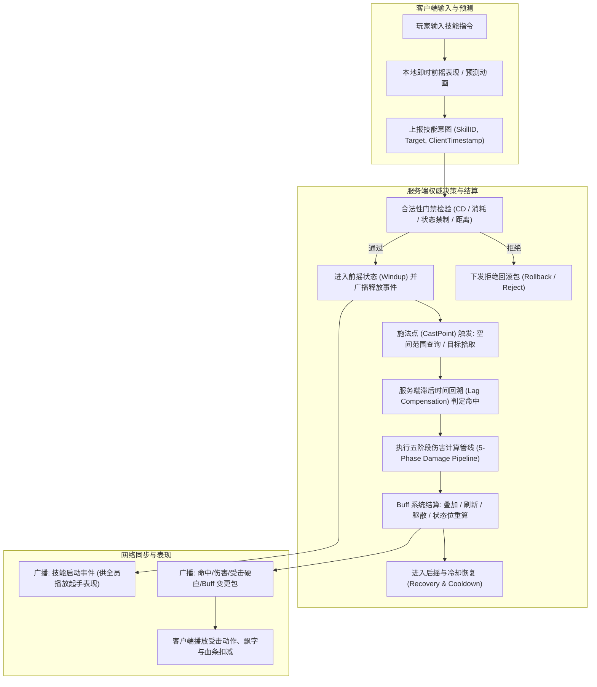
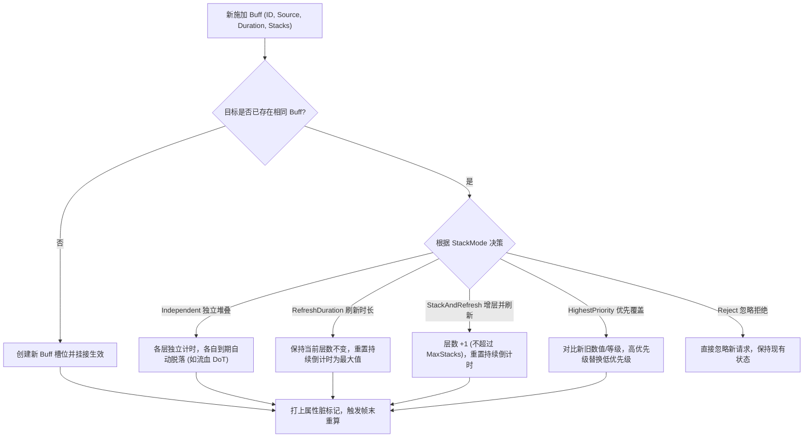
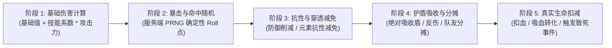

# 08-技能与战斗框架（服务端）

> 知识成熟度：L2（工程体系化增强：补齐工业级数据驱动技能表、Buff 状态机、五阶段伤害管线与延迟补偿）。
> 知识基线：引擎无关的游戏服务端业务设计通用原理；本文覆盖数据驱动的技能表、技能状态机、Buff 管理、伤害管线与服务端权威校验，与 [06-战斗结算与验证.md](06-战斗结算与验证.md)（结算与反作弊）分工互补；客户端技能表现（GAS 等）见 [游戏知识/03-游戏玩法编程/01-GameplayAbilitySystem能力系统.md](01-GameplayAbilitySystem能力系统.md) 与 [游戏知识/06-网络同步/README.md](../../../游戏知识/06-网络同步/README.md)。
> 版本边界：不绑定具体引擎、脚本 VM、数值配置工具或协议版本；技能/Buff schema、规则版本和回放格式必须随对局固化，UE GAS 仅作客户端/服务器实现对照。
> 适用范围：MMORPG/MOBA/ARPG 的技能系统服务端实现、技能数值策划配置、Buff 叠加与驱散、伤害计算管线、以及联网战斗的技能一致性。
> 事实边界：技能框架无标准实现，本文给出工业级通用模式（技能表/状态机/Buff/伤害管线）；UE 的 GAS 是其客户端/服务器一体化实现，细节以官方文档为准；具体数值公式与性能需按项目实测。
> 最后更新：2026-09-03（深度重构：补强工业级 C++ 数据结构、Buff 状态机算法与五阶段伤害管线实现）。
> 参考来源：[Unreal Engine: Gameplay Ability System](https://dev.epicgames.com/documentation/en-us/unreal-engine/gameplay-ability-system-for-unreal-engine)（GAS 官方文档，作为实现对照）。

---

## 一、概述

在联网动作、MOBA 与 MMORPG 游戏中，战斗框架是整个游戏运行时的**核心心脏**。它承担了技能释放控制、空间范围拾取、Buff 状态维护、伤害与治疗结算、以及全网状态广播的全套职责。

### 1.1 服务端战斗框架主链路



### 1.2 服务端与客户端的严密职责分工

| 关注维度 | 客户端职责（表现与交互） | 服务端职责（规则与权威） | 冲突时的裁决策略 |
| :--- | :--- | :--- | :--- |
| **施法输入** | 本地按键响应、摇杆方向采样、预测绘制施法指示器 | 接收协议、解析参数、合法性与防作弊检查 | 服务端拥有最终否决权（Reject） |
| **动作与前摇** | 本地播放前摇动画、骨骼粒子与起手音效 | 严格按毫秒级时钟推进状态机（Windup Timer） | 客户端动画快慢不影响服务端生效时间 |
| **命中与碰撞** | 客户端本地预测弹道与命中特效表现 | 空间索引范围查询、障碍物射线检测、滞后补偿回溯 | 以服务端射线检测与空间真值为准 |
| **数值结算** | 仅做平滑飘字显示与血条插值呈现 | 基础攻击、防御减免、暴击判定、护盾吸收、最终扣血 | 客户端不可信，严禁在客户端计算伤害数值 |
| **Buff 与状态** | 根据下发的 Tag/ID 挂接特效模型、UI 状态图标 | 权威维护 Buff 实例堆叠层数、持续周期 Tick、属性重算 | 服务端状态全量或增量同步，客户端无条件对齐 |

---

## 二、核心概念与领域模型

| 概念 | 英文定义 | 核心职责 | 工程注意要点 |
| :--- | :--- | :--- | :--- |
| **技能定义** | `SkillDefinition` | 技能的静态只读模板数据（消耗、范围、冷却、效果列表） | 策划配置驱动，常驻只读内存，热更新需原子指针替换 |
| **技能实例** | `SkillInstance` | 某玩家当前施法周期的运行态上下文（施法者、目标、阶段、已生效段数） | 动态生命周期，对象池管理，释放结束立即回收 |
| **技能状态机** | `SkillStateMachine` | 驱动技能沿 `Idle → Windup → CastPoint → Recovery → Cooldown` 转换 | 严防非法跳段；必须支持受击打断、硬控打断与位移打断 |
| **Buff 实例** | `BuffInstance` | 附着在实体上的持续性或周期性效果实体（持续时间、层数、修饰器列表） | 需支持多层堆叠、动态驱散、高频 Tick 与脏标记属性重算 |
| **控制位掩码** | `ControlBitmask` | 表达实体的动作受限状态（眩晕、定身、沉默、缴械、无敌、霸体） | 使用 64 位无符号整数按位存储，位运算进行 $O(1)$ 冲突判断 |
| **伤害修饰器** | `DamageModifier` | 介入伤害计算各阶段的挂载逻辑（百分比增伤、护盾吸收、反伤） | 注册制管理，严格定义执行优先级，保证计算顺序确定性 |
| **滞后时间补偿** | `LagCompensation` | 根据网络往返时延（RTT），将受击者碰撞体回溯到施法发起时刻 | 仅用于精准竞技射击/判定，回溯最大上限通常设为 200~300ms |

---

## 三、工业级技能配置模型（Data-Driven Schema）

### 3.1 核心数据结构定义（C++ 规范）

```cpp
#include <cstdint>
#include <string>
#include <vector>
#include <memory>

// 施法目标选择规则
enum class ETargetRule : uint8_t {
    Self = 0,           // 自身
    SingleTarget = 1,   // 指定单个目标
    CircleAOE = 2,      // 圆形区域范围
    SectorAOE = 3,      // 扇形区域范围
    RectAOE = 4,        // 矩形/直线弹道范围
    Global = 5          // 全图/全战场
};

// 技能生效阶段划分
enum class ESkillPhase : uint8_t {
    Idle = 0,
    Windup = 1,         // 前摇阶段 (允许被打断)
    CastPoint = 2,      // 判定生效时刻 (触发伤害/效果)
    Channeling = 3,     // 引导持续阶段 (如暴风雪)
    Recovery = 4,       // 后摇阶段 (可通过位移取消)
    Cooldown = 5        // 冷却期
};

// 效果类型
enum class EEffectType : uint8_t {
    InstantDamage = 1,
    Heal = 2,
    ApplyBuff = 3,
    Dispel = 4,
    Knockback = 5,
    Teleport = 6
};

// 技能静态配置结构体
struct SkillConfig {
    uint32_t SkillID = 0;
    std::string SkillName;
    uint32_t RequiredLevel = 1;

    // 消耗与冷却 (以毫秒或整数为单位)
    int32_t ManaCost = 0;
    int32_t EnergyCost = 0;
    uint32_t CooldownMs = 0;
    uint32_t GlobalCooldownMs = 1000;

    // 施法时间线 (Timeline)
    uint32_t WindupMs = 300;     // 前摇时长
    uint32_t ChannelMs = 0;      // 引导时长 (0 为瞬发)
    uint32_t RecoveryMs = 200;   // 后摇时长

    // 空间范围参数
    ETargetRule TargetRule = ETargetRule::SingleTarget;
    float CastRange = 500.0f;     // 施法距离 (厘米)
    float AreaRadius = 0.0f;     // AOE 半径
    float SectorAngle = 0.0f;    // 扇形张角 (度)

    // 效果定义列表
    struct EffectNode {
        EEffectType Type;
        int32_t TargetParamID;    // BuffID 或位移参数模板
        float BaseValue;          // 基础数值
        float Coefficient;        // 攻击力/法强加成系数
        std::string FormulaExpr;  // 动态公式表达式
    };
    std::vector<EffectNode> Effects;
};
```

---

## 四、Buff 系统与状态机设计

### 4.1 五大堆叠与冲突处理策略

在复杂战斗中，同一个 Buff 多次施加到同一目标时，必须有明确的状态机流转策略：



### 4.2 驱散与免疫判定矩阵

```cpp
enum class EDispelType : uint8_t {
    None = 0,
    Magic = 1,
    Curse = 2,
    Poison = 3,
    Physical = 4
};

struct BuffInstance {
    uint32_t BuffID;
    uint64_t CasterEntityID;
    uint32_t CurrentStacks;
    int64_t ExpireTimestampMs;
    int64_t NextTickTimestampMs;
    uint32_t TickIntervalMs;
    EDispelType DispelType;
    uint8_t DispelPriority;      // 驱散优先级 (低优先级先被驱散)
    bool bIsDebuff;              // 是否为负面效果
};

// 驱散函数执行逻辑
bool TryDispelBuff(BuffInstance& Buff, EDispelType CleanseType, uint8_t CleansePower) {
    if (Buff.DispelType == EDispelType::None) {
        return false; // 不可驱散
    }
    if (Buff.DispelType == CleanseType && CleansePower >= Buff.DispelPriority) {
        return true;  // 满足类型匹配且驱散强度足够
    }
    return false;
}
```

---

## 五、五阶段伤害计算管线（5-Phase Damage Pipeline）

为确保伤害计算的确定性、扩展性与防外挂可追溯性，服务端将每次伤害计算标准化为**严格的五阶段确定性管线**：



### 5.1 详细计算规范

#### 阶段 1：原始输出伤害求值（Raw Output）
- 公式：$Damage_{raw} = BaseDamage + (Attacker.Attack \times SkillRatio) + Attacker.FlatBonus$
- 叠加攻击方 Buff 的百分比增伤：$Damage_{phase1} = Damage_{raw} \times (1 + \sum Buff_{dmg\_inc})$

#### 阶段 2：命中与暴击判定（Hit & Crit Resolution）
- 使用服务端专属种子伪随机数生成器（PRNG），防止客户端预测 Roll 点作弊；
- 若判定暴击：$Damage_{phase2} = Damage_{phase1} \times Attacker.CritDamageMultiplier$（默认 1.5 或 2.0）；
- 若判定偏斜/格挡：$Damage_{phase2} = Damage_{phase1} \times 0.5$。

#### 阶段 3：受击方抗性与防御减免（Mitigation Pipeline）
- 防御力有效值考虑穿透：$EffectiveDef = \max(0, Defender.Defense \times (1 - Attacker.ArmorPenetrationPct) - Attacker.FlatArmorPen)$；
- 经典护甲减伤公式：$MitigationRatio = \frac{EffectiveDef}{EffectiveDef + ConstantK}$（$K$ 常用 1000 或 2000）；
- 计算减免后伤害：$Damage_{phase3} = Damage_{phase2} \times (1 - MitigationRatio) \times (1 - \sum Defender.DamageReductionPct)$。

#### 阶段 4：护盾吸收与反伤拦截（Shield & Reflect）
- 遍历受击方的伤害吸收护盾列表：
  - 若 $Shield.Value \ge Damage_{phase3}$，则 $Shield.Value -= Damage_{phase3}$，$Damage_{phase4} = 0$；
  - 若 $Shield.Value < Damage_{phase3}$，则 $Damage_{phase4} = Damage_{phase3} - Shield.Value$，$Shield.Value = 0$ 并销毁护盾。
- 触发反弹伤害：$ReflectDmg = Damage_{phase3} \times Defender.ReflectRatio$，反向施加给攻击者。

#### 阶段 5：最终生命扣减与状态事件（Vitality Deduction & Events）
- 原子扣减受击方生命值：$Defender.CurrentHP = \max(0, Defender.CurrentHP - Damage_{phase4})$；
- 触发攻击方吸血：$HealAmount = Damage_{phase4} \times Attacker.LifeLeechRatio$；
- 若生命值归零，向世界主循环抛出 `Event_EntityKilled`，触发击杀掉落、经验结算与仇恨清理。

---

## 六、网络滞后补偿与防作弊校验（Lag Compensation）

在非锁定战斗（如射击或挥砍判定）中，若服务端直接使用当前帧的世界坐标判定命中，高延迟玩家（如 100ms Ping）几乎无法命中移动中的敌人。

### 6.1 历史快照时间回溯机制

1. 服务端环形缓冲区记录过去 1000ms 内所有实体的空间包围盒（Hitbox Snapshot）；
2. 客户端发起攻击请求，上报客户端发起时刻的本地时间戳 $T_{client}$；
3. 服务端计算时间回溯点：$T_{rewind} = CurrentServerTime - RTT/2$；
4. 校验 $T_{rewind}$ 合法性（限制最大回溯上限，通常不超过 250ms，防止外挂篡改时间戳“打过去的人”）；
5. 临时将目标实体的 Hitbox 恢复到 $T_{rewind}$ 时刻的状态，执行射线或形状相交检测；
6. 命中判定完成后，立即恢复当前帧的实时坐标，并根据命中结果执行伤害管线。

```cpp
// 服务端历史回溯判定伪代码
bool VerifyHitWithLagCompensation(uint64_t AttackerID, uint64_t TargetID,
                                  const FVector3D& ShootDir, int64_t ClientShotTimeMs) {
    int64_t CurrentTimeMs = GetMonotonicTimeMs();
    int64_t LatencyMs = CurrentTimeMs - ClientShotTimeMs;

    // 硬性安全钳制：防止恶意伪造几秒前的超大延迟攻击
    if (LatencyMs < 0 || LatencyMs > 300) {
        LatencyMs = std::clamp<int64_t>(LatencyMs, 0, 300);
    }

    // 从快照环形缓冲区中提取历史包围盒
    auto HistoricalHitbox = SnapshotHistory::GetEntityBoxAtTime(TargetID, CurrentTimeMs - LatencyMs);
    auto AttackerPos = World::GetEntityPosition(AttackerID);

    // 射线与包围盒相交测试
    return Math::RayIntersectsOBB(AttackerPos, ShootDir, HistoricalHitbox);
}
```

---

## 七、生产最佳实践

1. **数值整数化与定点数计算**：
   服务端核心战斗公式避免使用 IEEE 754 浮点数，攻击力、防御力和伤害乘数全部采用整型定点数（如扩大 10,000 倍运算），保证跨平台编译与复算结果的绝对一致性。
2. **属性脏标记与帧末批量重算**：
   频繁增删 Buff 时切忌每次立即重新遍历整张属性表；应使用脏标记 `bIsAttributeDirty = true`，在当前 Tick 逻辑阶段结束时统一合并重算一次。
3. **施法队列与输入缓冲（Input Buffering）**：
   允许客户端在前摇或后摇剩余 100ms 时预先输入下一个技能，服务端将其压入输入缓冲队列，在前摇结束的第一逻辑帧立即衔接释放，大幅提升连招手感。
4. **全量战斗审计流水（Combat Event Log）**：
   关键战局（PVP、天梯、BOSS 战）的伤害明细必须以紧凑二进制形式记录战斗事件日志，包含每一击的随机种子、命中阶段数值拆解与状态转移，为客服仲裁与反作弊回放提供 100% 证据链。

---

## 八、常见问题 FAQ

1. **Q：客户端通过加速挂加速前摇动画，服务端如何拦截？**
   A：服务端技能状态机基于单调时钟推进，无论客户端本地动画播放多快，服务端未到 `WindupMs` 施法点绝对不触发伤害判定；若客户端提前上报命中包，服务端判定为非法时钟直接丢弃并记入风控。
2. **Q：如何避免 Buff 周期 Tick 造成的 CPU 尖峰？**
   A：海量实体同时挂载 DoT 时，不要将所有实体的 Tick 集中在同一毫秒；在施加 Buff 时基于 EntityID 做微小的时间偏移抖动（Jitter），并将高频 Tick 委托给多层分级时间轮。
3. **Q：如何处理无目标挥空技能的消耗与 CD？**
   A：无论最终是否命中敌人，只要成功跨越了前摇施法点，服务端的蓝量消耗与冷却计时立即生效；后摇可被移动打断，但 CD 已经锁定。

---

## 九、关联阅读

- [06-战斗结算与验证.md](06-战斗结算与验证.md) —— 权威结算、随机数种子与战局回放反作弊
- [游戏知识/04-动画系统/08-动作战斗系统与打击手感.md](../../04-图形动画与物理仿真/动画求值与角色表现/08-动作战斗系统与打击手感.md) —— 动作战斗手感、输入缓冲队列、取消窗口、受击硬直与 Root Motion 网络权威校验
- [01-背包与道具系统.md](../背包装备与存档/01-背包与道具系统.md) —— 药品消耗与装备属性加成的底层存储
- [06-世界模拟与运行时/05-AOI与InterestManagement.md](../../07-网络与游戏服务端/状态复制与兴趣管理/05-AOI与InterestManagement.md) —— 大规模战斗下的 AOI 广播优化
- [06-世界模拟与运行时/10-大规模战斗与降级.md](../../07-网络与游戏服务端/世界权威与故障恢复/10-大规模战斗与降级.md) —— 战场百人同屏时的技能降频与视野降级
- [00-计算机与工程基础/04-C++并发与内存模型/README.md](../../../00-计算机与工程基础/04-C%2B%2B并发与内存模型/README.md) —— 高并发战斗无锁队列与内存序底座
