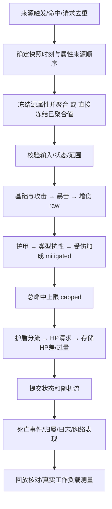

# 11-伤害与属性结算完整链路

> 知识成熟度：L2。全文是来源触发、快照、结算、事件、同步与回放的设计分析；本次静态核对仓库 C++17 模型，局部功能实验另列，不能据此宣布端到端系统达到 L4。旧版以 15 条局部断言和批均摊计时支撑全文 L4，范围过大，本次纠正标定并保留历史原始记录。
> 知识基线：2026-10-04 的 [damage-core 源码](../../../evidence/tests/damage-core/src/damage_pipeline.cpp)、[独立合同测试](../../../evidence/tests/damage-core/tests/damage_contract.cpp)；实际构建身份见 [run-manifest](../../../evidence/tests/damage-core/results/2026-10-04-damage-contract/run-manifest.json)。公式和玩法顺序是本模型的选择，不代表所有项目或 UE 的默认公式。
> 适用范围：理解单线程伤害分账与数值边界，并设计其上下游接口。未实现技能触发、快照捕获服务、GAS、网络复制、持久化去重、击杀归属、反弹或生产调度。历史 UE5.8/CL 引用本轮未访问对应 checkout，不能作为本轮版本核验。

> 最后更新：2026-10-04（阶段分账、数值拒绝与整数DOT合同纠正；设计与局部运行证据分列）。

## 一、为什么“伤害数字”和“掉血”会不同

技能表、属性系统、服务端结算、客户端表现与战斗日志会消费同一次命中的不同数值。一个 100 点命中被护盾吸收 30，目标只剩 40 血，最后应分别记录：护盾分流 30、请求扣血 70、实际扣血 40、过量 30。把请求 70 当作实际扣血，状态看似正确，DPS 和承伤账却已经错了。

因此不能只回归最终 HP：要定义每个字段在哪个阶段冻结、谁有权修改状态、失败是否消费随机数。与 [03-技能释放完整链路](03-技能释放完整链路.md) 的分工是：上游决定能否释放、命中谁、是否重复请求；本篇解释命中被接受之后如何计算和记账。活目标连续两次相同参数调用，在本模型中就是两次伤害，没有 eventId，不能把死后短路称作网络幂等。

## 二、从来源到结果：设计边界与所有权

只有图中校验、公式、护盾/HP 和随机流提交由本目录模型执行；DOT 另有原额累计器，不连接这条逐跳管线。其余方框是接入项目需要兑现的设计责任。

| 状态/决策 | 所有权与原因 |
| --- | --- |
| 来源与目标、技能 ID、伤害类型、暴击/统计资格 | 上游权威服务决定；环境伤害是否暴击、是否记击杀须按玩法配置，不是通用规则 |
| 属性快照 | 服务端在约定时刻冻结；子弹发射时还是命中时捕获，决定 Buff 到期、装备更换、来源死亡如何影响结果 |
| 护盾、HP、alive | 同一权威写者串行提交；客户端可预测表现，不能以本地数字改写权威生命 |
| 随机流 | 和结算序列一起管理；失败消耗一个随机数也会改变后续暴击序列 |
| 事件与网络 | 提交成功后派发；若要求可靠投递/去重，还需事件 ID、持久化或重试协议，本模型未提供 |

“快照后再聚合”有两种一致的实现：冻结 base 与修正器列表后纯求值，或先聚合、再冻结最终值。不要先声称已冻结最终值，又在乘区中途重读活跃 Buff。当前模型接收调用方提供的串行状态并读取其属性；没有锁、版本号或独立快照服务。线程间同时修改对象不在合同内。

## 三、属性聚合：固定类别顺序不等于任意重排

`Attribute::Evaluate` 保留原玩法：最后一个 Override 替换 base，按源列表顺序累加 Add，按源列表顺序连乘 Mul，最后得到 `(覆盖值或base + Add合计) × Mul合计`。

- base=100、Override=10、Add=50、Mul=2，结果是 120
- 单个 Add=5 与 Mul=3 交换在列表中的位置，仍按类别算 `(10+5)×3=45`；这不表示算术式 `(10×3)+5=35` 也等于 45
- Override 10 后接 20 得 20，反向得 10，这是“最后写入者胜”的既有政策
- Add 序列 `[1e16,-1e16,1]` 得 1，反向得 0。实数的结合律不能保证 double 重排逐位相同

需要重放时，先规定来源排序键和权威执行顺序，不能依赖哈希容器偶然迭代顺序。本模型不引入新优先级，也不替项目决定多 Buff 冲突。负 Add/减益合法，只要最终攻击非负、增伤和受伤因子非负；不能为防负伤害一刀切禁止减益。

## 四、阶段字段、上限和存储舍入

`Settle` 的成功路径为：

| 字段 | 冻结位置与含义 |
| --- | --- |
| `raw` | 基础数值 × 攻击属性 × 暴击倍率 × (1+增伤) |
| `mitigated` | raw × 护甲剩余系数 × (1-clamp(类型抗性,0,1)) × (1+受伤加成)，上限前 |
| `capped` | cap=0 时不限制，否则 min(mitigated,cap)；限制本次命中的总额，含护盾分流 |
| `absorbed` | min(类型盾余额,capped)，名义上分流给护盾的量 |
| `requestedHpDamage` | capped-absorbed，请求扣血量 |
| `toHp` | HP存储值 before-after，实际扣血量，不包含过量 |
| `overkill` | max(requestedHpDamage-before,0)，超过命中前生命的部分 |

物理、魔法、真实伤害使用三个独立护盾池。真实伤害只跳过护甲，仍有类型抗性、受伤加成、cap 和对应护盾，不能根据“真伤”二字推定它无视一切规则。

### 上限的位置是在选择限制对象

例：raw=1000、护甲后剩 50%、cap=150、盾=50。本模型先减伤得 500，再 cap 得 150，盾吸收 50，HP 请求为 100。若 cap 放在减伤前，会得到 `150×0.5-50=25`；若盾后才限制 HP 请求，则为 `min(500-50,150)=150`。这些都是不同政策，不是另两种位置必然“失效”。特别地，非负伤害与 0..1 减伤下，`min(D,C)×m≤C`，前置 cap 不会凭空导致超过 C。

“所有减伤最高 80%”又是另一种限制，本模型没有实现。引入它须重新明确与 cap、真伤的组合，不能从现有绿测试推得。

### 实际存储差与名义请求必须分开

普通整数例：100 命中 / 盾30 / HP40 → absorbed30、request70、toHp40、overkill30。恰好 40 打 40 血只死亡一次且 overkill=0；下一次合法调用返回 dead，不再消费盾或 RNG。

浮点存储有另一层边界：

- HP=1e20，请求扣 1，double 存储可能仍为 1e20。`toHp=before-after=0`，不能虚报 1，更不能偷偷改成最小扣 1
- HP=1，请求 `3×2^-54`，默认最近偶数舍入下实际存储差可为 `2^-52`，略大于请求。因此残差允许为负
- 盾=1e20、absorbed=1 时盾存储也可能不变。`absorbed` 是名义分流，`actualShieldLoss=shieldBefore-shieldAfter` 才是存储盾差；不能用两者混记账

模型额外返回 `roundingResidual=(requestedHpDamage-toHp)-overkill`、`shieldRoundingResidual=absorbed-actualShieldLoss`。它们是带符号的浮点残差，有正有负；这些表达式自身也经历舍入，不能宣传任意 double 输入下逐位精确守恒。统计应选定“名义命中”“存储盾损”“实际扣血”等口径，保留残差供对账。若项目需要最小伤害或定点记账，那是另行设计的玩法/表示政策。

## 五、护甲曲线：数学正确还不够

对有限正 K 和非负护甲 A，实数下的剩余系数是 `K/(A+K)`。本模型保留负护甲按 0 减伤处理。直接写 `1-A/(A+K)` 有两种可避免的错误：A=1e20、K=100 时消减使剩余值归零；A=K=DBL_MAX 时分母溢出，减伤又可能失效。

实现 `ArmorRemaining` 不先算“接近 1 的减伤”，也不相加两个极大值：

- A≥K：q=K/A，剩余系数 `q/(1+q)`
- A<K：q=A/K，剩余系数 `1/(1+q)`

这样 A=1e20、K=100、raw=100 可保留约 1e-16 的 mitigated；A=K=DBL_MAX 时得到 50。要用相对误差检查这些值，绝对容差 1e-6 会把错误的零也当通过。

但不要把稳定改写说成所有浮点结果永远大于零：若 K 为最小正 subnormal、A 为最大有限数，系数本身会下溢为零。当前合同按 binary64 分阶段求值，允许这种表示下溢，也允许最终乘积下溢；未保留高精度中间量来挽救后续乘法。100% 类型抗性同样可以合法产生零伤害。测试分别覆盖可避免的消减、分母溢出和真正的表示下溢。

## 六、拒绝合同：先计划，后提交

成功不是“程序没崩”。非有限数会污染比较和算术，中间溢出也可能在 `Inf×0` 后变成 NaN，因此仅校验入口有限仍不够。

| 范围 | 本模型接受/拒绝政策 |
| --- | --- |
| DamageSpec | amount 有限且>0；type只能0/1/2；K有限且>0；cap有限且≥0（0不限） |
| 属性 | base与每个modifier值有限、op合法；每次加乘中间结果可表示；最终attack≥0，bonus/taken≥-1 |
| 攻守双方状态 | hpMax有限且>0；0≤hp≤hpMax；alive恰等于hp>0；所有盾有限非负，armor有限 |
| 暴击参数 | chance有限且在[0,1]，倍率有限且≥0；0倍率合法产生零伤害 |
| 类型抗性 | 所有类型槽必须有限；有限的越界值仍按旧政策clamp到[0,1] |
| 已死或免疫 | 完成配置/状态校验后，合法死目标返回dead、合法免疫目标返回immune |
| 数值范围失败 | 每次危险加法/乘法前检查；不能等Inf/NaN生成后当正常伤害提交 |

`Status` 区分 accepted、dead、immune、invalid、range；兼容字段 blocked 对所有未接受返回为 true，因此调用方应读 status 区分业务短路与坏输入。invalid/range 的数值结果字段清零，目标 HP/盾/alive、源属性和 RNG 都不改变。输入校验优先于 dead/immune，坏状态不被“免疫”掩盖。

以 amount=2、attack=DBL_MAX、抗性=1 为例：第一步乘法已超表示范围，结果是 range，不能想着“后面乘零总会安全”。即使随机判定已发生，后面的暴击倍率/增伤/受伤因子才溢出，临时 RNG 也不会提交。chance=0 不取随机数；chance>0 的合法命中取一次，chance=1 和完全被抗性抵消也取一次。

这是一条串行、正常返回的局部事务合同，不承诺并发安全、异常内存分配恢复或检测 public 字段的一切协同篡改。调用者仍须负责对象生命周期、签名输入和上游反作弊。

## 七、DOT：保存相位，而不是每帧独立取整

首跳在一个完整 interval 结束时发出。以每秒 10、持续 1 秒为例，推进 1 秒、0.5+0.5、0.25×4、0.6+0.4 都应在同一个实例上产生 1 跳。旧实现每次只算 floor(本次dt/interval)，却扣掉剩余时长，分成四次0.25就把唯一一跳丢掉了。

### 整数核心与不变量

`DotTicks` 使用微秒 uint64：intervalUs>0、remainingUs≥0、0≤phaseUs<intervalUs；过期状态 phaseUs=0。`AdvanceDotUnits` 先取 active=min(dt,remaining)，将 active 对 interval 做 divmod，再与旧相位合并。实现用 `remainder >= interval-phase` 判定进位，避免 `phase+active` 自身溢出。

- 相同整数总推进时长、相同初始状态，不同分块得到相同事件时刻/总跳数；多小步和跨多跳推进均有测试
- 恰到到期边界的完整跳计入；持续1.5秒、间隔1秒得到1跳，末尾半跳丢弃，后续调用不补发
- dt=0合法且保留相位；超过生命周期只消费剩余时长
- 0.3秒/0.1秒在整数微秒中是300000/100000，明确得到3跳，没有越过边界的epsilon
- 单次可报告2^31跳，复杂度随DOT数增长，不循环2^31次；累计跳数用uint64，输出计数、伤害乘积或总额溢出时整批拒绝，之前的DOT也不推进

原额 `total` 仍是 double。大计数转 double 以及 `perTick×count`/总和会舍入，精确的是整数跳数和相位合同，不是任意原额的实数精确和。核心参数类型不能表示负时间；调用方不能把负有符号整数隐式转换成 uint64 后期待核心识别其来历，须在转换前校验。

### double 秒兼容入口的边界

`SecondsToUnits` 把传入 binary64 数值的精确实数值乘以1,000,000后，按最近微秒、恰半向上取整。它从 significand 与二进制指数构造双uint64 limb的精确乘积，再取商和舍入位；不依赖 long double 的精度。NaN、无穷、负时间无效；舍入结果达到2^64则拒绝，不能先强转再检查，因为 float→int 超界在 C++ 中可能是未定义行为。

例如 `0x1.0c6f7a0b5ed8ep+33` 秒的精确量化值是9007199254740993微秒。用有限精度乘法再加0.5会出现二次舍入，本轮以独立精确有理数 oracle 发现并修正了这个边界。

每个 dt 独立量化不保证任意 double 分块恒等：1.2微秒一次量化成1微秒，0.4微秒分三次各量化成0，总推进量不同。低于半微秒可以变成0；需要跨分块不变性，应在权威整数时间轴求差，不能逐帧任意量化浮点dt后宣称等价。

旧 `Dot/AdvanceDots` 是薄适配：创建时把时长量化，保存整数时钟；remainingSec是只读用途的秒镜像。镜像与时钟不一致会拒绝，但不声称识别同时改写两者的任意篡改。旧 int* 输出超范围时抛 overflow_error，目标与输出指针保持；新核心应优先使用宽计数。非法输入抛 invalid_argument，null输出指针允许。

### 批总额不是逐跳结算

累计器校验 type，却不按类型减伤，不调用 Settle，不处理暴击、盾、cap、归属或叠加策略。整数时钟定义了逻辑触发边界，但接口只返回总跳数/原额，不生成每跳事件队列。两跳各100、每跳cap150，逐跳可合计200；先聚合200再过一次cap只有150。原两条DOT例第一秒16、全程62验证的是原额与跳数，不是完整战斗管线。接入项目需逐事件结算或证明特定合并条件成立。

## 八、一次魔法命中的可手算对账

固定输入：基础240，攻击倍率1.8，本次暴击倍率1.8，增伤20%，护甲300/K100，魔法抗性25%，受伤加成10%，cap400，魔法盾500，HP800。例中的“本次暴击”是已指定的分支；测试使用chance=1强制该分支，并非拿35%的随机机会碰结果。

| 步骤 | 计算 | 阶段结果 |
| --- | --- | --- |
| 基础×攻击 | 240×1.8 | 432 |
| 暴击 | 432×1.8 | 777.6 |
| 增伤 | 777.6×1.2 | raw=933.12 |
| 护甲剩余 | ×100/(300+100) | 233.28 |
| 魔法抗性 | ×0.75 | 174.96 |
| 受伤加成 | ×1.1 | mitigated=192.456 |
| 总命中上限 | min(192.456,400) | capped=192.456 |
| 护盾分流 | min(500,192.456) | absorbed=192.456 |
| HP请求 | 192.456-192.456 | 0 |
| 新盾/HP | 500-192.456；800-0 | 307.544；800 |

移除护盾并把HP设为150：requestedHpDamage=192.456，toHp=150，HP=0，overkill=42.456。表中十进制数是独立手算/有理数期望，C++以约定误差比较，不能当逐位十进制存储。把结算总额用于输出统计、实际扣血用于承伤统计都可以，但必须命名口径，不能称两者天然相等。

## 九、日志、死亡、网络与回放如何接住结果

这些是设计建议，尚未由本地模型实现端到端证据：

1. 提交时判定 alive 从true变false，仅此跃迁产生一次死亡事件；同Tick多来源按权威结算顺序选归属。DOT可按效果来源实体归属，反伤可按反伤效果拥有者归属，具体由玩法规定，不能默认归给伤害承受者
2. 日志记录来源/目标、来源ID、配置版本、快照时刻、来源排序、各阶段值、cap、typed shield前后值、HP前后值、实际损失、过量、残差、status、暴击与随机流位置。日志是重要对账依据，还需原始输入、状态快照与可重放程序
3. 服务端同步权威结果，客户端预测数字可撤销或修正；AOE可批量传输以减少协议开销，但必须保留各目标事件的身份与顺序，不能仅因批量就失去重试去重能力
4. 同构建、固定输入顺序和种子进行逐字段比较，优于仅比较量化哈希。本测试比较每次HitResult、选定完整Combatant状态与随机状态；不等于跨编译器、跨平台或跨服确定性证明

源模型不读取系统时间取随机数，不使用哈希遍历决定命中顺序。上游若多消费一次随机数、改变来源排序或量化规则，后续序列都会变化。不要把旧5000次量化哈希相等解释为无碰撞证明或可部署帧同步。

## 十、局部实验与历史性能记录

实际入口与完整边界见 [damage-core README](../../../evidence/tests/damage-core/README.md)。本轮以合成数据执行严格 O0+NDEBUG、O2、UBSan；测试与实现分离，expected来自常量/独立整数事件时间轴，不能由被测函数算出自己的标准答案。

| 对象 | 可复核证据 | 不能推出的结论 |
| --- | --- | --- |
| 阶段、HP/盾、护甲、拒绝与RNG原子性、属性顺序、整数DOT | [strict.txt](../../../evidence/tests/damage-core/results/2026-10-04-damage-contract/strict.txt)、[ubsan.txt](../../../evidence/tests/damage-core/results/2026-10-04-damage-contract/ubsan.txt) | 生产输入全部安全或端到端系统已完成 |
| 旧问题与候选28项反例 | [before.txt](../../../evidence/tests/damage-core/results/2026-10-04-damage-contract/before.txt) | 旧15绿意味着合同正确 |
| runner故障与真实语义mutants | [runner-contract.txt](../../../evidence/tests/damage-core/results/2026-10-04-damage-contract/runner-contract.txt) | 任意宿主/故障均覆盖；Linux pwsh通过也不等于Windows验证 |
| 来源、命令、退出码、哈希 | [run-manifest.json](../../../evidence/tests/damage-core/results/2026-10-04-damage-contract/run-manifest.json) | 单凭HEAD就能识别未提交worktree源码 |

历史 [damage_pipeline.txt](../../../evidence/tests/damage-core/results/damage_pipeline.txt) 原字节保留：旧MinGW样本报告15/0，以及500轮×1000次的批均摊P50=14.2ns、P95=16.3ns、P99=16.8ns、吞吐77161685次/秒。这些是每批总时长除以1000后得到的分位数，不是单次延迟P99。反例：每批980次0ns、20次1000ns，批均值20ns而单次P99为1000ns。

本轮不新增或默认运行CPU基准，不把历史数字按线性外推当线上预算，也不声称公式通常不是瓶颈。20Hz一个Tick是50ms；结算子预算必须从实际服务器负载中分配。后续应分别测量属性捕获/分配、AOE查询、逐跳结算、事件日志、网络广播及完整Tick，包含目标数分布、护盾破裂、死亡分支和日志背压；可能由任何一段主导。未做优化器/汇编审计，旧sink=0既不能证明全被优化掉，也不能证明每段工作都被保留。

未验证：UE/GAS/PIE、真实技能/网络/服务/数据库、事件投递与归属、并发、Windows、跨平台确定性、生产容量和性能。Sanitizer只观察已执行路径，功能绿和负向控制也不是形式穷举。

## 十一、把规则变成策划对账与排错步骤

- 对配置版本、护甲K、类型抗性政策、cap和修正器来源顺序做版本化；变更配置后保存新旧期望，避免误把重平衡当修bug
- 用典型组合建独立期望表：满装暴击、破甲、高抗性、盾恰好打穿、低血过量、微小伤害、大数边界；不要只对最终HP
- 数字不一致时从最早不同阶段向后查：raw不同先看快照/属性/暴击；mitigated不同查护甲/类型抗性/受伤因子；capped不同查上限；toHp不同先排过量与存储舍入
- DOT少跳先比整数时间轴、remaining/phase，再查终末半跳政策；不同分块的double量化总时间可能本来就不同
- 对invalid/range记录输入来源与版本，拒绝后保持状态/RNG；不要自动重试同一坏输入，也不要把它静默伪装为immune
- 线上可监控实际扣血与名义命中差、过量率、残差、拒绝率、暴击率、每Tick命中数与各阶段耗时。偏离预期可由采样、技能混合和执行顺序等多种原因造成，不能仅凭暴击率漂移断言随机数错位

## 来源定位与关联阅读

本轮核对的原始位置是仓库 `Attribute::Evaluate`、`Validate/Settle`、`ArmorRemaining`、`AdvanceDotUnits/SecondsToUnits` 及独立tests；构建/运行范围按manifest。2026-10-04同时核对 [C++浮点到整数转换规则](https://eel.is/c++draft/conv.fpint) 与 [GCC运行时检查选项](https://gcc.gnu.org/onlinedocs/gcc/Instrumentation-Options.html)：它们支撑超界转换与构建选项的语言/工具约束，不证明玩法公式正确。

- [03-技能释放完整链路](03-技能释放完整链路.md)：触发与执行
- [04-Buff系统完整链路](04-Buff系统完整链路.md)：修正器来源与效果生命周期
- [05-背包道具完整链路](../背包装备与存档/05-背包道具完整链路.md)：装备属性
- [06-战斗结算与验证](06-战斗结算与验证.md)：另一结算设计，须核对其自己的玩法政策
- [动作战斗系统与打击手感](../../04-图形动画与物理仿真/动画求值与角色表现/08-动作战斗系统与打击手感.md)
- [GameplayAbilitySystem能力系统](01-GameplayAbilitySystem能力系统.md)、[GAS能力系统源码](05-GAS能力系统源码.md)：延伸阅读，本轮未核对私有UE源码
- [Unreal Engine官方GAS文档](https://dev.epicgames.com/documentation/en-us/unreal-engine/gameplay-ability-system-for-unreal-engine)：引擎入口，不作为本模型公式证明
- [测试金字塔与测试策略](../../08-工程实践与质量/测试策略与自动化/01-测试金字塔与测试策略.md)
- [性能问题定位完整链路](../../08-工程实践与质量/调试与性能分析/10-性能问题定位完整链路.md)、[假人AI完整链路](../../06-游戏AI/战斗战术与机器人/07-假人AI完整链路.md)
