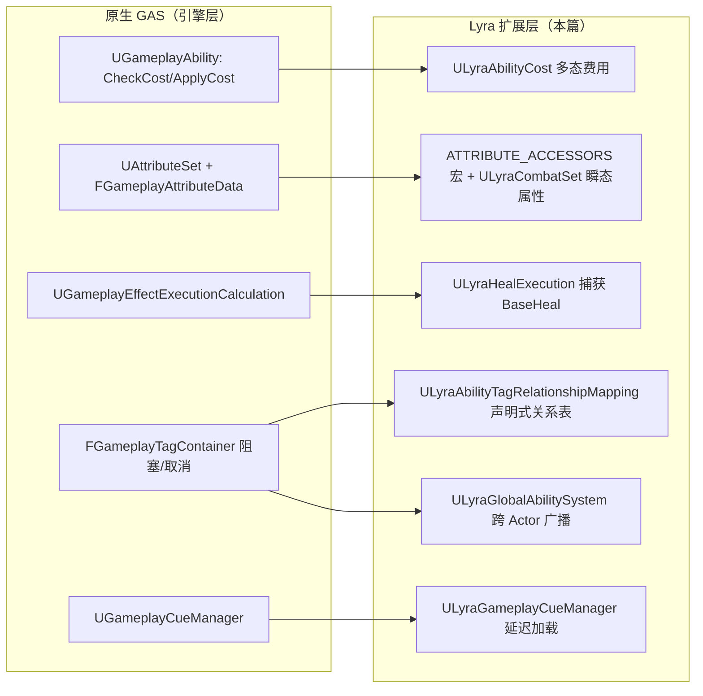
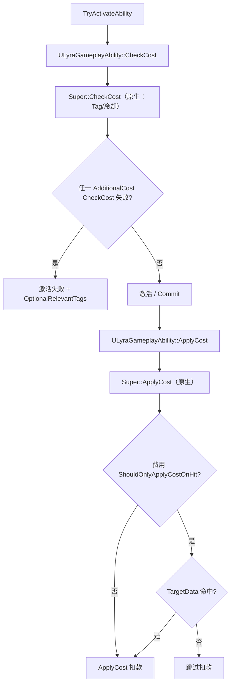
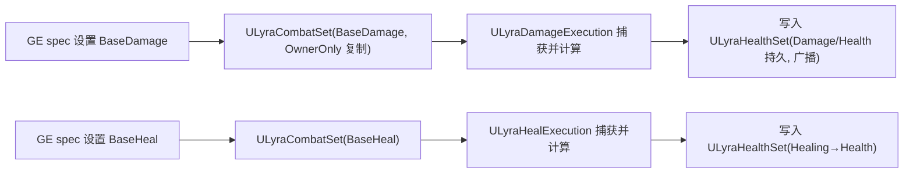
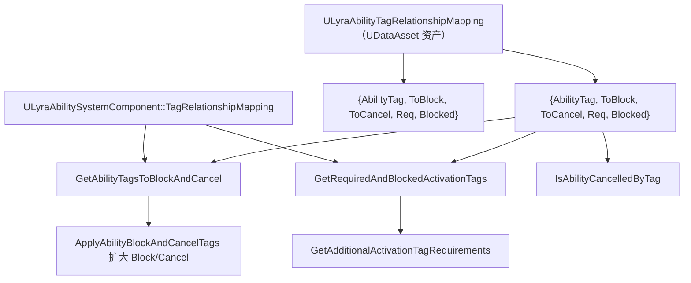
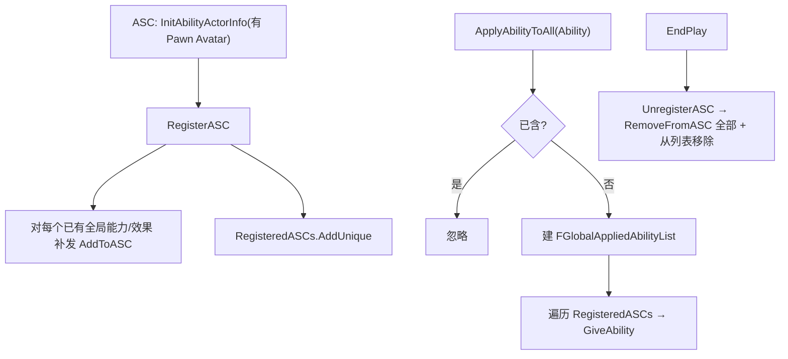
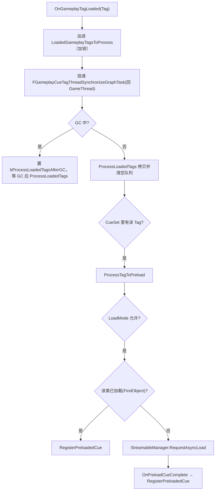

# UE5.8 Lyra 源码解析 51：GAS 扩展与能力费用源码

> 本篇补完 Lyra `AbilitySystem` 模块中前三篇（42/45）未单独深入的"能力系统扩展子集"：
> **能力费用抽象、属性集补充、治疗执行、Tag 关系映射、全局能力系统、GameplayCue 管理与 Jump/Reset 简单能力**。
> 重点不是逐个复述文件，而是回答一个问题：**Lyra 在原生 GAS 之外，为"费用 / Tag 关系 / 全局广播 / Cue 性能"封装了哪些可复用约定**。
> 知识成熟度：L2（本机 UE 5.8 与 Lyra 5.8 源码、依赖关系已静态核对；运行实验作为后续验证步骤）。

## 元数据

| 项目 | 内容 |
| --- | --- |
| 版本基线 | UE 5.8.0 / CL 55116800 / `++UE5+Release-5.8` |
| Lyra 基线 | 本机 `LyraStarterGame.uproject`：`EngineAssociation=5.8` |
| 源码依据 | `LyraStarterGame\Source\LyraGame\AbilitySystem`（Abilities / Attributes / Executions 三个子目录 + 根目录四组扩展类） |
| 适用范围 | GAS 扩展：能力费用、属性集、治疗执行、能力 Tag 关系、全局能力/效果广播、GameplayCue 管理、Jump/Reset 能力 |
| 兼容性边界 | C++ 类名 / 接口以其 5.8 版本为准；`#if 0` 禁用的实现、蓝图具体数据资产不在本文运行结论内 |
| 知识成熟度 | L2：C++ 静态核对完成；三处 Cue 延迟加载分支与蓝图资产引用需在编辑器运行中复核 |
| 官方参考 | [Actor Info in GAS](https://dev.epicgames.com/documentation/en-us/unreal-engine/attribute-and-gameplay-ability-system-in-unreal-engine)、[Abilities in Lyra](https://dev.epicgames.com/documentation/en-us/unreal-engine/abilities-in-lyra-in-unreal-engine)、[Gameplay Abilities](https://dev.epicgames.com/documentation/en-us/unreal-engine/gameplay-abilities-in-unreal-engine) |
| 关联篇 | [05-GAS能力系统源码.md](./05-GAS能力系统源码.md)（原生 GAS）、[42-Lyra-输入GAS与武器战斗源码.md](./42-Lyra-输入GAS与武器战斗源码.md)、[43-Lyra-背包装备消息与UI源码.md](../背包装备与存档/43-Lyra-背包装备消息与UI源码.md)、[45-Lyra-相机音频与游戏阶段源码.md](../输入移动与交互/45-Lyra-相机音频与游戏阶段源码.md) |
| 最后更新 | 2026-08-17（补入 LyraGameplayCueManager 实际源码分析） |

---

## 一、概述：为什么还需要第 51 篇

### 一.1 与 42/45 篇的分工

- **42 篇** 已覆盖主战斗链：Enhanced Input → InputTag → AbilitySpec → 本地预测 → TargetData → `LyraDamageExecution` → `LyraHealthSet` → Death。它把 `LyraAbilitySystemComponent`、`LyraAbilitySet`、`LyraGameplayAbility`、`LyraHealthSet`、`LyraDamageExecution` 作为"一条会合链"讲透。
- **45 篇** 覆盖相机 / 音频 / GamePhase 阶段能力（`GamePhase` 复用 ASC 的能力策略做"阶段状态机"）。
- **51 篇（本篇）** 补 AbilitySystem 模块中**单点设计**：费用（Cost）、Combat 属性集、Heal 执行、Tag 关系映射、全局能力、Cue 管理、Jump/Reset。这些类 42/45 只是"路过"或作为依赖引用，本篇集中分析其**复用范式**。

### 一.2 本篇覆盖的文件地图

本机 `Source\LyraGame\AbilitySystem` 根目录与三个子目录中的目标文件：

| 文件 | 目录 | 类型 | 本篇章节 |
| --- | --- | --- | --- |
| `Abilities/LyraAbilityCost.h` | Abilities | 基类 | 二 |
| `Abilities/LyraAbilityCost_InventoryItem.h/.cpp` | Abilities | 派生 | 二.3 |
| `Abilities/LyraAbilityCost_ItemTagStack.h/.cpp` | Abilities | 派生 | 二.3 |
| `Abilities/LyraAbilityCost_PlayerTagStack.h/.cpp` | Abilities | 派生 | 二.3 |
| `Attributes/LyraAttributeSet.h/.cpp` | Attributes | 基类 | 三 |
| `Attributes/LyraCombatSet.h/.cpp` | Attributes | 派生 | 三 |
| `Executions/LyraHealExecution.h/.cpp` | Executions | 执行 | 四 |
| `LyraAbilityTagRelationshipMapping.h/.cpp` | 根 | 数据资产 | 五 |
| `LyraGlobalAbilitySystem.h/.cpp` | 根 | WorldSubsystem | 六 |
| `LyraGameplayCueManager.h/.cpp` | 根 | Cue 管理 | 七 |
| `Abilities/LyraGameplayAbility_Jump.h/.cpp` | Abilities | Ability | 八 |
| `Abilities/LyraGameplayAbility_Reset.h/.cpp` | Abilities | Ability | 八 |

### 一.3 Lyra 区别于"裸 GAS"的复用设计点（先览）



五个可复用约定（也是本篇结论）：

1. **费用即对象**：`ULyraAbilityCost` 把"扣弹药 / 扣 ItemTagStack / 扣玩家 TagStack"做成可编辑的**内联对象数组**（`Instanced`），由 `ULyraGameplayAbility::CheckCost/ApplyCost` 统一调度。
2. **属性集宏**：`ATTRIBUTE_ACCESSORS` 一键生成 Get/Set/Init/属性 Getter，`ULyraCombatSet` 用"瞬态（不入库、复制 OwnerOnly）"的几何传递属性承载伤害/治疗输入。
3. **声明式 Tag 关系**：`ULyraAbilityTagRelationshipMapping` 把"哪些 AbilityTag 阻塞/取消哪些"做成 `UDataAsset`，交给 ASC 在激活路径上扩大阻塞/取消集。
4. **全局广播**：`ULyraGlobalAbilitySystem` 用世界子系统持有"Ability/Effect → ASC 列表"映射，实现"给所有人挂同一能力/效果"（GAS 原生无此概念）。
5. **Cue 性能**：`ULyraGameplayCueManager` 把 Cue 从"启动全量同步加载"改为"按 GameplayTag 引用做客户端延迟异步加载 + 增量预加载"（借鉴 Fortnite 思路）。

> **事实边界先行**：本节及以下所有 C++ 结论来自本机 5.8 源码静态核对。未在本机运行引擎、未在 PIE 中触发实际 Cue 加载/费用扣除，因此"运行结果"均标注为"待运行验证"，不写成已发生事实。

---

## 二、能力费用抽象（核心）

### 二.1 基类：`ULyraAbilityCost`

文件 `Abilities/LyraAbilityCost.h`（60 行）。要点：

```cpp
UCLASS(MinimalAPI, DefaultToInstanced, EditInlineNew, Abstract)
class ULyraAbilityCost : public UObject
{
    virtual bool CheckCost(const ULyraGameplayAbility* Ability,
        const FGameplayAbilitySpecHandle Handle,
        const FGameplayAbilityActorInfo* ActorInfo,
        FGameplayTagContainer* OptionalRelevantTags) const { return true; }

    virtual void ApplyCost(const ULyraGameplayAbility* Ability,
        const FGameplayAbilitySpecHandle Handle,
        const FGameplayAbilityActorInfo* ActorInfo,
        const FGameplayAbilityActivationInfo ActivationInfo) {}

    bool ShouldOnlyApplyCostOnHit() const { return bOnlyApplyCostOnHit; }

protected:
    UPROPERTY(EditAnywhere, BlueprintReadOnly, Category=Costs)
    bool bOnlyApplyCostOnHit = false;
};
```

**关键设计（静态核对）**：

- **`DefaultToInstanced`**：使得 `ULyraGameplayAbility::AdditionalCosts`（`TArray<TObjectPtr<ULyraAbilityCost>>`，`EditDefaultsOnly, Instanced`）能在编辑器里以"内联对象"形式配置每个费用实例，每个 Ability 实例持有自己的费用数据。
- **`Abstract`**：基类不可直接用，必须用具体派生（Inventory/ItemTag/PlayerTag 三种）。
- **责任面很窄**：只有"能不能付"（`CheckCost`）和"扣款"（`ApplyCost`）。`OptionalRelevantTags` 用于让费用**回传失败标签**（如 `Ability.ActivateFail.Cost`），供上层播放音效/提示。
- **`bOnlyApplyCostOnHit`**：命中才扣费的开关。调用方（`ULyraGameplayAbility::ApplyCost`）负责判断是否命中，费用对象本身不感知命中逻辑（注释明示"调用方会替你做"）。
- **"三接口"校正（事实边界）**：任务预期的"三接口 CanAffordCost/ApplyCost/RefundCost"在本机 5.8 源码中**不存在**。实际基类仅两个虚函数 `CheckCost` + `ApplyCost`，加一个非虚查询 `ShouldOnlyApplyCostOnHit`。没有 `RefundCost`（未命中时不补回，逻辑上"命中前已扣、未命中则靠成本方自行设计"）。**该差异属于静态核对发现，不是运行验证。**

### 二.2 费用如何被 Ability 调度

`Abilities/LyraGameplayAbility.cpp`（202–276 行）把费用接入原生 GAS 生命周期：

```cpp
bool ULyraGameplayAbility::CheckCost(
	const FGameplayAbilitySpecHandle Handle,
	const FGameplayAbilityActorInfo* ActorInfo,
	OUT FGameplayTagContainer* OptionalRelevantTags) const
{
	if (!Super::CheckCost(Handle, ActorInfo, OptionalRelevantTags) || !ActorInfo)
	{
		return false;
	}

	for (const TObjectPtr<ULyraAbilityCost>& AdditionalCost : AdditionalCosts)
	{
		if (AdditionalCost != nullptr)
		{
			if (!AdditionalCost->CheckCost(this, Handle, ActorInfo, /*inout*/ OptionalRelevantTags))
			{
				return false;
			}
		}
	}

	return true;
}

void ULyraGameplayAbility::ApplyCost(
	const FGameplayAbilitySpecHandle Handle,
	const FGameplayAbilityActorInfo* ActorInfo,
	const FGameplayAbilityActivationInfo ActivationInfo) const
{
	Super::ApplyCost(Handle, ActorInfo, ActivationInfo);

	check(ActorInfo);

	auto DetermineIfAbilityHitTarget = [&]()
	{
		if (ActorInfo->IsNetAuthority())
		{
			if (ULyraAbilitySystemComponent* ASC = Cast<ULyraAbilitySystemComponent>(ActorInfo->AbilitySystemComponent.Get()))
			{
				FGameplayAbilityTargetDataHandle TargetData;
				ASC->GetAbilityTargetData(Handle, ActivationInfo, TargetData);
				for (int32 TargetDataIdx = 0; TargetDataIdx < TargetData.Data.Num(); ++TargetDataIdx)
				{
					if (UAbilitySystemBlueprintLibrary::TargetDataHasHitResult(TargetData, TargetDataIdx))
					{
						return true;
					}
				}
			}
		}

		return false;
	};

	bool bAbilityHitTarget = false;
	bool bHasDeterminedIfAbilityHitTarget = false;
	for (const TObjectPtr<ULyraAbilityCost>& AdditionalCost : AdditionalCosts)
	{
		if (AdditionalCost != nullptr)
		{
			if (AdditionalCost->ShouldOnlyApplyCostOnHit())
			{
				if (!bHasDeterminedIfAbilityHitTarget)
				{
					bAbilityHitTarget = DetermineIfAbilityHitTarget();
					bHasDeterminedIfAbilityHitTarget = true;
				}

				if (!bAbilityHitTarget)
				{
					continue;
				}
			}

			AdditionalCost->ApplyCost(this, Handle, ActorInfo, ActivationInfo);
		}
	}
}
```

**要点**：`CheckCost` 是对原生 `UGameplayAbility::CheckCost` 的**扩展包装**——先跑 `Super`（原生 tag/冷却等检查），再逐项查 `AdditionalCosts`。`ApplyCost` 则在原生扣款之后再叠加"额外费用"。"命中判断"由 `LyraASC->GetAbilityTargetData` + `UAbilitySystemBlueprintLibrary::TargetDataHasHitResult` 实现，且**惰性求值一次**（`bHasDeterminedIfAbilityHitTarget` 标志）。



### 二.3 三种具体费用实现

三种派生把"费用来源"从不同的数据层解耦出来（衔接 43 篇的 Inventory/Equipment 与 TagStack）：

| 派生类 | 扣款来源 | 核心字段 | 本机实现要点 |
| --- | --- | --- | --- |
| `ULyraAbilityCost_InventoryItem` | 背包物品数量 | `FScalableFloat Quantity`；`TSubclassOf<ULyraInventoryItemDefinition> ItemDefinition` | `.cpp` 中 `CheckCost/ApplyCost` 主体被 `#if 0` 禁用，恒 `return false` |
| `ULyraAbilityCost_ItemTagStack` | 装备关联物品上的 StatTagStack | `Quantity`；`FGameplayTag Tag`；`FGameplayTag FailureTag` | 需 `ULyraGameplayAbility_FromEquipment` 提供关联物品；失败回传 `Ability.ActivateFail.Cost` |
| `ULyraAbilityCost_PlayerTagStack` | 玩家 PlayerState 上的 StatTagStack | `Quantity`；`FGameplayTag Tag` | 通过 `Ability->GetControllerFromActorInfo()` → `ALyraPlayerState` |

**静态核对细节**：

- 三者都用 `FScalableFloat Quantity` 支持"按 AbilityLevel 缩放"（`Quantity.GetValueAtLevel(AbilityLevel)`，再 `FMath::TruncToInt` 取整）。
- **`LyraAbilityCost_InventoryItem` 是"未实装示意"**：`.cpp` 里真实的库存查询/消费逻辑写在 `#if 0` 块中，激活路径恒 `return false`（永远付不起、也不扣）。因此"用 InventoryItem 做费用"在 5.8 本机源码上是**关闭状态**，不能当运行事实。这一点与 43 篇的背包系统是"可接续而未接线"的关系。
- `LyraAbilityCost_ItemTagStack` 是**可运行范式**：`CheckCost` 从 `EquipmentAbility->GetAssociatedItem()` 取 `ULyraInventoryItemInstance`，用 `ItemInstance->GetStatTagStackCount(Tag) >= NumStacks` 判能否付；失败时把 `FailureTag`（默认 `TAG_ABILITY_FAIL_COST` = `Ability.ActivateFail.Cost`）塞进 `OptionalRelevantTags`。`ApplyCost` 仅在 `ActorInfo->IsNetAuthority()` 时 `ItemInstance->RemoveStatTagStack(Tag, NumStacks)`。
- `LyraAbilityCost_PlayerTagStack` 同理，改从 `ALyraPlayerState` 取 `GetStatTagStackCount/RemoveStatTagStack`，同样 `IsNetAuthority()` 才扣。

> **复用意涵**：费用不是写死在某把枪里，而是"数据对象 + 生命周期插入点"。要加一种新费用（如扣体力条），只需新增一个 `ULyraAbilityCost` 派生并接收入 `AdditionalCosts`，不改 `ULyraGameplayAbility` 核心逻辑。这是把 GAS 的 `CheckCost/ApplyCost` 从"每能力重写"提升为"配置驱动"的公司级做法。

---

## 三、属性集补充：`ULyraAttributeSet` 与 `ULyraCombatSet`

### 三.1 基类 `ULyraAttributeSet`

文件 `Attributes/LyraAttributeSet.h/.cpp`（65 + 28 行）。两个贡献：

1. **`ATTRIBUTE_ACCESSORS` 宏**（本机 29–33 行）：组合引擎 GAS 自带宏，对每个属性生成四件套：
   - `GAMEPLAYATTRIBUTE_PROPERTY_GETTER` → `static FGameplayAttribute Get<Name>Attribute()`
   - `GAMEPLAYATTRIBUTE_VALUE_GETTER` → `float Get<Name>()`
   - `GAMEPLAYATTRIBUTE_VALUE_SETTER` → `void Set<Name>(float)`
   - `GAMEPLAYATTRIBUTE_VALUE_INITTER` → `void Init<Name>(float)`
2. **事件委托 + 便捷访问**：
   - `FLyraAttributeEvent`（六参多播：`EffectInstigator/EffectCauser/EffectSpec/EffectMagnitude/OldValue/NewValue`），用于向外部广播属性变化。
   - `GetWorld()` 从 `GetOuter()` 取世界；`GetLyraAbilitySystemComponent()` 把自有 ASC 强转成 `ULyraAbilitySystemComponent`（Lyra 专有）。

### 三.2 `ULyraCombatSet`：瞬态战斗输入属性

文件 `Attributes/LyraCombatSet.h/.cpp`（49 + 36 行）：

```cpp
UCLASS(BlueprintType)
class ULyraCombatSet : public ULyraAttributeSet
{
    ATTRIBUTE_ACCESSORS(ULyraCombatSet, BaseDamage);
    ATTRIBUTE_ACCESSORS(ULyraCombatSet, BaseHeal);
    // OnRep_BaseDamage / OnRep_BaseHeal
private:
    UPROPERTY(ReplicatedUsing=OnRep_BaseDamage) FGameplayAttributeData BaseDamage;
    UPROPERTY(ReplicatedUsing=OnRep_BaseHeal)   FGameplayAttributeData BaseHeal;
};
```

**关键设计（静态核对）**：

- 只有 `BaseDamage` / `BaseHeal` 两个属性，且**不作为持久数值**——它们是"一次 Effect 执行里的输入承载"。
- 复制条件是 **`DOREPLIFETIME_CONDITION_NOTIFY(..., COND_OwnerOnly, REPNOTIFY_Always)`**：只复制给拥有者、变化必通知（`OnRep` 走 `GAMEPLAYATTRIBUTE_REPNOTIFY`）。
- 作用：`DamageExecution` / `HealExecution` 从 `CombatSet` 里**读取** `BaseDamage` / `BaseHeal` 作为计算输入，而把**结果**写到 `HealthSet`（42/45 已深读的持久属性）。这样"临时的输入"与"持久的结果"分属两个属性集，避免把攻击数值无意义地常驻复制。



> 二/三节均涉及 42 篇已讲的 `ULyraHealthSet`；此处不重复其 Damage 元属性细节，只补 ComBAT 输入侧。

---

## 四、治疗执行：`ULyraHealExecution`

文件 `Executions/LyraHealExecution.h/.cpp`（29 + 56 行），是 42 篇 `LyraDamageExecution` 的"治疗镜像"，结构几乎对称：

```cpp
struct FHealStatics
{
    FGameplayEffectAttributeCaptureDefinition BaseHealDef;
    FHealStatics()
    {
        BaseHealDef = FGameplayEffectAttributeCaptureDefinition(
            ULyraCombatSet::GetBaseHealAttribute(),
            EGameplayEffectAttributeCaptureSource::Source, /*bSnapshot=*/true);
    }
};
```

**关键设计（静态核对）**：

- **捕获定义**：构造期用静态单体 `FHealStatics` 预先建好 `BaseHealDef`（捕获 `CombatSet::BaseHeal`，来源为 Source 施术方，快照捕获）。
- `RelevantAttributesToCapture.Add(...)` 在构造函数登记该捕获项（`/** 捕获源是施术方的 BaseHeal */`）。
- `Execute_Implementation` 全程被包在 **`#if WITH_SERVER_CODE`** 内：非服务器构建直接不执行计算（治疗只发生在服务器权威）。
- 计算内核对 `BaseHeal` 调 `AttemptCalculateCapturedAttributeMagnitude`，得到数值后 `FMath::Max(0.0f, BaseHeal)` 钳制为非负；`HealingDone > 0` 才往输出里加一个 `Additive` 修饰器，落在 **`ULyraHealthSet::GetHealingAttribute()`** 上。
- 与 `DamageExecution` 的差异：治疗没有复杂公式（无 Armor/护甲/关键判定），是"BaseHeal → clamp → +Healing"的直通逻辑，作为最小可参照的 Execution 范式。

**边界**："Healing 元属性如何再折进 Health"由 `ULyraHealthSet` 处理（42 篇已深读），本文只到"Execution 产出 Healing 修饰器"这一层。

---

## 五、Tag 关系映射：`ULyraAbilityTagRelationshipMapping`

### 五.1 结构：声明式关系表

文件 `LyraAbilityTagRelationshipMapping.h/.cpp`（60 + 63 行）。核心是一个 `USTRUCT FLyraAbilityTagRelationship`，字段：

| 字段 | 含义 |
| --- | --- |
| `AbilityTag` | 本关系命中的能力标签（单 Tag，`meta=(Categories="Gameplay.Action")`） |
| `AbilityTagsToBlock` | 使用该 Tag 的能力会**阻塞**哪些其他能力标签 |
| `AbilityTagsToCancel` | 使用该 Tag 的能力会**取消**哪些其他能力标签 |
| `ActivationRequiredTags` | 拥有该 Tag 的能力**隐式追加**的"激活所需"标签 |
| `ActivationBlockedTags` | 拥有该 Tag 的能力**隐式追加**的"激活被阻塞"标签 |

`ULyraAbilityTagRelationshipMapping : UDataAsset` 持有一个 `TArray<FLyraAbilityTagRelationship>`，并提供三个查询接口：

- `GetAbilityTagsToBlockAndCancel(AbilityTags, &OutTagsToBlock, &OutTagsToCancel)`
- `GetRequiredAndBlockedActivationTags(AbilityTags, &OutActivationRequired, &OutActivationBlocked)`
- `IsAbilityCancelledByTag(AbilityTags, ActionTag)`

三者都是"简单 for 循环"（源码注释 `// Simple iteration for now`），对每个关系判断 `AbilityTags.HasTag(关系.AbilityTag)` 后 `AppendTags` 累积。`IsAbilityCancelledByTag` 则反向：`Tags.AbilityTag == ActionTag` 且 `Tags.AbilityTagsToCancel.HasAny(AbilityTags)` 即认为被取消。



### 五.2 如何接入 ASC（本机 `LyraAbilitySystemComponent.cpp`）

- `LyraAbilitySystemComponent` 持有 `TObjectPtr<ULyraAbilityTagRelationshipMapping> TagRelationshipMapping`，并有 `SetTagRelationshipMapping(...)` 设置器（由 Experience / 初始化代码装配，本文不深追其调用方）。
- 覆盖 `ApplyAbilityBlockAndCancelTags`（356–370 行）：先用映射把传入的 `AbilityTags` 扩展成 `ModifiedBlockTags/ModifiedCancelTags`，再交给 `Super`（引擎原生阻塞/取消逻辑）——于是"我开了这个技能 → 别人那些技能被取消"这种规则被集中到一张数据表里。
- 覆盖 `GetAdditionalActivationTagRequirements`（379–385 行）：把关系表里的 `ActivationRequired/Blocked` 追加进"激活所需/被阻塞"。
- `LyraGameplayAbility::DoesAbilitySatisfyTagRequirements`（42 篇已见）是这套 Tag 阀的读取端。

**与 05 篇原生 GAS 的关系**：原生 GAS 里 AbilityTag 阻塞/取消通过 `AbilityTagsToBlock`（能力蓝图手动配）或 `ApplyAbilityBlockAndCancelTags` 运行时传入。Lyra 把它**外置成资产**，让设计师在表格里声明"动作 A 取消动作 B"，而不改能力蓝图——这是"GAS 封锁的 Lyra 范式"。

---

## 六、全局能力系统：`ULyraGlobalAbilitySystem`

### 六.1 为什么需要"全局"广播

GAS 原生没有"给当前所有 ASC 挂同一个能力/效果"的能力——每个能力要么由 AbilitySet 在 Pawn 初始化时授予（每 Pawn 自己管），要么运行时手动 `GiveAbility`。当要"全服所有角色都拥有某个 buff/能力"（如全局复活、全员免伤、游戏规则能力）时，逐个 ASC 广播既重复又易漏。

`ULyraGlobalAbilitySystem : UWorldSubsystem` 正是解决这一点的**世界级广播器**，文件 `LyraGlobalAbilitySystem.h/.cpp`（81 + 156 行）。

### 六.2 数据结构与核心逻辑

两个辅助结构各自维护一张"ASC → Handle"映射，配合两张大表：

```cpp
USTRUCT() struct FGlobalAppliedAbilityList {
    TMap<TObjectPtr<ULyraAbilitySystemComponent>, FGameplayAbilitySpecHandle> Handles;
    void AddToASC(TSubclassOf<UGameplayAbility> Ability, ULyraAbilitySystemComponent* ASC);
    void RemoveFromASC(ULyraAbilitySystemComponent* ASC);
    void RemoveFromAll();
};
USTRUCT() struct FGlobalAppliedEffectList {
    TMap<TObjectPtr<ULyraAbilitySystemComponent>, FActiveGameplayEffectHandle> Handles;
    // 同名三方法
};

UCLASS() class ULyraGlobalAbilitySystem : public UWorldSubsystem {
    // BlueprintAuthorityOnly 公开接口（Apply/Remove *ToAll）
    TMap<TSubclassOf<UGameplayAbility>, FGlobalAppliedAbilityList> AppliedAbilities;
    TMap<TSubclassOf<UGameplayEffect>, FGlobalAppliedEffectList> AppliedEffects;
    TArray<TObjectPtr<ULyraAbilitySystemComponent>> RegisteredASCs;
};
```

**生命周期（静态核对 `GlobalAbilitySystem.cpp`）**：

- **注册**：`ULyraAbilitySystemComponent::InitAbilityActorInfo` 在"首次有 Pawn Avatar"时调 `GlobalAbilitySystem->RegisterASC(this)`（本机 `LyraAbilitySystemComponent.cpp` 71–74 行）；注销在 `EndPlay` 里 `UnregisterASC(this)`（29–34 行）。注意注释：**要等有 Pawn Avatar 才注册**，因为部分全局效果需要 Avatar 才能应用。
- **`RegisterASC`**：对 `AppliedAbilities`、`AppliedEffects` 里**每一个已存在的全局项**对刚注册的 ASC 补发（`AddToASC`），然后 `RegisteredASCs.AddUnique(ASC)`。这样"后来者也能拿到之前已广播的能力/效果"。
- **`ApplyAbilityToAll`**：查重（已含则忽略）→ 建 `FGlobalAppliedAbilityList` → 遍历 `RegisteredASCs` 逐个 `AddToASC`。`AddToASC` 内部用 CDO 构造 `FGameplayAbilitySpec` 并 `ASC->GiveAbility`，存回 `Handles`；**同一 ASC 重复加同一能力会先 Remove 再 Add**（防重复）。
- `ApplyEffectToAll` 对称：`ApplyGameplayEffectToSelf`（Level=1）。
- `Remove*FromAll`：`RemoveFromAll()` 清每个 ASC 的对应 Handle，再从大表移除。



**复用价值**：本项目所有"对所有角色的全局规则能力"（如 Match 级能力）可放这里；`WorldSubsystem` 生命周期与 World 同步，天然清理。

---

## 七、GameplayCue 管理：`ULyraGameplayCueManager`

### 七.1 为什么 Lyra 要接管 Cue 加载

原生 `UGameplayCueManager` 通常是"启动时把所有 GameplayCueNotify 一次性加载进内存"。Lyra 项目 Cue 数量多、多数只在特定情况触发，全量加载浪费初始化时间与内存。`ULyraGameplayCueManager : UGameplayCueManager`（`LyraGameplayCueManager.h/.cpp`，79 + 406 行）把加载策略改成"**按需延迟异步加载 + 增量预加载**"。

### 七.2 加载模式开关（CVar 内 enum）

本机 306 行附近定义 `ELyraEditorLoadMode`（注意：它是一个 `.cpp` 内的局部 `enum class`，非 UENUM，不是资产可配枚举）：

| 模式 | 行为 |
| --- | --- |
| `LoadUpfront` | 编辑器默认：**启动全量加载**所有 Cue；PIE 加载慢但效果从不缺失 |
| `PreloadAsCuesAreReferenced_GameOnly` | 非编辑器：按 **Tag 被引用**时异步加载；编辑器内：Cue 被调用时才异步加载（利于迭代，但 PIE 可能"看不到特效"） |
| `PreloadAsCuesAreReferenced` | 一律按 Tag 被引用时异步加载 |

`ShouldAsyncLoadRuntimeObjectLibraries()`、`ShouldSyncLoadMissingGameplayCues()`（恒 false）、`ShouldAsyncLoadMissingGameplayCues()`（恒 true）依 `LoadMode` 返回，决定"缺 Cue 时同步还是异步补载"。

### 七.3 延迟加载主流程



**要点（静态核对）**：

- **挂钩 Tag 加载**：订阅 `UGameplayTagsManager::OnGameplayTagLoadedDelegate`，每当一个 GameplayTag 从盘上被反序列化出来（通常是某个资产引用它），就把它放进待处理队列。
- **线程同步**：用自定义 `FGameplayCueTagThreadSynchronizeGraphTask`（`ENamedThreads::GameThread`）把处理拉回游戏线程；`LoadedGameplayTagsToProcessCS` 保护队列；若正在 GC 就延迟到 `HandlePostGarbageCollect`。
- **增量注册**：`ProcessTagToPreload` 查 `RuntimeGameplayCueObjectLibrary.CueSet->GameplayCueDataMap`；已加载的类直接 `RegisterPreloadedCue`，未加载的用 `StreamableManager.RequestAsyncLoad` **异步**加载，完成回调再注册。
- **两级集合**：`AlwaysLoadedCues`（代码引用或必载，`OwningObject == nullptr`）与 `PreloadedCues`（由某对象引用而预载，维护 `PreloadedCueReferencers` 追踪引用者）。
- **PostLoadMap 清理**：`HandlePostLoadMap` 在关卡卸载后把本关引用者已失效的 Preload 记录移除，并把 AlwaysLoaded/Preloaded 类从 `CueSet->RemoveLoadedClass` 摘出以便卸载。
- **调试**：控制台命令 `Lyra.DumpGameplayCues` 输出"always/preloaded/on demand"三类 Cue 及引用计数（含 `Refs` 参数列出引用者）。本机通过 `namespace LyraGameplayCueManagerCvars` 的 `FAutoConsoleCommand` 注册。

> **性能范式**：把"启动全量加载"改为"Tag 引用驱动 + 客户端延迟 + 异步补载"。这与 05 篇原生 `UGameplayCueManager` 是"扩展而非另起炉灶"——基类 `GameplayCueObjectLibrary`/`CueSet` 仍是权威数据源，Lyra 只改**加载时机与增删策略**。

---

### 7.4 源码补全：`LyraGameplayCueManager.cpp` 的真实队列和注册实现

`LyraGameplayCueManager.cpp` 之前只在正文写了流程图，现把关键函数直接展开。Tag 加载回调先把 Tag 和序列化拥有者放入受锁保护的队列，再把处理切回 GameThread；GC 期间只置位，等 `PostGarbageCollect` 再处理：

```cpp
void ULyraGameplayCueManager::OnGameplayTagLoaded(const FGameplayTag& Tag)
{
	FScopeLock ScopeLock(&LoadedGameplayTagsToProcessCS);
	const bool bStartTask = LoadedGameplayTagsToProcess.Num() == 0;
	FUObjectSerializeContext* LoadContext = FUObjectThreadContext::Get().GetSerializeContext();
	UObject* OwningObject = LoadContext ? LoadContext->SerializedObject : nullptr;
	LoadedGameplayTagsToProcess.Emplace(Tag, OwningObject);

	if (bStartTask)
	{
		TGraphTask<FGameplayCueTagThreadSynchronizeGraphTask>::CreateTask()
			.ConstructAndDispatchWhenReady([]()
			{
				if (GIsRunning)
				{
					if (ULyraGameplayCueManager* StrongThis = Get())
					{
						if (IsGarbageCollecting())
						{
							StrongThis->bProcessLoadedTagsAfterGC = true;
						}
						else
						{
							StrongThis->ProcessLoadedTags();
						}
					}
				}
			});
	}
}

void ULyraGameplayCueManager::ProcessLoadedTags()
{
	TArray<FLoadedGameplayTagToProcessData> PendingTags;
	{
		FScopeLock ScopeLock(&LoadedGameplayTagsToProcessCS);
		PendingTags = LoadedGameplayTagsToProcess;
		LoadedGameplayTagsToProcess.Empty();
	}

	if (GIsRunning && RuntimeGameplayCueObjectLibrary.CueSet)
	{
		for (const FLoadedGameplayTagToProcessData& TagData : PendingTags)
		{
			if (RuntimeGameplayCueObjectLibrary.CueSet->GameplayCueDataMap.Contains(TagData.Tag) &&
				!TagData.WeakOwner.IsStale())
			{
				ProcessTagToPreload(TagData.Tag, TagData.WeakOwner.Get());
			}
		}
	}
}
```

真正的按需加载由 `ProcessTagToPreload` 决定。已经驻留的 Cue 立即登记，尚未加载的 `FSoftObjectPath` 进入 `StreamableManager.RequestAsyncLoad`；`OwningObject == nullptr` 才属于 AlwaysLoaded：

```cpp
void ULyraGameplayCueManager::ProcessTagToPreload(
	const FGameplayTag& Tag, UObject* OwningObject)
{
	if (LyraGameplayCueManagerCvars::LoadMode == ELyraEditorLoadMode::LoadUpfront)
	{
		return;
	}

	check(RuntimeGameplayCueObjectLibrary.CueSet);
	int32* DataIdx = RuntimeGameplayCueObjectLibrary.CueSet->GameplayCueDataMap.Find(Tag);
	if (DataIdx && RuntimeGameplayCueObjectLibrary.CueSet->GameplayCueData.IsValidIndex(*DataIdx))
	{
		const FGameplayCueNotifyData& CueData =
			RuntimeGameplayCueObjectLibrary.CueSet->GameplayCueData[*DataIdx];
		UClass* LoadedClass = FindObject<UClass>(nullptr, *CueData.GameplayCueNotifyObj.ToString());
		if (LoadedClass)
		{
			RegisterPreloadedCue(LoadedClass, OwningObject);
		}
		else
		{
			const bool bAlwaysLoadedCue = OwningObject == nullptr;
			TWeakObjectPtr<UObject> WeakOwner = OwningObject;
			StreamableManager.RequestAsyncLoad(
				CueData.GameplayCueNotifyObj,
				FStreamableDelegate::CreateUObject(
					this, &ThisClass::OnPreloadCueComplete,
					CueData.GameplayCueNotifyObj, WeakOwner, bAlwaysLoadedCue),
				FStreamableManager::DefaultAsyncLoadPriority,
				false, false, TEXT("GameplayCueManager"));
		}
	}
}

void ULyraGameplayCueManager::RegisterPreloadedCue(
	UClass* LoadedGameplayCueClass, UObject* OwningObject)
{
	check(LoadedGameplayCueClass);
	if (OwningObject == nullptr)
	{
		AlwaysLoadedCues.Add(LoadedGameplayCueClass);
		PreloadedCues.Remove(LoadedGameplayCueClass);
		PreloadedCueReferencers.Remove(LoadedGameplayCueClass);
	}
	else if (OwningObject != LoadedGameplayCueClass &&
		OwningObject != LoadedGameplayCueClass->GetDefaultObject() &&
		!AlwaysLoadedCues.Contains(LoadedGameplayCueClass))
	{
		PreloadedCues.Add(LoadedGameplayCueClass);
		PreloadedCueReferencers.FindOrAdd(LoadedGameplayCueClass).Add(OwningObject);
	}
}
```

地图加载后，Lyra 从 CueSet 中移除本轮已加载类，并清理已经失效的引用者；这解释了为什么“按需加载”不是只加不减的全局缓存。现在第 51 篇的 Cue 管理分析包含真实队列、异步加载、AlwaysLoaded/Preloaded 分流和关卡清理代码。

## 八、Jump / Reset 简单能力：输入驱动的最小范式

### 八.1 `ULyraGameplayAbility_Jump`

`Abilities/LyraGameplayAbility_Jump.h/.cpp`（39 + 71 行）。这是一个"**如何用 GAS 表达输入驱动的开关型能力**"的最小样例：

- 构造函数设：`InstancingPolicy = InstancedPerActor`、`NetExecutionPolicy = LocalPredicted`（本地预测，跳认同步由 CharacterMovement 的复现机制负责）。
- `CanActivateAbility`：校验 `ActorInfo->AvatarActor` 有效、`Cast<ALyraCharacter>` 成功且 `LyraCharacter->CanJump()`，再走 `Super`。
- 暴露两个 `BlueprintCallable`：`CharacterJumpStart()` / `CharacterJumpStop()`。二者先查 `IsLocallyControlled()`，并带防御条件（`!bPressedJump` 才 `Jump`，`bPressedJump` 才 `StopJumping`）。`Start` 前还 `UnCrouch()`。
- `EndAbility` 兜底：即使蓝图没调 `Stop`，也会 `CharacterJumpStop()` 保证不卡在空中跳。

**复用**：展示"输入绑定 Ability → 能力控制 CharacterMovement 的 `bPressedJump` 标志（而非直接把布尔写进 input binding）"。跳跃这种"引擎原生输入"被包进 GAS 后，就能享受激活组 / 取消 / 网络执行策略等 GAS 能力。

### 八.2 `ULyraGameplayAbility_Reset`

`Abilities/LyraGameplayAbility_Reset.h/.cpp`（46 + 60 行）。演示"**能力用 AbilityTrigger（GameplayEvent）启动，且仅在服务器**"：

- 构造：`InstancingPolicy = InstancedPerActor`、`NetExecutionPolicy = ServerInitiated`；并**在 CDO 上**给 `AbilityTriggers` 追加一条 `LyraGameplayTags::GameplayEvent_RequestReset`（`TriggerSource = GameplayEvent`）——注释明确"so the CDO gets it"。
- `ActivateAbility`：
  1. `CastChecked<ULyraAbilitySystemComponent>` 拿 Lyra ASC；
  2. 构造 `AbilityTypesToIgnore`（含 `Ability_Behavior_SurvivesDeath`），`LyraASC->CancelAbilities(nullptr, &AbilityTypesToIgnore, this)` 取消除"不死"类以外的所有能力并阻塞新能力；
  3. `SetCanBeCanceled(false)`；
  4. 若有 Avatar `ALyraCharacter` 则 `LyraChar->Reset()`；
  5. 广播 `FLyraPlayerResetMessage`（`OwnerPlayerState`）到 `UGameplayMessageSubsystem`，Tag 为 `GameplayEvent_Reset`；
  6. 调 `Super::ActivateAbility` 后 `EndAbility`（`bReplicateEndAbility=true`）。

> **边界**：本文只分析两个 `Ability` 的 C++ 结构与启动方式；`ALyraCharacter::Reset()` 内部具体重置逻辑（Transform/库存/属性重置）不在本文范围（可归 41/43 篇的 Pawn 初始化/背包链）。

---

## 九、术语速查

| 术语 | 一句话 | 出处 |
| --- | --- | --- |
| `ULyraAbilityCost` | 能力额外费用基类，多态 CheckCost/ApplyCost | §二 |
| `AdditionalCosts` | `ULyraGameplayAbility` 上的内联费用对象数组 | §二.2 |
| `bOnlyApplyCostOnHit` | 命中才扣费的开关，由 Ability 调用方判断命中 | §二 |
| `FScalableFloat Quantity` | 按 AbilityLevel 缩放的扣款数量 | §二.3 |
| `FailureTag` | 费用付不起时回传的提示 Tag（默认 `Ability.ActivateFail.Cost`） | §二.3 |
| `ATTRIBUTE_ACCESSORS` | 一键生成属性 Get/Set/Init/Static Getter 的宏 | §三 |
| `ULyraCombatSet` | 存放瞬时 BaseDamage/BaseHeal 输入属性的属性集 | §三 |
| `ULyraHealExecution` | 捕获 BaseHeal → clamp → +Healing 的治疗 Execution | §四 |
| `ULyraAbilityTagRelationshipMapping` | 声明式"AbilityTag 阻塞/取消"关系数据表 | §五 |
| `ULyraGlobalAbilitySystem` | WorldSubsystem，向所有注册 ASC 广播能力/效果 | §六 |
| `ULyraGameplayCueManager` | 客户端延迟、按 Tag 引用异步预载 Cue 的管理器 | §七 |
| `ELyraEditorLoadMode` | `.cpp` 内局部 enum，控制 Cue 加载时机（非 UENUM） | §七 |
| `ULyraGameplayAbility_Jump` | LocalPredicted 的跳跃能力（输入驱动最小范式） | §八 |
| `ULyraGameplayAbility_Reset` | ServerInitiated + GameplayEvent 触发的重置能力 | §八 |

---

## 十、落地检查清单（迁移到自己的项目时）

- [ ] **费用抽象**：新费用是否做成 `ULyraAbilityCost` 派生并 `DefaultToInstanced`？是否通过 `AdditionalCosts` 接入而非硬编码进 Ability？
- [ ] **失败提示**：费用失败是否通过 `OptionalRelevantTags` 回传 `FailureTag`（而非在 Effect 里做绝）？
- [ ] **命中扣费**：需要"命中才扣"时是否置 `bOnlyApplyCostOnHit`（由 Ability 判断 TargetData）？
- [ ] **属性集**：瞬时几何输入（BaseDamage/BaseHeal）是否放瞬态 `ULyraCombatSet`（OwnerOnly 复制）而非持久 `ULyraHealthSet`？
- [ ] **执行**：治疗/伤害执行是否用静态 `F*Statics` 提前缓存捕获定义、`RelevantAttributesToCapture.Add` 于构造、`#if WITH_SERVER_CODE` 包裹服务器逻辑？
- [ ] **Tag 关系**：阻塞/取消规则是否外置成 `ULyraAbilityTagRelationshipMapping` 数据资产并 `SetTagRelationshipMapping` 到 ASC？
- [ ] **全局广播**：全角色统一能力是否走 `ULyraGlobalAbilitySystem`（注意 ASC 需在"有 Pawn Avatar"后注册）？
- [ ] **Cue 性能**：是否需要启动全量加载改为延迟异步加载？`LoadMode` 选型与"看不见特效"的取舍是否对团队说明？
- [ ] **Jump/Reset**：简单输入能否用 `LocalPredicted` 能力 + `CharacterJumpStart/Stop` 表达；重置类"全服事件"是否用 ServerInitiated + AbilityTrigger？

---

## 十一、常见反模式

1. **在 Ability 里手写多条 `if (代价足够) 扣...`**：把费用/扣款逻辑散落各能力，难以复用与统一失败提示 → 收敛到 `ULyraAbilityCost` 派生。
2. **把 BaseDamage/BaseHeal 当持久属性常驻复制**：浪费带宽；应放瞬时 `ULyraCombatSet` 并用 `COND_OwnerOnly`。
3. **阻塞/取消写死在能力蓝图 AbilityTagsToBlock**：规则无法在玩家侧集中复用、无法跨资产批量编辑 → 用 Tag 关系映射资产。
4. **每个 Pawn 初始化里手动给所有人 `GiveAbility`**：全局规则能力会漏增漏删 → 用 GlobalAbilitySystem 注册与注销。
5. **Cue 全量同步加载**：启动慢、内存高 → 评估 `LoadMode` 延迟异步加载（但注意 PIE 迭代取舍）。
6. **忽略 `IsNetAuthority()` 就扣费**：客户端可能重复扣 → Item/Player TagStack 费用都在 `ApplyCost` 里判权威。

---

## 十二、FAQ

**Q1：费用基类怎么是三接口里的 RefundCost？本机没有？**
A：任务预期的 `RefundCost` **不存在于本机 5.8**。实际是 `CheckCost` + `ApplyCost` 两个虚函数 + `ShouldOnlyApplyCostOnHit` 查询。若需"未命中退款"，需自行在价格派生里实现或在 Ability 层处理（静态核对，非运行事实）。

**Q2：`ULyraAbilityCost_InventoryItem` 能用吗？**
A：其 `.cpp` 实现被 `#if 0` 屏蔽，激活路径恒返回 false。可作为"待接线"的存量代码，但**不是可运行的消耗物品费用**范式；能用的是两个 TagStack 费用（静态核对）。

**Q3：Tag 关系映射和 GAS 原生的 AbilityTagsToBlock 什么关系？**
A：Lyra 在 ASC 的 `ApplyAbilityBlockAndCancelTags` / `GetAdditionalActivationTagRequirements` 覆盖点里，用映射**扩展**原生传入的 Block/Cancel/Req 集，再交给 `Super` 原生逻辑处理。是"声明式外置"而非替代 GAS 机制。

**Q4：全局能力系统为什么是 WorldSubsystem？**
A：生命期与 World 对齐，天然随关卡清理；`RegisterASC/UnregisterASC` 与 ASC 的 InitAbilityActorInfo / EndPlay 挂钩，保证不泄漏、后注册也能补发。

**Q5：GameplayCueManager 会少加载 Cue 吗？**
A：`ShouldAsyncLoadMissingGameplayCues` 恒真、`ShouldSyncLoadMissingGameplayCues` 恒假，缺 Cue 会**异步补载**；但"按引用预载"模式下若某 Cue 只在运行中被字符串 Tag 触发、此前从未被任何资产引用，可能需等异步加载完成或走"missing 补载"，PIE 可能短暂看不到特效（这是 `PreloadAsCuesAreReferenced` 的已知取舍，源码注释已指明）。

**Q6：Jump 能力里 `UnCrouch` 的作用？**
A：跳跃前解除蹲伏，避免角色处于蹲伏高度跳跃（本机 `CharacterJumpStart` 先 `UnCrouch()` 再 `Jump()`）。

---

## 十三、事实边界与待运行验证

- **已静态核对（本机 5.8 源码）**：所有本章引用的类名、函数签名、字段名、拷贝条件、`#if` 包围、生命周期挂钩点，均逐文件核对过。
- **待运行验证（未执行）**：
  - `ULyraAbilityCost_ItemTagStack` / `_PlayerTagStack` 的实际扣费与网络权威行为（需 PIE/DS 运行）。
  - `ULyraGlobalAbilitySystem` 在真实 Experience 装配下是否被正确 `SetTagRelationshipMapping` / `RegisterASC` 调用（调用方在初始化蓝图/经验资产，本文未深追）。
  - `ULyraGameplayCueManager` 三种 LoadMode 的实际加载时序与 `Lyra.DumpGameplayCues` 输出。
  - 蓝图能力内部对 `CharacterJumpStart/Stop`、`FLyraPlayerResetMessage` 的挂接（需编辑器逐节点复核）。
- **不写的运行结论**：凡涉及"实际扣款成功""Cue 已加载""Reset 已广播到谁"等运行结果，本文只描述源码路径，不声称已发生。

---

## 关联阅读

- 原生 GAS 深读：[05-GAS能力系统源码.md](./05-GAS能力系统源码.md)（`CheckCost/ApplyCost`、Execution、AttributeSet 回调的地基）。
- 战斗主链：[42-Lyra-输入GAS与武器战斗源码.md](./42-Lyra-输入GAS与武器战斗源码.md)（ASC/AbilitySet/GameplayAbility/HealthSet/DamageExecution）。
- 背包/装备/TagStack：[43-Lyra-背包装备消息与UI源码.md](../背包装备与存档/43-Lyra-背包装备消息与UI源码.md)（本片 TagStack 费用的仓库侧）。
- 相机/GamePhase：[45-Lyra-相机音频与游戏阶段源码.md](../输入移动与交互/45-Lyra-相机音频与游戏阶段源码.md)（复用 GAS 做阶段的并行范式）。
- 本目录导航：[README.md](../../../游戏知识/12-引擎源码分析/README.md)（39-56 系列定位与覆盖边界）。

---

## 附录 A：核心文件完整源码

### 收录原则与版权提示

- **收录原则（KD-004 精神）**：以下列出本篇直接分析、且具有复用价值的 Lyra 项目源码文件，**完整**收录（含 Epic Copyright 头、`#pragma once`、`#include`、`#if` 块；代码字符、注释、条件编译和文件尾换行未删改，仅统一代码围栏内的行尾及缩进空白）；目的在于让读者脱离本机仓库也能对照正文符号。引擎层 `.generated.h`/`.uasset`/蓝图资产不收录；正文使用路径、实际 C++ 片段或全文附录作为证据。
- **版权提示**：以上源码为 Epic Games（Lyra 样例项目 `LyraStarterGame`），版权归 Epic Games, Inc. 所有，随 Lyra 样例提供，遵循其组件级许可（Epic 的游戏/UX 许可）。本知识库仅作个人/学习用途的逐字转档供检索对照，不主张任何版权。
- **行数清单**（以本机实际文件行数计）：

| 文件 | 行数 | 源码位置 |
| --- | --- | --- |
| `LyraAbilityCost.h` | 60 | `AbilitySystem/Abilities/` |
| `LyraAbilityCost_InventoryItem.h` + `.cpp` | 44 + 53 | 同上 |
| `LyraAbilityCost_ItemTagStack.h` + `.cpp` | 47 + 60 | 同上 |
| `LyraAbilityCost_PlayerTagStack.h` + `.cpp` | 42 + 51 | 同上 |
| `LyraAttributeSet.h` + `.cpp` | 65 + 28 | `AbilitySystem/Attributes/` |
| `LyraCombatSet.h` + `.cpp` | 49 + 36 | 同上 |
| `LyraHealExecution.h` + `.cpp` | 29 + 56 | `AbilitySystem/Executions/` |
| `LyraAbilityTagRelationshipMapping.h` + `.cpp` | 60 + 63 | `AbilitySystem/` |
| `LyraGlobalAbilitySystem.h` + `.cpp` | 81 + 156 | 同上 |
| `LyraGameplayCueManager.h` | 79 | 同上 |
| `LyraGameplayAbility_Jump.h` + `.cpp` | 39 + 71 | `AbilitySystem/Abilities/` |
| `LyraGameplayAbility_Reset.h` + `.cpp` | 46 + 60 | 同上 |

> 共 12 个逻辑文件单元、22 个文件（12 个头文件 + 10 个实现文件），按上表行数合计 1275 行。为使附录可控，`LyraGameplayCueManager.cpp`（406 行）不整卷复制，但正文 7.4 已展开 Tag 队列、GC 延迟、异步加载、预加载登记和引用清理的实际函数；其余 12 个单元内容完整收录如下（代码围栏内的行尾及缩进空白已统一）。

---

### A.1 `LyraAbilityCost.h`

```cpp
// Copyright Epic Games, Inc. All Rights Reserved.

#pragma once

#include "CoreMinimal.h"
#include "GameplayAbilitySpec.h"
#include "Abilities/GameplayAbility.h"
#include "LyraAbilityCost.generated.h"

class ULyraGameplayAbility;

/**
 * ULyraAbilityCost
 *
 * Base class for costs that a LyraGameplayAbility has (e.g., ammo or charges)
 */
UCLASS(MinimalAPI, DefaultToInstanced, EditInlineNew, Abstract)
class ULyraAbilityCost : public UObject
{
	GENERATED_BODY()

public:
	ULyraAbilityCost()
	{
	}

	/**
	 * Checks if we can afford this cost.
	 *
	 * A failure reason tag can be added to OptionalRelevantTags (if non-null), which can be queried
	 * elsewhere to determine how to provide user feedback (e.g., a clicking noise if a weapon is out of ammo)
	 *
	 * Ability and ActorInfo are guaranteed to be non-null on entry, but OptionalRelevantTags can be nullptr.
	 *
	 * @return true if we can pay for the ability, false otherwise.
	 */
	virtual bool CheckCost(const ULyraGameplayAbility* Ability, const FGameplayAbilitySpecHandle Handle, const FGameplayAbilityActorInfo* ActorInfo, FGameplayTagContainer* OptionalRelevantTags) const
	{
		return true;
	}

	/**
	 * Applies the ability's cost to the target
	 *
	 * Notes:
	 * - Your implementation don't need to check ShouldOnlyApplyCostOnHit(), the caller does that for you.
	 * - Ability and ActorInfo are guaranteed to be non-null on entry.
	 */
	virtual void ApplyCost(const ULyraGameplayAbility* Ability, const FGameplayAbilitySpecHandle Handle, const FGameplayAbilityActorInfo* ActorInfo, const FGameplayAbilityActivationInfo ActivationInfo)
	{
	}

	/** If true, this cost should only be applied if this ability hits successfully */
	bool ShouldOnlyApplyCostOnHit() const { return bOnlyApplyCostOnHit; }

protected:
	/** If true, this cost should only be applied if this ability hits successfully */
	UPROPERTY(EditAnywhere, BlueprintReadOnly, Category=Costs)
	bool bOnlyApplyCostOnHit = false;
};
```

### A.2 `LyraAbilityCost_InventoryItem.h` + `.cpp`

```cpp
// Copyright Epic Games, Inc. All Rights Reserved.

#pragma once

#include "LyraAbilityCost.h"
#include "ScalableFloat.h"
#include "Templates/SubclassOf.h"

#include "LyraAbilityCost_InventoryItem.generated.h"

struct FGameplayAbilityActivationInfo;
struct FGameplayAbilitySpecHandle;

class ULyraGameplayAbility;
class ULyraInventoryItemDefinition;
class UObject;
struct FGameplayAbilityActorInfo;
struct FGameplayTagContainer;

/**
 * Represents a cost that requires expending a quantity of an inventory item
 */
UCLASS(meta=(DisplayName="Inventory Item"))
class ULyraAbilityCost_InventoryItem : public ULyraAbilityCost
{
	GENERATED_BODY()

public:
	ULyraAbilityCost_InventoryItem();

	//~ULyraAbilityCost interface
	virtual bool CheckCost(const ULyraGameplayAbility* Ability, const FGameplayAbilitySpecHandle Handle, const FGameplayAbilityActorInfo* ActorInfo, FGameplayTagContainer* OptionalRelevantTags) const override;
	virtual void ApplyCost(const ULyraGameplayAbility* Ability, const FGameplayAbilitySpecHandle Handle, const FGameplayAbilityActorInfo* ActorInfo, const FGameplayAbilityActivationInfo ActivationInfo) override;
	//~End of ULyraAbilityCost interface

protected:
	/** How much of the item to spend (keyed on ability level) */
	UPROPERTY(EditAnywhere, BlueprintReadOnly, Category=AbilityCost)
	FScalableFloat Quantity;

	/** Which item to consume */
	UPROPERTY(EditAnywhere, BlueprintReadOnly, Category=AbilityCost)
	TSubclassOf<ULyraInventoryItemDefinition> ItemDefinition;
};
```
```cpp
// Copyright Epic Games, Inc. All Rights Reserved.

#include "LyraAbilityCost_InventoryItem.h"
#include "GameplayAbilitySpec.h"
#include "GameplayAbilitySpecHandle.h"

#include UE_INLINE_GENERATED_CPP_BY_NAME(LyraAbilityCost_InventoryItem)

ULyraAbilityCost_InventoryItem::ULyraAbilityCost_InventoryItem()
{
	Quantity.SetValue(1.0f);
}

bool ULyraAbilityCost_InventoryItem::CheckCost(const ULyraGameplayAbility* Ability, const FGameplayAbilitySpecHandle Handle, const FGameplayAbilityActorInfo* ActorInfo, FGameplayTagContainer* OptionalRelevantTags) const
{
#if 0
	if (AController* PC = Ability->GetControllerFromActorInfo())
	{
		if (ULyraInventoryManagerComponent* InventoryComponent = PC->GetComponentByClass<ULyraInventoryManagerComponent>())
		{
			const int32 AbilityLevel = Ability->GetAbilityLevel(Handle, ActorInfo);

			const float NumItemsToConsumeReal = Quantity.GetValueAtLevel(AbilityLevel);
			const int32 NumItemsToConsume = FMath::TruncToInt(NumItemsToConsumeReal);

			return InventoryComponent->GetTotalItemCountByDefinition(ItemDefinition) >= NumItemsToConsume;
		}
	}
#endif
	return false;
}

void ULyraAbilityCost_InventoryItem::ApplyCost(const ULyraGameplayAbility* Ability, const FGameplayAbilitySpecHandle Handle, const FGameplayAbilityActorInfo* ActorInfo, const FGameplayAbilityActivationInfo ActivationInfo)
{
#if 0
	if (ActorInfo->IsNetAuthority())
	{
		if (AController* PC = Ability->GetControllerFromActorInfo())
		{
			if (ULyraInventoryManagerComponent* InventoryComponent = PC->GetComponentByClass<ULyraInventoryManagerComponent>())
			{
				const int32 AbilityLevel = Ability->GetAbilityLevel(Handle, ActorInfo);

				const float NumItemsToConsumeReal = Quantity.GetValueAtLevel(AbilityLevel);
				const int32 NumItemsToConsume = FMath::TruncToInt(NumItemsToConsumeReal);

				InventoryComponent->ConsumeItemsByDefinition(ItemDefinition, NumItemsToConsume);
			}
		}
	}
#endif
}

```

### A.3 `LyraAbilityCost_ItemTagStack.h` + `.cpp`

```cpp
// Copyright Epic Games, Inc. All Rights Reserved.

#pragma once

#include "GameplayTagContainer.h"
#include "LyraAbilityCost.h"
#include "ScalableFloat.h"

#include "LyraAbilityCost_ItemTagStack.generated.h"

struct FGameplayAbilityActivationInfo;
struct FGameplayAbilitySpecHandle;

class ULyraGameplayAbility;
class UObject;
struct FGameplayAbilityActorInfo;

/**
 * Represents a cost that requires expending a quantity of a tag stack
 * on the associated item instance
 */
UCLASS(meta=(DisplayName="Item Tag Stack"))
class ULyraAbilityCost_ItemTagStack : public ULyraAbilityCost
{
	GENERATED_BODY()

public:
	ULyraAbilityCost_ItemTagStack();

	//~ULyraAbilityCost interface
	virtual bool CheckCost(const ULyraGameplayAbility* Ability, const FGameplayAbilitySpecHandle Handle, const FGameplayAbilityActorInfo* ActorInfo, FGameplayTagContainer* OptionalRelevantTags) const override;
	virtual void ApplyCost(const ULyraGameplayAbility* Ability, const FGameplayAbilitySpecHandle Handle, const FGameplayAbilityActorInfo* ActorInfo, const FGameplayAbilityActivationInfo ActivationInfo) override;
	//~End of ULyraAbilityCost interface

protected:
	/** How much of the tag to spend (keyed on ability level) */
	UPROPERTY(EditAnywhere, BlueprintReadOnly, Category=Costs)
	FScalableFloat Quantity;

	/** Which tag to spend some of */
	UPROPERTY(EditAnywhere, BlueprintReadOnly, Category=Costs)
	FGameplayTag Tag;

	/** Which tag to send back as a response if this cost cannot be applied */
	UPROPERTY(EditAnywhere, BlueprintReadOnly, Category=Costs)
	FGameplayTag FailureTag;
};
```
```cpp
// Copyright Epic Games, Inc. All Rights Reserved.

#include "LyraAbilityCost_ItemTagStack.h"

#include "Equipment/LyraGameplayAbility_FromEquipment.h"
#include "Inventory/LyraInventoryItemInstance.h"
#include "NativeGameplayTags.h"

#include UE_INLINE_GENERATED_CPP_BY_NAME(LyraAbilityCost_ItemTagStack)

UE_DEFINE_GAMEPLAY_TAG(TAG_ABILITY_FAIL_COST, "Ability.ActivateFail.Cost");

ULyraAbilityCost_ItemTagStack::ULyraAbilityCost_ItemTagStack()
{
	Quantity.SetValue(1.0f);
	FailureTag = TAG_ABILITY_FAIL_COST;
}

bool ULyraAbilityCost_ItemTagStack::CheckCost(const ULyraGameplayAbility* Ability, const FGameplayAbilitySpecHandle Handle, const FGameplayAbilityActorInfo* ActorInfo, FGameplayTagContainer* OptionalRelevantTags) const
{
	if (const ULyraGameplayAbility_FromEquipment* EquipmentAbility = Cast<const ULyraGameplayAbility_FromEquipment>(Ability))
	{
		if (ULyraInventoryItemInstance* ItemInstance = EquipmentAbility->GetAssociatedItem())
		{
			const int32 AbilityLevel = Ability->GetAbilityLevel(Handle, ActorInfo);

			const float NumStacksReal = Quantity.GetValueAtLevel(AbilityLevel);
			const int32 NumStacks = FMath::TruncToInt(NumStacksReal);
			const bool bCanApplyCost = ItemInstance->GetStatTagStackCount(Tag) >= NumStacks;

			// Inform other abilities why this cost cannot be applied
			if (!bCanApplyCost && OptionalRelevantTags && FailureTag.IsValid())
			{
				OptionalRelevantTags->AddTag(FailureTag);
			}
			return bCanApplyCost;
		}
	}
	return false;
}

void ULyraAbilityCost_ItemTagStack::ApplyCost(const ULyraGameplayAbility* Ability, const FGameplayAbilitySpecHandle Handle, const FGameplayAbilityActorInfo* ActorInfo, const FGameplayAbilityActivationInfo ActivationInfo)
{
	if (ActorInfo->IsNetAuthority())
	{
		if (const ULyraGameplayAbility_FromEquipment* EquipmentAbility = Cast<const ULyraGameplayAbility_FromEquipment>(Ability))
		{
			if (ULyraInventoryItemInstance* ItemInstance = EquipmentAbility->GetAssociatedItem())
			{
				const int32 AbilityLevel = Ability->GetAbilityLevel(Handle, ActorInfo);

				const float NumStacksReal = Quantity.GetValueAtLevel(AbilityLevel);
				const int32 NumStacks = FMath::TruncToInt(NumStacksReal);

				ItemInstance->RemoveStatTagStack(Tag, NumStacks);
			}
		}
	}
}

```

### A.4 `LyraAbilityCost_PlayerTagStack.h` + `.cpp`

```cpp
// Copyright Epic Games, Inc. All Rights Reserved.

#pragma once

#include "GameplayTagContainer.h"
#include "LyraAbilityCost.h"
#include "ScalableFloat.h"

#include "LyraAbilityCost_PlayerTagStack.generated.h"

struct FGameplayAbilityActivationInfo;
struct FGameplayAbilitySpecHandle;

class ULyraGameplayAbility;
class UObject;
struct FGameplayAbilityActorInfo;

/**
 * Represents a cost that requires expending a quantity of a tag stack on the player state
 */
UCLASS(meta=(DisplayName="Player Tag Stack"))
class ULyraAbilityCost_PlayerTagStack : public ULyraAbilityCost
{
	GENERATED_BODY()

public:
	ULyraAbilityCost_PlayerTagStack();

	//~ULyraAbilityCost interface
	virtual bool CheckCost(const ULyraGameplayAbility* Ability, const FGameplayAbilitySpecHandle Handle, const FGameplayAbilityActorInfo* ActorInfo, FGameplayTagContainer* OptionalRelevantTags) const override;
	virtual void ApplyCost(const ULyraGameplayAbility* Ability, const FGameplayAbilitySpecHandle Handle, const FGameplayAbilityActorInfo* ActorInfo, const FGameplayAbilityActivationInfo ActivationInfo) override;
	//~End of ULyraAbilityCost interface

protected:
	/** How much of the tag to spend (keyed on ability level) */
	UPROPERTY(EditAnywhere, BlueprintReadOnly, Category=Costs)
	FScalableFloat Quantity;

	/** Which tag to spend some of */
	UPROPERTY(EditAnywhere, BlueprintReadOnly, Category=Costs)
	FGameplayTag Tag;
};
```
```cpp
// Copyright Epic Games, Inc. All Rights Reserved.

#include "LyraAbilityCost_PlayerTagStack.h"

#include "GameFramework/Controller.h"
#include "LyraGameplayAbility.h"
#include "Player/LyraPlayerState.h"

#include UE_INLINE_GENERATED_CPP_BY_NAME(LyraAbilityCost_PlayerTagStack)

ULyraAbilityCost_PlayerTagStack::ULyraAbilityCost_PlayerTagStack()
{
	Quantity.SetValue(1.0f);
}

bool ULyraAbilityCost_PlayerTagStack::CheckCost(const ULyraGameplayAbility* Ability, const FGameplayAbilitySpecHandle Handle, const FGameplayAbilityActorInfo* ActorInfo, FGameplayTagContainer* OptionalRelevantTags) const
{
	if (AController* PC = Ability->GetControllerFromActorInfo())
	{
		if (ALyraPlayerState* PS = Cast<ALyraPlayerState>(PC->PlayerState))
		{
			const int32 AbilityLevel = Ability->GetAbilityLevel(Handle, ActorInfo);

			const float NumStacksReal = Quantity.GetValueAtLevel(AbilityLevel);
			const int32 NumStacks = FMath::TruncToInt(NumStacksReal);

			return PS->GetStatTagStackCount(Tag) >= NumStacks;
		}
	}
	return false;
}

void ULyraAbilityCost_PlayerTagStack::ApplyCost(const ULyraGameplayAbility* Ability, const FGameplayAbilitySpecHandle Handle, const FGameplayAbilityActorInfo* ActorInfo, const FGameplayAbilityActivationInfo ActivationInfo)
{
	if (ActorInfo->IsNetAuthority())
	{
		if (AController* PC = Ability->GetControllerFromActorInfo())
		{
			if (ALyraPlayerState* PS = Cast<ALyraPlayerState>(PC->PlayerState))
			{
				const int32 AbilityLevel = Ability->GetAbilityLevel(Handle, ActorInfo);

				const float NumStacksReal = Quantity.GetValueAtLevel(AbilityLevel);
				const int32 NumStacks = FMath::TruncToInt(NumStacksReal);

				PS->RemoveStatTagStack(Tag, NumStacks);
			}
		}
	}
}

```

### A.5 `LyraAttributeSet.h` + `.cpp`

```cpp
// Copyright Epic Games, Inc. All Rights Reserved.

#pragma once

#include "AttributeSet.h"

#include "LyraAttributeSet.generated.h"

#define UE_API LYRAGAME_API

class AActor;
class ULyraAbilitySystemComponent;
class UObject;
class UWorld;
struct FGameplayEffectSpec;


/**
 * This macro defines a set of helper functions for accessing and initializing attributes.
 *
 * The following example of the macro:
 *		ATTRIBUTE_ACCESSORS(ULyraHealthSet, Health)
 * will create the following functions:
 *		static FGameplayAttribute GetHealthAttribute();
 *		float GetHealth() const;
 *		void SetHealth(float NewVal);
 *		void InitHealth(float NewVal);
 */
#define ATTRIBUTE_ACCESSORS(ClassName, PropertyName) \
	GAMEPLAYATTRIBUTE_PROPERTY_GETTER(ClassName, PropertyName) \
	GAMEPLAYATTRIBUTE_VALUE_GETTER(PropertyName) \
	GAMEPLAYATTRIBUTE_VALUE_SETTER(PropertyName) \
	GAMEPLAYATTRIBUTE_VALUE_INITTER(PropertyName)

/**
 * Delegate used to broadcast attribute events, some of these parameters may be null on clients:
 * @param EffectInstigator	The original instigating actor for this event
 * @param EffectCauser		The physical actor that caused the change
 * @param EffectSpec		The full effect spec for this change
 * @param EffectMagnitude	The raw magnitude, this is before clamping
 * @param OldValue			The value of the attribute before it was changed
 * @param NewValue			The value after it was changed
*/
DECLARE_MULTICAST_DELEGATE_SixParams(FLyraAttributeEvent, AActor* /*EffectInstigator*/, AActor* /*EffectCauser*/, const FGameplayEffectSpec* /*EffectSpec*/, float /*EffectMagnitude*/, float /*OldValue*/, float /*NewValue*/);

/**
 * ULyraAttributeSet
 *
 *	Base attribute set class for the project.
 */
UCLASS(MinimalAPI)
class ULyraAttributeSet : public UAttributeSet
{
	GENERATED_BODY()

public:

	UE_API ULyraAttributeSet();

	UE_API UWorld* GetWorld() const override;

	UE_API ULyraAbilitySystemComponent* GetLyraAbilitySystemComponent() const;
};

#undef UE_API
```
```cpp
// Copyright Epic Games, Inc. All Rights Reserved.

#include "LyraAttributeSet.h"

#include "AbilitySystem/LyraAbilitySystemComponent.h"

#include UE_INLINE_GENERATED_CPP_BY_NAME(LyraAttributeSet)

class UWorld;


ULyraAttributeSet::ULyraAttributeSet()
{
}

UWorld* ULyraAttributeSet::GetWorld() const
{
	const UObject* Outer = GetOuter();
	check(Outer);

	return Outer->GetWorld();
}

ULyraAbilitySystemComponent* ULyraAttributeSet::GetLyraAbilitySystemComponent() const
{
	return Cast<ULyraAbilitySystemComponent>(GetOwningAbilitySystemComponent());
}

```

### A.6 `LyraCombatSet.h` + `.cpp`

```cpp
// Copyright Epic Games, Inc. All Rights Reserved.

#pragma once

#include "AbilitySystemComponent.h"
#include "LyraAttributeSet.h"

#include "LyraCombatSet.generated.h"

class UObject;
struct FFrame;


/**
 * ULyraCombatSet
 *
 *  Class that defines attributes that are necessary for applying damage or healing.
 *	Attribute examples include: damage, healing, attack power, and shield penetrations.
 */
UCLASS(BlueprintType)
class ULyraCombatSet : public ULyraAttributeSet
{
	GENERATED_BODY()

public:

	ULyraCombatSet();

	ATTRIBUTE_ACCESSORS(ULyraCombatSet, BaseDamage);
	ATTRIBUTE_ACCESSORS(ULyraCombatSet, BaseHeal);

protected:

	UFUNCTION()
	void OnRep_BaseDamage(const FGameplayAttributeData& OldValue);

	UFUNCTION()
	void OnRep_BaseHeal(const FGameplayAttributeData& OldValue);

private:

	// The base amount of damage to apply in the damage execution.
	UPROPERTY(BlueprintReadOnly, ReplicatedUsing = OnRep_BaseDamage, Category = "Lyra|Combat", Meta = (AllowPrivateAccess = true))
	FGameplayAttributeData BaseDamage;

	// The base amount of healing to apply in the heal execution.
	UPROPERTY(BlueprintReadOnly, ReplicatedUsing = OnRep_BaseHeal, Category = "Lyra|Combat", Meta = (AllowPrivateAccess = true))
	FGameplayAttributeData BaseHeal;
};
```
```cpp
// Copyright Epic Games, Inc. All Rights Reserved.

#include "LyraCombatSet.h"

#include "AbilitySystem/Attributes/LyraAttributeSet.h"
#include "Net/UnrealNetwork.h"

#include UE_INLINE_GENERATED_CPP_BY_NAME(LyraCombatSet)

class FLifetimeProperty;


ULyraCombatSet::ULyraCombatSet()
	: BaseDamage(0.0f)
	, BaseHeal(0.0f)
{
}

void ULyraCombatSet::GetLifetimeReplicatedProps(TArray<FLifetimeProperty>& OutLifetimeProps) const
{
	Super::GetLifetimeReplicatedProps(OutLifetimeProps);

	DOREPLIFETIME_CONDITION_NOTIFY(ULyraCombatSet, BaseDamage, COND_OwnerOnly, REPNOTIFY_Always);
	DOREPLIFETIME_CONDITION_NOTIFY(ULyraCombatSet, BaseHeal, COND_OwnerOnly, REPNOTIFY_Always);
}

void ULyraCombatSet::OnRep_BaseDamage(const FGameplayAttributeData& OldValue)
{
	GAMEPLAYATTRIBUTE_REPNOTIFY(ULyraCombatSet, BaseDamage, OldValue);
}

void ULyraCombatSet::OnRep_BaseHeal(const FGameplayAttributeData& OldValue)
{
	GAMEPLAYATTRIBUTE_REPNOTIFY(ULyraCombatSet, BaseHeal, OldValue);
}

```

### A.7 `LyraHealExecution.h` + `.cpp`

```cpp
// Copyright Epic Games, Inc. All Rights Reserved.

#pragma once

#include "GameplayEffectExecutionCalculation.h"

#include "LyraHealExecution.generated.h"

class UObject;


/**
 * ULyraHealExecution
 *
 *	Execution used by gameplay effects to apply healing to the health attributes.
 */
UCLASS()
class ULyraHealExecution : public UGameplayEffectExecutionCalculation
{
	GENERATED_BODY()

public:

	ULyraHealExecution();

protected:

	virtual void Execute_Implementation(const FGameplayEffectCustomExecutionParameters& ExecutionParams, FGameplayEffectCustomExecutionOutput& OutExecutionOutput) const override;
};
```
```cpp
// Copyright Epic Games, Inc. All Rights Reserved.

#include "LyraHealExecution.h"
#include "AbilitySystem/Attributes/LyraHealthSet.h"
#include "AbilitySystem/Attributes/LyraCombatSet.h"

#include UE_INLINE_GENERATED_CPP_BY_NAME(LyraHealExecution)


struct FHealStatics
{
	FGameplayEffectAttributeCaptureDefinition BaseHealDef;

	FHealStatics()
	{
		BaseHealDef = FGameplayEffectAttributeCaptureDefinition(ULyraCombatSet::GetBaseHealAttribute(), EGameplayEffectAttributeCaptureSource::Source, true);
	}
};

static FHealStatics& HealStatics()
{
	static FHealStatics Statics;
	return Statics;
}


ULyraHealExecution::ULyraHealExecution()
{
	RelevantAttributesToCapture.Add(HealStatics().BaseHealDef);
}

void ULyraHealExecution::Execute_Implementation(const FGameplayEffectCustomExecutionParameters& ExecutionParams, FGameplayEffectCustomExecutionOutput& OutExecutionOutput) const
{
#if WITH_SERVER_CODE
	const FGameplayEffectSpec& Spec = ExecutionParams.GetOwningSpec();

	const FGameplayTagContainer* SourceTags = Spec.CapturedSourceTags.GetAggregatedTags();
	const FGameplayTagContainer* TargetTags = Spec.CapturedTargetTags.GetAggregatedTags();

	FAggregatorEvaluateParameters EvaluateParameters;
	EvaluateParameters.SourceTags = SourceTags;
	EvaluateParameters.TargetTags = TargetTags;

	float BaseHeal = 0.0f;
	ExecutionParams.AttemptCalculateCapturedAttributeMagnitude(HealStatics().BaseHealDef, EvaluateParameters, BaseHeal);

	const float HealingDone = FMath::Max(0.0f, BaseHeal);

	if (HealingDone > 0.0f)
	{
		// Apply a healing modifier, this gets turned into + health on the target
		OutExecutionOutput.AddOutputModifier(FGameplayModifierEvaluatedData(ULyraHealthSet::GetHealingAttribute(), EGameplayModOp::Additive, HealingDone));
	}
#endif // #if WITH_SERVER_CODE
}

```

### A.8 `LyraAbilityTagRelationshipMapping.h` + `.cpp`

```cpp
// Copyright Epic Games, Inc. All Rights Reserved.

#pragma once

#include "Engine/DataAsset.h"
#include "GameplayTagContainer.h"

#include "LyraAbilityTagRelationshipMapping.generated.h"

class UObject;

/** Struct that defines the relationship between different ability tags */
USTRUCT()
struct FLyraAbilityTagRelationship
{
	GENERATED_BODY()

	/** The tag that this container relationship is about. Single tag, but abilities can have multiple of these */
	UPROPERTY(EditAnywhere, Category = Ability, meta = (Categories = "Gameplay.Action"))
	FGameplayTag AbilityTag;

	/** The other ability tags that will be blocked by any ability using this tag */
	UPROPERTY(EditAnywhere, Category = Ability)
	FGameplayTagContainer AbilityTagsToBlock;

	/** The other ability tags that will be canceled by any ability using this tag */
	UPROPERTY(EditAnywhere, Category = Ability)
	FGameplayTagContainer AbilityTagsToCancel;

	/** If an ability has the tag, this is implicitly added to the activation required tags of the ability */
	UPROPERTY(EditAnywhere, Category = Ability)
	FGameplayTagContainer ActivationRequiredTags;

	/** If an ability has the tag, this is implicitly added to the activation blocked tags of the ability */
	UPROPERTY(EditAnywhere, Category = Ability)
	FGameplayTagContainer ActivationBlockedTags;
};


/** Mapping of how ability tags block or cancel other abilities */
UCLASS()
class ULyraAbilityTagRelationshipMapping : public UDataAsset
{
	GENERATED_BODY()

private:
	/** The list of relationships between different gameplay tags (which ones block or cancel others) */
	UPROPERTY(EditAnywhere, Category = Ability, meta=(TitleProperty="AbilityTag"))
	TArray<FLyraAbilityTagRelationship> AbilityTagRelationships;

public:
	/** Given a set of ability tags, parse the tag relationship and fill out tags to block and cancel */
	void GetAbilityTagsToBlockAndCancel(const FGameplayTagContainer& AbilityTags, FGameplayTagContainer* OutTagsToBlock, FGameplayTagContainer* OutTagsToCancel) const;

	/** Given a set of ability tags, add additional required and blocking tags */
	void GetRequiredAndBlockedActivationTags(const FGameplayTagContainer& AbilityTags, FGameplayTagContainer* OutActivationRequired, FGameplayTagContainer* OutActivationBlocked) const;

	/** Returns true if the specified ability tags are canceled by the passed in action tag */
	bool IsAbilityCancelledByTag(const FGameplayTagContainer& AbilityTags, const FGameplayTag& ActionTag) const;
};
```
```cpp
// Copyright Epic Games, Inc. All Rights Reserved.

#include "AbilitySystem/LyraAbilityTagRelationshipMapping.h"


#include UE_INLINE_GENERATED_CPP_BY_NAME(LyraAbilityTagRelationshipMapping)

void ULyraAbilityTagRelationshipMapping::GetAbilityTagsToBlockAndCancel(const FGameplayTagContainer& AbilityTags, FGameplayTagContainer* OutTagsToBlock, FGameplayTagContainer* OutTagsToCancel) const
{
	// Simple iteration for now
	for (int32 i = 0; i < AbilityTagRelationships.Num(); i++)
	{
		const FLyraAbilityTagRelationship& Tags = AbilityTagRelationships[i];
		if (AbilityTags.HasTag(Tags.AbilityTag))
		{
			if (OutTagsToBlock)
			{
				OutTagsToBlock->AppendTags(Tags.AbilityTagsToBlock);
			}
			if (OutTagsToCancel)
			{
				OutTagsToCancel->AppendTags(Tags.AbilityTagsToCancel);
			}
		}
	}
}

void ULyraAbilityTagRelationshipMapping::GetRequiredAndBlockedActivationTags(const FGameplayTagContainer& AbilityTags, FGameplayTagContainer* OutActivationRequired, FGameplayTagContainer* OutActivationBlocked) const
{
	// Simple iteration for now
	for (int32 i = 0; i < AbilityTagRelationships.Num(); i++)
	{
		const FLyraAbilityTagRelationship& Tags = AbilityTagRelationships[i];
		if (AbilityTags.HasTag(Tags.AbilityTag))
		{
			if (OutActivationRequired)
			{
				OutActivationRequired->AppendTags(Tags.ActivationRequiredTags);
			}
			if (OutActivationBlocked)
			{
				OutActivationBlocked->AppendTags(Tags.ActivationBlockedTags);
			}
		}
	}
}

bool ULyraAbilityTagRelationshipMapping::IsAbilityCancelledByTag(const FGameplayTagContainer& AbilityTags, const FGameplayTag& ActionTag) const
{
	// Simple iteration for now
	for (int32 i = 0; i < AbilityTagRelationships.Num(); i++)
	{
		const FLyraAbilityTagRelationship& Tags = AbilityTagRelationships[i];

		if (Tags.AbilityTag == ActionTag && Tags.AbilityTagsToCancel.HasAny(AbilityTags))
		{
			return true;
		}
	}

	return false;
}

```

### A.9 `LyraGlobalAbilitySystem.h` + `.cpp`

```cpp
// Copyright Epic Games, Inc. All Rights Reserved.

#pragma once

#include "ActiveGameplayEffectHandle.h"
#include "Subsystems/WorldSubsystem.h"
#include "GameplayAbilitySpecHandle.h"
#include "Templates/SubclassOf.h"

#include "LyraGlobalAbilitySystem.generated.h"

class UGameplayAbility;
class UGameplayEffect;
class ULyraAbilitySystemComponent;
class UObject;
struct FActiveGameplayEffectHandle;
struct FFrame;
struct FGameplayAbilitySpecHandle;

USTRUCT()
struct FGlobalAppliedAbilityList
{
	GENERATED_BODY()

	UPROPERTY()
	TMap<TObjectPtr<ULyraAbilitySystemComponent>, FGameplayAbilitySpecHandle> Handles;

	void AddToASC(TSubclassOf<UGameplayAbility> Ability, ULyraAbilitySystemComponent* ASC);
	void RemoveFromASC(ULyraAbilitySystemComponent* ASC);
	void RemoveFromAll();
};

USTRUCT()
struct FGlobalAppliedEffectList
{
	GENERATED_BODY()

	UPROPERTY()
	TMap<TObjectPtr<ULyraAbilitySystemComponent>, FActiveGameplayEffectHandle> Handles;

	void AddToASC(TSubclassOf<UGameplayEffect> Effect, ULyraAbilitySystemComponent* ASC);
	void RemoveFromASC(ULyraAbilitySystemComponent* ASC);
	void RemoveFromAll();
};

UCLASS()
class ULyraGlobalAbilitySystem : public UWorldSubsystem
{
	GENERATED_BODY()

public:
	ULyraGlobalAbilitySystem();

	UFUNCTION(BlueprintCallable, BlueprintAuthorityOnly, Category="Lyra")
	void ApplyAbilityToAll(TSubclassOf<UGameplayAbility> Ability);

	UFUNCTION(BlueprintCallable, BlueprintAuthorityOnly, Category="Lyra")
	void ApplyEffectToAll(TSubclassOf<UGameplayEffect> Effect);

	UFUNCTION(BlueprintCallable, BlueprintAuthorityOnly, Category = "Lyra")
	void RemoveAbilityFromAll(TSubclassOf<UGameplayAbility> Ability);

	UFUNCTION(BlueprintCallable, BlueprintAuthorityOnly, Category = "Lyra")
	void RemoveEffectFromAll(TSubclassOf<UGameplayEffect> Effect);

	/** Register an ASC with global system and apply any active global effects/abilities. */
	void RegisterASC(ULyraAbilitySystemComponent* ASC);

	/** Removes an ASC from the global system, along with any active global effects/abilities. */
	void UnregisterASC(ULyraAbilitySystemComponent* ASC);

private:
	UPROPERTY()
	TMap<TSubclassOf<UGameplayAbility>, FGlobalAppliedAbilityList> AppliedAbilities;

	UPROPERTY()
	TMap<TSubclassOf<UGameplayEffect>, FGlobalAppliedEffectList> AppliedEffects;

	UPROPERTY()
	TArray<TObjectPtr<ULyraAbilitySystemComponent>> RegisteredASCs;
};
```
```cpp
// Copyright Epic Games, Inc. All Rights Reserved.

#include "LyraGlobalAbilitySystem.h"

#include "AbilitySystem/LyraAbilitySystemComponent.h"

#include UE_INLINE_GENERATED_CPP_BY_NAME(LyraGlobalAbilitySystem)

void FGlobalAppliedAbilityList::AddToASC(TSubclassOf<UGameplayAbility> Ability, ULyraAbilitySystemComponent* ASC)
{
	if (FGameplayAbilitySpecHandle* SpecHandle = Handles.Find(ASC))
	{
		RemoveFromASC(ASC);
	}

	UGameplayAbility* AbilityCDO = Ability->GetDefaultObject<UGameplayAbility>();
	FGameplayAbilitySpec AbilitySpec(AbilityCDO);
	const FGameplayAbilitySpecHandle AbilitySpecHandle = ASC->GiveAbility(AbilitySpec);
	Handles.Add(ASC, AbilitySpecHandle);
}

void FGlobalAppliedAbilityList::RemoveFromASC(ULyraAbilitySystemComponent* ASC)
{
	if (FGameplayAbilitySpecHandle* SpecHandle = Handles.Find(ASC))
	{
		ASC->ClearAbility(*SpecHandle);
		Handles.Remove(ASC);
	}
}

void FGlobalAppliedAbilityList::RemoveFromAll()
{
	for (auto& KVP : Handles)
	{
		if (KVP.Key != nullptr)
		{
			KVP.Key->ClearAbility(KVP.Value);
		}
	}
	Handles.Empty();
}


void FGlobalAppliedEffectList::AddToASC(TSubclassOf<UGameplayEffect> Effect, ULyraAbilitySystemComponent* ASC)
{
	if (FActiveGameplayEffectHandle* EffectHandle = Handles.Find(ASC))
	{
		RemoveFromASC(ASC);
	}

	const UGameplayEffect* GameplayEffectCDO = Effect->GetDefaultObject<UGameplayEffect>();
	const FActiveGameplayEffectHandle GameplayEffectHandle = ASC->ApplyGameplayEffectToSelf(GameplayEffectCDO, /*Level=*/ 1, ASC->MakeEffectContext());
	Handles.Add(ASC, GameplayEffectHandle);
}

void FGlobalAppliedEffectList::RemoveFromASC(ULyraAbilitySystemComponent* ASC)
{
	if (FActiveGameplayEffectHandle* EffectHandle = Handles.Find(ASC))
	{
		ASC->RemoveActiveGameplayEffect(*EffectHandle);
		Handles.Remove(ASC);
	}
}

void FGlobalAppliedEffectList::RemoveFromAll()
{
	for (auto& KVP : Handles)
	{
		if (KVP.Key != nullptr)
		{
			KVP.Key->RemoveActiveGameplayEffect(KVP.Value);
		}
	}
	Handles.Empty();
}

ULyraGlobalAbilitySystem::ULyraGlobalAbilitySystem()
{
}

void ULyraGlobalAbilitySystem::ApplyAbilityToAll(TSubclassOf<UGameplayAbility> Ability)
{
	if ((Ability.Get() != nullptr) && (!AppliedAbilities.Contains(Ability)))
	{
		FGlobalAppliedAbilityList& Entry = AppliedAbilities.Add(Ability);
		for (ULyraAbilitySystemComponent* ASC : RegisteredASCs)
		{
			Entry.AddToASC(Ability, ASC);
		}
	}
}

void ULyraGlobalAbilitySystem::ApplyEffectToAll(TSubclassOf<UGameplayEffect> Effect)
{
	if ((Effect.Get() != nullptr) && (!AppliedEffects.Contains(Effect)))
	{
		FGlobalAppliedEffectList& Entry = AppliedEffects.Add(Effect);
		for (ULyraAbilitySystemComponent* ASC : RegisteredASCs)
		{
			Entry.AddToASC(Effect, ASC);
		}
	}
}

void ULyraGlobalAbilitySystem::RemoveAbilityFromAll(TSubclassOf<UGameplayAbility> Ability)
{
	if ((Ability.Get() != nullptr) && AppliedAbilities.Contains(Ability))
	{
		FGlobalAppliedAbilityList& Entry = AppliedAbilities[Ability];
		Entry.RemoveFromAll();
		AppliedAbilities.Remove(Ability);
	}
}

void ULyraGlobalAbilitySystem::RemoveEffectFromAll(TSubclassOf<UGameplayEffect> Effect)
{
	if ((Effect.Get() != nullptr) && AppliedEffects.Contains(Effect))
	{
		FGlobalAppliedEffectList& Entry = AppliedEffects[Effect];
		Entry.RemoveFromAll();
		AppliedEffects.Remove(Effect);
	}
}

void ULyraGlobalAbilitySystem::RegisterASC(ULyraAbilitySystemComponent* ASC)
{
	check(ASC);

	for (auto& Entry : AppliedAbilities)
	{
		Entry.Value.AddToASC(Entry.Key, ASC);
	}
	for (auto& Entry : AppliedEffects)
	{
		Entry.Value.AddToASC(Entry.Key, ASC);
	}

	RegisteredASCs.AddUnique(ASC);
}

void ULyraGlobalAbilitySystem::UnregisterASC(ULyraAbilitySystemComponent* ASC)
{
	check(ASC);
	for (auto& Entry : AppliedAbilities)
	{
		Entry.Value.RemoveFromASC(ASC);
	}
	for (auto& Entry : AppliedEffects)
	{
		Entry.Value.RemoveFromASC(ASC);
	}

	RegisteredASCs.Remove(ASC);
}

```

### A.10 `LyraGameplayCueManager.h`

```cpp
// Copyright Epic Games, Inc. All Rights Reserved.

#pragma once

#include "GameplayCueManager.h"

#include "LyraGameplayCueManager.generated.h"

class FString;
class UClass;
class UObject;
class UWorld;
struct FObjectKey;

/**
 * ULyraGameplayCueManager
 *
 * Game-specific manager for gameplay cues
 */
UCLASS()
class ULyraGameplayCueManager : public UGameplayCueManager
{
	GENERATED_BODY()

public:
	ULyraGameplayCueManager(const FObjectInitializer& ObjectInitializer = FObjectInitializer::Get());

	static ULyraGameplayCueManager* Get();

	//~UGameplayCueManager interface
	virtual void OnCreated() override;
	virtual bool ShouldAsyncLoadRuntimeObjectLibraries() const override;
	virtual bool ShouldSyncLoadMissingGameplayCues() const override;
	virtual bool ShouldAsyncLoadMissingGameplayCues() const override;
	//~End of UGameplayCueManager interface

	static void DumpGameplayCues(const TArray<FString>& Args);

	// When delay loading cues, this will load the cues that must be always loaded anyway
	void LoadAlwaysLoadedCues();

	// Updates the bundles for the singular gameplay cue primary asset
	void RefreshGameplayCuePrimaryAsset();

private:
	void OnGameplayTagLoaded(const FGameplayTag& Tag);
	void HandlePostGarbageCollect();
	void ProcessLoadedTags();
	void ProcessTagToPreload(const FGameplayTag& Tag, UObject* OwningObject);
	void OnPreloadCueComplete(FSoftObjectPath Path, TWeakObjectPtr<UObject> OwningObject, bool bAlwaysLoadedCue);
	void RegisterPreloadedCue(UClass* LoadedGameplayCueClass, UObject* OwningObject);
	void HandlePostLoadMap(UWorld* NewWorld);
	void UpdateDelayLoadDelegateListeners();
	bool ShouldDelayLoadGameplayCues() const;

private:
	struct FLoadedGameplayTagToProcessData
	{
		FGameplayTag Tag;
		TWeakObjectPtr<UObject> WeakOwner;

		FLoadedGameplayTagToProcessData() {}
		FLoadedGameplayTagToProcessData(const FGameplayTag& InTag, const TWeakObjectPtr<UObject>& InWeakOwner) : Tag(InTag), WeakOwner(InWeakOwner) {}
	};

private:
	// Cues that were preloaded on the client due to being referenced by content
	UPROPERTY(transient)
	TSet<TObjectPtr<UClass>> PreloadedCues;
	TMap<FObjectKey, TSet<FObjectKey>> PreloadedCueReferencers;

	// Cues that were preloaded on the client and will always be loaded (code referenced or explicitly always loaded)
	UPROPERTY(transient)
	TSet<TObjectPtr<UClass>> AlwaysLoadedCues;

	TArray<FLoadedGameplayTagToProcessData> LoadedGameplayTagsToProcess;
	FCriticalSection LoadedGameplayTagsToProcessCS;
	bool bProcessLoadedTagsAfterGC = false;
};
```

### A.11 `LyraGameplayAbility_Jump.h` + `.cpp`

```cpp
// Copyright Epic Games, Inc. All Rights Reserved.

#pragma once

#include "LyraGameplayAbility.h"

#include "LyraGameplayAbility_Jump.generated.h"

class UObject;
struct FFrame;
struct FGameplayAbilityActorInfo;
struct FGameplayTagContainer;


/**
 * ULyraGameplayAbility_Jump
 *
 *	Gameplay ability used for character jumping.
 */
UCLASS(Abstract)
class ULyraGameplayAbility_Jump : public ULyraGameplayAbility
{
	GENERATED_BODY()

public:

	ULyraGameplayAbility_Jump(const FObjectInitializer& ObjectInitializer = FObjectInitializer::Get());

protected:

	virtual bool CanActivateAbility(const FGameplayAbilitySpecHandle Handle, const FGameplayAbilityActorInfo* ActorInfo, const FGameplayTagContainer* SourceTags, const FGameplayTagContainer* TargetTags, FGameplayTagContainer* OptionalRelevantTags) const override;
	virtual void EndAbility(const FGameplayAbilitySpecHandle Handle, const FGameplayAbilityActorInfo* ActorInfo, const FGameplayAbilityActivationInfo ActivationInfo, bool bReplicateEndAbility, bool bWasCancelled) override;

	UFUNCTION(BlueprintCallable, Category = "Lyra|Ability")
	void CharacterJumpStart();

	UFUNCTION(BlueprintCallable, Category = "Lyra|Ability")
	void CharacterJumpStop();
};
```
```cpp
// Copyright Epic Games, Inc. All Rights Reserved.

#include "LyraGameplayAbility_Jump.h"

#include "AbilitySystem/Abilities/LyraGameplayAbility.h"
#include "Character/LyraCharacter.h"

#include UE_INLINE_GENERATED_CPP_BY_NAME(LyraGameplayAbility_Jump)

struct FGameplayTagContainer;


ULyraGameplayAbility_Jump::ULyraGameplayAbility_Jump(const FObjectInitializer& ObjectInitializer)
	: Super(ObjectInitializer)
{
	InstancingPolicy = EGameplayAbilityInstancingPolicy::InstancedPerActor;
	NetExecutionPolicy = EGameplayAbilityNetExecutionPolicy::LocalPredicted;
}

bool ULyraGameplayAbility_Jump::CanActivateAbility(const FGameplayAbilitySpecHandle Handle, const FGameplayAbilityActorInfo* ActorInfo, const FGameplayTagContainer* SourceTags, const FGameplayTagContainer* TargetTags, FGameplayTagContainer* OptionalRelevantTags) const
{
	if (!ActorInfo || !ActorInfo->AvatarActor.IsValid())
	{
		return false;
	}

	const ALyraCharacter* LyraCharacter = Cast<ALyraCharacter>(ActorInfo->AvatarActor.Get());
	if (!LyraCharacter || !LyraCharacter->CanJump())
	{
		return false;
	}

	if (!Super::CanActivateAbility(Handle, ActorInfo, SourceTags, TargetTags, OptionalRelevantTags))
	{
		return false;
	}

	return true;
}

void ULyraGameplayAbility_Jump::EndAbility(const FGameplayAbilitySpecHandle Handle, const FGameplayAbilityActorInfo* ActorInfo, const FGameplayAbilityActivationInfo ActivationInfo, bool bReplicateEndAbility, bool bWasCancelled)
{
	// Stop jumping in case the ability blueprint doesn't call it.
	CharacterJumpStop();

	Super::EndAbility(Handle, ActorInfo, ActivationInfo, bReplicateEndAbility, bWasCancelled);
}

void ULyraGameplayAbility_Jump::CharacterJumpStart()
{
	if (ALyraCharacter* LyraCharacter = GetLyraCharacterFromActorInfo())
	{
		if (LyraCharacter->IsLocallyControlled() && !LyraCharacter->bPressedJump)
		{
			LyraCharacter->UnCrouch();
			LyraCharacter->Jump();
		}
	}
}

void ULyraGameplayAbility_Jump::CharacterJumpStop()
{
	if (ALyraCharacter* LyraCharacter = GetLyraCharacterFromActorInfo())
	{
		if (LyraCharacter->IsLocallyControlled() && LyraCharacter->bPressedJump)
		{
			LyraCharacter->StopJumping();
		}
	}
}

```

### A.12 `LyraGameplayAbility_Reset.h` + `.cpp`

```cpp
// Copyright Epic Games, Inc. All Rights Reserved.

#pragma once

#include "AbilitySystem/Abilities/LyraGameplayAbility.h"

#include "LyraGameplayAbility_Reset.generated.h"

#define UE_API LYRAGAME_API

class AActor;
class UObject;
struct FGameplayAbilityActorInfo;
struct FGameplayEventData;

/**
 * ULyraGameplayAbility_Reset
 *
 *	Gameplay ability used for handling quickly resetting the player back to initial spawn state.
 *	Ability is activated automatically via the "GameplayEvent.RequestReset" ability trigger tag (server only).
 */
UCLASS(MinimalAPI)
class ULyraGameplayAbility_Reset : public ULyraGameplayAbility
{
	GENERATED_BODY()

public:
	UE_API ULyraGameplayAbility_Reset(const FObjectInitializer& ObjectInitializer = FObjectInitializer::Get());

protected:

	UE_API virtual void ActivateAbility(const FGameplayAbilitySpecHandle Handle, const FGameplayAbilityActorInfo* ActorInfo, const FGameplayAbilityActivationInfo ActivationInfo, const FGameplayEventData* TriggerEventData) override;
};


USTRUCT(BlueprintType)
struct FLyraPlayerResetMessage
{
	GENERATED_BODY()

	UPROPERTY(BlueprintReadOnly)
	TObjectPtr<AActor> OwnerPlayerState = nullptr;
};

#undef UE_API
```
```cpp
// Copyright Epic Games, Inc. All Rights Reserved.

#include "AbilitySystem/Abilities/LyraGameplayAbility_Reset.h"

#include "AbilitySystem/LyraAbilitySystemComponent.h"
#include "Character/LyraCharacter.h"
#include "GameFramework/GameplayMessageSubsystem.h"
#include "LyraGameplayTags.h"

#include UE_INLINE_GENERATED_CPP_BY_NAME(LyraGameplayAbility_Reset)

ULyraGameplayAbility_Reset::ULyraGameplayAbility_Reset(const FObjectInitializer& ObjectInitializer)
	: Super(ObjectInitializer)
{
	InstancingPolicy = EGameplayAbilityInstancingPolicy::InstancedPerActor;
	NetExecutionPolicy = EGameplayAbilityNetExecutionPolicy::ServerInitiated;

	if (HasAnyFlags(RF_ClassDefaultObject))
	{
		// Add the ability trigger tag as default to the CDO.
		FAbilityTriggerData TriggerData;
		TriggerData.TriggerTag = LyraGameplayTags::GameplayEvent_RequestReset;
		TriggerData.TriggerSource = EGameplayAbilityTriggerSource::GameplayEvent;
		AbilityTriggers.Add(TriggerData);
	}
}

void ULyraGameplayAbility_Reset::ActivateAbility(const FGameplayAbilitySpecHandle Handle, const FGameplayAbilityActorInfo* ActorInfo, const FGameplayAbilityActivationInfo ActivationInfo, const FGameplayEventData* TriggerEventData)
{
	check(ActorInfo);

	ULyraAbilitySystemComponent* LyraASC = CastChecked<ULyraAbilitySystemComponent>(ActorInfo->AbilitySystemComponent.Get());

	FGameplayTagContainer AbilityTypesToIgnore;
	AbilityTypesToIgnore.AddTag(LyraGameplayTags::Ability_Behavior_SurvivesDeath);

	// Cancel all abilities and block others from starting.
	LyraASC->CancelAbilities(nullptr, &AbilityTypesToIgnore, this);

	SetCanBeCanceled(false);

	// Execute the reset from the character
	if (ALyraCharacter* LyraChar = Cast<ALyraCharacter>(CurrentActorInfo->AvatarActor.Get()))
	{
		LyraChar->Reset();
	}

	// Let others know a reset has occurred
	FLyraPlayerResetMessage Message;
	Message.OwnerPlayerState = CurrentActorInfo->OwnerActor.Get();
	UGameplayMessageSubsystem& MessageSystem = UGameplayMessageSubsystem::Get(this);
	MessageSystem.BroadcastMessage(LyraGameplayTags::GameplayEvent_Reset, Message);

	Super::ActivateAbility(Handle, ActorInfo, ActivationInfo, TriggerEventData);

	const bool bReplicateEndAbility = true;
	const bool bWasCanceled = false;
	EndAbility(CurrentSpecHandle, CurrentActorInfo, CurrentActivationInfo, bReplicateEndAbility, bWasCanceled);
}

```

---

*47 行数与正文符号均以本机 UE 5.8.0 / CL 55116800 的 `LyraStarterGame` 源码静态核对为准；附录中 `#if 0`、`#if WITH_SERVER_CODE`、`#if WITH_EDITOR` 等编译分支原样保留以反映真实可达性。*
