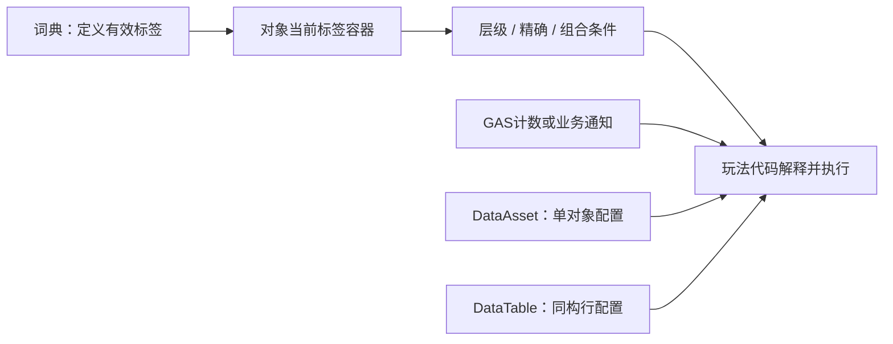
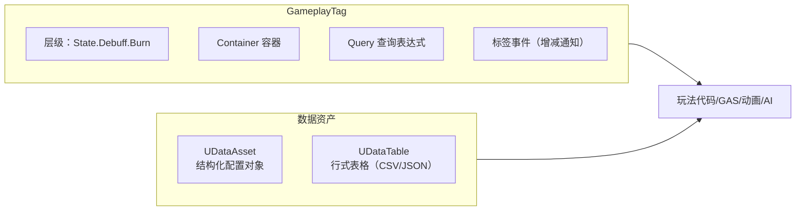

# 03 GameplayTag 与数据资产（DataAsset / DataTable）

> 知识成熟度：L2。标签匹配、数据资产与加载边界按官方文档/API选读静态核对；GAS事件部分仅有局部官方返回，限定为调用轮廓。全部代码为教学节选或明确标出的伪代码，未编译、未在引擎中运行。
> 版本基准：UE 5.5 官方文档/API，固定链接见第十节；不据此声称兼容全部UE5版本。
> 适用范围：GameplayTags身份与对象标签、配置资产选择、AssetManager读配置、DataTable导入与消费；面向具备UObject、UPROPERTY和基础C++知识的读者。
> 最后更新：2026-10-09，修正集合/查询、配置对象、资源加载与失败处理，保留原用途及历史全文。
> 未验证项：UE源码checkout、UHT、编译、PIE、GAS/网络、cook、设备与性能均未运行。历史UE5.8.0/CL55116800和Windows路径未重新取得，只按原记录保存在文末，不作为本轮本机观察。

## 一、概述

本文解决两类经常一起出现、但责任不同的问题：

1. 用统一的语义判断玩法条件：无敌、燃烧、技能流派、伤害类型，以及GAS、动画、AI、UI之间交流的状态名称。GameplayTag先定义名称，某对象的容器再记录它当前拥有的标签，玩法代码解释这些标签并决定行为。
2. 把配置从代码中提取出来：武器伤害与资源、关卡怪物配置、技能等级成长数据。DataAsset保存一份结构化配置，DataTable保存同构行；成长曲线也可引用相应曲线资产。字段是硬引用还是软引用、资源何时加载，仍需明确选择。

例如，武器配置的“火焰伤害类型”不等于受击者已有“燃烧状态”。程序可以规定火焰命中施加燃烧，但规则与执行由程序/GAS完成，标签名称不会自行造成该结果。同理，英雄配置里列出默认能力，不等于能力已经授予角色。



普通标签容器是一组值；计数、事件和运行时授权并不是这组值自动附带的能力。标签条件为真只能说明指定条件匹配，不能替代角色是否拥有能力、资源/冷却条件或服务端对请求的判断。

## 二、核心概念速览

| 概念 | 作用 | 容易混淆的边界 |
| --- | --- | --- |
| `FGameplayTag` | 表示已注册的层级名称，内部有`FName TagName` | 名字相同的身份，不是每个对象的状态存储，也不承诺自身包含某种性能缓存 |
| `FGameplayTagContainer` | 保存显式标签集合并支持父级匹配 | 集合不等于每个来源的叠层计数 |
| `FGameplayTagQuery` | 保存Any/All/None及其组合表达式 | 未配置Query和已构造的空子表达式须分别处理 |
| `UGameplayTagsManager` | 管理标签字典及名称解析 | `RequestGameplayTag`查找已定义身份，不是创建新玩法标签 |
| 原生标签宏 | 在C++模块中声明/定义标签 | 需GameplayTags模块依赖；定义来源不等于对象已经持有标签 |
| 标签ini源 | 配置导入标签字典 | 开启导入并检查实际来源；可按领域分到Config/Tags |
| 标签重定向 | 为旧名称指定新名称 | 属GameplayTagsSettings配置，不保证任意外部字符串/存档格式都迁移 |
| `UDataAsset` | 类实例中的结构化配置资产 | 资产实例不是其类的CDO；多方仍可能引用同一个实例 |
| `UPrimaryDataAsset` | 提供Primary ID及asset bundle支持 | ID、扫描注册、加载、cook/安装是不同条件 |
| `UDataTable` | 以行名索引同构结构体配置 | 表被加载不代表每个soft字段已加载 |
| `FDataTableRowHandle` | 表资产引用与RowName组合 | 方便选择但不保证行不被改名/删除，取行仍须检查 |

## 三、原理详解（GameplayTag）

### 3.1 标签的层次结构

点号表达语义层次，例如`Gameplay.Damage.Fire`、`Gameplay.Damage.Ice`、`Gameplay.Damage.Physical`、`State.Debuff.Burn`、`State.Debuff.Stun`及`Ability.Sprint`。层级匹配的方向是“具体标签可满足较宽的父标签要求”：

| 显式持有 | 查询 | 结果含义 |
| --- | --- | --- |
| Gameplay.Damage.Fire | HasTag(Gameplay.Damage) | 可匹配父级 |
| Gameplay.Damage.Fire | HasTagExact(Gameplay.Damage) | 不匹配，因为未显式持有该父标签 |
| Gameplay.Damage | HasTag(Gameplay.Damage.Fire) | 不匹配，宽泛类别没有指定具体子类型 |

这不是“拥有父就拥有所有子”。隐式父级匹配也不等于显式列表增加了父标签；读取显式列表或数量时要保持这个区分。C++容器以`HasTag`和`HasTagExact`等不同方法表达要求，不能给所有接口都加一个`bExactMatch`参数。

Restricted Tags管编辑协作：官方说明列出受限配置源及Owners，非owner编辑时会出现权限确认警告。这不是运行时安全ACL，也不会限制某角色使用某项技能。项目仍需把标签命名、谁生产/移除状态和业务判断规则写清楚。[S01][S02][S05]

### 3.2 标签的定义方式

以下为项目接入节选，未构建。C++使用处需依赖`GameplayTags`模块；Build.cs中依赖放Public还是Private取决于模块公开头是否暴露这些类型，不应机械照抄某个项目。注册的名称应稳定且有明确语义。

方式一：项目设置启用Import Tags From Config，可使用`Config/DefaultGameplayTags.ini`及`Config/Tags`中的源。下面是一份示例：

```ini
[/Script/GameplayTags.GameplayTagsSettings]
+GameplayTagList=(Tag="Gameplay.Damage.Fire",DevComment="火焰伤害类型")
+GameplayTagList=(Tag="State.Debuff.Burn",DevComment="燃烧状态")
```

方式二：原生标签。以下名字贯穿后续C++节选；选择这种定义时不必再把同一份示例逐项重复填进ini。

```cpp
// MyGameplayTags.h
#pragma once
#include "NativeGameplayTags.h"

UE_DECLARE_GAMEPLAY_TAG_EXTERN(TAG_Gameplay_Damage);
UE_DECLARE_GAMEPLAY_TAG_EXTERN(TAG_Gameplay_Damage_Fire);
UE_DECLARE_GAMEPLAY_TAG_EXTERN(TAG_Gameplay_Damage_Ice);
UE_DECLARE_GAMEPLAY_TAG_EXTERN(TAG_State_Debuff_Burn);
UE_DECLARE_GAMEPLAY_TAG_EXTERN(TAG_State_Dead);
```

```cpp
// MyGameplayTags.cpp
#include "MyGameplayTags.h"

UE_DEFINE_GAMEPLAY_TAG(TAG_Gameplay_Damage, "Gameplay.Damage");
UE_DEFINE_GAMEPLAY_TAG(TAG_Gameplay_Damage_Fire, "Gameplay.Damage.Fire");
UE_DEFINE_GAMEPLAY_TAG(TAG_Gameplay_Damage_Ice, "Gameplay.Damage.Ice");
UE_DEFINE_GAMEPLAY_TAG(TAG_State_Debuff_Burn, "State.Debuff.Burn");
UE_DEFINE_GAMEPLAY_TAG(TAG_State_Dead, "State.Dead");
```

ini、DataTable标签源和原生定义可以按项目治理共同使用；它们指向标签字典中的身份，但编辑流程、所属模块和加载时机并非完全相同。普通配置数据表也不会自动成为标签字典源：导入标签使用`GameplayTagTableRow`并在Gameplay Tag Table List登记。

`RequestGameplayTag`按名字查字典。缺失时不能靠重复Request补注册；应检查定义来源、导入开关、模块是否参与项目及实际标签名，并处理无效返回。外部文本编辑ini后需按官方说明重启编辑器以载入更改；不能把这条规则泛化为所有编辑器内修改都必须重启。[S01][S05][S07]

### 3.3 GameplayTagContainer 容器

下面只演示集合关系，假设上节标签已有效注册；所需容器均在节选中定义。示例没有GAS计数，也没有引擎运行输出。

```cpp
FGameplayTagContainer Tags;
Tags.AddTag(TAG_Gameplay_Damage_Fire);
Tags.AddTag(TAG_State_Debuff_Burn);

FGameplayTagContainer RequiredAll;
RequiredAll.AddTag(TAG_Gameplay_Damage_Fire);
FGameplayTagContainer FireOrIce;
FireOrIce.AddTag(TAG_Gameplay_Damage_Fire);
FireOrIce.AddTag(TAG_Gameplay_Damage_Ice);
FGameplayTagContainer DamageFilter;
DamageFilter.AddTag(TAG_Gameplay_Damage);

const bool HasFire = Tags.HasTag(TAG_Gameplay_Damage_Fire);
const bool HasDamage = Tags.HasTag(TAG_Gameplay_Damage);
const bool HasExplicitDamage = Tags.HasTagExact(TAG_Gameplay_Damage);
const bool HasAllExact = Tags.HasAllExact(RequiredAll);
const bool HasAnyDamage = Tags.HasAny(FireOrIce);

const FGameplayTagContainer Filtered = Tags.Filter(DamageFilter);
// Filtered保留Fire；Tags仍是Fire和Burn，Filter没有原地修改Tags。

FGameplayTagContainer Other;
Other.AddTag(TAG_Gameplay_Damage_Ice);
Tags.AppendTags(Other);
Tags.RemoveTag(TAG_State_Debuff_Burn);
```

`Filter`返回新容器，丢弃返回值就没有保存筛选结果；`FilterExact`只保留精确相交标签。`AppendTags`做合并，`AddTag`的普通集合用法不把重复加入同一Tag表示成第二层燃烧。

空要求也有明确含义：对空查询容器，`HasAny`为false，`HasAll`和`HasAllExact`为true，因为没有未满足的要求。如果业务要求“至少配置一个允许标签”，必须先做非空校验；集合的真值并不替你验证业务配置。[S02]

### 3.4 GameplayTagQuery 查询

查询把条件存成可在资产里编辑的表达式。要表示“火焰或冰霜类型，并且没有死亡状态”，实际组合应是下面这棵树，而不是三份互不相连的Query：

```text
查询树轮廓（编辑器表达式，不是C++调用语句）：
All Expressions Match
  Any Tags Match: Gameplay.Damage.Fire, Gameplay.Damage.Ice
  No Tags Match: State.Dead
```

树中两个子条件都为真，根条件才为真。蓝图/资产编辑界面可保存这种Query，使用方读取该字段再求值。下面保留C++快捷构造的使用方向；它用两个结果显式连接同一逻辑，另展示All构造器，不伪装成“已经生成上述复合Query资产”：

```cpp
FGameplayTagContainer RequiredAny;
RequiredAny.AddTag(TAG_Gameplay_Damage_Fire);
RequiredAny.AddTag(TAG_Gameplay_Damage_Ice);
FGameplayTagContainer RequiredAll;
RequiredAll.AddTag(TAG_Gameplay_Damage);
FGameplayTagContainer Forbidden;
Forbidden.AddTag(TAG_State_Dead);

const FGameplayTagQuery AnyDamage =
    FGameplayTagQuery::MakeQuery_MatchAnyTags(RequiredAny);
const FGameplayTagQuery AllDamage =
    FGameplayTagQuery::MakeQuery_MatchAllTags(RequiredAll);
const FGameplayTagQuery NoDead =
    FGameplayTagQuery::MakeQuery_MatchNoTags(Forbidden);

// Container由调用方提供，表示被检查对象的当前标签。
const bool MatchesRule = AnyDamage.Matches(Container) && NoDead.Matches(Container);
const bool MatchesAll = AllDamage.Matches(Container);
```

此版本已读的`FGameplayTagQuery::Matches`只接收一个容器参数。需要精确关系时，使用已核对的容器Exact方法重新表达条件，不能写`Query.Matches(Container, true)`。本轮也没有核对不同版本新增的精确Query构造器。

区分三种“空”：空required容器；已经构造且没有标签/子项的表达式；默认构造或Clear后的未配置Query。官方说明Any空集合没有匹配项，All和None空子集合可满足其逻辑；这不能推成“任何空Query都放行”。本例若Query资产是必填配置，业务先用`IsEmpty()`识别未配置并报错/拒绝，再调用`Matches`。不依赖未配置Query的默认真值完成授权。[S01][S03][S04]

### 3.5 标签事件（增减通知）

多个独立效果都让角色燃烧时，只存一个Tag不能说明还剩几个来源。计数达到0才表示全部燃烧来源都已移除；从2减到1仍在燃烧。UI可能只关心“存在/不存在”，也可能需要显示当前计数，应先明确通知用途。

`FGameplayTagCountContainer`属于GameplayAbilities模块，其官方局部API返回提供`RegisterGameplayTagEvent`和`UpdateTagCount`的方向。它不是只依赖GameplayTags的通用容器；不使用GAS的系统可自行管理来源和通知。本轮没有读到完整CountContainer、ASC或事件枚举声明，下面刻意是接入轮廓，不认证完整方法签名、默认参数或回调次数。

```text
GAS事件接入轮廓，待目标版本源码/项目核对：
1. 确认当前ASC和监听对象有效；记录当前绑定的ASC、标签、事件策略。
2. 通过该ASC公开的标签变化注册入口绑定回调，保存解除绑定所需的handle。
3. 读取当前状态初始化UI；不要假定“注册”自动补发当前状态。
4. 回调读取新的计数/存在性，按UI需求更新，不把回调本身当伤害或授予能力。
5. 监听对象结束、换ASC或重绑前，在原ASC解除原绑定；清理本地记录。
```

原示例中的`AnyCountChange`表示希望关注计数变化这一用途；零/非零变化与每次计数变化不同。这里不据局部返回断言具体枚举、回调参数或通知顺序已经核完，也不继续使用未获支持的`TagCounts.OnTagAdded/OnTagRemoved`字段作可复制代码。普通容器添加标签不会自动发送网络状态或完成GAS能力授予。[S14][S15]

### 3.6 标签重定向与改名

改名影响已保存的引用。已核对的`UGameplayTagsSettings`使用GameplayTags配置，项目设置编辑结果写入`Config/DefaultGameplayTags.ini`，其中有`GameplayTagRedirects`字段。示例上下文如下，不要求另建一个固定名的GameplayTagRedirectors.ini：

```ini
[/Script/GameplayTags.GameplayTagsSettings]
+GameplayTagRedirects=(OldTagName="State.Burn",NewTagName="State.Debuff.Burn")
```

先让新标签存在，再检查旧标签引用实际通过哪种读取/序列化路径进入系统。配置重定向与业务数据迁移不是同一件事：自定义存档中的裸字符串、外部表、缓存键可能需单独迁移或校验。本轮未读取相应存档实现，不能承诺一行配置会修好所有旧数据；旧/新数据样本仍需项目后续验证。命名稳定可减少这种成本。[S07]

## 四、原理详解（DataAsset / DataTable）

### 4.1 UDataAsset

DataAsset是保存数据的资产实例。用一份武器配置集中描述名称、基础伤害、效果类和模型，比在多个玩法对象里各写一组常量更容易统一修改。

下面是自写声明节选，未运行UHT/编译；需项目已有Engine及相关GameplayAbilities类型依赖，`WeaponDataAsset.generated.h`由UHT生成且置于最后一个include。项目导出宏用实际模块名替换。

```cpp
// WeaponDataAsset.h
#pragma once
#include "CoreMinimal.h"
#include "Engine/DataAsset.h"
#include "WeaponDataAsset.generated.h"

class UGameplayEffect;
class USkeletalMesh;

UCLASS(BlueprintType)
class MYGAME_API UWeaponDataAsset : public UDataAsset
{
    GENERATED_BODY()
public:
    UPROPERTY(EditAnywhere, BlueprintReadOnly, Category="Weapon")
    FName WeaponName;

    UPROPERTY(EditAnywhere, BlueprintReadOnly, Category="Weapon")
    float BaseDamage = 10.f;

    UPROPERTY(EditAnywhere, BlueprintReadOnly, Category="Weapon")
    TSubclassOf<UGameplayEffect> DamageEffectClass;

    UPROPERTY(EditAnywhere, BlueprintReadOnly, Category="Weapon")
    TObjectPtr<USkeletalMesh> Mesh;
};
```

创建流程保留为：项目中定义该类并完成项目构建后，在内容浏览器右键 → Miscellaneous → Data Asset → 选择该原生子类 → 编辑实例字段。本轮没有在编辑器执行这些步骤。[S08]

这里`DamageEffectClass`和受UPROPERTY管理的`Mesh`是硬引用选择；加载配置可能把其所引用资源一起带入。若模型需要延迟加载，可以把设计改成`TSoftObjectPtr<USkeletalMesh>`，但此后必须安排加载、完成判空及使用期间的持有。soft指针的`Get()`只查询已经驻留的对象，不会靠读取字段自动完成加载。[S10]

资产实例与CDO要分开：内容浏览器创建的是一个类的实例；Blueprint Class对应的类默认对象是另一种取默认数据的方式。两个角色引用同一DataAsset实例时，写该实例的内存字段可能被两方看见，原因是共享同一对象，并不需要把该对象称为CDO。建议把配置当只读输入，将当前血量、弹药等可变状态复制到各自的运行对象；内存变更本身也不等于持久写入资产文件。[S08][S09]

### 4.2 UPrimaryDataAsset 与 AssetManager

英雄配置可以有两种身份：`HeroTag`供玩法分类，`FPrimaryAssetId`供AssetManager寻址。它们互不替代。Primary ID由类型与名称组成；原生子类可按项目需要覆盖`GetPrimaryAssetId`。下面仍是声明节选，不是已构建工程：

```cpp
// HeroDataAsset.h
#pragma once
#include "CoreMinimal.h"
#include "Engine/DataAsset.h"
#include "Engine/AssetManagerTypes.h"
#include "GameplayTagContainer.h"
#include "HeroDataAsset.generated.h"

class UGameplayAbility;
class USkeletalMesh;

UCLASS(BlueprintType)
class MYGAME_API UHeroDataAsset : public UPrimaryDataAsset
{
    GENERATED_BODY()
public:
    UPROPERTY(EditAnywhere, BlueprintReadOnly, Category="Hero")
    FGameplayTag HeroTag;

    UPROPERTY(EditAnywhere, BlueprintReadOnly, Category="Hero")
    TArray<TSubclassOf<UGameplayAbility>> DefaultAbilities;

    UPROPERTY(EditAnywhere, BlueprintReadOnly, Category="Hero", meta=(AssetBundles="Presentation"))
    TSoftObjectPtr<USkeletalMesh> Mesh;

    virtual FPrimaryAssetId GetPrimaryAssetId() const override
    {
        return FPrimaryAssetId(FPrimaryAssetType(TEXT("HeroData")), GetFName());
    }
};
```

`DefaultAbilities`仍是原示例的能力类配置，不会因为资产被加载就自动给ASC授予能力；它也是硬类引用的选择。Mesh用soft字段并标Presentation bundle，说明“读配置”和“需要角色表现资源”可以有不同加载需求。[S08][S09]

把`HeroData:Hero_Archer`写出来，只提供一个寻址键。要通过AssetManager找到它，项目还需登记匹配的Primary Asset Type、资产基类、扫描目录，并分清扫描的是Blueprint Class还是普通资产实例。只有特殊功能才需要自定义AssetManager；本例不要求替换管理器。资产扫描能识别它，也不单独证明它已被cook、分发并安装在当前运行环境。[S09][S12]

以下自写调用节选只演示“请求→在回调查询对象→判空”，使用`Engine/AssetManager.h`、`Engine/StreamableManager.h`及上面的Hero类。priority显式给0，不依赖未展示的默认参数；空bundle明确只表示没有请求命名bundle。

```cpp
const FPrimaryAssetId Id(FPrimaryAssetType(TEXT("HeroData")), FName(TEXT("Hero_Archer")));
UAssetManager& Manager = UAssetManager::Get();
const TSharedPtr<FStreamableHandle> Request = Manager.LoadPrimaryAsset(
    Id,
    TArray<FName>{},
    FStreamableDelegate::CreateLambda([Id]()
    {
        UHeroDataAsset* Hero = Cast<UHeroDataAsset>(
            UAssetManager::Get().GetPrimaryAssetObject(Id));
        if (!Hero)
        {
            // 未取得可用的预期类型；记录Id与失败上下文，停止使用配置。
            return;
        }
        const FGameplayTag HeroKind = Hero->HeroTag;
        // 此处只在回调内借用Hero并读取值；未把裸Hero指针交给长期消费者。
        (void)HeroKind;
    }),
    0);
// Request是请求相关handle；其存在不等于Hero已经加载成功。
```

捕获`[Id]`避免使用未捕获的局部变量。这个节选没有外部消费者，所以没有解决UI/Actor在等待期间结束或用户已改选英雄的问题。实际接入时，调用方要在发起前记录自己当前的请求身份；回调通过弱对象引用/项目等价机制检查消费者仍有效且请求仍是当前选择。旧回调只能放弃本次消费，不能覆盖新选择，也不能无条件卸载另一消费者正在用的同一主资产。这里是有限的调用责任，不是完整调度器。[S13]

资源使用有四个不同的检查点：

| 阶段 | 本例应明确的责任 | 不能据此推断 |
| --- | --- | --- |
| 可发现/可获得 | Primary类型和扫描匹配；cook规则与内容安装覆盖此资产 | 有ID或soft路径就已在包内 |
| 加载完成 | 在完成路径检查对象存在、类型正确；需要Mesh时明确请求Presentation或自行加载该soft引用 | 请求handle非空或空bundle意味着所有资源可用 |
| 消费期间 | 主资产由相应AssetManager加载状态管理；额外soft资源需对应有效加载持有或消费者的受GC追踪强引用。把责任明确交给仍存活的持有者 | soft指针或一个回调局部裸指针能保证回调之后存活 |
| 使用结束 | 相应所有者停止消费，释放自己保存的强引用/handle，并按项目共享规则请求卸载主资产或bundle | 卸载调用能消灭其他人的引用、立即GC或立即归还所有内存 |

AssetManager的主资产管理与直接StreamableManager请求并非可以混用的一份寿命合同。官方异步加载示例说明回调期间的请求持有与回调后另行强持有的必要性；不能把该示例概括成所有AssetManager入口一回调就释放，或只靠soft字段长期保活。项目需让加载、持有和释放由同一套使用责任闭合。[S09][S10]

需要精确控制主资产发现和bundle生命周期时选UPrimaryDataAsset；一般资产也可通过soft路径/StreamableManager异步加载，不以继承Primary为异步加载的必要条件。ID重命名也属于资源身份迁移，应检查AssetManager的ID/类型/名称重定向设置，不能与GameplayTagRedirects混为一谈。[S09]

### 4.3 UDataTable

DataTable适合大量结构相同的怪物配置。行结构继承`FTableRowBase`，RowName是表内查找键；表里每一行不是自动生成的Actor。保留原四字段如下，仍是未编译声明节选：

```cpp
// MonsterRow.h
#pragma once
#include "CoreMinimal.h"
#include "Engine/DataTable.h"
#include "MonsterRow.generated.h"

class UBehaviorTree;

USTRUCT(BlueprintType)
struct FMonsterRow : public FTableRowBase
{
    GENERATED_BODY()

    UPROPERTY(EditAnywhere, BlueprintReadOnly)
    FText DisplayName;

    UPROPERTY(EditAnywhere, BlueprintReadOnly, meta=(ClampMin="0"))
    float MaxHealth = 100.f;

    UPROPERTY(EditAnywhere, BlueprintReadOnly)
    float MoveSpeed = 300.f;

    UPROPERTY(EditAnywhere, BlueprintReadOnly)
    TObjectPtr<UBehaviorTree> BehaviorTree;
};
```

这里BehaviorTree是硬资产引用；整张表被加载时可能带入引用资源。若改为soft字段，读取该行仍需另行加载该行为树。`ClampMin`表达编辑属性约束，不能替代业务在接受外部输入或运行时赋值时检查值域。

创建与导入：内容浏览器 → Miscellaneous → Data Table → 选择FMonsterRow；按所用导入流程选择CSV/JSON、行类型与导入选项，重导入时确认原文件路径。本文CSV样例约定第一列为Name，后续列对应字段；官方导入器还有Import Key Field及忽略额外/缺失字段选项，因此不能把“第一列必须字面叫Name、任何列差异都一定失败”当所有配置的规则。中文CSV建议统一UTF-8并检查实际显示；本轮未实测不同编码和BOM组合。[S11]

下面假定调用方有已配置的`TSoftObjectPtr<UDataTable> MonsterTable`。soft引用只改变寻址/加载方式，调用`LoadSynchronous()`仍是阻塞式读取路径，不能放在高频循环里后再称其已异步化；是否能接受阻塞需项目测量，本轮不给时延预算。

```cpp
UDataTable* Table = MonsterTable.LoadSynchronous();
if (!Table)
{
    return; // 未取得表，停止本次初始化。
}
const FMonsterRow* Row = Table->FindRow<FMonsterRow>(
    FName(TEXT("Goblin")), TEXT("LookupMonster"));
if (!Row)
{
    return; // 缺行或行结构不适用，不能继续解引用。
}
const float InitialHealth = Row->MaxHealth;
// 在当前有效作用域复制需要的配置值，再交给运行对象。
```

`FDataTableRowHandle`把表与RowName放在一起，适合UPROPERTY和蓝图细节面板，减少调用方拼字符串。它不保证改名、删行、换表后一定还能查到；取行失败必须走明确分支。返回行指针依赖表的当前数据，不应跨重导入、跨异步回调或长期缓存；持有表也不能保证重导入前的行内存不变。运行状态应复制所需值，而不是长期借用该指针。[S11]

## 五、代码示例

### 5.1 定义并使用原生标签

火焰/冰霜属于伤害类型，燃烧属于目标状态。使用3.2已定义标签，容器用AddTag构造；不依赖未获支持的双Tag构造函数。

```cpp
FGameplayTagContainer FireAndIce;
FireAndIce.AddTag(TAG_Gameplay_Damage_Fire);
FireAndIce.AddTag(TAG_Gameplay_Damage_Ice);

// VictimASC由调用方提供且生命周期有效；本段为GAS接入轮廓。
// 实际ASC方法签名和完整模块接入仍需目标项目核对。
```

项目规则可以是“如果有效目标的燃烧状态存在，则火焰伤害获得加成”。先检查目标/ASC有效，再查询`State.Debuff.Burn`，最后由伤害规则计算加成；只检查`Gameplay.Damage.Fire`不能证明目标正在燃烧。标签命中与数值变化之间必须有这一步业务解释，不把例中的加成规则写成引擎自带机制。

### 5.2 标签驱动的能力系统联动

保留CanActivateAbility中拒绝死亡角色的用途，下面是项目伪代码，不是省略签名后仍声称可以直接覆盖的C++实现：

```text
CanActivateAbility轮廓：
  ActorInfo或其ASC无效 → 按本例策略拒绝，停止解引用
  ASC拥有State.Dead → 拒绝本次激活
  否则 → 继续原有Super/能力系统的完整检查，并返回其结果
```

State.Dead是一个否决条件；没有它只表示“这项否决条件未命中”。能否激活还取决于能力是否已授予、成本、冷却及项目其他条件。原文的Tag容器用途保留在这一环，不扩展成完整能力授权/网络教程，也不以客户端自行拥有某个Tag替代有权执行者的判断。

### 5.3 DataTable 批量生成角色

RowHandle适合在关卡配置中选择怪物行，初始化时读取配置。以下是完整失败路径的项目伪代码，SpawnWorld、AMyMonster及InitFromConfig是项目概念，不是本篇已运行的接口：

```text
SpawnMonsterByRowName(Handle)：
  若Handle.DataTable为空 → 记录配置错误并结束
  从Handle.DataTable按Handle.RowName取FMonsterRow
  若缺行或行类型不适用 → 记录表、行名与上下文并结束
  在行仍有效的当前作用域复制需要的初始化值
  若本次没有有效的生成World/上下文 → 结束
  请求生成AMyMonster
  若生成结果为空 → 结束；不调用InitFromConfig
  对成功生成对象调用InitFromConfig(复制的配置)
```

若发起者是GameInstance，也要给出这次具体使用哪个World的前提，不能假设它天然指向一个永远可用的生成场景。若生成延后，不能把先前借用的Row裸指针带进回调；值副本及其中引用资源的寿命仍由消费者负责。批量初始化只是重复这条已检查路径，不承诺每条数据都会生成成功。

### 5.4 蓝图侧操作要点

- 标签：项目设置Gameplay Tags登记；用标签字面值、容器判断及Query编辑表达已有身份。不要把未核对的“Request Gameplay Tag”节点当动态建词典入口
- DataAsset：从类型匹配的资产引用读取字段；soft引用应先加载并走成功/失败路径，再读取对象字段
- DataTable：用Get Data Table Row等项目当前版本可用节点取行，处理Row Not Found路径；RowHandle方便在细节面板选择表和行
- Query资产：编辑组合树并保存；配置必填时先拒绝未配置状态，再解释匹配结果

这些是官方文档对应的编辑/读取方向，本轮未在蓝图编辑器核对每个节点的显示位置或实际引脚，项目落地仍要按目标版本确认。[S01][S08][S11]

## 六、最佳实践

1. 按用途分命名空间，如Gameplay、State、Ability、UI、Input；层级深浅以语义清楚为准，“2～4层”可以是团队约定，不是引擎限制
2. 集中治理字典和来源；ini、原生模块、标签表可共存。业务Request只负责查找，不靠查找创造新标签
3. 比较时使用FGameplayTag关系接口，避免把所有操作降成字符串前缀比较；FName的身份比较不以大小写区分，仍保持统一命名拼写。不据此声称固定性能收益或FGameplayTag有特定缓存布局
4. 跨系统组合状态适合Tag；数值在GAS中可交给Attribute体系，普通系统的bool/float也有合理用途，不能为了统一名称强引GAS
5. 单份异构配置倾向DataAsset，大量同构行倾向DataTable；需要主资产身份和bundle管理时再选Primary，普通soft资产同样可以异步加载
6. RowHandle减少表与行名分散配置，但调用方仍要处理表空、行丢失和类型变化，策划改表不会自动保证所有引用正确
7. CSV编码、键列、字段映射与导入选项作为一套约定审查；UTF-8是本文建议，不是已覆盖所有编码组合的测试结果
8. 共享配置按只读消费，每实例状态放运行对象；资源加载后明确持有者，用完释放自己的使用责任，不把资产对象称CDO或把Unload当立即回收保证

## 七、常见问题 FAQ

**Q1：蓝图/运行时找不到我的标签？**

依次检查字典定义、Import Tags From Config、实际标签源、原生模块是否参与项目，以及拼写/层级。外部编辑ini后按官方流程重启以载入；不要把所有编辑器内修改都归因于没重启。FName身份比较不区分大小写，旧文“标签大小写敏感”不适合作为排查依据；团队仍需统一大小写以便阅读。[S01][S05][S06]

**Q2：RequestGameplayTag返回无效？**

它查询已定义标签，不是注册函数；先检查IsValid，缺失时回到来源配置，不在热路径反复Request期待修复。已读父API页列出ErrorIfNotFound参数，但本轮子页不可访问，未核实具体日志/ensure形式，不保证传true就会得到某一种明确日志。[S05]

**Q3：标签改名后旧存档/配置失效？**

核对GameplayTagsSettings中的GameplayTagRedirects及新标签存在性，再核对数据实际读取路径。自定义裸字符串与存档版本迁移仍需项目处理；本文只给配置方向，不认证旧存档读取已成功。资源Primary ID重定向是另一套配置，不可混用。[S07][S09]

**Q4：DataTable导入CSV失败？**

检查选中的行结构是否正确继承FTableRowBase、Import Key Field与实际键列、字段映射、缺失/多余字段选项、字段导入支持及编码。先查看实际导入诊断，再定位具体输入；“所有列必须完全相等”“非Blueprint字段必失败”都不是充分诊断。[S11]

**Q5：DataAsset修改后游戏里没变化？**

确认编辑的资产是否就是引用目标，读的是资产实例还是Blueprint类默认数据，运行对象是否已经复制/缓存旧配置，soft引用是否成功加载，打包运行是否包含更新后的内容。修改内存对象不等于持久保存，编辑器/重导入/打包的数据时点也不同；本轮没有验证热重载，不给“一律重新加载就好”的处方。[S08–S11]

**Q6：如何把Tag状态接到GAS？**

先确定状态来源：由GameplayEffect提供的状态跟随对应效果的生效/移除；由业务管理的loose状态则由业务成对维护，避免来源遗失。不要把一个外部集合直接覆盖成ASC汇总计数，否则可能覆盖其他仍生效来源。这里保留GE与loose两种接入方向，但本轮没有读到完整5.5 ASC接口，具体调用、复制策略和目标版本参数待项目核对；不把CountContainer方法签名当ASC签名，也不倒填5.8新增参数。[S14][S15]

## 八、关联阅读

- [01-GameplayAbilitySystem能力系统](../技能战斗与属性结算/01-GameplayAbilitySystem能力系统.md)：继续学习Tag参与的激活条件、GE状态与能力流程，不把Tag命中视为完整授权。
- [02-EnhancedInput增强输入](../输入移动与交互/02-EnhancedInput增强输入.md)：按键方案可用Tag组织，例如Input.Action.Move。
- [04-委托事件与对象通信](../../03-引擎架构与资源系统/模块化框架与对象通信/04-委托事件与对象通信.md)：继续理解通知的绑定、解除及对象寿命。
- [05-蓝图与C++协作](05-蓝图与C++协作.md)：DataAsset / 行结构体暴露给蓝图的UPROPERTY / USTRUCT写法。
- [08-工具链与打包发布](../../../00_Index/学习路线/工程实践与质量.md)：资产cook、分发和更新对配置可获得性的影响。

## 九、验证与基准：有限纸面案例

本节全部为**PAPER_EXPECTED**：按已读语义与显式业务前提推导，未运行UE或替代模型。表中的true/false、数值与状态箭头不是引擎日志；文档格式检查也不验证这些运行行为。所有输入标签先约定已注册有效。

| 案例 | 输入与操作 | PAPER_EXPECTED | 反例/停止点 |
| --- | --- | --- | --- |
| P01 层级方向 | C显式只有Fire；查Damage、精确Damage；D显式只有Damage再查Fire | true、false、false；C显式列表仍只有Fire | 父不推出子；输入Tag无效先停止业务判断 |
| P02 空要求/集合 | C={Fire}；HasAny({})、HasAll({})、HasAllExact({})；再AddTag(Fire) | false、true、true；普通重复添加不增加独立条目 | 必填条件由业务另拒绝空配置；不把此例当默认Query真值 |
| P03 Filter | C={Fire,Burn}，过滤要求={Damage}；保存R=C.Filter(要求) | R={Fire}，C仍={Fire,Burn}；FilterExact结果为空 | 丢弃返回值没有原地筛选效果 |
| P04 组合/语义 | Q=任一Fire/Ice且无Dead；分别对{Fire}、{Ice,Dead}、{Burn}求值 | true、false、false | Burn不等于Fire；Q真也不证明能力已授予/可施放；必填Query未配置先拒绝 |
| P05 计数来源 | 明确两个独立燃烧来源各+1，再分别移除一个-1 | 总数0→1→2→1→0，存在性false→true→true→true→false | 只是纸面计数；不声称UE事件次数/顺序/复制，不用普通集合代替来源计数 |
| P06 主资产与soft | ID/类型/scan正确，Hero.Mesh为Presentation bundle soft字段；先空bundle读主资产，再提出表现资源需求 | 第一次不能假定Mesh.Get非空；第二次也要等完成并判有效才消费，消费期间保持明确强持有 | ID错、未scan、未cook/安装、完成后对象缺失、消费者失效或请求过期均停止本次消费；卸载不证明别人的引用消失 |
| P07 运行副本 | 两怪物读Goblin.MaxHealth=100，分别保存CurrentHealth；A受伤至70 | A=70、B=100、配置仍100 | 若写同一共享资产字段，两方可能同见改变；这不是CDO同义词，也非写盘实验 |
| P08 行与生成失败 | 表空、缺行、行类型不适用、Spawn结果空分别作为输入；成功行Goblin.MaxHealth=100 | 每个失败均不继续解引用/Init；成功分支在有效作用域复制100后初始化 | RowHandle不是永久有效键；旧Row指针不能跨重导入或延后生成缓存 |

实际项目后续验证应逐例记录目标UE版本、注册/资产配置、输入、动作及真实结果，并覆盖编辑器与目标包中的差异。没有这些记录前，本文维持L2，verified保持空；不把准备好的步骤记成运行完成。

## 十、来源定位与本轮阅读边界

以下都是固定UE5.5官方链接；只使用列出的实际返回内容，不声称15页都读到完整尾段或底层实现。正文[Sxx]编号用于对照此表；链接集中于此不表示总页可代替具体API。

| 编号 | 官方来源 | 实际选读与限制 |
| --- | --- | --- |
| S01 | [Gameplay Tags](https://dev.epicgames.com/documentation/unreal-engine/using-gameplay-tags-in-unreal-engine?application_version=5.5) | 定义/导入/原生宏、容器/查询与Restricted编辑段；不支持运行时安全权限推断 |
| S02 | [FGameplayTagContainer](https://dev.epicgames.com/documentation/unreal-engine/API/Runtime/GameplayTags/FGameplayTagContainer?application_version=5.5) | 返回至约123行内的构造、Has/Exact、Filter及显式计数；未据缺项判断其他版本API不存在 |
| S03 | [FGameplayTagQuery](https://dev.epicgames.com/documentation/unreal-engine/API/Runtime/GameplayTags/FGameplayTagQuery?application_version=5.5) | 组合树、Build/BuildQuery声明、MakeQuery与Matches；未编译官方示例 |
| S04 | [Query.Matches](https://dev.epicgames.com/documentation/en-us/unreal-engine/API/Runtime/GameplayTags/FGameplayTagQuery/Matches?application_version=5.5) | 实取单容器参数声明；不支持额外exact布尔参数 |
| S05 | [FGameplayTag](https://dev.epicgames.com/documentation/unreal-engine/API/Runtime/GameplayTags/FGameplayTag?application_version=5.5) | TagName、有效性、匹配方向与Request父页声明；Request子页未成功读取 |
| S06 | [FName](https://dev.epicgames.com/documentation/en-us/unreal-engine/fname-in-unreal-engine?application_version=5.5) | 身份存储、大小写与比较；未做性能测量 |
| S07 | [UGameplayTagsSettings](https://dev.epicgames.com/documentation/unreal-engine/API/Runtime/GameplayTags/UGameplayTagsSettings?application_version=5.5) | 配置归属、DefaultGameplayTags.ini与重定向字段；未核自定义存档实现 |
| S08 | [Data Assets](https://dev.epicgames.com/documentation/en-us/unreal-engine/data-assets-in-unreal-engine?application_version=5.5) | 资产实例、创建、Primary ID/bundle与Data Only Blueprint选择 |
| S09 | [Asset Management](https://dev.epicgames.com/documentation/en-us/unreal-engine/asset-management-in-unreal-engine?application_version=5.5) | 主要核对Primary/Secondary、class/instance、scan、bundle与load/unload；不展开动态注册实例 |
| S10 | [Asynchronous Asset Loading](https://dev.epicgames.com/documentation/en-us/unreal-engine/asynchronous-asset-loading-in-unreal-engine?application_version=5.5) | hard/soft、Get、完成/缺失及持有段；页面旧式StringReference示例未当本轮推荐代码 |
| S11 | [Data Driven Gameplay](https://dev.epicgames.com/documentation/en-us/unreal-engine/data-driven-gameplay-elements-in-unreal-engine?application_version=5.5) | 行结构、Import Key Field、RowHandle和行指针范围；曲线段仅保留原成长配置用途，不新增曲线算法 |
| S12 | [Cooking and Chunking](https://dev.epicgames.com/documentation/unreal-engine/cooking-content-and-creating-chunks-in-unreal-engine?application_version=5.5) | 实际返回到约102行，使用scan/Primary rules/cook关系；未运行cook，不泛化pak/IoStore |
| S13 | [LoadPrimaryAsset](https://dev.epicgames.com/documentation/unreal-engine/API/Runtime/Engine/Engine/UAssetManager/LoadPrimaryAsset?application_version=5.5) | 已返回关键声明：ID、bundles、delegate、priority及handle返回；未展示默认实参，不认证调度/失败全部细节 |
| S14 | [RegisterGameplayTagEvent](https://dev.epicgames.com/documentation/unreal-engine/API/Plugins/GameplayAbilities/FGameplayTagCountContainer/RegisterGameplayTagEvent?application_version=5.5) | 仅官方检索局部返回：模块、有限签名与通知说明；直接open失败，不是完整CountContainer或ASC阅读 |
| S15 | [UpdateTagCount](https://dev.epicgames.com/documentation/en-us/unreal-engine/API/Plugins/GameplayAbilities/FGameplayTagCountContainer/UpdateTagCount/2?application_version=5.5) | 仅官方检索局部返回支持delta与零/非零转换；直接open为0行，不支持通知时序/网络保证 |

检索过程还出现5.3/5.6/5.7/5.8页面及失败返回，均未混作上述5.5合同。5.6 Data Assets和多项Tag API、5.5部分CountContainer/事件枚举/ASC/Request子页不可访问或Cache miss；UnloadPrimaryAsset子页也失败。相邻主页面可读不表示子页已读。没有因此补写不存在的源码核对或运行结果。

历史部分能恢复已取得的7个Git版本。除此之外，初稿生成过程、旧Windows Build.version/源码取证、历史编译/PIE原始结果未取得；只说明当前缺少材料，不推断历史从未执行，也不补造旧raw。

## 历史原文与逐字恢复

本节保存历史资料，不是现行API或本轮运行事实。下面 whole 块为42e15c29基线当前全文的唯一完整副本；依次应用后列逆向零上下文差异可以还原每一已取历史版本。来源中的旧链接、Windows路径、版本/编译声称均按当时原字节保存，本轮未执行或补造其旧raw。

### 当前全文（whole）

~~~~~~~~text
---
type: Concept
title: "03 GameplayTag 与数据资产（DataAsset / DataTable）"
status: stable
verified: []
maturity: L2
---
# 03 GameplayTag 与数据资产（DataAsset / DataTable）
> 知识成熟度：L2（本轮审计修订时补标）。

> 版本基准：UE 5.8.0（本机 `Engine/Build/Build.version`：CL 55116800，分支 `++UE5+Release-5.8`）。
> 源码依据：`C:\Program Files\Epic Games\UE_5.8\Engine\Source\Runtime\GameplayTags`；数据资产部分另参考 `CoreUObject`/`Engine` 运行时模块。
> 适用范围：GameplayTags、DataAsset/DataTable 的运行时使用与编辑器配置；本文是概念/使用层说明。
> 兼容性边界：UE 4.27/早期 UE5 仅作为迁移对照，不作为当前基准。
> 最后更新：2026-08-05（统一 UE5.8 版本基线）。
> 官方参考：[Unreal Engine UE5.8 官方文档总页](https://dev.epicgames.com/documentation/en-us/unreal-engine)。

## 一、概述

玩法逻辑中最常见的两类"配置需求"：

1. **运行时状态与语义标记**：角色是否无敌？这个技能属于哪个流派？这个伤害是不是"火焰"？——用 **GameplayTag** 表达。它是一个带层级、可组合、可查询的轻量标记系统，是 GAS、动画、AI、UI 之间通用的"语言"。
2. **数值与结构化配置**：武器伤害表、关卡怪物配置、技能等级成长曲线——用 **DataAsset / DataTable** 表达。它们把数据从代码中剥离，让策划在编辑器里直接编辑，且天然支持软引用与资源管理。



## 二、核心概念速览

| 概念 | 类型 | 作用 | 关键点 |
| --- | --- | --- | --- |
| `FGameplayTag` | 结构体 | 单个标签（句柄式，底层为 FName + 缓存索引） | 语义：`Parent.Child.Grandchild` |
| `FGameplayTagContainer` | 结构体 | 标签集合，支持包含关系运算 | `HasTag` / `HasAll` / `HasAny` / 过滤 |
| `FGameplayTagQuery` | 结构体 | 复合查询表达式（与/或/非） | 可资产化保存 |
| `UGameplayTagsManager` | 单例 | 标签注册表与解析 | `RequestGameplayTag(FName)` |
| 原生标签 | 宏 | C++ 静态声明标签 | `UE_DECLARE/UE_DEFINE_GAMEPLAY_TAG` |
| 标签源文件 | ini | 声明标签列表 | `DefaultGameplayTags.ini` |
| 标签重定向 | ini | 标签改名兼容 | `GameplayTagRedirectors.ini` |
| `UDataAsset` | 类 | 编辑器中可创建的数据对象 | 继承后加 UPROPERTY 字段 |
| `UPrimaryDataAsset` | 类 | 带 AssetManager 主资产 ID 的 DataAsset | `GetPrimaryAssetId()` |
| `UDataTable` | 类 | 行式表格 | 行结构体继承 `FTableRowBase` |
| `FDataTableRowHandle` | 结构体 | 表 + 行名的引用 | 编辑器友好的下拉选择 |

## 三、原理详解（GameplayTag）

### 3.1 标签的层次结构

GameplayTag 用点号分隔表达层级：

```
Gameplay.Damage.Fire
Gameplay.Damage.Ice
Gameplay.Damage.Physical
State.Debuff.Burn
State.Debuff.Stun
Ability.Sprint
```

关键规则：

- **父标签隐含子标签**：拥有 `Gameplay.Damage.Fire` 即隐含拥有 `Gameplay.Damage` 与 `Gameplay`；
- 查询时可用 `bExactMatch` 控制是否只匹配精确标签；
- 标签在启动时注册进 `UGameplayTagsManager`，运行时通过 `RequestGameplayTag(FName)` 获取句柄，**不要**在运行时频繁创建新标签；
- 标签可被标记为"受限标签"（Restricted），限制其被使用的位置。

### 3.2 标签的定义方式

**方式一：ini 文件**（`Config/DefaultGameplayTags.ini`）

```ini
[/Script/GameplayTags.GameplayTagsSettings]
+GameplayTagList=(Tag="Gameplay.Damage.Fire",DevComment="火焰伤害")
+GameplayTagList=(Tag="State.Debuff.Burn",DevComment="燃烧状态")
```

**方式二：原生标签（C++，UE 5.x 推荐）**

```cpp
// MyGameplayTags.h
#pragma once
#include "NativeGameplayTags.h"

UE_DECLARE_GAMEPLAY_TAG_EXTERN(TAG_Gameplay_Damage_Fire);
UE_DECLARE_GAMEPLAY_TAG_EXTERN(TAG_State_Debuff_Burn);
```

```cpp
// MyGameplayTags.cpp
#include "MyGameplayTags.h"

UE_DEFINE_GAMEPLAY_TAG(TAG_Gameplay_Damage_Fire, "Gameplay.Damage.Fire");
UE_DEFINE_GAMEPLAY_TAG(TAG_State_Debuff_Burn, "State.Debuff.Burn");
```

原生标签在模块加载时自动注册，IDE 中可全局搜索，且与 ini 标签完全等价。

### 3.3 GameplayTagContainer 容器

容器是标签的**运行时集合**，典型操作：

```cpp
FGameplayTagContainer Tags;
Tags.AddTag(TAG_Gameplay_Damage_Fire);
Tags.AddTag(TAG_State_Debuff_Burn);

// 包含关系（非精确：父标签也算）
bool bHasFire = Tags.HasTag(TAG_Gameplay_Damage_Fire);          // true
bool bHasDamage = Tags.HasTag(FGameplayTag::RequestGameplayTag("Gameplay.Damage")); // true（隐含父标签）
bool bHasAll = Tags.HasAllExact(Tags2);                          // 精确包含全部
bool bHasAny = Tags.HasAny(FireOrIceContainer);                  // 至少包含其一

Tags.Filter(FilterContainer);        // 仅保留 FilterContainer 中的标签（含父级语义）
Tags.AppendTags(Other);              // 合并
Tags.RemoveTag(TAG_State_Debuff_Burn);
```

> GAS 中"能力能否激活"、"GE 是否免疫"的判断几乎全部基于 Container 运算，这是 Tag 最重要的用法。

### 3.4 GameplayTagQuery 查询

当条件复杂（如"拥有 A 或 B，且不拥有 C"）时用查询表达式：

```cpp
// 静态构造（C++）
FGameplayTagQuery Query = FGameplayTagQuery::MakeQuery_MatchAnyTags(RequiredAny);
FGameplayTagQuery QueryAll = FGameplayTagQuery::MakeQuery_MatchAllTags(RequiredAll);
FGameplayTagQuery QueryNone = FGameplayTagQuery::MakeQuery_MatchNoTags(Forbidden);

bool bMatch = Query.Matches(Container);            // 匹配
bool bMatchExact = Query.Matches(Container, true); // 精确匹配
```

蓝图侧 `Make Gameplay Tag Query` 节点可交互式拼装查询；查询还可作为 UPROPERTY 资产字段保存。

### 3.5 标签事件（增减通知）

监听某个标签的增减（GAS 中由 `FGameplayTagCountContainer` 维护计数）：

```cpp
// 通过 ASC 监听（GAS 环境）
AbilitySystemComponent->RegisterGameplayTagEvent(
    TAG_State_Debuff_Burn,
    EGameplayTagEventType::AnyCountChange
).AddUObject(this, &UMyComponent::OnBurnTagChanged);

// 通用标签计数（非 GAS 也可用）
FGameplayTagCountContainer TagCounts;
TagCounts.UpdateTagCount(TAG_State_Debuff_Burn, 1);
TagCounts.OnTagAdded.AddUObject(...);
TagCounts.OnTagRemoved.AddUObject(...);
```

### 3.6 标签重定向与改名

改名后旧标签会失效，用 `Config/GameplayTagRedirectors.ini` 兼容：

```ini
[/Script/GameplayTags.GameplayTagsSettings]
+GameplayTagRedirects=(OldTagName="State.Burn",NewTagName="State.Debuff.Burn")
```

## 四、原理详解（DataAsset / DataTable）

### 4.1 UDataAsset

`UDataAsset` 是"编辑器里可创建、可编辑字段的普通 UObject 资产"。用法：

```cpp
// 武器配置
UCLASS(BlueprintType)
class MYGAME_API UWeaponDataAsset : public UDataAsset
{
    GENERATED_BODY()
public:
    UPROPERTY(EditAnywhere, BlueprintReadOnly, Category = "Weapon")
    FName WeaponName;

    UPROPERTY(EditAnywhere, BlueprintReadOnly, Category = "Weapon")
    float BaseDamage = 10.f;

    UPROPERTY(EditAnywhere, BlueprintReadOnly, Category = "Weapon")
    TSubclassOf<UGameplayEffect> DamageEffectClass;

    UPROPERTY(EditAnywhere, BlueprintReadOnly, Category = "Weapon")
    TObjectPtr<USkeletalMesh> Mesh;
};
```

在内容浏览器：右键 → Miscellaneous → **Data Asset** → 选择 `UWeaponDataAsset`，即可创建并编辑实例。

### 4.2 UPrimaryDataAsset 与 AssetManager

`UPrimaryDataAsset` 在 DataAsset 基础上增加主资产 ID，可被 AssetManager 统一管理与异步加载：

```cpp
UCLASS(BlueprintType)
class MYGAME_API UHeroDataAsset : public UPrimaryDataAsset
{
    GENERATED_BODY()
public:
    UPROPERTY(EditAnywhere, BlueprintReadOnly, Category = "Hero")
    FGameplayTag HeroTag;

    UPROPERTY(EditAnywhere, BlueprintReadOnly, Category = "Hero")
    TArray<TSubclassOf<UGameplayAbility>> DefaultAbilities;

    virtual FPrimaryAssetId GetPrimaryAssetId() const override
    {
        return FPrimaryAssetId(TEXT("HeroData"), GetFName());
    }
};
```

```cpp
// 异步加载示例（AssetManager）
FPrimaryAssetId Id(TEXT("HeroData"), TEXT("Hero_Archer"));
UAssetManager::Get().LoadPrimaryAsset(Id, {}, FStreamableDelegate::CreateLambda([]()
{
    if (UHeroDataAsset* Hero = Cast<UHeroDataAsset>(
        UAssetManager::Get().GetPrimaryAssetObject(Id)))
    {
        // 使用配置
    }
}));
```

### 4.3 UDataTable

`UDataTable` 是"行式表格"，行结构体必须继承 `FTableRowBase`：

```cpp
// 怪物表行结构
USTRUCT(BlueprintType)
struct FMonsterRow : public FTableRowBase
{
    GENERATED_BODY()

    UPROPERTY(EditAnywhere, BlueprintReadOnly)
    FText DisplayName;

    UPROPERTY(EditAnywhere, BlueprintReadOnly, meta = (ClampMin = "0"))
    float MaxHealth = 100.f;

    UPROPERTY(EditAnywhere, BlueprintReadOnly)
    float MoveSpeed = 300.f;

    UPROPERTY(EditAnywhere, BlueprintReadOnly)
    TObjectPtr<UBehaviorTree> BehaviorTree;
};
```

创建与导入：

1. 内容浏览器右键 → **Miscellaneous → Data Table** → 选择行结构体 `FMonsterRow`；
2. 右键 → **Reimport** 支持从 **CSV / JSON** 导入（CSV 第一列必须为 `Name`，其余列与 UPROPERTY 字段名一致）；
3. 编辑器中直接增删行，RowName 唯一标识一行。

运行时查询：

```cpp
// C++
if (UDataTable* Table = MonsterTable.LoadSynchronous())
{
    const FMonsterRow* Row = Table->FindRow<FMonsterRow>(
        TEXT("Goblin"), TEXT("LookupMonster"));
    if (Row)
    {
        const float HP = Row->MaxHealth;
    }
}

// 蓝图
// Get Data Table Row 节点（UDataTableFunctionLibrary），或直接解引用 FDataTableRowHandle
```

**FDataTableRowHandle**（表 + 行名的组合引用）特别适合作为 UPROPERTY 字段暴露给策划，在编辑器里以下拉方式选择行，避免硬编码 RowName 字符串。

## 五、代码示例

### 5.1 定义并使用原生标签

```cpp
// 见上文 MyGameplayTags.h/.cpp；使用处：
const FGameplayTag FireTag = TAG_Gameplay_Damage_Fire;
const FGameplayTagContainer FireAndIce(FireTag, IceTag);

if (VictimASC->HasMatchingGameplayTag(FireTag))
{
    // 目标正着火：伤害加成
}
```

### 5.2 标签驱动的能力系统联动

```cpp
// 用标签判断"能否施放"
bool UMyGameplayAbility::CanActivateAbility(...) const
{
    // 拥有 State.Dead 则不可施放
    if (ActorInfo->AbilitySystemComponent->HasMatchingGameplayTag(TAG_State_Dead))
    {
        return false;
    }
    return Super::CanActivateAbility(Handle, ActorInfo, ActivationInfo);
}
```

### 5.3 DataTable 批量生成角色

```cpp
void UMyGameInstance::SpawnMonsterByRowName(const FDataTableRowHandle& Handle)
{
    if (!Handle.DataTable) return;
    const FMonsterRow* Row = Handle.DataTable->FindRow<FMonsterRow>(
        Handle.RowName, TEXT("SpawnMonster"));
    if (!Row) return;

    // 根据配置生成角色（示例略去 Spawn 细节）
    AMyMonster* Monster = ...;
    Monster->InitFromConfig(*Row);
}
```

### 5.4 蓝图侧操作要点

- 标签：Project Settings → **Gameplay Tags** 页签可查看/新增；蓝图节点 `Make Literal Gameplay Tag` / `Has Tag` / `Make Gameplay Tag Query`；
- DataAsset：创建后在任何 UPROPERTY 引用处选择；蓝图里 `Get` 引用即可读字段；
- DataTable：`Get Data Table Row` 节点；`FDataTableRowHandle` 字段直接在细节面板选行；
- 动态标签：`Gameplay Tags → Request Gameplay Tag` 节点（尽量少用，优先静态定义）。

## 六、最佳实践

1. **标签命名统一前缀**：按领域分顶层（`Gameplay.` / `State.` / `Ability.` / `UI.` / `Input.`），层级 2~4 层为宜；
2. **集中管理**：标签要么集中在 ini，要么集中在原生标签模块；禁止在业务代码里随手 `FGameplayTag::RequestGameplayTag` 造新标签；
3. **永远用对象不用字符串**：比较用 `FGameplayTag` 句柄（底层索引缓存），避免字符串比较与 FName 解析开销；
4. **状态用 Tag、数值用 Attribute**：避免用 bool 数组表达状态，Tag 容器天然支持组合与查询；
5. **DataAsset 用于"结构化单对象配置"，DataTable 用于"批量同构数据"**；需要异步加载/资产管理用 `UPrimaryDataAsset`；
6. **RowHandle 优于裸 RowName**：字段类型用 `FDataTableRowHandle`，策划改表不炸代码；
7. **CSV 编码**：中文 CSV 导入注意 UTF-8（带 BOM 亦可），列名与字段名严格一致；
8. **不要运行时改 DataAsset 实例**：资产是共享引用（CDO 语义），运行时改动影响所有引用方；需要可变数据请复制到运行对象。

## 七、常见问题 FAQ

**Q1：蓝图/运行时找不到我的标签？**
ini 标签需重启编辑器生效；原生标签需确认宏所在模块已编译并链接；检查标签名拼写（大小写敏感）。

**Q2：`RequestGameplayTag` 返回空？**
标签未注册或拼写错误。`bErrorIfNotFound` 传 true 时会在日志给出明确报错；不要在生产代码里用它动态造标签。

**Q3：标签改名后旧存档/配置失效？**
使用 `GameplayTagRedirectors.ini` 配置重定向；命名确定后尽量少改。

**Q4：DataTable 导入 CSV 失败？**
检查：第一列是否叫 `Name`；列名是否与 UPROPERTY 字段名一致；文件编码（推荐 UTF-8）；行结构体是否继承 `FTableRowBase`；是否有非蓝图兼容类型字段。

**Q5：DataAsset 修改后游戏里没变化？**
确认引用的是同一资产（检查硬引用/软引用路径）；运行时修改实例不会持久化到资产；热重载后需重新加载资产。

**Q6：如何在运行时把 Tag 集合复制给 GAS？**
`ASC->SetTagMapCount(Tag, Count)` / `UpdateTagMap`，或通过 GE 的 `GrantedTags` 在效果生效时自动添加。

## 八、关联阅读

- [01-GameplayAbilitySystem能力系统](../技能战斗与属性结算/01-GameplayAbilitySystem能力系统.md)：GAS 的激活条件、GE 免疫、状态表达全部依赖 GameplayTag。
- [02-EnhancedInput增强输入](../输入移动与交互/02-EnhancedInput增强输入.md)：按键方案可用 Tag 组织（`Input.Action.Move`）。
- [04-委托事件与对象通信](../../03-引擎架构与资源系统/模块化框架与对象通信/04-委托事件与对象通信.md)：标签变化通过委托/回调通知 UI 与逻辑层。
- [05-蓝图与C++协作](05-蓝图与C++协作.md)：DataAsset / 行结构体暴露给蓝图的 UPROPERTY / USTRUCT 写法。
- [08-工具链与打包发布](../../../00_Index/学习路线/工程实践与质量.md)：资产打包与热更新对 DataAsset 的影响。
~~~~~~~~

### 历史身份 49b0a565

此版本路径：知识/05-Gameplay与交互系统/玩法架构与任务协作/03-GameplayTag与数据资产.md

字节数：15155；Git blob：b76ecc593acbd7315ba0dde3b5d459b832aaf5df；SHA256：dbbba66f3168b99014c930baa2582d33eae22a39014fb82d419a957bc8689a8d

~~~~~~~~text
49b0a565f5c36f4646b020dc026c3f82501d1780
赵志琦(Zhao Zhiqi)
74356113+fantuan812@users.noreply.github.com
2026-10-04T18:36:50+08:00
GitHub
noreply@github.com
2026-10-04T18:36:50+08:00
收敛八域学习路线与旧入口，补齐 expected 契约实验 (#17)

完成学习路线与旧导航收口，保全书籍、工作日志与核心正文；修正 expected 存储和异常边界并新增可运行证据。独立审查及 Linux/Windows CI 通过。
~~~~~~~~

### 历史身份 79bb4a9e

此版本路径：知识/05-Gameplay与交互系统/玩法架构与任务协作/03-GameplayTag与数据资产.md

字节数：15159；Git blob：f8c56aee8f7acb46f3f57dd81f26a9d5d26d77d6；SHA256：e8bca7db66ab47bf4565f064060c5be7b24396fd2ca87de815df3d7afd47f7b4

~~~~~~~~text
79bb4a9ecb084d5765bcced9b5b4c586666f6d30
赵志琦(Zhao Zhiqi)
74356113+fantuan812@users.noreply.github.com
2026-10-04T17:42:14+08:00
GitHub
noreply@github.com
2026-10-04T17:42:14+08:00
完成八域核心知识迁移并校正网络复制与样例配置说明 (#16)

完成剩余209篇核心正文迁移及五篇技术校订，保全282份书籍和工作日志；样例配置占位及说明单独核验。本地全量门禁、独立审查与最终head Linux/Windows CI通过。
~~~~~~~~

### 历史身份 9beb653a

此版本路径：游戏知识/03-游戏玩法编程/03-GameplayTag与数据资产.md

字节数：15016；Git blob：fa03e2eef91a67a55d1914609c82caddcfa2d8a0；SHA256：95ee8151b3ac0d0fc1abb2e9eb6931a54ac105abf53e3e4265c413d426890257

~~~~~~~~text
9beb653aa267a4a0dbcf44a32fa21ce205cc3ce5
fantuan812
fantuan812@users.noreply.github.com
2026-08-20T17:53:26+08:00
fantuan812
fantuan812@users.noreply.github.com
2026-08-20T17:53:26+08:00
更新知识体系：接入OKF并完成全库元数据迁移（369篇）

~~~~~~~~

### 历史身份 2653b9e0

此版本路径：游戏知识/03-游戏玩法编程/03-GameplayTag与数据资产.md

字节数：14886；Git blob：46ccd7bf9a049da565c97d37fbce1dab685a689c；SHA256：edac9f04efa2858d4a53463146c2ddc78dbe54927adad4978321b1e54233270d

~~~~~~~~text
2653b9e01c9e9664429ba6225eed6853db30426e
fantuan812
fantuan812@users.noreply.github.com
2026-08-14T10:12:59+08:00
fantuan812
fantuan812@users.noreply.github.com
2026-08-14T10:12:59+08:00
更新知识库：首轮审查整改落地（成熟度补标/互链修复/术语统一/重命名与结构调整，209 文件）

~~~~~~~~

### 历史身份 27b9549f

此版本路径：游戏知识/03-游戏玩法编程/03-GameplayTag与数据资产.md

字节数：14830；Git blob：642c8b0a3d438569965742a333f3447a03d9fd44；SHA256：d96cd2dfb10ab66a13120d59cb368aabbaca05d87b0674667eafe477e0e258cc

~~~~~~~~text
27b9549fd65ac78c1306b77f88f2384880cf8c2f
fantuan812
fantuan812@users.noreply.github.com
2026-08-06T12:45:38+08:00
fantuan812
fantuan812@users.noreply.github.com
2026-08-06T12:45:38+08:00
完善游戏知识元数据：引擎渲染与玩法（3类）

~~~~~~~~

### 历史身份 94fc6623

此版本路径：游戏知识/03-游戏玩法编程/03-GameplayTag与数据资产.md

字节数：14708；Git blob：107d9d82c852a15e9c50a7dfc00ed50a7e7db54b；SHA256：43bd155f1230f3f19bee24bdd0400c26387721f2add0fed1e9811af3d405005b

~~~~~~~~text
94fc66230b2d4a893e881ee6802e8e67bb56d3e3
fantuan812
fantuan812@users.noreply.github.com
2026-08-05T21:12:09+08:00
fantuan812
fantuan812@users.noreply.github.com
2026-08-05T21:12:09+08:00
维护同步：统一UE5.8版本基线元数据，落库学习基建（lessons/log/规范/脚本）与源码覆盖路线图

~~~~~~~~

### 历史身份 a9020624

此版本路径：游戏知识/03-游戏玩法编程/03-GameplayTag与数据资产.md

字节数：14409；Git blob：6ff3ed13a7c6d7187449be5adfbb78899d5611ec；SHA256：ebe95451642507383a5a4b69ee1e7e8eb8302d9357f8ef3ecb9fd0efa7cf0d30

~~~~~~~~text
a90206240792bc881ddbc44374b47733a837107d
fantuan812
fantuan812@users.noreply.github.com
2026-08-03T19:03:18+08:00
fantuan812
fantuan812@users.noreply.github.com
2026-08-03T19:03:18+08:00
新增游戏知识：UE客户端开发系统化知识库（8大分类41篇）

~~~~~~~~

### 逆向差异 49b0a565 → 79bb4a9e

~~~~~~~~diff
--- 49b0a565f5c36f4646b020dc026c3f82501d1780
+++ 79bb4a9ecb084d5765bcced9b5b4c586666f6d30
@@ -382 +382 @@
-- [08-工具链与打包发布](../../../00_Index/学习路线/工程实践与质量.md)：资产打包与热更新对 DataAsset 的影响。
+- [08-工具链与打包发布](../../../游戏知识/08-工具链与打包发布/README.md)：资产打包与热更新对 DataAsset 的影响。
~~~~~~~~

### 逆向差异 79bb4a9e → 9beb653a

~~~~~~~~diff
--- 79bb4a9ecb084d5765bcced9b5b4c586666f6d30
+++ 9beb653aa267a4a0dbcf44a32fa21ce205cc3ce5
@@ -378,3 +378,3 @@
-- [01-GameplayAbilitySystem能力系统](../技能战斗与属性结算/01-GameplayAbilitySystem能力系统.md)：GAS 的激活条件、GE 免疫、状态表达全部依赖 GameplayTag。
-- [02-EnhancedInput增强输入](../输入移动与交互/02-EnhancedInput增强输入.md)：按键方案可用 Tag 组织（`Input.Action.Move`）。
-- [04-委托事件与对象通信](../../03-引擎架构与资源系统/模块化框架与对象通信/04-委托事件与对象通信.md)：标签变化通过委托/回调通知 UI 与逻辑层。
+- [01-GameplayAbilitySystem能力系统](01-GameplayAbilitySystem能力系统.md)：GAS 的激活条件、GE 免疫、状态表达全部依赖 GameplayTag。
+- [02-EnhancedInput增强输入](02-EnhancedInput增强输入.md)：按键方案可用 Tag 组织（`Input.Action.Move`）。
+- [04-委托事件与对象通信](04-委托事件与对象通信.md)：标签变化通过委托/回调通知 UI 与逻辑层。
@@ -382 +382 @@
-- [08-工具链与打包发布](../../../游戏知识/08-工具链与打包发布/README.md)：资产打包与热更新对 DataAsset 的影响。
+- [08-工具链与打包发布](../08-工具链与打包发布/README.md)：资产打包与热更新对 DataAsset 的影响。
~~~~~~~~

### 逆向差异 9beb653a → 2653b9e0

~~~~~~~~diff
--- 9beb653aa267a4a0dbcf44a32fa21ce205cc3ce5
+++ 2653b9e01c9e9664429ba6225eed6853db30426e
@@ -1,7 +0,0 @@
----
-type: Concept
-title: "03 GameplayTag 与数据资产（DataAsset / DataTable）"
-status: stable
-verified: []
-maturity: L2
----
~~~~~~~~

### 逆向差异 2653b9e0 → 27b9549f

~~~~~~~~diff
--- 2653b9e01c9e9664429ba6225eed6853db30426e
+++ 27b9549fd65ac78c1306b77f88f2384880cf8c2f
@@ -1,2 +1 @@
-# 03 GameplayTag 与数据资产（DataAsset / DataTable）
-> 知识成熟度：L2（本轮审计修订时补标）。
+# 03 · GameplayTag 与数据资产（DataAsset / DataTable）
~~~~~~~~

### 逆向差异 27b9549f → 94fc6623

~~~~~~~~diff
--- 27b9549fd65ac78c1306b77f88f2384880cf8c2f
+++ 94fc66230b2d4a893e881ee6802e8e67bb56d3e3
@@ -8 +7,0 @@
-> 官方参考：[Unreal Engine UE5.8 官方文档总页](https://dev.epicgames.com/documentation/en-us/unreal-engine)。
~~~~~~~~

### 逆向差异 94fc6623 → a9020624

~~~~~~~~diff
--- 94fc66230b2d4a893e881ee6802e8e67bb56d3e3
+++ a90206240792bc881ddbc44374b47733a837107d
@@ -3,5 +3 @@
-> 版本基准：UE 5.8.0（本机 `Engine/Build/Build.version`：CL 55116800，分支 `++UE5+Release-5.8`）。
-> 源码依据：`C:\Program Files\Epic Games\UE_5.8\Engine\Source\Runtime\GameplayTags`；数据资产部分另参考 `CoreUObject`/`Engine` 运行时模块。
-> 适用范围：GameplayTags、DataAsset/DataTable 的运行时使用与编辑器配置；本文是概念/使用层说明。
-> 兼容性边界：UE 4.27/早期 UE5 仅作为迁移对照，不作为当前基准。
-> 最后更新：2026-08-05（统一 UE5.8 版本基线）。
+> 面向 UE 5.x 客户端开发。本文分为两大部分：GameplayTag（标签层次、Container、Query、原生标签、标签事件）与数据资产（UDataAsset / UPrimaryDataAsset / UDataTable 的声明、创建、查询与最佳实践）。
~~~~~~~~
