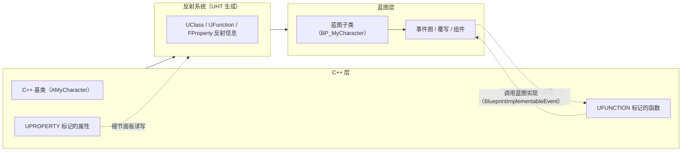
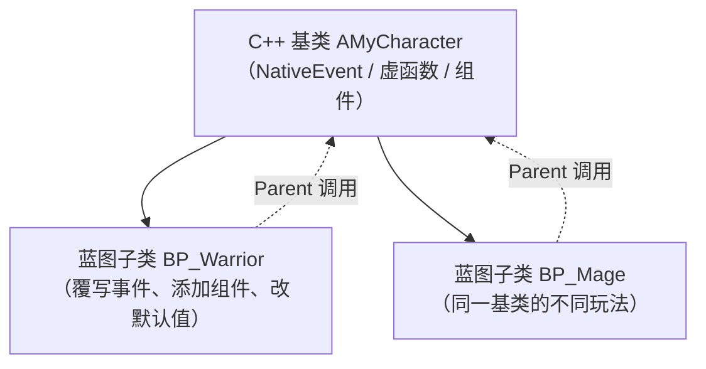

# 05 蓝图与 C++ 协作
> 知识成熟度：L2。以公开官方资料核对使用合同，代码与节点流程是静态教学候选；没有 UE 运行验证，`verified` 保持为空。
> 版本基准与层次：2026-10-10 实际读取的主体 Epic 公开页面标示 UE 5.8，使用动态文档 URL；SetRootComponent 的补充 API 页只读到 UE 5.5，作为签名交叉核对；历史问题单 UE-10138 标示 UE 4.7，只用于解释原生/蓝图 BeginPlay 调用层次。不同版本的编辑器菜单、生成代码与细节须在目标工程复核。
> 历史来源线索：旧文自述 UE 5.8.0、CL 55116800、分支 `++UE5+Release-5.8`，安装位置 `C:\Program Files\Epic Games\UE_5.8\Engine\Source\Runtime\CoreUObject`、`Engine\Source\Runtime\Engine`，原版本记录为 2026-08-05；本次未读取该安装或认证该 CL。
> 适用范围：UHT 反射声明、节点/事件与属性暴露，以及一个单玩家 Actor 的完整协作例；不冒充 UHT 源码剖析或联网伤害系统。
> 最后更新：2026-10-10。UHT、UE 编译/链接、蓝图编译、PIE、打包和性能测量均未运行。
> 官方入口：[Unreal Engine 官方文档总页](https://dev.epicgames.com/documentation/en-us/unreal-engine)；具体合同见正文对应链接。

## 一、概述

UE 的双栈开发模型：

- **C++**：性能关键路径、复杂算法、引擎集成、网络与数据层——追求健壮与可控；
- **蓝图**：玩法编排、事件流、UI 交互、数值调参——追求迭代速度与设计友好。

两者通过 **UHT（Unreal Header Tool）生成的反射胶水和运行时类型信息**互操作。构建时 UHT 解析带标记的头文件，生成代码，再由 C++ 编译器编译；`UCLASS` / `USTRUCT` / `UENUM` 声明反射类型，`UFUNCTION` / `UPROPERTY` 声明成员的反射用途。它们不是“贴上宏就立即变成蓝图节点”：还要有合适的暴露说明符、可支持的签名和一次成功的构建。[UHT 构建阶段](https://dev.epicgames.com/documentation/en-us/unreal-engine/unreal-header-tool-for-unreal-engine)

蓝图子类实例仍属于其 C++ 基类层级。C++ 可以持有基类指针，但只有经可覆写事件的入口调用才保留蓝图分派；写成普通 C++ 函数调用的外观，不代表它等同于直接执行某个 C++ 函数体。`UClass` / `UFunction` / `FProperty` 的运行时信息也要与 `meta=(...)` 编辑器元数据分开，不能靠 Tooltip、ClampMin 等编辑器标签实现运行时规则。



## 二、核心概念速览

| 机制 | 关键字 | 方向 | 说明 |
| --- | --- | --- | --- |
| 蓝图实现事件 | `UFUNCTION(BlueprintImplementableEvent)` | C++ 调用 → 蓝图实现 | C++ 只声明（无实现），蓝图"Implement" |
| 蓝图原生事件 | `UFUNCTION(BlueprintNativeEvent)` | C++ 默认实现 + 蓝图可覆写 | C++ 实现 `FuncName_Implementation` |
| 蓝图可调用 | `UFUNCTION(BlueprintCallable)` | 蓝图调用 → C++ 执行 | 蓝图节点直接调用 C++ 函数 |
| 纯函数 | `UFUNCTION(BlueprintPure)` | 蓝图调用 → C++ 计算 | 无执行引脚，适合 Getter/计算 |
| 属性暴露 | `UPROPERTY(EditDefaultsOnly, BlueprintReadOnly ...)` | 两条独立权限轴 | Edit/Visible 管面板；BlueprintRead* 管蓝图图表访问 |
| 委托绑定 | `UPROPERTY(BlueprintAssignable)` | 蓝图绑定 → C++ 广播 | 见委托篇 |
| 接口 | `UINTERFACE` + `UFUNCTION` | 双向 | 多态调用，蓝图可实现 |
| 类暴露 | `UCLASS(Blueprintable / BlueprintType)` | 双向 | 允许蓝图继承/作为变量类型 |
| 结构体/枚举 | `USTRUCT(BlueprintType)` / `UENUM(BlueprintType)` | 双向 | 蓝图变量与节点引脚 |

## 三、原理详解

### 3.1 UFunction 与说明符

`UFUNCTION` 声明反射函数；是否可调用、可覆写或参与其他反射用途由说明符决定。下面的短代码仅解释局部 API，完整文件与接线见第四章。常用说明符：

| 说明符 | 作用 |
| --- | --- |
| `BlueprintCallable` | 蓝图可调用；是否纯函数另行决定，不会自动消除函数副作用 |
| `BlueprintImplementableEvent` | C++ 无实现，蓝图实现 |
| `BlueprintNativeEvent` | C++ 提供默认实现（`_Implementation`），蓝图可覆写 |
| `BlueprintAuthorityOnly` | 蓝图调用受网络 authority 限制（含单机）；不是 Server RPC，也不是 C++ 业务校验 |
| `BlueprintCosmetic` | 标记表现用途，专用服务器不执行该蓝图调用；Listen Server 也可有本地表现 |
| `BlueprintGetter` / `BlueprintSetter` | 自定义属性访问器（配合 UPROPERTY） |
| `CallInEditor` | 编辑器细节面板按钮 |
| `Category = "Combat"`；`meta=(DisplayName="...", ToolTip="...", DefaultToSelf="...")` | Category 是说明符；meta 中填写各元数据的实际键和值 |
| `meta=(AdvancedDisplay="参数名", AutoCreateRefTerm="参数名", ExpandEnumAsExecs="枚举参数名")` | 分别用于折叠高级引脚、为未连接引用引脚提供默认项、按枚举展开执行引脚；按实际签名选择，不能把元数据名当无条件可组合模板 |

函数参数必须使用 UHT 和蓝图支持的类型，例如 bool、int32、float、FName/FString/FText、合适的 UObject 类型及 `USTRUCT(BlueprintType)`；普通 C++ 类型不能仅靠 UFUNCTION 自动变成引脚。较大的只读结构体可用 `const FStruct&`；非 const 引用通常暴露为输出，要保留为可修改输入引用可使用 `UPARAM(ref)`，不能只凭参数名 Out 推断方向。[公开暴露规则](https://dev.epicgames.com/documentation/en-us/unreal-engine/exposing-gameplay-elements-to-blueprints-visual-scripting-in-unreal-engine)

`BlueprintAuthorityOnly` 和 `BlueprintCosmetic` 不能替代服务器授权、RPC 路由或状态复制；普通 C++ 直接调用也不能当成已通过这些蓝图限制。联网责任只衔接 [Gameplay 框架篇](../../03-引擎架构与资源系统/模块化框架与对象通信/03-Gameplay框架与游戏模式.md)，本例没有联网承诺。[UFunction 说明符](https://dev.epicgames.com/documentation/en-us/unreal-engine/ufunctions-in-unreal-engine)

### 3.2 BlueprintImplementableEvent：C++ 触发、蓝图实现

模式：C++ 负责"何时调用"（时机、条件），蓝图负责"做什么"（表现与玩法细节）。

```cpp
// MyCharacter.h
UCLASS()
class MYGAME_API AMyCharacter : public ACharacter
{
    GENERATED_BODY()
public:
    // C++ 只声明，不实现；蓝图里 Implement 该事件
    UFUNCTION(BlueprintImplementableEvent, Category = "Combat")
    void OnDamaged(float Damage, AActor* DamageCauser);

    // C++ 在受伤时调用
    void ReceiveDamage(float Damage, AActor* DamageCauser);

private:
    float Health = 100.0f;
};
```

```cpp
// MyCharacter.cpp
void AMyCharacter::ReceiveDamage(float Damage, AActor* DamageCauser)
{
    Health -= Damage;
    OnDamaged(Damage, DamageCauser); // 事件入口分派到此实例的蓝图实现
}
```

蓝图侧：在蓝图事件图中右键 → 搜索 `OnDamaged` → 添加 **Event OnDamaged** 节点，即可编写受伤表现（飘字、闪红、音效）。这个无返回值、无输出参数的事件若没有蓝图实现，不执行蓝图行为。它仍经过反射事件入口，不能声称“零开销”。若事件有返回值或输出参数，应在 My Blueprint 的函数列表中实现，而不是到处寻找 Event 节点；返回业务结果时通常更适合有明确默认值的 NativeEvent。此片段只演示通知，输入校验和一次性耗尽见第四章。需要 OnHitReact 受击方向时应从命中/伤害上下文传入；负的角色速度方向不等于真实来袭方向，静止时还可能是零向量。

### 3.3 BlueprintNativeEvent：C++ 默认实现 + 蓝图覆写

适合"C++ 提供默认行为，蓝图按需覆写"的场景（如不同怪物死亡表现）。

```cpp
// 头文件
UFUNCTION(BlueprintNativeEvent, Category = "Combat")
void OnDeath();
virtual void OnDeath_Implementation();

// 源文件：默认实现函数名固定为 OnDeath_Implementation
void AMyCharacter::OnDeath_Implementation()
{
    // 默认：播放死亡动画、禁用输入
    PlayAnimMontage(DeathMontage);
    DisableInput(nullptr);
}
```

这个片段假定 Character 已声明并配置 DeathMontage，仅展示表现扩展点；不能据“禁用输入”概括完整死亡状态。蓝图添加 OnDeath 覆写后，默认 C++ 实现不会先自动执行；需要保留时，在覆写入口右键添加 **Parent: OnDeath** 并接上执行线。若还有中间蓝图父类，Parent 首先进入相应父层实现，不等同于永远直达最底层 C++。

> 调用 `OnDeath()` 以保留蓝图覆写；直接调用 `OnDeath_Implementation()` 只执行原生路径。NativeEvent 的反射声明不写 static 或普通 virtual；原生扩展点可把 `_Implementation` 声明为 virtual，让 C++ 子类以 `override` 覆写它。C++ 子类实现中需要原生父逻辑时用 `Super::OnDeath_Implementation()`；不要在自己的实现中再次调用 OnDeath 形成递归。[NativeEvent 与父调用](https://dev.epicgames.com/documentation/en-us/unreal-engine/implementing-blueprint-interfaces-in-unreal-engine)

### 3.4 BlueprintCallable / BlueprintPure：蓝图调用 C++

```cpp
// 可调用（有执行引脚）
UFUNCTION(BlueprintCallable, Category = "Inventory")
bool AddItem(FName ItemId, int32 Count);

// 纯函数（无执行引脚，适合查询）
UFUNCTION(BlueprintPure, Category = "Inventory")
int32 GetItemCount(FName ItemId) const;
```

蓝图节点行为：

- `BlueprintCallable`：允许作为函数调用；普通非纯函数节点有执行输入/输出引脚，可修改状态。返回值 const 成员函数默认可能暴露为纯节点，需要执行引脚时显式 `BlueprintPure=false`；
- `BlueprintPure`：生成无执行引脚的计算节点；“无副作用”是实现者应遵守的合同，UHT 不会证明函数体纯净。不要在里面扣血、随机抽样或发事件，也不要假定结果缓存/只执行一次；昂贵查询可用非纯函数显式求值并保存；
- 若函数带 `UObject*` 参数，可用 `meta=(DefaultToSelf = "参数名")` 让蓝图节点默认连入 Self。

### 3.5 UPROPERTY：属性暴露

先分清三个问题：面板能否编辑、蓝图能否 Get/Set、C++ 自己是否允许赋值。`Edit*` / `Visible*` 回答第一个，`BlueprintReadOnly/ReadWrite` 回答第二个，C++ 访问控制和函数实现回答第三个。`EditDefaultsOnly` **不等于运行时常量**，`BlueprintReadOnly` 也不等于 C++ const。[Properties](https://dev.epicgames.com/documentation/en-us/unreal-engine/unreal-engine-uproperties)

```cpp
UCLASS()
class MYGAME_API AMyCharacter : public ACharacter
{
    GENERATED_BODY()
public:
    // 类默认值与实例面板可编辑 + 蓝图可读写
    UPROPERTY(EditAnywhere, BlueprintReadWrite, Category = "Combat")
    float BaseDamage = 20.f;

    // 只在类默认值面板编辑；蓝图图表只读，C++ 仍可赋值
    UPROPERTY(EditDefaultsOnly, BlueprintReadOnly, Category = "Combat")
    TSubclassOf<UGameplayEffect> HitEffectClass;

    // 默认值/实例面板可见但不能直接编辑；蓝图图表只读
    UPROPERTY(VisibleAnywhere, BlueprintReadOnly, Category = "Combat")
    int32 KillCount = 0;

private:
    // 确实位于 private 段；仅开放所声明的蓝图访问
    UPROPERTY(EditAnywhere, BlueprintReadWrite, Category = "Combat",
        meta = (AllowPrivateAccess = "true"))
    float MoveSpeedScale = 1.f;
};
```

常用说明符组合：

| 说明符 | 含义 |
| --- | --- |
| `EditAnywhere` | 实例与类默认值都可编辑 |
| `EditDefaultsOnly` | 仅类默认值（蓝图默认值面板）可编辑 |
| `EditInstanceOnly` | 实例属性窗口可编辑，类默认值不可编辑 |
| `VisibleAnywhere` / `VisibleDefaultsOnly` / `VisibleInstanceOnly` | 对应属性窗口可见而不能直接编辑；不控制蓝图 Set 权限 |
| `BlueprintReadWrite` / `BlueprintReadOnly` | 蓝图读写权限 |
| `BlueprintGetter` / `BlueprintSetter` | 自定义 getter/setter 函数 |
| `Category="Combat"`；`meta=(ClampMin="0.0", ClampMax="100.0", ToolTip="...", AllowPrivateAccess="true")` | 分组/编辑器提示/私有成员蓝图访问；运行时值仍要显式校验 |

`Edit*` 与 `Visible*` 不应同用于同一属性。对象指针属性“不可替换指针”也不自动让对象内部所有可编辑成员只读。上例 `UGameplayEffect` 是 GAS 类型，需要相应模块和声明；它是配置类型示意，不是第四章最小例的额外依赖。

### 3.6 类、结构体、枚举暴露

```cpp
// 类：允许蓝图继承 / 作为变量类型
UCLASS(Blueprintable, BlueprintType)
class MYGAME_API UMyItemDefinition : public UObject { ... };

// 结构体
USTRUCT(BlueprintType)
struct FItemInfo
{
    GENERATED_BODY()

    UPROPERTY(EditAnywhere, BlueprintReadWrite)
    FName ItemId;

    UPROPERTY(EditAnywhere, BlueprintReadWrite)
    int32 MaxStack = 99;
};

// 枚举
UENUM(BlueprintType)
enum class EItemRarity : uint8
{
    Common,
    Rare,
    Epic
};

// 显式使用掩码值；还必须将整数属性/参数与此枚举绑定
UENUM(BlueprintType, meta = (Bitflags, UseEnumValuesAsMaskValuesInEditor = "true"))
enum class EItemFlags : uint8
{
    None = 0 UMETA(Hidden),
    CanDrop = 1,
    CanTrade = 2
};
ENUM_CLASS_FLAGS(EItemFlags);

// 放在所属 UCLASS 内；勾选 CanDrop 与 CanTrade 后值为 1 | 2 = 3。
UPROPERTY(EditAnywhere, BlueprintReadWrite, Category = "Item",
    meta = (Bitmask, BitmaskEnum = "EItemFlags"))
int32 ItemFlags = 0;
```

仅写 Bitflags 不会替所有节点添加位掩码选择器；普通枚举引脚也不会自动变成多选位集。默认按位序号解释与这里的显式掩码值模式不同，不能混用；函数整数参数需要相应 `UPARAM(meta=(Bitmask, BitmaskEnum="EItemFlags"))`。结构体示例的成员初始化与 Make/Break 引脚则属于结构体暴露，和位掩码是两件事。

### 3.7 继承与覆写



规则要点：

- 蓝图需要父类具有有效的 **Blueprintable** 能力；它可从父类继承，NotBlueprintable 可关闭；`BlueprintNativeEvent` / `BlueprintImplementableEvent` 是蓝图的主要覆写点；
- C++ 的普通 virtual 不会自动成为蓝图覆写点；例如蓝图 Event BeginPlay 对应 ReceiveBeginPlay，不能把它当作直接覆写 C++ BeginPlay。要公开自己的覆写点，请声明反射事件；
- 蓝图子类可以：覆写事件、添加组件、修改类默认值（属性值、材质、网格体）、调用 `Parent`；
- C++ 构造的组件（`CreateDefaultSubobject`）在蓝图子类中可见并可改属性；
- 事件名保留反射分派，`_Implementation` 表达原生实现；空蓝图实现只说明没有该蓝图行为，不能承诺零开销。

### 3.8 C++ 调用蓝图定义的函数

蓝图子类中**新定义**的函数（非继承自 C++ 声明）无法被 C++ 直接静态调用。三种解决方案：

1. **接口**（推荐）：C++ 定义接口，蓝图实现，C++ 通过接口调用；
2. **C++ 预声明事件**：在基类声明 `BlueprintImplementableEvent`，蓝图实现，C++ 调用基类函数；
3. **低层反射调用**：`ProcessEvent` / `CallFunctionByNameWithArguments`（不推荐，无编译期检查）。

```cpp
// 接口定义
UINTERFACE(Blueprintable, BlueprintType)
class UMyInteractable : public UInterface
{
    GENERATED_BODY()
};

class IMyInteractable
{
    GENERATED_BODY()
public:
    UFUNCTION(BlueprintNativeEvent, BlueprintCallable, Category = "Interaction")
    void Interact(APawn* Interactor);
};

// C++ 调用（对象可以是 C++ 或蓝图实现者）
// 已取得 AActor* Target 和 APawn* Interactor；不假定 this 的具体类型。
if (IsValid(Target)
    && Target->GetClass()->ImplementsInterface(UMyInteractable::StaticClass()))
{
    IMyInteractable::Execute_Interact(Target, Interactor);
}
```

蓝图侧：类设置 → **Interfaces → Add → MyInteractable**，实现 `Interact` 事件。接口头文件还需包含 `CoreMinimal.h`、`UObject/Interface.h` 和最后的 `MyInteractable.generated.h`，并声明或包含 APawn；跨模块使用时按模块导出 U/I 类。此处是接口片段，具体实现类还应提供原生默认行为或蓝图实现。

**为什么不用 Cast 当门禁？** 仅在蓝图 Class Settings 中添加接口的 Actor 没有对应 C++ 接口子对象，`Cast<IMyInteractable>` 可以返回空；这时 ImplementsInterface 仍可为 true，Execute_Interact 才能到达蓝图实现。原生 C++ 实现与纯蓝图实现都通过同一入口，未实现者则在分支处跳过。`Interactor` 是否允许为空由项目接口合同决定。[接口判断与 Execute 包装](https://dev.epicgames.com/documentation/en-us/unreal-engine/interfaces-in-unreal-engine)

## 四、代码示例

### 4.1 完整最小例：按一次 E，走完蓝图 → C++ → 蓝图 → C++ → 蓝图

目标是一个可放入关卡的训练靶：蓝图配置最大生命值；关卡蓝图收到按键后调用 C++；C++ 向蓝图询问伤害策略，再提交生命值，最后通知蓝图显示结果。以数值和打印作为观察点，不依赖角色移动、GAS、动画、材质或网络配置。

这是**待在 UE 工程中验证的完整教学候选**。下面列出的代码、节点接线和数字是静态说明与纸面预期，本轮没有运行 UHT、C++ 编译/链接、蓝图编译、PIE 或打包。前三章的短片段用于对比说明符，不要把它们拼进本例。

#### A. 文件、类与依赖

使用 C++ 游戏项目，示例模块名为 `CollabDemo`，已有 `Core`、`CoreUObject`、`Engine` 依赖。通过 C++ Class 向导添加继承 `Actor` 的 `CollabTarget`。下列两份文件放在该模块源码目录；若项目另有名字，保留向导生成的模块导出宏，不能照搬 `COLLABDEMO_API`。不需要第三方插件，也不添加 Tick。构造函数创建一个本 Actor 拥有的默认 SceneComponent，并设为根；补充核对的 [SetRootComponent API（UE 5.5）](https://dev.epicgames.com/documentation/unreal-engine/API/Runtime/Engine/GameFramework/AActor/SetRootComponent?application_version=5.5) 给出了该接口签名与 Owner 要求，不代表已验证当前工程。

`CollabTarget.h`（完整）：

```cpp
#pragma once

#include "CoreMinimal.h"
#include "GameFramework/Actor.h"
#include "CollabTarget.generated.h"

UCLASS(Blueprintable)
class COLLABDEMO_API ACollabTarget : public AActor
{
    GENERATED_BODY()

public:
    ACollabTarget();

    // 返回实际扣除量。调用方不能直接写 CurrentHealth。
    UFUNCTION(BlueprintCallable, Category = "Collab|Combat")
    float ApplyPracticeDamage(float Amount);

    UFUNCTION(BlueprintPure, Category = "Collab|Combat")
    float GetCurrentHealth() const { return CurrentHealth; }

    // 外部及本类通过事件名调用，保留蓝图分派。
    UFUNCTION(BlueprintNativeEvent, BlueprintCallable, Category = "Collab|Combat")
    float ComputeFinalDamage(float BaseDamage);
    virtual float ComputeFinalDamage_Implementation(float BaseDamage);

protected:
    virtual void BeginPlay() override;

    UFUNCTION(BlueprintImplementableEvent, Category = "Collab|Feedback")
    void OnDamageApplied(float OldHealth, float NewHealth, float AppliedDamage);

    UFUNCTION(BlueprintImplementableEvent, Category = "Collab|Feedback")
    void OnDepleted();

private:
    UPROPERTY(EditDefaultsOnly, BlueprintReadOnly, Category = "Collab|Config",
        meta = (AllowPrivateAccess = "true", ClampMin = "1.0"))
    float MaxHealth = 100.0f;

    UPROPERTY(EditDefaultsOnly, BlueprintReadOnly, Category = "Collab|Config",
        meta = (AllowPrivateAccess = "true", ClampMin = "0.0"))
    float DamageScale = 0.5f;

    UPROPERTY(VisibleInstanceOnly, BlueprintReadOnly, Transient,
        Category = "Collab|State", meta = (AllowPrivateAccess = "true"))
    float CurrentHealth = 0.0f;

    bool bReady = false;
    bool bApplyingDamage = false;
};
```

`CollabTarget.cpp`（完整）：

```cpp
#include "CollabTarget.h"
#include "Components/SceneComponent.h"
#include "Templates/UnrealTemplate.h"

ACollabTarget::ACollabTarget()
{
    PrimaryActorTick.bCanEverTick = false;
    SetRootComponent(CreateDefaultSubobject<USceneComponent>(TEXT("SceneRoot")));
}

void ACollabTarget::BeginPlay()
{
    // 此时读取实际实例的配置。先建立供蓝图 BeginPlay 读取的本地状态。
    MaxHealth = FMath::IsFinite(MaxHealth) && MaxHealth > 0.0f
        ? MaxHealth : 100.0f;
    DamageScale = FMath::IsFinite(DamageScale) && DamageScale >= 0.0f
        ? DamageScale : 0.5f;
    CurrentHealth = MaxHealth;
    bReady = true;

    Super::BeginPlay();
}

float ACollabTarget::ComputeFinalDamage_Implementation(float BaseDamage)
{
    return BaseDamage * DamageScale;
}

float ACollabTarget::ApplyPracticeDamage(float Amount)
{
    if (!bReady || bApplyingDamage || CurrentHealth <= 0.0f
        || !FMath::IsFinite(Amount) || Amount <= 0.0f)
    {
        return 0.0f;
    }

    // 同步蓝图回调可能回调本函数；本例明确拒绝这种嵌套扣血。
    TGuardValue<bool> ApplyingGuard(bApplyingDamage, true);
    const float ProposedDamage = ComputeFinalDamage(Amount);
    if (!FMath::IsFinite(ProposedDamage) || ProposedDamage <= 0.0f)
    {
        return 0.0f;
    }

    const float OldHealth = CurrentHealth;
    const float AppliedDamage = FMath::Min(ProposedDamage, OldHealth);
    CurrentHealth = OldHealth - AppliedDamage;
    const bool bDepletedNow = CurrentHealth <= 0.0f;

    UE_LOG(LogTemp, Display, TEXT("[Collab] %.1f -> %.1f; applied %.1f"),
        OldHealth, CurrentHealth, AppliedDamage);
    OnDamageApplied(OldHealth, CurrentHealth, AppliedDamage);
    if (bDepletedNow)
    {
        OnDepleted();
    }
    return AppliedDamage;
}
```

`BeginPlay` 中给 `CurrentHealth` 赋值，而不是在构造函数里写 `CurrentHealth = MaxHealth`，是为了使用蓝图子类已保存的配置。构造阶段只做默认值与子对象设置的职责见 [Objects](https://dev.epicgames.com/documentation/en-us/unreal-engine/objects-in-unreal-engine)。这里把**只涉及本 Actor 普通数值的初始化**放在 `Super::BeginPlay()` 前，使由基类派发的蓝图 BeginPlay 能读到结果；不要据此把依赖组件已 BeginPlay 的工作也搬到 Super 前。此处沿用 [Actor 生命周期篇](../../03-引擎架构与资源系统/对象模型与生命周期/02-Actor与Component生命周期.md#32-beginplay-与-endplay先说清actor指哪一层) 已区分的调用层次；Epic 历史说明 [UE-10138](https://issues.unrealengine.com/issue/UE-10138) 支持“原生 BeginPlay 内派发 ReceiveBeginPlay”的关系，不是对旧文 CL 的运行认证。

#### B. 蓝图配置与准确接线

1. 在所用工程完成 C++ 构建后，基于 `CollabTarget` 建立 `BP_CollabTarget`。在 **Class Defaults** 将 `Max Health` 设为 `120`、`Damage Scale` 设为 `0.5`，Compile / Save。它们是类配置，所以在关卡实例 Details 中不能编辑；这不妨碍 C++ 在 BeginPlay 中校验或赋值。
2. 在 **My Blueprint → Functions → Override** 选择 `Compute Final Damage`。它返回 float，因而在函数图中实现。入口执行线 → `Parent: Compute Final Damage` → Return；入口 `Base Damage` 数据引脚接 Parent 的同名输入，Parent 的 Return Value 乘 `2.0`，结果接本函数 Return Value。Parent 节点通过入口节点右键 **Add Call to Parent Function** 添加。这里故意让蓝图扩展原生算法，而不是把默认实现默认为自动执行。
3. 在 `BP_CollabTarget` 的 Event Graph 添加 `Event On Damage Applied`：执行线连 `Print String`，使用 `Format Text` 的 `BP hit: {Old} -> {New}; applied {Applied}`，将事件的三个 float 引脚接到对应字段，再用 `To String (Text)` 接 Print String。开启 Print to Log，方便同时核对屏幕和 Output Log。
4. 同一蓝图添加 `Event On Depleted` → `Print String("BP depleted")`；它是空表现钩子的可选实现。再将 `Event BeginPlay` 的执行线接到 Print String，将纯查询 `Get Current Health` 的数据输出格式化为 `BP ready: {Health}` 后接到该打印节点，预期初始读数为 `120`。纯查询没有执行引脚。
5. 把 **BP_CollabTarget 实例**放入关卡，命名 `Target_One`。它只有 SceneRoot，没有可见网格；在 World Outliner 选中即可。不要误放 C++ 基类实例，也不需要配置碰撞、Enable Input 或动画资产。
6. 打开此关卡的 **Level Blueprint**，对已选中的 `Target_One` 创建对象引用。添加键盘 `E` 事件，使用 **Pressed** 执行引脚 → `Apply Practice Damage`（Target 接 `Target_One`，Amount 固定 `40`）→ `Print String`。将该调用的 Return Value 格式化为 `Caller applied: {Value}` 后打印。这里只用 Level Blueprint 的离散按键事件；不要求 Enhanced Input 资产。若该键已被项目其他输入处理器消耗，换一个未占用的键并相应修改步骤。
7. 编译、保存两个蓝图与关卡，在单玩家 PIE 中点击游戏视口取得键盘焦点。先确认 `BP ready: 120`，然后每次松开再按 E，共四次；不要用持续按住或每帧 Tick 代替四次 Pressed。关卡对象引用的具体操作见 [Level Blueprint 官方说明](https://dev.epicgames.com/documentation/en-us/unreal-engine/level-blueprint-in-unreal-engine)。

#### C. 把一次输入按调用栈算完

第一击的顺序是：

1. Level Blueprint 把 `Amount=40` 交给 C++ `ApplyPracticeDamage`。
2. C++ 调用 `ComputeFinalDamage(40)` 的反射事件入口，进入这个 BP 实例的覆写图。
3. BP 显式调用 Parent，原生 `_Implementation` 算 `40 × 0.5 = 20`；BP 再乘 `2`，返回 `40`。
4. C++ 验证返回值，计算 `min(40, 120)=40`，先提交 `CurrentHealth=80`，再打印 `[Collab] 120.0 -> 80.0; applied 40.0`。
5. C++ 调用 `OnDamageApplied(120, 80, 40)`；BP 打印受击结果。回调内读取 `GetCurrentHealth` 也应是 `80`。第一击不调用 OnDepleted。
6. C++ 返回 `40`，Level Blueprint 才继续打印 `Caller applied: 40`。

| 手动输入 | 调用前生命值 | Native 默认值 → BP 策略返回 | 实际扣除 / 调用返回 | 调用后生命值 | 表现事件 |
| --- | ---: | --- | ---: | ---: | --- |
| 第一次 E | 120 | 20 → 40 | 40 | 80 | OnDamageApplied |
| 第二次 E | 80 | 20 → 40 | 40 | 40 | OnDamageApplied |
| 第三次 E | 40 | 20 → 40 | 40 | 0 | OnDamageApplied，然后 OnDepleted |
| 第四次 E | 0 | 不再调用策略 | 0 | 0 | 无；调用方仍能打印返回 0 |

这张表是**由候选代码和节点连接推导的预期**，不是实测截图或日志。单次同步调用中，提交状态先于通知、通知先于普通调用返回；若把通知接到 Delay/异步工作，延迟部分会在以后的时机执行，不能扩展成“所有表现都结束后才返回”。`ComputeFinalDamage` 是有返回值的函数覆写，此例要求它同步给出结果，不在其中使用 Delay。

#### D. 从正常路线扩展，逐项解释差异

每次修改后重新开始 PIE，使生命值回到 120；一轮只改变一项。以下仍是纸面预期。

- **不覆写 NativeEvent**：移除 BP 的 Compute Final Damage 覆写，原生默认每次扣 20，六次才耗尽；只放原生类时还会使用原生 MaxHealth=100，不能把两种实验混在一起。
- **覆写但不调 Parent**：BP 直接返回 10，就每次扣 10；C++ 默认乘数不会先自动执行。误从 C++ 调用 `_Implementation(40)` 则跳过 BP 的乘 2，得到 20，正好与正确路线的 40 区分。
- **不实现 ImplementableEvent**：只删除两个表现事件图，生命值与返回值照常变化，原生 `[Collab]` 日志仍在。缺少飘字/打印不等于扣血未发生，也不等于调用没有反射成本。
- **超量、负值和非有限值**：Amount=200 时策略给 200，C++ 只扣当前生命值；Amount≤0 或非有限值直接返回 0。若 BP 策略返回负数或非有限值，同样拒绝。`ClampMin` 是编辑器输入提示，真正的运行边界由本函数的分支承担。
- **重入**：若 On Damage Applied 中又调用 Apply Practice Damage，嵌套调用返回 0，本次外层结果保持不变。这里使用局部 [TGuardValue](https://dev.epicgames.com/documentation/unreal-engine/API/Runtime/Core/TGuardValue) 在返回时恢复标志，头文件是 `Templates/UnrealTemplate.h`；这只是同线程同步重入策略，不是线程安全锁。蓝图回调在本例只做计算/打印，不销毁 Actor、不切图、不修改外部对象；要支持这些行为，应另行设计存活检查与通知协议。
- **构造阶段**：修改 BP 类默认 MaxHealth 后重启 PIE，初始生命值应采用新配置；构造函数只建默认子对象和静态默认值。Construction Script 可随编辑动作再次执行，不适合扣血、给奖励或派发一次性玩法结果。类默认对象、Construction Script 和一局内状态不是同一份工作。

### 4.2 Getter / Setter 暴露

访问器还要在 **UPROPERTY 上绑定函数名**。只给两个函数写 `BlueprintGetter` / `BlueprintSetter`，不会把原来 `BlueprintReadOnly` 的 Stamina 自动变成走该 setter 的可写属性。下面是可加入一个已声明 UCLASS 的独立片段，不参与 4.1 的训练靶。

```cpp
public:
    UFUNCTION(BlueprintGetter, Category = "Stats")
    float GetStamina() const { return Stamina; }

    UFUNCTION(BlueprintSetter, Category = "Stats")
    void SetStamina(float NewValue)
    {
        if (FMath::IsFinite(NewValue))
        {
            Stamina = FMath::Clamp(NewValue, 0.0f, 100.0f);
        }
    }

private:
    UPROPERTY(BlueprintGetter = GetStamina, BlueprintSetter = SetStamina,
        Category = "Stats", meta = (AllowPrivateAccess = "true"))
    float Stamina = 100.0f;
```

蓝图的属性 Set Stamina 输入 150，经 setter 后 Get Stamina 应得到 100；这是预期观察，不是本轮运行结果。C++ 直接赋字段不会自动绕经 setter；Details 面板的编辑也不是 BlueprintSetter 的调用合同，所以此片段没有添加 EditAnywhere。要让配置值在运行时也守规则，仍需显式校验。[属性访问器说明](https://dev.epicgames.com/documentation/en-us/unreal-engine/unreal-engine-uproperties)


### 4.3 蓝图侧操作步骤速查

1. **覆写函数**：My Blueprint 的 Functions → Override；返回值/输出参数的事件常以函数图呈现，不在 Class Defaults 中寻找覆写入口；
2. **调用 C++ 函数**：从正确类型对象引用拖线搜索已暴露的 Callable/Pure 函数，检查 Context Sensitive 和实际目标类型；
3. **实现事件**：Event Graph 搜索无返回值/无输出的 OnXxx 事件；函数形态到 My Blueprint 实现，UI 文案随版本略有差异；
4. **Parent 调用**：覆写节点内右键 → `Add call to parent function`；
5. **修改默认值**：蓝图类默认值面板，按 Category 分组编辑 UPROPERTY；
6. **接口**：Class Settings → Interfaces → Add。

## 五、最佳实践

1. **分工原则**：C++ 管"逻辑正确性"（数值、状态、网络），蓝图管"表现与编排"（时序、反馈、UI）；按可维护性、团队分工和实际剖析结果选择，不把“所有复杂玩法都不能写蓝图”当成语言规则。
2. **事件即契约**：用 `BlueprintImplementableEvent` 把"扩展点"显式声明在基类，蓝图作者一看就知道哪里可以覆写。
3. **默认实现兜底**：NativeEvent 在没有蓝图覆写时使用原生实现；有覆写时是否调用 Parent 由覆写图明确决定。必要不变量应像第四章一样放在普通 C++ 入口，而不是完全交给可选 Parent 调用。
4. **纯函数语义**：查询类函数加 `BlueprintPure` 与 `const`，让蓝图连线更简洁。
5. **属性暴露最小化**：只暴露需要暴露的属性；`EditDefaultsOnly + BlueprintReadOnly` 是配置类字段的默认首选。
6. **控制调用粒度**：性能热点考虑批量/事件驱动，减少不必要的跨层往返。Tick 中调用是否昂贵取决于次数、参数和实际工作，应测量；不能由“是蓝图”推出性能数字。
7. **暴露需要的类型**：需要给蓝图使用的结构体/枚举再标 BlueprintType，使用强类型降低裸 FName 的歧义，不扩大无必要的公开 API。
8. **命名与分类**：`Category` 统一（如 `Combat` / `Movement` / `UI`），蓝图面板里才不混乱。
9. **接口优先于多态覆写**：跨类协作（交互、可拾取、可对话）用接口，避免强制继承同一基类。
10. **版本管理**：C++ 签名变更会影响已实现该事件的蓝图（通常表现为编译/加载警告），发布前做一次蓝图编译检查。

## 六、常见问题 FAQ

**Q1：蓝图里找不到我的函数/属性？**
先核对实际对象类、宏/说明符、UHT 与 C++ 构建结果，以及是否在有正确 Target 类型的上下文搜索。UPROPERTY 并不自动允许蓝图访问，VisibleAnywhere 并不自动提供蓝图 getter。还要检查 Show Inherited Variables、访问控制、Category 和筛选。先确认反射声明存在，再诊断 UI。

**Q2：`BlueprintNativeEvent` 编译报错？**
区分原始事件声明与 `_Implementation`。前者不写 static/普通 virtual，不在 .cpp 实现同名普通函数；后者实现签名要匹配生成声明，C++ 派生类覆写后者。字符串/结构体等参数的值/const 引用不一致也会造成签名错误，先读实际 UHT/编译诊断。

**Q3：蓝图覆写后想调用 C++ 默认实现？**
在覆写入口添加 Add Call to Parent Function 并连接执行/参数/返回值。Parent 遵循继承链；不会因存在默认实现就自动调用。C++ 业务调用事件名以保留 BP 分派，直接调用 `_Implementation` 会绕开 BP；第四章用 20 与 40 区分两条路线。

**Q4：C++ 里怎么调用蓝图自定义函数？**
优先在 C++ 声明事件或接口合同。对于蓝图可实现的接口，用有效对象 + ImplementsInterface 检查，再用 Execute_；仅 Cast 接口会漏掉纯蓝图实现。反射按名字调用仍可用于工具集成，但没有相同的编译期签名保护。

**Q5：属性在细节面板里不能编辑，或运行时仍能被改？**
区分 EditDefaultsOnly / EditInstanceOnly 的面板位置，以及 Visible* 和 BlueprintReadOnly 两条权限轴。编辑器只读不等于 C++ const；BlueprintSetter 也不自动接管所有 C++/Details 写入。第四章的配置与 CurrentHealth 分别示范类配置和运行状态。

**Q6：蓝图子类无法选择/无法继承我的 C++ 类？**
检查 Blueprintable（可能继承而来）、NotBlueprintable、构建和父类选择上下文；BlueprintType 管蓝图变量类型，不是 Blueprintable 的同义词。Actor 派生类通常继承已有暴露能力，不要求每层重复粘贴所有标签。

**Q7：改 C++ 后蓝图报“函数签名不匹配”？**
先保留蓝图逻辑，核对参数类型/名字、返回值及生成声明，再刷新相关节点、编译并检查调用方。只有确认旧覆写节点已无法匹配时才在保留逻辑后重建，不能把“删除节点”当作无损修复。反射结构变更必要时关闭编辑器完成目标工程构建，再重开验证。

**Q8：热重载或 Live Coding 后蓝图状态异常？**
Live Coding 与旧 Hot Reload 不是同一个机制；先记录构建输出、实例和默认值。函数体补丁不能证明反射布局、已有实例、序列化默认值全部更新。恢复到可确认的构建/重开状态，重新编译受影响蓝图并重建 PIE 实例；不能宣称一次“Compile Blueprints”就是通用修复。[Live Coding 的默认值与 Reinstancing 说明](https://dev.epicgames.com/documentation/en-us/unreal-engine/using-live-coding-to-recompile-unreal-engine-applications-at-runtime)

**Q9：蓝图已经改 MaxHealth，CurrentHealth 为什么还是 100？**
检查是否把运行状态在构造函数中按原生默认值提前复制，或放错了原生类实例。第四章只在 BeginPlay 读取本实例配置，且先于 Super 内派发的蓝图 BeginPlay 建立本地数值；避免把 CDO、蓝图类默认值与运行实例混为一谈。

## 七、关联阅读

- [04-委托事件与对象通信](../../03-引擎架构与资源系统/模块化框架与对象通信/04-委托事件与对象通信.md)：`BlueprintAssignable` 动态委托是蓝图监听 C++ 事件的主要通道。
- [01-GameplayAbilitySystem能力系统](../技能战斗与属性结算/01-GameplayAbilitySystem能力系统.md)：GAS 资产大量依赖蓝图子类与 `BlueprintNativeEvent` 覆写。
- [03-GameplayTag与数据资产](03-GameplayTag与数据资产.md)：DataAsset / 行结构体通过 UPROPERTY / USTRUCT 暴露给蓝图。
- [01-引擎基础](../../../游戏知识/01-引擎基础/README.md)：UObject 反射系统的底层机制（UHT、UClass、FProperty）。
- [08-工具链与打包发布](../../../00_Index/学习路线/工程实践与质量.md)：C++ 构建、Live Coding 与蓝图热更新。
