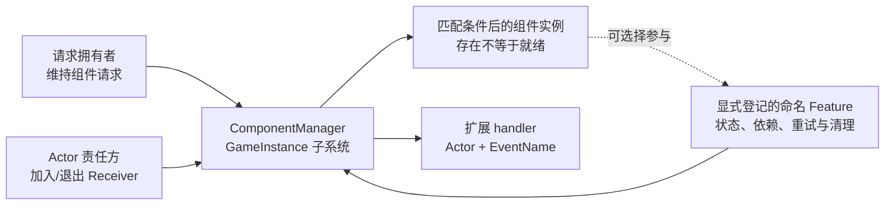
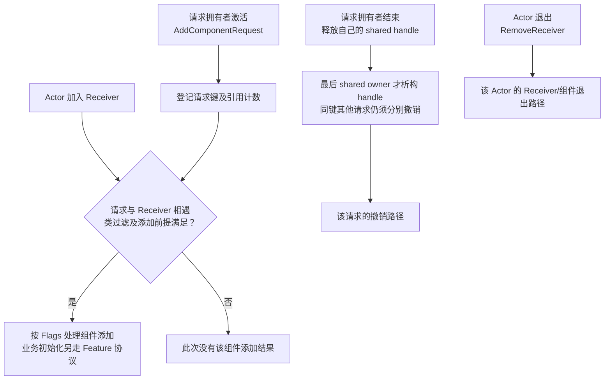
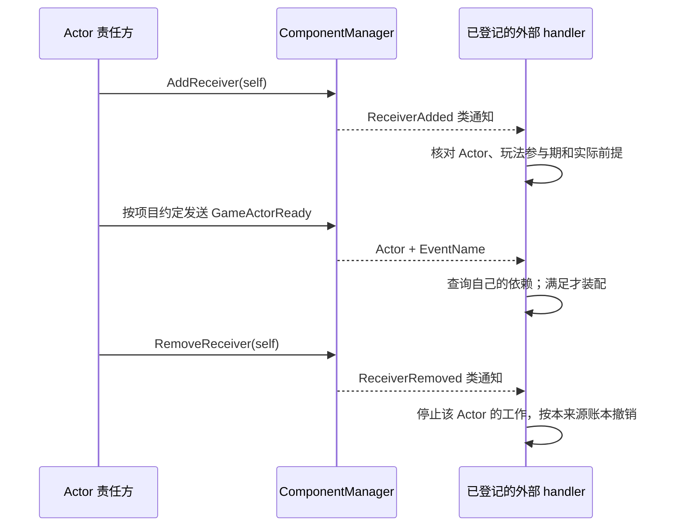
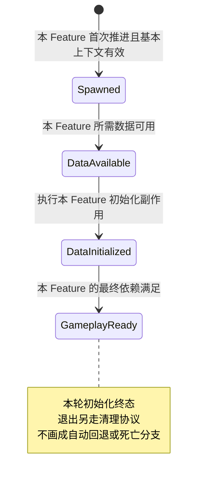
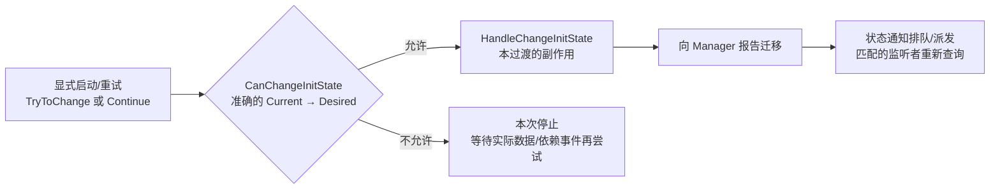

# 08 Modular Gameplay 模块化玩法

> 知识成熟度：L2。主要承诺是公开原始文档/API的静态解释，以及明确项目前提下的纸面实践；不包含编译或运行验证。
> 来源基准：2026-10-05 核对的 Epic 公开资料。默认 C++ API 页面显示 UE5.8；Flags 详情采用明确标版的 Python 5.7 文档；5.5 页面只用于历史路径反证。本文没有取得指定 CL 的完整 Engine/Lyra checkout。
> 最后更新：2026-10-05。重写装配、通知、初始化依赖与退出合同，保留原历史声明和导航。
> 未验证：UHT、UBT、UE 构建/链接、Editor/PIE、真实网络/线程重入、动态卸载与性能。第五节是原创流程伪代码，不能直接当作可编译组件。

## 一、概述

当同一类角色需要随玩法模式、GameFeature 或 DLC 装配不同功能时，单靠固定组件清单不易扩展；当数据来自不同 Actor 的复制、资产加载或本地输入建立时，组件已经存在也不代表它依赖的数据已经到齐。固定 Delay 只能推迟一次检查，不能证明依赖成立。

Modular Gameplay 把这些问题分成三种合同：

- **组件注入（Component Request）**描述“某类 Actor 需要哪类组件”。请求拥有者维持请求寿命，Actor 通过 Receiver 合同选择接受扩展
- **扩展事件（Extension Event）**告诉当时的监听者“发生了一件事”。接收通知后仍要判断自己的前提；过去发过的事件不是持久就绪记录
- **初始化状态（InitState）**记录某 Actor 上某个命名 Feature 当前到哪一步。游戏定义合法迁移、依赖条件和再次尝试的入口；它不会自动消除依赖环，也不会替缺失回调安排重试

三者共享 `UGameFrameworkComponentManager`，但 **Receiver opt-in、Feature 登记、组件实际存在、业务 Ready 是不同事实**。纯原生成员组件也能显式登记 Feature；被注入的组件若不实现/使用 InitState，就不会仅因创建成功获得完整状态链。[官方机制说明](https://dev.epicgames.com/documentation/en-us/unreal-engine/game-framework-component-manager-in-unreal-engine)



读本篇前应能区分 Actor/组件生命周期、GameplayTag 和委托；本篇只解释初始化协作，不把技能执行、对象销毁、网络复制或 GameplayTask 的完整协议复制成第二份正文。

## 二、核心概念速览

| 概念 | 类 / 入口 | 作用与边界 |
| --- | --- | --- |
| 管理器 | `UGameFrameworkComponentManager` | `UGameInstanceSubsystem`；不同 GameInstance 的记录不能混用 |
| 组件请求 | `AddComponentRequest` | 返回 `TSharedPtr<FComponentRequestHandle>`；持有请求不等于已在某 Actor 上创建成功 |
| 请求句柄 | `FComponentRequestHandle` | 析构撤销关联请求；`Handle->IsValid()`只表示管理器仍存在，`Handle.IsValid()`只表示这个 shared pointer 非空 |
| 接收者 | `AddReceiver` / `RemoveReceiver` | Actor 的扩展参与合同；不是登记所有业务 Feature 的快捷方式 |
| 扩展事件 | `AddExtensionHandler` / `SendExtensionEvent` | 类过滤的 handler 接收 Actor 与事件名，再自行分流 |
| 全局状态顺序 | `RegisterInitState` / `IsInitStateAfterOrEqual` | 同一 GameInstance 的线性 Tag 次序，用于比较阶段；不是任意分支玩法 FSM |
| Feature 身份 | Actor + `FeatureName` + Implementer | 名字由项目稳定命名；同 Actor 上本例要求唯一实现者；登记不设置状态 |
| 原生状态接口 | `IGameFrameworkInitStateInterface` | 可选的推进/查询/监听便利接口；实现类负责门控和副作用 |
| 状态通知参数 | `FActorInitStateChangedParams` | `OwningActor`、`FeatureName`、`Implementer`、`FeatureState`；处理时核对身份并查询当前事实 |
| 原生 / 蓝图状态委托 | `FActorInitStateChangedDelegate` / `FActorInitStateChangedBPDelegate` | 原生 Actor 监听返回 `FDelegateHandle`；蓝图重载返回注册结果并按委托解除，不混成组件请求 shared handle |
| 组件基类 | `UGameFrameworkComponent` | 提供 GameInstance、Owner 权限和计时器等便利访问；它本身不等于 InitState 实现 |
| 框架辅助基类 | `UPawnComponent` / `UControllerComponent` / `UPlayerStateComponent` / `UGameStateComponent` | 面向相应 Actor 的访问/生命周期辅助；不能宣称继承它们便自动参与 InitState |
| 组件迭代器 | `TComponentIterator<T>` | 用于遍历 Actor 已注册的组件；不会替被遍历组件验证业务 Ready |

这些是[Manager API](https://dev.epicgames.com/documentation/en-us/unreal-engine/API/Plugins/ModularGameplay/UGameFrameworkComponentManager)、[状态接口](https://dev.epicgames.com/documentation/en-us/unreal-engine/API/Plugins/ModularGameplay/IGameFrameworkInitStateInterface)、[请求句柄](https://dev.epicgames.com/documentation/unreal-engine/API/Plugins/ModularGameplay/FComponentRequestHandle)和[组件迭代器](https://dev.epicgames.com/documentation/en-us/unreal-engine/API/Plugins/ModularGameplay/TComponentIterator)的公开合同。基类选择可核[UGameFrameworkComponent](https://dev.epicgames.com/documentation/en-us/unreal-engine/API/Plugins/ModularGameplay/UGameFrameworkComponent)与[UPawnComponent](https://dev.epicgames.com/documentation/en-us/unreal-engine/API/Plugins/ModularGameplay/UPawnComponent)声明，不能由类名推断接口继承。

## 三、原理详解

### 3.1 组件注入：声明式装配

管理器公开字段把两个问题分开：`RequestTrackingMap`跟踪 Actor 类/组件类请求及计数，`ReceiverClassToComponentClassMap`关联接收类、组件类和添加 Flags。请求方可以先出现，也可以在 Actor 已经参与之后出现；两者匹配才有装配机会。[Manager 请求合同](https://dev.epicgames.com/documentation/en-us/unreal-engine/API/Plugins/ModularGameplay/UGameFrameworkComponentManager)



图的下方是两条独立退出轴，不能画成“Actor EndPlay 必然令全局请求计数归零”。Actor 移除 Receiver 不会代替其他 GameFeature 放弃其仍持有的请求；请求方结束也不等于 Actor 对象内存立即销毁。

**两层所有权。** 假设 `A`、`B` 是同一个 handle 的两份 `TSharedPtr`：`A.Reset()`只放弃一份共享引用；`B`仍持有时 handle 不析构。再假设另一个 handle 对同一 `(ReceiverClass, ComponentClass)`仍有请求，前一个 handle 最终析构也不能被解释为全部请求均已撤销。`Reset()`属于 `TSharedPtr`，不要写成不存在证据的 `Handle->Release()`。[TSharedPtr 的 Reset 条目](https://dev.epicgames.com/documentation/en-us/unreal-engine/API/Runtime/Core/TSharedPtr)

**Flags 的版本与方向。** 下表是[官方 Python 5.7 说明](https://dev.epicgames.com/documentation/en-us/unreal-engine/python-api/class/GameFrameworkAddComponentFlags?application_version=5.7)的窄解释；[当前 C++ 枚举页](https://dev.epicgames.com/documentation/en-us/unreal-engine/API/Plugins/ModularGameplay/EGameFrameworkAddComponentFlags)列出 `None=0`、`AddUnique=1`、`AddIfNotChild=2`、`UseAutoGeneratedName=4`，但后三项说明为空，不能据此认证 UE5.8 完整实现。

| 标志 | 5.7 文证可支持的含义 | 不应补出的结论 |
| --- | --- | --- |
| `AddUnique` | 已有 ComponentClass 对应组件时不再添加 | “精确类相等”或整个继承树的完整比较规则 |
| `AddIfNotChild` | 请求类是 Actor 现有组件类的子类时不添加；已有 Base、请求 Derived 会被这一规则挡住 | “允许已有 Base 时再加 Derived”；反方向、相等和组合标志的全部真值表 |
| `UseAutoGeneratedName` | 使用新生成的名字，避免直接复用类名导致组件复用 | 无视其他 Flags、请求计数和生命周期的强制创建保证 |

已有原生组件不自动归本请求所有；不同 Flags 的同键合并、复制组件在哪端创建、组件注册/销毁的具体分支均需核目标版本实现。本文不猜这些内部规则。

### 3.2 扩展事件：可插入的时机钩子

`ReceiverClassToEventMap`的公开类型是“接收者类 → handler 集合”。handler 收到 `(Actor, EventName)`后判断事件；不是每个事件名各有一条保证 FIFO 的队列。`FExtensionHandlerEvent`使用 `TMap`，注释表达保持一致性的设计意图；[TMap 文档](https://dev.epicgames.com/documentation/en-us/unreal-engine/map-containers-in-unreal-engine)却不保证迭代顺序等于添加顺序。因此不能拿 handler 注册先后来安排依赖，也不能反向声称本轮观察到了管理器实际乱序。



图仅说明事件类别与业务责任，不认证组件创建、每个 handler 和返回语句之间的源码全序。尤其 `ReceiverAdded`不代表跨 Actor 的数据或所有 Feature 都 Ready。

| 静态事件名 | 本文采用的语义 | 不能推出什么 |
| --- | --- | --- |
| `NAME_ReceiverAdded` | 接收者加入扩展参与 | 所有业务组件、复制引用已经可用 |
| `NAME_ReceiverRemoved` | Receiver 被移除，通常与 Actor EndPlay 配对 | 所有外部系统的请求句柄也已释放 |
| `NAME_ExtensionAdded` | handler 加入时，对相关 Actor 处理扩展加入 | 任意注册函数返回前必定同步执行的精确调用栈 |
| `NAME_ExtensionRemoved` | handler 的 request handle 生命周期结束时处理移除 | 仅凭事件就证明输入绑定、能力或资产引用都已撤销 |
| `NAME_GameActorReady` | 游戏主动定义的“主体大体可扩展”时机 | Manager 等全体 Feature Ready 后自动发送，或为晚订阅者重播 |

事件不会保存过去的 `GameActorReady`。迟到监听可在 `ExtensionAdded`等加入入口查询当前 InitState；查询未满足时，还须有真正的状态/数据唤醒源。它不是补发过去事件。注册与撤销都可能引入业务回调，先准备上下文、再调用外部注册是防护策略；只有 InitState 的 `bCallImmediately`有明确立即调用文证，不能把它借给 `AddExtensionHandler`的精确返回顺序。[扩展系统说明](https://dev.epicgames.com/documentation/en-us/unreal-engine/game-framework-component-manager-in-unreal-engine)、[AddExtensionHandler](https://dev.epicgames.com/documentation/en-us/unreal-engine/API/Plugins/ModularGameplay/UGameFrameworkComponentManager/AddExtensionHandler)

### 3.3 InitState：初始化状态机

同一 GameInstance 先注册线性的 Tag 顺序，再由各 Actor 的命名 Feature 报告自身阶段。下面四段是本篇选定的项目模板；两个阶段也可以成立，四段不是引擎强制数量。



**推进的已核偏序：** 接口询问 `CanChangeInitState(Current, Desired)`，允许后执行 `HandleChangeInitState`，再报告 Manager；不能先让观察者看见新状态，再补建该状态承诺的资源。[接口文档的 Handle/Try 条目](https://dev.epicgames.com/documentation/en-us/unreal-engine/API/Plugins/ModularGameplay/IGameFrameworkInitStateInterface)



这里没有伪造 `GameFrameworkInitStateInterface.cpp`完整调用图。`HandleChangeInitState`是 `void`：函数内部 `ensure`失败或提前 `return`，并不构成已证的事务取消/回滚协议。可失败的异步准备应在门槛放行前完成；若游戏要在 Handle 内执行可失败操作，必须另设失败和补偿合同，不能假设引擎会替它撤回状态。

- **查询与通知各司其职。** `GetInitStateForFeature`读当前阶段；`HasFeatureReachedInitState`比较目标或更晚阶段；`GetImplementerForFeature`找实现者。通知是重新查询的机会，不是把旧参数当永久事实
- **筛选包含相等。** 原生 `RegisterAndCallForActorInitState`按 Actor、非空 FeatureName 和 RequiredState 过滤；目标状态及更晚状态都可匹配。`bCallImmediately=true`时已有匹配状态可立即触发，回调不能依赖注册返回后才赋值的句柄。类级 `RegisterAndCallForClassInitState`用于还没有具体 Actor 的监听场景。[注册重载与参数](https://dev.epicgames.com/documentation/unreal-engine/API/Plugins/ModularGameplay/UGameFrameworkComponentManager/RegisterAndCallF-)
- **队列不是业务锁。** Manager 的 `StateChangeQueue`用于避免状态通知递归派发；它不保证扩展事件、立即注册回调、用户副作用或全部 `CheckDefaultInitialization`都不重入。委托的共享引用保护也不等于 UObject、容器元素和世界在任意同步销毁下仍合法
- **会合只看当时集合。** `HaveAllFeaturesReachedInitState`检查当前登记的 Feature；必需功能根本没有登记时，不能指望“all”替你发现缺席者。屏障通过后才加入的新 Feature，也不会自动让旧 Feature 回退、重做副作用。必需依赖应单独核身份，动态追加则另定合同
- **本地状态不是网络屏障。** 客户端和服务端都可以推进各自本地 InitState。Authority 限制特定数据写入/资源授予，不能扩展为禁止客户端初始化；两端状态也不会因用了同一个 Tag 名就自动同步

### 3.4 模块化 Actor 的标准流程

应按责任层组织，而不是把所有回调拼成一个固定生命周期总序：

1. Actor 责任方加入/退出 Receiver。官方推荐 `PreInitializeComponents`加入、`EndPlay`移除；继承已经处理它的 ModularActor 时不重复登记。只有必须扩展的 Actor 才 opt-in
2. 组件的 `OnRegister`可登记 Feature 身份；登记尚未设置 `Spawned`。OnRegister 可能重复，也可能发生在编辑器；本例只接纳有效游戏世界的一次参与
3. `BeginPlay`建立监听并主动第一次尝试。随后自身数据到达/OnRep、相关依赖改变才再次检查。BeginPlay 不是“其他 Actor 的依赖全到齐”保证
4. `Can`检查前提；`Handle`完成该过渡副作用；新状态通知触发别人的重新检查。Ready 只约束该 Feature 本轮承诺，不能覆盖未来才加入的功能
5. 退出先使业务不可再推进，再撤销自己的监听和资源、注销自己的 Feature。Actor 的 Receiver 和外部请求拥有者各自清理；不要让一个组件调用 `RemoveActorFeatureData`清掉别人的状态

EndPlay 不等于 UObject 内存已经释放；没走 BeginPlay 的反注册也可能需要清理；同一对象再次注册不保证再收到一次 BeginPlay。第五节明确选择一次性合同，不把它包装成支持所有流送复入情形的通用组件。

## 四、Lyra 实践参考

[官方概念页](https://dev.epicgames.com/documentation/en-us/unreal-engine/game-framework-component-manager-in-unreal-engine)以 Lyra 5.1 及以后版本讲解该机制。所核四个 Tag 是 `InitState.Spawned`、`InitState.DataAvailable`、`InitState.DataInitialized`、`InitState.GameplayReady`；C++常量所在的 `LyraGameplayTags`命名空间不意味着 Tag 字符串带 `Lyra.`前缀。

主用组件是 PawnExtension 与 Hero：

- PawnExtension 在自己数据条件满足后到达 DataAvailable，并在进入 DataInitialized 时等当时已注册功能达到 DataAvailable
- Hero 的基础数据门槛按网络角色区分；进入 DataInitialized 还等 PawnExtension 达到 DataInitialized，再做 ASC、输入和摄像机相关装配
- 这是错开阶段的依赖：Hero 能先到 DataAvailable，才能让 PawnExtension 过屏障；若把 Hero 的 DataAvailable 也改成等待 PawnExtension.DataInitialized，就制造了环
- Health 等业务可通过 ASC 初始化通知连接，不应一律宣称 Health/Equipment/Inventory 基类都实现 InitState。死亡属于另外的玩法/退出协议，不是这里额外注册一条 `Death`分支

GameFeature 按 Action 的激活/停用合同进入，例如公开的 [OnGameFeatureActivating](https://dev.epicgames.com/documentation/en-us/unreal-engine/API/Plugins/GameFeatures/UGameFeatureAction/OnGameFeatureActivating)。所存 Lyra Action 在 AddToWorld 等入口注册扩展，按 ChangeContext 维持句柄与资源账；没有依据把 `StartGameplayFeature`当通用 API。

[41-Lyra-Pawn初始化与模块化组件源码](../../03-引擎架构与资源系统/模块化框架与对象通信/41-Lyra-Pawn初始化与模块化组件源码.md)分析仓内历史收录实现，不能用它认证本轮不存在的私有 checkout。尤其输入追加入口、就绪标记、Pawn 追踪表和真正绑定句柄是不同层；历史移除 TODO 不能被函数名掩盖。本文通用合同也不把 Pawn Ready 解释成未来所有输入、能力或任务均已完整装配。

## 五、C++ / 蓝图示例

本节保留“注册链 → 自定义 Health → 注入请求 → 扩展监听 → 蓝图使用”五个教学用途。**以下五个 E 块均为原创流程伪代码；借用真实 API 名称表达接口接点，不是 Engine 源码、完整 C++ 声明或已编译实现。** 字段、排程和失败分支都在本节定义，没有把未实现工作藏进一个万能 Host。

### 5.1 注册状态链（游戏启动时）

目标工程须启用 ModularGameplay；C++实现通常涉及 `Core`、`CoreUObject`、`Engine`、`GameplayTags`、`ModularGameplay`模块及对应头文件。工程自己的 `.Build.cs`、UHT 声明、导出宏、Tag 定义和原生委托绑定语法须按实际目标版本完成，本篇没有编译认证。四个有效 Tag 必须先在项目 GameplayTag 配置或 Native Tag 代码中定义，不能把一个未经注册的任意字符串当有效 Tag。

本例只在同一个 GameInstance 的 Manager 上、任何 Feature 参与之前登记一次顺序；状态顺序在本轮参与期间不改动。[RegisterInitState API](https://dev.epicgames.com/documentation/en-us/unreal-engine/API/Plugins/ModularGameplay/UGameFrameworkComponentManager/RegisterInitState)

```text
E1：GI.Init 中的项目流程伪代码
  完成父类 Init，取得本 GI 的 ComponentManager；没有 Manager 就报告配置错误并停止启动
  将已定义的四个 Tag 记作 S / A / I / R：
    S = InitState.Spawned
    A = InitState.DataAvailable
    I = InitState.DataInitialized
    R = InitState.GameplayReady
  Manager.RegisterInitState(S, false, 空Tag)
  Manager.RegisterInitState(A, false, S)
  Manager.RegisterInitState(I, false, A)
  Manager.RegisterInitState(R, false, I)
  后续 Health 与 Equipment 使用这同一份 [S, A, I, R]
```

这里把“Tag 已定义”和“Tag 在初始化顺序表登记”分成两步。注册顺序不替各 Feature 添加迁移门控。不要在静态全局对象构造时寻找尚未建立的 GameInstance。

### 5.2 自定义模块化组件（实现 InitState 接口）

#### 5.2.1 对象、数据与支持合同

场景是一个有效游戏世界 Actor，两个唯一命名 Feature：`Health`、`Equipment`。原创 `UMyHealthComponent`显式实现 `IGameFrameworkInitStateInterface`；不假设框架基类已实现它。Actor 由自己的责任方处理 Receiver。

本例的最小资源是 **Health 拥有的本地健康视图**：`{MaxHealth, DisplayHealth, Published}`。配置只有一个有限且大于零的 `MaxHealth`；它不是 GAS AttributeSet，不授予能力、不绑定输入，也不把本地视图写入当权威伤害结算。这样可以逐项说明真实拥有的初始化数据，不用“这里初始化所有系统……”掩盖清理空白。

- Config 由明确的数据生产者供给：权威配置 setter 或客户端对应 OnRep 都在存好本地值后调用 `OnHealthDataChanged`；初始化检查在每端本地运行。尚未加载不是错误；Known-invalid由E3统一验证入口停止本轮，包括Session建立前已存下、后来再无数据回调的非法值
- Equipment 是本例的项目Feature名，不冒充Lyra某组件实现：它登记唯一实现者，BeginPlay首次到S，自己的配置到达后到A，装备数据缓存准备完成后到I；加载完成/OnRep存好条件后实际调用它的Check。它的 DataAvailable/DataInitialized 不得依赖 Health.GameplayReady；Health 只在 `I → R`等 Equipment 至少到 I
- 初始化配置本轮一次写入；相同值重复到达可忽略。Health 到 I 后换成不同配置或丢失必需数据，进入停止，不能在原状态偷偷重建。Equipment 准备退出时，Actor 的装配责任方也须显式调用 Health 的停止入口，不能指望状态注销一定生成所需通知
- **一次性参与：**同一 Health 对象仅支持一次有效游戏世界登记到永久停止。运行中 OnUnregister、EndPlay、依赖卸载或显式停用都结束它；之后的 OnRegister/流送复入保持停用并诊断，恢复要由项目创建新对象/新合同，不能等一次不保证再来的 BeginPlay
- **线程与对象前提：**所有入口在游戏线程；本例不支持在任何正在执行的 Manager 注册/通知/推进栈中同步 Destroy、反注册或移除该 Actor、Health、Equipment 或 Manager。回调只能请求停止；物理移除必须等安全排程点完成清理后进行。稳定记录和弱引用检查不会延长 UObject 的玩法寿命，强引用也不使已 EndPlay 的对象重新可用

本例使用明确的原生 `RegisterAndCallForActorInitState`和对应 `UnregisterActorInitStateDelegate`保存/移除自己的监听句柄；不会同时再用接口便利绑定重复订阅。登记选择有返回值的 `RegisterFeatureImplementer`，退出对应 `RemoveFeatureImplementer`；不再额外重复调用 `RegisterInitStateFeature`。接口的 `TryToChangeInitState`、`ContinueInitStateChain`仍负责合法迁移的 Can/Handle/报告顺序。

```text
E2：字段、合法边及资源账（伪代码；空状态记为 ∅）
  组件字段：EverParticipated=false；Config={Known=false, MaxHealth=未设置}；Session=无
  Session 是独立、地址稳定的本轮记录，调用期间不替换/不从容器抹除：
    Token；Actor身份；Manager身份；Implementer身份
    Phase = Registering / Registered / Running / Stopping / Stopped / CleanupUnconfirmed
    Registered=false；RegisterCallInFlight=false；SubscribeCallInFlight=false
    DependencyHandle=无；Checking=false；PendingCheck=false；WorkQueued=false
    View=无；StopReason=无
  接口映射：GetFeatureName固定返回"Health"；GetOwningActor返回本合同Actor
  GetInitState采用接口的Manager查询语义；Can/Handle如下，Check见E3
  Token 随原参与期捕获；回调/排程必须核它与当前记录相同
  View 只存本组件拥有的普通数值，不持有其他系统的 UObject 或资源

  CanChangeInitState(Current, Desired)：
    若没有 Session、Session.Phase != Running，或 Actor/Manager/自身已不具备合同要求的有效性：false
    若自身登记的 Implementer 不是 self：false
    (∅, S)：true
    (S, A)：Config.Known 且 MaxHealth 有限且 > 0
    (A, I)：上述配置仍有效，且 View 尚未建立
    (I, R)：View 已建立，且 Manager.HasFeatureReachedInitState(Actor, "Equipment", I)
    其余组合：false    // 未知、重复、跳跃、回退全部拒绝

  HandleChangeInitState(Current, Desired)：
    (A, I)：把 Config.MaxHealth 复制到新的本地 View，DisplayHealth=MaxHealth，Published=false
    (I, R)：View.Published=true
    其余合法边：不建新资源
    // 这里仅做不回调外部业务的局部值操作；不递归调用推进，不进行可失败的异步获取

  读取视图：
    只有 Phase==Running、Manager 当前 Health 至少到 R、View 存在且 Published 才提供值副本
    不能把一个早先拿到的裸 View 指针留到 Stop 后继续使用
```

精确迁移白名单是本例的协议，不是对低层 Manager 的普遍限制。`Handle`中的本地副作用会在状态报告前完成；如果添加了外部委托、资产分配、任务或可失败资源获取，必须扩充本例资源账、失败/撤销合同，不能继续套用“局部操作无失败”的前提。

#### 5.2.2 登记、首次推进、晚到通知和停止

下面 `QueueWorkOnce(Token)`不是引擎 API：它表示项目必须提供的一次性游戏线程调度，具有这些明确条件：

1. 每个 Session 最多一项待运行工作，重复请求只置标记
2. 工作在当前 Manager 的完整调用/通知栈退出后的安全点运行，不能同步内联执行；捕获弱对象身份和 Token，执行时重新核对
3. 工作消费后清 `WorkQueued`；Stopped 后剩余旧工作只退出，队列项不强持有UObject或View；世界退出时不能只靠下一帧，生命周期责任方须在对象仍合法且不在上述栈中时直接完成停止清理

这是示例的项目排程前提，**不是声称 Manager 自带该调度器或任意定时器都保证上述安全性**。移植时须在目标工程实现并实测；没有这条安全退出边界，就不能声称支持同步移除重入。一般数据/依赖回调只调用 `Wake`；BeginPlay 在绑定返回并复核之后显式调用一次检查，不依赖将来必有事件。

```text
E3：完整参与流程伪代码；每个外部调用都保留原 Session 的稳定局部引用 s

OnRegister：
  先完成父类注册
  若不是有效游戏世界：返回，不消耗 EverParticipated
  若 EverParticipated：请求旧 Session 停止（若还活跃），诊断单次合同已用完；返回
  验证 Actor、Manager、四Tag顺序；Health 名下不得已有其他实现者或遗留状态
  验证失败：记录配置/身份冲突并返回，不登记、不推进、不覆盖别人的Feature
  在任何登记调用前建立 Session，令s=Session、Phase=Registering，设置全部字段、Token与身份；EverParticipated=true
  若 !ValidateStoredConfigOrStop()：返回    // 复验Session建立前存下的配置，非法时尚未登记
  s.RegisterCallInFlight=true
  ok = Manager.RegisterFeatureImplementer(Actor, "Health", self)
  s.RegisterCallInFlight=false
  s.Registered=ok     // 即使此时已被要求停止，成功登记也属于原 s，仍须清理
  若 !ok：RequestStop("登记失败")；返回
  若 s.Phase==Stopping：QueueWorkOnce(s.Token)；返回
  s.Phase=Registered；不设置 S，不创建 View

BeginPlay：
  完成父类 BeginPlay
  若没有 Session 或 Session.Phase != Registered：返回并保留诊断
  若 !ValidateStoredConfigOrStop()：返回    // 不依赖Register以后是否又发过数据事件
  s=Session；s.Phase=Running；s.SubscribeCallInFlight=true
  h = Manager.RegisterAndCallForActorInitState(
        Actor, "Equipment", I, 捕获弱self与s.Token的原生OnEquipmentStateChanged, true)
  s.SubscribeCallInFlight=false
  // 立即回调可以发生在上述调用返回前；它不读取尚未返回的 h
  若 h 无效：RequestStop("依赖监听未取得句柄")
  若 s 仍是当前参与期且 s.Phase==Running 且 h 有效：
    s.DependencyHandle=h
    CheckDefaultInitialization()   // 首次kick；函数内显式Try(S)，核结果后再Continue
  否则：
    把有效 h 记回原 s 的待清理 DependencyHandle，绝不写入另一参与期
    RequestStop("订阅返回时本轮已停止")；QueueWorkOnce(s.Token)

ValidateStoredConfigOrStop()：
  若没有Session或Phase不在Registering/Registered/Running：false
  若Config.Known且MaxHealth非有限正数：
    RequestStop("配置非法")；false
  若本轮View已建立，且Config未知或MaxHealth != View.MaxHealth：
    RequestStop("初始化后配置被替换/失效")；false
  否则：true    // 尚未知且无View是可等待输入，不等于Known-invalid

OnHealthDataChanged（setter与OnRep的共同入口）：
  Config 已先更新成本地值
  无Session：返回    // 保留已存Config；OnRegister建立Session后一定复验，不等未来事件
  若 !ValidateStoredConfigOrStop()：返回
  Wake("HealthData")

OnEquipmentStateChanged(Params, CapturedToken)：
  先核弱self、当前Token、Params.OwningActor和FeatureName=="Equipment"
  若不属于本轮或 Phase != Running：返回
  Wake("EquipmentState")
  // 监听阈值I包含I及更晚状态；不只接受A事件，不把Params当当前依赖真相

Wake(reason)：
  若 Phase != Running：返回
  PendingCheck=true
  若 !Checking 且 !SubscribeCallInFlight：QueueWorkOnce(Token)

CheckDefaultInitialization：
  若没有Session或Phase != Running：返回
  若 Checking 或 SubscribeCallInFlight：PendingCheck=true；返回
  Checking=true；PendingCheck=false
  执行下面的单次检查体；体内所有“结束本次检查”都转到统一尾段：
    若 !ValidateStoredConfigOrStop()：结束本次检查
    Current = GetInitState()    // 实际查询，登记本身不提供S
    若 Current==∅：
      started = TryToChangeInitState(S)    // 仍经E2的Can/Handle，不直接改Manager记录
      若 Phase != Running：结束本次检查    // Try的同步通知可能已经请求Stop
      Current = GetInitState()
      若 !started 或 Current!=S：
        记录Try返回值与实际Current；RequestStop("首次Spawned未确认")；结束本次检查
        // 不猜失败时有没有改变状态，不靠无限轮询补救，也不继续跳过S
    若 Current不在[S,A,I,R]：RequestStop("未知当前状态")；结束本次检查
    若 Current==R：结束本次检查
    若 !ValidateStoredConfigOrStop()：结束本次检查
    ContinueInitStateChain([S,A,I,R])    // 此时实际已在S/A/I；Can仍逐边拒绝非法迁移
  统一尾段（即使配置失败、Try失败或同步Stop也必须执行）：
    Checking=false
    若 Phase==Stopping：QueueWorkOnce(Token)；返回
    若 Phase != Running：返回
    若 Manager查询Health已到R：PendingCheck=false；返回
    若 PendingCheck：QueueWorkOnce(Token)  // 下一安全点重查，不递归/不原地while空转
    // 没进展且没有新唤醒：停止本次尝试，记录所等条件；不自动设永久轮询

RequestStop(reason)：
  若没有 Session 或 Phase 为Stopped或CleanupUnconfirmed：返回
  Phase=Stopping            // 最先封住Can、Wake、读取视图与一切新增业务
  PendingCheck=false；记首个StopReason
  QueueWorkOnce(Token)      // 回调内只请求，不同步解除/销毁推进中的对象

QueueWorkOnce(CapturedToken)：
  若没有Session、Token不匹配、已终止或WorkQueued：返回
  WorkQueued=true；向上述项目安全队列放入一项(弱self, Token)，不得同步执行

RunQueuedWork(CapturedToken)：
  先核弱self和Token，不属于本轮则返回；之后才清本轮WorkQueued
  若 Phase==Stopping：FlushStopAtSafeBoundary()
  否则若 Phase==Running 且 PendingCheck：CheckDefaultInitialization()

FlushStopAtSafeBoundary：
  若没有Session或已Stopped/CleanupUnconfirmed：返回
  要求不在任何相关Manager调用/通知栈中，且 !Checking，两个InFlight均为false
  Phase=Stopping
  从本轮账中取走DependencyHandle并清空成员，防清理重入重复消费
  若取出的handle有效：对登记时的Manager/Actor调用UnregisterActorInitStateDelegate
    保存返回结果；上下文已失效或未确认移除时记CleanupUnconfirmed，不能报告完全清除
  清空本轮View和缓存配置（普通值），Published不再可读
  若 Registered：先把本轮Registered置false，再对原Manager调用RemoveFeatureImplementer(Actor,self)
    回查自己已不再是Health实现者；若无法核对，记CleanupUnconfirmed
  丢弃PendingCheck；Phase=Stopped，除非有上述未确认项则Phase=CleanupUnconfirmed
  已排队的本轮工作以后只退出；保留停止原因，不自动开始新参与期

EndPlay / OnUnregister / 显式停用 / Equipment准备退出：
  RequestStop(对应原因)
  由生命周期责任方在上述安全边界立即FlushStop，再允许对象物理移除
  EndPlay和OnUnregister分别完成对应父类调用；重复到达只走幂等停止
  OnUnregister即使从未BeginPlay，也必须清掉OnRegister已登记的Feature
  Actor自己的Receiver由Actor责任方退出，Health不替它RemoveReceiver
```

首次进入链使用显式 `TryToChangeInitState(S)`，再核对参与期、返回值及实际状态，成功进入S后才Continue；这与[41篇历史PawnExtension/Hero的BeginPlay用法](../../03-引擎架构与资源系统/模块化框架与对象通信/41-Lyra-Pawn初始化与模块化组件源码.md)一致。公开Continue描述不证明空状态启动细节；此处没有补造未取得的cpp。已有S/A/I的检查只合法继续，已有R不重做；所有本组件主动推进都走这个串行检查入口。

此流程故意把两种“停止”分开：先在任何回调里令参与期不可用；真正移除监听/Feature 必须等调用栈安全退出。若在注册立即回调中请求停止，返回的 `h`归旧参与期，安全清理点仍能收回它；不能因为停止时成员句柄尚空就认为无资源。若项目允许同步销毁正在推进的对象，这个示例的前提不成立，必须设计另一套受真实引擎实现约束的方案，不能只加 weak pointer 后宣称安全。

**失败与资源终态：**正常完成时 Health=R、一个 View、一个依赖监听、本 Feature 登记仍在；停止后 View 为空、监听已解除且本 Feature 注销，Receiver 不属于这份账。缺配置/Equipment 长期不到 I 时，状态停在可行前缀，记录 Actor、Feature、Token、Current、Desired、等待条件；只有实际唤醒或明确取消继续处理。登记/订阅失败进入停止；移除结果未确认则保留 `CleanupUnconfirmed`诊断并禁止恢复，不把“本地句柄字段为空”当外部清理完成。

#### 5.2.3 手算正反例（PAPER_EXPECTED）

这些是按上面条件逐步推导的预期，未运行组件或模型。

| 输入与步骤 | 条件 → 状态/资源 → 结果 | 反例或失败信号 |
| --- | --- | --- |
| Config未知或合法，仅 OnRegister，尚未 BeginPlay | Feature 已登记，状态∅，无 View、无依赖监听 | 登记即被显示为 R，混淆身份与初始化 |
| Config 未到，BeginPlay 首次kick | 验证判为可等待；显式Try(S)成功且查询确为S后，Continue在S→A被挡住；监听已登记 | 仅调用Continue不能由已核API说明推出∅起链 |
| OnRegister前预置Known=true、MaxHealth=-1/NaN/∞，以后无数据事件 | OnRegister建Session后统一验证→Stopping；没有登记Feature或订阅，安全点停止 | 把Known-invalid混成Unknown会卡住而不清理 |
| 合法预置100，Equipment已到I或R | 预检通过，BeginPlay绑定后Try(S)确认；继续到R，建立且发布一份View | 不需要等一次新的data事件来重新发现已有配置 |
| Register后/BeginPlay前，或运行中才收到非法配置 | 数据入口同一规则RequestStop；BeginPlay/Check也重复防线；清理实际已取得的登记/监听/View | 不能因为数据早到、没后续回调而遗漏停止 |
| 首次Try返回失败、实查不是S，或Try通知中请求Stop | 失败记返回/实际状态并停止；已Stopping不再Continue；统一尾段清Checking | 不假设失败回滚，不无限重试，也不越过S |
| MaxHealth=100 到达并经 OnRep 唤醒，Equipment=A | S→A→I；View={100,100,false}；I→R 等 Equipment.I | 只存 Config 不调用入口会停住 |
| Equipment 从A到I，或订阅前已到R | I及更晚的事件/立即补查触发查询；Health 到R，View.Published=true | 只在收到A事件时重试会漏掉真正解除门槛的I事件 |
| Health 已在S/A/I或R，再重复数据/依赖通知 | 非空状态不重做Try(S)；S/A/I合法继续，R直接结束；同一View不重复创建 | 不看Current而按Desired再初始化会重复副作用 |
| 人工请求 S→R、R→S、I→I、未知Tag | E2白名单false，当前状态和View不变 | 默认return true破坏单次初始化合同 |
| Equipment.I又等Health.R | Health.I等Equipment.I，后者等Health.R，环没有起点 | 增加Delay不解除逻辑环；应改门槛或取消 |
| 纸面把立即回调中的Wake换成允许的RequestStop，返回后才得到h | Stopping已封住推进；h归原Session，安全点解绑；从未发布View | 返回后无条件存进活跃成员会让停止后的资源复活 |
| Continue期间依赖回调再次Wake | 只置PendingCheck；返回后至多排一次新检查，无递归推进 | 把Manager队列当锁、从任意副作用递归Continue仍不满足本例 |
| OnRegister后直接OnUnregister，无BeginPlay | 先Stopping，清空空资源账，注销已登记Feature | 仅EndPlay清理会漏掉本路径 |
| 运行中反注册或同对象流送复入 | 原参与期停止；再OnRegister拒绝复活，保持无可用View | 等不存在保证的第二次BeginPlay会留下半登记状态 |
| 已Ready后Equipment卸载/配置更换 | 装配方显式请求Stop，先封住视图读取，安全点撤销 | 单改Health Tag回退不会撤销现有资源 |

### 5.3 组件注入请求

本例请求对象由 GameFeature Action 的具体 World/ChangeContext 记录持有；原生示意类型是 `AMyCharacter`和 `UMyHealthComponent`。下列激活与停用是两个不同时间点，不是在取得句柄后马上撤销。请求句柄与 E2 的健康视图、状态监听句柄是三种不同资源。

```text
E4：请求拥有者的伪代码
  激活：先建立本context的记录（Phase=Active，RequestHandle=无）
    Manager = UGameFrameworkComponentManager::GetForActor(SomeActor, true)
    无Manager：记激活失败，不宣称注入成功
    h = Manager.AddComponentRequest(AMyCharacter类, UMyHealthComponent类, AddUnique)
    若context仍Active：持有h；为空则记请求失败
    若context在调用期间已Stopping：在安全退出点释放返回的h，不转交给新context
    Actor由其责任方opt-in；组件是否出现、Health是否Ready分别查询
  后来的停用：先置context为Stopping
    按5.2合同令本来源的Health参与期停止并在安全边界清理
    在不销毁推进中对象的安全点，把本context的RequestHandle.Reset()
    最后shared owner及同键其他请求的寿命仍适用；不夺走其他来源的引用
```

请求方不能把 Actor 上碰巧存在的同类原生组件当作自己可删除的资源。若多个请求共享同一注入实例，停止“本来源的 Health”必须按项目选定的整体参与所有权协调，不能由一个请求方提前关闭仍被其他玩法依赖的共享 Feature。最小例约定该 Health 参与期只有一个业务所有者；跨来源共享需要另外的租约/引用合同，本文不宣称已实现。

### 5.4 扩展事件（监听角色就绪）

扩展 listener 的正确原生委托类型限定名是 `UGameFrameworkComponentManager::FExtensionHandlerDelegate`。这里用一个只维护“最近一次检查为 Health Ready 的 Actor 诊断集合”的观察系统说明加入/迟到/移除；集合是它唯一拥有的业务资源，不冒充技能授予或输入解绑实现。

```text
E5：一次性扩展观察者的伪代码
  开始：在AddExtensionHandler前建立context，Phase=Active、ReadyActors为空、句柄为空
    注册AMyCharacter类的UGameFrameworkComponentManager::FExtensionHandlerDelegate
    回调捕获弱观察者身份和本context Token；先核Phase与Actor
    把返回的TSharedPtr<FComponentRequestHandle>交回原context：
      仍Active则保存；已Stopping则在安全点Reset，不能挂回新记录
  handler(Actor, EventName)：
    ReceiverRemoved / ExtensionRemoved：从本context的ReadyActors移除Actor，重复移除无操作
    ReceiverAdded / ExtensionAdded / GameActorReady：
      只安排该Actor的一次当前状态检查；符合Health的活期与Ready条件才加入集合
      这次不满足时，不猜未来会重播；继续由明确的Health状态监听/停止协议唤醒
  状态检查：以(context Token, Actor身份)为集合键，重复满足仍一项
    查询使用5.2“读取视图”的合同；停止回调则移除本context的项
  停止：先Phase=Stopping；在安全边界Reset扩展句柄，解绑本观察者自己登记的状态监听
    清空ReadyActors；不得把清集合当成撤销其他系统的输入/能力
  Actor侧：只有项目规定的发送者，按自己的时机调用
    UGameFrameworkComponentManager::SendGameFrameworkComponentExtensionEvent(Actor, NAME_GameActorReady, true)
```

集合只存最近检查的结果，显示或使用视图时仍须重走E2读取合同；成员存在不是当前仍可用的授权。E5 是事件消费设计，不是另一个完整可编译系统：若接入 E2 的 Health 通知，其每 Actor 状态监听须遵守 E3 的“先建记录、晚返回句柄归原记录、停止先封口”合同。示例的 Actor 集合去重只能证明集合不重复，不能证明任何外部副作用 exactly-once。`GameActorReady`的发送条件必须由游戏说明，监听者不能把它升级成“全部 Feature 永远可用”。

### 5.5 蓝图侧要点

1. Receiver 由 Actor 责任方接入。优先使用已经处理 Receiver 的原生父类，或在原生 `PreInitializeComponents`/`EndPlay`接官方建议入口；不要把蓝图 BeginPlay 无条件称为等价的标准时机
2. 蓝图可以发送项目约定的扩展事件；本例的原生扩展注册仍由 C++ 管理其 shared handle 生命周期，不凭未见接口断言所有版本都不存在其他包装
3. `Register And Call For Actor Init State`的蓝图重载按 Actor、Feature、RequiredState、动态委托与 `bCallImmediately`登记。它返回 bool，退出按同一委托解除；不要假定返回原生 `FDelegateHandle`
4. 原生接口暴露的 `Get Init State`、`Has Reached Init State`、`Register And Call For Init State Change`可用于蓝图消费。`CanChangeInitState`、`CheckDefaultInitialization`在所核页是原生虚函数，不能当作已经提供的 BlueprintNativeEvent
5. 需要蓝图覆写时，由项目 C++包装类明确设计事件、返回值和执行边界。当前生成的 U/I 接口页没有展示旧文所说的 `NotBlueprintable`元标记，本文不把该拼写当已核对的源声明

## 六、最佳实践

1. **先写责任账。** Request owner、Actor Receiver、Feature、实际资源所有者分别是谁；一个 Remove 入口不能代表全部资源清除
2. **每个门槛都配唤醒源。** BeginPlay 首次kick，自身数据/OnRep，依赖状态，主动停止入口缺一项都可能留下永远不会重试的等待
3. **以准确边做校验。** 通用线性顺序不替游戏限制回退或跳跃；死亡、战斗和回合另用合适玩法状态系统
4. **事件用来检查，状态用来判断。** 不依赖注册顺序，不把临时事件当永久事实；晚订阅和重复到达分别测试
5. **句柄按实际活期持有。** 局部变量退出作用域会放弃引用，不是声明为局部就“立即析构”；共享副本、同键请求和业务资源账分别验收
6. **角色门槛具体化。** Authority 数据写权和客户端本地初始化分开。不能要求 Simulated Proxy 拥有仅本地玩家才有的输入对象，也不能保证各端同时 Ready
7. **保持状态链精简。** 是否使用事件驱动或辅助 Tick 是项目取舍；官方也提及 native Tick 尝试。避免固定 Delay 猜依赖，不把所有 Tick 一概写成 API 禁用
8. **停止与复入先定合同。** 可以选一次性或明确支持重建的多参与期；不能仅清 bool 后寄希望于再次 BeginPlay。异步资源要在晚回调中核参与期，同步移除要遵守实际对象/容器寿命
9. **诊断记录事实。** Actor/Feature/Token、当前和目标状态、缺哪个条件、实际句柄数及停止原因比“Ready=false”更有用。公开 Manager 页列有 `DumpGameFrameworkComponentManagers`，本轮只确认入口存在，不声称特定构建可用性和完整输出格式已运行核验

## 七、常见问题 FAQ

**Q1：组件注入没生效？**
先确认正确 GameInstance/World 与有效 Manager，再查 Actor 是否由责任方 opt-in、请求 ReceiverClass 与实际继承关系/软类加载、组件类和 Flags、请求句柄是否仍被拥有。不能把所有蓝图子类笼统写成“不匹配父类请求”，也不能只看 handle 非空就断言组件已创建。复制组件创建权限和不同 Flags 合并属于目标版本待核实现；`bAddOnlyInGameWorlds`过滤也须检查。[AddReceiver](https://dev.epicgames.com/documentation/unreal-engine/API/Plugins/ModularGameplay/UGameFrameworkComponentManager/AddReceiver)

**Q2：`AddUnique`和`AddIfNotChild`怎么选？**
先明确是否允许现有组件与请求组件共存。按5.7文证，已有 Base 再请求 Derived 会被 `AddIfNotChild`挡住，原文的方向相反；不要把 `AddUnique`补说成精确类比较。5.8 C++枚举说明不全，组合/复制/已有原生实例行为须另核，见3.1。

**Q3：状态卡住，如何查？**
读出准确 Current→Desired，确认 Feature 名与实现者已登记、Tag有效且顺序正确；逐个查询数据条件和必需依赖。再查 BeginPlay 首次kick是否发生、哪个生产者会在门槛由false变true时唤醒、监听是否筛错 Feature或阈值、是否漏了立即补查。最后画依赖边找环。仅有“组件已创建”不能证明条件满足，仅有“条件已满足”也不能证明发生过下一次检查。

**Q4：能从 GameplayReady 回退到 DataAvailable 吗？**
低层 Manager 的灵活性不等于任意输入都会成功，也不等于副作用回滚。本例只允许相邻前进边；结束旧参与期、清掉自己资源以后才能由另一个明确合同重建。不能单改Tag并继续使用旧View，更不能把死亡写成四段初始化链的内建分支。

**Q5：纯蓝图实现与蓝图调用是一回事吗？**
不是同一能力。已核的是查询/监听等 BlueprintCallable 入口，以及原生 Can/Handle/Check 虚函数。本文选择 C++实现接口、蓝图消费；若需要蓝图可覆写门控，须写项目包装，不能假称原生函数已有蓝图事件版本。旧元标记字面值不作本轮认证。

**Q6：GameInstance、Feature和请求的寿命怎么配合？**
Manager 随 GameInstance 管理记录；状态顺序在消费者之前建立。Feature随自己的玩法参与期登记/清理；GameFeature Action按World/ChangeContext保请求句柄。Actor离场、Feature结束、请求所有者结束是三种动作，正常退出要由各所有者在上下文还合法时完成，不能等Manager消失后才补做业务撤销。

**Q7：已经Ready，后来新Feature加入为什么没有重新初始化？**
会合检查的是当时已登记集合，没有追溯撤销旧Ready。晚加入功能走自己的状态和追加协议；若业务需要新一轮全体会合，须先定义停止/重建以及旧资源归属。组件存在、集合唯一、清理函数被调用，都不能代替对实际资源终态的检查。

## 八、关联阅读

- [01-GameplayAbilitySystem能力系统](../技能战斗与属性结算/01-GameplayAbilitySystem能力系统.md)：ASC 是具体项目可选依赖；PlayerState 持有的 ASC 不应一律按 Pawn 组件查找
- [02-EnhancedInput增强输入](../输入移动与交互/02-EnhancedInput增强输入.md)：mapping context、输入绑定句柄与就绪信号各有生命周期
- [03-GameplayTag与数据资产](03-GameplayTag与数据资产.md)：区分 Tag 定义、初始化顺序登记与业务配置数据
- [04-委托事件与对象通信](../../03-引擎架构与资源系统/模块化框架与对象通信/04-委托事件与对象通信.md)：扩展/状态委托的绑定、重入与解绑问题
- [05-蓝图与C++协作](05-蓝图与C++协作.md)：原生接口实现和 BlueprintCallable 消费的边界
- [09-GameplayTask任务框架](09-GameplayTask任务框架.md)：Handle 中若启动持续任务，另按 Task 合同登记和撤销；Feature Ready 不使任务无限存活
- Lyra 项目实现细节以 [12-引擎源码分析/41-Lyra-Pawn初始化与模块化组件源码](../../03-引擎架构与资源系统/模块化框架与对象通信/41-Lyra-Pawn初始化与模块化组件源码.md) 的历史收录代码与分支分析为参考；本文负责通用机制与原创协议

## 九、来源支持范围与历史记录

### 9.1 本次静态核对的上限

| 来源 | 实际用于本文 | 不支持的扩大结论 |
| --- | --- | --- |
| Epic Manager、InitState接口及注册重载，2026-10-05公开页 | 机制分层、API身份、Can→Handle→报告偏序、阈值/立即调用、查询和注销入口 | 指定CL完整cpp、全部回调总序、void失败回滚、任意同步销毁安全 |
| 官方组件基类/迭代器/请求句柄/TSharedPtr/TMap页 | 可选接口、已注册组件迭代、shared所有权、不可依赖插入顺序 | 组件已Ready、业务生命周期已关闭、具体Manager已实测乱序 |
| Python 5.7 Flags页 | 三种Flag文字及Base/Derived方向 | 5.8内部表达式、组合/精确类匹配和复制组件分支 |
| 5.5 FActorInitStateChangedParams页 | Header已为`Public/Components/GameFrameworkComponentDelegates.h` | 所有头文件的迁移日期；它只直接反驳“5.8起才移入”这一旧断言 |
| 仓内41历史收录与官方Lyra概述 | PawnExtension/Hero错层依赖与具体历史资源账的阅读入口 | 本轮机器存在旧绝对路径、完整旧CL真实性或当前Lyra输入卸载已运行成功 |
| 第五节原创协议与纸面例 | 在明确前提下可追踪条件、状态与资源终态 | 可直接编译、真实UE行为、网络/线程/性能或生产验证 |

取证中显式5.8版本参数的部分核心页访问失败，默认页可读；5.8 Python Flags失败/404，5.7可读；`TSharedPtr/Reset`独立页为空，语义取父页；若干猜测的方法路径失败，使用实际可读父级条目。成功打开的是公开声明/说明，不是取到了Manager或接口的完整cpp。失败和空页不能当作证明API不存在，也不能用同名当前API为旧源码身份背书。

### 9.2 原版本与本机声明（历史原文保全）

以下九行是旧文第9–17行的原字节，保留一次以保存原日期、版本、路径和迁移自述。它们不是本轮环境事实，也不覆盖上文证据范围。特别“5.8起头文件位于Public/Components”已被官方5.5对应Header定位反驳；CL55116800和旧“本机验证”本次未认证。

> 知识成熟度：L2（本轮审计修订时补标）。
> 版本基准：UE 5.8.0（本机 `Engine/Build/Build.version`：CL 55116800，分支 `++UE5+Release-5.8`）。
> 兼容性边界：适用于 UE5.8 编辑器/运行时，UE4.27 与早期 UE5 仅作迁移背景，具体模块以正文为准。
> 官方参考：[Unreal Engine UE5.8 官方文档总页](https://dev.epicgames.com/documentation/en-us/unreal-engine)。
> 最后更新：2026-08-06（本轮元数据维护）。

> 面向 UE 5.x 客户端开发。本文讲解 Modular Gameplay 插件三件套：`UGameFrameworkComponentManager`（组件注册/扩展事件）、`IGameFrameworkInitStateInterface`（InitState 初始化状态机）与 `UGameFrameworkComponent`（模块化组件基类），以及它们在 Lyra 中的实践模式。
>
> 源码位置（UE 5.8 本机验证）：`Engine\Plugins\Runtime\ModularGameplay\Source\ModularGameplay\Public\Components\GameFrameworkComponentManager.h`、`GameFrameworkInitStateInterface.h`、`GameFrameworkComponent.h`、`GameFrameworkComponentDelegates.h`（注意 5.8 起头文件位于 `Public/Components/` 子目录）。
