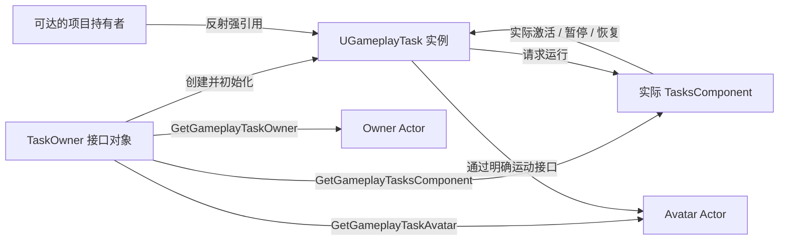
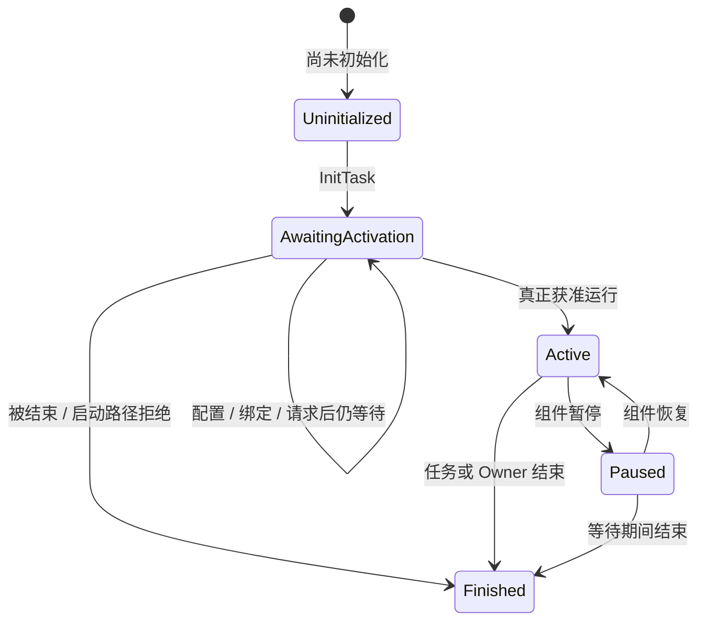
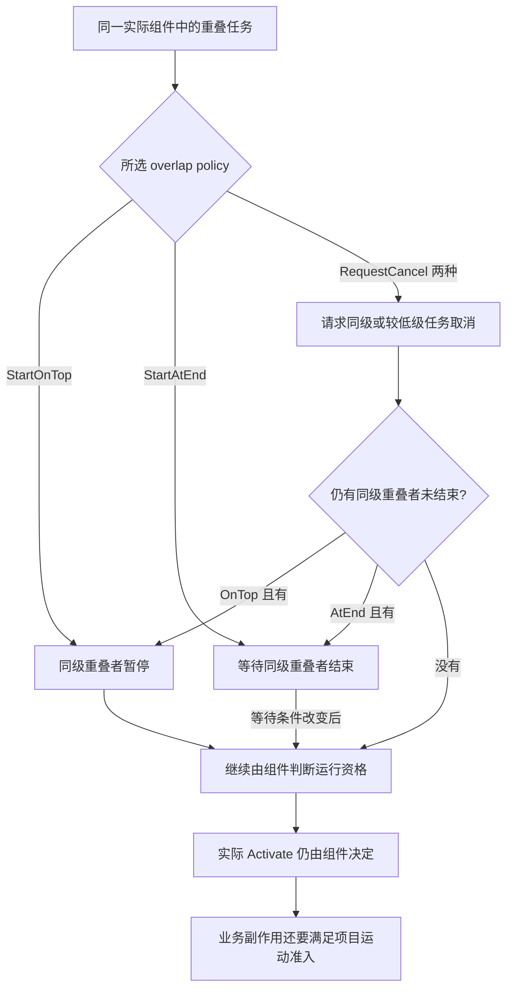
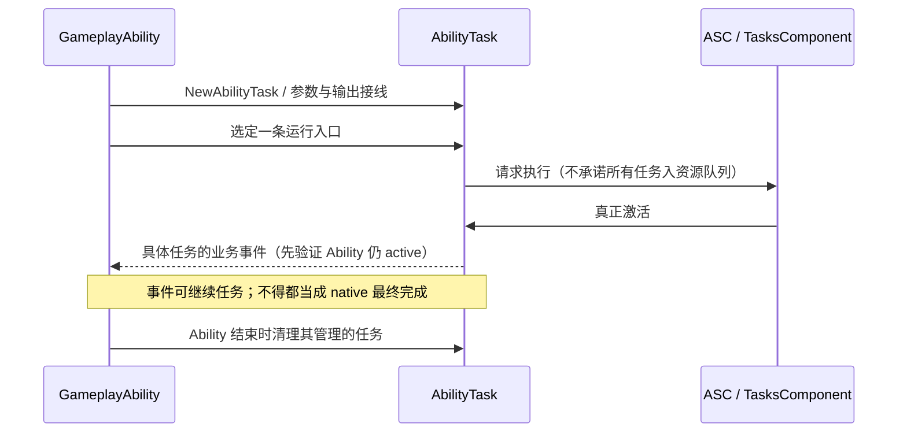

# 09 GameplayTask 任务框架

> 知识成熟度：L2。主要承诺是已核对的原生公开 API 合同，以及可逐步推演的有限位移接入方案；不是已编译运行的 UE 工程。
> 实际基准：2026-10-05 读取 Epic 公开文档，成功页面主要显示 Unreal Engine 5.8 Documentation。未访问 UE checkout、`Build.version` 或历史 CL；原文的本机身份声明完整保留在文末历史区，不作为本次环境。
> 示例性质：C++ 教学候选＋明确的项目协议伪代码。未运行 UHT、UBT、PIE、真实移动、GC、线程、网络或性能验证。原标 L2 保持，`verified: []` 保持；来源核对和纸面推演不升级为运行证据。

## 一、先解决什么问题

假设训练场里有一个非物理 Actor：向指定方向冲出一段距离，用有限时间完成；途中可以被暂停、取消或换掉拥有者。把所有状态塞进 Actor Tick，容易忘记“取消后旧回调还会回来”“暂停后不能继续计时”“完成回调可能马上开始下一轮”。GameplayTask 提供任务对象、实际激活入口和组件级资源调度，但**业务成功、外部运动确实停止、UObject 仍合法**仍需分别负责。

本文先解释原生框架，再给这个有限冲刺任务的完整接线。它不替代 CharacterMovement、导航或 GAS 根运动。分析具体引擎分支时看同目录的[29-GameplayTasks源码](29-GameplayTasks源码.md)：那里按保留片段区分直接激活、事件入口和未展示实现，不把所有 Task 画成统一入队。

### 1.1 五种身份不要合成一个“Owner”

| 身份 | 回答的问题 | 接入时必须明确什么 |
| --- | --- | --- |
| TaskOwner 接口对象 | 谁提供任务运行上下文、接收任务通知？ | 实际实现 `IGameplayTaskOwnerInterface` 的对象；不是任意 Pawn 指针天然满足接口 |
| Owner Actor | 任务所关联的拥有者 Actor 是谁？ | `GetOwnerActor()` 与接口 `GetGameplayTaskOwner()` 对应的含义 |
| Avatar Actor | 本轮实际对谁施加玩法效果？ | `GetAvatarActor()`；可以与 Owner 不同，还需独立检查玩法期/换身 |
| 实际 TasksComponent | 哪个组件决定本任务的资源和运行资格？ | Owner 返回的 `GetGameplayTasksComponent(Task)`；初始化期间不能靠 Task 自己已有组件反查 |
| GC 持有者 | 哪条可达引用让任务对象在需要时保持存活？ | 可达 UObject 中的反射强引用等明确机制，不能靠局部裸指针或 Outer 名称猜测 |



正例：两个不同 Owner 返回同一个组件，其任务可以在该组件内竞争同类资源，但结果必须各回各的接收者。反例：同一个 Pawn 的 Controller Task 与 ASC 中的 AbilityTask 可能路由不同组件；相同移动资源类型不保证二者互斥。组件仲裁范围与业务 Owner 身份是两个维度。[Task API](https://dev.epicgames.com/documentation/en-us/unreal-engine/API/Runtime/GameplayTasks/UGameplayTask)、[组件 API](https://dev.epicgames.com/documentation/en-us/unreal-engine/API/Runtime/GameplayTasks/UGameplayTasksComponent)

`UPROPERTY` 标记的 `TObjectPtr` 可形成 GC 强引用，`TWeakObjectPtr` 不负责保活，用前要验有效性。强引用也不能撤销 Actor 的 EndPlay、恢复失效玩法期或保证外调内部不会销毁目标；任务 Finished、OnDestroy 和实际 GC 回收不是同一件事。下面的稳定记录是普通 C++ 值，其存活不赋予记录里的 UObject 合法使用权。[Object Pointers](https://dev.epicgames.com/documentation/en-us/unreal-engine/object-pointers-in-unreal-engine)

## 二、从创建到真正开始

### 2.1 五态不是五种业务结果

原生枚举包含 `Uninitialized`、`AwaitingActivation`、`Paused`、`Active`、`Finished`。没有 `Succeeded`、`Failed` 或 `Cancelled`；后面这些是具体任务或项目的结果。[状态枚举](https://dev.epicgames.com/documentation/en-us/unreal-engine/API/Runtime/GameplayTasks/EGameplayTaskState)

下面是使用者的阶段示意，不声称穷尽目标版本内部转换：



重点是三件不同的事：

1. `NewTask<T>` 创建并初始化，尚不等于执行冲刺。`NewTaskUninitialized<T>` 则要求调用者安排 `InitTask`；这条路线需要目标 checkout 核验配置顺序，不与普通工厂叠加使用。[NewTask](https://dev.epicgames.com/documentation/en-us/unreal-engine/API/Runtime/GameplayTasks/UGameplayTask/NewTask)
2. 配置资源、安装接收路由并持有任务后，C++ 调用一次 `ReadyForActivation()` 请求运行。它可以在当前调用栈内触发激活甚至结束；返回后不可盲目认为仍 Active。
3. `Activate()` 才是开始业务的入口。资源等待不是业务失败；查询 `GetState()` 并记录任务结果，不能用“Ready 已调用”“没有 Tick”代替状态观察。

29 保留的历史 Ready 片段有三个出口：组件无效时调用 EndTask；组件有效且不需优先级/资源管理时调用 PerformActivation；需要管理才交 AddTaskReadyForActivation。它反驳“所有任务都统一先排资源队列”，但不认证当前完整实现。`RunGameplayTask` / `K2_RunGameplayTask` 是另一种运行入口；采用它时按该入口合同处理，不再机械地给同一任务补一次 Ready。其运行返回值也不等于运动已成功；本次运行结果枚举专页为空壳，不在此认证完整取值与错误分支。

### 2.2 Required、Claimed 和四种重叠策略

Required 表达运行前需要的资源条件；Claimed 表达任务声明占用、会与其他任务产生冲突的资源。前者不能省略为“已经拥有”，后者不能省略为“必然独占实际 Actor”。官方 Required API 明确：组件已消费任务后再改 Required 声明不起作用，因此主例在 Ready 之前显式声明两者，不依赖未核实的默认合并。[AddRequiredResource](https://dev.epicgames.com/documentation/en-us/unreal-engine/API/Runtime/GameplayTasks/UGameplayTask/AddRequiredResource)、[AddClaimedResource](https://dev.epicgames.com/documentation/en-us/unreal-engine/API/Runtime/GameplayTasks/UGameplayTask/AddClaimedResource)

| 策略 | 官方描述覆盖的冲突范围 | 取消后仍未结束时的区别 |
| --- | --- | --- |
| `StartOnTop` | 暂停有重叠资源的同优先级任务 | 无取消请求保证；不能概括为“暂停所有低优先级任务” |
| `StartAtEnd` | 等待有重叠资源的同优先级任务完成 | 保留等待分支 |
| `RequestCancelAndStartOnTop` | 请求取消同优先级或较低优先级任务 | 尚未结束的重叠同级任务走暂停分支 |
| `RequestCancelAndStartAtEnd` | 请求取消同优先级或较低优先级任务 | 等待剩余重叠同级任务结束 |

表格来自[ETaskResourceOverlapPolicy](https://dev.epicgames.com/documentation/en-us/unreal-engine/API/Runtime/GameplayTasks/ETaskResourceOverlapPolicy)，不描述完整优先队列插入和扫描顺序，也不说取消请求必被接受。



资源类代表冲突类型，不是某把椅子、某个世界位置或跨组件的全局锁。`UAIResource_Movement` 是真实 AIModule 类型；原文的 `UGameplayTask_MovementResource` 不是本例采用的 API 名。这里用声明完整的项目资源类，避免默默依赖 AI 模块。当前 `FGameplayResourceSet` 专页未取得可用正文，不把旧“最多 16 位”当作本轮认证的通用容量。2016 年的[GameplayTask Resources 原始讨论](https://forums.unrealengine.com/t/gameplaytask-resources/361237)可帮助理解设计动机，但其旧默认、4.12 开关和饥饿讨论不是当前实现合同。

### 2.3 Tick、Pause、Resume 各负责什么

任务构造时设置 `bTickingTask = true` 才表达需要逐帧 Task Tick；不需要 Tick 仅减少这条逐帧调用路径，不代表注册、事件和调度零开销。事件等待优先使用事件，有限插值才需要逐帧更新。

`Pause()` / `Resume()` 是 protected 生命周期钩子，供组件机制驱动；业务侧不手写 TaskState，也不把这两个函数当外部暂停 API。override 要让自己的副作用符合暂停语义。组件的 activated 通知可包含恢复，deactivated 通知可包含暂停，不能见一次 deactivated 就发布最终结果或认定外部运动已停。[Task API](https://dev.epicgames.com/documentation/en-us/unreal-engine/API/Runtime/GameplayTasks/UGameplayTask)、[组件 API](https://dev.epicgames.com/documentation/en-us/unreal-engine/API/Runtime/GameplayTasks/UGameplayTasksComponent)

`IsPausable()` 查询的存在不足以证明 false 时被抢占一定自动失败；具体分支需要核对目标版本。本例选择暂停冻结活动时长，恢复后从当前合法位置重新规划到原目标，详见 4.5。

## 三、结束是协议，不只是两行广播换位置

### 3.1 结束与通知入口的方向

| 入口 | 本文可确认的原生职责 | 不意味着什么 |
| --- | --- | --- |
| `EndTask()` | 显式结束这个 Task，调用 OnDestroy | 不自动产生项目成功/失败结果，不证明外部操作停止 |
| `ExternalCancel()` | 基类默认结束这个 Task；override 定义具体取消工作 | 不等于取消 Ability、导航或动画已获确认 |
| `ExternalConfirm(bEndTask)` | 外部确认；所保留片段仅在 true 时调用 EndTask | false 不是无条件结束，也不是通用成功通知 |
| `TaskOwnerEnded()` | 这个 Task 的 Owner 结束入口 | 单次调用不是遍历 Owner 所有任务，更不是所有外部 writer 已停止 |
| `MarkOwnerFinished()` | Owner 表示不再接收该任务的 deactivation 通知 | 不是 Owner 不再“发送取消”，不是外部停止 ACK |

具体依据为[EndTask](https://dev.epicgames.com/documentation/en-us/unreal-engine/API/Runtime/GameplayTasks/UGameplayTask/EndTask)、[ExternalCancel](https://dev.epicgames.com/documentation/en-us/unreal-engine/API/Runtime/GameplayTasks/UGameplayTask/ExternalCancel)、[Task API 的 MarkOwnerFinished 说明](https://dev.epicgames.com/documentation/en-us/unreal-engine/API/Runtime/GameplayTasks/UGameplayTask)，Confirm 的分支见[29](29-GameplayTasks源码.md)。

表达“这个 native Task 已完成”的通知必须在 EndTask 之后；否则接收者可能把仍 Active 的任务当 Finished。中途进度事件不因此被禁止，AbilityTask 的专用业务输出也要按其具体含义区分。但仅把旧例改成 `EndTask(); Current->OnCompleted.Broadcast();` 仍然错误：EndTask 可通知 Owner，Owner 回调可能已经安装新任务 g2。

正确顺序是：**固定 g1 的结果与接收路径 → 封闭新写入、领取一次清理责任 → 等旧 writer 真正退场 → 结束精确 g1 → 从独立 g1 值记录通知**。g1 旧栈不能根据 Current 找“现在的任务”来清理。取消也先领取结果，不先调用会结束任务的 `Super::ExternalCancel()` 再决定发哪个事件。

### 3.2 OnDestroy 与对象合法性

不要直接调用 `OnDestroy`；用 EndTask 或 TaskOwnerEnded。override 释放自己取得的句柄、解绑自己的监听，并最后调用 Super。官方说明提醒基类结束会影响对象和蓝图内部机制；它不提供本文可认证的完整 GC 时序。[OnDestroy](https://dev.epicgames.com/documentation/en-us/unreal-engine/API/Runtime/GameplayTasks/UGameplayTask/OnDestroy)

清理监听不等于停止外部运动，native Task 结束也不等于旧 C++ 调用栈已返回。下面主例故意把可重入写入跟踪到返回，不用“同线程、非物理、无 sweep”推导无重入。若项目确有经过验证的无重入适配器，可以简化这个协议；那是额外前提，而非 SetActorLocation 的名称保证。

## 四、有限冲刺主例：把原生接线和项目责任接起来

### 4.1 参数、运动和生命周期合同

示例名仍叫 Dash，但对象是训练用 kinematic Actor：根组件可移动、无物理模拟、无 CharacterMovement/导航/根运动写入、无网络预测。Owner 是管理它的 `ATrainingDashHost`，Avatar 是独立的训练 Actor。距离、方向、时长、起点和目标坐标全部有限；时长严格大于 0，距离非负，方向非零且归一化，坐标还要满足项目的训练区域范围。输入不合法直接记 `Failed(Input)`，不通过强行夹到 0.01 秒掩盖错误。

成功条件是合法 Avatar 到达本轮冻结目标且最后一次写入通过位置读回检查。`Alpha == 1` 只说明本轮计划时间用完。每帧 `DeltaTime` 必须有限且非负；本例不另外截掉大帧的时间，用 `min(Elapsed + DeltaTime, Duration)` 收敛终点。恢复采用剩余活动时长，不把暂停算进时长。

项目有一个窄用途 `FDashDomain`：只管理这个训练场的位置写入、每轮记录和结果信箱。它由**Owner 之外的世界服务**持有，业务 Owner 退场不会删除它。工程可以由 `UTickableWorldSubsystem` 承载下一次顶层 Tick，但必须实现下列合同；该基类随 World 存活、Deinitialize 会停止默认 Tick，绝不能假定世界卸载后仍可收尾。[UTickableWorldSubsystem](https://dev.epicgames.com/documentation/en-us/unreal-engine/API/Runtime/Engine/UTickableWorldSubsystem)

| 具体适配点 | 输入、输出和失败 | 必须落实的责任 |
| --- | --- | --- |
| `WriteLocation(g, Target, Desired)` | 精确 g、冻结目标身份、有限位置；返回 `Written(ObservedLocation)` 或 `Rejected(reason)` | 内部调用候选为 `Target->SetActorLocation(Desired, false, nullptr, ETeleportType::None)`，之后在仍合法的区间读回位置；失败或偏离容差记 Failed，不解释 bool 为完整运动成功 |
| 写入临界区 | 单游戏线程同步调用，可在中途重入取消/替换/Owner结束 | 整个调用期间保证目标仍可合法访问；同步销毁 Avatar、World/driver 或所需组件必须延至退场安全点。不能靠调用后再 IsValid 修复已经非法的内部访问 |
| 准入表 `Writer[AvatarIdentity]` | 精确 operation ID 或空 | 所有冲突写者经过同一有效域；取得资格到退场前都不得有第二 writer。绕过本域直接改位则本例不保证互斥 |
| `AfterDestroy` 信箱 | 只收 g 值引用；不立即回调业务 | OnDestroy 放入收据，下一次非递归顶层 driver 更新才消费，保证相关 native 栈已退回。不得从 OnDestroy/运动/结果回调手动嵌套 Pump |
| 世界收尾 | 先关闭新请求，再使同步在途调用退回，再清理未结束任务/记录 | 不依赖下一帧必来；正常 World Deinitialize 前须在合法阶段显式排空。若项目允许外调内直接销毁世界而无法延后，此 driver 不符合示例前提 |

这是一份需要工程实现并验证的适配合同，不是引擎自带 `FDashDomain`。当前 [AActor 类页](https://dev.epicgames.com/documentation/en-us/unreal-engine/API/Runtime/Engine/AActor)核到 SetActorLocation 的四参数签名与 bool 返回；未核到完整当前返回、碰撞、同步回调或子组件移动语义。因此即使采用上述真实 API，也不能宣称这段候选已实现生产角色冲刺。

### 4.2 原生类与真实 API 锚点

以下 C++ 是分文件声明/接线候选，**不是完整可复制工程**。`FDashRun` / `FDashDomain` 的具体协议在 4.3–4.6 展开，不用万能 `Host::CloseEverything()` 隐去关键算法。项目模块需要 `Core`、`CoreUObject`、`Engine`、`GameplayTasks`；若另选 `UAIResource_Movement` 增加 `AIModule`，本例资源类不需要它。各反射头的 `.generated.h` 必须最后 include，并使用项目自己的导出宏；UHT/UBT 未运行。

```cpp
// TrainingDashTask.h：C++ 教学候选，省略项目导出宏
#pragma once
#include "CoreMinimal.h"
#include "GameplayTask.h"
#include "GameplayTaskResource.h"
#include "TrainingDashTask.generated.h"

struct FDashRun;                         // 普通 C++ 稳定记录，不是 UObject
class FDashDomain;                      // 只管本例位移的项目服务

UCLASS()
class UTrainingPositionResource : public UGameplayTaskResource
{
    GENERATED_BODY()
};

UCLASS()
class UTrainingDashTask : public UGameplayTask
{
    GENERATED_BODY()
public:
    UTrainingDashTask() { bTickingTask = true; }
    // 项目工厂只 NewTask/配置，不调用 Ready；完整接线见下文。
    virtual void Activate() override;
    virtual void TickTask(float DeltaTime) override;
    virtual void ExternalCancel() override;
protected:
    virtual void Pause() override;
    virtual void Resume() override;
    virtual void OnDestroy(bool bOwnerFinished) override;
private:
    TSharedPtr<FDashRun> Run;             // 不负责其中 UObject 的保活
    // 工厂/域通过项目私有接线安装 Run；不暴露给任意业务覆写。
};
```

Host 明确实现 Owner 协议并返回实际组件；不把 `ConvertToTaskOwner` 简化为某个未经核对的查找优先序。该 API 有 Actor/UObject 重载，但使用重载存在性不能证明每个 Actor 都能成功转换。[ConvertToTaskOwner](https://dev.epicgames.com/documentation/en-us/unreal-engine/API/Runtime/GameplayTasks/UGameplayTask/ConvertToTaskOwner)

```cpp
// TrainingDashHost.h：相关声明候选，各项目方法的算法见 4.3–4.6
#pragma once
#include "CoreMinimal.h"
#include "GameFramework/Actor.h"
#include "GameplayTaskOwnerInterface.h"
#include "GameplayTasksComponent.h"
#include "TrainingDashHost.generated.h"

class UTrainingDashTask;
UCLASS()
class ATrainingDashHost : public AActor, public IGameplayTaskOwnerInterface
{
    GENERATED_BODY()
public:
    ATrainingDashHost();
    virtual UGameplayTasksComponent* GetGameplayTasksComponent(
        const UGameplayTask& Task) const override { return Tasks; }
    virtual AActor* GetGameplayTaskOwner(
        const UGameplayTask* Task) const override
        { return const_cast<ATrainingDashHost*>(this); }
    virtual AActor* GetGameplayTaskAvatar(
        const UGameplayTask* Task) const override { return Avatar.Get(); }
protected:
    virtual void EndPlay(const EEndPlayReason::Type Reason) override;
    UPROPERTY() TObjectPtr<UGameplayTasksComponent> Tasks;
    UPROPERTY() TObjectPtr<AActor> Avatar;
    UPROPERTY() TArray<TObjectPtr<UTrainingDashTask>> HeldTasks;
    uint64 OwnerEpoch = 1;               // 项目玩法期，不是引擎 GC serial
    bool bAcceptDash = false;
};

// .cpp：default subobject 随 Host 的正常组件注册流程接入。
ATrainingDashHost::ATrainingDashHost()
{
    Tasks = CreateDefaultSubobject<UGameplayTasksComponent>(TEXT("DashTasks"));
}
```

Host 到 BeginPlay/项目初始化完成，确认 Tasks 已注册、Avatar 及其可移动根满足 4.1 后才开放请求；不要在构造期启动任务。世界服务另有可达的 `UPROPERTY TArray<TObjectPtr<UTrainingDashTask>>` 持有集合，使 Host EndPlay 后仍能承担精确任务的清理。所有加入/移除按 Task 实例和 g 匹配，不能统一清空“当前任务”。来源页的接口签名见 Task/组件的 Owner-interface 重写段；声明候选仍需目标工程编译核对。

### 4.3 稳定记录与工厂前登记

每轮普通 C++ 记录 `g` 由域和在途调用的强 C++ 引用持有。至少保存以下数据：

| 组 | 字段及不变量 |
| --- | --- |
| 身份 | `OperationId`、Owner 稳定键/弱对象/玩法期、Avatar 稳定键/弱对象/玩法期、精确 Task 实例、固定结果信箱地址与通知 ID |
| 工作 | 参数、冻结世界目标及 `GoalFrozen`、`Elapsed`、`SegmentStart`、`SegmentStartElapsed`、`LastObserved`、`RunEnabled`、`ControlSerial` |
| 在途 | `FactoryDepth`、`WriteCallDepth`、`NativeCallDepth`；外调前加，返回后只减精确 g |
| 结束 | `Closing`、首个 `Result`/原因、`CleanupClaimed`、`NativeEndIssued`、`DestroyEntered`、`NativeClosed`、`NotifyClaimed`、`Closed` |
| 准入 | 本轮是否持有 Avatar 写入门；暂停可等待退场后让出，关闭必须等实际 writer 停止后才让出 |

OperationId 在该域的有效生命周期内不复用，并与世界/Owner/Avatar 玩法期一起判断。`Current[OwnerIdentity]` 只是 UI/新请求索引。旧栈始终持有 g1，不用 Current 查 g1；清理索引必须 compare-and-remove，只有值仍是 g1 才删。结果信箱是“指定接收者＋OwnerEpoch＋OperationId”的值路由，不是捕获 `this` 或稍后读 Current 的 lambda。

以下全部是项目协议伪代码，带有真实 UE 入口名；其中锁存和字段操作不外调。它规定工厂与初始化回调的边界，避免把所有风险推迟到 Ready：

```text
RequestDash(owner, avatar, parameters, receiver):
  确认 owner/组件/世界服务处于可接入期；冻结本轮身份和接收者
  g1 = 新记录(Starting, parameters, receiver, OwnerEpoch, AvatarEpoch)
  将 g1 放进 Domain.Records；先令 Current[owner] = g1
  如果替换 g0：LatchClose(g0, Cancelled(Replaced))，只关闭精确 g0
  参数非法：LatchClose(g1, Failed(Input))；走无 Task 结账并返回，不调用工厂

  g1.FactoryDepth++                    // 必须在调用工厂之前
  t1 = NewTask<UTrainingDashTask>(精确 Owner 接口, 本轮 InstanceName)
  将返回的 t1 归账到 g1；永远不写 Current[owner] = t1/g1
  如果 t1 合法：世界服务强持有 t1，立即安装 t1.Run = g1
    仍合法的 Host 也加入 HeldTasks；即便 g1 已 Closing，迟返 Task 也有清理路由
  g1.FactoryDepth--

  工厂/OnGameplayTaskInitialized 的项目约束：
    不 Ready、不移动、不删除本轮记录
    可重入登记 g2/关闭 Owner，但不得在尚未完成 InitTask 的 t1 上重入销毁
    确切 t1 的 Owner 结束动作延到工厂返回；Owner 自身 C++ 有效期须覆盖该调用
    若项目不能保证这一合法初始化区间，拒绝这条工厂路线

  若返回 null：LatchClose(g1, Failed(Create))
  若 g1 已 Closing 或 Owner/Avatar 玩法期不符：不配置、不 Ready；清理迟返 t1
  否则确认预置接收路由/结果观察已就绪，然后配置：
    t1.AddRequiredResource<UTrainingPositionResource>()
    t1.AddClaimedResource<UTrainingPositionResource>()
  配置/组件查询若可外调，也纳入 g1.NativeCallDepth；每次返回先核 g1 及 t1 合法性
  Closing/玩法期变化则停下，不能继续对迟返对象配置或 Ready
  校验 t1 的实际 TasksComponent 与预期域；不符则 Failed(Component) 并返回
  设置 g1.ReadyIssued = true；g1.NativeCallDepth++
  t1.ReadyForActivation()              // 本例唯一运行请求入口
  g1.NativeCallDepth--
  只处理 g1 后续；即便调用内结束或出现 g2，也不访问/清除 g2
```

这里“绑定”是把本轮结果接收地址装进稳定 g1，由域发布值消息。Task 不拥有一组结束后还要读取的动态多播委托。工厂还没返回就被取消时，记录先 Closing；迟返的真实 Task 仍由 g1 负责结束。没有 Task 的输入/创建失败可以报告 `TaskWasCreated=false`，不能伪称它已进入原生 Finished。

### 4.4 Activate 与每帧位移

原生 wrapper 在进入项目域之前取本轮稳定引用，外调返回后不再读 Task 成员；特别是写入途中 Owner 可能已经结束 Task。wrapper 所需的 Super 调用与项目接线须按目标头文件落地，不能让 Super 返回后自动代表本轮仍 Open。该候选把所有实际运动状态放在 g 中。

```text
Task.Activate():
  取得 g 的稳定引用；进入 Domain.Activate(g)；返回后不再使用 this

Domain.Activate(g):
  若 g.Closing，停止；不得开始写入
  若 Owner/Avatar 身份、玩法期、对象合法性或组件前提不符：LatchClose(g, Failed(Context))
  标记 RunEnabled；这里只是 native 已走到 Activate，不代表已获运动门
  TryBeginSegment(g, first=true)

TryBeginSegment(g, first):
  若 g.Closing 或 !RunEnabled 或 WriteCallDepth > 0，返回
  若 Writer[avatar] 仍是别的在途/工作 operation，等待，不计时、不改位置
  否则取得该门；在合法且不外调的读取区间取得当前位置 P
  first = !GoalFrozen；首次冻结 Goal = P + UnitDirection * Distance
  检查 Goal 有限且在训练区域；成功后设 GoalFrozen=true
  SegmentStart = P；SegmentStartElapsed = Elapsed；LastObserved = P
  记录 SegmentReady，失败则 LatchClose(Failed(Input/Context))

Task.TickTask(dt):
  取稳定 g；把当前 IsActive() 结果作为入参交 Domain.Step(g, dt)
  返回后不读 this，不读 Task delegate，不再次移动

Domain.Step(g, dt):
  要求 !g.Closing、RunEnabled、native 入参 Active、WriteCallDepth == 0
  dt 非有限/负数则 LatchClose(Failed(Input))；有效才继续
  尚无门/无 SegmentReady 则尝试取得；失败等待，不消耗活动时长
  重验 Owner/Avatar 的冻结身份、玩法期及对象合法性
  在无外调读取区间核当前位置接近 LastObserved；否则 Failed(ExternalMove)
  next = min(Elapsed + dt, Duration)
  a = (next - SegmentStartElapsed) / (Duration - SegmentStartElapsed)
  Desired = Lerp(SegmentStart, Goal, clamp(a, 0, 1))；检查有限值
  serial = g.ControlSerial
  g.WriteCallDepth++                   // 在进入运动 API 之前占据在途身份
  outcome = WriteLocation(g, frozenAvatar, Desired)
  g.WriteCallDepth--                   // 仅更新 g；返回资源/事实仍归 g
  若 g.Closing：
    保留已经锁存的首个结果；迟返 outcome 只归账，不追加业务写入
    安排 TrySettle(g)；return
  若 outcome 为 Rejected，或 Written 的读回值非有限/偏离 Desired：
    LatchClose(g, Failed(Write))；安排 TrySettle(g)；return
  再次核冻结身份、玩法期及对象合法性；不在失效对象上重新读位置
  若 Context 失配：
    LatchClose(g, Failed(Context))；安排 TrySettle(g)；return
  若 g.ControlSerial != serial 或 !g.RunEnabled：
    不提交这次时间；g.SegmentReady=false
    若暂停仍有效且深度归零：比较 Writer==g 才释放本轮门
    只安排 g 的重规划/等待；return       // 即使旧 next==Duration 也不成功
  否则：                               // 仅有效 Written、合法 Context、控制未变
    g.Elapsed = next；g.LastObserved = outcome.ObservedLocation
    若 g.Elapsed == Duration 且本次读回接近 Goal：LatchClose(g, Succeeded)
    只安排 g 的清理/下一次推进；return
  所有出口始终针对精确 g，不从 Current 取得目标或任务
```

上述出口互斥：已 Closing 的首终态优先；仍 Open 时，真实写入失败不会因 Pause/Resume 被跳过。只有写入与 Context 正常时，控制变化才作为不计时的重规划理由，并立即退出。成功判断仅在本次 Written 被接受、活动时间和读回位置已经提交的支路内；不能拿控制变化前算出的 `next` 在支路外补判成功。

分母只在 `Elapsed < Duration` 时使用：零距离合法输入在真实 Activate 获门、确认起点/目标后即可成功；剩余时长已经耗尽时直接核终点，偏离则失败，不再除法。容差是项目配置的坐标误差阈值，不能借宽容差把明显写入失败变成成功。

一个可手算的正常输入是起点 `(0,0,0)`、方向 X、距离 500、时长 0.25 秒，合法活动帧依次 0.10、0.10、0.05 秒；预期请求位置为 200、400、500，只有最后一次合法读回才选择成功。若活动 0.10 秒后暂停，另一合法任务把位置改为 300，恢复时剩余 0.15 秒；接下来两个 0.075 秒活动帧应请求 400、500。以上是 PAPER_EXPECTED，不是 UE 运行输出。

这里的对象读取区间也受 4.1 生命周期合同约束；若项目 getter 本身可外调，必须把它纳入跟踪区间并在返回后核 g，不能假装它是纯读取。`WriteLocation` 返回时可能最后又写了一次旧位置，但写入门仍归 g1；这正是不能在内部取消回调里立刻放行 g2 的原因。

### 4.5 暂停与恢复不能丢掉旧 writer

Pause/Resume 由组件调用，项目在钩子内先固定 g，再修改 g 的运行资格；对父类生命周期调用的具体顺序在工程中核验。约定如下：

- Pause 先 `RunEnabled=false`、增加 `ControlSerial` 并令 `SegmentReady=false`；不选终态，不推进 Elapsed。若 WriteCallDepth>0，旧写入门继续保留；直到匹配返回才允许释放本轮门。Pause 不等待或阻塞该外调。
- 同期 Resume 先增加 ControlSerial 并重新请求运行；若旧调用仍在途，不能开启第二次写入。下一次合法 Step、深度为 0 时，才取得/确认门并读取新 SegmentStart。
- 恢复沿“当前点 → 原冻结世界 Goal”，用剩余 `Duration-Elapsed` 插值。暂停时别的合法任务可能改位，这种位移在恢复时被明确重规划；持续 Active 的两次写入间发现未经协议的外改则失败。两种情况不混用。
- 暂停退场后释放的是本项目写入门，不据此猜测引擎暂停任务的 ClaimedResources 如何参与扫描。如果组件恢复了 Task、域却仍被旧 writer 占用，本任务仍等待而不计时。不会让高优先级 native 激活自动绕过安全门。

这种策略允许两套资格暂时不一致：native Active 但运动门未获准；这是明确的安全等待状态。不能在 UI 上把它当运动已开始，也不把它塞进引擎的五态枚举。

### 4.6 一次结账、取消、Owner 结束

业务结果采用首个合法终态胜出：`Succeeded`、`Failed(reason)`、`Cancelled(reason)`、`OwnerEnded`。同一轮结果一旦锁存不覆写；后续 Owner 失效会抑制通知而不重写历史结果。下面算法也处理基类/框架先结束 native Task 的路径。

```text
LatchClose(g, result):                  // 无外调
  若 !g.Closing：
    g.Closing = true；g.Result = result；g.RunEnabled = false
    g.ControlSerial++；g.CleanupClaimed = true
    冻结 g 的值载荷、具体接收者/玩法期/通知 ID；禁止新业务写入
  只为 g 安排清理；重复请求不能再次领取结果或广播

ExternalCancel override:
  取稳定 g；LatchClose(g, Cancelled(Requested))
  由下列 TrySettle 结束精确 Task；不先 Super::ExternalCancel 再锁存

TrySettle(g):
  若 !Closing 或 Closed，返回
  FactoryDepth/WriteCallDepth/NativeCallDepth 任一非零则暂不正常结束
  检查本例所有同步写者已退场，自有监听已解绑；否则继续保留责任
  若已存在 Task、尚未 DestroyEntered 且尚未 NativeEndIssued：
    先设 NativeEndIssued=true，NativeCallDepth++
    用精确且合法的 Task(g) 调 EndTask（Owner 已结束则走 TaskOwnerEnded）
    NativeCallDepth--；此后只用 g；不得读取旧 Task 的委托
  若没有创建过 Task：只在工厂已归账后走无 Task 结账
  若 Task 已被 native 结束：仍等独立的 AfterDestroy 收据及旧 writer 退场
  在 NativeClosed（或无 Task）、在途全零、所有自有清理已完成后：
    比较 Writer/持有集合/Current，逐项只移除属于 g 的记录
    g.Closed = true；g.NotifyClaimed = true（必须先于外调接收者）
    用预存值载荷发一次通知；接收者无效/玩法期改变则抑制业务通知
    保留清理账本事实；回调可创建 g2，返回后不得再碰 Current(g2)
```

上述最后阶段须有 `Closed/NotifyClaimed` guard：已经 Closed 直接返回；清理动作本身也以单项领取标志防止重入重复释放。正常关闭等深度归零再发 EndTask；**Owner 强制结束不受这个等待阻止**。必须允许 OnDestroy 先发生，而旧 write 栈还在执行。

```cpp
// OnDestroy 接线候选：Domain 方法是前述项目协议，不是 Unreal API。
void UTrainingDashTask::OnDestroy(bool bOwnerFinished)
{
    const TSharedPtr<FDashRun> G = Run;
    if (G && G->DestroyEntered) { return; } // 同轮已进入清理，不重复 Super
    if (G)
    {
        // 以下标志/队列操作不调用用户代码，也不立即 Pump。
        G->DestroyEntered = true;         // 先挡住清理路径再入
        G->Domain->LatchClose(*G, bOwnerFinished
            ? EProjectDashResult::OwnerEnded
            : EProjectDashResult::FailedNativeEnded);
        G->Domain->DetachOwnListeners(*G); // 本例没有外部订阅；只清本轮登记
        G->Domain->EnqueueAfterDestroy(G); // 独立值记录，下个安全点消费
    }
    Super::OnDestroy(bOwnerFinished);     // 最后显式调用；之后不读任何 Task 字段
}
```

`EProjectDashResult` 是项目结果，不是引擎枚举；LatchClose 已有结果时不被 `FailedNativeEnded` 覆盖。示例主路径只有同步位置写入，没有外部运动 handle；DetachOwnListeners 在此只清本例自己的登记，不能被扩展解释为“导航/动画也已停”。OnDestroy 只关门、登记清理、排收据，不发最终业务通知，不在这里阻塞 ACK。

**AfterDestroy 收据何时成为完成事实？** 入队本身不算。域在下一次非递归顶层更新消费已退栈的收据，才标 `NativeClosed`；若结束由域的 EndTask/TaskOwnerEnded 包围调用发起，匹配调用返回后也可消费该收据。嵌套的 Ready/运动/Owner/结果回调只排队，不手调域 Pump。若没有看到 OnDestroy 收据，不把一次 EndTask 返回自动推成“清理完成”；保留诊断并核实际目标版本的结束路径。整个方案依赖 4.1 的安全点和世界收尾合同。

Host 的 `EndPlay` 先关 `bAcceptDash`、失效原 OwnerEpoch，然后让域按该旧身份快照遍历每轮记录：先锁存 OwnerEnded/抑制通知，再对可安全访问的精确 Task 调 TaskOwnerEnded，最后调用 Host 的 Super::EndPlay。工厂仍在途的 Task 按 4.3 延后归账；**写入仍在途的 Task 可以已被 native 强制结束**，域仍保留旧门和记录，直到对应外调返回。Avatar 重绑定也先封闭旧玩法期，不能把老任务转接到新 Avatar。

清理所需的域、记录、目标有效期来自事先成立的 4.1 合同，不来自“强引用所以永远安全”。若 Actor 的任意第三方 Destroy 能在写入内部使目标非法，而项目又不能延后它，就必须拒绝该运动适配器，不能用计数器掩盖非法生命周期。

### 4.7 按调用栈追踪一次重入

纸面输入：g1 已获准写入，写到一半触发业务回调，回调取消 g1 并请求 g2。

1. 进入写入前 g1 的 WriteCallDepth=1，Writer= g1。
2. Cancel 先令 g1 Closing，锁存 Cancelled 和通知路径。g2 可登记/创建，甚至 native 层已激活；其冲突位置写入仍被拒绝或等待。
3. 若此时 Owner EndPlay 导致 g1 OnDestroy，AfterDestroy 只排收据。旧 WriteLocation 仍可继续其已经进入的工作，门依旧归 g1。
4. 旧调用返回，只减少 g1 的深度。g1 Closing，所以不增加 Elapsed、不补写、不发布 g2 的结果。
5. 旧 writer 全退、native 收据满足、清理完成后结账 g1；才允许冲突新轮获门。通知从 g1 值记录发，Owner 已失效则抑制。

反例：只在 Cancel 里 `EndTask(); Writer=null;`，则 g2 可能先写新位置，g1 尚未返回的旧外调随后又写旧位置。native Finished 与游戏线程串行执行都不能排除这个同栈重入。这里是协议推演，不是声称当前 SetActorLocation 每次都会产生这种回调。

## 五、蓝图与 AbilityTask 的正确边界

### 5.1 类型、可继承性与异步节点是不同层

| 标记/机制 | 能说明什么 | 不能推出什么 |
| --- | --- | --- |
| `BlueprintType` | 该类型可以作为蓝图变量类型 | 自动成为可选蓝图父类 |
| `Blueprintable` | 可作为创建蓝图的基类，还需看继承声明 | 普通 C++ virtual 自动变成蓝图事件 |
| `ExposedAsyncProxy` | 异步节点代理暴露相关元数据 | 单靠这个标记就生成完整工厂/委托/启动流程 |
| `BlueprintImplementableEvent` / `BlueprintNativeEvent` | 明确提供可由蓝图实现的事件桥 | 自动承担资源、取消、GC 或停止协议 |
| `BlueprintInternalUseOnly` | 供另一个节点/函数实现使用的内部入口 | 普通可在图上随意放置的调用节点 |

依据为[Class Specifiers](https://dev.epicgames.com/documentation/en-us/unreal-engine/class-specifiers)、[UFunctions](https://dev.epicgames.com/documentation/unreal-engine/ufunctions-in-unreal-engine?lang=en-US)及[原生到蓝图事件桥](https://dev.epicgames.com/documentation/en-us/unreal-engine/exposing-gameplay-elements-to-blueprints-visual-scripting-in-unreal-engine)。

UGameplayTask 类声明有 BlueprintType/ExposedAsyncProxy，并不因此提供一个可直接覆写的蓝图 Activate 事件。需要时由 C++ 子类显式声明 ReceiveActivate 一类 BlueprintImplementableEvent，并在原生 Activate 内按照项目生命周期调用；Tick 同理，不能只勾 bTickingTask 就凭空出现蓝图事件。

`ReadyForActivation` 当前有 BlueprintCallable，同时有 BlueprintInternalUseOnly；本篇 4 节是 C++ 明确调用 Ready 的路线。实际蓝图使用专用异步任务节点或 Runner 时，应核该节点负责的创建、绑定和激活展开，不能在已经自动 Ready 后再手动 Ready。[UK2Node_LatentGameplayTaskCall](https://dev.epicgames.com/documentation/en-us/unreal-engine/API/Editor/GameplayTasksEditor/UK2Node_LatentGameplayTaskCall)证明有专用节点，并不替代本项目的 UHT/蓝图编译验证。

### 5.2 AbilityTask 桥接：事件输出不全是最终完成

`UAbilityTask` 继承 UGameplayTask，ASC 是 TasksComponent 的派生类；不附会成“5.8 才开始”。正常由某 Ability 创建管理的 AbilityTask 会在该 Ability 结束时终止，但通用 Task 或自定义外部 operation 是否被管理，要看真实 Owner/登记路线。“从异步回调创建”本身不能判断其脱离管理。[UAbilityTask](https://dev.epicgames.com/documentation/en-us/unreal-engine/API/Plugins/GameplayAbilities/UAbilityTask)、[Gameplay Ability Tasks](https://dev.epicgames.com/documentation/en-us/unreal-engine/gameplay-ability-tasks-in-unreal-engine)



原等待例的用途可用下面的窄桥表达：工厂是 NewAbilityTask，业务事件明确命名为 `ThresholdReached`，表示等到时间阈值，并不声称此时 native Task 已结束。它不是第二份冲刺实现，也不重新规定所有引擎 AbilityTask 输出的全序。

```text
WaitThreshold 工厂候选：
  通过 NewAbilityTask<本项目类型>(OwningAbility, InstanceName) 创建
  验证有限的等待时间；构造期声明是否 Tick；安装本轮记录与输出接收
  调用者/专用节点只选一条运行入口

阈值到达时的业务事件桥（不是 OnCompleted）：
  首先领取本轮 ThresholdSent，防止回调重入再次发送
  在仍合法的 Task/Ability 上调用 ShouldBroadcastAbilityTaskDelegates()
  通过时才发 ThresholdReached 的值事件；它不承诺 native Finished
  该事件可能结束 Ability/Task，返回后不得盲目读取 this 或再次调用成员
  后续结束由精确本轮的独立收尾记录执行，并重新验对象与玩法期
  若另设“native 已完成”终态通知，则复用第 3/4 节的先结束再值通知协议
```

[ShouldBroadcastAbilityTaskDelegates](https://dev.epicgames.com/documentation/en-us/unreal-engine/API/Plugins/GameplayAbilities/UAbilityTask/ShouldBroadcastAbilityTaskDelega-)要求向 Ability 图广播前确认 Ability 仍 active；这个检查不代替业务世代、唯一通知或外部停止校验。普通延迟先检查内置 [UGameplayTask_WaitDelay](https://dev.epicgames.com/documentation/en-us/unreal-engine/API/Runtime/GameplayTasks/UGameplayTask_WaitDelay) 或能力内的等待任务，不为纯计时另造一整套驱动。

AI 内置移动任务真实名称是 [UAITask_MoveTo](https://dev.epicgames.com/documentation/en-us/unreal-engine/API/Runtime/AIModule/UAITask_MoveTo)，提供 AIMoveTo 工厂与移动结果接口。它与自定义冲刺自动互斥仍需同一实际资源域、合适声明和真实副作用准入；不能仅因都叫“移动”就保证。其他 Montage、GameplayEvent、TargetData、输入与根运动任务先在 GAS 主篇/目标版本目录中选型，不用无统计的“覆盖 90%”代替判断。

## 六、向异步、child、网络扩展时保留哪些责任

- **异步 Start/Stop**：先装稳定 g 和接收路由，再 Start。同步回调、迟返 handle 都归发起时的 g1；回调内开始了 g2，也不能把 g1 的返回 handle 写进 g2。停止返回 Requested/Refused 不是 ACK。保留 PendingStop，由仍有效的 driver 接受精确 handle/g 的停止事实；超时只能报警，不能伪造已停。
- **Owner 先结束**：OnDestroy 不阻塞等 ACK；在 Owner 失效前已有的独立 driver 继续持有清理责任、阻止冲突 writer。弱 Owner 失效可以抑制业务结果，不能因此丢掉迟返真实资源。没有合法接管者就不支持该扩展。4 节的深度归零只证明所跟踪同步调用退回，不替代异步停止确认。
- **parent/child**：UGameplayTask 自己实现 Owner 接口并有 GetChildTask，但这不证明任意 child 列表、默认资源继承或全自动取消传播。每个 child 列明实际 Owner、Component、强持有、结果路由、结束者及迟返处理；parent P 只能按精确身份结束自己的 C，不能影响另一个 Owner Q 的 C2。
- **线程**：本例所有 UObject 接入与运动发生在游戏线程；worker 若只算数据，返回也需回到合法游戏线程入口并检查本轮身份。组件事件批处理或某个 FEventLock 名称不构成跨线程安全证据。
- **网络**：组件公开 API 有 SimulatedTasks 及相关模拟接口，这不等于完整任务队列/资源仲裁自动跨机复制。`bSimulatedTask` / 网络支持与结果广播资格是不同合同；不能由一个 networking bool 推导“所有模拟任务都不广播”。本例不处理预测、纠正、服务端权威或重复结算；这些需具体 Task 与项目网络方案。[组件 API](https://dev.epicgames.com/documentation/en-us/unreal-engine/API/Runtime/GameplayTasks/UGameplayTasksComponent)

跨系统的长期会话、迟返归账与边界可继续读[07-GameplayTasks-StateTree-GAS-AI协同](../../06-游戏AI/感知决策与行为规划/07-GameplayTasks-StateTree-GAS-AI协同.md)；本例只给原生 Task 的有限运动接线，不复制一套 BT/GAS 通用运行时。

## 七、如何验收与排错

下面都是 **PAPER_EXPECTED / NOT_RUN_ENGINE**。它们规定输入、预期和负例，方便目标工程复现；没有真实日志、耗时、原生资源扫描或运动测试结果。

| ID | 输入与操作 | 纸面判定及应暴露的反例 |
| --- | --- | --- |
| P01 | 工厂/Ready 允许同步回调；Activate 无合法 Avatar | 工厂前已有 g1；先持有/接收后 Ready；精确一次 Failed。先 Ready 后绑定会丢结果；只有 EndTask 不能说明失败原因 |
| P02 | 合法 Avatar，有限方向/距离/时长，持续 Active | 写入、读回、身份与终点共同成立才 Succeeded。中途 Avatar 失效、NaN dt、写入拒绝都不能靠 Alpha=1 成功 |
| P03 | 两 Owner，同组件同级、资源重叠，选四策略 | 分清暂停、等待、取消请求后的剩余分支；不预言完整队列调用顺序。取消请求不是旧运动停止证明 |
| P04 | 同 Avatar、同资源类型、不同 TasksComponent | 不保证 native 互斥；若共享同一个有效项目门，冲突写入仍应被挡住。存在绕门写者则不满足主例前提 |
| P05 | 写入中仅 Pause，或 Pause→Resume；分别返回 Rejected、偏差读回、有效 Written | 在途门守到返回。仍 Open 时真实写入失败必须 Failed；仅控制变化且写入正常才不计时、重规划并退出。旧 next==Duration 也不能越过该出口成功 |
| P06 | EndTask/运动外调内部回调取消 g1 并请求 g2；g1 返回正常或失败 outcome | g1 先 Closing/结果锁存；depth=1 期间不放行 g2 写入。迟返不覆盖首终态，旧栈返回只核 g1，native 强制结束也不提前放门 |
| P07 | 完成、取消、重复取消与通知内取消相撞 | 首个合法结果胜出；清理和终态通知各一次。原生 Finished guard 不能替项目防重复广播 |
| P08 | 改接外部运动后 Stop 返回 Requested/Refused | 保留 PendingStop/独立门；不能只清 Task 指针或等超时就放行。此扩展没有 driver ACK 合同则不接受接入 |
| P09 | 工厂/Start 迟返时 Owner 结束 | 返回 Task/handle 始终归 g1；无效接收者不收业务结果，清理继续。世界服务也退场时必须先完成合法交接/排空 |
| P10 | P/C 与 Q/C2 多实例并存 | 结果与取消按 OwnerEpoch/OperationId/Task 实例隔离，不能用 static Current 或任务类名批量结束 |
| P11 | 历史 Ready 三支与 Add 条件门 | 见[29](29-GameplayTasks源码.md)：不把每次 Ready/Add 都当同步激活 |
| P12 | 历史 Tick 的 0/1/default、End/Confirm/Cancel | 见[29](29-GameplayTasks源码.md)：单任务分支不先复制列表；局部结束 guard 不认证全部业务清理 |

P05/P06 的具体返回轨迹仍属同一组纸面情境，不是新增运行测试：

- P05：g1 Open、serial=0、WriteCallDepth=1；仅 Pause 后 RunEnabled=false，或 Pause→Resume 后 serial=2。若返回 Rejected 或偏离 Desired 的读回，深度归零后均选择 Failed(Write) 并退出；不得留作普通暂停等待，也不得以后再成功。
- P05：相同控制变化，但返回有效 Written 且 Context 合法；即便调用前已算出 next==Duration、读回也到 Goal，仍不提交 Elapsed，令 SegmentReady=false 并退出。之后的合法恢复需重新建段；相对的正常正例是无控制变化的有效 Written，提交时间/位置后才在终点成功，数值轨迹见 4.4。
- P06：depth=1 时 Cancel 或 Owner 结束已锁存 g1 的首终态，再请求 g2；旧写入返回 Rejected、偏差或有效 Written，都只给 g1 归账/清理，不将首终态改成 Failed/Succeeded，不读取或清除 g2。独立门仍等 g1 的在途与结束条件满足才释放。

目标工程最小验证顺序是：确认精确 UE 版本与头文件 → UHT/UBT 编译候选接线 → P01/P02 的创建/结果正负路径 → 同域/分域、暂停恢复 → 重入和 Owner/Avatar 退场 → 异步扩展才测真实 Stop ACK。记录实际运行命令、输入、状态/OperationId/深度/结果与原始输出；没有 UE 环境就保持 NOT_RUN，不用自造引擎桩、Python 小模型或 Markdown lint 替代。

排错先问三个具体问题：

1. **为什么没开始？** 工厂是否只初始化？选定运行入口是否调用一次？实际组件是否正确且可用？Task 当前状态是什么？native Active 后是否在等项目运动门？不要把所有等待固定写成 AwaitingActivation。
2. **为什么收到 deactivated 但没有结果？** 它可能是 Pause。先查本轮原生状态、Closing、在途深度和停止事实，再决定是正常等待还是接线遗漏。
3. **为什么旧任务结束影响新任务？** 查工厂/Ready/Write/EndTask 前是否固定 g1，返回后是否从 Current 取任务；查通知是否从已经结束的 Task 读 delegate；查门是否在旧 writer 退出前就放开。

### 7.1 本次来源核对的上限

| 已实际读取的资料 | 本文采用的结论 | 未据此认证的内容 |
| --- | --- | --- |
| Task、组件、状态、资源、Overlap 官方页，2026-10-05 | API 分工、五态、四政策、Owner/Avatar、暂停通知、资源声明时机 | 完整 Init/PerformActivation/OnDestroy/队列扫描全序、默认 required→claimed、child 传播 |
| EndTask/ExternalCancel/OnDestroy 专页 | 原生完成通知方向、默认取消与清理入口 | 真实项目运动、GC、任意业务结果和重入全部自动安全 |
| Object Pointers、Class Specifiers、UFunctions | 指针持有与反射/蓝图标记的职责 | 本候选 UHT/UBT 或蓝图节点已通过编译 |
| AActor 当前类页 | SetActorLocation 签名及简述 | 完整碰撞/返回/回调顺序；成员专页曾空白/不可访问，另取到的 5.5 历史页不拼成当前完整实现 |
| UAbilityTask、Ability Tasks、ShouldBroadcast 专页 | 继承关系、正常 Ability 管理、合法输出门 | 所有 AbilityTask 都入资源优先队列或特定输出统一的结束次序 |
| 2016 资源讨论、29 保存的历史节选 | 历史设计解释与给定文本的可见分支 | 当前私有源码、旧 CL/本机安装/行号认证 |

实际访问中的空壳还包括 EGameplayTaskRunResult、FGameplayResourceSet、IsPausable 专页，以及部分 Ready/Init/Runner 成员页；用成功类页支持的有限合同，不用链接存在填补函数体。本文新增的对象指针和世界 Tick 服务资料支持适配选型，不证明项目安全点、生命周期限制或任何运行结论已经成立。

## 八、原文历史身份记录（逐字保留）

下块是原文的历史声明，仅为保全旧编写身份和定位。与本文顶部当前证据范围分开；其中“本机验证”、版本、CL、路径和旧日期不代表本轮观察，也不覆盖本文修正后的使用合同。

> 知识成熟度：L2（本轮审计修订时补标）。
> 版本基准：UE 5.8.0（本机 `Engine/Build/Build.version`：CL 55116800，分支 `++UE5+Release-5.8`）。
> 兼容性边界：适用于 UE5.8 编辑器/运行时，UE4.27 与早期 UE5 仅作迁移背景，具体模块以正文为准。
> 官方参考：[Unreal Engine UE5.8 官方文档总页](https://dev.epicgames.com/documentation/en-us/unreal-engine)。
> 最后更新：2026-08-06（本轮元数据维护）。

> 面向 UE 5.x 客户端开发。本文讲解引擎级任务框架：`UGameplayTask` / `UGameplayTasksComponent` 的对象模型与调度机制、任务生命周期（`ReadyForActivation → Activate → OnDestroy`）、`IGameplayTaskOwnerInterface` 拥有者协议、Tick 与外部取消，以及它和 GAS `UAbilityTask` 的关系、蓝图 Task 的写法。
>
> 源码位置（UE 5.8 本机验证）：`Engine\Source\Runtime\GameplayTasks\Classes\GameplayTask.h`、`GameplayTasksComponent.h`、`GameplayTaskOwnerInterface.h`、`GameplayTaskResource.h`；GAS 侧 `Engine\Plugins\Runtime\GameplayAbilities\Source\GameplayAbilities\Public\Abilities\Tasks\AbilityTask.h`。

## 九、关联阅读

- [01-GameplayAbilitySystem能力系统](../技能战斗与属性结算/01-GameplayAbilitySystem能力系统.md)：AbilityTask 在 GAS 中的管理、输出与技能结束边界。
- [08-ModularGameplay模块化玩法](08-ModularGameplay模块化玩法.md)：组件初始化完成后接入任务，明确开放请求和退场时机。
- [06-角色移动系统UCharacterMovement](../输入移动与交互/06-角色移动系统UCharacterMovement.md)：生产角色移动、根运动与本例训练 Actor 的区别。
- [04-委托事件与对象通信](../../03-引擎架构与资源系统/模块化框架与对象通信/04-委托事件与对象通信.md)：任务事件的接收者、绑定、解绑与重入边界。
- [05-蓝图与C++协作](05-蓝图与C++协作.md)：反射事件桥与异步节点元数据，不能将类型可见性等同于完整生命周期接线。
