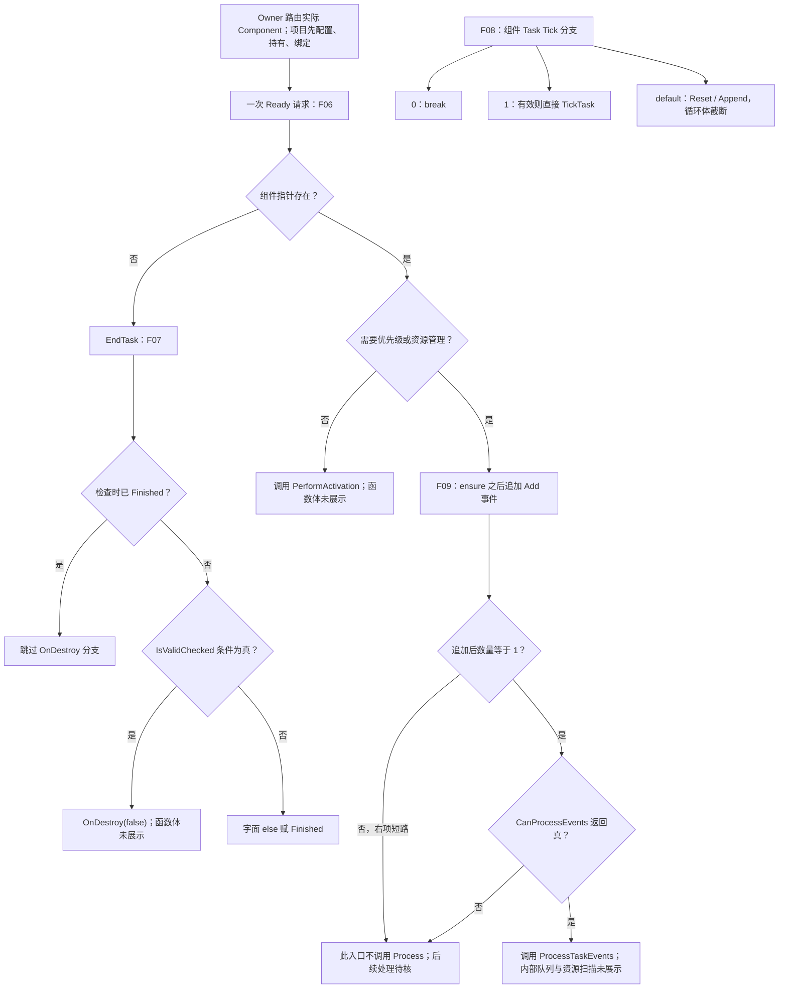

# UE 引擎源码分析 29：Gameplay Tasks 源码专题

> 知识成熟度：L2。本文的主要承诺是**四段保留历史节选的可见分支分析，以及当前公开 API 的外部合同核对**，不再以完整 UE5.8 私有调度实现已经读过为前提。
> 核对日期：2026-10-05。公开 API 页面显示 Unreal Engine 5.8 Documentation；本次没有 UE checkout、Build.version 或运行环境。历史的安装版本、CL、行号及三处截断原样保存在文末，当前文档不能替它们认证来源。

## 1. 从三个故障问题进入源码

这篇文章要回答：为什么 `ReadyForActivation` 返回后任务还没执行？为什么收到 deactivated 不能立即宣布业务成功或放行另一个位置写者？为什么 Task A 在 Tick 里结束 Task B，会改变组件遍历的前提？

答案不需要先假定完整队列算法。先把可观察对象分开：创建得到 Task，提交产生请求，组件决定原生运行资格，Task 自己驱动业务副作用，业务结果再交回准确的接收者。某层推进不代表后一层已经完成。

### 1.1 本文使用的四种证据

| 证据身份 | 可回答的问题 | 不能代答的问题 |
| --- | --- | --- |
| 当前 Epic 公开 API，核对日期如上 | 入口的公开用途、访问级别、Overlap 四策略、完成通知和 override 合同 | 当前所有函数体、私有字段默认值、精确回调全序 |
| 本文保留的四个历史 cpp 围栏 | 给定字面条件下会执行哪些已展示语句 | 节选真实 revision、截断后的实现、当前引擎是否仍逐字相同 |
| 项目协议与纸面反例 | 接入方如何避免旧结果串投、新旧写者重叠 | 原生框架已内置该协议、实际 UE 测试通过 |
| 目标 checkout 待核符号 | 下一步该查哪里、缺什么才能继续推理 | 未读函数已经获得某个预想结论 |

四段源文本只在文末 [H29-10](#h29-10) 保留一次，下文以 F06–F09 指代：

| 片段 | 保留对象及原位置 | 字面边界 |
| --- | --- | --- |
| F06 | `ReadyForActivation`，原 L331–349 | 缺函数最后的右花括号；可见三条出口 |
| F07 | `EndTask` / `ExternalConfirm` / `ExternalCancel`，原 L356–398 | 三函数可见，没有 `OnDestroy` 函数体 |
| F08 | `TickComponent`，原 L405–439 | 截在 default 的 range-for 头，循环体与函数尾均缺失 |
| F09 | `AddTaskReadyForActivation` 及 Remove 开头，原 L446–465 | Add 主体完整；`RemoveResourceConsumingTask` 只有头和日志开头 |

阅读前只需理解 C++ 条件、短路求值、虚调用与回调可重入。以下分支结论都以“控制流正常到达并从先前调用返回”为前提；不把日志、诊断宏或失效指针当作天然无副作用、可安全恢复的东西。

## 2. 先给请求安上准确的身份

### 2.1 Owner、Avatar、Component 与保活是四个问题

`UGameplayTask` 是 UObject，也实现 TaskOwner 接口。Owner 接口给出任务所需的宿主关系；OwnerActor 与作为工作对象的 Avatar 可以不同，例如 Controller 与 Pawn。真正返回的 `UGameplayTasksComponent` 才是本次接入要观察的组件。查组件时任务自身的组件字段可能尚未初始化，不能凭函数名拼出 `InitTask` 赋值与回调先后的全序。[UGameplayTask API](https://dev.epicgames.com/documentation/en-us/unreal-engine/API/Runtime/GameplayTasks/UGameplayTask)

项目记录至少应能区分“哪一个 Owner 的哪一玩法期、哪个 Task 实例、哪一次操作 g1、哪个 Avatar、实际哪个 Component”。两个 Owner 可路由同一组件而参与同域竞争，但结果仍必须分别交付；同一 Avatar 经 Controller 与 ASC 的不同组件接入，则不能只因资源类相同就推定自动互斥。实际组件路由和业务结果隔离是两个轴。

还要另问谁在合法生命周期内持有 Task。局部裸指针、Outer 的名字、弱 Owner 或 `Current` 槽不能代替明确的可达持有责任；强持有也不会让已结束的玩法期重新有效。后文的稳定 g1 记录保存身份、责任和事实，**它本身不延长 UObject 寿命**。

### 2.2 一条创建路线，只交一次启动请求

`NewTask` 的公开职责是创建并初始化。这里选择“合法工厂返回未请求运行的 Task → 配置/持有/绑定 → 一次 Ready”路线；不把它与组件 `RunGameplayTask` / `K2_RunGameplayTask` 的运行入口串成“Run 以后再 Ready”。若采用 Runner，按它的目标版本合同交由该入口负责运行请求，另核返回结果，不套用下面的手动 Ready。[Task 创建入口](https://dev.epicgames.com/documentation/en-us/unreal-engine/API/Runtime/GameplayTasks/UGameplayTask)、[组件运行入口](https://dev.epicgames.com/documentation/en-us/unreal-engine/API/Runtime/GameplayTasks/UGameplayTasksComponent)

下面是**接入定位用项目伪代码，不是可编译 UE 实现**。`登记`、`归账`、`Closing` 均是项目职责；具体原生工厂、资源类与宿主工程例见 [09：GameplayTask 任务框架](09-GameplayTask任务框架.md)。

```text
宿主先登记 g1 = (Owner玩法期, operation_id, 接收者身份)，状态 Starting
  g1 在任何可能重入的创建/初始化调用之前已存在
用约定的 NewTask 工厂创建 task1（工厂不会自行 Ready 或启动业务写入）
返回的 task1 永远归账给 g1，不无条件覆盖 Current
  若工厂回调已关闭 g1 或换成 g2：按 g1 责任收尾迟返 task1，不启动它
  仅在 g1 仍获准且对象合法时继续
由有效宿主强持有 task1，配置 Required 和 Claimed，绑定 g1 的接收路由
  配置/绑定若允许外调，返回后也复核 g1，不读 Current(g2) 代替它
对 task1 调用一次 ReadyForActivation
  此调用可能进入实际 Activate，也可能当场结束，接收准备必须已经完成
```

本段保留最小创建例的用途，但故意不把 `NewTask` 三行当作完整生命周期。工厂自身若允许初始化回调，必须约定可重入行为及迟返资源归属；先创建、后登记 g1 会让问题早于 Ready 就出现。

蓝图路线另按真实异步节点合同接线。当前 `ReadyForActivation` 同时带有 `BlueprintCallable` 与 `BlueprintInternalUseOnly`，后者表示用于节点内部实现，不能宣传为普通直接放置的蓝图节点；已经由节点展开负责请求时，不再人为追加一次 Ready。`BlueprintType` / `ExposedAsyncProxy` 也不把普通 C++ `Activate` 虚函数变成蓝图事件。[Ready 声明](https://dev.epicgames.com/documentation/en-us/unreal-engine/API/Runtime/GameplayTasks/UGameplayTask)、[UFunctions 元数据](https://dev.epicgames.com/documentation/en-us/unreal-engine/ufunctions-in-unreal-engine)

## 3. F06：Ready 的三个出口，只有一个去 Add

对照文末 F06。第一层不是“有没有资源”，而是 `TasksComponent.Get()` 能否取得组件指针；只有有组件才会执行管理需求判断。

| 依次满足的条件 | 片段内直接后继 | 此处还不能判断 |
| --- | --- | --- |
| 组件指针为空 | 调用 `EndTask()` | 业务失败原因、OnDestroy 的完整清理，以及外部操作是否已停 |
| 组件非空，`RequiresPriorityOrResourceManagement() == false` | 调用 `PerformActivation()` | 其内部置状态/通知顺序；返回时任务是否仍 Active |
| 组件非空，管理需求为 true | 调用 `TasksPtr->AddTaskReadyForActivation(*this)` | 事件是否当场处理，资源是否获得，任务是否实际开始 |

三个条件可以手工复现不同路径：

1. 给定组件为空，控制流不执行管理需求判断，直接转 F07 的结束入口。这不是“永远悬空等资源”，也不自动生成一个项目 `Failed` 结果。
2. 给定组件存在且不需要管理，只能走 `PerformActivation`，不会执行这里的 Add。由此足以反驳“该片段中所有 Task 都先进资源优先队列”。注意，**不需要资源管理也没有绕过本片段的组件检查**。
3. 给定组件存在且需要管理，继续看 F09，而不是把 Add 的名字当作已经 Active 的证据。即使后续真的执行了 Activate，任务也可能在自己的激活逻辑中拒绝输入或结束；“发起执行”与“调用返回时仍在执行”仍然不同。

工程上的因果关系因此是：先持有并设置接收者，才能交出可能同步推进的请求。反例是 Ready 之后才绑定完成通知；若本次请求栈内已经结束，后来绑定补不回已发生的结果。

这里没有 `PerformActivation`、`InitTask` 的函数体。当前 API 能补充初始化与实际激活的职责区别，却不能认证旧文“回调 A 必定先于赋值 B”“Active 后一定登记入某列表”的排列。要证明这些，需读目标版本对应函数及其调用者。

## 4. F09：追加事件与立即处理之间有一道真正的门

### 4.1 先按语句顺序走，不按函数名猜

Add 主体的可见顺序是：日志 → `ensure(NewTask.RequiresPriorityOrResourceManagement() == true)` → `TaskEvents.Add(...)` → 条件 `if` → 可能调用 `ProcessTaskEvents()`。

`ensure` 表达这里对管理需求的检查，但**源码没有把 Add 放在 ensure 返回值为真的 if 体内，也没有在它后面写失败 return**。因此不能画成“ensure 不满足就显式拒绝入队”。各构建下宏如何诊断、是否中断等需要另核；本文只作结构判断：若控制流从该语句继续向下，下一条仍是 Add，不是已展示的业务拒绝分支。

真正控制本入口是否直接调用 Process 的，是**追加之后**的事件数量以及短路表达式：

| Add 后的 `TaskEvents.Num()` | 是否求值 `CanProcessEvents()` | 本入口接下来做什么 |
| --- | --- | --- |
| 等于 1 | 是，返回 true | 直接调用 `ProcessTaskEvents()` |
| 等于 1 | 是，返回 false | 不调用 Process，已追加的事件仍在列表中 |
| 大于 1 | 否，`&&` 左项为 false，右项短路 | 不调用 Process，不能记一个虚构的 CanProcess 返回值 |

这张表记录实际求值轨迹，而非将右项任意设为 true/false 的四格真值表。条件是代码当时读到的数量；不能偷换成“添加前为空就一定执行”，因为还必须通过 `CanProcessEvents()`。

### 4.2 三个小输入解释“为什么没跑”

- 正例：正常追加使数量从 0 到 1，随后 CanProcess 返回 true。能断言发生的是对 Process 的调用；其是否激活某个任务仍由未展示的实现决定。
- 反例一：同样从 0 到 1，但 CanProcess 返回 false。事件已经加入，本次没有立即 Process；“没立即开始”不等于工厂失败或事件丢失。
- 反例二：原本有一个事件，本次追加后为 2。程序直接跳过右项，既没有询问可处理性，也没有从此入口调用 Process。即使旁观者猜测此刻“应该可以处理”，也不能把猜测写成一次真实调用。

F09 后面虽出现 `RemoveResourceConsumingTask` 的函数头，却没保留移除语句。Add 片段也没给 Process 的循环、锁出口或队列更新。因而这里不能回答“剩余事件由谁、在哪一帧继续处理”，更不能认证旧文的 16 次阈值、超限清空、先收集取消列表或资源广播全序。

事件先记录、处理再受门控制，能帮助理解回调期间不必每次立即递归进入处理的结构；它**不证明任意递归都被阻止**。`FEventLock` 与 `EventLockCounter` 的公开存在也不是工作线程互斥证书。[组件 API](https://dev.epicgames.com/documentation/en-us/unreal-engine/API/Runtime/GameplayTasks/UGameplayTasksComponent)

## 5. F07：结束入口能挡什么，不能替业务挡什么

### 5.1 End、Confirm、Cancel 分支逐一核对

`EndTask` 的日志在 Finished 判断之前，所以“已 Finished 就什么都不做”也过于宽泛。进入条件判断后才有下面的有限结论：

| 调用和条件 | 片段内可见结果 | 不蕴含的结果 |
| --- | --- | --- |
| EndTask，检查时已 Finished | 不进入后续 OnDestroy/赋值分支 | 别处的业务通知也自动去重 |
| EndTask，未 Finished，`IsValidChecked(this)` 为真 | 虚调用 `OnDestroy(false)` | 所有外部 writer 停止、child 全部结束、资源已按某顺序释放 |
| EndTask，未 Finished，上述条件为假 | 字面 else 将 `TaskState` 设为 Finished | 任意无效指针都可安全调用；完整 GC 或诊断行为已知 |
| `ExternalConfirm(false)` | 日志后不调用 EndTask | “确认”一定等于完成或取消 |
| `ExternalConfirm(true)` | 调用 EndTask，继续受上面条件控制 | 任意具体 override 都采用相同业务语义 |
| 这里的基类 `ExternalCancel()` | 日志后调用 EndTask | 导航、动画、远端或项目异步驱动已经确认取消 |

`OnDestroy(false)` 的 false 是这里传入的参数，不是一次外部停止确认。默认取消的公开说明也把具体含义留给任务实现，不能因函数叫 Cancel 就把“请求”升级成“已停”。[ExternalCancel](https://dev.epicgames.com/documentation/en-us/unreal-engine/API/Runtime/GameplayTasks/UGameplayTask/ExternalCancel)

### 5.2 Finished guard 不等于业务幂等

反例一：项目在 `ExternalCancel` 中调用基类，返回后无条件广播取消。即使第二次基类 EndTask 被 Finished guard 挡住，第二次项目广播仍会发生，因为它不在 guard 里。

反例二：自定义 `OnDestroy` 先外调业务回调，尚未走完基类清理。若回调重入 EndTask，且检查时状态还未 Finished，F07 不存在一个额外的 Closing 门替 override 拦住第二次清理。这是**给定重入和状态条件下的反例**，不是本次观察到某版本必然如此执行。

因此项目应在可能重入的外调之前，在精确 g1 上锁存首个合法业务结果并领取清理/通知责任；默认 Super::ExternalCancel 可能立即结束 Task，不能先调它、回头才决定属于哪次操作。`Finished` 只描述原生生命周期，Succeeded、Failed、Cancelled、OwnerEnded 和清理是否完成应另行记录。

当前 [EndTask 合同](https://dev.epicgames.com/documentation/en-us/unreal-engine/API/Runtime/GameplayTasks/UGameplayTask/EndTask) 要求表达“该 Task 已完成”的通知在 EndTask 之后，避免接收者把仍 Active 的 Task 当成结束。它不是“所有 progress 事件都必须先结束”的规定，也不能直接替所有 AbilityTask 专用输出决定顺序。

但只交换广播和 EndTask 两行仍然不够：g1 的 EndTask 通知 Owner，Owner 回调启动 g2；旧栈返回后若读 `Current->Delegate` 或清 `Current`，就会误投/误清 g2。必须在外调前固定 g1 的 Task 身份、结果值和合法接收路由，结束后只处理 g1 的独立记录，不能从已经结束的 Task 字段取回通知对象。若接收者已失效，抑制该业务通知，同时保留清理事实。

### 5.3 OnDestroy、Owner 结束与 GC 的断点

公开合同要求不要直接调用 `OnDestroy`；通过 `EndTask` 或 `TaskOwnerEnded` 进入。override 清理自己负责的绑定、句柄和驱动，最后调用 `Super::OnDestroy`。文档使用 Pending Kill 用语，但它没有提供这里缺失的完整函数体，不能从 F07 的一个调用点画出组件通知、child 传播、资源释放和最终内存回收的全序。[OnDestroy](https://dev.epicgames.com/documentation/en-us/unreal-engine/API/Runtime/GameplayTasks/UGameplayTask/OnDestroy)

`TaskOwnerEnded` 是对准确 Task 的 Owner 结束入口；谁遍历宿主实际持有的多个任务仍是接线责任。`MarkOwnerFinished` 表示 Owner 不再希望收到 deactivation 通知，不表示 Owner 从此不发取消，也不是“外部工作已停止”。[Owner 相关入口](https://dev.epicgames.com/documentation/en-us/unreal-engine/API/Runtime/GameplayTasks/UGameplayTask)

Owner 退场时可以停止业务结果交付，却不能顺便丢掉旧操作的迟返句柄、停止确认和释放责任。若原生 Task 先被强制结束，已有且寿命足够的宿主/driver 记录要继续承担旧操作；无法接管的异步扩展不满足本接入合同。

## 6. F08：Tick 的 0、1、default 不是同一条路线

### 6.1 先看 switch，再解释注释

F08 先调用 `Super::TickComponent`，再读取 `TickingTasks.Num()`，并把 `NumActuallyTicked` 置零。下面的“没有 Tick”仅指这个 switch 里可见的 Task 调用，不代表整个函数或 Super 没有工作。

| 读取到的数量/条件 | 已展示的动作 | 精确上限 |
| --- | --- | --- |
| 0 | `break` | switch 这条支路没有 Task Tick |
| 1，元素不满足 `IsValid` | 取得 `TickingTasks[0]` 后跳过调用 | 看不到尾部如何更新组件 Tick 状态 |
| 1，元素满足 `IsValid` | **直接**调用该元素的 `TickTask(DeltaTime)`；正常返回后计数加一 | 没有复制整个任务数组，也没有这里可见的调用后 Active 检查 |
| default，即当前数量大于 1 | 获取函数静态 `LocalTickingTasks`，Reset，Append 原列表，进入 range-for 头 | 原文到此截断；循环体、过滤、计数与尾部未知 |

原注释给出了动机：任务 Tick 可能结束自己，也可能结束等待它的另一个任务，而结束会改变 Ticking 列表。default 中复制服务列表是应对这种容器变化的可见做法；不能把注释中宽泛的“先复制”压过 case 1 的直接调用，写成全部分支的事实。

### 6.2 快照固定了什么，没有固定什么

纸面输入为 A、B 两个任务。default 执行 Append 后，副本中有 A、B；假设后续 A.Tick 结束 B，原列表可能发生移除。复制意图是让服务列表不直接跟随原容器这种改变。

不过副本里还留着 B 并不能证明 B 仍合法、仍 Active 或应该得到一次 Tick。是否重新检查对象与状态、是否跳过 B，要看**未保留的循环体**。本文不伪造“这帧 B 一定跳过”或“这帧 B 一定执行”的引擎输出。

再看 default 的 `static`：scratch 不是每次调用都新建一份。若外层遍历期间可以递归进入同一 default（包括通过另一组件），并再次执行同一 scratch 的 Reset/Append，那么外层所依赖的数据可能受影响。这只是条件反例；真实可达性、完整函数的保护和当前 UE 是否同实现均未知，**不是当前引擎已复现 bug**。

容器副本、对象合法性、原生状态、业务操作身份和线程同步各有不同责任。即使一次 Tick 开始时对象合法，外调返回后也不能无条件继续使用旧 Owner 或从 Current 取“当前任务”当作原来那一个。

### 6.3 同游戏线程仍可能有尚未退场的旧写者

将前两节连接起来，有一个比“结束后别用指针”更具体的项目反例：

```text
g1 在位置写入外调之前登记 write_depth = 1
外调内部允许宿主回调：Cancel(g1)，并提出创建 g2 的请求
  先锁存 g1 的结果与清理责任，设 Closing，禁止 g1 新业务写入
  旧外调尚未返回，冲突 g2 仍不得开始真实副作用
旧外调可能继续完成自己的工作，然后返回
  匹配出口只把 g1 的深度减回 0，并重新核 g1，绝不读取 Current(g2)
  g1 已 Closing，不再追加位置写入
确认旧 driver 实际停写且必要释放完成，才满足冲突写者的放行条件
```

该轨迹是项目允许同步重入时的 **PAPER_EXPECTED**，不声称某次 `SetActorLocation` 必然产生这种回调。没有 worker 线程、没有 sweep 或函数返回 bool，都不能代替“外调执行中不会重入”的证明。

对正常结束路线，先确认可安全结束，外调 EndTask 前锁存 `native-end-issued` 及通知快照；否则结束回调自身可能再次领取结束责任。若 Owner 在写入内部先强制结束 native Task，项目不能假装阻止该路径，也不能因资源可能释放就放行 g2；独立的准入责任须持续守到旧写者退场。所有冲突写者都必须经过这个责任域，绕开的物理、导航或其他直接位置写者不受此协议自动保护。

深度归零只说明所跟踪调用已返回，不能冒充独立异步 driver 的停止 ACK。记录也不能让在外调内部已失效的 UObject 继续合法：driver 必须保证调用期间的对象寿命与合法使用，或限制这类宿主操作、延迟到安全点、拒绝该 driver。不能以“回来以后 IsValid 一下”修复调用内部的非法访问。完整有限位移例和暂停恢复接线由 [09](09-GameplayTask任务框架.md) 承担，这里只解释为何 F07 的结束与 F08 的回调不足以提供那项保证。

## 7. 把可见片段合成一条有断点的调用链



图中没有从 Process 强行连一条“必定 Active”的边，也没有从 OnDestroy 连到“外部工作全部停了”。Tick 子图独立，是因为这四段没有展示任务被登记到 Tick 列表的完整连接。可知的联系来自 F08 注释与项目回调：一次任务调用可能改变别的任务的生命周期，结束又可能触发新的请求；不能将列表、状态和 Current 当作跨外调不变的快照。

故障定位也按断点推进：Ready 没开始，先查组件分支，再查管理标志和事件门，再进入目标 checkout 的 Process/priority 算法；已经 deactivated，先区分暂停和结束，再分别检查业务结果与真实停止。跳过中间证据直接给“资源冲突”“已经成功”结论，会遗漏本篇展示的不同原因。

## 8. 资源、优先级与暂停：用外部合同填语义，不填函数体

### 8.1 资格声明与占用声明不能混成世界锁

当前 [AddRequiredResource](https://dev.epicgames.com/documentation/en-us/unreal-engine/API/Runtime/GameplayTasks/UGameplayTask/AddRequiredResource) 明确把必需资源与运行资格关联，并限定在任务交给组件消费之前配置。Claimed 表达被占用资源的设计含义，可以追溯到 [2016 年署名 mieszko 的资源说明](https://forums.unrealengine.com/t/gameplaytask-resources/361237)；该页面 UI 是 Answers.Archive，旧配置开关、饥饿现象及默认行为不自动成为当前 5.8 实现证明。

项目若希望声明“既需要该资源才准入，也占用该资源”，就显式配置 Required 与 Claimed，并在提交之前完成，不依赖本次未核实的默认合并。仅看到 `bClaimRequiredResources` 名字不能证明它的默认值、何时合并或之后能否再改。资源类型的 ID 接口也不等于世界中某个椅子、目标或跨组件的实例 reservation。[资源类 API](https://dev.epicgames.com/documentation/en-us/unreal-engine/API/Runtime/GameplayTasks/UGameplayTaskResource)

正例是两个任务路由到同一组件、声明真实冲突资源，组件依据 Required/Priority/Overlap 决定立即触发还是等待。反例是两个任务碰巧引用同一 Pawn，但分别使用两个组件：相同资源类型不足以证明跨域排斥；应选择共同有效的仲裁域或补项目副作用准入。结果接收者仍按各自 Owner/g1 隔离。[组件准入说明](https://dev.epicgames.com/documentation/en-us/unreal-engine/API/Runtime/GameplayTasks/UGameplayTasksComponent)

### 8.2 四种 Overlap，取消后仍有残余分支

以下只转述当前 [ETaskResourceOverlapPolicy](https://dev.epicgames.com/documentation/en-us/unreal-engine/API/Runtime/GameplayTasks/ETaskResourceOverlapPolicy) 的政策，不冒充 AddTaskToPriorityQueue 的逐句实现：

| 策略 | 同级冲突如何处理 | 取消请求未让任务结束时 |
| --- | --- | --- |
| `StartOnTop` | 暂停重叠的同优先级任务 | 无该策略的取消请求保证 |
| `StartAtEnd` | 等待其他同优先级任务结束 | 不应画成请求后立即激活 |
| `RequestCancelAndStartOnTop` | 请求取消同级或低级任务 | 暂停尚未结束的重叠同级任务 |
| `RequestCancelAndStartAtEnd` | 请求取消同级或低级任务 | 等待剩余重叠同级任务结束 |

把 StartOnTop 写成“只暂停低级”、把 RequestCancel 写成“只取消同级”，都会改变政策。反过来，不能用政策表补造低级任务、不可暂停任务或资源重算的所有后继；这些需读实际实现。取消返回也不能替代外部 writer 的停止确认。

当前状态枚举为 Uninitialized、AwaitingActivation、Paused、Active、Finished；枚举的列举顺序不是状态转换图。资源冲突不等于业务失败，也不由“冲突”一词唯一推出 Paused 或 AwaitingActivation。[EGameplayTaskState](https://dev.epicgames.com/documentation/en-us/unreal-engine/API/Runtime/GameplayTasks/EGameplayTaskState)

deactivation 可由暂停或结束产生，activation 也包含恢复。因此暂停回调不能发布终态成功，更不能当 cleanup ACK。`Pause` / `Resume` 是 protected 生命周期机制，普通调用者不要把它们与 Ready/End 并列为通用外部入口；任务 override 按组件机制处理自己的业务暂停，项目侧明确取消/Owner 结束责任。`IsPausable()` 的存在不证明返回 false 后一定自动 Finished。[任务访问级别](https://dev.epicgames.com/documentation/en-us/unreal-engine/API/Runtime/GameplayTasks/UGameplayTask)、[组件通知合同](https://dev.epicgames.com/documentation/en-us/unreal-engine/API/Runtime/GameplayTasks/UGameplayTasksComponent)

## 9. 线程、child 与上层系统的必要边界

- **按需 Tick**：当前 API 将 `TickTask` 关联到 `bTickingTask`。不参加逐帧任务 Tick 不等于零注册、事件或资源管理开销；F08 未包含构造函数，不能据它认证 Tick 组和启停的完整规则。
- **线程接线**：本文的项目调用合同是在游戏线程处理 Task、Owner、组件及 UObject 访问；worker 只计算可安全复制的独立数据，回到游戏线程后再按精确 g1、对象合法性、玩法期和 Closing 状态接收。晚结果不因“已经回主线程”就自动属于新 Current。四片段没有 worker 锁实现，不能把 FEventLock、数组副本或资源竞争当跨线程同步协议。
- **parent/child**：Task 实现 Owner 接口并存在 `GetChildTask`，只证明相应入口存在。项目要列清 child 的实际 Owner/Component、强持有、结果路由、结束及迟返资源责任；不能由一个 getter 推出任意 child 容器、自动级联取消、资源继承或传播全序。parent P 只能触及自己的 C，另一 Owner Q 的 C2 不能因类名相同被清理。
- **网络**：组件公开有 `SimulatedTasks` 与复制入口；这不足以推出完整优先级队列、资源占用、业务结果都自动同步。项目仍需明确权威端的结果与准入、客户端表现及实际确认，不能把本地 Active 当远端 ACK。[组件复制入口](https://dev.epicgames.com/documentation/en-us/unreal-engine/API/Runtime/GameplayTasks/UGameplayTasksComponent)
- **AI / StateTree / GAS**：上层选择目标和切换意图，Task 表达一次工作；三者的状态不能直接代换原生 TaskState。由 Ability 正常创建管理的 AbilityTask 会随所属 Ability 结束，这项保证应保留；通用 Task、自定义外部操作和任意 child 不自动套用它。AbilityTask 的网络同步与输出有专门合同，不由一个 networking bool 推出。[Ability Tasks](https://dev.epicgames.com/documentation/en-us/unreal-engine/gameplay-ability-tasks-in-unreal-engine)

需要实现时先评估现有任务是否适合，再定义自己的副作用与停止合同。本文不复制第二套冲刺/GAS 教程：原生接入看 [09](09-GameplayTask任务框架.md)，跨系统持久收尾与身份对齐看 [GameplayTasks、StateTree、GAS、AI 协同](../../06-游戏AI/感知决策与行为规划/07-GameplayTasks-StateTree-GAS-AI协同.md)。

## 10. 纸面复核：输入改变时，哪一步结论跟着变

以下全是 **PAPER_EXPECTED / NOT_RUN_ENGINE**。读者可以对照 F06–F09 的条件逐步勾选；没有伪造 UE 日志、帧号、回调次数实测或通用模型冒充引擎测试。

### P11：Ready 与事件门

1. 组件空：F06 直达 EndTask；再进入 F07 guard。不回答业务结果。
2. 组件存在、无需管理：F06 直达 PerformActivation；不经过 F09。
3. 组件存在、需要管理，Add 后数量为 1、CanProcess 为真：F09 直接调 Process；到此停止，不能自行补一个 Active 输出。
4. 与 3 相同但 CanProcess 为假：事件已加，本入口没处理；不能把它写成失败、丢失或下一帧必处理。
5. Add 后数量大于 1：右项未求值，无本入口 Process。即便做四格逻辑假设，两个 Num>1 的格也必须共享这一实际执行轨迹。

负向判定：若笔记仍得出“每次 Ready 都排队”“每次 Add 都同步 Process”“ensure 为假显式 return”，就是越过了可见分支。

### P12：Tick 与结束

1. 数量 0：switch 无 Task Tick；数量 1 且有效：直接 Tick，正常返回后局部计数加一；数量 1 且无效：跳过 Tick。
2. 数量 2：只跟到 default 的 Reset/Append/for 头。假设 A 结束 B，正确答案是“B 的过滤规则待看循环体”，不是猜运行输出。
3. 已 Finished 的 EndTask 跳过内部清理分支；未 Finished 的两支分别是 OnDestroy(false) 和字面赋 Finished。Confirm(false) 不调 End；这里的基类 Cancel 调 End。
4. 在项目 End 之后无条件广播两次，不能拿 F07 guard 证明只有一次业务通知；旧外调尚未退出，也不能拿 Finished 证明它已经停写。

### 与 09 的十二情境分工

| 情境 | 本篇能静态解释的点 | 工程接线/下一验证位置 |
| --- | --- | --- |
| P01 创建与同步结束 | §2–3：工厂前登记、绑定早于一次 Ready，迟返归原 g1 | [09 的原生主例](09-GameplayTask任务框架.md) |
| P02 正常有限位移 | §6.3：Tick/计时不自动证明目标写入成功 | 09 的输入、写入与成功判定 |
| P03 同组件四策略 | §8.2：pause/wait/cancel-request 残余支路 | 09 的同级争用情境；实际队列运行未验 |
| P04 同 Avatar 分域 | §2.1、§8.1：同资源类不等于跨组件互斥 | 09 的组件路由与项目准入 |
| P05 暂停恢复 | §8.2：deactivation 可以是暂停 | 09 的活动时长冻结与恢复政策 |
| P06 结束重入 g2 | §5.2：End 回调启动 g2 后旧栈只用 g1；§6.3 补在途写入 | 09 的固定结果/接收记录与结束门 |
| P07 重复或相撞结束 | §5.1–5.2：原生 guard 与项目终态领取分开 | 09 的唯一结果、清理与通知责任 |
| P08 取消后仍未停 | §6.3：depth/ACK/准入各有条件，不能因 native 结束放行 | 09 的同步主例与异步扩展边界 |
| P09 Owner 失效及迟返 | §2.2、§5.3：迟返归 g1，失效接收者不收业务结果但清理继续 | 09 的宿主退出与已有 driver 接管 |
| P10 parent/child 与两 Owner | §9：P/C 与 Q/C2 身份分开，getter 不补全内部传播 | 09 的 child 责任；实际传播函数待核 |
| P11 历史 Ready/事件门 | 本节完整逐条件追踪 | F06、F09；无 UE 运行结论 |
| P12 历史 Tick/结束 | 本节完整逐条件追踪 | F07、F08；三个截断处不补源码 |

P06/P08 还共享一个关键负向情境：g1 外调深度为 1 → 回调取消 g1 并请求 g2 → 旧外调返回前仍可能继续写。正确项目判定是 g1 已 Closing，冲突 g2 暂不写；即使 Owner 先结束 native Task，也要等旧写者的真实退场条件满足。这里审核的是合同推理，UE 复现仍未运行。

## 11. 要继续读完整实现，应补哪些证据

本次实际完成的是四段原字面分析、当前一手 API 核对及上述项目反例推演。未运行 UE/UHT/UBT/PIE、蓝图编译、资源队列、运动碰撞、GC、线程、网络或性能测试。纸面情境和文档机械检查均不提升到 L3/L4，`verified: []` 保持不变。

| 尚未得到的实现 | 可移植定位与要回答的问题 |
| --- | --- |
| 初始化/真正激活全序 | `Engine/Source/Runtime/GameplayTasks/Private/GameplayTask.cpp` 中 `InitTask`、`PerformActivation`；组件取得、回调与状态何时改变，立即结束如何处理 |
| 完整事件与优先级算法 | `Engine/Source/Runtime/GameplayTasks/Private/GameplayTasksComponent.cpp` 中 `ProcessTaskEvents`、`AddTaskToPriorityQueue`、`UpdateTaskActivations`；排序、取消遍历、重入门及剩余事件处理 |
| 资源默认与释放 | 上述 Task/Component 实现，以及 `Engine/Source/Runtime/GameplayTasks/Classes/GameplayTask.h`；Required→Claimed 默认/时点、暂停占用、资源变化通知次序 |
| 销毁与 child | `OnDestroy`、`TaskOwnerEnded`、child 登记/替换/结束路径；原生状态、Owner 通知、可回收状态分别何时发生 |
| Tick 尾部与锁 | 完整 `TickComponent`、`FEventLock` / `CanProcessEvents` 调用者；有效性过滤、scratch 可重入前提、Tick 启停 |

开始这些检查时先记录目标 checkout 的真实版本/revision，再读取相应函数与调用者；路径存在也不等于行为已核实。没有 checkout 时止于公开合同，不能把同名 API 页面当成旧 CL 的逐句证明。

2026-10-05 的来源核对还保留了不完整结果：RunGameplayTask/K2_Run 专页及若干 getter 返回旧版导航壳；Ready/Init 等专页未提供函数体；`EGameplayTaskRunResult` 与 `FGameplayResourceSet` 页没有可用正文，不能据此认证 Error 分支、uint16/16 资源上限；`IsPausable` 专页也未提供“不可暂停必失败”的实现。相关基本声明取自成功的类页，缺失正文仍是缺失，不是 API 不存在。2016 论坛也不填补这些当前默认值。

### 关联阅读清单

- [GameplayTask 任务框架：接入与原生实践](09-GameplayTask任务框架.md)
- [引擎源码分析分类 README](../../../游戏知识/12-引擎源码分析/README.md)
- [UE5.8 高优先级源码覆盖路线图](../../03-引擎架构与资源系统/源码阅读与覆盖基线/19-高优先级源码覆盖路线图.md)
- [Mass 与 StateTree 源码专题](../../06-游戏AI/导航移动与群体协同/21-Mass与StateTree源码.md)
- [World Partition 与 World Streaming 源码专题](../../03-引擎架构与资源系统/世界组织与资源加载/22-WorldPartition与WorldStreaming源码.md)
- [Sequencer 与 MovieRenderGraph 源码专题](../../04-图形动画与物理仿真/过场渲染与虚拟制片/24-Sequencer与MovieRenderGraph源码.md)
- [Enhanced Input 与 Gameplay Tags 源码专题](../输入移动与交互/25-EnhancedInput与GameplayTags源码.md)
- [GameplayTasks API](https://dev.epicgames.com/documentation/en-us/unreal-engine/API/Runtime/GameplayTasks)
- [Gameplay Ability Tasks](https://dev.epicgames.com/documentation/en-us/unreal-engine/gameplay-ability-tasks-in-unreal-engine?lang=en-US)

## 12. 历史原文保留区

以下十组是旧文的来源声明与源码原片段，按原出现身份逐字保留。它们内部的“本机已核实”“当前事实基线”“真实源码”等词属于历史原文，**不覆盖上文的 2026-10-05 证据边界**。H29-02/04/05/06 字面相同，H29-08 也含同句，仍分别保留原身份；H29-10 包含全部四段 cpp，只保留这一个完整末段，不再重复粘贴代码。截断保持原样，不能直接编译。

### H29-01

<!-- BEGIN H29-01 原文 -->
> 知识成熟度：L2（本轮审计修订时补标）
> 分工声明：本文为 UE5.8 源码层深读；概念/使用层知识见本目录 README 映射表及各篇关联阅读（不重复使用层教程）。

> 版本基准：UE5.8.0 / CL 55116800 / ++UE5+Release-5.8
> 最后更新：2026-08-18（补入 GameplayTask/GameplayTasksComponent 实际生命周期与调度函数）。

## 概述

本文以 UE5.8 本机源码为证据，梳理 GameplayTask/TaskOwner/GameplayTasksComponent 的生命周期状态机、资源锁与优先级调度、异步与线程边界，并给出与 StateTree/AI/GAS 的职责划分。
<!-- END H29-01 原文 -->

### H29-02

<!-- BEGIN H29-02 原文 -->
> 版本基准：UE5.8.0 / CL55116800 / ++UE5+Release-5.8
<!-- END H29-02 原文 -->

### H29-03

<!-- BEGIN H29-03 原文 -->
- 以上路径与符号已由本机 UE5.8 源码核实，未修改引擎安装目录。
<!-- END H29-03 原文 -->

### H29-04

<!-- BEGIN H29-04 原文 -->
> 版本基准：UE5.8.0 / CL55116800 / ++UE5+Release-5.8
<!-- END H29-04 原文 -->

### H29-05

<!-- BEGIN H29-05 原文 -->
> 版本基准：UE5.8.0 / CL55116800 / ++UE5+Release-5.8
<!-- END H29-05 原文 -->

### H29-06

<!-- BEGIN H29-06 原文 -->
> 版本基准：UE5.8.0 / CL55116800 / ++UE5+Release-5.8
<!-- END H29-06 原文 -->

### H29-07

<!-- BEGIN H29-07 原文 -->
- 下列调用只使用本机 UE5.8 已核实的 `UGameplayTask` API；项目类型均为占位符。
<!-- END H29-07 原文 -->

### H29-08

<!-- BEGIN H29-08 原文 -->
> 版本基准：UE5.8.0 / CL55116800 / ++UE5+Release-5.8

### 版本核对

- 本专题当前事实基线固定为本机 UE5.8.0，不混用旧版本行为作为无条件结论。
- 变更列表对应 CL55116800，分支标识为 `++UE5+Release-5.8`。
- 核心头文件：`Engine/Source/Runtime/GameplayTasks/Classes/GameplayTask.h`。
- 组件头文件：`Engine/Source/Runtime/GameplayTasks/Classes/GameplayTasksComponent.h`。
- Owner 接口：`Engine/Source/Runtime/GameplayTasks/Classes/GameplayTaskOwnerInterface.h`。
- 资源定义：`Engine/Source/Runtime/GameplayTasks/Classes/GameplayTaskResource.h`。
- 状态与默认优先级：`Public/GameplayTaskTypes.h`、`EGameplayTaskState` 和 `FGameplayTasks::DefaultPriority`。
- 调度实现：`Private/GameplayTask.cpp` 与 `Private/GameplayTasksComponent.cpp`。
- 资源 ID 实现：`Private/GameplayTaskResource.cpp`，由 `UGameplayTaskResource` 默认对象提供。
<!-- END H29-08 原文 -->

### H29-09

<!-- BEGIN H29-09 原文 -->
- 本清单中的源码路径、状态枚举、资源位集合和调度函数均以 UE5.8 本机安装为准。
<!-- END H29-09 原文 -->

### H29-10

<!-- BEGIN H29-10 原文 -->
## 真实源码证据补充（2026-08-18）

本文原有 Owner/Task/Resource 片段是项目接入的伪代码；以下真实函数展示任务进入激活队列、结束清理、组件 Tick 快照和事件处理入口，项目自定义任务只能建立在这些实现之上。

### GameplayTask：ReadyForActivation

来源：Engine/Source\Runtime\GameplayTasks\Private\GameplayTask.cpp（第 56-72 行）

```cpp
void UGameplayTask::ReadyForActivation()
{
	if (UGameplayTasksComponent* TasksPtr = TasksComponent.Get())
	{
		if (RequiresPriorityOrResourceManagement() == false)
		{
			PerformActivation();
		}
		else
		{
			TasksPtr->AddTaskReadyForActivation(*this);
		}
	}
	else
	{
		EndTask();
	}
```


### GameplayTask：EndTask 清理

来源：Engine/Source\Runtime\GameplayTasks\Private\GameplayTask.cpp（第 165-205 行）

```cpp
void UGameplayTask::EndTask()
{
	UE_VLOG(GetGameplayTasksComponent(), LogGameplayTasks, Verbose
		, TEXT("%s EndTask called, current State: %s")
		, *GetName(), *GetTaskStateName());

	if (TaskState != EGameplayTaskState::Finished)
	{
		if (IsValidChecked(this))
		{
			OnDestroy(false);
		}
		else
		{
			// mark as finished, just to be on the safe side
			TaskState = EGameplayTaskState::Finished;
		}
	}
}

void UGameplayTask::ExternalConfirm(bool bEndTask)
{
	UE_VLOG(GetGameplayTasksComponent(), LogGameplayTasks, Verbose
		, TEXT("%s ExternalConfirm called, bEndTask = %s, State : %s")
		, *GetName(), bEndTask ? TEXT("TRUE") : TEXT("FALSE"), *GetTaskStateName());

	if (bEndTask)
	{
		EndTask();
	}
}

void UGameplayTask::ExternalCancel()
{
	UE_VLOG(GetGameplayTasksComponent(), LogGameplayTasks, Verbose
		, TEXT("%s ExternalCancel called, current State: %s")
		, *GetName(), *GetTaskStateName());

	EndTask();
}

```


### GameplayTasksComponent：Tick 快照

来源：Engine/Source\Runtime\GameplayTasks\Private\GameplayTasksComponent.cpp（第 258-290 行）

```cpp
void UGameplayTasksComponent::TickComponent(float DeltaTime, enum ELevelTick TickType, FActorComponentTickFunction *ThisTickFunction)
{
	SCOPE_CYCLE_COUNTER(STAT_TickGameplayTasks);

	Super::TickComponent(DeltaTime, TickType, ThisTickFunction);

	// Because we have no control over what a task may do when it ticks, we must be careful.
	// Ticking a task may kill the task right here. It could also potentially kill another task
	// which was waiting on the original task to do something. Since when a tasks is killed, it removes
	// itself from the TickingTask list, we will make a copy of the tasks we want to service before ticking any

	int32 NumTickingTasks = TickingTasks.Num();
	int32 NumActuallyTicked = 0;
	switch (NumTickingTasks)
	{
	case 0:
		break;
	case 1:
		{
			UGameplayTask* TickingTask = TickingTasks[0];
			if (IsValid(TickingTask))
			{
				TickingTask->TickTask(DeltaTime);
				NumActuallyTicked++;
			}
		}
		break;
	default:
		{
			static TArray<UGameplayTask*> LocalTickingTasks;
			LocalTickingTasks.Reset();
			LocalTickingTasks.Append(TickingTasks);
			for (UGameplayTask* TickingTask : LocalTickingTasks)
```


### GameplayTasksComponent：加入待激活事件

来源：Engine/Source\Runtime\GameplayTasks\Private\GameplayTasksComponent.cpp（第 335-352 行）

```cpp
void UGameplayTasksComponent::AddTaskReadyForActivation(UGameplayTask& NewTask)
{
	UE_VLOG(this, LogGameplayTasks, Log, TEXT("AddTaskReadyForActivation %s"), *NewTask.GetName());

	ensure(NewTask.RequiresPriorityOrResourceManagement() == true);

	TaskEvents.Add(FGameplayTaskEventData(EGameplayTaskEvent::Add, NewTask));
	// trigger the actual processing only if it was the first event added to the list
	if (TaskEvents.Num() == 1 && CanProcessEvents())
	{
		ProcessTaskEvents();
	}
}

void UGameplayTasksComponent::RemoveResourceConsumingTask(UGameplayTask& Task)
{
	UE_VLOG(this, LogGameplayTasks, Log, TEXT("RemoveResourceConsumingTask %s"), *Task.GetName());

```
<!-- END H29-10 原文 -->
