# 01 UMG 框架与控件系统

> 知识成熟度：L2。版本基准： 2026-10-09 实际读取的 Epic 公开 UE 5.6 文档；UWidget、输入模式、ConstructWidget、IUserListEntry 与多播基类的部分 API 使用明确标注的 5.5 辅助页，BindWidget 元数据使用当前标为 5.8 的公开页。版本与读取范围见第 9 节。
> 适用范围：UMG 游戏界面的对象、布局、输入、事件、动画和列表设计。示例是有限教学实现，均未进行 UE、UHT、C++ 编译、PIE、UI、截图、输入、网络、设置或性能实验，也未读取 Engine 实现源码。所有结果标为 PAPER_EXPECTED，不能当作运行记录。
> 最后更新：2026-10-09。修订类与实例、Slate 构建、生命周期、列表复用、解绑、布局、输入与诊断的因果解释。旧“本机 UE 5.8 / CL 55116800”没有本轮机器证据，原声明仅留在历史附录。

## 1. 概述

UMG（Unreal Motion Graphics）把游戏数据与 Slate 界面连接起来：设计者用 Widget Blueprint 组织控件、布局和动画，程序通过 UWidget / UUserWidget 的属性与事件更新界面，Slate 负责底层布局、输入与绘制。菜单、HUD、背包、设置页都可采用这一分工；复杂度增加时，再选择数据通知、列表虚拟化和输入框架，而不是把所有工作塞进一个 Tick。

本章回答三个问题：

1. **如何理解 UMG**：资产、生成类、运行对象、WidgetTree 与 Slate 控件分别是什么，谁持有状态？
2. **如何建立可重复使用的界面**：怎样布局、创建、显示、绑定、播放动画、关闭，再安全地打开？
3. **如何管理复杂界面**：何时采用 ListView、CommonUI 或 MVVM，怎样区分数据、输入、布局与资源问题？

先把编辑期与运行期分开。Widget Blueprint 保存 Designer 层级、Graph 逻辑和动画定义；编译得到 `UWidgetBlueprintGeneratedClass`，包含用于初始化实例的 WidgetTree 模板、绑定和动画等信息。它不是已经显示在屏幕上的 SWidget。以同一个生成类调用两次 `CreateWidget`，可以得到两个各有自身状态和子控件的 UUserWidget 对象。编辑器预览也会使用对象，但不能因此把“编译蓝图”和“构建底层 Slate 表示”合为同一步。〔S01、S02〕

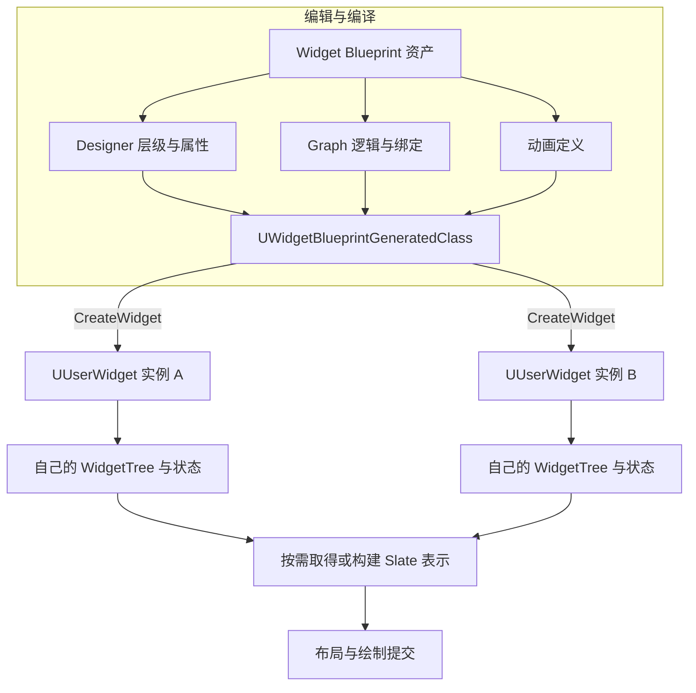

图中的合流表示共享一套机制，不表示两个实例共用一棵有状态的控件树。第 8 节 E1 用两个本地玩家界面说明：只点击 A 时，B 的计数不能跟着改变；若把计数放在共享类默认对象或全局变量里，这个独立实例合同便被破坏。

## 2. 核心概念（表格）

| 概念 | 英文 / 类型 | 作用与边界 | 所属层 |
| --- | --- | --- | --- |
| 控件 | UWidget | Button、Image、TextBlock 等 UObject 侧入口；具体能力取决于控件类型 | UMG |
| 控件蓝图 | Widget Blueprint | 布局、逻辑、动画资产；可产生供多个实例使用的生成类 | UMG |
| 控件层级 | WidgetTree | 实例中的控件关系与根控件；生成类另有模板信息 | UMG |
| 画布面板 | CanvasPanel | 自由定位容器，子项通过 CanvasPanelSlot 布局 | UMG |
| 锚点 | Anchors.Min / Max | 子项相对父 Canvas 区域的基准；不是子项自己的 Alignment | UMG 布局 |
| 插槽 | PanelSlot | 子控件在父容器中的布局参数；父类型决定 slot 类型 | UMG 布局 |
| 尺寸盒 | SizeBox | 对 desired/min/max/override 尺寸施加约束；最终分配仍受父布局影响 | UMG |
| 滚动盒 | ScrollBox | 可滚动容器；**不提供虚拟化**，加入的子控件仍需创建和管理 | UMG |
| 数值输入 | Slider / SpinBox | 提供数值交互；事件参数和提交规则按具体控件处理 | UMG |
| 事件 | 控件委托 / 自定义事件 | 传递交互与状态变化；绑定者必须负责相应的解绑范围 | UMG / 业务 |
| 控件动画 | WidgetAnimation | 时间轴驱动支持的属性轨道；完成通知不等于业务成功 | UMG |
| Slate | Slate UI Framework | 声明式组合、布局、输入路由与绘制框架 | Slate |
| 控件基类 | SWidget | 非 UObject；公开继承包含 FSlateControlledConstruction 与 TSharedFromThis | Slate |
| 布局容器与槽 | SBoxPanel / SOverlay 及其 Slot | 容器组织子项，slot 记录每个子项的排布规则；两者不能混称 | Slate |
| 样式与绘制资源 | Style / FSlateBrush | 组织颜色、字体、图片、边框等；资源的 UObject 所有权另行管理 | Slate / UMG |
| 通用界面框架 | CommonUI | 可激活界面、输入路由、焦点策略和平台样式；需要项目配置 | 插件 |
| 数据展示模型 | MVVM ViewModel | UMG Viewmodel 插件通过 FieldNotify 等机制更新绑定；5.6 文档标为 Beta | 插件 / 数据 |

大列表还要区分 **Item** 与 **Entry**：Item 是列表的数据对象，Entry 是当前用于表现 Item 的可复用控件。ListView 管理二者关联；不能把“每条数据先创建一个 UUserWidget”当作虚拟化。〔S08、S09、S21〕

## 3. 原理详解

### 3.1 Slate 与 UMG 的关系

Slate 的声明式语法用于组合控件；`SWidget` 由共享引用和弱引用管理，并非 `FWidget` 派生类或 UObject。以下是独立的构造表达式示例，放在拥有相应模块依赖的 C++ 实现文件中；不是完整应用，也未编译。`TSharedRef` 表示该结果不为空，`TWeakPtr` 用于不延长生命周期的观察。〔S03、S26〕

```cpp
#include "Widgets/SBoxPanel.h"
#include "Widgets/Text/STextBlock.h"

TSharedRef<SVerticalBox> BuildGreeting()
{
    return SNew(SVerticalBox)
        + SVerticalBox::Slot()
        .AutoHeight()
        [
            SNew(STextBlock).Text(FText::FromString(TEXT("Hello Slate")))
        ];
}
```

UMG 提供 UObject、蓝图和编辑器层的接口。`TakeWidget()` 的用途是取得底层 Slate 表示：已有缓存时复用，没有时走构建路径；`RebuildWidget()` 才承担构建对应 Slate 控件的职责。因此 CreateWidget、TakeWidget 和 Blueprint 编译不能互换。下图表示责任关系，不是声称已逐行核对的调用栈。〔S01、S02〕

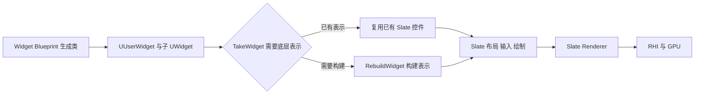

“Slate 控件本身不是 UObject”不意味着整个 UI 没有 GC：UMG 对象、纹理、字体或模型仍可能是 UObject。UMG 的开销也不全来自 Paint，还包括蓝图执行、绑定求值、资源载入、对象创建和回收。出现打开瞬卡时，应分别定位这些阶段，而不是先把全部问题归为 Slate 绘制。

#### Slate 渲染管线（职责简化）

1. 游戏事件或数据通知改变属性、层级和需要呈现的状态。
2. 需要布局时，desired size 自底向上提供需求，父容器再自顶向下安排实际几何；需求尺寸不等于最终分配尺寸。
3. Paint 根据几何、裁剪和层次产生绘制元素；后续批处理还受材质、资源、层与 clip 等条件约束。
4. Slate renderer 将相应工作交给渲染后端和 RHI，最终由 GPU 绘制。

这不是“每帧比较两棵虚拟树”的模型。Invalidation 可缓存部分布局/绘制工作，但缓存覆盖范围、动态区域和更新成本取决于所用模式。Invalidation Box、Global Invalidation、Retainer Panel 的缓存与更新方式不同；Retainer 还引入渲染目标和更新代价。动态或 volatile 内容也并非免费。不能推出“只有一个失效子树参与所有后续工作”，更不能把使用图集或播放 Opacity 动画等同于自动合批。〔S14、S15、S24、S26〕

### 3.2 控件层级（Widget Tree）

同一蓝图类的两个实例可以各有自己的树。根容器按界面需要选择，不必总是 CanvasPanel。父容器决定孩子的 slot 规则：把一个控件从 Canvas 移到 VerticalBox 后，应使用 VerticalBoxSlot 的 padding、alignment、size rule，而不是继续调整 Canvas Anchors。

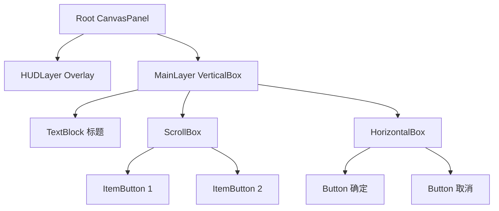

这棵树同时说明布局和组合关系，但单凭父子顺序还不能判断最终覆盖与输入。绘制还受容器的 ZOrder / layer、裁剪和可见性影响；命中测试确定输入路径，事件再按类型沿路径隧道或冒泡，并受 Handled、捕获和焦点影响，不是所有事件都统一从顶层直传到底层。

| Visibility | 保留布局空间 | 绘制 | 自身鼠标命中 | 子控件鼠标命中 |
| --- | --- | --- | --- | --- |
| Visible | 是 | 是 | 可参与 | 按子项状态参与 |
| Hidden | 是 | 否 | 否 | 不通过该隐藏子树参与 |
| Collapsed | 否 | 否 | 否 | 不通过该折叠子树参与 |
| HitTestInvisible | 是 | 是 | 否 | 否 |
| SelfHitTestInvisible | 是 | 是 | 否 | 仍可按子项状态参与 |

表中“可参与”还要求控件 enabled、没有其他遮挡或捕获等。`RenderOpacity=0` 只影响呈现，不能代替禁止交互；透明但 Visible 的控件仍可能影响命中。第 8 节 E8 给出装饰层与子按钮的对照。〔S03、S10、S23〕

#### 常用容器控件速查

| 容器 | 排布职责 | 典型用途与限制 |
| --- | --- | --- |
| Canvas Panel | 按子 slot 的 anchor、alignment、offset 等定位 | HUD 自由摆放；别把整个复杂界面都拆成绝对坐标 |
| Vertical Box | 纵向分配子项 | 菜单、表单；由 slot 控制填充、对齐和尺寸策略 |
| Horizontal Box | 横向分配子项 | 按钮组、图标行 |
| Overlay | 层叠子项 | 背景与内容；各 slot 有对齐和 padding，不保证所有孩子同尺寸 |
| Grid Panel | 按行列组织 | 背包格、技能表；需定义行列与填充关系 |
| Wrap Box | 按可用空间换行 | 标签、表情；长文本和宽度变化会影响换行 |
| Stack Box | 横向或纵向排列 | 可选的顺序容器；不把“比 HBox/VBox 轻量”当普适结论 |
| Size Box | 约束子项需求尺寸 | 最小/最大/override 尺寸；最终 allocation 还受父布局约束 |
| Scale Box | 按 stretch 规则缩放内容 | 图标或内容适配；9-slice 是 Brush 的 Box/Border 绘制方式，不是 ScaleBox 自动能力 |

### 3.3 锚点与布局（Anchor & Layout）

CanvasPanelSlot 的参数应逐项理解：`Anchors.Min/Max` 是父区域中的归一化基准，预设的九宫格只是便利入口；`Alignment` 选取孩子自身的参考点，居中 anchor 不自动让孩子中心居中。Offsets 的含义依轴而变：点锚点轴表达位置偏移和尺寸，拉伸轴表达两端边距。它不是在 Position 与 Size 之间做插值。〔S11、S12〕

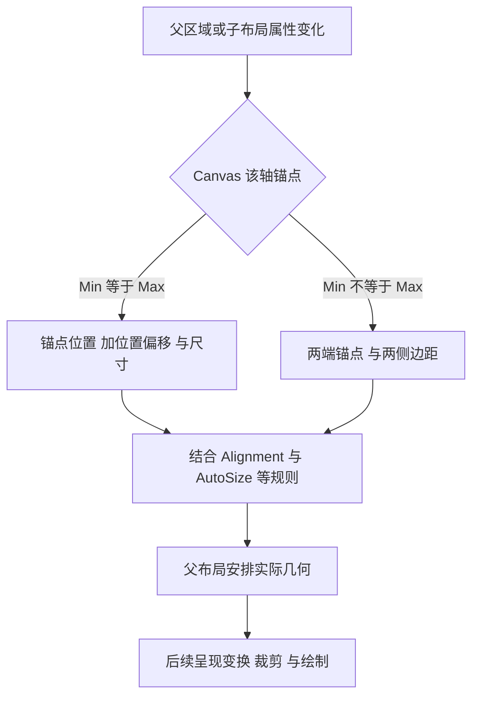

以下是有限手算，不是通用布局公式：关闭 AutoSize，孩子没有额外缩放，父 Canvas 区域为 W×H，单点锚点为 a，位置偏移为 p，孩子尺寸为 s，对齐为 q，则左上角为 `a * (W,H) + p - q * s`。全拉伸的示例取 Alignment=(0,0)，四边距 L/T/R/B，此时矩形左上为 (L,T)，尺寸为 (W-L-R,H-T-B)。混合拉伸、AutoSize 和其他约束不能无条件套同一式子。

#### 四种自适应布局配方与反例

| 用途 | 明确参数 | 1920×1080 父区域的 PAPER_EXPECTED |
| --- | --- | --- |
| 背景铺满 | Min=(0,0)，Max=(1,1)，Alignment=(0,0)，四边距为 0 | 左上(0,0)，尺寸(1920,1080) |
| 右上小地图 | 点锚点(1,0)，Alignment=(1,0)，偏移(-20,+20)，尺寸200×100 | 左上(1700,20) |
| 底部按钮栏 | 点锚点(0.5,1)，Alignment=(0.5,1)，偏移(0,-20)，尺寸600×80 | 左上(660,980) |
| 居中弹窗 | 点锚点(0.5,0.5)，Alignment=(0.5,0.5)，偏移(0,0)，尺寸400×200 | 左上(760,440) |

把右上小地图误设成 Alignment=(1,1)、偏移(-20,-20)，同一尺寸会得到 y=-120，而不是上边留 20。第 8 节 E3 还给出 1440×900 与带边距拉伸的结果，便于分辨是参数理解错误还是额外约束生效。

这里的数值使用 Slate/UI 逻辑单位，不统称物理像素。DPI Scale Rule 和曲线决定 UI 随视口变化的尺度；应用/OS 缩放还可能参与最终映射。在“仅有 1.5 倍 DPI、没有其他 scale”的教学假设下，20 UI units 对应约 30 像素。锚点解决相对父区域的布局，DPI 解决尺度；安全区、长文本、宽高比仍需另行设计。〔S13〕

RenderTransform 适合局部呈现位移、旋转或缩放，它不重新定义相邻控件应该分到多大的 slot。但这一职责区分不等于免失效或零布局成本：5.6 优化/失效文档把 RenderTransform 变化列为布局失效成本，Slate Insights 又分别显示 R（RenderTransform）与 L（Layout）标记。本文保留这项资料颗粒度差异，不冒作源码裁决；实际更新成本需在指定引擎版本和目标场景中采样。Opacity 也是独立属性，不是 RenderTransform 结构的一部分。〔S14、S15、S24〕

### 3.4 Widget Blueprint 开发流程与生命周期

Designer 负责控件层级与布局；Graph 负责事件、函数和数据更新；Details 编辑当前对象的属性、绑定和可用事件；Animations 定义支持的属性轨道。设计好资产之后，还需要配置实际要实例化的生成类和 owning player，不能仅凭“蓝图编译成功”认定运行时显示、输入和退出都已正确。〔S30〕

理解重开问题时，区分三种生命周期：

| 层次 | 何时开始 / 改变 | 管理什么 |
| --- | --- | --- |
| UObject 实例 | CreateWidget 产生实例，初始化其设计树与状态 | 实例数据、固定子控件内部绑定、被引用的资源 |
| 底层 Slate 表示 | 按需取得或重建；相关 Construct/Destruct 可重复 | 当前用于布局、输入与绘制的表示 |
| 业务显示会话 | 项目显式 Open/Close 或 Attach/Detach | 输入所有权、外部订阅、请求代次、计时器、动画与恢复策略 |

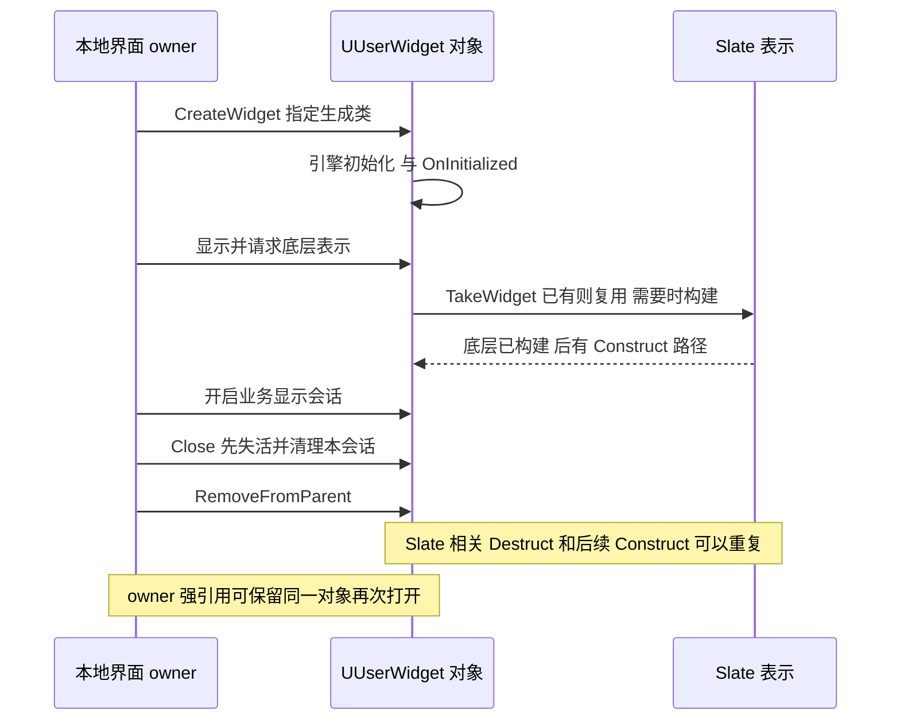

图是职责示意，不固定全部 BP/C++ 钩子的相互顺序，也不保证每次业务 Show 都恰好一次 Construct。PreConstruct 还可用于编辑器预览；不能据图把它限定为游戏创建前的步骤。〔S04–S07〕

#### 生命周期事件如何分配工作

| 入口 | 契约与用途 | 不应放入的假设 |
| --- | --- | --- |
| C++ constructor | 设置默认值 | 此时就访问 BindWidget 成员、运行世界或玩家模型 |
| Initialize | 引擎组织实例初始化；本例不手动调用 | 为“重开”自行反复调用它 |
| OnInitialized / NativeOnInitialized | 游戏中的非模板实例一次初始化；固定内部按钮绑定适合放这里 | 任意外部模型此刻都已就绪 |
| PreConstruct / NativePreConstruct | 编辑器和游戏中的本地外观预览，用 IsDesignTime 区分预览需求 | 访问游戏网络、执行有副作用的游戏业务 |
| Construct / NativeConstruct | 底层 Slate 已构建后的路径，可重复 | NativeConstruct 是 C++ constructor，或对象一生只发生一次 |
| Tick | 需要持续更新时参与；动画、latent 行为与 tick 策略有关 | 改 Timer 就免费，或全部禁用一定无副作用 |
| Destruct / NativeDestruct | 与 Slate 资源生命周期有关，可重复 | UObject 已最终 GC，或所有业务 Close 都只能在这里做 |
| OnAddedToFocusPath | 进入焦点路径，可因子控件获焦而触发 | 当前节点必然是实际持焦点的叶节点 |

Native 覆写保留相应 `Super` 调用。固定同实例的内部按钮可以在 OnInitialized 绑定一次并保留；如果改在每次 Destruct 解绑，就必须设计可重复 Construct 的重绑路径，否则同一个对象重开会失联。外部模型可能晚于界面到达，应给显式 SetModel / Attach 入口，而不是向一次初始化强塞依赖。

`BindWidget` 连接 C++ 成员与蓝图设计器中的控件。第 4 节限定：蓝图派生自指定 C++ 基类；设计器名称、控件类型与成员匹配；相应控件设为变量；实际创建该蓝图生成类。必需绑定缺失应作为配置/编译或初始化失败处理；`BindWidgetOptional` 表示允许缺省，仍需 null 分支。动画绑定使用相应动画元数据，不能把控件与动画类型混用。本轮只读到了当前标 5.8 的 metadata 说明，具体 5.6 UHT 诊断未实测。〔S17〕

#### 移除、复用、GC 与业务清理

`RemoveFromParent()` 移除父级或视口中的挂接，不承诺立刻 GC、取消请求、停止计时器、解除外部订阅或释放全部资源。是否回收 UObject 取决于可达引用；底层 Slate 的释放时机也不能只用这一次调用判断。`Hidden` / `Collapsed` 更只是显示和布局策略，不等于关掉会话。

本例由 `UPROPERTY` 的 `TObjectPtr` 强持有 Menu，刻意允许同一个对象重开；观察方可用 `TWeakObjectPtr`，但 weak 不保活，也不证明当前会话仍与请求开始时相同。关屏重开后 weak 仍有效，旧请求却已经过期，因此请求应保存 session generation，列表还要保存 Item 身份。关闭顺序是先让旧结果失效，再拆自己的监听、停止自己拥有的工作，最后移除；第 4.5 节与 E6/E7 给有限轨迹。〔S02、S18、S29〕

### 3.5 事件、数据与动画

#### 事件系统与订阅所有权

控件事件由具体控件提供，例如 UButton 的 OnClicked、文本框的 OnTextCommitted、Slider 的 OnValueChanged；UUserWidget 可定义供调用的 Custom Event / 函数，也可定义向外广播的 Event Dispatcher。二者与 Construct、Destruct 等生命周期入口承担不同职责。

绑定有三种常见入口：Designer 的事件按钮；蓝图对目标 dispatcher 使用 Bind Event 并提供签名匹配的事件；C++ 对具体 dynamic delegate 使用 AddDynamic/AddUniqueDynamic 与匹配的 UFUNCTION。不存在适用于全部 UWidget 的 `OnClicked` 成员或通用 `NativeOnClicked` 覆写；处理 Slate 输入的 FReply 钩子是另一条输入路径。第 4.4 节让每行对象携带稳定 ItemId，避免无参数点击事件误用父界面的最后一个 CurrentIndex。〔S16、S35〕

解绑先回答“哪个发布者、哪个接收者、哪个功能”。原生多播委托用自己保存的 handle 执行 `Remove(H)`；dynamic 使用原接收者/函数对 `RemoveDynamic`；蓝图用原 Target/事件配对 Unbind Event。`RemoveAll(W)` 按接收者 W 筛选该委托上的全部绑定，可能拆掉 W 的另一功能，但不是清除所有接收者。`Clear()` / 蓝图 Unbind All Events 才属于调用列表的全清操作，蓝图还需注意 Class/Level/Target 的作用范围。第 4.5 节 D 与 E6 明确比较这几种操作，避免把发布者 M 当作应解绑的接收者。〔S33–S36〕

#### 数据更新为何需要通知边界

legacy 属性绑定可能被反复求值；事件驱动的 SetText/SetPercent 在数据变化时更新；UMG Viewmodel 的 FieldNotify 则把变更通知纳入绑定工作流。不要同时让绑定和手工赋值争写同一显示属性。MVVM 需要相应插件与模型通知，不是“UE 5.1 起所有界面天然都有 ViewModel”；5.6 文档仍标 Beta，详细工作流见第 7 节的 MVVM 专题。〔S14、S21〕

按钮 handler 宜发起意图并快速返回。异步请求可以减少同步等待，但回调中的大量控件构建或同步 IO 仍会阻塞 game 线程；后台任务不能直接修改 UI，应调度到 game 线程后再检查 weak、active、generation 和 Item 身份。出错后显示明确失败或让用户重试，不用无限重试掩盖配置错误。

#### 控件动画（Widget Animation）

动画可以驱动对应 track 支持的属性：位移、旋转、缩放等呈现变换，颜色与透明度等各用适合的轨道。`UPROPERTY` 本身不保证任意自定义属性自动出现可用动画轨道。Opacity 不是 RenderTransform 的分量；RenderTransform 也不能作为“零失效、零布局、自动合批”的性能承诺。

`Play Animation`、Forward、Reverse 分别按所需播放策略使用，不能把从头播放与当前进度反向播放混为一项。`NumLoopsToPlay=1` 表示一次，`0` 表示无限；Pause 返回/保留的暂停时间可供显式续播策略使用，Stop 是中断。`RestoreState` 恢复播放前状态，不等于总是恢复 Designer 默认值。若目标是停在结束姿态，要明确不恢复或显式设置最终值，避免两种策略争写属性。〔S07〕

OnAnimationFinished 也可能因 Stop 被触发。它是动画表现结束/停止通知，不能据此确认购买、加载或网络请求成功。快速重开若要识别旧完成通知，需要每次播放的独立上下文保存当时 generation；原生事件不会自动携带本项目代次。第 4.5 节把基础表现例与这一项目协议分开。减少运动的无障碍需求也应进入动画策略，而不是强迫所有用户接受固定过渡时长。

### 3.6 输入、焦点与 CommonUI

普通 UMG 已有键盘/手柄方向导航。显示一个界面时，应先明确创建者的 local player / owning PlayerController，再将用户焦点给已进入树、可见、enabled、focusable 的目标。`UIOnly` 适合本例的单菜单；`GameAndUI` 允许 UI 未消费的输入继续交给游戏；`GameOnly` 用于游戏控制。鼠标光标、锁定和捕获另行决定，设置一个 input mode 不能修复所有命中问题。〔S19、S27〕

关闭应由同一 owner 恢复已知合法的输入和焦点状态。有多层菜单时，需要恢复仍存在的下层目标，不能一律 Close→GameOnly。第 4.1 节仅覆盖“打开前 GameOnly、光标隐藏、没有其他 modal”的单 owner 场景，UIOnly 后关闭按钮自己发出关闭请求，不能期待被 UIOnly 隔开的游戏 action 帮它退出。

CommonUI 是复杂界面的可选插件框架，需要检查项目启用状态、CommonGameViewportClient 或其派生类、Input/Controller Data、local player 和激活策略，不应假定 UE5 默认启用。它保留以下五类作用：

1. Action Router 与可激活界面树组织 UI 操作的路由和消费。
2. 界面定义激活时应聚焦的目标及恢复策略；焦点仍可能因目标销毁、用户不匹配等失效。
3. 可激活/失活状态帮助组织菜单、弹窗和容器；失活不是 UObject 销毁，也不自动取消所有动画、timer 或异步请求。
4. CommonButtonBase、CommonTextBlock 等控件集中样式与交互约定。
5. CommonInput 的设备与平台数据支持当前设备提示和操作样式，不是包办一切焦点的管理器。〔S19、S20〕

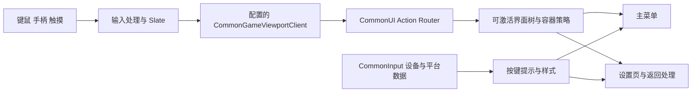

图只表达责任层，不保证所有输入严格按一个“栈顶优先”调用序列执行。单层界面可以用普通 UMG；多层弹窗、跨平台操作和集中样式让 CommonUI 更有价值，但仍需要项目定义会话、输入所有权与恢复路径。〔S19、S20〕

## 4. 代码 / 蓝图示例

下面将原创建显示、动态子控件、自定义委托和两条蓝图操作串成有边界的例子。示例不是 Engine 源码，不是已经编译的工程。依赖、资产配置、初始状态与失败路径属于例子的一部分；第 8 节统一列出 PAPER_EXPECTED 正反轨迹。

约定：A 指 4.1 与 4.2 的单菜单；B 指 4.4 的稳定 ID 行控件；C 指 4.3 的两种列表；D 指 4.5 的动画和外部工作协议。A/B 代码没有实现 C/D 的异步服务或完整弹窗框架，不可把它们宣称为通用资源管理实现。

### 4.1 C++：由本地 owner 创建、显示与关闭

依赖为已有 UE C++ 项目，游戏模块包含 Core、CoreUObject、Engine、UMG；直接使用 Slate 类型的实现文件还需 Slate / SlateCore。以下类都在同一个模块，示例不承担跨模块导出。客户端 UI 由本地 PlayerController 或明确的本地 UI owner 管理；联机 GameMode 不存在于普通客户端，不用它创建客户端界面。ConstructorHelpers 只用于适当的构造上下文，不能把任意运行期函数中的 FClassFinder 片段当作资源加载方案。

A 的资产合同：WBP_DemoMenu 派生自下一节的 UDemoMenu；设计器包含 BodyBox（VerticalBox）与 CloseButton（Button），名称和类型匹配、设为变量，CloseButton 可聚焦。controller 蓝图的 MenuClass 指向这个 Widget Blueprint 生成类。不能用 UDemoMenu::StaticClass() 代替缺少设计树的蓝图子类。缺失类、绑定或本地玩家时，应停止显示并检查配置，不靠循环重试补救。

本例只有一个菜单 owner，初态是 GameOnly、光标隐藏，没有其他 modal；关闭恢复这一已知状态。分别在各本地玩家的 controller 上创建；远端 controller / dedicated server 不进入。AddToPlayerScreen 用 owning player 的分屏区域；AddToViewport 面向整个 viewport。ZOrder=10 只在相应层级比较，不表示永远盖过一切。

```cpp
// DemoUIController.h
#pragma once
#include "CoreMinimal.h"
#include "GameFramework/PlayerController.h"
#include "DemoUIController.generated.h"
class UDemoMenu;

UCLASS()
class ADemoUIController : public APlayerController
{
    GENERATED_BODY()
public:
    UFUNCTION(BlueprintCallable) void OpenDemoMenu();
    UFUNCTION(BlueprintCallable) void CloseDemoMenu();
protected:
    virtual void EndPlay(const EEndPlayReason::Type Reason) override;
    UPROPERTY(EditDefaultsOnly, Category="UI")
    TSubclassOf<UDemoMenu> MenuClass;
private:
    UPROPERTY(Transient)
    TObjectPtr<UDemoMenu> Menu;
    bool bMenuOpen = false;
};

// DemoUIController.cpp
#include "DemoUIController.h"
#include "DemoMenu.h"

void ADemoUIController::OpenDemoMenu()
{
    if (!IsLocalController() || !GetLocalPlayer() || !MenuClass) return;
    if (!Menu)
    {
        Menu = CreateWidget<UDemoMenu>(this, MenuClass);
        if (!Menu) return;
        Menu->OnCloseRequested.AddUniqueDynamic(this, &ADemoUIController::CloseDemoMenu);
    }
    UWidget* Focus = Menu->InitialFocusTarget();
    if (!Focus) return;
    if (!Menu->IsInViewport() && !Menu->AddToPlayerScreen(10)) return;
    bMenuOpen = true;
    Menu->SetSessionActive(true);
    FInputModeUIOnly Mode;
    Mode.SetWidgetToFocus(Focus->TakeWidget());
    SetInputMode(Mode);
    bShowMouseCursor = true;
    Focus->SetUserFocus(this);
}

void ADemoUIController::CloseDemoMenu()
{
    if (!bMenuOpen) return;
    bMenuOpen = false;
    if (Menu)
    {
        Menu->SetSessionActive(false);
        Menu->StopAllAnimations();
        Menu->RemoveFromParent();
    }
    SetInputMode(FInputModeGameOnly());
    bShowMouseCursor = false;
    // Menu强引用刻意保留：这是复用策略，不能说RemoveFromParent已GC。
}

void ADemoUIController::EndPlay(const EEndPlayReason::Type Reason)
{
    if (Menu)
    {
        Menu->SetSessionActive(false);
        Menu->OnCloseRequested.RemoveDynamic(this, &ADemoUIController::CloseDemoMenu);
        Menu->StopAllAnimations();
        Menu->RemoveFromParent();
        Menu = nullptr;
    }
    bMenuOpen = false;
    Super::EndPlay(Reason);
}
```

Menu 的 UPROPERTY 强引用刻意保留到 owner 结束，Close 仅退出显示会话。重复 Open 不再次创建 Menu 或内部按钮；重复 Close 没有额外动作。显示成功后才切输入，缺焦点目标或 AddToPlayerScreen 失败时直接返回；失败资产应反馈给项目诊断入口。正确流程是 Open 两次→点一次动态按钮→CloseButton→重开→再点一次→Close 两次→owner 结束，预期计数 0→1→2，详见 E2/E4。

这个有限例不处理任意 Blueprint Construct/Destruct 内递归调用 Open/Close 的重入，也不支持外部绕过 owner 随意 RemoveFromParent。若项目需要这些路径，先把关闭入口汇合到 owner 并明确状态转移；不要指望 NativeDestruct 独自恢复输入或修复所有 Slate 重建。

### 4.2 C++：在 WidgetTree 中创建动态按钮

UDemoMenu 内部通过 BindWidget 获得设计器 BodyBox；在一次 NativeOnInitialized 中构建 Button/TextBlock、设置内容、加入 VerticalBox，再绑定具体 UButton 的点击。RootWidget 不是 AMyHUD 的现成变量，UButton 也不能绑定到一个签名不匹配的虚构 NativeOnClicked。

```cpp
// DemoMenu.h
#pragma once
#include "CoreMinimal.h"
#include "Blueprint/UserWidget.h"
#include "DemoMenu.generated.h"

class UVerticalBox;
class UButton;
class UTextBlock;
DECLARE_DYNAMIC_MULTICAST_DELEGATE(FDemoCloseRequested);

UCLASS()
class UDemoMenu : public UUserWidget
{
    GENERATED_BODY()
public:
    UPROPERTY(BlueprintAssignable)
    FDemoCloseRequested OnCloseRequested;
    void SetSessionActive(bool bNewActive) { bSessionActive = bNewActive; }
    UWidget* InitialFocusTarget() const;
protected:
    virtual void NativeOnInitialized() override;
    virtual void NativeDestruct() override;
private:
    UPROPERTY(meta=(BindWidget))
    TObjectPtr<UVerticalBox> BodyBox;
    UPROPERTY(meta=(BindWidget))
    TObjectPtr<UButton> CloseButton;
    UPROPERTY(Transient)
    TObjectPtr<UButton> DynamicButton;
    UPROPERTY(Transient)
    TObjectPtr<UTextBlock> DynamicText;
    int32 ClickCount = 0;
    bool bSessionActive = false;
    UFUNCTION() void HandleIncrement();
    UFUNCTION() void HandleClose();
};

// DemoMenu.cpp
#include "DemoMenu.h"
#include "Blueprint/WidgetTree.h"
#include "Components/Button.h"
#include "Components/TextBlock.h"
#include "Components/VerticalBox.h"

void UDemoMenu::NativeOnInitialized()
{
    Super::NativeOnInitialized();
    if (CloseButton)
        CloseButton->OnClicked.AddUniqueDynamic(this, &UDemoMenu::HandleClose);
    if (!BodyBox || !WidgetTree || DynamicButton) return;
    DynamicButton = WidgetTree->ConstructWidget<UButton>(UButton::StaticClass(), NAME_None);
    DynamicText = WidgetTree->ConstructWidget<UTextBlock>(UTextBlock::StaticClass(), NAME_None);
    if (!DynamicButton || !DynamicText) return;
    DynamicText->SetText(FText::AsNumber(ClickCount));
    DynamicButton->AddChild(DynamicText);
    BodyBox->AddChildToVerticalBox(DynamicButton);
    DynamicButton->OnClicked.AddUniqueDynamic(this, &UDemoMenu::HandleIncrement);
}

UWidget* UDemoMenu::InitialFocusTarget() const { return CloseButton.Get(); }

void UDemoMenu::HandleIncrement()
{
    if (!bSessionActive || !DynamicText) return;
    ++ClickCount;
    DynamicText->SetText(FText::AsNumber(ClickCount));
}

void UDemoMenu::HandleClose()
{
    if (bSessionActive) OnCloseRequested.Broadcast();
}

void UDemoMenu::NativeDestruct()
{
    bSessionActive = false;
    // 本例只有同实例内部按钮绑定；保留它们支持该UObject再次显示。
    Super::NativeDestruct();
}
```

构建条件不满足时不解引用 null；DynamicButton guard 避免重复添加。固定内部 CloseButton 和 DynamicButton 绑定保留在同一 UObject 上，NativeDestruct 只令会话失活，因此重开不会出现“一次 OnInitialized 绑定已被第一次 Destruct 拆掉”的断链。若分配或必需绑定失败，本例不提供自动恢复循环，应修配置或显式重建实例。

代码没有可选外部模型订阅和异步请求，也没有注册业务动画完成回调，不能因此宣称已清理所有外部资源。扩展时按 D 的协议在 Close 开始先失活/换代并解除自己拥有的外部工作；也不能把关屏后的 strong Menu 引用误判为一次 Remove 已完成 GC。

### 4.3 蓝图：小型 ScrollBox 与虚拟 ListView

小例使用B的3个row/ScrollBox流程，明确每个数据创建一个row、没有虚拟化。大例使用ListView；本有限例在创建前把SelectionMode=None，设计器不提供选中高亮，流程不调用选中/取消选中接口。它保留数据展示、Item点击和Entry复用清理用途：

1. BP_DemoItem继承Object，仅变量Id/int、Label/Text；没有selection、IsSelected或业务勾选字段。有限数据A=(10,药水)、B=(20,钥匙)、C=(30,地图)
2. WBP_DemoEntry继承UserWidget并实现UserObjectListEntry；设计器有Label（TextBlock）和Icon（Image，默认占位Brush）；变量CurrentItem对象（初始null）、Generation/int（初始0）、Active/bool（初始false）。ListView的EntryWidgetClass设该类
3. 创建三份数据对象，将数组SetListItems给ListView；不手工对每数据CreateWidget，不能先建三个UMG row当作数据
4. Event OnListItemObjectSet：先Active=false、Generation+=1，取消旧item的请求/自己的订阅并清CurrentItem，Label设空、Icon设占位；cast新Item失败则保持失活/占位；成功则CurrentItem=new、Active=true、Label只读取新对象Label。图标结果来自下述按Item/代次关联的请求，不从未声明的Item图标或selection字段读取。ListView的OnItemClicked收到Item后检查类型并按其Id执行业务；点击C报告30，不将点击解释为选中状态改变
5. Event OnEntryReleased：Active=false、Generation+=1、取消自己发起的请求、解除自己订阅、CurrentItem=null、Label设空、Icon设占位；不要替list销毁仍由pool管理的entry
6. 完成回调必须回game线程，先weak widget有效，再检查Active、captured Generation==当前、captured Item==CurrentItem才应用。弱指针有效不足以证明entry仍代表旧item
7. ListView offscreen没有entry是正常状态；修改数据要通过项目通知/刷新流程更新可见entry，不能保存entry作为唯一业务状态

选择状态的独立扩展说明（不属于本有限例实现）：需要Single/Multi时，以ListView为原生选择权威；Entry首次获Item要同步当前选择，后续处理IUserListEntry的选择变更通知，不能假定同一Item选中/取消就会再次触发OnListItemObjectSet；复用时必须清旧高亮并同步新Item状态。业务“勾选/已装备”等若另有含义，应在模型显式声明，与原生selection分开。此处保留原文“列表更新/交互/复用不串状态”的教学去向；实现选择扩展需另补完整首次同步、变化与复用轨迹，不能把E5的无选择测试冒称已覆盖。依据S09/S31/S32/S37。

E5有限人工复用轨迹无需真的滚动：entry e先绑定A(g1)→release(g2)→绑定C(g3)→A的迟到结果→C的新结果。PAPER_EXPECTED只允许C写入。此轨迹是明确请求代次策略的推导，不是ListView池大小、回调顺序或帧时序实测。

这里的异步图标结果RA/RC是E5给定的纸面输入，服务API和回调调度器没有在本章实现；项目接入时必须满足捕获身份/代次、game线程回调与失败反馈的协议。仅展示文字时保留Icon占位即可，不凭这段说明声称已经实现图标加载器。

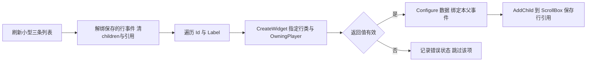

图描述小列表的非虚拟构建流程。若数据为空，明确显示空状态；失败项不解引用，也不无限重试。给 ListView 喂数据对象时走另一条路径，不把上图生成的整批 UUserWidget 再当成数据塞入虚拟列表。

### 4.4 C++：每行携带稳定 ID 的事件

这是独立最小类，WBP_IndexedRow派生UIndexedRow并提供SelectButton/Button、ItemLabel/TextBlock。ID为不可变业务标识，不是当前数组下标；本有限数据使用10/20/30。内部button绑定一次；父界面在重建或替换数据时解除自己对旧row的OnChosen，再清旧children/强引用。

```cpp
// IndexedRow.h
#pragma once
#include "CoreMinimal.h"
#include "Blueprint/UserWidget.h"
#include "IndexedRow.generated.h"
class UButton;
class UTextBlock;
DECLARE_DYNAMIC_MULTICAST_DELEGATE_OneParam(FDemoRowChosen, int32, ItemId);

UCLASS()
class UIndexedRow : public UUserWidget
{
    GENERATED_BODY()
public:
    UPROPERTY(BlueprintAssignable) FDemoRowChosen OnChosen;
    UFUNCTION(BlueprintCallable) void Configure(int32 InId, const FText& InLabel);
protected:
    virtual void NativeOnInitialized() override;
private:
    UPROPERTY(meta=(BindWidget)) TObjectPtr<UButton> SelectButton;
    UPROPERTY(meta=(BindWidget)) TObjectPtr<UTextBlock> ItemLabel;
    int32 ItemId = INDEX_NONE;
    UFUNCTION() void HandleClicked();
};

// IndexedRow.cpp
#include "IndexedRow.h"
#include "Components/Button.h"
#include "Components/TextBlock.h"
void UIndexedRow::NativeOnInitialized()
{
    Super::NativeOnInitialized();
    if (SelectButton)
        SelectButton->OnClicked.AddUniqueDynamic(this, &UIndexedRow::HandleClicked);
}
void UIndexedRow::Configure(int32 InId, const FText& InLabel)
{
    ItemId = InId;
    if (ItemLabel) ItemLabel->SetText(InLabel);
}
void UIndexedRow::HandleClicked()
{
    if (ItemId != INDEX_NONE) OnChosen.Broadcast(ItemId);
}
```

父界面设计器提供ScrollBox_Items（ScrollBox）与SelectedIdText（TextBlock），保存Rows数组（WBP_IndexedRow引用）；OwningPlayer使用创建父界面的本地玩家。蓝图有名为OnRowChosen的Custom Event，输入int ItemId，先转Text再SetText到SelectedIdText；对三组(10,药水)、(20,钥匙)、(30,地图)，依次CreateWidget(WBP_IndexedRow, OwningPlayer)→返回值有效性分支→Configure(ID,Label)→Bind Event to OnChosen(同一个OnRowChosen)→AddChild(ScrollBox_Items)→保存row引用。刷新前对已保存每row Unbind该event→Clear Children→清数组，之后重建。空数组时SelectedIdText显示“无条目”；任一创建失败时显示“部分条目创建失败”并跳过该项，循环仍有限结束。点击20输出20；重排显示[30,10,20]后点击地图仍输出30。C++消费者若采用AddDynamic须声明UFUNCTION void HandleChosen(int32 ItemId)，不能将无参UButton::OnClicked直接绑定到带ID handler。

### 4.5 蓝图动画与外部工作的退出协议

这里的generation是项目协议，不是内置OnAnimationFinished自动携带的参数。若实现可延迟/排队的回调，必须通过每次播放独立的回调上下文/代理保存当时generation；只在同一蓝图event读取已被重开的current generation不能识别旧事件。有限蓝图基础例只让finish记录表现状态，不用它触发关闭、提交业务或启动新请求；具有快速重开需求时须实现该关联层后才能宣称支持下面的代次协议。

动画资产：WBP_AnimatedPanel有MainPanel；OpenAnim时长0.2秒、MainPanel RenderOpacity 0→1、RenderTranslation (0,20)→(0,0)，不是把opacity混入transform结构。无限循环只另示NumLoopsToPlay=0，本例1。程序本例只有一条OpenAnim，所有触发均走同一个owner，属性没有第二条binding同时驱动。

Open：若已经Opening/Open直接返回；否则generation+=1、Active=true、状态Opening；先设置确定初始值；为该播放登记自己的结束回调/代次；PlayAnimation(OpenAnim, loops=1)。正常结束回调只在Active且代次匹配且状态Opening时置Open，不执行购买、加载完成等业务提交。

Close：先Active=false、状态Closed、generation+=1，再解除自己的动画/外部delegate，取消自己的timer/request，StopAnimation，设确定关闭姿态，RemoveFromParent。即使Stop导致finish事件也被失活/代次挡住；不将Stop记成自然成功。退出策略如果选择RestoreState，必须说明恢复的是播放前状态，不能同时随意写最终属性打架。

外部模型使用明确的发布者/接收者：M、N是模型发布者，各持Changed委托；W是本屏接收者，X是另一个接收者，四者对象身份不同。下面是原生多播委托的操作协议记号，不冒作新增可编译C++类：W的本显示功能以AddUObject绑定HandleChanged并保存返回handle H；同一W的另一功能可另持K；X的监听另持J，M自身没有注册为接收者。

Attach(Model)：如与当前是同一对象且本功能订阅仍存在则只刷新快照；否则Detach旧订阅→保存新model→添加本功能绑定并保存H→读取一次当前值。Detach：仅在自己保存的publisher/handle仍可用时，对该publisher的Changed执行Remove(H)，然后清H与model；重复调用无新动作。该操作不移除K或J。若publisher已失效，只清本地状态而不解引用。UI收到change是展示更新，不能自动修改源模型或产生同值递归。

同一清理目的按委托类型分别表达：dynamic多播用RemoveDynamic(W, Handler)的接收者/函数对，配对原AddDynamic；这里Handler代表原绑定且签名匹配的UFUNCTION，不把FDelegateHandle套给dynamic。蓝图Event Dispatcher配对Unbind Event，传原Target与原事件。两者均只拆本功能的绑定。

RemoveAll(W)按接收者对象筛选，只删除M.Changed中绑定W的全部函数，故H和K都被移除、J保留；同对象内只关闭一个功能时仍可能过宽。RemoveAll(M)按接收者M筛选，本例无此绑定，所以H/K/J都保留，不能保证解绑W。Clear()才清空该原生委托调用列表；蓝图Unbind All Events也属于整表操作，作用范围还取决Blueprint Class/Level Blueprint与Target上下文，不能当作本屏精确解绑。共享发布者全清会连X的J一起移走。各分支有限轨迹见E6；依据S33–S36。

异步结果协议：Start请求保存(weak widget, generation, item identity)，服务可取消只是优化；回调总要判这三项和Active。Close或rebind后迟到结果丢弃；失败显示重试/错误，本例不自动无限重试。后台线程不直接访问UI，先调度到game线程再判定。实现服务API取决项目，因此这里只给全状态协议而不虚构HTTP/AssetManager源码或未声明句柄。

### 4.6 stat 与诊断入口

工具选择要对应问题：打开瞬卡先分离资源/对象构建/Slate 更新，持续帧耗再分 CPU/GPU；“命令能运行”也不代表所有版本的字段和 pass 名相同。以下是诊断计划，本文未执行采集或设置修改。〔S22–S24〕

| 入口 | 用途与应记录的内容 | 边界 / 停止条件 |
| --- | --- | --- |
| stat unit | Frame、Game、Draw、GPU 的整体时间 | 先确定瓶颈阶段，不能把 Game 时间全归 UI |
| stat slate | Slate 更新相关统计 | 看目标版本实际显示的字段，别虚构固定 Construct/Destruct 计数 |
| stat SlateMemory / stat UI | 对应统计组的资源与 UI 线索 | build/平台支持与具体字段现场确认；不承诺存在统一 stat UMG 输出 |
| stat gpu | 目标 build 可用时观察 UI 相关 GPU 工作 | pass 名以实际捕获为准，不保证总叫 Slate Elements |
| ProfileGPU | 单帧 GPU 分解 | 先定位相关 pass，再分析材质、混合与绘制量 |
| stat startfile / stat stopfile | 成对记录统计文件，供 Session Frontend 分析 | 必须显式 stopfile；5.6 文档称 .uestats，实际扩展名查看输出，不写成 .uprof 或 .utrace |
| Widget Reflector | 查层级、几何、焦点、命中、裁剪与 atlas | Tools→Debug，或 Ctrl+Shift+W / WidgetReflector 命令；“~”只是控制台入口 |
| Slate Insights | 通过相应插件与 Slate trace 观察更新/失效原因 | 使用 .utrace；按目标版本设置采集，不与 stat 文件混用 |
| Invalidation Box / Global / Retainer | 在定位更新成本后选择缓存策略并对比 | 先检查项目状态；公开文档给 Slate.EnableGlobalInvalidation，不沿用未核的 Slate.EnableInvalidationPanels 作为处方 |

Slate Insights 的 L/P/U/C/R/V 与更新标记可帮助定位原因，必须结合所在版本文档和实际事件解释，不凭字母估算耗时。一次只改变一个变量，用同设备、分辨率、build、数据与场景比较；不得把诊断命令清单冒作本文的性能结果。

## 5. 最佳实践

这些建议按管理对象、布局、事件和 C++ 组织。它们是设计与诊断选择，不是未测量项目的固定性能红线。

### 5.1 结构设计

- 按 HUD、弹窗、列表项、图标等职责拆分 Widget Blueprint，使每个子界面有清楚的输入、输出和生命周期；拆分本身也有对象/层级成本，应看实际复用收益。
- 数据与表现分离：模型或 controller 提供稳定数据和变更通知，Widget 展示并发出交互意图；不要把 Entry 当作唯一数据存储。详细绑定方案见 MVVM 专题。
- 复杂菜单可考虑 CommonUI 的激活与路由结构；选用前明确 local player、viewport client、输入配置和焦点恢复。单菜单例的 Open/Close 不应被扩称为通用弹窗框架。
- 数据多时比较 ListView / TileView 等虚拟列表与 ScrollBox：数据 Item 仍需存储，Entry 可复用；ScrollBox 不会因为能够滚动就自动虚拟化。
- 频繁打开的 UI 可保留实例或切 Visibility，但要同时决定隐藏期输入、订阅、动画和请求策略；复用减少部分重建，代价是仍持有对象和资源。

### 5.2 布局与锚点

- 全屏 Canvas 子项可使用四角拉伸与明确边距；把安全区、长文本和额外缩放作为独立约束检查，不对所有父容器套同一锚点配方。
- 减少无意义的容器嵌套，并用布局/失效跟踪找真正热点；没有“超过五层必慢”或“十层内必安全”的跨项目结论。
- 属性只在需要时更新；局部呈现动画可选 RenderTransform，但仍会产生更新/失效成本，不凭 slot 分配意图不变就认定零布局成本。
- 用 Widget Reflector 检查实际几何、slot、裁剪和命中路径；先定位到错误控件，再改参数，避免靠不断提高 ZOrder 掩盖布局问题。

### 5.3 事件与动画

- handler 避免同步 IO 和一次性大量构建；异步请求可以拆开等待，但完成回调仍要控制 game 线程工作量，并检查会话有效性。
- 多个行控件可以共用父处理器，但由每个行对象广播稳定 ID；不假定 UButton 自带业务 Tag/索引，也不让所有行共用一个随循环改变的 CurrentIndex。
- 0.1–0.3 秒可以作为交互动画设计候选，具体时间由操作目的和减少运动需求决定；明确初始、结束、中断、重开姿态，不把动画结束当业务提交。
- 优先用事件/通知驱动低频变化；Tick、Timer、MVVM 各有用途和成本。需要持续行为时选择合适频率，不能为省 Tick 盲目破坏动画或 latent 行为。

### 5.4 C++ 侧规范

- 用 CreateWidget 建立 UUserWidget，先确认所需 world、local player 和类已可用；不要以“BeginPlay 之前一律不行”取代实际上下文判断。设计器依赖必须创建相应蓝图子类。
- 负责持有的 owner 使用被 GC 跟踪的强引用；观察者使用 weak 并在访问前检查。weak 不保活，也不防关屏重开后旧回调覆盖新状态。
- NativeOnInitialized、可重复 NativeConstruct/NativeDestruct 与 PreConstruct 分工；保持 Super，明确一次绑定、对称绑定和 IsDesignTime 边界。
- ListView 接收 Item 数据并管理 Entry 关联；SetListItems 不是“开启虚拟化”的开关。每次赋 Item 要刷新已有字段和旧视觉，release 清自己任务；本章有限例明确 SelectionMode=None。

### 5.5 性能预算：保留指标，先定义口径

| 指标 | 采集口径与项目预算来源 | 超出预算时的调查方向 |
| --- | --- | --- |
| 控件数量 | 区分屏上可见、仍存活 UObject、实际生成 Entry；由目标设备场景预算确定 | 隐藏缓存、无效层级、列表是否一次创建全部行 |
| Widget 树深度 | 记录实际热点子树与更新频率，而非只取全树最大值 | 无意义嵌套、布局反复失效、复杂文本与容器约束 |
| UI draw / GPU 工作 | 用同 build、分辨率和场景的实际 GPU 捕获口径 | 资源/材质/clip/layer 的批处理边界、透明覆盖和渲染目标成本 |
| Slate update / tick 时间 | 区分首次打开、热开、静止与动态场景；由项目帧预算分配 | 绑定求值、Tick、动画、布局/paint 失效和频繁创建 |
| UI 内存 | 区分数据 Item、UMG/Slate、纹理/字体、缓存与渲染目标 | 强引用缓存、资源驻留、重复资产、Retainer 或其他中间目标 |

原“PC 300 / 移动 150 控件、十层、100 draw、1ms”等数值不能作为通用安全证明，历史附录保留其原貌。预加载和池化是在首开成本、常驻内存与维护复杂度间做选择；虚拟化不会把 N 条数据本身的内存变为只与可见行数有关。先定义项目预算，再用第 4.6 节工具定位差异。〔S09、S14、S22、S24〕

## 6. 常见问题 FAQ

### Q1：为什么 UI 打开瞬间卡顿？

先分开资源首次载入、UObject/WidgetTree 初始化、底层 Slate 构建和模型/绑定刷新。对比同场景首次与热开，确定时间落在哪个阶段，再选择预加载、保留实例、分批构建或 ListView。预创建会增加常驻内存，图集也不是所有字体/纹理问题的统一解法。播放打开动画不能掩盖发生在同一 game 线程上的同步冻结；线程已被阻塞时，动画也不能正常推进。〔S09、S14、S24〕

### Q2：锚点设置后控件跑到了奇怪的位置？

先检查父容器与实际 slot 是否为 CanvasPanelSlot，再列出 Anchors.Min/Max、Alignment、Offsets、AutoSize 和最终父区域。用 3.3/E3 的有限数值对照，确认到底是点锚点的尺寸/位置还是拉伸轴的边距。随后检查 DPI、应用缩放、安全区和额外 RenderTransform。不要把所有数值统称像素，也不要在 VerticalBox 内不断改已经无效的 Canvas 配方。

### Q3：控件点击无响应？

先用 Reflector 查命中对象和路径：父是否 Hidden/Collapsed，装饰层是 SelfHitTestInvisible 还是排除整个子树的 HitTestInvisible，按钮是否 enabled，可见区域是否被裁剪或遮挡，是否存在鼠标捕获。再核 owning player、input mode 和 handler 是否仍绑定。UIOnly 只是策略之一，不是通用修复；ZOrder 高也不等于具备命中资格。透明控件仍可能挡住输入。〔S10、S23、S27〕

### Q4：手柄无法操作 UI？

普通 UMG 已支持导航，先查正确 local user 是否有焦点、目标是否 focusable/可见/enabled、导航规则是否形成可达路径、输入是否被上层消费。若采用 CommonUI，再查插件、viewport client、Input/Controller Data、激活树与 desired focus target。设备提示变了不等于焦点已正确转移；CommonInput 不是万能焦点修复器。〔S19、S20、S23〕

### Q5：动画播放后控件位置偏移？

先区分 slot 布局值和 RenderTransform，再检查播放前实际值、第一关键帧、是否有第二条动画/绑定争写、RestoreState 和中断后的显式复位。Stop 可能产生 finish 通知，旧通知不能覆盖重开后的姿态；generation 必须与那次播放关联。RenderTransform 并不自动保证最终位置正确，也不意味着禁止所有布局动画。按动画目的选择结束状态，减少无必要的持续布局更新。〔S07、S14〕

### Q6：UI 纹理花屏 / 图集溢出？

先确认实际 Brush 指向哪份资源、资源是否已载入、尺寸/UV/材质和裁剪是否符合预期，再结合日志和 Reflector 的 atlas 视图判断是否真是图集问题。Box/Border 的九切片只改变绘制方式；纹理取二次幂并不能普遍修复错误引用或材质。图集限制取决于实际资源类型、版本与配置，不能假定所有 UI 都有同一个 2048×2048 上限。`Slate.bAllowThrottling` 不是这里已证实的治花屏方案，不能用无关设置替代诊断。〔S23〕

### Q7：Widget Blueprint 与 C++ 如何选择？

纯蓝图适合布局与交互迭代；C++ 基类加蓝图子类便于集中接口、模型和复用逻辑，同时保留设计器排布；需要底层控件能力或编辑器深度集成时可使用 Slate。选择依据是功能、团队协作、维护和实际测量，不是“框架控件都必须全 C++”或“改成 C++ 就天然快”。无论哪种方式，绑定生命周期、重复创建和同步加载都仍需处理。〔S16、S26、S30〕

### Q8：UMG 能否用于编辑器工具 UI？

可以使用 Editor Utility Widgets 构建编辑器工具页签；5.6 官方文档将其标为 Beta。它有编辑器用途和相应工作流，不等同于把运行时 HUD 原样放进任意编辑器上下文，也不应声称从 UE5 才首次支持。需要更深的编辑器框架或自定义基础控件时，再学习 Slate 并核对所用编辑器模块接口。〔S25、S26〕

## 7. 关联阅读与前后置专题

下列库内链接保留继续学习的用途；本文的静态核对不代表相邻篇已被整体审验。

- [02-UI数据绑定与MVVM](02-UI数据绑定与MVVM.md)：比较属性求值、事件更新与模型通知，继续处理数据到显示的依赖。
- [03-性能分析工具与Profiling](../../08-工程实践与质量/调试与性能分析/03-性能分析工具与Profiling.md)：学习统计捕获和 Insights，明确采集对象与耗时口径。
- [04-渲染与加载性能优化](../../08-工程实践与质量/调试与性能分析/04-渲染与加载性能优化.md)：继续分析资源载入、draw 与内存成本。
- [07-CommonUI输入路由与焦点管理](07-CommonUI输入路由与焦点管理.md)：多层界面的路由、激活与焦点恢复。
- [08-Slate自定义控件与样式系统](08-Slate自定义控件与样式系统.md)：SWidget 声明式组合及样式扩展。
- [14-UMG与Slate源码](14-UMG与Slate源码.md)：继续追踪桥接和渲染实现；本文没有读取或认证对应源码链。
- [C++对象模型与内存学习路线](../../../00_Index/学习路线/编程与计算机基础.md)：补充对象、所有权和内存基础。

原来的三个官方主题入口继续用于检索：[UMG UI Designer 快速入门](https://dev.epicgames.com/documentation/en-us/unreal-engine/umg-ui-designer-quick-start-guide-in-unreal-engine)、[Slate UI Framework](https://dev.epicgames.com/documentation/en-us/unreal-engine/slate-user-interface-programming-framework-for-unreal-engine)、[Common UI](https://dev.epicgames.com/documentation/unreal-engine/common-ui-plugin-for-advanced-user-interfaces-in-unreal-engine?lang=en-US)。它们是可变化的主题入口，不据其当前标题认证旧版本；本文具体结论使用第 9 节列出的实际版本与读取范围。

下一篇从 [UI 数据绑定与 MVVM](02-UI数据绑定与MVVM.md) 继续：让明确的数据变化驱动界面，而不是让所有控件不断寻找变化。

## 8. PAPER_EXPECTED：有限输入、预期与反例

这8组是人工可追踪的模型/文档契约推导，未执行程序、UE、UI、UHT、截图、目标网络或性能实验。结果栏全部表示预期，不能改写成OBSERVED/PASS或提高成熟度。目标版本中的精确生命周期次数、entry pool大小、GPU批数、frame时间都未测。

### E1 资产/生成类/实例与Slate

前提：同一个已配置的WBP_DemoMenu生成类C，两个有效local player上下文P0/P1。

| 输入/操作 | PAPER_EXPECTED | 错误控制 |
| --- | --- | --- |
| CreateWidget(P0,C)得到A，CreateWidget(P1,C)得到B | A/B是不同UUserWidget实例，各自ClickCount=0；可各显示于自己的player screen | 把C/蓝图资产当单个运行时A，会把两人状态混为一处 |
| 只点击A一次 | A计数1、B仍0；共享资产不等于共享实例状态 | 在C/CDO或外部全局变量写计数不满足该合同 |
| A.TakeWidget再次获取已有Slate表示 | 语义为已有则返回，没有才构造；不推导新实例数 | 把每次TakeWidget都当Rebuild会错误估计生命周期 |
| A.RemoveFromParent，owner仍强持有A | A没有因此必然GC；B不受影响 | weak不是保活所有权、移除不是delete |

依据S01/S02/S07/S18；没有宣称分屏实际截图或对象地址观察。

### E2 创建/关屏/复用/失败

采用第4.1/4.2节A例，owner初始GameOnly且光标隐藏；same UObject由owner保留。

| 有限步骤 | PAPER_EXPECTED业务状态 | 不允许冒认 |
| --- | --- | --- |
| Open→Open | 同一Menu、bMenuOpen=true、一组内部按钮；focus设CloseButton | Construct严格调用两次/一次：均不预设 |
| 点击加一→Close | count1、Active=false、移除、恢复已知输入模式 | RemoveFromParent立即析构/GC |
| Open→点击加一 | 原实例计数1→2，内部handler仍能工作且无重复绑定 | OnInitialized绑定后在Destruct解绑且不重绑，会造成重开失效 |
| Close→Close | 第二次无追加动作 | 不靠重复remove掩盖状态错误 |
| owner EndPlay | 先失活、解owner自己的close绑定、stop/remove、清strong指针 | 无额外引用才能在未来可达性分析中释放，时间未知 |
| MenuClass空/非local controller | 不create、不改输入模式 | 不null-check直接AddToViewport |
| 缺CloseButton/类型名不匹配 | 模板配置门禁应失败；即使拿到对象，Focus=null也不夺输入 | “BindWidget自动找任意同类型按钮” |
| AddToPlayerScreen失败 | 不设bMenuOpen、不夺输入，返回失败路径 | 默认GetWorld()一定有合适的local player |

Design-time PreConstruct只设样例文本/颜色；不读取PlayerState、不发请求、不打开游戏菜单。NativeOnInitialized不直接保证外部model已ready，数据通过显式AttachModel进入。

### E3 Canvas point/stretch、DPI与渲染变换

有限手算前提：父Canvas分配尺寸P；没有padding、嵌套额外缩放、rotation或AutoSize。以下均UI/Slate逻辑单位，非物理像素。点anchor a、位置offset o、Alignment q、固定size s：topLeft=P*a+o−q*s，右/下边=topLeft+s。它是本例的几何推导，不是全布局算法。

| 用途/输入 | P=(1920,1080) PAPER_EXPECTED | P=(1440,900) PAPER_EXPECTED |
| --- | --- | --- |
| 右上：a=(1,0), q=(1,0), o=(-20,+20), s=(200,100) | topLeft=(1700,20)，right=1900，距离右边20 | topLeft=(1220,20)，right=1420，距离右边20 |
| 错误控制：a=(1,0),q=(1,1),o=(-20,-20),s=(200,100) | y=-120，控件跨到上边外 | y=-120仍错，与分辨率无关 |
| 居中：a=(.5,.5),q=(.5,.5),o=(0,0),s=(400,200) | topLeft=(760,440) | topLeft=(520,350) |
| 底部栏：a=(.5,1),q=(.5,1),o=(0,-20),s=(600,80) | topLeft=(660,980)，bottom=1060 | topLeft=(420,800)，bottom=880 |
| 全拉伸：min=(0,0),max=(1,1)，Alignment=(0,0)，四边距0 | rect=(0,0,1920,1080) | rect=(0,0,1440,900) |
| 带边距全拉伸：Alignment=(0,0)，L=20,T=30,R=40,B=50 | topLeft=(20,30),size=(1860,1000) | topLeft=(20,30),size=(1380,820) |

若仅教学假设DPI scale=1.5且无其他scale，20 UI units呈现约30像素；不是实际项目曲线或OS缩放测量。将相同孩子搬进VerticalBox后获得VerticalBoxSlot，应按padding/alignment/size rule排布，Canvas anchor配方不再作用。局部RenderTranslation=(0,20)用于呈现移动，不能据父slot矩形未变就断言R/L失效或CPU成本为0。

### E4 动态子控件、委托与稳定ID

A例NativeOnInitialized只构建一个动态button及label，并用对应UFUNCTION handler绑定。B例三行对象持Id=10/20/30。

| 操作 | PAPER_EXPECTED | 反例意义 |
| --- | --- | --- |
| A显示、一次button click | Count恰好+1 | 若反复Construct无guard追加child或delegate，会重复显示/处理 |
| B点击第二行“钥匙” | 父OnRowChosen收到20 | UButton OnClicked无自带index参数；父共享CurrentIndex可能总报最后值 |
| 重排显示[30,10,20]，点击“地图” | 仍是30 | 业务Id不随列表位置变化 |
| 刷新三次，先Unbind自己的handler再ClearChildren/refs | 每轮3行；只当前row响应 | ClearChildren不是取消所有外部请求，也不是立刻释放所有对象 |
| 空数据/row创建失败 | 空状态/错误反馈，循环有限结束 | 不解引用null、不以无穷重试弥补资产配置错误 |

用于纸面验证正确例是否有完整作用域、声明、输入与输出；未声称AddDynamic/UHT编译已过。

### E5 ScrollBox与ListView以及复用旧回调

小例三Item→三次CreateWidget/AddChild，非虚拟；ListView方案只传数据objects，entry按显示需求生成/复用。该有限例固定SelectionMode=None、没有选中高亮；Item仅Id/Label，没有selection字段，也没有业务勾选字段。文档“200条5可见”是解释模型，不作为断言实际内存里只有5个entry。

设一个教学entry e和两数据A/C；generation单调增加，本例不会溢出：

| 顺序 | 当前状态 | 到达结果 | PAPER_EXPECTED |
| --- | --- | --- | --- |
| 绑定A | active=true,item=A,g=1 | 发出RA，捕获(A,1) | label=A，icon占位 |
| release | active=false,item=null,g=2 | 无 | 解除自己的A订阅/取消RA（若服务支持），Label空、Icon占位 |
| 重绑C | active=true,item=C,g=3 | 发出RC，捕获(C,3) | 先清旧视觉，再label=C |
| RA迟到 | e仍有效，item=C,g=3 | (A,1) | 因item/g不符丢弃，weak有效也不能放行 |
| RC完成 | e有效且active,C,3 | (C,3) | 允许更新C图标 |
| 点击C（在g=3仍active时独立观察） | item=C，SelectionMode=None | OnItemClicked(C) | 业务输出Id=30；没有选中高亮或selection字段读写 |
| release后RC重复到达 | active=false,g=4 | (C,3) | 丢弃，Label空、Icon占位 |
| 反例：错误地“从新Item读取selection” | Item仍仅Id/Label | 未声明字段 | 合同不成立；不能声称读取成功或用entry残留高亮补足 |

选择扩展的去向见第4.3节C例：原生选择由ListView维护，需要首次同步和独立选择变化处理；本E5不验证选中/取消/高亮，不能用于认证该扩展。原有列表创建、稳定ID点击和复用清旧视觉用途均继续在活动例中。

没有规定引擎pool调用顺序必与该手工序列完全一致；该序列用于检测我们的消费者协议能否处理复用/取消竞态。业务状态不能只存在entry，否则离屏/复用丢失；大列表Item/model内存仍随N增长，虚拟化不使总内存O(可见行数)。

### E6 对称订阅与异步session

对象M/N是publisher，W是本屏receiver，X是另一receiver。M.Changed上的H属于W当前显示功能，K属于W另一功能，J属于X；M自身未绑定为receiver。H/K/J是三个不同原生handle；集合记号不承诺Broadcast调用顺序。

正常生命周期：已有K/J，Open/Attach(M)新增H并读快照一次→重复Attach(M)只读快照、不加H2→改绑N先从M移H再在N持Hn，M仍{K,J}→Close两次仅移Hn一次，M的K/J仍在。Detach只清自己的保存状态；publisher无效时不解引用。

下表每行独立从同一初始M.Changed={H→W, K→W, J→X}开始，不按表累计执行：

| 操作 | PAPER_EXPECTED剩余绑定 | 教学结论 |
| --- | --- | --- |
| M.Changed.Remove(H) | {K→W, J→X} | 精确解绑本功能，X及W的另一功能仍在 |
| M.Changed.RemoveAll(W) | {J→X} | 按接收者W筛选，移H/K；不是全表Clear，也不影响X |
| M.Changed.RemoveAll(M) | {H→W, K→W, J→X} | 本例没有receiver M，W并未解绑；发布者身份不能替代接收者 |
| M.Changed.Clear() | {} | 共享调用列表全清，错误移除W另一功能和X监听 |

dynamic对应分支用原接收者/函数RemoveDynamic(W, Handler)或蓝图原Target/原事件Unbind Event精确配对；不套用原生handle。蓝图Unbind All Events清相应事件列表并受Class/Level/Target上下文影响，作为共享列表全清危险例，不和RemoveAll(W)混为一项。反例Construct每次+=且退出不移会重复刷新；OnInitialized只绑一次但首次Destruct拆掉而不重绑会失联。

异步屏幕seq：Open g=1发R1→Close g=2→Open g=3发R3→R1回调→R3回调。仅R3可更新。weak对象始终有效也不能让R1修改新会话；服务取消不代替检查。所有回调先到game线程再测试weak/active/generation/item。错误返回显示一次错误或由用户明确重试，不无限循环。

### E7 动画自然结束、中断、重开

OpenAnim仅两个明确轨道，0.2s、loops1，本例初始opacity0/translation(0,20)。

以下generation轨迹以第4.5节D所需的每次播放独立关联上下文为前提；不是原生finish自动携带代次，也不是已实现的回调代理。正常Open(g1)→Play→Finish且active/g一致→状态Open。Close在0.1s发生：先active=false/stateClosed/g2、解绑自己的finish、Stop、设关闭姿态、remove；即使Stop触发finish，也不能变回Open。随后Open g3→finish g1迟到丢弃→finish g3可完成。重复Open在Opening/Open时无新播放，反向交互采用另行明确的状态策略，不把PlayForward/Reverse与从头Play混用。

RestoreState=true恢复播放前状态，不等价总恢复到designer默认；需要停在结束姿态则明确false或最终赋值策略。NumLoopsToPlay=0没有自然有限播完的保证。动画completion仅UI表现完成/停止通知，不是后端成功或网络确认。

### E8 输入、焦点与CommonUI职责

| 有限场景 | PAPER_EXPECTED判断 |
| --- | --- |
| 可见Overlay装饰为SelfHitTestInvisible，child button Visible/enabled | 自身跳过hit-test但child可参与；仍须无其他遮挡/capture |
| 同装饰改HitTestInvisible | child也不参与鼠标hit-test；不是只跳过背景 |
| Opacity0但Visible/enabled | 透明不能作为输入关闭规则 |
| 本地player0创建菜单但focus发给player1 | 用户上下文错配；不能只调ZOrder修复 |
| 显示后focus给可聚焦CloseButton，UIOnly | 只UI输入；本例关闭由UI按钮自己发出，不能指望被UIOnly挡住的游戏action负责关闭 |
| GameAndUI且UI未消费事件 | PlayerController有机会处理；不是所有键都被UI屏蔽 |
| 普通UMG，无CommonUI，focus/navigation正确 | 手柄方向导航可以成立；CommonUI不是必要插件 |
| CommonUI modal失活 | 不再作为激活输入节点；不推出UObject已销毁/动画请求已自动取消 |

关闭后焦点恢复是owner/框架的显式策略；多弹窗需记录/恢复当前下层合法目标，不能“所有Close都GameOnly”。未来验证入口：开关两次、鼠标/手柄切换、关闭焦点目标、空列表、分屏local player；本轮均NOT_RUN。

### 性能诊断的有界后续入口（计划，不执行）

保留指标用途：在明确目标设备/分辨率/build/同场景下分别记录首次与热开、可见/存活UObject/entry数量、widget层级、Slate update/invalidation/paint、draw与纹理/字体内存；每个指标都要指定工具和时间口径。改变一个变量（例如事件更新或ListView）比较同样数据规模，不能把300/150/10层/100draw/<1ms当普遍安全阈值，也不能从PAPER_EXPECTED估计真实hitch。工具步骤及停止采集义务见S22/S24；本文未执行。

## 9. 来源、定位与证据边界

以下公开资料于2026-10-09实际读取，记录所读条目而不是仅列门户链接。S01–S37是正文定位号。主基准为5.6；S02/S27/S28/S32/S34为5.5辅助，S17为当前标5.8的metadata辅助，不能把不同版本网页拼成已核源码revision。query参数与网页标签也不是不可变源码版本。

没有下载受限Engine源码或外部全文。公开API页说明可支持职责与契约，不能认证本例UHT/C++编译、完整引擎调用栈、默认池大小或目标平台性能。旧本机版本声明只保留在附录，不倒填成当前证据。

| ID | 已读来源/版本 | 实际读取范围及可用结论 | 限制 |
| --- | --- | --- | --- |
| S01 | [WidgetBlueprintGeneratedClass，5.6](https://dev.epicgames.com/documentation/unreal-engine/API/Runtime/UMG/UWidgetBlueprintGeneratedClass?application_version=5.6) | 类说明、WidgetTree模板、Animations/Bindings、InitializeWidget、初始化player-context标志 | 可说明蓝图生成类与实例/模板职责；未阅读编译器或初始化实现 |
| S02 | [UWidget，5.5](https://dev.epicgames.com/documentation/en-us/unreal-engine/API/Runtime/UMG/Components/UWidget?application_version=5.5) | 基类、TakeWidget、RebuildWidget、OnWidgetRebuilt、RemoveFromParent、SynchronizeProperties表 | 5.5辅助API；TakeWidget缓存/按需构造，而非每次创建或蓝图编译成SWidget；未核调用栈 |
| S03 | [SWidget，5.6](https://dev.epicgames.com/documentation/unreal-engine/API/Runtime/SlateCore/SWidget?application_version=5.6) | 继承、SNew、引用类型、DesiredSize、ArrangeChildren、Invalidate、事件/焦点/导航说明 | 明确不是FWidget派生；不量化“轻量” |
| S04 | [Construct，5.6](https://dev.epicgames.com/documentation/unreal-engine/API/Runtime/UMG/UUserWidget/Construct?application_version=5.6) | 全部Description与签名 | Slate构造之后，可能重复；不等于每次业务Show严格一次 |
| S05 | [PreConstruct，5.6](https://dev.epicgames.com/documentation/unreal-engine/API/Runtime/UMG/UUserWidget/PreConstruct?application_version=5.6) | 全部Description、IsDesignTime与警告 | 编辑器/游戏均调用；仅本地cosmetic数据，不依赖游戏world/网络状态 |
| S06 | [Destruct，5.6](https://dev.epicgames.com/documentation/unreal-engine/API/Runtime/UMG/UUserWidget/Destruct?application_version=5.6) | 全部Description与签名 | Slate资源相关且可重复；不等价UObject最终GC或关屏业务协议 |
| S07 | [UserWidget Python API，5.6](https://dev.epicgames.com/documentation/en-us/unreal-engine/python-api/class/UserWidget?application_version=5.6) | add_to_player_screen/add_to_viewport；on_initialized；on_added_to_focus_path；animation play/pause/finish/bind/unbind；tick_frequency/cancel_latent_actions | 文档契约辅助；仅据页上返回类型不能保证目标C++ABI。Finish含自然结束/Stop，不作业务成功信号 |
| S08 | [ScrollBox，5.6](https://dev.epicgames.com/documentation/unreal-engine/API/Runtime/UMG/UScrollBox?application_version=5.6) | 类说明、滚动与RebuildWidget说明 | 明确无虚拟化；10–100是文档使用示意，不是普遍安全性能预算 |
| S09 | [ListView Python API，5.6](https://dev.epicgames.com/documentation/en-us/unreal-engine/python-api/class/ListView?application_version=5.6) | 已读：Item/Entry、IUserObjectListEntry、entry released、set_list_items、get_list_items/get_displayed；补读selection_mode、bp_on_item_clicked与bp_on_item_selection_changed分立入口 | 200/5是文档说明例，不能当缓存池精确上界或运行测量 |
| S10 | [ESlateVisibility，5.6](https://dev.epicgames.com/documentation/unreal-engine/API/Runtime/UMG/ESlateVisibility?application_version=5.6) | 五枚举说明 | Hidden保布局、Collapsed不占布局；两个hit-test-invisible对子树效果不同 |
| S11 | [Anchors，5.6](https://dev.epicgames.com/documentation/en-us/unreal-engine/umg-anchors-in-unreal-engine-ui?application_version=5.6) | Canvas作用域、Min/Max、offsets与Slate Units、预设/手动锚点 | 未看截图像素，不称屏幕验证；公式是限定条件手算 |
| S12 | [CanvasPanelSlot Python API，5.6](https://dev.epicgames.com/documentation/en-us/unreal-engine/python-api/class/CanvasPanelSlot?application_version=5.6) | alignment、anchors、auto-size、offsets、size/position、ZOrder | offsets依锚点表示位置尺寸或边距，非统一“Position/Size插值” |
| S13 | [DPI Scaling，5.6](https://dev.epicgames.com/documentation/en-us/unreal-engine/dpi-scaling-in-unreal-engine?application_version=5.6) | Application Scale、DPI Scale Rule与Curve | 仅规则入口；项目曲线/实际scale未知 |
| S14 | [Optimization Guidelines，5.6](https://dev.epicgames.com/documentation/en-us/unreal-engine/optimization-guidelines-for-umg-in-unreal-engine?application_version=5.6) | Invalidation、Tick/属性轮询、载入/构造、Canvas、Animation Costs | 禁止把RenderTransform写成不失效/免费；全屏控件数、层深、耗时无跨项目红线 |
| S15 | [UI Invalidation，5.6](https://dev.epicgames.com/documentation/en-us/unreal-engine/invalidation-in-slate-and-umg-for-unreal-engine?application_version=5.6) | Box/Global/Retainer、缓存层次、volatile与开销 | 文档给Slate.EnableGlobalInvalidation；不据此执行设置实验，不把Retainer等同免费合批 |
| S16 | [UButton，5.6](https://dev.epicgames.com/documentation/unreal-engine/API/Runtime/UMG/UButton?application_version=5.6) | 单子控件、OnClicked、IsFocusable、SlateHandleClicked、RebuildWidget | OnClicked属于UButton，非UWidget通用成员；不能虚构NativeOnClicked覆盖 |
| S17 | [UMWidget元数据，当前页标5.8](https://dev.epicgames.com/documentation/en-us/unreal-engine/API/Runtime/UMG/UMWidget_1) | BindWidget/Optional、BindWidgetAnim/Optional说明 | 固定5.6/5.5页失败；仅辅助元数据意图，不认证旧本机5.8。同名/类型/蓝图派生类条件作为本例明确配置合同，编译拒绝待UE验证 |
| S18 | [Object Pointers，5.6](https://dev.epicgames.com/documentation/en-us/unreal-engine/object-pointers-in-unreal-engine?application_version=5.6) | 指针表、UPROPERTY TObjectPtr、weak有效性及所有权用途 | 强引用参与GC；weak不保活，raw短期指针不是持久所有权 |
| S19 | [CommonUI Quickstart，5.6](https://dev.epicgames.com/documentation/en-us/unreal-engine/common-ui-quickstart-guide-for-unreal-engine?application_version=5.6) | viewport client配置、input data与controller assets、原生方向导航、样式资产 | 不能说UE5默认启用、没有CommonUI就无手柄导航 |
| S20 | [CommonUI Input Technical，5.6](https://dev.epicgames.com/documentation/en-us/unreal-engine/commonui-input-technical-guide-for-unreal-engine?application_version=5.6) | synthetic cursor、焦点、viewport/action-router/activatable树与未消费输入 | 高层序述与深层child/parent说明有不同详略；本篇只画职责，不伪造统一栈顶调用顺序或自动暂停动画 |
| S21 | [UMG Viewmodel，5.6](https://dev.epicgames.com/documentation/en-us/unreal-engine/umg-viewmodel-for-unreal-engine?application_version=5.6) | Beta与插件启用、FieldNotify工作流、C++显式通知、creation types、数组通知 | 本篇仅对比legacy polling/事件/MVVM，详细职责留02 |
| S22 | [Stat Commands，5.6](https://dev.epicgames.com/documentation/en-us/unreal-engine/stat-commands-in-unreal-engine?application_version=5.6) | Slate/SlateMemory/UI/Unit、StartFile/StopFile和Session Frontend | 页写.uestats；不保留.uprof/自动Insights之说，不认证stat UMG或具体Slate字段 |
| S23 | [Widget Reflector，5.6](https://dev.epicgames.com/documentation/en-us/unreal-engine/using-the-slate-widget-reflector-in-unreal-engine?application_version=5.6) | Tools→Debug、Ctrl+Shift+W/WidgetReflector命令、层级/焦点/clip/hittest/atlas视图 | 仅计划诊断，没有运行/截图；~是控制台入口，不直接打开Reflector |
| S24 | [Slate Insights，5.6](https://dev.epicgames.com/documentation/unreal-engine/slate-insights-in-unreal-engine?application_version=5.6) | 插件/trace=slate、.utrace、Slate Frame View、LPUCRV与UTPV | RenderTransform R与Layout L有独立标记；结合S14/S15说明实际成本须目标版本trace |
| S25 | [Editor Utility Widgets，5.6](https://dev.epicgames.com/documentation/en-us/unreal-engine/editor-utility-widgets-in-unreal-engine?application_version=5.6) | Beta、UMG编辑器页签用途与创建入口 | 不声称UE5首次支持；编辑器工具不等于运行时HUD |
| S26 | [Slate Overview，5.6](https://dev.epicgames.com/documentation/en-us/unreal-engine/slate-overview-for-unreal-engine?application_version=5.6)、[Architecture，5.6](https://dev.epicgames.com/documentation/en-us/unreal-engine/understanding-the-slate-ui-architecture-in-unreal-engine?application_version=5.6) | 声明式/组合/样式；slots、desired-size bottom-up与arrange top-down、paint职责 | Architecture有历史性轮询/每帧描述；性能建议以当前S14/S15补充，不能说像VDOM每帧比较树 |
| S27 | [UIOnly，5.5](https://dev.epicgames.com/documentation/unreal-engine/API/Runtime/Engine/GameFramework/FInputModeUIOnly?application_version=5.5)、[GameAndUI，5.5](https://dev.epicgames.com/documentation/unreal-engine/API/Runtime/Engine/GameFramework/FInputModeGameAndUI?application_version=5.5) | 输入mode职责与SetWidgetToFocus | 5.5辅助签名；UIOnly不是修复点击的唯一模式；GameAndUI未消费输入仍可给controller |
| S28 | [ConstructWidget，5.5](https://dev.epicgames.com/documentation/unreal-engine/API/Runtime/UMG/Blueprint/UWidgetTree/ConstructWidget?application_version=5.5) | 树拥有者构造widget的模板入口 | 辅助API；本例不用NewObject冒充CreateWidget初始化UUserWidget |
| S29 | [FTimerManager，5.6](https://dev.epicgames.com/documentation/en-us/unreal-engine/API/Runtime/Engine/FTimerManager?application_version=5.6) | 定时器handle与ClearTimer/SetTimer API表 | 本篇只给明确owner/handle清理原则，不运行定时器实验 |
| S30 | [UMG Quickstart，5.6](https://dev.epicgames.com/documentation/en-us/unreal-engine/umg-ui-designer-quick-start-guide-in-unreal-engine?application_version=5.6) | 创建蓝图、designer/graph、HUD/viewport与锚点流程 | 旧例使用属性绑定；保留入门入口但按S14/S21解释大型数据更新选择 |
| S31 | [IUserObjectListEntry，5.6](https://dev.epicgames.com/documentation/unreal-engine/API/Runtime/UMG/IUserObjectListEntry?application_version=5.6) | OnListItemObjectSet在重新指派Item时触发；GetListItem返回当前Item；Native版要求Super路由BP | entry复用初始化入口；不假定Construct每次Item都发生 |
| S32 | [IUserListEntry，5.5](https://dev.epicgames.com/documentation/unreal-engine/API/Runtime/UMG/Blueprint/IUserListEntry?application_version=5.5) | BP_OnEntryReleased、NativeOnEntryReleased与选择/展开回调；released即不再代表item | 固定5.6对应页失败，5.5辅助；Native版应Super路由BP |
| S33 | [Multicast Delegates，5.6](https://dev.epicgames.com/documentation/en-us/unreal-engine/multicast-delegates-in-unreal-engine?application_version=5.6) | 已读Binding表AddUObject/Remove/RemoveAll及Broadcast顺序说明；RemoveAll按给定接收者对象筛选 | 不把publisher参数当解绑目标，不把顺序当保证；未读.inl实现 |
| S34 | [TMulticastDelegateBase，5.5](https://dev.epicgames.com/documentation/unreal-engine/API/Runtime/Core/Delegates/TMulticastDelegateBase?application_version=5.5) | 已读Clear、RemoveAll、RemoveDelegateInstance函数说明；Clear清整表、RemoveAll按对象筛选 | 5.5辅助公开契约，未核5.6实现；本轮未尝试其5.6页 |
| S35 | [Dynamic Delegates，5.6](https://dev.epicgames.com/documentation/en-us/unreal-engine/dynamic-delegates-in-unreal-engine?application_version=5.6) | 已读AddDynamic与RemoveDynamic接收者/函数参数 | 不把原生FDelegateHandle套到dynamic例；未UHT或编译 |
| S36 | [Binding and Unbinding Events，5.6](https://dev.epicgames.com/documentation/en-us/unreal-engine/binding-and-unbinding-events-in-unreal-engine?application_version=5.6) | 已读Unbind Event、Unbind All Events，以及Blueprint Class/Level Blueprint与Target作用范围 | 全清可能超过一个调用点所有权；不把各蓝图上下文泛化为相同作用范围 |
| S37 | [SelectionMode，5.6](https://dev.epicgames.com/documentation/en-us/unreal-engine/python-api/class/SelectionMode.html?application_version=5.6) | 已读NONE、SINGLE、SINGLE_TOGGLE、MULTI说明；NONE不选择且仍可处理鼠标事件 | 有限例明确None/无选择高亮；扩展原生selection未实现，未执行UI |

### 9.1 读取失败与版本替代边界

- 固定5.6 C++页的旧Components/Blueprint路径多次返回Internal Error、空“#”、Cache miss、UnexpectedStatusCode或timeout；新短路径中ScrollBox、Button、GeneratedClass、Construct、PreConstruct、Destruct可读，UWidget/UserWidget/ListView若干单页不可读。采用上表准确标5.5的UWidget/ConstructWidget，以及固定5.6 Python API的暴露契约；没有将失败记成已核源码。
- OnInitialized固定5.6 C++单页失败，5.5 C++页和固定5.6 UserWidget Python对应条目一致且已读。TakeWidget固定5.6/5.5单页失败，5.5 UWidget类表可读；当前5.8单页仅作交叉核对。
- UMWidget metadata固定5.6/5.5/ko-kr变体失败，当前5.8 enum页可读；不得把它倒填为固定5.6编译器实现。
- 最初猜测的commonui-input-routing、unreal-slate-insights、widget-reflector、using-cplusplus-timers、using-umg-with-cplusplus等路径失败/空白；已改用实际可读technical guide/SlateInsights/using-the-widget-reflector/FTimerManager。Widget type reference5.6仅返回标题，不当成详细容器表证据。
- 一些公开5.6页可能随站点重新生成，Python UserWidget PlayAnimation返回类型尤其不用于认证C++签名；示例不依赖该返回类型。未读取公开页所链受限Engine源码，也未据搜索摘录认证其余默认值。

### 9.2 资料颗粒度差异

S14/S15把RenderTransform变化列为布局失效成本；S24把R与L分别标记。这不是本轮源代码裁决：活动教材应明确slot分配和渲染变换职责不同，不能据此推出“不失效/免布局/免CPU”。实际计数需指定引擎revision与trace。S20的输入流程分抽象层讲解，本篇不承诺所有输入都只经栈顶或不经input processor。统计文件按S22写统计捕获供Session Frontend，明确与S24 .utrace不同；目标平台扩展名须查看实际输出。

## 附录：历史原文与可回拼差异

原件仅作历史记录，不是当前推荐；旧UE5.8/CL/本机/性能和命令声明均未在本轮认证或运行。当前教学见前文，原有图、代码、实践和FAQ的用途已在活动章节继续展开。

### 完整 current 原文：单份

<!-- UMG_WIDGET_ORIGINAL_CURRENT_BEGIN -->
````````text
---
type: Concept
title: "01 UMG 框架与控件系统"
status: stable
verified: []
maturity: L2
---
# 01 UMG 框架与控件系统
> 版本基准：UE 5.8.0（本机 `Engine/Build/Build.version`：CL 55116800，分支 `++UE5+Release-5.8`）。
> 兼容性边界：适用于 UE5.8 编辑器/运行时，UE4.27 与早期 UE5 仅作迁移背景，具体模块以正文为准。
> 官方参考：[UE 5.8 官方文档](https://dev.epicgames.com/documentation/en-us/unreal-engine)。
> 最后更新：2026-08-06（本轮元数据维护）。

## 1. 概述

> 知识成熟度：L2（本轮审计修订时补标）。
UMG（Unreal Motion Graphics）是 Unreal Engine 面向游戏 UI 的控件系统，构建在底层 Slate UI 框架之上。它提供了所见即所得的 **Widget Blueprint** 编辑器、丰富的内置控件（Widget）、灵活的锚点（Anchor）与布局（Layout）机制，以及基于 `UUserWidget` 的事件与动画系统，是绝大多数 UE 游戏（大厅、HUD、背包、商城、设置界面）的首选 UI 方案。

本章回答三个核心问题：

1. **UMG 是什么**：控件层级如何组织、Widget Blueprint 如何工作、与 Slate 是什么关系；
2. **UMG 怎么用**：锚点与布局、事件绑定、动画（Widget Animation）的完整使用方式；
3. **大型项目怎么管**：CommonUI 如何解决输入路由、焦点管理与控件复用问题。

理解 UMG 的关键是理解它的"双重身份"：

- **编辑器身份**：你在 Designer 面板里摆放的每个控件，最终会编译成 Slate 层的 `SWidget` 实例；
- **运行时身份**：每个 Widget Blueprint 对应一个 `UUserWidget` 对象，它是 `UWidget` 的派生类，负责与游戏逻辑（C++/蓝图）交互。

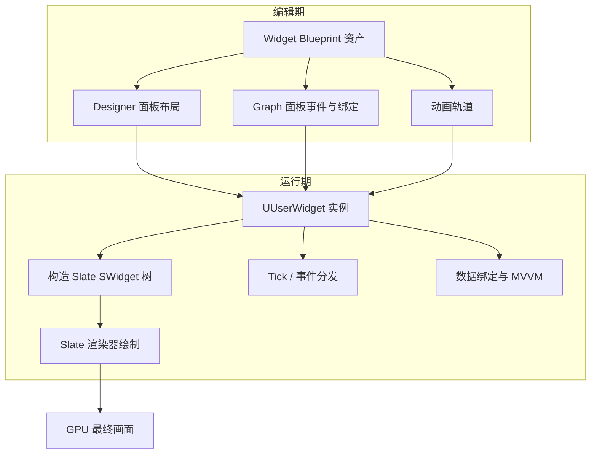

---

## 2. 核心概念（表格）

| 概念 | 英文 | 说明 | 所属层 |
| --- | --- | --- | --- |
| 控件 | Widget | UI 的最小组成单元，如 Button、Image、TextBlock | UMG |
| 控件蓝图 | Widget Blueprint | 以 `UUserWidget` 为基类的蓝图资产，含设计器与图表 | UMG |
| 控件层级 | Widget Tree | Widget 按父子关系组成的树，根为 `RootWidget` | UMG |
| 画布面板 | Canvas Panel | 自由定位的容器，配合锚点实现自适应布局 | UMG |
| 锚点 | Anchor | 定义控件相对父容器的对齐参考点与伸缩行为 | UMG |
| 插槽 | Slot | 控件在父容器中的布局参数（如 CanvasSlot 的位置与尺寸） | UMG |
| 尺寸盒 | Size Box | 强制子控件保持指定尺寸的容器 | UMG |
| 滚动盒 | Scroll Box | 提供滚动视口的容器，支持列表虚拟化场景 | UMG |
| 滑动条 | Slider / SpinBox | 数值输入类控件 | UMG |
| 事件 | Event | 如 OnClicked、OnHovered，支持蓝图与 C++ 绑定 | UMG |
| 控件动画 | Widget Animation | 时间轴驱动的属性动画，可绑定事件回调 | UMG |
| Slate | Slate | UE 的 UI 框架，UMG 的底层实现 | Slate |
| SWidget | SWidget | Slate 控件基类，轻量、无 GC | Slate |
| 布局槽 | SBoxPanel / SOverlay 等 | Slate 层的布局容器 | Slate |
| 样式 | Style / FSlateBrush | 控件的绘制资源（图片、边框、字体） | Slate |
| CommonUI | CommonUI 插件 | 输入路由、焦点管理、控件激活器的框架 | 插件 |
| ViewModel | MVVM ViewModel | 暴露给 UI 的数据模型，UE5.1+ 原生支持 | MVVM |

---

## 3. 原理详解

### 3.1 Slate 与 UMG 的关系

Slate 是 UE 从 4.0 起引入的跨平台 UI 框架，特点是：

- **混合模式**：Slate 控件树每帧被"比较与绘制"，同时控件实例被缓存复用；
- **纯 C++、无 GC**：`SWidget` 继承自 `FWidget`（非 UObject），通过引用计数（`TSharedRef` / `TWeakPtr`）管理生命周期；
- **声明式布局**：Slate 控件用 C++ 声明式语法构造。

```cpp
// Slate 声明式构造示例
SNew(SVerticalBox)
    + SVerticalBox::Slot()
    .AutoHeight()
    [
        SNew(STextBlock).Text(FText::FromString(TEXT("Hello Slate")))
    ]
```

UMG 是 Slate 之上的一层"用户友好封装"：

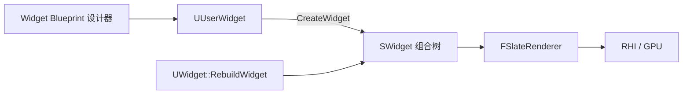

关键机制：

- `UWidget::RebuildWidget()` 在控件实例化时被调用，返回对应 Slate 控件的 `TSharedRef<SWidget>`；
- `UUserWidget` 的每个 `UWidget` 子对象（如 `UButton`）都会在 `TakeWidget()` 时创建自己的 Slate 控件（如 `SButton`）；
- 布局与绘制最终全部由 Slate 层完成，UMG 只负责把蓝图属性映射到 Slate 参数；
- 因此**所有 UMG 性能问题本质上都是 Slate 性能问题**：控件数量、失效重绘（Invalidation）、Paint 开销都在 Slate 层发生。

#### Slate 渲染管线（简化）

1. `SWidget::Paint()` 递归遍历控件树，生成 `FPaintGeometry` 与绘制命令；
2. 绘制命令被收集为 `FSlateDrawElement` 批次（Batched Elements），按材质/图集自动合批；
3. `FSlateRenderer` 将批次提交给 RHI，生成网格体并上传 GPU；
4. GPU 按批次绘制，Slate 支持纹理图集（Texture Atlas）与动态图集（Dynamic Atlas）。

**Slate 失效机制（Invalidation）**：Slate 不会每帧重绘全部控件。当属性变化时，控件调用 `Invalidate(EInvalidateWidgetReason::Layout / Paint / Volatility)` 标记子树失效，只有失效子树参与下一帧重绘。这也是 `stat slate` 中 Invalidation 统计的意义所在。

### 3.2 控件层级（Widget Tree）

每个 Widget Blueprint 在运行期拥有一个控件树，根节点是设计器中的根容器（默认 `Canvas Panel`）。控件树特点：

- 父子关系决定**绘制顺序**（后绘制的在上层）与**布局传递**；
- 事件（点击、悬停）按**命中测试**（Hit Test）从顶层向下分发；
- 可见性（Visibility）有三种状态：`Visible`（参与布局+绘制+命中）、`Collapsed`（不参与布局+不绘制+不命中）、`Hidden`（参与布局+不绘制+不命中）；
- 控件树过大、更新频繁是 UI 性能的第一大杀手。

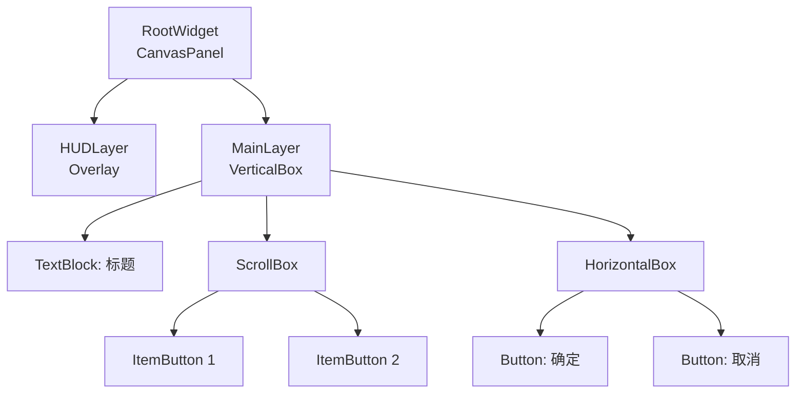

#### 常用容器控件速查

| 容器 | 布局方式 | 典型用途 |
| --- | --- | --- |
| Canvas Panel | 绝对定位（Position + Size + Anchor） | 全屏 HUD、自由摆放 |
| Vertical Box | 纵向自动排列 | 菜单列表、表单 |
| Horizontal Box | 横向自动排列 | 按钮组、图标行 |
| Overlay | 子控件层叠（同尺寸） | 背景+内容叠加、Toast |
| Grid Panel | 网格排列（行列） | 背包格子、技能面板 |
| Wrap Box | 自动换行排列 | 聊天表情、标签 |
| Stack Box | 横向或纵向自动排列 | 类似 HBox/VBox 的轻量替代 |
| Size Box | 固定子控件尺寸 | 按钮最小尺寸约束 |
| Scale Box | 按比例缩放子控件 | 9-slice 背景、图标适配 |

### 3.3 锚点与布局（Anchor & Layout）

锚点（Anchor）决定控件在父容器中的**对齐基准**与**伸缩规则**：

- **锚点位置**：左上、中上、右上、左中、正中……共 9 个标准锚点 + 自定义锚点；
- **锚点对齐**：控件自身参考点与锚点重合，例如锚点居中时控件中心随父容器中心移动；
- **锚点拉伸**：当锚点被"拉成一条线/一个面"时，控件会随父容器尺寸变化自动拉伸；
- **布局算法**：`Anchors`（归一化 0~1）+ `Alignment`（归一化 0~1）+ `Position`（像素偏移）+ `Size`（像素尺寸）共同决定最终矩形。

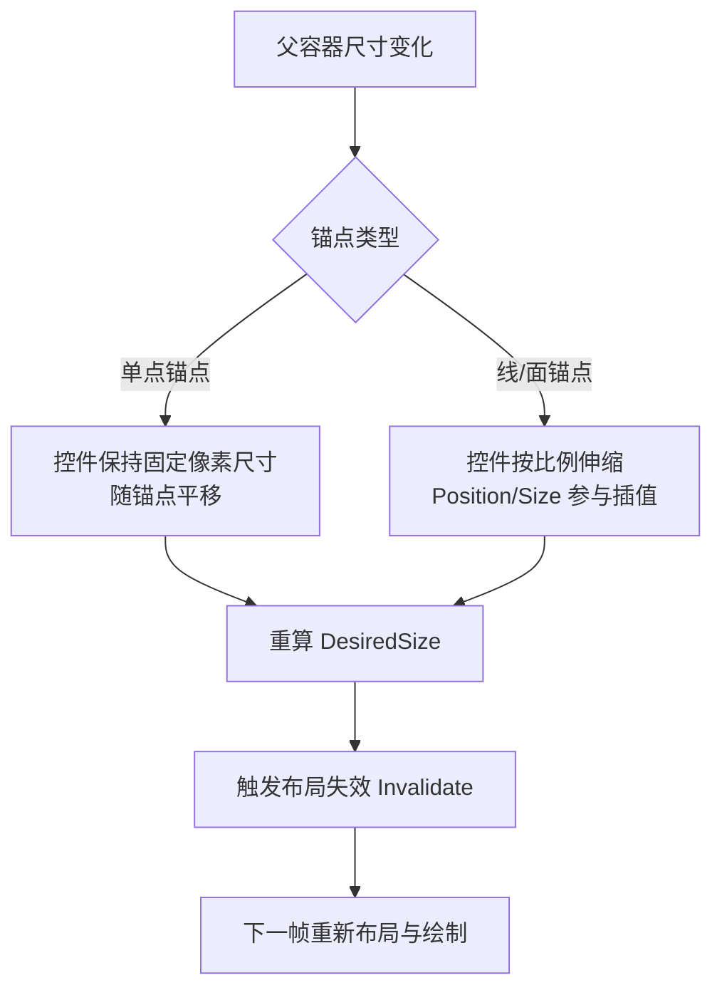

#### 自适应布局最佳公式

对全屏自适应的 HUD：

- 背景图：锚点四角拉伸（锚点 = 全屏面），`Size` 设为 0；
- 右上角小地图：锚点右上，`Alignment = (1,1)`，`Position = (-20,-20)`；
- 底部按钮栏：锚点底部，`Alignment = (0.5,1)`，水平居中；
- 弹窗：锚点正中，`Alignment = (0.5,0.5)`，尺寸固定。

> 注意：Canvas Panel 之外的容器（如 Vertical Box）中，锚点不生效，由插槽（Slot）自动计算。

### 3.4 Widget Blueprint 开发流程

Widget Blueprint 由四部分组成：

1. **Designer（设计器）**：拖拽控件、设置属性、管理层级；
2. **Graph（图表）**：编写事件与函数逻辑；
3. **Details（细节面板）**：编辑选中控件的属性、绑定（Binding）、事件；
4. **Animations（动画轨道）**：创建控件动画（Widget Animation）。

一个典型的 Widget Blueprint 生命周期：

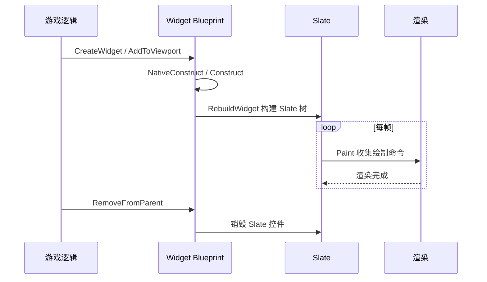

#### 生命周期事件

| 事件 | 触发时机 | 用途 |
| --- | --- | --- |
| `PreConstruct` | 设计器中预览时 / 实例化前 | 编辑器预览逻辑 |
| `Construct` | 控件已构建、加入视口前 | 初始化数据、注册委托 |
| `NativeConstruct` | C++ 侧构造完成 | C++ 初始化 |
| `Tick` | 每帧（仅启用时） | 持续更新，谨慎使用 |
| `Destruct` | 从视口移除、销毁前 | 反注册委托、释放资源 |
| `OnAddedToFocusPath` | 获得焦点 | 键盘导航联动 |

### 3.5 事件与动画

#### 事件系统

UMG 事件分为三类：

1. **控件事件**：`OnClicked`（Button）、`OnTextCommitted`（EditableTextBox）、`OnValueChanged`（Slider）、`OnSelectionChanged`（ComboBox）等；
2. **用户控件事件**：在 Widget Blueprint 中自定义的 `Event`，供外部调用或通过 `BindEvent` 绑定；
3. **生命周期事件**：`Construct`、`Destruct`、`Tick` 等。

事件绑定的三种方式：

- 设计器中直接在 Details 面板点击 `+` 创建事件图表；
- 蓝图中用 `BindEvent` 节点动态绑定（需先 `Create Event`）；
- C++ 中通过 `UWidget::OnClicked.AddDynamic(...)` 或覆写 `NativeOnClicked`。

#### 控件动画（Widget Animation）

动画轨道支持对以下属性做时间轴动画：

- 变换：位置、旋转、缩放（Transform）；
- 颜色与透明度：Color And Opacity、Opacity；
- 渲染变换：Render Transform（不触发布局重算，性能友好）；
- 自定义属性（通过 C++ 暴露的 `UPROPERTY` 或蓝图属性绑定）。

常用节点：

- `Play Animation` / `Play Animation Reverse` / `Play Animation Forward`；
- `Stop Animation` / `Pause Animation`；
- 动画结束时事件：`OnAnimationFinished` 绑定委托。

> 性能提示：动画应尽量使用 **Render Transform** 与 **Opacity**（Slate 层可合并绘制），避免每帧修改布局属性（Position、Size），否则会触发 `Invalidate(EInvalidateWidgetReason::Layout)` 导致整棵子树重新布局。

### 3.6 CommonUI 简述

CommonUI 是 Epic 官方插件（UE4.26+ 内置，UE5 默认开启），面向复杂产品 UI 提供：

1. **输入路由（Input Routing）**：`CommonActivatableWidget` 支持栈式激活（Push/Pop），输入自动路由到栈顶控件；
2. **焦点管理**：`UCommonInputSubsystem` 统一管理游戏手柄 / 键盘 / 触摸的焦点切换；
3. **控件激活器（Activatable Widget）**：弹窗、菜单等可激活/失活，失活时自动暂停输入与动画；
4. **通用按钮与文本**：`CommonButtonBase`、`CommonTextBlock` 等基础控件，统一样式与交互；
5. **平台输入样式**：`CommonInputActionData` 把游戏手柄按键映射到 UI 操作（如 `UI_Confirm`）。

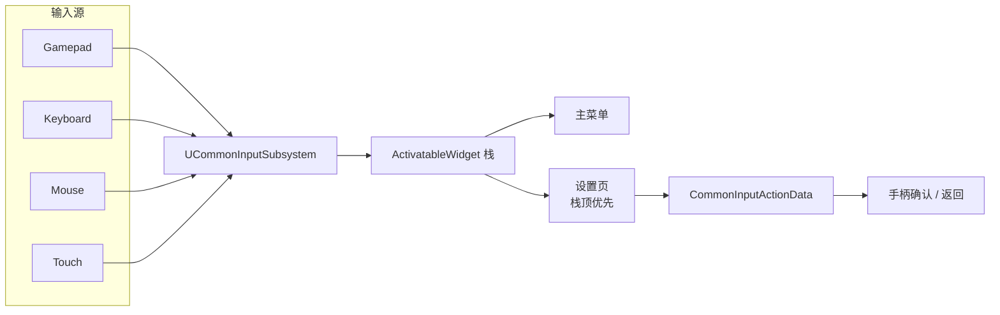

CommonUI 的核心价值：**让同一套 UI 同时支持手柄与键鼠，且输入焦点永远不会"迷路"**。

---

## 4. 代码 / 蓝图示例

### 4.1 C++：创建并显示一个 UMG 控件

```cpp
// 在 GameMode 或 Pawn 中
#include "Blueprint/UserWidget.h"

// 1. 加载 Widget 蓝图类
static ConstructorHelpers::FClassFinder<UUserWidget> WidgetBPClass(
    TEXT("/Game/UI/WBP_HUD.WBP_HUD_C"));

// 2. 创建实例
UUserWidget* HUDWidget = CreateWidget<UUserWidget>(GetWorld(), WidgetBPClass.Class);

// 3. 添加到视口（ZOrder = 10，覆盖普通 UI）
HUDWidget->AddToViewport(10);

// 4. 移除
HUDWidget->RemoveFromParent();
```

### 4.2 C++：动态创建控件并添加为子控件

```cpp
UButton* Btn = NewObject<UButton>(this);
Btn->SetVisibility(ESlateVisibility::Visible);

// 添加进 VerticalBox
UVerticalBox* VBox = Cast<UVerticalBox>(RootWidget);
if (VBox)
{
    VBox->AddChildToVerticalBox(Btn);
}

// 绑定点击事件
Btn->OnClicked.AddDynamic(this, &AMyHUD::OnBtnClicked);
```

### 4.3 蓝图：动态创建列表项

1. `Create Widget` → 选择 `WBP_ListItem`；
2. `Add Child` → 目标为 `ScrollBox_Items`；
3. 通过 `Get Widget` 或 `Cast` 访问子控件属性并赋值。

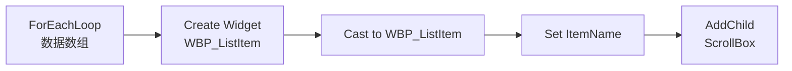

### 4.4 C++：事件绑定与委托

```cpp
// 头文件
DECLARE_DYNAMIC_MULTICAST_DELEGATE_OneParam(FOnItemClicked, int32, Index);

UCLASS()
class UMyListWidget : public UUserWidget
{
    GENERATED_BODY()
public:
    UPROPERTY(BlueprintAssignable)
    FOnItemClicked OnItemClicked;

    UFUNCTION(BlueprintCallable)
    void AddItem(const FString& Name);
};

// 实现
void UMyListWidget::AddItem(const FString& Name)
{
    // 创建子控件并绑定事件
    UButton* Btn = ...;
    Btn->OnClicked.AddDynamic(this, &UMyListWidget::HandleItemClicked);
}

void UMyListWidget::HandleItemClicked()
{
    OnItemClicked.Broadcast(CurrentIndex);
}
```

### 4.5 动画：蓝图播放控件动画

1. 在 Animations 面板新建 `OpenAnim`，添加对 `MainPanel` 的 `Render Transform` 关键帧（透明度 + 位移）；
2. 在按钮点击事件中调用 `Play Animation (OpenAnim)`；
3. 需要循环时勾选动画属性 `Loop`，或用 `Play Animation` 的 `NumLoopsToPlay` 参数。

### 4.6 stat 命令清单表（与 UMG 相关）

| 命令 | 作用 | 关注指标 | 使用场景 |
| --- | --- | --- | --- |
| `stat unit` | 帧时间总览 | `Frame` / `Game` / `Draw` / `GPU` | 定位瓶颈在 CPU 还是 GPU |
| `stat slate` | Slate 层统计 | `Slate Tick`、`Invalidate` 次数 | 控件树更新开销 |
| `stat slate` | Slate 调试信息 | 控件数量、绘制批次 | 控件过多排查 |
| `stat UMG` | UMG 层统计 | Widget 数量、Construct/Destruct 频率 | 控件频繁创建销毁 |
| `stat gpu` | GPU 时间 | `Slate Elements` | UI 绘制 GPU 开销 |
| `ProfileGPU` | GPU 帧捕获 | Slate 相关 Pass | 精细定位 GPU 瓶颈 |
| `stat startfile` / `stat stopfile` | 记录统计文件 | 生成 `.uprof` | 与 Unreal Insights 联用 |
| `Slate.EnableInvalidationPanels 1` | 启用失效面板 | 减少重绘 | 高开销控件优化实验 |

---

## 5. 最佳实践

### 5.1 结构设计

- **按功能拆分 Widget Blueprint**：HUD、弹窗、列表项、图标各自独立，避免"万金油"巨型控件；
- **数据与表现分离**：Widget 只负责展示，数据获取放在 Controller / ViewModel 层（见第 2 篇）；
- **使用 CommonUI 管理弹窗栈**：复杂项目不要手写"打开弹窗-关闭弹窗"状态机；
- **列表虚拟化**：条目多时使用 `ListView` / `TileView`（内部复用 Item Widget），不要手工堆 `ScrollBox`；
- **控件复用**：频繁显示/隐藏的控件用 `Visibility` 切换而非销毁重建。

### 5.2 布局与锚点

- 全屏 UI 用四角拉伸锚点，保证分辨率适配；
- 避免嵌套过深的容器（深度 > 5 层时布局与绘制开销显著上升）；
- 布局属性只在"需要时"修改，动画优先用 Render Transform；
- 使用 Widget Reflector（`~` 键打开）调试布局问题。

### 5.3 事件与动画

- 按钮事件内避免执行重量级操作（异步加载、同步 IO），否则卡 UI 线程；
- 大量按钮使用同一事件处理器 + 参数区分（如按钮 Tag），减少委托数量；
- 动画时长控制在 0.1~0.3s，避免每帧驱动布局属性；
- `Tick` 事件尽量不勾选；需要持续更新的用 `Timer` 或 MVVM 属性变更。

### 5.4 C++ 侧规范

- 创建 Widget 使用 `CreateWidget`（不要在 `BeginPlay` 前创建需要 World 的控件）；
- 持有 Widget 引用时使用 `TWeakObjectPtr<UUserWidget>`，避免阻止 GC；
- 覆写 `NativeOnInitialized` / `NativeConstruct` 做初始化，区分"设计器预览"与"运行时"（`IsDesignTime()`）；
- 大批量列表项使用 `UListView::SetListItems`，并注意启用虚拟化选项。

### 5.5 性能红线（经验值）

| 指标 | 预算建议 | 说明 |
| --- | --- | --- |
| 单屏可见控件数 | < 300（PC）/ < 150（移动端） | 超出考虑合并与虚拟化 |
| Widget 树深度 | < 10 层 | 过深影响布局与绘制 |
| UI Draw Call | < 100（移动端） | 超出需要材质合并/图集 |
| 每帧 Slate Tick 耗时 | < 1ms（移动端） | 超标检查 Invalidation |
| UI 内存 | 见项目预算 | 常用 `MemReport` 监控 |

---

## 6. 常见问题 FAQ

### Q1：为什么 UI 打开瞬间卡顿？

**原因**：首次创建 Widget 需要加载纹理、字体、构建 Slate 树；列表一次性创建大量 Item 也会卡。
**解决**：预创建常用 UI（池化）；列表用 `ListView`；纹理用 Texture Atlas；打开时播放动画掩盖加载。

### Q2：锚点设置后控件跑到了奇怪的位置？

**原因**：`Alignment` 与 `Position` 理解错误；或父容器不是 Canvas Panel（锚点不生效）。
**解决**：确认父容器类型；`Alignment` 是归一化值（0~1），`Position` 是像素偏移；用设计器顶部对齐工具辅助。

### Q3：控件点击无响应？

**原因**：命中测试被遮挡（上层控件挡住）；`Hit Test Invisible` 设置错误；父容器 `Visibility` 为 `Hidden`；输入模式未设置（`SetInputModeUIOnly`）。
**解决**：检查 ZOrder 与 Visibility；检查 `SetInputMode` 设置；用 Widget Reflector 查看命中对象。

### Q4：手柄无法操作 UI？

**原因**：未启用 CommonUI 或未设置焦点；按钮不可聚焦（`IsFocusable`）。
**解决**：使用 `CommonActivatableWidget`；按钮勾选 `Is Focusable`；检查 `UCommonInputSubsystem` 的平台输入映射。

### Q5：动画播放后控件位置偏移？

**原因**：动画修改了 `Slot` 的 Position 或锚点，结束后未复位。
**解决**：动画只操作 `Render Transform`；结束时用 `OnAnimationFinished` 显式复位；不要对布局属性做"往返动画"。

### Q6：UI 纹理花屏 / 图集溢出？

**原因**：超出 Slate 纹理图集（默认 2048x2048）或动态图集上限。
**解决**：UI 贴图尺寸设为 2 的幂；使用 `Slate Brush` 的 `Draw As`（Border/Box）；检查 `Slate.bAllowThrottling`（5.8 真实名称，无 `r.` 前缀）等控制台变量。

### Q7：Widget Blueprint 与 C++ 如何选择？

- 简单一次性界面：纯蓝图；
- 需要频繁实例化、大量数据交互、或性能敏感：C++ 基类 + 蓝图子类（数据逻辑在 C++，布局在蓝图）；
- 框架级控件（通用按钮、弹窗基类）：全 C++。

### Q8：UMG 能否用于编辑器工具 UI？

**可以**。UE5 起 `UUserWidget` 可在编辑器扩展中使用，但传统编辑器 UI 仍以 Slate 为主。若目标是做编辑器工具，建议直接学 Slate。

---

## 7. 关联阅读与前后置专题

- [02-UI数据绑定与MVVM](02-UI数据绑定与MVVM.md)：从 Tick 属性轮询到原生 MVVM 数据驱动的架构跃迁；
- [03-性能分析工具与Profiling](../../08-工程实践与质量/调试与性能分析/03-性能分析工具与Profiling.md)：使用 Unreal Insights 与 stat 命令精细分析 Slate 绘制耗时；
- [04-渲染与加载性能优化](../../08-工程实践与质量/调试与性能分析/04-渲染与加载性能优化.md)：UI 渲染 DrawCall 合批、图集打包与内存开销优化；
- [07-CommonUI输入路由与焦点管理](07-CommonUI输入路由与焦点管理.md)：跨平台多端输入路由与焦点栈管理；
- [08-Slate自定义控件与样式系统](08-Slate自定义控件与样式系统.md)：底层 SWidget 声明式绘制与 FSlateStyleSet 定制；
- [12-14 UMG与Slate源码](14-UMG与Slate源码.md)：SObjectWidget 桥接与 Slate 渲染批次裁剪源码底层；
- [00-02 C++对象模型与内存](../../../00_Index/学习路线/编程与计算机基础.md)：UI 控件树深层递归与虚表派发开销的第一性原理分析；
- [UE 5.8 官方文档：UMG UI Designer 快速入门](https://dev.epicgames.com/documentation/en-us/unreal-engine/umg-ui-designer-quick-start-guide-in-unreal-engine)（布局、控件与 Widget Blueprint）
- [UE 5.8 官方文档：Slate UI Framework](https://dev.epicgames.com/documentation/en-us/unreal-engine/slate-user-interface-programming-framework-for-unreal-engine)（底层架构）
- [UE 5.8 官方文档：Common UI](https://dev.epicgames.com/documentation/unreal-engine/common-ui-plugin-for-advanced-user-interfaces-in-unreal-engine?lang=en-US)（输入路由与焦点）

---

*下一篇：02-UI数据绑定与MVVM —— 让界面"自己"响应数据变化。*
````````
<!-- UMG_WIDGET_ORIGINAL_CURRENT_END -->

### 全部已见Git版本的复原目录

每个差异均独立从CURRENT应用到目标历史版本，不串联。所有差异采用零上下文。

| Git blob | bytes | SHA-256 | 回拼配方 |
| --- | --- | --- | --- |
| `014546533f163c5e749e3216e4fc0e2d364c9190` | 21408 | `69abf2433694aeb729fccccd61cb8886c443eac2cf9da6a50c740b3e11b35d14` | CURRENT + PATCH_H00 |
| `0653b9002fdb945545add1748bdb7dd85d1ed2e2` | 22037 | `18db9f8ca179c75b2d67da774d0c129087fed50d236f0141a2d6361867973b11` | CURRENT + PATCH_H01 |
| `0a3392aa8761cb2039b5294a6375154e2584a8cf` | 21403 | `f7e0455ca5bbf3bb3deee3d51efbff8a8347c180021bdc940650d17c29e6f947` | CURRENT + PATCH_H02 |
| `14718858c9b1468b21e585da3c9fe93a68115906` | 23039 | `44221b9906dbea8d6e7815ca234a3d38bdad564feb7295f4a3906c8a7dbb5713` | CURRENT + PATCH_H03 |
| `2c04d8b773a5b695f6c112d3eb2b19e6e11bdffb` | 23071 | `ea8af4fa69442d7f64f0012ecfe7b2cf5d36f4125e6fb54513c5d8fa3f8e5708` | CURRENT + PATCH_H04 |
| `61d45e7f219deedc6e27ba9a94456620b3fcf487` | 22138 | `dc23cf6d7a3d7505aad3477f6c60e4fcb4181f788490ef8f2dd8f3fa52cb7054` | CURRENT + PATCH_H05 |
| `716577c253e3e735c0dc1a417bf3d67dd8b72828` | 21878 | `236a1c06a9a7ab47a9695cbdb6f5177d7d34520991e01e224cd521123d323633` | CURRENT + PATCH_H06 |
| `94ac625e4416c4bf2885f18cc5e2981daf7ee1f5` | 21934 | `da85c1f9957f0600fdae1afc7246bff62090df002f00782305f0a6ddc3a930da` | CURRENT + PATCH_H07 |
| `babaab110afb1d0dbf7bb81525dd9e5bb8b22ec7` | 22951 | `6bc069ab7404179bc50ce9eab50aa84eab97de5fe5c4414ffa7f75bf2fc5a00f` | CURRENT + PATCH_H08 |
| `c4d16cc750d7f774717f17e39035a2a390540afe` | 21441 | `9a13e66ef8313890893f26acd49574f6fd08bc0d1eae9d78cc68b123401dda3c` | CURRENT + PATCH_H09 |
| `ca0fb0cd13ed3ad9735f73cba24f47913b7941a5` | 23019 | `342351ea8d57c64675fa8b4552320dd5c5a2cac6c410d624b687ce6bcd433de1` | CURRENT |
| `fad4a243ed98c23373e717e0dbabbd541c15068e` | 21576 | `f2c47fb935ae9b3d196724cb80922df61ea56075a89ef190add60326ed36d5c5` | CURRENT + PATCH_H11 |

### 路径与提交身份

| Commit | 当时路径 | Git blob |
| --- | --- | --- |
| `a90206240792bc881ddbc44374b47733a837107d` | `游戏知识/07-UI与性能优化/01-UMG框架与控件系统.md` | `014546533f163c5e749e3216e4fc0e2d364c9190` |
| `3ab4d940317ed08b879fd864ab17000dfbf4d18e` | `游戏知识/07-UI与性能优化/01-UMG框架与控件系统.md` | `0653b9002fdb945545add1748bdb7dd85d1ed2e2` |
| `b688b2f4652a5e0760d23886db819ee5bd462273` | `游戏知识/07-UI与性能优化/01-UMG框架与控件系统.md` | `0a3392aa8761cb2039b5294a6375154e2584a8cf` |
| `79bb4a9ecb084d5765bcced9b5b4c586666f6d30` | `知识/05-Gameplay与交互系统/界面设置与无障碍/01-UMG框架与控件系统.md` | `14718858c9b1468b21e585da3c9fe93a68115906` |
| `0ded04bf34c2fb3a9cc4539e0685d0cb52ffb003` | `游戏知识/07-UI与性能优化/01-UMG框架与控件系统.md` | `2c04d8b773a5b695f6c112d3eb2b19e6e11bdffb` |
| `9beb653aa267a4a0dbcf44a32fa21ce205cc3ce5` | `游戏知识/07-UI与性能优化/01-UMG框架与控件系统.md` | `61d45e7f219deedc6e27ba9a94456620b3fcf487` |
| `f97556acb80af617fe6fbedcbaf99485888371ba` | `游戏知识/07-UI与性能优化/01-UMG框架与控件系统.md` | `716577c253e3e735c0dc1a417bf3d67dd8b72828` |
| `2653b9e01c9e9664429ba6225eed6853db30426e` | `游戏知识/07-UI与性能优化/01-UMG框架与控件系统.md` | `94ac625e4416c4bf2885f18cc5e2981daf7ee1f5` |
| `951e89c4498cd1fc2293e8eeecf5d3f1318952d5` | `游戏知识/07-UI与性能优化/01-UMG框架与控件系统.md` | `babaab110afb1d0dbf7bb81525dd9e5bb8b22ec7` |
| `d294ec876825038e6ed8c16b363d0ca811d414f0` | `游戏知识/07-UI与性能优化/01-UMG框架与控件系统.md` | `c4d16cc750d7f774717f17e39035a2a390540afe` |
| `49b0a565f5c36f4646b020dc026c3f82501d1780` | `知识/05-Gameplay与交互系统/界面设置与无障碍/01-UMG框架与控件系统.md` | `ca0fb0cd13ed3ad9735f73cba24f47913b7941a5` |
| `5e94604f1c409de071bbcf5cdc2962d447f29ccd` | `知识/05-Gameplay与交互系统/界面设置与无障碍/01-UMG框架与控件系统.md` | `ca0fb0cd13ed3ad9735f73cba24f47913b7941a5` |
| `94fc66230b2d4a893e881ee6802e8e67bb56d3e3` | `游戏知识/07-UI与性能优化/01-UMG框架与控件系统.md` | `fad4a243ed98c23373e717e0dbabbd541c15068e` |

#### PATCH_H00

<!-- UMG_WIDGET_PATCH_H00_BEGIN -->
````````diff
diff --git a/ca0fb0cd13ed3ad9735f73cba24f47913b7941a5 b/014546533f163c5e749e3216e4fc0e2d364c9190
index ca0fb0c..0145465 100644
--- a/ca0fb0cd13ed3ad9735f73cba24f47913b7941a5
+++ b/014546533f163c5e749e3216e4fc0e2d364c9190
@@ -1,12 +1 @@
----
-type: Concept
-title: "01 UMG 框架与控件系统"
-status: stable
-verified: []
-maturity: L2
----
-# 01 UMG 框架与控件系统
-> 版本基准：UE 5.8.0（本机 `Engine/Build/Build.version`：CL 55116800，分支 `++UE5+Release-5.8`）。
-> 兼容性边界：适用于 UE5.8 编辑器/运行时，UE4.27 与早期 UE5 仅作迁移背景，具体模块以正文为准。
-> 官方参考：[UE 5.8 官方文档](https://dev.epicgames.com/documentation/en-us/unreal-engine)。
-> 最后更新：2026-08-06（本轮元数据维护）。
+# 01 · UMG 框架与控件系统
@@ -16 +4,0 @@ maturity: L2
-> 知识成熟度：L2（本轮审计修订时补标）。
@@ -391 +379 @@ void UMyListWidget::HandleItemClicked()
-| `stat slate` | Slate 调试信息 | 控件数量、绘制批次 | 控件过多排查 |
+| `stat slateDebug` | Slate 调试信息 | 控件数量、绘制批次 | 控件过多排查 |
@@ -473 +461 @@ void UMyListWidget::HandleItemClicked()
-**解决**：UI 贴图尺寸设为 2 的幂；使用 `Slate Brush` 的 `Draw As`（Border/Box）；检查 `Slate.bAllowThrottling`（5.8 真实名称，无 `r.` 前缀）等控制台变量。
+**解决**：UI 贴图尺寸设为 2 的幂；使用 `Slate Brush` 的 `Draw As`（Border/Box）；检查 `r.Slate.AllowThrottling` 等控制台变量。
@@ -487,12 +475,8 @@ void UMyListWidget::HandleItemClicked()
-## 7. 关联阅读与前后置专题
-
-- [02-UI数据绑定与MVVM](02-UI数据绑定与MVVM.md)：从 Tick 属性轮询到原生 MVVM 数据驱动的架构跃迁；
-- [03-性能分析工具与Profiling](../../08-工程实践与质量/调试与性能分析/03-性能分析工具与Profiling.md)：使用 Unreal Insights 与 stat 命令精细分析 Slate 绘制耗时；
-- [04-渲染与加载性能优化](../../08-工程实践与质量/调试与性能分析/04-渲染与加载性能优化.md)：UI 渲染 DrawCall 合批、图集打包与内存开销优化；
-- [07-CommonUI输入路由与焦点管理](07-CommonUI输入路由与焦点管理.md)：跨平台多端输入路由与焦点栈管理；
-- [08-Slate自定义控件与样式系统](08-Slate自定义控件与样式系统.md)：底层 SWidget 声明式绘制与 FSlateStyleSet 定制；
-- [12-14 UMG与Slate源码](14-UMG与Slate源码.md)：SObjectWidget 桥接与 Slate 渲染批次裁剪源码底层；
-- [00-02 C++对象模型与内存](../../../00_Index/学习路线/编程与计算机基础.md)：UI 控件树深层递归与虚表派发开销的第一性原理分析；
-- [UE 5.8 官方文档：UMG UI Designer 快速入门](https://dev.epicgames.com/documentation/en-us/unreal-engine/umg-ui-designer-quick-start-guide-in-unreal-engine)（布局、控件与 Widget Blueprint）
-- [UE 5.8 官方文档：Slate UI Framework](https://dev.epicgames.com/documentation/en-us/unreal-engine/slate-user-interface-programming-framework-for-unreal-engine)（底层架构）
-- [UE 5.8 官方文档：Common UI](https://dev.epicgames.com/documentation/unreal-engine/common-ui-plugin-for-advanced-user-interfaces-in-unreal-engine?lang=en-US)（输入路由与焦点）
+## 7. 关联阅读
+
+- [UE 官方文档：UMG UI Designer](https://docs.unrealengine.com/5.3/zh-CN/umg-ui-designer-for-unreal-engine/)（锚点、布局、控件详解）
+- [UE 官方文档：Slate UI Framework](https://docs.unrealengine.com/5.3/zh-CN/slate-ui-framework-for-unreal-engine/)（底层架构）
+- [UE 官方文档：CommonUI](https://docs.unrealengine.com/5.3/zh-CN/commonui-plugin-for-advanced-user-interfaces-in-unreal-engine/)（输入路由与焦点）
+- 本知识库：`02-UI数据绑定与MVVM.md`（数据驱动刷新）
+- 本知识库：`03-性能分析工具与Profiling.md`（UI 耗时分析）
+- 本知识库：`04-渲染与加载性能优化.md`（UI 渲染与内存优化）
````````
<!-- UMG_WIDGET_PATCH_H00_END -->

#### PATCH_H01

<!-- UMG_WIDGET_PATCH_H01_BEGIN -->
````````diff
diff --git a/ca0fb0cd13ed3ad9735f73cba24f47913b7941a5 b/0653b9002fdb945545add1748bdb7dd85d1ed2e2
index ca0fb0c..0653b90 100644
--- a/ca0fb0cd13ed3ad9735f73cba24f47913b7941a5
+++ b/0653b9002fdb945545add1748bdb7dd85d1ed2e2
@@ -1,7 +0,0 @@
----
-type: Concept
-title: "01 UMG 框架与控件系统"
-status: stable
-verified: []
-maturity: L2
----
@@ -487 +480 @@ void UMyListWidget::HandleItemClicked()
-## 7. 关联阅读与前后置专题
+## 7. 关联阅读
@@ -489,7 +481,0 @@ void UMyListWidget::HandleItemClicked()
-- [02-UI数据绑定与MVVM](02-UI数据绑定与MVVM.md)：从 Tick 属性轮询到原生 MVVM 数据驱动的架构跃迁；
-- [03-性能分析工具与Profiling](../../08-工程实践与质量/调试与性能分析/03-性能分析工具与Profiling.md)：使用 Unreal Insights 与 stat 命令精细分析 Slate 绘制耗时；
-- [04-渲染与加载性能优化](../../08-工程实践与质量/调试与性能分析/04-渲染与加载性能优化.md)：UI 渲染 DrawCall 合批、图集打包与内存开销优化；
-- [07-CommonUI输入路由与焦点管理](07-CommonUI输入路由与焦点管理.md)：跨平台多端输入路由与焦点栈管理；
-- [08-Slate自定义控件与样式系统](08-Slate自定义控件与样式系统.md)：底层 SWidget 声明式绘制与 FSlateStyleSet 定制；
-- [12-14 UMG与Slate源码](14-UMG与Slate源码.md)：SObjectWidget 桥接与 Slate 渲染批次裁剪源码底层；
-- [00-02 C++对象模型与内存](../../../00_Index/学习路线/编程与计算机基础.md)：UI 控件树深层递归与虚表派发开销的第一性原理分析；
@@ -498,0 +485,3 @@ void UMyListWidget::HandleItemClicked()
+- 本知识库：`02-UI数据绑定与MVVM.md`（数据驱动刷新）
+- 本知识库：`03-性能分析工具与Profiling.md`（UI 耗时分析）
+- 本知识库：`04-渲染与加载性能优化.md`（UI 渲染与内存优化）
````````
<!-- UMG_WIDGET_PATCH_H01_END -->

#### PATCH_H02

<!-- UMG_WIDGET_PATCH_H02_BEGIN -->
````````diff
diff --git a/ca0fb0cd13ed3ad9735f73cba24f47913b7941a5 b/0a3392aa8761cb2039b5294a6375154e2584a8cf
index ca0fb0c..0a3392a 100644
--- a/ca0fb0cd13ed3ad9735f73cba24f47913b7941a5
+++ b/0a3392aa8761cb2039b5294a6375154e2584a8cf
@@ -1,12 +1 @@
----
-type: Concept
-title: "01 UMG 框架与控件系统"
-status: stable
-verified: []
-maturity: L2
----
-# 01 UMG 框架与控件系统
-> 版本基准：UE 5.8.0（本机 `Engine/Build/Build.version`：CL 55116800，分支 `++UE5+Release-5.8`）。
-> 兼容性边界：适用于 UE5.8 编辑器/运行时，UE4.27 与早期 UE5 仅作迁移背景，具体模块以正文为准。
-> 官方参考：[UE 5.8 官方文档](https://dev.epicgames.com/documentation/en-us/unreal-engine)。
-> 最后更新：2026-08-06（本轮元数据维护）。
+# 01 · UMG 框架与控件系统
@@ -16 +4,0 @@ maturity: L2
-> 知识成熟度：L2（本轮审计修订时补标）。
@@ -473 +461 @@ void UMyListWidget::HandleItemClicked()
-**解决**：UI 贴图尺寸设为 2 的幂；使用 `Slate Brush` 的 `Draw As`（Border/Box）；检查 `Slate.bAllowThrottling`（5.8 真实名称，无 `r.` 前缀）等控制台变量。
+**解决**：UI 贴图尺寸设为 2 的幂；使用 `Slate Brush` 的 `Draw As`（Border/Box）；检查 `r.Slate.AllowThrottling` 等控制台变量。
@@ -487,12 +475,8 @@ void UMyListWidget::HandleItemClicked()
-## 7. 关联阅读与前后置专题
-
-- [02-UI数据绑定与MVVM](02-UI数据绑定与MVVM.md)：从 Tick 属性轮询到原生 MVVM 数据驱动的架构跃迁；
-- [03-性能分析工具与Profiling](../../08-工程实践与质量/调试与性能分析/03-性能分析工具与Profiling.md)：使用 Unreal Insights 与 stat 命令精细分析 Slate 绘制耗时；
-- [04-渲染与加载性能优化](../../08-工程实践与质量/调试与性能分析/04-渲染与加载性能优化.md)：UI 渲染 DrawCall 合批、图集打包与内存开销优化；
-- [07-CommonUI输入路由与焦点管理](07-CommonUI输入路由与焦点管理.md)：跨平台多端输入路由与焦点栈管理；
-- [08-Slate自定义控件与样式系统](08-Slate自定义控件与样式系统.md)：底层 SWidget 声明式绘制与 FSlateStyleSet 定制；
-- [12-14 UMG与Slate源码](14-UMG与Slate源码.md)：SObjectWidget 桥接与 Slate 渲染批次裁剪源码底层；
-- [00-02 C++对象模型与内存](../../../00_Index/学习路线/编程与计算机基础.md)：UI 控件树深层递归与虚表派发开销的第一性原理分析；
-- [UE 5.8 官方文档：UMG UI Designer 快速入门](https://dev.epicgames.com/documentation/en-us/unreal-engine/umg-ui-designer-quick-start-guide-in-unreal-engine)（布局、控件与 Widget Blueprint）
-- [UE 5.8 官方文档：Slate UI Framework](https://dev.epicgames.com/documentation/en-us/unreal-engine/slate-user-interface-programming-framework-for-unreal-engine)（底层架构）
-- [UE 5.8 官方文档：Common UI](https://dev.epicgames.com/documentation/unreal-engine/common-ui-plugin-for-advanced-user-interfaces-in-unreal-engine?lang=en-US)（输入路由与焦点）
+## 7. 关联阅读
+
+- [UE 官方文档：UMG UI Designer](https://docs.unrealengine.com/5.3/zh-CN/umg-ui-designer-for-unreal-engine/)（锚点、布局、控件详解）
+- [UE 官方文档：Slate UI Framework](https://docs.unrealengine.com/5.3/zh-CN/slate-ui-framework-for-unreal-engine/)（底层架构）
+- [UE 官方文档：CommonUI](https://docs.unrealengine.com/5.3/zh-CN/commonui-plugin-for-advanced-user-interfaces-in-unreal-engine/)（输入路由与焦点）
+- 本知识库：`02-UI数据绑定与MVVM.md`（数据驱动刷新）
+- 本知识库：`03-性能分析工具与Profiling.md`（UI 耗时分析）
+- 本知识库：`04-渲染与加载性能优化.md`（UI 渲染与内存优化）
````````
<!-- UMG_WIDGET_PATCH_H02_END -->

#### PATCH_H03

<!-- UMG_WIDGET_PATCH_H03_BEGIN -->
````````diff
diff --git a/ca0fb0cd13ed3ad9735f73cba24f47913b7941a5 b/14718858c9b1468b21e585da3c9fe93a68115906
index ca0fb0c..1471885 100644
--- a/ca0fb0cd13ed3ad9735f73cba24f47913b7941a5
+++ b/14718858c9b1468b21e585da3c9fe93a68115906
@@ -495 +495 @@ void UMyListWidget::HandleItemClicked()
-- [00-02 C++对象模型与内存](../../../00_Index/学习路线/编程与计算机基础.md)：UI 控件树深层递归与虚表派发开销的第一性原理分析；
+- [00-02 C++对象模型与内存](../../../00-计算机与工程基础/02-C%2B%2B对象模型与内存/README.md)：UI 控件树深层递归与虚表派发开销的第一性原理分析；
````````
<!-- UMG_WIDGET_PATCH_H03_END -->

#### PATCH_H04

<!-- UMG_WIDGET_PATCH_H04_BEGIN -->
````````diff
diff --git a/ca0fb0cd13ed3ad9735f73cba24f47913b7941a5 b/2c04d8b773a5b695f6c112d3eb2b19e6e11bdffb
index ca0fb0c..2c04d8b 100644
--- a/ca0fb0cd13ed3ad9735f73cba24f47913b7941a5
+++ b/2c04d8b773a5b695f6c112d3eb2b19e6e11bdffb
@@ -490,2 +490,2 @@ void UMyListWidget::HandleItemClicked()
-- [03-性能分析工具与Profiling](../../08-工程实践与质量/调试与性能分析/03-性能分析工具与Profiling.md)：使用 Unreal Insights 与 stat 命令精细分析 Slate 绘制耗时；
-- [04-渲染与加载性能优化](../../08-工程实践与质量/调试与性能分析/04-渲染与加载性能优化.md)：UI 渲染 DrawCall 合批、图集打包与内存开销优化；
+- [03-性能分析工具与Profiling](../../知识/08-工程实践与质量/调试与性能分析/03-性能分析工具与Profiling.md)：使用 Unreal Insights 与 stat 命令精细分析 Slate 绘制耗时；
+- [04-渲染与加载性能优化](../../知识/08-工程实践与质量/调试与性能分析/04-渲染与加载性能优化.md)：UI 渲染 DrawCall 合批、图集打包与内存开销优化；
@@ -494,2 +494,2 @@ void UMyListWidget::HandleItemClicked()
-- [12-14 UMG与Slate源码](14-UMG与Slate源码.md)：SObjectWidget 桥接与 Slate 渲染批次裁剪源码底层；
-- [00-02 C++对象模型与内存](../../../00_Index/学习路线/编程与计算机基础.md)：UI 控件树深层递归与虚表派发开销的第一性原理分析；
+- [12-14 UMG与Slate源码](../12-引擎源码分析/14-UMG与Slate源码.md)：SObjectWidget 桥接与 Slate 渲染批次裁剪源码底层；
+- [00-02 C++对象模型与内存](../../00-计算机与工程基础/02-C++对象模型与内存/README.md)：UI 控件树深层递归与虚表派发开销的第一性原理分析；
````````
<!-- UMG_WIDGET_PATCH_H04_END -->

#### PATCH_H05

<!-- UMG_WIDGET_PATCH_H05_BEGIN -->
````````diff
diff --git a/ca0fb0cd13ed3ad9735f73cba24f47913b7941a5 b/61d45e7f219deedc6e27ba9a94456620b3fcf487
index ca0fb0c..61d45e7 100644
--- a/ca0fb0cd13ed3ad9735f73cba24f47913b7941a5
+++ b/61d45e7f219deedc6e27ba9a94456620b3fcf487
@@ -487,9 +487,2 @@ void UMyListWidget::HandleItemClicked()
-## 7. 关联阅读与前后置专题
-
-- [02-UI数据绑定与MVVM](02-UI数据绑定与MVVM.md)：从 Tick 属性轮询到原生 MVVM 数据驱动的架构跃迁；
-- [03-性能分析工具与Profiling](../../08-工程实践与质量/调试与性能分析/03-性能分析工具与Profiling.md)：使用 Unreal Insights 与 stat 命令精细分析 Slate 绘制耗时；
-- [04-渲染与加载性能优化](../../08-工程实践与质量/调试与性能分析/04-渲染与加载性能优化.md)：UI 渲染 DrawCall 合批、图集打包与内存开销优化；
-- [07-CommonUI输入路由与焦点管理](07-CommonUI输入路由与焦点管理.md)：跨平台多端输入路由与焦点栈管理；
-- [08-Slate自定义控件与样式系统](08-Slate自定义控件与样式系统.md)：底层 SWidget 声明式绘制与 FSlateStyleSet 定制；
-- [12-14 UMG与Slate源码](14-UMG与Slate源码.md)：SObjectWidget 桥接与 Slate 渲染批次裁剪源码底层；
-- [00-02 C++对象模型与内存](../../../00_Index/学习路线/编程与计算机基础.md)：UI 控件树深层递归与虚表派发开销的第一性原理分析；
+## 7. 关联阅读
+
@@ -498,0 +492,3 @@ void UMyListWidget::HandleItemClicked()
+- 本知识库：`02-UI数据绑定与MVVM.md`（数据驱动刷新）
+- 本知识库：`03-性能分析工具与Profiling.md`（UI 耗时分析）
+- 本知识库：`04-渲染与加载性能优化.md`（UI 渲染与内存优化）
````````
<!-- UMG_WIDGET_PATCH_H05_END -->

#### PATCH_H06

<!-- UMG_WIDGET_PATCH_H06_BEGIN -->
````````diff
diff --git a/ca0fb0cd13ed3ad9735f73cba24f47913b7941a5 b/716577c253e3e735c0dc1a417bf3d67dd8b72828
index ca0fb0c..716577c 100644
--- a/ca0fb0cd13ed3ad9735f73cba24f47913b7941a5
+++ b/716577c253e3e735c0dc1a417bf3d67dd8b72828
@@ -1,8 +1 @@
----
-type: Concept
-title: "01 UMG 框架与控件系统"
-status: stable
-verified: []
-maturity: L2
----
-# 01 UMG 框架与控件系统
+# 01 · UMG 框架与控件系统
@@ -11 +3,0 @@ maturity: L2
-> 官方参考：[UE 5.8 官方文档](https://dev.epicgames.com/documentation/en-us/unreal-engine)。
@@ -16 +7,0 @@ maturity: L2
-> 知识成熟度：L2（本轮审计修订时补标）。
@@ -487 +478 @@ void UMyListWidget::HandleItemClicked()
-## 7. 关联阅读与前后置专题
+## 7. 关联阅读
@@ -489,7 +479,0 @@ void UMyListWidget::HandleItemClicked()
-- [02-UI数据绑定与MVVM](02-UI数据绑定与MVVM.md)：从 Tick 属性轮询到原生 MVVM 数据驱动的架构跃迁；
-- [03-性能分析工具与Profiling](../../08-工程实践与质量/调试与性能分析/03-性能分析工具与Profiling.md)：使用 Unreal Insights 与 stat 命令精细分析 Slate 绘制耗时；
-- [04-渲染与加载性能优化](../../08-工程实践与质量/调试与性能分析/04-渲染与加载性能优化.md)：UI 渲染 DrawCall 合批、图集打包与内存开销优化；
-- [07-CommonUI输入路由与焦点管理](07-CommonUI输入路由与焦点管理.md)：跨平台多端输入路由与焦点栈管理；
-- [08-Slate自定义控件与样式系统](08-Slate自定义控件与样式系统.md)：底层 SWidget 声明式绘制与 FSlateStyleSet 定制；
-- [12-14 UMG与Slate源码](14-UMG与Slate源码.md)：SObjectWidget 桥接与 Slate 渲染批次裁剪源码底层；
-- [00-02 C++对象模型与内存](../../../00_Index/学习路线/编程与计算机基础.md)：UI 控件树深层递归与虚表派发开销的第一性原理分析；
@@ -498,0 +483,3 @@ void UMyListWidget::HandleItemClicked()
+- 本知识库：`02-UI数据绑定与MVVM.md`（数据驱动刷新）
+- 本知识库：`03-性能分析工具与Profiling.md`（UI 耗时分析）
+- 本知识库：`04-渲染与加载性能优化.md`（UI 渲染与内存优化）
````````
<!-- UMG_WIDGET_PATCH_H06_END -->

#### PATCH_H07

<!-- UMG_WIDGET_PATCH_H07_BEGIN -->
````````diff
diff --git a/ca0fb0cd13ed3ad9735f73cba24f47913b7941a5 b/94ac625e4416c4bf2885f18cc5e2981daf7ee1f5
index ca0fb0c..94ac625 100644
--- a/ca0fb0cd13ed3ad9735f73cba24f47913b7941a5
+++ b/94ac625e4416c4bf2885f18cc5e2981daf7ee1f5
@@ -1,7 +0,0 @@
----
-type: Concept
-title: "01 UMG 框架与控件系统"
-status: stable
-verified: []
-maturity: L2
----
@@ -11 +3,0 @@ maturity: L2
-> 官方参考：[UE 5.8 官方文档](https://dev.epicgames.com/documentation/en-us/unreal-engine)。
@@ -487 +479 @@ void UMyListWidget::HandleItemClicked()
-## 7. 关联阅读与前后置专题
+## 7. 关联阅读
@@ -489,7 +480,0 @@ void UMyListWidget::HandleItemClicked()
-- [02-UI数据绑定与MVVM](02-UI数据绑定与MVVM.md)：从 Tick 属性轮询到原生 MVVM 数据驱动的架构跃迁；
-- [03-性能分析工具与Profiling](../../08-工程实践与质量/调试与性能分析/03-性能分析工具与Profiling.md)：使用 Unreal Insights 与 stat 命令精细分析 Slate 绘制耗时；
-- [04-渲染与加载性能优化](../../08-工程实践与质量/调试与性能分析/04-渲染与加载性能优化.md)：UI 渲染 DrawCall 合批、图集打包与内存开销优化；
-- [07-CommonUI输入路由与焦点管理](07-CommonUI输入路由与焦点管理.md)：跨平台多端输入路由与焦点栈管理；
-- [08-Slate自定义控件与样式系统](08-Slate自定义控件与样式系统.md)：底层 SWidget 声明式绘制与 FSlateStyleSet 定制；
-- [12-14 UMG与Slate源码](14-UMG与Slate源码.md)：SObjectWidget 桥接与 Slate 渲染批次裁剪源码底层；
-- [00-02 C++对象模型与内存](../../../00_Index/学习路线/编程与计算机基础.md)：UI 控件树深层递归与虚表派发开销的第一性原理分析；
@@ -498,0 +484,3 @@ void UMyListWidget::HandleItemClicked()
+- 本知识库：`02-UI数据绑定与MVVM.md`（数据驱动刷新）
+- 本知识库：`03-性能分析工具与Profiling.md`（UI 耗时分析）
+- 本知识库：`04-渲染与加载性能优化.md`（UI 渲染与内存优化）
````````
<!-- UMG_WIDGET_PATCH_H07_END -->

#### PATCH_H08

<!-- UMG_WIDGET_PATCH_H08_BEGIN -->
````````diff
diff --git a/ca0fb0cd13ed3ad9735f73cba24f47913b7941a5 b/babaab110afb1d0dbf7bb81525dd9e5bb8b22ec7
index ca0fb0c..babaab1 100644
--- a/ca0fb0cd13ed3ad9735f73cba24f47913b7941a5
+++ b/babaab110afb1d0dbf7bb81525dd9e5bb8b22ec7
@@ -490,2 +490,2 @@ void UMyListWidget::HandleItemClicked()
-- [03-性能分析工具与Profiling](../../08-工程实践与质量/调试与性能分析/03-性能分析工具与Profiling.md)：使用 Unreal Insights 与 stat 命令精细分析 Slate 绘制耗时；
-- [04-渲染与加载性能优化](../../08-工程实践与质量/调试与性能分析/04-渲染与加载性能优化.md)：UI 渲染 DrawCall 合批、图集打包与内存开销优化；
+- [03-性能分析工具与Profiling](03-性能分析工具与Profiling.md)：使用 Unreal Insights 与 stat 命令精细分析 Slate 绘制耗时；
+- [04-渲染与加载性能优化](04-渲染与加载性能优化.md)：UI 渲染 DrawCall 合批、图集打包与内存开销优化；
@@ -494,2 +494,2 @@ void UMyListWidget::HandleItemClicked()
-- [12-14 UMG与Slate源码](14-UMG与Slate源码.md)：SObjectWidget 桥接与 Slate 渲染批次裁剪源码底层；
-- [00-02 C++对象模型与内存](../../../00_Index/学习路线/编程与计算机基础.md)：UI 控件树深层递归与虚表派发开销的第一性原理分析；
+- [12-14 UMG与Slate源码](../12-引擎源码分析/14-UMG与Slate源码.md)：SObjectWidget 桥接与 Slate 渲染批次裁剪源码底层；
+- [00-02 C++对象模型与内存](../../00-计算机与工程基础/02-C++对象模型与内存/README.md)：UI 控件树深层递归与虚表派发开销的第一性原理分析；
````````
<!-- UMG_WIDGET_PATCH_H08_END -->

#### PATCH_H09

<!-- UMG_WIDGET_PATCH_H09_BEGIN -->
````````diff
diff --git a/ca0fb0cd13ed3ad9735f73cba24f47913b7941a5 b/c4d16cc750d7f774717f17e39035a2a390540afe
index ca0fb0c..c4d16cc 100644
--- a/ca0fb0cd13ed3ad9735f73cba24f47913b7941a5
+++ b/c4d16cc750d7f774717f17e39035a2a390540afe
@@ -1,12 +1 @@
----
-type: Concept
-title: "01 UMG 框架与控件系统"
-status: stable
-verified: []
-maturity: L2
----
-# 01 UMG 框架与控件系统
-> 版本基准：UE 5.8.0（本机 `Engine/Build/Build.version`：CL 55116800，分支 `++UE5+Release-5.8`）。
-> 兼容性边界：适用于 UE5.8 编辑器/运行时，UE4.27 与早期 UE5 仅作迁移背景，具体模块以正文为准。
-> 官方参考：[UE 5.8 官方文档](https://dev.epicgames.com/documentation/en-us/unreal-engine)。
-> 最后更新：2026-08-06（本轮元数据维护）。
+# 01 · UMG 框架与控件系统
@@ -16 +4,0 @@ maturity: L2
-> 知识成熟度：L2（本轮审计修订时补标）。
@@ -487,12 +475,8 @@ void UMyListWidget::HandleItemClicked()
-## 7. 关联阅读与前后置专题
-
-- [02-UI数据绑定与MVVM](02-UI数据绑定与MVVM.md)：从 Tick 属性轮询到原生 MVVM 数据驱动的架构跃迁；
-- [03-性能分析工具与Profiling](../../08-工程实践与质量/调试与性能分析/03-性能分析工具与Profiling.md)：使用 Unreal Insights 与 stat 命令精细分析 Slate 绘制耗时；
-- [04-渲染与加载性能优化](../../08-工程实践与质量/调试与性能分析/04-渲染与加载性能优化.md)：UI 渲染 DrawCall 合批、图集打包与内存开销优化；
-- [07-CommonUI输入路由与焦点管理](07-CommonUI输入路由与焦点管理.md)：跨平台多端输入路由与焦点栈管理；
-- [08-Slate自定义控件与样式系统](08-Slate自定义控件与样式系统.md)：底层 SWidget 声明式绘制与 FSlateStyleSet 定制；
-- [12-14 UMG与Slate源码](14-UMG与Slate源码.md)：SObjectWidget 桥接与 Slate 渲染批次裁剪源码底层；
-- [00-02 C++对象模型与内存](../../../00_Index/学习路线/编程与计算机基础.md)：UI 控件树深层递归与虚表派发开销的第一性原理分析；
-- [UE 5.8 官方文档：UMG UI Designer 快速入门](https://dev.epicgames.com/documentation/en-us/unreal-engine/umg-ui-designer-quick-start-guide-in-unreal-engine)（布局、控件与 Widget Blueprint）
-- [UE 5.8 官方文档：Slate UI Framework](https://dev.epicgames.com/documentation/en-us/unreal-engine/slate-user-interface-programming-framework-for-unreal-engine)（底层架构）
-- [UE 5.8 官方文档：Common UI](https://dev.epicgames.com/documentation/unreal-engine/common-ui-plugin-for-advanced-user-interfaces-in-unreal-engine?lang=en-US)（输入路由与焦点）
+## 7. 关联阅读
+
+- [UE 官方文档：UMG UI Designer](https://docs.unrealengine.com/5.3/zh-CN/umg-ui-designer-for-unreal-engine/)（锚点、布局、控件详解）
+- [UE 官方文档：Slate UI Framework](https://docs.unrealengine.com/5.3/zh-CN/slate-ui-framework-for-unreal-engine/)（底层架构）
+- [UE 官方文档：CommonUI](https://docs.unrealengine.com/5.3/zh-CN/commonui-plugin-for-advanced-user-interfaces-in-unreal-engine/)（输入路由与焦点）
+- 本知识库：`02-UI数据绑定与MVVM.md`（数据驱动刷新）
+- 本知识库：`03-性能分析工具与Profiling.md`（UI 耗时分析）
+- 本知识库：`04-渲染与加载性能优化.md`（UI 渲染与内存优化）
````````
<!-- UMG_WIDGET_PATCH_H09_END -->

#### PATCH_H11

<!-- UMG_WIDGET_PATCH_H11_BEGIN -->
````````diff
diff --git a/ca0fb0cd13ed3ad9735f73cba24f47913b7941a5 b/fad4a243ed98c23373e717e0dbabbd541c15068e
index ca0fb0c..fad4a24 100644
--- a/ca0fb0cd13ed3ad9735f73cba24f47913b7941a5
+++ b/fad4a243ed98c23373e717e0dbabbd541c15068e
@@ -1,12 +1 @@
----
-type: Concept
-title: "01 UMG 框架与控件系统"
-status: stable
-verified: []
-maturity: L2
----
-# 01 UMG 框架与控件系统
-> 版本基准：UE 5.8.0（本机 `Engine/Build/Build.version`：CL 55116800，分支 `++UE5+Release-5.8`）。
-> 兼容性边界：适用于 UE5.8 编辑器/运行时，UE4.27 与早期 UE5 仅作迁移背景，具体模块以正文为准。
-> 官方参考：[UE 5.8 官方文档](https://dev.epicgames.com/documentation/en-us/unreal-engine)。
-> 最后更新：2026-08-06（本轮元数据维护）。
+# 01 · UMG 框架与控件系统
@@ -16 +4,0 @@ maturity: L2
-> 知识成熟度：L2（本轮审计修订时补标）。
@@ -487 +475 @@ void UMyListWidget::HandleItemClicked()
-## 7. 关联阅读与前后置专题
+## 7. 关联阅读
@@ -489,7 +476,0 @@ void UMyListWidget::HandleItemClicked()
-- [02-UI数据绑定与MVVM](02-UI数据绑定与MVVM.md)：从 Tick 属性轮询到原生 MVVM 数据驱动的架构跃迁；
-- [03-性能分析工具与Profiling](../../08-工程实践与质量/调试与性能分析/03-性能分析工具与Profiling.md)：使用 Unreal Insights 与 stat 命令精细分析 Slate 绘制耗时；
-- [04-渲染与加载性能优化](../../08-工程实践与质量/调试与性能分析/04-渲染与加载性能优化.md)：UI 渲染 DrawCall 合批、图集打包与内存开销优化；
-- [07-CommonUI输入路由与焦点管理](07-CommonUI输入路由与焦点管理.md)：跨平台多端输入路由与焦点栈管理；
-- [08-Slate自定义控件与样式系统](08-Slate自定义控件与样式系统.md)：底层 SWidget 声明式绘制与 FSlateStyleSet 定制；
-- [12-14 UMG与Slate源码](14-UMG与Slate源码.md)：SObjectWidget 桥接与 Slate 渲染批次裁剪源码底层；
-- [00-02 C++对象模型与内存](../../../00_Index/学习路线/编程与计算机基础.md)：UI 控件树深层递归与虚表派发开销的第一性原理分析；
@@ -498,0 +480,3 @@ void UMyListWidget::HandleItemClicked()
+- 本知识库：`02-UI数据绑定与MVVM.md`（数据驱动刷新）
+- 本知识库：`03-性能分析工具与Profiling.md`（UI 耗时分析）
+- 本知识库：`04-渲染与加载性能优化.md`（UI 渲染与内存优化）
````````
<!-- UMG_WIDGET_PATCH_H11_END -->

可回拼范围是本轮可读Git历史中current/legacy两条路径的全部唯一Markdown blob。图形原件本篇没有外部图片文件，7幅Mermaid包含在原文中。Markdown不能复原未提供的UE工程、运行现场、Build.version或受限源码。
