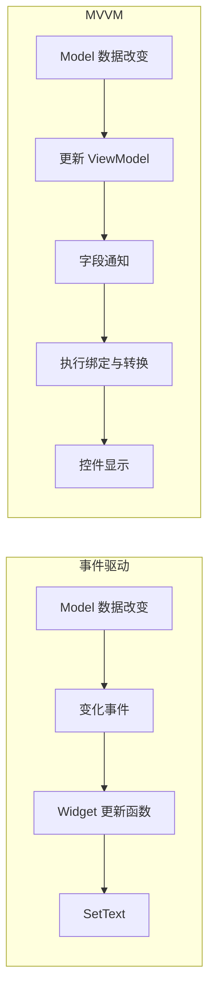
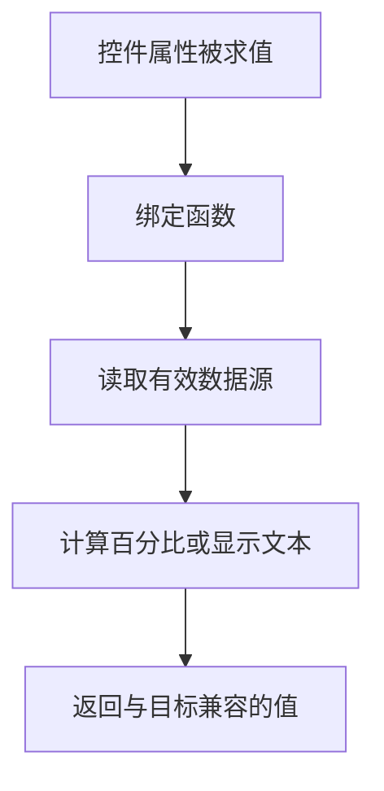
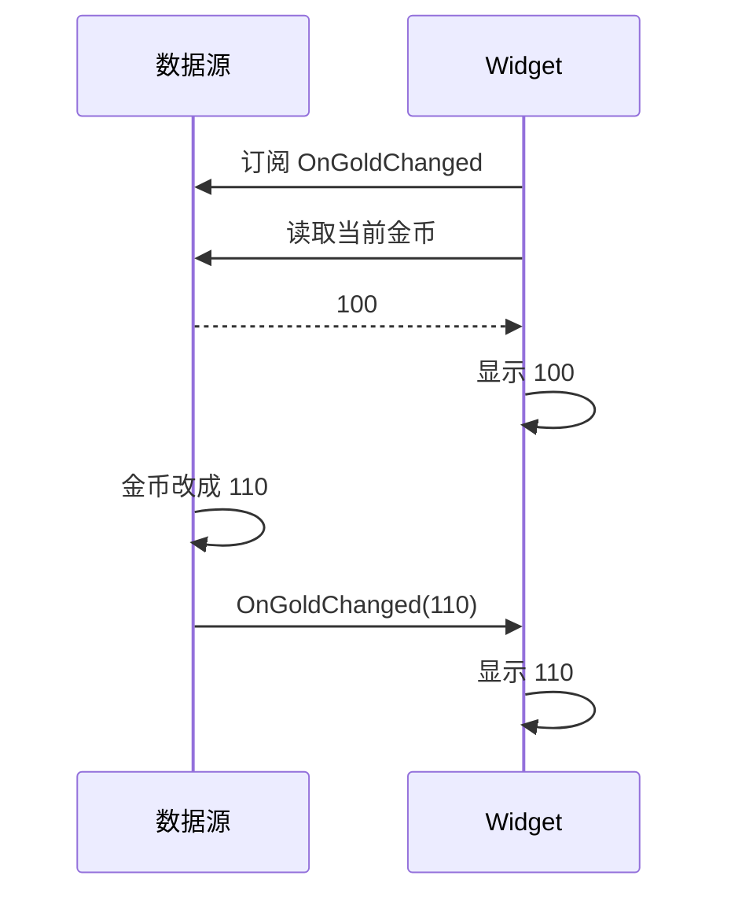
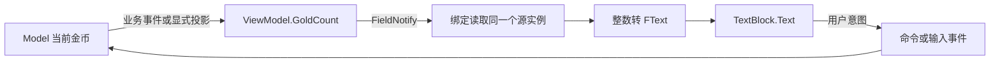
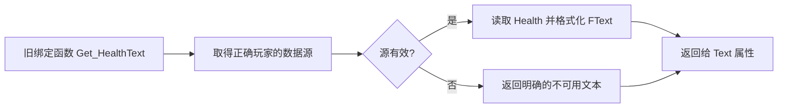
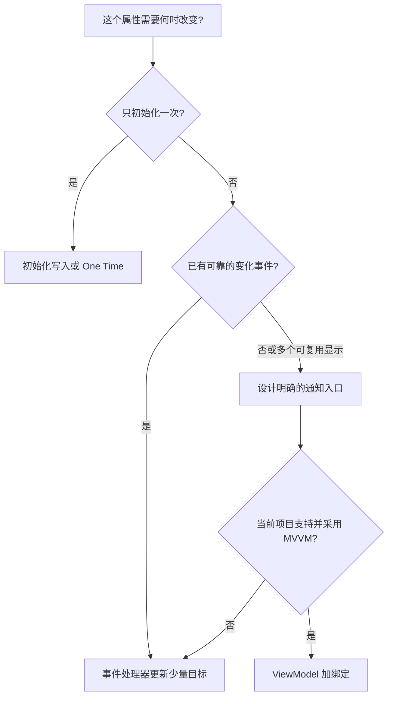

# 02 UI 数据绑定与 MVVM

> 知识成熟度：L2。主要机制已按 Epic 公开文档和 API 选段静态核对；下文操作是待在项目中复现的教学示例，不是已运行结果。
> 版本基准：2026-10-10 实际访问的 Epic 页面标题标示 Unreal Engine 5.8；UMG Viewmodel 页面仍标为 Beta。显式 `application_version=5.8` 链接读取失败，本文采用无版本参数页面，不把它当作不可变版本快照。
> 适用范围：UMG 客户端界面的属性读取、事件刷新和 ViewModel 绑定；前置是会创建 Widget Blueprint、变量和按钮事件。旧 UE4 / 早期 UE5 项目仅作为选型背景，先确认其实际插件与 API。
> 证据边界：本次没有读取 UE checkout、运行 UHT/编译或启动编辑器/PIE；不沿用旧稿的本机安装路径、CL 或运行结论。源码内部实现见关联专题，需另行核对。
> 最后更新：2026-10-10（修正通知、初始化与列表误区，补全金币显示的正常教学路径）。

## 1. 概述

假设玩家金币从 100 变成 110：数据已经正确，屏幕仍可能显示 100。UI 数据同步要解决三个不同的问题：**读谁的值、何时重新读、读完怎样写到控件**。创建一个叫 ViewModel 的对象只解决第一步的一部分。

本文先解释三种方案，再完成一个金币面板：初次打开显示 100，按按钮后显示 110，再次写入 110 不需要重复通知。最后再处理多界面共享、双向输入、列表和退场。它负责使用层；绑定编译器、执行队列和 Trace 全链路分别留给 [UMGMVVM 源码](27-UMGMVVM源码.md) 与 [UI 状态与可观测性闭环](06-UI状态与可观测性闭环.md)。

| 方案 | 谁决定重新读取 | 控件如何得到值 | 适合的起点 |
| --- | --- | --- | --- |
| 传统属性绑定 | UMG 对绑定属性求值 | 绑定函数或属性提供结果 | 认识旧项目和快速原型，需评估轮询成本 |
| 事件驱动 | 业务变化事件 | 处理器调用 `SetText` / `SetPercent` 等 | 少量控件，或已有可靠事件源 |
| MVVM | 字段通知与绑定配置 | 绑定从指定源实例取值、转换、写入目标 | 同一数据驱动多个显示、复杂表单、可复用 UI |



两条路线都需要把业务变化接入 UI。MVVM 减少手工连接每个显示属性的代码，不会替你发现任意 Model 赋值，更不会自动复制服务器数据。

静态版本号直接初始化一次即可；低频变化并不是选择轮询的理由。Epic 的 [UMG 优化指南](https://dev.epicgames.com/documentation/unreal-engine/optimization-guidelines-for-umg-in-unreal-engine?lang=en-US) 建议使用事件更新，避免 raw attribute binding 和无必要的 Tick。对于已有 UE4 项目，可以先把初始化、事件刷新和解绑做好，不必仅为显示金币引入新架构。

## 2. 核心概念（表格）

| 概念 | 在本文里的职责 | 常见混淆 |
| --- | --- | --- |
| Model | 金币、背包等业务事实与规则 | Widget 中的显示副本不是新的业务权威 |
| View | Widget Blueprint 与其子控件 | 显示层仍要处理输入和局部交互 |
| ViewModel | 把业务状态投影成 UI 所需字段与操作入口 | 可以持有显示快照和编辑草稿，不等于复制整套业务系统 |
| Binding Source | 某个运行时对象实例 | 类、类默认值、同类型的另一个实例都不是当前源 |
| Getter / Setter | 读写字段的访问入口 | C++ 直接赋值不会自动经过访问器 |
| FieldNotify | 字段可参与通知的约定 | 标记本身不拦截所有内存写入 |
| Conversion Function | 把源类型转换为目标类型 | `int32` 到 `FText` 不能假定自动且可逆 |
| Delegate / Event Dispatcher | C++ / 蓝图的事件通知手段 | 订阅变化不等于获取当前快照 |
| Dirty Flag | 合并多次变化后再刷新 | 若每帧检查，检查本身仍有成本 |
| List Item / Entry Widget | 数据对象 / 可复用的显示行 | 一百条数据不要求一百个常驻 Widget |

## 3. 原理详解

### 3.1 属性绑定（Widget Binding）

传统的 Details → Bind → Create Binding 会生成返回值函数。例如读取 PlayerState 的 Health，再返回格式化文本。它易于搭建，但数据没变也可能反复求值。不要在 Getter 里扣款、发请求或修改状态，也不要把每次求值等同于整棵 Widget 树都重绘；属性求值、布局失效和绘制是不同阶段。



传统绑定与 MVVM 在某些编辑器位置都出现 Bind。Epic 也支持从 Details 选择 ViewModel 字段；因此判断依据应是实际绑定源和绑定类型。本文统一在 View Bindings 窗口配置，避免交替编辑同一目标。传统属性绑定步骤与限制可对照 [Property Binding](https://dev.epicgames.com/documentation/en-us/unreal-engine/property-binding-for-umg-in-unreal-engine)。

### 3.2 事件驱动刷新（Event-driven Refresh）

事件通知“刚才改变了什么”，快照回答“现在是什么”。只订阅 `OnGoldChanged`，不会补发打开界面以前发生的变化，所以需要**订阅后读取一次当前值**，再靠后续事件更新。



这个顺序假设操作在游戏线程中顺序完成；异步快照与推送的版本竞争属于后续状态闭环专题。事件驱动可省去持续查询，仍有广播、格式化、目标写入和绘制成本，不能称“界面零空闲开销”。

### 3.3 MVVM：值、通知和绑定必须连起来



以 100 → 110 为例：写入口先得到新值，更新 ViewModel，发出 GoldCount 通知；订阅该字段的绑定重新读取值，转换后写入 Text。通知不是把所有业务对象重新扫描一遍，也不保证所有绑定都在 Setter 返回前完成显示。

蓝图的 FieldNotify 变量提供带广播的 Set 节点；C++ 应在 Setter 中显式调用通知宏。`UE_MVVM_SET_PROPERTY_VALUE` 先比较旧值和新值，只有变化才赋值、通知；`UE_MVVM_BROADCAST_FIELD_VALUE_CHANGED` 则表达“这个字段需要重新读取”。因此，把一个已修改的数组与它自身传入比较式 Setter，不是强制刷新办法。宏语义已对照 [UMG Viewmodel：Triggering FieldNotifies with Macros](https://dev.epicgames.com/documentation/en-us/unreal-engine/umg-viewmodel-for-unreal-engine#triggeringfieldnotifieswithmacros) 和 [UMVVMViewModelBase API](https://dev.epicgames.com/documentation/en-us/unreal-engine/API/Plugins/ModelViewViewModel/UMVVMViewModelBase)。

初次显示也需要执行绑定。没有发生一次“变化”并不意味着初值应为空；默认建立正常绑定时要能把已有源值送到目标。反过来，如果选了 One Time，它能解释初次显示，不能解释后续持续刷新。

## 4. 代码 / 蓝图示例

### 4.1 完整正常路径：金币 ViewModel → Widget

这是只需蓝图的教学实验。金币由测试按钮改变，用来隔离并观察 UI 同步链；实际项目应由已有的业务事件更新同一 ViewModel。以下步骤与预期尚未在本轮编辑器中执行。

**准备源数据。** 在测试项目启用 UMG Viewmodel 插件，按编辑器提示完成所需重启。创建父类为 `MVVMViewModelBase` 的蓝图 `VM_Wallet`，添加 Integer 变量 `GoldCount`，默认值设为 100，并启用它的 FieldNotify 铃铛。编译该蓝图；拖出变量的 Set 节点时，应能识别为带广播的设置节点。缺少父类或 View Bindings 窗口时先查插件，不能跳过这一步。

**建立唯一源。** 创建 `WBP_Wallet`，加入一个显示数字的 `TextBlock_Gold` 与一个标为“设为 110”的按钮。打开 Designer 的 Window → Viewmodels，添加 `VM_Wallet`，把源名称明确设为 `Wallet`，Creation Type 选 `Create Instance`。这条路线让每个 Widget 实例使用自己的 ViewModel；后面所有 Get/Set 都从 Widget 的 Variables → Viewmodel 分类取得 `Wallet`，不要额外 Construct 一个同类型对象。

**接通显示。** 打开 Window → View Binding，添加 `TextBlock_Gold` 的 Text 绑定。方向选 `One Way to Widget`，确认该绑定处于启用状态。源需要读取 `Wallet.GoldCount`，目标需要 `FText`：显式选择 `To Text (Integer)` 转换，把转换参数 Value 链接到 `Wallet.GoldCount`，保留其余数字格式默认值。不是把 Value 固定填写成 100。然后编译 Widget，处理所有源路径、目标类型或转换参数错误。

若当前版本的转换候选里找不到该函数，可在 `WBP_Wallet` 新建一个 Pure、Const 函数 `GoldToText`：仅一个 Integer 输入、一个 Text 输出，内部连接 `To Text (Integer)`。在该绑定的 Conversion Functions 中选择它，并把输入链接到同一 GoldCount。这个小包装只做格式转换，不修改 VM、不产生业务事件。整数转换入口可核对 [UKismetTextLibrary API](https://dev.epicgames.com/documentation/en-us/unreal-engine/API/Runtime/Engine/UKismetTextLibrary)。

**触发一次变化。** 在按钮 OnClicked 中，Get `Wallet` → Is Valid → `Set GoldCount` 为 110。使用 VM 的带通知设置节点，不调用 TextBlock 的 SetText。这样按钮只改源数据，显示更新必须经过绑定，才能证明这条教学链接通。

**把面板显示出来。** 在测试地图的本地 PlayerController Blueprint 的 BeginPlay 中，Create Widget，类选 `WBP_Wallet`，Owning Player 接 Self；保存返回值到 `WalletWidget` 变量，再 Add to Viewport。为鼠标测试设置合适的 Game and UI 输入模式、将焦点给该 Widget 并显示鼠标。这里仅描述测试准备，不表示本轮已替项目修改输入或设置。

按下列顺序复现，并在有误的最早一步停止排查：

| 操作 | 预期 | 说明 |
| --- | --- | --- |
| 打开面板，尚未点击 | 显示 100 | 初始绑定读取默认值，不依赖一次额外业务变化 |
| 点击“设为 110” | 显示 110 | 同一源实例发生变化，通知驱动显示 |
| 再点击一次 | 仍显示 110 | 相同状态不要求再次广播；画面相同本身不能证明回调次数 |
| 给该按钮设置节点加断点 | 运行时 Target 是当前 Wallet | 排除“修改了另一个 VM” |
| 临时改成 One Time to Widget，再重新创建面板 | 初值 100；点击后 VM 为 110，文本仍为 100 | 这是方向/模式负向对照，之后恢复 One Way |
| 创建第二个独立 WBP_Wallet，仅修改第一个的 Wallet | 第二个仍显示自己的 100 | Create Instance 没有自动共享数据 |

这组步骤覆盖了完整路径：**创建源 → 建立绑定 → 首次读取 → 改同一源 → 通知 → 转换 → 显示**；是否跑通应以上表的实际复现结果判定。运行时想显示真实金币时，把测试按钮的赋值替换为“Model 事件处理器调用 Wallet 的写入口”，并在接入时读取当前业务快照。

### 4.2 C++ 对照：Getter、Setter 与派生字段

下例是用于同一金币展示的完整类定义示意，文件名为 `WalletViewModel.h`；不是已通过 UHT 的工程交付。模块需已有 Core/CoreUObject/Engine，并按头文件公开使用情况声明 `ModelViewViewModel` 依赖。跨模块使用时还要补本项目导出宏。头文件入口来自 [UMVVMViewModelBase](https://dev.epicgames.com/documentation/en-us/unreal-engine/API/Plugins/ModelViewViewModel/UMVVMViewModelBase)，本轮未读取其实现。

```cpp
#pragma once

#include "CoreMinimal.h"
#include "MVVMViewModelBase.h"
#include "WalletViewModel.generated.h"

UCLASS(BlueprintType, Blueprintable)
class UWalletViewModel : public UMVVMViewModelBase
{
    GENERATED_BODY()

public:
    int32 GetGoldCount() const { return GoldCount; }

    void SetGoldCount(int32 NewValue)
    {
        // 本教学钱包只演示非负余额；真实交易校验仍由 Model 负责。
        const int32 AcceptedValue = FMath::Max(0, NewValue);
        if (UE_MVVM_SET_PROPERTY_VALUE(GoldCount, AcceptedValue))
        {
            // 派生函数不是普通变量访问器，需要单独通知其依赖变化。
            UE_MVVM_BROADCAST_FIELD_VALUE_CHANGED(GetGoldText);
        }
    }

    UFUNCTION(BlueprintPure, FieldNotify)
    FText GetGoldText() const
    {
        return FText::AsNumber(GoldCount);
    }

private:
    UPROPERTY(BlueprintReadWrite, FieldNotify, Getter, Setter,
              meta=(AllowPrivateAccess="true"))
    int32 GoldCount = 100;
};
```

这里有两种有意区分的 Getter。`GetGoldCount` 是 GoldCount 属性的 C++ 访问器，名字与 `Getter` 约定对应；`GetGoldText` 是独立可绑定的派生 FieldNotify 函数。前者不额外标 `UFUNCTION`，避免与属性节点重复；后者必须可反射、Pure、Const、无输入且只返回一个值。使用这份类时可以沿用 §4.1 的 GoldCount 转换，也可以将 Text 直接绑定到 GetGoldText，二选一即可。

`SetGoldCount(110)` 会通知数值及派生文本；再设 110 不进入变更分支。若增加第二个影响显示的字段，它的写入口也必须通知相应派生函数，框架不会从函数体推导 C++ 依赖关系。私有成员使外部代码不能写 `VM->GoldCount = 110` 来绕过 Setter；Getter/Setter specifier 只规定反射访问入口，不改变 C++ 的赋值规则。

### 4.3 手动创建与共享：什么时候不用 Create Instance

两个面板希望读同一个 Wallet 时，分别 Create Instance 会得到两个源。可把源设为 Manual，由本地玩家相关的拥有者创建并持有 VM，再把同一实例提供给两个 Widget。不要为了共享本地玩家数据直接上全局集合，否则分屏或多账号页面可能混用状态。

在 Widget 的 Viewmodels 中把源设为可手动设置；Blueprint 先取得 MVVM Engine Subsystem（`UMVVMSubsystem`），把目标 Widget 接到 `Get View From User Widget` 的 UserWidget 输入。检查返回的 MVVM View 有效后，将它接到 `Set View Model` 的 Target；Name 必须匹配源名 `Wallet`，对象类型必须匹配，并检查返回值。API 位于 [UMVVMSubsystem](https://dev.epicgames.com/documentation/en-us/unreal-engine/API/Plugins/ModelViewViewModel/UMVVMSubsystem) 和 [UMVVMView::SetViewModel](https://dev.epicgames.com/documentation/en-us/unreal-engine/API/Plugins/ModelViewViewModel/UMVVMView/SetViewModel)，不是通用的 `Widget->InitializeViewModel(VM)`。

Manual 源在赋值前为空，UI 应有明确的不可用状态；获得有效源后再允许操作。如果 View 已初始化，SetViewModel 成功会重新执行引用该源的绑定，适合接入已存在的当前值。Name 错误、类型不符或源不可设置时，应修正配置，不要靠每帧重复注入掩盖失败。

拥有者需要通过 GC 可见的强引用保留共享 VM，例如 `UPROPERTY()` 的 `TObjectPtr<UWalletViewModel>`；临时局部裸指针不是长期持有方案，Outer 也不应被当作唯一保活证据。`TWeakObjectPtr` 适合观察而不拥有，不会替你保持 VM 存活。[Object Pointers](https://dev.epicgames.com/documentation/en-us/unreal-engine/object-pointers-in-unreal-engine) 说明了这些差别。释放长期引用后交由 UObject GC 处理，不能对 ViewModel 手工 `delete`。

### 4.4 事件驱动与传统绑定的对照用途

保留事件驱动路线，是为了能在已有项目中完成同一显示目标。下面是数据源的**类内片段**，不是完整 PlayerState 文件；Health 的声明、初值、写入口和广播值都列出，避免示例引用未定义成员。

```cpp
// 类外：动态多播委托声明。
DECLARE_DYNAMIC_MULTICAST_DELEGATE_OneParam(
    FOnHealthChanged, float, NewHealth);

// 以下成员放入已有 AMyPlayerState 的类定义中。
public:
    UPROPERTY(BlueprintAssignable)
    FOnHealthChanged OnHealthChanged;

    UFUNCTION(BlueprintPure)
    float GetHealth() const { return Health; }

    void SetHealth(float NewHealth)
    {
        const float Accepted = FMath::Clamp(NewHealth, 0.0f, 100.0f);
        if (Health == Accepted) { return; }
        Health = Accepted;
        OnHealthChanged.Broadcast(Health);
    }

private:
    UPROPERTY()
    float Health = 100.0f;
```

对应 Blueprint：获得并保存正确玩家的数据源 → Bind Event to OnHealthChanged → 立即 GetHealth 调用同一显示函数。事件参数是 0–100 的血量，本例给 ProgressBar 的 Percent 应用 `Clamp(Health / 100.0, 0, 1)`，不能把 75 直接当 75% 的输入。若最大血量可变，改成除以 MaxHealth 并先处理零分母。蓝图 Event Dispatcher 同样遵守“绑定、初始快照、更新、解绑”的顺序；C++ 采用匹配的 `AddDynamic` / `RemoveDynamic`，动态回调须满足反射要求。[动态委托参考](https://dev.epicgames.com/documentation/en-us/unreal-engine/dynamic-delegates-in-unreal-engine)



上图保留旧项目读码用途：传统函数也要处理空源和类型转换。若迁移为事件刷新，应移除该目标的旧绑定，让一个更新入口负责它，避免 Getter 与手动写入互相干扰。

### 4.5 列表：先分清集合与条目

UListView 使用 UObject 项，Entry Widget 实现 `IUserObjectListEntry`。所以 `TArray<FItemData>` 不能未经适配就当作 UListView 的对象列表。把业务结构投影为稳定的条目对象或条目 ViewModel，再通过 `SetListItems` 或合适的增删接口更新列表；这些是 [UListView](https://dev.epicgames.com/documentation/en-us/unreal-engine/API/Runtime/UMG/UListView) 的公开接口，不需要虚构通用“自动同步容器”。

要分别处理两类变化：

- **集合改变**：新增、删除、换序需要让列表收到新的项集合或对应操作。若用通知字段暴露集合，应在真正变更后通知该字段；C++ 原地修改后可显式广播，或先构造独立的新值再调用比较式 Setter，不能用 `UE_MVVM_SET_PROPERTY_VALUE(Items, Items)`。
- **已有项改变**：对象仍是同一个，数量或名字改变时，由该项字段的通知刷新行。仅通知外层数组不能代替项字段的通知。

Entry 可被回收和分配给另一项；在 `OnListItemObjectSet` 接收当前对象、解除旧项订阅并连接新项。[IUserObjectListEntry API](https://dev.epicgames.com/documentation/en-us/unreal-engine/API/Runtime/UMG/IUserObjectListEntry) 明确该事件对应“被分配新项”。 Entry 收到 `On Entry Released` 时，解除自己登记的当前项订阅并清理该项引用；再次分配新项时重新接入。[IUserListEntry API](https://dev.epicgames.com/documentation/en-us/unreal-engine/API/Runtime/UMG/IUserListEntry) 将该事件定义为 Entry 不再代表任何列表项；这不删除 Item，也不应执行全量 Unbind All。不要把 Entry 的创建/销毁当作业务条目的创建/删除，也不要要求每个显示行自行创建并拥有一份唯一业务 VM。MVVM 编辑器内具体集合字段、转换与列表适配，应在目标项目确认能编译后使用；本节不声称一条数组绑定就包办全部增量同步。

### 4.6 调试入口：沿一次值传播找断点

先观察当前 Wallet 的身份和 GoldCount，再看设置节点、源通知、绑定启用状态、转换输入和 Text 目标。源码断点定位留给 [UMGMVVM 源码](27-UMGMVVM源码.md)，不要把公开 API 路径当作本轮已读实现。

| 问题 | 先收集什么 | 工具的证据限度 |
| --- | --- | --- |
| 点按钮没变化 | OnClicked 是否执行；目标 VM 是否为当前源 | Blueprint 断点与变量值最直接 |
| VM 已变、显示没变 | One Way/One Time、FieldNotify、类型转换、编译错误 | 逐级排除，不能只看最终画面 |
| 更新时卡顿 | 空闲与相同变更负载下的 CPU/UI 时间 | `stat unit`、`stat slate` 等是定位入口，细分成本用项目可用的 Insights/Slate 工具 |
| 重开页面后次数增加 | 每次操作的应用回调数、源/页面实例数 | `obj list class=UserWidget` 等对象清单只是线索，存在对象不等于泄漏 |
| 列表旧内容串行 | 当前 Item 对象与 Entry 的分配记录 | 检查旧项解绑和新项绑定，不以 Entry 数代替数据项数 |

`stat unit` 与 `stat slate` 的用途已核对 [Stat Commands](https://dev.epicgames.com/documentation/en-us/unreal-engine/stat-commands-in-unreal-engine)，上表命令未在本轮执行；构建配置、统计组、日志类别和 CVar 的实际可用性须在项目中确认。旧稿的 `stat UMG`、`log LogMVVM Verbose` 与 `Slate.EnableInvalidationPanels 0` 不再作为普遍有效的必做步骤；尤其不应靠关闭失效机制来证明某一条绑定正确。工具主责见 [Profiling](../../08-工程实践与质量/调试与性能分析/03-性能分析工具与Profiling.md)。

## 5. 最佳实践

### 5.1 选型与更新预算



数据权威只保留一处，但允许 VM 持有只读投影、格式化结果与尚未提交的编辑状态。让业务层决定一笔购买是否成功；VM 暴露“正在请求/失败原因/当前金币”，View 决定如何显示。不要把任何业务写入都塞进格式化函数。

对连续变化可以合并刷新。旧脏标记思路仍有用，但处理器必须保留最新数据，刷新一次后清除脏位；下面是依赖已有 UHUDWidget 声明的局部片段，本轮未编译：

```cpp
void UHUDWidget::OnHealthChanged(float NewHealth)
{
    PendingHealth = NewHealth;
    bHealthDirty = true;
}

void UHUDWidget::NativeTick(const FGeometry& Geometry, float DeltaSeconds)
{
    Super::NativeTick(Geometry, DeltaSeconds);
    if (bHealthDirty)
    {
        bHealthDirty = false;
        UpdateHealthDisplay(PendingHealth);
    }
}
```

该片段假设已声明 PendingHealth、bHealthDirty 和 UpdateHealthDisplay，并在首次连接数据源时初始化它们。它省的是一帧内重复的昂贵显示处理，不会消除 Tick 检查，也会推迟显示。先测格式化/绑定/布局成本，再决定是否合并。旧稿的“20 个绑定、50 个控件、1000 次广播”等无项目依据的数字不能作为通用红线；预算应来自目标设备、页面负载和可接受的响应延迟。

### 5.2 单向、双向与重入

金币只读显示使用 One Way to Widget；只需要初次拷贝选 One Time。输入控件向 VM 写入时，源控件必须支持相应通知，VM 字段必须允许写入，类型和转换必须满足该方向。仅把方向切为 Two Way 并不能让所有 TextBlock 属性变成用户输入源。

双向编辑有三个问题要独立回答：初始值由谁给、输入什么时候提交、无效输入怎样展示。比如“1,000 金币”是显示文本，不应直接反向解析成业务余额。可用独立编辑草稿承接输入，提交时校验，成功后从 Model 重新投影；失败保留错误信息而不修改权威数据。

Setter 先规范化再比较，只有接受后的状态改变才通知。转换函数保持无副作用；不要在 A 的显示转换里设置 B，再由 B 回写 A。如果来回舍入造成两个值震荡，修正单位、精度和规范值规则。若具体控件会在程序更新时触发输入事件，应区分程序刷新与用户提交，在必要的短作用域内防止应用处理器重入；不要把“引擎可能检测递归”当作业务不会循环的保证。

### 5.3 退场与重新进入

连接的有效期应与数据需求一致。页面暂时不可见但仍存活时，也可能需要停止业务订阅；数据源替换时应先解除旧源、接入新源，再读取新快照。一个页面的订阅不应替其他页面执行全量 Unbind All。

`Construct` 和 `Destruct` 可以重复发生，不能分别等同于 UObject 只创建一次、永久销毁一次；这是 [Construct](https://dev.epicgames.com/documentation/en-us/unreal-engine/API/Runtime/UMG/UUserWidget/Construct) 与 [Destruct](https://dev.epicgames.com/documentation/en-us/unreal-engine/API/Runtime/UMG/UUserWidget/Destruct) 的公开说明。若在这对事件中管理自己的绑定，就让重复进入保持幂等；重新加入时也要刷新快照。

框架管理的 MVVM 源订阅与业务自行绑定的 Model 委托要分别负责。保留对称解绑，是为了停止无用工作、避免重复回调和旧源污染；不能声称每个未解绑的 UObject 委托都会调用已销毁对象。`AddUObject`、弱 Lambda 与 `AddRaw` 的有效性语义不同，详见 [Multicast Delegates](https://dev.epicgames.com/documentation/unreal-engine/multicast-delegates-in-unreal-engine?lang=en-US) 与 [委托事件与对象通信](../../03-引擎架构与资源系统/模块化框架与对象通信/04-委托事件与对象通信.md)。网络回调、页面代次和本地玩家切换的完整合同交由 [UI 状态闭环](06-UI状态与可观测性闭环.md)，不在初学例上另造框架。

## 6. 常见问题 FAQ

### Q1：绑定函数反复执行，性能差怎么办？

确认是传统属性轮询还是主动通知过密。把静态值改为初始化写入；有变化事件时按事件更新。已经是 MVVM 时，检查更新模式和冗余广播，再测转换与布局成本。仅把函数改名为 Refresh 并不会改变它的触发频率。

### Q2：关闭 Widget 后仍有回调怎么办？

先区分对象已销毁、Slate 资源退场、页面仍存活但隐藏。检查应用绑定是否对称解除、是否重复登记、是否连接了旧数据源，并确认没有不安全的裸指针捕获。Weak Pointer 只解决引用有效性的一部分，不表达“该页面仍应该接收这个结果”。

### Q3：MVVM 能显示初值，但之后不刷新？

按顺序核对：修改的是当前 Wallet 吗？是 One Way 而非 One Time 吗？设置经过通知入口了吗？绑定是否启用且编译通过？转换参数链接到了字段还是写死的常量？不要通过另建 VM 或调用不存在的 InitializeViewModel 来试错。

### Q4：数组已经改了，列表为什么没变？

原地 Add 不等于发出集合通知；自身赋值也不能使比较式 Setter 发现旧状态。还要确认送给 UListView 的是 UObject 项，以及改的是集合还是某个 Item 字段。行被复用时重新连接当前 Item，不能只在行的 Construct 读取一次。

### Q5：MVVM 与 CommonUI 能一起用吗？

职责可以互补：CommonUI 管页面激活、输入与焦点，MVVM 管字段同步。集成时确认页面激活/退场和数据接入时机；仅加入两个插件不等于这条链已验证。继续阅读 [CommonUI 输入路由与焦点管理](07-CommonUI输入路由与焦点管理.md)。

### Q6：UE4 项目是否需要迁移 MVVM？

以成本和问题为依据。事件驱动可先解决当前刷新需求；迁移前确认引擎版本、可用插件、资产改造和回归范围。本文只核对所列 5.8 公开页面，不把“UE5.1+”当所有小版本行为一致的承诺。

### Q7：返回自定义类型能绑定吗？

首先必须对反射系统可见，并满足读取、目标写入和转换兼容性。不是任意 Blueprint 类型都能直接填入任意控件属性。显示文字优先使用 FText；格式化函数无副作用，且输入变化需要能触发重新求值。

### Q8：多个界面怎么共享数据？

共享 Model，按需要共享同一个 VM，或各自持有显示投影。前者要显式注入同一实例，后者要给每个投影接入通知与初始快照。Global Collection、Property Path 和 Manual 是不同的取源策略，不是“绑定类相同就自动共享”。

## 7. 关联阅读与前后置专题

- [01-UMG框架与控件系统](01-UMG框架与控件系统.md)：控件层级、布局系统与失效面板基础。
- [03-性能分析工具与Profiling](../../08-工程实践与质量/调试与性能分析/03-性能分析工具与Profiling.md)：属性求值、绑定与渲染开销的 Profiling 判读。
- [04-渲染与加载性能优化](../../08-工程实践与质量/调试与性能分析/04-渲染与加载性能优化.md)：UI 渲染合批与虚拟化列表性能调优。
- [06-UI状态与可观测性闭环](06-UI状态与可观测性闭环.md)：页面、输入、异步数据与证据的跨系统闭环。
- [12-27 UMGMVVM源码](27-UMGMVVM源码.md)：源码层的 source、字段通知、绑定执行与生命周期；本文不复述其实现结论。
- [12-49 Lyra-UI控件与表现源码](49-Lyra-UI控件与表现源码.md)：项目 UI 表现层的后续阅读入口，本文未重新核对 Lyra。
- [03-游戏玩法编程/04-委托事件与对象通信](../../03-引擎架构与资源系统/模块化框架与对象通信/04-委托事件与对象通信.md)：委托和不同引用方式的有效性边界。
- [Epic：UMG Viewmodel](https://dev.epicgames.com/documentation/en-us/unreal-engine/umg-viewmodel-for-unreal-engine)：本轮核对 Required Setup、Blueprint/C++ FieldNotify、Creation Type、View Bindings、Direction、Conversion 与 Arrays 选段。
- [Epic API：ModelViewViewModel 模块](https://dev.epicgames.com/documentation/en-us/unreal-engine/API/Plugins/ModelViewViewModel)：模块导航；本文实际逐项核对的是上文链接的 ViewModelBase、Subsystem 与 SetViewModel API。
- [Epic API：UListView](https://dev.epicgames.com/documentation/en-us/unreal-engine/API/Runtime/UMG/UListView)：对象项和虚拟化 Entry。

## 8. 验证建议与证据范围

本轮完成的是公开资料核对、例子设计与静态阅读；没有观察到上述 UI 运行结果，不填运行成功或独立审核的 verified 事件。公开 API 页面给出了声明及源码位置，不能代替实现文件阅读。

复现时先执行 §4.1 的初值、单次更新、同值更新和 One Time 负向对照，再补：Manual 空源/错误名注入应可诊断；正确替换源应显示新快照；双向输入的无效文本不得提交；关闭重开不应累积应用订阅；列表换项后旧 Item 的变化不得污染新行。用断点或计数判断通知和处理次数，不能由同一幅画面推断只有一次调用。

网页读取限制也属于证据边界：显式 5.8 参数页、`Conv_IntToText` 单函数页读取失败；前者改用标题标示 5.8 的正文，后者通过 UKismetTextLibrary 类页核到签名。`GetViewFromUserWidget` 单函数页未给出有效正文，使用 Subsystem 类页核对。执行模式搜索返回过 5.7/5.5 页面，因此未把其枚举细节写成 5.8 已核对结论；目标项目需要时应另查本版本。未读取任何 UE 私有源码，也未更改项目插件、输入、编译或运行设置。

*下一篇：[03-性能分析工具与Profiling](../../08-工程实践与质量/调试与性能分析/03-性能分析工具与Profiling.md) —— 定位 UI 与渲染瓶颈。*
