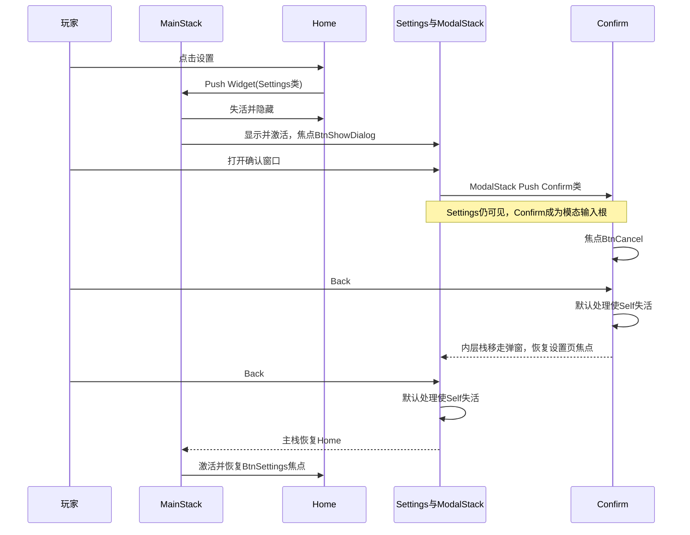
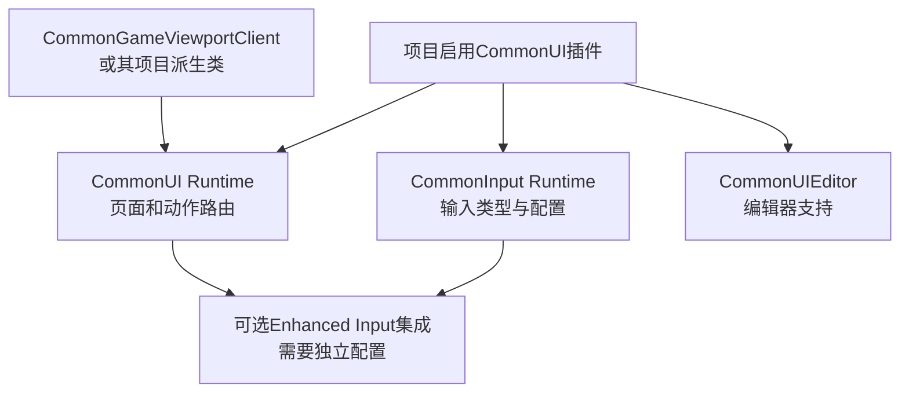
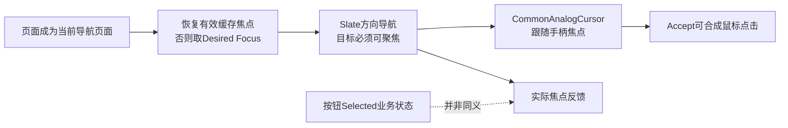

# 07 CommonUI 输入路由与焦点管理（CommonUI Input Routing & Focus Management）

> 知识成熟度：L2。已核对下列官方文档和公开 API；完整案例是按这些契约编排的蓝图接线方案，尚未在 UE 中搭建或运行。
> 版本基准：正常案例固定为 UE 5.6 官方 Quickstart、Input Technical Guide 及 API 属性文档，2026-10-10 核对；5.8 默认 API 页面仅作接口补核，不表示本案例已验证跨版本兼容。
> 适用范围：单个本地玩家的前端菜单、模态 UI、键鼠与手柄导航。项目已有的复杂输入域、分屏、异步页面和真实设置保存需另行接入。
> 事实边界：本轮未读取 UE 安装目录或 `Engine/Build/Build.version`，未执行插件启用、项目设置、蓝图编译、PIE、打包或目标实验。旧稿的 UE 5.8.0 / CL 55116800 / `++UE5+Release-5.8` 是历史来源记录，不是本轮机器的观察。
> 最后更新：2026-10-10。补全正常导航案例，修正 Back、栈接口、焦点恢复及 Enhanced Input 的适用口径。

## 先解决一个具体问题

玩家从首页进入设置，再打开一个确认窗口。此时背后的设置页仍然可见，却不能抢走确认窗口的返回键；按一次返回只关闭确认窗口，焦点回到刚才打开它的按钮，再按一次返回才回首页。

只用 `Add to Viewport`、`Set Visibility` 和零散的 `Set Input Mode` 很容易做出“看起来关了，输入还在”的页面。CommonUI 把页面的**激活状态**、**输入接收者**和**焦点目标**联系起来；容器负责页面切换，页面说明自己需要什么输入与焦点。本篇从可跟做的菜单开始，再解释这些机制。

### 核心概念

| 对象 | 本例中的职责 |
| --- | --- |
| `UCommonGameViewportClient` | 让视口输入经过 CommonUI 路由；项目自定义视口也应继承它 |
| `UCommonActivatableWidget` | 首页、设置页、确认窗口的基类；激活不等于创建，失活不等于销毁 |
| `UCommonActivatableWidgetStack` | 同一栈只显示并激活栈顶；栈顶失活后移走它并恢复前一项 |
| `UCommonButtonBase` | 可点击、可聚焦的按钮；焦点、悬停、选中是不同状态 |
| `FUIInputConfig` | 页面请求的 UI/游戏输入模式、鼠标捕获、移动/视角忽略配置 |
| `UCommonUIActionRouterBase` | 按本地玩家组织激活节点、选择输入接收者并应用配置 |
| `UCommonInputSubsystem` | 当前键鼠、手柄或触控输入类型；供提示图标等表现使用 |
| Click / Back | 本例由 CommonUI Input Data 的 DataTable 行定义，不是玩法 `UInputAction` |

## 完整案例：主页 → 设置 → 确认窗口 → 两次返回

下面是**准备给读者在 UE 5.6 中执行的步骤**，不是本轮运行记录。先做纯前端 UI，所有页面都使用 Menu 输入模式；不会暂停世界，也不会修改实际用户设置。确认窗口的两个按钮只打印选择并关闭，业务保存可在正常导航验证后接入。

### 1. 准备输入配置

1. 在项目的 Plugins 中启用 Common UI，按编辑器提示重启。纯蓝图案例不需要编辑 `Build.cs`；C++ 模块依赖不能代替插件启用。
2. 在 Project Settings → Engine → General Settings 将 Game Viewport Client Class 设为 `CommonGameViewportClient`。已有自定义视口时保留其职责并检查继承链，不直接丢弃项目类。
3. 新建 Data Table `DT_UIActions`，行结构选 `CommonInputActionDataBase`。添加 `Click`、`Back` 两行：Click 的键盘键为 Enter、手柄键为 Gamepad Face Button Bottom；Back 的键盘键为 Escape、手柄键为 Gamepad Face Button Right。各行使用普通按下行为，不配置 Hold。
4. 新建以 `CommonUIInputData` 为父类的蓝图 `BP_UIInputData`。其 Default Click Action 指向 `DT_UIActions / Click`，Default Back Action 指向 `DT_UIActions / Back`；在 Project Settings → Game → Common Input Settings → Input Data 选择该类。
5. 本例使用上述 DataTable 路径，保持 Common Input Settings 的 Enable Enhanced Input Support 关闭。游戏项目即使使用 Enhanced Input 处理玩法，也不意味着必须同时切换本例的 UI 动作来源。

这些资产与配置位置来自 [Quickstart 第 1–3 节](https://dev.epicgames.com/documentation/en-us/unreal-engine/common-ui-quickstart-guide-for-unreal-engine?application_version=5.6)。显示平台按键图标另需 Controller Data，见后文；暂时没有图标，不应靠改路由或添加全局原始按键监听来“补救”。

### 2. 创建页面和承载它们的 Host

先创建 `WBP_MenuButton`，父类选择 `CommonButtonBase`，内部放一个 Text Block，并勾选该 Text Block 的 Is Variable，以便从 Pre Construct 取得它的引用。添加可在实例上编辑的 Text 变量 `Label`，Pre Construct 中把它赋给 Text Block；文本控件设为不参与命中测试。按钮 Is Focusable=true、Is Enabled=true、Is Selectable=false，Triggering Input Action 留空，Is Persistent Binding=false。本例用实际获得焦点的按钮接受通用 Click，不让每个按钮同时注册一份全局 Click。

可创建一个 `CommonButtonStyle` 蓝图作为 Style，使 Normal/Hovered/Pressed 外观明显不同。外观用来帮助观察，不能用 Selected 颜色代替实际焦点检查。随后按表创建 Widget Blueprint，页内的按钮均为 `WBP_MenuButton` 实例，并勾选 Is Variable：

| 资产 | 父类与 Designer 层级 | 用途 |
| --- | --- | --- |
| `WBP_Host` | `UserWidget`；全屏 Overlay → `MainStack`（Common Activatable Widget Stack） | 固定挂在视口，持有主页面栈 |
| `WBP_Home` | `CommonActivatableWidget`；背景 + `BtnSettings`（Label=设置） | 主栈的永久根页 |
| `WBP_Settings` | `CommonActivatableWidget`；全屏 Overlay 的下层为菜单面板，上层为 `ModalStack` | 菜单面板放 `BtnShowDialog`（打开确认窗口）、`BtnBack`（返回） |
| `WBP_Confirm` | `CommonActivatableWidget`；全屏 Overlay → 遮罩与居中对话框 | 对话框放说明文字、`BtnCancel`（取消）、`BtnConfirm`（确认） |

将 `MainStack` 与 `ModalStack` 的 Is Variable 也勾选，保证后续事件图能取得对应栈引用。`WBP_Host.MainStack` 的 Root Content Widget Class 设为 `WBP_Home`。`WBP_Settings.ModalStack` 不设 Root Content；它只在有弹窗时承载内容。两个栈的槽都横纵 Fill，Transition Duration 暂设 0，让首次验证不用混入转场时序。Host、布局 Overlay 和空的 ModalStack 使用 Not Hit-Testable (Self Only)，允许子控件接收输入；不要把整个子树设为 Not Hit-Testable。

确认窗口应填满 ModalStack，遮罩覆盖全屏，窗口本身保持 Visible 并开启 Consume Pointer Input。这样鼠标点在对话框外的遮罩区域，也不会落到设置页按钮。`Is Modal` 管动作路由，布局命中与指针消费管鼠标路径，两者都要做。

为什么把 ModalStack 放在设置页里？主栈 Push 设置页会替换首页；弹窗却应叠在设置页上，因此用内层的另一个栈。**把弹窗 Push 到 MainStack，主栈会停用并隐藏设置页**，无法得到本例要的可见背景。这来自 [Stack 的顶层显示规则](https://dev.epicgames.com/documentation/en-us/unreal-engine/python-api/class/CommonActivatableWidgetStack?application_version=5.6)。

### 3. 给每页明确的输入与焦点

在三个 Activatable 页面 Class Defaults 配置：

| 设置 | Home | Settings | Confirm |
| --- | --- | --- | --- |
| Auto Activate | false，由栈管理 | false，由栈管理 | false，由栈管理 |
| Supports Activation Focus | true | true | true |
| Auto Restore Focus | true | true | true |
| Is Back Handler | false，根页不继续退 | true | true |
| Is Modal | false | false | true |
| Get Desired Focus Target 返回 | `BtnSettings` | `BtnShowDialog` | `BtnCancel` |

通过 Functions → Override 实现 `Get Desired Focus Target`，从 Designer 中拖出表里的按钮引用接到返回值。目标必须已存在、可见、启用且能聚焦。把 Cancel 作为弹窗默认焦点，是这个确认界面的设计选择，不是引擎强制规则。

再实现各页的 `Get Desired Input Config`，用 Make UIInputConfig 返回：Input Mode=Menu，Mouse Capture Mode=No Capture，Mouse Lock Mode=Do Not Lock，Hide Cursor During Viewport Capture=false，Ignore Move Input=true，Ignore Look Input=true。结构字段依据 [UIInputConfig 的 5.6 属性](https://dev.epicgames.com/documentation/en-us/unreal-engine/python-api/class/UIInputConfig?application_version=5.6)。

这里直接继承 CommonActivatableWidget，不经过自定义 C++ 页面基类；若项目基类已给出 native focus/config 返回值，蓝图 fallback 未必会覆盖它，应先核基类。不要在 Construct、Tick 或每次点击中反复调用 `Set Keyboard Focus` 和 `Set Input Mode` 与 Router 争抢状态。

Settings 的两个按钮在 Designer 的 Navigation 中互设 Up/Down Explicit 目标，Left/Right=Stop；Confirm 的 Cancel/Confirm 互设 Left/Right Explicit，Up/Down=Stop。单按钮 Home 的四方向设 Stop。这样方向输入的目标由本例明确给出，排除布局距离带来的偶然导航。

### 4. 接上创建入口与打开按钮

创建 `BP_UIPlayerController`（PlayerController）和 `BP_UIGameMode`（GameModeBase），把 GameMode 的 Player Controller Class 指到前者，在案例关卡 World Settings 选择该 GameMode。控制器添加 `UIHost` 变量，类型是 `WBP_Host` 对象引用。

控制器 Event Graph 的执行线按这个顺序接：

```text
Event BeginPlay
  → Is Local Controller 为 true
  → UIHost 无效时：Create Widget
       Class = WBP_Host
       Owning Player = Self
  → 将返回对象赋给 UIHost
  → UIHost.Add to Viewport
```

主栈按 Root Content 配置产生 Home；不要再手动 Create/Push 第二个 Home。Host 是普通 UserWidget，不需要 `Activate Widget`；激活的是它所承载的页面。控制器持有 Host 是为了访问这个特定玩家的栈，不用 `Get All Widgets of Class` 找碰巧存在的 UI。

在 Host 创建自定义函数 `OpenSettings`：读取 `MainStack.Get Active Widget`，只有它能 Cast To `WBP_Home` 时才从 MainStack 引用拖出 **Push Widget** 节点，Widget Class=`WBP_Settings`。这也阻止连续点击生成重复设置页。Push 接收类，由容器创建或从池中取得实例；不用先 `Create Widget` 再把对象塞给它。[容器接口](https://dev.epicgames.com/documentation/en-us/unreal-engine/python-api/class/CommonActivatableWidgetContainerBase?application_version=5.6)及 [Push Widget 的公开签名](https://dev.epicgames.com/documentation/unreal-engine/API/Plugins/CommonUI/UCommonActivatableWidgetContaine-/BP_AddWidget)支持这一点。

控制器创建 `OpenSettings` 函数：`Is Valid(UIHost)` 为 true 时调用 `UIHost.OpenSettings`。Home 中 `BtnSettings` 的 On Clicked 接 `Get Owning Player → Cast To BP_UIPlayerController → OpenSettings`。没有 Owning Player 或 Cast 失败时输出错误并停止该次打开，不回退到全局 Player 0。

Settings 中 `BtnShowDialog.On Clicked`：`ModalStack.Get Active Widget` 无效时，调用该栈的 Push Widget，Class=`WBP_Confirm`。Settings 的 `BtnBack.On Clicked` 调用 **Self.Deactivate Widget**。Confirm 两个按钮分别 `Print String("Cancel")` / `Print String("Confirm")`，随后各自 `Self.Deactivate Widget`。本例没有真实“重置设置”副作用。

Push 的返回实例不保存为下次可复用的页面；容器会池化，下一次可能是同一实例，也可能不是。需要传业务数据时每次初始化，不把 Construct 当作每次打开的刷新事件；本例没有必须在激活前注入的可变数据。

### 5. 返回键为什么只退一层

本例**不覆写 On Handle Back Action**：Settings 和 Confirm 的 Is Back Handler=true，默认 Back 行为会让接收它的页面失活；所在 Stack 随后移走这个栈顶并恢复前一个页面。Home 不处理 Back，永久根不会被退出。

当 Confirm 存在时，它被设为模态输入根，Settings 虽仍可见并保持激活，Back 应交给 Confirm。关闭 Confirm 后 ModalStack 变空，Settings 重新成为当前导航页面。第二次 Back 才让 Settings 失活，MainStack 显示 Home。两个页面都可声明 Is Back Handler，**不需要每次手动把其他页面的标志改为 false**；真正要核对的是当前激活层级、模态性及动作路由。[Activatable 的默认行为与属性](https://dev.epicgames.com/documentation/en-us/unreal-engine/python-api/class/CommonActivatableWidget?application_version=5.6)给出这些职责。

`On Handle Back Action` 返回 true 表示自定义逻辑已经处理了返回，不能用这个布尔值代表“页面已关闭”。例如稍后接入“有未保存修改时先询问”时，可保持页面激活、打开确认窗口并返回 true；确实需要退页的分支应执行 Deactivate Widget。只返回 true、没有任何状态改变的自定义实现，会表现为返回键被吞。



图中“恢复”有前提：页面仍有效，恢复目标仍可聚焦，且没有另一个系统在抢焦点。Auto Restore Focus 优先使用页面保存的有效目标；候选失效时才回退到 Get Desired Focus Target。它不是“当前弹窗一失活就无条件把焦点写回某个按钮”的全局开关。

### 6. 按可观察结果检查接线

以下为**预期记录**。可给三页 On Activated / On Deactivated 各加一条 Print String，给按钮的焦点事件加上按钮名称，观察实际路由；激活日志不等于焦点日志。先用 Standalone Game 或游戏窗口验证，编辑器的 Escape 可能先结束 PIE；不要把编辑器快捷键截获误判为 CommonUI Back 失效。

| 操作 | 栈与页面预期 | 焦点与结果预期 |
| --- | --- | --- |
| 首次进入 | MainStack=Home；没有 Modal | Home 的 BtnSettings 获焦；Menu 配置 |
| Click 设置 | MainStack 栈顶=Settings，Home 失活 | BtnShowDialog 获焦；方向键能在其与 BtnBack 间切换 |
| Click 打开确认窗口 | MainStack 仍为 Settings；ModalStack=Confirm | BtnCancel 获焦；左/右切换取消和确认 |
| 弹窗在场时点设置页原按钮位置 | Confirm 仍在，设置页可见 | 背后按钮不得收到 Click；不再 Push 第二个弹窗 |
| 第一次 Back | ModalStack 为空；Settings 仍是主栈页面 | 焦点回 BtnShowDialog；MainStack 不应回 Home |
| 第二次 Back | Settings 失活，MainStack 恢复 Home | 焦点回 BtnSettings；Menu 配置仍有活跃根提供 |
| 再开一次设置和弹窗 | 重新 Push 两个页面 | 路径可重复，没有重复 Host、隐藏弹窗或失效焦点引用 |

先用鼠标把按钮接线跑通，再用手柄从头完成同一条链；鼠标成功不能证明焦点导航成功。最后试一组关键反例：让 Confirm 的 Get Desired Focus Target 返回空，并在该 Confirm 实例上调用 Clear Focus Restoration Target（`ClearFocusRestorationTarget`）清除恢复焦点缓存，比较首次进入时的焦点；再恢复正确按钮。另把自定义 Back 临时改成只返回 true，比较页面不退与默认失活的差异。反例只在读者的隔离案例中做，不作为本轮已经执行的测试。

**此时完成的是 UI 导航设计，不是玩法停用或业务授权。** `Menu`/Ignore Move/Look 是输入策略，世界仍可能 Tick、AI 仍可能运行，已排队的业务命令也不会被撤销。真实“暂停”“保存”“购买”要由对应业务系统决定；网络权限也不会因为按钮不可点而自动成立。

## 原理：从激活状态到输入接收者

### 插件、视口与模块各管什么



插件启用使项目加载对应插件；`Build.cs` 决定 C++ 模块依赖；Game Viewport Client Class 决定实际运行时入口，三者不能互相替代。旧稿 `CommonUI.uplugin` 的 `EnabledByDefault=false`、VersionName=1.0 是旧环境描述；本例要求读者显式检查项目启用状态，不把历史默认值写成所有版本的保证。

C++ 项目若要在公开头文件使用 CommonUI 类，需要配置对应模块依赖；例如 UMG、CommonUI、CommonInput，只有实际使用 Enhanced Input 或 GameplayTags 类型时再核相应依赖。构建相关操作须在目标项目另验，本篇不提供一个脱离模块边界的“通用 Build.cs 清单”。

### 栈、激活树、Slate 焦点不是同一对象

Stack 管显示次序及激活。Action Router 根据激活节点与绘制层级处理动作，失活页面不会像活跃页面一样参加路由。Slate 负责焦点导航和指针命中；手柄确认还可能经过合成鼠标点击。故“按钮能被鼠标点到”“CommonUI 页面已激活”“按钮实际有焦点”是需要分别观察的事实。[Input Technical Guide](https://dev.epicgames.com/documentation/en-us/unreal-engine/commonui-input-technical-guide-for-unreal-engine?application_version=5.6)



原稿“手柄走焦点、键鼠走指针”适合作为入口理解，但不能划成两个互不相交的系统：键盘也使用焦点导航，手柄确认可能合成指针事件。聚焦按钮不自动等于 Selected，设置 Selectable、Should Select Upon Receiving Focus 等选项才会连接这些表现。

### 输入配置与返回后的恢复

| 配置项 | 使用层含义 |
| --- | --- |
| `InputMode` | Menu、Game、All 表达 UI/游戏输入策略；不是对所有自定义输入预处理器或业务调用的安全屏障 |
| `MouseCaptureMode` / `MouseLockMode` | 鼠标是否被视口捕获、锁定；全屏菜单通常需自由点击 |
| `bHideCursorDuringViewportCapture` | 捕获期间光标是否隐藏，不能代替明确捕获策略 |
| `bIgnoreMoveInput` / `bIgnoreLookInput` | 控制器移动/视角输入忽略策略，不等同暂停整个游戏 |

菜单返回后，应由重新成为当前页面的下层控件提供输入配置。本文保留 Home 永久根，且明确返回 Menu；如果把它改成游戏 HUD，则要为活跃根明确提供 Game 或 All 及相应捕获策略，并另验从菜单恢复玩法的路径。不能依赖“所有 Activatable 都失活后自动恢复到 UI 打开前的配置”：5.6 官方 `bp_get_desired_input_config` 文档明确不保证这种恢复。

`Supports Activation Focus=false` 可用于不参与页面导航、也不负责输入配置的工具子控件；因此“每个 Activatable 都必须覆写 Focus 和 Config”过强。负责接管输入的页面应明确策略，工具子控件则应说明如何继承。`RequestRefreshFocus` 适合当前页面的目标后来才可用的情况，不应每 Tick 调用抢焦点。

### 输入类型、动作域与高级绑定

`UCommonInputSubsystem` 提供当前输入类型（MouseAndKeyboard、Gamepad、Touch）的查询和变化通知，常用于切换提示图标。输入类型变化与页面授权分开；不能仅凭当前显示手柄图标就认定只接受该设备输入。旧稿列出的 `GetCurrentInputType`、`OnInputMethodChanged`、`ShouldShowInputKeys`、Thrashing 配置是继续研究的接口线索，本轮没有重新核对其 5.8 默认值或所有签名。

Action Domain 处理多个活跃 UI 区域之间的动作流转，例如 HUD 与菜单并存时的域顺序、域间 Behavior 与域内 InnerBehavior。它不替代单一菜单的 Stack，也不替代 Slate 指针命中。本例不配置 Action Domain；先把默认路由正常路径验证完整，再为确有并行操作需求的区域设计域。[源码专题](26-CommonUI源码.md)保留 `UCommonInputActionDomain` / Table、`FUIActionBinding` / `FBindUIActionArgs`、Hold 等深读入口，源码版本说明由该文自行负责。

旧稿 `FUIActionBinding::TryCreate` 片段只说明底层绑定对象如何构造，没有完整展示注册、所有权和注销，不能当成可直接粘贴的 Back 教程。本例使用 Activatable 默认 Back；C++ 自定义动作请按目标版本公开的注册接口、Handle 生命周期和对应事件链完整接入后再发布为实现例。

## 与 Enhanced Input 的协作边界

CommonUI 决定哪个 UI 页面处理动作、哪项输入配置生效；Enhanced Input 负责 IA、IMC、触发器等输入动作机制；业务层决定这次操作是否可执行。把 IMC 优先级调高并不能取代模态层与焦点设置，CommonUI 消费一次 Back 也不等于撤销已经触发的游戏命令。

需要 UI 使用 Enhanced Input 时，按[版本化官方集成指南](https://dev.epicgames.com/documentation/en-us/unreal-engine/using-commonui-with-enhnaced-input-in-unreal-engine?application_version=5.6)另做一条迁移：启用两插件和 Common Input Settings 中的集成开关，配置 UI 动作 Metadata、泛型 Accept/Back、UI IMC 与 CommonUI Input Data。Generic UI 动作不会按普通玩法动作那样广播 Enhanced Input 事件；不能同时给所有页面添加同键的全局 Triggered 来“保证它能收到”。Activatable 可按激活/失活应用和移除 IMC，公共 UI IMC 的拥有者则应在设计中明确。

本轮读到的 5.6 指南带实验性提示，现行默认 5.8 页还保留以 UE 5.2 为时间点的同一警示；另一方面，5.8 发布说明的检索片段提到输入系统统一。后者全文抓取因内容过大失败，不能据片段重写迁移步骤，也不能把旧警示升级成已验证的 5.8 发布结论。本篇选择有完整定位的 5.6 DataTable 案例，不声称这一组合在任何版本可直接上线。

## 调试与保留的接口速查

先看具体状态：创建了几个 Host、哪个栈有活跃项、哪个页面激活、哪个按钮获得焦点、Back 是否触发失活、遮罩是否拦住鼠标。页面返回异常时先检查这条链，再考虑底层开关。

以下命令与 CVar **来自旧稿 UE 5.8 / CL 55116800 的历史核对记录，本轮未逐项重核或执行**。在目标引擎中先确认命令已注册，找不到不能解释成“当前状态正常”；修改型 CVar 不属于本例的必要步骤。

| 历史命令/CVar | 原有用途与本轮边界 |
| --- | --- |
| `CommonUI.DumpActivatableTree` | 观察激活树；需要有效游戏 World/GameInstance，不能代替实际焦点观察 |
| `CommonUI.DumpInputConfig` | 观察当前输入配置；目标版本存在性待核 |
| `CommonUI.Debug.TraceConfigChanges` / `CommonUI.Debug.TraceConfigOnScreen` / `CommonUI.Debug.TraceInputConfigNum` | 跟踪配置变化；原文的行号与联动条件不当作本轮事实 |
| `CommonUI.Debug.WarnAllWidgetsDeactivated` | 全失活诊断，不是输入恢复策略 |
| `CommonUI.Debug.CheckGameViewportClientValid` | 视口类诊断；关闭警告不修复继承配置 |
| `CommonUI.AlwaysShowCursor` | 光标诊断开关，不替代页面配置 |
| `CommonUI.AutoFlushPressedKeys` | 按下键状态处理线索，需目标版本核对 |
| `CommonUI.ResetUIInputConfigOnActivatableTreeDeactivation` | 全树失活后的版本相关策略；不得替代本例明确的下层根页 |
| `CommonUI.SupportMultiUserInput` | 多用户支持线索，不证明分屏已测 |
| `CommonUI.EnableVirtualPointer` | 虚拟指针相关开关 |
| `CommonUI.ShouldVirtualAcceptSimulateMouseButton` | Accept 合成鼠标行为线索 |
| `CommonUI.ShouldRouteOffscreenMouseButton` | 屏外鼠标路由线索 |

旧文的按钮选中/交互/聚焦、Click Method、声音覆盖、点击/双击/选中变化通知仍可用于完善表现。使用时分清 `SetIsSelected`、`SetIsInteractionEnabled` 与 `SetIsFocusable` 的目的；例如 Locked 按钮仍可能获得焦点，却不执行 Click 业务，所以“能聚焦”与“能执行操作”不能互相推导。[按钮属性参考](https://dev.epicgames.com/documentation/en-us/unreal-engine/python-api/class/CommonButtonBase?application_version=5.6)

## 常见问题 FAQ

**Q1：插件已启用，手柄方向键仍无反应？**
先检查实际视口类、Host 的 Owning Player、页面是否活跃以及目标按钮能否聚焦。Default Click/Back 不配置方向导航本身；还需有效的 Slate 焦点和可达导航目标。

**Q2：鼠标能点击，手柄无法确认？**
检查按钮焦点、通用 Click 数据、按钮是否被锁定或禁用以及合成指针命中。不要只看 Hover/Selected 外观；本例按钮没有各自的全局 Triggering Input Action。

**Q3：打开菜单后角色还在移动？**
检查当前生效的 FUIInputConfig，以及项目控制器如何使用 Move/Look。Menu 与 Ignore 标志不负责停世界、清空所有队列或撤销网络动作；把这些业务语义交给相应系统。

**Q4：Back（B/Escape）没反应？**
先确认 Default Back 行、视口焦点、当前活跃页面的 Is Back Handler。检查是否被编辑器先截获，或自定义 On Handle Back Action 只返回 true 却没有执行关闭。默认 handler 已能失活，不必为了返回再加一个全局按键事件。

**Q5：手柄与鼠标切换时抖动或触发两次？**
先区分输入提示切换和重复动作绑定；检查同一按键是否同时被全局玩法事件、自定义 Back 和 CommonUI 绑定处理。Thrashing 配置只针对输入类型变化，不能修复重复业务绑定；手动 SetCurrentInputType 也不等于禁止另一设备。

**Q6：关闭子页面后焦点不回原按钮？**
检查下层页面的 Auto Restore Focus、目标是否仍可用，以及 fallback 是否返回有效按钮。弹窗前由鼠标点击但按钮未真正获焦，与手柄从该按钮打开不是同一种焦点前提；应分别验收。

**Q7：按键图标缺失？**
按 Quickstart 第 4 节创建 CommonInputBaseControllerData 蓝图，为键鼠/手柄类型配置图标映射并加入对应平台 Controller Data；Default Gamepad Name 与资产 Gamepad Name 应一致。图标资源缺失不代表路由必然失效。

**Q8：DumpActivatableTree 报 No World / No GameInstance？**
这是旧稿的运行上下文排查项。确认在有效游戏会话里调用，且目标版本注册了该命令；本轮未执行它。

**Q9：弹窗可见，背后页面却还能点击或收到输入？**
分别检查模态动作路由、全屏遮罩的尺寸与命中、Consume Pointer Input，以及是否有绕过正常路由的 Persistent Binding。光提高 ZOrder 或降低背景透明度，都不能替代这些条件。

**Q10：路由完全不工作却没有警告？**
读回实际 Game Viewport Client Class，检查自定义视口是否继承正确基类；不要以某条警告被关闭或不存在当作已接通。必要时逐项核对创建入口、输入数据、活跃页和焦点，停在第一处不符合预期的位置。

## 来源与验证范围

| 来源 | 实际核对位置 | 支持范围与限制 |
| --- | --- | --- |
| 5.6 Quickstart | 第 1–5 节 | 视口、UI 动作表、Input Data、Controller Data、Style；不证明本例资产已创建 |
| 5.6 CommonActivatableWidget 属性/API | auto_activate、auto_restore_focus、is_back_handler、is_modal、supports_activation_focus、focus/config/back 方法 | 页面职责、默认 Back、焦点 fallback；未读安装源码 |
| 5.6 Stack / Container | 类说明、root_content_widget_class、bp_add_widget、get_active_widget | 单栈显示规则、永久根、按类 Push、池化；蓝图工程未运行 |
| 5.6 UIInputConfig / CommonButtonBase | Editor Properties | 本例字段与按钮状态区分；不保证项目自定义基类没有改写行为 |
| 5.6 Input Technical Guide | Synthetic Cursor、CommonUI Input Routing | Slate 焦点、合成点击和路由因果；不是运行日志 |
| 5.6 Enhanced Input 集成指南 | Required Setup、Enable Support、Generic Action、IMC | 可选集成路线；本例没有开启或验证 |
| 现行默认 5.8 公开 API | Activatable、Stack、BP_AddWidget、FUIInputConfig | 补核接口说明；不把动态页面或 API 存在当作 5.8 项目兼容证明 |
| 旧稿 2026-08-07 记录 | UE 5.8 CL 55116800、源码路径/行号、命令表 | 历史线索保留；当前文档不继承“本机源码已核对”的全篇声明 |

未验证项：以上资产的实际创建、蓝图节点编译与显示名称、Modal 的实际绘制/命中、键鼠与手柄焦点日志、连续打开关闭、PIE/Standalone/Shipping、游戏输入恢复、分屏、主机、触控和无障碍读屏。L2 只描述已定位的一手资料深度，`verified: []` 不因文档整理或静态审阅自动添加事件。

## 关联阅读

- [01-UMG框架与控件系统.md](01-UMG框架与控件系统.md)：控件、Slate 与布局基础
- [02-UI数据绑定与MVVM.md](02-UI数据绑定与MVVM.md)：数据展示；本文不替代业务状态绑定
- [06-UI状态与可观测性闭环.md](06-UI状态与可观测性闭环.md)：状态追踪与可观测性
- [26-CommonUI源码.md](26-CommonUI源码.md)：激活树、输入预处理器与 Action Domain 的源码层讨论
- [02-EnhancedInput增强输入.md](../输入移动与交互/02-EnhancedInput增强输入.md)：玩法 IA/IMC 的使用层
- [UE 官方 Common UI 入口](https://dev.epicgames.com/documentation/en-us/unreal-engine/common-ui-plugin-for-advanced-user-interfaces-in-unreal-engine)
- [UE 官方 Enhanced Input 入口](https://dev.epicgames.com/documentation/en-us/unreal-engine/enhanced-input-in-unreal-engine)
- [5.8 公开 Activatable API](https://dev.epicgames.com/documentation/en-us/unreal-engine/API/Plugins/CommonUI/UCommonActivatableWidget)
- [5.8 公开 Stack API](https://dev.epicgames.com/documentation/en-us/unreal-engine/API/Plugins/CommonUI/UCommonActivatableWidgetStack)
- [5.8 发布说明](https://dev.epicgames.com/documentation/unreal-engine/unreal-engine-5-8-release-notes?lang=en-US)：本轮仅取得检索片段，全文抓取失败

## 更新日志

- 2026-08-07：原稿创建，记录了 UE 5.8 / CL 55116800 的源码核对口径；该环境记录保留为历史，不代表本轮访问或复现。
- 2026-10-10：以可定位的 UE 5.6 官方资料补齐 Host、双栈、页面与默认 Back 的完整接线；保留原有原理图、概念、命令线索、FAQ 和关联阅读并修正过强断言。未执行 UE 或目标实验，全文维持 L2。
