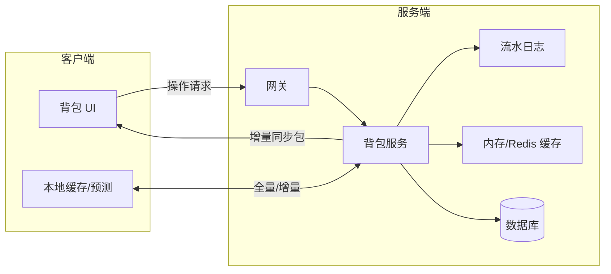
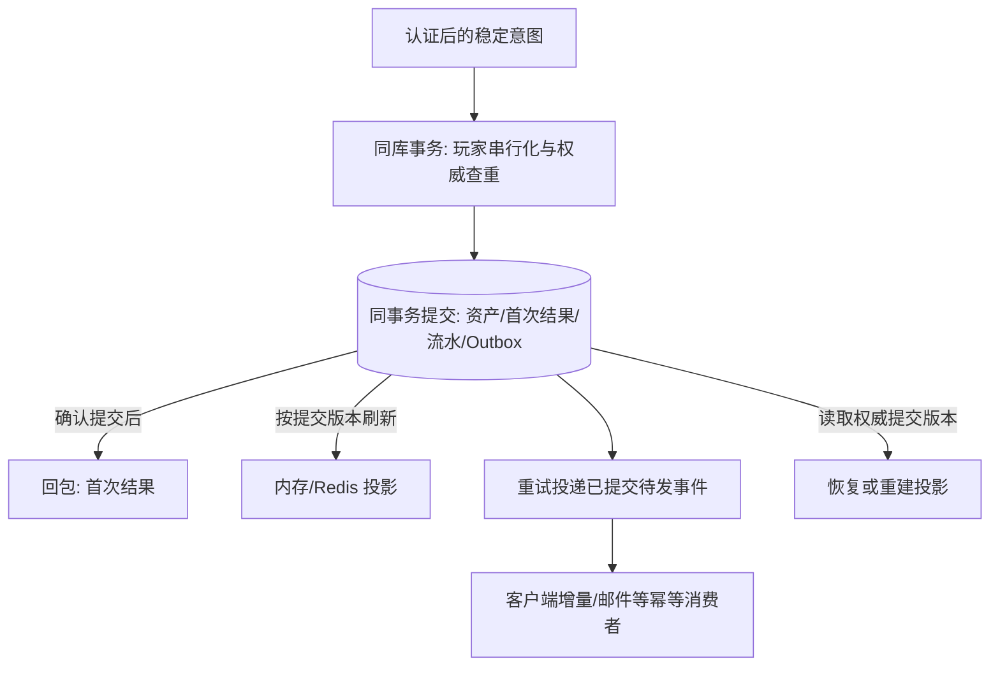
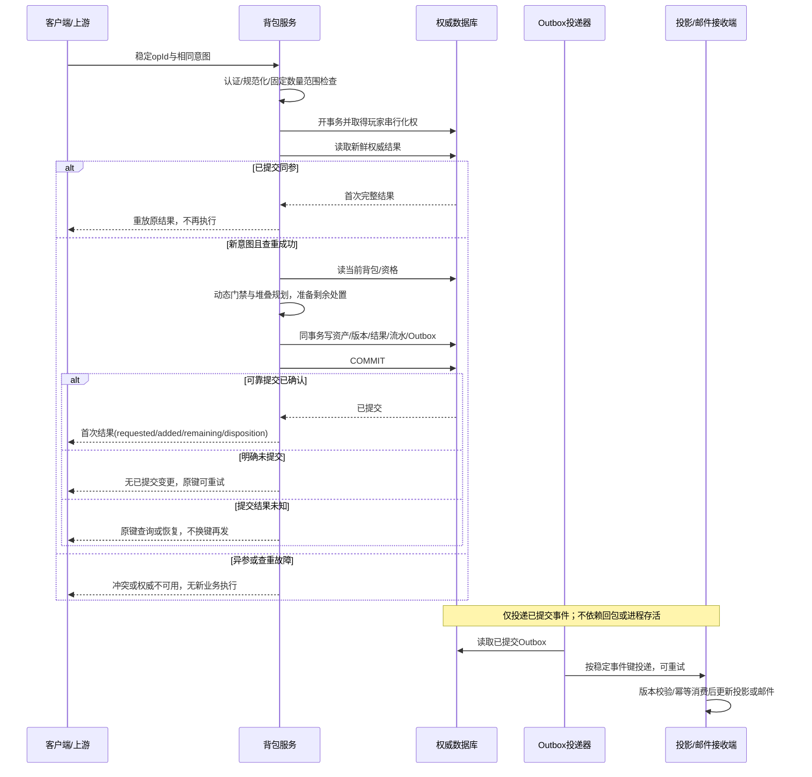
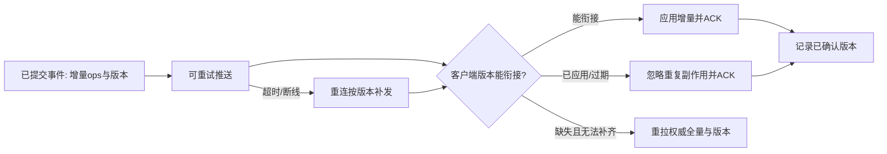

# 01-背包与道具系统

> 知识成熟度：L2（服务端设计与伪码推导；未运行 Go、数据库、Redis 锁或崩溃恢复集成测试）。

> 分工声明：本文=服务端权威数据模型与事务层（两层建模、槽位/堆叠、事务/锁/幂等、数据库缓存）；UE 客户端表现层（InventoryComponent、UI 绑定、存档衔接、Lyra 参考）见 [游戏知识/03-游戏玩法编程/13-背包与装备系统](13-背包与装备系统.md)，两篇分工互指不重复。

> 知识基线：实时游戏服务端通用架构；示例中的语言、数据库、缓存、容器和云平台版本必须以项目部署清单为准。
> 适用范围：覆盖玩家资产在游戏服与数据服务之间的获得、消耗、交易、同步和恢复；关联商城、任务、邮件，不覆盖支付渠道本身。
> 事实边界：协议规范、组件行为和示例方案分开；本轮仅修订提交契约并逐场景静态推导，容量数字仍须压测。§4.1 旧 SQL 未执行且有已知 MySQL 分区约束问题：`player_inventory.uk_uid(item_uid)` 与 `inventory_ledger` 的主键 `(id)` 均未包含分区表达式中的 `player_id`，不满足[MySQL 8.4 每个唯一键（含主键）都须包含分区列的规则](https://dev.mysql.com/doc/refman/8.4/en/partitioning-limitations-partitioning-keys-unique-keys.html)。这是文档规则与示例对照所得的静态判断，旧 DDL 保留但不能直接作为可部署 MySQL 分区方案；本次不迁移表结构，也不声称生产存储已验证。
> 最后更新：2026-10-04（统一权威查重与持久提交边界，保留部分获得、堆叠与同步策略，补齐失败/未知结果推导）。
> 版本边界：2026-08-06 是原组件说明的历史基线；2026-10-04 本轮访问官方文档核对事务、锁、Outbox 与 MySQL 分区规则，不代表项目已部署这些文档对应版本。数据库、Redis、协议库和容器版本仍由项目部署清单锁定。
> 参考来源：[PostgreSQL 官方文档](https://www.postgresql.org/docs/)、[Redis 官方文档](https://redis.io/docs/latest/)、[Protocol Buffers 官方文档](https://protobuf.dev/)、[OpenTelemetry 官方文档](https://opentelemetry.io/docs/)。

### P0 资产正确性与工程验收

| 验收项 | 设计基线 | 证据入口 |
| --- | --- | --- |
| 业务流水 | 每次获得、消耗、转移都记录 playerId、opId、原因、前后数量、配置/协议版本 | 流水连续性、资产总量对账、异常补偿可追溯 |
| 幂等 | 以 opId/业务键唯一约束和重试安全为基线；锁只是并发手段，不是幂等证明 | 重复、乱序、超时重试、进程崩溃后重放不重复扣发 |
| 审计 | 记录操作者、来源、目标、规则版本、traceId 关联和处置结果；Trace 不替代持久审计 | 客诉可按流水定位，审计记录可导出并脱敏 |
| 服务端权威验证 | 客户端只提交意图，服务端重取模板/数量/绑定关系并原子校验 | 改包、改数量、并发最后一件、断线重连均以服务端结果为准 |
| 版本兼容 | 同步 schema 只增不复用字段号，旧客户端可忽略新增字段，实例保存配置版本 | 新旧客户端混跑、回滚、迁移和快照恢复均可验证 |

> 结论边界：一致性、缓存、锁粒度和流水保留期都是按资产价值、延迟和恢复目标做的方案取舍；最终以部署清单、压测、故障注入和对账报告为准。

> 背包（Inventory / Bag）是几乎所有游戏都具备的基础资产系统：玩家获得、使用、交易、穿戴、分解道具，全部经由背包。背包系统的设计质量直接影响玩家体验（道具丢失、重复发放是最高等级的事故），也决定了商城发货、任务奖励、邮件附件等后续系统的实现复杂度。

## 一、概述

背包系统本质上要解决三个问题：

1. **怎么存**：玩家拥有哪些道具、每种多少、放在哪个位置、是否有私有状态（数据模型）；
2. **怎么改**：道具的增删改如何在并发请求、服务崩溃、重复提交下保持正确（事务、锁与幂等）；
3. **怎么同步**：服务端权威数据如何及时、省流量地反映到客户端，并在断线重连后保持一致（同步策略）。

背包的核心设计原则是**服务端权威（Server Authority）**：所有道具的增减必须以服务端判定为准，客户端只负责展示与发起请求。任何"客户端本地加一个道具再上报"的做法都等于给外挂留后门。

一个典型背包系统的模块划分：



## 二、核心概念

| 概念 | 英文 | 说明 | 关键点 |
| --- | --- | --- | --- |
| 背包 | Inventory / Bag | 玩家道具的容器，按槽位组织 | 容量上限、扩展（扩容卡） |
| 槽位 | Slot | 背包中一个可放置道具的位置 | 固定槽 / 动态槽 / 网格背包 |
| 堆叠 | Stack | 同种可堆叠道具的数量聚合 | 堆叠上限 maxStack，拆分/合并 |
| 道具模板 | Item Template | 静态配置：ID、名称、类型、堆叠上限、价格 | 只读、热更新、跨版本兼容 |
| 道具实例 | Item Instance | 带唯一 ID 的动态道具（有耐久/强化/词条等私有状态） | 与模板分离存储 |
| 唯一 ID | Unique ID / UID | 道具实例的全局唯一标识 | 雪花/发号器/DB 自增 |
| 全量同步 | Full Sync | 登录/重连时下发整个背包 | 包体大，需压缩与节流 |
| 增量同步 | Delta Sync | 变更集（add/update/remove + 版本号） | 日常主通道 |
| 事务 | Transaction | 在明确边界内共同提交或共同回滚 | 部分获得也可把“已入包部分 + 剩余处置 + 首次结果”整体提交 |
| 幂等 | Idempotency | 同一稳定意图重试不再产生资产副作用 | 本文额外要求同键校验意图、保存并重放首次完整结果 |
| 流水日志 | Ledger / Operation Log | 每次变更的审计记录 | 普通审计流水不自动具备恢复能力；可靠日志需提交、顺序与恢复位置合同 |
| 首次结果 | Original Result | 一次已提交意图的不可变结果快照 | requested / added / remaining / overflowDisposition，以及当时的 before / after / revision |
| 待发事件 | Transactional Outbox | 与资产及结果同事务保存的投递义务 | 投递可能重复，溢出补偿接收端仍须按稳定事件键去重 |
| 脏标记 | Dirty Flag | 投影或快照需要刷新的标记 | 可调度批量刷新，本身不是持久提交证明 |
| 服务端权威 | Server Authority | 所有资产变更以服务端为准 | 反作弊的根基 |

## 三、原理详解

### 3.1 静态模板与动态实例：两层数据模型

道具数据必须拆成两层：

- **模板层（Template / Static）**：一行配置描述"这类道具长什么样"。例如道具 1001 是"初级生命药剂"，堆叠上限 99，出售价 5 金币。模板数据全服共享、只读，可以放在服务端内存或配置中心，支持热更新。
- **实例层（Instance / Dynamic）**：一行玩家数据描述"这个道具属于谁、有多少、有什么私有状态"。只有需要携带私有状态的才建实例。

为什么必须分离：

1. **省存储**：99 瓶药剂不需要 99 行，一行 `count=99` 即可；千万玩家的公共属性不重复存储；
2. **省流量**：同步包只需传 `itemId + count`，模板信息客户端本地查表；
3. **支持热更**：修改模板不影响已有实例数据；
4. **日志友好**：流水日志记录模板 ID 即可追溯"是什么道具"，配合实例 UID 追溯"哪一件"。

哪些道具需要实例（带 UID）？通常是有"个体差异"或"可追踪需求"的道具：装备（耐久、强化等级、词条）、宠物、限时道具（过期时间）、需要精确溯源的道具（活动发放的限定皮肤）。纯消耗品、材料一般只需要模板 ID + 数量。

### 3.2 背包存储模型：槽位、堆叠与网格

**固定槽位（Fixed Slots）**：背包开 N 个槽，一行一个槽，槽索引稳定。优点：实现简单、定位快、扩容直观；缺点：槽位迁移（整理背包）成本高。

**动态槽位（Dynamic Slots）**：槽位不固定，按"道具条目"存储，`slot_index` 由服务端分配或干脆用自增主键。优点：整理背包只是改索引、无需移动数据；缺点：需要维护"下一个空位"。

**网格背包（Grid Backpack）**：每个道具占 1×1、2×2 等网格（如《暗黑破坏神》《逃离塔科夫》），需要二维空间放置算法。服务端通常只校验"放置位置合法性"（格子是否重叠、是否越界、道具尺寸），寻路与拖拽体验在客户端做，但最终落库以服务端校验为准。

**堆叠（Stack）**：同类可堆叠道具聚合为一条记录，`count <= maxStack`。设计要点：

- 获得道具时优先叠加到"未满堆"，堆满再开新条目；
- 拆分（Split）：一条拆成两条，需原子操作；
- 合并（Merge）：客户端整理时可能请求合并，服务端校验同模板、同绑定状态、无实例属性；
- 堆叠溢出保护：单次获得超过堆叠上限时自动拆多条，超出背包容量时走"溢出处理"（见 FAQ）。

### 3.3 唯一 ID 设计

道具实例唯一 ID（UID）用于：邮件附件定位、交易记录、精确回滚、日志溯源、跨服迁移。常见方案：

| 方案 | 原理 | 优点 | 缺点 |
| --- | --- | --- | --- |
| 数据库自增 | 依赖 DB 序列 | 简单、有序 | 分库分表后冲突，需要号段 |
| 雪花算法（Snowflake） | 时间戳+机器号+自增序列 | 高性能、趋势递增、无中心 | 时钟回拨需处理 |
| 中心发号器 | Redis INCR / 号段模式 | 全局唯一、可控 | 单点，需高可用 |
| UUID | 随机 128 位 | 无需中心 | 无序、索引性能差、长度大 |

游戏服务端实践中，**号段式发号器（Segment）** 或 **雪花算法** 最为常见：服务实例启动时向 DB/Redis 领取一段区间，内存中自增，用完再领，兼顾性能与全局唯一。注意：道具 UID 只在需要实例时分配，纯堆叠材料不需要 UID，避免发号器压力。

### 3.4 道具增删改：事务、锁与幂等

**原子条件扣减（Atomic Conditional Deduction）**：检查数量与扣减必须处于同一个权威串行化域。锁外检查、锁内扣减仍然可能依据过期数量执行：

```go
// 错误示范：两次调用之间，别的请求可能已消耗最后一件
if bag.CountOf(itemID) >= n {
    bag.Consume(itemID, n)
}
```

**锁的粒度与所有权**：通常按玩家串行，避免全局锁阻塞所有玩家。本进程的 `sync.Mutex` 只覆盖遵守同一锁的线程；它不能阻止另一进程、补偿任务或管理后台直写。§4.3 选择**同一数据库事务内的玩家级串行化**：所有资产写者必须参加同一协议，先取得玩家级事务锁，再读新鲜权威背包与去重结果，持有至事务终结。不能只锁“尚不存在的 opId 行”，也不能沿用等待锁之前的旧快照；实现须明确数据库隔离级别、当前读规则和冲突重试。[PostgreSQL 锁说明](https://www.postgresql.org/docs/current/explicit-locking.html)展示了事务锁的等待/释放语义，本文没有据此实现或验证具体 SQL。

Redis 的 `SET NX + 过期时间 + 续期` **本身不足以证明资产互斥**：旧持有者可能暂停至租约过期，恢复时新持有者已在写。跨进程若另选租约锁，必须让权威存储校验单调 fencing token / 所有权世代并拒绝陈旧写者；续期失败后停止新的写入仍不能撤回已在途的旧请求。参见 [Redis 分布式锁说明](https://redis.io/docs/latest/develop/clients/patterns/distributed-locks/)。本篇不提供生产 Redis 锁实现，锁也不等于幂等或持久性。

**先选提交边界，不混合三种承诺**：

| 模型 | 成功确认的边界 | 失败与恢复边界 |
| --- | --- | --- |
| 单进程内存 | 所有可失败准备完成后，在不可观察中间态的条件下无抛出发布 | 仅对象/进程存活期；锁住内存或置脏不能证明进程崩溃后可恢复 |
| 同库持久事务（本文伪码） | 资产、意图/首次结果、审计流水、待发事件同一事务可靠提交后确认 | 提交前明确失败无已提交变更；提交结果未知按原键查询/恢复 |
| 可靠日志先行 | 意图、已决定结果、状态变更、顺序及恢复位置已可靠提交后，才发布内存并确认 | 日志失败不得先确认；按已提交前缀重放，快照允许滞后 |

同库模式依赖已配置并验证的持久性/故障切换保证，不能仅把 `Commit` 函数名当证明；事务整体生效与提交前不可见的概念见 [PostgreSQL 事务说明](https://www.postgresql.org/docs/current/tutorial-transactions.html)。相邻[完整链路](05-背包道具完整链路.md)的 C++ 测试只支持其单线程内存合同，不能替代本篇持久化证明。

拆分、合并、移动应在同一选定提交边界内完成。跨“系统”不必然跨数据库：若扣款、资格与发货可由一个事务覆盖，就共同提交；若涉及跨库或外部系统，需另设可恢复状态机与补偿协议，不能用先后两次调用冒充原子交易。本篇不实现商城支付。

**幂等键与结果合同**：

1. 服务端从认证上下文取得账号/玩家域；键可为 `(tenantId, playerId, operation, opId)`。客户端或上游为一次意图生成并持续复用 `opId`，重连、超时、消息重投都不换键；键不是授权凭证。
2. 入口先认证、规范化并验证请求形状及固定协议数量范围：拒绝 0、负数、超限和不可表示的值，不夹取后执行。随后在权威事务内查重。查重失败/超时是故障，不能当作未命中；缓存 miss 也不能绕过权威查询。
3. 已提交同键绑定规范化意图，例如操作类型、道具、数量、绑定/实例选择、来源业务单号及请求指定的规则版本。合法但不同的意图返回 `Conflict`；同参重放保存的首次完整结果，不重算当前库存，也不再触发补偿。本文入口非法参数先拒绝，不承诺对非法异参优先返回冲突，但绝不修改旧结果。
4. 当前存活/距离/交易中、当前容量、热更模板等**动态门禁只约束尚未提交的新意图**。身份与结果读取权限每次仍要校验；已经成功的操作不能因后来死亡、满包或模板热更而被改判。首次裁决固定一份不可变配置/规则快照，版本随结果和流水保存，不能在事务中途换用热更版本或在重放时重新选择。
5. §4.3 选择“部分获得 + 剩余邮件待发”时，把 `requested / added / remaining / overflowDisposition` 及待发事件标识完整保存。`mail_queued` 只表示已承担可靠待发义务，不是邮件已经送达；后续投递状态单独查询，首次结果保持不变。
6. 示例只将已接受并提交的操作记为终态成功，包含 `added=0` 但全部进入待发邮件的情况。非法输入、动态门禁拒绝、整单策略容量拒绝与明确未提交故障不占用成功键，可在条件变化后同键重试；若产品要求拒绝也永久绑定键，应另选并验证终态拒绝政策。
7. 去重保留期必须覆盖有效离线重试、消息重投、人工重放及对账窗口；“7 天”只能是待验证的业务参数。清理后仍需墓碑/业务唯一约束，或可信的意图期限规则拒绝过期旧请求，不能把删除后的 miss 当新意图。审计日志保留期与去重有效期是两个合同。

**可对账流水**：`before` 来自本次提交前的权威计数，`actualDelta` 是实际入包/扣除量，`after = before + actualDelta`，使用足够宽的整数并检查上界。记录计数范围（模板、绑定状态、实例等）、来源、意图键、配置/规则版本和提交版本；多条槽位明细可隶属同一操作。不要固定填 `before=0`，也不要在重试时拿当前总数补写历史。

### 3.5 同步策略：全量同步与增量同步

**全量同步（Full Sync）**：登录、重连、版本不一致时，下发整个背包。要点：

- 只下发客户端需要展示的字段（模板信息客户端查表）；
- 大背包分片下发（如每包 50 槽）并带总版本号，防止中间丢包造成永久不一致；
- 压缩（gzip/MessagePack）与批量。

**增量同步（Delta Sync）**：日常主通道。每次变更生成变更集：

```json
{
  "cmd": "inventory.delta",
  "version": 1025,
  "ops": [
    {"op": "add",    "slot": 3,  "itemId": 1002, "count": 5},
    {"op": "update", "slot": 0,  "count": 94},
    {"op": "remove", "slot": 2}
  ]
}
```

增量包的可靠性机制：

- **版本号（version）**：每次变更自增；客户端保存已收到的版本；
- **ACK**：客户端收到增量包后回 ACK，服务端记录"已确认版本"；未 ACK 的增量在重连时补发；
- **兜底**：若客户端版本落后太多（如离线超过 N 天），直接全量同步。

**客户端表现层**：展示类更新允许客户端本地插值/预测（如拾取动画先播放、数值后校正），但**任何校验性判定必须等服务端回包**。禁止客户端本地"预扣"后直接使用道具（使用结果必须服务端验证）。

### 3.6 背包与数据库、缓存的配合

下图与 §4.3 一致，选择**数据库为可恢复事实源、内存/Redis 为提交后投影**，不是先确认内存成功再补写持久记录：



1. **权威读取**：写请求的查重、资格校验、容量规划和计数均基于事务内权威状态；缓存/只读副本只服务允许滞后的查询，例如查看他人装备。等待锁后必须重新取得可见前序提交的新鲜状态。
2. **提交后投影**：缓存更新、属性刷新和增量推送失败不撤销已提交资产；按版本重建或重试。旧回包/旧异步任务不能覆盖更高版本的缓存，投影落后时不能拿它批准下一次资产写入。
3. **Outbox**：保存与资产/结果同事务提交的待发事件，由 worker/CDC 异步投递；可能重复，接收方需稳定事件键和原子去重。溢出邮件待发事件入库失败时整笔事务不提交，不能已发 5 件却丢了其余 7 件的责任。已提交 Outbox 积压主要意味着投递延迟，应告警与恢复，不等于那笔资产尚未可靠提交。参见 [AWS transactional outbox 模式](https://docs.aws.amazon.com/prescriptive-guidance/latest/cloud-design-patterns/transactional-outbox.html)。
4. **批量快照仍有位置**：同库模式可异步刷新缓存/导出快照，但不能靠登出或“每 5 秒落库”才首次保存已经确认的资产。若为降低在线 DB 写入而改选可靠日志架构，则须满足下面另一组前提，不能只替换一行 `ScheduleFlush`。

**另选可靠日志先行时**：在线读写可由单一权威执行器串行裁决，先规划，再可靠提交可恢复的意图、完整结果、资产变更与待发义务，之后才发布内存/确认。记录有序提交位置；快照标明已应用位置，例如 80，恢复仅重放其后已提交的 81…N，并一起恢复去重结果与待发义务。恢复追平以前不开放写入，避免重放与新请求竞争。

脏标记 + 定时批量（如 5 秒）、登出刷新和每日快照可用于这种架构的快照优化；删旧日志前须证明可恢复快照与去重/投递状态已经覆盖它。提交确认对应的刷盘/复制条件、故障切换所有权与陈旧写者拒绝也必须明确。普通审计 `Append`、内存队列、Redis 缓存或“稍后补日志”均不能提供这些保证。Redis 作为加速层、跨服中转或只读副本可以保留；若另将它用作事实源，须独立验证持久性与故障切换配置，本篇不作背书。

### 3.7 海量物品的性能与容量

海量物品的典型场景：长期运营游戏，玩家背包数百槽位、邮件附件堆积、材料种类上千、单服在线数十万。优化手段：

1. **堆叠与聚合**：可堆叠道具绝不拆条；纯材料按 `(playerId, itemId)` 聚合为单行；
2. **分页与懒加载**：背包数据按页加载（如 50 条/页），服务端只处理被请求的页；
3. **归档（Archive）**：长期不动的道具（过期邮件附件、旧赛季材料）迁移到归档表/冷存储，热表保持小体积；
4. **索引设计**：主键 `(player_id, slot_index)` 天然按玩家聚集；按 `item_uid` 建唯一索引用于邮件附件定位；
5. **分库分表**：按 `player_id` 哈希分片，单玩家数据不跨片；跨片事务通过"单玩家单片"规避；
6. **上限保护**：背包槽位上上限、单种材料数量上限、邮件附件总上限——防止单玩家数据无限膨胀拖垮服务；
7. **压缩与协议优化**：同步包用二进制协议（protobuf/MessagePack），大背包分片。

## 四、设计示例

### 4.1 表结构（SQL）

```sql
-- 道具模板（静态配置，全服共享，可放配置中心）
CREATE TABLE item_template (
  item_id        INT PRIMARY KEY,
  name           VARCHAR(64)  NOT NULL,
  item_type      TINYINT      NOT NULL,  -- 1=消耗品 2=装备 3=材料 4=货币道具 5=礼包
  max_stack      INT          NOT NULL DEFAULT 1,  -- 堆叠上限，1=不可堆叠
  grid_width     TINYINT      NOT NULL DEFAULT 1,  -- 网格背包用
  grid_height    TINYINT      NOT NULL DEFAULT 1,
  sell_price     INT          NOT NULL DEFAULT 0,
  bind_on_obtain TINYINT      NOT NULL DEFAULT 0,  -- 获得即绑定
  expires_in_sec INT          NOT NULL DEFAULT 0,  -- 限时道具有效秒数，0=永久
  version        INT          NOT NULL DEFAULT 0   -- 配置版本，热更校验
);

-- 玩家背包（一行一个槽位/条目）
CREATE TABLE player_inventory (
  player_id    BIGINT      NOT NULL,
  slot_index   INT         NOT NULL,           -- 槽位索引
  item_id      INT         NOT NULL,           -- 模板 ID
  item_uid     BIGINT      NULL,               -- 实例 UID（可堆叠道具为 NULL）
  count        INT         NOT NULL DEFAULT 1,
  bind_type    TINYINT     NOT NULL DEFAULT 0, -- 0=未绑定 1=绑定
  durability   INT         NULL,               -- 实例私有属性示例
  attrs        JSON        NULL,               -- 其他实例属性（词条等）
  expires_at   DATETIME    NULL,               -- 过期时间
  version      INT         NOT NULL DEFAULT 0, -- 乐观锁版本号
  PRIMARY KEY (player_id, slot_index),
  UNIQUE KEY uk_uid (item_uid),
  KEY idx_player_item (player_id, item_id)     -- 材料聚合查询
) PARTITION BY HASH(player_id) PARTITIONS 64;

-- 背包流水日志（审计与恢复的关键）
CREATE TABLE inventory_ledger (
  id           BIGINT AUTO_INCREMENT PRIMARY KEY,
  player_id    BIGINT      NOT NULL,
  op_id        VARCHAR(64) NOT NULL,           -- 幂等键
  op_type      TINYINT     NOT NULL,           -- 1=获得 2=消耗 3=移动 4=拆分 5=合并 6=删除
  item_id      INT         NOT NULL,
  item_uid     BIGINT      NULL,
  count        INT         NOT NULL,
  before_count INT         NOT NULL,           -- 变化前数量（审计）
  after_count  INT         NOT NULL,           -- 变化后数量
  reason       VARCHAR(32) NOT NULL,           -- 来源模块: quest/shop/mail/drop...
  created_at   DATETIME    NOT NULL DEFAULT CURRENT_TIMESTAMP,
  UNIQUE KEY uk_op (player_id, op_id)
) PARTITION BY HASH(player_id) PARTITIONS 64;
```

### 4.2 全量同步数据（JSON）

```json
{
  "cmd": "inventory.full_sync",
  "version": 1024,
  "maxSlots": 120,
  "slots": [
    { "slot": 0, "itemId": 1001, "count": 99 },
    { "slot": 1, "itemId": 2001, "itemUid": 7123900001,
      "attrs": { "durability": 80, "level": 5 } }
  ]
}
```

### 4.3 核心伪代码（Go 风格）

**这是合同占位伪码，不是可编译 Go，也没有数据库执行证据。** `BeginPlayerTx`、`StageBundle` 等是下述前提的名字，不是已有库 API；§4.1 的旧 DDL 也未实现结果表、Outbox 或本段隔离协议，不能直接拿来宣称可运行。

存储适配器必须实现的合同：

- `BeginPlayerTx` 在同一权威数据库事务中取得**已存在的玩家所有权记录**上的排他权，所有资产写者遵守；取得后再读新鲜状态，保持到提交/回滚终结。玩家记录创建、数据库隔离级别、序列化冲突及死锁重试需实际实现与验证。前一个提交尚未终结时不能返回可据以再发的 `Missing`。
- `ReadOutcome` 只读权威已提交记录；区分 `Found / Missing / error`。键有唯一约束，查重与资产提交不可拆到不同系统；查不到过期记录时还须经过意图期限/墓碑规则。`Close` 清理本地句柄，未发起提交时回滚；提交已发出却结果未知时，关闭连接不等于证实回滚。
- `StageBundle` 的所有写入都在当前事务中，不修改共享内存、不发邮件、不推增量；关键资产、来源资格、结果与版本写入须按计划校验预期受影响行数及约束，非预期零行、必要记录缺失或缺少终态结果都作为合同错误整体回滚，不能仅凭 SQL 未抛错就提交。计划内无槽位变化可以是零行，仍须写入该操作的完整结果/版本/待发义务；任何准备/写入错误必须中止整个事务。`Commit` 仅给出“可靠提交已确认 / 明确未提交 / 未知”三类结果；未知必须按原键在权威端查询/恢复，不将网络错误笼统当未提交。
- `PlanAdd` 仅构造候选状态：按稳定槽序先补同模板、同绑定状态且可合并的非实例堆，再开空槽。实例道具不并堆，UID/私有属性随计划保存；网格玩法校验位置/尺寸/重叠。所有数量减法、总量累加、版本递增及配置上限均检查整数范围，不经浮点 `Min` 转换。
- `PrepareOverflow` 只准备义务。示例 `PartialThenMail` 为剩余量构造稳定事件键 `(操作键, overflow, 序号)`；接收端以同键将邮件创建和消费记录原子提交。整个下游协议仍待验证，不能因为发送端有 Outbox 就声称任意外部系统恰好执行一次。

```go
// 省略类型定义：所有方法均为上面的合同占位，不可直接编译。
// key 的玩家/租户来自认证；intent 保留同次重试中不变的规范化请求。
func AddItem(auth AuthContext, req AddRequest) (AddResult, error) {
    key, intent, err := AuthenticateAndNormalize(auth, req, "AddItem")
    if err != nil { return NoResult, err }
    // 固定协议范围检查在任何业务写入前；热更玩法上限稍后检查。
    if intent.ItemID <= 0 || intent.Count <= 0 || intent.Count > ProtocolMaxCount {
        return NoResult, ErrInvalidArgument
    }

    tx, err := store.BeginPlayerTx(key.PlayerScope)
    if err != nil { return NoResult, err }
    defer tx.Close() // 不把提交结果未知的事务谎报为“已回滚”

    saved, found, err := tx.ReadOutcome(key)
    if err != nil { return NoResult, ErrAuthorityUnavailable } // 绝非 miss
    if found {
        if saved.Intent != intent { return NoResult, ErrConflict }
        return saved.Result, nil // 原样重放；不再过当前模板/容量等动态门禁
    }
    if err := tx.CheckIntentLifetimeAndTombstone(key, intent); err != nil {
        return NoResult, err // 已过期旧意图不能因结果清理而重新发放
    }

    bag, err := tx.ReadCurrentBag()
    if err != nil { return NoResult, err }
    rules, err := tx.LoadRulesAndCheckNewIntent(intent, bag)
    if err != nil { return NoResult, err }
    // 当前资格/来源、绑定、模板、限额和规则版本在此裁决。
    // 若发奖会消耗领取资格，它的变更也必须进入下面同一 Bundle。
    before, err := bag.CheckedCount(rules.CountScope)
    if err != nil { return NoResult, err }
    plan, err := PlanAdd(bag, intent, rules, PartialThenMail)
    if err != nil { return NoResult, err } // 整单玩法可改选 RejectWhole
    remaining := intent.Count - plan.Added // plan 保证 0 <= Added <= Count

    overflow, err := PrepareOverflow(key, remaining, rules)
    if err != nil { return NoResult, err } // 入包部分也尚未提交
    after, err := CheckedAdd(before, plan.Added)
    if err != nil { return NoResult, err }
    revision, err := CheckedNextRevision(bag.Revision)
    if err != nil { return NoResult, err }
    result := AddResult{
        OpID: key.OpID, Code: Accepted, ItemID: intent.ItemID,
        CountScope: rules.CountScope,
        Requested: intent.Count, Added: plan.Added, Remaining: remaining,
        OverflowDisposition: overflow.Disposition, OverflowEventID: overflow.EventID,
        Before: before, After: after, ActualDelta: plan.Added,
        Revision: revision, TemplateVersion: rules.TemplateVersion,
        RuleVersion: rules.Version,
    }
    bundle, err := PrepareBundle(key, intent, plan, result, overflow)
    if err != nil { return NoResult, err }
    // Bundle = 槽位/来源资格变更 + 新版本 + 意图/首次完整结果
    //        + 审计(before, actualDelta, after, 计数范围) + 待发邮件/增量事件
    if err := tx.StageBundle(bundle); err != nil { return NoResult, err }

    outcome, err := tx.Commit()
    switch outcome {
    case ConfirmedCommitted:
        return result, nil // 已持久化；响应编码/网络失败也不能重新执行
    case ConfirmedNotCommitted:
        return NoResult, ErrRetrySameIntent(err) // 允许原键重试
    default:
        return NoResult, ErrOutcomeUnknown(key) // 原键查询/恢复，禁止换键再发
    }
}

// 内部消耗规划原语：调用者已取得同一权威事务与新鲜背包。
// 不提交、不发事件、不生成 opID；必须由下面描述的外层协议使用。
func PlanConsume(bag Snapshot, item ItemSelector, n int64) (Plan, error) {
    if n <= 0 || n > ProtocolMaxCount { return NoPlan, ErrInvalidArgument }
    before, err := bag.CheckedCount(item)
    if err != nil { return NoPlan, err }
    if before < n { return NoPlan, ErrNotEnough }
    // 只规划从尾部合格堆叠扣减/释放空槽；before-n 已由范围检查保护。
    return BuildConsumePlan(bag, item, n, before, before-n)
}
```

`PartialThenMail` 是本例玩法选择：`remaining=0` 时处置为 `none`、无溢出事件；`remaining>0` 时为 `mail_queued`，数量与邮件义务同事务确认。即使 `added=0`，只要所有请求数量都进入可靠待发义务，也可接受；同意图重放不会重新计算“现在又空出来多少”。每次新接受的操作提交一次版本，包括零入包的操作；增量可为空但携带版本。首次结果重放不推进版本，后续投递状态变化也不改写首次结果。

`RejectWhole` 则在 `remaining>0` 时返回容量拒绝，不提交任何槽位/结果/补偿义务；这里只说明替代政策，未把部分获得偷偷改成整单拒绝。邮件期限、自动出售/兑换等仍由玩法决定；自动兑换若不能同库完成，也必须记录明确待发义务和幂等接收协议。

**外部消耗端点**应接收上游稳定 `opID`，在 `ConsumeItem` 操作域重复上述认证/数量检查 → 事务内权威查重与意图比较 → 新请求动态门禁 → `PlanConsume` → 同事务保存消耗结果、真实 `before/after`、`actualDelta=-n` 及相关待发效果 → 可靠提交。重复同意图只返首次结果；换一个新 UUID 只是另一操作/审计号，不解决客户端重试。内部原语没有独立幂等或持久性承诺，单有玩家锁也不能赋予它这些承诺。

### 4.4 流程与时序图

**获得道具的同库事务时序**（奖励、邮件领取等调用都必须通过相同权威入口；此图不实现购买扣款）：



等待锁/事务超时、配置读取失败、准备失败等均在可靠提交前终止，不能因图省略一条异常箭头就允许继续。提交已经成功但缓存刷新/网络回包失败时，资产仍已提交；未知结果查询必须访问权威端，且等待原事务终结。只有确认原事务未提交、未越过意图有效期，才可在同一串行化协议下以原键重试；一次旧副本 miss 不构成这个证明。

**静态因果轨迹（不是 Go/数据库运行测试）**：下面按 §4.3 合同逐步推导，反例前提一旦出现就不能宣称该合同成立。

| 场景 | 顺序与可观察结果 |
| --- | --- |
| 同 op 两请求竞争 | 即使两者锁外缓存都 miss，A 先取得玩家事务权并查无记录、提交；B 在 A 终结后读取新鲜权威结果，同参重放，不再加物品/发溢出事件。若 A 回滚，B 才可作为尚未提交意图继续 |
| 同 op 异参 | A 已提交 `(item=1001,count=12)`，B 同键改成 13：入口合法但意图比较冲突；原结果、资产、待发事件不变。改成 0/负数则在入口拒绝，同样无变更 |
| 查重读取失败 | 事务内查询超时或权威不可用，直接终止；不能把 error 当 miss 后运行规划/发货 |
| 部分获得与重放 | 背包只有 1 槽，存有同模板/同绑定可堆叠道具 94 件，单堆上限 99，故只容 5。请求 12：提交 `{requested:12, added:5, remaining:7, disposition:mail_queued, before:94, actualDelta:5, after:99}` 及一项 7 件邮件义务。后来消耗 4 件变 95，再重放仍返这份历史结果，当前保持 95，不补发到 99，也不新增第二封邮件 |
| 同一输入选整单策略 | 同样 1 槽 94/99，请求 12、只容 5，`RejectWhole` 在规划期拒绝；原数量 94、结果表与 Outbox 均不变，之后释放足够空间可原键再试。这与上一行是明确不同的玩法 |
| 溢出准备/入库失败 | 同样 1 槽 94/99，已规划入包 5，但构造 7 件邮件义务失败，或同事务写 Outbox 失败：不提交整笔，权威数量仍 94，没有成功记录，不产生外部邮件 |
| 可靠提交前失败 | 槽位/结果/流水的某次事务写入失败，或 COMMIT 明确未提交：整体回滚，没有已确认新增；原键重试重新查权威，不能仅重试漏写的半步 |
| 提交后响应丢失 | 资产、完整结果及待发事件已提交，响应编码失败/断线/进程退出：原键重放记录；不撤销资产，也不再发一份。Outbox 投递器可独立继续 |
| COMMIT 结果未知 | 请求发出后连接断开，两种历史都可能存在。先保持原键查询/恢复：查到已提交结果就重放；原事务已终结且证实未提交才允许原键再试；仍未知则保持待查，不用新键补发 |
| 动态状态已改变 | 首次接受后角色死亡、背包满或模板热更：身份/读取权限仍须通过，但同参命中先重放旧结果，不被新的动态门禁改判 |
| 后台快照滞后 | 同库模式的缓存/导出快照落后不影响已提交 DB 结果；可靠日志另选架构若快照到 80、已可靠提交到 83，恢复重放 81…83 并重建结果/待发义务，追平前拒绝新写。仅写内存或普通 Append 成功则不能推出可恢复 |
| 过期租约旧持有者恢复 | 在另选租约方案中，世代 10 过期后 11 已接管，权威存储必须拒绝 10 的迟到写；若只依赖续期/TTL 而仍接受旧写，就失去了串行化前提 |

这些轨迹检查的是设计中的前提与后果，不证明存储适配器、下游邮件、真实竞争、断电或故障切换已经实现。相邻 C++ 整单内存回归也不覆盖本例部分获得/持久提交。

**增量同步的可靠投递**：



客户端增量、邮件投递与 Add 原请求是不同重试通道，各自依据已提交版本/稳定事件键处理；ACK 或推送失败不能把已提交的 Add 变成新意图。

## 五、最佳实践

1. **服务端权威**：所有判定在服务端，客户端只展示；对"客户端声称拥有某道具"的请求一律不信；
2. **先明确可靠提交边界**：同库模式共同提交资产/结果/流水/Outbox；可靠日志模式先确认可重放记录的持久提交再确认资产，不能用普通 Append 或异步快照替代；
3. **玩家粒度串行化**：所有写者遵守同一权威协议，锁内取新鲜状态；租约过期后的陈旧写者须由存储拒绝，不以 Redis 续期作为充分证明；
4. **稳定意图与完整结果**：外部资产端点接收可重传的 opId，事务内查重、绑定意图、保存首次结果；消耗内部原语不自行生成 UUID 冒充该协议，消息/溢出补偿消费端也要去重；
5. **上限保护**：槽位、堆叠、单次变更数量、流水表大小都要有硬上限；
6. **增量为主、全量为辅**：日常增量同步，版本落后或重连时全量兜底；
7. **数据与配置分离**：模板走配置中心热更，玩家数据走数据库；模板变更不破坏既有实例；
8. **区分保留期**：审计流水按运营/合规需要保留（如 90 天仅示意）；去重证据覆盖有效重放窗，可靠恢复日志只在快照与恢复位置已覆盖后清理；
9. **待做实际验证**：将 §4.4 的同键竞争、部分结果、溢出失败、提交未知与恢复轨迹落成适配器/数据库集成测试；本轮只有静态推导，没有运行 Go、Redis、支付或崩溃注入。

## 六、常见问题（FAQ）

**Q1：背包满了，新获得的道具去哪里？**
策略由玩法决定：① 可容纳部分入包，剩余邮件补偿（如 30 天期限只作示意）；② 整单拒绝并提示；③ 自动出售/兑换。本文伪码选择第一种，保存 requested/added/remaining/overflowDisposition；剩余的邮件义务与入包结果共同提交，稳定事件键去重。`mail_queued` 不表示已经送达，积压、重试失败和到期回收要有可查询状态与运营处置。不能在返回 added 后让调用方每次重试自行补发剩余，也不能暗改成另一种容量政策。

**Q2：扣了道具但没生效，或者被重复扣了？**
先按认证资源域和原 opId 查权威提交结果，再核对同一计数范围的 before/actualDelta/after、版本与待发事件状态。可能是重复执行、明确未提交、提交结果未知，或资产已扣而下游效果投递滞后，不能只凭客户端未见效果判定“扣除失败”。已提交则重放结果/恢复投递；未知则原键查询，不换键再扣。若道具扣除必须与效果共同原子生效，应将其纳入同库事务；外部效果另需明确恢复协议。

**Q3：两个请求同时消耗最后一件道具，会不会都成功？**
不同意图竞争最后一件时，应在同一权威串行化域读取新鲜数量并检查/扣减；第一个提交后，第二个看到不足并拒绝。同一意图的重复请求则只重放首次消耗结果。数据库条件扣减也可作为实现手段，但必须检查实际影响行数，并与结果/流水/事件共同提交；它不自动解决多堆聚合或跨进程绕过写入。仅各进程自己的锁不能保证这个结论。

**Q4：服务器崩溃后背包回档了，怎么办？**
先按选定模型恢复：同库事务读取权威已提交状态/结果并重建投影；可靠日志架构从带已应用位置的快照恢复，再重放其后的可靠提交前缀，同时恢复幂等结果和待发义务。提交了但响应丢失的操作也必须恢复，不能只重放“确定客户端收到 ACK”的操作。后台快照落后允许存在，未持久化日志则不能承诺找回已确认资产；恢复追平且确立唯一写者之前不重新开放写入。

**Q5：玩家囤了几十万个材料，单行数据太大怎么办？**
堆叠上限内聚合；超过上限用多条或"数量压缩"（如 10 万以下精确、以上按千取整展示）；定期把过期/闲置材料归档。同时对单种道具总量设硬上限。

**Q6：客户端改了本地数据假装有道具，能行吗？**
不能。道具的"有效性"由服务端权威数据决定：使用道具时服务端重新校验模板、绑定、数量并原子扣减；同步包只作为展示，客户端无法伪造服务端判定结果。

**Q7：跨服迁移/合服时背包怎么处理？**
以数据库为准做全量导出，按新服分片规则重分（道具 UID 需重新映射并保留映射表，用于邮件附件等引用）；迁移期间只读，迁移完成后校验总数（模板维度合计）一致再开放。

## 七、关联阅读

- [02-数据库选型与存储设计](../../07-网络与游戏服务端/持久化与分布式一致性/01-数据库选型与存储设计.md)：分库分表、索引、JSON 字段的使用边界
- [02-缓存与排行榜系统](../../07-网络与游戏服务端/持久化与分布式一致性/02-缓存与排行榜系统.md)：缓存一致性、Redis 锁与缓存击穿防护
- [01-消息系统与事件驱动](../../07-网络与游戏服务端/服务架构与消息通信/04-消息系统与事件驱动.md)：资产变更事件的发布订阅、可靠投递
- [01-并发与高性能](../../07-网络与游戏服务端/运行调度与过载保护/05-并发与高性能.md)：玩家级锁、无锁结构、批量落库
- [03-商城与经济系统](../任务活动与经济规则/03-商城与经济系统.md)：扣款-发货的跨系统一致性（流水/补偿/幂等）
- [05-聊天与社交系统](../../07-网络与游戏服务端/会话身份与在线服务/05-聊天与社交系统.md)：邮件附件引用道具 UID 的领取与过期流程
- [04-平台与可靠性/03-幂等重试与消息语义](../../07-网络与游戏服务端/持久化与分布式一致性/03-幂等重试与消息语义.md)：幂等键/去重表/状态机的平台模式层（分工互指）
- [04-平台与可靠性/04-分布式事务与最终一致性](../../07-网络与游戏服务端/持久化与分布式一致性/04-分布式事务与最终一致性.md)：事务/Outbox/补偿的平台模式层
- [游戏知识/03-游戏玩法编程/13-背包与装备系统](13-背包与装备系统.md)：UE 客户端表现层（InventoryComponent、UI、存档、Lyra 参考）（分工互指，本服务端篇不重复客户端表现细节）
