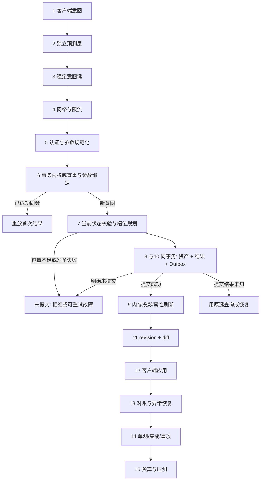

# 05-背包道具完整链路

> 知识成熟度：L2（端到端设计推导；局部 C++ 单线程内存合同有可运行实证，不能把局部测试提升为整篇持久化、网络、UE 或跨服链路已验证）。
> 知识基线：客户端沿用首版注明的 UE5.8（CL 55116800）/Lyra Inventory/Equipment 设计参照，本轮未核验该私有版本或编译 UE，服务端为自研权威背包事务模型；横向联动 [游戏服务端/03-业务系统设计/01-背包与道具系统](01-背包与道具系统.md)、[游戏知识/03-游戏玩法编程/13-背包与装备系统](13-背包与装备系统.md) 与 [游戏服务端/02-数据与业务/01-数据库选型与存储设计](../../07-网络与游戏服务端/持久化与分布式一致性/01-数据库选型与存储设计.md)。
> 适用范围：MMO / 动作 RPG / 战术竞技等有持久化道具系统的多人游戏；奖励发放、邮件领取、交易、掉落拾取、装备穿戴拆除等所有"写物品"的链路。
> 事实边界：2026-10-04 新证据为 Linux / GCC 14.2.0 的固定结果、成功键记忆与有界分配失败测试；首版 MinGW g++ 16.1.0 / `-O2` 七场景与性能日志只属于旧源码、旧输入。没有运行新性能基准，也没有生产持久化、Windows/MSVC、网络、支付或 UE 集成实证；容量阈值、批量上限、限流参数仍须由项目定义。
> 参考来源：[Unreal Engine: Lyra Inventory and Equipment](https://dev.epicgames.com/documentation/en-us/unreal-engine/lyra-inventory-and-equipment-in-unreal-engine)、[Unreal Engine 官方文档](https://dev.epicgames.com/documentation/en-us/unreal-engine)。
> 最后更新：2026-10-04（修正内存异常发布、首次结果、TTL 与持久化边界；保留首版十五步链路、玩法选项和历史原始日志）。

---

## 一、概述与链路定位

背包是 Gameplay 里最"不起眼但最致命"的系统：它不产生战斗表现，却承载玩家全部资产。一次失败的物品写入可以是**多发一件**（经济崩坏、可复制）、**少发一件**（客服工单、退款）或**半发一件**（背包出现幽灵槽位、堆叠计数与数据库不一致）。

背包链路的工程本质是三个约束的同时满足：

1. **原子性**：本文选定的整单奖励策略要求全部生效或无效果；若还要扣除奖励资格/货币，它们也必须进入同一明确提交边界。单个内存 `Add` 不能证明跨系统扣与加原子；
2. **幂等性**：明确资源域、稳定意图键和有效去重保留期；重复同一意图不再结算。本篇额外要求保存首次结果，异参同键拒绝；
3. **可对账**：内存投影、持久化事实和客户端表现以版本、提交记录和恢复协议解释差异；收敛还依赖恢复最终完成，不是任意故障下自动成立。

与 [03-技能释放完整链路](../技能战斗与属性结算/03-技能释放完整链路.md) 的区别：技能链路的核心是"低延迟 + 服务端权威裁决"，背包链路的核心是**在已声明的提交和恢复边界内防止重复发放与半成品**。资产容错目标很严格，但需要证据与架构前提支撑，不能靠一句“绝不”替代。

## 二、链路类型与依赖模块

| 维度 | 内容 |
| --- | --- |
| 链路类型 | Gameplay Transaction（Template A：输入 → 预测 → 请求 → 校验 → 领域执行 → 状态变更 → 持久化 → 复制 → 表现 → 恢复 → 测试） |
| 客户端模块 | 拾取/使用输入、本地背包视图、乐观表现层、增量同步应用、对账重拉 |
| 服务端模块 | 请求网关（限流/鉴权）、幂等去重表、背包事务执行器、容量守卫、属性修正器、持久化事务 / 可靠日志、同事务 outbox 待发事件、复制与通知 |
| 依赖模块 | [数据库选型与存储设计](../../07-网络与游戏服务端/持久化与分布式一致性/01-数据库选型与存储设计.md)（事务与隔离级别）、[04-平台与可靠性/03-幂等重试与消息语义](../../07-网络与游戏服务端/持久化与分布式一致性/03-幂等重试与消息语义.md)（幂等语义）、[04-平台与可靠性/04-分布式事务与最终一致性](../../07-网络与游戏服务端/持久化与分布式一致性/04-分布式事务与最终一致性.md)（跨服转账） |
| 失败路径 | 参数非法、容量不足、物品不存在、状态门禁（死亡/交易中/读条中）、并发竞争、持久化失败、复制失败 |
| 局部正确性证据 | [evidence/tests/gameplay-core](../../../evidence/tests/gameplay-core/README.md)：新内存合同 + 原七场景；不覆盖下述网络/持久化链路 |
| 历史性能观察 | 旧 `inventory_txn` 与 `attr_modifier_bench` 日志；不绑定修复后源码，不构成线上容量或增量正确性证明 |

## 三、权威状态与数据所有权

客户端只提交意图，服务端负责授权与裁决；**裁决者、可恢复事实源、客户端投影是不同职责**。必须先选择下列一种提交架构，不能把它们串成“先改内存，再写 WAL/outbox，失败再回滚”的混合流程。

| 边界 | 可以确认成功的条件 | 故障与恢复 | 本文证据 |
| --- | --- | --- | --- |
| 单进程内存模型 | 规划、成功记录与结果准备完成后，无抛出发布槽位 | 发布前异常无变更；对象销毁/进程退出后记忆丢失 | 当前 C++ 实测，仅此层 |
| 同库持久化事务 | 业务状态、去重结果、待发 outbox 事件在同一 DB 事务 COMMIT 成功 | 提交前失败回滚；提交结果未知时用原键查询/恢复，不能换键重做 | 架构推导，未运行此库存数据库 |
| 可靠日志先行 | 确认前已可靠提交可重放意图/结果/序列及恢复位置；按该日志发布内存 | 日志提交失败不得确认；已提交后重放，快照可异步滞后 | 架构推导，未运行日志/断电恢复 |

同库事务模式的所有权示意：

```text
认证后的服务端裁决 + 串行化/事务隔离
    ↓ 同事务提交：资产 + 意图/原结果 + 待发事件
数据库（可恢复事实源）
    ↓ 提交后的内存投影、属性刷新、可重试事件投递
客户端视图（revision + diff，可预测但不是资产权威）
```

- **版本收敛**：客户端必须从已提交的权威版本构建视图；丢失增量时重拉，重复/过期增量应按版本丢弃。服务端的 `revision`、结果和状态也需处于一致提交边界。
- **预测分离**：预测层可丢弃，不能直接写入本地“权威副本”；客户端的“我有 5 个”不是服务器采信库存的依据。
- **内存局限**：当前 C++ 没有 DB、WAL、outbox、revision 或跨账号认证，不声明崩溃后不丢资产；“异步稍后落库”本身也不提供这项保证。

## 四、完整数据流架构图（十五步教学闭环）

下图选**同库持久化事务**为例；步骤 8 与 10 属于同一提交单元，不能先向客户端确认内存成功再去尝试持久化。



规划解决“放得下吗”；完整正确性还依赖**结果准备、去重记录、提交边界及故障恢复**。内存模型把这些缩为“所有可失败准备 → 无抛出发布”，数据库模型则依靠同一事务。二者的“原子”不是同一个机制。

## 五、十五步端到端推导

### 步骤 1：客户端拾取/使用输入

- 触发源：地面拾取、邮件领取、任务奖励、商店购买、合成消耗、装备穿戴。
- 输入层只做**意图采集**，不做权威物品增减；奖励数量由服务端配置决定，购买/使用可携带数量意图，但必须由服务端校验，不能直接采信。
- 客户端可以节流以改善交互，服务端仍须独立限流、鉴权和限制业务次数；不同合法意图不应被混成同一键，客户端节流也不是安全边界。

### 步骤 2：本地乐观表现（客户端预测）

- 允许对**表现**乐观（播放拾取动画、临时在背包 UI 顶出占位格），但物品计数以服务端确认为准。
- 需要预测扣减的场景（例如消耗类使用）必须把预测值放在独立字段（如 `pendingDelta`），可整体丢弃。
- 反模式：把预测结果写进本地权威副本 → 一旦服务端拒绝，UI 出现"物品跳变"，且无法判断是显示错误还是真实回滚。

### 步骤 3：请求打包（requestId / 幂等键）

- 使用足够低碰撞概率的随机标识或受控序号；业务唯一域可为 `(tenant, account, operation, requestId)`，账号/租户来自认证上下文，键不是鉴权凭证。
- 作用域与保留期须跨越允许的断线重连/消息重投，不能仅在连接内有效。教学 C++ 的 `uint64_t` 键仅在一个 `Inventory` 实例内有效，0 也是允许的值，不等于真实账号隔离协议。
- 同一条链路上，`requestId` 一旦生成就不再变化（重传时复用），否则幂等表无法命中。

### 步骤 4：网络上报与网关限流

- 网关侧做：鉴权、频率限制、包体上限、非法字段拒绝。
- 限流的目标不是"防刷"本身，而是保证背包事务执行器不会因为重复请求堆积而放大写放大。
- 边界：限流命中应当是可重试错误（带退避），而不是静默丢弃；静默丢弃会让客户端永远等不到确认。

### 步骤 5：服务端前置校验

先认证、检查请求形状并规范化业务参数，再进入权威去重/串行化域。新意图才检查当前存活、交易中、距离、归属、容量等动态门禁；一个已成功请求的原结果回放不应因为玩家后来死亡或背包已满而被改判。

- 真实服务端必须限制数量、批量、物品模板和操作权限；顺序与拒绝码应稳定、可测试。只有批量上界并不能独立防止复制或作弊。
- 当前 C++ 对已成功键先比较 `(itemId,count)`，异参即冲突（包括新参数非法）；没有记录的新请求要求 `itemId>0`、`1<=count<=999`。堆叠上限 99 是教学配置，不是通用玩法参数。

### 步骤 6：成功记忆、意图绑定与保留期

- 当前 `requestId → {itemId,count,首次 Result}` **只保存成功 Add**。同参重放各字段完全相同，即使后来 Remove/其它 Add 改了库存；异参返回 Conflict，原记录与槽位不变。
- 固定 `Result` 包含 `code/requestId/itemId/requested/before/after`，没有动态字符串。`before/after` 是第一次成功的快照，不是重试时重新查询的数量。通用幂等只限制副作用，本篇“原结果重放”是更强的业务选择。
- 容量拒绝、非法输入不绑定键：满背包拒绝后释放一格，同键可再成功。这与[幂等主责章](../../07-网络与游戏服务端/持久化与分布式一致性/03-幂等重试与消息语义.md)的 SQLite 余额不足保存终态 `REJECTED` 是两种明确政策，不应混用。
- 当前 C++ 不做 TTL/GC，记忆保留到对象销毁；空间随成功键数量增长。持久化服务的去重保留期应**覆盖而非短于**有效离线重试、消息重投、人工重放与对账窗口，并考虑安全余量。
- 例如允许重试 20 分钟却在第 5 分钟删除唯一证据，第 6 分钟的缓存 miss 可能再次发货。清理后须仍有墓碑/业务唯一约束/权威查询，或明确拒绝过期旧意图；不能把 miss 自动解释成新意图。这是政策推导，不是当前类已有计时测试。
- 查重与提交必须在同一权威串行化/事务域完成；锁外缓存命中可优化读取，未命中或读失败不能直接授予执行业务的资格。

### 步骤 7：槽位 dry-run 规划（容量拒绝边界）

规划顺序固定为"**先补满已有堆叠，再占用空槽**"：

```text
remaining = 请求数量
1) 遍历同 itemId 的已有槽位，能补多少补多少（受单堆叠上限约束）
2) 遍历空槽位，每槽最多写一个堆叠上限
3) remaining > 0 → 容量不足，返回失败（此时尚未写入任何槽位）
```

这一顺序有两个直接收益：玩家观感（不会出现"明明有半堆却不先补"的新格占用），以及测试可断言（跨格分摊结果唯一）。

### 步骤 8：内存无抛出发布与容量守卫

当前 [C++ 实现](../../../evidence/tests/gameplay-core/src/inventory_txn.cpp) 的序列是：

```text
查成功记忆/校验 → 构造槽位 plan → 容量守卫 → 准备固定 Result
→ emplace 成功记录（节点/rehash 是最后的可能分配）
→ 按 plan 写槽位 → 固定 Result 赋给调用者 → 返回
```

1. `vector` 计划扩容、map 节点及桶分配都发生在槽位发布之前。只 `reserve()` 不能保证节点已分配；旧实现先改槽位再插入成功键，节点失败可能造成重试双发，也可能已发货后再重试却因空间不足被拒。
2. `unordered_map` 使用 `std::allocator`、只做整数计算的 `noexcept` hash/equality、固定标量结果。单元素 `emplace` 的相关异常保证使分配失败不插入成功记录；详见 [unordered 异常规则](https://eel.is/c++draft/unord.req.except)。不把更换自定义 allocator/hash 后的行为算作已证明。
3. 最后插入成功之后仅剩有效索引上的标量赋值、范围在 1–99 的加法、固定结果复制，以及标准 allocator 的释放。结果复制/析构与 hash/equality 有静态 `noexcept` 检查；[allocator 释放合同](https://eel.is/c++draft/allocator.requirements)要求释放不抛出。没有日志、回调、容器扩容或网络序列化。
4. 这段要求**单线程、不重入、不向观察者暴露中间态**：记录插入到槽位更新之间不能被别的请求观察。它不是 CPU 原子指令、无锁算法或持久化事务；测试比较的是完整槽位和成功记录的语义内容，不承诺哈希桶布局恒定。
5. 任何准备期 `bad_alloc` 都保持槽位、成功记录、调用者原 `out` 不变；恢复分配后同键可成功一次。正常业务拒绝则返回定义好的固定错误结果。对象外部把结果序列化成字符串失败时，业务已经提交，只能重放原结果，不能重做。

容量从非负 `int` 转成槽位数，负值先拒绝，0 容量合法；不额外施加任意容量削减。`Count` 和 Remove 的总量累加为 `int64_t`：32 位 `int` 容量上界乘 99 为 212600881053。用算术边界断言与小背包测试验证宽度，没有分配两千万槽位去“验证”溢出。Remove 保留先校验总量、按槽位依次减少/释放空槽的本地原语；它没有 requestId，真实消耗端点应在外层建立稳定意图和提交边界。

### 步骤 9：属性/资源变更与修正器置脏

- 背包变更常连带属性变更（装备重量、套装加成、容量上限）。属性不要在此刻全表重算，而是**把受影响实体的修正器置脏**，由 Tick 末统一刷新。
- 历史 `attr_modifier_bench` 记录了 20 000 实体 × 16 修正器、10% 变脏时约 7.47 倍的单次 p50 比值；其 400 次等值检查发生在首次 mutation 前，不能证明变更后的增量刷新正确，也不能据此直接推导实际项目收益。属性模型需独立整改，本库存回归没有验证它。
- 边界：置脏必须可传播（修改容量上限要传播到“是否超重”等派生属性）。若这一步可能失败，应把所需记录纳入提交前准备或做可恢复投影；不能插入内存无抛出发布段再假设整段可回滚。

### 步骤 10：持久化确认与 transactional outbox

- 同库模式把资产、意图/首次结果、待发送事件**同事务写入并提交**；提交成功后才确认并刷新投影。事务明确失败可回滚，COMMIT 响应丢失是结果未知，按原键查询或恢复，不能断言未发货。
- Outbox 保存的是已提交的待发事件，后台 worker/CDC 可异步投递；投递可能重复，消费端仍需幂等。已持久化 outbox 的积压主要代表下游投递/收敛延迟，不等于那部分库存尚未落库。参见 [AWS transactional outbox 模式](https://docs.aws.amazon.com/prescriptive-guidance/latest/cloud-design-patterns/transactional-outbox.html)。
- 可靠日志先行模式则须在 ACK 前确认可恢复日志已可靠提交，并定义序列、重放与快照位置；普通内存队列或名为 Append 的函数不是持久性证明。快照可以异步，日志不能仅在内存成功之后“稍后补写”。
- 同库扣/加可以用一个事务；跨库/外部系统依靠另外的协调、恢复及业务唯一约束。任何需要持久承诺的资产流程都应选择相应边界，不能只给跨服或交易两种场景加保证。

### 步骤 11：复制与通知（revision + 增量 diff）

- 常态更新可复制变更槽位 diff + 新 `revision`，初始化、重连恢复与无法衔接时仍可发送整包快照；选型取决于实际带宽和恢复成本。
- 逐版本增量协议可用缺号判断缺失；若允许合并多个 revision，一个合法增量应携带 `base/from` 与目标版本，客户端检查它是否能从当前版本衔接。不能把任意数值跳号都当作丢包；无法衔接才缓存等待或整包重拉，不猜测合并。
- 边界：批量变更（一次奖励发 20 种物品）应合并为一次复制，而不是 20 次，否则会放大带宽与客户端重绘成本。

### 步骤 12：客户端应用增量与表现

- 应用增量时若本地存在针对同一槽位的未确认预测，需要按"权威覆盖预测"的规则处理，并把被覆盖的预测从 pending 队列移除。
- 表现层（图标、堆叠数字、红点、获得飘字）由统一的状态事件驱动，不直接读取预测字段。

### 步骤 13：异常与失败路径

| 失败点 | 现象 | 正确处理 | 反模式 |
| --- | --- | --- | --- |
| 参数非法（数量 0/负/超批量） | 请求被拒 | 拒绝且不产生任何变更（T5） | 夹取为合法值后继续执行 |
| 容量不足 | 本文整单策略放不下 | 规划拒绝，状态未写入；可释放空间后原键再试 | 悄悄部分写入，却仍声称整单语义 |
| 并发竞争同一槽位 | 计数错乱 | 背包事务串行化（单写者） | 多线程直接改同一槽位 |
| 同一 requestId 重传 | 可能重复发放 | 幂等表命中返回上次结果（T4） | "再执行一次，反正是加物品" |
| 超量移除 | 物品数量为负 | 先校验总量再执行（T7） | 减到 0 后继续减 |
| 准备期分配失败 | plan/成功记录分配抛出 | 旧状态与原 out 不变，恢复后同键再试 | 槽位先写、去重后分配 |
| 持久化明确失败 / 结果未知 | 尚未提交 / 无法判断是否提交 | 分别回滚或原键查询恢复；不得先确认成功 | 换键发货、静默忽略、把未知当失败 |
| 结果序列化/回包失败 | 业务已提交，调用方未看到结果 | 保持已提交状态，同键重放首次结果 | 把响应失败当成业务没发生 |
| 复制丢失 | 客户端与权威不一致 | base/from 无法衔接时等待或整包重拉 | 客户端本地"自行修正" |

### 步骤 14：测试（单测 / 集成 / 重放）

- **已跑内存测试**：保留七场景，并新增逐槽/逐成功记录独立 oracle、原结果、异参冲突、宽度边界与所选路径全部实际分配点扫点；O0+NDEBUG / O2 / UBSan 使用显式检查，见第六节。
- **待跑集成测试**：网关限流 → 权威去重 → 业务/结果/Outbox 同事务，以及日志先行架构各自的明确失败和结果未知路径。
- **待跑端到端重放**：稳定 Add 意图重放不得再发，结果快照一致；Remove 本地原语无此承诺。带 revision 的跨进程重放须包含持久记录/恢复位置，本 C++ 不含 revision。
- **待跑并发测试**：同一账号并发两笔写请求，断言最终计数等于串行结果且无超发。
- 测试策略口径见 [游戏测试与质量/01-测试金字塔与测试策略](../../08-工程实践与质量/测试策略与自动化/01-测试金字塔与测试策略.md)。

### 步骤 15：性能预算与压测口径

- 背包操作常见低频写与批量高峰，但频率和成本取决于玩法；计划扫描、历史键记忆增长、持久化与同步都应独立测量，不能先断言一定比技能便宜。
- 旧源码单次微基准（单线程、40 槽、400 000 次混合增删，含成功/拒绝路径）记录：P50 = 100 ns、P95 = 200 ns、P99 = 200 ns、吞吐约 9.76 × 10⁶ ops/s。这不是普遍上限，也不适用于修复后的结果/去重实现；真实服务端须实测持久化、复制与锁竞争的组合分布。
- 压测口径：批量发放（如一次 50 种物品）、满背包边界、幂等表高冲突、outbox 积压下的事务延迟，四项分别记录 P50/P95/P99。
- 预算应从实际 profile 出发，分别测量槽位规划/扫描、成功键查找与增长、锁等待、序列化、持久化和同步；结合每 Tick 调用量与批量高峰分配预算，不预先排除逻辑成本或假定单账号占比可忽略。

## 六、本地可运行证据与原始结果

证据目录：[evidence/tests/gameplay-core](../../../evidence/tests/gameplay-core/README.md)（源码、脚本与未修改的原始输出）。

| 程序 | 断言 | 结果 | 原始输出 |
| --- | --- | --- | --- |
| 旧 `inventory_txn` | 原七个有限输入；旧 T4 仅检查不再增量及 duplicate 文案，不验证首次结果/异参 | 历史 pass=7 fail=0 | [results/inventory_txn.txt](../../../evidence/tests/gameplay-core/results/inventory_txn.txt) |
| 旧 `attr_modifier_bench` | 首次 mutation 前 400 抽样；变更后正确性仍待独立验证 | 历史 mismatch=0 | [results/attr_modifier_bench.txt](../../../evidence/tests/gameplay-core/results/attr_modifier_bench.txt) |

以下保留历史指标（单次运行，`-std=c++17 -O2`，MinGW g++ 16.1.0，x86_64，16 逻辑核）：

```text
[inventory_txn]       slots=40 ops=400000
                      latency_ns p50=100 p95=200 p99=200 mean=102 (max=185600，未独立验证该离群值原因)
                      throughput_ops_per_sec ≈ 9.76e6

[attr_modifier_bench] entities=20000 mods_per_entity=16 rounds=200 dirty_percent=10
                      full_recompute    p50=1756.0us p95=2060.6us p99=2238.3us
                      dirty_incremental p50=234.9us  p95=316.5us  p99=422.7us
                      p50_speedup=7.47x
```

**历史事实的边界**：表中数值是对应旧 raw 的单次观测。旧七场景没有覆盖分配失败/原结果/参数冲突，旧属性 400 抽样也没有证明 mutation 后刷新。日志保留原样；不把它们重新绑定到新源码或解释成端到端证明。

### 6.1 当前局部合同与复现入口

[合同测试](../../../evidence/tests/gameplay-core/tests/inventory_contract.cpp)直接包含真实实现，预期槽位和成功结果来自字面量/独立表；正常路径仅用于动态发现分配次数，不能充当预期状态算法。全局分配替换单独编译为一个 TU，单次至多 64 KiB、128 次调用，故障扫描使用小背包，不耗尽宿主内存。

- 六种状态：空包 10、空包 999、多堆补满并开格、实际 map rehash、容量拒绝前已有可用空间、16 槽 `[9:57,7:98]` 加 999。逐点 `bad_alloc` 后比较全部槽位/成功记录/原 out，恢复再试并重放；最后再武装“下一次分配”验证发布段没有新分配。分配 hook 只观察独立槽位/out，不在 map 的 emplace/rehash 中重入查询该 map；成功记录在方法返回或 catch 后完整核对。
- 结果层：静态证明固定 Result 复制/析构不抛，拒绝/冲突/重复路径零分配；另在函数返回后构造 128 字节外部字符串注入失败，验证它属于已提交但响应未知。**没有声称原短串 `ok` 的 SSO 赋值曾分配失败。**
- 三种构建：严格 `-Wall -Wextra -Werror -pedantic` 的 O0+NDEBUG、O2、O1 UBSan 非恢复模式；均运行同一套显式失败检查。另跑原七场景且不执行基准。
- 三个负控：把记录移到槽位之后、删除参数冲突检查、重算重放的当前数量；测试必须给出显式 FAIL 和非零退出，不能把编译失败或无关崩溃当成杀死变异。
- 输出保护：共用新目录执行核心；Shell 与 Linux pwsh 的五目标 fixture 验证首/中/尾编译失败及残留旧二进制、运行失败、拒绝已存目录/文件/symlink、repo alias、日志写失败与超时，保留原始 stdout/stderr 字节（base64、长度、SHA）及命令/退出码；解码文本仅供展示，语义报告另检查完整 RESULT、场景发现和 FAIL 标记。捕获使用本次仓库外输出根中的临时常规文件，超时后有界终止/等待并读取有限快照，不等管道 EOF；超时一律标 `capture_complete=false`，仅表示截至快照已捕获的字节。支持 `pread` 的平台按固定偏移读而不改变继承写者的游标；其它平台的有限 `seek/read` 回退不保证并发写者游标，Windows 分支未测。文件快照本身不对并发写者原子；正常根进程结束也不保证逃逸后代未来输出已捕尽，没有任意后代都被杀净的承诺。它们只运行隔离假程序，不启动另外四个模型的 CPU 基准。

```bash
python3 -B evidence/tests/gameplay-core/scripts/run_inventory_contract.py \
  --cxx g++-14 --output-dir /tmp/inventory-contract-UNIQUE
python3 -O -B evidence/tests/gameplay-core/scripts/run_inventory_contract.py \
  --self-test --pwsh /absolute/path/to/pwsh --output-dir /tmp/inventory-runner-UNIQUE
```

目录须不存在且位于仓库外；完整记录与源码 SHA 见[新增原始结果](../../../evidence/tests/gameplay-core/results/inventory_contract_20261004.txt)。显式 `inventory_txn --benchmark` 才运行保留的历史基准入口，本次没有运行，不能产出新性能结论。

**未验证边界**：真实多线程、TTL/GC、持久化与崩溃重启、网络丢包/序列化协议、多机吞吐、Windows/MSVC、UE GAS 运行时、真实 DS 容量及 B 批 Go 伪码。当前 C++ 实测不能替代相邻服务端伪码的串行化/可靠日志推导。

## 七、常见反模式与失败边界

1. **边写边判容量**：规划与提交混在一起，容量不足时留下半成品。
2. **requestId 只在连接内唯一**：断线重连后的重传变成新请求，直接导致重复发放。
3. **把幂等实现成"再执行一次"**：对"加物品"这类非幂等操作，等于把重传变成复制漏洞。
4. **批量无上界**：恶意客户端一次请求 10 万件，瞬间打满背包并放大落库压力。
5. **客户端预测直写权威副本**：拒绝后无法区分"显示错误"与"真实回滚"。
6. **内存成功后才准备去重/持久化**：分配失败会留下无记录副作用；进程退出会丢失尚未可靠提交的确认。应分别证明内存无抛出发布和持久化提交。
7. **默认每次都复制整包**：可能放大带宽；增量要配套版本检查与整包恢复，不能为了省带宽丢掉恢复入口。
8. **去重 TTL 短于有效重试窗**：清理唯一记录后，把旧意图当新意图再次结算。
9. **缓存命中只返回泛化 success**：若协议承诺首次结果，就会丢失真正的 before/after；忽略异参还会掩盖错误键复用。

## 八、验证矩阵

| 被测能力 | 用例 | 断言 | 证据 |
| --- | --- | --- | --- |
| 堆叠与分格 | 满堆 + 溢出进新格 | 槽数与计数唯一确定 | `inventory_txn` T1/T2 |
| 内存业务拒绝 | 容量不足、释放空间后原键再试 | 逐槽与成功记忆不变，拒绝不占键 | 新合同 + T3 |
| 内存异常安全 | 六种所选状态的每个真实分配点抛 bad_alloc | 全部槽位、成功记录、out 不变；恢复只发一次 | 新合同三构建 |
| 成功意图记忆 | 同参重放 / 同键异参 / 后续 Remove | 原结果逐字段一致；异参冲突；无再发 | 新合同；旧 T4 不足以证明 |
| 参数守卫 | 0 / 负 / 超批量 | 拒绝且无变更 | `inventory_txn` T5 |
| 移除语义 | 部分移除 / 超量移除 | 释放空槽 / 拒绝 | `inventory_txn` T6/T7 |
| 属性联动 | mutation 后置脏/刷新/漏标负控 | 增量结果应等于独立重算 | 待属性模型独立整改，旧400抽样不足 |
| 网关限流 | 高频重复请求 | 可重试拒绝，无写放大 | 待集成环境 |
| 持久化 | 同库提交、ACK丢失、日志先行恢复 | 原键查询/重放；业务与Outbox同事务 | 待集成环境 |
| 证据生产保护 | Shell / Linux pwsh 五目标 fixture | 错误非零、不覆盖原件、不误跑旧二进制 | 新 driver 自测；非 Windows 覆盖 |
| 并发 | 同账号并发写 | 无超发，结果等于串行 | 待集成环境 |
| 端到端 | 拾取 → 装备 → 交易 | 三端状态收敛 | 待线上环境 |

## 九、跨服转移、交易与批量发放

这些是常见的多对象/跨系统资产流程，不是唯一可能跨事务的场景。先判断相关状态能否由一个权威事务覆盖；不能时再定义恢复协议。

### 9.1 玩家间交易

```text
同库示例：A/B 预留物品 → 双方确认 → 同事务 A 扣 / B 加 / 交易结果 / 待发事件 → COMMIT 后确认
```

- 必须先"锁定"再"交换"：锁定期物品不可被其他系统消耗（装备、分解、出售），否则会出现"同一件物品卖两次"。
- 同库交换可在一个事务内完成扣与加；跨库不能照搬该承诺，应定义状态机、幂等恢复与补偿。直接先扣后加、没有恢复协议会留下丢失或重复窗口。
- 交易超时/掉线要查询权威状态后处理预留，**解锁本身须幂等且校验终态**；不能把已完成交易反向撤销，也不能在提交结果未知时盲目释放。

### 9.2 跨服转移（角色带着背包换服）

- 采用"**先冻结、再传输、后确认**"三段式：源服冻结背包并生成带 `revision` 的快照 → 目标服导入并分配新 `revision` → 源服在收到确认后才允许删除。
- 传输期间玩家不可登录任一侧（或登录到"只读旁观"状态），避免双端同时改写。
- 失败恢复：源服超时只表示结果未知，保留快照与冻结状态不等于已回滚。先按迁移意图/所有权版本查询或恢复，证明目标未生效后才可按协议恢复源写入；目标导入去重且不可与源双写。
- 细节与幂等语义见 [游戏服务端/04-平台与可靠性/04-分布式事务与最终一致性](../../07-网络与游戏服务端/持久化与分布式一致性/04-分布式事务与最终一致性.md)。

### 9.3 批量发放与补偿

- 本篇活动奖励选择**整单原子**并限制批量；当前 C++ 仅验证单 item/count 的整单加入，多物品奖励仍须共同规划/提交。其它入口可选择“加入可容纳部分 + 剩余邮件”“拒绝”“自动兑换”等玩法，但必须保存 added/remaining/disposition 的完整结果并为溢出动作去重，不能悄悄改变本篇整单合同。
- 真正新增的客服补偿意图用独立补偿单号；仅因原请求超时而补发，先用原键查结果/重传，不能换新号把已成功的一单再发一次。
- 邮件附件过期回收走同一套事务路径，不允许"先发后查"。

## 十、落地检查清单

| 检查项 | 期望 | 典型失败信号 |
| --- | --- | --- |
| 内存发布顺序 | 所有可失败准备完成后无抛出发布 | 节点/rehash失败后槽位已变 |
| 幂等键作用域 | 账号级且重传复用 | 断线重连后重复发放 |
| 幂等实现 | 同键绑定意图与首次结果，异参拒绝 | 换参数仍成功、返回当前数量 |
| 保留期 | 覆盖有效重试/重投/人工重放窗，过期策略明确 | TTL过短、cache miss就再次结算 |
| 批量上界 | 有明确上限并拒绝超限 | 单请求打满背包 |
| 客户端预测 | 与权威副本分离，可整体丢弃 | 拒绝后 UI 出现无法解释的跳变 |
| revision | 单调；逐版协议检测缺号，合并增量校验base/from可衔接 | 客户端"自行修正"导致三端分叉 |
| 持久化边界 | 同库事务或可靠日志先行；明确失败/未知区分 | 内存先确认、日志稍后补写 |
| 属性联动 | 变更即置脏，Tick 末统一刷新 | 每 Tick 全量重算拖垮预算 |
| 并发 | 单写者串行化 | 多线程直改同一槽位 |
| 监控 | 事务拒绝原因分布、outbox 积压、revision 重拉率 | 只有"成功数"没有拒绝原因 |

## 十一、术语速查

| 术语 | 说明 |
| --- | --- |
| dry-run 规划 | 只计算写入计划、不落地，用于把"容量判断"与"实际写入"分离 |
| 幂等键 `requestId` | 资源域中的稳定意图标识；重传复用、不同意图区分，不能替代认证 |
| `revision` | 背包版本号，单调递增；逐版增量检测缺号，合并增量需校验base/from；不能衔接时恢复或重拉 |
| transactional outbox | 与业务/结果同事务提交的待发事件；可能重复投递，积压主要是传播延迟 |
| 堆叠上限 | 单个槽位可容纳的最大同类物品数量 |
| 置脏（dirty flag） | 标记属性需要重算，由统一时机批量刷新，避免逐次全量重算 |
| 首次结果快照 | 一次成功意图确定的结果；后来资产改变也不重算原结果 |
| 锁定 | 交易/转移前对物品的临时占用，使其他系统无法消耗 |

## 十二、关联阅读与演进索引

- **横向知识（服务端）**：[游戏服务端/03-业务系统设计/01-背包与道具系统](01-背包与道具系统.md)（事务、锁、幂等、存储设计）
- **横向知识（客户端）**：[游戏知识/03-游戏玩法编程/13-背包与装备系统](13-背包与装备系统.md)（Lyra Inventory、UI、同步）
- **存档与版本迁移**：[游戏知识/03-游戏玩法编程/12-SaveGame存档系统与序列化](12-SaveGame存档系统与序列化.md)
- **存储与事务**：[游戏服务端/02-数据与业务/01-数据库选型与存储设计](../../07-网络与游戏服务端/持久化与分布式一致性/01-数据库选型与存储设计.md)
- **幂等与消息语义**：[游戏服务端/04-平台与可靠性/03-幂等重试与消息语义](../../07-网络与游戏服务端/持久化与分布式一致性/03-幂等重试与消息语义.md)
- **战斗结算中的物品产出**：[游戏服务端/03-业务系统设计/06-战斗结算与验证](../技能战斗与属性结算/06-战斗结算与验证.md)
- **可复现证据**：[evidence/tests/gameplay-core](../../../evidence/tests/gameplay-core/README.md)
- **度量口径与预算方法**：[10-性能问题定位完整链路](../../08-工程实践与质量/调试与性能分析/10-性能问题定位完整链路.md)
- **兄弟链路**：[03-技能释放完整链路](../技能战斗与属性结算/03-技能释放完整链路.md)、[04-Buff系统完整链路](../技能战斗与属性结算/04-Buff系统完整链路.md)、[07-假人AI完整链路](../../06-游戏AI/战斗战术与机器人/07-假人AI完整链路.md)
