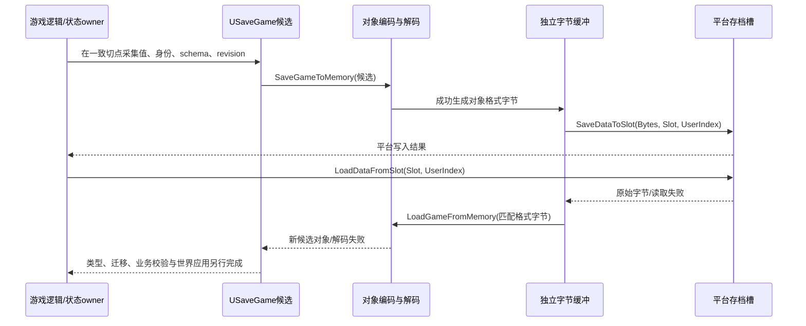
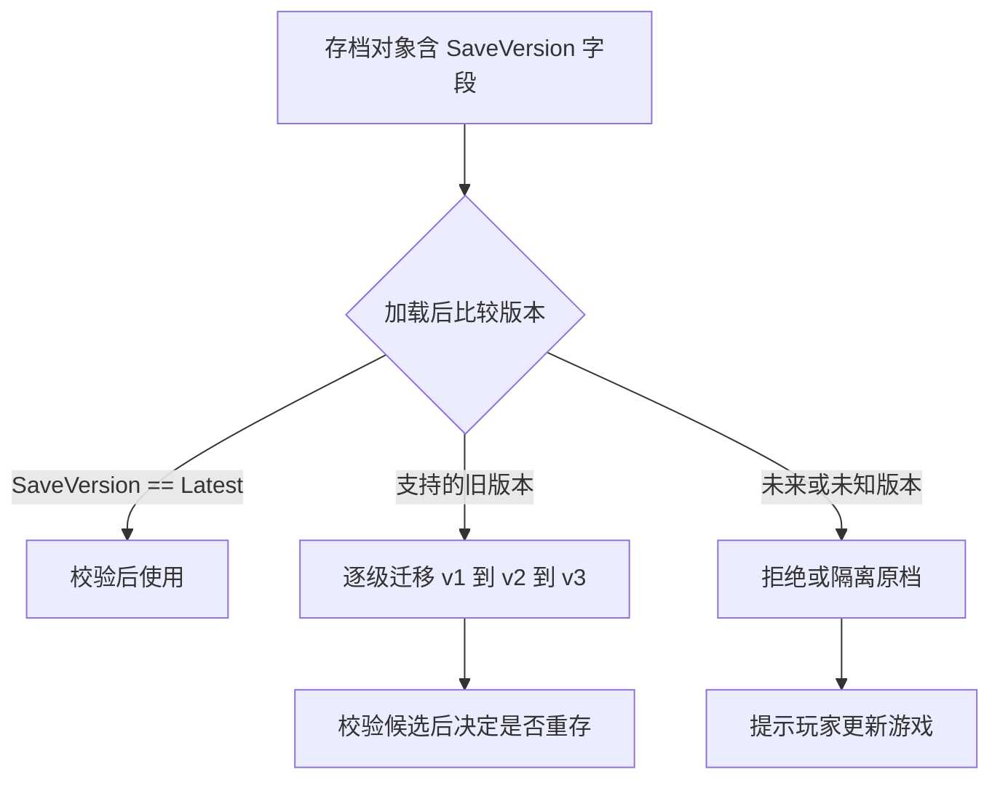
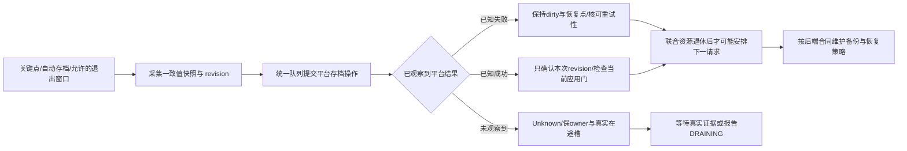
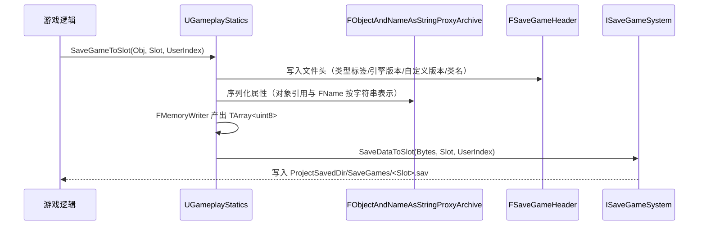
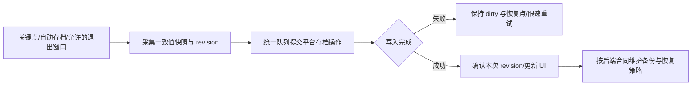

# 12 SaveGame 存档系统与序列化

> 知识成熟度：L2。本文是官方合同核阅与有限工程推演，不代表UE实现或平台故障验证。
> 知识基线：2026-10-09实际选读的Epic公开文档/API，网页标题显示Unreal Engine 5.8；本文未读取对应Engine checkout，不能据此认证5.8.0、某个CL或旧源码行号。具体已读段落、专页缺口与替代依据见“本次官方来源与验证边界”。
> 版本基线：本轮所读Epic公开页面标为UE5.8；未认证目标工程的5.8.0、CL或源码布局。
> 最后更新：2026-10-09（对象/字节/槽API、LocalPlayer助手、保存编排、迁移与恢复边界的静态修订）。
> 适用范围：客户端或本地玩法选定状态的存档、槽位与用户路由、版本迁移、跨地图恢复编排。联网资产仍由其权威服务负责；本篇不是世界服日志恢复或通用事务框架。
> 验证入口：文末“练习与验收”给出P01–P17有限PAPER_EXPECTED和原八类真实项目验证设计，全部NOT_RUN。未运行UE/PIE、UHT/C++编译、教学模型、文件故障、网络或性能实验；旧原文与历史异文逐字保存在同篇末尾。

## 概述

存档要回答“退出后恢复哪一份进度”。例如购买前钱包100、物品数0，购买后钱包90、物品数1；把购买前的背包和购买后的钱包拼成(90,0)，即使序列化与写槽都成功，也不是合法的一次进度。先定义要持久化的状态与一致采集边界，再选择如何编码、存储和恢复。

UE的SaveGame系统围绕自定义`USaveGame`对象工作：游戏从活状态采集数据到对象，编码为字节，交平台槽位存储；加载则产生候选对象，再由游戏解释并应用。它没有自动保存整个World，也不替项目完成迁移、对象重建、云冲突或资产事务。`USaveGame`是可扩展的UObject数据容器，业务代码仍应主动选择持久字段，避免把运行时管理器和Actor指针当成完整快照。[存读档总览](https://dev.epicgames.com/documentation/en-us/unreal-engine/saving-and-loading-your-game-in-unreal-engine)

理解这条链需要UObject反射/GC、值与对象引用、同步/异步调用三个前置概念。先读懂下面的四个里程碑，便能解释“返回true了为什么进度仍可能丢”“读出了对象为什么世界还没恢复”。

| 层 | 产物与责任 | 该层成功尚不能证明 |
| --- | --- | --- |
| 游戏状态→候选对象 | 项目在合法切点采集选定字段，绑定profile、schema和revision | 数据已经编码或写槽 |
| 对象↔内存字节 | 对象序列化/反序列化与格式解释 | 平台持久化、一致采集或候选业务合法 |
| 字节↔平台槽 | 平台API报告本次读取/写入结果 | 跨槽事务、断电耐久、云同步或服务器认可 |
| 候选→选定世界状态 | 项目迁移/校验、等待正确世界与资源、重建/应用 | 任意对象图、所有GAS/物理/网络状态都已恢复 |

## 核心概念表

以下是当前公开API职责与本文工程术语，不以历史行号作为本轮源码证明。

| 概念 | 英文/入口 | 作用与边界 |
| --- | --- | --- |
| 存档对象 | `USaveGame` | 项目定义的持久数据载体；普通UObject引用不使目标对象图自动深存储 |
| 每玩家助手 | `ULocalPlayerSaveGame` | 关联LocalPlayer、槽和版本/状态钩子；返回值与失败默认化见§5 |
| 同步保存/读取 | `SaveGameToSlot` / `LoadGameFromSlot` | 组合对象格式与平台槽操作；前者bool为该保存结果，后者返回基础SaveGame指针或失败 |
| 异步保存/读取 | `AsyncSaveGameToSlot` / `AsyncLoadGameFromSlot` | 分离平台I/O阶段，创建/编码/解码及完成回调仍有游戏线程工作 |
| 对象与内存字节 | `SaveGameToMemory` / `LoadGameFromMemory` | 同步编码到TArray或从匹配格式字节产生对象，尚未读写平台槽 |
| 原始字节与槽 | `SaveDataToSlot` / `LoadDataFromSlot` | 同步传送字节缓冲；不会自动给任意自定义字节补上SaveGame对象格式 |
| 存在/删除 | `DoesSaveGameExist` / `DeleteGameInSlot` | 存在性观察或删除请求；查询不锁住后续读写，删除也需纳入编排 |
| 引擎存档头 | 历史实现名`FSaveGameHeader` | 识别格式/兼容信息/类身份的实现线索；精确旧字段布局保存在历史，不当公开wire协议 |
| 平台存档接口 | `ISaveGameSystem` | 平台特性与文件后端抽象；枚举、多用户、并发能力要看具体实现 |
| 通用文件后端 | `FGenericSaveGameSystem` | 使用常规文件存取；开发平台路径不推广到所有打包/主机平台 |
| 蓝图异步节点 | `UAsyncActionHandleSaveGame` | `Completed`提供对象和Success；立即执行输出Out不是保存完成 |
| 业务schema / 内容revision | `SaveVersion` / `SnapshotRevision` | 前者说明如何解释数据；后者标识采集的进度，二者不互换 |
| 请求与应用代次 | RequestId / SessionEpoch / WorldEpoch / ApplyGeneration | 区分具体保存流程、会话、目标世界及恢复应用；不撤回磁盘写，也不替经济意图幂等键 |

## 原理详解

### 1. 存档整体链路（时序）

下面是基于公开API职责绘制的同步路线，不声称逐调用复刻某个未读取的`GameplayStatics.cpp`。对象格式中的引擎头、反射和代理归档负责不同部分；具体内部布局属于引擎版本。



`SaveGameToSlot`与`LoadGameFromSlot`是组合便利入口；拆成内存与槽API有助于观察和定制各层，但不自动改善一致性或耐久。`SaveGameToMemory`和字节槽API是同步操作；不能因为缓冲在内存就把它们叫后台任务。独立字节一旦按项目格式冻结，后续活对象变化不会自动追进该字节。任意Actor的自建字段Archive、压缩/加密输出和引擎SaveGame对象格式不能仅因都是`TArray<uint8>`就互换。[内存编码合同](https://dev.epicgames.com/documentation/en-us/unreal-engine/API/Runtime/Engine/UGameplayStatics/SaveGameToMemory)、[官方总览的Binary Saving/Loading](https://dev.epicgames.com/documentation/en-us/unreal-engine/saving-and-loading-your-game-in-unreal-engine)

### 2. 序列化细节：文件头与代理归档器

要区分三个版本：引擎对象存档格式及兼容信息、游戏业务schema、本次快照revision。引擎能解析文件不等于懂得“旧耐久单位变成百分比”或“旧物品ID应映射到哪个新定义”。项目应显式保存业务版本，并在支持区间内迁移。

历史记录中的`FSaveGameHeader`包含类型标签、引擎存档格式/包版本、引擎版本、自定义版本及类路径等字段，完整表和当时源码行号见历史附录。本轮没有读取该内部结构，不认证它的精确顺序、字节宽度或兼容范围。需要在对象解码之前判定自定义格式时，应另有真正的外层格式及有界读取器，不能把UPROPERTY声明顺序当文件头协议。

`FObjectAndNameAsStringProxyArchive`处理UObject引用与FName的字符串表示，内层Archive承接字节读写；它不是自动创建运行时实例的对象图快照器。`bLoadIfFindFails`可影响未找到引用时的加载尝试；公开API还列出redirect相关开关，但本轮没有证明默认槽API在目标版本如何设置这些开关。Core Redirects提供名称重映射机制，不保证任意SaveGame类/属性改名无需旧档验证。[代理Archive](https://dev.epicgames.com/documentation/en-us/unreal-engine/API/Runtime/CoreUObject/FObjectAndNameAsStringProxyArchi-)、[Core Redirects](https://dev.epicgames.com/documentation/en-us/unreal-engine/core-redirects-in-unreal-engine)

项目自定义Serialize可使用Custom Version GUID及归档版本容器，但版本必须跟对应字节保存/恢复，不能只在当前进程注册最新值。普通业务候选加载后的迁移用显式`SaveVersion`通常更容易解释；两种方案都不替代实际历史样本。[FArchiveState](https://dev.epicgames.com/documentation/en-us/unreal-engine/API/Runtime/Core/FArchiveState)

### 2.1 `SaveGame` 标记与 Archive 开关不是同一件事

**默认`SaveGameToSlot`与`SaveGameToMemory`的合同均说明写非Transient属性、不检查SaveGame属性标记。** 去掉某字段的SaveGame标记不能证明它已排除。下面只讨论标准反射路径，重写Serialize、SkipSerialization及原生结构自定义序列化仍有各自规则。[槽保存](https://dev.epicgames.com/documentation/en-us/unreal-engine/API/Runtime/Engine/UGameplayStatics/SaveGameToSlot)、[内存保存](https://dev.epicgames.com/documentation/en-us/unreal-engine/API/Runtime/Engine/UGameplayStatics/SaveGameToMemory)

| 层次/开关 | 职责 | 不能推出的结论 |
| --- | --- | --- |
| `UPROPERTY(SaveGame)` | 为选择性存档过滤标记字段 | 默认槽API因此只存这些字段；它也不是复制标记 |
| `Ar.ArIsSaveGame = true` | 自建Archive沿标准反射路径使用相应SaveGame过滤语义 | 自定义Serialize一定服从过滤、自动创建Actor或修复对象图 |
| `FMemoryWriter(Bytes, true)`的持久化参数 | 建立面向持久数据的归档语义，关系到Transient处理 | 已写磁盘、后台I/O、ArIsSaveGame或断电耐久 |
| `Ar.ArNoDelta = true` | 禁止相应属性差量序列化 | 完整世界快照、被过滤/原生字段自动加入、对象引用深复制或跨帧一致 |
| 代理的`bInLoadIfFindFails` | 读引用时找不到对象可尝试加载 | 自动重建运行时实例、实例身份迁移或SaveGame字段过滤 |

过滤、持久化、引用表示、差量是独立的轴。`DuplicateTransient`针对复制重置，不能替代`Transient`的存读边界。[属性说明符](https://dev.epicgames.com/documentation/en-us/unreal-engine/unreal-engine-uproperties)、[Archive状态](https://dev.epicgames.com/documentation/en-us/unreal-engine/API/Runtime/Core/FArchiveState)

```cpp
// 原创概念节选：同一USaveGame子类，采用默认槽/内存对象API。
UPROPERTY() int32 Chapter = 1;          // 参与默认属性存储
UPROPERTY(SaveGame) int32 Coins = 0;    // 同样参与，不是默认API检查标记的结果
UPROPERTY(Transient) float UIProgress = 0.0f; // 运行时缓存
int32 NativeOnly = 0;                  // 默认反射序列化不会发现
```

自建字段快照可以采用以下配对片段。写者只接受项目已验证、游戏线程上可访问的对象；读者只接受**匹配格式、已验证来源与长度的教学字节和可丢弃的隔离候选**。不能向活World中的任意Actor直接读入后声称失败会自动回滚。这里没有引擎对象存档头，也没有对象登记/重建/关系修复功能；需包含MemoryWriter、MemoryReader及ObjectAndNameAsStringProxyArchive相应头文件。

```cpp
// 原创教学节选，未编译；只处理匹配的标准字段快照。
bool CaptureFields(UObject& Source, TArray<uint8>& CandidateBytes)
{
    CandidateBytes.Reset(); // 调用方提供独立候选缓冲，不覆盖已确认好档
    FMemoryWriter Writer(CandidateBytes, /*bIsPersistent=*/true);
    FObjectAndNameAsStringProxyArchive Ar(Writer, /*bInLoadIfFindFails=*/false);
    Ar.ArIsSaveGame = true;
    Ar.ArNoDelta = true; // 只选择非差量属性写法，不代表完整对象图
    Source.Serialize(Ar);
    return !Ar.IsError(); // false时丢弃CandidateBytes，不继续写槽
}

bool RestoreFieldsIntoCandidate(const TArray<uint8>& Bytes, UObject& Candidate)
{
    // 调用方已确认来源/格式/版本/长度；Candidate可丢弃，不是已发布活World。
    FMemoryReader Reader(Bytes, /*bIsPersistent=*/true);
    FObjectAndNameAsStringProxyArchive Ar(Reader, /*bInLoadIfFindFails=*/false);
    Ar.ArIsSaveGame = true;
    Ar.ArNoDelta = true;
    Candidate.Serialize(Ar);
    return !Ar.IsError(); // false时不发布Candidate，UObject不直接delete
}
// 无Archive错误之后仍须项目类型、身份、schema和业务验证。
```

读写开关与版本须配对；嵌套USTRUCT的外层及成员也按过滤合同标记。一个根字段带SaveGame不证明所有子字段都写入；手写Serialize可以改变路径。`IsError()`只能报告归档所检测到的错误，不能证明数据业务合法或没有不受控分配。P01给出两种过滤路径的有限对照。

### 3. 槽位与用户索引

槽名是逻辑标识，由应用生成并限制字符/长度；通用文件实现会映射到文件，但不要直接把任意外部输入拼成路径。官方总览只把开发平台的`.sav`与`Saved/SaveGames`作为常见位置；打包后的保存根、平台沙箱、用户授权、配额及数量上限须核目标后端。

UserIndex是平台路由参数，官方明确部分平台忽略它。应用的稳定profile身份、当前LocalPlayer对象、UserIndex不是同一东西。逻辑key可明确为backend/profile/slot，再映射到经过验证的平台参数；当后端忽略UserIndex时，仅把0改成1不足以隔离两位玩家。切账号也不能把旧请求偷偷改投新路由。[槽API参数](https://dev.epicgames.com/documentation/en-us/unreal-engine/API/Runtime/Engine/UGameplayStatics/SaveGameToSlot)

存在性、枚举和内容验证分别回答不同问题：

- `DoesSaveGameExist`是当时观察，不证明字节有效、schema支持或后续读取不会失败，也不提供查询-读写事务
- `ISaveGameSystem::GetSaveGameNames`不是所有平台都能提供。枚举失败/不支持不能当合法空列表；它不是一个通用GameplayStatics蓝图枚举入口
- 接口还区分多用户能力及更丰富的存在性结果；若只用高层bool/null，不凭空生成精确失败原因。某些便利接口将各种读取错误折叠为不存在，更须看具体合同

以上能力见[ISaveGameSystem](https://dev.epicgames.com/documentation/en-us/unreal-engine/API/Runtime/Engine/ISaveGameSystem)。槽列表可采用受支持的后端枚举，或自维护带profile/槽/generation及摘要的索引。后者只是加速目录：内容S12写成、索引仍S11时，没有跨槽事务把二者绑定。以实际记录核验目录引用；索引失败不撤销已知内容结果，也不是删除未列出好档的授权。枚举/修复不具备时明确显示限制，不自动清空档案。P10/P14说明判据。

### 4. 异步读写与蓝图节点

原生保存回调携带槽名、用户索引和bool；原生加载回调携带槽名、用户索引和`USaveGame*`。蓝图`UAsyncActionHandleSaveGame`的Completed携带对象与Success，Out只是立即执行输出。游戏线程上的调用不会因为名字含Async就自动迁移所有工作到后台。

| 阶段 | 公开合同/项目责任 | 成本和寿命 |
| --- | --- | --- |
| 状态采集 | 项目在一致逻辑边界复制值/身份 | 大数组遍历、复制和分配仍可能卡顿；异步API不修正混合快照 |
| 异步保存 | 游戏线程序列化，工作线程平台写，游戏线程完成回调 | 委托payload可能复制到工作线程，必须可安全按值复制 |
| 异步加载 | 工作线程平台读，游戏线程创建/反序列化及完成回调 | 不把UObject创建、解码或后续资产解析都放到工作线程 |
| 世界应用 | 项目等待正确世界/资源，受控应用 | 生成Actor、关系修复、GAS重建和通知另有成本/副作用 |

依据：[AsyncSaveGameToSlot](https://dev.epicgames.com/documentation/en-us/unreal-engine/API/Runtime/Engine/UGameplayStatics/AsyncSaveGameToSlot)、[AsyncLoadGameFromSlot](https://dev.epicgames.com/documentation/en-us/unreal-engine/API/Runtime/Engine/UGameplayStatics/AsyncLoadGameFromSlot)。不要捕获即将退出的栈引用、裸World/Actor并假定它们还能访问；游戏线程/GC保活也不证明当前世界或业务代次仍适用。

部分平台不支持同时读和写，需按真实后端合同编排保存、加载、删除和必要元数据操作。[蓝图异步节点](https://dev.epicgames.com/documentation/en-us/unreal-engine/BlueprintAPI/SaveGame/AsyncSaveGametoSlot)明确提示这一限制；ISaveGameSystem公开的异步pipe说明也不保证顺序，不能将它推成全后端及同步/异步混用的FIFO。下面选择应用层单后端串行模型来解释。

### 4.1 异步的是哪一段：快照、队列与过期结果

在游戏线程的明确状态边界采集候选并绑定SnapshotRevision。跨多帧采集需要固定逻辑revision/一致视图，否则“扣钱后钱包＋购买前背包”仍会被成功编码。冻结的是本次候选及已生成字节，不能在完成时拿当前活对象冒充已存内容。

同key保存r10期间活状态推进到r12：r10成功仅确认r10，dirty仍为true；失败不推进保存水位。迟到回调先匹配RequestId/key，再根据session/world/apply代次及当前接纳门判断能否更新UI/应用世界。过期结果仍归原请求owner收束，不能直接丢失资源/队列责任。

自动档只可合并**尚未登记**且同key的候选，手动命名快照不可未经产品语义就合并。已登记数据与一次许可不替换。会话token能拒绝旧结果应用，不能撤回已发出的磁盘写；换账号/复用物理槽前必须解决冲突写和路由隔离。有限计数不得在未决窗口内回绕重用。

GC可追踪引用保持对象生命期；弱引用只给非拥有访问与有效性检查；委托UObject弱绑定不保证后端取消或请求收尾。持有GameInstance服务也不等于旧Actor仍在当前世界。[Object Pointers](https://dev.epicgames.com/documentation/en-us/unreal-engine/object-pointers-in-unreal-engine)、[Delegates](https://dev.epicgames.com/documentation/en-us/unreal-engine/delegates-and-lambda-functions-in-unreal-engine)

### 4.2 有界保存编排：许可、结果与资源三轴

下面选择一套**静态宿主适配前提与有限政策**来解释为什么仅有完成回调还不够。状态名都是应用设计，不是UE原生枚举、取消接口或已运行实现。上述异步保存/加载公开API支持其工作/完成语义，但没有证明完整submit包装、宿主、回调和派生任务的访问全序。实际接入前须把以下所有访问来源及证明事件映射到目标适配代码；映射缺失时停止在外调之前，不能只添加一个未定义的Quiet()/Drain()谓词后宣称完成。

#### 4.2.1 三个独立状态轴与明确owner

| 轴 | 教学状态/记录 | 它不能证明什么 |
| --- | --- | --- |
| 观察结果Outcome | Pending / Unknown / KnownSuccess / KnownFailure，绑定原RequestId/key/revision；只记录一次一致终态 | KnownSuccess/Failure不证明submit包装或回调已退出；Unknown不等于失败 |
| 提交进度Submit | 未接纳 → REGISTERED（一次许可未消费）→ INVOKING（许可已消费）→ API_RETURNED → WRAPPER_EXITED；另有确证未发起的NotSubmitted记录 | API_RETURNED只说明外部函数返回；包装可能仍读写record，甚至结果尚Pending |
| 访问与责任Access | registry owner O；submit/包装访问引用S；callback来源保留Csrc；每个实际活动回调/转接包装Cactive；每个派生访问D；记录各自结束或具体移交收据 | strong/weak指针存在与否不自动证明无未来回调、无冲突磁盘写或关闭完成 |

O独立于UI/旧World，登记时接管record、不可变候选、GC可追踪的SaveGame对象引用、应用持有的字节及完成责任。S覆盖调用外部API前、外部API执行以及返回后的包装最后访问。实际回调/转接包装在入场前取得覆盖其最后访问的稳定引用；Csrc在外调前登记，负责未来回调及其捕获依赖的来源，不能因“当前活动回调数为0”就删去。D必须在派生访问可能开始之前登记并得到覆盖寿命，或在共同串行域中把具体资源和遗留责任交给明确的新owner。

只给一个对象加UPROPERTY不自动满足整个账本。不能把UI的CreateUObject弱绑定作为O，也不能在GameInstance退出时连同O一起析构尚未结束的责任。若不能在提交前落实覆盖close窗口的O/S/Csrc及其依赖，就不接纳、不外调；若已调用而证据后来不可得，保O及占用并报告INCOMPLETE/DRAINING。

#### 4.2.2 选定唯一许可政策：已登记的一次许可仍消费

接纳、登记、代次变化、close、许可消费和状态记账都采用同一游戏线程串行域；若实现含锁，临界区中不调用任何可重入外部代码。close先取得域则候选不接纳；若登记先取得域，原子检查OPEN、当前profile/key/代次、候选、数量/字节容量后，登记REGISTERED、保留唯一真实在途容量并授出一次许可。这个原子点是**本地编排接纳点**，不等于平台写入或权威业务提交。

本方案**不撤销已经授出的许可**。close/换代后来到达只禁止新接纳和新世界/UI发布；REGISTERED仍在registry、关闭扫描及容量账中，由O保证消费恰好这一许可。消费在同一域内把REGISTERED改INVOKING并取稳S/Csrc，随后退出临界区外调一次；不重新依据close把它当作未提交删掉，也不改投新profile/slot。原捕获平台路由无效时接受实际失败，不自动使用新账号路由。平台注册/权威端自己的许可检查仍按其合同，不能把本地许可当扩权。

若底层可能同步callback，外调绝不能持不可重入锁；callback只进入短暂的同一状态串行域更新记录，退出后做允许的外部通知。最终UI/World应用在实际发布点复核当前OPEN、key/session/world/apply代次及恢复ready，不因旧请求有提交许可而绕过。

NotSubmitted是需要证据的应用记录，不是close的别名。本例的常规NotSubmitted只用于：在共同串行域内明确没有建立登记/许可、没有任何可外调路径取得许可的拒绝候选。登记结果不明不能标NotSubmitted。本例没有REGISTERED→撤销捷径；已经REGISTERED但执行者不能消费时停在INCOMPLETE/DRAINING并由O承接，不清槽。某具体API明确返回“未调度”只能记录该次调用没有建立后端操作；API确已被调用，仍必须等包装和可能的回调来源/访问退出，不能跳过资源退休。

未登记的普通待提交候选可在close时明确拒绝并释放其自身数据；REGISTERED虽尚未调用，也不能与这种队列一起清空。自动档只允许合并**尚未登记**、同key的候选；登记后快照、身份及容量绑定不可替换。close先到与登记先到的两条纸面顺序见P08。

#### 4.2.3 同步callback可以完成结果，不能替submit退场

callback若在外部API返回之前发生，可按原身份记KnownSuccess/KnownFailure；当前接受门仍允许时可更新相应保存观察，r10成功而活状态r12仍dirty。它不删除O，不释放仍被S/Cactive/Csrc/D访问的对象/字节，也不启动Q2。当前callback不得在自己的函数尾部把自己标为“已经退栈”；只可在实际回调及其转接包装返回且结束最后访问之后，由外层适配/调度观察记录退出收据。

同理，外部API返回后包装还可能查看结果/处理返回值，因此API_RETURNED不等于WRAPPER_EXITED。WRAPPER_EXITED收据须在submit及包装实际完成最后访问后记录。外层适配器若继续访问record也属于已登记访问来源，不能通过换名字把它排除。最终退休观察者本身保持局部稳定引用到清理最后一次访问，并把下一请求安排到它返回后的调度轮，不能删除registry引用后继续借用悬空数据。

Csrc只能依据真实适配层的“该来源以后不会再调用或访问捕获依赖”证据结束；当前回调返回、绑定失效、计时到期或收到业务结果均不是这一证据。公开高层API没有在本轮提供完整宿主证明，因此文末纸例将Csrc终止作为**显式给定的适配前提**；实际工程未核实则保持未知。不能伪称UE默认有通用cancel/drain/quiet成功事件。

#### 4.2.4 联合退休、关闭完成与有限停止线

归还唯一真实在途槽之前，原请求必须同时满足：

1. 本请求的许可已消费且不会再次授出；或属于上述已证明未接纳的NotSubmitted分支。未消费REGISTERED仍占容量
2. 有真实平台/适配合同证据表明该请求不再产生冲突写。完成结果可提供它合同内的操作完成证据，但不能扩成断电耐久或内部所有线程无访问
3. submit及其包装的最后访问实际结束（WRAPPER_EXITED），不能由callback替代；所有已进入callback及转接包装实际退出
4. 所有未来callback/捕获访问来源Csrc已经按实际合同结束，派生访问D也已结束。本有限主例不使用“未结束但看似无害”来归还槽
5. 若关闭宿主必须移交仍未结束的责任，必须在共同串行域中把**整个请求记录、对象/字节依赖、未消费许可或调用进度、Csrc/Cactive/D和真实在途容量占用**一起交给已确认接手的owner，并禁止旧owner后续访问。只转交UI/句柄/字节不成立；旧宿主仍有S/Cactive/转接包装最后访问未结束时也不能自报资源退出。这种移交不归还全局在途槽，由接手者继续满足1–4

退休只在以上证据收齐后的调度点移除registry绑定、记一次容量归还；先保留该操作的可查询结果/未知分类及需保留的恢复责任，再释放已不再访问的依赖。新Q2只有宿主仍OPEN、全部代次/路由/预算成立且已取得空槽，才能重新接纳。close之后即使Q1成功并退休，也不会因此重开或提交Q2。

`CloseRequested`、本地宿主资源已退出、全后端`Closed/Quiescent`、原存储结果已知是不同观察。close封接纳后若仍有REGISTERED/INVOKING/未退场来源，前台最多返回INCOMPLETE/DRAINING。合法移交可以结束原宿主的资源责任，但新owner及全局占用仍存在，不报告全后端已静默。全部登记责任与访问真正退休才可报告该范围关闭完成；即便资源退出，原结果也可能仍需按可知证据记录Unknown，不能补造失败或清dirty。

教学只选一个后端真实在途1、未登记候选2项/B字节，不是平台容量建议。最大尝试数Amax/总deadline约束**新的接纳/前台重试**；到线停止等待和自动重试，不追认取消已授许可、不归还未知资源、不无限派生新尝试。已登记工作仍由O或已确认接手者单次消费并收束。只有已知可重试失败且全部退休、宿主仍OPEN、当前key/代次有效、剩余尝试和时间均为正，才采最新候选并尝试新的接纳。无退场证据时停止在DRAINING，不忙等、不启动冲突同步兜底、不自动生成新恢复协议。

### 5. ULocalPlayerSaveGame：每玩家存档助手

`ULocalPlayerSaveGame`是关联特定LocalPlayer的SaveGame抽象子类，提供槽名、版本与生命周期骨架。用普通GameplayStatics入口读取它时，仍需按使用路线手动Initialize等；不能把“对象已加载”当成“玩家/槽初始化已经齐全”。本轮只核当前类与成员合同，不认证历史所称5.x中具体首发版本。[类API](https://dev.epicgames.com/documentation/en-us/unreal-engine/API/Runtime/Engine/ULocalPlayerSaveGame)

| 入口/状态 | 当前职责 | 读者需特别区分 |
| --- | --- | --- |
| `SetLocalPlayer` / `GetLocalPlayer` | 关联/读取LocalPlayer | LocalPlayer存在不等于平台UserIndex在所有后端有隔离能力 |
| `GetPlatformUserId` / `GetPlatformUserIndex` | 取得当前玩家对应的平台路由 | 不替业务稳定profile身份或登录授权 |
| `SetSaveSlotName` / `GetSaveSlotName` | 配置未来保存的槽名 | 修改槽名不改变已在途请求的绑定 |
| `SaveGameToSlotForLocalPlayer` | 同步执行保存流程 | **bool表示已发起/请求保存**，实际结果经立即调用的HandlePostSave处理 |
| `AsyncSaveGameToSlotForLocalPlayer` | 异步发起保存流程 | **bool仍只表示已请求**，完成后HandlePostSave给实际结果 |
| `GetSavedDataVersion` / `GetLatestDataVersion` / `GetInvalidDataVersion` | 已存/已载版本、当前写版本、尚未保存/载入的无效版本 | 保存请求编号、业务schema和内容revision仍不相同 |
| `WasLoaded` | 是否由已有存档载入 | false不能解释为原槽肯定不存在 |
| `WasSaveRequested` / `IsSaveInProgress` / `WasLastSaveSuccessful` | 曾请求、进行中、至少存过且最近成功等状态 | 不用某次曾成功证明当前请求已成功 |
| `InitializeSaveGame` | 对载入/新建对象进行关联初始化 | 玩家专用load/create路线会调用；普通入口需核自己的初始化责任 |
| `ResetToDefault` / `HandlePreSave` / `HandlePostLoad` / `HandlePostSave` | 默认化、保存前、加载后、保存结果钩子 | 默认化不是备份恢复；业务副作用不能藏在重复加载/迁移中 |
| `ProcessSaveComplete` | 内部保存结果处理并调用HandlePostSave | 不能由内部方法名推断任意并发/整个宿主静默保证 |

上述两个保存助手的bool不能套用`UGameplayStatics::SaveGameToSlot`的结果bool语义。例如助手返回true而HandlePostSave(false)，应显示当次保存失败，不能先把dirty清掉。[同步助手](https://dev.epicgames.com/documentation/unreal-engine/API/Runtime/Engine/ULocalPlayerSaveGame/SaveGameToSlotForLocalPlayer)、[异步助手](https://dev.epicgames.com/documentation/unreal-engine/API/Runtime/Engine/ULocalPlayerSaveGame/AsyncSaveGameToSlotForLocalPlaye-)

载入路线还需区分“已有档”“显式新档”“加载失败后的默认候选”：

- `CreateNewSaveGameForLocalPlayer`明确创建新实例，不尝试从磁盘读取
- `LoadOrCreateSaveGameForLocalPlayer`参数不合法时可返回null；参数合法但加载失败时可以创建新实例，所以非空并不证明原档读成
- `AsyncLoadOrCreateSaveGameForLocalPlayer`返回false表示加载没有调度；已调度但加载失败时会在回调前创建并初始化新实例。未调度无需等待该流程的正常完成回调，但不等于应用submit包装/回调来源资源已经退休，仍按§4.2收束

这些入口由[同步load-or-create](https://dev.epicgames.com/documentation/unreal-engine/API/Runtime/Engine/ULocalPlayerSaveGame/LoadOrCreateSaveGameForLocalPlay-)与[异步load-or-create](https://dev.epicgames.com/documentation/unreal-engine/API/Runtime/Engine/ULocalPlayerSaveGame/AsyncLoadOrCreateSaveGameForLoca-)的具体合同支持。项目需记录候选来源/WasLoaded与可知错误；不能用fallback默认对象自动覆盖一个加载失败、未来schema或暂不可访问的旧槽。默认化的产品政策、备份选择及是否允许新开进度应在自动存档重新开放之前明确。P09给三个结果反例。

### 6. 数据结构设计与版本迁移

引擎存档头不能替你定义游戏业务协议，**游戏级兼容必须自建**：



图释：加载对象后先判断支持区间；在候选数据上逐级迁移、校验，成功才标成当前版本。是否写回磁盘是后续独立步骤；拒绝未来版本时不得自动覆盖原档。

设计要点：
- 存档对象内放 `int32 SaveVersion`，语义/格式发生不兼容变化时递增；迁移函数做成显式链式（v1→v2、v2→v3），每一步成功才提升版本，未知分支立即失败。引擎可解析二进制不等于业务状态合法。
- 存**数据**与稳定身份：资产定义可用软引用或项目定义 ID；运行时实例必须用稳定实例 ID + 值快照。软引用不是运行时对象持久化的通用替代品（见 6.2）。
- 存档中的 USTRUCT 用 `UPROPERTY` 标注即可被反射序列化；数组/映射（`TArray`/`TMap`/`TSet`）均支持，但结构变更（字段删除/改名）需版本兜底。
- 项目也可注册自己的 Custom Version GUID，并在自定义 `Serialize` 中查询归档版本；它不是仅供引擎使用。版本号要随实际字节格式保存/恢复，不能只存在注册表；已能正常加载对象后的轻量迁移，用业务 `SaveVersion` 更直观。

### 6.1 缺字段、默认值和改名：能读不代表迁对

通用反射加载可为新增字段保留默认值、忽略已删除字段，但类型变更、单位变更、枚举含义变化仍须迁移。[UObject 序列化说明](https://dev.epicgames.com/documentation/en-us/unreal-engine/unreal-object-handling-in-unreal-engine)

- **缺字段不等于写过最新 schema**：若新加 `SaveVersion` 并默认设为 `LatestVersion`，没有该字段的历史档可能保留这个新默认值，从而跳过迁移。使用“未知/无版本”哨兵，再为**明确创建的新档**显式设最新版本；旧无版本格式只能在有历史证据时映射为已知版本。
- **默认值是兼容协议的一部分**：例如旧档没有“耐久百分比”，新 CDO 默认 0 会使全部旧物品损坏。对应迁移应明确赋 100，而不是依赖将来会变化的构造默认值。
- **保留旧名称与类型**：迁移要读 `OldPlayerName`，就要保留旧档实际写出的该属性名/类型；随手改为 `OldPlayerName_Legacy` 并不会读到旧值。Core Redirects 可提供名称映射机制，但具体 SaveGame 路径、归档开关与打包结果要用真实旧档验证。
- **不要把 `SaveVersion` 放在源码第一行当二进制协议**：属性声明顺序不是手写文件头合同。若必须在创建 UObject/解析属性前拒绝未来格式，应使用自己的外层 envelope（magic、format version、长度等）或版本感知读取器；只在 `LoadGameFromSlot` 后检查字段无法保护此前的解析。
- **迁移不触发玩法副作用**：先离线转换候选数据并检查数量上限、ID 唯一性、引用闭合和数值范围，再一次性应用。不要在迁移过程中调用“奖励物品”或完成任务事件，否则重试可能重复发奖。失败保留原文件；成功重存也保留恢复点。

### 6.2 对象身份：资产、关卡实例与生成实例

默认代理归档保存对象**引用的表示**，不会沿着某个 `UObject*` 自动保存并重建整个引用对象图。硬引用在通常资产加载中的依赖语义，不能直接外推为 SaveGame 深层持久化语义。软引用记录资产路径并支持按需加载，但不包含该对象的运行中变化。[对象指针说明](https://dev.epicgames.com/documentation/en-us/unreal-engine/object-pointers-in-unreal-engine)、[资产引用](https://dev.epicgames.com/documentation/en-us/unreal-engine/referencing-assets-in-unreal-engine)

| 要表达的身份 | 推荐记录 | 读档动作 |
|---|---|---|
| “铁剑是哪种定义” | 资产软路径或受控 `ItemDefinitionId` | 解析定义，检查是否已打包、DLC 是否存在、旧 ID 是否迁移 |
| “这一把铁剑是哪一个实例” | 首次创建时分配并持续保存的 `FGuid` + 数量/词条/耐久 | 按同一 ID 重建，不能每次读档生成新 ID |
| “地图上的这个箱子” | 地图/世界身份 + 项目持久化的稳定实例 ID + 状态 | 先匹配已加载对象；流送单元尚未加载则等待，不因暂时找不到就乱生成 |
| “玩家后来生成的建筑” | 稳定 ID + 受控生成类型 ID/类软引用 + Transform + 状态 | 经白名单校验后生成、登记 ID，再修复关系 |
| “背包槽指向哪个实例” | 已持久化实例 ID | 第二阶段查 ID→对象表；缺失、重复、循环关系按策略处理 |

建议恢复分两阶段：先创建/查找全部允许恢复的实例并登记 ID，再应用值数据和对象间引用，最后通知玩法系统恢复完成。对被摧毁的关卡对象保存 tombstone（删除标记），否则重开地图的初始对象可能复活。不要用指针地址、数组下标或运行时自动生成的 Actor 名作为跨进程身份；UUID 也必须在正确生命周期内稳定分配并检查重复，不能只是每次保存时 `NewGuid()`。

### 6.3 先验证候选，再决定恢复计划

处理顺序是：读取字节/对象 → 记录可知错误 → 核候选实际类型 → 核支持的源schema与源约束 → 逐级迁移隔离候选 → 验当前业务规则 → 建立受控世界恢复计划。`Cast`成功只回答类型，`SaveVersion`支持只回答有解释路线；两者都不替数量、定义、重复ID和引用闭合检查。

普通API只返回bool/null时，失败原因可能不够细。`ApiLoadFailed`只能说明该层未得到对象；有对象却Cast失败才能叫`TypeMismatch`；已解码出未来版本才能叫`UnsupportedSchema`。迁移失败、业务验证失败与WorldNotReady分别记，不把null一律叫“损坏”或“不存在”。拒绝未来schema时保留原档，不能回退默认对象后立即自动写回。

纯数据候选可以在失败时丢弃，活World不一定可回滚。恢复计划先检查profile、map/规则版本、稳定ID唯一性、受控生成类型与必需引用；缺失可延期的流送对象保留待办，缺失必需依赖或同ID冲突则停止发布相应恢复范围。应用时先匹配/创建/登记，再施加值与引用、删除标记，最后验收这个**选定子集**。

创建Actor本身可能执行构造、组件初始化和BeginPlay；“两阶段恢复”这几个字不能让副作用自动事务化。项目需明确恢复模式、玩法接纳门、抑制重复奖励/通知及失败后的恢复路径。若创建/应用中途失败而无回滚合同，不能让半恢复世界继续玩法并宣称整档成功。此处没有新的万能World恢复器。[Actor Lifecycle](https://dev.epicgames.com/documentation/en-us/unreal-engine/unreal-engine-actor-lifecycle)

### 7. 与 GameInstance / 关卡 / Subsystem 配合

- **保存编排的宿主**：GameInstance或其Subsystem适合在同一个GameInstance生命周期中跨地图保存profile数据与请求；GC可追踪引用持候选，不靠裸指针。服务的Deinitialize不替平台请求排空，§4.2的稳定owner必须覆盖关闭窗口
- **世界应用的宿主**：WorldSubsystem适合协调该World内的恢复计划，LocalPlayer相关数据按正确玩家路由。Subsystem存在不表示所有Actor、组件、资产或流送单元已ready；取得错误World上的服务也不能应用候选
- **正确接受点**：Load回调只交候选。实际应用点再次核profile/session/world/apply代次、map/规则版本、资源与实体登记状态以及OPEN/恢复模式；依赖未就绪则保持待办，不凭一个BeginPlay事件推所有目标已完成初始化
- **退出与复入**：旧World的Actor可能EndPlay而暂未GC，流送快速复入还可能使用同一实例。对象仍能被引用不证明它属于当前恢复范围或尚未应用过；重复通知需按稳定ID和应用代次处理

这些是存档管理器与世界应用器的项目分工，不提供任意World的统一初始化全序。[Subsystem宿主生命周期](https://dev.epicgames.com/documentation/en-us/unreal-engine/programming-subsystems-in-unreal-engine)、[Actor载入/生成/退出](https://dev.epicgames.com/documentation/en-us/unreal-engine/unreal-engine-actor-lifecycle)。既有World/Subsystem篇继续负责生命周期模型，字符串篇负责类型选型；文末原导航保留。

### 8. 平台差异与云存档

| 平台/能力 | 本轮可支持的说明 | 仍需目标项目核实 |
| --- | --- | --- |
| 开发平台 | 官方教程说明`.sav`通常在项目Saved/SaveGames；通用后端使用常规文件 | 打包路径、沙箱、用户隔离、文件替换/刷新与恢复行为 |
| iOS/主机 | 使用相应平台的存档能力，不能照搬PC路径 | 专用实现/SDK、用户授权、并发限制、大小数量及生命周期窗口；旧iOS文件存在记录仅保留历史 |
| 多用户/枚举 | ISaveGameSystem暴露相应接口与能力边界 | 后端是否忽略UserIndex、能否枚举，失败能提供多细原因 |
| 平台云同步/额外云存储 | 可在本地槽之外提供服务 | 同步完成、认证/配额、跨设备共同祖先与冲突决策，不能由本地bool推定 |

本轮未读取主机/iOS SDK或云服务合同，不列未经核验的统一配额或耐久承诺。依据：[存读档总览](https://dev.epicgames.com/documentation/en-us/unreal-engine/saving-and-loading-your-game-in-unreal-engine)、[通用后端身份](https://dev.epicgames.com/documentation/en-us/unreal-engine/API/Runtime/Engine/FGenericSaveGameSystem)、[平台接口](https://dev.epicgames.com/documentation/en-us/unreal-engine/API/Runtime/Engine/ISaveGameSystem)。

### 9. 可序列化类型边界

`USaveGame` 能存什么，取决于 UObject 反射序列化（Reflection Serialization）对类型的支持。常规口径（引擎反射能力，非 5.8 特例）：

| 类型 | 可存档 | 说明 |
|---|---|---|
| 基本类型（bool/int/float/double） | ✅ | 直接 UPROPERTY |
| `FString` / `FName` / `FText` | ✅ | 值/名称/本地化语义不同；不把显示文本一律ToString后宣称信息不丢失，见FAQ9 |
| 枚举 / 结构体 USTRUCT | ✅ | 结构体内部同样按 UPROPERTY 递归 |
| `TArray` / `TMap` / `TSet` | ✅ | 元素须可序列化；TMap 键建议用 FName/基本类型 |
| `FSoftObjectPath` / `FSoftClassPath` | ✅ | 可表达资产/类路径；加载、打包可达与改名迁移仍由项目处理，不表示动态实例状态 |
| `TObjectPtr` / 反射可见的 `UObject*` | ⚠️ | 引用可被序列化，不等于对象内容深存储；需对象仍可被正确解析 |
| `AActor*` / `UActorComponent*` | ⚠️ | 引用表示可写，不保证跨会话有效，也不会自动重建 Actor/组件；采用稳定 ID + 快照 |
| Lambda / 函数指针 | ❌ | 不可序列化 |

> 结论：区分“可编码”“可解析”“业务上有效”三层。字段以值类型、资产引用、稳定实例 ID 和 USTRUCT 快照为主；标准属性序列化不支持的原生成员须显式写读。

### 10. 保存时机与自动存档策略



图释：这是游戏侧编排方案。已知结果、资源退休与后续提交分别判断；未观察结果不释放互斥容量。平台保存成功也不自动等于多槽事务、断电持久性或云端同步成功。

- **触发时机**：关键节点显式请求；自动存档用脏 revision + 节流合并（60s 只是项目例子，需按可丢失进度和 IO 预算调节）。不要把仅在退出/切后台时保存当唯一保障，系统杀进程可能不给足时间。
- **同步兜底有前提**：先协调在途异步请求，并确认该平台生命周期窗口允许阻塞；禁止“异步没回完就再同步写同槽”作为通用补救。
- **防写坏档**：只有掌控底层文件系统且核实平台 API 合同后，才能实现临时文件、必要的持久化屏障、校验、原子替换。`SaveGameToSlot(Slot + ".tmp")` 只是另一个逻辑槽位，默认 API 不提供通用 rename/commit 事务。备选为两份独立有效记录 + 单调generation：先确认同profile、格式/schema支持、内容绑定/完整性及项目规定发布条件，再在合法候选中选择。相同generation不同内容、未来schema或发布结果未知须保留对应类别，不凭墙钟强选。仍需验证后端写入与崩溃语义；没有项目定义且可核的结果查询接口时，不发明一条通用“查一下就知道已提交”的API。
- **启动恢复**：存在性只是前置提示，之后依次做读取/解码、schema 支持检查、业务验证，再选择主档/备份/新档。未来版本不可当损坏直接覆盖；损坏档保留诊断副本并防止自动存档污染恢复点。
- **校验不等于防作弊**：CRC/hash 可发现意外损坏，不能证明客户端提交的数据可信。自定义压缩、加密需配套受限长度检查和解码错误处理；高层LoadDataFromSlot之后检查Num不能限制已经发生的读取分配，LoadGameFromSlot后检查数组大小也不保护此前的解码分配。真正的文件/容器/解压上限需在对应读取/解码层执行，不能单靠ArMaxSerializeSize的名字宣称任意路径安全；压缩前先量出采集、序列化、IO、应用各阶段耗时，异步读写不转移全部 CPU 成本。

### 11. 排障速查

| 症状 | 排查方向 |
|---|---|
| 读档返回 nullptr | 先记录ApiLoadFailed；槽名/用户路由、平台读取、对象类型/格式等需要各层证据，不能仅凭null判定文件损坏或不存在 |
| 旧档读出新字段为默认值 | 可能是正常缺字段行为；检查迁移是否显式赋业务默认值，版本字段是否错误默认为最新 |
| 存档文件找不到 | 平台实现差异（主机/云）；`ProjectSavedDir` 在不同打包配置下的差异 |
| 异步保存无可见结果 | 区分无回调观察、UI接收者失效与代次拒绝显示；核真实请求owner。结果可为Unknown，不能据此归还在途槽或认定平台吞回调 |
| 存档过大/卡顿 | 分阶段定位采集、编码/解码、分配、平台I/O、资产加载、世界应用；异步不消除这些CPU成本。待提交候选还需数量/字节预算，默认指针不深存整个对象图 |
| LocalPlayer返回对象却像新档 | 核WasLoaded/候选来源及load-or-create失败默认化；保留原槽，不立即自动写回 |
| 枚举为空或目录摘要落后 | 先核能力与返回结果；索引和内容不是跨槽事务，不据旧索引删除新内容 |

### 12. 本地持久化、联网权威与交易边界

UE 联网模型通常由服务器维护权威状态，客户端副本负责交互与表现。[官方 Networking Overview](https://dev.epicgames.com/documentation/unreal-engine/networking-overview-for-unreal-engine)

据此进行存储设计时，应区分四种“成功”（以下为工程推论）：

| 成功层次 | 已建立的事实 | 尚未建立的事实 |
|---|---|---|
| 序列化成功 | 得到了本次快照字节 | 还没确认平台写入 |
| 槽位写入成功 | 平台 API 报告这次写入成功 | 不自动保证其他槽同步成功、异常断电后仍可读或云同步完成 |
| 云端上传成功 | 指定云对象已按服务合同接受 | 不保证跨设备无冲突，也不保证其中的游戏数值真实 |
| 服务器业务提交成功 | 权威服务按业务规则接受并持久化结果 | 若客户端未收到响应，仍须查询/幂等重试，不能直接重复发奖 |

- 单机进度、画质偏好、按键配置适合本地持久化。联机货币、交易、排名和稀有物品归属不能以客户端上传的一份 `.sav` 为权威；服务器应验证操作意图并保存计算后的结果。Listen Server 的网络权威也不等于受运营方信任的后端。
- “扣款存档 A 成功，再新增物品存档 B 失败”会永久丢物品；反向顺序可形成复制漏洞。一次业务操作的关联状态应在同一受保护提交单元中写入，或由后端事务/日志与恢复协议保证一致性。串行队列只解决时序，不自动提供跨文件事务。
- 后端请求使用操作 ID 去重、版本检查防止过期覆盖；这是应用协议，`SaveGameToSlot` 不提供 exactly-once 业务语义。校验和、客户端内置加密密钥或云存档并不会把不可信客户端变成可信账本。
- 跨设备不能只比较本地墙上时钟决定胜者：系统时间可能回拨，两设备可能从同一祖先各自推进。记录 profile、schema、revision/共同祖先并采用服务冲突策略；无安全自动合并规则时保留双版本，尤其不要把两份背包“相加”。

本地客户端恢复与权威世界恢复分工保持清楚：世界Snapshot需要一致cut、连续已提交前缀、明确恢复目标、旧写端隔离、原业务终态/待办、持久发布与开服门。SaveGame编码或槽回调不能替这些条件作证。服务协议中的业务意图身份、UNKNOWN、提交前登记和真实访问退休也仍适用；本篇RequestId只关联存档流程，不给经济操作增加幂等效果。跨设备无法安全合并时保留双版本及关系，不把两个背包相加或只看本地UTC选赢家。

## 代码与示例

以下示例使用 C++11 已有的构造与控制流写法，面向熟悉 C++11 的读者；**不意味着 UE 5.8 工程可用 C++11 编译器构建**。UE 宏、头文件、UHT 生成代码与工程模块配置依赖目标引擎。示例仅静态审阅，未在 UE 中编译或执行。

**存档结构与明确的新档初始化：**

```cpp
// MySaveGame.h（节选，需 CoreMinimal.h、GameFramework/SaveGame.h，
// 最后 include 本文件的 MySaveGame.generated.h；省略模块导出宏）
USTRUCT()
struct FItemSaveData
{
    GENERATED_BODY()
    UPROPERTY() FName DefinitionId;
    UPROPERTY() int32 Count = 0;
    UPROPERTY() int32 ConditionPercent = 100; // v3 新增
};

UCLASS()
class UMySaveGame : public USaveGame
{
    GENERATED_BODY()
public:
    enum { OldestSupported = 1, LatestVersion = 3 };

    UPROPERTY() int32 SaveVersion = 0; // 未知哨兵；不能默认宣称历史档是 v3
    UPROPERTY() FString OldPlayerName; // 必须与 v1 原始属性名和类型一致
    UPROPERTY() FString PlayerName;    // v2 新字段
    UPROPERTY() FName Difficulty;      // v2 新字段
    UPROPERTY() TArray<FItemSaveData> Inventory;
};

UMySaveGame* CreateNewProfile()
{
    UMySaveGame* Save = Cast<UMySaveGame>(
        UGameplayStatics::CreateSaveGameObject(UMySaveGame::StaticClass()));
    if (!Save) { return nullptr; }
    Save->Difficulty = FName(TEXT("Normal"));
    Save->SaveVersion = UMySaveGame::LatestVersion; // 仅明确的新档路径赋值
    return Save; // 调用方若长期持有，须使用 GC 可追踪引用
}
```

**候选对象上逐级迁移，未知版本失败而非盲增版本：**

```cpp
// MySaveManager.cpp（原创教学节选，未编译）。
// 下列上限/历史schema规则是有限示例合同，不是UE限制或真实产品旧档规则。
bool ValidateSource(const UMySaveGame& Save)
{
    if (Save.SaveVersion < UMySaveGame::OldestSupported ||
        Save.SaveVersion > UMySaveGame::LatestVersion) { return false; }
    if (Save.OldPlayerName.Len() > 64 || Save.PlayerName.Len() > 64 ||
        Save.Inventory.Num() > 10000) { return false; }
    if (Save.SaveVersion >= 2 &&
        Save.Difficulty != FName(TEXT("Normal")) &&
        Save.Difficulty != FName(TEXT("Hard"))) { return false; }
    for (const FItemSaveData& Item : Save.Inventory)
    {
        if (Item.DefinitionId.IsNone() || Item.Count <= 0 || Item.Count > 9999)
        { return false; }
        if (Save.SaveVersion >= 3 &&
            (Item.ConditionPercent < 0 || Item.ConditionPercent > 100))
        { return false; }
    }
    return true;
}

bool ValidateCurrent(const UMySaveGame& Save)
{
    if (Save.SaveVersion != UMySaveGame::LatestVersion || !ValidateSource(Save))
    { return false; }
    if (Save.Difficulty != FName(TEXT("Normal")) &&
        Save.Difficulty != FName(TEXT("Hard"))) { return false; }
    if (Save.Inventory.Num() > 10000) { return false; }
    for (const FItemSaveData& Item : Save.Inventory)
    {
        if (Item.DefinitionId.IsNone() || Item.Count <= 0 || Item.Count > 9999 ||
            Item.ConditionPercent < 0 || Item.ConditionPercent > 100)
        { return false; }
    }
    return true;
}

bool TryMigrateToCurrent(UMySaveGame& Candidate)
{
    if (!ValidateSource(Candidate)) { return false; } // 先核支持的源schema
    if (Candidate.SaveVersion < UMySaveGame::OldestSupported ||
        Candidate.SaveVersion > UMySaveGame::LatestVersion)
    { return false; } // 0/未来版本均拒绝；不能自动重置并覆盖

    while (Candidate.SaveVersion < UMySaveGame::LatestVersion)
    {
        switch (Candidate.SaveVersion)
        {
        case 1:
            Candidate.PlayerName = Candidate.OldPlayerName; // 空名称也保留旧语义
            Candidate.Difficulty = FName(TEXT("Normal"));
            Candidate.SaveVersion = 2;
            break;
        case 2:
            for (FItemSaveData& Item : Candidate.Inventory)
            { Item.ConditionPercent = 100; } // 明确的 v2->v3 业务默认值
            Candidate.SaveVersion = 3;
            break;
        default:
            return false; // 添加新版本时遗漏迁移，立即失败而非假装成功
        }
    }
    return true; // 迁移变换完成；调用方随后独立ValidateCurrent
}

enum class EProfileLoadStatus
{
    ReadyCandidate, ApiLoadFailed, TypeMismatch, UnsupportedSchema,
    SourceInvalid, MigrationFailed, BusinessInvalid
};
struct FProfileLoadResult
{
    EProfileLoadStatus Status;
    UMySaveGame* Candidate; // 只是交给调用方；跨帧持有必须另建GC可追踪所有权
};

FProfileLoadResult LoadWithMigration(const FString& Slot, int32 UserIndex)
{
    USaveGame* Base = UGameplayStatics::LoadGameFromSlot(Slot, UserIndex);
    if (!Base) { return {EProfileLoadStatus::ApiLoadFailed, nullptr}; }
    UMySaveGame* Candidate = Cast<UMySaveGame>(Base);
    if (!Candidate) { return {EProfileLoadStatus::TypeMismatch, nullptr}; }
    if (Candidate->SaveVersion < UMySaveGame::OldestSupported ||
        Candidate->SaveVersion > UMySaveGame::LatestVersion)
    { return {EProfileLoadStatus::UnsupportedSchema, nullptr}; }
    if (!ValidateSource(*Candidate))
    { return {EProfileLoadStatus::SourceInvalid, nullptr}; }
    if (!TryMigrateToCurrent(*Candidate))
    { return {EProfileLoadStatus::MigrationFailed, nullptr}; }
    if (!ValidateCurrent(*Candidate))
    { return {EProfileLoadStatus::BusinessInvalid, nullptr}; }
    return {EProfileLoadStatus::ReadyCandidate, Candidate};
    // 没有应用世界、发奖励或覆盖原槽；失败对象仅不发布，不直接delete UObject。
}

enum class EProfileSaveStatus { InvalidCandidate, PlatformSucceeded, PlatformFailed };
EProfileSaveStatus SaveNow(UMySaveGame* Save, const FString& Slot, int32 UserIndex)
{
    if (!Save || !ValidateCurrent(*Save)) { return EProfileSaveStatus::InvalidCandidate; }
    return UGameplayStatics::SaveGameToSlot(Save, Slot, UserIndex)
        ? EProfileSaveStatus::PlatformSucceeded : EProfileSaveStatus::PlatformFailed;
    // 此处只展示同步API结果；实际调用仍须遵守统一后端接纳/互斥与路由合同。
}
```

示例给出有限源schema约束与按阶段可知的错误分类：ApiLoadFailed不猜原因，未知/未来版本不自动覆盖。完整项目仍需真实历史schema规则、定义表查验、对象ID唯一性与故障日志。`ValidateCurrent` 在加载**之后**运行，不能限制解码阶段已发生的内存分配；外部/不可信字节要在读取器中限制文件长度、容器长度与解压上限，不应仅凭后验校验宣称解析安全。若后续迁移可能失败，应丢弃该候选并保留原文件，不能把部分迁移对象发布到游戏状态。

**对象与字节的最小配对（合法教学数据，未执行）：**

```cpp
// 已在游戏线程取得并按项目合同持有Snapshot；不要把它当不可信格式解析器。
TArray<uint8> Encoded;
if (!UGameplayStatics::SaveGameToMemory(Snapshot, Encoded))
{
    // 只记录编码失败；不能调用后续写槽或声称已保存。
}
else
{
    // 此时只有内存字节。要持久化，仍需在后端统一队列中另调SaveDataToSlot。
    USaveGame* DecodedBase = UGameplayStatics::LoadGameFromMemory(Encoded);
    UMySaveGame* Decoded = Cast<UMySaveGame>(DecodedBase);
    if (Decoded && TryMigrateToCurrent(*Decoded) && ValidateCurrent(*Decoded))
    {
        // 得到可移交的候选；调用方跨帧保留时建立GC可追踪引用。
        // 仍未写磁盘、加载地图或应用世界。
    }
}
```

真正的字节槽路线是`SaveDataToSlot(Encoded, Slot, User)`与`LoadDataFromSlot(LoadedBytes, Slot, User)`配对，再把**匹配的SaveGame对象格式**交给LoadGameFromMemory。自定义压缩/加密必须在外层标识并先按对应协议解码；不能把自建Actor字段Bytes直接交对象加载器。字节变量的存活与UObject的GC引用分别负责，`TArray`存在不保活某个任意被引用的Actor。

**异步保存（原生回调形状）：**

```cpp
// UMySaveManager中的原创节选，未编译。
// FSaveRequestToken是应用自定义按值身份(key/RequestId/各epoch/revision)，不是UE类型。
// 调用前：已经REGISTERED并消费一次许可；O/S/Csrc和Snapshot/Manager的生命期已落实。
void UMySaveManager::InvokeRegisteredSnapshot(
    UMySaveGame* Snapshot, FSaveRequestToken Token)
{
    FAsyncSaveGameToSlotDelegate Done = FAsyncSaveGameToSlotDelegate::CreateUObject(
        this, &UMySaveManager::OnAsyncSaveDone, Token);
    UGameplayStatics::AsyncSaveGameToSlot(
        Snapshot, Token.Slot, Token.UserIndex, Done);
    // API_RETURNED；外围submit包装仍可能访问，不能在此直接释放record或调Q2。
}

void UMySaveManager::OnAsyncSaveDone(
    const FString& Slot, int32 UserIndex, bool bSuccess, FSaveRequestToken Token)
{
    ObservePlatformResult(Token, Slot, UserIndex, bSuccess); // 应用层职责，见下方伪码
    // 这里只记录匹配观察；没有Finish/释放/StartNext，也不在自身尾部自报已退栈。
}
```

Token只是可安全按值复制的有限数据，不携带借用栈引用或裸World指针。CreateUObject的弱绑定不保活Manager；本例只有在外围O及访问引用已经满足§4.2合同后才可调用。没有这些证明，这段API形状不能单独组成可安全关闭的管理器。[委托payload与弱绑定](https://dev.epicgames.com/documentation/en-us/unreal-engine/delegates-and-lambda-functions-in-unreal-engine)

**有限编排伪码：不把完整资源合同藏进一个quiet函数。**

```text
ObservePlatformResult(token, reportedSlot, reportedUser, success):
  在共同串行域找到匹配RequestId/key以及捕获的实际路由
  不匹配：不改任何请求、不归还容量
  已有已知终态：同结果忽略；冲突结果记录协议异常并保原终态，不覆盖、不归还容量
  尚无已知终态：记录该请求KnownSuccess或KnownFailure；Unknown可由此补足
  只有当前key/session/world/apply代次与实际发布门允许时更新业务观察
  若成功：仅确认本请求SnapshotRevision；活revision更高则仍dirty
  退出本函数；当前callback/转接包装并未因此被宣称已经退栈

后续由有真实访问证据的适配/调度层登记各自退出收据：
  submit及返回后包装最后访问结束，才能记WRAPPER_EXITED
  callback及转接包装实际返回并结束访问，才能记该活动访问结束
  未来callback/捕获来源不再访问，必须有真实来源闭合证据
  派生D必须另已结束；不能由当前callback数为0推未来来源为0

退休调度点（自身持稳定局部引用直到最后访问）：
  许可已消费且不再能第二次消费？否则仍占槽
  原平台请求不会再产生冲突写，有其真实合同证据？否则仍占槽
  submit及包装WRAPPER_EXITED？否则仍占槽
  所有已入场callback/转接包装实际退出？否则仍占槽
  未来callback/捕获来源已有真实闭合证据，且所有D已结束？否则仍占槽
  全部满足：保存结果分类/必要恢复责任；移除登记并归还一次容量
  此观察者完成最后访问并返回后，下一调度轮才可复核OPEN/代次/预算接纳Q2

Close:
  在同一串行域封新接纳与失效世界/UI发布，拒绝未登记候选
  已登记的一次许可保持，原owner按原key消费一次并承接所有资源责任
  有任何未消费许可或未退场访问：保owner/槽，前台返回INCOMPLETE/DRAINING
  全部真实退休才报告该范围关闭；整体责任移交也保留全局槽占用
```

本例不是UE默认提供的驱动全序。是否能取得各退出收据、在GameInstance关闭后保持O、何时证明未来callback来源结束，都须映射到目标适配代码；缺证据止于外调前，已经外调则保留责任，不发明取消成功。单profile的revision例不推广成跨用户共享一个水位；重试只在已知可重试失败且联合退休、当前接纳门/有限预算都满足时发生。P05/P06/P08把这些分支逐步展开。

**蓝图节点用法示意**：创建SaveGame对象 → 明确新档初始化schema → 在一致边界填值 → 统一编排`Async Save Game to Slot`。Out不表示成功；Completed后读取Save Game与Success，再根据原请求身份更新观察。读取是`Async Load Game from Slot` → 判断结果 → Cast → 源schema/迁移/业务验证 → 等待正确World/资源 → 受控应用；不是Cast成功就恢复完成。[官方蓝图节点](https://dev.epicgames.com/documentation/en-us/unreal-engine/BlueprintAPI/SaveGame/AsyncSaveGametoSlot)

## 最佳实践

1. **按成本选择同步/异步**：小档、菜单或允许阻塞的窗口可用同步；活跃玩法通常优先异步I/O。分别分析采集、编码/解码、分配、平台I/O、资产与应用成本，60秒自动档只是项目示例
2. **统一编排与真实互斥**：按具体平台串行化保存/载入/删除/目录操作；登记即计容量，close不撤回已授一次许可，结果与资源退休分开。没有联合退场证据不发冲突重试或同步兜底
3. **值与身份分离**：反射值、资产定义引用、稳定实例ID和USTRUCT快照各司其职；不靠Actor指针深存世界。默认槽API不检查SaveGame标志，自建过滤Archive另有前提
4. **版本协议显式**：区分引擎格式、业务schema、内容revision及请求身份。未知哨兵不默认为最新；候选源约束→逐级迁移→当前验证→受控应用，未来版本保原档
5. **恢复有证据与停止线**：默认槽API不承诺通用原子替换、跨槽事务或自动备份。校验合法候选、保好档/恢复责任；CRC/hash检测损坏不认证客户端资产，未知发布结果不伪装失败
6. **槽元数据有能力和一致性边界**：只有后端支持时枚举；索引记录profile/槽/generation并与真实内容核对，不能靠独立索引槽实现跨槽提交，也不按过时索引删除新档
7. **每玩家隔离与助手结果**：LocalPlayer帮助关联用户与槽，不保证平台采纳UserIndex；逻辑profile与平台路由分别验证。两个LocalPlayer保存助手bool只表示请求，load-or-create fallback不授权覆盖旧档
8. **云存档保留冲突信息**：本地成功不等于云同步成功；比较共同祖先/版本关系并遵守服务合同，不能只看墙钟或将两份经济状态相加，无安全自动合并规则时保留两份

## FAQ

1. **Q：`USaveGame`为什么能自动序列化？** A：UObject反射提供标准属性路径。默认槽/内存对象API不检查SaveGame标志；普通非Transient反射字段可参与，非反射原生成员、自定义Serialize及被过滤字段另有规则。反射能力不等于整个引用对象图深存储
2. **Q：存档文件在哪里？** A：官方教程以开发平台的项目Saved/SaveGames和`.sav`举例；打包位置、平台沙箱及主机后端需查真实合同。不要硬编码绝对路径；旧本机实现行号在历史区，不是本轮验证
3. **Q：`UserIndex`是什么？** A：平台用户路由参数，某些平台忽略。它不同于稳定profile或LocalPlayer对象；每玩家隔离还需实际槽映射、平台能力、登录状态及在途请求隔离
4. **Q：存档损坏或读取失败会怎样？** A：高层加载可以返回null；这个观察不能唯一诊断损坏。先按已知阶段分型，保原档/恢复点；未来schema或load-or-create的新默认对象不能自动当成“没有存档”覆盖
5. **Q：能直接保存Actor/关卡状态吗？** A：能设计字段快照，但保存Actor引用不自动重建Actor。项目需要稳定ID、map/规则绑定、允许类型、值/关系/tombstone，以及正确World/资源ready与副作用受控的恢复阶段；两阶段名称不是世界事务
6. **Q：游戏更新后旧存档怎么办？** A：保真实旧字段名称/类型或明确映射，按支持区间迁移候选并验证业务默认值、单位和ID。引擎头/Custom Version不替项目执行迁移，Core Redirects也须在真实存档路线验证
7. **Q：同步与异步可以混用吗？** A：只能在共同后端编排及平台并发合同内混用。异步没有结果时另发同槽同步写会形成冲突；回调结果、包装/回调资源退场和下一请求接纳分别判断，不依赖未保证的FIFO
8. **Q：存档能加密吗？** A：可以设计匹配的外层字节格式，但二进制本身不等于加密；平台额外保护另查。需要长度/解压/解密错误处理；客户端能解密或重算校验值不使它成为服务器可信账本，本篇不实现加密方案
9. **Q：存档里放`FText`安全吗？** A：要看保存的含义。受控本地化文案可存稳定文案/定义ID后恢复显示，或按需要保存FText语义；FText→FString转换会丢本地化资料，不能统一ToString。玩家自填名字等用户内容可存字符串并以明确culture-invariant语义显示，显示文字不当稳定实例ID。[FText合同](https://dev.epicgames.com/documentation/en-us/unreal-engine/ftext-in-unreal-engine)
10. **Q：GAS角色属性要存档吗？** A：只按项目政策保存持久子集。区分需要保存的基础/业务状态与临时、派生效果；恢复顺序、标签计数、能力/效果时间及网络权威另有责任。反序列化AttributeSet数值不等于全部GAS状态恢复；既有GAS篇仍负责其机制，本文未验证目标项目的GAS恢复实现
11. **Q：云存档与本地冲突怎么办？** A：槽API没有跨设备合并策略；按服务合同、profile、schema、共同祖先/内容关系判断。没有安全规则就保两份，不能仅凭本地UTC覆盖，也不自动合并经济资产
12. **Q：多存档槽位怎么管理？** A：使用受支持的后端枚举或可校验的目录索引，附时间戳/截图/摘要但不将它们当权威内容。枚举不支持不等于零存档，内容成功而索引失败是两个结果，按generation和真实记录修复关系

## 练习与验收：预测结果后再跑真实项目

本节给出有限、可手工追踪的输入/操作/预期/失败判据，全部是**PAPER_EXPECTED / NOT_RUN**。它们不是生成过的二进制存档、通过的UE断言或真实故障记录；纸面证明只在列出的有限模型与适配前提下成立。实际工程验证需另留引擎revision、构建配置、平台、历史二进制样本和原始结果。

### 共用有限模型

以下17例都是PAPER_EXPECTED/NOT_RUN。宿主适配交错是假设输入，不是UE默认调度或已执行的测试结果。

只考虑一个受应用统一编排的后端：唯一真实在途容量1（从REGISTERED即保留）、未登记候选最多2项及其字节上限B。接纳、close/换代、许可消费、状态记账同属一个串行域；外调不持不可重入锁。这里允许外部适配调用重入宿主Close或同步调用callback，以覆盖包装尚未返回的窗口；不声称UE每条真实调用都发生这种重入。

每个请求携带key、RequestId、session/world/apply代次、revision和不可变候选。三轴按正文§4.2定义：Outcome记录Pending/Unknown/KnownSuccess/KnownFailure；Submit记录REGISTERED/INVOKING/API_RETURNED/WRAPPER_EXITED；Access记录O、S、未来回调来源Csrc、活动回调/转接包装Cactive、派生访问D。O保有record/GC对象引用/应用字节/完成责任，S/C/D各持覆盖最后访问的稳定引用。标识不在未决窗口内回绕。

**唯一许可政策**：登记原子授出的许可不因随后close/deadline/换代而撤销，仍由O消费一次；close先到则拒绝新登记。NotSubmitted只可由同一域证明从未授许可、无可提交路径的拒绝候选得到，本例没有REGISTERED的取消捷径。API明确“未调度”结果不等于调用包装/回调资源已经退出。

**联合退休条件J**有展开定义：许可不再可能再次消费；该原操作无后续冲突写的真实平台合同证据；S及包装完成最后访问；Cactive及转接包装实际退出；Csrc不再可能回调/访问捕获依赖的真实适配证据；D全部结束。未来访问来源归零不能由当前callback数0、结果已知、weak失效、close或deadline推出。实际工程缺任一证据就保持O/唯一槽并返回DRAINING，不能把J当一个默认存在的引擎函数。以下正向轨迹若给定“适配证据满足”，只是显式模型前提，目标版本仍未核验。

主例不用移交来提前归还全局槽；必要关闭移交必须由新owner明确接手整个record/数据/提交许可或进度/全部访问来源及容量占用，旧owner最后访问真实结束才能退出。全后端关闭与原宿主责任移交不是一件事。最大次数/总deadline只停止新的接纳和前台重试，不抹去已登记责任。

### P01 标记与归档路径

输入：新建普通SaveGame类，普通反射字段A=7、SaveGame字段B=11、Transient字段C=13、无反射原生成员D=17；A/B声明默认为0，没有自定义Serialize。另建一个明确启用SaveGame过滤并经过标准反射路径的配对Archive。

- 默认槽/SaveGameToMemory路径：A/B的非默认值进入对象存档数据；去掉B的SaveGame标志不会将B排除。C/D不因这里的默认反射路径而持久化
- 自建过滤路径：只选符合SaveGame过滤的B，C/D仍不自动变成持久字段；嵌套字段必须按相同过滤合同设计，不能由根标记推全树
- 失败判据：声称两种路径完全相同，或把ArNoDelta/持久化参数当作SaveGame过滤开关
- 不预测C载入后的精确值或整份二进制字节；构造默认/serializer实际行为仍属于目标项目验证

### P02 对象、字节、槽、世界四个不同里程碑

输入：有效当前schema候选C，Inventory里只有`Sword, Count=2`。步骤1用SaveGameToMemory得到字节B；步骤2才调用SaveDataToSlot；步骤3用LoadDataFromSlot得到B2并调用LoadGameFromMemory；步骤4校验候选后交世界应用器。

预期：步骤1成功仅能报告内存编码；步骤2返回成功只报告该平台槽操作；步骤3得到可Cast的对象仍未改变世界；步骤4按项目合同应用才能报告选定状态已恢复。普通Actor自建Archive的字段字节X不因也为TArray就可替代B；无匹配格式时不送进对象格式加载器。不声称B与B2在任意版本/容器顺序下具有稳定规范化编码。

负例：省略步骤2仍显示“磁盘已保存”，或加载对象后立即宣布整关卡恢复。停止条件：任一所需阶段失败则不发布该阶段之后的成功。

### P03 合法编码也可能不是一致快照

输入：购买前钱包100、物品数0；合法购买后钱包90、物品数1。分两帧采集时先取旧物品0，购买完成后再取钱包90。

预期：结果(90,0)可被正常序列化并具有正确校验和，但不满足本次业务切点。正例在owner安全点采(100,0)或(90,1)并绑定对应revision。不得把最后完成采集时的revision贴到混合数据上。这个反例只说明采集一致性，与实际磁盘故障无关。

### P04 已保存revision与活状态

输入：同key，PersistedRevision=8、CurrentRevision=10。Q1固定快照r10后提交；游戏推进到r12。

预期：Q1收到成功结果时只记已确认r10，dirty仍true。后续Q2真正保存r12并成功，且活状态仍r12，才可清dirty。若Q1已知失败不推进已保存revision；尚未登记的自动档r11可被r12替换，已在途Q1的值字节不得随活对象改写。超过待提交数量/字节预算应拒绝或推迟新候选，不无限保存全部历史revision。

### P05 UI销毁、弱绑定与完成责任

输入：独立于UI/旧World的稳定owner O已登记Q1并持有record、GC候选、应用字节、提交/回调依赖；UI对象W仅弱引用接收显示。W先销毁，Q1仍可能尚未调用或后端写入未完成。

预期：显示分支因W无效而跳过，O及其S/Csrc/Cactive/D责任、唯一槽占用均不随W消失。尚为REGISTERED的Q1继续按已授许可消费一次；INVOKING中的Q1等待真实收束，不能把weak失效记NotSubmitted、cancel成功或关闭完成。如果仅W的CreateUObject回调能收尾，不能在未核保障时启动该设计。close跨过GameInstance退出也须有覆盖该窗口的O；覆盖能力缺失时止于登记/外调前，已经发生外调则保责任并报告DRAINING，不靠忽略回调宣称安全。

### P06 同步callback、submit包装与联合退休

输入：Q1=101、revision10，Q2=102只是未登记候选。O登记Q1时保留唯一槽，已建立S和Csrc。选一个**明确允许同步callback及重入Close的假设适配器**；callback报告KnownSuccess或KnownFailure两分支资源轨迹相同。

| 步骤 | Outcome / Submit | Access与数据owner | 唯一槽 / 允许动作 |
| --- | --- | --- | --- |
| 0 O在OPEN域登记Q1 | Pending / REGISTERED，许可未消费 | O持record/候选/字节/依赖；S/Csrc已落实 | 1；Q2不能登记 |
| 1 同域消费许可，再锁外调用 | Pending / INVOKING | S持覆盖外调及包装的引用，Csrc保未来callback/捕获依赖 | 1；许可不可第二次消费 |
| 2 外部调用同步进入callback | KnownSuccess或KnownFailure / INVOKING | Cactive=1且转接包装也有访问责任；O/S/Csrc均在 | 1；只记录匹配结果，绝不删除record/启动Q2 |
| 3 callback业务函数返回，转接包装还在收尾 | 结果已知 / INVOKING | 当前包装仍可能访问，不能在callback尾部自报退出 | 1；无退休 |
| 4 回调及转接包装实际返回，但外部submit尚未返回 | 结果已知 / INVOKING | Cactive退出收据已记；O/S/Csrc仍在，S仍可能访问 | 1；Cactive=0不等于J成立 |
| 5 外部适配器此时重入Close | 结果仍已知 / INVOKING；宿主DRAINING | O/S/Csrc保留；未登记Q2明确拒绝 | 1；禁止新UI/世界发布、新请求/重试 |
| 6 外部API返回，包装继续处理返回值 | 结果已知 / API_RETURNED | S最后访问尚未结束 | 1；API返回不代替包装退出 |
| 7 submit及包装实际结束最后访问 | 结果已知 / WRAPPER_EXITED | O仍持有；S退出收据到达；另查Csrc及D | 1；来源未知仍DRAINING |
| 8a 给定真实适配证据：无冲突后续写、Csrc已结束、D=0 | 结果已知 / WRAPPER_EXITED | 在后续调度点核J；退休观察者自身持局部引用到最后访问 | 归还一次；因已close不调Q2，观察者返回后才报告本范围关闭完成 |
| 8b Csrc无闭合证据或D1仍未结束 | 结果已知 / WRAPPER_EXITED | O和相应来源/派生owner继续持有数据与责任 | 保持1；报告INCOMPLETE/DRAINING，不能宣称资源静默 |

若Close在步骤2的callback内部先发生，也只封接纳/发布，Cactive/S两者均仍在，不能由那个callback清理自己；后续步骤继续同样的J判断。这里的重入顺序是宿主适配前提，实际引擎若无此重入也不能用它省掉独立的S/Csrc寿命。

独立正控制：步骤5没有close且最终J满足，先在调度点完成Q1退休，观察者结束最后访问返回；下一调度轮才在OPEN/代次/容量复核后登记Q2。人为重放一条旧101完成消息（只检验应用重复保护，不声称UE会重复回调）时，不能删除102、改102结果或再归还容量；消息传递本身也由明确的owner持有按值身份，不借用已退场Q1指针。重复的已知终态不覆盖原结果，Unknown可以被匹配的迟到已知结果补足，但资源轴始终独立。

### P07 换账号与换世界

输入：profile A/SessionEpoch4/WorldEpoch7的Q1已发出；请求切到profile B/SessionEpoch5/WorldEpoch8。平台忽略UserIndex，两个profile若都使用名为Profile的槽会冲突。

预期：逻辑profile隔离和平台实际槽映射都须设计；仅UserIndex从0改1不够。旧Q1结果归旧请求owner，可记录旧存储观察，不能改B的UI或应用到新世界。新请求不能靠“旧回调被忽略”绕过真实冲突在途。没有可靠隔离或退休证据则停在等待/隔离状态，而非放行同物理目标写。

### P08 close/登记竞争、未知、预算与关闭完成

#### P08-a close先于登记

Q1仍是未登记候选时Close先取得串行域，把OPEN改DRAINING并拒绝新接纳。此后Q1的登记尝试在同一域失败，没有建立许可、S外调路径或后端操作，才能记录NotSubmitted并释放该候选。它没有占用真实在途槽；不存在“先清除REGISTERED，再假装从未提交”。若登记结果未知，不能用本分支。

#### P08-b 登记先于close，但尚未submit

| 步骤 | Outcome / Submit / 宿主 | owner与占用 | 预期 |
| --- | --- | --- | --- |
| 0 OPEN下Q1登记并授一次许可 | Pending / REGISTERED / OPEN | O接管record/不可变候选/GC对象/字节/依赖；保留槽1 | 原子接纳点已过，Q2仅为未登记候选 |
| 1 Close取得同一域 | Pending / REGISTERED / DRAINING | O/许可/依赖与槽1全部保留；Q2按未登记政策拒绝 | 不清已登记队列，不标NotSubmitted |
| 2 O消费原许可，取稳S/Csrc后锁外调用一次 | Pending / INVOKING / DRAINING | 原key/账号路由不改；O/S/Csrc覆盖调用与未来访问 | close不撤回许可；原平台路由无效时记录实际失败，不改投新账号 |
| 3 API先返回，尚未回调 | Pending / API_RETURNED后WRAPPER_EXITED / DRAINING | S最后访问结束后退出；O/Csrc仍持数据，槽1 | API返回不证明平台结束；没有Q2 |
| 4 前台期限到 | Unknown / WRAPPER_EXITED / DRAINING | O/Csrc和槽1仍在 | 停止等待，返回INCOMPLETE；不取消计账、不触发冲突同步兜底 |
| 5 匹配Q1的迟到callback报告成功或失败 | 对应Known终态 / WRAPPER_EXITED / DRAINING | Cactive/转接包装在场；O/Csrc仍在 | 可补原存储观察，不发布关闭UI/新World；槽仍1 |
| 6 callback及转接包装实际退出 | Known终态 / WRAPPER_EXITED / DRAINING | Cactive退出，但还须核真实Csrc结束、无冲突写和D | J不齐则保持1；J全齐后才一次退休，因close不再接纳Q2 |

步骤2如果同步callback先到，则改走P06步骤2–8；顺序不改变容量和owner责任。若REGISTERED的执行者无法消费原许可，O仍持许可与槽并报告INCOMPLETE/DRAINING，不能自行撤销；该限制是本有限政策的停止线，未承诺卡死调用可准点清理。

#### P08-c 先超时，再close/迟到结果/派生访问

输入：Q1在t=0登记并调用，前台deadline=5，t=5无结果。只将观察置Unknown并结束前台等待，不重置登记/许可/真实槽。t=6 close，t=7 callback报成功：仍按原身份记录，CurrentRevision高于SnapshotRevision时不清dirty；关闭接纳门不因此重开。callback实际返回后若D1（例如已登记的结果处理continuation）仍引用record/字节，则D1持稳定引用且全局槽仍1。D1结束和Csrc真实闭合证据都到齐才可能退休；任何一项缺失就保留DRAINING，不凭t=7业务成功报关闭完成。

若必须结束原宿主，只允许具体新owner确认接手整个record、数据、许可/调用进度、所有未退出访问来源及**槽占用**的合法移交。旧宿主还有S/Cactive/转接包装最后访问未结束时仍不能自报退出；移交不把全局槽清零，也不允许新owner发Q2。原宿主资源责任交接完毕与全后端静默分别报告，未决Outcome分类同时保留。

#### P08-d 有限自动重试停止线

给定教学Amax=2、总deadline=10（仅为有限输入）。Q1已知可重试失败，只有J完全满足、宿主仍OPEN、当前key/代次有效、剩余次数与时间均为正，才采最新候选并登记唯一Q2。若Q1回调在t=4已失败而S仍在包装访问，t=5仍无Csrc闭合，不能因还有预算就调Q2；到t=10停止前台重试并保原O/槽，最多报告DRAINING。若Q1在t=3联合退休且条件都满足，Q2可在下一调度轮登记；Q2的结果Unknown或资源未退场也不会产生Q3。schema不支持、路由失效等非瞬时错误停止自动重试。

deadline到达或close发生在Q2登记之后、外调之前，Q2已授的一次许可仍按P08-b消费；这是此前已接纳责任，既不是新尝试，也不是停止线授权无限调用。预算只停止新的接纳/等待/重试，不伪造底层取消或资源退休。

### P09 LocalPlayer助手的三个“成功”

输入A：AsyncSaveGameToSlotForLocalPlayer返回true，随后HandlePostSave(false)。输入B：同步SaveGameToSlotForLocalPlayer返回true，而当次HandlePostSave(false)。

预期：A/B都只能说已发起/请求保存，实际保存失败；不能把这两个bool按UGameplayStatics::SaveGameToSlot的结果bool解释。状态查询需针对当次流程，不能用曾成功一次证明当前成功。

输入C：LoadOrCreate参数合法但原槽读取失败，助手返回新默认对象，WasLoaded=false。

预期：可观察到的是新建候选，不是“原槽肯定不存在”。阻止未经恢复政策批准的自动写回，保原槽诊断/恢复机会。异步load-or-create返回false时只确证未调度该后端加载，不等待该流程的正常完成回调；仍需包装实际退出与回调来源/资源合同闭合才收束其登记；返回true后创建默认候选也不等于旧数据加载成功。

### P10 枚举与存在性不产生完整错误分类

输入：后端不支持GetSaveGameNames或返回失败，FoundSaves为空；另有一次DoesSaveGameExist为true，随后LoadGameFromSlot返回null。

预期：第一种是能力/枚举失败，不能当零个存档、删除索引或自动初始化新槽。第二种只知道先前存在性观察和后续加载失败，不能由两次API推导确定文件损坏；中间变化/平台失败等原因需额外证据。只有Cast失败但确有对象，才能记录TypeMismatch；成功取到schema后才记录UnsupportedSchema。

### P11 迁移与字段缺失

输入：v1有OldPlayerName="Lin"、一件Sword×2，没有Difficulty和ConditionPercent；教学最新v3，未知哨兵0。迁移v1→v2复制名字并设Normal，v2→v3明确设ConditionPercent=100。

预期：先按已知v1合同检查可用的源字段，再逐级迁移，最终(3,"Lin",Normal,100)通过当前约束。输入版本0、4分别停止为未知/未来，原槽不变。把OldPlayerName改成LegacyName且无映射时，不能把得到的空默认名当成读到了旧字段；v2→v3途中失败则丢弃整个候选，不发布已改到v2的半成品。此例不证明实际反射旧档可加载或任何类型改名已兼容。

### P12 选定关卡子集的恢复

输入：map=M/revision=r，两个物品实例ID=a/b，a引用b；静态箱子c有tombstone；动态建筑d在允许类型表；目标流送单元暂未加载。当前World属于正确恢复代。

预期：先验证域/版本/ID唯一性/允许类型，建立候选恢复计划；单元未准备时保留待办，不生成第二个c。实际应用时先匹配/创建/登记身份，再施加值、修复引用、应用删除标记并验完本范围后通知。重复ID、跨map绑定、未知必需类型、缺失必需引用则停止发布该恢复范围。

创建Actor可能已执行构造/组件/BeginPlay等回调，所以“先创建再应用”本身不是世界原子事务。项目需要恢复模式/接纳门与副作用抑制；若应用中断不能回滚活世界，转入明确失败恢复流程，不继续玩法并声称整档恢复完成。旧世界退出后即使某个Actor暂未GC或流送复入，也不能绕过当前代次/ready/应用幂等检查。

### P13 限长检查发生在哪一层

输入：项目自定义外层格式声称payload 5 MiB，项目允许上限4 MiB；或者小压缩输入声明需解压到过大对象。

预期：掌控读取/解码器的路线在分配相应payload/解压内存之前拒绝；长度算术先验防溢出，递归/容器也有各自限制。若高层LoadDataFromSlot已经读出了5 MiB才检查Num，检查只保护后续步骤，没有证明读取阶段的分配有界。LoadGameFromSlot后的Inventory.Num检查也不证明对象解码阶段安全。本文不实现不可信存档解析器，未知格式直接停止。

### P14 槽内容与元数据索引不是同一提交

输入：内容槽S的generation=12写入成功；目录索引更新失败，仍列generation=11。

预期：记录S12已知结果与索引待修复，不能谎称整个多槽操作原子成功，也不把内容写入撤销成失败。再次读取/显示时按实际记录验证索引引用；旧索引不是删除S12的授权。目录为加速结构，修复能力/枚举能力不足时明确提示，不能以无限扫描所有大档掩盖成本。

### P15 双记录与恢复选择

输入：两条同profile记录A=gen20/有效、B=gen21/候选。若B完整、schema支持、内容绑定和校验满足项目合同，且达到所选发布条件，才可选B。若B截断/非法，选A只是本项目允许回退政策，不是本轮已测过断电保证。

分支：A/B同gen但内容冲突、B为未来schema、B的发布结果未知，分别保留冲突/版本/未知分类。不能只按文件mtime/本地UTC自动覆盖。opaque槽API没有提供可查询的事务身份时，不发明一条通用“查一下就知道提交”的API。恢复必须保留能解释未决写入的身份与责任；没有证据时报告恢复限制。

### P16 权威资产与本地SaveGame

输入：客户端本地余额100被改成10000；服务器稳定经济意图R已经扣10发Sword，但响应丢失。客户端另有存档请求Q1。

预期：上传可解析的sav不直接改权威余额；R按原业务身份查询/合法幂等重试，不能改成新意图再发一次。Q1的RequestId只关联一次存档流程，SnapshotRevision只标内容版本，二者不证明R效果幂等。序列化、槽回调、云上传、权威业务提交各自有合同，不能互相替代。服务器WorldSnapshot仍负责其原结果/待办/一致cut/恢复目标，不由本篇覆盖。

### P17 存储文本含义

输入：受控文案SwordName需随语言变化；玩家自填名称“林”。

预期：前者可保存稳定文案/物品定义ID后恢复本地化显示，或按项目需要持久化FText语义；不统一ToString后宣称保留本地化资料。后者按用户内容保存字符串并以明确culture-invariant语义显示。二者不使用当前显示文本作为跨版本稳定实例ID。

### 真实项目后续验证仍为NOT_RUN

以下八类是实际项目的后续验证设计，全部NOT_RUN；保留真实旧二进制样本及原始结果，并优先以两个独立进程观察身份解析，避免同进程旧对象掩盖问题。纸面输入不能顶替样本。

| 实验 | 操作/故障注入 | 应验证的不变量 |
|---|---|---|
| 默认标记对照 | 同一 SaveGame 写普通 UPROPERTY、SaveGame、Transient、无反射四字段；另测自建 `ArIsSaveGame` 路径 | 默认槽位与自建过滤路径结果不同；未反射原生成员不自动写入 |
| 默认值与迁移 | 留存 v1/v2 档；v3 更改构造默认；再放入缺版本/未来版本档 | v1/v2 得到迁移规定值，未知/未来格式拒绝且原文件不变 |
| 改名与类型变化 | 删除旧字段后尝试读取，再恢复旧名字或接入映射；测试打包版本 | 不能把默认值误判成成功迁移；需要的旧数据确实可达 |
| 身份恢复 | 两个同定义物品实例互相引用，另含被毁箱子和未加载流送单元 | ID 不串、无重复生成；tombstone 生效；缺失目标不崩溃 |
| 异步 dirty | revision=10 提交，写入期间变为 12；随后触发失败重试 | 10 成功后仍 dirty；只有 12 成功才清理；失败不推进已保存 revision |
| 过期完成 | 在途写时切账号/重开世界，同槽再排新请求；旧读随后返回 | 旧结果不应用新世界，旧写真正结束前不放行会冲突的新写 |
| 中断恢复 | 对受控存档副本截断/损坏字节，在各提交阶段中断；测多槽一成功一失败 | 不覆盖最后好档；不存在虚假的跨槽原子性；退出前未完成不报“全部已保存” |
| 权威边界 | 离线改余额、重放同操作 ID，模拟服务提交成功但响应丢失 | 客户端存档不直接改权威余额；合法请求重试不重复扣款/发奖 |


未来若执行，另需真实引擎revision/构建配置、平台、历史二进制样本、操作与结果日志。性能需分采集、编码/解码、分配、平台IO、资产加载、世界应用各段测量；本轮不承诺帧预算、存档容量、耐久级别或恢复时长。
## 本次官方来源与验证边界

核阅日期：2026-10-09。下表定位是本轮网页文本行/段落，不是引擎源码行号；页面标题显示UE5.8。本文只读与主张有关的段落/成员，没有展开所有折叠示例，也未审UGameplayStatics整份成员列表。精确API合同支持该层含义，项目队列/迁移/恢复方案与P01–P17是有限推演。

| ID | 精确公开来源 | 本次实际读取位置 / 能支持的范围 | 限制 |
| --- | --- | --- | --- |
| S01 | [SaveGameToSlot](https://dev.epicgames.com/documentation/en-us/unreal-engine/API/Runtime/Engine/UGameplayStatics/SaveGameToSlot) | L9–37；非Transient属性、不检查SaveGame标志、bool与UserIndex部分平台忽略 | 不证明原子替换、落盘屏障或云同步 |
| S02 | [AsyncSaveGameToSlot](https://dev.epicgames.com/documentation/en-us/unreal-engine/API/Runtime/Engine/UGameplayStatics/AsyncSaveGameToSlot) | L9–34；序列化/平台写/回调线程，以及委托payload按值复制约束 | 不证明完整CPU成本转移、可取消或所有回调资源静默 |
| S03 | [AsyncLoadGameFromSlot](https://dev.epicgames.com/documentation/en-us/unreal-engine/API/Runtime/Engine/UGameplayStatics/AsyncLoadGameFromSlot) | L9–32；后台读、游戏线程创建/反序列化/回调 | 不证明解码是安全解析不可信输入的边界 |
| S04 | [Saving and Loading Your Game](https://dev.epicgames.com/documentation/en-us/unreal-engine/saving-and-loading-your-game-in-unreal-engine) | L15–20、85–205；USaveGame实例、同步/异步选择、SaveGameToMemory/LoadGameFromMemory与字节槽API、开发平台路径 | 未展开所有折叠示例；不把概述“防卡顿”的表述推广为整个存档无卡顿 |
| S05 | [ULocalPlayerSaveGame](https://dev.epicgames.com/documentation/en-us/unreal-engine/API/Runtime/Engine/ULocalPlayerSaveGame) | L6、25–155；助手身份、版本/状态查询、Initialize/Reset/钩子、创建和加载入口 | 未据此认证历史行号或5.x具体引入版本 |
| S06 | [FArchiveState](https://dev.epicgames.com/documentation/en-us/unreal-engine/API/Runtime/Core/FArchiveState) | L44–77、88–145；ArIsSaveGame、ArNoDelta、IsPersistent、CustomVer、error语义 | 不是具体FProperty/自定义Serialize分支源码；不证明所有结构/serializer一致服从过滤 |
| S07 | [FObjectAndNameAsStringProxyArchive](https://dev.epicgames.com/documentation/en-us/unreal-engine/API/Runtime/CoreUObject/FObjectAndNameAsStringProxyArchi-) | L7–46；引用/FName字符串表示、构造参数、bLoadIfFindFails、redirect相关变量 | 不推断默认值/某槽API实际设置，不等同属性改名或对象图重建 |
| S08 | [ISaveGameSystem](https://dev.epicgames.com/documentation/en-us/unreal-engine/API/Runtime/Engine/ISaveGameSystem) | L36–45、51–115；平台接口、AsyncTaskPipe不保证顺序、枚举能力、多用户能力、LoadGameIfExistsAsync把错误视为不存在 | 不把接口默认能力推广给所有平台；不依据参数类型推导确切内部线程实现 |
| S09 | [FGenericSaveGameSystem](https://dev.epicgames.com/documentation/en-us/unreal-engine/API/Runtime/Engine/FGenericSaveGameSystem) | L8–24；通用文件系统实现身份 | 公开页没有原文所列路径拼接实现/行号；路径用S04限于开发平台说明 |
| S10 | [SaveGameToMemory](https://dev.epicgames.com/documentation/en-us/unreal-engine/API/Runtime/Engine/UGameplayStatics/SaveGameToMemory) | L9–34；对象到字节，默认非Transient/不检查SaveGame标志 | 成功字节不等于已经写槽 |
| S11 | [AsyncSaveGameToSlotForLocalPlayer](https://dev.epicgames.com/documentation/unreal-engine/API/Runtime/Engine/ULocalPlayerSaveGame/AsyncSaveGameToSlotForLocalPlaye-) | L9–21；true只表示保存已请求，结果交HandlePostSave | 由S05成员链接实际点击取得截断API路径；不是猜测URL |
| S12 | [SaveGameToSlotForLocalPlayer](https://dev.epicgames.com/documentation/unreal-engine/API/Runtime/Engine/ULocalPlayerSaveGame/SaveGameToSlotForLocalPlayer) | L9–21；同步阻塞，但bool仍表示已请求，HandlePostSave立即处理实际结果 | 不与UGameplayStatics::SaveGameToSlot的bool混用 |
| S13 | [LoadOrCreateSaveGameForLocalPlayer](https://dev.epicgames.com/documentation/unreal-engine/API/Runtime/Engine/ULocalPlayerSaveGame/LoadOrCreateSaveGameForLocalPlay-) | L21–45；参数合法而加载失败时创建新实例 | 返回非空不证明旧档成功加载；来源未区分全部内部失败原因 |
| S14 | [AsyncLoadOrCreateSaveGameForLocalPlayer](https://dev.epicgames.com/documentation/unreal-engine/API/Runtime/Engine/ULocalPlayerSaveGame/AsyncLoadOrCreateSaveGameForLoca-) | L23–65；false表示未调度，已调度加载失败会创建初始化新实例再回调 | 不把新实例自动认定新用户或授权覆盖旧槽 |
| S15 | [Object Pointers](https://dev.epicgames.com/documentation/en-us/unreal-engine/object-pointers-in-unreal-engine) | L21–56、94–118、155–165；UPROPERTY强持有、弱引用不保活、软引用需加载 | 保活不等于任意线程访问安全/世界仍可应用；没展开所有示例 |
| S16 | [Delegates](https://dev.epicgames.com/documentation/en-us/unreal-engine/delegates-and-lambda-functions-in-unreal-engine) | L46–70；UObject弱绑定、payload、执行前的绑定检查 | 不推断每个UE调用点都用了ExecuteIfBound；weak不证明后端已取消/资源退休 |
| S17 | [Properties](https://dev.epicgames.com/documentation/en-us/unreal-engine/unreal-engine-uproperties) | L146–186；SaveGame/Transient/DuplicateTransient/SkipSerialization/Replication职责 | 与S01一起读，避免把通用标记说明覆盖具体槽API合同 |
| S18 | [Unreal Object Handling](https://dev.epicgames.com/documentation/en-us/unreal-engine/unreal-object-handling-in-unreal-engine) | L7–26、79–84；构造/默认值、缺字段、Serialize覆写与GC | 主要讲UObject一般序列化；不能由资产/CDO示例保证任意SaveGame迁移结果 |
| S19 | [Core Redirects](https://dev.epicgames.com/documentation/en-us/unreal-engine/core-redirects-in-unreal-engine) | L5–20及PropertyRedirects相关段；反射名称映射配置机制 | 正文讨论资产加载；SaveGame具体路径、redirect开关及旧档仍需目标版本核验 |
| S20 | [Blueprint Async Save Game to Slot](https://dev.epicgames.com/documentation/en-us/unreal-engine/BlueprintAPI/SaveGame/AsyncSaveGametoSlot) | L8–26；Completed、Save Game、Success与部分平台同时读写限制 | Out并非完成；节点输出不替代候选schema/业务验证 |
| S21 | [UGameplayStatics成员列表](https://dev.epicgames.com/documentation/en-us/unreal-engine/API/Runtime/Engine/UGameplayStatics) | L686–694、897–907；LoadDataFromSlot、LoadGameFromMemory、LoadGameFromSlot、SaveDataToSlot真实签名及职责 | 只读对应SaveGame成员，未声称全文1326行均已审；4个单独页不可用用本页+S04补足 |
| S22 | [FText](https://dev.epicgames.com/documentation/en-us/unreal-engine/ftext-in-unreal-engine) | L6–29、39–43；显示文本、本地化、FString转换丢失本地化资料、用户名称culture invariant | 不展开字符串系统全文；只纠正本篇FAQ选型 |
| S23 | [Programming Subsystems](https://dev.epicgames.com/documentation/en-us/unreal-engine/programming-subsystems-in-unreal-engine) | L6–27、83–109；宿主与初始化/退出、GameInstance/LocalPlayer访问 | 页面列举并不穷尽全部Subsystem；不是异步存档排空合同 |
| S24 | [Actor Lifecycle](https://dev.epicgames.com/documentation/en-us/unreal-engine/unreal-engine-actor-lifecycle) | L13–29、48–80、81–113；载入/生成/组件/BeginPlay、EndPlay和GC区别及流送复入 | 不是完整世界恢复实现；不声明BeginPlay等同资源全部就绪 |
| S25 | [Networking Overview](https://dev.epicgames.com/documentation/en-us/unreal-engine/networking-overview-for-unreal-engine) | L11–24、64–94；客户端服务器权威、Listen/Dedicated背景 | UE网络权威与运营可信、后端资产事务仍需分别设计 |

### 失源、重定向与原流缺口

四个独立专页LoadGameFromMemory、LoadDataFromSlot、SaveDataToSlot、LoadGameFromSlot在本轮访问不可用；这些接口只据已读S04对应Binary/Loading段与S21成员签名讲解，未声称专页成功。GetSaveGameNames专页只有空标题，以S08明确成员合同支持平台限制。OnWorldBeginPlay专页不可访问，不作为当前来源，也不据其名字发明所有Actor/资产ready的屏障。

S11–S14由S05实际成员链接进入，官方目标使用不带en-us的路径及截断函数名；保留其真实目标，不用猜测完整URL替换。Core Redirects只支持名称映射机制，具体SaveGame路径/开关/打包兼容仍须旧档验证。

旧文的本机CL、FSaveGameHeader精确布局、源码行号、UserIndex互转的引入年份、iOS文件存在记录均未重读；它们完整留在历史区。旧版本的引擎checkout快照、历史二进制存档、旧网页访问原流和平台故障记录未随本文提供，本轮网页核阅不能补造这些证据。主机/iOS SDK、云SDK、取消/排空/回调未来来源保证及工程的GAS/世界恢复实现亦未验证。

静态文本与字节保全检查不等于UE行为验证；本轮没有运行编译、教学模型、文件故障、网络、云同步或性能实验。L2/verified=[]保持，17纸例不计作通过测试。实际读者接入§4.2时，若不能把访问来源和退出证据映射到目标适配代码，止于外调前；已外调而退场未知则保责任并报告DRAINING。

## 关联阅读

- [01-GameplayAbilitySystem能力系统.md](../技能战斗与属性结算/01-GameplayAbilitySystem能力系统.md)（GAS 状态与存档配合）
- [05-蓝图与C++协作.md](../玩法架构与任务协作/05-蓝图与C%2B%2B协作.md)（反射/UPROPERTY 序列化基础）
- [../01-引擎基础/10-FName与FString底层.md](../../03-引擎架构与资源系统/对象模型与生命周期/10-FName与FString底层.md)（字符串类型选型）
- [../01-引擎基础/07-World关卡与Subsystem体系.md](../../03-引擎架构与资源系统/世界组织与资源加载/07-World关卡与Subsystem体系.md)（GameInstance/Subsystem 持有与分发）
- [13-背包与装备系统.md](13-背包与装备系统.md)（存档数据的典型消费方）

## 更新日志

- 2026-08-07：初稿；本机 UE5.8（CL 55116800）核对 USaveGame/ULocalPlayerSaveGame/GameplayStatics 存档 API/FSaveGameHeader/FGenericSaveGameSystem 路径规则。
- 2026-09-30：核阅官方 API 与文档，纠正默认 SaveGame 属性筛选、引用深存储、名称兼容与原子替换表述；补充 Archive 开关、身份模型、默认值/迁移示例、异步 revision/代际队列、权威与事务边界及待执行实验。未重新核对本机 UE 源码，未编译/运行示例。

- 2026-10-09：按公开5.8文档选读补齐对象/字节/槽、LocalPlayer助手与枚举结果，细化许可/结果/资源三轴、候选迁移和恢复接纳门；17项仅PAPER_EXPECTED，未运行目标实验。原全文与历史异文逐字保全于下。

## 历史原文与逐字回拼

以下是历史证据，不是现行结论；原代码仅展示，未执行。完整旧文保留一份，差异片段去重保留。

<!-- SAVEGAME_SERIALIZATION_ORIGINAL_CURRENT_BEGIN -->
````````text
---
type: Concept
title: "12 SaveGame 存档系统与序列化"
status: stable
verified: []
maturity: L2
---
# 12 SaveGame 存档系统与序列化
> 知识成熟度：L2（本轮审计修订时补标）。

| 项目 | 内容 |
|---|---|
| 版本基线 | UE 5.8.0（CL 55116800 / `++UE5+Release-5.8`） |
| 适用范围 | 客户端存档读写、槽位管理、序列化原理、版本迁移、与 GameInstance/关卡配合 |
| 事实边界 | 保留 2026-08-07 原文记录的本机源码核对与行号，作为历史线索；本次 2026-09-30 增补仅核阅 Epic 官方文档并作静态推演，未重新读取 UE 本机源码、编译示例或运行存读档测试。历史行号与目标项目版本仍需复核 |
| 官方参考 | https://dev.epicgames.com/documentation/en-us/unreal-engine |
| 最后更新 | 2026-09-30（官方文档核阅与语义修订） |

## 概述

SaveGame（存档）系统是 UE 为客户端持久化进度提供的官方方案：以 `USaveGame` 为纯数据容器，借助 UObject 反射序列化（Reflection Serialization）把属性写成二进制，再通过平台相关的 `ISaveGameSystem`（存档系统接口）写入平台存档槽位。平台云同步或额外云存储接入是另一层能力，不能仅凭保存成功推断云端已同步。它**不负责**游戏逻辑、不直接保存 Actor/World，只负责"数据 ↔ 字节流 ↔ 槽位文件"三段。

历史本机核对记录的口径（UE 5.8，本次未复验）：`USaveGame` 定义在 `Engine\Source\Runtime\Engine\Classes\GameFramework\SaveGame.h`，入口 API 集中在 `UGameplayStatics`（`Kismet\GameplayStatics.h`），底层文件系统由 `SaveGameSystem.h` 中的 `ISaveGameSystem` / `FGenericSaveGameSystem` / `FBaseAsyncSaveGameSystem` 实现。

## 核心概念表

| 概念 | 英文 | 说明（原文 5.8 核对记录；本次补充另注明） |
|---|---|---|
| 存档对象 | `USaveGame` | 纯数据容器，继承 `UObject`（SaveGame.h:23），自身不实现 IO |
| 每玩家存档 | `ULocalPlayerSaveGame` | 5.x 新增的每 LocalPlayer 存档助手，封装槽名/用户/版本/回调（SaveGame.h:47） |
| 同步保存 | `UGameplayStatics::SaveGameToSlot` | 阻塞写槽，返回 bool（GameplayStatics.h:1167） |
| 异步保存 | `UGameplayStatics::AsyncSaveGameToSlot` | 写盘异步，游戏线程序列化，完成回调 `FAsyncSaveGameToSlotDelegate`（:1155） |
| 同步读取 | `UGameplayStatics::LoadGameFromSlot` | 阻塞读槽，返回 `USaveGame*`（:1211） |
| 异步读取 | `UGameplayStatics::AsyncLoadGameFromSlot` | 完成回调 `FAsyncLoadGameFromSlotDelegate`（:1202） |
| 存在性查询 | `DoesSaveGameExist` | 槽位是否存在（:1175） |
| 删除槽位 | `DeleteGameInSlot` | 删除存档文件（:1231） |
| 原始字节 | `SaveDataToSlot` / `LoadDataFromSlot` | 直接读写 `TArray<uint8>`，绕过对象序列化（:1143/:1191） |
| 文件头 | `FSaveGameHeader` | 引擎级存档头：类型标签/版本/引擎版本/自定义版本/类名（GameplayStatics.cpp:117） |
| 存档系统 | `ISaveGameSystem` | 平台存储抽象：SaveGame/LoadGame/DeleteGame/GetSaveGameNames（SaveGameSystem.h:19） |
| 通用实现 | `FGenericSaveGameSystem` | 写 `ProjectSavedDir/SaveGames/<槽名>.sav`（SaveGameSystem.h:140/171） |
| 蓝图异步节点 | `UAsyncActionHandleSaveGame` | AsyncSaveGameToSlot / AsyncLoadGameFromSlot + Completed 委托（AsyncActionHandleSaveGame.h） |

## 原理详解

### 1. 存档整体链路（时序）

一次同步存档的调用链（原文源码记录见 GameplayStatics.cpp；图中路径仅代表通用平台实现）：



图释：一次同步存档从游戏逻辑到磁盘的完整调用链；`FObjectAndNameAsStringProxyArchive` 负责把 UPROPERTY 反射序列化进 `FMemoryWriter`，`FSaveGameHeader` 先写引擎级头，最后由 `ISaveGameSystem` 平台实现落盘。

关键实现点（GameplayStatics.cpp）：`SaveGameToSlot`（:2428）→ `FMemoryWriter MemoryWriter(OutSaveData, true)` + `FObjectAndNameAsStringProxyArchive Ar(MemoryWriter, false)`（:2375-2381）把对象序列化进字节数组，再调用 `SaveDataToSlot`（:2390）。读取反向：`LoadGameFromSlot`（:2536）→ `LoadDataFromSlot`（:2491）→ `FMemoryReader` + `FObjectAndNameAsStringProxyArchive`（:2467-2484）反序列化出对象。

> 术语纠正：代理归档器处理的是 **UObject 引用与 FName 的字符串表示**；它不是对象图快照器，也不会因为名称可读就自动识别重命名。属性/类改名仍需明确映射或保留旧字段，且必须用历史存档测试。参见 [代理归档器 API](https://dev.epicgames.com/documentation/en-us/unreal-engine/API/Runtime/CoreUObject/FObjectAndNameAsStringProxyArchi-) 与 [Core Redirects](https://dev.epicgames.com/documentation/en-us/unreal-engine/core-redirects-in-unreal-engine)。

### 2. 序列化细节：文件头与代理归档器

`FSaveGameHeader`（GameplayStatics.cpp:117-130）是引擎级存档头，字段如下（原文历史核对记录）：

| 字段 | 含义 |
|---|---|
| `FileTypeTag` | 文件类型标签（`UE_SAVEGAME_FILE_TYPE_TAG`），用于快速识别是否为存档文件 |
| `SaveGameFileVersion` | 引擎存档格式版本（`FSaveGameFileVersion::LatestVersion`） |
| `PackageFileUEVersion` | 打包文件 UE 版本（`GPackageFileUEVersion`） |
| `SavedEngineVersion` | 保存时引擎版本（`FEngineVersion::Current()`） |
| `CustomVersionFormat` / `CustomVersions` | 自定义版本序列化格式与容器（`FCurrentCustomVersions::GetAll()`） |
| `SaveGameClassName` | 存档对象类路径名，加载时据此 `NewObject` |

原文源码记录中的注释强调：引擎自身的存档格式版本不能表达游戏业务的 schema 演进。游戏仍须主动维护版本协议，例如 `ULocalPlayerSaveGame` 的 SavedDataVersion、自建 `SaveVersion`，或在自定义序列化中使用项目自己的 Custom Version；头里有 CustomVersions 容器不等于已经写好了业务迁移。

### 2.1 `SaveGame` 标记与 Archive 开关不是同一件事

**默认 `SaveGameToSlot` 写入所有非 `Transient` 属性，不检查 `SaveGame` 属性标记。** 因而在 `USaveGame` 子类中，普通 `UPROPERTY()` 也能保存；给某个字段去掉 `SaveGame` 不能据此认定它已排除。这里讨论标准属性序列化；重写 `Serialize`、`SkipSerialization`、原生自定义结构序列化等仍有各自规则。[官方 SaveGameToSlot 合同](https://dev.epicgames.com/documentation/en-us/unreal-engine/API/Runtime/Engine/UGameplayStatics/SaveGameToSlot)

| 层次/开关 | 负责什么 | 不能推出什么 |
|---|---|---|
| `UPROPERTY(SaveGame)` | 为属性标上可供存档过滤器选择的标记 | 不自动改变默认槽位 API 的筛选方式；与复制标记无关 |
| `Ar.ArIsSaveGame = true` | 自建归档器经标准反射路径时启用对应的 SaveGame 属性过滤语义 | 不保证手写 `Serialize` 服从过滤，也不负责生成 Actor |
| `FMemoryWriter(Bytes, true)` 的第二参数 | 持久化归档语义，关联对 `Transient` 数据的处理 | 不是 `ArIsSaveGame`，更不是“异步写盘” |
| `Ar.ArNoDelta = true` | 禁用属性差量序列化，用于明确快照默认值策略 | 不会深拷贝引用对象、补迁移或提供事务 |
| 代理归档器的 `bInLoadIfFindFails` | 读对象引用时找不到对象可尝试加载 | 不是 SaveGame 字段开关，也不等于自动创建运行时实例 |

开关职责见 [FArchiveState](https://dev.epicgames.com/documentation/en-us/unreal-engine/API/Runtime/Core/FArchiveState)、[属性说明符](https://dev.epicgames.com/documentation/en-us/unreal-engine/unreal-engine-uproperties) 和上述代理 API。不要把 `Transient` 与 `DuplicateTransient`（复制时重置）混用。

```cpp
// 概念对照：以下字段放在同一 USaveGame 子类，按默认槽位 API 保存。
UPROPERTY() int32 Chapter = 1;          // 会参与默认属性保存
UPROPERTY(SaveGame) int32 Coins = 0;    // 也会参与，并非因为默认 API 检查此标记
UPROPERTY(Transient) float UIProgress = 0.0f; // 不应持久化的运行时缓存
int32 NativeOnly = 0;                  // 不在反射中；默认属性序列化不会发现它
```

自定义 Actor 字段快照可以采用以下归档器片段，但它只产出某个**已存在对象**的数据；对象登记、重建、引用修复仍由游戏代码负责。读写要使用匹配的开关与格式，嵌套 USTRUCT 的外层及需保存的成员也要按过滤策略标记，不能只标根字段就假定所有子字段写入。

```cpp
// 包含 Serialization/MemoryWriter.h、Serialization/ObjectAndNameAsStringProxyArchive.h
TArray<uint8> Bytes;
FMemoryWriter Writer(Bytes, /*bIsPersistent=*/true);
FObjectAndNameAsStringProxyArchive Ar(Writer, /*bInLoadIfFindFails=*/false);
Ar.ArIsSaveGame = true;
Ar.ArNoDelta = true; // 本方案选择完整值快照；不是所有存档方案的必选项
ExistingObject->Serialize(Ar); // 游戏线程，已验证对象有效；示意片段
if (Ar.IsError()) { /* 丢弃本次候选数据，不覆盖好档 */ }
```

### 3. 槽位与用户索引

- **槽名（SlotName）**：逻辑槽位标识；在通用实现中映射为文件名。`FGenericSaveGameSystem`（SaveGameSystem.h:110）的路径规则（:171）：`FString::Printf(TEXT("%sSaveGames/%s.sav"), *FPaths::ProjectSavedDir(), Name)`；目录常量（:140）：`FPaths::ProjectSavedDir() / TEXT("SaveGames/")`。开发平台通常为 `<项目>\Saved\SaveGames\<槽名>.sav`；打包后的 `ProjectSavedDir` 与平台沙箱需实测，业务层不要硬编码绝对路径。
- **用户索引（UserIndex）**：平台用户标识，某些平台忽略。5.x 起通过 `FPlatformMisc::GetPlatformUserForUserIndex` / `GetUserIndexForPlatformUser` 与平台用户（`FPlatformUserId`）互转（SaveGameSystem.cpp:22/223/236），可用于平台用户路由；不能假定所有平台都按该整数隔离。
- **存在性语义**：`DoesSaveGameExist` 只回答槽位是否存在，不证明字节完整、类可加载或 schema 可迁移；查询与后续读写之间也没有事务保证。失败时分开记录不存在、读取失败、类型不匹配、版本不支持和数据校验失败。
- 平台可替换 `ISaveGameSystem` 实现（如主机平台有专用实现）；游戏仍需遵守各平台用户身份、配额与读写并发限制。槽名由应用生成并限制字符，不能直接拼接任意外部输入为路径。

### 4. 异步读写与蓝图节点

- 原生异步：`UGameplayStatics::AsyncSaveGameToSlot`（GameplayStatics.h:1155）与 `AsyncLoadGameFromSlot`（:1202），回调签名：`FAsyncSaveGameToSlotDelegate(SlotName, UserIndex, bool bSuccess)`、`FAsyncLoadGameFromSlotDelegate(SlotName, UserIndex, USaveGame*)`（:44-47）。
- 蓝图节点：`UAsyncActionHandleSaveGame`（`Classes\GameFramework\AsyncActionHandleSaveGame.h`）提供 `AsyncSaveGameToSlot` / `AsyncLoadGameFromSlot` 蓝图异步节点，`Completed` 动态多播委托 `FOnAsyncHandleSaveGame(USaveGame*, bool bSuccess)`；它继承 `UBlueprintAsyncActionBase`，可被游戏子类化。
- **重要约束**（头文件注释原文）：*"Keep in mind that some platforms may not support trying to load and save at the same time"* —— 部分平台不支持同时读和写，游戏侧应把存档操作排队/互斥。

### 4.1 异步的是哪一段：快照、队列与过期结果

官方合同明确：保存时，**序列化在游戏线程，平台写入在工作线程，完成回调回到游戏线程**；读取时，平台读在工作线程，创建对象与反序列化在游戏线程。异步 IO 不会消除采集巨大数组、序列化、反序列化或将结果应用到世界的卡顿。[异步保存 API](https://dev.epicgames.com/documentation/en-us/unreal-engine/API/Runtime/Engine/UGameplayStatics/AsyncSaveGameToSlot)、[异步读取 API](https://dev.epicgames.com/documentation/en-us/unreal-engine/API/Runtime/Engine/UGameplayStatics/AsyncLoadGameFromSlot)

以下为工程设计，不是 API 自动保证：

1. 在游戏线程于一个明确逻辑边界采集值数据；跨多帧采集要固定逻辑 revision 或另做一致性屏障，防止“扣钱后的钱包 + 购买前的背包”混成一档。
2. 每个请求持有独立候选快照与 `SnapshotRevision`。异步写的是本次序列化所得字节，之后修改活对象不会追进已经生成的字节；不能在回调中把“当前活对象”当成本次已保存内容。
3. 队列统一编排读、写、删除；至少同一用户/槽位串行，平台有更严格限制时整个后端串行。自动存档可以合并为最新待保存 revision；玩家手动命名快照不要未经设计就合并掉。
4. `RequestId` 区分请求，`SessionEpoch` 区分换账号/重新开局，`WorldEpoch` 区分读档目标世界。旧回调可完成旧请求的队列收尾，但不得更新新会话 UI 或将旧结果套到新世界。
5. 保存失败保持 dirty，并受控重试；成功只推进该快照对应的已保存 revision。若请求时 revision=10，回调时活状态已到 12，成功后仍然 dirty。不能直接 `bDirty=false`。延迟重试也要校验代际与 revision，优先重新采集最新快照或丢弃已过期重试，避免新档成功后又重试旧快照造成回滚。
6. 代际 token 只阻止旧结果被**应用**，不能撤回已经发出的磁盘写入。切账号或复用槽名时要排空/隔离旧写请求，不能先放行新写再指望忽略旧回调防止回滚。

回调委托可能按值复制到工作线程，payload 必须可安全复制；不要捕获栈引用、裸 World/Actor 指针并假定仍活着。绑定 `UObject` 的委托与会话 token 解决不同问题：前者辅助处理接收者生命期，后者判断结果是否仍属于当前任务。管理器保存待用快照时以 GC 可追踪的 `UPROPERTY` 引用持有；跨地图持有管理器不意味着它缓存的关卡 Actor 永远有效。

### 5. ULocalPlayerSaveGame：每玩家存档助手

5.x 引入的 `ULocalPlayerSaveGame`（SaveGame.h:47）为"每玩家一份存档"提供官方骨架（原文历史核对方法清单）：

| 方法 | 作用 |
|---|---|
| `SetLocalPlayer` / `GetLocalPlayer` | 绑定/获取 `ULocalPlayer`（:103/:106） |
| `SetSaveSlotName` / `GetSaveSlotName` | 槽名读写（:118/:121） |
| `SaveGameToSlotForLocalPlayer` / `AsyncSaveGameToSlotForLocalPlayer` | 面向已绑定玩家的一键保存（:88/:95） |
| `GetSavedDataVersion` / `GetLatestDataVersion` / `GetInvalidDataVersion` | 数据版本三元组：当前存档版本/最新版本/无效版本（:125/:133/:129） |
| `WasLoaded` / `IsSaveInProgress` / `WasLastSaveSuccessful` / `WasSaveRequested` | 保存状态查询（:137/:141/:145/:149） |
| `InitializeSaveGame` | 初始化（含 `bWasLoaded` 标志，:153） |
| `ResetToDefault` / `HandlePreSave` / `HandlePostSave` / `ProcessSaveComplete` | 生命周期钩子（:157/:171/:178/:186） |

用法示意：子类化它并填 `UPROPERTY` 数据字段，配合 `InitializeSaveGame(LocalPlayer, SlotName, bWasLoaded)` 与版本三元组实现"游戏级版本迁移"（引擎头注释推荐的做法）。

### 6. 数据结构设计与版本迁移

引擎存档头不能替你定义游戏业务协议，**游戏级兼容必须自建**：


图释：加载对象后先判断支持区间；在候选数据上逐级迁移、校验，成功才标成当前版本。是否写回磁盘是后续独立步骤；拒绝未来版本时不得自动覆盖原档。

设计要点：
- 存档对象内放 `int32 SaveVersion`，语义/格式发生不兼容变化时递增；迁移函数做成显式链式（v1→v2、v2→v3），每一步成功才提升版本，未知分支立即失败。引擎可解析二进制不等于业务状态合法。
- 存**数据**与稳定身份：资产定义可用软引用或项目定义 ID；运行时实例必须用稳定实例 ID + 值快照。软引用不是运行时对象持久化的通用替代品（见 6.2）。
- 存档中的 USTRUCT 用 `UPROPERTY` 标注即可被反射序列化；数组/映射（`TArray`/`TMap`/`TSet`）均支持，但结构变更（字段删除/改名）需版本兜底。
- 项目也可注册自己的 Custom Version GUID，并在自定义 `Serialize` 中查询归档版本；它不是仅供引擎使用。版本号要随实际字节格式保存/恢复，不能只存在注册表；已能正常加载对象后的轻量迁移，用业务 `SaveVersion` 更直观。

### 6.1 缺字段、默认值和改名：能读不代表迁对

通用反射加载可为新增字段保留默认值、忽略已删除字段，但类型变更、单位变更、枚举含义变化仍须迁移。[UObject 序列化说明](https://dev.epicgames.com/documentation/en-us/unreal-engine/unreal-object-handling-in-unreal-engine)

- **缺字段不等于写过最新 schema**：若新加 `SaveVersion` 并默认设为 `LatestVersion`，没有该字段的历史档可能保留这个新默认值，从而跳过迁移。使用“未知/无版本”哨兵，再为**明确创建的新档**显式设最新版本；旧无版本格式只能在有历史证据时映射为已知版本。
- **默认值是兼容协议的一部分**：例如旧档没有“耐久百分比”，新 CDO 默认 0 会使全部旧物品损坏。对应迁移应明确赋 100，而不是依赖将来会变化的构造默认值。
- **保留旧名称与类型**：迁移要读 `OldPlayerName`，就要保留旧档实际写出的该属性名/类型；随手改为 `OldPlayerName_Legacy` 并不会读到旧值。Core Redirects 可提供名称映射机制，但具体 SaveGame 路径、归档开关与打包结果要用真实旧档验证。
- **不要把 `SaveVersion` 放在源码第一行当二进制协议**：属性声明顺序不是手写文件头合同。若必须在创建 UObject/解析属性前拒绝未来格式，应使用自己的外层 envelope（magic、format version、长度等）或版本感知读取器；只在 `LoadGameFromSlot` 后检查字段无法保护此前的解析。
- **迁移不触发玩法副作用**：先离线转换候选数据并检查数量上限、ID 唯一性、引用闭合和数值范围，再一次性应用。不要在迁移过程中调用“奖励物品”或完成任务事件，否则重试可能重复发奖。失败保留原文件；成功重存也保留恢复点。

### 6.2 对象身份：资产、关卡实例与生成实例

默认代理归档保存对象**引用的表示**，不会沿着某个 `UObject*` 自动保存并重建整个引用对象图。硬引用在通常资产加载中的依赖语义，不能直接外推为 SaveGame 深层持久化语义。软引用记录资产路径并支持按需加载，但不包含该对象的运行中变化。[对象指针说明](https://dev.epicgames.com/documentation/en-us/unreal-engine/object-pointers-in-unreal-engine)、[资产引用](https://dev.epicgames.com/documentation/en-us/unreal-engine/referencing-assets-in-unreal-engine)

| 要表达的身份 | 推荐记录 | 读档动作 |
|---|---|---|
| “铁剑是哪种定义” | 资产软路径或受控 `ItemDefinitionId` | 解析定义，检查是否已打包、DLC 是否存在、旧 ID 是否迁移 |
| “这一把铁剑是哪一个实例” | 首次创建时分配并持续保存的 `FGuid` + 数量/词条/耐久 | 按同一 ID 重建，不能每次读档生成新 ID |
| “地图上的这个箱子” | 地图/世界身份 + 项目持久化的稳定实例 ID + 状态 | 先匹配已加载对象；流送单元尚未加载则等待，不因暂时找不到就乱生成 |
| “玩家后来生成的建筑” | 稳定 ID + 受控生成类型 ID/类软引用 + Transform + 状态 | 经白名单校验后生成、登记 ID，再修复关系 |
| “背包槽指向哪个实例” | 已持久化实例 ID | 第二阶段查 ID→对象表；缺失、重复、循环关系按策略处理 |

建议恢复分两阶段：先创建/查找全部允许恢复的实例并登记 ID，再应用值数据和对象间引用，最后通知玩法系统恢复完成。对被摧毁的关卡对象保存 tombstone（删除标记），否则重开地图的初始对象可能复活。不要用指针地址、数组下标或运行时自动生成的 Actor 名作为跨进程身份；UUID 也必须在正确生命周期内稳定分配并检查重复，不能只是每次保存时 `NewGuid()`。

### 7. 与 GameInstance / 关卡 / Subsystem 配合

- **跨关卡持有**：存档对象建议由 `UGameInstance` 或对应 Subsystem 以 GC 可追踪引用持有，在同一个 GameInstance 生命周期内可跨关卡保留，加载存档后统一把数据分发给各系统（玩家状态、背包、任务）。
- **关卡数据配合**：需要保存的关卡状态（可破坏物、开关、NPC 位置）先收敛为"可序列化快照"（USTRUCT 列表），再写进存档对象；自建归档器序列化 Actor 字段也不等于完整世界恢复。
- **Subsystem 分工**：`UGameInstanceSubsystem` 适合做"存档管理器"（保存/加载编排、自动存档节流）；`UWorldSubsystem` 适合做关卡内"存档应用器"（进关卡后把快照落回场景）。存档管理器持 `ULocalPlayerSaveGame`，按玩家索引路由。
- 关联阅读：World/Subsystem 体系见 `../01-引擎基础/07-World关卡与Subsystem体系.md`；字符串类型选型见 `../01-引擎基础/10-FName与FString底层.md`。

### 8. 平台差异与云存档

| 平台 | 存档位置/行为（历史本机口径或待核对） |
|---|---|
| PC（Windows/Linux/Mac） | `FGenericSaveGameSystem`：`ProjectSavedDir/SaveGames/<槽名>.sav`（本机核对 SaveGameSystem.h:140/171） |
| iOS | 平台实现存在（`Engine\Source\Runtime\IOS\IOSPlatformFeatures\Private\IOSSaveGameSystem.cpp`，本机核对文件存在），位置由平台实现决定 |
| 主机（Xbox/PS/Switch） | 使用平台专用 `ISaveGameSystem` 实现，通常映射到平台存储 API；具体路径「待核对」 |
| 云存档 | `USaveGame` 槽位 API 不自动提供跨设备冲突解决；可另接云存储或平台云同步，服务配额、认证与冲突语义需查对应 SDK，属「方案示意」 |

> 「待核对」项：各主机平台存档接口细节、云存档服务选型与配额、平台对存档大小/数量限制，均需按目标平台 SDK 文档核实。

### 9. 可序列化类型边界

`USaveGame` 能存什么，取决于 UObject 反射序列化（Reflection Serialization）对类型的支持。常规口径（引擎反射能力，非 5.8 特例）：

| 类型 | 可存档 | 说明 |
|---|---|---|
| 基本类型（bool/int/float/double） | ✅ | 直接 UPROPERTY |
| `FString` / `FName` / `FText` | ✅ | FText 带本地化键，见 10-FName 篇 |
| 枚举 / 结构体 USTRUCT | ✅ | 结构体内部同样按 UPROPERTY 递归 |
| `TArray` / `TMap` / `TSet` | ✅ | 元素须可序列化；TMap 键建议用 FName/基本类型 |
| `FSoftObjectPath` / `FSoftClassPath` | ✅ | 推荐：存档里存软引用，加载后异步解析 |
| `TObjectPtr` / 反射可见的 `UObject*` | ⚠️ | 引用可被序列化，不等于对象内容深存储；需对象仍可被正确解析 |
| `AActor*` / `UActorComponent*` | ⚠️ | 引用表示可写，不保证跨会话有效，也不会自动重建 Actor/组件；采用稳定 ID + 快照 |
| Lambda / 函数指针 | ❌ | 不可序列化 |

> 结论：区分“可编码”“可解析”“业务上有效”三层。字段以值类型、资产引用、稳定实例 ID 和 USTRUCT 快照为主；标准属性序列化不支持的原生成员须显式写读。

### 10. 保存时机与自动存档策略



图释：这是游戏侧编排方案；平台保存成功不自动等于多槽事务、断电持久性或云端同步成功。

- **触发时机**：关键节点显式请求；自动存档用脏 revision + 节流合并（60s 只是项目例子，需按可丢失进度和 IO 预算调节）。不要把仅在退出/切后台时保存当唯一保障，系统杀进程可能不给足时间。
- **同步兜底有前提**：先协调在途异步请求，并确认该平台生命周期窗口允许阻塞；禁止“异步没回完就再同步写同槽”作为通用补救。
- **防写坏档**：只有掌控底层文件系统且核实平台 API 合同后，才能实现临时文件、必要的持久化屏障、校验、原子替换。`SaveGameToSlot(Slot + ".tmp")` 只是另一个逻辑槽位，默认 API 不提供通用 rename/commit 事务。备选为两份独立有效记录 + 单调 generation，启动时校验后选最新有效记录；仍须测试后端写入与崩溃语义。
- **启动恢复**：存在性只是前置提示，之后依次做读取/解码、schema 支持检查、业务验证，再选择主档/备份/新档。未来版本不可当损坏直接覆盖；损坏档保留诊断副本并防止自动存档污染恢复点。
- **校验不等于防作弊**：CRC/hash 可发现意外损坏，不能证明客户端提交的数据可信。自定义压缩、加密需配套受限长度检查和解码错误处理；压缩前先量出采集、序列化、IO、应用各阶段耗时，异步读写不转移全部 CPU 成本。

### 11. 排障速查

| 症状 | 排查方向 |
|---|---|
| 读档返回 nullptr | 槽名/UserIndex 不一致；文件损坏；类路径变更（SaveGameClassName 找不到） |
| 旧档读出新字段为默认值 | 可能是正常缺字段行为；检查迁移是否显式赋业务默认值，版本字段是否错误默认为最新 |
| 存档文件找不到 | 平台实现差异（主机/云）；`ProjectSavedDir` 在不同打包配置下的差异 |
| 异步保存无可见结果 | 退出过早、委托接收者失效、会话 token 拒绝应用；另查平台并发限制，不能仅凭此症状断言平台吞回调 |
| 存档过大/卡顿 | 快照/大数组规模、游戏线程序列化、自定义嵌入对象数据、同步资产解析；分阶段计时，避免误认默认指针序列化会深存对象图 |

### 12. 本地持久化、联网权威与交易边界

UE 联网模型通常由服务器维护权威状态，客户端副本负责交互与表现。[官方 Networking Overview](https://dev.epicgames.com/documentation/unreal-engine/networking-overview-for-unreal-engine)

据此进行存储设计时，应区分四种“成功”（以下为工程推论）：

| 成功层次 | 已建立的事实 | 尚未建立的事实 |
|---|---|---|
| 序列化成功 | 得到了本次快照字节 | 还没确认平台写入 |
| 槽位写入成功 | 平台 API 报告这次写入成功 | 不自动保证其他槽同步成功、异常断电后仍可读或云同步完成 |
| 云端上传成功 | 指定云对象已按服务合同接受 | 不保证跨设备无冲突，也不保证其中的游戏数值真实 |
| 服务器业务提交成功 | 权威服务按业务规则接受并持久化结果 | 若客户端未收到响应，仍须查询/幂等重试，不能直接重复发奖 |

- 单机进度、画质偏好、按键配置适合本地持久化。联机货币、交易、排名和稀有物品归属不能以客户端上传的一份 `.sav` 为权威；服务器应验证操作意图并保存计算后的结果。Listen Server 的网络权威也不等于受运营方信任的后端。
- “扣款存档 A 成功，再新增物品存档 B 失败”会永久丢物品；反向顺序可形成复制漏洞。一次业务操作的关联状态应在同一受保护提交单元中写入，或由后端事务/日志与恢复协议保证一致性。串行队列只解决时序，不自动提供跨文件事务。
- 后端请求使用操作 ID 去重、版本检查防止过期覆盖；这是应用协议，`SaveGameToSlot` 不提供 exactly-once 业务语义。校验和、客户端内置加密密钥或云存档并不会把不可信客户端变成可信账本。
- 跨设备不能只比较本地墙上时钟决定胜者：系统时间可能回拨，两设备可能从同一祖先各自推进。记录 profile、schema、revision/共同祖先并采用服务冲突策略；无安全自动合并规则时保留双版本，尤其不要把两份背包“相加”。

## 代码与示例

以下示例使用 C++11 已有的构造与控制流写法，面向熟悉 C++11 的读者；**不意味着 UE 5.8 工程可用 C++11 编译器构建**。UE 宏、头文件、UHT 生成代码与工程模块配置依赖目标引擎。示例仅静态审阅，未在 UE 中编译或执行。

**存档结构与明确的新档初始化：**

```cpp
// MySaveGame.h（节选，需 CoreMinimal.h、GameFramework/SaveGame.h，
// 最后 include 本文件的 MySaveGame.generated.h；省略模块导出宏）
USTRUCT()
struct FItemSaveData
{
    GENERATED_BODY()
    UPROPERTY() FName DefinitionId;
    UPROPERTY() int32 Count = 0;
    UPROPERTY() int32 ConditionPercent = 100; // v3 新增
};

UCLASS()
class UMySaveGame : public USaveGame
{
    GENERATED_BODY()
public:
    enum { OldestSupported = 1, LatestVersion = 3 };

    UPROPERTY() int32 SaveVersion = 0; // 未知哨兵；不能默认宣称历史档是 v3
    UPROPERTY() FString OldPlayerName; // 必须与 v1 原始属性名和类型一致
    UPROPERTY() FString PlayerName;    // v2 新字段
    UPROPERTY() FName Difficulty;      // v2 新字段
    UPROPERTY() TArray<FItemSaveData> Inventory;
};

UMySaveGame* CreateNewProfile()
{
    UMySaveGame* Save = Cast<UMySaveGame>(
        UGameplayStatics::CreateSaveGameObject(UMySaveGame::StaticClass()));
    if (!Save) { return nullptr; }
    Save->Difficulty = FName(TEXT("Normal"));
    Save->SaveVersion = UMySaveGame::LatestVersion; // 仅明确的新档路径赋值
    return Save; // 调用方若长期持有，须使用 GC 可追踪引用
}
```

**候选对象上逐级迁移，未知版本失败而非盲增版本：**

```cpp
// MySaveManager.cpp（节选）；上限是本示例业务约束，不是引擎限制。
bool ValidateCurrent(const UMySaveGame& Save)
{
    if (Save.SaveVersion != UMySaveGame::LatestVersion) { return false; }
    if (Save.Difficulty != FName(TEXT("Normal")) &&
        Save.Difficulty != FName(TEXT("Hard"))) { return false; }
    if (Save.Inventory.Num() > 10000) { return false; }
    for (const FItemSaveData& Item : Save.Inventory)
    {
        if (Item.DefinitionId.IsNone() || Item.Count <= 0 || Item.Count > 9999 ||
            Item.ConditionPercent < 0 || Item.ConditionPercent > 100)
        { return false; }
    }
    return true;
}

bool TryMigrateToCurrent(UMySaveGame& Candidate)
{
    if (Candidate.SaveVersion < UMySaveGame::OldestSupported ||
        Candidate.SaveVersion > UMySaveGame::LatestVersion)
    { return false; } // 0/未来版本均拒绝；不能自动重置并覆盖

    while (Candidate.SaveVersion < UMySaveGame::LatestVersion)
    {
        switch (Candidate.SaveVersion)
        {
        case 1:
            Candidate.PlayerName = Candidate.OldPlayerName; // 空名称也保留旧语义
            Candidate.Difficulty = FName(TEXT("Normal"));
            Candidate.SaveVersion = 2;
            break;
        case 2:
            for (FItemSaveData& Item : Candidate.Inventory)
            { Item.ConditionPercent = 100; } // 明确的 v2->v3 业务默认值
            Candidate.SaveVersion = 3;
            break;
        default:
            return false; // 添加新版本时遗漏迁移，立即失败而非假装成功
        }
    }
    return ValidateCurrent(Candidate);
}

UMySaveGame* LoadWithMigration(const FString& Slot, int32 UserIndex)
{
    UMySaveGame* Candidate = Cast<UMySaveGame>(
        UGameplayStatics::LoadGameFromSlot(Slot, UserIndex));
    if (!Candidate || !TryMigrateToCurrent(*Candidate)) { return nullptr; }
    return Candidate; // 仅得到可应用的候选；此处没有覆盖原文件或发放奖励
}

bool SaveNow(UMySaveGame* Save, const FString& Slot, int32 UserIndex)
{
    return Save && ValidateCurrent(*Save) &&
        UGameplayStatics::SaveGameToSlot(Save, Slot, UserIndex);
}
```

示例聚焦迁移分支：生产实现还需独立错误分类、源 schema 约束、定义表查验、对象 ID 唯一性与故障日志。`ValidateCurrent` 在加载**之后**运行，不能限制解码阶段已发生的内存分配；外部/不可信字节要在读取器中限制文件长度、容器长度与解压上限，不应仅凭后验校验宣称解析安全。若后续迁移可能失败，应丢弃该候选并保留原文件，不能把部分迁移对象发布到游戏状态。

**异步保存（原生回调）：**

```cpp
// 节选：发起异步存档
UGameplayStatics::AsyncSaveGameToSlot(
    SaveObject, Slot, UserIndex,
    FAsyncSaveGameToSlotDelegate::CreateUObject(this, &UMySaveManager::OnAsyncSaveDone));

void UMySaveManager::OnAsyncSaveDone(const FString& Slot, int32 UserIndex, bool bSuccess)
{
    // bSuccess 为 false 时记录日志并按策略重试
}
```

**异步完成状态的 C++11 风格伪代码（应用层状态机，不是 UE API）：**

```cpp
// 前提：同一后端队列最多一个在途操作；revision 与 epoch 由游戏线程维护。
// 每个请求记录 Slot/User/RequestId/Epoch/SnapshotRevision，不能只记录 bSaving。
void OnSaveComplete(Request Done, bool Success) // 按值持有纯数据，避免 Finish 后引用失效
{
    if (!Queue.Finish(Done.RequestId)) { return; } // 校验并释放对应在途项，重复回调不再处理
    if (Done.Epoch == CurrentEpoch)
    {
        if (Success)
        {
            PersistedRevision = Done.SnapshotRevision;
            Dirty = (CurrentRevision != PersistedRevision);
        }
        else
        {
            Dirty = true;
            ScheduleBoundedRetry(); // 重试时采最新快照并验 epoch；次数/退避由产品定义
        }
    }
    Queue.StartNext(); // 新会话复用槽名也必须等待旧写真正结束
}
```

这是单 profile、单串行队列模型；多槽/多用户要按对应 key 保存 revision 状态。过期读回调还须核验目标世界代际，再把候选提交给 World 应用器。失败时不能推进 `PersistedRevision`，回调成功也不表示仍在内存中的更新已经保存。

**蓝图节点用法示意**：`Async Save Game to Slot`（`UAsyncActionHandleSaveGame`）在 `Completed` 执行输出后读取 `Save Game` 和布尔 `Success`，再分支处理成功/失败；不要把立即返回的 `Out` 当保存成功。参见 [官方蓝图节点](https://dev.epicgames.com/documentation/unreal-engine/BlueprintAPI/SaveGame/AsyncSaveGametoSlot)。

**蓝图流程示意**：触发 → `Create Save Game Object`（蓝图节点，创建 `UMySaveGame`）→ 新档初始化（显式设当前 schema）→ 填数据 → `Async Save Game to Slot`；读档反向：`Async Load Game from Slot` → 成功后 `Cast` 到目标类。

## 最佳实践

1. **优先异步**：存档涉及磁盘 IO，不要在游戏线程主循环里频繁同步写；自动存档用异步 + 节流（如每 60s 或关键节点）。
2. **读写互斥**：遵守"部分平台不支持同时读写"约束，用队列/状态机串行化存档操作（头文件注释依据）。
3. **值与身份分离**：以 USTRUCT/基本类型、资产引用和稳定实例 ID 描述状态；不靠 Actor 指针自动恢复世界。
4. **版本协议显式**：区分引擎格式、游戏 schema 与快照 revision；不依赖属性声明顺序。迁移链式、验证后应用、重复执行不产生重复奖励，未来版本保留原档并拒绝覆盖。
5. **恢复协议**：默认槽位 API 不承诺通用原子替换、跨槽事务或自动备份。结合目标后端合同保留好档、校验候选并测试中断点；CRC 只用于损坏检测。
6. **槽位元数据**：槽列表用 `GetSaveGameNames`（`ISaveGameSystem`）或自维护索引，附带时间戳/截图/摘要，避免全量加载判断。
7. **每玩家隔离**：使用 `ULocalPlayerSaveGame` 路由，并验证平台是否采纳 UserIndex；必要时将 profile 身份纳入逻辑槽键，切账号还需隔离在途操作。
8. **云存档提示**：为冲突保留双版本及版本关系；时间戳仅作辅助，不把最后写入者胜出误当业务一致性。

## FAQ

1. **Q：`USaveGame` 为什么能自动序列化？** A：它继承 `UObject`，默认反射路径读写非 Transient 属性；`SaveGameToSlot` 不检查 SaveGame 标记。未反射的原生成员和自定义二进制格式须另行处理。
2. **Q：存档文件在哪里？** A：PC 通用实现为 `<项目>\Saved\SaveGames\<槽名>.sav`（本机核对 SaveGameSystem.h:171）；主机/云平台由平台 `ISaveGameSystem` 决定（待核对）。
3. **Q：`UserIndex` 是什么？** A：平台用户索引，用于多用户/多账号隔离；5.x 经 `FPlatformMisc::GetPlatformUserForUserIndex` 转为 `FPlatformUserId`（SaveGameSystem.cpp:22）；部分平台忽略。
4. **Q：存档损坏（读取失败）会怎样？** A：同步/原生异步加载可得到 nullptr；蓝图异步节点还给出 Success。能返回对象也需业务验证；按错误分类回退备份或提示，不能把未来版本档当损坏自动重置。
5. **Q：能直接保存 Actor/关卡状态吗？** A：写入 Actor 引用不等于持久化 Actor 内容；稳定实例 ID + 值快照负责身份和状态，恢复器负责匹配、生成、关系修复与时机。
6. **Q：游戏更新后旧存档怎么办？** A：业务版本与逐级迁移由项目维护，新增默认值、重命名、单位和 ID 变更都要验证；文件头能表达引擎/自定义版本信息，但不会替项目执行迁移。
7. **Q：同步与异步可以混用吗？** A：可以但建议统一；混用时注意同时读写约束与回调线程（异步完成回调回到游戏线程，但不应依赖其顺序）。
8. **Q：存档能加密吗？** A：默认 SaveGame 数据是二进制，不应把“未由游戏加密”叫作明文文本；平台是否另有保护需查合同。可以设计自定义加密字节封装，但客户端可解密不意味着数据可作为服务器权威。
9. **Q：存档里放 `FText` 安全吗？** A：`FText` 可序列化，但涉及本地化键；纯展示文本建议存 key 或 `FString`，详见 `../01-引擎基础/10-FName与FString底层.md`。
10. **Q：GAS 角色属性要存档吗？** A：可存 AttributeSet 快照（数值/标签），加载后应用；注意与网络权威（服务器）配合，详见 `01-GameplayAbilitySystem能力系统.md`。
11. **Q：云存档与本地存档冲突怎么办？** A：槽位 API 本身不定义跨设备合并策略；依据服务合同和共同祖先/revision 判断冲突，无法安全合并时保留两份供恢复，不能仅凭本地时钟覆盖或合并经济状态。
12. **Q：多存档槽位怎么管理？** A：槽名是逻辑标识（通用 PC 实现映射为文件名）；槽列表可用 `GetSaveGameNames`（`ISaveGameSystem`）枚举，或自建"槽位索引存档"记录各槽元数据（时间戳/截图/摘要）。

## 练习与验收：预测结果后再跑真实项目

以下是**待执行的实验设计**，不是本次已通过的 UE 测试。为每项保留旧二进制样本、schema、引擎版本、构建配置和结果；最好用两个独立进程验证，避免同进程已有对象把无效引用“救活”。

| 实验 | 操作/故障注入 | 应验证的不变量 |
|---|---|---|
| 默认标记对照 | 同一 SaveGame 写普通 UPROPERTY、SaveGame、Transient、无反射四字段；另测自建 `ArIsSaveGame` 路径 | 默认槽位与自建过滤路径结果不同；未反射原生成员不自动写入 |
| 默认值与迁移 | 留存 v1/v2 档；v3 更改构造默认；再放入缺版本/未来版本档 | v1/v2 得到迁移规定值，未知/未来格式拒绝且原文件不变 |
| 改名与类型变化 | 删除旧字段后尝试读取，再恢复旧名字或接入映射；测试打包版本 | 不能把默认值误判成成功迁移；需要的旧数据确实可达 |
| 身份恢复 | 两个同定义物品实例互相引用，另含被毁箱子和未加载流送单元 | ID 不串、无重复生成；tombstone 生效；缺失目标不崩溃 |
| 异步 dirty | revision=10 提交，写入期间变为 12；随后触发失败重试 | 10 成功后仍 dirty；只有 12 成功才清理；失败不推进已保存 revision |
| 过期完成 | 在途写时切账号/重开世界，同槽再排新请求；旧读随后返回 | 旧结果不应用新世界，旧写真正结束前不放行会冲突的新写 |
| 中断恢复 | 对受控存档副本截断/损坏字节，在各提交阶段中断；测多槽一成功一失败 | 不覆盖最后好档；不存在虚假的跨槽原子性；退出前未完成不报“全部已保存” |
| 权威边界 | 离线改余额、重放同操作 ID，模拟服务提交成功但响应丢失 | 客户端存档不直接改权威余额；合法请求重试不重复扣款/发奖 |

练习问题：为什么“用异步 API + CRC + SaveGame 标记”仍可能同时产生游戏线程卡顿、旧档默认值错误与重复奖励？答案分别落在执行线程、schema 协议和业务事务三个层次，不能用一个序列化开关解决。

## 本次官方来源与验证边界

核阅日期：2026-09-30。以下是真实官方文档链接；用于核对 API 合同，不能代替目标构建、历史二进制存档或平台故障测试。

- [SaveGameToSlot](https://dev.epicgames.com/documentation/en-us/unreal-engine/API/Runtime/Engine/UGameplayStatics/SaveGameToSlot)：默认非 Transient 属性口径
- [AsyncSaveGameToSlot](https://dev.epicgames.com/documentation/en-us/unreal-engine/API/Runtime/Engine/UGameplayStatics/AsyncSaveGameToSlot) / [AsyncLoadGameFromSlot](https://dev.epicgames.com/documentation/en-us/unreal-engine/API/Runtime/Engine/UGameplayStatics/AsyncLoadGameFromSlot)：线程与回调合同
- [FArchiveState](https://dev.epicgames.com/documentation/en-us/unreal-engine/API/Runtime/Core/FArchiveState) / [字符串代理归档器](https://dev.epicgames.com/documentation/en-us/unreal-engine/API/Runtime/CoreUObject/FObjectAndNameAsStringProxyArchi-)：归档开关、对象引用与名称表示
- [UProperties](https://dev.epicgames.com/documentation/en-us/unreal-engine/unreal-engine-uproperties) / [Unreal Object Handling](https://dev.epicgames.com/documentation/en-us/unreal-engine/unreal-object-handling-in-unreal-engine)：属性标记、默认值与反射序列化
- [Core Redirects](https://dev.epicgames.com/documentation/en-us/unreal-engine/core-redirects-in-unreal-engine)：名称迁移机制，具体存档读取路径仍需实测
- [Object Pointers](https://dev.epicgames.com/documentation/en-us/unreal-engine/object-pointers-in-unreal-engine) / [Referencing Assets](https://dev.epicgames.com/documentation/en-us/unreal-engine/referencing-assets-in-unreal-engine)：引用与资产加载边界
- [Saving and Loading Your Game](https://dev.epicgames.com/documentation/unreal-engine/saving-and-loading-your-game-in-unreal-engine?lang=en-US)：对象/字节/槽位分层、开发平台路径
- [Networking Overview](https://dev.epicgames.com/documentation/unreal-engine/networking-overview-for-unreal-engine)：服务器权威模型

新增队列、迁移、双记录恢复与事务讨论是基于以上合同的工程设计推演；代码、平台原子性、断电恢复、云冲突和 C++/UHT 构建均未在本次运行验证。原 `maturity: L2` 与 `verified: []` 保持不变。

## 关联阅读

- [01-GameplayAbilitySystem能力系统.md](../技能战斗与属性结算/01-GameplayAbilitySystem能力系统.md)（GAS 状态与存档配合）
- [05-蓝图与C++协作.md](../玩法架构与任务协作/05-蓝图与C%2B%2B协作.md)（反射/UPROPERTY 序列化基础）
- [../01-引擎基础/10-FName与FString底层.md](../../03-引擎架构与资源系统/对象模型与生命周期/10-FName与FString底层.md)（字符串类型选型）
- [../01-引擎基础/07-World关卡与Subsystem体系.md](../../03-引擎架构与资源系统/世界组织与资源加载/07-World关卡与Subsystem体系.md)（GameInstance/Subsystem 持有与分发）
- [13-背包与装备系统.md](13-背包与装备系统.md)（存档数据的典型消费方）

## 更新日志

- 2026-08-07：初稿；本机 UE5.8（CL 55116800）核对 USaveGame/ULocalPlayerSaveGame/GameplayStatics 存档 API/FSaveGameHeader/FGenericSaveGameSystem 路径规则。
- 2026-09-30：核阅官方 API 与文档，纠正默认 SaveGame 属性筛选、引用深存储、名称兼容与原子替换表述；补充 Archive 开关、身份模型、默认值/迁移示例、异步 revision/代际队列、权威与事务边界及待执行实验。未重新核对本机 UE 源码，未编译/运行示例。
````````
<!-- SAVEGAME_SERIALIZATION_ORIGINAL_CURRENT_END -->

<!-- SAVEGAME_SERIALIZATION_HISTORY_H01_BEGIN -->
````````text
| 事实边界 | 全部 API 均经本机引擎源码只读核对（`Engine\Source\Runtime\Engine\Classes\GameFramework\SaveGame.h`、`Private\GameplayStatics.cpp`、`Public\SaveGameSystem.h`）；标注「待核对」的条目未在本机验证 |
````````
<!-- SAVEGAME_SERIALIZATION_HISTORY_H01_END -->

<!-- SAVEGAME_SERIALIZATION_HISTORY_H02_BEGIN -->
````````text
| 最后更新 | 2026-08-07 |
````````
<!-- SAVEGAME_SERIALIZATION_HISTORY_H02_END -->

<!-- SAVEGAME_SERIALIZATION_HISTORY_H03_BEGIN -->
````````text
SaveGame（存档）系统是 UE 为客户端持久化进度提供的官方方案：以 `USaveGame` 为纯数据容器，借助 UObject 反射序列化（Reflection Serialization）把属性写成二进制，再通过平台相关的 `ISaveGameSystem`（存档系统接口）落到磁盘或平台云存储。它**不负责**游戏逻辑、不直接保存 Actor/World，只负责"数据 ↔ 字节流 ↔ 槽位文件"三段。
````````
<!-- SAVEGAME_SERIALIZATION_HISTORY_H03_END -->

<!-- SAVEGAME_SERIALIZATION_HISTORY_H04_BEGIN -->
````````text
本机核对的口径（UE 5.8）：`USaveGame` 定义在 `Engine\Source\Runtime\Engine\Classes\GameFramework\SaveGame.h`，入口 API 集中在 `UGameplayStatics`（`Kismet\GameplayStatics.h`），底层文件系统由 `SaveGameSystem.h` 中的 `ISaveGameSystem` / `FGenericSaveGameSystem` / `FBaseAsyncSaveGameSystem` 实现。
````````
<!-- SAVEGAME_SERIALIZATION_HISTORY_H04_END -->

<!-- SAVEGAME_SERIALIZATION_HISTORY_H05_BEGIN -->
````````text
| 概念 | 英文 | 说明（本机 5.8 核对） |
````````
<!-- SAVEGAME_SERIALIZATION_HISTORY_H05_END -->

<!-- SAVEGAME_SERIALIZATION_HISTORY_H06_BEGIN -->
````````text
| 异步保存 | `UGameplayStatics::AsyncSaveGameToSlot` | 非阻塞，完成回调 `FAsyncSaveGameToSlotDelegate`（:1155） |
````````
<!-- SAVEGAME_SERIALIZATION_HISTORY_H06_END -->

<!-- SAVEGAME_SERIALIZATION_HISTORY_H07_BEGIN -->
````````text
一次同步存档的完整调用链（源码证据见 GameplayStatics.cpp）：
````````
<!-- SAVEGAME_SERIALIZATION_HISTORY_H07_END -->

<!-- SAVEGAME_SERIALIZATION_HISTORY_H08_BEGIN -->
````````text
    S->>A: 反射序列化 UPROPERTY（类名/属性名按字符串存）
````````
<!-- SAVEGAME_SERIALIZATION_HISTORY_H08_END -->

<!-- SAVEGAME_SERIALIZATION_HISTORY_H09_BEGIN -->
````````text
> 术语对照：`FObjectAndNameAsStringProxyArchive`（对象与名称按字符串代理归档器）会把 **类名与属性名以字符串形式写入**，而不是压缩引用——这让属性重命名/类重命名后的兼容读取成为可能，代价是存档体积略大。
````````
<!-- SAVEGAME_SERIALIZATION_HISTORY_H09_END -->

<!-- SAVEGAME_SERIALIZATION_HISTORY_H10_BEGIN -->
````````text
`FSaveGameHeader`（GameplayStatics.cpp:117-130）是引擎级存档头，字段如下（本机核对）：
````````
<!-- SAVEGAME_SERIALIZATION_HISTORY_H10_END -->

<!-- SAVEGAME_SERIALIZATION_HISTORY_H11_BEGIN -->
````````text
源码注释明确提示（GameplayStatics.cpp 头部注释）：**这是引擎级版本，对游戏自身的版本变更"无用"（not useful for game-specific version changes）**；游戏级版本需要自己写进存档对象（如 `ULocalPlayerSaveGame` 的 SavedDataVersion 机制，或自建 `SaveVersion` 字段）。
````````
<!-- SAVEGAME_SERIALIZATION_HISTORY_H11_END -->

<!-- SAVEGAME_SERIALIZATION_HISTORY_H12_BEGIN -->
````````text
- **槽名（SlotName）**：只决定文件名。`FGenericSaveGameSystem`（SaveGameSystem.h:110）的路径规则（:171）：`FString::Printf(TEXT("%sSaveGames/%s.sav"), *FPaths::ProjectSavedDir(), Name)`；目录常量（:140）：`FPaths::ProjectSavedDir() / TEXT("SaveGames/")`。即 PC 上存档默认在 `<项目>\Saved\SaveGames\<槽名>.sav`。
- **用户索引（UserIndex）**：平台用户标识，某些平台忽略。5.x 起通过 `FPlatformMisc::GetPlatformUserForUserIndex` / `GetUserIndexForPlatformUser` 与平台用户（`FPlatformUserId`）互转（SaveGameSystem.cpp:22/223/236），实现按玩家隔离存档。
- **存在性语义**：`DoesSaveGameExist` 只回答"文件在不在"；删除失败与文件不存在要用它区分（GameplayStatics.h:1226-1228 注释）。
- 平台可替换 `ISaveGameSystem` 实现（如主机平台有专用实现），游戏代码无需感知。
````````
<!-- SAVEGAME_SERIALIZATION_HISTORY_H12_END -->

<!-- SAVEGAME_SERIALIZATION_HISTORY_H13_BEGIN -->
````````text
5.x 引入的 `ULocalPlayerSaveGame`（SaveGame.h:47）为"每玩家一份存档"提供官方骨架（本机核对方法清单）：
````````
<!-- SAVEGAME_SERIALIZATION_HISTORY_H13_END -->

<!-- SAVEGAME_SERIALIZATION_HISTORY_H14_BEGIN -->
````````text
由于 `FSaveGameHeader` 只管引擎级版本，**游戏级兼容必须自建**：
````````
<!-- SAVEGAME_SERIALIZATION_HISTORY_H14_END -->

<!-- SAVEGAME_SERIALIZATION_HISTORY_H15_BEGIN -->
````````text
    B -->|SaveVersion == Latest| C[直接使用]
    B -->|SaveVersion < Latest| D[按版本逐级迁移 v1->v2->v3]
    B -->|SaveVersion > Latest| E[新档旧引擎：拒绝或只读]
    D --> F[迁移完成后写回新版本号]
````````
<!-- SAVEGAME_SERIALIZATION_HISTORY_H15_END -->

<!-- SAVEGAME_SERIALIZATION_HISTORY_H16_BEGIN -->
````````text
图释：加载后按版本号三分支处理；迁移必须逐级进行并最终写回最新版本号。
````````
<!-- SAVEGAME_SERIALIZATION_HISTORY_H16_END -->

<!-- SAVEGAME_SERIALIZATION_HISTORY_H17_BEGIN -->
````````text
- 存档对象内放 `int32 SaveVersion`，每次破坏性变更 +1；迁移函数做成链式（v1→v2、v2→v3），不跳跃。
- 存**数据**而非对象：避免在存档里保存 `UObject` 引用（路径/索引会失效），改用 `FSoftObjectPath`（软对象路径）或自建 ID，加载后查表解析。
````````
<!-- SAVEGAME_SERIALIZATION_HISTORY_H17_END -->

<!-- SAVEGAME_SERIALIZATION_HISTORY_H18_BEGIN -->
````````text
- 自定义版本可用引擎的 Custom Versions（`FCustomVersionContainer`）做引擎级配套，但游戏简单场景用自建版本号更直观。
````````
<!-- SAVEGAME_SERIALIZATION_HISTORY_H18_END -->

<!-- SAVEGAME_SERIALIZATION_HISTORY_H19_BEGIN -->
````````text
- **跨关卡持有**：存档对象建议由 `UGameInstance`（或其子类）持有，关卡切换（Level Streaming / Seamless Travel）不销毁，加载存档后统一把数据分发给各系统（玩家状态、背包、任务）。
- **关卡数据配合**：需要保存的关卡状态（可破坏物、开关、NPC 位置）先收敛为"可序列化快照"（USTRUCT 列表），再写进存档对象；不要直接尝试序列化 Actor。
````````
<!-- SAVEGAME_SERIALIZATION_HISTORY_H19_END -->

<!-- SAVEGAME_SERIALIZATION_HISTORY_H20_BEGIN -->
````````text
- 关联阅读：World/Subsystem 体系见 `../01-引擎基础/07-World关卡与Subsystem体系.md`；字符串类型选型见 `../01-引擎基础/10-FName与FText底层.md`。
````````
<!-- SAVEGAME_SERIALIZATION_HISTORY_H20_END -->

<!-- SAVEGAME_SERIALIZATION_HISTORY_H21_BEGIN -->
````````text
| 平台 | 存档位置/行为（本机口径或待核对） |
````````
<!-- SAVEGAME_SERIALIZATION_HISTORY_H21_END -->

<!-- SAVEGAME_SERIALIZATION_HISTORY_H22_BEGIN -->
````````text
| 云存档 | 引擎不内置；可选 EOS Player Data Storage、平台云同步等，属「方案示意」 |
````````
<!-- SAVEGAME_SERIALIZATION_HISTORY_H22_END -->

<!-- SAVEGAME_SERIALIZATION_HISTORY_H23_BEGIN -->
````````text
| `TObjectPtr`（资产/对象强引用） | ⚠️ | 可存但会拖带对象图与加载依赖，一般不用于存档 |
| `AActor*` / `UActorComponent*` | ❌ | 跨存档无效；快照化后再存 |
````````
<!-- SAVEGAME_SERIALIZATION_HISTORY_H23_END -->

<!-- SAVEGAME_SERIALIZATION_HISTORY_H24_BEGIN -->
````````text
> 结论：存档字段设计以"值类型 + 软引用 + USTRUCT 快照"为原则，与 `12` 篇"数据而非对象"一致。
````````
<!-- SAVEGAME_SERIALIZATION_HISTORY_H24_END -->

<!-- SAVEGAME_SERIALIZATION_HISTORY_H25_BEGIN -->
````````text
    A[触发点] --> B{策略判断}
    B -->|关键节点| C[立即异步保存]
    B -->|定时器| D[节流合并：标记脏->到期统一写]
    B -->|退出/切场景| E[同步兜底保存]
    C --> F[写临时文件 + 校验]
    D --> F
    E --> F
    F --> G[原子替换正式槽位]
````````
<!-- SAVEGAME_SERIALIZATION_HISTORY_H25_END -->

<!-- SAVEGAME_SERIALIZATION_HISTORY_H26_BEGIN -->
````````text
图释：不同触发点走不同保存路径，落盘统一走"临时文件 + 校验 + 原子替换"，降低写坏档概率（方案示意）。
````````
<!-- SAVEGAME_SERIALIZATION_HISTORY_H26_END -->

<!-- SAVEGAME_SERIALIZATION_HISTORY_H27_BEGIN -->
````````text
- **触发点分类**：关键节点（章节完成/检查点）、自动存档（定时 + 脏标记合并）、退出/切后台兜底（可同步）。
- **防写坏档**：先写 `<槽名>.tmp`，校验通过后原子改名覆盖；保留上一份 `backup` 槽用于崩溃恢复（方案示意，引擎不内置）。
- **启动恢复**：进游戏时先 `DoesSaveGameExist` 探测，损坏/缺失时回退备份或新档。
- **性能**：自动存档节流（如 60s 内最多 1 次），异步为主；存档数据量过大时压缩（方案示意，如 zlib 自编码字节再 `SaveDataToSlot`）。
````````
<!-- SAVEGAME_SERIALIZATION_HISTORY_H27_END -->

<!-- SAVEGAME_SERIALIZATION_HISTORY_H28_BEGIN -->
````````text
| 旧档读出新字段为默认值 | 未做版本迁移；新字段无默认初始化 |
````````
<!-- SAVEGAME_SERIALIZATION_HISTORY_H28_END -->

<!-- SAVEGAME_SERIALIZATION_HISTORY_H29_BEGIN -->
````````text
| 异步保存无回调 | 游戏退出过早；同时读写被平台拒绝（见第 4 节约束） |
| 存档过大/卡顿 | 存了对象图/大数组未压缩；改为快照 + 增量字段 |
````````
<!-- SAVEGAME_SERIALIZATION_HISTORY_H29_END -->

<!-- SAVEGAME_SERIALIZATION_HISTORY_H30_BEGIN -->
````````text
以下为 C++ 节选（示意结构，非完整工程代码）。
````````
<!-- SAVEGAME_SERIALIZATION_HISTORY_H30_END -->

<!-- SAVEGAME_SERIALIZATION_HISTORY_H31_BEGIN -->
````````text
**存档对象（含游戏级版本号）：**
````````
<!-- SAVEGAME_SERIALIZATION_HISTORY_H31_END -->

<!-- SAVEGAME_SERIALIZATION_HISTORY_H32_BEGIN -->
````````text
// MySaveGame.h（节选）
````````
<!-- SAVEGAME_SERIALIZATION_HISTORY_H32_END -->

<!-- SAVEGAME_SERIALIZATION_HISTORY_H33_BEGIN -->
````````text
    // 游戏级存档版本，破坏性变更时递增并补充迁移逻辑
    UPROPERTY()
    int32 SaveVersion = 3;
````````
<!-- SAVEGAME_SERIALIZATION_HISTORY_H33_END -->

<!-- SAVEGAME_SERIALIZATION_HISTORY_H34_BEGIN -->
````````text
    UPROPERTY()
    FString PlayerName;

    UPROPERTY()
    TArray<FItemSaveData> Inventory; // FItemSaveData 为 USTRUCT，仅存数据
````````
<!-- SAVEGAME_SERIALIZATION_HISTORY_H34_END -->

<!-- SAVEGAME_SERIALIZATION_HISTORY_H35_BEGIN -->
````````text
```
````````
<!-- SAVEGAME_SERIALIZATION_HISTORY_H35_END -->

<!-- SAVEGAME_SERIALIZATION_HISTORY_H36_BEGIN -->
````````text
**同步保存/读取：**

```cpp
// MySaveManager.cpp（节选，示意）
bool UMySaveManager::SaveNow(UMySaveGame* Save, const FString& Slot, int32 UserIndex)
````````
<!-- SAVEGAME_SERIALIZATION_HISTORY_H36_END -->

<!-- SAVEGAME_SERIALIZATION_HISTORY_H37_BEGIN -->
````````text
    return UGameplayStatics::SaveGameToSlot(Save, Slot, UserIndex);
}

UMySaveGame* UMySaveManager::LoadWithMigration(const FString& Slot, int32 UserIndex)
{
    UMySaveGame* Save = Cast<UMySaveGame>(UGameplayStatics::LoadGameFromSlot(Slot, UserIndex));
````````
<!-- SAVEGAME_SERIALIZATION_HISTORY_H37_END -->

<!-- SAVEGAME_SERIALIZATION_HISTORY_H38_BEGIN -->
````````text
    while (Save->SaveVersion < UMySaveGame::LatestVersion) // 链式迁移
    {
        if (Save->SaveVersion == 1) { MigrateV1ToV2(Save); }
        else if (Save->SaveVersion == 2) { MigrateV2ToV3(Save); }
        Save->SaveVersion++;
    }
    return Save;
````````
<!-- SAVEGAME_SERIALIZATION_HISTORY_H38_END -->

<!-- SAVEGAME_SERIALIZATION_HISTORY_H39_BEGIN -->
````````text
**版本迁移函数示例（链式）：**
````````
<!-- SAVEGAME_SERIALIZATION_HISTORY_H39_END -->

<!-- SAVEGAME_SERIALIZATION_HISTORY_H40_BEGIN -->
````````text
// 节选：v1->v2 迁移：把旧字段改名为新字段并补默认值
void UMySaveManager::MigrateV1ToV2(UMySaveGame* Save)
````````
<!-- SAVEGAME_SERIALIZATION_HISTORY_H40_END -->

<!-- SAVEGAME_SERIALIZATION_HISTORY_H41_BEGIN -->
````````text
    if (Save->OldPlayerName_Legacy.IsEmpty()) { return; } // 旧字段
    Save->PlayerName = Save->OldPlayerName_Legacy;        // 映射到新字段
    Save->OldPlayerName_Legacy.Empty();                   // 清理，避免重复迁移
    Save->Inventory.Shrink();                             // 示例：补结构修正
````````
<!-- SAVEGAME_SERIALIZATION_HISTORY_H41_END -->

<!-- SAVEGAME_SERIALIZATION_HISTORY_H42_BEGIN -->
````````text
**蓝图节点用法示意**：`Async Save Game to Slot`（`UAsyncActionHandleSaveGame`）→ 成功/失败引脚连 `Completed` 事件（SaveGame, bSuccess）。
````````
<!-- SAVEGAME_SERIALIZATION_HISTORY_H42_END -->

<!-- SAVEGAME_SERIALIZATION_HISTORY_H43_BEGIN -->
````````text
**蓝图流程示意**：触发 → `Create Save Game Object`（蓝图节点，创建 `UMySaveGame`）→ 填数据 → `Async Save Game to Slot`；读档反向：`Async Load Game from Slot` → 成功后 `Cast` 到目标类。
````````
<!-- SAVEGAME_SERIALIZATION_HISTORY_H43_END -->

<!-- SAVEGAME_SERIALIZATION_HISTORY_H44_BEGIN -->
````````text
3. **数据而非对象**：存档里只放 USTRUCT/基本类型/FSoftObjectPath；不保存 Actor/组件/资源硬引用。
4. **版本号前置**：`SaveVersion` 必须是最早序列化的字段之一；迁移链式、单向、幂等。
5. **防损坏**：引擎无内置校验；「方案示意」——写临时文件 + 完成后原子改名、自算 CRC 存元数据、保留上一档备份。
````````
<!-- SAVEGAME_SERIALIZATION_HISTORY_H44_END -->

<!-- SAVEGAME_SERIALIZATION_HISTORY_H45_BEGIN -->
````````text
7. **每玩家隔离**：多人同机场景用 `ULocalPlayerSaveGame` + 玩家索引，避免串档。
8. **云存档提示**：接入平台云同步时，注意"本地最近写入"与"云端版本"冲突策略（保留双版本或时间戳合并，方案示意）。
````````
<!-- SAVEGAME_SERIALIZATION_HISTORY_H45_END -->

<!-- SAVEGAME_SERIALIZATION_HISTORY_H46_BEGIN -->
````````text
1. **Q：`USaveGame` 为什么能自动序列化？** A：它继承 `UObject`，引擎通过反射（`FObjectAndNameAsStringProxyArchive` + UPROPERTY）在保存/加载时自动读写标注的属性，无需手写序列化函数。
````````
<!-- SAVEGAME_SERIALIZATION_HISTORY_H46_END -->

<!-- SAVEGAME_SERIALIZATION_HISTORY_H47_BEGIN -->
````````text
4. **Q：存档损坏（读取失败）会怎样？** A：`LoadGameFromSlot` 返回 nullptr / 异步回调 bSuccess=false；需要回退策略（重试、加载备份、重置档），引擎不提供自动修复。
5. **Q：能直接保存 Actor/关卡状态吗？** A：不能直接保存 Actor 引用；应把需要保存的状态收敛为 USTRUCT 快照，加载后重建/应用（见"与 GameInstance/关卡配合"节）。
6. **Q：游戏更新后旧存档怎么办？** A：自建 `SaveVersion` + 链式迁移；引擎级 `FSaveGameHeader` 只管引擎版本，游戏版本必须自己管（GameplayStatics.cpp 注释）。
````````
<!-- SAVEGAME_SERIALIZATION_HISTORY_H47_END -->

<!-- SAVEGAME_SERIALIZATION_HISTORY_H48_BEGIN -->
````````text
8. **Q：存档能加密吗？** A：引擎默认明文；可用 `SaveDataToSlot` 自行加密字节再写入（方案示意），注意平台合规与性能。
9. **Q：存档里放 `FText` 安全吗？** A：`FText` 可序列化，但涉及本地化键；纯展示文本建议存 key 或 `FString`，详见 `../01-引擎基础/10-FName与FText底层.md`。
````````
<!-- SAVEGAME_SERIALIZATION_HISTORY_H48_END -->

<!-- SAVEGAME_SERIALIZATION_HISTORY_H49_BEGIN -->
````````text
11. **Q：云存档与本地存档冲突怎么办？** A：引擎不内置云存档；接入平台云同步时需自定冲突策略（方案示意）：时间戳合并、保留双版本供选择，或"本地优先 + 云端备份"。
12. **Q：多存档槽位怎么管理？** A：槽名即文件名（PC 口径）；槽列表可用 `GetSaveGameNames`（`ISaveGameSystem`）枚举，或自建"槽位索引存档"记录各槽元数据（时间戳/截图/摘要）。
````````
<!-- SAVEGAME_SERIALIZATION_HISTORY_H49_END -->

<!-- SAVEGAME_SERIALIZATION_HISTORY_H50_BEGIN -->
````````text
- [01-GameplayAbilitySystem能力系统.md](01-GameplayAbilitySystem能力系统.md)（GAS 状态与存档配合）
- [05-蓝图与C++协作.md](05-蓝图与C++协作.md)（反射/UPROPERTY 序列化基础）
- [../01-引擎基础/10-FName与FText底层.md](../01-引擎基础/10-FName与FText底层.md)（字符串类型选型）
- [../01-引擎基础/07-World关卡与Subsystem体系.md](../01-引擎基础/07-World关卡与Subsystem体系.md)（GameInstance/Subsystem 持有与分发）
````````
<!-- SAVEGAME_SERIALIZATION_HISTORY_H50_END -->

<!-- SAVEGAME_SERIALIZATION_HISTORY_H51_BEGIN -->
````````text
8. **Q：存档能加密吗？** A：引擎默认明文；可用 `SaveDataToSlot` 自行加密字节再写入（方案示意），注意平台合规与性能。
````````
<!-- SAVEGAME_SERIALIZATION_HISTORY_H51_END -->

<!-- SAVEGAME_SERIALIZATION_HISTORY_H52_BEGIN -->
````````text
- [01-GameplayAbilitySystem能力系统.md](01-GameplayAbilitySystem能力系统.md)（GAS 状态与存档配合）
- [05-蓝图与C++协作.md](05-蓝图与C++协作.md)（反射/UPROPERTY 序列化基础）
- [../01-引擎基础/10-FName与FString底层.md](../01-引擎基础/10-FName与FString底层.md)（字符串类型选型）
- [../01-引擎基础/07-World关卡与Subsystem体系.md](../01-引擎基础/07-World关卡与Subsystem体系.md)（GameInstance/Subsystem 持有与分发）
````````
<!-- SAVEGAME_SERIALIZATION_HISTORY_H52_END -->

### 历史回拼表

以 CURRENT/Hxx 注释标记内的原字节为准；CURRENT 行号为1起、含端点、保留LF。

| Git blob | bytes | SHA-256 | 回拼顺序 |
| --- | --- | --- | --- |
| `b882bdbb8683c384489d45b676ab9e0b9c16e5a5` | 21744 | `4b4ac4b345dd27dc88ac237244e0007af70b7c9fb5e8a572021fffdd0932c1bb` | CURRENT[8:8] + CURRENT[10:14] + H01 + CURRENT[16:16] + H02 + CURRENT[18:20] + H03 + CURRENT[22:22] + H04 + CURRENT[24:26] + H05 + CURRENT[28:31] + H06 + CURRENT[33:46] + H07 + CURRENT[48:57] + H08 + CURRENT[59:67] + H09 + CURRENT[69:71] + H10 + CURRENT[73:82] + H11 + CURRENT[119:121] + H12 + CURRENT[126:132] + CURRENT[148:149] + H13 + CURRENT[151:165] + H14 + CURRENT[167:170] + H15 + CURRENT[175:177] + H16 + CURRENT[179:180] + H17 + CURRENT[183:183] + H18 + CURRENT[209:211] + H19 + CURRENT[214:214] + H20 + CURRENT[216:218] + H21 + CURRENT[220:223] + H22 + CURRENT[225:238] + H23 + CURRENT[241:242] + H24 + CURRENT[244:248] + H25 + CURRENT[255:256] + H26 + CURRENT[258:258] + H27 + CURRENT[264:269] + H28 + CURRENT[271:271] + H29 + CURRENT[292:294] + H30 + CURRENT[296:296] + H31 + CURRENT[298:299] + H32 + CURRENT[311:315] + H33 + CURRENT[317:317] + H34 + CURRENT[323:323] + H35 + CURRENT[324:324] + H36 + CURRENT[326:326] + H37 + CURRENT[329:329] + H38 + CURRENT[333:334] + CURRENT[398:412] + H39 + CURRENT[414:415] + H40 + CURRENT[419:419] + H41 + CURRENT[435:437] + H42 + CURRENT[439:439] + H43 + CURRENT[443:447] + H44 + CURRENT[451:451] + H45 + CURRENT[454:456] + H46 + CURRENT[458:459] + H47 + CURRENT[463:463] + H48 + CURRENT[466:466] + H49 + CURRENT[501:503] + H50 + CURRENT[508:512] |
| `df7c88273f6c024a2690a5db2beda1eeda731286` | 21811 | `d936c7fd98cb9a7025cb56cd2c714ffa0bc26138d77126d2bce7988b56870a48` | CURRENT[8:14] + H01 + CURRENT[16:16] + H02 + CURRENT[18:20] + H03 + CURRENT[22:22] + H04 + CURRENT[24:26] + H05 + CURRENT[28:31] + H06 + CURRENT[33:46] + H07 + CURRENT[48:57] + H08 + CURRENT[59:67] + H09 + CURRENT[69:71] + H10 + CURRENT[73:82] + H11 + CURRENT[119:121] + H12 + CURRENT[126:132] + CURRENT[148:149] + H13 + CURRENT[151:165] + H14 + CURRENT[167:170] + H15 + CURRENT[175:177] + H16 + CURRENT[179:180] + H17 + CURRENT[183:183] + H18 + CURRENT[209:211] + H19 + CURRENT[214:218] + H21 + CURRENT[220:223] + H22 + CURRENT[225:238] + H23 + CURRENT[241:242] + H24 + CURRENT[244:248] + H25 + CURRENT[255:256] + H26 + CURRENT[258:258] + H27 + CURRENT[264:269] + H28 + CURRENT[271:271] + H29 + CURRENT[292:294] + H30 + CURRENT[296:296] + H31 + CURRENT[298:299] + H32 + CURRENT[311:315] + H33 + CURRENT[317:317] + H34 + CURRENT[323:323] + H35 + CURRENT[324:324] + H36 + CURRENT[326:326] + H37 + CURRENT[329:329] + H38 + CURRENT[333:334] + CURRENT[398:412] + H39 + CURRENT[414:415] + H40 + CURRENT[419:419] + H41 + CURRENT[435:437] + H42 + CURRENT[439:439] + H43 + CURRENT[443:447] + H44 + CURRENT[451:451] + H45 + CURRENT[454:456] + H46 + CURRENT[458:459] + H47 + CURRENT[463:463] + H51 + CURRENT[465:466] + H49 + CURRENT[501:503] + H52 + CURRENT[508:512] |
| `fb98dd53998315693a3ab908e89799c424072cc1` | 21920 | `b9a0d7482644cf7a80ba82ac1a6bb2b807cecd618188c89625c09d896a4697fe` | CURRENT[1:14] + H01 + CURRENT[16:16] + H02 + CURRENT[18:20] + H03 + CURRENT[22:22] + H04 + CURRENT[24:26] + H05 + CURRENT[28:31] + H06 + CURRENT[33:46] + H07 + CURRENT[48:57] + H08 + CURRENT[59:67] + H09 + CURRENT[69:71] + H10 + CURRENT[73:82] + H11 + CURRENT[119:121] + H12 + CURRENT[126:132] + CURRENT[148:149] + H13 + CURRENT[151:165] + H14 + CURRENT[167:170] + H15 + CURRENT[175:177] + H16 + CURRENT[179:180] + H17 + CURRENT[183:183] + H18 + CURRENT[209:211] + H19 + CURRENT[214:218] + H21 + CURRENT[220:223] + H22 + CURRENT[225:238] + H23 + CURRENT[241:242] + H24 + CURRENT[244:248] + H25 + CURRENT[255:256] + H26 + CURRENT[258:258] + H27 + CURRENT[264:269] + H28 + CURRENT[271:271] + H29 + CURRENT[292:294] + H30 + CURRENT[296:296] + H31 + CURRENT[298:299] + H32 + CURRENT[311:315] + H33 + CURRENT[317:317] + H34 + CURRENT[323:323] + H35 + CURRENT[324:324] + H36 + CURRENT[326:326] + H37 + CURRENT[329:329] + H38 + CURRENT[333:334] + CURRENT[398:412] + H39 + CURRENT[414:415] + H40 + CURRENT[419:419] + H41 + CURRENT[435:437] + H42 + CURRENT[439:439] + H43 + CURRENT[443:447] + H44 + CURRENT[451:451] + H45 + CURRENT[454:456] + H46 + CURRENT[458:459] + H47 + CURRENT[463:463] + H51 + CURRENT[465:466] + H49 + CURRENT[501:503] + H52 + CURRENT[508:512] |
| `95472095d2e32e2ee25d36fbb634a3ec2f60b559` | 46016 | `a8aa5a3875e720e8cd12931f6bf30ff456be22f06c73f410f984b54325b1035e` | CURRENT[1:503] + H52 + CURRENT[508:513] |
| `ca7e13a69c7eabe71e5d1ad04caaa3d1497e5524` | 46174 | `96d7c2d7fd5493ea38b091f7a2d90250deeeecf70679e11ccba51bd73f62f89b` | CURRENT[1:513] |
