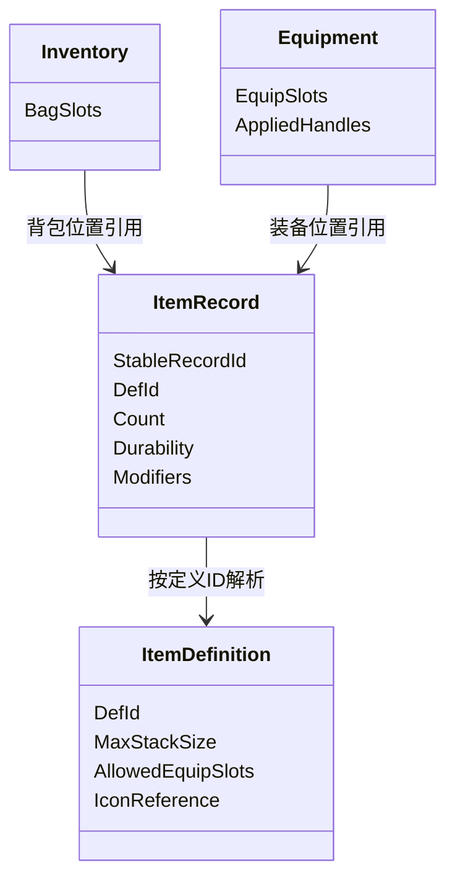
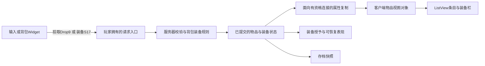

# 13 背包与装备系统

> 知识成熟度：L2。本文核对官方文档并给出有限状态的手工推导；没有编译 UE、运行 PIE、生成资产或验证真实网络/UI/GAS。已有 C++ 背包实测属于独立的内存事务模型，其有效证据与未覆盖项见第九节。

> 分工：本文解释物品定义、背包格、装备槽怎样驱动 UE 侧复制、UI 和存档衔接。[背包与道具系统](01-背包与道具系统.md)负责服务端数据与存储设计；[背包道具完整链路](05-背包道具完整链路.md)负责事务、幂等、持久化和恢复。这里不重新实现那两篇已有的模型。

| 项目 | 本文基准 |
| --- | --- |
| 读者问题 | 捡到 5 瓶药后数量放在哪几格？一把剑装备后由谁保留状态？UI 和存档怎样得到同一结果？ |
| 前置知识 | 数组、引用与值复制；UE Component、Data Asset、属性复制和 UMG 的基本概念 |
| 版本基线 | 2026-10-11 读取的 Lyra UE 5.6 指定版本页面，以及返回标题为 UE 5.8 的 Fast Array、ListView、TArray、Data Assets 官方页面 |
| 最后更新 | 2026-10-11 |
| 版本限制 | 后几项为当日实际文档返回，不是不可变源码 revision；带 5.6/5.8 查询参数的若干 API 请求失败，未把失败当成已核对。未取得引擎 checkout 或 Build.version |
| 历史资料 | 初稿记载 UE 5.8.0 / CL 55116800 / `++UE5+Release-5.8` 的本机核对；这些是旧记录，不作为本次本机观察或当前源码依据 |
| 示例政策 | 三格固定背包、药水每栈最多 10、剑不可堆叠、单一主手槽；整次拾取全收或全拒；装备采用“从背包转移到装备槽” |

## 一、先分清“是什么”“是哪一件”和“在哪里”

背包不是一组图标。图标可以暂时不在屏幕上，物品仍要存在；同一种剑可以有不同耐久，两把剑也不能因为图标相同就合并。

| 概念 | 示例 | 改变时影响什么 |
| --- | --- | --- |
| 定义 `DefId` | `Potion`、`Sword` | 名称、图标、最大堆叠、允许装备槽等共享配置 |
| 实例 `InstanceId` | 剑 `S17`，耐久 80 | 某一件物品的耐久、词条、绑定状态等独有数据 |
| 堆叠记录 `StackId` | 药水栈 `P1`，数量 8 | 一组可互换物品的数量及共同状态 |
| 背包格 `BagSlot` | 0、1、2 | 物品的当前位置；移动/排序后可改变 |
| 装备槽 `EquipSlot` | `MainHand` | 当前生效的装备引用，以及对应的表现与授予记录 |
| 操作意图 | 拾取地面对象 `Drop9`；装备 `S17` | 玩家想做什么，由权威状态决定能否执行 |

定义 ID 不是实例 ID，数组索引也不是物品 ID。需要网络重试、拖拽、异步加载或持久化引用时，不能只记“第 1 格”，因为那一格后来可能已经换了一把剑。



图中是教学数据关系，不是 UE 或 Lyra 的逐字类图。本文采用同一物品记录只有一个位置：在背包、在装备槽、或已离开角色。装备 Mesh 和 UI Widget 都只是这份状态的表现。

### 必须先决定的两个玩法选择

- **可堆叠条件**：同 `DefId` 只是必要条件。如果绑定、耐久、品质、过期时间会改变用途，堆叠键还要包含这些字段，或直接禁止堆叠。示例药水完全可互换，剑的最大堆叠为 1
- **装备是否离开背包**：本文采用转移模型，装备剑会腾出一个背包格。也可以保留库存实例，再由装备槽引用它；此时“库存总数”和“背包空格”必须按那种政策计算。Lyra 的库存实例与装备实例正是不同职责，不能把本文转移模型说成 Lyra 的必需实现

无论选哪一种，装备不能凭空多出一件，也不能因为武器 Mesh 销毁就丢掉耐久和词条。

## 二、一个能从输入追到输出的正常例

以下均为可手算的设计追踪，**不是程序运行输出**。所有操作由同一个权威写者顺序处理，定义已加载，角色有权限，暂不涉及重量、交易锁、网络乱序或持久化失败。

初始状态 `revision=40`：

```text
定义：Potion.max_stack=10；Sword.max_stack=1，允许 MainHand
背包：[0:P1/Potion×8, 1:S17/Sword×1/耐久80, 2:空]
装备：MainHand=空
装备授予记录：空
```

### 1. 拾取：先补旧栈，再开新栈

玩家发出“拾取 `Drop9`”意图。服务器从地面对象及掉落规则确定它是 5 瓶药水，并校验可拾取、距离、归属和是否已被领取；客户端没有决定奖励定义和数量的权力。

规划容量：0 格还能放 `10−8=2` 瓶；1 格是剑不能合并；2 格可放 10 瓶。共有 12 瓶容量，足以容纳 5 瓶。候选写入依次为 0 格 `+2`、2 格新建 `P2×3`。全部规划完成后才发布：

```text
revision=41
背包：[0:P1/Potion×10, 1:S17/Sword×1/耐久80, 2:P2/Potion×3]
装备：MainHand=空
药水合计=13；剑合计=1
拾取结果：accepted=5，remaining=0
```

权威记录同时解决 `Drop9` 的领取归属，不能把“奖励已进包”和“掉落物仍可领取”留成两个无保护的修改。真实跨对象提交的实现见[完整链路](05-背包道具完整链路.md)。客户端收到状态后，0 格显示 10、2 格显示 3，再结束拾取等待表现。

### 2. 装备：移动的是同一件剑

玩家点击 `S17`，意图包含稳定实例标识与目标 `MainHand`，不以 Widget 位置作为身份。权威侧确认 `S17` 仍属于该角色、在背包里、允许主手且未被交易锁住，随后按本例政策移动：

```text
revision=42
背包：[0:P1/Potion×10, 1:空, 2:P2/Potion×3]
装备：MainHand=S17/Sword×1/耐久80
药水合计=13；剑合计=1
预期表现：主手出现剑，装备图标指向 S17
预期授予账：S17 本次装备对应一组能力/效果句柄 H17
```

`H17` 是教学记号，不是引擎自动生成的某个固定值。业务逻辑必须记录本次实际授予的句柄，供卸下时准确撤销。重复收到同一已完成意图时不再次授予；网络复制或 UI 再绘制也不应重新执行装备业务。

### 3. 卸下：先确认有位置，再移除生效状态

从 `revision=42` 卸下主手。1 格为空，规划把同一个 `S17` 放回该格，耐久仍为 80；提交后按原授予账撤销 `H17`，移除剑的表现：

```text
revision=43
背包：[0:P1/Potion×10, 1:S17/Sword×1/耐久80, 2:P2/Potion×3]
装备：MainHand=空
装备授予记录：H17 已撤销
药水合计=13；剑合计=1
```

这三步给出最小检查法：逐格比较，而不只看合计；再检查剑的身份、耐久、装备槽和授予账。只看“总数 1”发现不了换错剑，只看“剑在手上”也发现不了卸下后仍残留能力。

### 4. 用同一输入暴露错误

| 从哪里开始 | 输入 | 预期结果 | 容易暴露的错误 |
| --- | --- | --- | --- |
| 重置到 revision 40 | `Drop9` 改为 13 瓶药水 | 容量只有 12，整单拒绝，仍为药水 8、剑 1、空格 1 | 边放边判导致先补 2 瓶、填 10 瓶再报告失败 |
| revision 41 | 将药水 P1 装到主手 | 类型/槽位拒绝，三个背包格和装备槽均不变 | 只判断槽空，不判断定义允许的槽 |
| revision 42 后另外填满 1 格 | 卸下 S17 | 拒绝且保留 S17 的装备状态与原授予账 | 先撤销/移除装备，再发现背包没有空格 |
| revision 41 | 保存“索引1”后先排序，再装备 | 重新按 S17 定位并校验，或拒绝过期操作 | 把当前索引1的另一件物品装备上 |

这些错误是由输入与规则推导出的反例，不冒充已执行的回归测试。

## 三、定义、堆叠与容器怎样实现上述规则

### 1. 定义资产和运行时状态分开

`UDataAsset` 可以承载系统数据；需要 Primary Asset ID 和 bundle/Asset Manager 加载能力时，可用 `UPrimaryDataAsset` 或项目显式实现对应机制。[Data Assets 官方文档](https://dev.epicgames.com/documentation/en-us/unreal-engine/data-assets-in-unreal-engine)说明这两者的关系。不能给普通 `UDataAsset` 随手加一个字段，就认为已经完成 Primary Asset 的发现、注册与加载。

项目物品定义可包括 `DefId`、名称、图标引用、类型标签、堆叠上限与允许装备槽。运行时记录保存数量、耐久和词条，不能通过修改共享定义表达“这把剑损坏了”。更新某个定义资产也不等于已自动更新所有客户端、已加载实例或存档；发布版本与迁移另有职责。

业务 ID 应有稳定映射和迁移政策。默认 Primary Asset ID 的命名依赖不能被当成永不变化的业务主键；定义重命名或移动后，需验证旧 ID/路径的解析。定义表可映射 ID 到软引用，载入后再取得所需资产。软引用不会自动保证打包覆盖或加载完成。

### 2. 容器记录、位置和对象引用

固定格可以使用数组，但每格为空的表示必须统一。紧凑列表则通过删除挪动后续元素；二者不能混用“固定位置”的语义。网格背包还需要占格形状与旋转判定，无限列表也可能受重量约束。

轻量记录可用 USTRUCT；需要对象接口、片段或复杂运行时状态时，可让记录引用项目物品 UObject。两种都需要明确引用持有和复制方案，`Outer` 或“归组件所有”这句话不能代替实际 GC 引用管理。大量 UObject、实例池和缓存是否合算，要由实际负载验证，不能默认池化总是更快。

### 3. 加入、拆分、合并与移动

加入的语言无关伪代码如下。`candidate` 是独立候选状态；这里没有声明某个 UE 函数自带事务。

```text
取得可信输入并校验定义、数量、权限与本次背包状态
candidate = 当前状态的独立值副本
remaining = 请求数量
按确定顺序遍历与堆叠键相同的未满栈，填至上限
按确定顺序遍历空格，为剩余数量分配新栈
若 remaining > 0：拒绝，不发布 candidate
否则：在所选提交边界内发布 candidate 与操作结果
提交成功后通知表现层
```

“先规划”只解决业务容量拒绝，不自动解决内存分配异常、并发、掉落领取或数据库提交。已有[背包内存合同](../../../evidence/tests/gameplay-core/README.md#2026-10-04-背包内存合同修订)实际研究了分配失败；真实服务端另需串行化和持久化边界。

- **拆分**：从 `Potion×10` 分出 3，要同时规划原栈变 7、新栈变 3及空格；没有目标位置就不扣原栈
- **合并**：同键的 7 和 6，在上限 10 下可以变 10 和 3；若界面只允许整栈合并，也可拒绝。必须让结果与界面政策一致
- **移动/交换**：以记录标识与当前位置重新校验，交换前检查两边限制；不相信拖拽开始时的旧格子内容
- **批量变更**：业务通知可合并，复制层的各个新增/修改项仍须正确标脏；“只通知一次”不是略过复制工作的理由

## 四、装备不是“删一格，再生成一把武器”

装备要保持三种状态可解释地对应：物品位置、实际生效的玩法授予、可见表现。表现生成失败时不能凭空补发物品；授予失败也不能假装装备成功。实现要明确是在成功前准备，还是通过可恢复的后续过程处理失败。

### 1. 普通装备与替换

正常装备输入是 `(InstanceId, EquipSlot)`。先定位并复制后续所需的值，再检查归属、类型、等级/状态、锁定、目标槽和旧装备回收位置。不能保存指向数组元素的指针，在删除元素后继续用它。

[TArray 官方说明](https://dev.epicgames.com/documentation/en-us/unreal-engine/API/Runtime/Core/TArray)明确增删可能使元素指针失效，删除也会改变后续索引。旧示例 `Entry = GetEntry(...); RemoveAt(...); Equip(Entry->ItemId)` 因此不成立：即便未崩溃，也可能读到已经移入原位置的另一条记录。复制 ID 可以修掉这类引用错误，却仍不能单独证明整个装备流程原子。

替换的有限例：主手 S17、背包 1 格 S18，其余格满。若两把剑都允许主手且 1 格允许接收旧剑，可以把 S18 放入主手、S17 放入 1 格，一次规划交换无需额外空格。若旧物品不满足该格过滤，则拒绝；不能先删 S18 再任意找格。

### 2. GAS 与表现的对应关系

装备可以授予能力、应用持续效果或提供其他玩法行为。定义上的 Ability/Effect 类型说明“要授予什么”；运行时授予句柄说明“这次具体授予了哪一份”。两者不能互换。卸下时按该装备实例的授予账撤销，不能用一个效果类 ID 删除角色所有同类效果，也不能简单用加减属性值来猜原状态。

先完成数据和授予的准备/校验，再按项目约定发布；若某一步可能失败，需要明确恢复路径，不能把任意 GAS 调用假定为无失败事务。即时效果、可堆叠效果与持续授予的撤销语义不同，具体选择见 [GAS](../技能战斗与属性结算/01-GameplayAbilitySystem能力系统.md)。

装备 Actor 可表示武器并挂到角色挂接点；挂接点不存在、资源未加载、Pawn 更换都需处理。它不应是物品数量、耐久和存档的唯一事实源。角色外观或武器 Actor 被重建时，应由当前装备状态恢复表现。

## 五、UE 侧从输入到界面的接线职责

下面是需要由项目实现的职责图，不是可以直接粘贴编译的引擎内置 InventoryComponent。官方 Lyra 提供一个具体示例；本文不以搜索单个引擎目录推断整个引擎是否存在同名系统。



1. **输入入口**：拾取提交地面对象/领取意图，装备提交实例标识和目标槽；等待状态放在独立 UI 字段
2. **权威入口**：通过玩家拥有的 Actor/Component 建立请求路由，检查权限与最新状态；客户端可到达 RPC 不等于拥有发放奖励的权限
3. **权威修改**：组件或管理器持有容器并执行规则。背包是状态持有者，策略负责容量/标签/槽位条件，装备管理负责授予和表现衔接
4. **变更输出**：成功后产生明确结果和变更集；服务器本地监听者与客户端复制回调分别进入共同的视图更新职责，不能假定一端广播委托会自动在另一端触发
5. **界面接收**：复制到达后更新数据视图，ListView 显示该状态；失败结果解除等待并说明原因，不从预测数值自行“修正”权威库存

没有完成 Actor/Component 的复制启用、拥有者关系、RPC 声明、属性注册和数据序列化，仅写一个 `_Implementation` 函数体不会组成可运行系统。这些项目配置须按所用 UE 版本完成；本文不伪造未编译的全套 C++ 工程。

## 六、复制：数量变化与装备可见性是两件事

小规模固定格可以采用普通复制属性与接收更新；变更多的容器可以用 Fast Array 减少发送内容。选择应比较真实数据和更新频率，不能把所有普通数组复制一概叫作每次全量发送。

### 1. Fast Array 的正确标记

按本次读取的 [FFastArraySerializer 文档](https://dev.epicgames.com/documentation/en-us/unreal-engine/API/Runtime/NetCore/FFastArraySerializer)：

| 权威数组发生什么 | 应做什么 |
| --- | --- |
| 新增一个元素 | 对新增元素调用 `MarkItemDirty` |
| 修改既有元素 | 对该元素调用 `MarkItemDirty` |
| 删除一个元素 | 调用 `MarkArrayDirty` |

元素以 `FFastArraySerializerItem` 为基础，包装容器以 `FFastArraySerializer` 为基础，并完成相应增量序列化和复制接线。声明两个结构体及若干回调原型不是完整实现；接收侧回调可用于连接 UI/事件，不能仅因没有自定义 UI 回调就说序列化协议一定无效。

把第二节拾取映射到此处：P1 的数量改变，标记 P1；P2 是新增条目，标记 P2。若紧凑数组装备时删除 S17，标记数组删除；若固定格记录保留而只清空内容，则属于修改该格记录。项目必须先明确复制的“元素”是物品记录还是固定格，不能只凭视觉上“少一件”就选择 API。

Fast Array 的内部复制 ID、应用层的物品 ID、显示排序位置用途不同，不可互作存档主键。启用 Iris 时还须核对实际项目的复制配置与适配，不因见到基类名称就推断所有接线与传统路径相同。进一步见 [RPC 与属性同步](../../07-网络与游戏服务端/状态复制与兴趣管理/02-RPC与属性同步.md)。

### 2. 谁应该收到什么

自己的背包内容常需要只对拥有者可见，而别人需要看到角色手上拿什么。复制的相关性和条件决定接收方，不是“修改后自动推给所有客户端”。Lyra 文档也明确区分库存与装备的复制对象，见第八节。

持久装备状态应能支持后来进入相关范围或重新连接的客户端；一次表现事件不能代替这份当前状态。瞬时声音/动画可以有独立表现通知，但不能把 Multicast 当成背包数据库或装备状态保存方式。

自定义 revision 协议须规定完整快照与增量衔接。本文 40→43 仅帮助追踪顺序，不是 Fast Array 自动提供的业务版本。业务拒绝结果、复制抵达与本地等待状态可能有不同到达时序，项目应按操作标识和权威版本关联，不能用“按钮已经亮了”证明状态提交。

## 七、UI 与存档怎样保留同一份事实

### 1. ListView 的 Item 与 Entry

[UListView](https://dev.epicgames.com/documentation/en-us/unreal-engine/API/Runtime/UMG/UListView)维护数据 Item，仅为可见部分创建/复用 Entry Widget；条目实现 `IUserObjectListEntry`。因此物品状态要放在数据对象或领域状态中，不能放在滚出屏幕后会被复用的 Widget 内。

可以用项目视图对象把 `RecordId/DefId/Count/Durability` 映射到列表。初次打开时建立数据对象并设置列表；接收一次变更时按稳定 ID 找到对象，修改字段并发送该对象的变更通知。

```text
OnListItemObjectSet(newItem) 的项目职责：
  解除旧数据对象的订阅
  记住 newItem，订阅它的字段变化
  立即读取当前数量、图标、耐久并显示
条目释放或重新绑定时：解除原订阅
```

这是绑定职责的伪代码，不是要求某个未实现的引擎自动事件。滚出屏幕时没有 Entry，也仍须更新 Item；滚回来时重新读取，就应显示最新数量。

[RequestRefresh 官方说明](https://dev.epicgames.com/documentation/en-us/unreal-engine/API/Runtime/UMG/UListViewBase/RequestRefresh)特别指出：列表刷新处理 Item 与 Entry 的增删/可见关系，不负责检测既有 Item 内部字段变化。数量 8→10 要有数据通知和条目监听；只请求列表刷新可能仍看到 8。简单场景可选择重新生成条目，但要接受焦点、选择和重建成本，不能把它写成绝对禁止或性能必然失败。

拖拽数据携带稳定物品标识、起始容器和目标位置。放下时只提交意图，权威侧重新定位；旧 UI 索引不能作为最终依据。完整快照刷新/重连时可重建列表，同时按稳定标识恢复仍有效的选择。

### 2. 存档记录的是数据与位置

保存定义 ID、记录/实例 ID、数量、耐久、词条、位置及快照版本。软路径可作为定义解析资料之一，但不应悄悄取代前文的稳定业务 ID。本文 `revision=43` 的手工快照可表示为：

```text
schema=1，revision=43
records:
  P1: DefId=Potion, Count=10
  S17: DefId=Sword, Count=1, Durability=80
  P2: DefId=Potion, Count=3
bag_slots: [P1, S17, P2]
equipment: MainHand=空
```

若在 `revision=42` 保存，`bag_slots=[P1,空,P2]`、`MainHand=S17`，记录中仍只保存一份 S17。装备表现和运行时授予句柄不当作下次启动可复用的对象引用；读取后根据装备数据重新建立适合当前运行的状态。

加载顺序为：解析版本 → 迁移旧字段/ID → 校验定义与唯一记录 → 校验数量、位置与装备限制 → 建立候选状态 → 成功后替换当前状态 → 重建表现和 UI。未知定义/重复 ID/同一记录同时占两个互斥位置，应按项目政策隔离或拒绝，不能默认静默丢弃玩家物品。

快照便于理解与迁移，但文件写入原子性、异步完成回调和联网资产的事实源仍须单独处理。不要直接保存一串活 UObject 指针并假定可恢复；具体序列化边界见 [SaveGame](12-SaveGame存档系统与序列化.md)。

### 3. 合成、拆解、消耗和任务

配方描述输入、输出与前置条件。合成应共同规划扣除与产出，包括新物品容量；“先扣材料，失败再发回”需要额外恢复设计，不能直接当成原子事务。拆解同理。

消耗同时涉及库存和效果：先明确成功条件，效果失败/响应未知应怎样恢复，再选择提交顺序。不能无条件“扣 1 → 调用效果”就断言不会丢物品。任务进度监听已提交的领域变更/消耗事件，并规定重复事件的处理，不从 UI 文本统计物品数。跨系统合同继续见[完整链路](05-背包道具完整链路.md)。

## 八、Lyra 参考：把官方示例与通用设计分开

本节依据 [Lyra Inventory and Equipment，UE 5.6 文档](https://dev.epicgames.com/documentation/en-us/unreal-engine/lyra-inventory-and-equipment-in-unreal-engine?application_version=5.6)的职责表、Item Pickups、Quick Bar 和 Key Types；没有读取或编译 Lyra 源码。

| 职责 | 文档中的库存 | 文档中的装备 |
| --- | --- | --- |
| 所有者 | PlayerController 的 InventoryManagerComponent | Pawn 的 EquipmentManagerComponent |
| 状态/用途 | 库存实例保存物品及 stat tag 栈 | 装备期间的实例、生成 Actor 与能力授予 |
| 复制对象 | Server 与 Autonomous Proxy | Server、Autonomous Proxy、Simulated Proxies |
| 定义关系 | EquippableItem fragment 指向装备定义 | 装备定义描述要生成的 Actor 和授予的能力 |

正常参考路径是：武器拾取进入库存 → Quick Bar 选择该物品 → 建立装备表示、生成武器表现并授予能力 → 切换槽时卸下/装备。弹药等持续状态归库存实例，不能因为一次装备表示销毁就无意清空。官方给出的阅读入口包括 `ALyraWeaponSpawner`、`B_WeaponSpawner`、`W_QuickBar` 和 `W_QuickBarSlot`；它们是后续在实际示例项目中核对的入口，本次未打开 Blueprint 图。

这支持定义/实例、库存/装备的职责分离，不支持旧文“所有库存增删只能通过 GameplayAbility 授权”的绝对结论。本文的 `UInventoryComponent` 等项目命名也不能假充 Lyra 精确类名或接口签名。需要源码细节时继续阅读 [Lyra 背包装备消息与 UI 源码](43-Lyra-背包装备消息与UI源码.md)，并核对该文自己的版本与证据。

## 九、已有证据覆盖什么，本文还要验证什么

已有[背包道具完整链路](05-背包道具完整链路.md)并非未修改的空白章节。2026-10-04 的 [Inventory 结果摘要](../../../evidence/tests/gameplay-core/results/inventory_contract_20261004.txt)和[原始归档](../../../evidence/tests/gameplay-core/results/inventory_contract_20261004.raw.jsonl.gz)记录了 Linux / GCC 14.2.0 / C++17 的实际有限测试：O0+NDEBUG、O2、UBSan 三种构建各 2381 个显式检查零失败，所选六种状态实际发现 24 个分配点；三个源码负控分别产生 13/7/3 个失败并非零退出。

这些证据支持当时冻结版本的单线程、不重入内存 Add 合同：准备失败保持状态；成功键绑定参数与首次结果；同参重放不再发放，异参拒绝。它们不能证明 UI、装备交换、GAS、存档文件、数据库、多线程或 UE 网络已运行。旧七场景和旧微基准仍保留；也不能把旧性能重新绑定到修订后源码。

runner 曾有后续窄分支修订，历史结果必须按其记录的源码/脚本指纹理解；本篇修订没有重跑旧模型、runner 或基准，也没有补造缺失的历史原流。具体捕获限制和失败记录保留在上述证据入口。

| 本文要判断什么 | 有限输入/操作 | 预期检查 | 当前证据 |
| --- | --- | --- | --- |
| 正常堆叠 | 第二节 3 格、药水 8 加 5 | 逐格 10/剑/3、药水13、剑1 | 手工推导 |
| 正常装备/卸下 | S17 → 主手 → 空格 | 同一实例/耐久，数量守恒，授予只生效一次且撤销对应项 | 手工推导，UE/GAS 未运行 |
| 容量拒绝 | 从初始状态加 13 | 完整旧状态不变 | 手工反例；旧模型另有不同上限下的实测 |
| 位置变化 | 拖拽后排序再提交 | 按稳定标识重新定位或拒绝 | 设计合同，未跑 UI |
| 复制映射 | P1 改、P2 新增、S17 删除/清空 | 按元素模型选择正确脏标记 | 官方文档静态核对，未跑网络 |
| 视图更新 | 数量变化后滚出再滚入 | 新条目显示最新数据，不残留旧订阅 | 官方机制+设计，未跑 UMG |
| 存档恢复 | revision42/43 快照 | S17 恰在一个位置，定义可解析 | 手工设计，未写入 SaveGame |

以后在真实 UE 项目执行时，先做成功拾取、装备、卸下、关闭重开 UI 和存档恢复，再加入满包、错槽、换 Pawn、重复请求和断线重连。记录真实版本、输入、状态快照与日志；不以 Mesh 可见或一次界面截图代替库存/授予/恢复断言。

## 十、常见反模式与 FAQ

| 反模式 | 为什么会错 | 对应处理 |
| --- | --- | --- |
| 把 UI 格子索引当实例身份 | 排序、删除和延迟使索引指向别物 | 稳定 ID + 权威侧重新定位 |
| 同定义就允许堆叠 | 耐久、绑定或到期时间不同会丢信息 | 明确堆叠键或禁止合并 |
| 让客户端提交任意物品奖励 | 定义存在、数量为正不等于有领取权 | 服务端从可信业务来源决定奖励 |
| 删除数组后使用旧 Entry 指针 | 引用失效或读到挪入的下一项 | 提前复制所需值，重新定位；整体操作另证正确性 |
| 每次 UI 刷新都执行装备授予 | 重绘或复制重放造成重复能力 | 表现读取状态，业务维护实例对应授予账 |
| 只发一次装备 Multicast | 后到客户端无法还原当前装备 | 复制当前装备状态，瞬时表现另处理 |
| ListView 刷新等于字段更新 | 列表结构刷新不检测 Item 内部变化 | Item 通知 + Entry 监听，复用时解除旧绑定 |
| 存档同时把装备存成第二件物品 | 恢复时重复资产 | 一份记录 + 明确位置/引用关系 |

1. **UE 的背包该从哪里开始？** 先确定玩法数据与位置政策；Lyra 是可读的官方示例。是否采用插件要按项目版本、授权、复制与存档能力检查，不能由单个目录没有匹配类名推出全部产品能力
2. **用 UObject 还是 USTRUCT？** 轻量数量/位置适合值记录；复杂运行时接口可用对象。选择后仍要解决引用持有、复制与恢复，不能认为对象天然不适合网络，也不能认为 USTRUCT 自动可存档
3. **装备要从背包删除吗？** 不一定。本文示例用位置转移；保留库存实例并关联装备实例也是有效模型，两者要使用各自的容量与所有权规则
4. **装备怎么改属性？** 可用 GAS 能力/效果或项目系统，但须记录每次实际授予并准确撤销；效果类型 ID 不等于运行时句柄
5. **Fast Array 增删怎样标脏？** 新增和修改标记元素；删除标记数组。固定格清空可能属于元素修改，要先明确数组元素的语义
6. **UI 每次都不能重建吗？** 不是。字段通知适合持续更新，完整快照/简单场景也可重建；保留选择和焦点，测量实际成本，不使用绝对禁令
7. **存档只存软路径就行吗？** 还要稳定身份、数量/实例状态、位置和版本，以及定义重命名/缺失时的明确迁移政策
8. **怎样防重复发放？** 认证与领取资格决定能不能发；稳定意图与明确提交边界解决重试。只有容量校验、限流或 UI 防双击都不够
9. **物品很多怎样优化？** 分别观察容器扫描、复制字节、对象数、加载与可见条目成本。256 栈等数字只是项目选择，旧微基准不是通用容量预算
10. **任务、合成和消耗怎么接？** 监听已提交变化；共同规划扣与加，并定义跨系统失败/未知结果的恢复方式，详细设计放在服务端主责篇

## 关联阅读

- [背包与道具系统](01-背包与道具系统.md)：权威业务数据、事务与存储
- [背包道具完整链路](05-背包道具完整链路.md)：已有内存合同、幂等及持久化推导
- [GameplayAbilitySystem 能力系统](../技能战斗与属性结算/01-GameplayAbilitySystem能力系统.md)：装备授予与效果
- [GameplayTag 与数据资产](../玩法架构与任务协作/03-GameplayTag与数据资产.md)：标签与定义组织
- [委托事件与对象通信](../../03-引擎架构与资源系统/模块化框架与对象通信/04-委托事件与对象通信.md)：数据通知与绑定
- [RPC 与属性同步](../../07-网络与游戏服务端/状态复制与兴趣管理/02-RPC与属性同步.md)：请求路由和复制
- [SaveGame 存档系统与序列化](12-SaveGame存档系统与序列化.md)：快照、版本与恢复
- [Lyra 背包装备消息与 UI 源码](43-Lyra-背包装备消息与UI源码.md)：示例项目的进一步阅读入口
- [Gameplay 核心证据](../../../evidence/tests/gameplay-core/README.md)：旧结果、当前局部合同及其边界

## 更新日志

- 2026-08-07：初稿；保留其 UE5.8 / CL55116800 本机核对为历史记录，本次未复核私有引擎环境
- 2026-08-14：补成熟度、客户端/服务端分工与互链；后续 OKF 与八域迁移保留主题身份
- 2026-10-11：补三格背包的拾取、装备、卸下、UI 与快照正常教学；修正数组引用、奖励入口、Fast Array 标记及 Lyra 职责边界；保留既有独立模型证据，未新增运行结论
