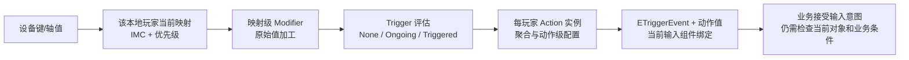
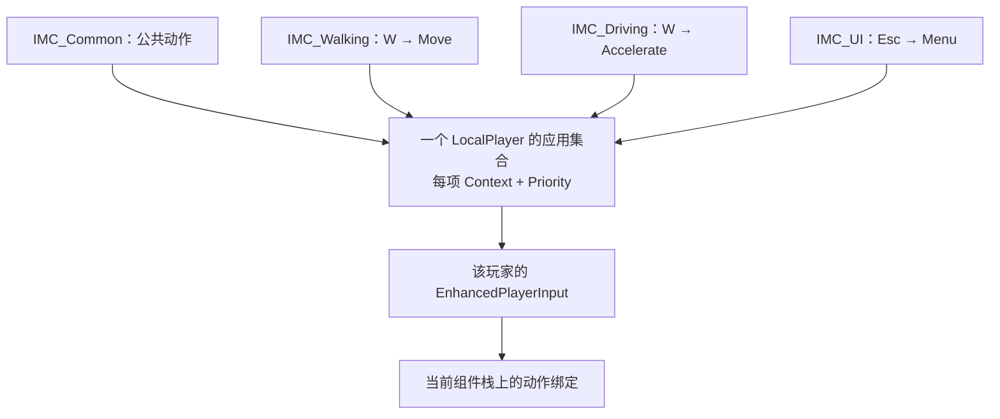
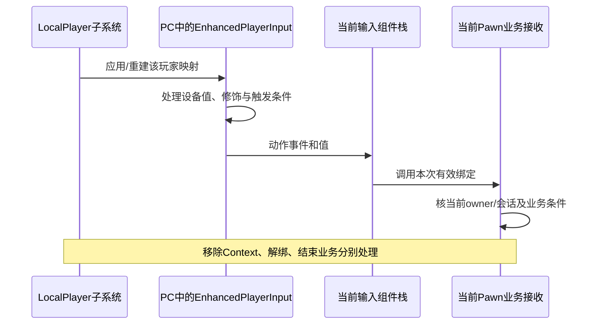
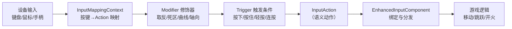
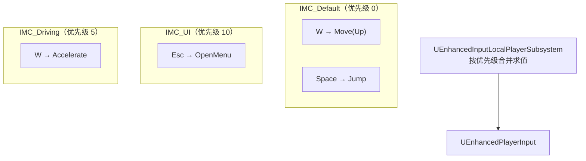
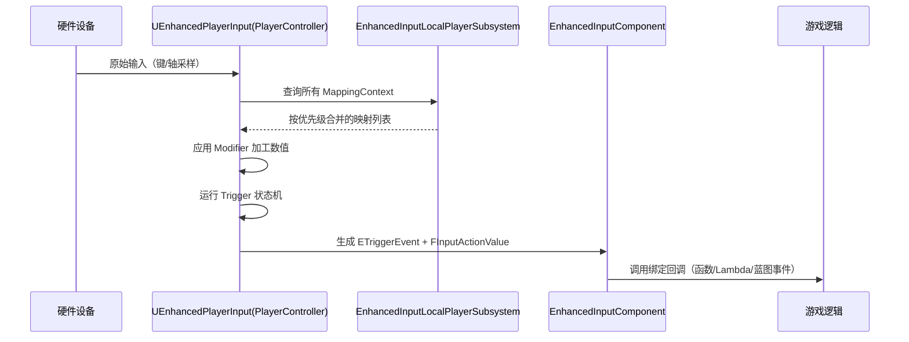

# 02 Enhanced Input 增强输入
> 知识成熟度：L2。核对范围为官方文档/API 的公开合同；以下 C++、蓝图操作与纸面案例均未编译、未运行，不构成引擎实现、设备或业务验证。

> 版本基准：2026-10-09 访问时标注为 UE 5.8 的 Epic 官方文档与 API 页面；页面版本标签不等于本机 UE 5.8.0、某一补丁版或固定源码 CL。
> 知识基线：本地玩家的 Action、映射上下文、输入组件与业务接收之间的关系；状态、事件、映射重建、对象退出和玩家改键各有独立合同。
> 源码核对状态：未核对。本轮没有读取实际 UE checkout、Build.version、头文件或实现。原稿的 UE5.8.0 / CL55116800 / `++UE5+Release-5.8` 与 Windows 安装目录是历史作者声明，保存在文末资料附录，不续称本轮本机观察。
> 适用范围：Enhanced Input 概念和使用层；客户端本地输入、资产配置、C++/蓝图接线、有限的本地生命周期和改键流程。不覆盖 CommonUI 内部路由、GAS 激活实现或网络权威协议。
> 兼容性边界：UE4.27 和 UE5.4 页面只支持标明的历史事实；没有核对每个版本的首次引入、首次弃用或二进制兼容性。
> 最后更新：2026-10-09。修正事件/值/时长、消费与 UI、对象归属和退出、改键与保存；全部案例只标 `PAPER_EXPECTED`。

## 一、概述

要解决的不是“按了哪个键就调用哪个函数”这一个问题，而是：同一玩家步行、驾驶、打开菜单时，哪些动作可用？键盘、摇杆和玩家改键如何表达同一意图？长按未达阈值、轻点超时、角色替换时，已经开始的处理该如何结束？

旧 Action/Axis Mapping 名本来也可以表达 MoveForward、Jump 等语义。旧系统可以通过玩家映射接口改键，也能用项目代码实现手势；问题在于动态场景、过滤、手势和设置通常要自行组合。Enhanced Input 将这些配置拆成资产，便于复用和按本地玩家切换。不要把它描述为旧系统绝对不能改键或不能做长按。[旧玩家映射接口](https://dev.epicgames.com/documentation/en-us/unreal-engine/API/Runtime/Engine/UPlayerInput)

Enhanced Input 在 [UE4.27 官方页](https://dev.epicgames.com/documentation/en-us/unreal-engine/enhanced-input?application_version=4.27) 已作为 Experimental 插件出现，所以“从 UE5.0 才引入”不成立；这也不证明最早引入版本。当前 [UE5.8 概览](https://dev.epicgames.com/documentation/en-us/unreal-engine/enhanced-input-in-unreal-engine) 表述为默认启用，实际旧项目仍需检查插件与输入类配置。

先分清四个核心概念：Action 表达动作及值类型；Input Mapping Context（IMC）将设备键/轴映射到 Action；Modifier 加工数值；Trigger 判定手势条件。资产不是一次输入本身，玩家的动作求值状态在运行时实例中。



这是责任和数据关系图，不是已读引擎实现的逐函数调用顺序。映射级配置、动作级配置、多个映射的聚合共同决定最终动作；一个 Trigger 返回成功不自动等于业务完成。例如交互输入成立时，目标物品仍可能已被拿走。

## 二、核心概念速览

| 概念 | 类/类型 | 负责什么 | 不负责什么 |
| --- | --- | --- | --- |
| 动作资产 | `UInputAction` | Move/Jump/Fire 的值类型、动作级触发与修饰配置 | 不保存所有玩家共享的一份按住进度 |
| 动作实例 | `FInputActionInstance` | 某玩家动作的当前求值状态、事件与时间查询 | 不代表服务器已接受业务请求 |
| 映射上下文 | `UInputMappingContext` | 多个键/轴到 Action 的映射集合 | 不是全屏 UI 屏障，也不是输入组件 |
| 本地玩家子系统 | `UEnhancedInputLocalPlayerSubsystem` | 为自己的 LocalPlayer 应用/移除 IMC | 不属于任意 Pawn，也不是 GameInstance 全局设置 |
| 玩家输入 | `UEnhancedPlayerInput` | 扩展 `UPlayerInput` 的 Enhanced 求值 | 不等于业务角色或服务端权威状态 |
| 输入组件 | `UEnhancedInputComponent` | 保存绑定，按动作事件调用接收者 | 绑定本身不消费 Enhanced 输入事件 |
| 触发器 | `UInputTrigger` 及派生类 | 根据加工后的输入/依赖动作给出触发状态 | 不替代业务冷却、权限或成功判定 |
| 修饰器 | `UInputModifier` 及派生类 | 取反、换轴、死区、缩放等 | 不自动决定业务坐标约定 |
| 状态 / 事件 | `ETriggerState` / `ETriggerEvent` | 当前求值状态 / 动作对状态变化的解释 | 两个枚举不能混为一张“按下→松手”表 |
| 值 | `FInputActionValue` | bool、float、FVector2D、FVector | 输入幅度不是持续时间 |
| 玩家设置 | `UEnhancedInputUserSettings` | 玩家键位 profile、注册映射与设置保存入口 | `ApplySettings` 不等于已经持久保存 |

`UPlayerMappableInputConfig`（PMI）保留为旧教程/预设配置的历史概念，不是本文当前改键路线的必要步骤。具体迁移界限见 5.5。

## 三、原理详解

### 3.1 InputAction：语义、值类型和每玩家状态

动作资产定义“移动”需要二维值，“跳跃”需要数字量；键盘和摇杆都可以映射到同一个 Move。按实际 `ValueType` 取值：Digital 用 `Get<bool>()`，Axis1D 用 `Get<float>()`，Axis2D 用 `Get<FVector2D>()`，Axis3D 用 `Get<FVector>()`。资产改了类型，接收代码也要核对；不要将错误类型读取当作安全转换。[FInputActionValue](https://dev.epicgames.com/documentation/en-us/unreal-engine/API/Plugins/EnhancedInput/FInputActionValue)

| Action 属性 | 公开合同与使用边界 |
| --- | --- |
| `ValueType` | 决定动作事件和查询的值类型；不由回调随意选择 |
| `bConsumeInput` | 控制是否阻止关联输入继续影响更低优先级的 Enhanced 映射；不是任意游戏回调的全局锁 |
| `bConsumesActionAndAxisMappings`、`TriggerEventsThatConsumeLegacyKeys` | 新旧输入并存时的另一组消费配置，不能用前一字段概括全部 legacy 行为 |
| `bTriggerWhenPaused` | 此动作是否允许在暂停时触发；仍须输入实际到达、上下文适用和触发条件满足 |
| `bReserveAllMappings` | 表达其映射不应被高优先级上下文自动覆盖的意图；官方要求映射代码作者落实。不是槽位预分配、自动强制保护或性能开关 |
| `Modifiers` / `Triggers` | 动作级配置；动作 Modifier 作用最终动作值，不能与映射级原始键值加工混写 |
| `AccumulationBehavior` | 决定多映射到同一动作时如何形成值；需要显式考虑多键组合 |

上述以 [UInputAction 具体字段](https://dev.epicgames.com/documentation/en-us/unreal-engine/API/Plugins/EnhancedInput/UInputAction) 为准。动作实例按玩家区分，所以两个本地玩家使用同一 Action 资产不应共享一份业务“是否正在蓄力”的可变标志。

一个动作宜对应可解释的输入意图。可以将“交互”作为统一意图，再由业务判定拾取、开门或对话；是否拆成不同动作取决于键位、触发规则和重绑需求，不必把“一个动作只能做一个具体业务”当铁律。

### 3.2 InputMappingContext：排序、冲突与拥有者

一个 IMC 中的 `FEnhancedActionKeyMapping` 将 Action、Key、映射级 Modifier/Trigger 和可映射设置联系起来。IMC 资产存在不代表已经应用：必须加到对应 LocalPlayer 的 Enhanced Input 子系统。[映射结构](https://dev.epicgames.com/documentation/en-us/unreal-engine/API/Plugins/EnhancedInput/FEnhancedActionKeyMapping)



Priority 数值较大者优先，目的是处理适用映射之间的冲突；0、5、10只是教程例值。高优先级上下文并不令整个低优先级上下文消失：要看竞争的是哪个键/动作、消费设置、映射和项目配置。也不能把“同键同动作一定遮蔽”当所有聚合和消费分支的完整实现描述。[Input Overview 的上下文说明](https://dev.epicgames.com/documentation/unreal-engine/input-overview-in-unreal-engine)

反例：IMC_Game(0) 只有 W→Move，IMC_UI(10) 只有 Esc→Menu。它们没有 W 的竞争映射，单加 IMC_UI 不能推出 W 被屏蔽。需要禁止角色输入时，应明确停止该模式的业务接收并移除本模式拥有的游戏 IMC；UI 焦点和 PlayerController 的输入模式另外配置。

这三个层面要分别排查：

- IMC 优先级与 Action 消费：哪组映射参与并影响较低优先级映射
- 输入组件栈：哪些 Actor 的绑定获得分发。Enhanced 绑定本身不消费事件，不能靠“先绑定的回调”替代映射优先级
- UI 路由：`FInputModeGameAndUI` 允许 UI 先处理，未处理的输入还有玩家输入机会；`FInputModeUIOnly` 只允许 UI 响应。这不同于给某 IMC 一个较大整数

依据分别是 [EnhancedInputComponent](https://dev.epicgames.com/documentation/en-us/unreal-engine/API/Plugins/EnhancedInput/UEnhancedInputComponent)、[GameAndUI](https://dev.epicgames.com/documentation/en-us/unreal-engine/API/Runtime/Engine/FInputModeGameAndUI)、[UIOnly](https://dev.epicgames.com/documentation/en-us/unreal-engine/API/Runtime/Engine/FInputModeUIOnly)。本文不延伸 CommonUI 的完整焦点与路由实现。

### 3.3 Trigger：条件、三态与具体手势

`ETriggerState` 只有 None、Ongoing、Triggered：无满足的输入/条件、仍在监测、触发条件满足。`ETriggerEvent` 是 Action 对状态变化的解释，见 3.5。一个动作的 Trigger 配置变了，同样“按下/保持/松开”的事件序列也可能改变。[ETriggerState](https://dev.epicgames.com/documentation/en-us/unreal-engine/API/Plugins/EnhancedInput/ETriggerState)

| 当前公开类型 | 条件与边界 | 用途 |
| --- | --- | --- |
| [Down](https://dev.epicgames.com/documentation/en-us/unreal-engine/API/Plugins/EnhancedInput/UInputTriggerDown) | 受激值超过阈值时触发；未配置 Trigger 时有默认 Down 式行为 | 移动、持续按住 |
| [Pressed](https://dev.epicgames.com/documentation/en-us/unreal-engine/API/Plugins/EnhancedInput/UInputTriggerPressed) | 越过受激阈值只触发一次，继续保持不重复 | 单次按下意图 |
| [Released](https://dev.epicgames.com/documentation/en-us/unreal-engine/API/Plugins/EnhancedInput/UInputTriggerReleased) | 受激时 Ongoing，降回阈值以下时触发一次 | 释放手势；业务应监听其 Triggered |
| [Hold](https://dev.epicgames.com/documentation/en-us/unreal-engine/API/Plugins/EnhancedInput/UInputTriggerHold) | 持续达到 HoldTimeThreshold；bIsOneShot 决定单次还是继续触发 | 长按确认、按住加速 |
| [Tap](https://dev.epicgames.com/documentation/en-us/unreal-engine/API/Plugins/EnhancedInput/UInputTriggerTap) | 受激后在 TapReleaseTimeThreshold 内释放 | 轻点；不是只看按下瞬间 |
| [Pulse](https://dev.epicgames.com/documentation/en-us/unreal-engine/API/Plugins/EnhancedInput/UInputTriggerPulse) | 按 Interval 重复，另有 bTriggerOnStart、TriggerLimit | 连发输入节奏，不等于服务器射速许可 |
| [Chorded Action](https://dev.epicgames.com/documentation/en-us/unreal-engine/API/Plugins/EnhancedInput/UInputTriggerChordAction) | 指定 ChordAction 必须正在 triggering | Ctrl+动作等组合；仅“有活动”不足 |
| [Repeated Tap](https://dev.epicgames.com/documentation/en-us/unreal-engine/API/Plugins/EnhancedInput/UInputTriggerRepeatedTap) | NumberOfTapsWhichTriggerRepeat、RepeatDelay、TapReleaseTimeThreshold 配合 | 双击/重复轻点 |

原稿的 `Pulsed` / `PulseInterval` 和“UE5.2+ DoublePress”不再作为当前 API 名称与版本断言。这里引用的是读到的 5.8 类型；没有据检索空结果证明某旧名在所有版本都不存在。RepeatedTap 页面部分继承方法摘要沿用基类文字，应结合本类描述，不能用那条摘要否认其双击用途。

组合条件也不能简单理解为“每个 Trigger 都按顺序成功才成功”。在概览公开的组合规则中，Explicit 至少一个满足（有此类时），Implicit 全部满足，Blocker 满足则阻断；没有配置这些条件时还受输入值/受激规则约束。映射级与动作级条件都可能参与，本文没有读取它们在某个源码 CL 下的内部完整求值顺序。

时间类的公共基类 [UInputTriggerTimedBase](https://dev.epicgames.com/documentation/en-us/unreal-engine/API/Plugins/EnhancedInput/UInputTriggerTimedBase) 跟踪受激持续时间，本身不实现最终成功逻辑；派生类决定何时 Triggered。其 `bAffectedByTimeDilation` 默认 false，但这不足以把所有触发时间称为墙钟时间；实际项目还要核输入 tick、暂停、帧步长与具体配置。

### 3.4 Modifier：数值加工、方向与组合

映射 Modifier 作用原始键值；列表前一项的输出进入后一项。Action Modifier 作用动作最终值，二者不能因都叫 Modifier 就忽略层级。用同一组明确向量和顺序检查配置，比只背名字有效。

| 类别 | 用途 | 需要避免的误读 |
| --- | --- | --- |
| Negate | 对选定轴取反 | 先取反哪个轴、再交换哪个轴，要说清 |
| [SwizzleAxis](https://dev.epicgames.com/documentation/en-us/unreal-engine/API/Plugins/EnhancedInput/UInputModifierSwizzleAxis) | 交换分量，例如把单键 X 放到二维 Y | W 的原始值并非已经在 Y |
| [Scalar](https://dev.epicgames.com/documentation/en-us/unreal-engine/API/Plugins/EnhancedInput/UInputModifierScalar) | 按轴缩放灵敏度等 | 当前类型是 Scalar；缩放不能代替正确坐标约定 |
| DeadZone | 去除摇杆中心漂移等低幅输入 | 阈值和处理方式要按设备/资产配置，本文未测最佳值 |
| Smooth、Response Curve | 平滑输入、设置非线性响应 | 保留用途，不把未读实现写成固定低通公式或无成本操作 |
| [ToWorldSpace](https://dev.epicgames.com/documentation/en-us/unreal-engine/API/Plugins/EnhancedInput/UInputModifierToWorldSpace) | 转成约定世界轴值，文档例中上下到世界X、左右到世界Y | 不自动等于相机朝向；相机相对移动需要明确旋转基底 |
| [FOVScaling](https://dev.epicgames.com/documentation/en-us/unreal-engine/API/Plugins/EnhancedInput/UInputModifierFOVScaling) | 按 FOV 对输入值缩放 | 不是跑动时自动改变相机FOV |

单键 WASD 的一种确定配置（Axis2D，按键原始受激值在 X）：

| 键 | 明确加工顺序 | 单键期望二维值 |
| --- | --- | --- |
| D | 无 | (+1,0) |
| A | Negate X | (-1,0) |
| W | Swizzle YXZ | (0,+1) |
| S | Negate X，再 Swizzle YXZ | (0,-1) |

这是 `PAPER_EXPECTED` 单键变换，不宣称 W+S 必相消。当前 [AccumulationBehavior](https://dev.epicgames.com/documentation/en-us/unreal-engine/API/Plugins/EnhancedInput/EInputActionAccumulationBehavior) 有默认的最高绝对值选择和 Cumulative 累加；多映射聚合须按实际配置验证，不能凭单键表推断并键、同幅冲突或每轴细节。

鼠标 XY 常表达设备移动量，摇杆常表达持续幅度；项目要先定义 Look 回调接收的是每次增量还是转速，再决定单位和时间缩放。不能把相同 Axis2D 类型理解为两种设备天然同单位。

### 3.5 ETriggerEvent：事件不等于物理按键或业务结果

| 事件 | API合同 | 不能直接推出 |
| --- | --- | --- |
| None | 无显著状态变化且无活动设备输入 | 业务一定空闲 |
| Started | 开始 Trigger 求值；同帧可能随后 Triggered | 长按/轻点已成功 |
| Ongoing | 仍在处理触发条件 | 输入幅度就是蓄力时长 |
| Triggered | 此次触发判定发生 | 一定每帧触发、服务器已许可、物品已拾取 |
| Canceled | 触发被取消 | 唯一原因是高优先级抢占 |
| Completed | 当前帧从 Triggered 转为 None | 一定是物理松开、业务成功完成 |

精确枚举说明来自 [ETriggerEvent](https://dev.epicgames.com/documentation/en-us/unreal-engine/API/Plugins/EnhancedInput/ETriggerEvent)。例如 Hold 在阈值前松开可以 Canceled；Pulse 在达到重复上限，或紧接一次 Triggered 后释放时可 Completed，其他释放时可 Canceled。单靠事件名猜“成功/失败”会使持续动作卡住。

Hold 还提供一个反例：官方概览展示的单次 Hold 实现，在首次命中后继续保持且 `bIsOneShot=true` 时返回 None。因此 Completed 不能无条件当物理释放。这里只是对公开示意的纸面推导，没有核对本机源码或测量事件日志。

蓄力显示要区分三个量：[FInputActionInstance](https://dev.epicgames.com/documentation/en-us/unreal-engine/API/Plugins/EnhancedInput/FInputActionInstance) 的 `GetElapsedTime()` 包含 Ongoing 与 Triggered 的求值时间，`GetTriggeredTime()` 只含 Triggered 时间；`GetValue()` 是动作值，并且该实例接口在当前事件不是 Triggered 时返回零。不能把 Ongoing 回调中的这个值当作进度。这条限制也不能泛化为“所有原始输入查询都只能在 Triggered 时使用”。

如果业务有独立蓄力规则，还需记录自己的开始、接受、取消和完成状态；输入求值时间不自动等于技能时间。Started 可用于启动反馈，Triggered 可用于提出成功手势的业务意图，Completed/Canceled 可用于幂等清理，但映射移除、失焦和对象退出仍需主动收尾，不能只等某个事件来救场。

### 3.6 底层处理关系与各层生命周期



该图同样只说明公开职责，不声称每帧先“查询全部Subsystem”或描述未读 `.cpp` 的精确内部顺序。

| 层 | 所有权与公开入口 | 替换/退出时的含义 |
| --- | --- | --- |
| LocalPlayer / subsystem | [ULocalPlayerSubsystem](https://dev.epicgames.com/documentation/en-us/unreal-engine/API/Runtime/Engine/ULocalPlayerSubsystem) 与本地玩家同寿命，可收到 PlayerControllerChanged | 换Pawn通常不等于该玩家子系统结束；旧Pawn的Context不能自然假定消失 |
| PlayerController / PlayerInput | [UPlayerInput](https://dev.epicgames.com/documentation/en-us/unreal-engine/API/Runtime/Engine/UPlayerInput) 位于PC，网络游戏中是客户端输入对象 | 服务端PC或AI Controller不保证有LocalPlayer；listen-server本地玩家按实际关系检查 |
| Pawn / InputComponent | [SetupPlayerInputComponent](https://dev.epicgames.com/documentation/en-us/unreal-engine/API/Runtime/Engine/APawn/SetupPlayerInputComponent) 为创建出的组件建立自定义绑定 | 实际EIC换了，就要在新实例建立绑定；Cast不会把旧组件改造成新类型 |
| 本地重启 | [APawn](https://dev.epicgames.com/documentation/unreal-engine/API/Runtime/Engine/APawn) 的PawnClientRestart在owning client；官方教程明确可多次调用 | 保留Super并做幂等重建；不能把BeginPlay一次成功当永久条件 |
| Controller变化 | [NotifyControllerChanged](https://dev.epicgames.com/documentation/en-us/unreal-engine/API/Runtime/Engine/APawn/NotifyControllerChanged) 与[蓝图ReceiveControllerChanged](https://dev.epicgames.com/documentation/en-us/unreal-engine/API/Runtime/Engine/APawn/ReceiveControllerChanged)覆盖server及owning client | 蓝图有OldController/NewController；清理要使用安装时的旧关系，不能经新Controller误删新玩家映射 |
| 解除拥有/结束 | APawn的PossessedBy、UnPossessed仅server或standalone；EndPlay、DestroyPlayerInputComponent各有公开职责 | 网络owning client不能只依赖UnPossessed退出；Pawn存活但换owner也要退出，不只等销毁 |

`RemoveMappingContext` 只移除指定映射；它不是撤销输入组件的所有绑定，也不回滚已经执行的游戏逻辑。`ClearAllMappings` 是现行全清接口，只有确实拥有整个应用集合时才可能合理，不能让一个Pawn拿它清理其他模块。[子系统接口](https://dev.epicgames.com/documentation/en-us/unreal-engine/API/Plugins/EnhancedInput/IEnhancedInputSubsystemInterface)

[FModifyContextOptions](https://dev.epicgames.com/documentation/en-us/unreal-engine/API/Plugins/EnhancedInput/FModifyContextOptions) 将三件事分开：`bForceImmediately` 控制映射变更同步应用还是通常的帧尾时点；`bIgnoreAllPressedKeysUntilRelease` 处理重建时已经按下的键；`bNotifyUserSettings` 控制存在设置时的Context注册/注销。它们都不证明回调或业务工作已经全部结束。

[本地玩家子系统](https://dev.epicgames.com/documentation/unreal-engine/API/Plugins/EnhancedInput/UEnhancedInputLocalPlayerSubsyst-) 的 Added/Removed 通知表示相关调用，Rebuilt 通知位于发生重建的帧末。普通 [Rebuild](https://dev.epicgames.com/documentation/en-us/unreal-engine/API/Plugins/EnhancedInput/EInputMappingRebuildType) 还可能保留既有动作的trigger/modifier状态，RebuildWithFlush用于相关数据重置；二者都不是业务回滚。失焦/FlushPressedKeys也可能受 [bSendTriggeredEventsWhenInputIsFlushed](https://dev.epicgames.com/documentation/en-us/unreal-engine/API/Plugins/EnhancedInput/UEnhancedInputDeveloperSettings) 影响产生事件，不能承诺“失焦/Remove后所有回调静默”。

## 四、与旧输入系统对比

| 维度 | 旧输入系统 | Enhanced Input |
| --- | --- | --- |
| 语义 | Action/Axis 的名字也能表示Jump、MoveForward | 用Action资产及值类型表示意图 |
| 配置 | Project Settings与玩家映射接口 | IMC资产、每玩家应用集合、Trigger/Modifier资产配置 |
| 绑定 | BindAxis、以名字和键事件绑定Action | 以Action和ETriggerEvent绑定 |
| 手势 | 可由项目维护计时/状态 | 内建Hold、Tap、Pulse、Chord等；业务状态仍自行管理 |
| 数值处理 | 项目/旧轴配置处理 | 明确的Modifier链；仍须定义坐标与单位 |
| 改键 | 可以修改玩家映射，持久化和UI需集成 | UserSettings/profile提供当前路线，仍须处理失败/应用/保存 |
| 调试 | 日志和旧输入调试 | 资产配置、动作实例、`showdebug enhancedinput`等入口 |

迁移时先选一组业务意图，再迁移资产和绑定，逐项检查旧/新路径是否同时响应。`BindAxis("MoveForward",...)` 可以改成 Axis1D/2D Action 的 Triggered 绑定；旧 `IE_Pressed` 的迁移不能无条件替换成 Started：若新Action配置了Hold或Tap，Started只开始求值。准备一个无附加手势条件的按下动作，与需成功手势的动作分开验收。

原始输入系统仍可作为过渡，但强转 `UEnhancedInputComponent` 成功才表明拿到了该类型的对象；强转失败不该静默称为“已配置”。选择正确默认PlayerInput/InputComponent类与生成的实际组件，是迁移前置，不是强转的副作用。

## 五、代码示例

以下是同一个有限教学场景：一个本地玩家控制一个 `AMyCharacter` 式 Character；资产预加载；该角色拥有一个独立的游戏IMC；Move/Look/Jump回调只做同步本地工作。菜单和其他模块的IMC不归该角色所有。完整项目还需要构建模块、资产、游戏模式和创建流程，本文代码均为**未编译的教学节选**，不是可直接交付的项目。

### 5.1 编辑器创建资产（推荐流程）

1. 检查 Enhanced Input 插件及项目创建出的 `UEnhancedPlayerInput`、`UEnhancedInputComponent` 类型。旧项目不能仅凭引擎版本推断已经正确配置。
2. 在内容浏览器创建 `IA_Move`（Axis2D）、`IA_Look`（Axis2D）、`IA_Jump`（Digital）和 `IMC_Character`。本节 Jump 明确使用持续受激的 Down 式配置，不叠加 Hold/Tap/Pressed；如改其Trigger，必须重新选择绑定事件。
3. IMC映射W/A/S/D、Space及鼠标/摇杆。WASD按3.4逐键设定；Look的鼠标增量与摇杆率使用各自明确的修饰配置，不能靠同一个Axis2D名抹掉单位差别。
4. 通过角色默认值/蓝图派生类给C++资产字段赋值，使用 `UPROPERTY` 管理的资产引用；本例在进入输入就绪流程前已加载，不在每个输入回调中同步加载资产。
5. 绑定与应用IMC是两步：真实组件就绪后建立绑定，在实际本地PC→LocalPlayer→subsystem上应用本篇拥有的IMC。空资产、类型不符、无本地玩家时保持输入业务不接受，报告具体缺项并停止，不每帧盲重试。

官方 [Input Overview](https://dev.epicgames.com/documentation/unreal-engine/input-overview-in-unreal-engine) 用PawnClientRestart展示应用映射；不要照搬简例的ClearAllMappings去清理整个玩家的其他映射。

### 5.2 C++绑定输入：值读取与固定绑定身份

项目模块需要对 `EnhancedInput` 的正确依赖；头/源实际使用位置决定Public或Private依赖，不在本文改Build.cs。相关头包括 `EnhancedInputComponent.h`、`EnhancedInputSubsystems.h`、`InputAction.h`、`InputActionValue.h`、`InputMappingContext.h`、`Engine/LocalPlayer.h` 与已有Character/PlayerController头。UCLASS头保留自己的generated头规则。

下面字段与函数属于 `AMyCharacter` 的**声明节选**。资产字段示例保留移动、视角、跳跃用途；私有输入状态由5.3的具体步骤维护，不能把 `bAccepting` 默认设为true绕过安装条件。

```cpp
// AMyCharacter 类内声明节选；未编译。
UPROPERTY(EditDefaultsOnly, Category="Input")
TObjectPtr<UInputMappingContext> CharacterContext;
UPROPERTY(EditDefaultsOnly, Category="Input")
TObjectPtr<UInputAction> MoveAction;
UPROPERTY(EditDefaultsOnly, Category="Input")
TObjectPtr<UInputAction> LookAction;
UPROPERTY(EditDefaultsOnly, Category="Input")
TObjectPtr<UInputAction> JumpAction;

TWeakObjectPtr<UEnhancedInputComponent> BoundInput;
TWeakObjectPtr<APlayerController> BoundController;
TWeakObjectPtr<ULocalPlayer> BoundLocalPlayer;
TArray<uint32> OwnBindingHandles;
uint64 InputGeneration = 0;
bool bAccepting = false;

void BindTutorialActions(UEnhancedInputComponent* EIC, uint64 Generation);
bool IsCurrentInput(uint64 Generation) const;
void Move(const FInputActionValue& Value, uint64 Generation);
void Look(const FInputActionValue& Value, uint64 Generation);
void StartJump(uint64 Generation);
void EndJump(uint64 Generation);
```

以下**实现节选**只负责建立本次绑定及同步消费。`BindTutorialActions` 是本文项目函数，不是引擎回调；5.3给出它在哪个真实入口、哪些前置成立后被调用。前置是旧handles已清理、该次EIC/PC/LP身份已登记、接收仍关闭、资产非空且类型匹配。`Generation` 是绑定创建时的固定参数，不是在旧回调到达后重新读取当前代次。

```cpp
void AMyCharacter::BindTutorialActions(UEnhancedInputComponent* EIC,
                                       uint64 Generation)
{
    // 5.3 已检查 EIC、资产、值类型和该次拥有关系。
    OwnBindingHandles.Add(EIC->BindAction(
        MoveAction, ETriggerEvent::Triggered, this,
        &AMyCharacter::Move, Generation).GetHandle());
    OwnBindingHandles.Add(EIC->BindAction(
        LookAction, ETriggerEvent::Triggered, this,
        &AMyCharacter::Look, Generation).GetHandle());
    // 此 Jump 仅限 5.1 的 Down 式配置，不是任意手势通用绑定。
    OwnBindingHandles.Add(EIC->BindAction(
        JumpAction, ETriggerEvent::Started, this,
        &AMyCharacter::StartJump, Generation).GetHandle());
    OwnBindingHandles.Add(EIC->BindAction(
        JumpAction, ETriggerEvent::Completed, this,
        &AMyCharacter::EndJump, Generation).GetHandle());
    OwnBindingHandles.Add(EIC->BindAction(
        JumpAction, ETriggerEvent::Canceled, this,
        &AMyCharacter::EndJump, Generation).GetHandle());
}

bool AMyCharacter::IsCurrentInput(uint64 Generation) const
{
    const APlayerController* PC = Cast<APlayerController>(GetController());
    return bAccepting && Generation == InputGeneration
        && BoundInput.IsValid() && BoundInput.Get() == InputComponent
        && PC && PC == BoundController.Get() && PC->GetPawn() == this
        && PC->GetLocalPlayer() && PC->GetLocalPlayer() == BoundLocalPlayer.Get()
        && IsLocallyControlled();
}

void AMyCharacter::Move(const FInputActionValue& Value, uint64 Generation)
{
    if (!IsCurrentInput(Generation)) return;
    const FVector2D Axis = Value.Get<FVector2D>();
    AddMovementInput(GetActorForwardVector(), Axis.Y);
    if (!IsCurrentInput(Generation)) return;
    AddMovementInput(GetActorRightVector(), Axis.X);
}

void AMyCharacter::Look(const FInputActionValue& Value, uint64 Generation)
{
    if (!IsCurrentInput(Generation)) return;
    const FVector2D Axis = Value.Get<FVector2D>();
    AddControllerYawInput(Axis.X);
    if (!IsCurrentInput(Generation)) return;
    AddControllerPitchInput(Axis.Y);
}

void AMyCharacter::StartJump(uint64 Generation)
{
    if (IsCurrentInput(Generation)) Jump();
}

void AMyCharacter::EndJump(uint64 Generation)
{
    if (IsCurrentInput(Generation)) StopJumping();
}
```

`BindAction` 支持额外绑定参数；返回绑定的 `GetHandle()` 与按handle移除入口见 [组件API](https://dev.epicgames.com/documentation/en-us/unreal-engine/API/Plugins/EnhancedInput/UEnhancedInputComponent)、[FInputBindingHandle](https://dev.epicgames.com/documentation/en-us/unreal-engine/API/Plugins/EnhancedInput/FInputBindingHandle)。代码中的代次只是本篇有限项目状态，不是Enhanced Input自带的业务授权机制；实际项目还要定义其递增不回绕的边界，耗尽时停止重新安装，不让旧标识复用。

这里 Move 使用Actor的forward/right，所以是**角色相对**方向；相机相对移动需要显式选取相机/Controller yaw基底。Look假定输入已经转换成项目约定的每次控制增量；如果接收的是角速度，应另乘恰当时间，不重复缩放鼠标增量。

IsCurrentInput只决定本篇同步业务是否继续接受，既不是对象完整生命周期的证明，也不是并发/线程安全原语。若以后在回调中转发蓝图/委托，会重入并替换模式/拥有者，返回后同样要复查固定身份；不能先查一次再永远相信。这里没有异步任务，新增异步工作必须另有它自己的取消、完成和结果接受合同。

### 5.3 上下文切换与退出：完整的有限接线步骤

为了避免一段C++看起来已解决所有生命周期，本节把**项目必须实现的有限步骤**与真实UE入口完整列出。它们是教学伪代码/接线合同，不是新引擎API，也没有声称已编译的通用输入框架。

除了5.2字段，本例记录：安装时的subsystem、实际安装的Context资产、是否由本例添加、正在进行变更的标志、此变更期间是否发生新请求、是否已EndPlay。安装的Context须保持资产引用；不能在退出时改用已被替换的CharacterContext属性。每个本地玩家各自一份，禁止用PlayerController(0)兜底。

| 真实入口 | 本例具体操作 |
| --- | --- |
| `SetupPlayerInputComponent(PlayerInputComponent)` | 调用Super；把收到的实际组件作为候选，走“安装”。同一有效EIC/owner/模式且绑定已齐全时不重复绑定 |
| `PawnClientRestart()` | 调用Super；重新核对当前本地owner和当前InputComponent，再走“安装”。它可重复发生，不假定与Setup永远只有一种先后 |
| `NotifyControllerChanged()` / 蓝图ControllerChanged(Old,New) | 先令旧接收失效并“退出”；保留Super/事件语义，再仅在新本地owner与实际组件就绪时安装。旧资源来自记录，不从NewController找旧资源 |
| 本项目进入UI/驾驶/返回步行的明确事件 | 先退出旧模式，停止持续业务，再安装本模式拥有的IMC及对应输入接收；仅切优先级不足以改变全部业务许可 |
| `EndPlay` | 先标记关闭，执行退出，再调用Super；关闭后不再安装 |

只有 `PossessedBy` / `UnPossessed` 的服务器事件不能完成owning client接线。蓝图也必须把ControllerChanged/输入就绪与EndPlay接到相同的本地处理步骤，不能仅在BeginPlay Add一次。

**退出步骤（幂等）：**

1. 立即关闭 `bAccepting`，使旧 `InputGeneration` 失效；若身份空间已耗尽则永久保持关闭。把旧EIC/handles、旧subsystem/Context复制为这次清理的局部记录，清空当前拥有记录，避免重入拿到新拥有者。
2. 本例的持续业务主动收尾：调用StopJumping，清除本例另行缓存的移动/蓄力值。不要等待某个Completed/Canceled必定出现。这里只清本人状态，不清整个玩家或其他系统。
3. 原EIC仍可访问时，逐个用本人handle调用 `RemoveBindingByHandle`。返回false要核“已移除/组件替换”等实际原因，不能因一个handle失败便全Clear他人绑定。
4. 原subsystem仍可访问且该Context确由本例管理时，移除原Context；另外移除本例订阅的通知。对已失效对象停止调用，不伪装成已验证所有历史回调结束。
5. 变更期间若蓝图/通知再次请求安装或模式切换，只记录该请求并继续保持不接受，不在旧清理栈中安装新拥有者。清理返回后，以新的明确输入就绪/模式事件重新核条件；没有有效新入口时维持关闭并报告需重试，不每帧循环重试。

第3步具体接口是 [RemoveBindingByHandle](https://dev.epicgames.com/documentation/en-us/unreal-engine/API/Plugins/EnhancedInput/UEnhancedInputComponent/RemoveBindingByHandle)。弱引用有效只说明当前可取对象，不说明它还是正确owner；同在GameThread仍可能同步重入。退出返回说明本例已停止接受并处理自己记录的资源，不说明已经发生的外部业务被回滚。

**安装步骤（失败保持关闭）：**

1. 若已关闭或仍在退出/安装过程，拒绝本次启用。检查候选EIC、当前PC确实拥有此Pawn、该PC的LocalPlayer及其subsystem、所有预加载资产和ValueType，记录这次实际身份。任一缺失停止；不为失败伪造成功绑定。
2. 候选EIC或owner/模式与现记录不同，先执行上述退出。若退出中出现重入变化，停止这次安装，等当前拥有者下一个确定的就绪入口重新发起；不复用旧检查结果。
3. 分配新且不复用的代次，登记EIC/PC/LP/subsystem/Context，保持接收关闭，调用5.2的BindTutorialActions，将固定代次放入每个绑定。重复建立时只能清本人旧handles，不能向同一EIC无限追加。
4. 登记“本例负责该Context”后，向记录的subsystem添加它。下面只展示已核的API形状，指针均是上述步骤确认的对象；本例显式处理持键、使用通常重建时点，不在进入/退出游戏模式时顺手注销设置页可用的IMC登记。

```cpp
// 仅步骤4的API节选，未编译；Subsystem/Context已由上述步骤确认。
FModifyContextOptions Options;
Options.bIgnoreAllPressedKeysUntilRelease = true;
Options.bForceImmediately = false;
Options.bNotifyUserSettings = false;
Subsystem->AddMappingContext(Context, Priority, Options);
// 退出时在原Subsystem上移除本人原Context：
// Subsystem->RemoveMappingContext(Context, Options);
```

5. Add可能导致通知/项目代码重入；返回后重新检查代次、EIC、PC/LP、模式和本次是否被失效。若变了，按“退出”清理本次记录并保持关闭。只在仍属此输入会话且映射已应用登记时开放 `bAccepting`；这不是声明所有映射已经完成求值。真正动作仍须由引擎处理与Trigger判定后才分发。
6. 若后续逻辑依赖“已重建”，使用Rebuilt通知并再次核对当前会话，而不是把ContextAdded当重建证据。通知没有本篇业务代次凭据时，不能把它直接归给某次旧请求。持键忽略直到释放只是输入策略，不是对已启动业务的取消。

本例假定角色游戏IMC独占管理；若两个模块共享同一Context，谁能Add/Remove及何时释放必须先由项目定义，不能在此例上直接套一份全局计数器。不会自动管理共享所有权，也不清全映射。

**恢复：**返回步行时重新走本篇安装，并恢复项目明确选择的焦点/输入模式。输入曾被拒绝或清理时，用户可能需要释放原先按住的键再按；不能为“马上有反应”删除所有消费和持键规则。双本地玩家时只操作所属subsystem，另一个玩家保持原状态。

### 5.4 自定义Trigger / Modifier

旧稿QuickRelease的函数恒返回None，只是骨架，不能实现任何轻点。本例“0.3秒内松开”可以直接使用Tap并设置 `TapReleaseTimeThreshold=0.3`；只有确实需要不同规则时才扩展。

自定义入口的**签名节选**如下，展示扩展位置，不声称仅加UCLASS标记就能在任意版本编辑器下拉中出现；具体可实例化/编辑器暴露规则还需在项目里核验。

```cpp
// Trigger派生类中的覆盖声明；实现必须按自己的状态表完成，未编译。
virtual ETriggerState UpdateState_Implementation(
    const UEnhancedPlayerInput* PlayerInput,
    FInputActionValue ModifiedValue, float DeltaTime) override;

// Modifier派生类中的覆盖声明；同样只是签名节选。
virtual FInputActionValue ModifyRaw_Implementation(
    const UEnhancedPlayerInput* PlayerInput,
    FInputActionValue CurrentValue, float DeltaTime) override;
```

以QuickRelease变体为例，若自写规则，至少先明确下面完整纸面状态表。它描述项目规则，不冒充Tap内部源码：初始Idle，首次越过受激阈值进入Pending并将累计时长设零；Pending中按约定DeltaTime累计；在0.3秒内释放输出一次Triggered并回Idle；超过窗口进入Expired，本次保持期间不再成功，释放后回Idle；无效配置/非有限时间输入停止接受并复位；退出输入会话也复位。必须说明零/负时间、精确阈值处采用何种比较，不隐含跨版本定论。

这是 `PAPER_EXPECTED` 设计规格，本文没有提供一个假装实现完毕却永远返回None的类。真实实现还要选择Trigger类型、支持事件与重置时机，并验证新实例不会承接旧玩家的状态。Modifier则接收上一个Modifier的值并返回下一项输入；用逐步向量例验证顺序，避免在同一链中两次取反或两次应用灵敏度。[公开扩展入口说明](https://dev.epicgames.com/documentation/en-us/unreal-engine/enhanced-input-in-unreal-engine)

### 5.5 键位重绑：更改、应用、保存、读回

当前路线是目标LocalPlayer的 `UEnhancedInputUserSettings` 及其key profile。不要把没有LocalPlayer参数的旧稿 `GetOrCreateSettings()`、`MapPlayerMappableKey(Slot,NewKey)`当作本文5.8 API；这里用实际读到的 `GetUserSettings()`、`LoadOrCreateSettings(ULocalPlayer*)` 和 `MapPlayerKey(const FMapPlayerKeyArgs&, FGameplayTagContainer&)`。

准备前置：

1. [DeveloperSettings](https://dev.epicgames.com/documentation/en-us/unreal-engine/API/Plugins/EnhancedInput/UEnhancedInputDeveloperSettings) 中启用UserSettings，使用正确settings/profile类；检查对应本地玩家的初始化结果，不把空指针当“已有默认设置”。
2. 供玩家改键的映射有稳定 `MappingName`，并配置 [PlayerMappableKeySettings](https://dev.epicgames.com/documentation/en-us/unreal-engine/API/Plugins/EnhancedInput/UPlayerMappableKeySettings) 的名称、显示元数据和profile限制。显示名不是稳定键名。
3. 相关IMC须向该Settings注册供枚举/改键；这与运行时把IMC应用到输入子系统是不同职责。临时退出驾驶模式不意味着设置页不应再显示驾驶键位。
4. 明确改的是哪个profile、哪个 `EPlayerMappableKeySlot`、何种设备标识。当前 [FMapPlayerKeyArgs](https://dev.epicgames.com/documentation/en-us/unreal-engine/API/Plugins/EnhancedInput/FMapPlayerKeyArgs) 提供 `ProfileIdString`；旧 `ProfileId` 已标DeprecatedProperty，不能把两个字段随意混合。

下面是**未编译的API调用节选**，假定已从目标subsystem取得非空Settings、目标IMC已成功注册、活动profile已确认，且UI已验证MappingName/Slot/NewKey/设备匹配。它不覆盖账户设置、云存档或多人业务权限。

```cpp
// Settings 来自本玩家 Subsystem->GetUserSettings()，前置失败则不进入本段。
FMapPlayerKeyArgs Args;
Args.MappingName = MappingName;             // 稳定映射名，不是显示文本
Args.Slot = ChosenSlot;                     // EPlayerMappableKeySlot
Args.NewKey = NewKey;
Args.HardwareDeviceId = ChosenHardwareId;   // 可选，但必须与目标匹配策略一致
Args.ProfileIdString = Settings->GetActiveKeyProfileId();
Args.bCreateMatchingSlotIfNeeded = false;   // 本例只改已有槽位
Args.bDeferOnSettingsChangedBroadcast = true;

FGameplayTagContainer FailureReason;
Settings->MapPlayerKey(Args, FailureReason); // 返回void，不能当bool成功值
if (!FailureReason.IsEmpty())
{
    return; // 显示/记录具体失败原因；不走“已应用/已保存”提示
}
Settings->ApplySettings();
// 此处仍只表示调用应用步骤；需核实际profile记录和输入映射。
// 用户选择保存后，按项目约定显式调用SaveSettings或AsyncSaveSettings。
```

这些方法的公开含义见 [UEnhancedInputUserSettings](https://dev.epicgames.com/documentation/en-us/unreal-engine/API/Plugins/EnhancedInput/UEnhancedInputUserSettings)。若允许创建缺失槽位，要显式改变策略并解释新槽位/设备身份，不能为了消除FailureReason一律开自动创建。

操作结果分开判断：

| 阶段 | 能说明什么 | 下一项仍需检查 |
| --- | --- | --- |
| MapPlayerKey无失败原因 | 此调用没有通过FailureReason报告问题 | 目标profile记录是否确实成为所选key；是否发生重入/profile切换 |
| ApplySettings已调用 | 请求应用设置 | 当前实际映射与重建是否采用了它，输入路由是否仍有效 |
| SaveSettings / AsyncSaveSettings已调用 | 进入同步/异步保存路径 | 项目可观察的保存结果；不能只因函数返回void就显示持久化成功 |
| 下次LoadOrCreateSettings/正常初始化 | 为某LocalPlayer加载或创建设置 | 实际加载的profile、槽、设备和键位是否与上次一致 |

异步保存的完成入口在API列为受保护 `OnAsyncSaveComplete(..., bool bSuccess)`；需要项目子类/相应集成来提供准确反馈，不凭空写一个不存在的通用蓝图“保存成功”节点。同步保存的公开函数也没有给本文一个bool返回成功合同。网页的保存方法仍使用简化的slot描述，而DeveloperSettings另列保存slot配置；具体项目槽名、平台用户和读回行为没有在本轮验证，不写死某个槽位。

失败时保留用户上一个有效映射和失败原因，回读实际profile后再决定恢复/重试；不因一次保存失败反复修改IMC资产或清空全部映射。应用成功与持久化成功可以分别显示，重启读回仍是独立验证。

旧PMI/PlayerMappableOptions教程须对照版本。实际读取的 [UE5.4 Python历史接口页](https://dev.epicgames.com/documentation/en-us/unreal-engine/python-api/class/EnhancedInputLocalPlayerSubsystem?application_version=5.4) 已将AddPlayerMappableConfig等入口标为deprecated并指向UserSettings；这不证明首次弃用版本，更不证明PMI在所有版本不存在。旧版自行序列化改键时，也应保存稳定映射身份与玩家/profile信息，不假定一组裸FKey足以长期恢复。

### 5.6 蓝图侧操作要点

1. 在角色事件图右键搜索实际Input Action资产名，使用Enhanced Input Action事件；按本动作Trigger合同选Started、Triggered、Completed、Canceled等引脚，不把资产节点出现当实际输入组件已经启用。
2. 从**该角色实际所属的本地PlayerController**取得LocalPlayer/Enhanced Input Local Player Subsystem，检查有效性，再Add Mapping Context。GameInstance可以持有项目设置入口，但它本身不是LocalPlayer；双本地玩家不能统一取玩家0。
3. ControllerChanged事件的Old/New明确连到5.3的退出/重新检查步骤，输入就绪后安装，EndPlay关闭。BeginPlay只可作初次尝试，不覆盖后续换Pawn/换PC/重建EIC。
4. 输入Action事件先检查当前模式/拥有者是否仍接受，再调用移动、视角、跳跃或交互业务；调用可能重入的蓝图/委托后如果还要继续访问对象，再核一次当前身份。
5. 改键蓝图应遵循Settings初始化、IMC登记、Map Player Key的Failure Reason、应用与保存分离。本文没有核实旧稿泛称的“Bind Action to Input Action”节点，不将那个名称当必需步骤。
6. 未来运行时可用 `showdebug enhancedinput` 检查动作状态/值和映射，`showdebug devices`辅助检查设备；这些来自官方调试入口，本轮未运行，也不提供伪截图或日志。看到Action Triggered仍不能证明业务成功。

## 六、最佳实践

1. **先定义意图和值。** Move、Look、Jump可以独立；通用Interact是否再细分，由手势、重绑和业务边界决定。类型与单位先明确，再讨论按键布局。
2. **按本地玩家管理上下文。** 公共动作和步行/驾驶/UI模式可分开，优先级只解决适用映射竞争。模式退出要收回自己的业务接收及IMC，不靠Esc-only高优先级菜单“吞掉所有游戏输入”。
3. **让修饰链可追踪。** 每一项输出作为下一项输入，写出单键方向；映射级与动作级分开。手柄死区、曲线要按设备验证，不凭经验常量声称最优。
4. **绑定事件前写出手势正反例。** 按下开始反馈用Started，成功判定往往看Triggered；终止需要按本Action的合同处理Completed/Canceled并覆盖主动退出。不要把这句话反过来理解为任意Action都同一序列。
5. **设备同意图，不一定同单位。** Axis2D便于承载摇杆向量；鼠标、触屏和摇杆的采样/量纲还需统一。设备切换、失焦、暂停与持键重建是不同输入条件。
6. **控制配置复杂度，但不编造性能结论。** 不在每帧无理由Add/Remove Context；识别重复绑定、重复修饰或不需要的模式映射。`bReserveAllMappings`不是高频动作优化开关；本轮没有CPU、延迟、内存或输入吞吐测量。
7. **输入意图与权威结果分开。** 本地回调可提出移动/交互/技能请求，业务按对象存在、状态、权限等规则接受；网络项目还需其自己的权威校验和协议。不能笼统说“回调客户端执行，再RPC同步就完成”，也不要给已有角色移动协议再叠一套输入RPC。
8. **按版本核接口，按调用结果核阶段。** 使用当前已读名称，给历史教程保留版本标签；空网页或找不到搜索结果不证明API不存在。保存键位、退出输入、业务完成分别验证，不让一个成功标签跨越多层。

## 七、常见问题 FAQ

**Q1：绑定了但收不到输入，先检查哪里？**

沿数据到业务逐层检查：设备输入是否到该本地玩家；实际PC是否拥有当前Pawn并有LocalPlayer；创建的PlayerInput/EIC类型是否正确；资产非空、ValueType匹配；IMC是否应用到正确subsystem并满足模式；是否重建/持键忽略；动作Trigger与监听事件是否匹配；UI焦点、UIOnly、暂停是否影响输入；最后核业务接受标志与固定绑定身份。先找到断点，不一开始就把bConsumeInput关掉或全Clear。缺少owner时停止安装，等确定的输入就绪入口重试。

**Q2：方向反了、轴错位，或换设备后灵敏度变了？**

先只看一个键：W原始非零分量在X，经Swizzle才到Y；S按本例先Negate X再Swizzle。确认Action是Axis2D、没有动作级再取反。多键结果再核AccumulationBehavior；角色forward/right与相机yaw不是同一基底。鼠标delta与摇杆率要明确单位和时间处理，不能从同一个值类型推断同一灵敏度。

**Q3：旧项目怎样渐进迁移？**

选择一个意图及其正反例，建立Action/IMC并配置创建正确输入类，再迁移绑定和模式拥有者；检查旧Action/Axis是否仍产生重复业务。Cast只检查类型，不能完成替换。旧设置流程的接口要按其目标版本另核，尤其PMI与UserSettings不能混成跨版片段。

**Q4：按住开始、松开结束，用Started和Completed就够了吗？**

仅对已限定的动作配置可能成立。本节Jump示例限定Down式输入；Hold阈值前释放会Canceled，Pulse两次脉冲之间释放也可能Canceled，单次Hold还说明Completed不普遍是物理释放。业务停止应幂等处理需要的结束事件，并在模式退出/owner变化时主动收尾。进度读取 `FInputActionInstance::GetElapsedTime()` 等适合的时间，不把Ongoing时可能为零的 `GetValue()` 当持续时长。

**Q5：组合键怎么配，为什么按住Ctrl仍不触发？**

Chorded Action要求依赖的Action正在triggering，不能只检查Ctrl物理键被按住。如果Ctrl动作配置了Pressed，一次Triggered过去后并不自动代表持续triggering；依赖动作的Trigger也要符合持续组合需求。还要检查“只触发Chord最后动作”的项目设置和本地上下文。先分别验证依赖动作与主动作，再看组合，不增加一个未说明的“任何活动都算按住”判断。

**Q6：改键后当前有效，重启又丢失？**

分别定位Map、Apply、保存、下一次加载：是否是同一LocalPlayer/profile/MappingName/slot/device，是否启用Settings并注册了该IMC，FailureReason是否为空，profile记录是否改变，是否显式保存且得到项目可观察结果，下一次实际加载了哪个profile。ApplySettings不是存盘合同。保存失败不要伪报成功或清掉原映射；先保留有效设置、错误和恢复入口，按实际原因修复。

## 验证建议与证据范围

下面九组均为 `PAPER_EXPECTED`：输入序列、状态变化与判据是按公开合同进行的人工纸面推导，不是运行日志，也没有执行C++、UE、蓝图、设备、自动输入、网络、性能或模型实验。“tick”仅是给定的评估步，不承诺实际帧率/线程/采样顺序。

| 纸例 | 固定输入与操作 | 正例、反例和判定 |
| --- | --- | --- |
| P1 单键换轴 | Axis2D；只按W，原始(1,0,0)，Swizzle YXZ；另轨只按S，先Negate X再Swizzle | 期望W→(0,+1)、S→(0,-1)。把原始W当Y再换位会错；不外推W+S合成或不同设备符号 |
| P2 Hold早松 | 单Hold，阈值1.0秒、one-shot=false；给定受激累计0.2→0.6→释放 | 阈值前仅在评估，Started不是成功；早松Canceled，零次成功手势。Started就提交业务会错误接受此反例 |
| P3 Hold成功与单次 | 同样单Hold，累计到1.1秒，再保持0.1秒后释放；分别one-shot=false/true | 重复型阈值后可继续Triggered；单次仅首次。公开Hold示意在已命中单次后返回None，故Completed不是物理松开通用证据；不填写未经测量的完整引擎事件日志 |
| P4 Tap与Pulse | Tap阈值0.3秒，分别0.2秒和0.5秒释放；Pulse Interval0.2，比较“紧接Triggered释放”和“两脉冲间释放” | Tap前者满足、后者不满足；Pulse结束事件按其具体合同可Completed或Canceled。“在某次Triggered之后”不能扩大为任意更晚释放都Completed |
| P5 UI并非全屏障 | Game(0):W→Move；UI(10):Esc→Menu；无W竞争 | 仅加UI不能推出W不再影响Move；正向处理是先退出旧模式业务/本人Game IMC，再按项目路由选择UI模式。恢复时考虑原持键与焦点 |
| P6 换Pawn/换组件/重入 | LP1/PC1/PawnA/EIC-A有固定代次；回调中蓝图令PawnB接管或重建EIC | 旧回调返回后因固定身份失效而不继续旧业务；解绑在旧EIC，B自己建绑定。Remove、Rebuilt、弱引用有效或GameThread均不证明全部旧工作结束；安装/退出期间重入则保持关闭，等明确新就绪入口 |
| P7 两玩家与缺owner | LP1/LP2使用同一IMC资产；只令LP1换Pawn；另轨为AI、服务器非本地PC或空Controller | 只改变LP1应用集合和本例资源，LP2保持；无LocalPlayer不安装。不用index0兜底；同一Pawn重新启用也不能复用旧代次 |
| P8 改键四阶段 | Settings启用、已注册IMC与目标profile；先用不存在的MappingName，后用合法现有slot和key；应用并显式保存 | 反例应报告失败且不显示保存成功；正例也要回读profile和实际映射。Apply、保存请求/结果、下一次启动读回分别判定；本轮没有执行重启 |
| P9 输入成立但业务拒绝 | 某Action Triggered，但交互对象消失/超出距离/服务器拒绝 | 输入判定仍可成立，业务失败仍正确。不得凭Triggered或已发RPC宣布拾取/技能/跳跃成功；不在此构造额外网络框架 |

未来在真实工程验证时，先记录实际Build.version、项目模块/平台、资产值类型、每个Trigger/Modifier参数、Context优先级、输入模式及本地玩家关系，再按P1–P9收集真实事件与业务结果。保存原失败轨迹，不用一次成功演示覆盖失败、持键、失焦、换Pawn与第二本地玩家。恢复只停止本例持续业务并恢复本人映射/模式；无有效对象时停止，不清整个玩家环境。

### 来源覆盖与仍未验证的范围

本篇链接到具体官方页，而不是用总页替代结论。实际核对范围包括：

| 来源层 | 本文使用的公开内容 | 没有因此获得的证据 |
| --- | --- | --- |
| 概览、InputAction、ActionKeyMapping | 资产职责、映射/动作级值加工、消费和映射保留意图 | 特定CL内部完整调用顺序、所有组合分支 |
| Trigger/Event/State及各手势API | 状态与事件、Hold/Tap/Pulse/Chord/RepeatedTap条件、时间选项 | 平台采样、准确边界tick、设备实测 |
| ActionInstance/Value/聚合与Modifier API | 值类型、实例查询的零值限制、时长含义、单键换轴及FOV/世界轴边界 | 自定义滤波实现、相机/移动业务、性能 |
| 子系统/ContextOptions/Rebuild/组件/Pawn | 所属对象、公开生命周期入口、重建选项、本人binding handles | 所有回调静默、外部业务取消、线程或网络安全保证 |
| UserSettings/MapPlayerKeyArgs/KeySettings | 启用和注册前提、profile/slot/device、失败原因、应用与保存分层 | 当前项目保存槽/平台用户策略、存盘成功、重启读回 |
| UE4.27和UE5.4历史页 | 4.27已有实验插件，5.4旧改键入口的弃用标注 | 最早引入、首次弃用、所有旧版兼容性 |

访问边界也保留：带 `application_version=5.8` 的部分首轮链接不可访问，随后成功打开的无参数页在核对时标5.8；因此没有将URL参数当固定checkout。若干函数独立页（如PossessedBy/PawnClientRestart/UnPossessed/DestroyPlayerInputComponent）不可访问，使用确有正文的APawn类页公开说明；AddMappingContext独立页、UInputTrigger类页有空正文，不能据此声称API不存在或实现已读。现行PMI类页访问失败，不抹去历史页的实证。

旧概览与精确API可能有不同粒度：概览把事件口语称状态、用Started简例或全Clear简例，不覆盖所有手势/共享资源；以具体枚举/字段合同和本文资源边界收窄。L2只对应这次文档静态核对。文件/链接/格式检查只能验证机械一致性；即便通过也不能把上述未运行项升为L3/L4，`verified: []` 不因改写或CI自动变成验证事件。

## 原始资料与历史恢复附录（非现行指导）

以下是完整历史资料与恢复信息，含已被上文纠正的旧说明，仅用于保全与对照；不代表现行API合同或本轮验证。当前原文19287字节只保存一次，其余六种不同历史内容保存为相对此原文的唯一零上下文unified diff（n=0），不复制第二套活动正文。

本篇内共八个资料块：metadata、current、六个delta。每块以唯一的 `ENHANCED_INPUT_ARCHIVE_BEGIN:` / `ENHANCED_INPUT_ARCHIVE_END:` 注释定位，四反引号围栏保护内部原有三反引号、中文、空行与旧链接。元数据列出10条真实Git revision:path所对应的7种内容、blob/SHA256/bytes与payload身份；不是只给仓外备份地址。

恢复方法：

1. 以二进制读取本篇，按完整BEGIN/END标记与块ID提取唯一块；拒绝缺失、重复或多余同前缀块。只去掉该块的外层四反引号，不strip、不缩进、不转义、不换行转换；payload末尾LF属于原资料。
2. 解析metadata，以其中的current块为共同基底。current与每个diff先核payload bytes/SHA256；每份diff都独立作用于current，不能把六份diff依次串联。
3. 本附录使用零上下文unified diff，metadata中diff_context_lines为0：未修改行不放进差异，必须使用上述唯一current基底，按hunk位置、删除旧行和计数严格应用，拒绝模糊匹配。零长度旧区间表示该行位置之后的插入，不能按非零区间的起始索引处理；输出到仓外临时目录。恢复七份不同内容后，分别核完整bytes、SHA256与Git blob ID；不要把路径hash当内容身份。
4. 用各条真实 `git --no-optional-locks show REV:PATH` 的输出逐字对照恢复结果，并用Git对象身份核10条历史记录；`GIT_OPTIONAL_LOCKS=0`贯穿只读核对。不能仅比较附录自报hash，也不能用外部原文替代从本篇提取。
5. 记录当前修订稿整字节hash、各块提取范围、七恢复结果与十条Git身份结果；任何失败停止，不自动覆写现正文/index。恢复资料不是授权reset、改历史或接管他人工作树。

本篇实际交付验收必须重新从真正修改后的正文执行提取与回拼；准备阶段在内存中组装成功不替代这个检查。原导航整节仍保留在本文件结尾；资料块中的旧导航是原文不可分的一部分，不作为新的Canonical入口。

<!-- ENHANCED_INPUT_ARCHIVE_BEGIN:metadata -->
````json
{
  "format": "enhanced-input-readable-archive-v1",
  "encoding": "UTF-8 without BOM; LF byte preserved",
  "original_id": "current-b93c43537d15abc3f8120bafb74626c520e3d53293c0095df4eef2728c11b890",
  "original_bytes": 19287,
  "original_sha256": "b93c43537d15abc3f8120bafb74626c520e3d53293c0095df4eef2728c11b890",
  "payloads": [
    {
      "id": "current-b93c43537d15abc3f8120bafb74626c520e3d53293c0095df4eef2728c11b890",
      "kind": "current",
      "base_id": null,
      "payload_bytes": 19287,
      "payload_sha256": "b93c43537d15abc3f8120bafb74626c520e3d53293c0095df4eef2728c11b890",
      "restored_bytes": 19287,
      "restored_sha256": "b93c43537d15abc3f8120bafb74626c520e3d53293c0095df4eef2728c11b890",
      "restored_git_blob": "fa2ec55ca470c66ef3e7538221a199dd9a60e897"
    },
    {
      "id": "delta-80e8367fb3cbf95329854e059f1ae9062b35cf48536cc92f18fca520a74e2816",
      "kind": "unified_diff",
      "base_id": "current-b93c43537d15abc3f8120bafb74626c520e3d53293c0095df4eef2728c11b890",
      "payload_bytes": 398,
      "payload_sha256": "0477c9fff4764eaaaef12cf06db382da84517a05fe1533c74d8e694502f044f0",
      "restored_bytes": 19276,
      "restored_sha256": "80e8367fb3cbf95329854e059f1ae9062b35cf48536cc92f18fca520a74e2816",
      "restored_git_blob": "889f0a304c084e2a6ea907aa69ab6bbb30e9bd68"
    },
    {
      "id": "delta-744f1781d8cc181087fb1b2d74922ce44f3c28e5e3b06b03552daef7b2ba54e5",
      "kind": "unified_diff",
      "base_id": "current-b93c43537d15abc3f8120bafb74626c520e3d53293c0095df4eef2728c11b890",
      "payload_bytes": 1631,
      "payload_sha256": "f14b56129d44467946eecf6c0162bd5e4157a2edb66eee2239bd60e7ab9f73ee",
      "restored_bytes": 19092,
      "restored_sha256": "744f1781d8cc181087fb1b2d74922ce44f3c28e5e3b06b03552daef7b2ba54e5",
      "restored_git_blob": "4a1ac370bbc6b3e7c5faba724822f7b346268529"
    },
    {
      "id": "delta-ccd15a8eeac24e72416c4f9c7b237a0db056c80f8906c7245e268fc1e545f325",
      "kind": "unified_diff",
      "base_id": "current-b93c43537d15abc3f8120bafb74626c520e3d53293c0095df4eef2728c11b890",
      "payload_bytes": 1757,
      "payload_sha256": "2022c3769b9a3046103c5f8f52f9d61bacd39085b4ad1ae9b31750729ca65f81",
      "restored_bytes": 18989,
      "restored_sha256": "ccd15a8eeac24e72416c4f9c7b237a0db056c80f8906c7245e268fc1e545f325",
      "restored_git_blob": "38017e40f23b9c915fcd5b8237c3f194066283a6"
    },
    {
      "id": "delta-b6cb6050c5bb58ea8c399959620ea04e4cb9b1412401033e14aea2865b6bb93b",
      "kind": "unified_diff",
      "base_id": "current-b93c43537d15abc3f8120bafb74626c520e3d53293c0095df4eef2728c11b890",
      "payload_bytes": 1886,
      "payload_sha256": "45b43ad270110dd5210cb2b624f62fe3cf3f5ede160724efe32e127d6f73830a",
      "restored_bytes": 18933,
      "restored_sha256": "b6cb6050c5bb58ea8c399959620ea04e4cb9b1412401033e14aea2865b6bb93b",
      "restored_git_blob": "7ce82fd49288e4ec5b29541d2c1f481bbe780588"
    },
    {
      "id": "delta-54a03068336e2f7374c1f68242a3bfd321a4c5193cfdb6448b1322f93e3b5f9d",
      "kind": "unified_diff",
      "base_id": "current-b93c43537d15abc3f8120bafb74626c520e3d53293c0095df4eef2728c11b890",
      "payload_bytes": 2024,
      "payload_sha256": "7630b7ffb438c7e0e1e5b91d3353d18b3a1c4a8e60ffed3716cb81abc2a958cf",
      "restored_bytes": 18811,
      "restored_sha256": "54a03068336e2f7374c1f68242a3bfd321a4c5193cfdb6448b1322f93e3b5f9d",
      "restored_git_blob": "3b157873787a67ddc6a05a0893df608515bd1f26"
    },
    {
      "id": "delta-a6fe71a56013a977233bc1733af54914ed2b331587689c27095834ca55a294ac",
      "kind": "unified_diff",
      "base_id": "current-b93c43537d15abc3f8120bafb74626c520e3d53293c0095df4eef2728c11b890",
      "payload_bytes": 2829,
      "payload_sha256": "3cb0f823c0edfc668a19b04a2c787cd7ac60f4af61894b5c419521abcb081536",
      "restored_bytes": 18562,
      "restored_sha256": "a6fe71a56013a977233bc1733af54914ed2b331587689c27095834ca55a294ac",
      "restored_git_blob": "1951867dc8449f6bc0c438b27de90d2fe2c6608b"
    }
  ],
  "versions": [
    {
      "revision": "4f3f805d14202ce26b7c48ab077c45b4dc6ceee9",
      "path": "知识/05-Gameplay与交互系统/输入移动与交互/02-EnhancedInput增强输入.md",
      "git_blob": "fa2ec55ca470c66ef3e7538221a199dd9a60e897",
      "sha256": "b93c43537d15abc3f8120bafb74626c520e3d53293c0095df4eef2728c11b890",
      "bytes": 19287,
      "payload_id": "current-b93c43537d15abc3f8120bafb74626c520e3d53293c0095df4eef2728c11b890"
    },
    {
      "revision": "49b0a565f5c36f4646b020dc026c3f82501d1780",
      "path": "知识/05-Gameplay与交互系统/输入移动与交互/02-EnhancedInput增强输入.md",
      "git_blob": "fa2ec55ca470c66ef3e7538221a199dd9a60e897",
      "sha256": "b93c43537d15abc3f8120bafb74626c520e3d53293c0095df4eef2728c11b890",
      "bytes": 19287,
      "payload_id": "current-b93c43537d15abc3f8120bafb74626c520e3d53293c0095df4eef2728c11b890"
    },
    {
      "revision": "89541530db6b448ce2478540a8ef0c64a80a37ea",
      "path": "知识/05-Gameplay与交互系统/输入移动与交互/02-EnhancedInput增强输入.md",
      "git_blob": "fa2ec55ca470c66ef3e7538221a199dd9a60e897",
      "sha256": "b93c43537d15abc3f8120bafb74626c520e3d53293c0095df4eef2728c11b890",
      "bytes": 19287,
      "payload_id": "current-b93c43537d15abc3f8120bafb74626c520e3d53293c0095df4eef2728c11b890"
    },
    {
      "revision": "79bb4a9ecb084d5765bcced9b5b4c586666f6d30",
      "path": "知识/05-Gameplay与交互系统/输入移动与交互/02-EnhancedInput增强输入.md",
      "git_blob": "889f0a304c084e2a6ea907aa69ab6bbb30e9bd68",
      "sha256": "80e8367fb3cbf95329854e059f1ae9062b35cf48536cc92f18fca520a74e2816",
      "bytes": 19276,
      "payload_id": "delta-80e8367fb3cbf95329854e059f1ae9062b35cf48536cc92f18fca520a74e2816"
    },
    {
      "revision": "c354aea4bafcb52691b5ebc2631c02e8731bcc8c",
      "path": "知识/05-Gameplay与交互系统/输入移动与交互/02-EnhancedInput增强输入.md",
      "git_blob": "889f0a304c084e2a6ea907aa69ab6bbb30e9bd68",
      "sha256": "80e8367fb3cbf95329854e059f1ae9062b35cf48536cc92f18fca520a74e2816",
      "bytes": 19276,
      "payload_id": "delta-80e8367fb3cbf95329854e059f1ae9062b35cf48536cc92f18fca520a74e2816"
    },
    {
      "revision": "9beb653aa267a4a0dbcf44a32fa21ce205cc3ce5",
      "path": "游戏知识/03-游戏玩法编程/02-EnhancedInput增强输入.md",
      "git_blob": "4a1ac370bbc6b3e7c5faba724822f7b346268529",
      "sha256": "744f1781d8cc181087fb1b2d74922ce44f3c28e5e3b06b03552daef7b2ba54e5",
      "bytes": 19092,
      "payload_id": "delta-744f1781d8cc181087fb1b2d74922ce44f3c28e5e3b06b03552daef7b2ba54e5"
    },
    {
      "revision": "2653b9e01c9e9664429ba6225eed6853db30426e",
      "path": "游戏知识/03-游戏玩法编程/02-EnhancedInput增强输入.md",
      "git_blob": "38017e40f23b9c915fcd5b8237c3f194066283a6",
      "sha256": "ccd15a8eeac24e72416c4f9c7b237a0db056c80f8906c7245e268fc1e545f325",
      "bytes": 18989,
      "payload_id": "delta-ccd15a8eeac24e72416c4f9c7b237a0db056c80f8906c7245e268fc1e545f325"
    },
    {
      "revision": "27b9549fd65ac78c1306b77f88f2384880cf8c2f",
      "path": "游戏知识/03-游戏玩法编程/02-EnhancedInput增强输入.md",
      "git_blob": "7ce82fd49288e4ec5b29541d2c1f481bbe780588",
      "sha256": "b6cb6050c5bb58ea8c399959620ea04e4cb9b1412401033e14aea2865b6bb93b",
      "bytes": 18933,
      "payload_id": "delta-b6cb6050c5bb58ea8c399959620ea04e4cb9b1412401033e14aea2865b6bb93b"
    },
    {
      "revision": "94fc66230b2d4a893e881ee6802e8e67bb56d3e3",
      "path": "游戏知识/03-游戏玩法编程/02-EnhancedInput增强输入.md",
      "git_blob": "3b157873787a67ddc6a05a0893df608515bd1f26",
      "sha256": "54a03068336e2f7374c1f68242a3bfd321a4c5193cfdb6448b1322f93e3b5f9d",
      "bytes": 18811,
      "payload_id": "delta-54a03068336e2f7374c1f68242a3bfd321a4c5193cfdb6448b1322f93e3b5f9d"
    },
    {
      "revision": "a90206240792bc881ddbc44374b47733a837107d",
      "path": "游戏知识/03-游戏玩法编程/02-EnhancedInput增强输入.md",
      "git_blob": "1951867dc8449f6bc0c438b27de90d2fe2c6608b",
      "sha256": "a6fe71a56013a977233bc1733af54914ed2b331587689c27095834ca55a294ac",
      "bytes": 18562,
      "payload_id": "delta-a6fe71a56013a977233bc1733af54914ed2b331587689c27095834ca55a294ac"
    }
  ],
  "diff_context_lines": 0,
  "serialization_revision": "zero-context-lossless-20261009"
}
````
<!-- ENHANCED_INPUT_ARCHIVE_END:metadata -->

<!-- ENHANCED_INPUT_ARCHIVE_BEGIN:current-b93c43537d15abc3f8120bafb74626c520e3d53293c0095df4eef2728c11b890 -->
````text
---
type: Concept
title: "02 Enhanced Input 增强输入"
status: stable
verified: []
maturity: L2
---
# 02 Enhanced Input 增强输入
> 知识成熟度：L2（本轮审计修订时补标）。

> 版本基准：UE 5.8.0（本机 `Engine/Build/Build.version`：CL 55116800，分支 `++UE5+Release-5.8`）。
> 源码依据：`C:\Program Files\Epic Games\UE_5.8\Engine\Plugins\EnhancedInput\Source\EnhancedInput`；以本机 5.8 源码为准。
> 适用范围：Enhanced Input 插件、运行时客户端输入与编辑器配置；本文是概念/使用层说明。
> 兼容性边界：旧输入系统和 UE 4.27 仅作为迁移对照，不作为当前基准。
> 最后更新：2026-08-05（统一 UE5.8 版本基线）。
> 官方参考：[Unreal Engine UE5.8 官方文档总页](https://dev.epicgames.com/documentation/en-us/unreal-engine)。

## 一、概述

UE4 时代的输入系统由 **Project Settings → Input** 中的 Axis Mappings / Action Mappings 定义，再在 Pawn / PlayerController 里用 `BindAxis` / `BindAction` 绑定。它的问题：

- 按键与逻辑在项目设置里静态绑定，**运行时动态改键**非常别扭；
- 一个按键一个函数，**无法表达"按住 1 秒触发"、"双击"、"连按"** 这类复杂手势；
- 手柄摇杆的**死区、曲线、轴向转换**需要在业务代码里手工处理；
- 输入设备（键盘/手柄）之间的切换与优先级管理薄弱。

Enhanced Input（增强输入）插件从 UE 5.0 引入，UE 5.1 起新项目默认启用。它把输入拆成三层可复用资产：

1. **InputAction（输入动作）**：抽象的"语义"——例如"移动"、"跳跃"、"开火"，不关心具体按键；
2. **InputMappingContext（输入映射上下文）**：把"具体按键/摇杆"映射到"InputAction"，并携带修饰器与触发条件，支持优先级与上下文切换（如 UI 模式/驾驶模式）；
3. **Trigger（触发条件）与 Modifier（修饰器）**：定义"怎么才算触发"以及"原始输入如何加工"。



## 二、核心概念速览

| 概念 | 类 | 作用 | 关键点 |
| --- | --- | --- | --- |
| 输入动作 | `UInputAction` | 语义化输入（Move / Jump / Fire） | 有值类型、消耗规则、暂停行为 |
| 映射上下文 | `UInputMappingContext` | 按键 → 动作 的映射集合 | 有优先级，可动态增删 |
| 输入组件 | `UEnhancedInputComponent` | 绑定动作回调、按事件分发 | 替代旧 `UInputComponent` 的 BindAction |
| 玩家输入子系统 | `UEnhancedInputLocalPlayerSubsystem` | 管理所有 MappingContext 的叠加 | `AddMappingContext` / `RemoveMappingContext` |
| 触发条件 | `UInputTrigger` 子类 | 决定何时/如何触发 | Down / Pressed / Hold / Tap / Pulsed / Chorded 等 |
| 修饰器 | `UInputModifier` 子类 | 加工原始输入值 | Negate / Swizzle / DeadZone / Scale / 曲线等 |
| 触发事件 | `ETriggerEvent` | 回调的事件阶段 | Started / Triggered / Completed / Canceled / Ongoing |
| 输入值 | `FInputActionValue` | 动作携带的数据 | 支持 1D / 2D / 3D 轴值与 bool |
| 玩家可映射配置 | `UPlayerMappableInputConfig` | 面向玩家改键的配置集合 | 配合 `UEnhancedInputUserSettings` 持久化 |

## 三、原理详解

### 3.1 InputAction：语义的载体

`UInputAction` 是一个数据资产，核心属性：

| 属性 | 说明 |
| --- | --- |
| `ValueType` | `Digital`（bool）/ `Axis1D` / `Axis2D` / `Axis3D`，决定回调收到的 `FInputActionValue` 形态 |
| `bConsumeInput` | 触发后是否"吃掉"本次输入，阻止传递给低优先级上下文 |
| `bTriggerWhenPaused` | 游戏暂停时是否仍然触发 |
| `bReserveAllMappings` | 预保留全部映射槽（性能优化） |
| `Triggers` / `Modifiers` | 作用于该动作的**全局**触发条件与修饰器（会被映射级配置叠加） |

> 经验：一个动作只做一件事。"移动"（2D 轴）与"跳跃"（Digital）分开；不要把"交互"和"拾取"塞进同一个动作。

### 3.2 InputMappingContext：映射的容器

一个 IMC 包含若干 `FEnhancedActionKeyMapping`（动作 + 按键 + 局部修饰器/触发器 + 玩家可映射选项）。多个 IMC 可以**同时叠加**：



- 优先级（Priority）**数值越大越优先**；
- 高优先级上下文中同按键同动作的映射会"遮蔽"低优先级；
- `bConsumeInput` 为 true 的动作触发后，低优先级上下文收不到同一输入；
- 上下文可以随时 `AddMappingContext` / `RemoveMappingContext`，实现"普通模式 ↔ UI 模式 ↔ 驾驶模式"切换。

### 3.3 Trigger：触发条件

| 触发器 | 行为 | 适用场景 |
| --- | --- | --- |
| `Down` | 按下即触发（持续） | 移动轴、按住加速 |
| `Pressed` | 按下瞬间触发一次 | 跳跃、攻击（单击） |
| `Released` | 松开瞬间触发一次 | 松手施放（如蓄力释放） |
| `Hold` | 按住达到 `HoldTimeThreshold` 后触发 | 长按技能 |
| `Tap` | 快速按下并松开（`TapReleaseTimeThreshold` 内）触发 | 轻点交互 |
| `Pulsed` | 按 `PulseInterval` 周期性触发 | 自动连发 |
| `ChordedAction` | 需要与另一个动作同时按住（组合键） | Ctrl+攻击、Shift+翻滚 |
| `DoublePress`（UE 5.2+） | 双击触发 | 双击闪避 |

触发判定是"修饰器加工后的值"上的状态机：`Started → Triggered → Completed`，若被更高优先级动作抢占则走 `Canceled`。

### 3.4 Modifier：修饰器

修饰器按映射中的顺序**依次应用**，加工 `FInputActionValue`：

| 修饰器 | 作用 | 示例 |
| --- | --- | --- |
| `Negate` | 取反（可指定轴） | W 为 +Y 时，S 映射用 Negate |
| `Swizzle` | 交换轴 | 手柄 Y 轴 → 2D 动作的 X 轴 |
| `Scale` | 乘以系数 | 灵敏度 0.5 倍 |
| `DeadZone` | 死区：低于阈值归零，可带曲线过渡 | 手柄摇杆防漂移 |
| `Smooth` | 低通滤波，平滑输入 | 相机平滑 |
| `Response Curve`（指数/用户曲线） | 输入响应曲线 | 摇杆非线性加速 |
| `ToWorldSpace` | 把输入转换到世界空间 | 相对相机方向的移动 |
| `FOV`（部分版本） | 根据输入调整视野 | 跑动时 FOV 扩展 |

> 默认模板中 WASD 的"W"映射通常带 `Swizzle(InputAxisY → OutputAxis2D)` + 方向修正，"S"还叠加 `Negate`——理解这一点对排查"为什么方向反了"很重要。

### 3.5 ETriggerEvent：回调的事件阶段

绑定回调时可以指定监听哪个事件阶段：

| 事件 | 含义 |
| --- | --- |
| `None` | 无 |
| `Started` | 触发条件首次满足（按下/进入触发态） |
| `Triggered` | 触发条件保持满足（每帧 / 持续） |
| `Completed` | 触发条件结束（松开/完成） |
| `Canceled` | 被更高优先级输入打断 |
| `Ongoing` | 未触发但有活动（用于蓄力进度） |

同一个回调函数绑定到不同阶段即可实现"按下开始、松开结束"的完整手势，无需自己维护状态变量。

### 3.6 底层处理流程



关键类：`UEnhancedPlayerInput`（处理原始输入、执行映射求值）挂载在 `APlayerController` 上；`UEnhancedInputComponent` 负责把动作事件分发给回调。游戏暂停、`SetInputMode` 等仍沿用旧的 PlayerController 输入模式规则。

## 四、与旧输入系统对比

| 维度 | 旧输入系统 | Enhanced Input |
| --- | --- | --- |
| 映射定义 | Project Settings 全局 Axis/Action Mappings | 资产（IMC），可运行时增删 |
| 绑定方式 | `BindAxis` / `BindAction`（函数名匹配） | `BindAction(Action, ETriggerEvent, ...)` |
| 动作语义 | 按键名即语义（`MoveForward`） | Action 资产即语义，键位解耦 |
| 复杂手势 | 需要手工计时/状态机 | 内置 Trigger（Hold/Tap/Pulsed/Chorded） |
| 摇杆加工 | 业务代码手工处理死区 | Modifier 管线（DeadZone/曲线/轴向） |
| 改键支持 | 几乎不支持 | PlayerMappable + UserSettings 持久化 |
| 调试 | 控制台日志 | `showdebug enhancedinput` 可视化 |
| 兼容性 | UE5 仍可用（兼容层） | 新项目默认 |

**迁移要点**：

- 旧 `BindAxis("MoveForward", ...)` → 创建 `IA_Move`（Axis1D/2D）+ IMC 映射 → `BindAction(IA_Move, ETriggerEvent::Triggered, ...)`；
- 旧 `BindAction("Jump", IE_Pressed, ...)` → `IA_Jump`（Digital）+ `BindAction(IA_Jump, ETriggerEvent::Started, ...)`；
- Pawn 的 `SetupPlayerInputComponent` 中把 `PlayerInputComponent` 转型为 `UEnhancedInputComponent` 再绑定；
- 旧系统的 Axis Mappings 仍可读，但新代码不要再新增。

## 五、代码示例

### 5.1 编辑器创建资产（推荐流程）

1. 内容浏览器右键 → **Input → Input Action**，创建 `IA_Move`（Value Type = Axis2D）、`IA_Jump`（Digital）、`IA_Look`（Axis2D）；
2. 右键 → **Input → Input Mapping Context**，创建 `IMC_Default`；
3. 打开 IMC，`+` 添加映射：选择 Action、按键（W/A/S/D、Space、鼠标 XY），必要时添加 Modifier（如 W 映射的 Swizzle/Negate）；
4. 在 PlayerController 的 BeginPlay（或 Pawn Possessed）中 `AddMappingContext`。

### 5.2 C++ 绑定输入

```cpp
// MyCharacter.h
UCLASS()
class MYGAME_API AMyCharacter : public ACharacter
{
    GENERATED_BODY()
public:
    virtual void SetupPlayerInputComponent(UInputComponent* PlayerInputComponent) override;

    UPROPERTY(EditDefaultsOnly, BlueprintReadOnly, Category = "Input")
    UInputMappingContext* DefaultMappingContext;

    UPROPERTY(EditDefaultsOnly, BlueprintReadOnly, Category = "Input")
    UInputAction* MoveAction;

    UPROPERTY(EditDefaultsOnly, BlueprintReadOnly, Category = "Input")
    UInputAction* JumpAction;

    UPROPERTY(EditDefaultsOnly, BlueprintReadOnly, Category = "Input")
    UInputAction* LookAction;

private:
    void Move(const FInputActionValue& Value);
    void Look(const FInputActionValue& Value);
};
```

```cpp
// MyCharacter.cpp
#include "EnhancedInputComponent.h"
#include "EnhancedInputSubsystems.h"
#include "InputAction.h"
#include "InputMappingContext.h"

void AMyCharacter::SetupPlayerInputComponent(UInputComponent* PlayerInputComponent)
{
    Super::SetupPlayerInputComponent(PlayerInputComponent);

    UEnhancedInputComponent* EIC = Cast<UEnhancedInputComponent>(PlayerInputComponent);
    if (!EIC) return;

    EIC->BindAction(MoveAction, ETriggerEvent::Triggered, this, &AMyCharacter::Move);
    EIC->BindAction(LookAction, ETriggerEvent::Triggered, this, &AMyCharacter::Look);
    EIC->BindAction(JumpAction, ETriggerEvent::Started, this, &AMyCharacter::Jump);
    EIC->BindAction(JumpAction, ETriggerEvent::Completed, this, &AMyCharacter::StopJumping);
}

// 在 PossessedBy / BeginPlay 中注册上下文
void AMyCharacter::PossessedBy(AController* NewController)
{
    Super::PossessedBy(NewController);
    AddMappingContext(DefaultMappingContext, 0);
}

void AMyCharacter::AddMappingContext(UInputMappingContext* Context, int32 Priority)
{
    if (const APlayerController* PC = Cast<APlayerController>(GetController()))
    {
        if (UEnhancedInputLocalPlayerSubsystem* Subsystem =
            ULocalPlayer::GetSubsystem<UEnhancedInputLocalPlayerSubsystem>(PC->GetLocalPlayer()))
        {
            Subsystem->AddMappingContext(Context, Priority);
        }
    }
}

void AMyCharacter::Move(const FInputActionValue& Value)
{
    const FVector2D Input = Value.Get<FVector2D>();
    AddMovementInput(GetActorForwardVector(), Input.Y);
    AddMovementInput(GetActorRightVector(), Input.X);
}

void AMyCharacter::Look(const FInputActionValue& Value)
{
    const FVector2D LookInput = Value.Get<FVector2D>();
    AddControllerYawInput(LookInput.X);
    AddControllerPitchInput(LookInput.Y);
}
```

> `FInputActionValue::Get<FVector2D>()` / `GetAxis1D()` 按动作的 ValueType 取数；Digital 动作可用 `Get<bool>()`。

### 5.3 运行时切换上下文（UI / 驾驶模式）

```cpp
// 进入 UI 模式：叠加高优先级上下文，屏蔽移动
Subsystem->AddMappingContext(IMC_UI, 10);

// 退出 UI 模式
Subsystem->RemoveMappingContext(IMC_UI);

// 一键清空（场景切换时）
Subsystem->ClearAllMappingContexts();
```

### 5.4 自定义 Trigger / Modifier

```cpp
// 自定义触发器：按下后 0.3 秒内松开则触发（类 Tap 的变体）
UCLASS()
class UMyInputTrigger_QuickRelease : public UInputTrigger
{
    GENERATED_BODY()
public:
    virtual ETriggerState UpdateState_Implementation(
        const UEnhancedPlayerInput* PlayerInput,
        FInputActionValue ModifiedValue,
        float DeltaTime) override;

    UPROPERTY(EditAnywhere, Category = "Trigger")
    float ReleaseWindow = 0.3f;
};
```

```cpp
ETriggerState UMyInputTrigger_QuickRelease::UpdateState_Implementation(
    const UEnhancedPlayerInput* PlayerInput,
    FInputActionValue ModifiedValue,
    float DeltaTime)
{
    // 实现要点：记录按下时间，检测"按下→快速松开"，
    // 满足条件返回 ETriggerState::Triggered，否则 None / Ongoing
    return ETriggerState::None;
}
```

自定义类创建后在 IMC 映射的 Triggers 下拉中即可选用（需 `BlueprintType` / 编辑器可见）。

### 5.5 键位重绑（玩家自定义按键）

```cpp
// UE 5.3+：UEnhancedInputUserSettings 持久化玩家改键
if (UEnhancedInputUserSettings* Settings = UEnhancedInputUserSettings::GetOrCreateSettings())
{
    // 把 FKey 映射到某个 PlayerMappable 映射
    Settings->MapPlayerMappableKey(/* FPlayerMappableKeySlot */ Slot, NewKey);
    Settings->ApplySettings();
}
```

对应资产侧：把 IMC 中的映射标记为 **Player Mappable**（设置 PlayerMappableOptions 的名称与元数据），再组合进 `UPlayerMappableInputConfig`，UI 中即可枚举并改写。

### 5.6 蓝图侧操作要点

1. 角色蓝图事件图：`EnhancedInputAction IA_Move` 事件节点（需在组件上启用 Enhanced Input）；
2. 或使用 `Bind Action to Input Action`（`UEnhancedInputComponent` 节点）+ `ETriggerEvent` 枚举选择阶段；
3. PlayerController / GameInstance 中 `Get Local Player Subsystem → Enhanced Input Local Player Subsystem → Add Mapping Context`，输入优先级参数；
4. 调试：运行中控制台输入 `showdebug enhancedinput`，可查看每个 Action 的当前状态与数值。

## 六、最佳实践

1. **动作语义化**：先定义游戏语义（Move / Jump / Interact），再谈按键；换键位只改 IMC。
2. **上下文分层**：默认 IMC 优先级 0；UI 模式 10；驾驶/特殊模式 5 或更高。进入菜单时叠加 UI IMC 并依赖 `bConsumeInput` 屏蔽游戏输入。
3. **修饰器复用**：死区、曲线做成 IMC 内的映射级配置，不要在业务回调里手写。
4. **区分 Started / Triggered**：单击动作绑 `Started`，轴动作绑 `Triggered`，松手逻辑绑 `Completed`。
5. **手柄优先考虑**：动作值类型用 Axis2D 而非两个 Axis1D，天然支持摇杆向量；死区用 `DeadZone` 修饰器。
6. **性能**：IMC 数量与映射条目保持精简；`bReserveAllMappings` 用于高频动作；避免每帧动态增删上下文。
7. **网络注意**：输入回调发生在客户端，逻辑结果通过 RPC 同步（见 GAS 与网络篇）。
8. **版本兼容**：`DoublePress`、`UEnhancedInputUserSettings` 等为 UE 5.2+ / 5.3+ 特性，跨版本时确认 API。

## 七、常见问题 FAQ

**Q1：绑定了但收不到输入？**
依次检查：IMC 是否已 `AddMappingContext`（PlayerController 的 LocalPlayer 子系统）；动作资产是否被赋值（C++ 引用是否在蓝图中指定）；`ETriggerEvent` 阶段是否匹配（轴动作绑 `Triggered`，单击绑 `Started`）；`bConsumeInput` 是否被高优先级上下文吃掉；`SetInputMode` 是否为 UI Only；`bTriggerWhenPaused`。

**Q2：方向反了 / 轴错位？**
检查 IMC 中该按键映射的 Modifier：W 通常需要 `Swizzle`（把 Y 轴放到 2D 输出的正确位置），S 再加 `Negate`；手柄右摇杆 XY 与鼠标 XY 的符号约定不同。

**Q3：旧项目如何迁移？**
保留旧 Axis/Action Mappings 兼容，新建 IMC 后逐步替换 `BindAxis`/`BindAction` 调用；`EnhancedInputComponent` 可以整体替换 `InputComponent`（`DefaultInputComponentClass` 配置或转型使用）。

**Q4：想让按住与松开走不同逻辑？**
同一 Action 绑两个回调：`Started`（开始）与 `Completed`（结束）；蓄力进度用 `Ongoing` 阶段读取 `FInputActionValue`。

**Q5：如何实现组合键？**
用 `ChordedAction` 触发器：主动作映射 + Chord 动作（如 Ctrl 映射为 `IA_ModifierCtrl`），或直接在 IMC 里为动作添加"要求其他动作处于活动状态"的触发器。

**Q6：玩家改键后重启丢失？**
UE 5.3+ 使用 `UEnhancedInputUserSettings` 持久化；旧版本需自行序列化改键结果（保存 `FEnhancedActionKeyMapping` 的键位集合到 SaveGame）。

## 八、关联阅读

- [01-GameplayAbilitySystem能力系统](../技能战斗与属性结算/01-GameplayAbilitySystem能力系统.md)：输入触发技能常通过 `TryActivateAbilitiesByTag` 或 GameplayEvent 转发。
- [03-GameplayTag与数据资产](../玩法架构与任务协作/03-GameplayTag与数据资产.md)：PlayerMappable 配置与按键方案常以 Tag/DataAsset 组织。
- [04-委托事件与对象通信](../../03-引擎架构与资源系统/模块化框架与对象通信/04-委托事件与对象通信.md)：输入回调内部多使用委托向其他系统派发。
- [05-蓝图与C++协作](../玩法架构与任务协作/05-蓝图与C%2B%2B协作.md)：`UInputAction` 等资产通过 UPROPERTY 注入 C++ 类。
- [06-网络同步](../../../00_Index/学习路线/网络与游戏服务端.md)：客户端输入如何通过 RPC 影响服务器角色。
````
<!-- ENHANCED_INPUT_ARCHIVE_END:current-b93c43537d15abc3f8120bafb74626c520e3d53293c0095df4eef2728c11b890 -->

<!-- ENHANCED_INPUT_ARCHIVE_BEGIN:delta-80e8367fb3cbf95329854e059f1ae9062b35cf48536cc92f18fca520a74e2816 -->
````diff
--- original-main.md
+++ 知识/05-Gameplay与交互系统/输入移动与交互/02-EnhancedInput增强输入.md
@@ -393 +393 @@
-- [06-网络同步](../../../00_Index/学习路线/网络与游戏服务端.md)：客户端输入如何通过 RPC 影响服务器角色。
+- [06-网络同步](../../../游戏知识/06-网络同步/README.md)：客户端输入如何通过 RPC 影响服务器角色。
````
<!-- ENHANCED_INPUT_ARCHIVE_END:delta-80e8367fb3cbf95329854e059f1ae9062b35cf48536cc92f18fca520a74e2816 -->

<!-- ENHANCED_INPUT_ARCHIVE_BEGIN:delta-744f1781d8cc181087fb1b2d74922ce44f3c28e5e3b06b03552daef7b2ba54e5 -->
````diff
--- original-main.md
+++ 游戏知识/03-游戏玩法编程/02-EnhancedInput增强输入.md
@@ -389,5 +389,5 @@
-- [01-GameplayAbilitySystem能力系统](../技能战斗与属性结算/01-GameplayAbilitySystem能力系统.md)：输入触发技能常通过 `TryActivateAbilitiesByTag` 或 GameplayEvent 转发。
-- [03-GameplayTag与数据资产](../玩法架构与任务协作/03-GameplayTag与数据资产.md)：PlayerMappable 配置与按键方案常以 Tag/DataAsset 组织。
-- [04-委托事件与对象通信](../../03-引擎架构与资源系统/模块化框架与对象通信/04-委托事件与对象通信.md)：输入回调内部多使用委托向其他系统派发。
-- [05-蓝图与C++协作](../玩法架构与任务协作/05-蓝图与C%2B%2B协作.md)：`UInputAction` 等资产通过 UPROPERTY 注入 C++ 类。
-- [06-网络同步](../../../00_Index/学习路线/网络与游戏服务端.md)：客户端输入如何通过 RPC 影响服务器角色。
+- [01-GameplayAbilitySystem能力系统](01-GameplayAbilitySystem能力系统.md)：输入触发技能常通过 `TryActivateAbilitiesByTag` 或 GameplayEvent 转发。
+- [03-GameplayTag与数据资产](03-GameplayTag与数据资产.md)：PlayerMappable 配置与按键方案常以 Tag/DataAsset 组织。
+- [04-委托事件与对象通信](04-委托事件与对象通信.md)：输入回调内部多使用委托向其他系统派发。
+- [05-蓝图与C++协作](05-蓝图与C++协作.md)：`UInputAction` 等资产通过 UPROPERTY 注入 C++ 类。
+- [06-网络同步](../06-网络同步/README.md)：客户端输入如何通过 RPC 影响服务器角色。
````
<!-- ENHANCED_INPUT_ARCHIVE_END:delta-744f1781d8cc181087fb1b2d74922ce44f3c28e5e3b06b03552daef7b2ba54e5 -->

<!-- ENHANCED_INPUT_ARCHIVE_BEGIN:delta-ccd15a8eeac24e72416c4f9c7b237a0db056c80f8906c7245e268fc1e545f325 -->
````diff
--- original-main.md
+++ 游戏知识/03-游戏玩法编程/02-EnhancedInput增强输入.md
@@ -1,7 +0,0 @@
----
-type: Concept
-title: "02 Enhanced Input 增强输入"
-status: stable
-verified: []
-maturity: L2
----
@@ -389,5 +382,5 @@
-- [01-GameplayAbilitySystem能力系统](../技能战斗与属性结算/01-GameplayAbilitySystem能力系统.md)：输入触发技能常通过 `TryActivateAbilitiesByTag` 或 GameplayEvent 转发。
-- [03-GameplayTag与数据资产](../玩法架构与任务协作/03-GameplayTag与数据资产.md)：PlayerMappable 配置与按键方案常以 Tag/DataAsset 组织。
-- [04-委托事件与对象通信](../../03-引擎架构与资源系统/模块化框架与对象通信/04-委托事件与对象通信.md)：输入回调内部多使用委托向其他系统派发。
-- [05-蓝图与C++协作](../玩法架构与任务协作/05-蓝图与C%2B%2B协作.md)：`UInputAction` 等资产通过 UPROPERTY 注入 C++ 类。
-- [06-网络同步](../../../00_Index/学习路线/网络与游戏服务端.md)：客户端输入如何通过 RPC 影响服务器角色。
+- [01-GameplayAbilitySystem能力系统](01-GameplayAbilitySystem能力系统.md)：输入触发技能常通过 `TryActivateAbilitiesByTag` 或 GameplayEvent 转发。
+- [03-GameplayTag与数据资产](03-GameplayTag与数据资产.md)：PlayerMappable 配置与按键方案常以 Tag/DataAsset 组织。
+- [04-委托事件与对象通信](04-委托事件与对象通信.md)：输入回调内部多使用委托向其他系统派发。
+- [05-蓝图与C++协作](05-蓝图与C++协作.md)：`UInputAction` 等资产通过 UPROPERTY 注入 C++ 类。
+- [06-网络同步](../06-网络同步/README.md)：客户端输入如何通过 RPC 影响服务器角色。
````
<!-- ENHANCED_INPUT_ARCHIVE_END:delta-ccd15a8eeac24e72416c4f9c7b237a0db056c80f8906c7245e268fc1e545f325 -->

<!-- ENHANCED_INPUT_ARCHIVE_BEGIN:delta-b6cb6050c5bb58ea8c399959620ea04e4cb9b1412401033e14aea2865b6bb93b -->
````diff
--- original-main.md
+++ 游戏知识/03-游戏玩法编程/02-EnhancedInput增强输入.md
@@ -1,9 +1 @@
----
-type: Concept
-title: "02 Enhanced Input 增强输入"
-status: stable
-verified: []
-maturity: L2
----
-# 02 Enhanced Input 增强输入
-> 知识成熟度：L2（本轮审计修订时补标）。
+# 02 · Enhanced Input 增强输入
@@ -389,5 +381,5 @@
-- [01-GameplayAbilitySystem能力系统](../技能战斗与属性结算/01-GameplayAbilitySystem能力系统.md)：输入触发技能常通过 `TryActivateAbilitiesByTag` 或 GameplayEvent 转发。
-- [03-GameplayTag与数据资产](../玩法架构与任务协作/03-GameplayTag与数据资产.md)：PlayerMappable 配置与按键方案常以 Tag/DataAsset 组织。
-- [04-委托事件与对象通信](../../03-引擎架构与资源系统/模块化框架与对象通信/04-委托事件与对象通信.md)：输入回调内部多使用委托向其他系统派发。
-- [05-蓝图与C++协作](../玩法架构与任务协作/05-蓝图与C%2B%2B协作.md)：`UInputAction` 等资产通过 UPROPERTY 注入 C++ 类。
-- [06-网络同步](../../../00_Index/学习路线/网络与游戏服务端.md)：客户端输入如何通过 RPC 影响服务器角色。
+- [01-GameplayAbilitySystem能力系统](01-GameplayAbilitySystem能力系统.md)：输入触发技能常通过 `TryActivateAbilitiesByTag` 或 GameplayEvent 转发。
+- [03-GameplayTag与数据资产](03-GameplayTag与数据资产.md)：PlayerMappable 配置与按键方案常以 Tag/DataAsset 组织。
+- [04-委托事件与对象通信](04-委托事件与对象通信.md)：输入回调内部多使用委托向其他系统派发。
+- [05-蓝图与C++协作](05-蓝图与C++协作.md)：`UInputAction` 等资产通过 UPROPERTY 注入 C++ 类。
+- [06-网络同步](../06-网络同步/README.md)：客户端输入如何通过 RPC 影响服务器角色。
````
<!-- ENHANCED_INPUT_ARCHIVE_END:delta-b6cb6050c5bb58ea8c399959620ea04e4cb9b1412401033e14aea2865b6bb93b -->

<!-- ENHANCED_INPUT_ARCHIVE_BEGIN:delta-54a03068336e2f7374c1f68242a3bfd321a4c5193cfdb6448b1322f93e3b5f9d -->
````diff
--- original-main.md
+++ 游戏知识/03-游戏玩法编程/02-EnhancedInput增强输入.md
@@ -1,9 +1 @@
----
-type: Concept
-title: "02 Enhanced Input 增强输入"
-status: stable
-verified: []
-maturity: L2
----
-# 02 Enhanced Input 增强输入
-> 知识成熟度：L2（本轮审计修订时补标）。
+# 02 · Enhanced Input 增强输入
@@ -16 +7,0 @@
-> 官方参考：[Unreal Engine UE5.8 官方文档总页](https://dev.epicgames.com/documentation/en-us/unreal-engine)。
@@ -389,5 +380,5 @@
-- [01-GameplayAbilitySystem能力系统](../技能战斗与属性结算/01-GameplayAbilitySystem能力系统.md)：输入触发技能常通过 `TryActivateAbilitiesByTag` 或 GameplayEvent 转发。
-- [03-GameplayTag与数据资产](../玩法架构与任务协作/03-GameplayTag与数据资产.md)：PlayerMappable 配置与按键方案常以 Tag/DataAsset 组织。
-- [04-委托事件与对象通信](../../03-引擎架构与资源系统/模块化框架与对象通信/04-委托事件与对象通信.md)：输入回调内部多使用委托向其他系统派发。
-- [05-蓝图与C++协作](../玩法架构与任务协作/05-蓝图与C%2B%2B协作.md)：`UInputAction` 等资产通过 UPROPERTY 注入 C++ 类。
-- [06-网络同步](../../../00_Index/学习路线/网络与游戏服务端.md)：客户端输入如何通过 RPC 影响服务器角色。
+- [01-GameplayAbilitySystem能力系统](01-GameplayAbilitySystem能力系统.md)：输入触发技能常通过 `TryActivateAbilitiesByTag` 或 GameplayEvent 转发。
+- [03-GameplayTag与数据资产](03-GameplayTag与数据资产.md)：PlayerMappable 配置与按键方案常以 Tag/DataAsset 组织。
+- [04-委托事件与对象通信](04-委托事件与对象通信.md)：输入回调内部多使用委托向其他系统派发。
+- [05-蓝图与C++协作](05-蓝图与C++协作.md)：`UInputAction` 等资产通过 UPROPERTY 注入 C++ 类。
+- [06-网络同步](../06-网络同步/README.md)：客户端输入如何通过 RPC 影响服务器角色。
````
<!-- ENHANCED_INPUT_ARCHIVE_END:delta-54a03068336e2f7374c1f68242a3bfd321a4c5193cfdb6448b1322f93e3b5f9d -->

<!-- ENHANCED_INPUT_ARCHIVE_BEGIN:delta-a6fe71a56013a977233bc1733af54914ed2b331587689c27095834ca55a294ac -->
````diff
--- original-main.md
+++ 游戏知识/03-游戏玩法编程/02-EnhancedInput增强输入.md
@@ -1,16 +1,3 @@
----
-type: Concept
-title: "02 Enhanced Input 增强输入"
-status: stable
-verified: []
-maturity: L2
----
-# 02 Enhanced Input 增强输入
-> 知识成熟度：L2（本轮审计修订时补标）。
-
-> 版本基准：UE 5.8.0（本机 `Engine/Build/Build.version`：CL 55116800，分支 `++UE5+Release-5.8`）。
-> 源码依据：`C:\Program Files\Epic Games\UE_5.8\Engine\Plugins\EnhancedInput\Source\EnhancedInput`；以本机 5.8 源码为准。
-> 适用范围：Enhanced Input 插件、运行时客户端输入与编辑器配置；本文是概念/使用层说明。
-> 兼容性边界：旧输入系统和 UE 4.27 仅作为迁移对照，不作为当前基准。
-> 最后更新：2026-08-05（统一 UE5.8 版本基线）。
-> 官方参考：[Unreal Engine UE5.8 官方文档总页](https://dev.epicgames.com/documentation/en-us/unreal-engine)。
+# 02 · Enhanced Input 增强输入
+
+> 面向 UE 5.x 客户端开发。本文讲解增强输入（Enhanced Input）系统的核心资产 `UInputAction` / `UInputMappingContext`、触发条件（Trigger）与修饰器（Modifier）管线、与旧输入系统的对比迁移，以及 C++ / 蓝图两种使用方式。
@@ -389,5 +376,5 @@
-- [01-GameplayAbilitySystem能力系统](../技能战斗与属性结算/01-GameplayAbilitySystem能力系统.md)：输入触发技能常通过 `TryActivateAbilitiesByTag` 或 GameplayEvent 转发。
-- [03-GameplayTag与数据资产](../玩法架构与任务协作/03-GameplayTag与数据资产.md)：PlayerMappable 配置与按键方案常以 Tag/DataAsset 组织。
-- [04-委托事件与对象通信](../../03-引擎架构与资源系统/模块化框架与对象通信/04-委托事件与对象通信.md)：输入回调内部多使用委托向其他系统派发。
-- [05-蓝图与C++协作](../玩法架构与任务协作/05-蓝图与C%2B%2B协作.md)：`UInputAction` 等资产通过 UPROPERTY 注入 C++ 类。
-- [06-网络同步](../../../00_Index/学习路线/网络与游戏服务端.md)：客户端输入如何通过 RPC 影响服务器角色。
+- [01-GameplayAbilitySystem能力系统](01-GameplayAbilitySystem能力系统.md)：输入触发技能常通过 `TryActivateAbilitiesByTag` 或 GameplayEvent 转发。
+- [03-GameplayTag与数据资产](03-GameplayTag与数据资产.md)：PlayerMappable 配置与按键方案常以 Tag/DataAsset 组织。
+- [04-委托事件与对象通信](04-委托事件与对象通信.md)：输入回调内部多使用委托向其他系统派发。
+- [05-蓝图与C++协作](05-蓝图与C++协作.md)：`UInputAction` 等资产通过 UPROPERTY 注入 C++ 类。
+- [06-网络同步](../06-网络同步/README.md)：客户端输入如何通过 RPC 影响服务器角色。
````
<!-- ENHANCED_INPUT_ARCHIVE_END:delta-a6fe71a56013a977233bc1733af54914ed2b331587689c27095834ca55a294ac -->

## 八、关联阅读

- [01-GameplayAbilitySystem能力系统](../技能战斗与属性结算/01-GameplayAbilitySystem能力系统.md)：输入触发技能常通过 `TryActivateAbilitiesByTag` 或 GameplayEvent 转发。
- [03-GameplayTag与数据资产](../玩法架构与任务协作/03-GameplayTag与数据资产.md)：PlayerMappable 配置与按键方案常以 Tag/DataAsset 组织。
- [04-委托事件与对象通信](../../03-引擎架构与资源系统/模块化框架与对象通信/04-委托事件与对象通信.md)：输入回调内部多使用委托向其他系统派发。
- [05-蓝图与C++协作](../玩法架构与任务协作/05-蓝图与C%2B%2B协作.md)：`UInputAction` 等资产通过 UPROPERTY 注入 C++ 类。
- [06-网络同步](../../../00_Index/学习路线/网络与游戏服务端.md)：客户端输入如何通过 RPC 影响服务器角色。
