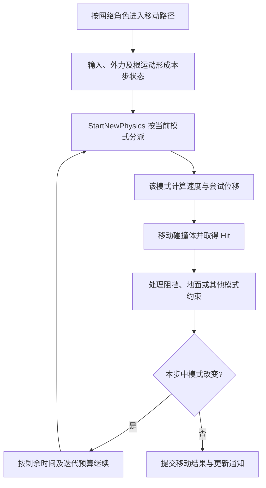

# 06 角色移动系统（UCharacterMovementComponent）

> 知识成熟度：L2。实际核对固定版本的 Epic 公开文档及 API 选段；正文中的教学推导、项目策略和接线片段不等于引擎实现或运行结果。
> 版本基准：网络移动、Root Motion 与坡度说明采用 UE 5.6 文档；C++ API 采用实际返回正文的 UE 5.5 页面；属性补充采用 UE 5.6 Python API。两组资料分别定位，不声称覆盖所有 UE5 版本。
> 知识基线：经典 `ACharacter` / `UCharacterMovementComponent`（CMC）的同步移动责任模型；地面和跳跃的纸面例采用世界 -Z 恒定重力。Mover、异步移动、任意重力实现及整套 Chaos 刚体求解不在本文覆盖内。
> 最后更新：2026-10-10（重建输入、模式、碰撞和扩展教学链，纠正事件、网络与版本断言）。
> 证据边界：本轮未读取目标机器的 `Engine/Build/Build.version`、UE 5.8 CL 55116800 或对应引擎实现；旧稿的“本机源码已核对”不能作为本轮事实。未运行 UE、UHT、编译、PIE、联机、弱网或性能实验；验证标签见第九节。

## 一、为什么角色移动不能只改坐标

角色向前走，需要同时回答四个问题：玩家想往哪里走，当前运动规则允许怎么走，碰撞后实际走到了哪里，以及其他机器如何复现这次移动。只把 Actor 位置每帧加一个向量，能表达目标，却没有定义落地、台阶、刹车和校正后的行为。

CMC 的作用是把这些问题接起来：输入形成移动意图，模式选择运动规则，运动规则提出位移，碰撞和地面约束决定可接受的结果，结果又改变下一步的模式和速度。`ACharacter` 则提供与这套机制配合的宿主、跳跃/蹲伏接口以及网络接线。给任意 `APawn` 加一个 CMC，不会自动得到相同合同。[网络移动基础](https://dev.epicgames.com/documentation/en-us/unreal-engine/understanding-networked-movement-in-the-character-movement-component-for-unreal-engine?application_version=5.6)

| 对象 | 持有/处理的内容 | 读者应追踪什么 |
| --- | --- | --- |
| Character 的 Capsule | 人形角色的主要移动碰撞形状 | 胶囊位置、尺寸、碰撞响应和支撑面 |
| CMC | `Velocity`、加速度、模式、地面/基座及网络移动状态 | 谁提出位移、谁修改结果、下次从什么状态继续 |
| Character 的 Mesh / AnimInstance | 姿态、蒙太奇、视觉偏移；启用时提供动画根运动 | 动画表现位置与胶囊逻辑位置的区别 |
| Controller / 输入接入 | 朝向与动作意图 | 输入坐标系、拥有者、按下/释放和取消 |

`UMovementComponent → UNavMovementComponent → UPawnMovementComponent → UCharacterMovementComponent` 是阅读继承链的顺序：基础层提供移动对象和碰撞工具，Pawn 层连接输入，CMC 增加角色模式与预测。`UpdatedComponent` 是被实际移动的组件；通用 MovementComponent 可以选择它，在标准 Character 中应保持角色胶囊这一约束，不把任意 Mesh 当成可随手替换的移动根。[MovementComponent API](https://dev.epicgames.com/documentation/en-us/unreal-engine/API/Runtime/Engine/GameFramework/UMovementComponent?application_version=5.5)

有扫掠移动不意味着所有附件都有各自的扫掠轨迹：上述 API 明确只考虑 `UpdatedComponent` 的碰撞，附属组件随到终点。因此长武器、翅膀等视觉附件可能穿墙；应按玩法另设查询或交互体积，不能以“角色有胶囊”推出每个附件都被保护。

## 二、从输入到速度，再到实际位移

### 2.1 输入是意图，不是厘米数

`AddMovementInput(WorldDirection, ScaleValue)` 接收世界方向和输入强度。向后走可以使用负强度；摇杆半推可以提供中间值。它不保证调用当下发生位移，基础 Pawn 也不会仅凭该调用自动移动。Character 的移动路径会消费这类意图。[AddMovementInput API](https://dev.epicgames.com/documentation/unreal-engine/API/Runtime/Engine/GameFramework/APawn/AddMovementInput?application_version=5.5)

这一区分决定了接线顺序：

1. 输入层把键盘/摇杆动作变成方向和大小，先明确采用角色朝向还是控制器水平朝向。
2. Pawn/CMC 接收输入；当前模式会约束可用方向，输入大小参与加速度与模拟输入强度的处理。
3. 运动规则结合当前 `Velocity`、限速、摩擦/制动、外力等得到本次运动状态。
4. 用时间片计算尝试位移，再通过碰撞和支撑约束取得实际终点。

按普通连续移动意图接入时，不要先把输入乘成 `Speed × DeltaSeconds` 再塞给 `AddMovementInput`；那会混淆输入强度和位移。相机俯仰也不应无意混进地面前进方向。具体 Enhanced Input 的映射生命周期见[增强输入](02-EnhancedInput增强输入.md)。

### 2.2 限速、转向和制动分别解决什么

| 入口/参数 | 主要问题 | 常见误用 |
| --- | --- | --- |
| `GetMaxSpeed()` / `MaxWalkSpeed` 等模式参数 | 当前规则希望限制的速度 | 当成一项万能瞬移防护或所有来源速度的硬保证 |
| `MaxAcceleration` | 输入怎样改变速度 | 当成每次输入要自己相乘的位移量 |
| `GroundFriction` | 地面转向控制；未分离制动时也参与减速 | 认为只有“有输入”时生效 |
| `BrakingDecelerationWalking` 等 | 相应模式制动中的恒定减速度项 | 与速度相关的摩擦阻力混为同一参数 |
| `bUseSeparateBrakingFriction` | 制动使用独立摩擦还是当前模式摩擦 | 以为开启后 `GroundFriction` 仍是独立制动系数 |
| `BrakingFrictionFactor` | 乘在实际选用的制动摩擦上 | 认为只对某一种分离设置生效 |
| `AirControl` 与 Boost 参数 | Falling 时横向输入控制 | 把“横向低速”误读成“接近地面” |

`CalcVelocity` 是可复用的速度计算入口，其公开合同涉及加速度、摩擦、流体项和制动，明确不施加重力。不能画成“所有模式都无条件经过它，再完成全部物理”；Custom 自己选择如何计算，Root Motion 又有独立输入。[CalcVelocity](https://dev.epicgames.com/documentation/unreal-engine/API/Runtime/Engine/GameFramework/UCharacterMovementComponent/CalcVelocity?application_version=5.5)

松手时，有两种不同的减速形态：恒定减速度在同样时间里减少同样速度；摩擦项的阻力随当前速度变化。实际 CMC 制动不能一般化为一个恒定的停止距离公式。行走未使用独立制动摩擦时，选用 `GroundFriction`；分离时选用 `BrakingFriction`，然后应用 `BrakingFrictionFactor`。[GroundFriction](https://dev.epicgames.com/documentation/unreal-engine/API/Runtime/Engine/GameFramework/UCharacterMovementComponent/GroundFriction?application_version=5.5)、[分离制动](https://dev.epicgames.com/documentation/unreal-engine/API/Runtime/Engine/GameFramework/UCharacterMovementComponent/bUseSeparateBrak-?application_version=5.5)、[倍率](https://dev.epicgames.com/documentation/unreal-engine/API/Runtime/Engine/GameFramework/UCharacterMovementComponent/BrakingFrictionF-?application_version=5.5)

一个有用的调参过程是先定普通/疾跑/蹲伏的速度目标，再固定方向比较起步，再松手比较停止过程，最后换向比较转向。一次同时改限速、加速度和摩擦，就无法知道手感差异来自哪一项。地面材质可以成为项目选择摩擦的输入，但物理材质摩擦不会因为名字相同就自动替换 CMC 的 `GroundFriction`。

### 2.3 尝试位移与实际位移

在只考虑恒定速度、没有碰撞和其他修正的教学模型中，`Delta = Velocity × DeltaTime`。单位可取 cm/s 与秒，结果为 cm。真实 CMC 一次更新可能包含重力、坡面调整、子步、碰撞滑动、基座移动或校正，所以不能拿一次最终 `Velocity × 帧时间` 必然等同本帧胶囊位移。

例如沿 +X 以 300 cm/s 尝试移动 0.1 s，模型提出 30 cm。如果阻挡命中把允许行程截在 12 cm，30 cm 是请求，12 cm 才是该段碰撞运动的结果；后续是停住还是沿面滑动，由当前模式和项目规则决定。这个算例是纸面几何条件，不是 CMC 实测，也不包含去穿透调整。

读 `OldLocation` 与当前位置差能观察更新后的位移，但该差也可能包含平台、去穿透或网络校正，不能无条件用它发放“走路里程”奖励。同样，拿 Mesh 平滑位移推断权威胶囊速度，也混淆了表现与逻辑。

## 三、MovementMode 决定接下来使用哪种规则

| 模式 | 主要含义 | 适用与边界 |
| --- | --- | --- |
| `MOVE_None` | 禁用常规角色移动 | 不等于禁止任何外部代码改 Transform |
| `MOVE_Walking` | 在可行走支撑面上运动 | 需要地面、坡度与台阶判定 |
| `MOVE_NavWalking` | 使用导航行走路径 | 不等于自动寻路，也不能保证物理几何与 NavMesh 完全重合 |
| `MOVE_Falling` | 离开地面后的空中运动 | 重力、横向控制和落地判断分别参与 |
| `MOVE_Swimming` | 流体体积中的移动 | 水体/PhysicsVolume 与浮力配置属于前提；视觉水面本身不是全部条件 |
| `MOVE_Flying` | 飞行运动规则 | 不使用常规下落重力，不意味着忽略碰撞 |
| `MOVE_Custom` | 项目自定义运动规则 | 以 `CustomMovementMode` 的字节值区分子模式；编号本身不包含算法 |

模式的用途和相应属性可在 [CMC API](https://dev.epicgames.com/documentation/en-us/unreal-engine/API/Runtime/Engine/GameFramework/UCharacterMovementComponent?application_version=5.5) 与 [5.6 属性说明](https://dev.epicgames.com/documentation/en-us/unreal-engine/python-api/class/CharacterMovementComponent?application_version=5.6)中定位。枚举名不是切换条件的完整说明。

一个最常见的闭环是：Walking 接收输入并保持地面约束；成功跳跃或失去支撑后进入 Falling；空中前进受重力和横向控制；命中合格落点后通知落地，再建立新的地面状态。失去支撑而下落和主动跳跃都可能进入 Falling，所以仅看到 `NewMode == Falling` 不能断言“刚刚按了跳跃”。

`SetMovementMode` 是切换入口；`SetGroundMovementMode` 配置 Walking/NavWalking 的地面选择，不能代替一次寻路请求。`DefaultLandMovementMode`、`DefaultWaterMovementMode` 是默认策略参数，不意味着退出任何 Custom 都应强行恢复 Walking。脚下没有可用地面时，退出滑铲的合理去向可能是 Falling；死亡/禁用则可能应保持 None。

需要精确区分 Walking 与 NavWalking 时，检查具体 `MovementMode`；判断地面能力时使用目标版本的地面查询语义。旧稿的 `IsWalking() == IsMovingOnGround()` 不能当作跨版本、跨派生类的不变量；公开页面的概括也不足以认证两个函数实现完全相同。[IsMovingOnGround API](https://dev.epicgames.com/documentation/unreal-engine/API/Runtime/Engine/GameFramework/UCharacterMovementComponent/IsMovingOnGround?application_version=5.5)

状态与模式也应分层：疾跑通常只是地面模式下的速度策略；攀爬改变约束面和输入解释，才可能需要 Custom。一个 Buff 不必创建一种模式，但所有会影响重演的 Buff 状态仍需进入相应同步合同。

## 四、Tick、碰撞、地面和基座怎样连成闭环

### 4.1 一次更新的责任顺序



这是责任图，不是目标 CL 的逐行调用栈。拥有者预测、服务器重演与模拟代理的入口不同，不能在图末尾一律再调用一遍 `ReplicateMoveToServer`。普通拥有者客户端的该函数包围移动记录和执行；若自己在 Tick 中额外调用 `PerformMovement`，可能重复推进。第七节解释角色差异。

`MaxSimulationTimeStep` 与 `MaxSimulationIterations` 是有限工作量和时间拆分的控制项。它们不等于固定频率物理模拟，也不保证“每一步永远不超过上限”：官方明确指出预算不足时最后一步可能超过时间步上限。调小步长可能改善某些运动情况，也增加工作量；不能承诺不穿模或任意低帧率稳定。[MaxSimulationTimeStep](https://dev.epicgames.com/documentation/unreal-engine/API/Runtime/Engine/GameFramework/UCharacterMovementComponent/MaxSimulationTim-?application_version=5.5)

### 4.2 Sweep 取得接触，模式决定响应

`SafeMoveUpdatedComponent` 会尝试移动，并在初始穿透情况下尝试解决穿透再移动；它的名字不表示所有几何输入都能安全走完。调用方要读 `FHitResult`：阻挡、初始穿透、命中时间和法线各自回答不同问题。[SafeMoveUpdatedComponent](https://dev.epicgames.com/documentation/unreal-engine/API/Runtime/Engine/GameFramework/UMovementComponent/SafeMoveUpdatedComponent/1?application_version=5.5)

墙体阻挡后，可以报告撞击，并依据剩余位移尝试沿表面滑动。`SlideAlongSurface` 的 `Time` 参数是尝试位移的比例，典型值是 `1 - Hit.Time`，不是再传一遍秒数。它还可能遇到第二面墙；“把向量投影到第一面墙上”不等于完成了整个角色碰撞解算。[SlideAlongSurface](https://dev.epicgames.com/documentation/unreal-engine/API/Runtime/Engine/GameFramework/UMovementComponent/SlideAlongSurface?application_version=5.5)

因此这几个命题不能互换：发生过移动、完成全部请求位移、未遇到阻挡、最终不存在穿透。只用 `if (!SafeMoveUpdatedComponent(...))` 判断“撞墙”，会漏掉先走一段再命中等情形；本篇第八节保留正确读取局部 Hit 的示例。

### 4.3 有阻挡面，不代表有可站立地面

Walking 需要可用支撑。`FindFloor` 对胶囊位置向下检测，并允许使用有效缓存或已有向下扫掠结果；它还涉及边缘站立判定。胶囊关闭碰撞时找不到地面。应将结果中的命中和“可行走”信息一起解释，不能用一根任意射线命中就替代角色地面合同。[FindFloor](https://dev.epicgames.com/documentation/unreal-engine/API/Runtime/Engine/GameFramework/UCharacterMovementComponent/FindFloor?application_version=5.5)

在世界 -Z 重力的几何教学图中，地面越陡，单位法线与向上向量的点积越小；用 `n·up >= cos(允许坡角)` 能解释坡角门槛的方向。但真实判定还包括有效接触、碰撞和表面覆盖规则。`Walkable Slope Override` 可以放宽或收紧某个物体的可行走坡度，因此同一个角色在两块同角度表面上出现不同结果未必是错误。[Walkable Slope](https://dev.epicgames.com/documentation/en-us/unreal-engine/walkable-slope-in-unreal-engine?application_version=5.6)

台阶处理则回答另一问题：碰到侧面后，能否越过局部高度变化并在新位置获得合格支撑。`MaxStepHeight` 是高度限制，`CanStepUp` 还涉及是否允许踏上该对象；`StepUp` 的结果表示跨越是否成功。台阶顶面、头顶空间、碰撞形状和落脚位置同样重要，“台阶比参数矮”只是必要因素之一。[StepUp](https://dev.epicgames.com/documentation/unreal-engine/API/Runtime/Engine/GameFramework/UCharacterMovementComponent/StepUp?application_version=5.5)

纸面正反例：同样 20 cm 高台阶，宽阔平台上方无遮挡时可以构成候选落脚条件；把平台上方压到胶囊无法容纳时，即使 `MaxStepHeight` 大于 20 cm，也不能据此推出跨越成功。这里不是给引擎配置默认台阶高度，而是在区分高度条件与完整可达性。

### 4.4 平台跟随和离开平台的速度不是一件事

站在移动基座上时，基座变换改变角色的位置；离开基座时，某些基座速度分量又可以影响起跳/下落。前者不能简单替换为“每帧把平台速度再加到角色 Velocity”。否则已有基座跟随与手工位移可能叠加两次。[UpdateBasedMovement](https://dev.epicgames.com/documentation/unreal-engine/API/Runtime/Engine/GameFramework/UCharacterMovementComponent/UpdateBasedMovement?application_version=5.5)、[CMC 的 bImpartBaseVelocityX/Y/Z 与 bImpartBaseAngularVelocity 条目](https://dev.epicgames.com/documentation/en-us/unreal-engine/API/Runtime/Engine/GameFramework/UCharacterMovementComponent?application_version=5.5)

排查平台抖动，应先记录 base 身份、平台与角色更新顺序、两端平台状态和角色是否遭到校正，再决定是否调整模拟预算。只调大迭代数，无法修复双重位移写者或两端使用了不同平台状态。

## 五、跳跃、蹲伏、朝向与移动事件

### 5.1 跳跃是请求与运动状态的配合

常规输入按下调用 `ACharacter::Jump()`，释放或取消调用 `StopJumping()`；Character 与 CMC 在移动更新中判断能否跳跃并施加跳跃状态。`JumpMaxHoldTime` 提供按住时长相关行为，`JumpMaxCount` 则表达允许的跳跃次数；二者不是同一个开关。[Jump](https://dev.epicgames.com/documentation/unreal-engine/API/Runtime/Engine/GameFramework/ACharacter/Jump?application_version=5.5)、[Character API](https://dev.epicgames.com/documentation/en-us/unreal-engine/API/Runtime/Engine/GameFramework/ACharacter?application_version=5.5)

默认重力方向下，可以把一次无持续输入、无碰撞、无根运动的理想上抛写成 `h = v0² / (2g)`，其中 g 是生效后的正重力大小。选择示例 `v0 = 400 cm/s`、`g = 1000 cm/s²`，纸面顶点时间为 0.4 s，高度为 80 cm；这不是 `JumpZVelocity` 或世界重力的引擎默认值。按住续跳、额外冲量、变重力、头顶碰撞或 Root Motion 都会改变条件。

`LaunchCharacter` 可用于跳板和击飞：它提交待应用的 launch velocity，XY/Z override 选项用于决定相应分量替换还是叠加。它不是普通跳跃资格检查的同义接口，也不应拿来绕开技能权限。[Character 的 LaunchCharacter 条目](https://dev.epicgames.com/documentation/en-us/unreal-engine/API/Runtime/Engine/GameFramework/ACharacter?application_version=5.5)

旧稿称 `DoJump(bool, float DeltaTime)` 为“5.8 新增”，但本轮取得的 [5.5 DoJump 页面](https://dev.epicgames.com/documentation/unreal-engine/API/Runtime/Engine/GameFramework/UCharacterMovementComponent/DoJump?application_version=5.5)已列出该签名；5.5 CMC 页面也已有 `bDontFallBelowJumpZVelocityDuringJump`。本文撤回这两个首次版本断言，不反向推断它们最早在哪个版本加入。业务输入优先用 `Jump`，不要复制旧签名直接覆写底层函数。

### 5.2 落地事件中还可能处于 Falling

`Landed(Hit)` 用于读取有效落点和碰撞时状态；官方说明该回调中模式仍是 Falling，速度是着陆时速度。需要“已经进入新模式”的逻辑，应放在模式变化通知，而非要求 `Landed` 内立即满足 `IsWalking()`。[Landed](https://dev.epicgames.com/documentation/unreal-engine/API/Runtime/Engine/GameFramework/ACharacter/Landed?application_version=5.5)

| 事件 | 适合做什么 | 不应推出什么 |
| --- | --- | --- |
| `OnJumped` | 跳跃已发生后的表现 | 每次进入 Falling 都是一次跳跃 |
| `Landed` / `OnLanded` / `LandedDelegate` | 读取落点；音效、尘土等着陆表现 | 此刻地面模式已完全建立 |
| `OnMovementModeChanged` / Character 的 `K2_OnMovementModeChanged` | 比较旧/新模式；进入/退出初始化 | 回调必定只来自玩家主动操作 |
| `OnCharacterMovementUpdated` | 读取本次移动更新前后的状态 | 严格每渲染帧一次、每内部子步一次或天然只执行一次业务副作用 |

网络纠正可能重演移动，表现或业务事件也需要明确是否可重复。项目可给落地效果做去重或合并；奖励、伤害、消耗等由各自权威结算路径决定，不应直接按移动回调次数结算。动态多播委托应按实际声明使用匹配绑定方式和 `UFUNCTION` 接收函数，不能笼统声称所有移动委托都能 `.AddUObject`；绑定者离开作用域时解除自己建立的订阅。

### 5.3 蹲伏与朝向也有责任边界

降低姿态优先使用 Character 的 `Crouch` / `UnCrouch` 请求。站起需要空间：CMC 的 `UnCrouch` 会检查恢复尺寸是否造成侵入，成功才触发结束蹲伏通知。离开滑铲时调用一次站起请求，不保证顶着低天花板也已站直；不要随后强制恢复胶囊半高。[UnCrouch](https://dev.epicgames.com/documentation/unreal-engine/API/Runtime/Engine/GameFramework/UCharacterMovementComponent/UnCrouch?application_version=5.5)

`bOrientRotationToMovement` 表达随加速度方向转向的策略，`bUseControllerDesiredRotation` 表达跟随控制器目标旋转；`RotationRate` 控制旋转变化速率。若 Pawn 的 `bUseControllerRotationYaw` 同时写角色朝向，就要明确谁负责最终旋转，避免两个意图争写。面向移动方向、面向瞄准方向和相机自由观察是可分别选择的玩法，不必混成一组开关。

## 六、Custom 与 Root Motion：选择正确的扩展入口

### 6.1 先判断究竟改变了什么

| 需求 | 合适的起点 | 额外需要定义的内容 |
| --- | --- | --- |
| 普通疾跑、受伤减速 | 模式参数 / `GetMaxSpeed` 策略 | 意图、资格、优先级与同步 |
| 跳板或瞬时击飞 | `LaunchCharacter` 等移动输入 | 触发端、分量规则、碰撞后状态 |
| 动作资产决定位移 | 动画 Root Motion | 提取设置、移动模式、触发与中断 |
| 程序化短时能力位移 | Root Motion Source | 参数、句柄所有者、结束/取消 |
| 攀爬、壁走、自定义滑行规则 | `MOVE_Custom` | 约束、位移、碰撞、退出与可重演状态 |

修改点越深，接管的责任越多。仅为了改最大行走速度而覆写整个 `TickComponent`，会同时碰到原本无需改动的预测与更新顺序。保留原文关于 `GetMaxAcceleration`、`GetMaxBrakingDeceleration`、`CalcVelocity`、`PhysCustom`、`OnMovementModeChanged` 的扩展用途，但具体签名和访问级别必须以目标版本为准，API 表不能替代编译。

### 6.2 Custom 不是自动生成的一套滑铲物理

进入 `MOVE_Custom` 后，常规 Walking/Falling 物理不会替你完成自定义运动。C++ 可覆写 `PhysCustom` 并由项目根据子模式分派。蓝图也有 Character 的 `UpdateCustomMovement`（C++ 名 `K2_UpdateCustomMovement`）入口，由 PhysCustom 路径调用；旧稿“蓝图只能调参数”和“CMC 默认替项目分发全部子模式”的说法都不成立。[网络移动文档的 Using Custom Movement Modes](https://dev.epicgames.com/documentation/en-us/unreal-engine/understanding-networked-movement-in-the-character-movement-component-for-unreal-engine?application_version=5.6)、[Character API 中 K2_UpdateCustomMovement](https://dev.epicgames.com/documentation/en-us/unreal-engine/API/Runtime/Engine/GameFramework/ACharacter?application_version=5.5)

蓝图入口可表达逻辑，并不自动生成自定义状态的网络序列化和预测历史。在 C++ 与蓝图混合方案中要指定唯一位移写者：若 C++ 已完整处理某子模式，又调用带蓝图自定义更新的基类路径，必须避免蓝图再次移动。未知子模式怎样拒绝、回退或委托，也应是明确选择。

以滑铲为例，一份完整的玩法合同至少有这些因果环节：

1. 进入：检查当前是否允许滑铲，取得初始速度和规则版本；模式确认切换后才建立本次滑铲拥有的状态。
2. 推进：每个有效时间片按滑行规则更新速度，得到尝试位移；处理碰撞，再检查支撑。速度低于门槛、到时、取消或阻挡都可以成为项目定义的退出原因。
3. 退出：有合格地面才回到地面模式，失去支撑转 Falling，禁用/死亡服从高优先级状态；不能总是 `SetMovementMode(MOVE_Walking)`。
4. 清理：释放本次创建的效果、订阅和运动句柄；请求站起并接受空间不足的结果；清除本次意图，避免下次进入继承旧状态。

教学上可以先将滑铲限制为宽阔静态水平面上的单机直线动作，再加入坡面投影、台阶、边缘、平台和网络。这个限制让“初速如何衰减”与“地面如何约束”可以分别解释，并不意味着略去后者也能发布为完整角色移动系统。

### 6.3 Root Motion 改变位移来源，仍需移动约束

动画骨骼向前移动，不代表胶囊已经跟着走。需在动画资产启用根运动，并选择 AnimInstance 的提取/应用策略。比如 Ignore Root Motion 提取后不应用到角色，Montages Only 则只提取相关蒙太奇。正确应用后，动画根位移进入角色移动；碰撞、当前模式和重力约束仍参与，而非任意播放动画就忽略世界。[Root Motion 5.6 的 Enabling 与 Results](https://dev.epicgames.com/documentation/en-us/unreal-engine/root-motion-in-unreal-engine?application_version=5.6)

这能解释一个常见反例：攻击动画的 Mesh 向前伸出，结束后退回原位置，胶囊从未离开起点。问题可能是提取/应用链没有接通，不能先用 Actor Tick 再补同样位移；否则启用根运动后又会走两份距离。Walking/Falling 与 Flying 对根运动竖直分量的处理也不同，动画中有上升曲线不保证角色实际完成同样上升。

Root Motion Source 将程序参数交给移动系统处理，适合运动目标由玩法动态决定的短时能力。应用得到的句柄由该能力持有；结束、取消或被替换时按自己的句柄移除，避免清掉别人的源。它与动画根运动不是“同一个动画资产的另一名称”。网络环境仍需匹配能力触发、输入状态和源生命周期；仅有位置曲线不能保证两端执行一致。[网络移动文档的 Root Motion Sources](https://dev.epicgames.com/documentation/en-us/unreal-engine/understanding-networked-movement-in-the-character-movement-component-for-unreal-engine?application_version=5.6)

## 七、网络角色、预测和清理各归谁负责

本文只保留 CMC 扩展所需的网络责任链。发送合并、时间戳、ACK、packed 数据扩展和射击延迟补偿由[客户端预测与延迟补偿](../../07-网络与游戏服务端/同步预测与回放/03-客户端预测与延迟补偿.md)集中展开；本篇的静态核对不重新认证那些范围。

| 角色/阶段 | 移动职责 | 扩展代码必须考虑的状态 |
| --- | --- | --- |
| 拥有者客户端 Autonomous Proxy | 本地预测，保存可重演的移动资料，按发送策略上报 | 本步输入及会影响速度/模式的自定义意图 |
| 服务器 Authority | 按接收到的移动与权威规则重演，确认或修正 | 权威资格、状态与时间；不能把客户端末位置当命令 |
| 拥有者接收修正 | 恢复对应状态，重演其后的未确认移动 | 必须使用那些移动当时的状态，不能只看当前全局布尔量 |
| 其他客户端 Simulated Proxy | 使用复制状态进行模拟更新和视觉平滑 | 表现观察不等同于拥有者的输入预测队列 |

官方网络说明还区分了服务器收到拥有者移动时的处理路径与普通本地 Tick。移动记录频率不等于 RPC 发送频率；模拟代理也不只是每帧把 Transform 做一次 Lerp。不要把概述中的 `ServerMove` 族名称当作某一固定版本的唯一实际 RPC 调用栈。[Networked Movement 5.6](https://dev.epicgames.com/documentation/en-us/unreal-engine/understanding-networked-movement-in-the-character-movement-component-for-unreal-engine?application_version=5.6)

疾跑是最小的反例：客户端某步使用 720 的限速，服务器同一步仍按 480 处理；即使两端拥有完全相同的 C++，不同状态仍会导致不同结果。反过来，服务器稍后把疾跑布尔值复制过来，也不自动为客户端过去的每一步补齐正确状态。需要定义意图保存、合并边界、发送/恢复、权威资格与清理；具体 SavedMove 扩展见上述关联文。

“服务器权威”意味着服务器负责裁决，不是自动拥有所有项目反作弊规则。技能资源、允许移动模式、异常参数、外部位移来源等仍需项目定义。预测误差也可能来自不同碰撞/平台状态，不能仅凭一次校正判定作弊。

清理应遵循资源所有权：

- 移动组件管理自身的预测记录、ACK 与复用生命周期；业务不要随手清空整条 SavedMoves 队列来消除抖动
- 输入绑定者处理释放、取消、失去控制与界面切换后的意图复位，避免疾跑/跳跃一直粘住
- 自定义模式管理自己的进出临时状态；死亡、取消、模式被抢占与 EndPlay 都不能留下持续写位移的回调
- 能力持有并清理自己创建的 Root Motion Source、计时器与特效；若仅借用了共享对象，不在退出时清理他人的资源
- 表现观察者解绑自己注册的委托；旧 Pawn 被替换后，不能继续把旧组件的移动事件当成新 Pawn 的事件

这些是项目集成原则，不是已实现的网络滑铲框架或所有服务器模式的保证。

## 八、保留可用的实践入口：有限 API 接线

以下 C++ 是自行编写、未编译的片段，不是从引擎实现复制的源码。它们展示接入点与局部合同，省略项目模块导出宏、完整头文件、生成头与资产/输入配置；不能拼接后宣称已经能在服务器运行。示例常量全部是人为设置。

### 8.1 参数配置与输入方向

```cpp
// ATrainingCharacter 构造函数中的配置片段。
UCharacterMovementComponent* Move = GetCharacterMovement();
Move->MaxWalkSpeed = 480.0f;             // 示例 cm/s
Move->MaxWalkSpeedCrouched = 180.0f;
Move->MaxAcceleration = 1600.0f;         // 示例 cm/s²
Move->GroundFriction = 6.0f;
Move->BrakingDecelerationWalking = 1200.0f;
Move->JumpZVelocity = 400.0f;
Move->AirControl = 0.2f;
Move->bOrientRotationToMovement = true;
Move->RotationRate = FRotator(0.0f, 540.0f, 0.0f);
bUseControllerRotationYaw = false;
```

在已声明 `void MoveOnGround(FVector2D Axis);` 的 Character 中，可以这样接收地面动作值。前提是目标项目采用世界 Z 向上、控制器水平朝向作为前进方向；任意重力需重新定义基向量。

```cpp
void ATrainingCharacter::MoveOnGround(FVector2D Axis)
{
    if (!Controller) return;
    const FVector2D Bounded = Axis.GetClampedToMaxSize(1.0f);
    const FRotator YawOnly(0.0f, Controller->GetControlRotation().Yaw, 0.0f);
    const FRotationMatrix Basis(YawOnly);
    AddMovementInput(Basis.GetUnitAxis(EAxis::X), Bounded.Y);
    AddMovementInput(Basis.GetUnitAxis(EAxis::Y), Bounded.X);
}
```

正向用途是把相机俯仰从地面移动方向中排除，保留摇杆大小并控制合成输入范围。这里约定 Axis.Y 为前后、Axis.X 为左右；项目若采用另一轴约定，应在输入边界转换，而非到处交换 X/Y。完整 Enhanced Input 绑定以及 Completed/Canceled 处理沿用输入主题，跳跃分别接 `Jump` 与 `StopJumping`。

### 8.2 疾跑：用状态选择速度策略

```cpp
// 在自定义 CMC 类中声明并初始化：
bool bWantsToSprint = false;             // 本地意图，不是权威批准
float SprintSpeed = 720.0f;              // 示例 cm/s
virtual float GetMaxSpeed() const override;

float UTrainingMovement::GetMaxSpeed() const
{
    if (MovementMode == MOVE_Walking && !IsCrouching() && bWantsToSprint)
    {
        return SprintSpeed;
    }
    return Super::GetMaxSpeed();
}
```

这个策略明确只扩展 Walking 且非蹲伏状态，不先把蹲伏基础速度乘上疾跑倍率。按下置意图，释放、取消或本地失去控制时清意图。`bWantsToSprint` 不是已实现的权限/耐力检查，片段也未实现网络保存和序列化；服务端资格及重演状态另接第七节的责任链。使用 `GetMaxSpeed` 的好处是集中表达策略，不是“自动消除复制抖动”。

Character 需要在默认子对象构造阶段使用该派生组件；已声明匹配构造函数的项目可采用这类接线：

```cpp
ATrainingCharacter::ATrainingCharacter(const FObjectInitializer& Initializer)
    : Super(Initializer.SetDefaultSubobjectClass<UTrainingMovement>(
          ACharacter::CharacterMovementComponentName))
{
}
```

这段不等于运行时再创建第二个 CMC；两个组件同时写胶囊会破坏单一写者假设。参数配置、角色头文件与模块依赖仍由项目补齐。

### 8.3 Custom 滑铲：先把一次尝试移动接对

先采用有限训练合同：静态宽阔水平地面、无 Root Motion、无移动平台、无坡阶和网络。输入取消、低速和最大时长由外层状态逻辑处理。下面只展示一次尝试位移的接线，`AttemptedDelta` 必须由该时间片的滑行规则提供；它没有实现完整 `PhysCustom`，也没有伪装成引擎默认滑铲。

```cpp
// 在 UTrainingMovement 的自定义移动路径内。
// AttemptedDelta 已是本时间片的尝试位移；不是输入强度。
if (!UpdatedComponent) return;
FHitResult Hit(1.0f);
const bool bMoved = SafeMoveUpdatedComponent(
    AttemptedDelta, UpdatedComponent->GetComponentQuat(), true, Hit,
    ETeleportType::None);

if (Hit.bStartPenetrating || Hit.IsValidBlockingHit())
{
    // 训练策略：遇阻即停，由外层退出逻辑选择后续模式并清理。
    StopMovementImmediately();
    bSlideExitRequested = true;
}
else if (!bMoved && !AttemptedDelta.IsNearlyZero())
{
    // 未取得预期移动，同样交给统一退出路径，不能继续无限尝试。
    StopMovementImmediately();
    bSlideExitRequested = true;
}
```

`bSlideExitRequested` 是项目字段，应初始化为 false，进入和退出时按本次动作生命周期重置。Hit 是这里声明的局部输出，不能假定有一个可直接使用的 CMC 成员 `HitResult`。对于更一般的贴墙滑行可采用 `SlideAlongSurface`，但同时要定义剩余时间、第二次命中和模式变化；本片段选择停止，不能据此声称已处理所有碰撞。

有限滑行速度规则可用 `speed_next = max(speed - deceleration × dt, 0)` 理解，`deceleration` 单位为 cm/s²，不应命名为没有单位说明的“摩擦系数”。低于退出阈值后退出，而非永远钳在最小速度继续滑。接入完整角色时还要在移动前后处理地面有效性；离开平台立即退出训练合同，不能因把 `Velocity.Z` 写成零就悬空。

### 8.4 落地表现与飞行 Pawn 对照

落地表现可覆写已声明的 `Landed(const FHitResult&)`，保存所需的着陆速度，调用 `Super::Landed(Hit)`，再按项目规则生成音效或尘土。若改用 `LandedDelegate`，选择这一条订阅链并管理绑定寿命；不要同时在 override、蓝图事件和委托里各播放一次同一效果。Hit 不直接提供“角色着陆速度”，应从移动状态取值。

轻量无人机可以采用 `UFloatingPawnMovement`：先给 Pawn 一个有合适碰撞形状/响应的根组件，将其设为移动对象，再配置 `MaxSpeed / Acceleration / Deceleration / TurningBoost`，最后由输入传入三维移动意图。原稿只创建移动组件而没有建立根碰撞与移动对象，不能当作完整可运行 Pawn。

```cpp
// 有效 CollisionRoot 已作为 Pawn 根组件建立，FloatingMovement 已创建。
FloatingMovement->SetUpdatedComponent(CollisionRoot);
FloatingMovement->MaxSpeed = 800.0f;     // 示例 cm/s
FloatingMovement->Acceleration = 2000.0f;
FloatingMovement->Deceleration = 4000.0f;
FloatingMovement->TurningBoost = 8.0f;
```

该组件提供简单速度/加速度控制，公开类说明写明不实现重力，但仍有扫掠碰撞与去穿透相关能力；不是“无碰撞解析的直接位移”。同页一个函数摘要又出现“applies gravity”，与类 Remarks 有文字不一致，本文只按类用途作有限对照，不据此推断该函数实现。需要地面、跳跃及 CMC 那套网络角色行为时，应选择相应角色方案。[FloatingPawnMovement 5.5](https://dev.epicgames.com/documentation/unreal-engine/API/Runtime/Engine/GameFramework/UFloatingPawnMovement?application_version=5.5)

## 九、可复现纸面追踪与验证边界

下表的 `PAPER_EXPECTED` 仅表示在明确输入和前提下的纸面预期；没有启动或执行 UE。`SOURCE_CHECKED` 是已读官方选段支持的接口语义，不能替代运行。全部代码编译、资产接线、碰撞场景、事件次数、网络重演和性能验证均为 `NOT_RUN`。

| 编号 | 输入与操作 | PAPER_EXPECTED 与反例判定 | 能说明什么 |
| --- | --- | --- | --- |
| P1 输入/位移 | 正交平面基向量；轴 `(0, 0.5)`；只跟踪输入合成 | 前向意图大小为 0.5，不是已经走 0.5 cm；若直接报告位移即混层 | 第2/8节的输入语义；不预测 CMC 末速度 |
| P2 请求/碰撞 | 300 cm/s，0.1 s；假定扫掠允许前进12 cm后被墙挡 | 请求30 cm，实际该段12 cm；发生过移动与阻挡可以同时成立 | 不能用 bool 返回替代 Hit 判定 |
| P3 坡/台阶 | 无覆盖的30°和60°坡；人为门槛45°；另给20 cm台阶上方不足空间 | 单独坡角条件只放行30°；低台阶也可能因净空失败 | 可走坡与可跨台阶是不同条件；不认证完整场景结果 |
| P4 跳跃 | 理想初速400 cm/s、恒重力1000 cm/s²，无续跳/碰撞 | 顶点0.4 s、高80 cm；有低顶或续跳时不能沿用80 cm | 跳高公式的前提，不是UE默认或帧积分结果 |
| P5 滑行 | 训练规则初速300、减速度200、dt0.25 s、退出阈值180 | 第一步250、第二步200、第三步150后退出；不钳成180无限滑 | 终止条件与速度规则；未验证碰撞/平台/网络 |
| P6 事件顺序 | Falling 找到有效落点，进入 Landed 回调 | 不能断言此刻已Walking；模式完成后的逻辑等模式通知 | SOURCE_CHECKED 的落地事件边界 |
| P7 疾跑重演 | 客户端某步意图true、服务器同一步false；同一代码不同状态 | 不能保证得到同一结果；只复制当前bool不能补齐所有历史 | 同代码不足以建立可重演合同 |
| P8 退出与空间 | 滑铲请求结束；头顶不足站立；另一路死亡已禁用移动 | 请求站起不等于成功；清理滑铲不能无条件把None改回Walking | 清理归属与高优先级状态 |
| P9 根运动 | 动画有前移，应用设置为Ignore Root Motion | 不能仅凭根骨曲线宣称胶囊会前移；再叠Tick位移不修复设置合同 | 区分提取、应用和运动约束 |

未来接入目标项目时，应先编译最小角色并确认输入和事件接线，再验证平地、墙角、低顶、坡阶、边缘与基座；之后才验证拥有者、服务器、模拟代理和中断/销毁流程。每项应记录实际版本、初始状态、输入、输出和失败，不把预期表重命名成“测试通过”。这里没有提供已经运行的脚本、性能数字或服务器容量结论。

## 十、按症状定位责任层

| 症状 | 先观察哪一层 | 根据观察采取什么行动 |
| --- | --- | --- |
| 输入触发但角色不走 | 拥有者/Controller、输入是否到 Pawn、模式、移动对象与Tick、限速/加速度 | 意图为空先查输入；None查禁用原因；请求存在但位移为零查碰撞/状态，不立即改Actor坐标 |
| 松手仍滑很远 | 当前模式、实际选用的摩擦与制动项 | 确认分离开关，再单独调一项；不要把Walking参数套到全部模式 |
| 空中转向过弱或过强 | Falling横向速度、AirControl及Boost门槛 | Boost按横向速度条件理解；不要用离地高度解释低速增强 |
| 跳跃高度不同 | 跳跃保持时间、有效重力、碰撞与外力 | 先判定理想公式前提是否成立；释放/取消必须能停止保持请求 |
| Custom不动或走两遍 | 当前主模式/子模式，C++与蓝图位移写者 | 无写者补自定义推进；两个写者合并责任，不能靠把dt减半掩盖 |
| 看似落地却仍Falling | 读取发生在Landed还是模式改变之后 | 在正确阶段判断状态，避免把事件时机当物理故障 |
| 滑铲结束后卡低姿态 | 站起请求、头顶空间和蹲伏实际状态 | 保持可容纳姿态，等待项目允许的站起时机，不强行放大胶囊 |
| 联机橡皮筋 | 意图/资格、规则版本、base和根运动状态、校正边界 | 先对比同一次移动的输入与状态，再查网络；不关闭校正来宣称问题解决 |
| 平台抖动 | 基座身份、更新顺序和是否双重应用位移 | 消除重复写者；版本/API与时间预算是下一层问题 |
| 动画漂移或结束回弹 | 根运动提取/应用、胶囊与Mesh位置 | 确认运动来源；不要同时用根运动和手工Tick补同一段位移 |

参数或查询读取可用于诊断，但不要假定任意 Tick 都读到“上帧残留”，也不要把 `OnCharacterMovementUpdated` 当成已验证的每子步回调。需要对齐观测时机时，给采样记录附上本次更新前后、预测/修正阶段以及对象身份。

## 十一、来源范围与版本迁移说明

本轮核对日为 2026-10-10。下表列出实际使用的公开页选段；未声称逐行读完大型 API 总表，也没有把网页上的 Source 路径视为已读取实现文件。

| 来源 | 实际版本与核对位置 | 支持范围与限制 |
| --- | --- | --- |
| [Networked Movement](https://dev.epicgames.com/documentation/en-us/unreal-engine/understanding-networked-movement-in-the-character-movement-component-for-unreal-engine?application_version=5.6) | 5.6，Basics、PerformMovement、各网络角色、Custom、Root Motion、packed扩展选段 | 责任链；不是UE5.8逐行实现、默认发送频率或完整反作弊保证 |
| [CMC API](https://dev.epicgames.com/documentation/en-us/unreal-engine/API/Runtime/Engine/GameFramework/UCharacterMovementComponent?application_version=5.5) | 5.5，继承、所用属性、公开虚函数与事件相关条目 | 符号/接口定位；5.6直接访问未得到有效正文，不能暗中改标5.6 |
| [CMC Python API](https://dev.epicgames.com/documentation/en-us/unreal-engine/python-api/class/CharacterMovementComponent?application_version=5.6) | 5.6，movement_mode、摩擦、坡面、AirControl相关属性选段 | 属性文字；不作为C++调用实现或全部默认值清单 |
| [MovementComponent](https://dev.epicgames.com/documentation/en-us/unreal-engine/API/Runtime/Engine/GameFramework/UMovementComponent?application_version=5.5)、[SafeMove](https://dev.epicgames.com/documentation/unreal-engine/API/Runtime/Engine/GameFramework/UMovementComponent/SafeMoveUpdatedComponent/1?application_version=5.5)、[SlideAlongSurface](https://dev.epicgames.com/documentation/unreal-engine/API/Runtime/Engine/GameFramework/UMovementComponent/SlideAlongSurface?application_version=5.5) | 5.5，Remarks/签名/参数 | 移动对象、穿透尝试、比例参数；未读取 cpp |
| [AddMovementInput](https://dev.epicgames.com/documentation/unreal-engine/API/Runtime/Engine/GameFramework/APawn/AddMovementInput?application_version=5.5)、[CalcVelocity](https://dev.epicgames.com/documentation/unreal-engine/API/Runtime/Engine/GameFramework/UCharacterMovementComponent/CalcVelocity?application_version=5.5) | 5.5，Remarks/参数 | 输入意图、速度计算不施重力；不是统一积分算法 |
| [GroundFriction](https://dev.epicgames.com/documentation/unreal-engine/API/Runtime/Engine/GameFramework/UCharacterMovementComponent/GroundFriction?application_version=5.5)、[分离制动](https://dev.epicgames.com/documentation/unreal-engine/API/Runtime/Engine/GameFramework/UCharacterMovementComponent/bUseSeparateBrak-?application_version=5.5)、[倍率](https://dev.epicgames.com/documentation/unreal-engine/API/Runtime/Engine/GameFramework/UCharacterMovementComponent/BrakingFrictionF-?application_version=5.5) | 5.5，Remarks | 选项语义；示例配置不是默认配置，蓝图/CDO/运行状态仍可能覆盖 |
| [FindFloor](https://dev.epicgames.com/documentation/unreal-engine/API/Runtime/Engine/GameFramework/UCharacterMovementComponent/FindFloor?application_version=5.5)、[StepUp](https://dev.epicgames.com/documentation/unreal-engine/API/Runtime/Engine/GameFramework/UCharacterMovementComponent/StepUp?application_version=5.5)、[Walkable Slope](https://dev.epicgames.com/documentation/en-us/unreal-engine/walkable-slope-in-unreal-engine?application_version=5.6) | 前两者5.5；坡度指南5.6 | 地面/跨越/覆盖的接口和条件；不认证具体地图碰撞 |
| [MaxSimulationTimeStep](https://dev.epicgames.com/documentation/unreal-engine/API/Runtime/Engine/GameFramework/UCharacterMovementComponent/MaxSimulationTim-?application_version=5.5)、[UpdateBasedMovement](https://dev.epicgames.com/documentation/unreal-engine/API/Runtime/Engine/GameFramework/UCharacterMovementComponent/UpdateBasedMovement?application_version=5.5) | 5.5，Remarks | 步长预算例外、基座位置更新；没有性能测量或线程安全承诺 |
| [Character](https://dev.epicgames.com/documentation/en-us/unreal-engine/API/Runtime/Engine/GameFramework/ACharacter?application_version=5.5)、[Jump](https://dev.epicgames.com/documentation/unreal-engine/API/Runtime/Engine/GameFramework/ACharacter/Jump?application_version=5.5)、[DoJump](https://dev.epicgames.com/documentation/unreal-engine/API/Runtime/Engine/GameFramework/UCharacterMovementComponent/DoJump?application_version=5.5)、[Landed](https://dev.epicgames.com/documentation/unreal-engine/API/Runtime/Engine/GameFramework/ACharacter/Landed?application_version=5.5)、[UnCrouch](https://dev.epicgames.com/documentation/unreal-engine/API/Runtime/Engine/GameFramework/UCharacterMovementComponent/UnCrouch?application_version=5.5) | 5.5，所用属性、事件与Remarks | 跳跃请求/释放、落地时机、站起空间；个别独立事件页访问失败，依据实际返回的Character条目 |
| [Root Motion](https://dev.epicgames.com/documentation/en-us/unreal-engine/root-motion-in-unreal-engine?application_version=5.6)、[FloatingPawnMovement](https://dev.epicgames.com/documentation/unreal-engine/API/Runtime/Engine/GameFramework/UFloatingPawnMovement?application_version=5.5) | 分别5.6与5.5，类用途/提取应用/运动模式约束 | 选择与对照；Floating页内部摘要歧义已在8.4注明 |

历史定位 `Engine/Source/Runtime/Engine/Classes/GameFramework/CharacterMovementComponent.h`、`Engine/Source/Runtime/Engine/Private/Components/CharacterMovementComponent.cpp`、`Engine/Source/Runtime/Engine/Classes/GameFramework/Character.h`、`Engine/Source/Runtime/Engine/Classes/GameFramework/MovementComponent.h`、`Engine/Source/Runtime/Engine/Classes/GameFramework/FloatingPawnMovement.h` 与 `Engine/Source/Runtime/Engine/Classes/Engine/EngineTypes.h` 保留为授权目标 checkout 的后续阅读入口，均非本轮路径存在性或源码版本验证。

旧稿还列出 UE5.8 的基座接口迁移，以及固定 `MaxAcceleration`、JumpZVelocity、AirControl、模拟步长等默认数字。本轮不把它们当作已核实默认或迁移合同，也不复制不可见的弃用宏；迁移时以目标头文件、实际类默认对象、蓝图覆盖和项目配置核对。packed 移动在已读5.6文档中已存在，不能简单归为“5.8才有”。整篇继续为L2，但其依据明确收窄为实际公开资料静态核对，`verified` 保持空列表。

## 十二、关联阅读与职责分工

- [Enhanced Input 增强输入](02-EnhancedInput增强输入.md)：动作值、方向约定、绑定与取消；本文从移动意图接收处继续
- [角色移动完整链路](../../07-网络与游戏服务端/同步预测与回放/02-角色移动完整链路.md)：保留项目链路阅读入口；按其自己的版本与实际证据阅读，标题中的“完整”不是本篇运行证明
- [客户端预测与延迟补偿](../../07-网络与游戏服务端/同步预测与回放/03-客户端预测与延迟补偿.md)：发送、保存、重演、校正与网络扩展的主责正文
- [委托事件与对象通信](../../03-引擎架构与资源系统/模块化框架与对象通信/04-委托事件与对象通信.md)：观察者绑定和释放
- [蓝图与C++协作](../玩法架构与任务协作/05-蓝图与C%2B%2B协作.md)：事件归属、蓝图接口与原生扩展
- [Gameplay Ability System](../技能战斗与属性结算/01-GameplayAbilitySystem能力系统.md)：能力触发、取消与移动源所有权
- [动画求值与角色表现](../../04-图形动画与物理仿真/动画求值与角色表现/README.md)：动画状态与Root Motion表现链
- [场景组件与变换体系](../../04-图形动画与物理仿真/空间层级与变换/05-场景组件与变换体系.md)：组件层级、坐标与移动对象
- [物理求解与动力学](../../04-图形动画与物理仿真/物理求解与动力学/README.md)：物理模拟和角色运动控制的边界
- [Lyra核心生成移动与状态源码](53-Lyra核心生成移动与状态源码.md)：项目特有生成/状态接线；不把Lyra规则自动当成裸CMC规则
