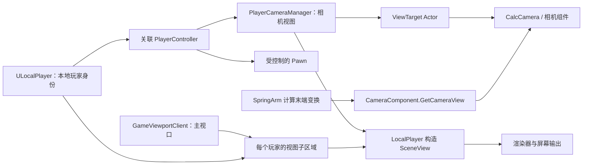
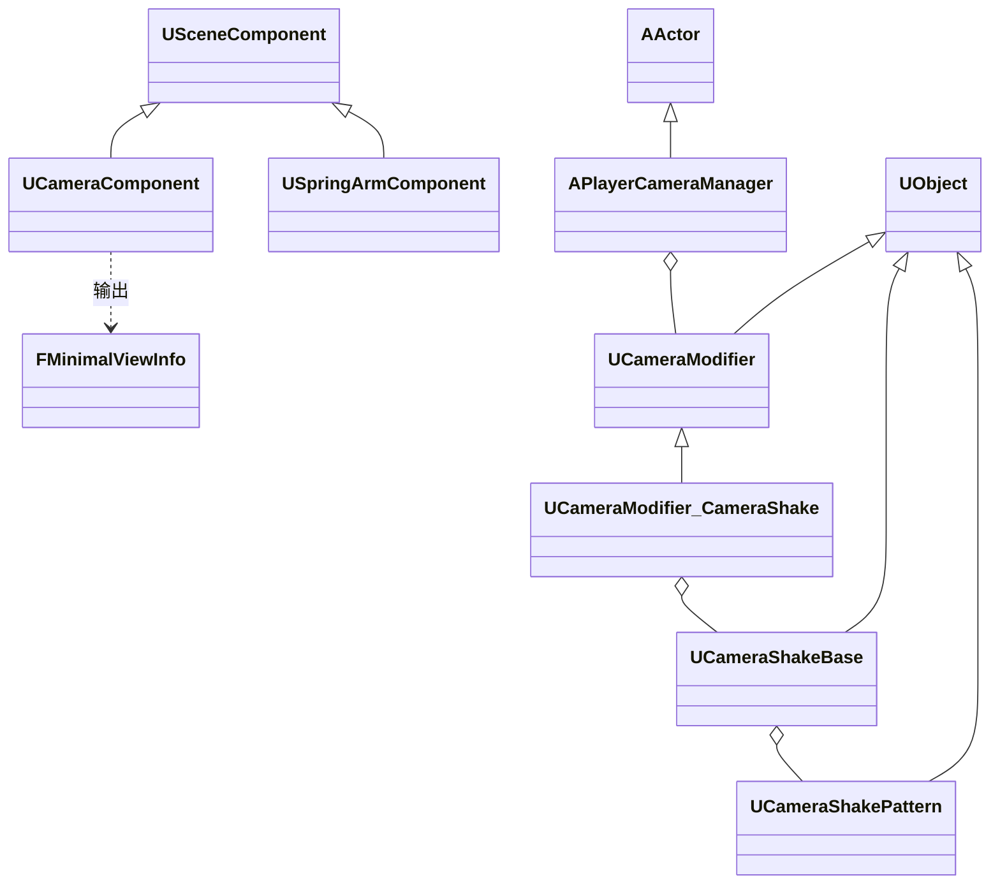
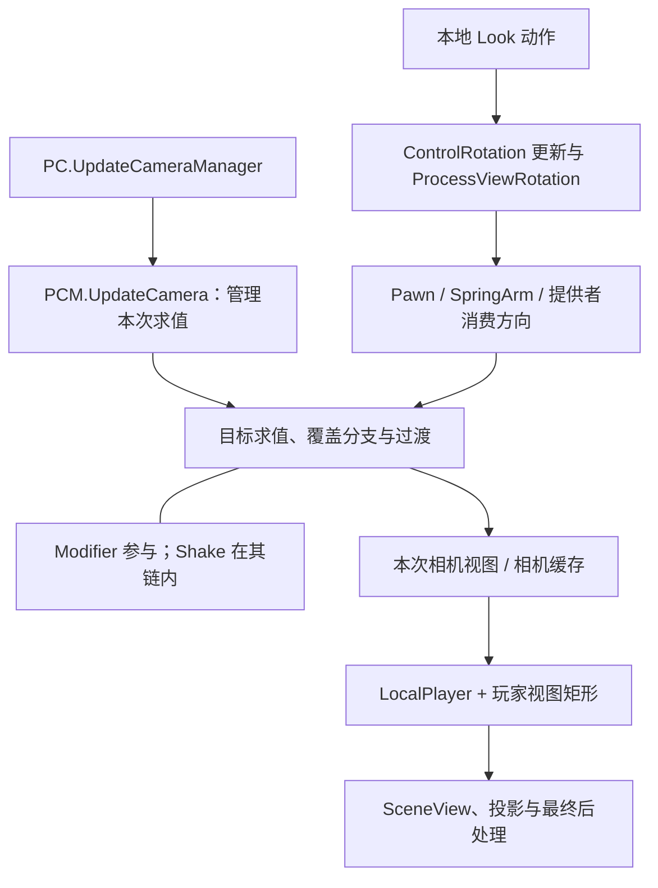
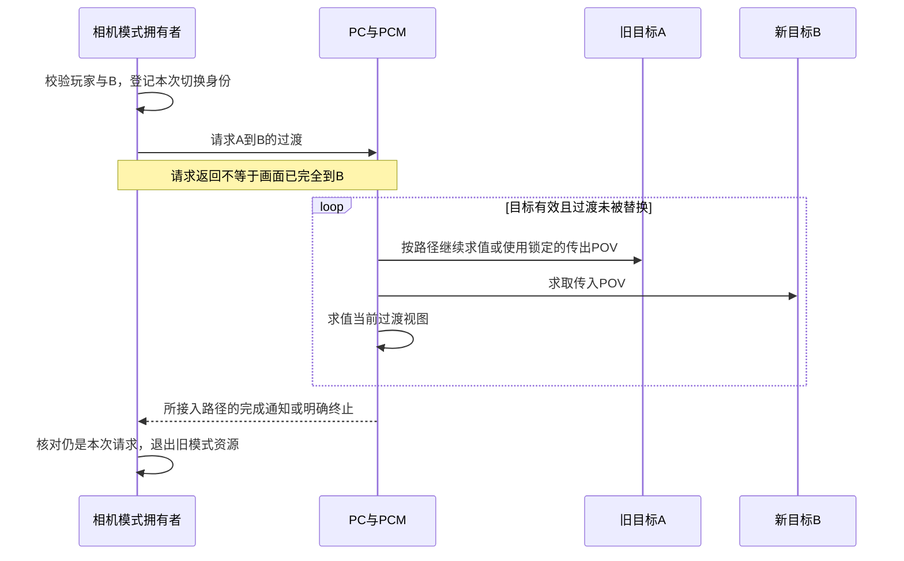
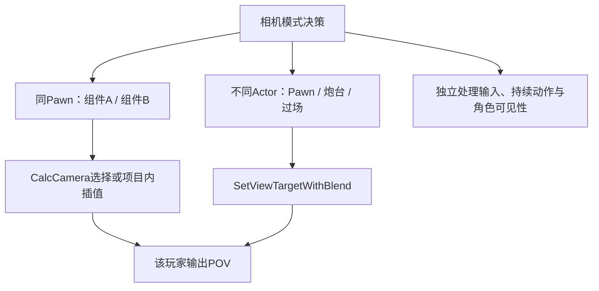
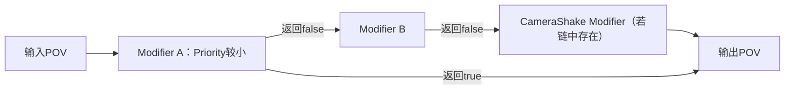
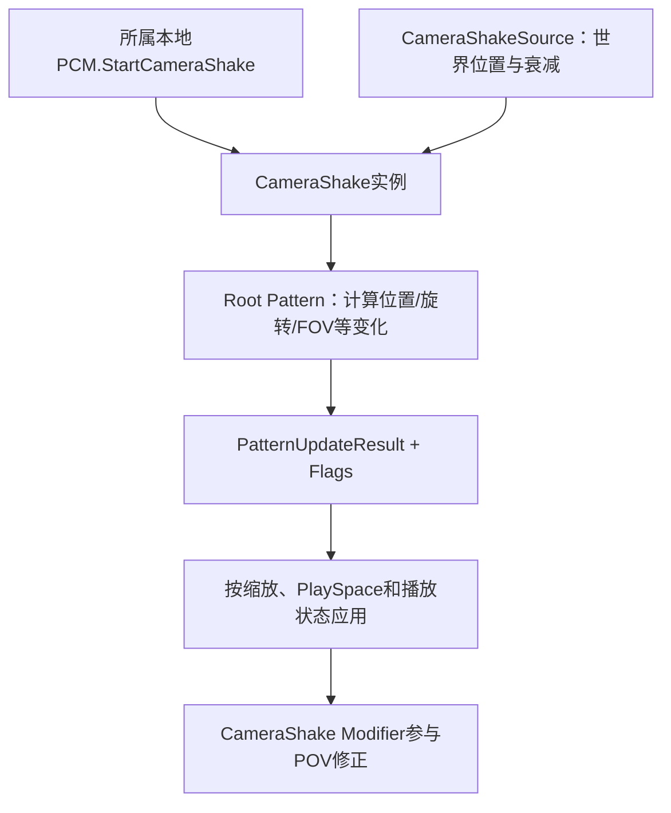
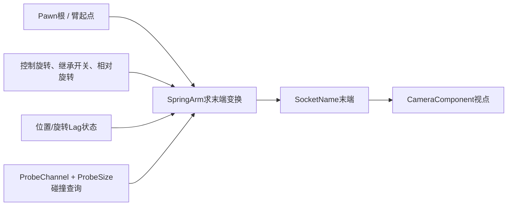
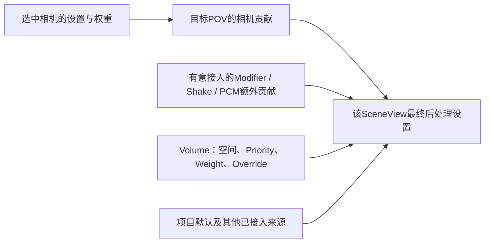

# 07 相机系统与视口

> 知识成熟度：L2。本文的主要承诺是解释传统 PlayerCameraManager 相机体系的公开合同、状态边界和可追踪的教学设计；依据本轮实际读取的 Epic 官方资料静态核对。C++ 均为未编译的教学节选，蓝图步骤未在编辑器操作，纸面情境不是运行结果。
> 本轮版本基准：2026-10-09 读取的 UE 5.5 版本选择页，具体位置见第八节。版本选择参数固定了本次阅读视图，不等于不可变源码 revision。本轮未读取引擎 `.cpp` 实现、安装目录或 `Build.version`，不认证本机 UE 5.8 / CL 55116800。
> 最后更新：2026-10-09。
> 历史说明：原稿曾声明 UE 5.8.0、CL 55116800、分支 `++UE5+Release-5.8`，并称 API 已对照源码。该声明是历史资料，不能成为本次源码或运行验证。原稿及可达历史版本有独立字节保全，位置和恢复范围见第九节。

## 一、从玩家意图到屏幕：相机究竟负责什么

同一个玩家可以控制角色、看向炮台镜头、打开背包，再返回角色。这里有四种不同的状态：**谁接收输入、谁被控制、谁提供视点、视点画在哪块屏幕上**。如果把四者都归结成“当前相机”，就会出现镜头切走了但角色仍在开火、分屏玩家二震到玩家一、相机组件已激活但画面没变等问题。

本文围绕一个本地玩家的普通游戏视图展开。读者应先了解 Actor/Component、Pawn/Controller 和基本向量变换。目标是能实现第三人称相机、明确切换第一人称/固定镜头、接入瞄准与受击反馈，并在换 Pawn、死亡、菜单和结束游戏时完整退出。SceneCapture、编辑器视口、XR 双目与 late update、实验性或项目自建相机栈都可能另有求值路径，不能直接套用本文的时序假设。

### 1.1 各对象的职责与拥有关系

| 对象 | 本篇使用的职责 | 不应推导出的结论 |
| --- | --- | --- |
| `APlayerController`（PC） | 控制 Pawn、维护 ControlRotation，关联 `PlayerCameraManager` | 每个 Pawn 各自拥有一个 PCM；远端客户端拥有所有玩家的 PC |
| `APlayerCameraManager`（PCM） | 为关联玩家计算/提供相机视图、管理 ViewTarget 与修正效果 | 它是游戏窗口，或每个 CameraComponent 各自有一个 PCM |
| `ULocalPlayer` | 本地玩家身份、主视口子区域、建立渲染视图的入口 | 网络连接或任意服务器 PC 都是 LocalPlayer |
| `UGameViewportClient` / `FViewport` | 游戏视口及渲染/输入接入；为本地玩家安排子区域 | 每个本地玩家必须独占一个系统窗口 |
| ViewTarget Actor | 被相机系统询问视点的目标，可为 Pawn、CameraActor 或自定义 Actor | 切换它会自动 Possess，或指定 Actor 等于指定该 Actor 的某个组件 |
| `UCameraComponent` | 输出视点及投影/后处理设置 | 创建、激活它就保证它成为该玩家本帧视图来源 |
| `USpringArmComponent` | 计算带跟随、探测和阻尼的末端变换 | 自己渲染画面，或保证视锥内所有几何都不穿模 |

PC 的 `PlayerCameraManagerClass` 是替换 PCM 子类的配置入口；GameMode 可以选择 PC 类，再由该 PC 类选择 PCM，不能在 GameMode 上为每个客户端直接处理本地镜头特效。PC 跨网络的存在范围与本地控制身份见 [APlayerController](https://dev.epicgames.com/documentation/en-us/unreal-engine/API/Runtime/Engine/GameFramework/APlayerController?application_version=5.5)。



图是职责和数据依赖图，箭头不是全部函数的调用先后。相机臂向组件提供变换，方向不是“相机求值后再去执行相机臂”。[ULocalPlayer](https://dev.epicgames.com/documentation/en-us/unreal-engine/API/Runtime/Engine/Engine/ULocalPlayer?application_version=5.5) 公开了 `ViewportClient`、`Origin`、`Size`、`CalcSceneView`；[UGameViewportClient](https://dev.epicgames.com/documentation/en-us/unreal-engine/API/Runtime/Engine/Engine/UGameViewportClient?application_version=5.5) 的 `LayoutPlayers` 在绘制前分配玩家子区域。这解释了两个本地玩家可以共用主视口却有不同镜头。

### 1.2 一次排查先回答四个问题

1. 当前处理的是哪个 World、哪个本地玩家、哪个 PC/PCM？不要用 `GetFirstPlayerController()` 代替所属玩家解析。
2. PC 正在控制哪个 Pawn，PCM 正在被哪个系统要求看谁？自动目标管理、Sequencer 和游戏模式逻辑都可能写入。
3. 目标如何生成 POV：默认组件查找、Actor 自己的 `CalcCamera`，还是 PCM 的蓝图/原生覆盖？
4. 最终 POV 配上哪个玩家矩形、宽高比和投影模式？UI 要的是屏幕像素还是 Widget 坐标？

这些身份比“组件有没有勾 Active”更接近问题根因。服务器存在一个 PC 并不意味着它具有可供玩家观看的本地视口；表现入口应明确检查本地玩家上下文。

## 二、核心概念与数据形状

| 概念 | 关键字段或入口 | 阅读重点 |
| --- | --- | --- |
| 相机基本视图 | `FMinimalViewInfo` | Location/Rotation、FOV、OrthoWidth、ProjectionMode、AspectRatio、后处理设置和权重 |
| 视图目标记录 | `FTViewTarget` | Actor 身份与该目标的 POV；目标不是相机组件指针 |
| 目标过渡 | `ViewTarget`、`PendingViewTarget`、`FViewTargetTransitionParams` | 当前记录、待接管记录与混合参数是不同状态 |
| 组件视图 | `UCameraComponent::GetCameraView` | 把组件状态转换为相机视图；不等于最终渲染矩阵 |
| 镜头修正 | `UCameraModifier::ModifyCamera` | 可以有状态，按优先级处理；返回值控制是否继续后续链 |
| 震动 | `UCameraShakeBase` + `UCameraShakePattern` | Shake 管实例与播放，Pattern 计算变化；传统 PCM 通过震动修正器接入 |
| 臂末端 | `USpringArmComponent::SocketName` / `GetSocketTransform` | 消费臂求得的末端；名义臂长不等于受障碍限制后的距离 |
| 视角限制 | PCM `ProcessViewRotation`、`ViewPitchMin/Max` 等 | 参与控制旋转处理，不是所有最终镜头的通用末端裁剪 |
| 视野基准与锁定 | PCM `DefaultFOV`、`SetFOV` / `UnlockFOV` | 默认基准、锁定与组件的 `SetFieldOfView` 是不同控制点；默认值不保证覆盖目标相机 |
| 调试样式与淡出 | `CameraStyle`、`StartCameraFade` | 样式分支和屏幕淡出有各自状态，不代替观战权限或目标生命周期 |



相机、SpringArm 的 include 分别为 `Camera/CameraComponent.h`、`GameFramework/SpringArmComponent.h`；PCM、Modifier、Shake 为 `Camera/PlayerCameraManager.h`、`Camera/CameraModifier.h`、`Camera/CameraShakeBase.h`；视图结构位于 `Camera/CameraTypes.h`。这些是官方 API 所列声明入口，本轮没有把路径存在或网页声明当成已读引擎实现。

## 三、机制：把求值、切换、修正和投影分开

### 3.1 控制旋转与相机求值是相关的两条路径

Look 输入最终可以写入 Controller 的 ControlRotation。PCM 的 `ProcessViewRotation` 为这一更新提供修正/限制入口；基类会使用 Pitch 等限制函数。随后 Pawn、SpringArm 或相机提供者可以消费这个方向，但镜头也可以固定朝向某个目标，与 ControlRotation 不同。[ProcessViewRotation](https://dev.epicgames.com/documentation/unreal-engine/API/Runtime/Engine/Camera/APlayerCameraManager/ProcessViewRotation?application_version=5.5)

每帧相机管理入口应从 PC 的 `UpdateCameraManager` 与 PCM 的 `UpdateCamera` 理解。PC API 对前者的说明是 Actor tick 后的相机管理更新；**`APlayerController::CalcCamera` 是提供一种视点的接口，不能画成它驱动 PCM 每帧更新**。Actor/PC 可以实现 `CalcCamera`，这与谁调度帧更新是两个问题。



此图故意不规定“全部目标先混合，再统一执行一次 Modifier，最后再独立执行 Shake”。公开 API 并未承诺这个全序；目标分支、覆盖、自定义 PCM 及网络相机更新都可能影响具体求值位置和次数。写有状态的修正器时，不能仅凭“每帧”两个字假定 `ModifyCamera` 一定恰好调用一次。第 4.4 节用一次记录的游戏时间计算效果进度，避免把调用次数误当时间流逝。

默认 Actor 相机行为可把视图交给其相机组件；有多个组件时应明确哪个提供视图，不能依赖偶然的组件遍历顺序。自定义 Actor `CalcCamera` 或 PCM `BlueprintUpdateCamera` 又可能绕开这个默认路径。后者返回 true 表示采用蓝图结果，false 表示放弃该覆盖；其常见输出是位置、旋转、FOV，不要把它等同于任意 `FMinimalViewInfo` 字段都已正确处理。[Camera 概述](https://dev.epicgames.com/documentation/en-us/unreal-engine/cameras-in-unreal-engine?application_version=5.5)

概述页还有较旧的类名/属性叙述，本篇仅取其“视点提供者”和蓝图覆盖含义；具体字段、拥有关系与视口对象以本轮 API 页为准。包括角度限制在内，若自定义镜头最终要求绝对 Pitch 范围，应在该镜头自己的输出合同里实现并验证，不能假设 ControlRotation 的限制会钳住任意后续偏移。

### 3.2 ViewTarget 混合：请求、过渡、完成不是同一时点

`SetViewTargetWithBlend` 是 **PlayerController** 的蓝图可调用入口；PCM 的 `SetViewTarget` 接收 Actor 与 `FViewTargetTransitionParams`。不要把 PC 的节点名当成 PCM 上同名 C++ 方法。[SetViewTargetWithBlend](https://dev.epicgames.com/documentation/unreal-engine/API/Runtime/Engine/GameFramework/APlayerController/SetViewTargetWithBlend?application_version=5.5)

| 参数 | 有效含义 | 使用注意 |
| --- | --- | --- |
| `BlendTime` | 过渡总时长；0 表示不混合 | 时长是相机更新过程的参数，不是外部计时器必能精确代理的完成时刻 |
| `BlendFunction` | 把线性时间进度映射成混合权重 | 示例明确传入，不依赖读者记住某版本构造默认 |
| `BlendExp` | 部分曲线使用的指数 | 并非所有曲线都消费它 |
| `bLockOutgoing` | 过渡中锁定传出目标的上一帧相机 POV | 不使 Actor 获得存活保证，也不构成允许立刻销毁旧目标的合同 |

参数与字段来源为 [FViewTargetTransitionParams](https://dev.epicgames.com/documentation/unreal-engine/API/Runtime/Engine/Camera/FViewTargetTransitionParams?application_version=5.5)。它没有给出“旧版一定存在 bLockIncoming”的证据，本文不再重复这项版本迁移断言。

`Linear` 适合清楚观察线性进度；`Cubic` 提供固定形状的缓动，不能靠 `BlendExp` 任意调整；`EaseIn`、`EaseOut`、`EaseInOut` 用于不同过渡曲线；`PreBlended` 表示项目已经完成混合，引擎不应再次混合。枚举名不能代替项目目标曲线的实际检查。[EViewTargetBlendFunction](https://dev.epicgames.com/documentation/unreal-engine/API/Runtime/Engine/Camera/EViewTargetBlendFunction?application_version=5.5)



**不能用 `GetViewTarget() == B` 当完成门闩。** [GetViewTarget](https://dev.epicgames.com/documentation/unreal-engine/API/Runtime/Engine/Camera/APlayerCameraManager/GetViewTarget?application_version=5.5) 页只说明返回当前目标，没有给出“混合期间一定返回旧目标，到结束才返回新目标”的时序合同；查询身份也不是画面混合比例。PCM 类页给出 `OnBlendComplete()` / `FOnBlendComplete`，说明其与 ViewTarget 接管 PendingViewTarget 有关，但本轮没读实现，不能承诺瞬切、被中断、同目标重复请求、每一种客户端更新分支都会按同一方式通知。

需要清理旧镜头时，可在项目适配层使用已确认覆盖该路径的完成通知；同时定义瞬切完成、替换、取消、目标销毁和 World 退出分支。通知回调必须核对**发起时记录的 PC/PCM、目标和请求身份**，过期通知只能退出自己的资源。不要等“旧目标的结束被观察事件”或延迟 1.2 秒就销毁目标来代替这个合同。`GetViewTargetPawn()` 只在查询目标为Pawn时给出Pawn，否则可为空；看向CameraActor时不能把这个空值当作玩家PC已经失效。

旧 Actor 如果必须在过渡完成前销毁，应先把需要的视点拷贝到本模式拥有、生命周期明确的相机提供者，再从该提供者过渡。`bLockOutgoing` 锁 POV 与“可安全删除关联 Actor、输入绑定和状态”并非同一保证。若新目标丢失，回到明确有效的当前 Pawn/保底相机，或结束该模式；不要拿失效原始指针继续重试。

### 3.3 同一 Pawn 的两个组件，不是两个 ViewTarget

设角色 P 上有 `ThirdPersonCamera` 与 `FirstPersonCamera`。在两者间切换 Active 只改变 P 内部可能使用的提供者。PCM 仍然看 P，对 P 再次调用 `SetViewTargetWithBlend(P, 1.0f, ...)` 并没有提供旧组件与新组件这两个独立 Actor 端点。因此不能承诺它会自动把两个组件混合一秒。

选择与需求对应的方案：

| 需求 | 方案 | 自己负责的边界 |
| --- | --- | --- |
| 第一/第三人称瞬切 | P 的 `CalcCamera` 明确选择组件，或严格管理单一激活组件 | 默认查找是否被覆盖、组件状态和可见性恢复 |
| 第一/第三人称平滑 | 同一提供者内维护模式过渡，计算输出 POV | 时间、起点快照、旋转插值、投影模式、后处理及中断 |
| 切到炮台/独立过场镜头 | 不同 Actor 间请求 ViewTarget 过渡 | 目标存活、完成接线、输入与自动相机管理冲突 |
| Sequencer 镜头 | 由序列相机轨与游戏相机拥有者交接 | 开始、自然结束、跳过、停止、恢复状态策略，不能只测正常播完 |



### 3.4 FOV、宽高比、正交与屏幕坐标

`UCameraComponent::FieldOfView` 和 `FMinimalViewInfo::FOV` 的 API 定义都是**透视模式的水平视野角，单位度**。不能把概述页里的 vertical FOV 文字直接覆盖这一字段合同。最终可见水平/垂直范围还受玩家子视口宽高比、轴约束、黑边及投影构造影响。[UCameraComponent](https://dev.epicgames.com/documentation/en-us/unreal-engine/API/Runtime/Engine/Camera/UCameraComponent?application_version=5.5)

`DesiredFOV` 指宽高比调整前原本期望的水平 FOV，**不是相机自动插值系统的“下一个目标值”**。瞄准必须用项目自己的 `TargetAimFOV`、时间或插值状态。PCM 的 `SetFOV` 会锁定 FOV，退出要与 `UnlockFOV` 配对；组件持续改值却仍被 PCM 锁定，是常见的“数值变了，画面不变”。[FMinimalViewInfo](https://dev.epicgames.com/documentation/en-us/unreal-engine/API/Runtime/Engine/Camera/FMinimalViewInfo?application_version=5.5)

在标准对称透视、无裁切/离轴/镜头畸变、水平 FOV 为 h、宽高比为 a = width/height 的限定下，可作纸面推导：

```text
tan(v / 2) = tan(h / 2) / a
h = 90°、a = 16/9 时，v 约 58.72°
保持 h = 90°、把 a 改成 4/3 时，v 约 73.74°
```

这是普通几何的 PAPER_EXPECTED，不是 UE 截图或运行测量。如果项目保持垂直 FOV、使用不同轴约束或受限矩形，不能同时继续假设水平 FOV 固定。数值比较前先写清保持哪一轴。

正交相机用 `OrthoWidth` 表示世界单位中的可见宽度；透视 FOV 不起相同作用。简单对称正交、宽高比 2 的纸例中，宽 1000 对应高 500；改变深度不会像透视那样改变屏幕尺寸，但裁剪面、深度排序和渲染特性仍有影响。`bConstrainAspectRatio` 可使目标区域与相机指定比例不一致时出现黑边；它不是“把物体都缩放到铺满窗口”。透视与正交是离散模式，不能把枚举和布尔字段统称为按同一权重数值插值；`BlendViewInfo` 文档还明确提到布尔字段采用 OR 行为。

**投影成功不等于物体可见。** [ProjectWorldLocationToScreen](https://dev.epicgames.com/documentation/unreal-engine/API/Runtime/Engine/GameFramework/APlayerController/ProjectWorldLocationToScreen?application_version=5.5) 返回是否投影成功；还需按所用坐标空间检查屏幕边界。它不替代遮挡查询，也不证明目标通过了游戏逻辑可见性判定。分屏时要明确 `bPlayerViewportRelative`，不能把玩家二的相对坐标直接放进覆盖整个窗口的 HUD。

[DeprojectScreenPositionToWorld](https://dev.epicgames.com/documentation/unreal-engine/API/Runtime/Engine/GameFramework/APlayerController/DeprojectScreenPositionToWorld?application_version=5.5) 给出世界位置与方向，仍需要射线/平面相交或深度才能选定世界点；它不会自动命中鼠标下面的 Actor。Widget 布局还存在 DPI/质量缩放与自身 Geometry，[UWidgetLayoutLibrary](https://dev.epicgames.com/documentation/unreal-engine/API/Runtime/UMG/Blueprint/UWidgetLayoutLibrary?application_version=5.5) 的 `ProjectWorldLocationToWidgetPosition` 是对应入口。不要对已经转换的 Widget 坐标再机械除一次 DPI，也不要把 Widget 局部坐标直接交给屏幕反投影。

### 3.5 CameraModifier：优先级、状态与退出

`UCameraModifier` 是附属于 PCM 的可有状态对象。数值小的 Priority 先处理（0最高、255最低，见 [5.5 CameraModifier属性说明](https://dev.epicgames.com/documentation/en-us/unreal-engine/python-api/class/CameraModifier?application_version=5.5)）；`ModifyCamera(float, FMinimalViewInfo&)` 返回 true 表示停止后续修正器处理，false 允许继续。**`bExclusive` 的合同是同一 Priority 不允许其他修正器，不是启用后自动跳过所有其他优先级。** 因而创建时的同优先级冲突与运行时返回 true 是两种不同控制。



图展示某次链调用，不承诺它恰好位于目标混合之后，也不承诺每个 PCM 都装有震动修正器。Priority 值、同值冲突和是否提前终止应在该 PCM 的配置中明确，不靠创建顺序充当优先级设计。

公开的 `AddNewCameraModifier` 负责创建并初始化修正器；`AddCameraModifierToList` 是 protected 的内部插入点，外部 PlayerController 不能照着旧例直接调用。保存添加结果，处理失败；退出时通过原 PCM 的 `RemoveCameraModifier` 移除自己拥有的实例。`DisableModifier` 可用于禁用/淡出，但不等于移除实例或清理模式资源。[AddNewCameraModifier](https://dev.epicgames.com/documentation/unreal-engine/API/Runtime/Engine/Camera/APlayerCameraManager/AddNewCameraModifier?application_version=5.5)

蓝图的 `BlueprintModifyCamera` 仍是 View Location / View Rotation / FOV 与相应 New 输出；不要称为“UE5.8 才新加 FMinimalViewInfo 签名”。本次 UE5.5 API 页已同时列出公开结构体入口和 protected 分量入口。`BlueprintModifyPostProcess` / protected `ModifyPostProcess` 用于后处理修正；`ProcessViewRotation` 则介入旋转更新。直接覆盖公开的 `ModifyCamera` 并不意味着基类的 Alpha 更新、蓝图调用和后处理流程仍会自动执行；必须明确选择调用基类还是由子类接管。[UCameraModifier](https://dev.epicgames.com/documentation/en-us/unreal-engine/API/Runtime/Engine/Camera/UCameraModifier?application_version=5.5)

### 3.6 CameraShake：Pattern 输出由播放体系消费

传统 PCM 通过 [UCameraModifier_CameraShake](https://dev.epicgames.com/documentation/en-us/unreal-engine/API/Runtime/Engine/Camera/UCameraModifier_CameraShake?application_version=5.5) 把震动接入 Modifier 链。它不是所有 Modifier 执行完以后再无条件追加的第二套独立管线。上游提前终止、没有装入震动修正器、播放对象找错玩家，都可能让震动不出现。



Shake 对象与 Pattern 分工见 [UCameraShakeBase](https://dev.epicgames.com/documentation/en-us/unreal-engine/API/Runtime/Engine/Camera/UCameraShakeBase?application_version=5.5)。Perlin 噪声、波形振荡、序列/复合方式可以满足不同需求；Pattern 是 Shake 持有的对象，不应把所有 Pattern 都说成独立的“Camera Shake Pattern 资产”。本文不宣称组合架构从 UE5.1 才开始，也不在没有对应版本弃用声明时一概宣布所有 Legacy 类已弃用。

| 选择 | 含义与退出责任 |
| --- | --- |
| `StartCameraShake` | 指定该 PCM 的播放实例；保存返回值，用同一 PCM 停止自己启动的实例 |
| `StartCameraShakeFromSource` | 让世界震动源参与位置/衰减语义；衰减小不代表系统必定零开销 |
| `CameraLocal / World / UserDefined` | 指定偏移解释的空间；UserDefined 需明确传入旋转 |
| `bSingleInstance` | 同类播放是否限制为单实例；重触发策略影响实例复用，不能假设每次都是全新状态 |
| `StopCameraShake` | 停止指定实例；停止后不再把旧句柄当自己仍拥有的有效播放 |
| StopAll / 按类 / 按Source停止 | 范围更大；仅当本系统拥有对应集合时使用，不能清掉其他模式的震动 |

Pattern 输出中的字段叫 `Location`、`Rotation`、`FOV`，并有后处理字段与 Flags；没有原例所写的 `LocationOffset` / `RotationOffset`。默认相对结果与 `ApplyAsAbsolute` 有不同含义，若自行应用总 Scale 或 PlaySpace，再让基类自动应用可能造成重复缩放/旋转。[FCameraShakePatternUpdateResult](https://dev.epicgames.com/documentation/unreal-engine/API/Runtime/Engine/Camera/FCameraShakePatternUpdateResult?application_version=5.5)

更新参数分别提供 `ShakeScale` 和当前求值的 `DynamicScale`，并有 `GetTotalScale()`；普通相对偏移的强度还与Pattern振幅、播放包络及源衰减共同有关。排查时要分清这些因子，不能把静态Scale=1当成“最终幅度等于资产数字”的保证。[FCameraShakePatternUpdateParams](https://dev.epicgames.com/documentation/en-us/unreal-engine/API/Runtime/Engine/Camera/FCameraShakePatternUpdateParams?application_version=5.5)

`FCameraShakeDuration::Custom(DurationHint)` 的参数是预计时长提示，不能当作“到了 Duration 自动结束”的硬截止；Fixed、Infinite 与 Custom 需要分别定义完成方式。基类 Pattern 的开始、更新、停止、销毁/回收和完成查询都有各自入口；自定义 Pattern 必须把它们接起来，不能只在 Update 中 `return`，留下永不结束的实例。[FCameraShakeDuration](https://dev.epicgames.com/documentation/unreal-engine/API/Runtime/Engine/Camera/FCameraShakeDuration?application_version=5.5)、[UCameraShakePattern](https://dev.epicgames.com/documentation/en-us/unreal-engine/API/Runtime/Engine/Camera/UCameraShakePattern?application_version=5.5)

### 3.7 SpringArm：跟随、球形探测与阻尼的适用范围

第三人称常把相机挂在臂的末端 Socket：根/角色位置确定起点，目标旋转确定方向，名义臂长和偏移给出理想末端，碰撞与 Lag 影响输出。以下图是功能关系，不声称重现本轮未读取的完整实现步骤。



- `TargetArmLength` 是期望距离，不应从它直接判断相机当前实际距离。`bDoCollisionTest` 使用 `ProbeChannel` 与球形 `ProbeSize`；默认 Camera 通道仍需要场景物体正确响应。
- 肩偏移优先考虑 `SocketOffset`；API 特别提示它比在挂载相机上另加相对偏移更能与探测保持一致。`TargetOffset` 改变臂起点附近的偏移，二者并非同一位置。
- `bUsePawnControlRotation` 让臂尽可能消费 Pawn 的视图/控制方向；关闭时回到自身相对旋转。`bInheritPitch/Yaw/Roll` 还与绝对旋转设置有关，不能脱离层级解释。
- 相机自身也有 `bUsePawnControlRotation`。常规第三人称选择“臂开、相机关”，是为了由臂统一决定方向和旋转 Lag；两处都开可能覆盖期望的末端朝向/阻尼，但不能一概解释为两个角度相加、必定转两倍。
- 位置/旋转 Lag 是两个独立阻尼。更高的正速度通常意味着更快追随；上限距离影响允许落后多少。不能见抖动就一律增大 `CameraLagMaxDistance` 或归因于 CharacterMovement 迭代数。
- `bUseCameraLagSubstepping` 针对相机阻尼分步；它不是开启角色物理子步的同义词。输入、角色运动、网络平滑、Socket 动画、臂和自定义相机若重复平滑，需分层隔离原因。

字段来源见 [USpringArmComponent](https://dev.epicgames.com/documentation/en-us/unreal-engine/API/Runtime/Engine/GameFramework/USpringArmComponent?application_version=5.5)。球形探测帮助避免末端进入障碍，不保证近裁剪平面的角、宽 FOV 画面、快速穿越、外加镜头偏移或特殊碰撞几何都不穿模。把 ProbeSize 调小会减少相机被拉近的机会，也可能降低几何保护范围；它不是通用修复按钮。

### 3.8 相机后处理是多个来源之一

相机的 PostProcessSettings 通常随组件输出进入 POV；这不是“同一个组件一份、ViewTarget.POV 再一份”两个独立效果。整个关卡的所有 CameraComponent 也不会仅因存在就自动一起混入该玩家画面。另有 Post Process Volume、项目默认、PCM 自定义缓存及其他有意接入的来源。



图不把混合解释成简单颜色相加，也不规定一张适用于所有版本的总顺序表。`AddCachedPPBlend` 与 `VTBlendOrder_Base/Override` 确实出现在本轮 PCM API，但枚举页没有提供它们相对 Volume、各类扩展的全部实现顺序；只凭名字不能承诺“Override 永远最终获胜”。

设置至少分三层检查：该来源是否参与、该参数的 `bOverride_...` 是否开启、该来源的 BlendWeight 是否有效。`FPostProcessSettings::ColorGain` 是 `FVector4`；给它写值却不启用 `bOverride_ColorGain`，可能根本没有参与该参数覆盖。权重 1 表示这个来源的充分贡献，不能保证无论其他来源如何配置都完全接管最终画面。[FPostProcessSettings](https://dev.epicgames.com/documentation/unreal-engine/API/Runtime/Engine/Engine/FPostProcessSettings?application_version=5.5)

重叠 Volume 还涉及空间范围、BlendRadius、Priority；相同 Priority 的重叠顺序未定义。先明确各层的参数所有者，再实现死亡黑白、受击色调或安全区滤镜，不能用一个 CameraModifier 声称绕开所有 Volume 和渲染后处理规则。[Post Process Effects](https://dev.epicgames.com/documentation/en-us/unreal-engine/post-process-effects-in-unreal-engine?application_version=5.5)

`AddOrUpdateBlendable` 接收实现 `IBlendableInterface` 的对象并更新其权重，后期材质是常见用途。用相机自己的可追踪对象注册，在退出时移除该 Blendable 或按协议恢复权重；不要对共享设置做全量清空。本篇链接后处理主篇供效果原理与材质阅读，本篇结论的来源是上面的官方页，不以另一篇尚在整改的候选代替当前 main 证据。

## 四、实现教学：最小代码与完整接线责任

本节代码是**按已读公开声明编写的教学节选，未经过 UHT、C++ 编译、蓝图编译或 PIE**。模块内的 `.generated.h`、类声明和 `.cpp` 的对应关系仍需按项目文件组织；Engine/Core/CoreUObject 是基础依赖，实际输入使用 EnhancedInput，Widget 投影使用 UMG。下文没有把这些说明视为已经搭好或运行过一个工程。

### 4.1 第三人称组件与明确的第一/第三人称选择

角色根使用胶囊体；第三人称由相机臂消费控制旋转，第一人称直接由相机消费。第一人称示例附着稳定的角色根并抬高视点，不把头骨动画抖动自动当作期望镜头运动。生产角色若挂到头部 Socket，应另外决定动画带来的旋转/位移是否进入视点。

```cpp
// CameraModeCharacter.h：放在项目模块内，省略项目专用导出宏
#pragma once
#include "CoreMinimal.h"
#include "GameFramework/Character.h"
#include "CameraModeCharacter.generated.h"

class UCameraComponent;
class USpringArmComponent;

UCLASS()
class ACameraModeCharacter : public ACharacter
{
    GENERATED_BODY()
public:
    ACameraModeCharacter();
    virtual void CalcCamera(float DeltaTime, FMinimalViewInfo& OutView) override;
    void SetFirstPerson(bool bEnabled);

    UPROPERTY(VisibleAnywhere, BlueprintReadOnly, Category="Camera")
    TObjectPtr<USpringArmComponent> CameraBoom;
    UPROPERTY(VisibleAnywhere, BlueprintReadOnly, Category="Camera")
    TObjectPtr<UCameraComponent> ThirdPersonCamera;
    UPROPERTY(VisibleAnywhere, BlueprintReadOnly, Category="Camera")
    TObjectPtr<UCameraComponent> FirstPersonCamera;

private:
    bool bFirstPerson = false;
};
```

```cpp
// CameraModeCharacter.cpp
#include "CameraModeCharacter.h"
#include "Camera/CameraComponent.h"
#include "Camera/CameraTypes.h"
#include "GameFramework/SpringArmComponent.h"
#include "GameFramework/CharacterMovementComponent.h"

ACameraModeCharacter::ACameraModeCharacter()
{
    bUseControllerRotationPitch = false;
    bUseControllerRotationYaw = false;
    bUseControllerRotationRoll = false;
    GetCharacterMovement()->bOrientRotationToMovement = true;

    CameraBoom = CreateDefaultSubobject<USpringArmComponent>(TEXT("CameraBoom"));
    CameraBoom->SetupAttachment(GetRootComponent());
    CameraBoom->TargetArmLength = 400.f;
    CameraBoom->bUsePawnControlRotation = true;
    CameraBoom->bDoCollisionTest = true;
    CameraBoom->ProbeChannel = ECC_Camera;
    CameraBoom->ProbeSize = 12.f;
    CameraBoom->bEnableCameraLag = true;
    CameraBoom->CameraLagSpeed = 8.f;
    CameraBoom->bEnableCameraRotationLag = true;
    CameraBoom->CameraRotationLagSpeed = 12.f;

    ThirdPersonCamera = CreateDefaultSubobject<UCameraComponent>(TEXT("ThirdPersonCamera"));
    ThirdPersonCamera->SetupAttachment(CameraBoom, USpringArmComponent::SocketName);
    ThirdPersonCamera->bUsePawnControlRotation = false;
    ThirdPersonCamera->FieldOfView = 90.f;

    FirstPersonCamera = CreateDefaultSubobject<UCameraComponent>(TEXT("FirstPersonCamera"));
    FirstPersonCamera->SetupAttachment(GetRootComponent());
    FirstPersonCamera->SetRelativeLocation(FVector(0.f, 0.f, 64.f));
    FirstPersonCamera->bUsePawnControlRotation = true;
    FirstPersonCamera->FieldOfView = 90.f;
    FirstPersonCamera->SetAutoActivate(false);
}

void ACameraModeCharacter::SetFirstPerson(bool bEnabled)
{
    bFirstPerson = bEnabled;
    ThirdPersonCamera->SetActive(!bEnabled);
    FirstPersonCamera->SetActive(bEnabled);
}

void ACameraModeCharacter::CalcCamera(float DeltaTime, FMinimalViewInfo& OutView)
{
    UCameraComponent* Chosen = bFirstPerson ? FirstPersonCamera.Get()
                                          : ThirdPersonCamera.Get();
    if (IsValid(Chosen))
    {
        Chosen->GetCameraView(DeltaTime, OutView);
        return;
    }
    Super::CalcCamera(DeltaTime, OutView);
}
```

这里主动覆写 `CalcCamera` 以使组件选择明确，`SetActive` 同步组件状态但不被当成唯一选择依据。调用前提是这个角色被该玩家当前相机路径询问；若 PCM 蓝图已接管视点，改角色组件仍可能不影响最终画面。400、12、8、12、64 和 90 都是示例常量，不能当作碰撞、人体尺度或镜头舒适性的通用配置。

此例只做视点瞬切，没有声称自动解决第一人称身体朝向、武器可见性、联网角色姿态或平滑过渡。模型朝向策略由 `bUseControllerRotationYaw`、Movement 的 `bOrientRotationToMovement` 等共同决定；角色 Actor 转向还可能影响附着层级，不能说它“只影响 Mesh 且绝不影响相机”。

需要平滑时，仍由这个角色或另一个项目相机提供者保持自己的过渡状态。一个有限设计是：模式请求时保存当前输出位置/旋转/FOV作为起点，目标组件每次求值提供终点；在项目选定的游戏时间上求 0..1 进度，位置/FOV插值、旋转以明确的 Quaternion 插值策略处理。ProjectionMode、宽高比约束、后处理开关等逐字段决定策略，不对所有字段做无脑 `Lerp`。中途反向切换以当时输出为新起点，不能突然回到第一次的起点；若两端处在墙两侧，还需处理插值路径的碰撞，两个端点安全不保证中间路径安全。

### 4.2 切到炮台/固定镜头与返回：请求函数和状态机

```cpp
#include "GameFramework/PlayerController.h"
#include "GameFramework/Pawn.h"
#include "Camera/PlayerCameraManager.h"

// 项目辅助函数；true只说明完成了前置检查并发出请求。
// 调用方须已经获得本模式的相机写入权，且负责目标的生命周期。
static bool RequestLocalCamera(
    APlayerController* PC, AActor* Target, float BlendSeconds)
{
    if (!IsValid(PC) || !PC->IsLocalController() || !PC->GetLocalPlayer()
        || !IsValid(PC->PlayerCameraManager) || !IsValid(Target)
        || Target->GetWorld() != PC->GetWorld()
        || !FMath::IsFinite(BlendSeconds) || BlendSeconds < 0.f)
    {
        return false;
    }
    PC->SetViewTargetWithBlend(Target, BlendSeconds, VTBlend_Cubic, 1.f, false);
    return true;
}

static bool RequestReturnToCurrentPawn(APlayerController* PC)
{
    APawn* CurrentPawn = IsValid(PC) ? PC->GetPawn() : nullptr;
    return RequestLocalCamera(PC, CurrentPawn, 0.f);
}
```

切出可用 `RequestLocalCamera(PC, TurretCameraActor, 1.2f)`；返回重新读取当前 Pawn，而不是假定切出时的 Pawn 仍有效。返回失败就保留可用的固定镜头或转入明确的保底提供者，并报告模式无法恢复，不能先删除当前相机再发现无处可看。

蓝图对应流程为：传入所属 PC → Is Local Controller、对象有效性检查 → `Set View Target With Blend`，New View Target 是 Actor，BlendTime/BlendFunction 显式填写。返回时从同一个 PC 的 `Get Pawn` 取当前对象。节点立即执行完不等于混合完成，也不改变 Possess。

完整模式拥有者还需执行以下接线，缺一项就不能称作“完成了相机模式切换”：

| 阶段 | 本文项目层策略 | 失败或中断时如何收尾 |
| --- | --- | --- |
| 进入前 | 校验 PC/PCM/目标、记录模式身份和原输入/相机策略；与自动管理/Sequencer协商单一写者 | 未拿到控制权就不发请求，不在 Tick 里反复抢镜头 |
| 请求前 | 记录本次请求的身份；安装覆盖目标路径的完成/取消处理，再发起请求 | 发起失败移除本次监听，恢复自己改过的状态 |
| 过渡中 | 按设计保留旧/新提供者；明确输入立即切换、暂时屏蔽还是等完成 | 第二次请求先让第一次失效；旧回调不得恢复新模式的输入 |
| 完成 | 确认匹配当前请求和 PCM，释放不再使用的旧模式资源 | 瞬切单独按项目入口完成，不强等只覆盖 Pending 接管的通知 |
| 退出/目标丢失 | 先选有效返回目标，再清本人 Shake/Modifier、绑定、监听、持续动作与可见性更改 | 没有目标就执行保底/终止分支；World 结束不再生成新目标 |

`bAutoManageActiveCameraTarget` 允许 PC 自动管理目标，常与 Possess 等流程有关。若项目为某段模式暂时关闭它，应记录旧值并由一个拥有者恢复；这不是保证之后没人再写镜头。死亡、观战、载具等真正改变控制对象的行为仍由玩法和网络权威流程执行，不能用本地相机切换替代。[APlayerController 的相关字段与入口](https://dev.epicgames.com/documentation/en-us/unreal-engine/API/Runtime/Engine/GameFramework/APlayerController?application_version=5.5)

### 4.3 Look、模式键、瞄准与菜单：输入必须有退出路径

相机模式状态与输入映射状态分开保存，但由同一模式决策协调。最低资产合同可为：`IA_LookMouse` 与 `IA_LookStick` 是 Axis2D，`IA_ToggleView` 是一次切换的 Bool 动作，`IA_Aim` 是有明确按住语义的 Bool 动作；各自映射、Modifier 和 Trigger 在项目中显式选择。

鼠标位移与摇杆方向常有不同量纲。假设映射后 Mouse 值就是本次输入累计位移，Stick 值是归一化方向，则可以分别采用：

```cpp
// ACameraModeCharacter的方法节选；输入已限定到当前本地控制会话。
// MouseSensitivity的单位由项目映射约定；不再次按秒积分位移。
void ACameraModeCharacter::LookMouse(FVector2D Delta, float MouseSensitivity)
{
    AddControllerYawInput(Delta.X * MouseSensitivity);
    AddControllerPitchInput(Delta.Y * MouseSensitivity);
}

// 摇杆被解释为角速度需求，Rate单位为度/秒。
void ACameraModeCharacter::LookStick(FVector2D Axis, float Rate, float DeltaSeconds)
{
    AddControllerYawInput(Axis.X * Rate * DeltaSeconds);
    AddControllerPitchInput(Axis.Y * Rate * DeltaSeconds);
}
```

这两个新增方法需在类声明中添加对应声明；示例没有安装绑定。它们展示的是两种输入合同，不保证任意平台默认鼠标数据都已满足该合同。若 Input Modifier、旧输入缩放或上游逻辑已做灵敏度/时间处理，应避免再乘一次。正负 Pitch 方向也应由映射策略统一，而不是 UI、Pawn 和相机臂各自反转。

按以下顺序建立一个可退出的本地输入会话：

1. 在本地玩家、Pawn 与 EnhancedInputComponent 已就绪的项目入口，记录该 PC、LocalPlayer、输入组件和会话身份。Pawn 换绑或 Restart 时先退出旧会话，避免重复添加。
2. 只向所属 `UEnhancedInputLocalPlayerSubsystem` 添加本人拥有的相机模式 Context；共享 Context 由集中拥有者管理，不能由本 Pawn 随意移除。
3. 绑定 Look 读取 Axis2D 并调用上面方法；切换键使用与所选 Trigger 匹配的一次性成功事件，避免用持续 Triggered 每帧 Toggle；瞄准开始/结束按具体 Action 合同处理。
4. 保存本次创建的绑定身份与监听句柄。回调先验证仍属于安装时的会话、Pawn和本地玩家；旧会话不能只读取新的“当前ID”来假装有效。
5. `Completed` 与 `Canceled` 都可能参与瞄准/蓄力结束，但 Context 移除、失焦、换 Pawn、进入菜单和 EndPlay 都必须主动做幂等结束。不能等一个输入结束事件必定补发。
6. 退出先关闭接收并令旧身份失效，清除瞄准/持续 Look 状态，再用原输入组件移除自己的绑定、原 subsystem 移除自己拥有的 Context，解绑自己的监听。重入时先完成旧退出，再按新的就绪事件安装，不清空其他系统的 Context/绑定。

事件与 Context 的公开含义见 [Enhanced Input](https://dev.epicgames.com/documentation/en-us/unreal-engine/enhanced-input-in-unreal-engine?application_version=5.5)。具体 `RemoveBindingByHandle` 的安装/移除示例放在已合入的 [Enhanced Input 主篇](./02-EnhancedInput增强输入.md)；本轮该方法的固定版本独立页面访问失败，未将失败页当作新增核对证据。

打开菜单还需要项目明确选择 UIOnly / GameAndUI 等输入模式、鼠标显示、焦点与捕获策略；退出恢复自己负责的原策略。`bEnableClickEvents` 管点击事件，不是全局视角旋转开关；UI 模式下是否还能收到 Look，取决于输入路由和动作消费，不保证“一进入UI就全部冻结”。多个弹窗或过场同时限制输入时应采用集中拥有或成对获取/释放，避免一个菜单关闭就撤掉另一个模式仍需的限制。

### 4.4 有状态的死亡镜头：计算累计效果，不累计改相机组件

原例每次从新计算的基础 POV 减 `FallSpeed * DeltaTime`，这通常只产生一帧量级的小偏移；它没有保存累计下降量。若改为每次调用 `Elapsed += DeltaTime`，又会把回调次数当作时钟，在重复求值路径下可能加速。以下节选采用游戏时间起点，直接计算本次效果值，并限制最大下沉和翻滚。

```cpp
// DeathCameraModifier.h
#pragma once
#include "CoreMinimal.h"
#include "Camera/CameraModifier.h"
#include "DeathCameraModifier.generated.h"

UCLASS()
class UDeathCameraModifier : public UCameraModifier
{
    GENERATED_BODY()
public:
    UDeathCameraModifier();
    void StartFall();
    void StopFall();
    virtual bool ModifyCamera(float DeltaTime, FMinimalViewInfo& InOutPOV) override;
private:
    bool bRunning = false;
    double StartedAt = 0.0;
};
```

```cpp
// DeathCameraModifier.cpp
#include "DeathCameraModifier.h"
#include "Camera/CameraTypes.h"
#include "Engine/World.h"

UDeathCameraModifier::UDeathCameraModifier()
{
    Priority = 10;
    bExclusive = false;
}

void UDeathCameraModifier::StartFall()
{
    UWorld* World = GetWorld();
    if (!World) { return; }
    StartedAt = World->GetTimeSeconds();
    bRunning = true;
    EnableModifier();
}

void UDeathCameraModifier::StopFall()
{
    bRunning = false;
    DisableModifier(true);
}

bool UDeathCameraModifier::ModifyCamera(float DeltaTime, FMinimalViewInfo& InOutPOV)
{
    UWorld* World = GetWorld();
    if (!bRunning || !World) { return false; }
    const double Age = FMath::Max(0.0, double(World->GetTimeSeconds()) - StartedAt);
    const float DropCm = float(FMath::Min(120.0, 60.0 * Age));
    const float RollDegrees = float(FMath::Min(45.0, 20.0 * Age));
    InOutPOV.Location.Z -= DropCm;
    InOutPOV.Rotation.Roll += RollDegrees;
    return false;
}
```

这是**立即启停、由子类完全接管公开 ModifyCamera 的有限示例**：不调用 Super，不声称基类 Alpha 淡入淡出、蓝图修正或后处理回调仍然执行；需要这些能力时改用明确保留基类流程的扩展方式，或在本例自己的输出中增加有定义的包络。时间采用受暂停、时间膨胀及钳制影响的 [World游戏时间](https://dev.epicgames.com/documentation/unreal-engine/API/Runtime/Engine/Engine/UWorld/GetTimeSeconds?application_version=5.5)；换 World、重生和退出时重置/移除。这里也没有用镜头位移替代死亡 Pawn 的碰撞或布娃娃仿真。

挂载应由所属本地 PC 的模式拥有者调用公共接口：

```cpp
// 节选：ModePCM与DeathModifier应为模式拥有者保存的弱引用/受管理引用。
UDeathCameraModifier* Created = Cast<UDeathCameraModifier>(
    PC->PlayerCameraManager->AddNewCameraModifier(UDeathCameraModifier::StaticClass()));
if (Created)
{
    // 先记录创建时的PCM和Created，再开始；失败则模式不依赖此效果。
    Created->StartFall();
}

// 退出时，先取出并清空本模式保存的记录，再操作旧对象：
// if (SavedModifier有效) SavedModifier->StopFall();
// if (SavedPCM与SavedModifier均有效) SavedPCM->RemoveCameraModifier(SavedModifier);
```

调用前沿用 4.2 的本地 PC/PCM 检查。重新进入不得无条件再加一个；Pawn 换绑、死亡模式结束、返回观战/游戏以及 EndPlay 都走同一退出。此例面向本地玩家的死亡镜头状态，若效果只允许作用于某个特定目标，还需由模式层在目标改变前停掉它。

**PAPER_EXPECTED：**基础 POV 的 Z 每次都是 200，起点时间为 10.0，分别在 10.5 与 11.0 求值，则下沉为 30 与 60，输出 Z 为 170 与 140；同一时间 11.0 对两个独立基础 POV 各求一次，下沉仍各为60，不会因为第二次回调变成120。停止后再用未修改的基础 POV 求值，输出恢复基础值。这个推导不保证同一可变 POV 被项目错误地重复传入也不会重复相加，调用方仍需提供一次求值的正确输入。

### 4.5 受击震动：先用资产，再把自定义数学与生命周期接起来

蓝图的常用流程是创建 CameraShakeBase 蓝图子类，选择其 Root Shake Pattern，在可用的波形/噪声 Pattern 中配置位移、旋转、频率、时长与进出包络。由所属玩家的 PCM `Start Camera Shake` 播放，保存返回实例，退出用对应 `Stop Camera Shake`。资产编辑器具体分类和插件位置以项目版本为准；本轮没有打开编辑器确认菜单名称，不能把资产配置步骤称为已实测。

```cpp
// PC由受击对象所属的本地玩家上下文显式传入，ShakeClass是已配置的资产类。
#include "GameFramework/PlayerController.h"
#include "Camera/PlayerCameraManager.h"
#include "Camera/CameraShakeBase.h"

static UCameraShakeBase* PlayLocalHitShake(
    APlayerController* PC, TSubclassOf<UCameraShakeBase> ShakeClass)
{
    if (!IsValid(PC) || !PC->IsLocalController() || !PC->GetLocalPlayer()
        || !IsValid(PC->PlayerCameraManager) || !ShakeClass)
    {
        return nullptr;
    }
    return PC->PlayerCameraManager->StartCameraShake(
        ShakeClass, 1.f, ECameraShakePlaySpace::CameraLocal, FRotator::ZeroRotator);
}
```

保存播放时的 PCM 和实例，不在退出时重新找“第一个玩家”去停止。若资产设置同类单实例且多个系统共享同一播放，应先定义共享所有权；一个系统离开不能误停另一个仍需要的效果。网络侧同步受击这一业务事实或适当表现信号，本地玩家决定震动强度和可访问性设置；`BlueprintCosmetic` 等标签不等于自动把任意服务端调用路由给正确客户端。

保留自定义 Pattern 的学习用途时，应先把“按时间采样偏移”写成清楚的数学函数，再接入 Pattern 生命周期，而不是把每帧 FRand 当作有稳定频谱的噪声。以下是**独立 C++ 计算节选，不是完整的 UCameraShakePattern 子类**：

```cpp
#include "Camera/CameraShakeBase.h"

static FCameraShakePatternUpdateResult SampleHitOffset(
    float TimeSeconds, float Duration, float AmplitudeCm, float FrequencyHz)
{
    FCameraShakePatternUpdateResult Result;
    if (!FMath::IsFinite(TimeSeconds) || !FMath::IsFinite(Duration)
        || !FMath::IsFinite(AmplitudeCm) || !FMath::IsFinite(FrequencyHz)
        || Duration <= 0.f || Duration > 10.f
        || TimeSeconds < 0.f || TimeSeconds >= Duration
        || AmplitudeCm < 0.f || AmplitudeCm > 100.f
        || FrequencyHz < 0.f || FrequencyHz > 60.f)
    {
        return Result;
    }
    const float U = TimeSeconds / Duration;
    const float Envelope = FMath::Sin(PI * U); // 起止位置偏移为0
    const float Phase = 2.f * PI * FrequencyHz * TimeSeconds;
    Result.Location = FVector(0.f, AmplitudeCm * Envelope * FMath::Sin(Phase), 0.f);
    Result.Rotation = FRotator(0.f, 0.f, 0.1f * Envelope * FMath::Sin(Phase));
    return Result; // 默认相对结果；不在这里再次应用Scale或PlaySpace
}
```

频率这里明确为 Hz，因此相位乘 `2π`；旋转振幅 0.1 是另一个以度计的示例量，不把厘米直接当角度。10秒、100厘米和60Hz是这个计算例的输入上界，用来保持有限采样域，不是推荐的镜头舒适性范围或引擎硬限制。这个简单包络只有位置在端点归零的设计目标，不宣称速度/加速度连续，也不用于保证镜头舒适性或频谱质量。

把它接到真实自定义 Pattern 时，项目实现至少要满足：

| 生命周期 | 必须提供的状态/输出 | 反例 |
| --- | --- | --- |
| 信息查询 | 真实的 Fixed/Infinite/Custom 时长类型及包络合同 | `Custom(0.4)` 只给提示却期望基类按0.4秒自动判完 |
| 开始/重启 | 把采样时间、结束状态、随机源或相位重置到本次播放的定义；明确重触发是否重启 | 池中旧对象第二次播放沿用上次 Elapsed |
| 更新 | 从本次时间采样结果；输出字段和 Flags 匹配相对/绝对语义；只让一个层处理 Scale/PlaySpace | 使用不存在的 LocationOffset，或Scale乘两遍 |
| 完成查询 | 到期或取消后可以确实报告完成 | Update 里直接return而IsFinished始终false |
| 停止 | 区分立即停止和自己的淡出；完成标志与状态一致 | 只停外部Timer，Shake仍挂在PCM |
| 销毁/回收 | 释放本人外部引用/监听，后续重用不带旧状态 | 对已结束或回收实例继续写参数 |
| Scrub（若支持序列） | 用绝对时间重建采样，不能假装所有调用都是向前DeltaTime | 倒拖时间轴却继续累计Elapsed |

`StartShakePatternImpl`、`UpdateShakePatternImpl` 等具体 protected 覆写签名须在目标版本头文件中复核；本轮读到的 Pattern 公共 API 未完整展示这些实现扩展点，因此这里交付完整的**接线合同和计算例**，不伪装成可直接编译的完整 Pattern 类。Shake 通过 `SetRootShakePattern` / `GetRootShakePattern` 管理 Pattern；构造期子对象、运行时 NewObject 及重建行为也应按实际类生命周期选择，不把任意地方 NewObject 都当作等价构造方案。

### 4.6 瞄准 FOV 与受击滤镜：参数必须有拥有者和恢复

瞄准用项目独立状态，例如 `bAiming`、`NormalFOV`、`AimFOV` 和 `CurrentFOV`。进入瞄准改目标，Tick 或选定更新入口按一次确定的 `DeltaSeconds` 更新当前值，再写入**实际被选中的相机提供者**。以下是更新函数节选：

```cpp
static void UpdateAimFOV(
    UCameraComponent* Camera, bool bAiming, float NormalFOV,
    float AimFOV, float DegreesPerSecond, float DeltaSeconds)
{
    if (!IsValid(Camera) || !FMath::IsFinite(DeltaSeconds) || DeltaSeconds < 0.f
        || !FMath::IsFinite(DegreesPerSecond) || DegreesPerSecond <= 0.f)
    {
        return;
    }
    // 前置：NormalFOV/AimFOV为项目批准的有限透视角度，且没有另一写者争用。
    const float TargetFOV = bAiming ? AimFOV : NormalFOV;
    Camera->SetFieldOfView(FMath::FInterpConstantTo(
        Camera->FieldOfView, TargetFOV, DeltaSeconds, DegreesPerSecond));
}
```

这是一种匀速趋近策略；原来的 `FInterpTo`、Lerp/Timeline 仍可用于不同观感，但应区分趋近速度与固定时长插值。不要每帧以固定 alpha 做 Lerp 却声称不同帧率有完全相同时间曲线。退出瞄准、切相机、进入菜单、死亡、失焦与换 Pawn 时由模式状态机结束瞄准；恢复的是该模式自己的正常 FOV，不是所有角色永远固定90。若模式使用过 PCM `SetFOV` 锁定，解除也归相机拥有者管理。

受击色调最低写法必须同时设置参数类型、override 与权重。以下示例限定为**本模式独占该相机后处理设置与权重的写入期**，因此允许保存并恢复整份值；并发效果应改用集中混合或独立 Blendable，不能照搬整份快照回滚覆盖其他写者。

```cpp
// 模式状态中的保存项；CameraBefore表示安装时的同一相机身份。
FPostProcessSettings SavedSettings;
float SavedWeight = 0.f;

// Enter：先验证相机有效且本模式尚未进入，只保存一次。
SavedSettings = Camera->PostProcessSettings;
SavedWeight = Camera->PostProcessBlendWeight;
Camera->PostProcessSettings.bOverride_ColorGain = true;
Camera->PostProcessSettings.ColorGain = FVector4(1.6f, 0.6f, 0.6f, 1.f);
Camera->PostProcessBlendWeight = 1.f;

// Exit：只恢复安装时的相机；确保本模式仍持有独占写入权。
CameraBefore->PostProcessSettings = SavedSettings;
CameraBefore->PostProcessBlendWeight = SavedWeight;
```

不要把默认未初始化的保存项当成可随时恢复的原状态。重复受击若只是延长效果，应更新本模式的到期时间，而不是把已经变红的状态再当基线保存；换相机时先恢复旧相机，再给新相机重新建立独立记录。效果中止和 EndPlay 也要清理自己的到期回调与监听。渐变时应选择插值本模式的参数/权重，或由后处理修正器提供本模式贡献；降低整个相机权重可能同时降低相机原有的其他效果。

屏幕淡入淡出可以用 PCM `StartCameraFade(FromAlpha, ToAlpha, Duration, Color, bShouldFadeAudio, bHoldWhenFinished)`；它与 ViewTarget 混合是不同状态。若选择 hold，退出必须由拥有者调用 `StopCameraFade` 或开始相反方向过渡；音频淡出选项也应符合场景意图，不能在返回后留下黑屏或静音。[PCM 的 Fade/Stop 接口](https://dev.epicgames.com/documentation/unreal-engine/API/Runtime/Engine/Camera/APlayerCameraManager?application_version=5.5)

### 4.7 蓝图操作速查

| 需求 | 入口 | 必须一起处理的条件 |
| --- | --- | --- |
| 第一/第三人称瞬切 | 明确选择相机组件；默认路径可用 Set Active 管理 | 同一个Actor不会因此自动获得两个ViewTarget混合端点 |
| 不同镜头Actor过渡 | 所属 PC：Set View Target With Blend | 正确玩家、目标存活、完成/取消与输入策略 |
| 相机旋转范围 | PCM子类默认属性 / ProcessViewRotation | 作用于控制旋转路径；最终自定义偏移另定义范围 |
| 临时相机修正 | Add New Camera Modifier，保存结果 | 按原PCM移除本人实例，避免重复添加 |
| 受击震动 | Start Camera Shake，保存实例 | 指向所属本地PCM、检查Scale/PlaySpace和停止责任 |
| 贴墙拉近 | SpringArm碰撞启用和Camera通道响应 | 合适探测体积、SocketOffset、近裁剪与外加偏移 |
| 正交视角 | Projection Mode / Ortho Width | 宽高比、近远平面与具体渲染功能，不用FOV代替宽度 |
| 临时滤镜 | 启用参数override，设置值与权重 | 只修改当前参与视图的来源，退出还原本人贡献 |
| 过场淡出 | Start Camera Fade / Stop Camera Fade | hold与音频选项、跳过/取消/返回路径 |

## 五、最佳实践：把可组合性变成明确的所有权

1. **普通第三人称优先使用臂和组件组合。** 这复用了跟随、探测和阻尼，但仍需选择碰撞响应和旋转策略；特殊镜头允许自定义求值，不把“绝不手动更新位置”当教条。
2. **一个相机状态需要明确提供者和退出，不一定一个 Actor。** 同 Pawn 的两组件可以由同一提供者选择；需要独立目标过渡时再使用不同 Actor。用模式/Tag 表达瞄准、驾驶、过场等状态，避免多个 Tick 同时写同一 FOV/目标。
3. **效果写入按范围拥有。** Modifier、Shake、Blendable、Fade、FOV锁定、输入Context和事件绑定分别记录创建/安装身份；退出只撤本人贡献。短时效果和共享永久设置不要用同一无主全局开关。
4. **本地视图与网络业务分工。** 受击、死亡、权限、观战目标合法性由玩法协议处理；镜头舒适性、强度和视图选择在正确本地玩家应用。相机位置有时仍参与服务端需求或网络相机更新，不能泛化为“任何相机数据都绝不能复制”。
5. **相机旋转和角色朝向分别设计。** Controller、Pawn、SpringArm、CameraComponent、Mesh Socket各自可能影响方向；写明谁是最终方向来源，再检查继承与Lag，不能只看某一个checkbox。
6. **先限制活动集合，再谈性能。** 控制无界 Shake/Modifier/Blendable 数量、避免重复注册和每帧分配；臂探测、分屏视图和后处理各有成本。不能仅凭ProbeSize或距离衰减得出固定开销结论，生产预算需目标平台真实测量。
7. **把视口变化纳入设计。** 窗口宽高比、分屏布局和DPI变化会影响投影/UI；按所属LocalPlayer获取坐标，记录是否受黑边限制。正交和第一人称专用渲染参数需独立检查适用条件。
8. **过场交接覆盖停止和跳过。** Sequencer、自动相机管理和手动目标切换需单一协调者；预先明确恢复还是保持最终状态。CameraStyle的FreeCam调试样式不等同于完整可移动观战系统。
9. **调试按输入→提供者→POV→视口→画面逐层观察。** `ShowDebug Camera`、SpringArm的Lag标记与输入调试显示可用于后续工程排查；本轮没有执行这些命令或生成截图。

## 六、常见问题 FAQ

**Q1：相机穿墙或卡进物体里，先改什么？**

先核实本帧真正在用的相机是否挂在当前臂的末端、碰撞探测是否启用、障碍是否阻挡ProbeChannel、臂末端之后是否又有偏移。角色Mesh是否忽略Camera通道按玩法决定，不能把所有Mesh统一Ignore当答案。再区分是相机中心进入物体，还是近裁剪平面/宽FOV边缘穿进几何；调小ProbeSize可能使后一问题更严重。独立CameraActor没有臂时，需要自己的遮挡与位置约束策略。

**Q2：鼠标移动不转，或感觉旋转叠加？**

沿Action是否触发→所属PC是否接收→ControlRotation是否改变→臂目标旋转→组件输出→PCM最终视点逐层查。第三人称通常臂开控制旋转、相机关；两者都开不是必定把角度乘二，但可能让相机绕过预期旋转Lag。确认菜单焦点、InputMode、输入消费及忽略Look状态；`bEnableClickEvents`不负责提供Look输入。角色Yaw策略还会影响附着层级，不能只按Mesh问题处理。

**Q3：SetViewTarget没有过渡，或者“目标已经变了”但画面还没到？**

检查BlendTime是否大于0、新旧是否不同Actor、是否被自动管理或另一写者立即覆盖、是否选择PreBlended。两个组件属于同一Pawn时按3.3处理。查询目标身份不等于混合完成，完成/取消与旧目标释放按3.2和4.2的模式合同接线；不要只用GetViewTarget等于新Actor或固定Delay作完成条件。

**Q4：旧教程里的 LegacyCameraShake 还能用吗，是否必须迁移？**

先确定教程和项目的实际引擎版本、类所在插件及弃用声明。本文研究的传统PCM/CameraShakeBase/Pattern是现行可用的公开组合；并未完成所有Legacy类的兼容审计，也不把“5.1开始重构”当已证事实。需要迁移时按资产类型、时长/包络、PlaySpace和停止语义逐项对照，不只换类名。

**Q5：震动没出现，或者幅度/方向不对？**

先查所属玩家和实际PCM、ShakeClass/Pattern配置、运行时实例是否成功，接着看Scale、Pattern振幅、空间与衰减。查看PCM是否有震动修正器及更早的Modifier是否返回true。`bExclusive`是同优先级排他，不是全局中断开关。自定义Pattern还要核Flags、重复缩放、到期完成和重触发；分屏玩家不要取第一个PC。

**Q6：FOV设置了却不变，或者跳变？**

可能在修改未选中的组件、PCM有FOV锁定、自定义提供者覆盖输出，或当前用正交模式。瞬时SetFieldOfView本来没有平滑；选用自己的目标值和时间策略，别把DesiredFOV当自动动画目的地。还要检查宽高比轴约束是否改变了实际可见范围；恢复时尊重当前模式的基线。

**Q7：第一人称武器/手臂穿模，另挂一个CameraComponent就能解决吗？**

不能。附着到另一个组件只改变变换关系，不自动创建独立渲染层、深度缓冲或不同FOV渲染。已读CameraComponent/FMinimalViewInfo页列出第一人称FOV/Scale及对应启用条件和primitive标记语义，应按项目版本的实际字段、材质与渲染路径使用，不能因页面有字段就保证所有平台效果。还需考虑武器姿态、相机近裁剪、墙前收枪与可见性策略；Depth of Field是模糊效果，不是几何穿模修复。

**Q8：切换镜头后滤镜打架或退出了仍然红？**

列出当前参与的相机POV、Volume、Modifier/Shake额外贡献和Blendable，核参数override、权重、空间范围及顺序。别把同一组件的设置与其POV当两个来源。相机权重1不等于全面屏蔽其他来源；反复受击时不要把已染色状态再当原状态。按安装时的相机/PCM恢复本人贡献，换Pawn、跳过过场和EndPlay也执行退出。

**Q9：角色急停后相机抖动，应该先增大哪个参数？**

先一次只取消一层平滑，观察输入方向、角色网络平滑、动画Socket、臂Lag与碰撞收缩哪个发生跳变。检查是否在组件和PCM重复改位置、是否新目标仍带旧Lag状态。Lag速度与最大落后距离表达不同意思，增大后者可能让落后更大；角色仿真迭代数也不能脱离角色实际运动问题随意调高。后续需要记录帧率、目标/输出位置和真实碰撞情况，本轮没有这样的运行样本。

**Q10：死亡或Spectator后相机应该在哪里？**

这是玩法状态设计，不存在对所有项目都成立的“死后一直看最后ViewTarget”。Pawn可能销毁或换绑，PC自动目标管理、观战状态和网络事件又会影响目标。选择合法的观战对象/本地保底相机，完成切换与输入配置，再释放旧目标与死亡效果；若需要可移动SpectatorPawn，还要走相应创建、控制、权限和输入流程。单设CameraStyle=FreeCam并不自动生成这套机制。

## 七、纸面情境与后续工程验证边界

下表均为 **PAPER_EXPECTED：按明确前提推导的教学判据**。没有运行脚本来模拟相机、没有UE输出，也没有用简单模型结果冒充引擎合同。后续工程验证应记录项目版本、相关类/资产、实际玩家身份与输入输出；每行只覆盖自己的范围。

| 情境与有限输入 | 应检查的结果 | 能揭露的误区 |
| --- | --- | --- |
| P1 两个本地玩家共主视口，只让玩家二启动受击Shake | 请求对象是玩家二的PC/PCM；玩家一播放集合不变 | 依赖GetFirstPlayerController定位所属玩家 |
| P2 同一个Pawn的两CameraComponent，切组件后对同Pawn请求1秒混合 | 不能据此承诺两个组件自动成为混合端点；自定义提供者需要自己的过渡状态 | 把组件切换等同于Actor切换 |
| P3 A→B过渡尚未结束，又请求C；A的迟到完成通知随后到达 | A→B的旧身份失效，旧通知不得释放C或恢复旧输入 | 用无身份回调/固定Delay清理当前模式 |
| P4 第4.4节基础Z=200，Age=0.5和1.0；同Age重复对新基础求值 | 输出分别170和140；重复求值不额外推进Age | 从新POV每次只减一帧位移、或按调用次数累加进度 |
| P5 对称透视h=90°，a=16/9后改4/3且保持h | 垂直FOV约58.72°→73.74°；改变保持轴后须重新推导 | FOV无条件等同垂直角或屏幕比例无关 |
| P6 固定参数的SampleHitOffset在t=0、Duration及重启t=0采样 | 边界为默认零偏移；真实Pattern还必须报告完成和重置播放状态 | 零输出等于生命周期结束、Custom提示等于截止 |
| P7 ColorGain有值但override关闭；开启后在独占写入期退出 | 前者不构成该字段有效覆盖；退出应恢复原设置与权重 | 只改值、权重1永远获胜、重复进入覆盖保存基线 |
| P8 瞄准键仍按住时换Pawn或打开菜单 | 旧输入会话关闭，本人瞄准清理；不等Completed一定到达 | InputContext消失会自动回滚业务 |
| P9 玩家子区域投影成功，点在区域外或被墙挡住 | 分开判定投影成功、范围、遮挡和Widget坐标转换 | 屏幕坐标合法等于可见、DPI处理两次 |
| P10 臂端点本来安全，后续Modifier继续下移镜头 | 仍需检查偏移后几何；不能用臂原探测结果证明最终镜头安全 | 把SpringArm理解为所有后续视图的防穿模保证 |

工程验证还应覆盖自然完成、瞬切、同目标重复请求、取消/跳过、目标销毁、PC/PCM替换、重生、暂停/时间缩放、分屏、窗口比例变化，以及UI焦点恢复。首轮应记录实际POV、ViewTarget/Pending、拥有者身份、每种效果的安装/退出与引用状态，再做观感和性能评估。这里只提供验证设计；未执行UE、UHT/C++、蓝图、渲染、网络、设备输入、配置、截图、模型或性能实验，因此不提高到L3及以上，也不追加verified事件。

## 八、来源定位、阅读范围和版本边界

以下链接均为本轮实际读取的官方页面；除明确说明外，使用 `application_version=5.5`。大型API类页为相关字段和函数的选读，不是整页所有功能或底层实现的全面审计。API只列Source路径时，本篇没有顺势宣称已读该文件。

| 来源 | 实际核对的范围 | 不由该资料证明的事项 |
| --- | --- | --- |
| [APlayerController](https://dev.epicgames.com/documentation/en-us/unreal-engine/API/Runtime/Engine/GameFramework/APlayerController?application_version=5.5) | PCM引用/类、自动目标管理、UpdateCameraManager、控制与投影入口 | 各网络端/线程完整调用顺序、项目自定义流程 |
| [APlayerCameraManager](https://dev.epicgames.com/documentation/unreal-engine/API/Runtime/Engine/Camera/APlayerCameraManager?application_version=5.5) | ViewTarget/Pending、UpdateCamera、修正器公共/保护入口、FOV锁定、Shake/Fade、FOnBlendComplete说明 | Getter内部返回分支、各种切换路径的回调全覆盖、最终PP总顺序 |
| [UCameraComponent](https://dev.epicgames.com/documentation/en-us/unreal-engine/API/Runtime/Engine/Camera/UCameraComponent?application_version=5.5) | GetCameraView、水平FOV、控制旋转、PP/Blendable、第一人称字段 | 目标工程全部字段兼容性、所有平台的渲染效果 |
| [ULocalPlayer](https://dev.epicgames.com/documentation/en-us/unreal-engine/API/Runtime/Engine/Engine/ULocalPlayer?application_version=5.5) 与 [UGameViewportClient](https://dev.epicgames.com/documentation/en-us/unreal-engine/API/Runtime/Engine/Engine/UGameViewportClient?application_version=5.5) | 子区域、ViewportClient、CalcSceneView、LayoutPlayers | XR/编辑器/SceneCapture求值链和真实窗口状态 |
| [FMinimalViewInfo](https://dev.epicgames.com/documentation/en-us/unreal-engine/API/Runtime/Engine/Camera/FMinimalViewInfo?application_version=5.5) | DesiredFOV、FOV、正交宽度、宽高比约束、BlendViewInfo与投影构造说明 | 全字段插值源码、实际矩阵和设备像素结果 |
| [SetViewTargetWithBlend](https://dev.epicgames.com/documentation/unreal-engine/API/Runtime/Engine/GameFramework/APlayerController/SetViewTargetWithBlend?application_version=5.5)、[TransitionParams](https://dev.epicgames.com/documentation/unreal-engine/API/Runtime/Engine/Camera/FViewTargetTransitionParams?application_version=5.5)、[BlendFunction](https://dev.epicgames.com/documentation/unreal-engine/API/Runtime/Engine/Camera/EViewTargetBlendFunction?application_version=5.5) | Actor参数、时间、曲线、传出锁定与PreBlended | 旧Actor可立即销毁、同Pawn两组件自动混合 |
| [UCameraModifier](https://dev.epicgames.com/documentation/en-us/unreal-engine/API/Runtime/Engine/Camera/UCameraModifier?application_version=5.5)、[ModifyCamera重载](https://dev.epicgames.com/documentation/en-us/unreal-engine/API/Runtime/Engine/Camera/UCameraModifier/ModifyCamera?application_version=5.5)、[官方Python属性页](https://dev.epicgames.com/documentation/en-us/unreal-engine/python-api/class/CameraModifier?application_version=5.5) | 两种入口、bExclusive、Priority方向、Alpha、蓝图与PP入口；Python页仅静态查属性含义 | 覆写后基类逻辑自动保留、引擎内部精确时序、Python或UE运行 |
| [ProcessViewRotation](https://dev.epicgames.com/documentation/unreal-engine/API/Runtime/Engine/Camera/APlayerCameraManager/ProcessViewRotation?application_version=5.5) | 旋转更新修正与基类角度限制 | 最终任意镜头POV必被再次钳制 |
| [UWorld::GetTimeSeconds](https://dev.epicgames.com/documentation/unreal-engine/API/Runtime/Engine/Engine/UWorld/GetTimeSeconds?application_version=5.5) | 游戏时间在暂停停止并受时间膨胀/钳制影响 | 世界退出/时钟更换后旧效果状态仍有效 |
| [CameraShake Modifier](https://dev.epicgames.com/documentation/en-us/unreal-engine/API/Runtime/Engine/Camera/UCameraModifier_CameraShake?application_version=5.5) 与 [ModifyCamera](https://dev.epicgames.com/documentation/unreal-engine/API/Runtime/Engine/Camera/UCameraModifier_CameraShake/ModifyCamera?application_version=5.5) | 继承/接入关系、返回true停止链语义 | 所有PCM均已安装、每帧必定执行一次 |
| [UCameraShakeBase](https://dev.epicgames.com/documentation/en-us/unreal-engine/API/Runtime/Engine/Camera/UCameraShakeBase?application_version=5.5)、[Pattern](https://dev.epicgames.com/documentation/en-us/unreal-engine/API/Runtime/Engine/Camera/UCameraShakePattern?application_version=5.5) | Root Pattern、Start/Stop/Update、回收、完成/采样公共入口 | 本轮未完整展开的protected覆写签名、所有Legacy迁移 |
| [Duration](https://dev.epicgames.com/documentation/unreal-engine/API/Runtime/Engine/Camera/FCameraShakeDuration?application_version=5.5)、[UpdateResult](https://dev.epicgames.com/documentation/unreal-engine/API/Runtime/Engine/Camera/FCameraShakePatternUpdateResult?application_version=5.5)、[UpdateParams](https://dev.epicgames.com/documentation/en-us/unreal-engine/API/Runtime/Engine/Camera/FCameraShakePatternUpdateParams?application_version=5.5)、[StartParams](https://dev.epicgames.com/documentation/en-us/unreal-engine/API/Runtime/Engine/Camera/FCameraShakePatternStartParams?application_version=5.5)、[ShakeInfo](https://dev.epicgames.com/documentation/en-us/unreal-engine/API/Runtime/Engine/Camera/FCameraShakeInfo?application_version=5.5) | Custom提示、输出字段、Scale/时间、重启/时长覆盖、进出信息 | 本例完整Pattern类或真实播放结果 |
| [SpringArm](https://dev.epicgames.com/documentation/en-us/unreal-engine/API/Runtime/Engine/GameFramework/USpringArmComponent?application_version=5.5) | 控制旋转、Lag、探测、SocketOffset、字段意义 | 特定关卡不穿墙、参数性能或最佳值 |
| [FPostProcessSettings](https://dev.epicgames.com/documentation/unreal-engine/API/Runtime/Engine/Engine/FPostProcessSettings?application_version=5.5)、[Post Process Effects](https://dev.epicgames.com/documentation/en-us/unreal-engine/post-process-effects-in-unreal-engine?application_version=5.5)、[EViewTargetBlendOrder](https://dev.epicgames.com/documentation/unreal-engine/API/Runtime/Engine/Camera/EViewTargetBlendOrder?application_version=5.5) | ColorGain类型/override、Volume权重/优先级、PCM枚举存在 | 最终合成顺序源码、任意图形平台全效果支持 |
| [Enhanced Input](https://dev.epicgames.com/documentation/en-us/unreal-engine/enhanced-input-in-unreal-engine?application_version=5.5) | Action值类型、事件、Context与LocalPlayer应用 | 各项目绑定实际完成、Context移除必发特定结束事件 |
| [ProjectWorldLocationToScreen](https://dev.epicgames.com/documentation/unreal-engine/API/Runtime/Engine/GameFramework/APlayerController/ProjectWorldLocationToScreen?application_version=5.5)、[DeprojectScreenPositionToWorld](https://dev.epicgames.com/documentation/unreal-engine/API/Runtime/Engine/GameFramework/APlayerController/DeprojectScreenPositionToWorld?application_version=5.5)、[WidgetLayoutLibrary](https://dev.epicgames.com/documentation/unreal-engine/API/Runtime/UMG/Blueprint/UWidgetLayoutLibrary?application_version=5.5) | 成功返回值、位置/方向、Widget转换及DPI/Geometry入口 | 遮挡/可见性、任意UI布局无需再转换 |

来源读取保留了失败：部分 `en-us` API入口返回空页/错误，随后通过官方页面链接取得相同5.5选择下的可读入口；`AActor::CalcCamera`、PC `UpdateCameraManager`独立页、`OnBlendComplete`独立页、`RemoveCameraModifier`独立页、EnhancedInput组件/移除绑定页、Camera Shakes教程页和部分指南/发行说明页仍有失败。失败页不计入已核对来源；可读类页仅支持它实际显示的声明/说明，不能补成未见过的函数体。默认版本搜索结果只用于找到入口，不据此宣布5.5与5.8全部相同。

## 九、历史保全与关联阅读

当前身份保持 `kb-b8a3ee248c4e`，本文仍是“相机系统与视口”的唯一主责正文。历史路径由知识图记录为 `游戏知识/03-游戏玩法编程/07-相机系统与视口.md`，迁移后的正文在本篇路径。当前修订前原稿为36844字节、633行，SHA256为 `598f80496dbcde561fcadfea33fc9d9eb4a367ac5716de72387a1f392764a47e`。

原Git保留迁移前后记录；本轮逐条检查了8条可达历史记录及6个唯一正文blob，历史差异是H1/成熟度与版本声明、frontmatter和导航迁移，没有另一个被遗漏的独立教学实现。仓内保留现行教学、原Git历史以及既有书籍、工作日志和附件原件；本轮没有改动它们。完整旧正文和逐版差异另存于仓外审计交付包 `learning-evidence-20261009/camera-viewport-preparation/`，包含 `original-current.md`、`history/` 和可逆正文diff；该目录不在仓内，普通仓库clone不会自动获得这些额外文件。本篇不宣称仓内附带了旧正文回拼附录。

原文关于组件、PCM、切换、FOV/后处理、Modifier、Shake、SpringArm、第一/第三人称、代码、蓝图、最佳实践及十个FAQ的用途都在现行正文中继续覆盖；错误代码不作为现行指导复制。需要逐字查旧内容时使用完整保全件或原Git对应blob，不能把原错误重新混入主教学。

- [06-角色移动系统UCharacterMovement](./06-角色移动系统UCharacterMovement.md)：角色运动、朝向与相机跟随的边界
- [02-EnhancedInput增强输入](./02-EnhancedInput增强输入.md)：Look动作、所属本地玩家、绑定身份与Context退出
- [05-场景组件与变换体系](../../04-图形动画与物理仿真/空间层级与变换/05-场景组件与变换体系.md)：组件附着、Socket与世界/相对变换
- [02-渲染与图形](../../../游戏知识/02-渲染与图形/README.md)：View/Projection及渲染主题入口
- [05-后处理与画面特效](../../04-图形动画与物理仿真/渲染管线与光照/05-后处理与画面特效.md)：后处理效果、材质与画面排查
- [04-动画系统](../../../游戏知识/04-动画系统/README.md)：动画/Socket与镜头反馈联动，注意视点抖动来源
- [03-GameplayTag与数据资产](../玩法架构与任务协作/03-GameplayTag与数据资产.md)：相机模式标记与效果配置
- [06-网络同步](../../../00_Index/学习路线/网络与游戏服务端.md)：业务信号、所属客户端与本地相机表现
