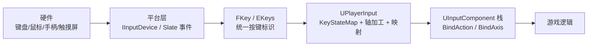
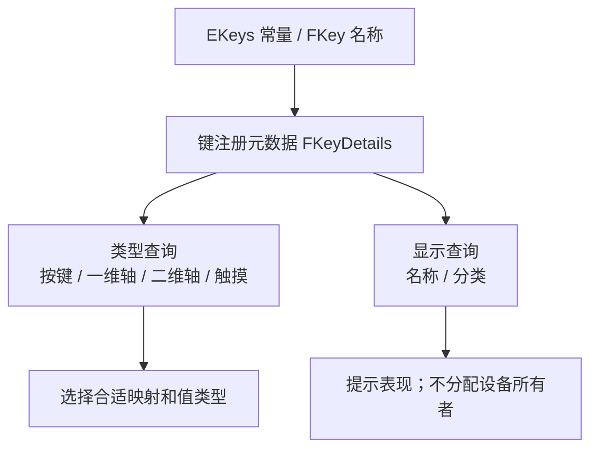
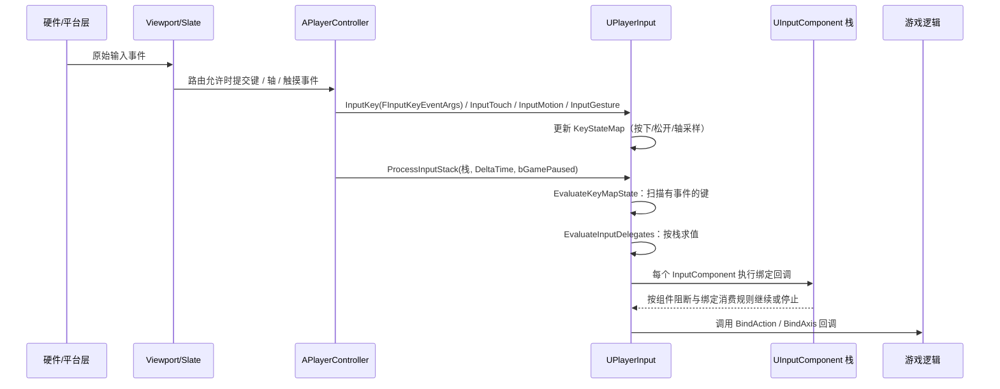
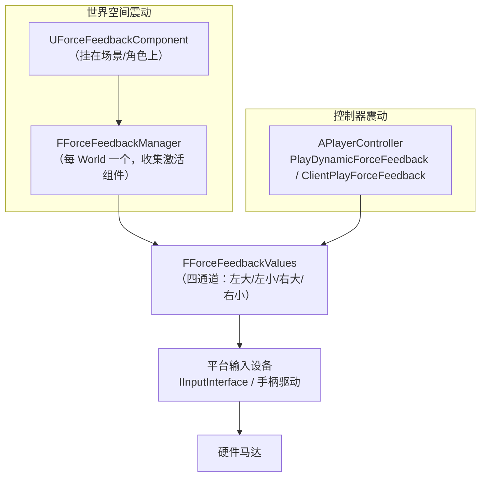
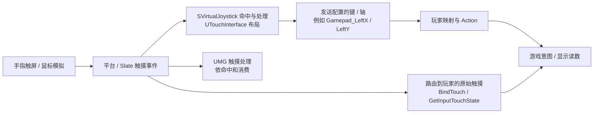

# 10 输入设备抽象与手柄触控
> 知识成熟度：L2。本文核对公开文档/API，正常路线是供读者搭建的蓝图方案；代码与操作均未编译、未运行，`verified: []` 保持不变。
> 版本基准：使用明确标为 UE 5.6 的 Input Overview、Enhanced Input、Force Feedback 教程；2026-10-11 打开的默认 API 页面大多显示 UE 5.8，`GetPairedAxisKey` 独立页实际显示 5.6。本文按页标注，不将这些页面组合称为同一补丁版、固定 CL 或跨版测试。
> 适用范围：按键和值、设备与本地玩家关系、手柄反馈、原始触摸与虚拟控件、输入模式。完整案例限定单本地玩家、单个控制器、静态 HUD 和一次菜单往返。
> 历史依据：旧稿记载 UE 5.8.0、CL 55116800、`++UE5+Release-5.8` 及本机头文件核对；本轮未读取 UE 安装目录或 Build.version，这些属于历史作者记录，不是本轮机器观察；旧稿见文末固定 Git 版本。
> 最后更新：2026-10-11。纠正设备身份、触控分支、API 参数与迁移口径，补上输入值到可见读数的正常路线。

面向 UE 客户端开发：`FKey` / `EKeys` 标识键，`UPlayerInput` 保存和处理玩家输入，`UForceFeedbackEffect` / `UForceFeedbackComponent` 提供反馈，`UTouchInterface` 产生虚拟控件输入，`UInputSettings` 管项目输入配置。具体 IMC、Trigger 与改键详见[Enhanced Input](02-EnhancedInput增强输入.md)；页面栈和 CommonUI 焦点详见[CommonUI](../界面设置与无障碍/07-CommonUI输入路由与焦点管理.md)。

## 一、概述

UE 的输入系统是一条**多层抽象链**：平台硬件 → 平台消息/输入设备集成 → Slate 与视口路由 → 对应玩家的 `UPlayerInput` 状态与加工 → `UInputComponent` 绑定 → 游戏逻辑。`FKey` 是这条链传递的键标识；不是每一种键鼠事件都必须经由一个项目 `IInputDevice` 插件。理解每一层，才能回答"手柄震动为什么不响""手机虚拟摇杆怎么配置""触摸事件在哪拿"这类问题。



上图是职责示意，省略了 UI 消费、设备到玩家的分配及 Enhanced Input 的求值细节，不能视为每个平台的逐函数调用栈。

本篇文章聚焦**设备与按键抽象**本身（而不是具体映射方案）：`FKey` 怎么表示一个按键、`UPlayerInput` 怎么处理一帧输入、手柄力反馈和触控走什么路径、全局配置在哪里，以及它们与 Enhanced Input（见 02 篇）如何共存。

> 一句话结论：**`FKey` 是两代输入系统共同的"货币"**——旧系统用它做 Axis/Action Mappings，Enhanced Input 的 `FEnhancedActionKeyMapping` 也用它；力反馈、触控、设备 ID 这些能力则在两代系统之下共享。

## 二、核心概念速览

| 概念 | 类 / 类型 | 作用 | 关键点 |
| --- | --- | --- | --- |
| 键标识 | `FKey` | 一个按键/轴/触摸点的统一标识 | 名称与键元数据；不含某台物理设备身份 |
| 键注册表 | `EKeys` | 全部内置键的静态注册表与常量 | `EKeys::Gamepad_LeftX` 等，可运行时 `AddKey` 扩展 |
| 键详情 | `FKeyDetails` | 键的类型标记（手柄/触摸/轴/虚拟键…） | 轴类型、配对轴、虚拟键值、菜单分类 |
| 输入事件参数 | `FInputKeyEventArgs` | 一次按键事件的完整参数包 | Key / Event / InputDevice / AmountDepressed / EventTimestamp；依实际版本 |
| 玩家输入 | `UPlayerInput` | 每玩家输入处理器 | 维护 `KeyStateMap`、执行轴加工、驱动绑定分发 |
| 输入组件 | `UInputComponent` | 绑定的容器，按栈优先级求值 | `PushInputComponent` 压栈，可阻断下层 |
| 轴属性 | `FInputAxisProperties` | 轴的加工参数 | DeadZone / Sensitivity / Exponent / bInvert |
| 键映射 | `FInputActionKeyMapping` / `FInputAxisKeyMapping` | 旧输入系统的映射条目 | Project Settings 或运行时增删 |
| 力反馈组件 | `UForceFeedbackComponent` | 世界空间中放置的震动源 | 衰减、循环、强度乘子，挂 SceneComponent |
| 震动效果 | `UForceFeedbackEffect` | 四通道震动曲线资产 | LeftLarge / LeftSmall / RightLarge / RightSmall |
| 触控界面 | `UTouchInterface` | 移动端虚拟摇杆/按钮布局资产 | `FTouchInputControl` 列表 + 透明度/重置策略 |
| 输入设置 | `UInputSettings` | 全局输入配置（config=Input） | 默认类、鼠标捕获、触控选项、设备映射 |
| 本地玩家 | `ULocalPlayer` | 一位本地玩家（控制器 ID / 平台用户） | 视口、`GetSubsystem<...>`、平台用户 ID |
| 设备标识 | `FInputDeviceId` / `FTouchId` | 多输入设备识别 | 设备 ID 与触摸身份分开；当前公开页列出 `FTouchId` 重载，不断言首次引入版本 |

## 三、原理详解

### 3.1 FKey 与 EKeys：按键是怎么被表示的

[`FKey`](https://dev.epicgames.com/documentation/en-us/unreal-engine/API/Runtime/InputCore/FKey) 是一个键的标识，公开页列有 `KeyName`、`KeyDetails` 以及 `IsGamepadKey`、`IsAxis1D/2D/3D`、`IsTouch` 等查询。用 `EKeys::Gamepad_FaceButton_Bottom` 这样的常量表达键，避免把显示文字当稳定身份。旧稿对惰性缓存、内部仅有两个成员、比较与哈希实现的说明，属于历史实现说明，本轮不把类页等同 `.cpp` 核验。



同一个 `Gamepad_LeftX` 键可以由不同设备上报，也可以由虚拟摇杆生成。它不包含“玩家 1 的某个物理手柄”的唯一身份。

下表保留常见键的用途速查；类型可通过 FKey 查询，键常量见 [EKeys](https://dev.epicgames.com/documentation/en-us/unreal-engine/API/Runtime/InputCore/EKeys)。它不是所有版本都相同的一份枚举定义：

| 标记 | 含义 | 典型键 |
| --- | --- | --- |
| `GamepadKey` | 手柄键 | `Gamepad_FaceButton_Bottom` |
| `Touch` | 触摸键 | `Touch1` ~ `Touch10`；具体 TouchKeys 数组布局按目标版本核对 |
| `MouseButton` | 鼠标按键 | `LeftMouseButton` |
| `ModifierKey` | 修饰键 | `LeftShift` / `LeftControl` / `LeftAlt` / `LeftCommand` |
| `Axis1D` / `Axis2D` / `Axis3D` | 一维/二维/三维轴 | `MouseX` / `Gamepad_Left2D` / `Tilt` |
| `ButtonAxis` | 模拟按钮的轴（按键式摇杆方向） | `Gamepad_LeftStick_Up` 等 |
| `Virtual` | 抽象键，实际值随平台变化 | `Virtual_Gamepad_Accept` / `Virtual_Gamepad_Back`（旧命名和首次版本未重核） |
| `Gesture` | 手势键 | `Gesture_Pinch` / `Gesture_Flick` / `Gesture_Rotate` / `Gesture_Pan` / `Gesture_Tap` / `Gesture_LongPress` |
| `Deprecated` | 已废弃键 | 旧平台键 |

其他要点：

- 配对轴由 `GetPairedAxis` / `GetPairedAxisKey` 查询；不要把“方向按键式轴”和“组成二维轴的一维分量”混成同一关系。独立函数页只列签名，不能据它断言某个方向键必然配到哪个轴。
- 虚拟键与 `GetVirtualKey` 解决抽象键到实际键的表示；平台确认/返回习惯仍应由平台配置和 UI 动作定义决定，图标不会授予设备控制权。
- 用 `EKeys::GetAllKeys` 枚举注册键、`GetKeyDetails` 查元数据；`FKey::GetDisplayName` / `GetMenuCategory` 用于显示和分类。枚举的是键定义，不是物理设备清单。
- 自定义键可用 `EKeys::AddKey` 注册，`AddPairedKey` 建立二维键与 X/Y 分量的关系，`AddVirtualKey` 注册虚拟键；`RemoveKeysWithCategory` 按分类移除注册。仅注册名称不会读取硬件，还要有设备实现产生事件。
- `ConsoleForGamepadLabels` / `SetConsoleForGamepadLabels` 是标签风格入口，不改变配对；`FInputDeviceScope` 是旧稿保留的设备集成线索，具体用法需目标头文件核对。
- 键名、动作名、输入设备 ID、平台用户 ID 分别回答“哪种控件”“什么意图”“哪台输入设备”“分配给哪个平台用户”，不能互相代换。

### 3.2 UPlayerInput 处理栈：一帧输入怎么走

`UPlayerInput`（`UCLASS(config=Input, transient)`）是 **PlayerController 的输入处理器**，网络游戏里**只存在于客户端**。下图说明状态与绑定的关系；具体内部求值顺序未读实现，不是本轮录制的调用轨迹：



[`UPlayerInput` 当前 API](https://dev.epicgames.com/documentation/en-us/unreal-engine/API/Runtime/Engine/UPlayerInput) 列出 `InputKey`、`InputTouch`、`InputMotion`、`InputGesture`、`ProcessInputStack` 和状态查询接口。它仍同时列出 `FInputKeyEventArgs` / `FInputKeyParams` 及两种触摸重载；本轮没有首次引入/弃用证据，覆写时以目标项目实际头文件为准。

[`FInputKeyEventArgs`](https://dev.epicgames.com/documentation/en-us/unreal-engine/API/Runtime/Engine/FInputKeyEventArgs) 当前页以 `AmountDepressed` 表达输入量，另列 `InputDevice`、`EventTimestamp`、`DeltaTime`、`NumSamples`。构造参数名 `InDelta` 不能据此写成同名成员 `Delta`；一个事件也可能聚合多个样本。`IsGamepad()` 对某些模拟事件也可为真，不能把它当“物理手柄已认证”的证明。

输入组件是绑定容器，处理时存在优先级与消费/阻断。`bBlockInput` 一类组件策略、单项绑定消费、Enhanced 映射优先级、UI 路由是不同层面；不能把任意回调返回 true 描述成统一阻断协议。`FInputChord` 对应键组合绑定，不应说动作名绑定本身就是任意 chord。

旧系统常见 `BindAction`、`BindAxis`、`BindKey`、`BindTouch`；需要继续读绑定容器时，可检索 `FInputActionBinding`、`FInputAxisBinding`、`FInputKeyBinding`、`FInputAxisKeyBinding`、`FInputVectorAxisBinding`、`FInputTouchBinding`。Enhanced 绑定改用 IA 和 `ETriggerEvent`。详见 [Input Overview 的 InputComponent](https://dev.epicgames.com/documentation/en-us/unreal-engine/input-overview-in-unreal-engine?application_version=5.6) 与 [Enhanced Input 正文](02-EnhancedInput增强输入.md)。`DiscardPlayerInput` 丢弃待处理输入，不能据此认定已执行的游戏动作、UI 命令或网络请求被撤销。底层公开入口 `EvaluateBlockedInputComponent` 对因更早组件阻断而未参与求值的组件调用；这是组件求值通知，不等于业务取消完成。

### 3.3 轴加工：原始数值、修饰和业务单位

[`FInputAxisProperties`](https://dev.epicgames.com/documentation/en-us/unreal-engine/API/Runtime/Engine/FInputAxisProperties) 为旧输入路线提供 DeadZone、Sensitivity、Exponent、bInvert。公开属性页支持这些字段的用途，没有给出完整公式、所有默认值或执行顺序；旧稿“先乘灵敏度再做指数”的固定管线不作为现行依据。要精确复现，必须读取目标版本 `MassageAxisInput` 实现。

```text
设备采样 → 该输入路线的轴加工 / Modifier → 动作值 → 业务解释
           参数、次序和单位均须明确
```

保留接口速查：`GetAxisProperties(Key, Props)` / `SetAxisProperties(Key, Props)`、`GetInvertAxisKey` / `InvertAxisKey`、`GetInvertAxis` / `InvertAxis`、`SetMouseSensitivity`、`SmoothMouse`。`GetMouseSensitivityX/Y` 读回鼠标灵敏度。`FKeyState` 保存键状态，`GetRawKeyValue` 与 `GetKeyValue` 查询的层次不同；不能拿显示读数倒推驱动原始样本。

状态速查：`IsPressed`、`WasJustPressed`、`WasJustReleased` 分别看按住和边缘，`GetTimeDown` 查询按住时长；`IsAltPressed`、`IsCtrlPressed`、`IsShiftPressed`、`IsCmdPressed` 查询修饰键。它们用于状态观察，不替代 Action 的 Trigger 判定。

手柄轴通常表达偏转程度，鼠标 delta 表达本次位移，触摸位置是屏幕坐标；同为 float/Vector 不等于同单位。摇杆转相机速度时可能需要业务的度/秒和 DeltaSeconds；鼠标位移不能无条件再乘同一套时间系数。本文正常路线只显示轴值，不猜测硬件采样率或相机单位。

Enhanced Input 的 Modifier 应在自己这条映射链配置。不要假定调整旧 Axis Properties 一定替代 Enhanced 的死区，也不要无意对同一输入重复死区/缩放。具体 IA 值类型与修饰次序由[Enhanced Input](02-EnhancedInput增强输入.md)负责。

### 3.4 手柄与力反馈

手柄键族：`Gamepad_Left2D`（`Gamepad_LeftX` / `Gamepad_LeftY`）、`Gamepad_Right2D`、`Gamepad_LeftTriggerAxis` / `Gamepad_RightTriggerAxis`、`Gamepad_FaceButton_*`（Bottom/Right/Left/Top）、`Gamepad_LeftShoulder` / `Gamepad_RightShoulder`、`Gamepad_LeftTrigger` / `Gamepad_RightTrigger`、`Gamepad_DPad_*`、`Gamepad_Special_Left` / `Gamepad_Special_Right`、`Gamepad_LeftStick_Up/Down/Left/Right`（按键式轴）等。

力反馈可以由世界组件或玩家控制器发起，再由平台实现输出。下面保留世界/控制器/设备的职责图；`FForceFeedbackManager` 和末端更新函数是旧稿源码线索，不代表本轮已核对其内部聚合顺序：



1. **世界组件**：[`UForceFeedbackComponent`](https://dev.epicgames.com/documentation/en-us/unreal-engine/API/Runtime/Engine/UForceFeedbackComponent) 放置于场景，可设置效果资产、强度、循环及衰减。附近玩家是否受到影响依实际配置；它不天然等于仅震动组件 Owner 的控制器。`AttenuationSettings` 可引用衰减资产，`bOverrideAttenuation` / `AttenuationOverrides` 用于本组件覆盖，`AdjustAttenuation` 调整衰减；`OnForceFeedbackFinished` 提供完成/提前停止的通知，仍需按目标委托签名绑定。
2. **控制器动态反馈**：[`PlayDynamicForceFeedback`](https://dev.epicgames.com/documentation/en-us/unreal-engine/API/Runtime/Engine/APlayerController/PlayDynamicForceFeedback) 有蓝图 latent 和 C++ handle 重载，启动、更新、停止要使用对应合同。`ClientPlayForceFeedback` 以效果资产与 `FForceFeedbackParameters` 请求该玩家的客户端播放。
3. **硬件实现**：四个逻辑通道不保证对应四个独立物理马达；某种设备标有 ForceFeedback 能力也不保证当前连接、驱动、用户设置或运行平台能产生反馈。基础震动、触发器阻力、音频触觉是不同能力，不能互相代替。[Force Feedback 5.6](https://dev.epicgames.com/documentation/en-us/unreal-engine/force-feedback-in-unreal-engine?application_version=5.6)明确说明部分特性依赖平台。

多设备时先核控制器的 LocalPlayer/PlatformUser 和设备配对，再核平台反馈策略。不要写成“UE5 起每玩家恰有一个手柄，震动必然只送到它”：一名平台用户可配多个设备，世界衰减组件也可影响附近多个玩家。

### 3.5 触控：原始触摸与虚拟控件是两条用法



此图表示可能的处理分支，**不保证一根手指同时广播给每条分支**。UI、虚拟摇杆的命中和消费会影响剩余路径。虚拟摇杆没有先产生“平台物理触摸”；它接收触摸后输出配置的键/轴。

- [`FTouchInputControl`](https://dev.epicgames.com/documentation/en-us/unreal-engine/API/Runtime/Engine/FTouchInputControl) 的 MainInputKey 是摇杆水平输出，AltInputKey 是垂直输出；分别设 `Gamepad_LeftX`、`Gamepad_LeftY`。`Gamepad_Left2D` 可作 Enhanced 的二维映射键，但不拿它代替这两个输出槽。
- `bTreatAsButton=true` 把一个控件作为按钮，可向 `Gamepad_FaceButton_Bottom` 这类动作键输出。Image1/Image2、Center、VisualSize、ThumbSize、InteractionSize、InputScale 定义布局/缩放；透明度不会决定是否拥有游戏控制权。
- DefaultTouchInterface 指定默认资产；要替换当前控制器的界面，使用 `APlayerController::ActivateTouchInterface`。`UTouchInterface::Activate` 的 Slate 参数入口不是给蓝图随手调用的“显示”按钮。
- `bUseMouseForTouch` 是 `UInputSettings` 项目配置，用于鼠标模拟；Always Show Touch Interface 控制显示。两者都不能证明真实多指、压力、触屏设备或平台包已验证。
- 原始触摸用 `BindTouch` / 蓝图 Input Touch；位置可用 PC 的 `GetInputTouchState` 查询。`Touch1` 标识触摸点对应的键，不是一个命名的 UMG/虚拟按钮。`Touches` 数据也不是简单经过 `.ini` AxisMappings 的坐标转换管线。
- 需要拖动、捏合等手势时明确手指身份、起止点与 UI 消费；`bEnableGestureRecognizer` 和 `InputGesture` 是独立入口。普通 Pressed/Hold Trigger 不会自动识别两个触点的空间捏合。

依据：[Input Overview 的 Touch Interface](https://dev.epicgames.com/documentation/en-us/unreal-engine/input-overview-in-unreal-engine?application_version=5.6)、[PlayerInput 触摸状态](https://dev.epicgames.com/documentation/en-us/unreal-engine/API/Runtime/Engine/UPlayerInput)、[PlayerController 触摸入口](https://dev.epicgames.com/documentation/en-us/unreal-engine/API/Runtime/Engine/APlayerController)。

### 3.6 UInputSettings：全局输入配置

`UInputSettings`（`UCLASS(config=Input, defaultconfig)`）是输入侧最重要的全局设置，常用项：

| 配置 | 说明 |
| --- | --- |
| `DefaultPlayerInputClass` | 默认 `UPlayerInput` 类（Enhanced Input 换 `UEnhancedPlayerInput` 就改这里） |
| `DefaultInputComponentClass` | 默认 `UInputComponent` 类（Enhanced Input 换 `UEnhancedInputComponent`） |
| `ActionMappings` / `AxisMappings` | 旧输入系统的全局映射（编辑器 Project Settings → Input 编辑的就是它们） |
| `DefaultViewportMouseCaptureMode` / `DefaultViewportMouseLockMode` | 鼠标捕获/锁定默认策略（`EMouseCaptureMode` / `EMouseLockMode`） |
| `bCaptureMouseOnLaunch` | 启动即捕获鼠标 |
| `bUseMouseForTouch` | 鼠标模拟触摸 |
| `bEnableLegacyInputScales` | 启用旧版输入缩放兼容 |
| `DefaultTouchInterface` | 默认触控界面资产 |
| `ConsoleKeys` | 打开控制台的按键 |

以下设备描述类型保留为旧稿检索线索，具体枚举值、CVar 存在性及默认策略本轮未逐项重核，不能按文字直接启用设备能力。设备映射（Device Mapping，面向硬件抽象）：`FHardwareDeviceIdentifier`（InputClassName + HardwareDeviceIdentifier + 主类型 + 能力标记）标识一类硬件；`EHardwareDevicePrimaryType`（KeyboardAndMouse / Gamepad / Touch / RacingWheel / FlightStick…）与 `EHardwareDeviceSupportedFeatures`（Gamepad / Touch / ForceFeedback / TriggerHaptics / AudioBasedVibrations…）描述设备能力；`FHardwareDeviceIdentifier::DefaultGamepad` / `DefaultKeyboardAndMouse` / `DefaultMobileTouch` 是内置默认标识；平台级配置在 `UInputPlatformSettings`（`UPlatformSettings` 子类），控制台变量 `input.DeviceMappingPolicy` 控制映射策略。

### 3.7 设备身份、本地玩家与输入提示

| 信息 | 回答的问题 | 不代表什么 |
| --- | --- | --- |
| FKey / 键元数据 | 哪种键、轴或触摸键 | 具体物理设备、控制该玩家的权限 |
| FInputDeviceId | 当前输入设备标识 | 玩家索引或永久硬件序列号 |
| FPlatformUserId | 平台用户归属 | 恰有一个设备、必有游戏中的 LocalPlayer |
| ULocalPlayer / PlayerController | 当前本地游戏会话的输入目标 | 所有连接设备自动加入游戏 |
| CommonInput 当前类型/图标 | 提示采用键鼠、手柄或触控外观 | 输入独占权、最近实际事件的唯一来源 |

[`IPlatformInputDeviceMapper`](https://dev.epicgames.com/documentation/en-us/unreal-engine/API/Runtime/ApplicationCore/IPlatformInputDeviceMapper)允许各平台采用不同的用户/设备配对，含一用户多设备。`GetUserForInputDevice` 可返回无效用户；`GetPrimaryInputDeviceForUser` 也可返回无效设备。`GetAllInputDevices` 包含未连接记录，不能直接当作“当前可用手柄列表”。

在已有设备事件中拿到 DeviceId 后，可依次查询有效性、连接状态、所属 PlatformUser，再与目标 PC/LocalPlayer 核对。蓝图可用 [`UInputDeviceLibrary`](https://dev.epicgames.com/documentation/en-us/unreal-engine/API/Runtime/Engine/UInputDeviceLibrary) 的相应查询；连接变化与配对变化分开处理，不能只在启动时缓存一次。它们是观察和路由数据，不能靠把 ID 强转为 0/1 代替平台配对。

当前 [`UInputSettings`](https://dev.epicgames.com/documentation/en-us/unreal-engine/API/Runtime/Engine/UInputSettings) 的 `bFilterInputByPlatformUser` 明确用于 PC 的键事件过滤。它不保证整个项目中所有自定义监听、UI 和业务都只接受指定设备，也不代替“按键加入游戏”的项目策略。本文不修改它或任何配对设置。

CommonInput 的提示切换由对应 LocalPlayer 的系统和项目配置处理；虚拟摇杆能输出 Gamepad 键，故只看键族也可能误判来源。实际 UI 页面是否有焦点、谁接收 Back/Click，按[CommonUI 的输入配置与焦点路线](../界面设置与无障碍/07-CommonUI输入路由与焦点管理.md)核对。

### 3.8 与 Enhanced Input 的关系

| 维度 | 旧系统（PlayerInput） | Enhanced Input | 共享底座 |
| --- | --- | --- | --- |
| 键标识 | `FKey` / `EKeys` | `FKey` / `EKeys` | **同一套** |
| 输入处理器 | `UPlayerInput` | `UEnhancedPlayerInput`（子类，经 `DefaultPlayerInputClass` 替换） | FKeyState / 设备事件 |
| 绑定组件 | `UInputComponent` | `UEnhancedInputComponent`（子类） | 栈式求值 |
| 映射 | Project Settings 的 Action/Axis Mappings | IMC 资产 | 都落到 FKey |
| 设备识别 | `FInputDeviceId` / `FPlatformUserId` | 相同 | 相同 |
| 力反馈 | PC / ForceFeedbackComponent | 不改变，仍走 PC 与组件 | 相同 |
| 触控 | TouchInterface + TouchKeys | 可用 IMC 映射 Touch 键 | 相同 |

Enhanced Input 复用键和设备基础，增加资产化动作、映射、修饰与触发条件。修改两个默认类只是配置处理器/组件创建；还需插件、IA/IMC 资产、该 LocalPlayer 的 Add Mapping Context 和接收绑定，旧绑定也须核是否重复。Cast 不会改造已有对象；普通输入 Trigger 更不等于自动识别所有空间触摸手势。

## 四、C++ / 蓝图示例

4.1–4.7 是有前置条件的接口片段，未编译；4.8 给出从资产、控制器入口到可见结果的完整蓝图接线。片段中的类名、资产引用、成员声明及模块依赖必须由实际项目提供，不能当独立可执行程序。

### 4.1 查询按键状态（旧系统兼容查询）

```cpp
// PlayerController 是本地目标控制器；先检查指针，不以全局玩家0兜底。
if (const UPlayerInput* PI = PlayerController ? PlayerController->PlayerInput : nullptr)
{
    const bool bJumpHeld    = PI->IsPressed(EKeys::SpaceBar);
    const bool bJumpPressed = PI->WasJustPressed(EKeys::SpaceBar);   // 本帧按下
    const bool bJumpReleased= PI->WasJustReleased(EKeys::SpaceBar);  // 本帧松开
    const float HoldTime    = PI->GetTimeDown(EKeys::SpaceBar);      // 已按住时长
    const float Axis        = PI->GetKeyValue(EKeys::Gamepad_LeftTriggerAxis);
}
```

### 4.2 轴加工与反转

```cpp
// 前置：PlayerInput 非空，且本段操作旧轴加工路线。
// 给右摇杆 X 轴配置死区与灵敏度；这些是示例参数，不是引擎默认值。
FInputAxisProperties Props;
if (PlayerInput->GetAxisProperties(EKeys::Gamepad_RightX, Props))
{
    Props.DeadZone = 0.15f;
    Props.Sensitivity = 1.5f;
    Props.Exponent = 2.f;   // 非线性曲线
    PlayerInput->SetAxisProperties(EKeys::Gamepad_RightX, Props);
}

// 反转 Y 轴（按键 / 按轴名）
PlayerInput->InvertAxisKey(EKeys::Gamepad_RightY);
PlayerInput->InvertAxis(TEXT("LookUp"));  // 作用于所有绑定 LookUp 的键

// 鼠标灵敏度
PlayerInput->SetMouseSensitivity(0.5f, 0.5f);
```

### 4.3 力反馈：组件方式

```cpp
// 片段前置：this 是有效 Actor，有 RootComponent；MyRumbleEffect 已赋值。
// FF 应保存为该 Actor 的受 GC 跟踪成员，避免丢失后续停止/销毁入口。
// 给角色挂一个震动组件（也可直接 AddComponent）
UForceFeedbackComponent* FF = NewObject<UForceFeedbackComponent>(this);
FF->bAutoActivate = false;
FF->SetupAttachment(GetRootComponent());
FF->RegisterComponent();

// 使用震动资产（UForceFeedbackEffect，四通道曲线）
FF->SetForceFeedbackEffect(MyRumbleEffect);   // 资产在内容浏览器创建
FF->SetIntensityMultiplier(1.0f);
FF->bLooping = false;
FF->bIgnoreTimeDilation = true;               // 慢动作时震动不跟着变慢
// 若需完成回调，另声明匹配委托签名的 UFUNCTION 后绑定。
FF->Play(0.f);
```

需要提前停止时，在后续事件调用下面这一段；不要与 Play 连在同一条立即执行线上。

```cpp
FF->Stop();
```

控制器动态震动是另一个入口。以下片段要求 PlayerController 非空且是目标本地控制器；它不依赖震动资产。

```cpp
PlayerController->PlayDynamicForceFeedback(
    0.6f,               // Intensity
    0.25f,              // Duration（秒）
    true, true, true, true,   // 四个通道是否受影响
    EDynamicForceFeedbackAction::Start,
    0); // native重载；需更新/停止时保存返回handle
```

### 4.4 服务器通知客户端震动

```cpp
// 片段位于目标 PlayerController 中，效果资产已赋值。
// 服务器业务确认命中后调用该客户端入口；不是输入事件自行确定伤害。
FForceFeedbackParameters Params;
Params.bLooping = false;
Params.bIgnoreTimeDilation = true;
Params.bPlayWhilePaused = false;
Params.Tag = NAME_None;
ClientPlayForceFeedback(HitRumbleEffect, Params);
```

`FForceFeedbackParameters` 当前公开页只列默认构造与上述字段；不使用旧稿未经证实的四参数构造。[参数结构](https://dev.epicgames.com/documentation/en-us/unreal-engine/API/Runtime/Engine/FForceFeedbackParameters)。

### 4.5 触控与移动端

**虚拟控件路线**：复制引擎 `DefaultVirtualJoysticks` 到自己的案例目录，不编辑引擎资产；左摇杆 MainInputKey=`Gamepad_LeftX`、AltInputKey=`Gamepad_LeftY`。在 IMC 映射这些轴或其对应二维键，再把 IMC 应用到本玩家。按钮使用 `bTreatAsButton` 和明确输出键，见 4.8。

**原始触摸路线**：若只需要点触位置，先在隔离案例中清空 DefaultTouchInterface，避免虚拟摇杆处理同一区域；UI 是否命中仍要另外检查。有效输入组件里可登记：

```cpp
// 片段：AMyCharacter 中已声明匹配签名的 OnTouchPressed。
InputComponent->BindTouch(IE_Pressed, this, &AMyCharacter::OnTouchPressed);

void AMyCharacter::OnTouchPressed(ETouchIndex::Type FingerIndex, FVector Location)
{
    // 使用本次触摸身份与位置；这里不代表已识别拖动或双指手势。
}
```

蓝图 Input Touch 事件与 PC 的 Get Input Touch State 可观察按下状态和屏幕 X/Y。不要把 IMC 中一个 Touch1 映射说成会自动提供完整拖动向量。完整手势要使用合适的触摸位置/事件、坐标转换和状态规则。

### 4.6 输入模式与鼠标捕获

```cpp
// 只允许玩家输入/控制器响应；捕获、锁定和光标可见性另外核对。
PlayerController->SetInputMode(FInputModeGameOnly());

// 只允许 UI 响应；实际界面还需指定有效可聚焦目标和鼠标策略。
PlayerController->SetInputMode(FInputModeUIOnly());

// 全局默认策略在 UInputSettings：
// DefaultViewportMouseCaptureMode = CaptureDuringMouseDown / CapturePermanently / NoCapture ...
// DefaultViewportMouseLockMode    = DoNotLock / LockOnCapture / LockAlways ...
```

### 4.7 蓝图侧要点

1. **旧系统**：Project Settings → Input 增删 Axis/Action Mappings；蓝图 `InputAction` / `InputAxis` 事件（旧）；C++ 可用 `BindAction` / `BindKey`，蓝图节点名以实际目标编辑器为准；
2. **查询**：蓝图节点 `Is Input Key Down`、`Was Input Key Just Pressed`、`Get Input Key Time Down`、`Get Input Axis Key Value`（这些常用蓝图查询在 `APlayerController`；不把全部 `UPlayerInput` C++ 方法都说成蓝图节点）；
3. **力反馈**：`Play Force Feedback`（组件上）、PC 的 `Play Dynamic Force Feedback` 节点；
4. **触控**：PC/Pawn 的 Touch 事件节点；UMG 的 `OnTouch` 系列事件；
5. **调试**：可在目标引擎确认 `showdebug input` / `showdebug enhancedinput` 的可用性，结合值、动作和业务读数定位；本轮没有执行调试命令。

### 4.8 完整正常路线：三个输入入口，同一组可见读数

目标是看到“这名玩家的横轴、纵轴、一次按下计数”随键盘、手柄和虚拟控件改变，然后打开一个小菜单、把焦点交给按钮、返回游戏。先把设备输入接通，再把输出接角色移动或技能；不借角色模板中未知的默认映射掩盖接线。本例**只显示读数与增加计数，没有移动角色、修改设置或保存数据**。

下列是供读者搭建的方案，全部结果为 `PAPER_EXPECTED`。以 5.6 的资产/映射教程安排步骤，触控控件字段、设备查询和输入模式另依本次实际打开的 API 页补核；这不是已经在某一 UE 安装中通过的项目。范围固定为本地单玩家、一个 PC、一个地图，不含重生、旅行、第二玩家、网络或热插拔重配实测。

#### A. 建好入口和显示

1. 在一个隔离的空白蓝图项目中确认 Enhanced Input 已启用，Project Settings → Input 的默认输入类为 EnhancedPlayerInput / EnhancedInputComponent。若实际版本或项目有自定义类，先核继承关系，不能直接覆盖它们。
2. 创建 `BP_DeviceProbePC`（PlayerController）和 `BP_DeviceProbeGameMode`（GameModeBase）。在 GameMode 的 Player Controller Class 选择该 PC，在案例地图 World Settings 的 GameMode Override 选择该 GameMode。测试路线不使用默认 Pawn 的绑定，Default Pawn Class 设 None；PC 本身作为输入接收者。
3. PC 添加 `ProbeX`、`ProbeY`（float，0）、`PulseCount`（integer，0）、`bAcceptProbe`（bool，true）、`ProbeHUD` 和 `ProbeMenu`（对应 Widget 对象引用）。
4. 创建 `WBP_DeviceProbeHUD`（UserWidget），放一个勾选 Is Variable 的 TextBlock `TextProbe`。HUD 的根及子树设 Not Hit-Testable，让读数不拦触摸。Event Tick 中 `Get Owning Player → Cast To BP_DeviceProbePC`，有效才用 Format Text 显示其 `ProbeX`、`ProbeY`、`PulseCount`、`bAcceptProbe`，再 `TextProbe.Set Text`。没有有效 Owner 时显示“没有本地控制器”，不退到全局 Player 0。
5. PC 的 BeginPlay 先检查 Is Local Controller；从 Self 取得本地玩家的 Enhanced Input Local Player Subsystem 并保存引用。它无效则打印错误并停止本次初始化，不把 BeginPlay 本身当输入就绪保证。有效时创建 HUD（Owning Player=Self），存入 ProbeHUD，Add to Viewport，Set Input Mode Game Only。资产建完后在同一初始化分支添加下一节的 IMC。

这是固定单 PC 案例的入口。对象替换和映射重建的完整责任由[Enhanced Input 的拥有者与安装/退出章节](02-EnhancedInput增强输入.md)说明，不在这里复制第二套通用协议。

#### B. 把实际键映射到值和计数

创建三个 Input Action 和一个 Input Mapping Context `IMC_DeviceProbe`。本例用两个 Axis1D 明确观察每个输出槽，不依赖二维多映射聚合设置；实际玩法需要二维意图时可按 Enhanced Input 篇改成 Axis2D。

| Action | Value Type / Trigger | IMC 中的键与映射级 Modifier |
| --- | --- | --- |
| `IA_ProbeX` | Axis1D；无额外 Trigger | D，无；A，Negate；Gamepad Left X，无额外修饰 |
| `IA_ProbeY` | Axis1D；无额外 Trigger | W，无；S，Negate；Gamepad Left Y，无额外修饰 |
| `IA_ProbePulse` | Digital (bool)；Action 级 Pressed | Space Bar；Gamepad Face Button Bottom；两行都无额外 Trigger |

在本例不同时按多个映射键，不人为填写硬件居中一定为 0、满量程一定精确为 1；先记录实际值，死区随后按项目需求加入并对照。不要为了这个观察去关闭全项目已有死区或改平台设置。

PC 初始化成功分支中，对保存的本玩家 Subsystem 调用 Add Mapping Context（`IMC_DeviceProbe`，Priority=0）。不要 Clear All Mappings。PC Event Graph 右键搜索这些实际 IA 资产，接线：

```text
IA_ProbeX.Triggered → 若 bAcceptProbe → Action Value 取 float → Set ProbeX
IA_ProbeY.Triggered → 若 bAcceptProbe → Action Value 取 float → Set ProbeY
IA_ProbeX.Completed / Canceled → Set ProbeX = 0
IA_ProbeY.Completed / Canceled → Set ProbeY = 0
IA_ProbePulse.Triggered → 若 bAcceptProbe → PulseCount + 1 → Print String 新计数
```

这里 [Pressed](https://dev.epicgames.com/documentation/en-us/unreal-engine/API/Plugins/EnhancedInput/UInputTriggerPressed) 的阈值越过对应一次计数；不是把任意 Triggered 都定义为按下。持续按住不能每帧增加计数；不把 Started 与 Triggered 同时接到加一。开始时只按 D，HUD 的 X 应为正；松开回 0；按 A 为负；只推手柄左摇杆的水平轴，应改变同一个 X 字段。两输入都通后再测纵轴。

#### C. 用虚拟控件进入同一映射

1. 在内容选择器打开 Show Engine Content，找到 `/Engine/MobileResources/HUD/DefaultVirtualJoysticks`，复制到项目目录为 `TI_DeviceProbe`；保留复制来的左摇杆贴图、大小和交互区，删除其右摇杆控件，只保留左摇杆。核左摇杆 MainInputKey=`Gamepad_LeftX`、AltInputKey=`Gamepad_LeftY`、InputScale=(1,1)。
2. 另加一个按钮控件：bTreatAsButton=true，MainInputKey=`Gamepad_FaceButton_Bottom`，AltInputKey=None，Center=(0.85,0.75)，VisualSize=(0.10,0.10)，InteractionSize=(0.15,0.15)，InputScale=(1,1)。贴图可沿用复制资产中的现有图案，不需导入新资源。控件尺寸是案例选择，竖屏/横屏和安全区另验。
3. Project Settings → Input 的 Default Touch Interface 选择 `TI_DeviceProbe`。桌面演示才检查 Always Show Touch Interface，并用 Use Mouse for Touch 模拟；这只给一次鼠标触摸路径，不构成多指或移动平台验证。实际设备路线需要可用触屏及该平台的运行环境。
4. 重新进入案例。拖动左虚拟摇杆，应改变同一对 ProbeX/ProbeY；松开后归零。轻点右侧虚拟按钮，应使 PulseCount 加一。不要再把 Touch1 另绑到加一，否则会把任意首触点或另一条路由混进这个特定按钮的含义。

这条链是“触点命中虚拟控件 → 控件发送 Gamepad 键/轴 → 同一个 IMC → IA → 同一个 HUD”。既不要求虚拟控件的输入类型提示一定显示 Touch，也不凭 `Gamepad_*` 键名认定事件来自物理手柄。

#### D. 一次菜单往返：映射和焦点各自有步骤

此处用普通 UMG 观察边界，项目若已由 CommonUI 管输入模式，应使用[其完整案例](../界面设置与无障碍/07-CommonUI输入路由与焦点管理.md)，不要把以下模式设置叠在 Router 上。

1. 添加 `IA_ProbeMenu`：Digital、Action 级 Pressed；在同一 IMC 映射 M 和 Gamepad Special Right。创建 `WBP_DeviceProbeMenu`，放一块可见面板和可聚焦、启用的普通 Button `BtnResume`，文字“返回读数”。按钮勾选 Is Variable、Is Focusable；菜单根保持 Visible。创建 `GetResumeTarget` 函数，返回 BtnResume 的 Widget 引用。
2. PC 的 IA_ProbeMenu.Triggered 只在 ProbeMenu 无效时创建菜单（Owning Player=Self），存引用、Add to Viewport；创建成功才把 bAcceptProbe=false、ProbeX=0、ProbeY=0。调用 Set Input Mode UI Only，Player Controller=Self、Widget to Focus=`ProbeMenu.GetResumeTarget()`、Mouse Lock=Do Not Lock，再 Show Mouse Cursor=true。输入模式、焦点与光标分别设置，不能用可见性替代。
3. 菜单 BtnResume.OnClicked 从 Get Owning Player 找到该 PC，调用 PC 自定义 `ResumeProbe`：Remove From Parent(ProbeMenu)、清空 ProbeMenu 引用、Set Input Mode Game Only(Self)、Show Mouse Cursor=false，最后 bAcceptProbe=true。只移除本例菜单，不销毁其他 Widget 或清空全部映射。
4. 所有键先松开再打开菜单；菜单出现后观察 BtnResume 的实际焦点，可用 Has User Focus(Self PC) 的返回值在菜单文本中显示，而非仅看悬停颜色。先用鼠标/触摸点返回，再用键盘焦点确认检查返回；手柄的确认键按目标平台 UI 约定核对。本文没有测得各平台默认确认键。

若 Space 已确认 BtnResume 并关闭菜单，先重新打开菜单，再分别测试鼠标、触摸、键盘或手柄等其他返回方式，不继续操作已经关闭的菜单。

[Set Input Mode UI Only](https://dev.epicgames.com/documentation/en-us/unreal-engine/API/Runtime/UMG/UWidgetBlueprintLibrary/SetInputMode_UIOnlyEx) 的公开页还提示 Widget 中绑定的 Input Events 不会由此收到调用；所以返回路径使用按钮 OnClicked，不能只在菜单里另绑一个玩法 IA 等它关闭。UIOnly 期间新按 Space 不应增加 ProbePulse 计数；地图本身并未暂停。返回后先松开打开/确认键再重新按 Space，应再加一。持键跨模式、失焦或关闭过程中有其他输入，是后续独立边界用例；不靠本次正常往返宣称已覆盖。

#### E. 有限的预期观察和失败定位

| 操作（每项先回中/松键） | 应观察什么 | 不足以说明什么 |
| --- | --- | --- |
| D、A 分别按下/释放 | X 分别正、负，再归零；Y 不因该键改变 | 没有测试同时按 A+D 的聚合 |
| 手柄左摇杆分别横/纵推 | 对应轴字段随偏转变化；释放后看实际居中值 | 不保证所有型号驱动、曲线、死区相同 |
| Space / 手柄下方按钮，各轻按一次 | 同一个 PulseCount 各加一，持续按住不连续加 | 不证明设备唯一身份或业务授权 |
| 虚拟摇杆拖动/虚拟按钮点击 | 同一组字段/计数变化 | 鼠标模拟不等于真实多指触屏 |
| 打开菜单，检查焦点，再按 Space | Resume 有实际焦点；计数不增加 | 不证明世界暂停或已有命令撤销 |
| 点 Resume、松键，再按 Space | 菜单移走，游戏模式恢复，计数继续增加 | 不证明持键恢复、旅行或第二玩家 |

若第一行不通，先读当前 PC 类、输入类、Subsystem、IMC 和 IA 值类型；若键盘通但手柄不通，检查该设备连接/配对及键值到达；若手柄通但虚拟摇杆不通，检查触控资产、显示、命中和输出槽；若只有菜单返回失败，检查关闭按钮归属与模式/焦点恢复。不要为修 UI 焦点去改设备配对，也不要为修输入值去替换整个项目输入后端。

设备查询作为独立观察：在该 PC 的本地初始化后，可用 Get All Connected Input Devices 枚举本次快照，逐个 Get User For Input Device，并与 Self 的 Get Platform User Id 比较；也可查询 Get Input Device Connection State。只报告看到的配对，不自动加入第二个玩家，不改配对，不把“默认设备”或数组第一个元素当最近输入设备。

反馈是可选的后续观察：本玩家控制器的 Play Dynamic Force Feedback 蓝图节点设 Intensity=0.2、Duration=0.15、Start、选择所需通道，先单独连到明确的测试按钮，不让每帧轴事件启动震动。请求已调用与硬件实际振动分开记录；用户开关、设备/平台支持和本地玩家归属须满足。本轮没有触发这一步，也没有把无硬件反馈判成映射失败。

## 五、最佳实践

1. **新项目直接上 Enhanced Input**：本文的设备抽象（FKey/力反馈/触控）照常使用，映射层用 IMC；旧系统只保留给兼容需求。
2. **键标识与显示名分开**：使用 EKeys 常量或明确注册名，别从本地化图标文字反查所有权。不要把 FName 描述为大小写敏感字符串比较；自定义设备还要真正产生相应事件。
3. **按反馈来源选择入口**：世界效果可用组件及衰减，玩家事件可用控制器；它们可以按设计并存。避免同一次命中重复发起，不把平台混合结果简单说成一定双倍强度。
4. **震动强度控制**：提供全局强度乘子（`PC->ForceFeedbackScale` 或组件 `IntensityMultiplier`），菜单里给玩家"震动开关/强度"选项。
5. **多设备先核配对**：分别记录 DeviceId、PlatformUser 与 LocalPlayer；处理连接和重新配对，不把玩家索引、设备索引或提示图标当相互等价。
6. **触控布局与处理分开**：明确控件输出键、交互区域和 InputScale；死区按所选输入路线配置。四指控制台应按项目构建策略检查，不能假定配置在 Shipping 自动无效；本轮没有性能测量。
7. **轴加工统一配置**：死区/灵敏度/曲线写进 `FInputAxisProperties` 或 Enhanced Input 的 Modifier，不要在业务回调里手写。
8. **输入模式有一个负责者**：普通 UMG 案例显式设置/恢复模式和焦点；CommonUI 项目由 Router/页面配置管理，不在每个 Widget 的 Tick 中再抢输入模式。

## 六、常见问题 FAQ

**Q1：手柄没反应？**
按连接/配对、键值到达、目标 LocalPlayer、IMC 已应用、Action 事件、业务接受这条链定位。设备出现在历史列表不代表仍连接，图标正确也不证明输入到正确 PC。Windows 的具体驱动和 XInput/GameInput/RawInput 支持须按目标设备与项目插件核对，不盲目同时启用全部后端。

**Q2：震动不响？**
分别检查实际播放入口、非空资产/非零曲线、用户震动开关与强度、组件衰减、接收玩家及平台支持。输入成功和播放请求成功不证明马达已震动；四逻辑通道、手机震动及高级触觉并非相同硬件合同。

**Q3：触摸事件收不到？**
先区分原始触摸与虚拟控件。原始触摸不以 DefaultTouchInterface 存在为前提；虚拟摇杆却需要可用资产、命中区域和输出键。查 UI 消费、鼠标模拟配置，再核事件重载。不要只因游戏没有收到 Touch1 就推定屏幕没有触摸。

**Q4：`WasJustPressed` 与 `IsPressed` 有什么区别？**
前者观察输入处理周期中的按下边缘，后者观察当前按住状态。它们不是 Enhanced Triggered 的同义词；长按阈值、连点等仍需特定动作规则。失焦清键与用户物理松开也应分开看。

**Q5：旧映射与 Enhanced Input 能共存吗？**
有兼容路线，但旧绑定是否还触发与消费设置、实际输入类和映射有关。新建 IA/IMC 后逐意图迁移，核旧系统是否重复执行业务；只修改默认类或只做 Cast 都不等于完成迁移。

**Q6：摇杆漂移怎么办？**
先观察居中时该路线的数值，再选择对应 DeadZone；确认没有双重死区和意外缩放。平滑会改变响应，不修复物理漂移。平台是否提供校准、项目能否访问它要另核，不能仅凭某款手柄名称承诺校准 UI。

**Q7：虚拟确认键与提示图标怎么用？**
使用项目的 UI Click/Back 语义及平台配置确定提示和行为。GetVirtualKey 是键解析入口，CommonInput 类型供提示表现；两者都不等于设备独占或玩家配对。切换图标时不要顺带把 IMC 移到“最近按键”的另一玩家。

**Q8：UI 打开后游戏输入仍触发，或关闭后失去控制？**
分别核 UI 命中/焦点、PC 输入模式、动作映射与业务接受状态。高优先级只含菜单键的 IMC 不会自动吞掉所有轴。普通 UMG 的关闭按钮必须恢复游戏模式；CommonUI 使用页面/Router 的配置恢复路线，不再叠一套全局 SetInputMode。

## 来源、边界与后续验证

| 一手资料 | 本轮实际读取的部分 | 支持范围 |
| --- | --- | --- |
| [Input Overview，5.6](https://dev.epicgames.com/documentation/en-us/unreal-engine/input-overview-in-unreal-engine?application_version=5.6) | PlayerInput、InputComponent、Touch Interface、Getting Started | 输入职责、默认触控资产与显示、处理类配置；不把旧式概览所有版本措辞泛化 |
| [Enhanced Input，5.6](https://dev.epicgames.com/documentation/en-us/unreal-engine/enhanced-input-in-unreal-engine?application_version=5.6) | Input Actions、Adding Input Listeners、IMC、Directional Input | 资产、值类型、映射与按本地玩家应用；完整生命周期和改键导航至既有主责篇 |
| [FKey](https://dev.epicgames.com/documentation/en-us/unreal-engine/API/Runtime/InputCore/FKey) / [事件参数](https://dev.epicgames.com/documentation/en-us/unreal-engine/API/Runtime/Engine/FInputKeyEventArgs) | 当前默认页的变量与查询 | 键类型、事件设备和值；不据此证明物理设备或读取了内部实现 |
| [轴属性](https://dev.epicgames.com/documentation/en-us/unreal-engine/API/Runtime/Engine/FInputAxisProperties) / [PlayerInput](https://dev.epicgames.com/documentation/en-us/unreal-engine/API/Runtime/Engine/UPlayerInput) | 字段、输入/触摸重载、查询与状态 | 公开职责；没有完整轴加工公式/顺序、首次版本或 `.cpp` 实现证据 |
| [FTouchInputControl](https://dev.epicgames.com/documentation/en-us/unreal-engine/API/Runtime/Engine/FTouchInputControl) | MainInputKey、AltInputKey、bTreatAsButton、布局字段 | 水平/垂直输出槽和按钮配置，不能推导所有触控命中时序 |
| [DeviceMapper](https://dev.epicgames.com/documentation/en-us/unreal-engine/API/Runtime/ApplicationCore/IPlatformInputDeviceMapper) / [DeviceLibrary](https://dev.epicgames.com/documentation/en-us/unreal-engine/API/Runtime/Engine/UInputDeviceLibrary) | 平台映射说明、连接/配对通知、设备/用户查询 | 多设备与用户关系、无效返回；不自动决定游戏玩家加入或路由策略 |
| [PlayerController](https://dev.epicgames.com/documentation/en-us/unreal-engine/API/Runtime/Engine/APlayerController) / [InputSettings](https://dev.epicgames.com/documentation/en-us/unreal-engine/API/Runtime/Engine/UInputSettings) | ActivateTouchInterface、输入状态查询、PlatformUser、触控/过滤/捕获字段 | 公开入口和设置作用；未核平台默认值 |
| [UIOnly](https://dev.epicgames.com/documentation/en-us/unreal-engine/API/Runtime/Engine/FInputModeUIOnly) / [GameOnly](https://dev.epicgames.com/documentation/en-us/unreal-engine/API/Runtime/Engine/FInputModeGameOnly) | 模式说明与焦点/捕获相关入口 | UI 与玩家输入响应边界；不证明所有平台按钮确认行为 |
| [Force Feedback，5.6](https://dev.epicgames.com/documentation/en-us/unreal-engine/force-feedback-in-unreal-engine?application_version=5.6)及本文链接的组件/动态函数/参数结构 | 通道、平台限制、公开调用签名 | 反馈请求和平台能力分开；没有马达、延迟或设备实测 |

访问失败也保留：带 5.6 参数的 TouchControl、TouchInterface、DeviceLibrary、DeviceMapper API 首轮未取得正文；后来读到的是默认页，不能改称已获取 5.6 API。ActivateTouchInterface 独立页失败，使用 PlayerController 类页对应行。GetPairedAxisKey 的无参数独立页实际标 5.6 且仅有签名；没有据此建立具体键对实现结论。

本轮没有执行 UE、蓝图或 C++ 编译、PIE、输入注入、物理设备、项目设置、插件启用、导入、配对、网络、性能或新建模型实验。文档保存、链接与历史资料哈希等静态检查只证明文档一致性。后续真机验证应先记录引擎/平台/设备和本例资产，再按 4.8 的有限路线收集读数、计数、焦点及返回结果；若要扩到第二玩家、热插拔、持键或移动打包，先另列范围和判据，不把本例结果推广过去。

原稿的键抽象、状态查询、轴配置、世界与玩家反馈、触控与全局配置用途继续保留；相机、委托、GAS、任务的阅读路径也沿用。来源界限按上表说明，不把历史作者的源码声明续称本轮验证。

## 历史边界

本篇延续 2026-08-05 的输入设备初稿，经过版本元数据、成熟度、OKF 与目录迁移；不是本轮新建主题。[修订前固定版本](https://github.com/fantuan812/learning/blob/52ec50f587036e0bebe57839df73fdb41453f48c/%E7%9F%A5%E8%AF%86/05-Gameplay%E4%B8%8E%E4%BA%A4%E4%BA%92%E7%B3%BB%E7%BB%9F/%E8%BE%93%E5%85%A5%E7%A7%BB%E5%8A%A8%E4%B8%8E%E4%BA%A4%E4%BA%92/10-%E8%BE%93%E5%85%A5%E8%AE%BE%E5%A4%87%E6%8A%BD%E8%B1%A1%E4%B8%8E%E6%89%8B%E6%9F%84%E8%A7%A6%E6%8E%A7.md)保留原说明与贡献。旧稿的 UE 5.8.0 / CL 55116800、本机源码核验和首次版本判断属于其历史记录，本轮只采用上文实际读到的公开资料。普通教学旧稿不在现行正文重复收录；原 Git 历史保持不变。

## 七、关联阅读

- [02-EnhancedInput增强输入](02-EnhancedInput增强输入.md)：映射与手势层的现代方案；本文的设备抽象（FKey/力反馈/触控）是它的底座。
- [07-相机系统与视口](07-相机系统与视口.md)：鼠标捕获/锁定与 `ULocalPlayer::GetViewportClient`、`CalcSceneView` 的视口体系紧密相关。
- [04-委托事件与对象通信](../../03-引擎架构与资源系统/模块化框架与对象通信/04-委托事件与对象通信.md)：`OnForceFeedbackFinished` 等输入侧动态委托的绑定模式。
- [01-GameplayAbilitySystem能力系统](../技能战斗与属性结算/01-GameplayAbilitySystem能力系统.md)：技能内部等待按键输入用 `UAbilityTask_WaitInputPress` 等任务（见 09 篇）。
- [09-GameplayTask任务框架](../玩法架构与任务协作/09-GameplayTask任务框架.md)：输入触发的持续玩法逻辑（蓄力/引导）适合用 GameplayTask 承载。
