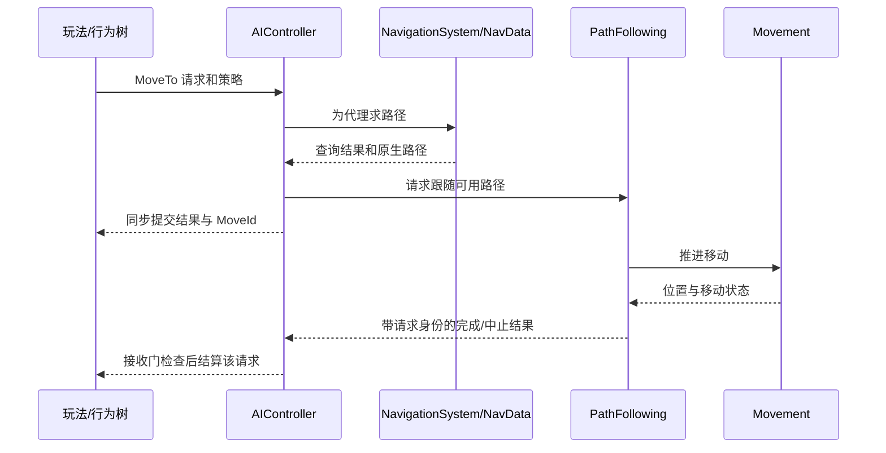
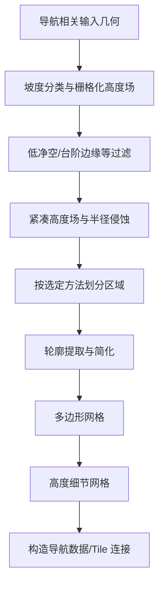
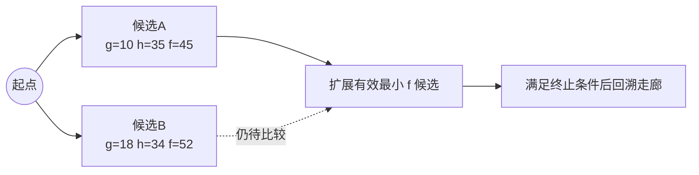
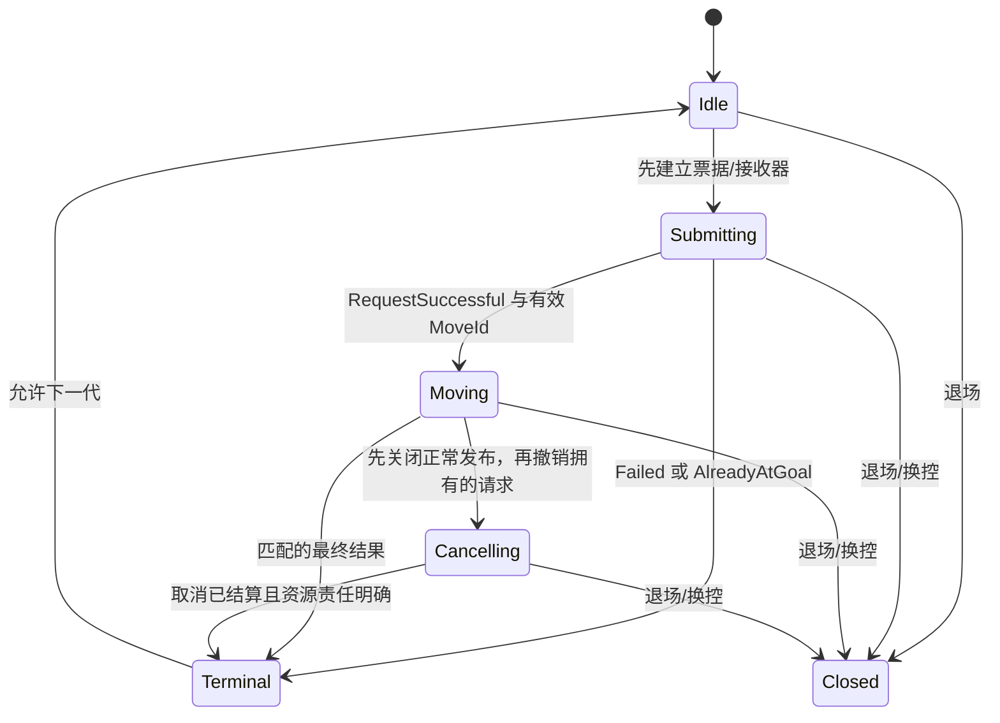
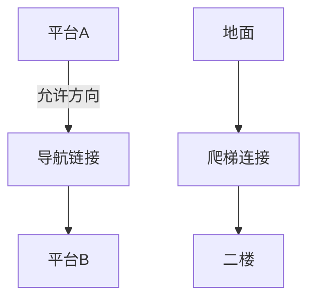
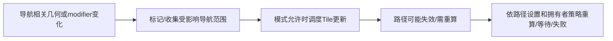
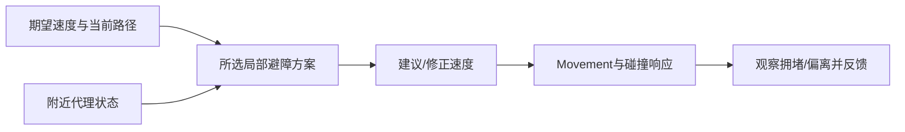

# 03 NavMesh 寻路

> 知识成熟度：L2（主要承诺是官方 API/文档与上游 Recast/Detour 指定版本的静态说明；作者示例和验证计划均未运行）。
> 版本基准：2026-10-09 访问、页面标题标为 Unreal Engine 5.8 的 Epic 公开文档；上游算法对照固定为 Recast Navigation v1.6.0，commit `6dc1667f580357e8a2154c28b7867bea7e8ad3a7`。两者不能当作同一份 UE 内置源码。
> 知识基线：导航生成、查询、跟随和项目生命周期分别按文末来源与显式前提说明；只有公开合同和已读上游节段获得 L2 支持。
> 历史版本声明：旧文记载 UE 5.8.0、CL 55116800、`++UE5+Release-5.8` 和本机 `Engine/Build/Build.version`。本轮未访问该 checkout；公开文档不能认证旧 CL、分支、命令或本机运行结论。
> 适用范围：以 Character/Pawn、AIController、PathFollowing 和 Recast NavMesh 为主的关卡导航；权威执行位置、移动能力、任务所有权由项目确定。其他导航后端、UE4.27 和早期 UE5 需按其接口重新核对。
> 最后更新：2026-10-09（修订生成与代理参数、投影/可达性、过滤成本、异步查询、移动请求和动态链接生命周期）。
> 验证边界：仅资料阅读与文档静态检查；未运行 UE/UHT/C++、蓝图/PIE、导航/AI、物理、纸模型、设备/配置、网络探测或性能压力测试。以下推演是设计预期，不是实测。

## 1. 为什么有网格还不等于能到达

守卫要从大厅追到二楼阳台，至少有五个问题：空间是否为这个体型生成了导航数据；起终点是否落在正确楼层；过滤规则是否允许通行；本次路径是否到达所需终点；Pawn 是否实际完成移动。NavMesh 主要表达可通行空间及连接，不能替这些问题统一返回一个“成功”。

导航网格把适合导航的几何简化为多边形及邻接关系，减少对原始场景几何直接搜索的成本。常规 UE 导航数据由碰撞几何生成，并以 Tile 支持局部更新。查询在数据与过滤规则上求路径，PathFollowing 推进移动，Movement 负责运动，局部避障再调整运动选择。这些工作会互相影响，但各自的成功条件不同。[导航概览](https://dev.epicgames.com/documentation/en-us/unreal-engine/navigation-system-in-unreal-engine)

| 对象/概念 | 本文职责 | 不能由它单独证明什么 |
| --- | --- | --- |
| `UNavigationSystemV1` | 管理 World 内导航数据与查询入口 | 所有 Pawn 使用同一份默认 NavData |
| `ANavMeshBoundsVolume` | 限定导航构建范围 | 体积内任意点均可走、已加载或已生成 |
| `ARecastNavMesh` / Tile | 一种具体导航数据及其局部组织 | Tile、垂直 Layer、Supported Agent、World Partition Cell 是同一概念 |
| Agent 参数 | 选择适配体型/能力的数据与生成约束 | 修改查询半径会即时重烘焙旧网格 |
| `UNavArea` / Query Filter | 区域分类、排除和代价 | 高代价就是禁止通行 |
| `FPathFindingQuery` | 起终点、NavData、代理、过滤器、partial 等输入 | 构造 query 就投影成功或找到路 |
| `FNavigationPath` / `FNavMeshPath` | 原生路径、状态及 NavMesh 走廊等数据 | 非空共享指针就是完整、当前可用路径 |
| `UNavigationPath` | 提供 UObject/蓝图可用的路径入口 | 每次原生 MoveTo 都必须经由该 UObject |
| `AAIController` / `FAIMoveRequest` | 发起一个移动意图 | 请求接收成功就是到达目标 |
| `UPathFollowingComponent` | 跟随路径、检测进展并报告移动结果 | 它替项目完成攻击、攀爬动画或门锁逻辑 |
| `ANavLinkProxy` | 提供非连续区域间的导航连接 | 建连后自动具备跳跃/爬梯能力 |
| RVO / Detour Crowd | 局部避让与群体移动选择 | 永不相撞、不会卡住或永久可达 |

### 1.1 从查询到完成的数据流



图是职责示意，不是本轮逐行核实的 UE 调用栈，也不保证所有完成事件都晚于 MoveTo 返回。完整查询和移动可能各自失败；仅调用 `FindPathAsync` 不会触发 Pawn 移动。原文把 `UNavigationPath` 放在 `OnMoveCompleted` 的必经链上，这里改为原生路径与 PathFollowing 的职责关系。[AAIController](https://dev.epicgames.com/documentation/en-us/unreal-engine/API/Runtime/AIModule/AAIController)、[PathFollowing](https://dev.epicgames.com/documentation/en-us/unreal-engine/API/Runtime/AIModule/UPathFollowingComponent)

## 2. NavMesh 生成：代理的空间，而非可见地板的复印件

Recast 先栅格化输入三角形，再过滤和压缩高度场，按代理半径侵蚀可走边界；之后分区、提取轮廓、构造多边形和高度细节。**轮廓在多边形之前**，DetailMesh 主要补充高度采样，不能把它当成另一次全球路径搜索。[Recast 生成说明](https://recastnav.com/group__recast.html)



这保留旧文的烘焙流程图用途，补上了净空和半径的因果关系。上游 `Sample_SoloMesh.cpp` 的 `handleBuild` 展示 Watershed、Monotone、Layers 等分支；不能把“分水岭”写成唯一方法，也不能把上游示例的选项直接当成 UE 同名配置。UE 的公开设置另列 Region/Layer Partitioning 的 Monotone、Watershed、Chunky Monotone。[固定上游示例](https://github.com/recastnavigation/recastnavigation/blob/6dc1667f580357e8a2154c28b7867bea7e8ad3a7/RecastDemo/Source/Sample_SoloMesh.cpp#L427)、[UE 设置](https://dev.epicgames.com/documentation/en-us/unreal-engine/navigation-mesh-settings-in-the-unreal-engine-project-settings)

### 2.1 参数怎样改变通行能力

| 参数 | 作用及检查方向 | 典型错误 |
| --- | --- | --- |
| Cell Size / Cell Height | 水平/垂直离散精度；和场景细节、烘焙时间/内存一起评估 | 当作 Agent Radius/Height；只缩小精度而不查真实净空 |
| Agent Radius | 为身体宽度留出边界间隔 | 小代理网格直接给宽车辆用 |
| Agent Height | 对地面上方净空提出约束 | 把净空理解成“下方有支撑”就足够 |
| Max Step Height / Max Slope | 表达生成时台阶/坡面限制 | 与 Movement 实际步高、坡度能力不一致 |
| Tile Size | 改变局部构建/加载粒度和管理成本 | 认为越小就必然越快 |
| 区域/轮廓简化参数 | 调整区域保留、边界和图规模 | 在已被过滤掉的窄门上期待路径平滑恢复通路 |

原文的 Radius=34、Height=144、Step=45、Slope=44°、CellSize=19～25、CellHeight≈10、TileSize≈1024 和 Medium 均保留为**旧示例取值记录**，不再宣称是跨模板/版本默认值。项目应记录自身 Supported Agents、Capsule 与 Movement 参数，以及所选 NavData 的实际设置。[参数定义](https://recastnav.com/structrcConfig.html)

多个体型可以配置适配的导航数据，但“一个 agent profile”不等于“一个垂直 Tile Layer”。Agent 改变后要重新匹配数据；查询时 `GetNavDataForProps` 可能找不到匹配数据，默认 NavData 也可能与本 Pawn 不适配。应把无匹配数据作为可诊断失败，不能立即解引用默认数据。[数据匹配 API](https://dev.epicgames.com/documentation/en-us/unreal-engine/API/Runtime/NavigationSystem/UNavigationSystemV1)

**预期反例**：让窄走廊对小体型可走，对大体型不可走。若大体型也找到同一条路，先查拿到的 NavData 与真实 Capsule，而不是认定 A* 错了。即使导航图允许通行，实际碰撞仍可能因资产、移动姿态或动态变化不匹配而阻塞。

## 3. 投影、可达、完整路径和到达是四层判定

`ProjectPointToNavigation` 按给定范围、NavData/代理和过滤器寻找导航位置，返回是否得到投影。它不是从当前 Pawn 出发的连通性证明，也不是精确向下投射到视觉地板的物理射线。[投影入口](https://dev.epicgames.com/documentation/en-us/unreal-engine/API/Runtime/NavigationSystem/UNavigationSystemV1)

例如楼上阳台和楼下地面都在搜索范围内：得到一个导航点不代表它属于用户想去的楼层。项目需检查投影位移、高度、允许的楼层/区域与目标业务意义；不能靠无限扩大 Extent 消灭失败。起点建议来自代理导航位置的定义，不能默认任何 Actor 原点都在脚底。

| 层 | 应检查 | 通过仍不保证 |
| --- | --- | --- |
| 输入与投影 | 有效 World/Pawn/目标；有限坐标；合适 extent；匹配数据和同一过滤策略；投影返回值 | 起终点相互连通 |
| 查询 | 查询结果枚举、path 存在、路径有效/就绪，partial 与限制状态符合策略 | Pawn 已移动；数据之后不变 |
| 跟随 | 对应 MoveId 的最终 `FPathFollowingResult`，以及是否已被替换/取消 | 原始业务目标可交互 |
| 业务 | 本次目标仍有效；距离、楼层、视线、门锁等实际要求 | 可跳过下一次动作的前置检查 |

**partial 必须有业务身份**。它允许返回未通向完整终点的路径；用途可以是走到一个可达前缀，再等待/搜索/换目标。不能把它固定解释为世界空间的“最近可达点”，也不能在到达前缀后直接攻击原目标。要求抵达特定交互点的任务通常应拒绝 partial，或将它单独返回为 Partial/NeedsReplan。[query 开关](https://dev.epicgames.com/documentation/en-us/unreal-engine/API/Runtime/NavigationSystem/FPathFindingQuery)、[路径状态](https://dev.epicgames.com/documentation/en-us/unreal-engine/API/Runtime/NavigationSystem/FNavigationPath)

`NavPath.IsValid()` 是共享指针判定；`NavPath->IsValid()` 是路径对象自己的状态查询。名字相同不等于职责相同。还应按用途检查 `IsPartial()`、`IsReady()`、`IsUpToDate()` 等；保留一个共享指针不能冻结导航数据、目标位置和任务身份。自动重算也取决于路径的 invalidation/recalculation 设置。[路径 API](https://dev.epicgames.com/documentation/en-us/unreal-engine/API/Runtime/NavigationSystem/FNavigationPath)

如果只要存在性，`TestPathSync` 不返回路径。尤其官方注明其 Hierarchical 模式忽略 QueryFilter，因此这条快速检查不能充当“按沼泽禁行过滤器一定可达”的证据。需要同策略精确判断时，应使用相符的普通查询并检查结果；不要推广成所有 hierarchical API 都同样忽略过滤器。[TestPathSync 合同](https://dev.epicgames.com/documentation/en-us/unreal-engine/API/Runtime/NavigationSystem/UNavigationSystemV1/TestPathSync)

## 4. 搜索路径与提取拐点：保留 A* 模型的正确边界

原文的 `f(n)=g(n)+h(n)`、Open Set、父指针回溯、`h=0` 对应 Dijkstra，仍是理解图搜索的有效入口。`g` 是当前已知到达代价，`h` 是剩余代价估计；有更好 `g` 时要更新节点，适用时允许重开。标准最优性依赖有限非负边权、适配的启发、正确出队/松弛与终止条件，不能仅凭“使用欧氏距离”保证。



图中的数值只解释相同代价单位下的比较，不是对任何真实地图的运行记录，也未单独执行纸模型。更接近真实代价的启发不必然使墙钟耗时更低；计算启发本身也有成本。

本轮实际静态读了上游 v1.6.0 `dtNavMeshQuery::findPath`：Open/Closed 标志、过滤邻接、多边形边界上的代表位置、代价与启发组合、改善时更新/重新打开节点，以及 `DT_PARTIAL_RESULT` / `DT_OUT_OF_NODES`。这支持**该上游实现**的解释，不证明 UE 5.8 任意 NavData/模式走同一实现。UE 项目的启发缩放、预算和定制过滤需另核对。[固定实现位置](https://github.com/recastnavigation/recastnavigation/blob/6dc1667f580357e8a2154c28b7867bea7e8ad3a7/Detour/Source/DetourNavMeshQuery.cpp#L973)

图搜索得到多边形走廊后，`findStraightPath` 才在指定走廊内提取直线路径点；漏斗/拐点处理不能重新找到所有可能走廊中的全局连续最短路。输入走廊、portal、off-mesh link 与高度处理均会影响结果。不要把“走廊内变直”描述成“搜索时边中点直接产生全局最优平滑路径”。[Detour 查询接口](https://recastnav.com/classdtNavMeshQuery.html)

便宜区域也会改变启发下界。若某段长度为 10、实际代价倍率为 0.5，未经缩放的距离 10 就可能高于剩余代价 5；这是数学上的反例条件，不是本轮 UE 实验。上游过滤器文档也提示小于 1 的代价修饰可能影响 A*。UE 的可配置范围不等于任意配置都有最优性保证。[上游过滤器合同](https://recastnav.com/classdtQueryFilter.html)

算法证明与已有局部实现证据继续见 [A* 算法与优化](../../02-数学与游戏算法/路径搜索与导航/02-A星算法与优化.md)。该文已有的队列/终止测试与性能记录仍有自己的价值；它们不自动成为本篇 NavMesh 构建、查询延迟或群体移动的证据。

## 5. 区域、过滤和成本：偏好与禁止分开

`UNavArea` 定义区域的默认属性，查询过滤器可以覆盖特定区域的 travel cost、entering cost 或排除状态。同一片沼泽可以让普通守卫绕行，让蹚水者正常通过；增加成本仍允许经过它，只是改变路径偏好。[区域 API](https://dev.epicgames.com/documentation/en-us/unreal-engine/API/Runtime/NavigationSystem/UNavArea)、[过滤定义](https://dev.epicgames.com/documentation/en-us/unreal-engine/API/Runtime/NavigationSystem/UNavigationQueryFilter)

对某类 AI 禁行，用它的过滤器排除区域；对导航数据本身不可走的空域，可按需求使用 `UNavArea_Null`。过滤器对 NavMesh 的标记生效，不替代实际碰撞或游戏规则。烘焙已删除的通路也不会因为降低查询代价而重新出现。[排除/覆盖字段](https://dev.epicgames.com/documentation/en-us/unreal-engine/API/Runtime/NavigationSystem/FNavigationFilterArea)、[Null Area](https://dev.epicgames.com/documentation/en-us/unreal-engine/API/Runtime/NavigationSystem/UNavArea_Null)

### 5.1 C++ 区域与过滤器示例

以下是作者写的**配置与成员函数节选，未编译**。工程需先分别声明 `UNavArea_Swamp : UNavArea` 与 `UNavFilter_SwampTolerant : UNavigationQueryFilter` 的 UCLASS、构造函数和各自 generated header；Swamp 类还声明 `virtual float GetFixedAreaEnteringCost() override;`。声明、导出宏、UHT 与模块依赖仍由实际项目验证。这里只展示配置数据，未伪装成能独立编译的完整宿主。相关头文件为 `NavAreas/NavArea.h` 与 `NavFilters/NavigationQueryFilter.h`，两者属于 NavigationSystem。

```cpp
// UNavArea_Swamp 构造函数的函数体节选
DefaultCost = 3.0f;
```

```cpp
// 单独的成员函数实现；采用公开类页列出的虚函数入口
float UNavArea_Swamp::GetFixedAreaEnteringCost()
{
    return 10.0f;
}
```

```cpp
// UNavFilter_SwampTolerant 构造函数的函数体节选
FNavigationFilterArea SwampOverride;
SwampOverride.AreaClass = UNavArea_Swamp::StaticClass();
SwampOverride.bIsExcluded = false;
SwampOverride.bOverrideTravelCost = true;
SwampOverride.TravelCostOverride = 1.0f;
SwampOverride.bOverrideEnteringCost = true;
SwampOverride.EnteringCostOverride = 0.0f;
Areas.Add(SwampOverride);
```

保留了旧例“区域默认 3 倍、进入额外 10；蹚水者覆盖”的用途，补齐两种成本各自的覆盖开关。当前类页列出 `GetFixedAreaEnteringCost`，未列出旧例直接赋值的同名数据成员，因此此处用虚函数入口而不认证旧字段可见性。只把 travel cost 调回 1 而留下进入费，不等于完全恢复普通地面的代价。数值仅为教学选择；进入费如何作用于具体图转换应以实际后端为准，不把它当作视觉沼泽只收一次的门票。

应用到 `NavModifierVolume`/组件的 Area Class 后，还要在该次 MoveRequest/Query 指定过滤类。取得共享过滤器的输入是 **NavData** 和 Querier，不是 `UNavigationSystemV1`；返回 `FSharedConstNavQueryFilter` 不允许直接修改共享 const 对象。旧 `FNavQueryFilter` 返回类型与 `SetAreaCost(UClass*, ...)` 混用的写法撤下；低层 area ID 与 UClass 也不是同一种身份。

```cpp
// 调用面节选：NavData、Pawn、FilterClass 已按第 6 节验证
const FSharedConstNavQueryFilter Filter =
    UNavigationQueryFilter::GetQueryFilter(*NavData, Pawn, FilterClass);
```

本例配置在具体过滤类中，避免修改缓存过滤对象污染别的 AI。若运行时策略变化，应更新项目策略版本并重新查询；共享/缓存路径的键至少要区分 NavData、agent profile、过滤策略版本、起终点、partial 策略和导航失效状态。不能把一条 Pawn 的活动跟随路径直接交给所有 Pawn 共用。

## 6. 只求路径：同步和异步各有入口

### 6.1 所有示例共同的调用前提

下述节选使用已经准备好的局部变量，不隐含一套未定义的通用管理器。集成者必须先完成以下检查：

1. 在项目允许的导航调用线程与有效玩法期间取得当前 World、NavigationSystem、当前受控 Pawn；本文适配器所有玩法状态变更在游戏线程串行进行。回调来自何线程不能凭 `Async` 名称推断，应按实际版本确认，必要时在适配层转送，转送后再验证身份。
2. `AgentProps` 来源于实际 Pawn 的导航能力配置；`NavData` 与它匹配且在同一 World。没有合适数据/未加载就返回明确的 NotReady/NoNavData，不立即解引用 `GetDefaultNavDataInstance()`。
3. `RawStart`、`RawGoal`、`ProjectionExtent` 为有限值；extent 在项目合理范围内。按选定 NavData、同一过滤器投影，并检查返回值与楼层/位移限制；失败时不得使用未初始化的 `FNavLocation`。
4. `FilterClass` 是该任务明确选用的具体查询过滤类，`Filter` 有效；目标语义、partial 策略、终点须可导航与成本/节点预算已确定。NavData 与 Filter 不能在检查后偷偷换成默认项。
5. 保存用于对账的 World/Pawn/目标身份、玩法期间、请求代次与策略版本；请求数据和回调存储不借用栈上引用、临时 UObject 裸指针或会提前复用的槽位。

示例调用面如下；节选用 `return` 表明停止提交，完整调用者还需返回或记录具体业务失败原因：

```cpp
// 在返回 void 的准备函数内；对象/线程/finite/范围前提见上文
if (!NavSys || !Pawn || !NavData || !Filter.IsValid())
{
    return; // 调用者需记录具体 preflight 失败原因
}
FNavLocation StartOnNav;
FNavLocation GoalOnNav;
if (!NavSys->ProjectPointToNavigation(
        RawStart, StartOnNav, ProjectionExtent, NavData, Filter)
    || !NavSys->ProjectPointToNavigation(
        RawGoal, GoalOnNav, ProjectionExtent, NavData, Filter))
{
    return;
}
// 此处仍要执行项目的楼层/投影距离/目标语义判定，失败则返回
FPathFindingQuery Query(Pawn, *NavData,
    StartOnNav.Location, GoalOnNav.Location, Filter);
Query.SetNavAgentProperties(AgentProps);
Query.SetAllowPartialPaths(false);
Query.SetRequireNavigableEndLocation(true);
```

这是投影到明确点的示例。若使用 Actor 目标跟踪，目标后来移动会改变问题，不能把首次投影的点当作永久 Actor 位置。具体 API 构造参数、默认参数及 include 在目标版本编译前还须核对。[FPathFindingQuery](https://dev.epicgames.com/documentation/en-us/unreal-engine/API/Runtime/NavigationSystem/FPathFindingQuery)

### 6.2 同步查询

```cpp
// 接续已验证的 Query；该调用返回时取得结果，会占用调用线程时间
const FPathFindingResult Found =
    NavSys->FindPathSync(AgentProps, Query, EPathFindingMode::Regular);
if (Found.Result != ENavigationQueryResult::Success
    || !Found.Path.IsValid()
    || !Found.Path->IsValid()
    || !Found.Path->IsReady()
    || !Found.Path->IsUpToDate()
    || Found.Path->IsPartial())
{
    return; // 本例只接受完整的当前可用路径；由调用者记录分支原因
}
// 现在才可读取路径点或把路径交给明确的消费者；不自动移动 Pawn。
const TArray<FNavPathPoint>& Points = Found.Path->GetPathPoints();
// Points 只在其路径对象存活且没有并发修改的使用范围内借用。
```

旧“异步查询”例虽创建了 Delegate，实际执行 `FindPathSync` 且没有消费返回结果；它既不会因此变成异步，也不会调用那个未传入的 delegate。上述返回结果与路径 API 需包含目标版本适用的 `NavigationData.h` 等声明；不跨异步借用局部 `Points` 引用。同步查询可以作为一次性诊断/低频查询选择，但需测量真实成本，不能以“只一行”推断开销小。[同步入口清单](https://dev.epicgames.com/documentation/en-us/unreal-engine/API/Runtime/NavigationSystem/UNavigationSystemV1)、[结果结构](https://dev.epicgames.com/documentation/en-us/unreal-engine/API/Runtime/NavigationSystem/FPathFindingResult)

### 6.3 异步查询的调用面与接收门

```cpp
// 互斥替代上节同步调用，不要两者重复提交。
// ResultDelegate 必须已绑定到拥有独立票据的有效接收器。
const uint32 QueryId = NavSys->FindPathAsync(
    AgentProps, Query, ResultDelegate, EPathFindingMode::Regular);
```

公开 API 返回 `uint32` 查询 ID，处理完成后通过 delegate 交付，失败也会回调。它是**导航查询 ID**，不是 `FAIRequestID` 移动 ID。调用并不保证每个阶段零阻塞，也没有由该页面给出的最坏时延。[FindPathAsync](https://dev.epicgames.com/documentation/en-us/unreal-engine/API/Runtime/NavigationSystem/UNavigationSystemV1/FindPathAsync)

为了保存旧例“异步得路径、绘制/自定义移动”的用途，下表给出完整的**项目适配合同**。它是作者设计，不是声称读到了引擎内部的线程和取消实现。

| 时点 | 接收器必须做的事 | 失败/迟到边界 |
| --- | --- | --- |
| 提交前 | 为本次请求建立不可变票据：World、弱 Pawn/Owner、玩法期间、代次、目标/策略版本；状态先置 Submitting | 先验失败只结算此请求，不产生等待中的假查询 |
| Delegate 建立 | 接收器/票据的存储能覆盖回调寿命；不抓局部 `Query&`、`OwnerComp&`；回调入口可以安全地排队值/路径共享引用 | 弱引用不保活；Owner 销毁或 EndPlay 后仍可安全丢弃 |
| 返回 ID 前有结果 | 若适配实现可能同步/重入交付，先在本票据中缓冲；返回后核对交付 ID 和返回 ID，再结算一次 | 不把上一条查询回调误配给“当前请求”；不假定 ID=0 的意义已由本文核实 |
| 正常返回 | 记录 API 返回 ID，按目标版本真实的提交失败/无效 ID 合同判定 Pending 或失败 | 该页面未列出所有即时拒绝语义；生产适配需补实际版本核对 |
| 结果到达 | 在串行接收点核对票据、ID、当前 Pawn/World/玩法期间、目标与策略仍匹配；再查结果和路径/partial/时效 | 不匹配只清理该旧请求资源，不改新请求状态或黑板 |
| 逻辑取消/换目标 | 先使票据不能发布，再按已核实的后端能力申请取消；清理自己的观察/队列入口 | “不再接受结果”不等于 CPU 查询已停止；不要把取消写成静默无回调 |
| 退场/换控 | 禁止新请求、推进玩法期间、失效旧票据；接收器的收尾责任能独立于旧 Pawn 存活 | 不能等待 GC 才失效，也不能因弱对象还能解析就向新玩法期间发布 |

**异步取消的已核对边界**：2026-10-09 19:17 UTC 重新阅读 [`UNavigationSystemV1` 官方 5.8 类页](https://dev.epicgames.com/documentation/en-us/unreal-engine/API/Runtime/NavigationSystem/UNavigationSystemV1)，Public Functions 列出 `void AbortAsyncFindPathRequest(uint32 AsynPathQueryID)`，公开合同是从待处理寻路请求队列移除指定查询。独立详情页访问失败不否定这一类页合同。应用时先使本次票据不能发布，再在原 NavigationSystem/World 仍可安全访问的前提下，用自己持有、且按目标版本确认有效的**查询 ID**请求队列移除；不能混用移动的 `FAIRequestID` 或取消别的拥有者的请求。

该 `void` 返回值不是查询已终结的确认；类页没有保证已经开始的后台工作被抢占停止、返回后回调静默，或完整线程/存储销毁顺序。逻辑失效之后仍可能有迟到结果，必须只清理旧请求资源且不向新期间发布；也不能反向假定被移出队列的请求一定会再给完成回调。仍被操作使用的存储需保留到实际版本合同允许释放，取消后的收尾不能只靠一个未经保证的回调。若项目必须确认后端停止才能释放自有存储，应先补齐实际取消/完成合同，否则不要提交依赖该保证的查询。本文没有提供可运行取消包装器或宣称后端已停止。

该限制不妨碍说明真正的异步入口，但本节不是可直接上线的异步服务实现。请求接收、线程转送、ID 无效值、退出排空与销毁顺序均须在实际宿主中落实。`BindUObject` 或弱 UObject 只解决一部分对象失效，不自动解决换 Pawn、World 或任务代次。

### 6.4 结果绘制也要有生命周期

在接收门和路径判定通过后，可遍历 `GetPathPoints()` 画短时点/线，或交给另一个明确拥有移动权限的系统。绘制必须在有效 World 上执行，调试图使用有限寿命，退出时停止刷新；原例永久 `DrawDebugSphere(..., true)` 不适合作为无限重复查询的默认行为。调试路径不能证明实际胶囊可以穿过，更不能把画线当成移动完成。[路径点 API](https://dev.epicgames.com/documentation/en-us/unreal-engine/API/Runtime/NavigationSystem/FNavigationPath)

## 7. MoveTo：同步提交结果、异步移动结果和取消

### 7.1 先分清 API 返回值

| API/事件 | 返回或携带内容 | 用途 |
| --- | --- | --- |
| `MoveToActor` / `MoveToLocation` | `EPathFollowingRequestResult::Type` | 便捷提交；不能直接读取 `.Code` / `.MoveId` |
| `MoveTo(const FAIMoveRequest&, FNavPathSharedPtr*)` | `FPathFollowingRequestResult`，有 `Code`、`MoveId` | 需要原生移动 ID 的提交 |
| `OnMoveCompleted` / `OnRequestFinished` | 请求 `FAIRequestID` 与最终移动结果 | 对已拥有请求的完成结算 |
| `FindPathAsync` 的返回值 | `uint32` 查询 ID | 仅属于路径查询命名空间 |

[MoveToActor 合同](https://dev.epicgames.com/documentation/en-us/unreal-engine/API/Runtime/AIModule/AAIController/MoveToActor)、[AAIController 重载](https://dev.epicgames.com/documentation/en-us/unreal-engine/API/Runtime/AIModule/AAIController)、[提交结果结构](https://dev.epicgames.com/documentation/en-us/unreal-engine/API/Runtime/AIModule/FPathFollowingRequestResult)

Actor 目标会随目标移动更新目的位置；Location 目标表达一个位置。`bUsePathfinding=false` 的便捷调用会采用直线方式，不能作为“导航仍会绕墙”的设置。`bStopOnOverlap` 会把 Pawn 半径纳入接受半径；FAIMoveRequest 还区分目标半径是否参与 reach test。[MoveToActor 参数](https://dev.epicgames.com/documentation/en-us/unreal-engine/API/Runtime/AIModule/AAIController/MoveToActor)、[FAIMoveRequest](https://dev.epicgames.com/documentation/en-us/unreal-engine/API/Runtime/AIModule/FAIMoveRequest)

### 7.2 一次有身份的移动

示例为 AIController 内的调用节选。前提是有效且已被该控制器控制的 Pawn、匹配导航数据、可移动组件、有效目标，同一玩法期间中**只有一个已指定的移动所有者**。不要让自定义代码、行为树内置 Move To 与其他任务同时争抢同一 PathFollowing。示例选择必须完整到达、接受半径 80 cm、不加入双方半径；80 只是例值。

```cpp
// 先完成当前移动所有权交接和接收器安装，再执行此片段。
FAIMoveRequest Request(Target);
Request.SetUsePathfinding(true);
Request.SetAllowPartialPath(false);
Request.SetAcceptanceRadius(80.0f);
Request.SetReachTestIncludesAgentRadius(false);
Request.SetReachTestIncludesGoalRadius(false);
Request.SetCanStrafe(true);
Request.SetNavigationFilter(FilterClass);
const FPathFollowingRequestResult Submitted = MoveTo(Request, nullptr);
// Submitted.Code 与 Submitted.MoveId 交给下述提交/完成状态机。
```

本片段未声称“拿到 Result 后再 AddUObject 就足够”。接收器应在提交前已就位，可选覆盖 `OnMoveCompleted` 并保留基类行为，或一次性按句柄订阅 `OnRequestFinished`；避免两条都结算业务或每次 MoveTo 都重复订阅。委托撤销使用自己保存的句柄，不能清空组件所有监听。

| 同步提交 Code | 当前请求如何处理 |
| --- | --- |
| Failed | 提交失败，结算一次并停止等“正常抵达”；不把旧请求的完成当作本次成功 |
| AlreadyAtGoal | 当前导航 reach test 已满足，可同步结算；业务交互条件仍需核验 |
| RequestSuccessful | 记录有效的 MoveId，进入等待移动结果；不立即攻击或标记抵达 |

这些枚举和最终结果是不同类型。[提交枚举](https://dev.epicgames.com/documentation/en-us/unreal-engine/API/Runtime/AIModule/EPathFollowingRequestResult__Typ-)。最终结果包括 Success、Blocked、OffPath、Aborted、Invalid；失败日志可记录枚举整值和请求身份，保留旧文把非 UENUM 结果改为整值输出的正确贡献。[移动结果枚举](https://dev.epicgames.com/documentation/en-us/unreal-engine/API/Runtime/AIModule/EPathFollowingResult__Type)

### 7.3 同步回调、替换、取消与退场的完整责任

下图的 epoch/generation 是项目自己的票据，不是新增的 UE API。实际接收器应把 World、Pawn、玩法期间、移动代次与 MoveId 一起核对：



具体规则如下，避免只画状态图却漏掉调用顺序：

- **进入 Submitting 前**，若已有旧请求，先撤销旧票据的正常发布资格并完成其所有权交接；旧 MoveId 仍单独保存供取消对账。某个 MoveTo 可能中止活动路径，不能事后才想起旧回调是谁的。
- **提交调用栈内的完成事件**先缓冲在当前提交上下文；返回后仅按返回的 MoveId 匹配。旧 ID、重复事件只处理其自己的收尾。`AlreadyAtGoal` 与即时失败走同步结算，与可能的立即完成事件去重。公开 PathFollowing API 有立即完成入口；本文不把每个版本/重载的内部时序写成已核实。[立即完成接口](https://dev.epicgames.com/documentation/en-us/unreal-engine/API/Runtime/AIModule/UPathFollowingComponent)
- **进入 Moving 后**，仅 `(World, Pawn, epoch, generation, MoveId)` 全部匹配的事件可以结算当前业务；先原子地/串行地从活动态取走本次票据，再通知上层，以免上层回调重入后又清掉新请求。
- **取消时**先标为 Cancelling，使正常成功不能发布，再针对自己持有的有效请求 ID 撤销。`AbortMove` 是带 ID 的路径跟随取消入口；`StopMovement` 中止控制器当前移动，若旧任务盲用它可能停止新的拥有者。它们都不能被当作“不会触发完成回调”。[AbortMove 接口](https://dev.epicgames.com/documentation/en-us/unreal-engine/API/Runtime/AIModule/UPathFollowingComponent)、[StopMovement 定义](https://dev.epicgames.com/documentation/en-us/unreal-engine/API/Runtime/AIModule/AAIController)
- **取消不等于业务失败重试**。Aborted 应结合项目的替换/退场/用户中止原因记录，避免旧取消回调启动下一次追击。取消返回是否足以释放特定资源、是否还需确认，要按实际后端/动画资源合同确定；不编造统一确认回调。
- **UnPossess、Pawn/Controller EndPlay、任务 Abort、流送退场**都先禁止新请求并使旧期间失效，再取消自己拥有的移动、动画、计时器和订阅。必要收尾由仍有效的管理层承担；新 Pawn/new epoch 不继承旧票据。解绑不消除已经排队的事件。
- **外部接管**必须经过同一个所有权仲裁入口。仅检查 `GetCurrentRequestId` 不能代替资源所有权；“当前就是我的”到实际调用之间也不能容许未管理的重入替换。若无法保证串行交接，应使用引擎已有任务框架或完善项目适配器，而不是公开一个万能 MoveTo 包装器。

**预期事件例**：g1 追 A，随后 g2 追 B。先令 g1 不可发布，再取消其 MoveId；g1 的 Aborted/迟到 Success 不能写 g2 的黑板。g2 的提交若 AlreadyAtGoal，只结算 g2 一次；若 RequestSuccessful，只有 g2 对应的最终结果能够完成。这个事件例未运行。与行为树衔接时遵守 [任务完成/中止合同](../感知决策与行为规划/01-行为树详解.md)，不用本文另造第二套 BT 节点内存实现。

## 8. NavLink 与 SmartLink：连接可走图，不自动完成动作

NavLink 把原本不相邻的导航区域连接起来，可表达单向下落、跳跃、桥、梯子或门。连接成立仍需端点落在适配数据上、方向允许、过滤器不排除，以及代理真正具有相应运动能力。



Simple Link 与 Smart Link 可同时存在于一个 `ANavLinkProxy`；Smart Link 至多一个，有启用/禁用状态及各状态的 Area Class。`SetSmartLinkEnabled(false)` 改变状态，**不能无条件解读为通道消失**：禁用态区域如果仍允许通过，或者同位置另有 Simple Link，查询仍可能找到连接。为关闭通道须配置对应的不可走区域/过滤策略并检查旁路，也不能保证所有正在移动的代理“立即重新寻路”。[NavLinkProxy 合同](https://dev.epicgames.com/documentation/en-us/unreal-engine/API/Runtime/AIModule/ANavLinkProxy)

```cpp
// 调用节选：Link 是同一 World 内已验证的代理，禁用态配置符合业务。
Link->SetSmartLinkEnabled(bBridgeIntact);
// 完成属于该 Link、Agent 和移动期间的实际穿越后，才允许：
Link->ResumePathFollowing(Agent);
```

后一句不是紧接开关立即调用的代码；它属于该 Agent 的穿越完成分支。`ResumePathFollowing` 在这里是 **Proxy 的带 Agent 参数接口**，不是随手在 PathFollowing 上调用同名无参函数。其目的仅是交还路径跟随控制，不能伪装成播放跳跃、瞬移或抵达验证。

### 8.1 保留“BT 跳到链接对面”的用途，改正宿主合同

旧 `UBTTask_JumpNavLink` 片段引用未声明 `NavLinkProxy`、在 Execute 中绑定后永久 InProgress，没有 Finish/Abort/解绑，也没有节点实例隔离。这里保留用途，改为明确的组装方案：

1. 由行为树内置 Move To 或唯一移动所有者推进到 Smart Link；Proxy 的 `ReceiveSmartLinkReached(Agent, Destination)` 是公开蓝图事件入口。项目若选其他委托，先核对其目标版本名称、可见性与签名。
2. 穿越管理器为每个 Agent 保存 Link、World/Pawn、移动 ID/玩法期间、目的位置和自有动作句柄；多人穿越不能共用一个“当前 Agent”字段。
3. 播放实际跳跃/爬梯动作，并确认代理到达允许的落点且仍处于本次穿越，才交还路径跟随。动画播完并不证明碰撞、落地与导航位置满足要求。
4. 动作失败、门关闭、Agent 死亡、换控、BT Abort 或 Link 退场时，先失效正常完成票据；停止本次动作并结算/取消本次移动，清理所属监听。不能对已被新任务接管的 Agent 恢复旧路径。
5. 若仍需自定义潜伏 BT 任务，明确实例化/NodeMemory 策略，准确区分 `FinishLatentTask` 与 `FinishLatentAbort`；它必须观察自己的动作，不能仅等一个全局 Link 事件。详细任务生命期继续由行为树专题负责。

本节是可审查的实现合同，未提供可编译跳跃宿主，也未把旧未完成节选说成工作中的能力。公开依据只覆盖链接入口和交还控制；玩法穿越、动画取消与到达判断为项目责任。

## 9. 动态障碍、避障与流送各自改变什么

### 9.1 Runtime Generation 的选择

| 模式 | 适合的问题 | 明确边界 |
| --- | --- | --- |
| Static | 预先生成并加载的导航数据 | 不用于运行时重建几何变化 |
| Dynamic Modifiers Only | 在已生成导航表面上改变区域/代价/阻塞 | 不在运行时生成全新的可走表面；旋转网格本身不等于已有 modifier |
| Dynamic | 运行时导航相关数据变化后更新受影响 Tile | 更新有调度/生成成本，不能认为设置后变化同帧完成 |

[生成模式和官方 modifier 示例](https://dev.epicgames.com/documentation/en-us/unreal-engine/overview-of-how-to-modify-the-navigation-mesh-in-unreal-engine)

原文的“挂一个通用 DynamicObstacle 组件就自动更新”不作为通用 API。实际要核对具体组件的导航相关性、碰撞导出、NavModifier/Area Class、Runtime Generation 和变化通知路径。`OnNavigationGenerationFinished` 是生成完成通知入口，不是给障碍物改完位置后手动伪造一次通知就完成重建。[导航系统 API](https://dev.epicgames.com/documentation/en-us/unreal-engine/API/Runtime/NavigationSystem/UNavigationSystemV1)



此图保留原文动态更新用途，去掉“每次碰撞变化必立即重建并重寻”的保证。动态物体影响导航和物理碰撞是两个接入面，不能因 Chaos body 会移动就推定导航已更新。查询还可能发生在旧数据可用、更新排队的间隙；项目应有失败、重试节流和停止条件。

### 9.2 RVO 与 Detour Crowd

RVO 在 Character Movement 中进行局部速度避让，不依赖 NavMesh 约束，可能把角色推离导航边界。Detour Crowd 结合走廊优化与速度采样，具有自己的代理数量/配置约束。官方将两种方案作为独立选择，不建议给同一代理叠加两套互相竞争的避障控制。[避障指南](https://dev.epicgames.com/documentation/en-us/unreal-engine/using-avoidance-with-the-navigation-system-in-unreal-engine)



原文“相互错开不重叠”的输出改成运动建议和反馈。避障不能保证窄门通行或解决所有死锁；门关闭、桥断裂等拓扑变化也不能只靠调整速度。临时拥堵可先评估避障、排队与让路策略；长期阻塞按真实几何/区域/连接变化处理。

### 9.3 Tile、World Partition 和大世界

Tile 是导航数据组织/更新单元，区域分割是生成算法步骤，World Partition 管理世界资源流送，三者不应混称“UE5 分区新特性”。World Partition NavMesh 由可加载/卸载的 Navmesh chunk Actors 组成，支持 Static、Dynamic Modifiers Only、Dynamic；其动态生成仅覆盖已加载空间。此次读取的官方页面仍标为 Experimental，项目发版前需核对应版本可用性。[World Partition NavMesh](https://dev.epicgames.com/documentation/en-us/unreal-engine/world-partitioned-navigation-mesh)

导航 Invoker 可以控制附近数据生成范围；它不让未加载世界的全部目的地凭空可达。流送应联查基础导航数据、资源加载、Tile 容量和支持代理，不能把所有流送问题的答案固定成 `Runtime Generation=Dynamic`。设置页面提供 Fixed Tile Pool/Tile Pool 等入口；是否合适及容量需由场景预算确认。

旧 `bUseHierarchicalNavigation`、`bCompressTileData`、`bUseVoxelCache`、`ai.debug.DrawPaths`、旧 `show NavPaths` 被移除、`nav build` 等具体名称/默认值/废弃断言，本轮没有目标 checkout/CVar 注册证据，保留在历史记录中，**不再作为直接执行清单**。公开 `Build()` 入口不证明任意目标构建都支持某控制台命令。压缩、缓存、分层查询仍可作为评估方向，但不得声称已测收益。

## 10. 从最小蓝图实践到性能排查

以下步骤是待执行实践，不是本轮已操作的编辑器结果：

1. 准备有真实碰撞的地面、一个可通行门洞和一处断开的平台；放置 BoundsVolume 覆盖需要导航的范围，核对 Supported Agent 与 Pawn 胶囊/Movement 能力。
2. 通过项目支持的编辑器导航构建流程生成数据，再按 **P 切换导航可视化**。P 是显示开关，不是 Build。官方入门示例可自动随 Bounds 添加/缩放生成，但项目关闭自动更新或运行时模式不同就需单独检查。[Basic Navigation](https://dev.epicgames.com/documentation/en-us/unreal-engine/basic-navigation-in-unreal-engine)
3. 为蓝图 Pawn 指定正确 AIController 和 possession 设置。使用 **AI Move To** 节点时填写 Pawn 与 Destination 或 Target Actor，并消费 On Success/On Fail；不要把它与只返回提交枚举的 Move to Actor/Location 便捷函数混为一种节点。
4. 先验证单个普通目标，再加入不可达、partial、沼泽覆盖和动态门。记录本次请求与最终结果，成功后才推进该请求的业务；失败应停止/有限退避/换目标，不能零延迟无限重发。
5. 需要跳跃时按第 8 节配置 Link 端点、方向与穿越处理；需要群体避障时选一套方案，并检查偏离、拥堵与代理上限。

```text
明确的开始事件
  → 验证当前 Pawn / 目标 / 玩法期间
  → AI Move To
  → On Success：当前请求仍有效时推进业务
  → On Fail：记录原因，按策略停止或有界重试
退出/换控：先使旧请求不能发布，再处理其移动与延迟工作
```

### 10.1 最佳实践与测量边界

- 先定位 **生成成本、查询排队/搜索、路径更新、跟随/Movement、避障、玩法回调** 中哪一项消耗预算，再选择优化；`stat RHI` 不能单独证明导航 CPU 瓶颈。
- 记录版本、地图/碰撞与导航数据、agent/过滤器配置、请求量、同时移动数、失败/partial 比例、队列时间和总响应时间。把冷启动构建、稳定查询、动态门更新峰值分开测量。
- 批量请求可评估节流、分帧和复用；缓存必须有导航/策略失效键。EQS PathingGrid/Pathfinding 自己也会带来导航工作，不能宣传它天然减少重复寻路；EQS 查到可达也不等于之后 MoveTo 必成功。[EQS 职责与所有权](../感知决策与行为规划/02-感知系统与EQS.md)
- 缩小 CellSize 增加精度通常也会增加数据/构建工作；Tile 大小有边界和重建粒度取舍；Bounds 只覆盖需要的数据。避免“越大越安全”或“越小越快”的通用处方。
- 降低 Tick **频率**通常意味着增大间隔，但任意调整 PathFollowing/Movement 的 Tick 会改变运动和响应行为，不能机械套用 0.1～0.2 秒。需先核对该组件设计与玩法允许的延迟。
- 动态区域、链接、避障、路径复用不是可互换的性能开关；保留同一行为合同后才比较收益。本文没有代理容量、P99、缩短耗时比例或可推广的性能结论。

## 11. 常见问题 FAQ

**Q1：烘焙后没有网格 / AI 不动？** 先区分“没生成”“没显示”“无适配代理数据”“有路径但没受控/没移动”。查 Bounds、碰撞与导航相关性、生成/加载状态、正确 NavData 和 P 显示；再查 possession、Movement 与提交/完成结果，不能只重复烘焙。

**Q2：AI 走直线穿墙 / 不绕障碍？** 查 `bUsePathfinding` 是否关闭、是否用自己的位移绕开了 Movement 碰撞，以及当前导航几何是否与碰撞一致。图上有路与真实碰撞能走是两个判定；重新构建也不能修复错误移动权限或禁用碰撞。

**Q3：目标在网格外，MoveTo 失败？** 先定义“到达哪个位置”：合理投影可能足够，跨层断口可能需要 Link 和实际动作；不可达目标应拒绝或返回 partial 策略。投影成功不能证明连通，更不能让 Agent 从楼下隔空到达阳台。

**Q4：到达附近反复抖动？** 查接受半径、双方半径是否纳入、移动目标更新、刹车/旋转、路径边缘和碰撞/避障。50～100 cm 仅是旧文调参例值；`bAllowPhysicsRotationDuringAnimRootMotion` 不作为通用寻路抖动修复。

**Q5：障碍移动了，AI 仍按旧路走？** 对照 Runtime Generation、导航相关性与 modifier 配置、Tile 更新是否完成、路径失效/重算设置，以及更新等待期间的移动策略；不要手动调用“生成完成”通知冒充重建。物理移动不自动保证导航已一致。

**Q6：大量 AI 一起移动很卡？** 分开测请求洪峰、生成峰值、避障与实际运动。先收敛重复发 MoveTo/重复订阅，再评估节流/缓存/群体策略。不能以 A* 局部堆测试或静态图示推断 UE 容量，也不能让所有 Agent 共用一条可变的跟随状态。

**Q7：NavLink 跳跃动作不播放？** 先查端点、方向、匹配 NavData、Link relevancy、启用/禁用 Area 与旁路 Simple Link；再查真实穿越事件是否接入该 Agent 的动作。链接本身不会播放动画。成功穿越后调用 Proxy 的 `ResumePathFollowing(Agent)`，失败则取消自己的动作/移动。

**Q8：世界大、烘焙慢、内存高？** 记录 Cell/Tile/代理数、导航覆盖、加载 Tile 容量和动态更新热点；缩小覆盖、匹配精度、构建/流送策略分别评估。Dynamic 和压缩都不是默认免费优化，具体属性名需核对目标版本。

**Q9：A* 与“看起来最优”不符？** 先比较查询用的实际成本、过滤、partial/搜索限制与导航拓扑，再区分图走廊选择和走廊内平滑。缩小 CellSize 可能修复几何近似，也可能不改变成本策略；不能承诺“调小即可最优”。

**Q10：取消后还收到完成，或者旧 AI 回调影响新 Pawn？** 取消不等于静默。核对查询 ID 与 MoveId 命名空间、epoch/generation、具体 Pawn/World 和结算幂等性；旧结果只收旧资源。不能把当前指针有效当成仍属于本次任务。

## 12. 验证建议与正反例矩阵

所有条目均为 **NOT_RUN**。输入、预期与记录要求用于之后在有授权的 UE 工程内验证，不是本轮已完成的导航测试。

| 编号 | 输入/操作 | 应区分的预期结果与判定 |
| --- | --- | --- |
| N1 | 同一地图，小/大 Agent 过窄门 | 匹配的数据与实际胶囊分别记录；大体型不可借小体型路径宣称能通过 |
| N2 | 两个不连通平台，分别投影成功 | 投影成功但完整路径失败；允许 partial 时不能宣称抵达终点 |
| N3 | 上下楼重叠，扩大/缩小投影 extent | 记录原目标与投影楼层/位移；错误楼层被业务检查拒绝 |
| N4 | 沼泽默认代价、蹚水覆盖、排除三套过滤 | 偏好改变与完全不可通行分开；trace 使用的真实 Filter/NavData |
| N5 | normal 与 hierarchical TestPathSync | 验证过滤约束下的差异，不把忽略过滤的存在性当精确可达 |
| N6 | MoveTo 的 Failed/AlreadyAtGoal/RequestSuccessful | 同步路径一次结算；正常提交后等待对应 MoveId |
| N7 | 提交期间发生完成/旧请求 Aborted；完成回调重入发新请求 | 先缓冲再匹配 ID；结算旧请求不能清空新请求 |
| N8 | 查询 g1 后换目标 g2，g1 迟到 | 旧查询不发布，不修改新票据；仍清理自己的存储 |
| N9 | UnPossess、EndPlay、流送退场/复入 | 旧 World/Pawn/epoch 均不得向新期间写结果；资源责任不悬空 |
| N10 | 关闭 Smart Link，禁用态可走/Null，并有/无 Simple Link 旁路 | 关闭标志不单独证明断路；分别观察图连接与正在穿越者的退出策略 |
| N11 | Smart Link 多 Agent 同时穿越、取消一个 Agent | 每 Agent 的动作与 MoveId 隔离；另一 Agent 不被错误恢复/停止 |
| N12 | Static/Modifiers Only/Dynamic 下改变障碍或增加地板 | 修改已有区域与生成新表面分开；记录更新等待与失败策略 |
| N13 | RVO 窄门/网格边缘与 Detour Crowd 对照 | 拥堵、偏离、碰撞、数量约束均记录；不只看最终截图 |
| N14 | 长路、重复查询、动态门峰值 | 区分排队/搜索/生成/跟随/避障时间，负载与环境一致后才报告收益 |

## 13. 来源核对范围、历史和关联阅读

本轮读过公开资料的相关节段，不声称下载/核对完整 UE 实现。Epic 页面标题提供的是公开文档版本；其中可见的 `Engine/Source/...` 路径只作定位线索，不代表本机文件已访问。

| 来源 | 实际核对的内容 | 不覆盖 |
| --- | --- | --- |
| [Navigation System](https://dev.epicgames.com/documentation/en-us/unreal-engine/navigation-system-in-unreal-engine)、[Basic Navigation](https://dev.epicgames.com/documentation/en-us/unreal-engine/basic-navigation-in-unreal-engine) | 碰撞几何、多边形/Tile、P 显示、AI Move To 示例入口 | 本项目地图或控制台命令可用性 |
| [Navigation Mesh Settings](https://dev.epicgames.com/documentation/en-us/unreal-engine/navigation-mesh-settings-in-the-unreal-engine-project-settings) | Cell/Agent/Tile、partitioning、生成模式与池 | 旧数值为跨版本默认、收益保证 |
| [UNavigationSystemV1](https://dev.epicgames.com/documentation/en-us/unreal-engine/API/Runtime/NavigationSystem/UNavigationSystemV1)、[FindPathAsync](https://dev.epicgames.com/documentation/en-us/unreal-engine/API/Runtime/NavigationSystem/UNavigationSystemV1/FindPathAsync) | NavData 匹配、projection、同步/异步入口和返回 ID，以及按查询 ID 移除待处理队列项 | 私有实现、线程/同步重入顺序、运行中工作停止/取消完成/存储销毁及无效 ID 全合同 |
| [FPathFindingQuery](https://dev.epicgames.com/documentation/en-us/unreal-engine/API/Runtime/NavigationSystem/FPathFindingQuery)、[FNavigationPath](https://dev.epicgames.com/documentation/en-us/unreal-engine/API/Runtime/NavigationSystem/FNavigationPath) | query 参数、partial、路径状态和 invalidation 选项 | 路径永久有效或完整业务可达 |
| [AAIController](https://dev.epicgames.com/documentation/en-us/unreal-engine/API/Runtime/AIModule/AAIController)、[PathFollowing](https://dev.epicgames.com/documentation/en-us/unreal-engine/API/Runtime/AIModule/UPathFollowingComponent) | MoveTo 返回型、完成入口、请求 ID、AbortMove/StopMovement | 通用可编译宿主、所有重载的逐调用顺序 |
| [UNavArea](https://dev.epicgames.com/documentation/en-us/unreal-engine/API/Runtime/NavigationSystem/UNavArea)、[QueryFilter](https://dev.epicgames.com/documentation/en-us/unreal-engine/API/Runtime/NavigationSystem/UNavigationQueryFilter)、[FilterArea](https://dev.epicgames.com/documentation/en-us/unreal-engine/API/Runtime/NavigationSystem/FNavigationFilterArea) | 区域成本、覆盖开关、NavData/Querier 与 const filter | 定制低层过滤器的性能与全局最优保证 |
| [ANavLinkProxy](https://dev.epicgames.com/documentation/en-us/unreal-engine/API/Runtime/AIModule/ANavLinkProxy)、[Modifying NavMesh](https://dev.epicgames.com/documentation/en-us/unreal-engine/overview-of-how-to-modify-the-navigation-mesh-in-unreal-engine) | Simple/Smart、状态区域、带 Agent 的恢复、生成模式 | 自动跳跃、关闭即不可走、即时重寻 |
| [Avoidance](https://dev.epicgames.com/documentation/en-us/unreal-engine/using-avoidance-with-the-navigation-system-in-unreal-engine)、[World Partition NavMesh](https://dev.epicgames.com/documentation/en-us/unreal-engine/world-partitioned-navigation-mesh) | 两种避障边界、chunk 加卸载和模式范围 | 实测规模与本项目可发版性 |
| [Recast v1.6.0 示例](https://github.com/recastnavigation/recastnavigation/blob/6dc1667f580357e8a2154c28b7867bea7e8ad3a7/RecastDemo/Source/Sample_SoloMesh.cpp#L427)、[Detour 同 revision](https://github.com/recastnavigation/recastnavigation/blob/6dc1667f580357e8a2154c28b7867bea7e8ad3a7/Detour/Source/DetourNavMeshQuery.cpp#L973) | 前者过滤/压缩/侵蚀/分区/轮廓/多边形/细节；后者搜索更新和 partial/node-limit | UE 私有 fork、UE API 返回码与上游 flag 的逐一等同 |

**访问失败与未读实现**：`AAIController/MoveTo` 独立详情页返回空内容，已用类页的实际重载表核对；`AbortAsyncFindPathRequest`、`FNavPathQueryDelegate` 独立页及低层 `SetAreaCost` 详情未获得有效内容，未将这些失败改记为成功。`AbortAsyncFindPathRequest` 的待处理队列移除合同来自随后于 2026-10-09 19:17 UTC 重读的类页，不是失败的独立详情页。旧把 NavLinkProxy 放在 NavigationSystem 模块的路径也未成立，现行公开页位于 AIModule。没有访问受限 UE 源码，没有运行上述验证矩阵；`verified: []` 保持。

### 13.1 旧文贡献与可恢复身份

本次保留并重写了六张图的用途（生成、查询/移动、A*、链接、动态更新、避障）、五类代码用途（SmartLink 开关、区域/过滤器、MoveTo、查询/绘制、BT 穿越）、蓝图步骤、最佳实践和全部九个原 FAQ；新增请求身份、partial、取消/退场和来源边界。有效的概念入口、A* 基础模型、沼泽偏好示例、链接跨断口用途和整值日志修正未被否定。

普通教学旧版原文不再与修订后的当前合同混排。完整原 bytes 在本次仓外审阅材料保全，且仍可由原 Git 对象恢复；这只适用于本篇普通教学历史。书籍、工作日志、附件与已有实验记录均未改动。

- [本次修改前的全文](https://github.com/fantuan812/learning/blob/364c2b182bc30827dcc2eea0bce8389bf9bb3858/知识/06-游戏AI/导航移动与群体协同/03-NavMesh寻路.md)：452 行、23963 bytes，Git blob `bdc8d897d18159036437abf95cf6347ae91bdd64`
- [最早教学稿](https://github.com/fantuan812/learning/blob/a90206240792bc881ddbc44374b47733a837107d/游戏知识/05-AI系统/03-NavMesh寻路.md)：初版内容与旧接口写法的历史身份
- 2026-08-05 历史改动把错误的异步调用换成同步调用，但异步标题/回调叙述仍留着；本次明确拆开两种入口。2026-08-06 的本机版本文字、08-14 的 L2 标记、08-20 的 frontmatter、09-03 的互链和10-04 的路径迁移均保留在原提交历史中，不倒填新的运行证明

### 13.2 前后置专题

- [行为树详解](../感知决策与行为规划/01-行为树详解.md)：Move To、任务实例隔离、完成与 Abort
- [感知系统与 EQS](../感知决策与行为规划/02-感知系统与EQS.md)：目标证据、Querier 所有权和点位评分；不替代最终移动与业务判定
- [ZoneGraph 与 SmartObjects](06-ZoneGraph与SmartObjects.md)：另一种路网/交互职责，具体版本断言需独立核对
- [行为树与 AI 源码](../感知决策与行为规划/12-行为树与AI源码.md)：进一步源码阅读入口，未被本篇公开 API 阅读认证
- [A* 算法与优化](../../02-数学与游戏算法/路径搜索与导航/02-A星算法与优化.md)：搜索与启发合同；已有局部实测按原范围使用
- [NavMesh 工程：Recast 与 Detour](../../02-数学与游戏算法/路径搜索与导航/03-NavMesh工程Recast与Detour.md)：上游工程与模型证据边界；不冒充 UE 内部实现
- [Actor 与 Component 生命周期](../../03-引擎架构与资源系统/对象模型与生命周期/02-Actor与Component生命周期.md)：退场、复入与对象寿命
- [Chaos 物理引擎概览](../../04-图形动画与物理仿真/物理求解与动力学/01-Chaos物理引擎概览.md)：物理运动/碰撞职责，导航更新需要独立接入

原延伸阅读中的《游戏编程精粹》寻路章节与 GDC 大规模 AI 导航演讲仍作为进一步研究方向；本轮未逐章/逐场核对，不作为上述具体 API 和性能结论的证明。
