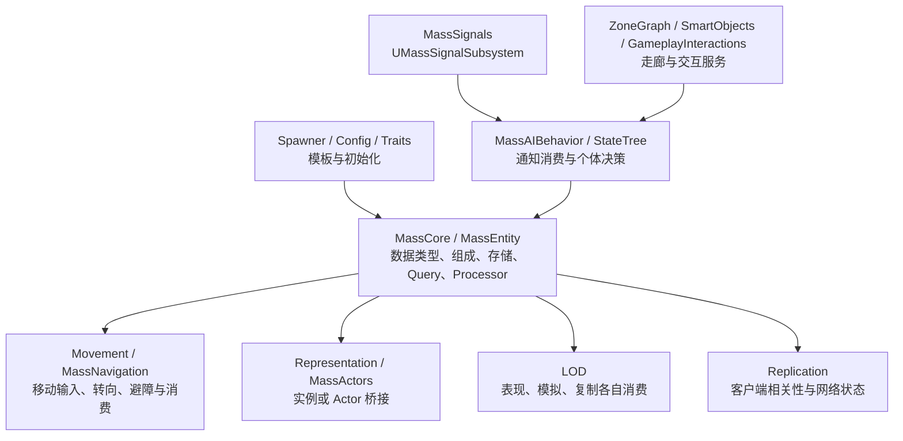
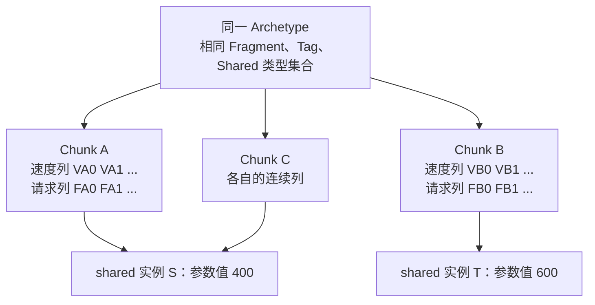
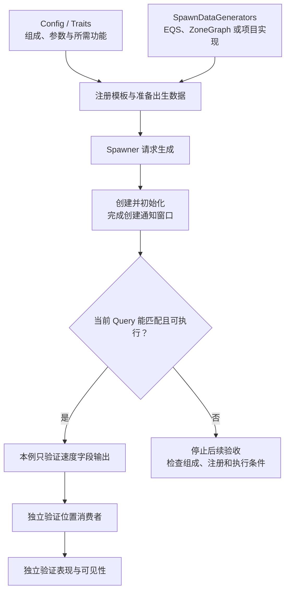
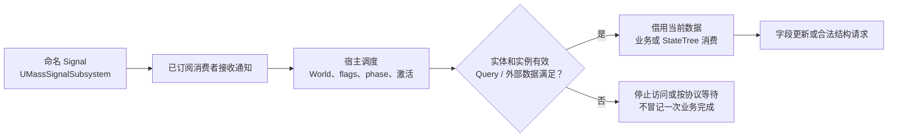
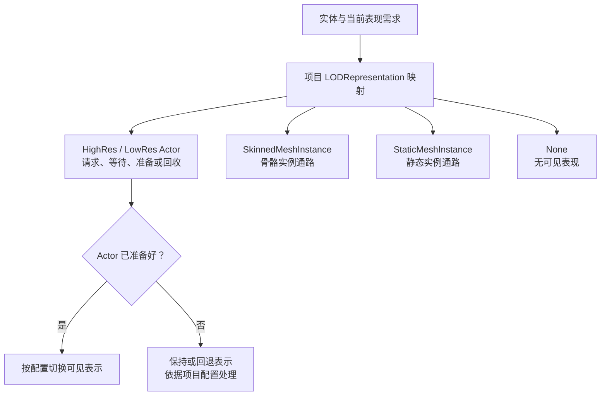

# 04 Mass 实体框架与群集模拟（Mass Entity Framework & Crowd Simulation）

> 知识成熟度：L2。主要承诺是按公开资料解释数据组成、查询访问、生命周期及群体功能的协作边界；C++ 为作者静态候选，纸面轨迹不代表运行结果。
> 版本基线：2026-10-05 核对的 Epic 公开文档/API，页面标识为 Unreal Engine 5.8 Documentation；未访问本文历史声明对应的引擎 checkout，不认证其私有 CL、弃用宏或函数体。
> 最后更新：2026-10-05。重写 Mass 使用合同与目标速度消费例，校准表现、LOD、复制和退出责任，逐字保留九组历史身份记录。

## 0. 先明确要解决的问题

鸟群、人群、车流的许多个体往往做相似计算。如果每次更新都沿对象引用取位置、速度、配置，再分别调用逻辑，间接访问与调度开销可能成为负担。Mass 将同类数据组织成批次，由 Processor 对匹配数据统一计算；它提供组织计算的框架，群集算法、运动约束与项目预算仍需另行实现。

读完本文应能解释：为什么实体明明存在却不匹配 Query；为什么写速度后位置不变；为什么不同 Chunk 仍可能竞争；为什么 Off-LOD、无表现或收到 Signal 都不能单独决定业务是否执行。前置知识是 C++ 结构体、引用寿命和基本读写并发；Boids 三规则另见[移动与群组行为](01-移动与群组行为.md)。

本文把一条完整因果链拆开：**配置组成 → 创建与初始化 → Query 匹配和访问 → 更新数据 → 运动/表现消费者 → 退场清理**。第 5 节的代码只闭合“已准备目标速度 → 当前速度 Fragment”，不实现邻居搜索、三规则求和、避障、位置积分或可见鸟群部署。选择这条窄链，才能把输入、权限、输出及拒绝分支逐一讲清。

证据也分三层：公开页面支持接口与职责；作者代码和 PAPER_EXPECTED 支持静态推演；第 12 节历史原文只证明旧文曾如此记录。没有 UE/UHT 编译链接、PIE、并行竞态、联网或性能实测，不能把静态检查提升为 L3/L4。

## 1. 框架分工：数据批处理如何接进游戏

MassEntity 管实体组成、Archetype、Query 与处理；MassCore 提供基础数据类型；MassSignals 提供信号；Spawner、Movement、Representation、LOD、Replication 等承接游戏功能。MassAI 下还有 MassNavigation 与 MassAIBehavior。下面是职责示意，不是某个私有引擎目录的完整清单。[MassEntity 总览](https://dev.epicgames.com/documentation/en-us/unreal-engine/overview-of-mass-entity-in-unreal-engine)、[MassGameplay 总览](https://dev.epicgames.com/documentation/en-us/unreal-engine/overview-of-mass-gameplay-in-unreal-engine)、[MassNavigation 模块](https://dev.epicgames.com/documentation/en-us/unreal-engine/API/Plugins/MassNavigation)



实体不必一一对应 Actor；也不意味着游戏不再有 UObject。`UMassProcessor` 本身继承 UObject，子系统、配置资产与 Actor 表现也有 UObject 生命周期，Manager 公开继承 `FGCObject`。因此减少“每实体一个 UObject”的成本，与“整个系统没有 GC”是两回事。Fragment 中放对象引用或包装类型不会自动解决保活、对象有效性和线程许可。[UMassProcessor](https://dev.epicgames.com/documentation/en-us/unreal-engine/API/Runtime/MassEntity/UMassProcessor)、[FMassEntityManager](https://dev.epicgames.com/documentation/en-us/unreal-engine/API/Runtime/MassEntity/FMassEntityManager)

## 2. 数据作用域决定共享边界

### 2.1 先区分实体数据、分类与共享数据

| 概念 | 用途与作用域 | 使用时必须知道的边界 |
| --- | --- | --- |
| `FMassEntityHandle` | 定位实体的完整句柄，含 Index 与 SerialNumber | 不持有 Fragment、不保活，也不携带可跨 World 使用的访问许可 |
| `FMassFragment` | 每实体数据，例如本例请求与当前速度 | 数据地址属于当前存储窗口，不是永久稳定地址 |
| `FMassTag` | 无成员属性的存在/缺失分类 | Tag presence 不是可写数据字段，也不是自动调度开关 |
| `FMassChunkFragment` | 每 Chunk 一份的管理数据 | 作用域是 Chunk，不能当成每实体独立数据 |
| `FMassSharedFragment` / `FMassConstSharedFragment` | 多实体共享的可变/只读结构值 | 类型集合参与组成；具体值与引用按 Chunk 组织，不能简化为每 Archetype 唯一一份 |
| Archetype | 组织具有相同组成的实体，组成包括相关 Fragment、Tag、Chunk/Shared 类型 | 相同 shared 类型不等于相同 shared 值 |
| Chunk | Archetype 中的存储批块，提供同类 Fragment 列视图 | 列连续性是局部的；不能推出全 Archetype 跨 Chunk 连续或 Chunk 天然线程隔离 |
| Manager | 某宿主的实体存储与操作入口 | 常规 World 集成需关联正确 World；不是跨所有 World 的全局实体池 |

基础概念见 [MassEntity 总览](https://dev.epicgames.com/documentation/en-us/unreal-engine/overview-of-mass-entity-in-unreal-engine)；Tag 不带成员属性与当前基础头文件见 [FMassTag](https://dev.epicgames.com/documentation/unreal-engine/API/Runtime/MassCore/FMassTag?lang=en-US)、[FMassFragment](https://dev.epicgames.com/documentation/unreal-engine/API/Runtime/MassCore/FMassFragment?lang=en-US)。

### 2.2 Shared 的“类型相同”与“实例相同”不是同一个条件

设同一 Archetype 的实体都有某种共享参数类型，但 A 组参数值为 400，B 组为 600。它们可以在不同 Chunk 中，仍属于同一 Archetype。通过 `GetOrCreateConstSharedFragment` / `GetOrCreateSharedFragment` 取得共享值时，相同值可以被去重到同一 backing instance；即使实体位于不同 Chunk，也可能指向同一共享实例。公开合同还指出分组比较使用指针身份，所以不能把任意手工构造的同值对象都当作自动合并。[FMassArchetypeSharedFragmentValues](https://dev.epicgames.com/documentation/unreal-engine/API/Runtime/MassEntity/FMassArchetypeSharedFragmentValu-)



图中 Chunk A/C 共享 S。如果它是可变 shared 且两项工作同时写 S，切开 Chunk 没有隔离这个写冲突。只读配置适合共享；个体进度应放 per-entity Fragment。共享对象发生别名时，必须先确认影响范围，再通过有明确需求声明和同步的合法路径修改；不能把一只鸟的参数更新变成整群意外变化。

按列批处理可能减少指针跳转并改善局部性，也可能方便向量化；实际收益会被邻居搜索、频繁组成迁移、外部对象访问、同步与渲染成本抵消。给实体增删普通 Fragment/Tag 可能导致组成迁移，迁移的是相关实体数据，不等于必定复制整个 Chunk。布局本身不保证数量级加速或固定容量。

## 3. 句柄、创建和视图各有生命周期

### 3.1 句柄检查是本次访问的起点

`IsSet()` 只说明句柄字段被设置过，是否仍有效要询问正确 Manager。对来自缓存、回调或队列的工作票据，本文采用如下准入顺序：

1. 验证票据所属 World/Manager 与当前业务期；完整保存句柄，不只保存 Index
2. 先 `IsEntityValid(Handle)`；需要 Fragment 存储时再检查 `IsEntityBuilt(Handle)`，后者公开合同要求输入有效句柄
3. 核对当前组成及本次访问需求，重新获得当前合法视图
4. 只在该访问窗口使用；跨帧、结构操作或异步回调回来后重新准入

这不是给每个已匹配的 Chunk 循环额外逐实体做重复校验的要求，而是针对外部保存的定位票据。身份校验也不是锁：如果另一个写者可以在校验后销毁或迁移实体，仍需宿主同步和合法处理窗口。错误 World 的句柄数值可能偶然碰巧匹配当地实体，不能仅靠当地 `IsEntityValid` 推断来源身份。[IsSet](https://dev.epicgames.com/documentation/unreal-engine/API/Runtime/MassCore/FMassEntityHandle/IsSet)、[Manager 的 IsEntityBuilt / GetWorld](https://dev.epicgames.com/documentation/en-us/unreal-engine/API/Runtime/MassEntity/FMassEntityManager)

旧 A=(Index 41, Serial 9) 已销毁，B 复用槽位 41 且代次不同：旧 A 不能用来访问 B；检测失效后停止数据访问，不能拿旧 Fragment 指针“补一次清理”。数字是 PAPER_EXPECTED 的示例身份，不认证引擎代次增长算法或回绕行为。

### 3.2 三种创建路径是替代入口，不是连续步骤

下表是作者的调用顺序示意，不是可复制的完整创建程序。前提是已初始化的正确 Manager、合法调用线程/窗口、已构成且参数相容的 Archetype；创建/初始化失败的具体恢复必须按工程的返回状态和已有拥有权处理。

| 选择 | 建立数据的顺序 | 失败或退出责任 |
| --- | --- | --- |
| 单实体创建 | `CreateEntity` 使用已准备组成；按所选重载/初始化方式提供数据 | fully built 后由合法拥有者 `DestroyEntity`；不要把返回句柄当完整业务初始化已成功 |
| 预留后构建 | `ReserveEntity` 取得预留句柄；准备工作成功后 `BuildEntity` | 业务准备失败且仍未 built 时 `ReleaseReservedEntity`；已经 built 则走实体销毁协议，不能重复释放预留项 |
| 批量创建 | `BatchCreateEntities` 返回 creation context；在其受控窗口完成所需初始化 | 保留 context 至初始化完成；实际 context 被释放后，创建观察者才能收到通知；之后再进入正常使用/销毁流程 |

`FMassEntityManager::FEntityCreationContext` 是 Manager 的嵌套别名，公开页指向 `UE::Mass::ObserverManager::FCreationContext`。若写调用代码，可用正确的嵌套名或 `auto` 接返回值，不能假定存在无作用域的 `FEntityCreationContext`。批创建 context 不是实体所有权：其用途是把创建通知放在初始化窗口之后；拷贝共享引用会延长该窗口，单个局部变量离开作用域不一定释放最后一份引用。不能一边还期待创建观察者读取初值，一边在未说明的窗口内先销毁那批实体。[Manager](https://dev.epicgames.com/documentation/en-us/unreal-engine/API/Runtime/MassEntity/FMassEntityManager)、[FCreationContext](https://dev.epicgames.com/documentation/unreal-engine/API/Runtime/MassEntity/FCreationContext)

`UMassObserverProcessor` 可响应所配置的实体数据增删等观察事件；它和普通 Phase 批处理不是同一种启动条件。创建观察者不能替代生成数据准备，也不能从“有观察者类”推出初始化总会成功。

### 3.3 借用视图不会延长底层存储寿命

Query 回调取得的 Fragment/Chunk 视图借用当前上下文的存储。组成迁移、销毁、存储整理或上下文离开后，不应保存旧视图跨帧使用。合法异步工作应保存必要的值副本与完整身份票据，完成后重新准入并取得新视图；不把 Context、Fragment 引用或 Actor 裸指针捕获成永久访问权。[FMassExecutionContext](https://dev.epicgames.com/documentation/en-us/unreal-engine/API/Runtime/MassEntity/FMassExecutionContext)

## 4. Query 声明、执行顺序和结构命令

### 4.1 匹配条件与读写权限分别回答问题

Query 的 presence 回答“哪些组成能进入”，access 回答“进入后要如何访问”。`All` 要求对应类型存在；Tag 的 `None` 可用于排除；Optional Fragment 的视图可能为空，必须先检查可用性再索引。Tag 本身没有 payload，不能用 Tag presence 掩盖未声明的 Fragment 读取。[FMassFragmentRequirements](https://dev.epicgames.com/documentation/en-us/unreal-engine/API/Runtime/MassEntity/FMassFragmentRequirements)

| 本例需求 | 声明 | 实际使用 |
| --- | --- | --- |
| `FFlockFragment` | `ReadOnly` + `All` | 读取已准备的 `TargetVelocity` |
| `FMassVelocityFragment` | `ReadWrite` + `All` | 写当前 `Value`，不读取旧值 |
| `FFlyingTag` | `All` | 只筛选，不取得数据视图 |

Transform、半径、shared、邻居数据和外部服务都没有被本例消费，所以不声明、不取 view。以后若加邻居搜索，读取“别的实体”也是数据依赖；若访问子系统或 UObject，需声明相应服务访问，满足其游戏线程限制和对象寿命。单个本实体 RW Fragment 不会授权任意外部写，调度器也不会自动发现隐藏的裸指针访问。[SubsystemRequirements](https://dev.epicgames.com/documentation/en-us/unreal-engine/API/Runtime/MassEntity/FMassSubsystemRequirements)

### 4.2 注册、配置、缓存与调度是四件事

本例使用 `FMassEntityQuery(UMassProcessor& Owner)` 构造路径关联 owner；另一条公开入口是 `RegisterWithProcessor`，不要两条都调用来“保险”。Owned Query 的需求才能参与 Processor 的需求导出；`ConfigureQueries` 配置需求，匹配缓存组织候选 Archetype，Processor 加入管线则另有宿主初始化、自动注册设置、执行 flags、激活与 World 条件。调用 `CacheArchetypes()` 不等于完成这些步骤。[Query](https://dev.epicgames.com/documentation/en-us/unreal-engine/API/Runtime/MassEntity/FMassEntityQuery)、[Processor](https://dev.epicgames.com/documentation/en-us/unreal-engine/API/Runtime/MassEntity/UMassProcessor)

Phase 选择粗粒度处理时段；同 Phase 内谁先生产、谁再消费，需要真实执行组/前后依赖。`PrePhysics` 不能单独证明“在移动处理器之前”。若目标生产者、速度消费者和位置积分器次序不对，读到的可能是旧目标，写出的速度也可能被另一处理器覆盖。接入工程时应明确唯一速度权威和唯一位置积分职责，核对实际依赖图，不能靠注释保证顺序。[EMassProcessingPhase](https://dev.epicgames.com/documentation/en-us/unreal-engine/API/Runtime/MassEntity/EMassProcessingPhase)

Processor 是批处理逻辑载体，不为每个实体创建一份；但它不是跨 World 的全局 singleton。公开 `ShouldAllowMultipleInstances` 讨论的是同一 runtime pipeline 中的多实例规则，也有动态 Processor 入口。个体进度应放自己的实例数据；把它塞进全局静态变量会让多 World、PIE 或 A/B 实体互相污染。

### 4.3 字段写与结构修改必须分流

| 操作 | 本次允许做什么 | 生效与寿命边界 |
| --- | --- | --- |
| 当前匹配实体已有速度字段写 | 在声明 RW 的当前合法 view 中写 `Value` | 不改变组成；可在当前数据窗口内发生 |
| 添加/移除普通 Fragment 或 Tag、销毁实体 | 遍历期间提出结构请求，经当前合法 Context/宿主支持的命令缓冲路径处理 | 提交不等于已应用；宿主安全点应用后，下一查询重新匹配并取 view |
| 修改 mutable shared | 先判断实例别名、声明 shared 访问并满足同步 | 不能因为在不同 Chunk 就同时写；Defer 也不会替你证明业务同步 |
| 写外部子系统、Actor 或数组 | 声明实际依赖并满足对象/线程合同 | 不在本例允许写集内；不能只给自身 Fragment 标 RW |

Manager 的默认 `Defer()` 缓冲公开说明只支持在游戏线程推送。并行查询可由 `SetParallelCommandBufferEnabled` 控制为 job 建独立缓冲，再按宿主流程合并；这不授权把一个缓存缓冲交给任意工作线程同时 Push。使用 `Context.Defer()` 也以该 Context 已获分配合法缓冲为前提，不在回调里擅自 Flush、不改 owner thread ID 绕检查。处理批次安全点不必等于“全帧末尾”。[Manager 缓冲限制](https://dev.epicgames.com/documentation/en-us/unreal-engine/API/Runtime/MassEntity/FMassEntityManager)、[Query 并行缓冲入口](https://dev.epicgames.com/documentation/en-us/unreal-engine/API/Runtime/MassEntity/FMassEntityQuery)、[FMassCommandBuffer](https://dev.epicgames.com/documentation/en-us/unreal-engine/API/Runtime/MassEntity/FMassCommandBuffer)

## 5. C++ 静态候选：消费已准备的目标速度

### 5.1 输入、输出和拒绝策略

这里保留鸟群业务背景，只做一件事：对匹配实体读取目标速度，通过验证后写入 `FMassVelocityFragment::Value`。目标已是世界空间速度，单位 cm/s，不再拆成方向与速率，也不做归一化、插值、保 Z 或 dt 运算。

- 接受域：目标 X/Y/Z 每个分量都有限，且在闭区间 [-10000, 10000] 内。负分量表示相应坐标轴反向运动，不是“负速率”；零向量是合法停止目标
- 范围是保守项目示例限制，不是引擎能力上限。逐分量有界不等于三维模长最多 10000，也不保证真实飞行、转弯或碰撞安全
- 任一分量为 NaN、正负无穷或有限但越界：拒绝本次目标，写零速度，结束该实体本次应用，不继续用异常值计算
- 合法目标直接赋值；旧速度即使不可信也不会参与运算。输入/输出都是 FVector，不做先收窄再校验，不做可能溢出的长度平方、差值或乘积
- 本例不持久存储错误标志，不修改只读输入，也不写全局日志。诊断用失败分支断点或合法只读检查，同时看原始目标、`bAccepted` 与输出；只看零输出不能区分合法停止与拒绝

因为合法分支复制已检查目标，拒绝分支写有限零值，输出在本例域内闭合。该结论限定于候选代码完成一次合法调用且无未声明并发写；不替代后续位置积分器对位置、dt、碰撞和生命周期的验证。输入生产者若反复给坏值，应在其合法拥有者处修正/停用请求，不靠无限重试掩盖问题。若产品需要持续错误计数或事件，应另建有声明、有所有权的输出/诊断通道，不能顺手写 `ReadOnly` 输入。

### 5.2 文件与模块合同

以下三个代码块组成同一候选，类型只定义一次。统一放入既有游戏模块的 `Private/Flock/`，模块私有依赖需覆盖 `Core`、`CoreUObject`、`MassCore`、`MassEntity`、`MassMovement`，并保留游戏模块已有的 Engine 等依赖；启用对应引擎插件。这里只消费 MassMovement 的速度类型，不因此获得完整移动配置。

代码以模块私有使用为界，故没有项目导出宏。若改为 Public 头并让别的模块使用，应将公开头依赖移至 `PublicDependencyModuleNames`，在类型声明加该真实模块的 `YOURMODULE_API` 对应宏；`YOURMODULE_API` 是替换说明，不能原样假装已经存在。两个 `.generated.h` 都必须是所在头文件的最后一个 include，由 UHT 生成，不能手造桩。

本轮按公开页面核对基类头文件、Query owner 构造、ConfigureQueries/Execute 签名、需求与 view 接口及速度字段；**未经 UHT、UE 编译和链接**。静态候选的文件合同不等于已经有能生成实体的游戏工程。

**FlockFragments.h**

```cpp
#pragma once

#include "CoreMinimal.h"
#include "Mass/EntityElementTypes.h"
#include "Math/Vector.h"
#include "FlockFragments.generated.h"

USTRUCT()
struct FFlockFragment : public FMassFragment
{
    GENERATED_BODY()

    // World-space velocity request in cm/s; zero is a valid stop request.
    UPROPERTY()
    FVector TargetVelocity = FVector::ZeroVector;
};

USTRUCT()
struct FFlyingTag : public FMassTag
{
    GENERATED_BODY()
};
```

**FlockProcessor.h**

```cpp
#pragma once

#include "CoreMinimal.h"
#include "MassEntityQuery.h"
#include "MassProcessor.h"
#include "Templates/SharedPointer.h"
#include "FlockProcessor.generated.h"

UCLASS()
class UMassFlockProcessor : public UMassProcessor
{
    GENERATED_BODY()

public:
    UMassFlockProcessor();

protected:
    virtual void ConfigureQueries(
        const TSharedRef<FMassEntityManager>& EntityManager) override;
    virtual void Execute(
        FMassEntityManager& EntityManager,
        FMassExecutionContext& Context) override;

private:
    FMassEntityQuery EntityQuery;
};
```

**FlockProcessor.cpp**

```cpp
#include "FlockProcessor.h"

#include "FlockFragments.h"
#include "Containers/ArrayView.h"
#include "GenericPlatform/GenericPlatformMath.h"
#include "MassEntityManager.h"
#include "MassExecutionContext.h"
#include "MassMovementFragments.h"
#include "MassProcessingTypes.h"
#include "MassRequirements.h"

namespace
{
    constexpr double MaxTargetComponent = 10000.0;

    bool IsAcceptedComponent(const double Component)
    {
        return FGenericPlatformMath::IsFinite(Component)
            && Component >= -MaxTargetComponent
            && Component <= MaxTargetComponent;
    }

    bool IsAcceptedTarget(const FVector& Target)
    {
        return IsAcceptedComponent(Target.X)
            && IsAcceptedComponent(Target.Y)
            && IsAcceptedComponent(Target.Z);
    }
}

UMassFlockProcessor::UMassFlockProcessor()
    : EntityQuery(*this)
{
    SetProcessingPhase(EMassProcessingPhase::PrePhysics);
    SetShouldAutoRegisterWithGlobalList(true);
}

void UMassFlockProcessor::ConfigureQueries(
    const TSharedRef<FMassEntityManager>& EntityManager)
{
    (void)EntityManager;
    EntityQuery.AddRequirement<FFlockFragment>(
        EMassFragmentAccess::ReadOnly, EMassFragmentPresence::All);
    EntityQuery.AddRequirement<FMassVelocityFragment>(
        EMassFragmentAccess::ReadWrite, EMassFragmentPresence::All);
    EntityQuery.AddTagRequirement<FFlyingTag>(EMassFragmentPresence::All);
}

void UMassFlockProcessor::Execute(
    FMassEntityManager& EntityManager,
    FMassExecutionContext& Context)
{
    (void)EntityManager;
    EntityQuery.ForEachEntityChunk(Context,
        [](FMassExecutionContext& ChunkContext)
        {
            const TConstArrayView<FFlockFragment> Flocks =
                ChunkContext.GetFragmentView<FFlockFragment>();
            const TArrayView<FMassVelocityFragment> Velocities =
                ChunkContext.GetMutableFragmentView<FMassVelocityFragment>();

            // Both required dense fragment views cover this same chunk range.
            for (int32 Index = 0; Index < Flocks.Num(); ++Index)
            {
                const FVector Target = Flocks[Index].TargetVelocity;
                const bool bAccepted = IsAcceptedTarget(Target);
                if (!bAccepted)
                {
                    // Debug this branch with the original read-only input.
                    Velocities[Index].Value = FVector::ZeroVector;
                    continue;
                }
                Velocities[Index].Value = Target;
            }
        });
}
```

回调按本次普通 Fragment 列的 `Num()` 遍历，不缓存 view，也没有增加 sparse 条件。这不能原样推广到另加 sparse 筛选却仍遍历所有行的 Query。`const TArrayView<T>` 限制的是 view 对象本身，并未把元素变成 const；可写元素权限仍来自声明的 `ReadWrite` 与 `GetMutableFragmentView`。

接口定位：[基础 Fragment/Tag](https://dev.epicgames.com/documentation/unreal-engine/API/Runtime/MassCore/FMassFragment?lang=en-US)、[Query 构造](https://dev.epicgames.com/documentation/en-us/unreal-engine/API/Runtime/MassEntity/FMassEntityQuery/__ctor)、[Processor 公开及虚函数](https://dev.epicgames.com/documentation/en-us/unreal-engine/API/Runtime/MassEntity/UMassProcessor)、[AddRequirement](https://dev.epicgames.com/documentation/en-us/unreal-engine/API/Runtime/MassEntity/FMassFragmentRequirements/AddRequirement)、[AddTagRequirement](https://dev.epicgames.com/documentation/en-us/unreal-engine/API/Runtime/MassEntity/FMassFragmentRequirements/AddTagRequirement)、[Context views](https://dev.epicgames.com/documentation/en-us/unreal-engine/API/Runtime/MassEntity/FMassExecutionContext)、[速度字段](https://dev.epicgames.com/documentation/en-us/unreal-engine/API/Plugins/MassMovement/FMassVelocityFragment)、[有限数检查](https://dev.epicgames.com/documentation/unreal-engine/API/Runtime/Core/FGenericPlatformMath/IsFinite?lang=en-US)。

### 5.3 三规则、位置与表现分别还缺什么

要做 Boids，目标生产者还需定义邻居集合与空间查询、分离/对齐/聚集的权重、边界/避障和异常输入策略，输出本例接受域内的速度。生产者读取邻居数据时，也要处理读写冲突与快照语义。本例没有做这些工作，不能因类型名叫 Flock 就宣称群集算法已完成。

当前速度写回后，还需要一个明确的位置消费者依据自己的时间与约束更新 Transform；[FTransformFragment](https://dev.epicgames.com/documentation/unreal-engine/API/Runtime/MassCore/FTransformFragment?lang=en-US) 的当前公开头文件是 MassCore 的 `Mass/EntityFragments.h`，但本例不访问它。表现系统再消费位置，生成/更新静态、骨骼实例或 Actor。拥有 velocity Fragment 不等于已装好这两段链，重复安装两个积分器还会重复推进位置。

## 6. 从配置到生成：按阶段验收集成

Config/Trait 决定模板组成和参数；SpawnDataGenerator 产生出生数据；Spawner 管生成请求。这些资产职责让同一实体类型可以批量构建，但任意一阶段成功都不推出整条链已完成。以下是作者集成流程图，箭头表达依赖，不认证所有内置回调的私有调用全序。



`AMassSpawner` 可配置实体类型、数量与出生数据生成器，使用 `DoSpawning()` / `DoDespawning()` 发起相应流程；Config 可通过 Parent/Trait 组合形成模板。后置初始化处理器属于项目需核对的生成链，不保证只加一个速度 Fragment 就获得运动能力。[AMassSpawner](https://dev.epicgames.com/documentation/en-us/unreal-engine/API/Plugins/MassSpawner/AMassSpawner)、[FMassEntityConfig](https://dev.epicgames.com/documentation/en-us/unreal-engine/API/Plugins/MassSpawner/FMassEntityConfig)

**待在真实 UE 工程执行的集成清单：**

1. 记录实际 Build.version、插件/模块、平台与构建配置；先通过 UHT、编译、链接，不能用自造 generated.h 或 UE 类型桩代替
2. 用少量 A/B/C 实体建立模板：A 有本例两个 Fragment 和 Flying Tag，B 缺 Tag，C 缺输入 Fragment；初始化目标值，验证生成完成与当前组成
3. 核对 owner Query、初始化/激活、执行 flags、Phase、实际匹配数与前后速度；运行中新增一种匹配 Archetype 时也验证匹配维护，不能把一次手动缓存当永久保证
4. 如果接入移动，明确生产者 → 本例 → 唯一位置消费者的真实依赖；核对 Transform 变化、覆写与双重积分
5. 再配置 Representation/LOD、网格与材质，分别核对 Actor 请求状态、实例数量和可见性；失败就停在对应阶段排查
6. 小批正确后再逐级增加负载。原示例的 Count=5000 只能作为未来测试输入；本文没有观察到 5000 只鸟、一个 ISM 组件或任何帧时结果

## 7. Signal 与 StateTree：收到通知之后仍需合法消费

正确类型是 `UMassSignalSubsystem`。Mass Signal 是带名称、面向实体的通知，不携带任意业务 payload；结果数据应先走自己的合法存储通道。订阅接收、Processor 被调度以及匹配实体的数据消费是不同步骤。普通 `UMassProcessor` 不会因为别人发了信号就自动成为信号消费者。[SignalSubsystem](https://dev.epicgames.com/documentation/unreal-engine/API/Runtime/MassSignals/UMassSignalSubsystem?lang=en-US)、[SignalProcessorBase](https://dev.epicgames.com/documentation/unreal-engine/API/Runtime/MassSignals/UMassSignalProcessorBase?lang=en-US)



StateTree 共享资产描述行为，每实例进度与资产分离。`FMassStateTreeInstanceFragment.InstanceHandle` 指向 `UMassStateTreeSubsystem` 管理的持久实例数据；`FStateTreeExecutionContext` 是临时访问 helper，Owner 寿命应覆盖 InstanceData，Context 不跨多帧保存。数据绑定也不能绕过当前 Mass Query、外部数据和线程要求。[实例 Fragment](https://dev.epicgames.com/documentation/unreal-engine/API/Plugins/MassAIBehavior/FMassStateTreeInstanceFragment)、[实例子系统](https://dev.epicgames.com/documentation/unreal-engine/API/Plugins/MassAIBehavior/UMassStateTreeSubsystem)、[ExecutionContext](https://dev.epicgames.com/documentation/en-us/unreal-engine/API/Plugins/StateTreeModule/FStateTreeExecutionContext)

Mass 集成还有首次激活与宿主唤醒条件；树处于 Running 不自动等于每帧 Tick，重复通知数量也不等于副作用执行次数。等待异步工作的任务应有自己的业务期身份与幂等/取消协议；下一次合法驱动续接持久数据，重新借用视图。详细机制、正反轨迹及历史片段边界见 [Mass 与 StateTree 执行机制](21-Mass与StateTree源码.md)，节点与完成语义见 [StateTree 状态树](../感知决策与行为规划/05-StateTree状态树.md)。

## 8. 表现、LOD、复制与退场不能合成一个开关

### 8.1 五种表现类型与项目映射

实体数据本身不产生画面。当前 `EMassRepresentationType` 有以下五值，必须保留 `SkinnedMeshInstance`；总览的四项列表与当前枚举粒度不一致，类型集合以本轮枚举页为据，不能机械删掉第五种。[EMassRepresentationType](https://dev.epicgames.com/documentation/unreal-engine/API/Plugins/MassRepresentation/EMassRepresentationType)

| 枚举值 | 表现职责 |
| --- | --- |
| `HighResSpawnedActor` | 配置的高规格 Actor 表现 |
| `LowResSpawnedActor` | 配置的低规格 Actor 表现 |
| `SkinnedMeshInstance` | 骨骼网格实例表现，不等同静态 ISM 的数据通路 |
| `StaticMeshInstance` | 静态网格实例表现，可用适合的材质/动画方案 |
| `None` | 没有画面表现，实体逻辑与资源收尾仍可存在 |



`FMassRepresentationParameters.LODRepresentation` 定义映射；“近处 Actor、中处骨骼实例、远处静态实例”只是可能的项目配置。参数还包含 Actor visual readiness、保留低规格 Actor、切换时额外保留一帧等策略，因此请求 Actor 不等于 Actor 立即可用，切到实例也不保证所有 Actor 资源当场释放。[RepresentationParameters](https://dev.epicgames.com/documentation/en-us/unreal-engine/API/Plugins/MassRepresentation/FMassRepresentationParameters)

`UMassRepresentationSubsystem` 提供静态/骨骼描述注册、实例数据访问、Actor 请求与取消/释放入口，例如 `FindOrAddStaticMeshDesc`、`FindOrAddSkinnedMeshVisualizationDesc`、`GetOrRequestSpawnActorFromTemplate`、`ReleaseTemplateActorOrCancelSpawning`。调用前应核对当前描述、模板与请求身份；不能把无效索引返回或 pending 请求当有效 Actor。本文不凭这些接口声明其私有实现全序。[RepresentationSubsystem](https://dev.epicgames.com/documentation/unreal-engine/API/Plugins/MassRepresentation/UMassRepresentationSubsystem)

ISM 可让相容网格实例共用资源、减少提交成本，但 Draw Call 还受材质/section、LOD、pass、阴影和实际渲染路径影响；不保证“每个 mesh 总共一个 draw call”，也不保证任意 5000 实体最终恰好一个 ISM 组件。用实例计数验收数据，再用实际 CPU/GPU 与绘制统计验收预算。[ISM](https://dev.epicgames.com/documentation/unreal-engine/instanced-static-mesh-component-in-unreal-engine)、[Mesh Drawing Pipeline](https://dev.epicgames.com/documentation/unreal-engine/mesh-drawing-pipeline-in-unreal-engine)

### 8.2 三类 LOD 的消费者不同

| LOD 使用者 | 控制什么 | 不能推出什么 |
| --- | --- | --- |
| Representation/Visualization | 距离、可见性、表示选择 | 画面 None 不等于实体销毁或业务停止 |
| Simulation | 计算预算、分组及可变更新频率 | 放上 Off Tag 不会自动排除任意自定义 Query |
| Replication | 按每个连接客户端判断相关性与更新频率 | 本地低频不等于所有客户端都不需要状态 |

High/Medium/Low/Off、可见性 Tag 与变量更新数据只是策略输入；真正的过滤/降频需要对应消费者执行。本例不声明 LOD 排除或变量频率条件，所以具有 Flying Tag 和两个 Fragment 的 Off-LOD 实体仍匹配。官方还有 `UMassOffLODNavigationProcessor`，明确会更新 Off-LOD 实体位置，是“Off 一律不工作”的反例；这也不证明所有 Off 实体每帧都运行。[MassLOD 三类消费者](https://dev.epicgames.com/documentation/en-us/unreal-engine/overview-of-mass-gameplay-in-unreal-engine)、[OffLODNavigationProcessor](https://dev.epicgames.com/documentation/unreal-engine/API/Plugins/MassNavigation/UMassOffLODNavigationProcessor)

业务 deadline、交互取消和实体退场必须有人负责，不能因离屏降频而永远无人收尾。恢复高频前重新建立有效输入与时钟，不能把长时间停更后的差值不加约束地交给运动计算。

### 8.3 网络身份与本地句柄分开

MassReplication 提供 `UMassReplicationProcessor`、`UMassReplicationSubsystem`、`AMassClientBubbleInfoBase` 和 `FMassClientBubbleSerializerBase` 等职责入口；面向客户端相关性批量处理状态，自定义值需要相应复制实现，不是所有 Fragment 自动上网。[MassReplication](https://dev.epicgames.com/documentation/unreal-engine/API/Plugins/MassReplication)

网络身份如 `FMassNetworkIDFragment.NetID` 用来关联复制对象；本地 `FMassEntityHandle` 只在对应 Manager 的生命周期中定位实体。服务器句柄数值不能直接当客户端同一实体的句柄。客户端得到本地实体后，仍由自己的 Representation 配置选择实例、Actor 或 None；Mass 复制并不禁止客户端存在 Actor 表现。[NetworkIDFragment](https://dev.epicgames.com/documentation/unreal-engine/API/Plugins/MassReplication/FMassNetworkIDFragment)

带宽是否足够必须结合复制字段、频率、相关性、连接数和目标网络测量；“万级一定扛不住/一定没问题”都不是架构名称能证明的结论。

### 8.4 World Partition 有具体协作入口，退出仍需协议

Representation 参数 `WorldPartitionGridNameContainingCollision` 指定碰撞检查所用 WP grid，默认 None 指主 grid；子系统有 `IsCollisionLoaded(TargetGrid, Transform)`。这支持与碰撞加载状态的具体协作，不能改说“完全没有 WP 集成”。但它不证明 Mass 实体流送、持久化、异步请求取消、实例资源释放与旧代次回调屏蔽全部自动完成。[参数字段](https://dev.epicgames.com/documentation/en-us/unreal-engine/API/Plugins/MassRepresentation/FMassRepresentationParameters)、[碰撞状态接口](https://dev.epicgames.com/documentation/unreal-engine/API/Plugins/MassRepresentation/UMassRepresentationSubsystem)

项目退场协议至少分别安排：停止接收新业务结果；取消属于该实体/业务期的待完成请求；由表现拥有者取消 pending Actor 或释放现有表现；由实例拥有者在合法窗口停止/释放 StateTree 数据；最后按实体存储拥有者流程销毁。以上是职责检查表，不是引擎所有路径的固定调用顺序。需要先销毁实体的外部流程，也必须让合法拥有者有不依赖旧借用指针的收尾路径。

检测句柄失效的一方只能停止访问，不能拿旧 Fragment 找回实例并重复 Free。None/Off/停用 Processor 不替代取消订阅、计时器、交互占用与异步工作。A 退场不能移除 B 仍使用的共享订阅；迟到结果必须按原 World、完整句柄和业务期拒绝，不能污染复用槽位。

## 9. 选型与诊断：先定位哪段合同断了

### 9.1 按工作性质选型，不按固定实体数划线

| 需求 | 可考虑的组合 | 需要验证的代价 |
| --- | --- | --- |
| 复杂组件、精细动画/交互与传统 AI | Actor + 组件、BT/感知等 | 对象、组件、更新、复制成本；不要求每只 Actor 都 Tick |
| 同质数据的大量重复运算 | Mass + 合适表现/LOD | 数据局部性收益是否大于迁移、服务访问和调度成本 |
| 群体中的持久个体决策 | Mass + StateTree | 正确实例隔离、通知/调度、等待和退出协议 |
| 走廊、局部转向、环境交互 | ZoneGraph、MassNavigation、SmartObjects 等按需求组合 | 路径规划、局部避障与三维邻居搜索不是同一问题 |
| 主要是视觉效果 | Niagara | emitter 可选 CPU/GPU 仿真，系统/emitter 仍有 CPU 工作；粒子脚本也有计算 |
| 大世界实体与表现 | Mass 与 WP 按具体入口协作 | 碰撞加载、生成/退场、身份和异步收尾的项目合同 |

Actor 的 `PrimaryActorTick` 对应 `Tick`，组件的 `PrimaryComponentTick` 对应 `TickComponent`；是否具备 Tick 能力、已登记且启用，以及 World、间隔、Tick group/依赖都会影响执行。不能把 Actor 写成必定逐个 TickComponent，再把 Mass 写成必定并行。[Actor Ticking](https://dev.epicgames.com/documentation/en-us/unreal-engine/actor-ticking-in-unreal-engine)

MassNavigation 当前公开位置在 `Engine/Plugins/AI/MassAI/Source/MassNavigation/`，包括移动目标、steering 与 avoidance 类型；不在 MassGameplay 目录不代表模块消失。ZoneGraph 不是唯一导航选项，也不是本例缺失的三维 Boids 邻居系统。[MassNavigation](https://dev.epicgames.com/documentation/en-us/unreal-engine/API/Plugins/MassNavigation)

Niagara 与 Mass 的选择主要看 VFX 语义、游戏身份、交互和平台预算，不能用“Niagara 全是 GPU 且无逻辑”来二分。[Niagara CPU/GPU 取舍](https://dev.epicgames.com/documentation/unreal-engine/scalability-and-best-practices-for-niagara)

### 9.2 排错的观察顺序

保留使用 Mass 调试工具、GameplayDebugger 和性能工具的建议。具体模块启用方式、面板布局和命令以实际版本为准；本轮未打开 UE 编辑器或执行这些工具。旧文提出调试建议本身不是一次运行记录，这里补的是可观察字段和因果顺序。

| 症状 | 先观察 | 下一步与停止点 |
| --- | --- | --- |
| Processor 没运行 | 正确 World、宿主是否初始化、owned Query、激活、flags、Phase/依赖 | 执行准入未满足先修此层，不反复加 Cache 调用 |
| Execute 到了但没有实体 | 实际组成、All/None 条件、Chunk 过滤、注册及匹配范围 | 缺必需 Tag/Fragment 就是不匹配，不能硬索引缺失列 |
| 字段没有预期变化 | 当前完整身份、RW 声明/view、目标输入、拒绝分支、后续写者 | 若本例已正确写回，查覆写/消费者；不要把 RO 全改 RW 当修复 |
| 速度有了但位置不变 | 唯一位置消费者、Transform、时间输入与相对顺序 | 未接位置链就停止宣称移动成功 |
| 有位置却不可见 | 当前 representation、描述/网格/材质、LOD、pending Actor/visual readiness、实例登记 | None 可能是合法配置；请求排队与可见结果分开 |
| 并行错乱或崩溃 | shared 别名、未声明外部访问、缓冲 owner、旧 view、迟到回调、多个写者 | 停止危险并发，定位真正依赖；不能归因成“几乎全是没 Defer” |
| 退场后仍有 Actor/业务结果 | 原请求/业务期身份、取消结果、资源拥有者、实例释放与实体状态 | 拒绝旧结果，不从已失效 Fragment 补调用释放 |
| 帧时超预算 | simulation、邻居搜索、迁移、representation、game/render/GPU 与复制分别计时 | 降频/减工作量/调整表示后重测，存储上限不作帧时保证 |

## 10. 有限正反轨迹：PAPER_EXPECTED

以下全部是作者纸面预期，不是引擎运行日志、自动断言结果或性能测试。A/B/C 为教学实体，表中“执行”均假设宿主准入与合法访问窗口已满足；不满足时应在列出的地方停止。

| 轨迹 | 输入与操作 | 预期与判定 | 拒绝或停止点 |
| --- | --- | --- | --- |
| P01 合法消费 | A 有两个必需 Fragment/Flying Tag；旧速度 (1,2,3)，目标 (400,0,100)；调用第 5 节回调 | 速度变为 (400,0,100)，只读目标不变；不会因旧 Z=3 而保 Z | 到速度字段为止，不记录位置推进或 Boids 成功 |
| P02 缺 Tag | B 两个 Fragment 齐全，缺 Flying Tag；速度 (7,8,9)，目标 (400,0,0)；运行同一 Query | B 不进入回调，速度仍为 (7,8,9) | 不把无回调当写失败，不绕 Query 手改 B |
| P03 缺 Fragment | C 有 Flying Tag 和速度但缺 FFlock；运行 Query；另一个 C' 有 Flying/FFlock 却缺速度 | 两者均不匹配，不存在本例可索引的完整列集合 | 停在组成检查，不强取缺失 Fragment |
| P04 RO 反例 | A 匹配；尝试通过输入 view 写 TargetVelocity 或错误标志 | 输入是 const 元素 view，本例无该写权限 | 停止该修改；若业务确需写，重新设计明确写者与需求 |
| P05 字段与结构 | A 合法写速度后，经当前支持的 Context 缓冲请求移除 Flying Tag | 字段写先在当前窗口完成；仅提交请求不证明 Tag 已移除；宿主应用后下一次 Query 重取视图并排除 A | 不在旧回调内强制 Flush，不在下一次沿用旧 view |
| P06 预留失败 | 正确 Manager 中 Reserve 成功，业务初始化准备失败且尚未 Build | 合法拥有者 ReleaseReservedEntity；不通知成业务实体已就绪 | 已 built 则不能走预留释放分支；状态不明先查明 |
| P07 创建通知窗口 | 批建两个实体，持 creation context；先填完两者初值，再释放最后一份 context 引用 | 创建观察者的通知窗口在初始化/context 释放之后 | 不把只释放一份共享引用当全部释放；不提前销毁后还期待观察初值 |
| P08 旧代次/错 World | 原 W1:A=(41,9) 退场，W1:B=(41,10)；或回调被投到 W2；尝试消费旧票据 | W1 拒绝旧完整句柄；W2 先因来源 World 不符拒绝，即使数值碰巧有效 | 拒绝后不取旧 view、不修改 B、不借旧片段补 Free |
| P09 shared 别名 | 同组成 A/C 经 GetOrCreate 共用参数 S=400，B 用 T=600；拟让不同 Chunk 同时写 S | A/C 的 S 有共享冲突，B 的 T 不因 A 的个体请求改变 | 缺 shared 依赖/同步就停止并发；要独立参数则按合法配置路径拆值 |
| P10 错缓冲/隐藏依赖 | worker 缓存游戏线程默认 Defer 缓冲并 Push；或只声明 velocity RW 却写外部数组/邻居 | 都超出已声明线程/访问合同，不因 Chunk 不同而安全 | Push/外部写之前拒绝；采用宿主 job 缓冲和真实依赖后再设计执行 |
| P11 Off 仍匹配 | A 保持两个 Fragment/Flying Tag，另有 OffLOD；本例没有 LOD 过滤 | A 仍匹配并按目标写速度；None 表现也不改这一 Query 条件 | 若需求是停更，应显式配置过滤/频率，不宣称已有自动暂停 |
| P12 通知未消费 | A 收到命名 Signal，但消费者未调度或当前 Query 不匹配 | 只能记接收通知，不能记一次速度写回或树任务成功 | 等待合法消费或按协议丢弃失效工作，不递归强行驱动 |
| P13 数值拒绝与零目标 | A 目标分别为 (0,0,0)、(10000,-10000,10000)、(10001,0,0)、(NaN,0,0)、(0,+Inf,0)、(1e30,0,0) | 前两项直接复制；后四项拒绝并写零，原目标保留供诊断；没有危险平方/乘法 | 失败分支结束该实体应用；零输出需结合输入判定，不能当成功标志 |
| P14 A/B 隔离 | A/B 都匹配；A 目标 (NaN,0,0)，B 目标 (-20,30,0)，分别应用 | A 输出零，B 输出 (-20,30,0)，B 输入不变；无 per-entity 状态存入 Processor/static | A 错误不能导致整批跳过 B，也不能把 A 原目标写给 B |
| P15 实例续接与退出 | A/B 同树资产、不同 InstanceHandle；丢弃临时 Context 后下一合法驱动；随后 A 退场 | 各自持久进度续接，重取视图；A 实例由合法拥有者停止/释放，B 实例和共享定义保持 | 不复用跨帧 Context；发现 A 已失效只停访问，不再从旧片段取 handle 释放 |
| P16 pending Actor | A 的 Actor 请求 pending 时收到退场；合法拥有者关闭 A 业务期并取消/释放对应表现，请求后来回调 | 旧业务期结果拒绝；B 的资源与仍被共享的订阅不被 A 清理 | 停止把 None/Off/停 Processor 当完成清理；资源终态需真实工程确认 |

P13 的 10000 是每分量界，不是模长界；零与边界值均被明确接受。P14 的无串用由代码只索引同一行的输入/输出、无共享可变局部外状态推得。P05–P12、P15–P16 则是使用协议推演，代码并未实现创建、结构请求、信号或退场服务，不能据这些表格声称相关引擎路径已测试。

## 11. 来源定位与尚未验证的内容

本轮核对日期为 2026-10-05，公开页面标签为 UE 5.8。下表说明关键结论的定位与支持上限；它不把页面存在当作私有源码函数体已认证。

| 主题 | 原始来源及定位 | 支持范围 / 不支持范围 |
| --- | --- | --- |
| 数据与存储组织 | [MassEntity](https://dev.epicgames.com/documentation/en-us/unreal-engine/overview-of-mass-entity-in-unreal-engine) 的 Basic Concepts / Processing；[Shared values](https://dev.epicgames.com/documentation/unreal-engine/API/Runtime/MassEntity/FMassArchetypeSharedFragmentValu-) 说明 | 概念、组成、共享值与批次边界；不支持全局地址连续/天然无竞争 |
| 身份与创建 | [Manager](https://dev.epicgames.com/documentation/en-us/unreal-engine/API/Runtime/MassEntity/FMassEntityManager) 的状态、创建、release 和 NumCommandBuffers；[CreationContext](https://dev.epicgames.com/documentation/unreal-engine/API/Runtime/MassEntity/FCreationContext) 说明 | 状态前提、缓冲线程、创建通知窗口；不支持历史 CL 或全部回滚实现 |
| 候选 C++ | 第 5.2 节逐接口链接；[FMassVelocityFragment](https://dev.epicgames.com/documentation/en-us/unreal-engine/API/Plugins/MassMovement/FMassVelocityFragment) 的 Value/Include | 名称、公开签名、头文件及作者数据流；未编译、未运行 |
| 调度/合法访问 | [Query](https://dev.epicgames.com/documentation/en-us/unreal-engine/API/Runtime/MassEntity/FMassEntityQuery) 的 owner、requirements、parallel buffer；[Processor](https://dev.epicgames.com/documentation/en-us/unreal-engine/API/Runtime/MassEntity/UMassProcessor) 的 OwnedQueries/ExportRequirements/ShouldExecute | 依赖可见性和准入；不支持本工程具体前后顺序 |
| 信号与实例 | [SignalProcessorBase](https://dev.epicgames.com/documentation/unreal-engine/API/Runtime/MassSignals/UMassSignalProcessorBase?lang=en-US) 的 Subscribe/OnSignalReceived/SignalEntities；第 7 节实例来源 | 订阅、消费与存储职责；不证明通知和业务执行次数相等 |
| 表现/流送协作 | [枚举](https://dev.epicgames.com/documentation/unreal-engine/API/Plugins/MassRepresentation/EMassRepresentationType)、[参数](https://dev.epicgames.com/documentation/en-us/unreal-engine/API/Plugins/MassRepresentation/FMassRepresentationParameters)、[子系统](https://dev.epicgames.com/documentation/unreal-engine/API/Plugins/MassRepresentation/UMassRepresentationSubsystem) | 五值、配置、请求/释放及碰撞加载入口；不支持完整 WP 退场自动化 |
| LOD 与导航 | [MassGameplay](https://dev.epicgames.com/documentation/en-us/unreal-engine/overview-of-mass-gameplay-in-unreal-engine) 的三类 LOD；[MassNavigation](https://dev.epicgames.com/documentation/en-us/unreal-engine/API/Plugins/MassNavigation) 的 Location/OffLOD Processor | 三类消费者、现行模块位置、Off 仍工作反例；不支持全 Off 每帧运行 |
| 渲染与容量 | [ISM](https://dev.epicgames.com/documentation/unreal-engine/instanced-static-mesh-component-in-unreal-engine)、[Mesh Drawing](https://dev.epicgames.com/documentation/unreal-engine/mesh-drawing-pipeline-in-unreal-engine) 的 instancing / draw merging | 批处理动机与合并约束；不支持一 mesh 一 draw call 或本例 5000 容量 |
| 样例入口 | [MassGameplay 总览](https://dev.epicgames.com/documentation/en-us/unreal-engine/overview-of-mass-gameplay-in-unreal-engine) 的 City Sample 链接；[Lyra 总览](https://dev.epicgames.com/documentation/unreal-engine/lyra-sample-game-in-unreal-engine?lang=en-US) | City Sample 可作 Mass/ISM 学习入口；已读 Lyra 总览未给出旧文所称 Mass+StateTree 样例定位，不等于证明其绝不存在 |

当前 `FTransformFragment` 的 MassCore 头文件可由公开页定位；精确 `UE_DEPRECATED_HEADER(5.8, ...)`、`UE_DEPRECATED(5.6, ...)`、历史初始化参数默认值与行号则仅留作第 12 节未认证记录。公开页同时列出不同重载不等于证实最早引入/弃用版本。总览中明确写 5.1 的实验性状态，也不能无条件移植为 5.8 的组件发布状态。

本轮未运行项：实际引擎路径存在性、UHT/编译/链接、PIE 生成、Phase 顺序、并行/异步竞态、实例释放终态、网络复制、渲染 Draw Call 和目标平台性能。未来验证入口是第 6 节集成清单与第 9 节观察字段。网页个别路由失败、查找无匹配仅意味着此次该入口没有提供证据，不据此判定 API/功能不存在。

## 12. 历史身份记录：逐字保留，未在本轮认证

以下 H01–H09 是改写前的原文字节，包括当时自称的机器、版本、CL、分支、日期、路径、断言及弃用/参数信息。text 围栏表示历史文本，不是运行日志或引擎函数体。它们不覆盖前文当前合同，不作为本轮机器观察；尤其 H03 的“逐条验证”未获本轮 checkout 证据。保留这些原文是为了可追溯，而非重复认证旧结论。

### H01 原文记录

```text
> 知识成熟度：L2（本轮审计修订时补标）。
> 版本基准：UE 5.8.0（本机 `Engine/Build/Build.version`：CL 55116800，分支 `++UE5+Release-5.8`）。
> 兼容性边界：适用于 UE5.8 编辑器/运行时，UE4.27 与早期 UE5 仅作迁移背景，具体模块以正文为准。
> 官方参考：[Unreal Engine UE5.8 官方文档总页](https://dev.epicgames.com/documentation/en-us/unreal-engine)。
> 最后更新：2026-08-06（本轮元数据维护）。
```

### H02 原文记录

```text
在本机 UE 5.8 源码中，Mass 生态由三部分组成：

- **MassEntity 核心**（`Engine/Source/Runtime/MassEntity` 与 `Engine/Source/Runtime/Mass`）：实体存储、Fragment/Tag、Archetype/Chunk、Query、Processor、命令缓冲与信号机制；
- **MassGameplay 插件集**（`Engine/Plugins/Runtime/MassGameplay`）：MassSpawner（生成）、MassRepresentation（表现）、MassLOD（细节层次）、MassMovement（移动）、MassCommon（公共数据）、MassReplication（网络同步）、MassSimulation（模拟编排）、MassSmartObjects（智能对象集成）、MassEQS（环境查询）、MassActors（Actor 桥接）、MassCharacterTrajectory、MassGameplayDebug 等模块；
- **配套插件**：SmartObjects（智能对象）、GameplayInteractions（交互行为）、ZoneGraph（路径走廊）等。
```

### H03 原文记录

```text
本文所有类名与 API 均对照本机 UE 5.8 源码逐条验证，可直接在 IDE 中跳转查看。
```

### H04 原文记录

```text
Mass 中的"实体"不是对象，而是一个 **ID**。`FMassEntityHandle` 由两个整数组成（见 `MassEntityManager.h` 中 `CheckIfEntityIsValid` 的断言消息 `"Invalid entity (ID: %d, SN:%d)"`，对应 `Index` 与 `SerialNumber` 两个字段）：
```

### H05 原文记录

```text
> 5.8 注意：常用基础 Fragment 已从 `MassEntityFragments.h` 迁至 MassCore 模块的 `Mass/EntityFragments.h`，且部分类名去掉 `Mass` 前缀（如 `FMassTransformFragment` → `FTransformFragment`）。旧头文件 `MassEntityFragments.h` 仅保留弃用转发（源码中带 `UE_DEPRECATED_HEADER(5.8, ...)` 标记），新代码请直接包含 `Mass/EntityFragments.h` 并添加 MassCore 模块依赖。
```

### H06 原文记录

```text
`FMassEntityManager`（`MassEntityManager.h`，1781 行）是整个 Mass 的"操作系统"。常用 API：
```

### H07 原文记录

```text
5.8 源码细节：实体存储支持并发预留初始化参数 `FMassEntityManager_InitParams_Concurrent`（`MaxEntityCount = 1 << 30`，即约 10 亿上限；`MaxEntitiesPerPage = 65536`），旧的单线程存储初始化参数已标记 `UE_DEPRECATED(5.8, ...)`。存储上限是工程能力上限，不是性能目标——实际规模受逻辑与表现瓶颈约束（见 FAQ）。
```

### H08 原文记录

```text
> 5.6 起 `ForEachEntityChunk` 不再需要 `FMassEntityManager` 参数（旧签名在源码中带 `UE_DEPRECATED(5.6, ...)` 标记），写新代码时用新签名。
```

### H09 原文记录

```text
- 源码（本机 UE 5.8）：
  - `Engine/Source/Runtime/MassEntity/Public/`：`MassEntityManager.h`、`MassEntityQuery.h`、`MassProcessor.h`、`MassExecutionContext.h`、`MassCommandBuffer.h`、`MassObserverProcessor.h`、`MassEntitySubsystem.h`；
  - `Engine/Source/Runtime/Mass/MassCore/Public/Mass/EntityFragments.h`（5.8 基础 Fragment）；
  - `Engine/Plugins/Runtime/MassGameplay/Source/MassSpawner/Public/`：`MassSpawner.h`、`MassEntityConfigAsset.h`、`MassEntityTraitBase.h`、`MassEntitySpawnDataGeneratorBase.h`；
  - `Engine/Plugins/Runtime/MassGameplay/Source/MassRepresentation/Public/`：`MassRepresentationSubsystem.h`、`MassRepresentationTypes.h`；
  - `Engine/Plugins/Runtime/MassGameplay/Source/MassLOD/Public/` 与 `MassReplication/Public/`；
```


## 13. 关联阅读与前后置专题

- [01-行为树详解](../感知决策与行为规划/01-行为树详解.md)：需要传统 AI 组件和精细个体控制时的决策方案
- [02-感知系统与EQS](../感知决策与行为规划/02-感知系统与EQS.md)：环境查询、感知输入与生成点评估；数据接入仍需访问合同
- [03-NavMesh寻路](03-NavMesh寻路.md)：路径规划与局部运动职责，避免把走廊、寻路、避障混为一层
- [05-StateTree状态树](../感知决策与行为规划/05-StateTree状态树.md)：节点、持久实例、临时 Context、完成与退出语义
- [06-ZoneGraph与SmartObjects](06-ZoneGraph与SmartObjects.md)：道路/走廊拓扑与交互槽位，不替代任意三维群集算法
- [Mass 与 StateTree 执行机制](21-Mass与StateTree源码.md)：信号消费、实例所有权、数据访问/退出合同，以及未认证历史源码片段对照
- [数据结构复杂度与容器选型](../../02-数学与游戏算法/数据结构与编码/01-数据结构复杂度与容器选型.md)：AoS/SoA 与访问局部性的基础
- [移动与群组行为](01-移动与群组行为.md)：Boids 三原则、邻居选择和群组移动的算法层
