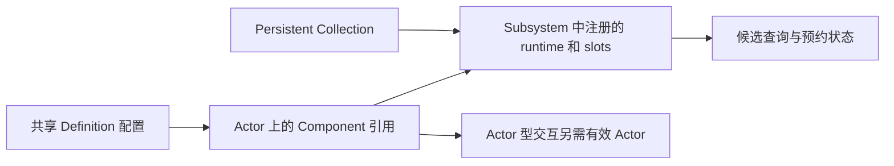
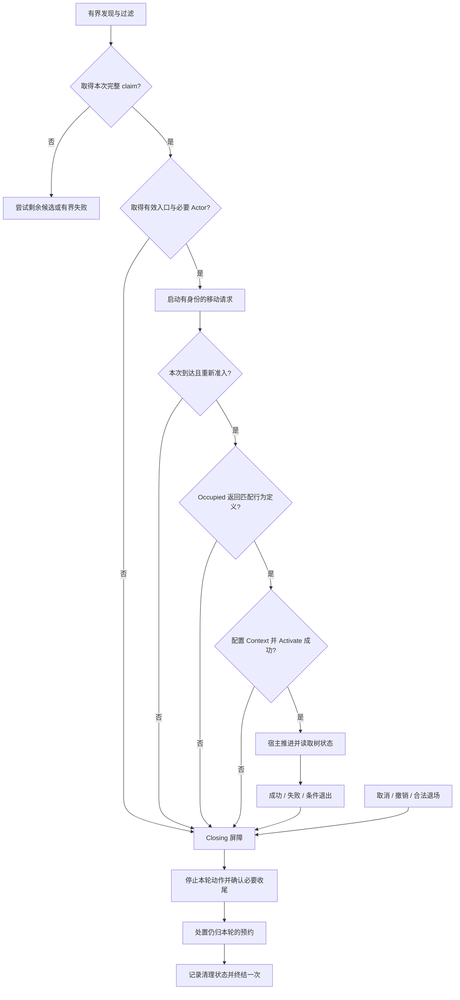
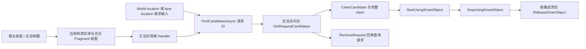

# 06 ZoneGraph 与 SmartObjects

> 知识成熟度：L2。主要承诺是可定位的公开文证、作者设计的单会话责任模型、真实 API 映射与纸面正反轨迹；不是可直接编译的完整 UE 宿主。
> 版本基线：当前公开文档。2026-10-05 实际核对的主要 Epic 页面显示 UE 5.8；动态网页不等于源码 revision，也不认证历史 CL。
> 适用范围：ZoneGraph 车道数据与查询、SmartObjects 预约与交互、传统 AI 和 Mass 的接入边界。示例选择同一合法串行宿主窗口访问子系统。
> 最后更新：2026-10-05，整篇重整发现、过滤、claim、入口、移动、交互和退出责任；旧版本/本机/源码声称逐字保存在第 11 节。
> 证据范围：官方 API/概览静态核对及邻文合同对照。源码核对状态：未核对本机 Engine 源码。未运行 UE、UHT、UBT、PIE、导航、动画、Mass 线程或性能测试；所有 PAPER_EXPECTED 均为推导，非日志。

## 1. 为什么“找到椅子”还不能坐下

NavMesh 回答从当前位置如何走到目的地；ZoneGraph 表达有方向、宽度、标签和连接关系的车道；SmartObjects 让使用者发现世界中的交互设施并预约槽位；GameplayInteractions 用 StateTree 编排具体交互。Mass 提供实体与批量处理宿主，并非前三者的必选前提：单个 AIController、行为树或玩家交互系统也可以接入。

以 NPC 坐椅子为例，查到附近人行道只得到路，查到 Seat 候选只得到可能的座位，成功 claim 才取得本次预约；入口查询给出可能的接近点，真实移动成功才满足到达条件。随后标记 Occupied、启动树、树完成、停止残余操作、归还预约是不同事实。少分一层，就可能出现没走到便播放动画、两人争同一位置、取消后继续坐下，或下一轮的 claim 被旧回调释放。

本文先解释数据和 API，再沿同一会话贯通这条链。读者应能据此定位“无候选”“认领失败”“不可达”“行为未启动”和“清理未确认”，而不是把它们都报成交互失败。

### 1.1 术语和职责

| 概念 | 类型 / 持有者 | 回答的问题 |
| --- | --- | --- |
| Zone / Lane | `FZoneData` / `FZoneLaneData` | 区域内有哪些有向走廊，几何、宽度与连接是什么 |
| Lane Profile / Lane Desc | `FZoneLaneProfile` / `FZoneLaneDesc` | 编辑期怎样组合平行车道、方向、宽度和标签；本文不复验历史默认数值 |
| Lane handle / location | `FZoneGraphLaneHandle` / `FZoneGraphLaneLocation` | 哪份注册数据中的哪条 lane，以及 lane 上的位置/方向/里程 |
| Definition | `USmartObjectDefinition` 资产 | 共享配置：槽位、变换、标签、条件与行为定义 |
| Component / Runtime | Actor 的 `USmartObjectComponent` / 子系统运行实例 | 场景接入组件与模拟里的对象数据，寿命未必相同 |
| Slot / Entrance | `FSmartObjectSlotHandle` / `FSmartObjectSlotEntranceHandle` | 使用哪个位置，以及从哪里接近它；一个槽位可有多个入口候选 |
| Claim | `FSmartObjectClaimHandle` | 对象、槽位、用户三部分组成的本次预约身份；不是 Actor 所有权或保活引用 |
| Behavior definition | `USmartObjectBehaviorDefinition` 的具体子类 | 使用者应该执行的行为配置；有配置不等于行为正在运行 |
| Interaction context / AITask | `FGameplayInteractionContext` / 官方交互任务 | 驱动树的入口，或传统 AI 的移动加使用集成路线 |

## 2. ZoneGraph：先把“路上的位置”算清楚

### 2.1 数组如何共同描述一条 lane

[FZoneGraphStorage](https://dev.epicgames.com/documentation/en-us/unreal-engine/API/Plugins/ZoneGraph/FZoneGraphStorage)的字段将几何、拓扑和空间索引分开：

| 数据 | 教学用途 |
| --- | --- |
| `Zones`、`Lanes` | 区域和车道记录，组织几何与连接范围 |
| `BoundaryPoints` | 区域边界 |
| `LanePoints`、`LaneUpVectors`、`LaneTangentVectors` | 车道点列、向上方向与切线，供位置和朝向计算 |
| `LanePointProgressions` | 车道点的累计距离，给沿线定位提供里程数据 |
| `LaneLinks` | 车道间连接，供转向、汇入、分流等路线选择使用 |
| `Bounds`、`ZoneBVTree` | 总边界与空间索引 |
| `DataHandle` | 这份运行时注册数据的身份 |

lane 将走廊表达为可沿线参数化的路径；NavMesh 则主要表达可走表面。累计距离字段使“沿 lane 前进多少”有明确的数据基础，但字段存在不证明整个定位或推进操作是 O(1)。双向交通需要在设计中分别表达两个方向，不能把一个前进结果当作反向路线或路口选路。


这是编辑输入到运行查询的职责图，不是未经源码核对的构建器逐函数全序。[UZoneGraphSubsystem](https://dev.epicgames.com/documentation/en-us/unreal-engine/API/Plugins/ZoneGraph/UZoneGraphSubsystem)提供注册、取 storage、查询和 linked-lane 接口；`GetZoneGraphStorage` 的指针需要判空，注册句柄也不应跨 World 混用。

### 2.2 标签过滤是三项同时约束

`FZoneGraphTagMask` 用 `uint32` 保存掩码。[当前 Mask 页](https://dev.epicgames.com/documentation/en-us/unreal-engine/API/Plugins/ZoneGraph/FZoneGraphTagMask)也列出 `CompareMasks` 的比较操作；它不意味着 `FZoneGraphTagFilter` 只有三种互斥模式。后者同时检查：AnyTags 至少命中一个，AllTags 全部命中，NotTags 一个也不能命中；某项为 None 时跳过该项。[Filter 合同](https://dev.epicgames.com/documentation/en-us/unreal-engine/API/Plugins/ZoneGraph/FZoneGraphTagFilter)

纸面输入：Any={人行道,骑行道}，All={开放}，Not={施工}。

| lane 标签 | 结果与原因 |
| --- | --- |
| {人行道,开放} | 通过，三项同时满足 |
| {骑行道,开放,施工} | 拒绝，命中 Not；命中 Any 不能抵消它 |
| {人行道} | 拒绝，缺少 All 中的开放 |
| {车道,开放} | 拒绝，Any 无命中 |
| Any=None，All={开放}，Not={施工}；输入 {车道,开放} | 通过，只有 Any 检查被跳过 |

ZoneGraph 标签适合有限的车道类别，更多业务语义可在其后使用项目数据筛选；它与 SmartObject 的 GameplayTags/GameplayTagQuery 是不同类型的筛选层。

### 2.3 查询输出、失败和真正移动

| 当前 API | 输出与用途 | 不能据此声称 |
| --- | --- | --- |
| `FindNearestLane(QueryBounds, TagFilter, OutLaneLocation, OutDistanceSqr)` → bool | 包围盒内最近的车道位置和平方距离 | NPC 已移动，或盒外也存在可用路 |
| `FindLaneOverlaps(Center, Radius, TagFilter, OutLaneSections)` → bool | `TArray<FZoneGraphLaneSection>`，范围内重叠车道段 | 找到了 SmartObject 或可交互 slot |
| `AdvanceLaneLocation(InLaneLocation, AdvanceDistance, OutLaneLocation)` → bool | 沿 lane 计算另一个位置 | 自动选择下一条 lane，或已经让 Pawn 前进 |

下面是基于当前签名的局部 C++ 候选，仅示范判错和数据消费边界；没有编译。`World` 是当前仍有效的 World，`AgentPos` 是本次位置快照，Tag1 是项目已配置的人行道，两个数值是示例厘米值：

```cpp
if (World == nullptr) { return; }
UZoneGraphSubsystem* ZoneSub = UWorld::GetSubsystem<UZoneGraphSubsystem>(World);
if (ZoneSub == nullptr) { return; }

FZoneGraphTagFilter Filter;
Filter.AnyTags = FZoneGraphTagMask(FZoneGraphTag(1));
FZoneGraphLaneLocation Location;
float DistanceSqr = 0.0f;
if (!ZoneSub->FindNearestLane(
        FBox(AgentPos - FVector(100.0f), AgentPos + FVector(100.0f)),
        Filter, Location, DistanceSqr)) { return; }

FZoneGraphLaneLocation Next;
if (!ZoneSub->AdvanceLaneLocation(Location, 200.0f, Next)) { return; }
// 这里只得到 Next；由项目的移动消费者使用，不将其记为已到达。
```

第一次失败不读 Location，第二次失败不读 Next。要跨 lane，另按连接和业务路线选择下游 lane；本文不猜端点钳制或自动转向规则。某范围的 lane overlap 非空而 SmartObject query 为空完全合理：路存在，不代表路旁有符合条件的设施。

## 3. SmartObject：配置、候选与预约分开

### 3.1 椅子的正确配置入口

先在编辑器创建 `USmartObjectDefinition` 资产，配置一个 Seat slot 的变换、活动标签、用户/世界条件和行为定义。本例选择 `UGameplayInteractionSmartObjectBehaviorDefinition`，引用采用 `UGameplayInteractionStateTreeSchema` 的树。再让椅子 Actor 的 `USmartObjectComponent` 引用该 Definition；当前组件提供 `SetDefinition` 和注册生命周期入口。不要用未经当前资料支持的 `GetMutableSlotDefinitions()` 在组件上临时拼槽位。[Overview](https://dev.epicgames.com/documentation/en-us/unreal-engine/smart-objects-in-unreal-engine---overview)、[Component](https://dev.epicgames.com/documentation/en-us/unreal-engine/API/Plugins/SmartObjectsModule/USmartObjectComponent)、[行为定义](https://dev.epicgames.com/documentation/unreal-engine/API/Plugins/GameplayInteractionsModule/UGameplayInterac-?lang=en-US)

Definition 是共享的不可变配置；runtime 保存模拟状态。Persistent Collection 可让模拟数据在场景 Actor 流送卸载后仍存在，因此“slot 还在”不保证能取得组件或 Actor。需要 Actor 的交互必须检查当前 `ContextActor`、`SmartObjectActor` 及 Schema 类型/绑定要求；是否尝试 hydration/spawn 是项目选择，不能把 `GetSmartObjectComponent` 的可空返回直接解引用。[Subsystem 的组件访问说明](https://dev.epicgames.com/documentation/en-us/unreal-engine/API/Plugins/SmartObjectsModule/USmartObjectSubsystem)



### 3.2 用什么查询，过滤了什么

以下是当前公开签名的参数映射，不是声明完整类或默认参数：[Subsystem API 表](https://dev.epicgames.com/documentation/en-us/unreal-engine/API/Plugins/SmartObjectsModule/USmartObjectSubsystem)。

| 入口 | 参数顺序 / 输出 | 选择理由 |
| --- | --- | --- |
| `FindSmartObjects` | `Request, OutResults, UserData` → bool；OutResults 为 `TArray<FSmartObjectRequestResult>` | 在请求的空间范围内找候选 |
| `FindSmartObjectsInList` | `Filter, ActorList, OutResults, UserData` → bool | 已有 Actor 列表时筛候选；不能漏掉 OutResults |
| `FindSlots` | `Handle, Filter, OutSlots, UserData` → void | 已知 SmartObject，找其满足过滤器的槽位 |
| `EvaluateSelectionConditions` | `SlotHandle, UserData` → bool | 独立评估该 slot 与对象的选择条件 |

`FSmartObjectRequestFilter` 的主要业务字段如下；不是一份穷尽未来版本的结构体重写。[Filter 字段](https://dev.epicgames.com/documentation/en-us/unreal-engine/API/Plugins/SmartObjectsModule/FSmartObjectRequestFilter)

| 字段 | 本例用途与边界 |
| --- | --- |
| `UserTags` / `ActivityRequirements` | 分别描述请求者标签与对槽位活动标签的查询 |
| `BehaviorDefinitionClasses` | 限定当前宿主能执行的行为定义类型，不能拿 Mass 定义当 Context 定义 |
| `bShouldEvaluateConditions` | 控制查询时是否评估对象/槽条件；跳过时不能假装条件已经通过 |
| `ClaimPriority` | 查询使用的认领优先级；较低优先级的 Claimed slot 也可能是候选 |
| `bShouldIncludeClaimedSlots` / `bShouldIncludeDisabledSlots` | 扩大候选状态范围；候选包含它不授予使用资格 |
| `Predicate` / `DebugRejections` | 额外对象谓词与可选拒绝诊断；不是互斥锁 |

不能单凭 `bShouldIncludeClaimedSlots=false` 断言结果只含 Free：`ClaimPriority` 的文档明确允许搜索包含较低优先级的 Claimed。公开说明没有给出旗标与优先级的完整组合真值表，本文不补造它。

### 3.3 从可选到成功 claim，中间会竞争

`CanBeClaimed(SlotHandle, Priority)` 是预检，不建立预约，且不评估 selection conditions。直接用已知槽位、跳过条件查询，或等待较久后条件可能改变时，应按项目新鲜度策略独立评估条件；不是每次已评条件的查询后都无条件重复检查。[CanBeClaimed](https://dev.epicgames.com/documentation/unreal-engine/API/Plugins/SmartObjectsModule/USmartObjectSubsystem/CanBeClaimed)

真正尝试用 `MarkSlotAsClaimed(SlotHandle, Priority, UserData)`，核对返回的完整 claim，并按第 4 节的原调用账目保存。A、B 同时查询到 S，即使预检都通过，B 先取得同优先级预约后，A 也不能凭旧候选继续使用；A 没取得的资源不归 A 释放。

保留正确的抢占例外：更高优先级可认领较低优先级已经 Claimed 的槽位，但已经 in use 不受此例外允许强取。原用户必须能处理撤销、停止自己的移动/交互。查询与 claim 使用相同业务优先级，不能查询按 High、实际认领按 Normal 却预期相同行为。

[FSmartObjectClaimHandle](https://dev.epicgames.com/documentation/unreal-engine/API/Plugins/SmartObjectsModule/FSmartObjectClaimHandle)包含 Object、Slot、User。`IsValid()` 只表示该值曾正确赋过；`IsClaimedSmartObjectValid` 公开保证的是对象/槽在模拟中的可访问性。它们都不单独证明 Actor、玩法期、线程、当前 reservation 所有权和下一步操作资格。清理保留完整 claim，不能只拿 slot 找一个“现在的用户”代旧会话释放。

### 3.4 入口查询没有替你寻路

`FindEntranceLocationForSlot(SlotHandle, Request, Result)` → bool，按请求选择入口。它可以利用 entrance annotations，也允许把 slot 自身位置纳入入口候选；导航面、落地和碰撞检查并不检查从当前用户位置可达。[入口专页](https://dev.epicgames.com/documentation/en-us/unreal-engine/API/Plugins/SmartObjectsModule/USmartObjectSubsystem/FindEntranceLocationForSlot)

因此本例不是“永远额外配一个入口”：需要让项目的入口候选满足交互姿势、导航和碰撞要求。返回 false 不读 Result；返回 true 后仍发起真实路径/移动请求。导航面上隔墙或不连通的入口，依然可能 NoPath。移动接受条件应由项目移动适配器明确，不能用 lane 计算、欧氏距离或一个入口句柄代替已到达。

## 4. 主例：一个会话对自己的资源负责到底

### 4.1 输入和责任模型

这是作者的工程协议，状态名与票据字段不是引擎原生结构。目标是 NPC 对椅子完成一次有限交互，不承诺一个缺少工程适配的 C++ manager 能直接运行。

- 输入：本 World 的可用子系统、仍处于同一玩法期的 NPC 和设施、已配置的 Definition/Schema、查询盒与有限候选批次
- 资产：最小树只做有限等待，然后成功；它有一个完成参与任务，显式 All。坐下/起身动画是后续扩展，等待完成不代表动画已运行
- 唯一责任者：外层会话负责本次 reservation 的处置，内层树只执行交互；实际接线前必须核对 Context 适配是否会自行触发释放，并协调为一次处置，不能假定其内部绝不释放
- 主例选择所有交互任务可同步退出、且没有遗留外部操作的最小行为。这是待工程验证的前提，不从 `Deactivate()` 的 void 返回推得。接真实移动和动画后，异步停止必须有第 4.5 节的确认渠道
- 调度：宿主确实驱动 Context 并提供计时/唤醒；只存 deadline 或返回 Running 不会让下一次 Tick 自动发生

| 本轮账目 | 为什么不能省 |
| --- | --- |
| 票据 `g=(World身份,用户身份,玩法期,activation,request)` | 同一个 Actor/Pawn 地址不能区分重新激活的行为 |
| phase：Searching / Claimed / Approaching / Interacting / Closing / Closed | 取消一旦进入 Closing，普通成功回调不得继续推进 |
| 完整 Claim；取得、移交、撤销、处置记录 | 本地有效和实际仍归自己负责不是同一事实 |
| 移动请求 ID、交互执行对象、自有监听/Timer | 只停止本轮创建的动作，不误杀共享 Controller 的其他动作 |
| in-flight acquisition/operation 记录 | 启动调用尚未返回时发生重入，也有人收回迟返资源 |
| 结果槽、停止确认与清理状态 | 业务结果最多一次；请求取消、停止和释放分别记账 |

### 4.2 从发现到归还的因果链



这是责任依赖图，不宣称原生内部完全按图逐函数执行。没有取得 claim 的失败直接收回查询/监听等本轮资源；已经取得 claim 的任何出口都不能只返回一个 bool 了事。

| 阶段 / 输入 | 操作与准入 | 失败 / 资源出口 |
| --- | --- | --- |
| Searching | `FindSmartObjects` 核 bool 与结果数；限定搜索盒、候选数和本次请求 | 无候选不建交互、不 free；有界失败回等待/备用状态，重试使用新票据与退避 |
| 尝试 claim | 按条件新鲜度策略评估；先登记 acquisition，再 `MarkSlotAsClaimed` | 无效返回不 move/occupied；有效返回先归原账目，再核 generation/phase |
| Claimed | 保存完整值；由 Subsystem 注册本轮 invalidation callback；检查 Actor 与入口 | 注册或查找时也防重入；入口/对象失败由未移交的原责任者收尾 |
| Approaching | 先登记移动操作和结果接收，再启动；绑定本次 ID、失败、timeout、cancel-ack | NoPath/timeout 进 Closing；晚到成功不能恢复旧会话；同步完成需适配器锁存结果，不能先完成又报 Running |
| 到达后重新准入 | 验 World/对象/玩法期/票据/claim 责任、当前条件及入口适用性 | 不合格便退出，不因曾到达而豁免；从“已到入口”开始的局部调用必须先满足这些输入 |
| 开始使用 | `MarkSlotAsOccupied(Claim, DefinitionClass)`，检查返回的匹配行为定义 | null/不匹配不 Activate；不假设失败已经自动归还预约 |
| Interacting | 配本轮 ContextActor、SmartObjectActor、Claim、Entrance，调用 Activate；返后核 phase | false 不记成功；已经 Closing 不重新写 Running；部分启动按目标实现适配收尾 |
| 正常推进 | 合法宿主调用 Tick，并读取 `GetLastRunStatus()` | Tick 的 bool 不直接解释为业务成功；树终态进入 Closing，仍不等于预约已释放 |
| Closing | 先封闭普通结果与新副作用，再撤本轮监听/Timer，停止本轮操作 | 未确认停止的存储不能提前销毁；已撤销预约不得伪装成仍占有 |
| 归还 / Closed | 合法子系统上，对仍归本轮处置的完整 claim 调 `MarkSlotAsFree` 并记 bool；结果最多一次 | false 要结合撤销/对象移除/适配异常诊断；不借别人的 claim 重试，不把清空句柄当归还成功 |

### 4.3 Occupied、Activate 和业务完成究竟差在哪

[MarkSlotAsOccupied](https://dev.epicgames.com/documentation/en-us/unreal-engine/API/Plugins/SmartObjectsModule/USmartObjectSubsystem/MarkSlotAsOccupied)将先前认领的槽位标记为使用中，并返回行为定义。它没有替使用者执行动画或树。`FGameplayInteractionContext` 的公开接口把下一层拆成：[Context](https://dev.epicgames.com/documentation/en-us/unreal-engine/API/Plugins/GameplayInteractionsModule/FGameplayInteractionContext)

| 接口 | 本文使用方式 / 已知边界 |
| --- | --- |
| `SetContextActor`、`SetSmartObjectActor` | 输入本次已检查且符合 Schema 的对象 |
| `SetClaimedHandle`、`SetSlotEntranceHandle` | 传入本次 claim 和入口，不让内层再认领同一槽位 |
| `Activate(Definition)` → bool | 准备并启动树；记录尝试，再处理返回及当前 phase |
| `Tick(DeltaTime)` → bool | 更新底层树；公开页未定义 bool 的完整含义，不能拿它当成功标志 |
| `GetLastRunStatus()` | 区分 Running、Succeeded、Failed、Stopped、Unset；本例只有合法 Succeeded 才成为业务成功候选 |
| `SendEvent` | 事件留给后续树驱动消费，宿主不再驱动时不能保证它被处理 |
| `Deactivate()` → void | 文档说明停止底层树；不凭返回类型证明所有外部操作和预约均已收回 |

[状态枚举](https://dev.epicgames.com/documentation/unreal-engine/API/Plugins/StateTreeModule/EStateTreeRunStatus)中的 Stopped/Unset 不是成功。同样，Activate 成功不保证下一次观察还是 Running，启动可已到终态或期间会话已关闭，返回后都需处理。

公开证据未覆盖 Activate=false 后的部分初始化、Context 的 UObject 引用/GC 保活与复制约束、Deactivate 重入/重复调用保证，以及 Deactivate 与 free 的内部全序。本例要求目标版本适配核准这些点后才接实机；既不能说 Context 自动替你释放所有东西，也不能反过来断言它绝不会释放 claim。外层承担的是唯一“处置责任”，不是无论内部状态如何都再调用一次 Free。

`FGameplayInteractionContext` wrapper 的工程存储方式也不能证明临时 `FStateTreeExecutionContext` 可跨帧捕获。后者仍是借用当前合法数据的临时视图，详见 [StateTree](../感知决策与行为规划/05-StateTree状态树.md)和 [Mass 与 StateTree](21-Mass与StateTree源码.md)。

### 4.4 先登记取得过程，才能挡住重入泄漏

只在 `MarkSlotAsClaimed` 返回后给 CurrentClaim 赋值不够。假设 g1 启动调用，项目扩展重入关闭 g1 并开始 g2，随后旧调用返回 C1：直接写 CurrentClaim 会污染 g2；直接丢弃结果会泄漏 C1。

本例采用以下项目协议，不断言每个原生 API 都会同步回调：

1. 外部调用前建立属于 g1 的独立 operation/acquisition 记录，保存原票据、尝试阶段和清理负责人；其寿命覆盖该调用及必要收尾
2. 调用返回，先记录真实取得了什么和已经发生的副作用，再核原 generation/phase 是否仍允许接纳
3. 仅在 g1 仍合格时把结果纳入 g1 活动状态；若 g1 已 Closing，迟返的 C1 由 g1 原账目处置，不读写 g2 的 CurrentClaim/CurrentMove
4. Occupied/Activate/取消/解绑也遵循“先记尝试，后调用，再核阶段”；Activate 迟返不得把 Closing 改回 Interacting
5. Closing 时先设置屏障并取得本轮清理责任，再调用可能重入的 stop/free；账目记录进行中而非随手清空全部 handle。g2 若与旧动作存在资源冲突，须等旧动作真正停止或选择无冲突资源

旧业务结果可被拒绝，旧资源责任不能被一起遗忘。这个区别同时覆盖异步迟到和同步重入。

### 4.5 取消、撤销和失效是三种不同处置

普通取消首先进入 Closing，拒绝新的业务副作用。若树任务按本例同步退出，且适配证明确实无残余操作，可继续归还仍属本轮的预约。若移动或动画异步停止，应保留其需要的操作存储及原票据，等待实际完成委托、请求状态查询或项目明确的 stop-ack；哪一种渠道可用需随集成实现核对，不能虚构一个所有 UE API 都支持的统一 ack。

确认必须匹配原移动/动画请求及 g1。timeout 只触发保护性升级、隔离或明确失败诊断，不证明已停止；不能因超时把仍用中的存储销毁或报告清理成功。普通场景中仍归本轮的预约按协议延后处置，避免新用户接手时旧动作还在使用设施。

但 slot invalidation/抢占意味着原预约可能已撤销：此时立刻记录失去预约资格，不能声称“我继续握住 reservation 等 ack”。应停自己的残余移动/动画、保留它们需要的安全存储；不得用旧 claim 释放新 owner。是否可调用具体清理 API 取决于当时对象合法性和完整 claim 合同。

Owner/World 已失效时，检测者仅拒绝解引用旧对象/Context/Fragment，不靠坏引用补 Stop/Free。宿主应在仍可访问的 EndPlay/Stop 阶段安排退出，或者将安全账目移交给寿命足够的清理方；World 已 teardown 就不能向失效 Subsystem 调用并谎报释放成功。正常完成后再取消或退场也走同一账目，结果不重复，资源处置不重复。

### 4.6 普通事件、失效通知与线程许可

`SendSlotEvent` 是通知，名为 Occupied 的事件或 Busy tag 都不能替代 `MarkSlotAsOccupied`。`GetSlotEventDelegate` 返回的委托可能为空、可能跨 slots 共享，接收者必须筛 `Event.SlotHandle`。[事件委托专页](https://dev.epicgames.com/documentation/unreal-engine/API/Plugins/SmartObjectsModule/USmartObjectSubsystem/GetSlotEventDelegate)明确它可在任意线程广播；这条事实不外推成全部 invalidation 回调的线程合同。

claim invalidation 则由 `USmartObjectSubsystem::RegisterSlotInvalidationCallback` / `UnregisterSlotInvalidationCallback` 以完整 claim 注册/注销，不是 ClaimHandle 自带 `OnSlotInvalidated`。所用集成应明确唯一清理负责人及回调注册责任，避免相互覆盖。

项目的接收规则是：只复制值票据和必需的结果数据，排到合法接收点；到达后重新验对象、World、玩法期、会话、完整 claim 和 phase，再取得当前合法视图。不要从任意线程直接写 Actor、StateTree 或 Mass Fragment，也不要排队捕获已经借出的 Fragment 引用。

[Subsystem 线程备注](https://dev.epicgames.com/documentation/en-us/unreal-engine/API/Plugins/SmartObjectsModule/USmartObjectSubsystem)说明默认非线程安全。即便启用 `WITH_SMARTOBJECT_MT_INSTANCE_LOCK=1`，查询仍要求来自单线程，注册/注销控制的实例寿命仍不安全。本例统一在批准的同一串行宿主访问点调用；MT 宏不是让每个实体并行查询的许可证。

## 5. StateTree 和 AITask：两条接线不要混着清理

### 5.1 最小交互树接收现成的 claim

```text
外层会话：发现/过滤 → claim → 入口 → 移动 → 重新准入 → Occupied
UseChair（GameplayInteractionStateTreeSchema）
  输入：本次 ContextActor、SmartObjectActor、完整 claim、entrance
  Interaction 状态：有限等待 Task；仅它参与完成；显式 All
    Succeeded → 树成功出口
    Failed → 树失败出口
    条件退出 / 宿主 Stop → Task Exit 收回自身操作
外层会话：观察结果 → Closing → 确认停止 → 处置预约 → 结果一次
```

外层已经 claim，内层不再 Find And Claim，也不在 Stand Up 尾部重复 Free。若确需第二个槽位，另建第二份 claim 与清理责任，不能把它混入原句柄。

一个完成参与者 + All 是本例资产设计，不是所有交互树必须如此。加入监听或动画后，要明确谁参与正常完成、成功/失败转移到哪里。`StateCompleted` 不覆盖所有条件退出；各任务在实际 Exit/Stop 路径取消自身的 Timer、委托或动画，不只在正常起身路径清理。此处沿用 [StateTree 完成与退出合同](../感知决策与行为规划/05-StateTree状态树.md)，正常树终态与 reservation 释放是不同层。

动画扩展需要实际资产、角色绑定、对齐方式、播放完成/中断和停止确认；门的 Open 或坐下的通知事件需要项目消费者执行效果。当前官方可定位 `FStateTreeTask_FindSlotEntranceLocation` 的入口候选/验证任务；旧任务名清单保在历史区，不把“本轮未找到页面”写成“历史不存在”。[入口任务](https://dev.epicgames.com/documentation/en-us/unreal-engine/API/Plugins/GameplayInteractionsModule/FStateTreeTask_FindSlotEntranceL-)

### 5.2 官方 AITask 是传统 AI 的替代集成

[Move to and Use Smart Object with Gameplay Interaction](https://dev.epicgames.com/documentation/en-us/unreal-engine/BlueprintAPI/AI/Tasks/MovetoandUseSmartObjectwithGamep-_1)输入 Controller、已经认领的 Claim Handle 和 Lock AILogic，输出 Async Task、Finished、Succeeded、Failed、Move To Failed。Lock AILogic 涉及任务的 AI Logic claimed resource，不是世界槽位锁；Finished 与 Succeeded 不能混同。[Request Abort](https://dev.epicgames.com/documentation/unreal-engine/BlueprintAPI/AI/Tasks/RequestAbort)只是请求入口，Out exec 不是已证的停止确认。

选此路线时先核目标版本的接管合同：

1. 创建前由调用者持有 claim；先建立原会话账目和预期结果接收，再调用工厂
2. 若协议明确“失败未接管”，工厂返回 null 时由原持有者清理，不能对空 Task 调 `ReadyForActivation`
3. 仅在实际实现证明接管时点、任务保活与所有退出/free 责任后，才记一次所有权移交；不能仅凭 null 就猜工厂内部从未接管，也不能凭非空猜已经完成激活
4. 监听并区分任务完成、业务成功、移动失败与取消；启动/取消返后重验原会话，保持旧资源收尾责任
5. 不要外层先 Occupied，再把同一 claim 交给要求已 Claimed 的流程重复使用；也不要 AITask、树尾和外层各自无条件 Free

本轮 C++ 工厂专页读取失败，公开 Blueprint 页不足以认证默认参数、null 全条件、接管/free 全序。这里给出完整接线门禁，历史 C++ 声明不作为本轮可复制实现。若尚未取得明确接管协议，工程集成就停在这一门，不凭经验补一个双释放路径。

## 6. Mass：候选请求、使用行为和实体寿命各有身份

[FMassSmartObjectHandler](https://dev.epicgames.com/documentation/en-us/unreal-engine/API/Plugins/MassSmartObjects/FMassSmartObjectHandler)是方法作用域 helper，连接批量查询、用户 fragment 和行为调用。不要把某个 Processor 简化为自动负责每帧 query→claim→动画→free 的全部环节。



| 当前入口 / 数据 | 责任和不能省掉的判断 |
| --- | --- |
| `FindCandidatesAsync`、`GetRequestCandidates`、`RemoveRequest` | 发请求、在可取时读候选、回收请求；RemoveRequest 不是释放已经取得的 claim |
| `ClaimCandidate` | 候选到预约的尝试；核返回并保存本次完整身份 |
| `StartUsingSmartObject` | 开始使用的尝试；false 不代表预约已自动消失 |
| `StopUsingSmartObject` / `ReleaseSmartObject` | 停行为与释放 claimed/in-use 资源是不同入口；后者更新用户 fragment，实际组合按所用集成核准 |
| `FMassSmartObjectUserFragment` | 当前公开字段含 `InteractionHandle`、`InteractionStatus`、`InteractionCooldownEndTime`、`UserTags` |
| `FMassFindSmartObjectTask` | 当前属于 MassAIBehavior，定位 `Tasks/MassFindSmartObjectTask.h`，不是旧表中的请求头归属 |

来源：[UserFragment](https://dev.epicgames.com/documentation/en-us/unreal-engine/API/Plugins/MassSmartObjects/FMassSmartObjectUserFragment)、[Find task](https://dev.epicgames.com/documentation/en-us/unreal-engine/API/Plugins/MassAIBehavior/FMassFindSmartObjectTask)、[MassSmartObjects 模块](https://dev.epicgames.com/documentation/unreal-engine/API/Plugins/MassSmartObjects?lang=en-US)。lane-location request 和 annotations 是路网到设施候选的集成入口；`FindLaneOverlaps` 的 lane sections 不能当成这些候选结果。

异步回到消费点时，按当前 World/Manager 验完整 entity handle 的 index+serial、已构建状态与 Query 需求，重新取 fragment，再验 StateTree instance、activation 和请求身份。Handler、临时 ExecutionContext、Fragment 引用均不跨帧借用。Signal 只是唤醒相关消费者的通知，真实 Processor 调度/数据可用仍须满足；Running 不自动等于每渲染帧 Tick。[Mass 主篇](04-Mass实体框架与群集模拟.md)、[Mass 与 StateTree 执行机制](21-Mass与StateTree源码.md)

正常完成不等于 Free。实体失效后跳过访问也不等于替其他 owner 完成资源清理；应由合法拥有者在销毁前安排退场，或使用不借旧 fragment 的独立安全账目。旧 E1 结果不能因 index 被 E2 复用就作用于 E2。

`USmartObjectMassBehaviorDefinition` 是 Mass 行为定义基类，不普遍保证动画或位移消费者已经装好。[定义页](https://dev.epicgames.com/documentation/unreal-engine/API/Plugins/MassSmartObjects/USmartObjectMassBehaviorDefiniti-)若要远处用轻量表现、近处切 Actor 与 contextual animation，必须配置表现桥、有效角色、资产、Schema 和合法线程；这是可设计的两档方案，不是 MassLOD 自动建立的交互能力。

## 7. 场景、选择和常见问题

### 7.1 四种场景沿同一责任链变换

| 场景 | 配置和行为 | 容易错的地方 |
| --- | --- | --- |
| 椅子 | 一个 Seat slot，按姿势/导航要求设入口候选；外层 claim/到达后树执行等待或经验证的坐下/起身动画 | 找到椅子不等于预约成功；异常退出不能只等到“起身释放” |
| 门 | 把手 slot 与接近点；树驱动门的实际动作，Open tag/event 由门逻辑消费并改变碰撞 | 只加 Open tag 不会自动打开物理门；中断时要处理自身动画和门的业务状态 |
| 双工位工作台 | 两个独立 slots，各自行为/入口；两个用户分别预约并加工 | 容量约束来自 reservation 状态与优先级；Busy 仅在显式 filter/条件策略中参与筛选，不是第三把锁 |
| 城市人群 | ZoneGraph 给行走路线，SmartObject spatial query 或 Mass lane request/annotation 给设施候选；有界策略决定离队交互 | lane overlap 不是设施查询；不要每实体每帧无界重查，也不把节流写成线程安全保证 |

查询频率、搜索范围和候选上限应由项目负载和体验验证。可先按区域/行为需要触发并复用短期结果，再在使用前做必要准入；没有本文实测支持的固定 NPC 容量或帧预算。

### 7.2 FAQ

**ZoneGraph 能替代 NavMesh 吗？** 不能从车道位置计算推出自由区域路径可行。结构化走廊用 lane 表达，走廊外的自由寻路可以交给 NavMesh；项目要接好两者边界和真实移动消费者。

**为什么标签是 32 位，超出怎么办？** 当前 Mask 页的字段类型为 uint32，可表达 32 个 bit。合并/复用车道语义，或在候选后使用项目数据二次筛选；不要把 GameplayTag 的层级语义硬塞进 lane bit。历史 MaxTags 声明保在第 11 节，不用旧页替当前源码背书。

**SmartObject 和普通交互提示有什么不同？** 它提供注册、查询和预约协议，能让多个使用者共享设施；提示 UI 和实际行为是消费者。UI 可以展示候选，但只有 claim 成功且后续准入满足时，才能把预约作为本次使用事实。

**Claimed 后别人还能用吗？** 更高优先级可认领较低优先级的 Claimed，已经 in-use 是例外。查询 flag 和 priority 要一起读，实际 claim 返回才决定本次取得结果；撤销时旧用户只停自己的操作。

**FindSmartObjects 和 FindSlots 怎么选？** 前者按空间请求发现对象+槽位候选；后者已知对象 handle 后列出匹配槽位。已有 Actor 列表可选 InList，但仍要接 OutResults、条件与本次 UserData。

**没有 Mass 能使用吗？** 可以。本篇单会话模型即不依赖 Mass 实体；传统 AI 可选官方 AITask 或项目自有宿主，避免两条路线重复占用和清理。

**Mass 无 Actor 时怎样播放交互动画？** Mass 行为配置本身不等于 Actor 动画。先确认实际表现/动画消费者；若需要 contextual animation 的 Actor，补角色、资产、Schema 和表现切换协议，再测试中断。

**ZoneGraph 能否运行时动态构建？** 当前资料支持注册和查询接口，本文没有核对动态构建完整能力、线程、资源寿命和打包限制。不能由 RegisterZoneGraphData 推出程序化道路整条链已获支持；具体工程须核合法 checkout 与构建/卸载测试。

**GameplayInteractions 依赖 GAS 吗？** 本文最小交互责任模型未使用 GAS。若交互要授予能力或 buff，需单独接入项目能力系统与取消责任；本轮没读插件 Build.cs/uplugin，不能把“只依赖 GameplayTags 和 StateTree”当完整模块清单。

## 8. 22 个纸面情境：按身份、阶段和责任检查

下表全部为 **PAPER_EXPECTED，未执行 UE**。输入中的 S/C1/R1/g1 是作者命名，不推导引擎 handle 分配算法。统一观察：完整票据/claim 摘要、phase、移动 ID、树状态、预约是否撤销、in-flight 账目、stop/free/结果次数；目标是能手工追踪责任，不是用表格伪装测试日志。

| ID | 输入 / 事件顺序 | 预期与判定 |
| --- | --- | --- |
| P01 正常 | 查询得 S；C1 成功；R1 到达；Occupied 给匹配定义；Activate 成功；树 Succeeded | Closing，确认本轮操作停止，按已核适配处置 C1；结果成功一次，后续用户可重新 claim。释放异常不能隐藏成清理成功 |
| P02 无候选 | lane overlap 可非空，SmartObject Results 为空 | 不建交互、不 claim/free；进入有界失败/备用出口，不能报“已发现座位” |
| P03 查询后竞争 | A/B 同优先级都看到 S，B 先 claim，A 得无效 claim | A 不 move/occupied，不释放 B；可试剩余有限候选 |
| P04 条件改变 | 查询通过，延迟中用户权限或世界条件变化 | 按本例新鲜度策略重评并拒绝；CanBeClaimed=true 不能覆盖条件失败 |
| P05 抢占 / in-use | C1=低优先级 Claimed，高优先级取得 S；对照 S 已 in-use | 前者 C1 撤销后只收本轮残余操作，不 free 新 owner；后者不能用同一优先级例外强取 |
| P06 工厂失败 | C1 成功，执行对象创建失败；协议已证失败不接管 | 原持有者处置未移交 C1，不解引用空 Task；若接管时点未知则不能假定此失败协议成立 |
| P07 入口失败 | C1 成功，入口 query=false | 不读 Result、不发移动；原责任者处置 C1 |
| P08 移动失败 | R1 NoPath 或 timeout | Closing，停止/解绑本轮操作；按真实停止协议收尾，不能把 timeout 本身当停止确认 |
| P09 晚到到达 | g1/R1 取消，g2/R2 已建，随后 R1 到达 | 原票据不匹配，拒绝旧业务效果；不让 g2 Occupied、不结束 R2 |
| P10 异步取消 | R1 已请求 cancel，尚无匹配确认 | Closing，保留仍使用的操作存储；预约若仍属自己才按协议延后处置；确认/保护性升级有明确入口，不假报已停 |
| P11 占用失败 | Occupied 未给所需定义 | 不 Activate；核本轮实际状态与处置责任，不假设已 free |
| P12 激活失败 | Occupied 后 Activate=false | 记录失败/部分启动尝试，按目标实现核准的路径收尾；不假设 false 天然无副作用 |
| P13 重入 / 重复收尾 | Closing 中 stop/free 触发回调；完成后又 cancel/EndPlay | 屏障已立、账目已记，stop/free/结果不重复；不清掉新一轮资源 |
| P14 Actor 卸载 | persistent runtime 还在，Actor/Component 不可得 | 需要 Actor 的行为拒绝或停止；runtime 存在不准许解引用旧 Actor，合法退场负责收尾 |
| P15 错槽 / 非宿主线程 | S1 监听收到 S2 普通事件，或该委托在其他线程广播 | 先筛 slot；合法事件排入安全接收点再验票据，不直接写 Actor/Fragment |
| P16 条件退出 | 交互尚未自然完成，条件转换或宿主 Stop 离开 | 各任务 Exit/Stop 清自身操作；外层统一预约处置，不只依赖 StandUp/StateCompleted |
| P17 旧实体复用 | E1=(41,9) 销毁，E2 复用 index 41，旧请求返回；另对照 request 已 Remove 但 claim 已取得 | 完整实体/业务身份拒绝旧访问，不借旧 fragment 清 E2；RemoveRequest 不替代 ReleaseSmartObject |
| P18 lane 输出无效 | FindNearestLane=false，或找到后 AdvanceLaneLocation=false | 不用失败输出，不记移动；两个都 true 也只得到 lane location |
| P19 入口不可达 | 入口 query=true，用户与入口位于不连通区域 | 仍需真实 path/move，失败走 Closing；导航面检查不等于可达 |
| P20 高 priority 查询 | includeClaimed=false，查询 priority 高于某 Claimed slot | 不断言该 slot 被排除；按 priority 文证理解候选，再核 claim；不补未知组合真值表 |
| P21 迟返取得资源 | g1 claim 调用中关闭，g2 开始，随后返 C1 成功 | C1 先归原 g1 acquisition，再由原账目处置；g2 字段不变，C1 不能只丢结果泄漏 |
| P22 迟返激活 | g1 Activate 调用中重入取消，随后返回 | 记录已发生的尝试/副作用，仍为 Closing；按真实启动后退出协议收尾，不能回跳 Interacting |

## 9. 真实工程接线与验收入口

以下全部 **NOT RUN**，是把责任模型接到目标 UE 工程的完整工作清单。机械 Markdown 检查不能代替它们。

1. 记录实际 `Engine/Build/Build.version`、平台、插件与模块依赖；读取目标版本相关头/实现，先核 Context 的失败/GC/退出和 AITask 接管合同，再做 UHT/UBT 构建
2. 创建 Definition 与一个 Seat slot，设置活动标签、行为、条件和入口候选；Component 指向该资产。确认本 World 注册可查，并造活动标签不匹配的负例
3. 建符合 GameplayInteractionStateTreeSchema 的树；检查 ContextActor/SmartObjectActor 类型、claim/entrance 绑定、资产编译与完成聚合。本例有限等待唯一参与完成，正常成功/失败和条件退出都有出口
4. 先让有效用户已经满足入口到达条件，单独验证 claim→occupied→Activate→宿主驱动→状态→Closing；记录票据与每次处置，确认重复 cancel 不重复结果，后续能再次 claim
5. 接真正移动：先建立请求账目/监听，再启动。明确接受条件、失败、timeout、取消和确认渠道；用断路、同步完成、迟到完成及重启检验重新准入
6. 再接坐下/起身动画：验证资产、角色对齐、正常完成、中断/停止回调与保活，不能把 SendSlotEvent 或 Deactivate 返回当全部外部动作已停
7. 加第二用户、优先级抢占、slot 禁用、Actor streaming、Owner EndPlay、World 退场、重入调用；逐个执行 P01–P22。测试必须记录输入、状态和失败结果，不能只截成功动画
8. AITask 路线独立验证创建、非空、接管、任务保持、激活、四类输出、Abort 与所有退出/free；确认前不混入低层手动 Occupied/Free
9. Mass 路线核现有 Trait/Processor/StateTree 配置、lane request/annotation、请求回收、完整实体身份、当前视图和实际唤醒；销毁清理由合法拥有者执行，不用旧 Fragment 补救
10. 正确性成立后才测搜索频率、拥挤与表现切换；记录规模、调度、CPU/帧时和原始结果，不能由本篇纸面链推容量

## 10. 来源定位与关联阅读

本轮访问日期均为 2026-10-05。第 2–6 节的链接给具体合同，以下补充定位/上限，便于在目标版本继续核查：

| 来源组 | 实际核对位置 | 没有认证的内容 |
| --- | --- | --- |
| ZoneGraphSubsystem / Storage / TagFilter / TagMask | Public functions/variables，`ZoneGraphSubsystem.h`、`ZoneGraphTypes.h` | 本机文件存在性、复杂度、运行时动态构建全链、历史默认值 |
| SmartObjects Overview / Component | Definition、Persistent Collection、runtime flow；组件 Definition 与 lifecycle 入口 | 旧 Claim/Use/Release 名称作为当前签名；所有 Actor 始终加载 |
| SmartObjectSubsystem / Filter / ClaimHandle | 当前 API 表、线程备注、Object/Slot/User 与 IsValid 说明 | 槽位可访问等于完整所有权；各失败原因与实现全序 |
| CanBeClaimed / MarkSlotAsOccupied / Entrance / SlotEventDelegate | 条件/priority 例外、行为定义返回、入口不可达保证缺失、跨槽/任意线程备注 | 自动执行交互、查询旗标完整真值表、全部失效通知的线程 |
| GameplayInteractionContext / Definition / Schema | setter、Activate/Tick/Deactivate、StateTreeReference/Schema 元数据 | Tick bool 全语义、Activate=false 部分状态、GC、自动 free 或绝不 free |
| AITask Blueprint / Request Abort | already-claimed 输入、Controller/LockAILogic、输出与请求入口 | C++ 默认参数、接管时点、null 全条件、OnDestroy/free/广播全序 |
| Mass Handler / UserFragment / Find task / Behavior definition | helper 生命周期、方法列表、字段、当前模块/头定位 | 单 Processor 自动全流程、每帧驱动、自动 Actor 动画/LOD 桥接 |

来源读取的真实限制：当前 AITask C++ 类页返回不可访问；部分 Context 方法专页为空或 cache miss，故只使用总页明确的合同。MarkSlotAsClaimed/Free 等专页不足时使用成功的 Subsystem API 表，不推函数体。作者补查的 EZoneGraphTags 页实际显示 5.7，因此当前 32 位说明以显示 5.8 的 TagMask 字段为依据。没有拿旧 Python 页、同名符号或网页版本标题证明历史 CL。

- [04-Mass实体框架与群集模拟](04-Mass实体框架与群集模拟.md)：实体、合法视图、表现和退场
- [05-StateTree状态树](../感知决策与行为规划/05-StateTree状态树.md)：完成参与、Exit 与调度
- [21-Mass与StateTree源码](21-Mass与StateTree源码.md)：实例/activation/request 身份和临时 Context
- [03-NavMesh寻路](03-NavMesh寻路.md)：自由可走区域的路径问题
- [01-行为树详解](../感知决策与行为规划/01-行为树详解.md)：传统 AI 的潜伏与取消出口
- [GameplayTag与数据资产](../../05-Gameplay与交互系统/玩法架构与任务协作/03-GameplayTag与数据资产.md)：活动/用户标签与配置资产

## 11. 历史材料原文：保留身份，不作为本轮实现认证

以下八块按旧文原字节各保留一次，其中包含七段声明型 C++ 围栏。“本机”“已验证”、旧类型/任务/默认参数和内部次序都是原作者当时的声称；本轮未读取该安装或 CL。阅读现行流程以第 1–10 节为准，不复制本节为当前可编译例。

### H01 原版本、成熟度与本机身份

本块为历史原文，本轮未认证其源码版本与完整行为；现行解释见前文。

> 知识成熟度：L2（本轮审计修订时补标）。
> 版本基准：UE 5.8.0（本机 `Engine/Build/Build.version`：CL 55116800，分支 `++UE5+Release-5.8`）。
> 兼容性边界：适用于 UE5.8 编辑器/运行时，UE4.27 与早期 UE5 仅作迁移背景，具体模块以正文为准。
> 官方参考：[Unreal Engine UE5.8 官方文档总页](https://dev.epicgames.com/documentation/en-us/unreal-engine)。
> 最后更新：2026-08-06（本轮元数据维护）。

> 适用版本：UE 5.8（以本机 `C:\Program Files\Epic Games\UE_5.8\Engine` 安装源码为基准，逐行核对）。源码路径基于 `Engine/Plugins/Runtime/ZoneGraph`、`Engine/Plugins/Runtime/SmartObjects`、`Engine/Plugins/Runtime/GameplayInteractions` 与 `Engine/Plugins/Runtime/MassGameplay`。

### H02 原 ZoneGraph 数据声明

本块为历史原文，本轮未认证其源码版本与完整行为；现行解释见前文。

#### 3/1/1 数据模型（ZoneGraphTypes.h 已验证）

```cpp
// 节选：ZoneGraphTypes.h —— 标签（最多 32 个）
enum class EZoneGraphTags
{
	MaxTags = 32,
	MaxTagIndex = MaxTags - 1,
};

// 节选：ZoneGraphTypes.h —— 存储（构建产物，全部为紧凑数组）
USTRUCT()
struct FZoneGraphStorage
{
	TArray<FZoneData> Zones;              // 区域
	TArray<FZoneLaneData> Lanes;          // 车道（LaneIndex → ZoneIndex）
	TArray<FVector> BoundaryPoints;       // 区域边界点
	TArray<FVector> LanePoints;           // 车道点列
	TArray<FVector> LaneUpVectors;        // 车道法线
	TArray<FVector> LaneTangentVectors;   // 车道切线（朝向）
	TArray<float> LanePointProgressions;  // 每点的累计前进距离
	TArray<FZoneLaneLinkData> LaneLinks;  // 车道连接（转向/合并/分流）
	FBox Bounds;
	FZoneGraphBVTree ZoneBVTree;          // 区域 BV 树（空间索引）
	FZoneGraphDataHandle DataHandle;      // 注册句柄
};
```

```cpp
// 节选：ZoneGraphTypes.h —— 单条车道描述（编辑期配置）
USTRUCT(BlueprintType)
struct FZoneLaneDesc
{
	float Width = 150.0f;                                  // 宽度（默认 150cm）
	EZoneLaneDirection Direction = EZoneLaneDirection::Forward;
	FZoneGraphTagMask Tags = FZoneGraphTagMask(1);        // 默认带 Tag 0
};
```

### H03 原 ZoneGraph 查询声明

本块为历史原文，本轮未认证其源码版本与完整行为；现行解释见前文。

#### 3/1/3 查询 API（ZoneGraphSubsystem.h 已验证）

```cpp
FZoneGraphDataHandle RegisterZoneGraphData(AZoneGraphData& InZoneGraphData);
const FZoneGraphStorage* GetZoneGraphStorage(const FZoneGraphDataHandle DataHandle) const;

// 找到指定包围盒内"最近"的车道（给定位置 → 车道定位）
bool FindNearestLane(const FBox& QueryBounds, const FZoneGraphTagFilter TagFilter,
                     FZoneGraphLaneLocation& OutLaneLocation, float& OutDistanceSqr) const;

// 找到半径范围内与圆重叠的所有车道段（批量，Mass 常用）
bool FindLaneOverlaps(const FVector& Center, const float Radius, const FZoneGraphTagFilter TagFilter,
                      TArray<FZoneGraphLaneSection>& OutLaneSections) const;

// 沿车道推进指定距离（走"里程"）
bool AdvanceLaneLocation(const FZoneGraphLaneLocation& InLaneLocation, const float AdvanceDistance,
                         FZoneGraphLaneLocation& OutLaneLocation) const;

bool IsLaneValid(const FZoneGraphLaneHandle LaneHandle) const;
```

### H04 原组件注册叙述和声明

本块为历史原文，本轮未认证其源码版本与完整行为；现行解释见前文。

#### 3/2/1 注册

在 Actor 上加 `USmartObjectComponent`，配置好槽位（`FSmartObjectSlotDefinition`：位置、朝向、活动标签、行为定义）后，Actor 注册进世界时自动调用：

```cpp
// 节选：SmartObjectSubsystem.h
bool RegisterSmartObject(TNotNull<USmartObjectComponent*> SmartObjectComponent);
bool UnregisterSmartObject(TNotNull<USmartObjectComponent*> SmartObjectComponent);
bool RegisterSmartObjectActor(const AActor& SmartObjectActor);
```

### H05 原过滤器与查询声明

本块为历史原文，本轮未认证其源码版本与完整行为；现行解释见前文。

关键 API（`SmartObjectSubsystem.h` / `SmartObjectRequestTypes.h` 已验证）：

```cpp
// 过滤器：所有可调项
USTRUCT(BlueprintType)
struct FSmartObjectRequestFilter
{
	FGameplayTagContainer UserTags;              // 请求者的标签（如 "AI/Peasant"）
	ESmartObjectClaimPriority ClaimPriority = ESmartObjectClaimPriority::Normal;
	FGameplayTagQuery ActivityRequirements;      // 槽位活动标签必须匹配
	TArray<TSubclassOf<USmartObjectBehaviorDefinition>> BehaviorDefinitionClasses;
	bool bShouldEvaluateConditions = true;       // 是否跑槽位/对象条件
	bool bShouldIncludeClaimedSlots = false;     // 是否包含已被认领的槽
	bool bShouldIncludeDisabledSlots = false;    // 是否包含禁用槽
};

// 查询
bool FindSmartObjects(const FSmartObjectRequest& Request, TArray<FSmartObjectRequestResult>& OutResults, const FConstStructView UserData) const;
bool FindSmartObjectsInList(const FSmartObjectRequestFilter& Filter, const TConstArrayView<AActor*> ActorList, const FConstStructView UserData) const;
void FindSlots(const FSmartObjectHandle Handle, const FSmartObjectRequestFilter& Filter, TArray<FSmartObjectSlotHandle>& OutSlots, const FConstStructView UserData) const;

// 认领与占用
bool CanBeClaimed(const FSmartObjectSlotHandle& SlotHandle, ESmartObjectClaimPriority ClaimPriority = ESmartObjectClaimPriority::Normal) const;
FSmartObjectClaimHandle MarkSlotAsClaimed(const FSmartObjectSlotHandle& SlotHandle, ESmartObjectClaimPriority ClaimPriority, const FConstStructView UserData = {});
const USmartObjectBehaviorDefinition* MarkSlotAsOccupied(const FSmartObjectClaimHandle& ClaimHandle, TSubclassOf<USmartObjectBehaviorDefinition> DefinitionClass);

// 入口位置（站哪儿触发交互）
bool FindEntranceLocationForSlot(const FSmartObjectSlotHandle& SlotHandle,
                                 const FSmartObjectSlotEntranceLocationRequest& Request,
                                 FSmartObjectSlotEntranceLocationResult& Result) const;
```

### H06 原任务表与 AITask 声明

本块为历史原文，本轮未认证其源码版本与完整行为；现行解释见前文。

`GameplayInteractionsTypes.h` 提供：

```cpp
// 交互上下文里预定义的命名对象（StateTree 上下文数据）
extern const FName ContextActor;        // 执行交互的 Actor
extern const FName SmartObjectActor;    // 参与交互的 SmartObject Actor
extern const FName SmartObjectClaimedHandle;

// 所有交互任务/条件的基类（便于 Schema 统一包含）
struct FGameplayInteractionStateTreeTask : public FStateTreeTaskBase;
struct FGameplayInteractionStateTreeCondition : public FStateTreeConditionBase;
```

内置任务（`GameplayInteractionsModule/Private/StateTree/`）：

| 任务 | 作用 |
| --- | --- |
| `FGameplayInteractionFindSlotTask`（Find Slot） | 按过滤条件找槽并认领，输出 ClaimHandle |
| `FGameplayInteractionGetSlotActorTask` | 从 ClaimHandle 取对象 Actor |
| `FGameplayInteractionListenSlotEventsTask` | 监听槽位事件（如"开始/结束使用"） |
| `FGameplayInteractionSendSlotEventTask` | 向槽位发事件（如"我坐下了"） |
| `FGameplayInteractionModifySlotTagTask` / `SyncSlotTagStateTask` | 增删/同步槽位 GameplayTag |
| `FGameplayInteractionSetSlotEnabledTask` | 启用/禁用槽位 |
| `StateTreeTask_PlayContextualAnim` | 播放情境动画（Contextual Animation） |
| `PlayMontageStateTreeTask` | 播放蒙太奇 |
| `StateTreeTask_FindSlotEntranceLocation` / `GetSlotEntranceTags` | 求入口位置/标签 |

传统 AI 侧（行为树/AITask 用户）用 `UAITask_UseGameplayInteraction`（`AI/AITask_UseGameplayInteraction.h`）：

```cpp
static UAITask_UseGameplayInteraction* UseSmartObjectWithGameplayInteraction(AAIController* Controller, FSmartObjectClaimHandle ClaimHandle, bool bLockAILogic = true);
static UAITask_UseGameplayInteraction* MoveToAndUseSmartObjectWithGameplayInteraction(AAIController* Controller, FSmartObjectClaimHandle ClaimHandle, bool bLockAILogic = true);
```

`MoveToAndUseSmartObjectWithGameplayInteraction` 内部：先 `UAITask_MoveTo` 走到槽位入口，再启动 `FGameplayInteractionContext` 执行交互定义（StateTree）。

### H07 原 Mass 类型表和链路声称

本块为历史原文，本轮未认证其源码版本与完整行为；现行解释见前文。

Mass 侧关键部件（`MassGameplay` 插件，均已验证存在）：

| 文件 | 内容 |
| --- | --- |
| `MassSmartObjectFragments.h` | `FMassSmartObjectUserFragment`（用户状态）、`FMassSmartObjectWorldConditionTimerFragment` 等 |
| `MassSmartObjectProcessor.h` | `UMassSmartObjectProcessor`：周期查询/认领/释放槽位 |
| `MassSmartObjectRequest.h` | `UMassSmartObjectRequestProcessor`、`FindSmartObjectTask`（StateTree 任务） |
| `MassSmartObjectUserTrait.h` | `UMassSmartObjectUserTrait`：给实体挂上"智能对象用户"配置 |
| `MassSmartObjectBehaviorDefinition.h` | `UMassSmartObjectMassBehaviorDefinition`：Mass 直驱的行为定义 |
| `MassEntityZoneGraphSpawnPointsGenerator.h` | 沿 ZoneGraph lane 生成实体的生成器 |
| `SmartObjectZoneAnnotations.h` | 把 SmartObject 入口注册进 ZoneGraph 的注解（让"入口"成为路网上的点） |

典型 Mass 交互链路：Mass 移动处理器沿 lane 走 → 靠近目标区域时 `FindSmartObjectTask`（StateTree 任务）发起 `FindSmartObjects` → 认领槽位 → 实体切到交互 StateTree（`UseSmartObject` 分支：移动到入口 → 播放动画 → 发事件 → 释放）。

### H08 原示例项目范围声称

本块为历史原文，本轮未认证其源码版本与完整行为；现行解释见前文。

- 官方示例：MassAI 示例项目（Lyra 亦含 SmartObject 交互范式）、Mass 框架文档
