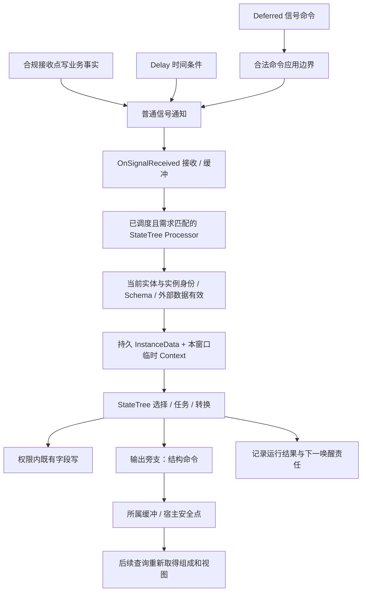

# Mass 与 StateTree 执行机制：公开合同与历史源码片段对照

> 知识成熟度：L2。主要承诺是公开合同的静态核对，以及四段仓内历史源码文本的有限分析；纸面协议不代表 UE 实现已经运行。
> 知识基线：2026-10-05 核对的 Epic 公开文档/API，页面标识为 Unreal Engine 5.8 Documentation。动态网页不提供本文历史摘录的私有 revision 身份。
> 最后更新：2026-10-05。重写信号、实例所有权、合法访问、状态退出和停止边界，保留历史原件。

## 0. 本文要解决什么问题

一个 Mass 实体正在等待异步工作。工作完成后发了 Signal，为什么树可能仍不动？下一次树确实推进时，为什么不能拿上次保存的 Context 接着用？任务成功、实体销毁和实例释放，为什么又是三件事？

这些问题的共同原因，是把**通知、调度资格、持久进度和临时访问权**混成了一个对象或一次调用。Mass 用数据组成与需求声明组织批处理；StateTree 根据当前输入选择状态、推进任务。二者接在一起时，信号只能提示有工作，合法的消费还需要对应实体、实例存储、当前查询视图与外部数据。本文沿这条因果链解释，不提供另一套绕过现有 Mass 集成的每实体永久 Context 驱动器。

读者应已了解 Fragment、状态/转换和同步调用的基本概念。第 1–4 节建立职责与不变量，第 5 节给可手推的两实体协议，第 6 节用于排错，第 7–8 节保存历史声明及源码摘录，第 9–10 节登记来源与未验证范围。StateTree 通用节点编写和完成聚合的详细教学见 [StateTree 状态树](../感知决策与行为规划/05-StateTree状态树.md)，这里聚焦 Mass 集成。

### 0.1 三类证据不能互相代替

| 证据身份 | 本次能知道什么 | 本次不能据此知道什么 |
| --- | --- | --- |
| 当前 Epic API/文档 | 接口、字段、职责、寿命及需求合同；第 9 节逐项定位 | 私有 .cpp 全部实现、某补丁版本/CL 的字节、运行表现 |
| 仓内历史代码块的可见文本 | 眼前有 Broadcast、phase 检查、Reset 或提前返回等语句；按其分支推读 | 原文来源已认证、截掉的下游不存在、这些代码可直接编译 |
| 原作者历史身份声明 | 当时记录了版本、CL、分支、日期及路径/行号；第 7–8 节原字节留存 | 这些声明是本次机器的 Build.version 或本轮 checkout 观察 |

例如，公开页有 `Start`，不能证明旧块每个重载属于它宣称的 CL；旧块直接调用 `Broadcast`，也不能推出“当前所有信号都在同一栈完成 StateTree Tick”。正文中的工程约束、业务票据和纸面状态转移会明确标为**本文协议**，不伪装为引擎隐含保证。

## 1. 先分清数据、身份和访问窗口

### 1.1 Mass 为什么需要查询和组成边界

实体由句柄定位，Fragment 保存位置、工作结果等数据，Tag 是无数据的分类标记。具有相同组成的实体由 Archetype 组织，Chunk 支持批量访问。Query 描述要匹配的组成及需要的访问权限，Processor 在满足其执行条件的范围内使用这些数据。这样可以批处理同类工作，但它不是“拿到任何指针就能长期访问”的对象模型。[MassEntity 总览](https://dev.epicgames.com/documentation/en-us/unreal-engine/overview-of-mass-entity-in-unreal-engine)

改变已有速度数值，不一定改变实体组成；添加 Fragment 或 Tag 则可能迁移 Archetype。迁移后，实体身份可能还在，旧 Chunk/Fragment 视图却已不能作为后续访问凭据。因此必须把**能保存的定位句柄**和**本批次借用的数据视图**分开。这也是第 3 节把字段写与结构命令分流的原因。

### 1.2 共享资产、持久存储、临时 Context、借用视图

| 层 | Mass/StateTree 中的对象 | 谁负责、保留到哪里 |
| --- | --- | --- |
| 共享定义 | 编译后的只读 StateTree 资产及配置 | 多实体可以引用同一资产；不把本实体进度写进共享定义 |
| 每实例持久进度 | `FStateTreeInstanceData`；`FMassStateTreeInstanceFragment.InstanceHandle` 指向子系统中的实例数据 | `UMassStateTreeSubsystem` 管理分配/获取/释放；片段持句柄，不内联承包整个实例 |
| 本次驱动视图 | `FStateTreeExecutionContext` / `FMassStateTreeExecutionContext` | 临时 helper，接入当前实例数据与所需服务，不跨多个 frame 保存 |
| 当前数据借用 | Mass 执行上下文提供的 Fragment/Chunk 视图，Schema/External Data 视图 | 只在满足相应寿命、查询和线程条件的访问窗口使用，不能由引用延长底层对象寿命 |

这些层分别由 [实例 Fragment](https://dev.epicgames.com/documentation/unreal-engine/API/Plugins/MassAIBehavior/FMassStateTreeInstanceFragment)、[存储子系统](https://dev.epicgames.com/documentation/unreal-engine/API/Plugins/MassAIBehavior/UMassStateTreeSubsystem)、[InstanceData](https://dev.epicgames.com/documentation/unreal-engine/API/Plugins/StateTreeModule/FStateTreeInstanceData)与 [Mass Context](https://dev.epicgames.com/documentation/unreal-engine/API/Plugins/MassAIBehavior/FMassStateTreeExecutionContext)的公开接口连接起来。`GetInstanceData` 的返回指针只用于合法访问，不是永久地址稳定性承诺。

[ExecutionContext 的公开说明](https://dev.epicgames.com/documentation/en-us/unreal-engine/API/Plugins/StateTreeModule/FStateTreeExecutionContext)明确它是 temporary，不应跨多个 frame 存储。Owner 用于实例化 UObject 的归属与日志，寿命至少覆盖 InstanceData；Owner 不自动等于被控制的实体或 Pawn。这里的 temporary **不要求每次 Start、Tick、Stop 各新造一只 Context**：同一合法驱动窗口内可按需要使用它，前提是当前存储、数据要求和访问许可仍成立。

两次驱动之间销毁 CA0、下次用同一 DA 建立 CA1，DA 可以接续进度；每次重置 DA 会丢进度，保存 CA0 引用则可能留下过期视图。反过来，两个不同 Context 若接入同一可变 DA，仍可能串写。实例隔离要看存储和外部共享对象，不能只数 Context 对象。持久容器也不等于所有节点数据永久保留，退出、重选和不同存储类别各有生命周期。

### 1.3 有效性要按所要访问的对象逐层判断

`FMassEntityHandle::IsSet()` 仅检查 Index/SerialNumber 是否已设置，是否代表系统中的有效实体仍要询问系统。[IsSet 说明](https://dev.epicgames.com/documentation/unreal-engine/API/Runtime/MassCore/FMassEntityHandle/IsSet)

本例消费一次工作时采用以下准入顺序。这是工程检查依赖，不声称引擎每个内部函数按此全序调用：

1. 使用本 World 的正确 EntityManager，以完整句柄检查 `IsEntityValid`；不只保留 index
2. 对需要已构建数据的访问，再确认 `IsEntityBuilt`。其公开合同以前面有效句柄为前提，不能倒过来拿任意坏句柄先问 Built
3. 当前组成满足已关联到 Processor 的 Query；在合法查询范围取得本次 Fragment 视图
4. 从当前实例 Fragment 得到实例句柄，由正确的 StateTreeSubsystem 检查 `IsValidHandle`，然后取相应 InstanceData
5. 若访问属于一个异步业务动作，再核对活动期与请求票据，确认本次仍是同一动作
6. Owner、资产、Schema Context Data、External Data 和线程条件满足后，才允许驱动或写入

[EntityManager](https://dev.epicgames.com/documentation/unreal-engine/API/Runtime/MassEntity/FMassEntityManager)与上述实例子系统分别回答不同问题。实体活着，不证明其原实例仍在；实例有效，不证明旧请求仍应完成；完整句柄可按值留给以后定位，但不保活。批次结束、组成迁移或命令应用后需要后续访问时，重新取得有效视图，不能仅对旧指针做一次“非空”检查。

## 2. 从 Signal 到树推进，中间发生了什么

### 2.1 四种入口、两层处理

[UMassSignalSubsystem](https://dev.epicgames.com/documentation/unreal-engine/API/Runtime/MassSignals/UMassSignalSubsystem?lang=en-US)提供普通、按时间延后和经命令缓冲提交的入口。Delay 与 Deferred 描述的是不同等待条件：

| 入口 | 可核对的含义 | 接回树推进前还缺什么 |
| --- | --- | --- |
| `SignalEntity / SignalEntities` | 普通通知；第 8 节历史块 H14 可见直接调用 Broadcast | 监听者收到通知，不等于消费 Processor 已执行，也不等于树已 Tick |
| `DelaySignalEntity / DelaySignalEntities` | 带秒数的时间延后；H14 可见保存目标时间戳 | 到期派发的完整实现未摘出；不保证精确某秒或某帧推进 |
| `SignalEntityDeferred / SignalEntitiesDeferred` | 公开合同明确经 Mass Command Buffer 异步通知；H14 可见命令执行时再调用普通通知 | 合法缓冲应用边界、之后的接收与调度；Deferred 不是“必在下一帧” |
| `DelaySignalEntityDeferred / DelaySignalEntitiesDeferred` | 同时有命令缓冲入口和时间延后意图 | 本次未见其函数体，延迟从提交还是命令执行起算、零秒处理和精度均未认证 |

即使第一个入口的历史实现会在发送栈通知监听者，也不能据此在回调里直接改当前遍历组成或递归推进同一树。反之，说所有 Signal 都先排队、发送栈绝不触发监听者，同样与眼前历史文本不符。普通通知的栈行为、业务消费和数据访问权限是三个问题。

[UMassSignalProcessorBase](https://dev.epicgames.com/documentation/unreal-engine/API/Runtime/MassSignals/UMassSignalProcessorBase?lang=en-US)把接收回调 `OnSignalReceived`、执行入口 `Execute` 和派生消费扩展点 `SignalEntities` 分开。它的公开双缓冲用途，是处理期间还能接收新信号；历史 H15 可见切换缓冲及按 owned queries 准备 Archetype 的前半过程。缓冲名里的 frame 不能证明固定下一帧执行，锁字段不能证明任意调用方式安全，片段中的去重注释也不能证明所有信号 exactly-once。

### 2.2 Signal 提示重读事实，不交付业务 payload

[MassGameplay 总览](https://dev.epicgames.com/documentation/en-us/unreal-engine/overview-of-mass-gameplay-in-unreal-engine)把 Mass Signal 描述为命名且无 payload 的唤醒方式。本文协议先在允许的数据接收点写入业务事实，再通知消费者读取现状。例如保存“请求 r7 成功”，随后发 `WorkChanged`；不要把同名信号出现三次解释成三份奖励或三次完整 Tick。

“先写事实，再通知”本身还不构成跨线程同步：Signal 不是内存屏障。异步完成若来自 worker，本例先通过项目已经定义的同步接收点回到合法数据写入范围，再写事实、发信号。没有这样的线程/可见性合同，仅换成 Deferred 仍不够。重复和迟到结果由第 5 节的实例、活动期、请求票据及幂等输出处理，不要求信号层提供可靠消息队列或无损计数语义。

### 2.3 使用已有 Mass 集成的职责链

| 角色 | 当前公开职责 | 不能从角色名补出的实现 |
| --- | --- | --- |
| `UMassStateTreeActivationProcessor` | 发送激活信号以引发首次更新 | 分配、Start、首次 Tick 的完整内部顺序和帧号 |
| `UMassStateTreeSubsystem` | 管理实例数据；收集 StateTree 的 Mass requirements 并创建相应动态 Processor | 池复用算法、所有异常回滚和指针稳定性 |
| `UMassStateTreeProcessor` | 按树的 Mass requirements 管理执行需求，覆盖信号消费；文档不预期用户手动实例化这些 Processor | 每个信号一次 Tick、全部 Start/Tick 分支及默认频率 |
| `UMassStateTreeFragmentDestructor` | 停止、反初始化实体上的 StateTree | 所有销毁路径的完整 Stop/Free 次序，项目请求和延迟回调自动取消 |

对应入口：[首次激活](https://dev.epicgames.com/documentation/unreal-engine/API/Plugins/MassAIBehavior/UMassStateTreeActivationProcesso-)、[子系统](https://dev.epicgames.com/documentation/unreal-engine/API/Plugins/MassAIBehavior/UMassStateTreeSubsystem)、[动态 Processor](https://dev.epicgames.com/documentation/unreal-engine/API/Plugins/MassAIBehavior/UMassStateTreeProcessor)、[FragmentDestructor](https://dev.epicgames.com/documentation/unreal-engine/API/Plugins/MassAIBehavior/UMassStateTreeFragmentDestructor)。激活页的截短 URL 是实际可访问入口，不在这里猜另一个同名路径。

因此主例从“集成已配置好并得到有效实例”开始，首次更新由现有激活职责引出；它不假装通过手写 for-each 循环复刻全部内部调度。

### 2.4 Running 为什么还需要下一次唤醒

Running 只说明当前任务还没完成。任务具有 Tick 开关，宿主也必须实际再次驱动，不能因为函数名叫 Tick 就推导下一渲染帧必调用。一次等待应回答：下一次由服务完成、定时请求还是另一处理器唤醒？动作取消后由谁拒绝旧通知？如果没有生产者，仅记录一个 timeout 字段不会让等待自己结束。

本例的正常推进由业务完成回调唤醒；另外由宿主已配置的一次性超时事件兜底，详见 5.1。它不是树在没有调度时自发检测超时。丢失这些唤醒来源是调度协议缺口，不能用无限自发信号掩盖。

实例 Fragment 的 `LastUpdateTimeInSeconds` 公开用途是计算 ticking delta time，但本次没有核完整公式、首次值或夹取。A、B 上次更新时间不同，即使同批收到同名信号，也不能用信号数量或一个未经说明的渲染帧 delta 代替各实例的时间口径。

## 3. 树能读写什么，命令缓冲又保护什么

### 3.1 把需求声明成调度器能看见的合同

[FMassFragmentRequirements](https://dev.epicgames.com/documentation/en-us/unreal-engine/API/Runtime/MassEntity/FMassFragmentRequirements)分别提供 Fragment 的访问/存在需求和 Tag 的存在需求。以下是项目示例名称：

| 业务访问 | 应表达的需求 | 仍需满足的条件 |
| --- | --- | --- |
| 读取 FPosition / JobFacts | Fragment ReadOnly + 所需 presence | 本次匹配 Query 和有效视图 |
| 修改 FVelocity / JobOutput 既有字段 | Fragment ReadWrite + 所需 presence | 当前合法写入范围，不能写别的实体或隐藏共享对象 |
| 仅处理 FMovingTag / WorkEnabledTag 实体 | Tag presence | Tag 没有数据 ReadWrite 模式；增删 Tag 属组成变化 |
| Task 内读取 JobService 子系统 | 对应 Subsystem/External Data 需求 | 服务寿命、访问模式及所需游戏线程条件 |
| 访问关联实体或间接数据 | 对应的 linked/indirect requirements | 不能由本实体 Fragment 的声明自动覆盖 |

局部声明了一个 Query 变量还不够，要通过当前支持的构造/注册路径关联 Processor，需求才可供执行图使用。参见 [FMassEntityQuery 的 RegisterWithProcessor / ExportRequirements](https://dev.epicgames.com/documentation/en-us/unreal-engine/API/Runtime/MassEntity/FMassEntityQuery)和 [UMassProcessor 的 owned queries / execution requirements](https://dev.epicgames.com/documentation/en-us/unreal-engine/API/Runtime/MassEntity/UMassProcessor)。额外子系统要求与游戏线程要求见 [FMassSubsystemRequirements](https://dev.epicgames.com/documentation/en-us/unreal-engine/API/Runtime/MassEntity/FMassSubsystemRequirements)。

依赖声明使调度有依据，不会自动发现 Task 偷读的全局缓存或任意 UObject。节点绑定成功也不赋予线程许可。给两个实体各造 Context，不能解决它们同时写一个未声明共享服务的问题。

### 3.2 字段写与组成改变必须在发生处区分

在已经取得合法 ReadWrite 视图时，把 `JobOutput.progress` 从 0 改为 1，是已有 Fragment 的字段写；无需为了“所有输出都统一延迟”而排成结构命令。请求添加 DoneTag、移除某 Fragment 或销毁实体则会影响组成/存储，本例正在 Query 遍历，因而走合法 deferred 路径，交宿主允许的安全点应用。[MassEntity 总览](https://dev.epicgames.com/documentation/en-us/unreal-engine/overview-of-mass-entity-in-unreal-engine)、[FMassExecutionContext](https://dev.epicgames.com/documentation/unreal-engine/API/Runtime/MassEntity/FMassExecutionContext)

提交 AddDoneTag 时，当前批次不能假定新 Tag 已存在。等应用后再查询、重新取得视图，才谈新组成的访问。这种延迟换来遍历稳定性，也增加了结果可见性的等待和顺序设计成本；它不是“所有版本的所有创建/结构 API 只能延迟”的普遍禁令。

同理，收到 Signal 后能否写 Fragment，取决于当前访问合同，而不是信号名称。只有通知栈没有查询写权限时，不能顺手写；已进入合法写阶段时，也不必把正常字段赋值全部转成 CommandBuffer。

### 3.3 Deferred 不等于任意线程共享队列

[EntityManager](https://dev.epicgames.com/documentation/unreal-engine/API/Runtime/MassEntity/FMassEntityManager)对其默认 Defer 缓冲说明了游戏线程限制；[FMassCommandBuffer](https://dev.epicgames.com/documentation/unreal-engine/API/Runtime/MassEntity/FMassCommandBuffer)公开所属线程检查和缓冲合并入口。并行 Query 有配置每个 job 独立缓冲的入口，但这是宿主安排的能力，不是两个 worker 可以向同一缓存缓冲任意 Push 的证明。

本例用当前合法 `FMassExecutionContext` 提供的 deferred 路径；是否允许并行缓冲、怎样合并、何时应用由相应宿主合同决定。`FlushDeferred` 接口存在，不授权在遍历中为“让树醒来”擅自 Flush。也不能改线程 ID 来假装同步问题已解决。

线程安全需要四件事同时成立：可见的读写依赖、受限对象的执行线程、数据生命周期和命令缓冲所有权。快照只是一种项目策略；快照怎样生成并安全发布本身要有合同，不能强制所有 Mass 字段更新先复制快照，更不能把“只读快照”当作 UObject 任意跨线程访问许可。

## 4. 进入树以后，完成、退出和释放如何分开

### 4.1 编译产物不能替代当前输入

[FStateTreeCompiler](https://dev.epicgames.com/documentation/en-us/unreal-engine/API/Plugins/StateTreeEditorModule/FStateTreeCompiler)把编辑器表示整理成紧凑运行数据。可做的结构、类型与绑定检查应尽早完成，但编译时存在的属性路径不保证今天这个实体仍有对应服务或有效对象。

进入本次合法驱动窗口还要准备 Schema 声明的 Context Data、通过收集机制满足节点 External Data，并验证相应视图。二者不是“构造函数自动替宿主处理一切”的同一个入口。若 JobService 缺失，本例停止该次推进并记录缺项，不解引用、不偷偷换成空实例，也不把它当成树内某 Task 已返回 Failed。

数据绑定还受阶段可见性约束：Enter Condition 不能读取本状态尚未运行 Task 的未来输出；应读现在已提供的上下文或合法先前数据，再决定是否进入。Task 可用的数据范围也不是任意状态的全部数据。[StateTree Data Flow](https://dev.epicgames.com/documentation/en-us/unreal-engine/overview-of-state-tree-in-unreal-engine)

### 4.2 Task 返回值不是整棵树的结束命令

当前完成合同有任务参与标志 `bConsideredForCompletion` 和 All/Any 控制；参与集合、聚合条件及完成转换共同决定后续路径。[FStateTreeTaskBase](https://dev.epicgames.com/documentation/en-us/unreal-engine/API/Plugins/StateTreeModule/FStateTreeTaskBase)、[TTasksCompletionStatus](https://dev.epicgames.com/documentation/unreal-engine/API/Plugins/StateTreeModule/TTasksCompletionStatus)

例如同一状态显式 All，移动和监视都参与，移动成功而监视一直 Running，不能靠“所有参与者完成”进入完成出口；若只有移动参与，监视始终 Running 且不参与，则移动可以承担正常完成，但真正退出时仍须清掉监视自己的资源。显式 Any 下，有限等待先成功可以触发完成转换，若因此退出，尚未完成的移动需要取消。

这里沿用 [05 的完成合同](../感知决策与行为规划/05-StateTree状态树.md)：不重猜默认 All/Any、空参与集合、混合 Succeeded/Failed 的优先级或非参与任务 Failed 的影响。主例只用显式配置且单一完成责任者的叶状态。完成通知之后还要选择合法转换目标；全部目标不可选时不能报告已进入 Done，也不能编造引擎固定返回值或默认 fallback。

### 4.3 持续父状态和真正退出的叶任务

`Work/Wait → Work/Done` 可能保留共同父状态 Work。[EStateTreeStateChangeType](https://dev.epicgames.com/documentation/en-us/unreal-engine/API/Plugins/StateTreeModule/EStateTreeStateChangeType)区分 Changed 与 Sustained；任务的 `bShouldStateChangeOnReselect` 控制已活动任务的 Enter/Exit 通知，转换的重激活策略也参与结果。因此既不能说“每次换状态都全退全入”，也不能说“父状态永不收到 Exit”。

主例明确不强制重激活共同父状态，父资源任务的重选开关为 false。真正离开的 Wait 撤销自己那一份请求和监听，Work 的资源继续使用；不把整个 DA 清空。若改为重选时重启，必须成对设计旧动作撤销和新动作初始化，不能只开通知开关又沿用“保持进度”的业务分支。

[StateCompleted 专页](https://dev.epicgames.com/documentation/en-us/unreal-engine/API/Plugins/StateTreeModule/FStateTreeTaskBase/StateCompleted)说明条件转换改变状态时不调用该完成通知。故正常完成、条件中断和宿主 Stop 都要能通过实际退出/终止路径收尾，不能只在 StateCompleted 清理。重复收尾必须幂等，并且只撤自己拥有的资源，不能取消其他实体仍在使用的共享 Processor 订阅。

### 4.4 树终态、失效检测与合法退场是三条分支

树得到 Succeeded/Failed，是运行结果；它不等于实体销毁，也不自动等于实例 Free。本例正常完成后保留有效 IA/DA，供拥有者读取结果。只有真正解除该实例、宿主退场等生命周期动作，才由合法拥有者安排停止和释放。

消费时发现实体、实例或 Owner 已失效，则停止该次访问、跳过或丢弃工作并报告原因。普通消费者不能经旧 Fragment 查“对应存储”来补做 Reset/Free；那可能是过期地址或已经分给另一代对象的槽位。`FragmentDestructor` 的停止/反初始化职责和子系统的存储管理提供了合法清理入口，但公开页未证明全部销毁路径和内部 Stop/Free 全序。

本文的安全终结协议是：在 Owner/树/存储仍可用的合法生命周期阶段，由拥有者封闭旧活动期的业务结果接纳，撤销自有请求/监听，协调需要的树停止与资源收尾，最终由存储拥有方释放一次；终结后旧实例不再驱动。这里的先后是本例防止晚到结果生效的业务约束，不是对引擎内部每条函数调用的认证。Owner 已失效时不能再次解引用它来“补 Stop”；应事先有可用阶段的退出入口和持久拥有方的清理安排。

### 4.5 实体还在，也可能已经不是原来那次任务

本例回调票据包含 World、完整 entity handle、instance handle、activation token 和 requestGeneration。前两层防错 World/槽位复用，中间层防实例替换，后两层防同一实体、同一树重新进入后旧结果写给新动作。这些票据是项目协议，不能伪造为引擎自带字段。

普通 Context 和借用 Fragment 视图不能捕获到异步回调里。若使用 [FStateTreeWeakExecutionContext](https://dev.epicgames.com/documentation/en-us/unreal-engine/API/Plugins/StateTreeModule/FStateTreeWeakExecutionContext)，其有效性仍涉及原 state/global activation、Owner、Tree、Storage，调用者仍承担线程安全。它不是业务 requestGeneration 的替代物，也不是延长普通 Context 寿命的方法。A 停止 a1/r7 后重入 a2/r8，旧 r7 成功即使遇到同一实体仍存活，也必须拒绝。

## 5. 两实体纸面协议：从事实到结果，再到退场

本节所有结果均为 **PAPER_EXPECTED**。这是原创、可逐步推演的项目协议，不是可编译 UE API、引擎执行日志或真实调度测试。序号表示论证依赖，不承诺引擎私有函数的全部先后。

### 5.1 输入、配置与责任人

| 输入/责任 | 明确约定 |
| --- | --- |
| World 与实体 | W 中 A=(index 41, serial 9)、B=(42,4)，数字仅作身份示意 |
| 资产与存储 | 同一只读树 T；有效 IA≠IB，子系统管理 DA≠DB；集成已完成必要实例设置 |
| 本次查询 | 已关联 Processor；JobFacts ReadOnly，JobOutput ReadWrite；WorkEnabledTag 为存在条件；按实际需要声明实例 Fragment 及额外依赖 |
| Schema / External Data | Schema 的实体上下文已按要求设置；节点需要的 JobService 本次有效并已声明，访问满足游戏线程要求 |
| 事实写入者 | 服务结果先回到项目规定的同步接收点；该接收阶段有 JobFacts 写权限，不能借消费 Query 的 ReadOnly 权限写它 |
| 可变业务数据 | JobFacts=(requestGeneration, outcome)，outcome 为 None/Success/Failure；JobOutput=(appliedGeneration, progress)，名称不是引擎 API |
| 动作身份 | A 当前 a1/r7，B 当前 b1/r2；每个请求票据绑定 W/entity/instance/activation/request 五层身份 |
| 初值 | A 的 outcome=None，appliedGeneration=6，progress=0；B 的 outcome=None，输出与 DB 均保持原值 |
| 幂等键 | 一次性效果账本以完整 W/entity/instance/activation/request 票据为键；appliedGeneration 仅是当前动作的便读字段，不能单独跨活动期去重。本例 a1 内 r7 不复用；新实例/活动期的输出初始化由拥有者按新身份处理 |
| 下一唤醒 | JobService 完成后在接收点写事实并发 WorkChanged；宿主另设置一次性超时事件，超时接收点仅在同一有效请求仍为 None 时写 Failure 并唤醒 |
| 取消/重试 | 首个合法终结结果关闭该请求的结果接纳，取消自己的超时/请求；其他到达无效或幂等忽略。本例不自动开启 r8、不无限重试 |

超时事件由宿主真实的定时/事件设施负责触发接收点，是本例输入前提；这里没有运行它，也不以给 Fragment 增加 deadline 字段冒充定时调度。若某平台只安排延迟唤醒，合法消费者还须读取 deadline 和当前请求，完成等价判断，不能把 Delay 本身当 Failure payload。

树的路径为 Root/Work/{Wait,Done,Recover}。叶状态显式 `TasksCompletion=All`，各只有一个参与完成的任务，`bConsideredForCompletion=true`。Wait 的任务显式设 `bShouldCallTick=true`、`bShouldCallTickOnlyOnEvents=false`，在本例真正收到宿主驱动后读当前 outcome：None→Running，Success→Succeeded，Failure→Failed。Work 也显式设 All，其唯一持资源任务明确参与该状态的完成、持续返回 Running；本例不配置 Work 的完成出口，不借其返回值选择工作分支。它的 `bShouldStateChangeOnReselect=false`，本例不强制重激活共同父状态。

Wait 的成功完成转换指向 Done，失败完成转换指向 Recover；两目标各有显式可选条件。Done 的唯一任务记录一次成功输出并 Succeeded，其成功转换指向树 Succeeded；Recover 的唯一任务记录失败并 Succeeded，其成功转换指向树 Failed。它们没有新的异步等待。叶任务自身异常失败则显式进入树 Failed；不从默认完成规则推导这些边。普通主例中 Done/Recover 所需条件均成立。

另规定一个条件中断分支：Wait 运行时 `cancelRequested=true`，且取消转换选中 Recover 时，Wait 按退出协议取消本次请求；不要求先收到 StateCompleted。若所有候选目标均不可选，本例宿主记 `candidate-unselectable`，终止这项工作并交合法拥有者走 4.4 的退场协议；它不是引擎默认 fallback 或固定返回值。这个宿主观察/终止策略也属于纸面协议，尚未实现为 UE 接口。

### 5.2 主成功链：两次驱动接续同一份 DA

1. **建立起点。** 现有激活职责已引出首次合法更新，A 进入 Work/Wait 并发起 r7；DA 保留运行进度。CA0 离开作用域，DB 属于 B，仍为 b1/r2。不能把 CA0 销毁解释成 DA Reset；也没有据激活信号反推出具体 Allocate/Start 顺序
2. **写事实。** r7 的成功回调到达同步接收点。接收端检查 W、A=(41,9)、IA、a1、r7 及仍接受结果，合法写入 Success，关闭后续终结结果接纳并取消本请求超时；再发 WorkChanged(A)。取消不保证已经在途回调消失，票据检查仍需保留
3. **通知与接收。** 若走普通入口，历史 H14 的调用体在此执行 Broadcast；接收缓冲可以得到该通知。此时纸面记录“通知已发生”，不能提前记录“树已成功”。消费侧尚须获得调度和合法数据
4. **准入。** 已调度的消费角色按 1.3 验证当前 A、Built、Query 与 IA，确认当前工作仍对应 a1/r7；通过正确子系统重新取得 DA。闭合的是“仍为当前动作”，不是要求已经关闭的结果接纳重新打开。此处不使用 CA0、旧 DA 指针或旧 Fragment 视图
5. **驱动。** 接入当前 Mass Context/实体与 DA，建立本次临时 CA1；设置并验证 Schema 数据及 JobService 后，合法树驱动读到 Success，Wait 的唯一完成责任者成功；显式成功转换且 Done 可选，故路径变为 Work/Done。退出的 Wait 幂等撤销自有资源，持续 Work 不整体清空，DA 仍是该实例的存储
6. **输出。** Done 检查当前工作身份及完整票据的效果账本；该键尚未应用，故将 JobOutput.appliedGeneration 从 6 合法写成 7、progress=1，并把该完整票据标为已应用。重复观察同一票据不再次发放效果；另一个活动期恰好也用 r7 不会被这个键误吞。如果需要 DoneTag，提交一项结构请求；本批次不因此立即假设 Tag 已可查
7. **记录结果再结束窗口。** 在有效驱动窗口内处理 Done 的显式完成转换、记录树 Succeeded 后，才结束相应临时 Context 与借用视图。结构命令由宿主许可的安全点应用；后续查询重取组成/视图。这里不要求每次树驱动前 Flush，也不允许用 Flush 触发递归 Tick
8. **回顾两种结束。** 上一步已记录树终态，这里没有 Context 消失后的自发树推进。IA/DA 在本例仍保持有效供拥有者检查结果，A 不因此被销毁；B 的 DB 和输出未变。另到真正解绑或宿主退场时，由合法拥有者封闭 a1、协调停止/自有资源收尾并按存储协议释放，不能把正常完成偷换成立即 Free

可手推结果：A 的 progress=1、appliedGeneration=7，r7 一次性效果为一次；A 的树为本例显式终态，IA/DA 尚在；B 不变。这些是由输入、转换和幂等协议得到的预期，不是观测计数或引擎性能结论。

这些逻辑步骤不是 Tick 次数：首次进入、任务返回与完成转换的内部迭代数没有在此认证。若目标版本需要额外合法驱动窗口，仍重取同一有效 DA 和当前视图，并由宿主按已确认的下一唤醒合同调度；不得保存 CA1 等下一帧，也不能把无后续唤醒的 Running 当成已经完成。

### 5.3 两个原创流程块

下面的文本块承担逐实体集成关系教学，不能替代 Mass 内部执行器，也不是 UE 签名。它展开旧文“每批 Tick 一次”的省略点：

```text
PAPER_PROTOCOL，非 UE API / 非运行日志
已有 Mass 集成：管理实例、发送首次激活信号、按 requirements 安排 Processor
业务接收点：核对 W/entity/instance/activation/request，合法写事实，再通知
在一次受调度的合法消费范围内，逐个处理当前匹配实体：
  先核实体有效，再按需要核 Built、Query、实例句柄和当前动作身份
  不成立：丢弃本次工作并报告原因；不经旧视图 Reset/Free
  成立：取得同一持久 InstanceData，满足 Schema / External Data / 线程条件
  通过本窗口临时 Mass StateTree Context 合法驱动，保留结果于相应持久数据
  Running：指出已安排的下一唤醒者；不得凭返回值假设下一帧自动 Tick
  终态：保存本例结果；不据此立即 Free 实例
  合法字段写使用当前 ReadWrite 视图；组成请求走所属的 deferred 缓冲
离开窗口：不保留 Context 或借用视图
宿主安全点应用结构请求；后续访问重新查询；它不是每次驱动的前置 Flush
真正实例退场：合法拥有者在对象仍可用时协调停止与一次性释放
```

图的箭头表达通知/访问/输出的依赖关系；它不是当前私有实现的逐函数调用栈：



主链从接收/缓冲进入 Processor、实例数据和树；结构命令是树输出的旁支。Deferred 信号自己也经过一个命令边界再通知，不代表所有树更新都先过这个边界。Delay 的图边表示到期后可走通知路径，不认证到期实现或精确帧；Delay+Deferred 同时受两类边界约束，其起算点仍未知。图没有“树结果立即回调自身 Tick”的环，后续唤醒由 5.1 明确的生产者负责。

### 5.4 三类等待路径的纸面追踪

从同一“事实已合法写入”起点，分别替换第 5.2 步骤 3 的通知方式：

- 普通通知：H14 可见本次调用体 Broadcast，H15 的接收/执行职责仍分层；只有通知发生时，尚不能得出步骤 4–8 已完成
- Delay(A, 2 秒)：H14 可见目标时间=记录时 World 时间+2；此时只是保存延迟记录。待时间条件满足后仍需通知、接收、合法消费，不能断言精确两秒后树已成功。等待途中销毁 A，照样走 T07 的拒绝分支
- Deferred(Context, A)：H14 可见复制完整句柄数组进命令；当前窗口提交后尚未通知，合法应用命令时才走普通入口，再接消费。复制句柄不保活实体，也不授予缓冲任意多线程写权限
- Delay+Deferred(Context, A, 2 秒)：公开页能支持两层意图，H14 没有该函数体。纸面只能分别要求合法缓冲路径和时间条件，不替它选起算时刻或全局 FIFO；后续消费仍核当前身份

### 5.5 二十个有限正反情境

以下每行均为 PAPER_EXPECTED，列出对同一协议的输入变化、拒绝点或结果。不是“20 项 UE 测试通过”；H14–H17 指第 8 节四个历史块。

| ID | 改变的输入/步骤 | 可手推的结果与停止条件 |
| --- | --- | --- |
| T01 | 按 5.2 完成 A；CA0 已消失，CA1 重新接入 DA | 同一 DA 接续进度，A 输出一次且 DB 不变；Context 析构不等于存储 Reset |
| T02 | r7 首个合法结果为 Failure，Recover 可选 | Wait 的失败转换进入 Recover；清自身请求，Recover 记录失败后由显式转换到树 Failed；不暗中发 r8，实例仍按拥有者生命周期管理 |
| T03 | Done/Recover 所有候选条件均不满足 | 不记“已进入目标”。本例宿主记 candidate-unselectable 并终止工作，合法拥有者按 4.4 退场；不把此策略写成引擎固定返回/默认 fallback，不由消费侧直接清 DA |
| T04 | 通知之后 WorkEnabledTag 消失，Query 不再匹配 | 不借旧视图强行 Tick 或取缺失 Fragment；该次跳过，不推导 Task Failed/自动 Free。若业务要终止，由生命周期拥有者安排 |
| T05 | 资产编译成功，但本次 JobService 或 Schema 数据缺失 | 本次驱动前停下并报告具体缺项；不解引用、不自旋、不替换为空实例。本例交拥有者终止，不假装已进入树内失败转换 |
| T06 | A 有效，IA 对正确子系统已失效 | 不获取旧 DA 指针继续驱动；报告实例归属异常。是否重新初始化必须由合法拥有者另行决定，本次不自动重建 |
| T07 | 发信后 A=(41,9) 销毁，同 index 后来复用为 (41,10) | 用完整旧句柄询问对应 Manager 后丢弃；不按 index 找新实体，不经过期 Fragment Free 新实例；清理由原合法生命周期路径承担 |
| T08 | A/r7 连续三个同名信号，或相同终结回调重复 | 不推导三次 Tick。接收协议拒绝额外终结结果；重复消费若看见同一事实，完整票据效果账本不重复应用，appliedGeneration 只是当前动作的记录。未认证引擎精确合并规则 |
| T09 | a1/r7 结束，同实体重入 a2/r8，r7 晚到 | 票据不匹配即拒绝，不能仅凭 A 仍存活写给 r8；Weak Context 也须满足活动身份和 Owner/Tree/Storage、线程条件 |
| T10 | Wait 为 Running，服务和超时唤醒设施都没有安排 | 没有已知下一驱动，不能推导自动完成。诊断缺唤醒来源；由合法宿主的显式停止入口结束此项，不用无界自发信号或“字段里有超时”伪造进度 |
| T11 | Work/Wait→Work/Done；另试 cancelRequested 条件转 Recover | 成功选择后只退出旧叶的动作，持续 Work 按已设 reselect=false 保留资源，DA 不整体 Reset；条件中断不依赖 StateCompleted。改重选/重激活设置后须重新设计通知与资源协议 |
| T12 | 本批先写 progress，再申请 AddDoneTag | 字段可按现有 ReadWrite 许可写；组成请求提交不等于当前批次已见 Tag。安全点后重取视图，不跨应用边界沿用旧引用 |
| T13 | 两 worker 向同一 Manager 默认 Defer 缓冲任意 Push | 反例不成立；需宿主支持的当前 Context/各 job 缓冲和合并边界，不能改线程 ID 或中途 Flush 当同步修复 |
| T14 | Query 声明 JobOutput，但 Task 偷用未声明游戏线程 UObject/共享缓存 | 不获访问许可；补全依赖、生命周期和正确线程合同才有成立前提。绑定成功或两个 Context 不构成安全证明 |
| T15 | 正常 Stop/EndPlay 类退场入口到来，Owner/存储仍可用 | 本例拥有者封闭 a1 的业务结果，撤自己的请求/监听，协调合法停止和资源收尾，存储拥有方释放一次；不得撤掉 B 仍使用的共享 Processor 订阅。引擎内部全序未认证 |
| T16 | Owner 已失效，仍留旧 Context 或旧回调 | 拒绝/丢弃，不能为补清理解引用已失效对象做 Stop；应在此前合法阶段已安排生命周期清理，不声称本次消费能补救全部遗漏 |
| T17 | H16 中 IsValid=false 或 CurrentPhase 非 Unset；另看旧树 Running 的 Start | 前两者可见返回 Failed；后一条可见 Stop 和 Reset，仅属该 Start 路径。片段在初始化处截断，不能由此证明完整重启或每 Tick 重置 |
| T18 | H17 的 TickPrelude 返回非 Running | 可见立即返回 PreludeResult；正常 Tick 可见更新任务、触发转换、Postlude。TickTriggerTransitions 后半截缺失，不能补猜最终结果 |
| T19 | A/B 上次更新时间不同，同批收到同名 Signal | 保留各实例更新时间语义，不能用信号数或未说明的统一帧 delta 算进度；LastUpdateTimeInSeconds 的完整公式/夹取仍待实际源码核对 |
| T20 | 普通通知的订阅者在发送期间再发信号 | 识别通知重入风险，让接收与消费分层，不递归驱动同一树；公开双缓冲只支持处理中继续接收，不保证无限工作会终止或 exactly-once |

T04/T05/T06 是不同的准入失败，T02 是已经合法进入树后的任务结果，T07 是旧实体不再存在，T15 是拥有者主动退场。把它们统一成“失败就重试/Reset/Free”会同时破坏调度、所有权和实例身份。

## 6. 以边界定位故障，而不是反复发信号

### 6.1 建议记录的因果链

一次故障至少关联：World、完整实体句柄、当前实例句柄、业务活动期/请求代次、信号名称和入口种类、事实写入点、接收记录、Processor 是否实际调度、Query 是否匹配、当前数据要求、运行返回/转换目标、下一唤醒责任及结构命令应用边界。日志中的通知条数和 Tick 条数分开统计，不能互相代替。

### 6.2 FAQ

**发了信号，为什么仍在 Wait？** 先确认已完成首次激活；随后分别查通知是否到达、消费 Processor 是否被调度、实体/Query/实例句柄是否仍有效、本次数据是否齐备。进入树以后再查任务 Tick 开关、完成参与/All 或 Any、可选目标和下一次唤醒生产者。提高 Processor 频率不能修复过期身份或不存在的服务。

**为什么 Context 短命，进度还能延续？** 因为进度在 DA，不在 CA0 的 C++ 对象寿命里。后续窗口可接入同一有效 DA；不缓存普通 Context/借用视图，也不每次重新 Start 或 Reset 实例。

**Signal 回调能直接改 Fragment 吗？** 回调本身不给权限；合法字段写按当前访问范围执行，当前遍历中的组成变化走合法缓冲。既不能一律直接写，也不能说所有字段赋值都必须延迟。

**实体无效时，是不是顺便 Free 更安全？** 不是。普通消费只丢弃此项、停止访问并报告；用过期 Fragment 做 Free 可能清错新对象。停止/反初始化和释放属于仍有合法访问能力的生命周期/存储拥有方。

**Task 成功后为什么还保留实例？** Task 完成、状态完成、树终态、实例退场是不同层级。本例树终态保留 IA/DA；实际项目怎样复用或拆除须有自己的生命周期合同，不能从 Free API 的存在倒推出自动调用。

**为什么换子状态后父资源被撤了？** 检查真正失活的状态、Sustained/重选/重激活设置及资源归属。不要把整个实例 Reset 当叶任务 Exit，不要由 A 退出取消共享 Processor 的全部订阅。

**偶发错误为何只在并行时出现？** 除 Fragment 需求外查 Task 隐藏依赖、UObject 线程要求、接收点同步和缓冲所属线程。重复通知还需检查业务幂等；快照、弱引用和 Deferred 三个词都不能替代完整并发合同。

## 7. 历史身份记录：原作者声称，非本轮认证

下面 H01–H13 原字节保存旧文的版本/路径与证据声称；H14–H17 连同各自源码块在第 8 节相邻保存。它们共同保全历史身份，**不作为本轮已核实的当前结论**。尤其原句中的“本机”“当前”“已核实”“完整链路”属于原作者当时的声称，适用限制以第 0 节为准。此处没有取得它们所称的 Build.version、CL、原文件 hash 或导出记录。

#### H01 历史原文记录（旧文 L10–13，未认证）

> 分工声明：本文为 UE5.8 源码层深读；概念/使用层知识见本目录 README 映射表及各篇关联阅读（不重复使用层教程）。

> 版本基准：UE5.8.0 / CL 55116800 / `++UE5+Release-5.8`
> 最后更新：2026-08-18（补入 Mass Signal 与 StateTree Start/Tick 实际函数）。

H01 记录结束。上述身份/核实声称仅作历史保留。

#### H02 历史原文记录（旧文 L17–17，未认证）

本文以 UE5.8 本机源码为证据，梳理 Mass EntityManager/Fragment/CommandBuffer/Processor/Signals 的调度边界，以及 StateTree 编译、实例化与 Mass 组合运行的完整链路；同时给出并发边界、失败路径与排查清单。

H02 记录结束。上述身份/核实声称仅作历史保留。

#### H03 历史原文记录（旧文 L23–27，未认证）

- 本节的版本基准固定为 UE5.8.0。
- 对应变更列表为 CL55116800。
- 分支标识为 `++UE5+Release-5.8`。
- 引擎安装目录只作为只读证据源，不在本节修改。
- MassEntity 与 StateTree 的概念说明，必须能够回指真实源码路径。

H03 记录结束。上述身份/核实声称仅作历史保留。

#### H04 历史原文记录（旧文 L31–31，未认证）

- 核心实现证据：`Engine/Source/Runtime/MassEntity/Private/MassEntityManager.cpp`。

H04 记录结束。上述身份/核实声称仅作历史保留。

#### H05 历史原文记录（旧文 L55–55，未认证）

- Mass Signals 的源码证据位于 `Engine/Source/Runtime/Mass/MassSignals/`。

H05 记录结束。上述身份/核实声称仅作历史保留。

#### H06 历史原文记录（旧文 L61–61，未认证）

- 编译器证据：`Engine/Plugins/Runtime/StateTree/Source/StateTreeEditorModule/Private/StateTreeCompiler.cpp`。

H06 记录结束。上述身份/核实声称仅作历史保留。

#### H07 历史原文记录（旧文 L67–67，未认证）

- 以上路径是当前已核实的证据入口，后续扩写必须继续以 UE5.8 源码为准。

H07 记录结束。上述身份/核实声称仅作历史保留。

#### H08 历史原文记录（旧文 L71–82，未认证）

本节聚焦 UE5.8 中事件投递、Mass 处理器调度、结构变更和 StateTree 编译之间的边界。
- 版本基准：UE5.8.0 / CL55116800 / `++UE5+Release-5.8`。
- 结论以本机引擎源码中的类型和目录作为证据，不把概念描述冒充源码覆盖。

### 1. UE5.8 源码证据

- Mass Signals 的证据入口是 `Engine/Source/Runtime/Mass/MassSignals/`。
- Mass 实体管理的核心实现入口是 `Engine/Source/Runtime/MassEntity/Private/MassEntityManager.cpp`。
- StateTree 编辑器编译器入口是 `Engine/Plugins/Runtime/StateTree/Source/StateTreeEditorModule/Private/StateTreeCompiler.cpp`。
- `FMassEntityManager`、`UMassProcessor` 和 `FMassCommandBuffer` 分别对应管理、执行和延迟变更边界。
- `FStateTreeExecutionContext` 对应 StateTree 实例的运行时执行上下文。
- 后续涉及函数签名时仍需以同一 UE5.8 源码版本复核。

H08 记录结束。上述身份/核实声称仅作历史保留。

#### H09 历史原文记录（旧文 L132–133，未认证）

- 版本基准仍为 UE5.8.0 / CL55116800 / `++UE5+Release-5.8`。
- 证据入口包括已核实的 `StateTreeCompiler.cpp` 与 `MassEntityManager.cpp`。

H09 记录结束。上述身份/核实声称仅作历史保留。

#### H10 历史原文记录（旧文 L192–194，未认证）

- 示例只表达调用关系，不替代 UE5.8 源码中的真实 API 签名。
- 版本基准：UE5.8.0 / CL55116800 / `++UE5+Release-5.8`。
- 讨论涉及 `UMassProcessor`、`FMassExecutionContext`、`FMassCommandBuffer` 与 `FStateTreeExecutionContext`。

H10 记录结束。上述身份/核实声称仅作历史保留。

#### H11 历史原文记录（旧文 L252–253，未认证）

- 问：示意代码是否就是引擎 API？答：不是；它只展示已核实类型之间的关系，真实签名以 UE5.8 源码为准。
- 问：源码排查从哪里开始？答：先看 `MassEntityManager.cpp`、`MassSignals/` 和 `StateTreeCompiler.cpp` 的证据链。

H11 记录结束。上述身份/核实声称仅作历史保留。

#### H12 历史原文记录（旧文 L258–259，未认证）

- 版本基准：UE5.8.0 / CL55116800 / `++UE5+Release-5.8`。
- 版本敏感结论必须回到该基准验证，示例不代表跨版本 API 承诺。

H12 记录结束。上述身份/核实声称仅作历史保留。

#### H13 历史原文记录（旧文 L295–299，未认证）

- 本文当前事实只针对 UE5.8.0、CL55116800 和 `++UE5+Release-5.8`。
- 旧版本中的类布局、宏、执行顺序或弃用接口不能直接当作当前行为。
- 迁移代码时先核对编译产物和上下文类型，再调整 Processor 组合方式。
- 任何版本差异都应记录为显式迁移说明，不要用无条件表述覆盖当前基线。
- 新增结论前应检查本机引擎源码是否仍包含对应类型和路径。

H13 记录结束。上述身份/核实声称仅作历史保留。

## 8. 四段历史源码：保留字节，限制结论

四块维持原顺序、来源标签、围栏、制表符和截断形状，共 11194 bytes。以下分析只读取可见语句；公开 Header 是新的定位入口，不是旧私有 .cpp 的身份证明。代码块未经过 UE 编译，H15–H17 存在截断，不能补括号后当原件或可运行范例。第 7 节与本节的原版本/日期均是历史材料身份。

H14 / MASS-B03：下面标题、来源行和代码均为历史原件，原作者称它们来自当时的源码。本轮未认证该路径/行号的私有出处。片段所列普通、Delay、Deferred 函数体可见，但没有延迟到期 Tick 与 Delay+Deferred 的实现。

## 真实源码证据补充（2026-08-18）

本文原有并发流程图只表达调度关系；以下真实函数展示 Mass Signal 投递、Processor 订阅/执行和 StateTree Start/Tick 的源码入口。

### MassSignalSubsystem：立即与延迟信号入口

来源：Engine/Source\Runtime\Mass\MassSignals\Private\MassSignalSubsystem.cpp（第 72-135 行）

```cpp
void UMassSignalSubsystem::SignalEntity(FName SignalName, const FMassEntityHandle Entity)
{
	checkf(Entity.IsSet(), TEXT("Expecting a valid entity to signal"));
	SignalEntities(SignalName, MakeArrayView(&Entity, 1));
}

void UMassSignalSubsystem::SignalEntities(FName SignalName, TConstArrayView<FMassEntityHandle> Entities)
{
	checkf(Entities.Num() > 0, TEXT("Expecting entities to signal"));
	const UE::MassSignal::FSignalDelegate& SignalDelegate = GetSignalDelegateByName(SignalName);
	SignalDelegate.Broadcast(SignalName, Entities);

#if CSV_PROFILER_STATS
	FCsvProfiler::RecordCustomStat(*SignalName.ToString(), CSV_CATEGORY_INDEX(MassSignalsCounters), Entities.Num(), ECsvCustomStatOp::Accumulate);
#endif

	UE_CVLOG(Entities.Num() == 1, this, LogMassSignals, Log, TEXT("Raising signal [%s] to entity [%s]"), *SignalName.ToString(), *Entities[0].DebugGetDescription());
	UE_CVLOG(Entities.Num() > 1, this, LogMassSignals, Log, TEXT("Raising signal [%s] to %d entities"), *SignalName.ToString(), Entities.Num());
}

void UMassSignalSubsystem::DelaySignalEntity(FName SignalName, const FMassEntityHandle Entity, const float DelayInSeconds)
{
	checkf(Entity.IsSet(), TEXT("Expecting a valid entity to signal"));
	DelaySignalEntities(SignalName, MakeArrayView(&Entity, 1), DelayInSeconds);
}

void UMassSignalSubsystem::DelaySignalEntities(FName SignalName, TConstArrayView<FMassEntityHandle> Entities, const float DelayInSeconds)
{
	// If you hit this ensure
	// - With another thread trying to delay signal then you can use DelaySignalEntityDeferred/DelaySignalEntitiesDeferred
	//   if you have access to a FMassExecutionContext.
	// - With the game thread executing UMassSignalSubsystem::Tick then you need to reorganize your tasks to prevent senders from executing
	//   at the same time as the subsystem tick.
	UE_MT_SCOPED_WRITE_ACCESS(DelayedSignalsAccessDetector);

	FDelayedSignal& DelayedSignal = DelayedSignals.Emplace_GetRef();
	DelayedSignal.SignalName = SignalName;
	DelayedSignal.Entities = Entities;

	check(CachedWorld);
	DelayedSignal.TargetTimestamp = CachedWorld->GetTimeSeconds() + DelayInSeconds;

	UE_CVLOG(Entities.Num() == 1, this, LogMassSignals, Log, TEXT("Delay signal [%s] to entity [%s] in %.2f"), *SignalName.ToString(), *Entities[0].DebugGetDescription(), DelayInSeconds);
	UE_CVLOG(Entities.Num() > 1,this, LogMassSignals, Log, TEXT("Delay signal [%s] to %d entities in %.2f"), *SignalName.ToString(), Entities.Num(), DelayInSeconds);
}

void UMassSignalSubsystem::SignalEntityDeferred(FMassExecutionContext& Context, FName SignalName, const FMassEntityHandle Entity)
{
	checkf(Entity.IsSet(), TEXT("Expecting a valid entity to signal"));
	SignalEntitiesDeferred(Context, SignalName, MakeArrayView(&Entity, 1));
}

void UMassSignalSubsystem::SignalEntitiesDeferred(FMassExecutionContext& Context, FName SignalName, TConstArrayView<FMassEntityHandle> Entities)
{
	checkf(Entities.Num() > 0, TEXT("Expecting entities to signal"));
	Context.Defer().PushCommand<FMassDeferredSetCommand>([SignalName, InEntities = TArray<FMassEntityHandle>(Entities)](const FMassEntityManager& InOutEntityManager)
	{
		UMassSignalSubsystem* SignalSubsystem = UWorld::GetSubsystem<UMassSignalSubsystem>(InOutEntityManager.GetWorld());
		SignalSubsystem->SignalEntities(SignalName, InEntities);
	});

	UE_CVLOG(Entities.Num() == 1, this, LogMassSignals, Log, TEXT("Raising deferred signal [%s] to entity [%s]"), *SignalName.ToString(), *Entities[0].DebugGetDescription());
	UE_CVLOG(Entities.Num() > 1, this, LogMassSignals, Log, TEXT("Raising deferred signal [%s] to %d entities"), *SignalName.ToString(), Entities.Num());
}
```

#### H14 可见分支与机制后果

1. SignalEntity 的 `IsSet()` 只证明字段已设置；继续转调 SignalEntities，不是这里已向 Manager 验证实体存活。消费时仍需要第 1.3 节的准入
2. SignalEntities 直接取 delegate 并 Broadcast，因此本块的普通通知在发送调用体中发生。它没有调用树 Tick；不能省略 Processor 的接收、调度与查询边界
3. DelaySignalEntities 把信号名称及实体列表赋入延迟记录，并设置 `TargetTimestamp`。这能说明它留下时间目标，不能说明完整到期处理和计时精度。块内访问检测和注释提示线程/重入条件，检测器不自动替调用者安排同步
4. SignalEntitiesDeferred 把完整句柄列表复制进延迟命令；命令实际执行时从 World 找信号子系统，再普通通知。复制不是保活，也没有展示失效句柄、子系统退场或不同缓冲合并的完整处理

定位对照：[当前 SignalSubsystem API](https://dev.epicgames.com/documentation/unreal-engine/API/Runtime/MassSignals/UMassSignalSubsystem?lang=en-US)列 Header `Engine/Source/Runtime/Mass/MassSignals/Public/MassSignalSubsystem.h`。旧混合斜杠来源行保留原状；上述公开 Header 不认证旧 cpp 行号。纸面普通/Delay/Deferred 分叉见 5.4，重入反例见 T20。

H15 / MASS-B04：下面的订阅与 Execute 是历史原件。Execute 在 while 起头截断，不补全，不据缺失下半段断定派发/清理方式；来源身份未认证。

### MassSignalProcessorBase：订阅与 Execute

来源：Engine/Source\Runtime\Mass\MassSignals\Private\MassSignalProcessorBase.cpp（第 32-88 行）

```cpp
void UMassSignalProcessorBase::SubscribeToSignal(UMassSignalSubsystem& SignalSubsystem, const FName SignalName)
{
	check(!RegisteredSignals.Contains(SignalName));
	RegisteredSignals.Add(SignalName);
	SignalSubsystem.GetSignalDelegateByName(SignalName).AddUObject(this, &UMassSignalProcessorBase::OnSignalReceived);
}

void UMassSignalProcessorBase::Execute(FMassEntityManager& EntityManager, FMassExecutionContext& Context)
{
	QUICK_SCOPE_CYCLE_COUNTER(SignalEntities);

	const int32 ProcessingFrameBufferIndex = CurrentFrameBufferIndex;
	{
		// we only need to lock the part where we change the current buffer index. Once that's done the incoming signals will end up
		// in the other buffer
		UE::TRWScopeLock Lock(ReceivedSignalLock, SLT_Write);
		CurrentFrameBufferIndex = (CurrentFrameBufferIndex + 1) % BuffersCount;
	}

	FFrameReceivedSignals& ProcessingFrameBuffer = FrameReceivedSignals[ProcessingFrameBufferIndex];
	TArray<FEntitySignalRange>& ReceivedSignalRanges = ProcessingFrameBuffer.ReceivedSignalRanges;
	TArray<FMassEntityHandle>& SignaledEntities = ProcessingFrameBuffer.SignaledEntities;

	if (ReceivedSignalRanges.IsEmpty())
	{
		return;
	}

	TArray<FMassArchetypeHandle> ValidArchetypes;
	GetArchetypesMatchingOwnedQueries(EntityManager, ValidArchetypes);

	if (ValidArchetypes.Num() > 0)
	{
		// EntitySet stores unique array of entities per specified archetype.
		// FMassArchetypeEntityCollection expects an array of entities, a set is used to detect unique ones.
		struct FEntitySet
		{
			void Reset()
			{
				Entities.Reset();
			}

			FMassArchetypeHandle Archetype;
			TArray<FMassEntityHandle> Entities;
		};
		TArray<FEntitySet> EntitySets;

		for (const FMassArchetypeHandle& Archetype : ValidArchetypes)
		{
			FEntitySet& Set = EntitySets.AddDefaulted_GetRef();
			Set.Archetype = Archetype;
		}

		// SignalNameLookup has limit of how many signals it can handle at once, we'll do passes until all signals are processed.
		int32 SignalsToProcess = ReceivedSignalRanges.Num();
		while(SignalsToProcess > 0)
		{
```

#### H15 可见分支与机制后果

订阅把 Processor 的 `OnSignalReceived` 绑定到命名 delegate，说明普通通知能到接收回调；当前官方 API 则分别列出接收、Execute 和派生 SignalEntities 的职责。可见 Execute 保存本次要处理的缓冲索引，在锁内切换写入目标；后续到达因而可落到另一缓冲，而本轮处理原缓冲。

若 ReceivedSignalRanges 为空，块内直接 return；非空时先收集 owned queries 匹配的 Archetype，只有存在候选才进入后续准备。这里只看到 EntitySet 和 while 开头。注释提到 unique 不等于读到了完整去重算法；最终实体有效性筛选、按名分派、循环推进和缓冲清空都在本摘录之外。不能从代码截断处推 exactly-once、所有通知必处理或固定下一帧。

定位对照：[当前 SignalProcessorBase API](https://dev.epicgames.com/documentation/unreal-engine/API/Runtime/MassSignals/UMassSignalProcessorBase?lang=en-US)列 Header `Engine/Source/Runtime/Mass/MassSignals/Public/MassSignalProcessorBase.h`。公开双缓冲用途与这个可见结构相容，但没有认证该私有实现身份。T04/T08/T20 分别约束当前匹配、重复工作和接收期间新增通知。

H16 / MASS-B05：下面 Start 重载和主体前半是历史原件。主体在初始化注释处截断，后续选择、进入状态和最终返回没有展示；来源身份未认证。

### StateTreeExecutionContext：Start

来源：Engine/Plugins\Runtime\StateTree\Source\StateTreeModule\Private\StateTreeExecutionContext.cpp（第 1418-1518 行）

```cpp
EStateTreeRunStatus FStateTreeExecutionContext::Start(const FInstancedPropertyBag* InitialParameters, int32 RandomSeed)
{
	const TOptional<int32> ParamRandomSeed = RandomSeed == -1 ? TOptional<int32>() : RandomSeed;
	return Start(FStartParameters
		{
			.InitialGlobalParameters = InitialParameters ? InitialParameters->GetValue() : FConstStructView(),
			.RandomSeed = ParamRandomSeed
		});
}

EStateTreeRunStatus FStateTreeExecutionContext::Start()
{
	return Start(FStartParameters());
}

EStateTreeRunStatus FStateTreeExecutionContext::Start(const FConstStructView InitialParameters)
{
	return Start(FStartParameters
		{
			.InitialGlobalParameters = InitialParameters
		});
}

void FStateTreeExecutionContext::SetUpdatePhaseInExecutionState(FStateTreeExecutionState& ExecutionState, const EStateTreeUpdatePhase UpdatePhase) const
{
	if (ExecutionState.CurrentPhase == UpdatePhase)
	{
		return;
	}

	if (ExecutionState.CurrentPhase != EStateTreeUpdatePhase::Unset)
	{
		UE_STATETREE_DEBUG_EXIT_PHASE(this, ExecutionState.CurrentPhase);
	}

	ExecutionState.CurrentPhase = UpdatePhase;

	if (ExecutionState.CurrentPhase != EStateTreeUpdatePhase::Unset)
	{
		UE_STATETREE_DEBUG_ENTER_PHASE(this, ExecutionState.CurrentPhase);
	}
}

EStateTreeRunStatus FStateTreeExecutionContext::Start(FStartParameters Parameters)
{
	CSV_SCOPED_TIMING_STAT(StateTree, Start);
	TRACE_CPUPROFILER_EVENT_SCOPE(FStateTreeExecutionContext::Start);
	UE_STATETREE_CRASH_REPORTER_SCOPE(&Owner, &RootStateTree, UE::StateTree::ExecutionContext::Private::Name_Start.Resolve());
	SCOPE_CYCLE_UOBJECT(StateTree, &Owner);

	using namespace UE::StateTree;
	using namespace UE::StateTree::ExecutionContext;
	using namespace UE::StateTree::ExecutionContext::Private;

	if (!IsValid())
	{
		STATETREE_LOG(Warning, TEXT("%hs: StateTree context is not initialized properly ('%s' using StateTree '%s')"),
			__FUNCTION__, *GetNameSafe(&Owner), *GetFullNameSafe(&RootStateTree));
		return EStateTreeRunStatus::Failed;
	}

	FStateTreeExecutionState& Exec = GetExecState();
	if (!ensureMsgf(Exec.CurrentPhase == EStateTreeUpdatePhase::Unset, TEXT("%hs can't be called while already in %s ('%s' using StateTree '%s')."),
		__FUNCTION__, *UEnum::GetDisplayValueAsText(Exec.CurrentPhase).ToString(), *GetNameSafe(&Owner), *GetFullNameSafe(&RootStateTree)))
	{
		return EStateTreeRunStatus::Failed;
	}

	// Stop if still running previous state.
	if (Exec.TreeRunStatus == EStateTreeRunStatus::Running)
	{
		Stop();
	}

	// Initialize instance data. No active states yet, so we'll initialize the evals and global tasks.
	InstanceData.Reset();

	constexpr bool bWriteAccessAcquired = true;
	Storage.GetRuntimeValidation().SetContext(&Owner, &RootStateTree, bWriteAccessAcquired);
	Exec.ExecutionExtension = MoveTemp(Parameters.ExecutionExtension);
	if (Parameters.SharedEventQueue)
	{
		InstanceData.SetSharedEventQueue(Parameters.SharedEventQueue.ToSharedRef());
	}

#if WITH_STATETREE_TRACE
	// Make sure the debug id is valid. We want to construct it with the current GetInstanceDescriptionInternal
	GetInstanceDebugId();
#endif

	if (!Parameters.InitialGlobalParameters.IsValid() || !SetGlobalParameters(Parameters.InitialGlobalParameters))
	{
		SetGlobalParameters(RootStateTree.GetDefaultParameters().GetValue());
	}

	Exec.RandomStream.Initialize(Parameters.RandomSeed.IsSet() ? Parameters.RandomSeed.GetValue() : FPlatformTime::Cycles());

	TGuardValue<bool> ScheduledNextTickScope(bAllowedToScheduleNextTick, false);
	ensure(Exec.ActiveFrames.Num() == 0);

	// Initialize for the init frame.
```

#### H16 可见分支与机制后果

各重载先组装 FStartParameters，再进入主体。主体中 `!IsValid()` 返回 Failed；取得执行状态后，CurrentPhase 不是 Unset 也返回 Failed，这是可见的重入拒绝点。它不等于整个引擎所有重入路线都已经验证安全。

若原 TreeRunStatus 为 Running，可见先 Stop；随后这条 Start 路径调用 InstanceData.Reset，并设置存储的运行验证信息、扩展、事件队列、参数和随机源。这解释了“再次 Start”和“接续同一实例的 Tick”不能随意互换：前者在眼前文本会走重置路径。它**不证明**临时 Context 析构、普通子状态转换或每次 Tick 都 Reset。

片段在初始化注释处结束。首次状态选择是否成功、哪些任务进入、完整错误回滚和最终结果均未展示，不能只看前半就承诺 Start 必到 Running。定位对照：[当前 ExecutionContext API](https://dev.epicgames.com/documentation/en-us/unreal-engine/API/Plugins/StateTreeModule/FStateTreeExecutionContext)列 Header `Engine/Plugins/Runtime/StateTree/Source/StateTreeModule/Public/StateTreeExecutionContext.h`；新页面不认证旧 CL/重载字节。T17 仅推可见拒绝分支。

H17 / MASS-B06：下面 Tick / TickUpdateTasks 及 TickTriggerTransitions 开头是历史原件。最后一个函数在提前返回分支中截断；来源身份未认证。

### StateTreeExecutionContext：Tick

来源：Engine/Plugins\Runtime\StateTree\Source\StateTreeModule\Private\StateTreeExecutionContext.cpp（第 1812-1865 行）

```cpp
EStateTreeRunStatus FStateTreeExecutionContext::Tick(const float DeltaTime)
{
	CSV_SCOPED_TIMING_STAT(StateTree, Tick);
	TRACE_CPUPROFILER_EVENT_SCOPE(FStateTreeExecutionContext::Tick);
	UE_STATETREE_CRASH_REPORTER_SCOPE(&Owner, &RootStateTree, UE::StateTree::ExecutionContext::Private::Name_Tick.Resolve());
	SCOPE_CYCLE_UOBJECT(StateTree, &Owner);

	TGuardValue<bool> ScheduledNextTickScope(bAllowedToScheduleNextTick, false);

	const EStateTreeRunStatus PreludeResult = TickPrelude();
	if (PreludeResult != EStateTreeRunStatus::Running)
	{
		return PreludeResult;
	}

	TickUpdateTasksInternal(DeltaTime);
	TickTriggerTransitionsInternal();

	return TickPostlude();
}

EStateTreeRunStatus FStateTreeExecutionContext::TickUpdateTasks(const float DeltaTime)
{
	CSV_SCOPED_TIMING_STAT(StateTree, Tick);
	TRACE_CPUPROFILER_EVENT_SCOPE(FStateTreeExecutionContext::TickUpdateTasks);
	UE_STATETREE_CRASH_REPORTER_SCOPE(&Owner, &RootStateTree, UE::StateTree::ExecutionContext::Private::Name_Tick.Resolve());
	SCOPE_CYCLE_UOBJECT(StateTree, &Owner);

	TGuardValue<bool> ScheduledNextTickScope(bAllowedToScheduleNextTick, false);

	const EStateTreeRunStatus PreludeResult = TickPrelude();
	if (PreludeResult != EStateTreeRunStatus::Running)
	{
		return PreludeResult;
	}

	TickUpdateTasksInternal(DeltaTime);

	return TickPostlude();
}

EStateTreeRunStatus FStateTreeExecutionContext::TickTriggerTransitions()
{
	CSV_SCOPED_TIMING_STAT(StateTree, Tick);
	TRACE_CPUPROFILER_EVENT_SCOPE(FStateTreeExecutionContext::TickTriggerTransitions);
	UE_STATETREE_CRASH_REPORTER_SCOPE(&Owner, &RootStateTree, UE::StateTree::ExecutionContext::Private::Name_Tick.Resolve());
	SCOPE_CYCLE_UOBJECT(StateTree, &Owner);

	TGuardValue<bool> ScheduledNextTickScope(bAllowedToScheduleNextTick, false);

	const EStateTreeRunStatus PreludeResult = TickPrelude();
	if (PreludeResult != EStateTreeRunStatus::Running)
	{
		return PreludeResult;
```

#### H17 可见分支与机制后果

Tick 先取 TickPrelude 返回；非 Running 时直接返回该值，后续任务更新与转换不执行。走过此前置门控时，可见 `TickUpdateTasksInternal(DeltaTime)`、`TickTriggerTransitionsInternal()`，最后返回 TickPostlude。TickUpdateTasks 的可见主体只调用任务更新后再 Postlude，没有本块 Tick 中那一条触发转换调用。

这些函数名及调用能定位阅读顺序，不能揭示三个 Internal/Prelude/Postlude 的全部内部行为。TickTriggerTransitions 则连可见提前返回分支都未闭合，更不能替它补最终返回。也不能把这里的 DeltaTime 参数倒填成 Mass 的确切更新时间公式。

定位对照仍为 [ExecutionContext 的 Tick/部分 Tick 公共入口](https://dev.epicgames.com/documentation/en-us/unreal-engine/API/Plugins/StateTreeModule/FStateTreeExecutionContext)。T18 按原块手推早退和可见调用；真实调度、重入及线程执行仍未运行。至此 H01–H17 历史原件记录结束；下面恢复本轮来源与范围说明。

## 9. 公开来源定位与结论覆盖

以下 26 个 P/Q 入口在 2026-10-05 本轮资料准备中访问并核对；正文作者另重开了关键接口，并补查 Q13 的完成通知专页。网页标题标识为 UE5.8，访问日不代表网页具有不可变 revision。每项只支撑所列公开合同；同名符号不认证第 8 节历史私有函数体。

| ID / 官方入口 | 核对位置与用途 | 本次不覆盖 |
| --- | --- | --- |
| P01 [UMassSignalSubsystem](https://dev.epicgames.com/documentation/unreal-engine/API/Runtime/MassSignals/UMassSignalSubsystem?lang=en-US) | Public functions：普通、Delay、Deferred、Delay+Deferred | 具体到期函数体、Flush 相位和延迟起点 |
| P02 [UMassSignalProcessorBase](https://dev.epicgames.com/documentation/unreal-engine/API/Runtime/MassSignals/UMassSignalProcessorBase?lang=en-US) | FrameReceivedSignals、OnSignalReceived、Execute、SignalEntities：接收/消费 | 完整筛选、去重、派发、exactly-once |
| P03 [FMassStateTreeInstanceFragment](https://dev.epicgames.com/documentation/unreal-engine/API/Plugins/MassAIBehavior/FMassStateTreeInstanceFragment) | InstanceHandle、LastUpdateTimeInSeconds：存储定位和时间用途 | 指针稳定性、delta 公式、释放次序 |
| P04 [UMassStateTreeSubsystem](https://dev.epicgames.com/documentation/unreal-engine/API/Plugins/MassAIBehavior/UMassStateTreeSubsystem) | Allocate/Get/Free/IsValidHandle、CreateProcessorForStateTree | 完整启动/停止/销毁内部顺序 |
| P05 [FMassStateTreeExecutionContext](https://dev.epicgames.com/documentation/unreal-engine/API/Plugins/MassAIBehavior/FMassStateTreeExecutionContext) | 构造参数、SetEntity、GetMassEntityExecutionContext：Mass 数据接入 | 借用引用保活或跨帧许可 |
| P06 [FStateTreeExecutionContext](https://dev.epicgames.com/documentation/en-us/unreal-engine/API/Plugins/StateTreeModule/FStateTreeExecutionContext) | 开篇 temporary/Owner 合同、Context/External Data、Start/Stop/Tick | 私有调用全序、项目对象存活保证 |
| P07 [FStateTreeInstanceData](https://dev.epicgames.com/documentation/unreal-engine/API/Plugins/StateTreeModule/FStateTreeInstanceData) | 运行数据说明、Reset 家族、struct 内引用收集要求 | 所有节点数据永存、完成即 Free |
| P08 [FMassEntityHandle::IsSet](https://dev.epicgames.com/documentation/unreal-engine/API/Runtime/MassCore/FMassEntityHandle/IsSet) | Description：字段已设置与系统有效性不同 | 实体存活、当前 Query/业务动作有效 |
| P09 [FMassEntityManager](https://dev.epicgames.com/documentation/unreal-engine/API/Runtime/MassEntity/FMassEntityManager) | IsEntityValid/IsEntityBuilt、默认 Defer 缓冲说明 | 有效性内部算法、任意线程许可 |
| P10 [UMassStateTreeFragmentDestructor](https://dev.epicgames.com/documentation/unreal-engine/API/Plugins/MassAIBehavior/UMassStateTreeFragmentDestructor) | Description、ObserverProcessor 继承：停止/反初始化职责 | 所有销毁覆盖、自动取消项目回调 |
| P11 [MassGameplay Overview](https://dev.epicgames.com/documentation/en-us/unreal-engine/overview-of-mass-gameplay-in-unreal-engine) | Mass StateTree / Mass Signals：信号驱动、命名无 payload | 逐信号 Tick、自动每帧或性能保证 |
| P12 [UMassStateTreeProcessor](https://dev.epicgames.com/documentation/unreal-engine/API/Plugins/MassAIBehavior/UMassStateTreeProcessor) | Description、SetExecutionRequirements、SignalEntities | 手动实例化建议、完整实际执行图 |
| P13 [FMassExecutionContext](https://dev.epicgames.com/documentation/unreal-engine/API/Runtime/MassEntity/FMassExecutionContext) | Fragment views、Defer、FlushDeferred、bFlushDeferredCommands | 任意时刻 Flush 或视图永久有效 |
| P14 [FMassCommandBuffer](https://dev.epicgames.com/documentation/unreal-engine/API/Runtime/MassEntity/FMassCommandBuffer) | OwnerThreadId、IsInOwnerThread、MoveAppend、PushCommand | 通用多生产者队列、全局 FIFO |
| Q01 [FMassEntityQuery](https://dev.epicgames.com/documentation/en-us/unreal-engine/API/Runtime/MassEntity/FMassEntityQuery) | 关联 Processor、ExportRequirements、并行 job 缓冲入口 | 未声明访问安全或默认并行策略 |
| Q02 [FMassFragmentRequirements](https://dev.epicgames.com/documentation/en-us/unreal-engine/API/Runtime/MassEntity/FMassFragmentRequirements) | AddRequirement / AddTagRequirement、间接/关联需求 | Tag 数据读写模型、任意外部访问 |
| Q03 [FMassSubsystemRequirements](https://dev.epicgames.com/documentation/en-us/unreal-engine/API/Runtime/MassEntity/FMassSubsystemRequirements) | AddSubsystemRequirement、游戏线程要求、ExportRequirements | 由 Fragment 声明推所有 UObject 安全 |
| Q04 [UMassProcessor](https://dev.epicgames.com/documentation/en-us/unreal-engine/API/Runtime/MassEntity/UMassProcessor) | OwnedQueries、RegisterQuery、执行/需求接口 | 完整运行时依赖图与竞态已验证 |
| Q05 [MassEntity Overview](https://dev.epicgames.com/documentation/en-us/unreal-engine/overview-of-mass-entity-in-unreal-engine) | Basic Concepts、Archetype/Chunk、MassCommandBuffer | 所有创建/结构 API 的跨版本禁令 |
| Q06 [FStateTreeTaskBase](https://dev.epicgames.com/documentation/en-us/unreal-engine/API/Plugins/StateTreeModule/FStateTreeTaskBase) | 完成参与、Tick/重选开关、Task 回调 | 默认聚合、空集合与混合失败规则 |
| Q07 [EStateTreeStateChangeType](https://dev.epicgames.com/documentation/en-us/unreal-engine/API/Plugins/StateTreeModule/EStateTreeStateChangeType) | Changed / Sustained 值说明 | 持续父状态绝无 Enter/Exit 通知 |
| Q08 [FStateTreeWeakExecutionContext](https://dev.epicgames.com/documentation/en-us/unreal-engine/API/Plugins/StateTreeModule/FStateTreeWeakExecutionContext) | 弱上下文活动身份、Owner/Tree/Storage、线程责任 | 业务 request 身份和自动线程同步 |
| Q09 [FStateTreeCompiler](https://dev.epicgames.com/documentation/en-us/unreal-engine/API/Plugins/StateTreeEditorModule/FStateTreeCompiler) | 编译职责和 Compile 入口 | 所有绑定错误必在编译期发现 |
| Q10 [StateTree Overview](https://dev.epicgames.com/documentation/en-us/unreal-engine/overview-of-state-tree-in-unreal-engine) | Data Flow、绑定可见性、目标选择 | 用总览首任务完成简述覆盖当前 All/Any |
| Q11 [UMassStateTreeActivationProcessor](https://dev.epicgames.com/documentation/unreal-engine/API/Plugins/MassAIBehavior/UMassStateTreeActivationProcesso-) | Description / Execute：首次激活信号职责 | Allocate/Start/首 Tick 的完整顺序 |
| Q12 [TTasksCompletionStatus](https://dev.epicgames.com/documentation/unreal-engine/API/Plugins/StateTreeModule/TTasksCompletionStatus) | CompletionMask、TaskControl、GetCompletionStatus | 资产默认值或未展示分支优先级 |
| Q13 [FStateTreeTaskBase::StateCompleted](https://dev.epicgames.com/documentation/en-us/unreal-engine/API/Plugins/StateTreeModule/FStateTreeTaskBase/StateCompleted) | Description：条件转换不调用 StateCompleted | 代替所有 Exit/Stop 清理 |

准备中个别 Signal 具体方法页和完整拼写的 ActivationProcessor 路由未成功打开；信号合同使用成功访问的父 API 页，激活职责使用 Q11 的有效入口。没有因此获得缺失函数体。完成聚合也没有用打不开的某 State 页猜默认值，主例沿用已修 05 的显式配置。

### 9.1 从入口到运行证据，尚隔着哪些检查

| 对象 | 可定位入口 | 函数体/机制证据 | 实际运行 |
| --- | --- | --- | --- |
| 信号与接收 | P01/P02 的公开 Header / 符号 | 公开职责 + H14/H15 的有限可见语句；其私有身份未认证 | NOT_RUN |
| 实例与 Mass 驱动 | P03–P05/P10/P12/Q11 | 公开句柄、存储、驱动与清理职责；完整 Allocate/Start/Tick/Stop/Free 链未知 | NOT_RUN |
| StateTree 执行 | P06/P07/Q06–Q08/Q12/Q13 | 公开数据/节点合同 + H16/H17 的有限分支 | NOT_RUN |
| 编译与绑定 | Q09/Q10 公开入口；历史 Compiler 路径仅为记录 | 职责和可见性静态核对，没有私有 Compiler 完整算法 | NOT_RUN |
| 两实体业务协议 | 第 5 节明确的输入、规则、主链及 T01–T20 | 原创 PAPER_EXPECTED 推导，不是模拟器/桩输出 | NOT_RUN |

## 10. 成熟度、取舍与下一步验证

本篇保留 L2 的理由是整篇主要承诺已经收束到可定位的公开原始资料核对、有限历史文本分析及显式工程推导；不是继承旧文 L2 标签就宣布完成。公开职责与历史片段分层后，不能再主张“本轮已认证本机完整源码链”。纸面案例能暴露所有权、唤醒和退出推理中的反例，却没有引擎实现运行证据，不能升为 L3/L4；`verified` 仍为空。

本轮没有 UE 安装根/私有 checkout，没有读取本机 Build.version 来认证历史版本、CL、分支、路径或行号。UHT、C++ 编译/链接、编辑器、PIE、真实 Mass 调度、线程竞态、异步取消/销毁覆盖、计时精度和性能均为 NOT_RUN。静态正文/链接/保护字节检查不等于这些项目通过。

真正实现时，先在获授权的实际引擎版本核对上述公开入口与对应 private 实现，记录 Build.version/revision 和可定位符号；再将第 5 节协议落为项目代码，运行成功、失败、缺外部数据、Query 不匹配、槽位复用、重选/条件中断、重复及晚到回调、合法 Stop/EndPlay 和 A/B 隔离。另核各实例时间步、缓冲拥有线程/合并/应用阶段及销毁观察路径，才有资格给出该版本的运行或性能结论。历史截断代码不补成桩来代替这些验证。

这套分层的收益是可以精确判断“在哪条边界停下”，代价是业务必须明确接收同步、下一唤醒者、幂等和退场责任。只有一个小型、每帧稳定驱动的对象时，普通组件宿主可能更直观；已有 Mass 批处理场景则应优先沿其需求驱动与实例管理职责集成，不能为了省去这些条件而缓存跨帧 Context。

### 关联阅读

- [StateTree 状态树](../感知决策与行为规划/05-StateTree状态树.md)：节点接口、完成聚合、持续状态和异步边界
- [行为树详解](../感知决策与行为规划/01-行为树详解.md)：比较另一种行为决策结构；不混用其回调合同
- [高优先级源码覆盖路线图](../../03-引擎架构与资源系统/源码阅读与覆盖基线/19-高优先级源码覆盖路线图.md)：源码阅读导航，链接不表示关联全文已验
- [游戏 AI 学习路线](../../../00_Index/学习路线/游戏AI.md)

最后更新：2026-10-05；本次范围为公开合同与历史片段对照，不认证私有源码身份，不声称 UE 已运行。
