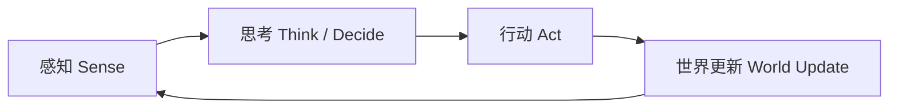
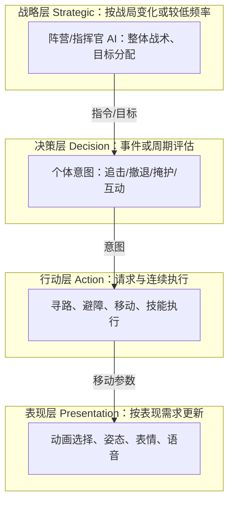
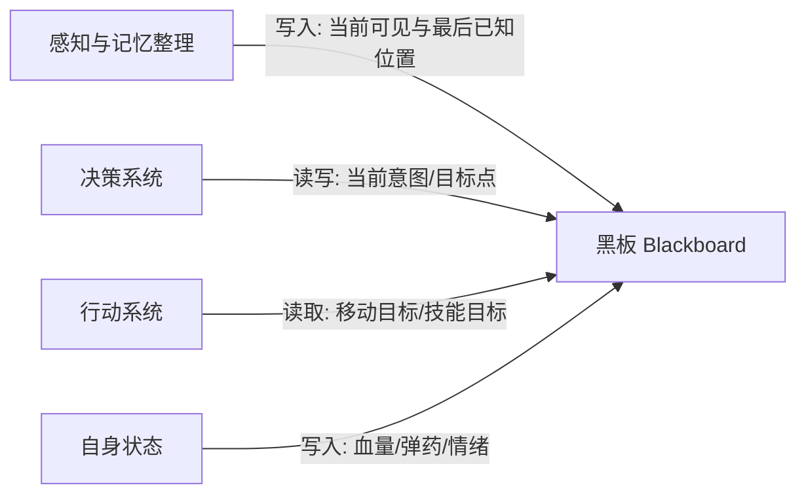
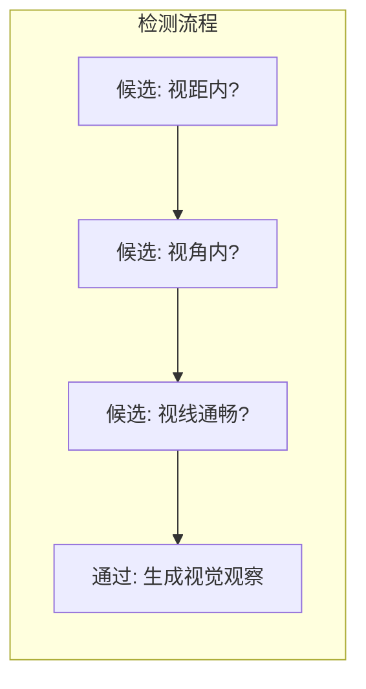

# 01 AI 总体架构与感知
> 知识成熟度：L2。通用架构配合可手算的状态追踪；UE 部分核对公开官方文档与 API 描述，未运行引擎或示例。

> 版本基准：通用部分是本文定义的教学模型；UE 接线依据 2026-10-10 实际读取、标题标为 Unreal Engine 5.8 的 Epic 公开页面。未读取本机 Build.version 或引擎实现，不据此保证其他版本的细节相同。
> 适用范围：NPC 的有限信息感知、个体决策、记忆和调度设计。第四节 UE 例限定单机、单守卫、单个有效目标、仅 Sight；多人权威、复杂阵营和导航另行验收。
> 事实边界：下文代码是算法示意，蓝图步骤是待执行教学方案；数值是例子参数，结果是推导的预期，不是运行记录或性能承诺。
> 最后更新：2026-10-10（补完整输入到输出例，区分事件、当前感知、记忆和遗忘，修正时间与预算示意）。
> 交叉阅读：[游戏知识/05-AI系统/02-感知系统与EQS.md](02-感知系统与EQS.md)、[UE5.8 行为树与 AI 源码专题](12-行为树与AI源码.md)。这些链接用于继续学习，不代替本文的来源核对。

## 一、概述：守卫为什么看不见玩家，却还会去拐角找人？

因为“世界里玩家在哪”“守卫刚刚得到什么信息”“守卫还记得什么”是三件事。看到玩家时，视觉提供位置；玩家躲到墙后，视觉失效，记忆仍保存旧位置；决策由追踪转为搜索；搜索超时后回到巡逻。如果行动层在搜索时仍不断读取玩家真实位置，前面的遮挡和记忆设计就失去了意义。

一个 NPC 可以分为三条链路：

1. **感知（Sense）**：从世界筛出这个 NPC 能获得的观察，例如看见目标、听见枪声。
2. **决策（Think / Decide）**：结合观察、记忆和血量等自身状态，选择追踪、搜索、撤退等意图。
3. **行动（Act）**：把意图变成移动、动画、技能或交互请求，并把成功、失败、中断反馈给决策。

它们构成逻辑闭环，但不要求每帧按同一频率完整执行。感知可以异步或分批更新；决策可以由事件唤醒；移动仍可以在两个决策之间继续执行。本文先解释每层怎样交换信息，再用一个固定输入的守卫例追踪状态，并给出 UE 的具体接线。

本文保留通用架构主责；完整 EQS、行为树和寻路实现继续见 [游戏知识/05-AI系统](../../../00_Index/学习路线/游戏AI.md)。

## 二、核心概念

| 概念 | 解决的问题 | 在守卫例里的含义 |
| --- | --- | --- |
| Sense-Think-Act | 怎样将世界变化转成行动，再接收反馈 | 观察目标 → 选择意图 → 输出行动 |
| 感知系统 Perception | NPC 被允许知道哪些外界信息 | 视距、半角、遮挡共同决定视觉观察 |
| 感知刺激 Stimulus | 一次感知结果如何表达 | 来源、感官、位置、时间和是否成功 |
| 当前感知视图 | 在感知系统最近已处理的状态里，谁仍被感知 | 当前 Sight 集合，不等于本次回调的 Actor 数组 |
| 记忆 Memory | 当前看不见时，哪些旧信息仍可用 | 旧位置和搜索截止时间；不是目标实时位置 |
| 黑板 Blackboard | 模块怎样共享决策所需的状态 | `HasSight`、`LastKnownPosition`、`Intent` 等键 |
| 视觉锥 Vision Cone | 怎样先便宜地排除不可见候选 | 距离与方向粗筛，之后才做遮挡检测 |
| 听觉 Hearing | 怎样让玩法事件成为 AI 的信息 | 枪声事件的来源和位置；与播放音频分开 |
| 兴趣点 POI | 怎样表示值得调查或前往的位置 | 巡逻点、已知掩体、最后出现点 |
| 分层 Layered AI | 怎样分开“做什么”和“怎么做” | 决策输出搜索点，行动层负责寻路与到达反馈 |
| 分帧 Time-Slicing | 怎样分摊更新成本 | 不同 NPC 错开查询，但分别累计真实间隔 |

UE 对应入口：[感知系统与 EQS](02-感知系统与EQS.md)。UE Blackboard 保存显式写入的键；AIPerception 保存感知记录，两者之间需要项目代码传递信息，不能视为同一份自动同步的记忆。

## 三、原理详解

### 3.1 感知-思考-行动循环



图中的箭头表示因果关系：感知产出的是有限观察，决策产出的是意图，行动执行后又改变世界。比如“搜索最后位置”不能直接承诺寻路一定成功；行动失败也是下一次决策的输入。

| 循环方式 | 怎样工作 | 需要付出的代价 |
| --- | --- | --- |
| 同步循环 | 一次更新内采样、决策、提交意图 | 简单，但大量 NPC 同时更新可能形成峰值 |
| 分频循环 | 感知与决策各有更新时间，行动继续推进 | 决策读到的可能是上一轮感知，需要知道信息时间 |
| 事件驱动 | 感知变化、伤害或行动完成时重新决策 | 超时、遗忘和任务完成也要有唤醒入口 |
| 长期意图 + 局部校正 | 先决定追踪，之后由行动层连续转向、避障 | 目标失效时必须能替换或中断旧意图 |

**更新频率由允许的延迟和成本决定。**假设感知每 0.2 秒采样、决策每 0.1 秒轮询，变化恰好错过两次采样时，仅等待这两层就可能接近 0.3 秒，还没计入排队、移动和动画延迟。提高决策频率不能消除感知尚未产生新信息的等待。这里的 5 Hz、10 Hz 是算例，不是人眼“刷新率”或所有游戏的推荐值。

循环模型便于记录“收到什么 → 选择什么 → 执行了什么”，也便于替换 FSM、BT、Utility 等决策器。不过可中断能力仍需要取消旧行动的实现，不能只靠画出一个循环得到。UE 行为树采用事件驱动设计，不应从这个通用循环推断它每帧从根完整遍历一次，见 [Behavior Tree Overview：事件驱动与观察者](https://dev.epicgames.com/documentation/en-us/unreal-engine/behavior-tree-in-unreal-engine---overview)。

### 3.2 分层 AI 架构



| 层 | 应负责 | 容易混淆的地方 |
| --- | --- | --- |
| 战略层 | 队伍目标、资源分配、角色分工 | 不必让每个小兵重复做全局战术计算 |
| 决策层 | 基于已知信息选择目标和意图 | “追踪”不等于每帧重发寻路请求 |
| 行动层 | 寻路、跟随、技能执行及完成/失败反馈 | 搜索应接收记忆位置，不能暗中改用隐藏目标的位置 |
| 表现层 | 将速度、意图和动作阶段映射到动画、语音 | 逻辑状态与动画状态相关，但不必一一对应 |

分层的收益是替换和局部测试：可以把 NavMesh 移动换成流场而保留“前往某点”的接口，也可以把 FSM 换成 BT 而保留感知输入。代价是意图的接收、完成与取消必须有清楚约定。没有群体战略的原型可从三层开始：

```text
感知 + 决策（AI 逻辑层）
    ↓ 意图
移动/动画（执行层）
    ↓
物理/渲染（引擎层）
```

是否拆出指挥官层取决于共享决策需求；这里不以“覆盖多少百分比游戏”作为依据。

### 3.3 黑板与知识表示

黑板是**在一个明确作用域内共享的有类型状态**，例如某个 NPC 的控制器实例；它不是天然全局的全知数据库。



这张图的关键不是所有模块都能随意写，而是它们交换同一组定义明确的事实。例如：

| 键 | 类型 | 写入者 | 用途 |
| --- | --- | --- | --- |
| `HasSight` | Bool | 感知整理 | 当前 Sight 视图中是否有目标 |
| `CurrentTarget` | EntityRef | 目标选择 | 供追踪行动使用；丢失视觉后清空 |
| `LastKnownPosition` | Vector3 | 记忆整理 | 成功观察获得的位置，失去视觉后冻结 |
| `HasSearchPoint` | Bool | 记忆整理 | 区分有效旧位置与向量默认值 `(0,0,0)` |
| `SearchDeadline` | Time | 记忆整理 | 本文例中，从发现视觉丢失起继续搜索 3 秒 |
| `Intent` | Enum | 决策 | `Track`、`Search`、`Patrol` |
| `HomePosition` / `PatrolIndex` | Vector3 / Int | 初始化 / 巡逻逻辑 | 返回点与巡逻进度 |
| `SuspicionLevel` / `IsAlerted` | Float / Bool | 怀疑度规则 / 决策 | 渐进发现、警戒表现；第四节最小例不启用 |

类型检查和集中定义键名能减少拼写错误。持续保留的记忆、一次行动的临时状态、初始化配置应分别清理；旧位置的有效性不能只靠 Actor 引用是否存在判断。自定义键值实现可在 `Set` 时比较新旧值，仅在变化后通知对应观察者，在 `Get` 时核查键与类型；这个最小机制仍需处理订阅解绑和回调重入。观察者可以让状态变化触发重评估，UE 对应的是黑板条件观察与 Decorator 的 `Observer Aborts` 等机制，不能把它概括为所有 `Wait` 节点的实现。

若要存档或同步，应选择需要的数据及版本格式；黑板包含对象引用，不意味着它能直接跨进程复制或可靠序列化。更复杂的社交关系可用关系图，复合任务可用目标栈，信念/欲望/意图可用 BDI 模型。先从能表达当前玩法的数据开始，只有扁平键值使关系难以维护时再扩展。

### 3.4 感知怎样把世界真相变成有限信息

#### 3.4.1 视觉：候选、角度、遮挡是不同的筛选



图中每一关失败都应排除候选。最简单的球形视距与圆锥视野模型可写为以下伪代码；`forward` 要归一化，`half_angle` 用弧度，位置和距离单位一致：

```python
def can_see(eye, forward, target_point, radius, half_angle, world):
    offset = target_point - eye
    distance_sq = dot(offset, offset)
    if distance_sq > radius * radius:
        return False
    if distance_sq > 1e-8:  # 重合位置不做归一化；近距离行为由玩法约定
        to_target = offset / sqrt(distance_sq)
        if dot(forward, to_target) < cos(half_angle):
            return False
    # 忽略观察者自身；命中目标本体可算通过，其他阻挡才算遮挡
    return world.line_of_sight_clear(eye, target_point)
```

手算一个正常输入：观察点 `(0,0)`，前向 `(1,0)`，半角 60°、半径 10，目标 `(6,0)`。距离为 6，方向点积为 1，大于 `cos(60°)=0.5`，无遮挡就可见；移到 `(0,6)` 后距离仍为 6，但点积为 0，因角度失败。添加阻挡物后，即使距离与角度通过也不可见。

真实实现还要定义眼点、目标采样点和碰撞通道。单射线便宜，但目标身体部分露出时可能漏报；多点采样更稳定，也增加成本。球体扫掠改变了“遮挡”的几何含义，不能无条件视作更准确。烟雾、草丛、隐身和逐步识别可以作为额外规则；例如用可见度累积怀疑度，但那是玩法模型，不是 UE Sight 自动具备的通用衰减公式。

UE 的 Sight Radius 用于开始发现，Lose Sight Radius 用于已见目标的距离保持；两个半径之间提供距离滞回，不保证穿墙可见。`Peripheral Vision Half Angle Degrees` 是半角。还需检查 `Auto Success Range from Last Seen Location`：开启它后，接近旧位置的已见目标可满足自动成功规则，不能再用最简单的遮挡预期解释结果。见 [Sight 配置](https://dev.epicgames.com/documentation/en-us/unreal-engine/API/Runtime/AIModule/UAISenseConfig_Sight) 与 [AI Perception 的 AI Sight 小节](https://dev.epicgames.com/documentation/unreal-engine/ai-perception-in-unreal-engine?lang=en-US)。

#### 3.4.2 听觉：玩法声音事件，不是扬声器里的一切声音

一个声音事件可包含 `position`、`source`、`time`、`kind`、`radius` 和无量纲 `strength`。假设本文自定义线性模型：半径 10 米，强度 1，距离 4 米处收到 `1 × (1 - 4/10)=0.6`；阈值 0.5 时通过，阈值 0.7 时不通过。该算式只用于说明阈值选择，既不是分贝运算，也不是 UE Hearing 源码。

位置误差可以按米配置、从以声源为中心的区域采样；若使用角度误差，应先转成方向再按距离求位置，不能把角度直接加到位置向量。固定随机种子有助于复现这个例子，但并不足以让整个 AI 确定。

声音事件总线使“发生声音时处理”成为可能，却不自动消除遍历成本：对每个事件扫描全部 N 个监听者，M 个事件仍是 O(MN)。空间索引能减少候选，最终成本取决于事件数、候选数和过滤开销。隔音、雨声掩蔽和门洞传播需要额外模型。

UE 中，Hearing 的常用入口是 [Report Noise Event](https://dev.epicgames.com/documentation/unreal-engine/BlueprintAPI/AI/Perception/ReportNoiseEvent?lang=en-US)。调用时提供声源位置与 Instigator；Loudness 会参与范围计算，Max Range 非正也仍受监听者范围限制。普通音频播放和注册为刺激源都不能替代这次玩法事件。需要声音调查时，将成功听觉位置写为调查点，不要因此把 `HasSight` 设为 true。

#### 3.4.3 记忆：成功观察、失去感知、过期、遗忘分别处理

记忆可按 `(entity, sense)` 保存，包含最后成功位置、观察时间、可信度、有效期限和累计识别次数。按感官分开能避免“听到脚步”覆盖“刚看见的位置”却仍标成视觉证据。

一种自定义置信度模型是 `confidence = max(0, initial - decay_rate × elapsed)`。例如初始 1、每秒下降 0.25，2 秒后为 0.5，4 秒后为 0。另一种更简单的玩法是本文例的固定搜索期限；它们是可选设计，不要求所有记忆都衰减，剧情事实也可以长期保留。

若在集合中清除过期项，应构造保留集合或用安全删除迭代器，不能遍历同一列表时直接删除当前元素而跳过下一项。时间应来自该记忆实际经过的间隔，不能拿一个渲染帧的 `dt` 代替分帧更新累计时间。

UE 的几种信息入口要分开使用：

| 入口 / 数据 | 回答什么 | 不能由它单独推出什么 |
| --- | --- | --- |
| `On Perception Updated` | 哪些 Actor 的感知发生了本轮更新 | 这组 Actor 不是全部当前目标 |
| `On Target Perception Updated` | 某 Actor 的某次刺激及成功标志 | false 不代表该 Actor 的所有感官都失效 |
| `Get Currently Perceived Actors`，指定 Sight | 最近已处理的感知状态里，当前被 Sight 感知的 Actor | 不是强制再做一次即时射线 |
| `Get Known Perceived Actors` | 被感知过且尚未遗忘的 Actor | 在列表里不等于当前看得见 |
| `Get Actors Perception` | 某 Actor 保存的感知记录 | 仍需区分感官、成功状态与记录时间 |
| 自己写入的黑板 / 记忆 | 游戏要保留的知识和行动条件 | 不会因引擎记录过期而自动全部清空 |

上述查询与事件依据 [UAIPerceptionComponent API](https://dev.epicgames.com/documentation/unreal-engine/API/Runtime/AIModule/UAIPerceptionComponent)；当前视图中 `Sense to Use=None` 会合并不同感官，因此判断视觉必须指定 Sight。事件用于触发处理，当前查询用于整理状态，二者并不矛盾。

Sense 的 `Max Age` 与刺激时效相关，0 表示不因该年龄配置遗忘；不能把它当成发现半径或游戏搜索时间。要启用自动清理目标感知数据，官方文档要求开启 `Forget Stale Actors`。[On Target Perception Forgotten](https://dev.epicgames.com/documentation/unreal-engine/BlueprintAPI/EventDispatchers/OnTargetPerceptionForgotten) 说明其目标级通知涉及该目标所有刺激都到期，或显式遗忘。因此只让 Sight 到期、但 Hearing 仍有效，不能期待目标级遗忘事件立即到达；更不能把它当成“刚失去视觉”的通知。实际通知也受感知处理时机影响，不承诺精确到某一渲染帧。

#### 3.4.4 兴趣点和可玩性

POI 可以是静态巡逻点、已知补给点和掩体，也可以是观察到的尸体、听到的爆炸点或记住的最后位置；还可用区域表示安全区或已知危险范围。预先授予 NPC 的地图知识可以直接查询；动态 POI 是否已知则应遵守感知规则，不能因它在世界列表里就向所有 NPC 泄露。

当决策从“找一个点”变成“比较哪些点安全、可达且适合射击”，可考虑 EQS，见 [游戏知识/05-AI系统/02-感知系统与EQS.md](02-感知系统与EQS.md)。环境查询负责候选和评估，不等于视觉传感器，也不是所有 POI 系统的必选实现。

反应延迟、视觉死角、声音误差、怀疑度和记忆时限共同决定玩法。可以设计只靠听觉的敌人、先调查再警戒的守卫、沿 POI 巡逻的单位；这些是可组合的设计示例，不是对某款游戏内部实现的认证。全知 AI 也可能适合公开规则的棋类或简化 Boss，关键是是否符合玩家可理解的规则。

### 3.5 更新频率、分帧与预算

先测量开销落在哪里：候选收集、射线、决策、寻路、动画可能有不同瓶颈。不能仅按 NPC 数量推出“一定卡”或“某种策略一定够用”。

**分帧降低同时到期的工作峰值，不降低同样更新频率下的总工作量。**在稳定 60 FPS 的示例里，每个 NPC 5 Hz 更新，周期约 12 帧；把 NPC 均匀分成 12 组，每帧处理一组，才能维持这个节奏。随机初始相位能减少聚集但不保证每帧工作量相同，也不保证最坏响应时间。

以下伪代码将感知、决策合并成一次低频更新，行动每帧继续；`clock` 是从初始化起单调增加的游戏时间。`world`、各层对象由宿主提供，不是可直接运行的 Python 程序：

```python
class NPC:
    def __init__(self, world, config):
        self.world = world
        self.blackboard = Blackboard(config.initial_blackboard)
        self.perception = PerceptionSystem(self, config.perception)
        self.decision = config.decision_factory(self.blackboard)
        self.action = ActionSystem(self.blackboard, world)
        self.interval = config.update_interval  # > 0，例如 0.2 秒
        self.clock = 0.0
        self.last_ai_time = 0.0
        self.next_ai_time = config.initial_phase  # [0, interval)

    def tick(self, frame_dt):
        self.clock += frame_dt
        if self.clock >= self.next_ai_time:
            elapsed = self.clock - self.last_ai_time
            self.last_ai_time = self.clock
            self.perception.update(elapsed)
            self.decision.update(elapsed)
            self.action.apply_intent(self.blackboard.get("Intent"))
            # 跳过错过的采样点，一帧至多更新一次，避免卡顿后集中补跑
            periods = floor((self.clock - self.next_ai_time) / self.interval) + 1
            self.next_ai_time += periods * self.interval
        self.action.smooth_step(frame_dt)
```

例如上次 AI 更新在 1.0 秒，这次在 1.2 秒，记忆与冷却收到的是 0.2 秒，即使当前渲染帧只用了约 0.0167 秒。这里选择“采样当前世界并跳过错过的采样点”；不能将它直接用于必须逐步推进的物理或锁步模拟。若感知与决策各自分频，它们还需要分别记录上次更新时间，避免把同一时间重复累计。

每帧时间预算需要保留没做完的队列，并避免一直从队首同一批 NPC 开始：

```python
def run_ai_frame(pending, budget_ms):
    deadline = monotonic_ms() + budget_ms
    count_at_start = len(pending)
    for _ in range(count_at_start):
        if monotonic_ms() >= deadline:
            break
        task = pending.popleft()
        task.run_one_bounded_step()
        if not task.done:
            pending.append(task)
    # pending 由调度器持有，下帧从未完成的队列继续
```

检查只发生在任务之间，所以它是**软预算**：单个步骤若很长仍可能超时。需要更严格控制时，要拆分长任务、限制工作量或使用可中断算法。优先处理战斗 AI 时，还应跟踪低优先任务等待时间，防止巡逻任务长期饥饿。

| 子系统 | 可选择的调度方式 | 调低频率时要观察什么 |
| --- | --- | --- |
| 视觉 | 周期采样、距离/重要性分级、缓存候选 | 发现和丢失目标的延迟，短暂暴露是否漏掉 |
| 听觉 | 事件触发，必要时批处理 | 队列延迟和突发事件丢弃策略 |
| 决策 | 关键状态变化时评估，辅以周期检查 | 超时是否有人唤醒、能否中断旧行动 |
| 寻路 | 请求驱动，限制重复请求 | 路径失效和失败恢复；目标不动也可能需要重算 |
| 移动/避障 | 按模拟与平滑需求连续更新 | 碰撞、拥挤、转向与到达误差 |
| 动画 | 按距离与表现重要性选择更新策略 | 视觉跳变、根运动和玩法依赖 |

服务端 AI 应基于服务端可信状态作权威判断，并只向客户端发送需要的表现或玩法结果，不默认同步整个感知列表。确定性是回放或锁步方案的额外要求：种子之外还涉及更新顺序、时间、浮点和输入；普通服务端权威并不自动要求所有客户端重算出相同 AI。UE 的 [AAIController](https://dev.epicgames.com/documentation/en-us/unreal-engine/API/Runtime/AIModule/AAIController) 文档说明联机时 AIController 位于服务端，不能从客户端缺少这个控制器推断服务器没有感知。

## 四、完整正常例：看见、搜索、放弃、再次发现

### 4.1 先把输入、规则与输出固定下来

守卫固定在原点，朝 +X；只有一个目标，使用视觉。观察成功时记住位置，丢失视觉时搜索旧位置 3 秒，再回到巡逻。这里的搜索期限从**首次发现视觉丢失**开始；不是每次“仍然看不见”都重置，也不是引擎刺激的 Max Age。

初始状态：`HasSight=false`、`CurrentTarget=None`、`HasSearchPoint=false`、`Intent=Patrol`。一次感知整理后按以下顺序更新；这是逻辑伪代码，`visible_sample` 已经过视觉过滤：

```python
def refresh(now, visible_sample, state):
    was_visible = state.HasSight
    state.HasSight = visible_sample is not None
    if state.HasSight:
        state.CurrentTarget = visible_sample.entity
        state.LastKnownPosition = visible_sample.position
        state.HasSearchPoint = True
    else:
        state.CurrentTarget = None
        if was_visible:  # 仅 true -> false 的一次转换设置期限
            state.SearchDeadline = now + 3.0
        if state.HasSearchPoint and now >= state.SearchDeadline:
            state.HasSearchPoint = False

    if state.HasSight:
        state.Intent = "Track"
        return ("Track", state.CurrentTarget)
    if state.HasSearchPoint:
        state.Intent = "Search"
        return ("Search", state.LastKnownPosition)
    state.Intent = "Patrol"
    return ("Patrol", None)
```

假定以下时刻是感知状态已经更新、应用执行 `refresh` 的时刻，距离单位为米：

| 输入时刻 | 视觉采样 | 整理后的状态 | 交给行动层的输出 |
| --- | --- | --- | --- |
| 0.0 | 无目标 | 无当前目标、无搜索点 | `Patrol` |
| 2.0 | 目标 A，位置 `(5,0,1)` | `HasSight=true`，保存该位置 | `Track(A)` |
| 4.0 | A 仍在同一位置且可见 | 继续保存成功观察 | `Track(A)` |
| 5.0 | A 离开视距，视觉失败 | 清当前目标，期限设为 8.0，旧位置保留 | `Search((5,0,1))` |
| 6.0 | 仍无视觉 | 期限仍为 8.0，不能顺延成 9.0 | 继续搜索旧位置 |
| 8.0 | 仍无视觉 | 清搜索点有效标志 | `Patrol` |
| 12.0 | A 再次可见 | 重新获得成功位置 | `Track(A)` |

如果第 5 秒读取 A 的真实新位置作为搜索点，输出会跟着隐藏目标走；如果第 6 秒重设期限，持续轮询会让 NPC 永远不放弃。这两个反例直接来自数据更新规则。多目标时还需独立记忆和目标选择，不能对任意 Actor 的一次失败就清掉当前目标。

### 4.2 UE 接线：先让状态可观察

这个最小接线将动作端实现为 `Print String`，输出意图及搜索位置，便于在不接入导航、武器或动画时检查感知链是否正确。它是完整的“世界输入 → 感知记录 → 项目记忆 → 决策 → 可见输出”例；角色不会因此自动追跑。完成这个例子后，移动层可以按上表消费 Actor 或固定位置，具体见 [03-NavMesh寻路.md](../导航移动与群体协同/03-NavMesh寻路.md)。

以下为待执行步骤，本文没有创建这些资产、修改工程配置、启动 UE 或运行 PIE。

#### A. 创建监听者和明确的刺激源

1. 创建 `BP_GuardController`，父类 `AIController`，添加 `AIPerception`。创建 `BP_Guard`，父类 `Character`，将 AI Controller Class 设为前者，Auto Possess Player 设为 Disabled，Auto Possess AI 设为 Placed in World or Spawned。把守卫放在 `(0,0,100)`，朝 +X，保持不移动、不转向；场景地面应承接角色。Controller 管理逻辑，Pawn/Character 是它控制的身体，不能把刺激源回调中的 Actor 当成观察者控制器。[Pawn 设置](https://dev.epicgames.com/documentation/unreal-engine/API/Runtime/Engine/APawn?lang=en-US)、[自动占有枚举](https://dev.epicgames.com/documentation/en-us/unreal-engine/API/Runtime/Engine/EAutoPossessAI)
2. 在 AIPerception 的 Senses Config 中只加入 `AI Sight config`：Sight Radius=1000 cm，Lose Sight Radius=1200 cm，Peripheral Vision Half Angle Degrees=60，Max Age=2 秒，Starts Enabled=true，Dominant Sense=Sight。示例勾选全部 affiliation，随后只处理带 `AIProbe` Actor Tag 的目标；正式敌我规则另行定义。Auto Success Range from Last Seen Location 保持默认 InvalidRange，不开启自动成功；近裁剪和后向偏移保持默认，场景先无遮挡。[Sight 参数](https://dev.epicgames.com/documentation/en-us/unreal-engine/API/Runtime/AIModule/UAISenseConfig_Sight)
3. 创建 `BP_AIProbeTarget`，父类普通 `Actor`，添加可移动 Cube，Actor Tags 加 `AIProbe`；添加 `AIPerception Stimuli Source`，勾选 Auto Register as Source，并在 Register as Source for Senses 中加入 Sight。编译后向关卡拖入**恰好一个**该蓝图实例，将编辑器中的初始位置设为 `(2000,0,100)`，后文 BeginPlay 才会对这个实例提供输入。组件注册的是自己的 owning Actor；加在子 Actor 上就会注册那个子 Actor，不会自动变成它的父对象。这里刻意使用普通 Actor 并显式注册，不依赖 Pawn 是否被特定项目自动注册。[Stimuli Source 说明](https://dev.epicgames.com/documentation/unreal-engine/ai-perception-in-unreal-engine?lang=en-US)
4. 在 Project Settings → Engine → AI System 中开启 Forget Stale Actors，供后面的遗忘观察使用。它不是让 Sight 开始工作的开关。重新开始本次测试，确保配置作用于新建实例。

#### B. 接好控制器里的状态整理与输出

在 `BP_GuardController` 创建六个状态变量：Bool `HasSight=false`、Actor 引用 `CurrentTarget=None`、Vector `LastKnownPosition`、Bool `HasSearchPoint=false`、Float `SearchDeadline=0`、String `Intent=Patrol`。增加 Bool `Ready=false` 和 Timer Handle `PollHandle`，用于阻止未完成初始化时处理。

- 创建无输入、无返回值的函数 `RefreshProbeState`，供下述事件调用；函数内部可创建局部变量。创建自定义事件 `PollPerception`，执行引脚接到该函数。
- `Event On Possess`：确认 Controlled Pawn 有效；清当前目标、两个有效标志与搜索期限，`Intent=Patrol`，设 `Ready=true`；打印初始 `Patrol`；用 `Set Timer by Event`，Time=0.2、Looping=true，Event 委托连接 `PollPerception`，保存 Handle，并立即调用一次 `RefreshProbeState`。
- `Event On UnPossess` 和 `EndPlay`：`Ready=false`，清除 `PollHandle`。这个单次例不测试重占有或销毁目标；换身体时不能继续把旧控制器缓存当新 Pawn 的观察。
- AIPerception 的 `On Target Perception Updated`：先检查 `Ready`、Actor 有效、`Actor Has Tag(AIProbe)`。将 Stimulus 接 `Get Sense Class for Stimulus`，只处理返回 Sight 的情况；`Break AIStimulus` 的 Successfully Sensed 供打印 `Sight true/false`，随后调用 `RefreshProbeState`。事件给了变化对象，仍由下述函数整理当前状态。[感官识别节点](https://dev.epicgames.com/documentation/unreal-engine/BlueprintAPI/AI/Perception/GetSenseClassforStimulus?lang=en-US)

`RefreshProbeState` 对应 4.1 的 `refresh`。先在函数中创建局部变量：Bool `WasVisible`、Bool `Found`、Actor 引用 `SampleActor`、Vector `SamplePosition`、Float/Real `Now`、String `NewIntent`、Actor 引用数组 `CurrentActors`。下面“接”既指定数据引脚，也指定白色执行线；**两层循环只收集样本，只有外层 Completed 才统一结算一次状态**。

1. 函数入口先检查 `Ready` 和 Controlled Pawn 有效性，不满足才 Return。通过后依次 Set：WasVisible=旧 HasSight、Found=false、SampleActor=None、SamplePosition=`(0,0,0)`、Now=0、NewIntent=`Patrol`。这些初始化每次调用都执行，不能继承上次找到目标的 Found。
2. 从本控制器的 AIPerception 取得 `Get Currently Perceived Actors`，Sense to Use 选择 `AISense_Sight`。它没有白色执行引脚：Out Actors 数据线接局部 `Set CurrentActors` 的值，初始化末端白线接这个 Set，再从 Set 的执行输出接外层 `For Each Loop`；循环 Array 接 `Get CurrentActors`。每次调用由此保存一份当前 Actor 数组，再遍历，避免把纯查询直接连到循环宏而按数据需求重复求值。外层 Array Element 是候选 Actor，Loop Body 经有效性与 `Actor Has Tag(AIProbe)` 两个检查，只有通过才接 `Get Actors Perception` 的执行输入；该节点 Target 接同一 AIPerception，Actor 接外层 Array Element。拒绝支路到此结束本次循环体，不 Return 整个函数。
3. `Get Actors Perception` 的执行输出接 `Branch`，Condition 接它的 Return Value。False 支路结束本次外层循环体；True 支路启动内层 `For Each Loop`。将 Info 拆为 `Sensed Actor's Data`，Last Sensed Stimuli 数据线接内层 Array。内层 Array Element 同时接 `Get Sense Class for Stimulus` 的 Stimulus 和 `Break AIStimulus`；内层 Loop Body 的白线经感官识别节点接 Branch，条件是感官类为 Sight 且 Successfully Sensed=true。只有 True 支路依次 Set Found=true、SampleActor=外层 Array Element、SamplePosition=该项 Stimulus Location。False 支路结束本次内层循环体，不 Return 整个函数；内层 Completed 不接状态结算。这里不读取候选实时 Transform，也不在循环体内修改 HasSight、SearchDeadline 或 Intent。
4. **外层 `Completed` 是后续唯一入口**：接 Set Now，值取 `Get Game Time in Seconds`，然后接 `Branch(Found)`。因此 Out Actors 为空、只有不匹配 Actor、或匹配 Actor 没有成功 Sight 时，仍以 Found=false 执行一次结算；不是从 Loop Body 或内层 Completed 结算。此例只放一个匹配目标，多目标选择需另定规则。
5. Found=True 白线依次设置 HasSight=true、CurrentTarget=SampleActor、LastKnownPosition=SamplePosition、HasSearchPoint=true，然后进入步骤6的统一意图判定。Found=False 白线先设 HasSight=false、CurrentTarget=None，再接 `Branch(WasVisible)`：True 先设 SearchDeadline=Now+3；False 不改期限。**这两条白线都接到** `Branch(HasSearchPoint AND Now>=SearchDeadline)`，其 True 先清 HasSearchPoint、False 不修改；这两条路径也都进入步骤6。这样 WasVisible=false 时仍会检查超时，反复不可见时也不会顺延期限。
6. 统一入口接 `Branch(HasSight)`：True 设 NewIntent=`Track`；False 接 `Branch(HasSearchPoint)`，其 True 设 `Search`、False 设 `Patrol`。三个 Set 的执行输出都接到同一个 `Branch(NewIntent != Intent)`。仅 True 时更新 Intent 并 `Print String`；Search 同时打印 LastKnownPosition，False 时结束。一次函数调用最多触发一次意图输出；可在统一结算后额外打印 Now、HasSight、HasSearchPoint，但这些打印不是重复感知事件。

取记录而不是读取目标实时位置有实际意义：目标刚离开时，查询可能仍返回系统上一次处理的可见状态；缓存的刺激位置表达旧观察，无条件 `GetActorLocation` 却可能把已经隐藏的新位置泄露给 AI。0.2 秒定时器是**项目状态整理频率**，不会把 UE 内部 Sight 查询频率设为 5 Hz。[组件查询 API](https://dev.epicgames.com/documentation/unreal-engine/API/Runtime/AIModule/UAIPerceptionComponent)

可额外绑定 `On Target Perception Forgotten`，过滤 `AIProbe` 后只打印 `Perception forgotten`；在本例中不要从这个事件清除自己的 HasSearchPoint，目的是观察引擎感知记录与项目搜索记忆不同。还可在定时器中调用 `Get Known Perceived Actors`，同样指定 Sight 并过滤 Tag，打印数量。

#### C. 给目标固定输入，读预期输出

目标 Cube 保持 Movable。在 `BP_AIProbeTarget` 的 BeginPlay 中顺序连接：`Set Actor Location(2000,0,100)` → Delay 2 秒 → `Set Actor Location(500,0,100)` → Delay 3 秒 → `Set Actor Location(2000,0,100)` → Delay 7 秒 → `Set Actor Location(500,0,100)`。Set Actor Location 的 Sweep 关闭；只做这个演示的瞬移输入。场景没有遮挡，守卫不旋转，目标与眼点的高度差相对 500 cm 足够小。

在 PIE 的屏幕打印或 Output Log 观察以下**预期**。引擎感知调度和应用定时器使时刻存在延迟，不能要求每个事件与 Delay 节点同帧到达：

| 世界输入 | 应用应看到的状态变化 | 判定点 |
| --- | --- | --- |
| 初始目标 2000 cm 外 | `Patrol`，Sight 当前集合不含目标 | 初始化无搜索点，不凭 Actor 存在就追踪 |
| 第 2 秒移到正前方 500 cm | 成功视觉更新后转 `Track` | 当前/已知集合包含目标，保存接近 `(500,0,100)` 的刺激位置 |
| 第 5 秒移回 2000 cm | 视觉丢失被处理后转 `Search` | CurrentTarget 清空，搜索位置仍是旧观察，期限只设一次 |
| 丢失视觉被应用发现后满 3 秒 | 转 `Patrol` | HasSearchPoint 清空；不要求精确在第 8.000 秒打印 |
| 第 12 秒回到正前方 | 再次转 `Track` | 遗忘不等于注销刺激源，仍可重新发现 |

另外单独观察引擎记录：目标持续不可见且刺激到期后，应看到 `Perception forgotten`，已知集合不再包含目标。该异步通知不参与上表的意图切换顺序，**不要求它先于或后于 Search→Patrol**；项目搜索期限与引擎感知时效是两套计时，不能用其中一个通知替代另一个条件。

如果改为 3 秒内重新出现，应直接从 Search 回 Track；过期的旧搜索期限不能在可见分支清掉新获得的目标。若额外配置 Hearing，已有刺激的到期关系会变化，不能直接沿用此单感官遗忘时间预期。

### 4.3 从正常例扩展时，哪些前提最先改变

| 变化或症状 | 为什么与本例不同 | 先核查什么 |
| --- | --- | --- |
| 在 500 cm 仍没有 Sight 更新 | 可能未占有、未启用、未注册或被过滤 | On Possess 输出、实际组件实例、Sight Config、目标组件的 owning Actor 和 affiliation |
| 放墙后仍可见 | 自动成功、目标采样点或碰撞过滤改变了观察条件 | Auto Success Range、视线阻挡通道、墙是否挡住有效采样点；不要只增大 Max Age |
| 播放枪声音频却无 Hearing | 音频输出不是玩法噪声事件 | 是否配置 Hearing 并调用 Report Noise Event，Instigator、范围与阵营是否有效 |
| 失去 Sight 却仍“已知” | 保留记录和当前可见本来就不同 | 查询是否用了 Known；Sense 参数是否为 None；其他感官是否仍有效 |
| 一直 Search | 期限被每次轮询重置，或没有超时唤醒 | 只在 true→false 转换设期限；即使无新事件也继续检查超时 |
| AI 穿墙跟踪新位置 | 行动仍跟随 Actor，或记忆从真实位置持续刷新 | 失去视觉后取消旧追踪请求，Search 只消费冻结的位置 |
| 目标销毁、替换，或多个目标同时变化 | 单目标有效引用前提失效 | 先处理无效引用；按目标保留记录再选择，不把别人的失败写成当前目标失败 |

UE 调试器可帮助观察感知范围；官方入口是运行时按 apostrophe，再按小键盘 4，具体键位与构建支持需按项目检查。首轮以明确的日志和变量为依据，不因调试图没显示就认定感知没运行。

## 五、选型对比

### 5.1 架构与感知模型

| 方案 | 适合 | 主要取舍 |
| --- | --- | --- |
| 单脚本 | 小原型、行为简单且数量少 | 起步快，状态多后难追踪写入顺序和取消行为 |
| 分层 | 感知、决策、移动需要分别演进 | 便于替换与定位，但要维护层间数据含义 |
| 事件驱动 | 稀疏事件、条件变化主导的行为 | 减少无效重评估；队列、订阅、计时仍有成本 |
| 视觉锥 + 射线 | 人形单位的方向性视觉 | 直观，采样点、碰撞与检测次数影响效果 |
| 半径查询 | 范围触发或听觉候选筛选 | 便宜但没有朝向/遮挡语义 |
| 网格/空间索引粗筛 | 候选量大 | 降低精测候选数，需要维护索引与动态变化 |
| EQS 式环境评估 | 掩体、射击位、战术位置 | 结果依赖候选和测试，不以名称保证精度或低成本 |
| 显式全知规则 | 公开信息玩法或简化 AI | 实现可以简单；不适合承诺“躲起来就不会被发现”的玩法 |

通常混合使用：视觉回答谁被看见，声音事件提供调查线索，记忆承接刚才的观察，POI 帮助选择去哪。它们的职责不同，不应把性能排成一个无条件的“最好到最差”序列。

### 5.2 更新策略

| 策略 | 收益 | 代价与选择依据 |
| --- | --- | --- |
| 每帧全量 | 简单、采样延迟短 | 以实测成本决定规模，不能直接套用 NPC<50 等阈值 |
| 均匀分帧 | 分散同时更新的峰值 | 用组数、帧率和周期核算延迟；单位成本不均时仍会有峰值 |
| 距离/重要性分级 | 将算力用于当前交互 | 远处的关键任务也可能重要；升降级需要过渡 |
| 软时间预算 | 过载时延后可推迟工作 | 长任务可能越界、队列会积压，需要老化与饥饿监控 |

## 六、最佳实践

1. 先写出允许的反应延迟，再选择采样、事件与预算；把感知等待、决策等待和行动启动分开测量。
2. 明确每条数据来自哪个观察。成功视觉、听觉线索、地图常识与项目记忆不能混用可信度。
3. 黑板键集中定义，标清谁写、什么时候失效；位置配有效标志，目标引用先检查有效性。
4. 先验证一个正常输入能贯通整条链，再引入多感官、多目标、遮挡与噪声。
5. 先粗筛再做昂贵感知；缓存和低频更新会增加信息年龄，应能在调试输出中看见。
6. Boss、队友和远处路人的响应需求可以不同，但“重要”由玩法决定，不只看屏幕距离。
7. 错开相位时同时保证正确的累计时间；过载时明确是跳过采样还是补跑，不无限追赶。
8. 搜索只消费已知位置。失去视觉后及时替换旧的 Actor 跟随请求，避免行动层绕过感知。
9. 服务端只同步客户端需要的数据；确定性、跨房间或区域协作按具体同步方案设计。
10. 记录感知状态、意图切换、行动完成/失败和各层耗时；优化依据是实际分布与队列等待。

## 七、常见问题 FAQ

### Q1：AI 每帧都跑，为什么还是“反应慢”？

“AI Tick 在跑”不表示感知已经更新。按世界变化、收到刺激、意图改变、移动/动画开始四个时刻记录；先判断延迟在哪一段。第四节的 0.2 秒轮询只能改变项目整理频率，不能直接改变 Sight 内部调度。

### Q2：1000 个 NPC 怎么做到不卡？

先测每层成本及同时活跃数量，再组合粗筛、分帧、重要性分级、事件驱动和寻路节流。每帧更新 1/5 在 60 FPS 下意味着约 12 Hz，不等于每个 NPC 5 Hz；软预算也不能压住一个不可拆分的超长任务。没有硬件、场景、成本分布和延迟要求，就不能承诺容量。

### Q3：感知系统要不要用物理射线？

有动态遮挡要求时，物理查询通常是有用的实现；它回答的是指定通道、形状和采样点的几何问题，不是无条件的世界真相。先距离/角度粗筛，再用射线或可见性预计算精筛；需要身体多点采样时明确成本和通过规则。

### Q4：NPC 记不住玩家位置怎么办？

先分清“当前没看见”和“旧位置已经失效”。像第四节那样在成功观察时保存位置，失去视觉时保留固定搜索期；不要每次失败都清光，也不要每次轮询都顺延。UE Max Age、目标级 Forgotten 和自己写的黑板记忆是不同机制。

### Q5：黑板的键太多了，怎么办？

按感知、决策、行动分组，集中键名并明确写入者；只让决策所需摘要进入黑板，详细的多目标多感官历史可以留在专门数据结构。TTL 只适合会过期的信息，不能机械地给所有键都加清理时间。

### Q6：AI 在服务端跑，感知怎么做？

由服务端用可信位置、碰撞或事件评估，客户端接收需要的动作和表现。不要为调试方便复制所有隐藏目标信息；也不要要求客户端存在同一个 AIController。是否要求逐步确定回放取决于项目方案，并非“在服务端运行”的必然条件。

### Q7：什么时候该上 EQS 这种环境查询？

当 NPC 需要比较掩体、地形、射击位等候选位置的质量时。单个目标是否在距离/角度内不一定需要 EQS；查询结果也不能绕过 NPC 的信息权限。UE 侧继续见 [02-感知系统与EQS.md](02-感知系统与EQS.md)。

### Q8：AI 更新频率和动画播放频率什么关系？

决策可以低频改变意图，移动和动画在期间持续推进。表现层可按重要性采用不同更新策略；关键是动作完成、根运动或攻击窗口等玩法依赖要按自己的规则更新。不能一概说“动画不可降频”，也不能用低频决策 Tick 代替所有表现更新。

## 八、关联阅读

- 本分类下一篇：[02-状态机与层次状态机.md](02-状态机与层次状态机.md) —— 最经典的决策技术，感知结果如何驱动状态转换；
- 本分类：[03-行为树通用原理.md](03-行为树通用原理.md) —— 商业项目常见决策技术，黑板是其数据核心；
- 本分类：[04-Utility与GOAP.md](04-Utility与GOAP.md) —— 效用评分与目标规划，适合“择优”场景；
- UE 客户端：[游戏知识/05-AI系统/README.md](../../../00_Index/学习路线/游戏AI.md) —— UE 侧总导航；
- UE 客户端：[02-感知系统与EQS.md](02-感知系统与EQS.md) —— AIPerception 与 EQS 的具体实现；
- UE 客户端：[03-NavMesh寻路.md](../导航移动与群体协同/03-NavMesh寻路.md) —— 感知到行动的“移动落地”。

## 九、实际核对的资料与未验证项

核对日期为 2026-10-10。下面均为本次实际取得正文的 Epic 页面，返回标题标为 UE 5.8；网页会更新，本文记录的是当日读取范围。带 application_version=5.8 的若干入口未成功读取，未把失败请求记成版本源码证据。

| 官方来源 | 本文实际使用的内容 |
| --- | --- |
| [AI Perception](https://dev.epicgames.com/documentation/unreal-engine/ai-perception-in-unreal-engine?lang=en-US) | 监听组件与刺激源、事件、感官配置、Forget Stale Actors、调试入口 |
| [UAIPerceptionComponent](https://dev.epicgames.com/documentation/unreal-engine/API/Runtime/AIModule/UAIPerceptionComponent) | 当前/已知 Actor 查询、单 Actor 感知记录、批处理说明与感官配置接口 |
| [Get Currently Perceived Actors](https://dev.epicgames.com/documentation/en-us/unreal-engine/BlueprintAPI/AI/Perception/GetCurrentlyPerceivedActors) | Sense=None 时包含不同感官，查询 Target 是 AIPerception Component |
| [Sensed Actor's Data](https://dev.epicgames.com/documentation/unreal-engine/API/Runtime/AIModule/FActorPerceptionBlueprintInfo)、[Functions](https://dev.epicgames.com/documentation/en-us/unreal-engine/functions-in-unreal-engine) | 感知 Info 的结构显示名与 LastSensedStimuli 数组；纯函数按数据需求求值，因此先保存当前 Actor 数组再遍历 |
| [UAISenseConfig_Sight](https://dev.epicgames.com/documentation/en-us/unreal-engine/API/Runtime/AIModule/UAISenseConfig_Sight) | 发现/保持距离、自动成功范围的默认 InvalidRange 与配置语义 |
| [On Target Perception Forgotten](https://dev.epicgames.com/documentation/unreal-engine/BlueprintAPI/EventDispatchers/OnTargetPerceptionForgotten) | 全部刺激到期或显式遗忘、项目开关要求 |
| [Get Sense Class for Stimulus](https://dev.epicgames.com/documentation/unreal-engine/BlueprintAPI/AI/Perception/GetSenseClassforStimulus?lang=en-US) | 刺激输入与感官类输出 |
| [Report Noise Event](https://dev.epicgames.com/documentation/unreal-engine/BlueprintAPI/AI/Perception/ReportNoiseEvent?lang=en-US) | Noise Location、Instigator、Loudness、Max Range、Tag 的输入含义 |
| [APawn](https://dev.epicgames.com/documentation/unreal-engine/API/Runtime/Engine/APawn?lang=en-US)、[EAutoPossessAI](https://dev.epicgames.com/documentation/en-us/unreal-engine/API/Runtime/Engine/EAutoPossessAI) | Pawn 作为受控身体、控制器类型和自动占有配置 |
| [AAIController](https://dev.epicgames.com/documentation/en-us/unreal-engine/API/Runtime/AIModule/AAIController) | 控制器职责、联机侧别，以及 Actor 跟随与固定位置移动的接口区别 |
| [Behavior Tree Overview](https://dev.epicgames.com/documentation/en-us/unreal-engine/behavior-tree-in-unreal-engine---overview) | 黑板与决策关系、事件驱动、条件观察与中断 |

通用几何、时间计算、状态表和调度伪代码属于本文明示前提下的推导。UE API 页面只支持公开接口描述，不代表已读函数实现；未核对引擎 checkout、线程细节、PIE 实际事件顺序、碰撞配置、多感官实测、联机或性能。首次在具体工程落地，应先执行第四节并保留实际日志，再扩展场景；这些后续观察未发生，因此保持 L2 和 `verified: []`。
