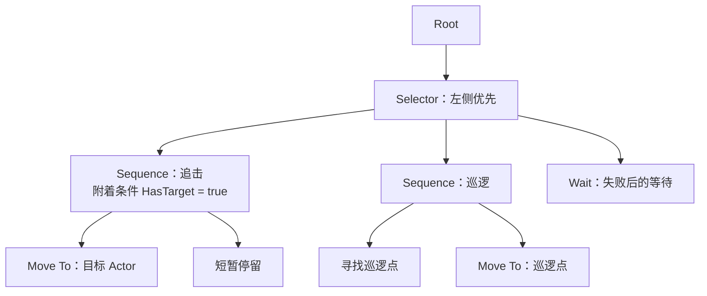
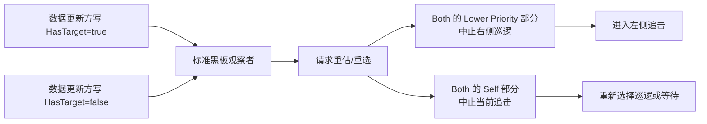
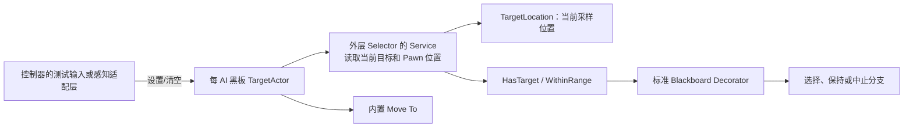
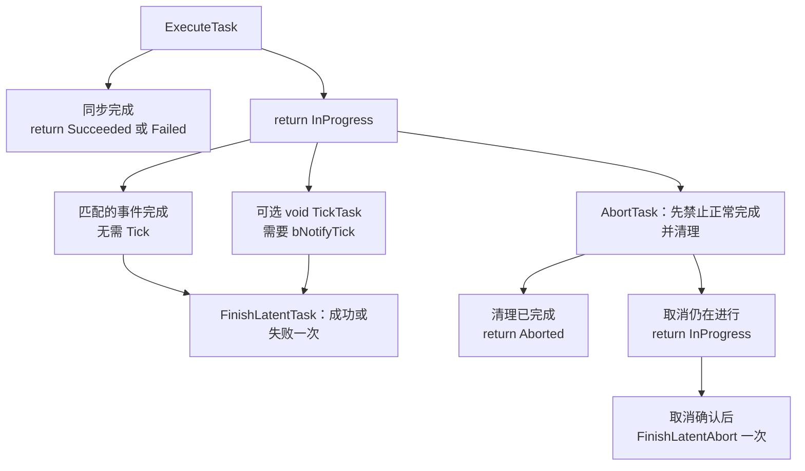
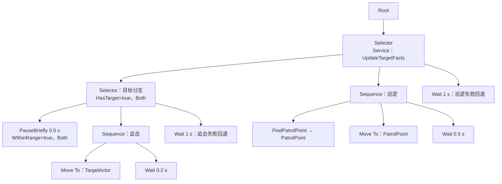

# 01 行为树详解（Behavior Tree）

> 知识成熟度：L2。主要承诺是依据 Epic 公开文档/API 核对执行合同，并用作者示例解释巡逻、追击、失败和退出；不是引擎运行报告。
> 版本基准与证据范围：2026-10-05 访问的 Epic 当前公开页面，页面显示 UE 5.8。未访问对应引擎 checkout，未核实 `Engine/Build/Build.version`、私有 CL 或源码逐调用顺序。
> 历史声明更正：旧文的 UE 5.8.0、CL 55116800、`++UE5+Release-5.8` 及“本机”定位只是未核历史线索，不能作为本轮环境证据，也不据此保证 UE4.27 或其他 UE5 版本兼容。
> 所有 C++ 为作者编写的静态候选，图和事件表为推导预期。UHT、UE 编译/链接、PIE、Debugger、真实取消/重入及性能测试均 **NOT_RUN**。最后更新：2026-10-05，整篇修订运行模型与实践链。

## 一、先确定行为树负责什么

设一个守卫平时巡逻，收到目标后追过去，目标离开则恢复巡逻。难点不只是排列动作：移动可能持续数秒，期间目标会变化；多个守卫可能共用同一资产；被取消的动作还可能送来旧回调。行为树负责选择和推进动作，黑板表达决策输入，移动、感知和技能系统负责各自的实际工作。

本文先分清 UE 的控制流和数据所有权，再组装一棵真实使用内置 **Move To** 的树。自定义取点任务只找点，不暗中移动；有限等待任务只等待，不冒充攻击。若接入动画或技能，要再满足后文的事件完成与取消合同。

| 层次 | 本文中的职责 | 不能由它单独保证 |
|---|---|---|
| `UBehaviorTree` 资产与节点配置 | 可复用的树结构、键选择和参数 | 每个 AI 的可变运行状态隔离 |
| `UBehaviorTreeComponent` | 运行树、搜索分支、推进任务 | 外部系统的所有请求都自动撤销 |
| `AAIController` / Pawn | 控制器驱动决策，Pawn 是移动主体 | 有控制器就一定有可用导航和移动组件 |
| Blackboard 资产 / 组件 | 前者定义键，后者保存本次 AI 使用的值 | 对象键非空就代表目标仍可参与玩法 |
| Composite / Decorator | 组织分支、判断条件、按观察结果请求中止 | 任意世界字段变化都能被自动观察 |
| Task / Service | Task 执行动作；Service 维护活动范围内的数据 | 潜伏任务一定 Tick；Service 写数据不影响决策 |

[官方总览](https://dev.epicgames.com/documentation/en-us/unreal-engine/behavior-tree-in-unreal-engine---overview)解释的是 UE 的事件驱动实现。引擎无关 BT 可以采用逐帧递归求值、记忆型或响应式遍历等模型；不要把其中一种伪代码直接当成 UE 的调度器。

## 二、从优先级选择到事件驱动

### 2.1 Selector、Sequence 与潜伏结果

UE 编辑器中左侧分支通常优先；节点上的执行序号可帮助检查布局。下图是选择关系，不是“每帧必从 Root 调用到所有叶子”的调用栈。



- **Selector**：依次尝试子节点；某个成功便成功，全部失败才失败
- **Sequence**：依次执行步骤；某个失败便失败，全部成功才成功
- 子任务返回 `EBTNodeResult::InProgress` 时，父分支还没获得最终成功/失败，不会因此立刻继续下一步。它仍可被允许的中止打断

通用三态中的 `Running` 在这里对应“尚在执行”的概念；UE 原生任务入口使用 `InProgress`。`Aborted` 是取消结果，不能混同业务失败。**Tick 是否发生与任务是否未完成是两个问题**：通知开启并满足调度条件时才调用 `void TickTask(...)`；也可以完全靠事件完成，没有逐帧 Tick。[Composite 规则](https://dev.epicgames.com/documentation/en-us/unreal-engine/unreal-engine-behavior-tree-node-reference-composites)、[Task API](https://dev.epicgames.com/documentation/en-us/unreal-engine/API/Runtime/AIModule/UBTTaskNode)

若把无条件巡逻放在 Selector 左边，它一旦持续运行，右侧追击通常就得不到机会。正确修复不是“把全树 Tick 得更快”，而是设置正确优先级、条件更新来源和观察中止范围。

### 2.2 UE Simple Parallel 不是任意 all/any 聚合器

UE 的 **Simple Parallel** 只有两个子项：一个主 Task（可以附 Decorator），另一个是背景子树。它表达“做主动作时，也推进背景行为”。主 Task 完成后：

| Finish Mode | 背景子树的处理 |
|---|---|
| Immediate | 请求中止背景子树，结束这一并行段 |
| Delayed | 等背景子树完成后，再结束这一并行段 |

这里的 Immediate 不代表任意外部异步资源瞬间清理完毕；背景任务的 Abort 仍要遵守自身协议。背景子树先完成也不等于“任意一个子项完成就结束主 Task”。它不同于某些通用 BT 的 N 子节点 all/any 策略，也不表示这些动作运行在多个线程。[Simple Parallel 官方定义](https://dev.epicgames.com/documentation/en-us/unreal-engine/unreal-engine-behavior-tree-node-reference-composites)

### 2.3 黑板观察与中止分别回答两个问题

Decorator 的条件计算回答“现在允不允许执行”；观察机制回答“什么时候知道它可能变了”；Observer Aborts 决定“哪些正在运行的分支可以被打断”。三者缺一不可。

| Observer Aborts | 允许中止的范围 |
|---|---|
| None | 不发起这种观察中止；不等于该条件永远不再被搜索求值 |
| Self | 所装饰的分支及其内部活动子树 |
| Lower Priority | 相应控制流范围内、右侧较低优先级的活动分支 |
| Both | 结合 Self 与 Lower Priority |

标准 Blackboard Decorator 另有 Notify Observer：On Result Change 关注条件结果改变；On Value Change 关注被观察键的值改变。它和 Abort 范围不是同一个选项；复杂的多 Decorator 组合还须使整条分支满足进入要求，不是某一个布尔变真就保证抢占成功。[Blackboard Decorator 配置](https://dev.epicgames.com/documentation/en-us/unreal-engine/unreal-engine-behavior-tree-node-reference-decorators)



这是因果关系图，不承诺所有节点同一帧结束，也不声称每次都从根完整重扫。只设 Lower Priority 可以解释发现目标后的抢占，却不足以解释失去目标后退出当前追击。

## 三、黑板、节点对象与每次激活

### 3.1 先画出数据由谁写



黑板常用类型是 `UBlackboardKeyType_Bool`、`Int`、`Float`、`Vector`、`Rotator`、`Object`、`Class`、`Enum`、`Name`、`String` 等**类**，不是一张 C++ 枚举表。Object 的 Base Class 和 `FBlackboardKeySelector` 的过滤器帮助编辑器选键；它们不能代替运行时检查键是否存在、类型是否符合合同、对象是否有效。枚举的具体绑定按目标版本的 Blackboard 资产编辑器配置，不把原生枚举筛选辅助函数当成另一种普遍必备键类。[键选择器 API](https://dev.epicgames.com/documentation/en-us/unreal-engine/API/Runtime/AIModule/FBlackboardKeySelector)、[黑板组件 API](https://dev.epicgames.com/documentation/en-us/unreal-engine/API/Runtime/AIModule/UBlackboardComponent)

同一个 `TargetActor` 从 1500 cm 移到 200 cm，键里仍是同一个对象。**对象的变换变化不等于对象键值改变**。若需要按距离抢占，必须有人重新算距离并写 `WithinRange`，或者专门订阅能触发重估的事件。普通 `CalculateRawConditionValue` 加一个 `FlowAbortMode` 不会自动得到距离观察器。

### 3.2 默认共享的是节点对象，不是每 AI 的进度

| 存储位置 | 适合放什么 | 寿命与限制 |
|---|---|---|
| 默认共享节点的成员 | 键选择、半径等不随 AI 执行改变的配置 | 运行时不能把 A 的 RemainingTime 写进这里让 B 读到 |
| `NodeMemory` | 每个运行实例的节点进度、请求标识等 | 由 `GetInstanceMemorySize()` 声明空间；初始化/清理必须匹配实例内存的实际生命周期 |
| 各自 Blackboard 组件 | 可被多节点共同读取的决策数据 | `Instance Synced` 键可以有意跨黑板实例同步；同一外部可变对象也仍可共享 |
| 显式 `bCreateNodeInstance = true` | 适合对象成员保存的个体节点状态 | 多了实例成本；通常不是每次 Execute 都新建，重入仍须复位和清理 |

**给共享成员加 `UPROPERTY` 不会改变对象身份**。例如 A 将共享 `UPROPERTY float RemainingTime` 写成 2，B 写成 5，A 再读仍可能读到 5。把进度分别放入实例内存或显式实例化节点，才改变这一所有权关系。[节点实例化策略](https://dev.epicgames.com/documentation/en-us/unreal-engine/behavior-tree-node-reference-in-unreal-engine)、[Instance Synced](https://dev.epicgames.com/documentation/en-us/unreal-engine/behavior-tree-in-unreal-engine---user-guide)

`NodeMemory` 是原始内存，不会因为把某个结构体写成带 `UPROPERTY` 的样子就被 GC 自动扫描。使用非平凡 C++ 成员时，要按 `InitializeMemory` / `CleanupMemory` 及初始化、恢复、保存、销毁模式正确建立/结束对象寿命，不能每次恢复都重复 placement-new，也不能把一次任务结束当作内存必销毁。保存 UObject 观察引用时，弱引用不保活，强保活须另有被引擎识别的持有路径。本文为避免混入原始内存构造示例，有限等待明确采用**实例化节点**；取点、距离条件和服务只读自身配置。[UBTNode 内存接口](https://dev.epicgames.com/documentation/en-us/unreal-engine/API/Runtime/AIModule/UBTNode)、[UObject 引用与生命周期](../../03-引擎架构与资源系统/对象模型与生命周期/01-UObject与反射系统.md)

## 四、Task：启动、完成、取消是不同协议

### 4.1 一次执行只报告一次终态



这些是互斥路径，而不是每个任务都要经过的流水线：

- 同步取点在 `ExecuteTask` 里返回结果，不再调用 `FinishLatentTask`
- 潜伏任务先返回 `InProgress`，之后调用 `FinishLatentTask(OwnerComp, Result)`；该函数不接收 `NodeMemory`
- `TickTask` 返回 `void`，不能通过 `return Succeeded` 结束任务。启用 `bNotifyTick` 才有相应通知，不能保证固定墙钟频率
- `OnTaskFinished` 需要 `bNotifyTaskFinished`；它适合幂等收尾，不再重复报告完成
- 同步 `AbortTask` 清理后返回 `Aborted`，不需要随后 `FinishLatentAbort`。只有取消确实尚未完成，才返回 `InProgress`，等确认后调用 `FinishLatentAbort(OwnerComp)`

自然执行处于 `InProgress`，不表示“禁止搜索或不可切分支”。反过来，延迟 Abort 已被请求也不表示旧操作已经停止：相关收尾仍未完成时，不得当成取消成功。[UBTTaskNode 执行及中止接口](https://dev.epicgames.com/documentation/en-us/unreal-engine/API/Runtime/AIModule/UBTTaskNode)

### 4.2 事件型任务：本次激活身份必须随回调传回来

以下是**工程协议示意，不是新增的 UE API 或已运行实现**。假设一个等待外部确认的任务由请求适配器持有订阅句柄、超时 Timer 和请求 ID；事件在游戏线程交付。该任务关闭 Tick，仍能完成。

令票据为 `(玩法期间 s, 节点激活 g, 请求 r)`。其中 `s` 由宿主在退出/重新进入玩法时变更，`g` 每次 Execute 变更；不能只用目标 Actor 地址表示身份。

| 输入 / 阶段 | 必须执行的处理 | 对 BT 的结果 |
|---|---|---|
| 开始 g1，请求注册成功 | 清掉上一轮本任务拥有的资源，建立新票据和订阅，阶段设 Running | `ExecuteTask` 返回 `InProgress` |
| g1 匹配成功事件 | 验证宿主玩法期间、票据、Running 阶段及弱引用；先置终态并解绑订阅、清超时 | `FinishLatentTask(..., Succeeded)` 一次 |
| g1 匹配失败或超时 | 同样争取唯一终态，撤销另一个完成来源并清资源 | `FinishLatentTask(..., Failed)` 一次 |
| Running 被中止，能同步撤销 | 先失效正常完成票据，再撤销自己建立的请求、Timer 和订阅 | 返回 `Aborted`，不再自然完成 |
| 撤销需要异步确认 | 阶段设 Cancelling，正常完成票据失效；单独保留取消确认票据及仍被操作使用的存储 | 返回 `InProgress`，此刻尚未中止完成 |
| 匹配的取消确认到达 | 只在同一 Cancelling 激活、宿主仍有效时终结；清理保留资源 | `FinishLatentAbort(...)` 一次 |
| 已开始 g2，却收到 g1 的普通或取消回调 | 身份不匹配，不能动 g2 的字段、句柄或结果；旧请求持有者只收回它自己的资源 | 不通知 g2 完成 |
| Owner/组件已失效，或同对象已退出旧玩法期间 | 不解引用旧裸地址；不向另一轮树发完成。独立请求持有者完成其撤销/释放责任 | 不调用旧组件的 Finish |

注册失败应同步返回 `Failed`。如果所接 API 允许在注册函数内部**同步回调**，适配器要先记录结果并选择同步返回，或明确将事件延后到 Execute 已返回之后；不能一边尚在 Execute，一边 latent 完成，最后又返回 `InProgress`。如果操作根本不支持确认已停止，就不能谎称取消完成，应修改资源所有权协议或不用该操作作可中止任务。

弱 Owner 仍可解析，只证明对象身份此刻尚可取得；不证明还是相同 Pawn、World、玩法期间或节点激活。退出入口应先禁止新请求、使票据失效，再撤销已拥有资源，避免解绑或取消的重入回调重新建立工作。`EndPlay` 也不等于立即 free 或永不复入。不要跨异步保存 `OwnerComp&`、裸 `NodeMemory*` 或临时裸 UObject 地址。[Actor/Component 退出与复入](../../03-引擎架构与资源系统/对象模型与生命周期/02-Actor与Component生命周期.md)

蓝图任务同样需要这种外部资源责任。`UBTTask_BlueprintBase` 的自动 latent 清理不能替代解除外部事件订阅；原生 C++ 自定义 Task 继承 `UBTTaskNode`，不要把蓝图基类当成另一套原生虚函数接口。[Blueprint Task 注意事项](https://dev.epicgames.com/documentation/en-us/unreal-engine/API/Runtime/AIModule/UBTTask_BlueprintBase)

## 五、实践：让巡逻、目标变化和追击真的连起来

### 5.1 场景与输入合同

本例使用已被 `AAIController` 控制的 Character，已有 Character Movement、匹配的 NavMesh 和可行走区域。示例运行在游戏线程；多人游戏由负责 AI 的权威侧驱动。项目负责在 UnPossess、停止 AI、Pawn/Controller EndPlay 前关闭本玩法期间的输入和请求；不能等到对象 GC 才取消动作。

创建 Blackboard 资产并绑定到 BT。所有这些键关闭 Instance Synced：

| 键 | 精确类型 | 初值与唯一写者 |
|---|---|---|
| TargetActor | Object，Base Class 为 Actor | 空；控制器的测试输入或感知适配层负责设置/清空 |
| HasTarget | Bool | false；下面的 Service 写 |
| WithinRange | Bool | false；Service 写，表示几何距离不大于 300 cm |
| TargetLocation | Vector | 未设置；Service 写当前采样位置，失效则 Clear |
| PatrolPoint | Vector | 未设置；FindPatrolPoint Task 写，失败则清旧值 |

为先验证决策链，可以在控制器蓝图的自定义测试事件中，通过其 Blackboard 组件设置 TargetActor 为场景中指定的有效 Actor；另一个测试事件清空它。以后将这两个入口接到感知适配层：该层负责筛选可追击目标、处理感知失去、目标 EndPlay 和换目标，不能假定 Service 会自己搜索敌人。目标活着但暂时不可追击时，也要清输入；`IsValid` 不等于“仍是敌人且可交互”。

首次启动前，在控制器调用 Use Blackboard，传入与 BT 相同的 Blackboard 资产；检查返回值成功，再通过返回的组件清 TargetActor、TargetLocation、PatrolPoint，并将两个派生 Bool 设为 false。这一步失败就不启动树。Service 在外层 Selector 活动后更新，首次更新前允许走巡逻/等待，不把未知距离的默认 0 当成已接近。若项目必须在首次选择前备齐数据，可使用 Service 的 `OnSearchStart` 做瞬时计算；本例不依赖该扩展。[Quick Start 的资产与 Controller 设置](https://dev.epicgames.com/documentation/en-us/unreal-engine/behavior-tree-in-unreal-engine---quick-start-guide)、[Service 的搜索入口合同](https://dev.epicgames.com/documentation/en-us/unreal-engine/API/Runtime/AIModule/UBTService)

### 5.2 启动与停用边界

下面是放在已有游戏模块中的**启动函数片段**，不是 AIController 的完整类，也不是引擎内部源码。调用者在资产/黑板配置、初始化和 Possess 完成后调用；失败交回宿主诊断，不能无条件宣称启动成功。

```cpp
#include "AIController.h"
#include "BehaviorTree/BehaviorTree.h"
#include "GameFramework/Pawn.h"

bool StartConfiguredTree(AAIController& Controller, UBehaviorTree* Asset)
{
    APawn* Pawn = Controller.GetPawn();
    if (!IsValid(Asset) || !IsValid(Pawn))
    {
        return false;
    }
    return Controller.RunBehaviorTree(Asset);
}
```

公开 `RunBehaviorTree(UBehaviorTree*)` 返回 bool，足以支撑这里的启动检查；本文不再把未经源码核对的 `Manager → InitializeBlackboard → StartLogic` 顺序当成内部事实。[AAIController API](https://dev.epicgames.com/documentation/en-us/unreal-engine/API/Runtime/AIModule/AAIController)

需要主动停止时，取得并验证实际 BrainComponent 后调用其 `StopLogic(Reason)`；`RestartLogic()` 是重启入口，不会替自定义外部请求发放一个安全的新身份。宿主停用时要先关闭输入/新请求，再撤销自己的订阅和任务，并走所选组件的停止流程。不要在 EndPlay 的清理回调里重新启动树，也不要把一次 `Cleanup()` 当作销毁前放之四海而皆准的替代步骤。[UBrainComponent](https://dev.epicgames.com/documentation/en-us/unreal-engine/API/Runtime/AIModule/UBrainComponent)

### 5.3 编辑器组装



1. 两个 Bool Decorator 都用标准 **Blackboard** 节点，Key Query 为 Is Set，Notify Observer 为 On Result Change，Observer Aborts 为 Both；图中的 Decorator 是附着条件，不是另一个动作叶
2. `UpdateTargetFacts` 挂外层 Selector，使巡逻期间也能更新目标条件。若只挂在尚未选中的追击分支，它不能替巡逻分支发现条件改变
3. TargetActor 的 Move To 打开 Track Moving Goal 与 Observe Blackboard Value；前者处理 Actor 运动，后者处理换目标键。PatrolPoint 的 Move To 使用 Vector 键
4. 两个 Move To 的 Acceptable Radius 取 100 cm，Allow Partial Path 关闭；示例关闭 Reach Test Includes Agent Radius / Goal Radius，使用与取点相同的默认过滤策略。若修改这些项，需要重新解释成功条件。300 cm 是“接近后暂歇”的业务距离，不等于 Move To 的导航成功阈值
5. `WithinRange=true` 可以中止还在追击的任务，转为短暂停留；距离重新变远则中止停留，继续追击。`HasTarget=false` 则中止整个目标分支，回到巡逻/等待
6. 追击成功后 Wait 0.2 s 再进入下一轮选择，避免成功任务无休止即时重选；失败走 Wait 1 s 再尝试。巡逻找点/移动失败同样走外层 Wait 1 s。这里是教学重试策略：持续导航/配置失败时应停用 AI 排查，不把无界重试用作生产恢复方案；真实项目应另设次数上限、退避和禁用状态

`PauseBriefly` 只消耗有限等待时间，**不会伤害目标或播放攻击动画**。要替换为 Attack，先确定技能/动画谁发起、谁报告命中和完成、取消时谁撤销，再接第四节协议。距离近也不意味着有视线、能打到或有完整路径；攻击资格应由自己的条件输入表达。[Move To 配置项](https://dev.epicgames.com/documentation/en-us/unreal-engine/unreal-engine-behavior-tree-node-reference-tasks)、[UBTTask_MoveTo API](https://dev.epicgames.com/documentation/en-us/unreal-engine/API/Runtime/AIModule/UBTTask_MoveTo)

## 六、C++ 候选：每个节点只承担一个责任

以下四对头/源文件是作者教学实现。`MYGAME_API` 换成项目实际模块导出宏；该模块的 Build.cs 需包含 `Core`、`CoreUObject`、`Engine`、`AIModule`、`NavigationSystem` 依赖。若这些头位于模块 Public 目录，对外暴露的依赖也要使用相应的 PublicDependencyModuleNames。没有在本轮生成项目、运行 UHT 或编译；宏展开、目标版本兼容及运行行为仍需工程验证。

所有 `.generated.h` 均为本头文件最后一个 include。键过滤只辅助配置；代码按当前 Blackboard 实例的键名取 ID 并核实类型，不依赖未初始化的 selector 缓存 ID。本例要求标准键类的精确类型，自定义派生键需单独审合同。

### 6.1 同步 Task：从当前 Pawn 寻找可达巡逻点

与“从任意随机位置投影到 NavMesh”相比，这个任务的输入起点明确是移动主体的导航位置。查询成功只证明这次导航数据/过滤器下找到了可达点；动态障碍、后续路径变化或移动组件问题仍可使 Move To 失败。

```cpp
// BTTask_FindPatrolPoint.h
#pragma once
#include "CoreMinimal.h"
#include "BehaviorTree/BehaviorTreeTypes.h"
#include "BehaviorTree/BTTaskNode.h"
#include "BTTask_FindPatrolPoint.generated.h"

UCLASS()
class MYGAME_API UBTTask_FindPatrolPoint : public UBTTaskNode
{
    GENERATED_BODY()
public:
    explicit UBTTask_FindPatrolPoint(const FObjectInitializer& ObjectInitializer);

    UPROPERTY(EditAnywhere, Category = "Blackboard")
    FBlackboardKeySelector ResultKey;

    UPROPERTY(EditAnywhere, Category = "Search", meta = (ClampMin = "0.0"))
    float SearchRadius = 500.0f;

    virtual EBTNodeResult::Type ExecuteTask(
        UBehaviorTreeComponent& OwnerComp, uint8* NodeMemory) override;
};
```

```cpp
// BTTask_FindPatrolPoint.cpp
#include "BTTask_FindPatrolPoint.h"
#include "AIController.h"
#include "AI/Navigation/NavigationTypes.h"
#include "BehaviorTree/BehaviorTreeComponent.h"
#include "BehaviorTree/BlackboardComponent.h"
#include "BehaviorTree/Blackboard/BlackboardKeyType_Vector.h"
#include "GameFramework/Pawn.h"
#include "NavigationData.h"
#include "NavigationSystem.h"

UBTTask_FindPatrolPoint::UBTTask_FindPatrolPoint(
    const FObjectInitializer& ObjectInitializer) : Super(ObjectInitializer)
{
    NodeName = TEXT("Find Patrol Point");
    bCreateNodeInstance = false; // 运行时只读本节点配置
    bNotifyTick = false;         // 同步任务不需要空 Tick
    ResultKey.AddVectorFilter(this,
        GET_MEMBER_NAME_CHECKED(UBTTask_FindPatrolPoint, ResultKey));
}

EBTNodeResult::Type UBTTask_FindPatrolPoint::ExecuteTask(
    UBehaviorTreeComponent& OwnerComp, uint8* NodeMemory)
{
    UBlackboardComponent* BB = OwnerComp.GetBlackboardComponent();
    if (!IsValid(BB))
    {
        return EBTNodeResult::Failed;
    }
    const FBlackboard::FKey KeyID = BB->GetKeyID(ResultKey.SelectedKeyName);
    if (!BB->IsValidKey(KeyID) ||
        BB->GetKeyType(KeyID) != UBlackboardKeyType_Vector::StaticClass())
    {
        return EBTNodeResult::Failed; // 不向错误类型的键写入/清理
    }
    BB->ClearValue(KeyID); // 后续任一失败都不能沿用上次的成功点

    AAIController* AI = OwnerComp.GetAIOwner();
    APawn* Pawn = IsValid(AI) ? AI->GetPawn() : nullptr;
    if (!IsValid(Pawn) || !FMath::IsFinite(SearchRadius) || SearchRadius <= 0.0f)
    {
        return EBTNodeResult::Failed;
    }
    UNavigationSystemV1* Nav = UNavigationSystemV1::GetCurrent(Pawn->GetWorld());
    if (!IsValid(Nav))
    {
        return EBTNodeResult::Failed;
    }
    ANavigationData* NavData = Nav->GetNavDataForProps(Pawn->GetNavAgentPropertiesRef());
    if (!IsValid(NavData))
    {
        return EBTNodeResult::Failed;
    }
    const FVector Origin = Pawn->GetNavAgentLocation();
    FNavLocation Result;
    if (Origin.ContainsNaN() || !Nav->GetRandomReachablePointInRadius(
            Origin, SearchRadius, Result, NavData, NavData->GetDefaultQueryFilter()))
    {
        return EBTNodeResult::Failed;
    }
    if (Result.Location.ContainsNaN())
    {
        return EBTNodeResult::Failed;
    }
    BB->SetValueAsVector(ResultKey.SelectedKeyName, Result.Location);
    return EBTNodeResult::Succeeded; // 唯一完成入口；不调用 FinishLatentTask
}
```

将 ResultKey 绑定到 PatrolPoint。NavSys 缺失、无匹配 NavData、查询失败或错误键类型均不返回成功；键存在且类型正确时先清旧输出。错误类型属于资产合同错误，任务不能随便清掉别人的数据；Sequence 失败也不会继续后面的 Move To。

本例用 Pawn 的导航代理属性选数据，并使用该数据的默认过滤器，要求 Controller/Move To 没有另行设置不同的过滤策略。多代理、多区域过滤项目应把同一策略贯穿取点和移动。`ProjectPointToNavigation` 只解决附近导航面的投影：投到另一个不连通岛上也不能证明从 Pawn 能走过去，不能给原来的投影代码加一句“确保可达”就当路径验证。[导航查询 API](https://dev.epicgames.com/documentation/en-us/unreal-engine/API/Runtime/NavigationSystem/UNavigationSystemV1)、[投影重载](https://dev.epicgames.com/documentation/en-us/unreal-engine/API/Runtime/NavigationSystem/UNavigationSystemV1/ProjectPointToNavigation)

### 6.2 潜伏 Task：显式实例化的有限等待

这个短任务演示 `InProgress → void TickTask → FinishLatentTask`、失败及同步 Abort。它不创建 Timer、委托或导航请求，取消只需撤销自己的等待状态；外部事件任务则需要第四节更完整的票据与资源协议。

```cpp
// BTTask_PauseBriefly.h
#pragma once
#include "CoreMinimal.h"
#include "BehaviorTree/BTTaskNode.h"
#include "UObject/WeakObjectPtrTemplates.h"
#include "BTTask_PauseBriefly.generated.h"

class APawn;

UCLASS()
class MYGAME_API UBTTask_PauseBriefly : public UBTTaskNode
{
    GENERATED_BODY()
public:
    explicit UBTTask_PauseBriefly(const FObjectInitializer& ObjectInitializer);

    UPROPERTY(EditAnywhere, Category = "Wait", meta = (ClampMin = "0.0"))
    float Duration = 0.5f;

    virtual EBTNodeResult::Type ExecuteTask(
        UBehaviorTreeComponent& OwnerComp, uint8* NodeMemory) override;
protected:
    virtual void TickTask(UBehaviorTreeComponent& OwnerComp,
        uint8* NodeMemory, float DeltaSeconds) override;
    virtual EBTNodeResult::Type AbortTask(
        UBehaviorTreeComponent& OwnerComp, uint8* NodeMemory) override;
    virtual void OnTaskFinished(UBehaviorTreeComponent& OwnerComp,
        uint8* NodeMemory, EBTNodeResult::Type TaskResult) override;
private:
    void ClearRun();
    float Remaining = 0.0f;
    bool bWaiting = false;
    TWeakObjectPtr<APawn> ActivatedPawn;
};
```

```cpp
// BTTask_PauseBriefly.cpp
#include "BTTask_PauseBriefly.h"
#include "AIController.h"
#include "BehaviorTree/BehaviorTreeComponent.h"
#include "GameFramework/Pawn.h"

UBTTask_PauseBriefly::UBTTask_PauseBriefly(
    const FObjectInitializer& ObjectInitializer) : Super(ObjectInitializer)
{
    NodeName = TEXT("Pause Briefly");
    bCreateNodeInstance = true; // 明确选择；不是所有 BT 节点的默认值
    bNotifyTick = true;
    bNotifyTaskFinished = true;
}

void UBTTask_PauseBriefly::ClearRun()
{
    bWaiting = false;
    Remaining = 0.0f;
    ActivatedPawn.Reset();
}

EBTNodeResult::Type UBTTask_PauseBriefly::ExecuteTask(
    UBehaviorTreeComponent& OwnerComp, uint8* NodeMemory)
{
    ClearRun(); // 同一节点再次激活，也必须重置
    AAIController* AI = OwnerComp.GetAIOwner();
    APawn* Pawn = IsValid(AI) ? AI->GetPawn() : nullptr;
    if (!IsValid(Pawn) || !Pawn->HasActorBegunPlay() || Pawn->IsActorBeingDestroyed() ||
        !FMath::IsFinite(Duration) || Duration < 0.0f)
    {
        return EBTNodeResult::Failed;
    }
    if (Duration == 0.0f)
    {
        return EBTNodeResult::Succeeded; // 同步零等待，不 latent 完成
    }
    ActivatedPawn = Pawn;
    Remaining = Duration;
    bWaiting = true;
    return EBTNodeResult::InProgress;
}

void UBTTask_PauseBriefly::TickTask(UBehaviorTreeComponent& OwnerComp,
    uint8* NodeMemory, float DeltaSeconds)
{
    if (!bWaiting)
    {
        return;
    }
    AAIController* AI = OwnerComp.GetAIOwner();
    APawn* Pawn = ActivatedPawn.Get();
    if (!IsValid(AI) || !IsValid(Pawn) || AI->GetPawn() != Pawn ||
        !Pawn->HasActorBegunPlay() || Pawn->IsActorBeingDestroyed() ||
        !FMath::IsFinite(DeltaSeconds) || DeltaSeconds < 0.0f)
    {
        ClearRun();
        FinishLatentTask(OwnerComp, EBTNodeResult::Failed);
        return;
    }
    Remaining -= DeltaSeconds;
    if (Remaining <= 0.0f)
    {
        ClearRun(); // 先失效本轮，再通知；之后不再改本轮字段
        FinishLatentTask(OwnerComp, EBTNodeResult::Succeeded);
    }
}

EBTNodeResult::Type UBTTask_PauseBriefly::AbortTask(
    UBehaviorTreeComponent& OwnerComp, uint8* NodeMemory)
{
    ClearRun();
    return EBTNodeResult::Aborted; // 本任务没有必须等确认的外部操作
}

void UBTTask_PauseBriefly::OnTaskFinished(UBehaviorTreeComponent& OwnerComp,
    uint8* NodeMemory, EBTNodeResult::Type TaskResult)
{
    ClearRun(); // 幂等；不是第二个完成入口
    Super::OnTaskFinished(OwnerComp, NodeMemory, TaskResult);
}
```

A、B 共用资产但各自有本节点实例：A 的 Remaining 递减不覆盖 B；A 下一轮 Execute 重新设置时长。`ActivatedPawn` 只作弱观察，不保活 Pawn。任务按收到的 DeltaSeconds 累积，暂停或调度变化会影响完成时刻，不能解释成严格 0.5 秒墙钟定时器。

这些局部检查不能代替宿主的停用协议：同一 Pawn 退出后再进入玩法，不应继续上一轮等待；宿主必须结束旧树活动并按新的玩法期间重新启动。本文没有外部回调，因而不需要把 activation token 塞进 Tick；若增加 Timer 或动画委托，必须另加票据保护，不能因已实例化就认定重入安全。[Task 通知与完成接口](https://dev.epicgames.com/documentation/en-us/unreal-engine/API/Runtime/AIModule/UBTTaskNode)、[Actor 玩法状态查询](https://dev.epicgames.com/documentation/en-us/unreal-engine/API/Runtime/Engine/AActor)

### 6.3 Decorator：只演示一次距离条件计算

该节点可作进入分支时的距离门槛；在树编辑器将其 Observer Aborts 配为 None，Inverse Condition 保持关闭。它不注册世界移动事件、不 Tick、不观察黑板；只保证**引擎请求求值时**计算当前条件，不能替换主树中负责抢占的标准 Blackboard Decorator。

```cpp
// BTDecorator_CheckDistance.h
#pragma once
#include "CoreMinimal.h"
#include "BehaviorTree/BehaviorTreeTypes.h"
#include "BehaviorTree/BTDecorator.h"
#include "BTDecorator_CheckDistance.generated.h"

UCLASS()
class MYGAME_API UBTDecorator_CheckDistance : public UBTDecorator
{
    GENERATED_BODY()
public:
    explicit UBTDecorator_CheckDistance(const FObjectInitializer& ObjectInitializer);

    UPROPERTY(EditAnywhere, Category = "Blackboard")
    FBlackboardKeySelector TargetKey;

    UPROPERTY(EditAnywhere, Category = "Distance", meta = (ClampMin = "0.0"))
    float MaxDistance = 300.0f;
protected:
    virtual bool CalculateRawConditionValue(
        UBehaviorTreeComponent& OwnerComp, uint8* NodeMemory) const override;
};
```

```cpp
// BTDecorator_CheckDistance.cpp
#include "BTDecorator_CheckDistance.h"
#include "AIController.h"
#include "BehaviorTree/BehaviorTreeComponent.h"
#include "BehaviorTree/BlackboardComponent.h"
#include "BehaviorTree/Blackboard/BlackboardKeyType_Object.h"
#include "GameFramework/Actor.h"
#include "GameFramework/Pawn.h"

UBTDecorator_CheckDistance::UBTDecorator_CheckDistance(
    const FObjectInitializer& ObjectInitializer) : Super(ObjectInitializer)
{
    NodeName = TEXT("Distance <= Max (evaluation only)");
    // 树编辑器中将 Observer Aborts 配为 None；这里不注册观察者
    bNotifyTick = false;
    TargetKey.AddObjectFilter(this,
        GET_MEMBER_NAME_CHECKED(UBTDecorator_CheckDistance, TargetKey), AActor::StaticClass());
}

bool UBTDecorator_CheckDistance::CalculateRawConditionValue(
    UBehaviorTreeComponent& OwnerComp, uint8* NodeMemory) const
{
    const UBlackboardComponent* BB = OwnerComp.GetBlackboardComponent();
    AAIController* AI = OwnerComp.GetAIOwner();
    APawn* Pawn = IsValid(AI) ? AI->GetPawn() : nullptr;
    if (!IsValid(BB) || !IsValid(Pawn) ||
        !FMath::IsFinite(MaxDistance) || MaxDistance < 0.0f)
    {
        return false;
    }
    const FBlackboard::FKey KeyID = BB->GetKeyID(TargetKey.SelectedKeyName);
    if (!BB->IsValidKey(KeyID) ||
        BB->GetKeyType(KeyID) != UBlackboardKeyType_Object::StaticClass())
    {
        return false;
    }
    const AActor* Target = Cast<AActor>(BB->GetValueAsObject(TargetKey.SelectedKeyName));
    if (!IsValid(Target) || !Target->HasActorBegunPlay() || Target->IsActorBeingDestroyed())
    {
        return false;
    }
    const double DistanceSquared = FVector::DistSquared(
        Pawn->GetActorLocation(), Target->GetActorLocation());
    const double Limit = static_cast<double>(MaxDistance);
    return FMath::IsFinite(DistanceSquared) && DistanceSquared <= Limit * Limit;
}
```

设目标从 301 cm 移到 299 cm，引用不变；如果没有新的求值请求，该自定义条件不会凭空重新执行。主实践让 Service 重算并写 WithinRange，再由标准 observer 请求重选。以后若做自定义观察型 Decorator，需要配对相关/不相关时的注册撤销并正确触发控制流；仅改 `FlowAbortMode` 不等于实现这些职责。[普通 Decorator API](https://dev.epicgames.com/documentation/en-us/unreal-engine/API/Runtime/AIModule/UBTDecorator)、[黑板观察型基类](https://dev.epicgames.com/documentation/en-us/unreal-engine/API/Runtime/AIModule/UBTDecorator_BlackboardBase)

### 6.4 Service：更新派生事实并保留间隔调度

该服务只读取 TargetActor；HasTarget、WithinRange、TargetLocation 由它写。它不发起攻击或移动，不直接返回分支结果，但写入 Bool 后可**间接**触发 observer 中止。

```cpp
// BTService_UpdateTargetFacts.h
#pragma once
#include "CoreMinimal.h"
#include "BehaviorTree/BehaviorTreeTypes.h"
#include "BehaviorTree/BTService.h"
#include "BTService_UpdateTargetFacts.generated.h"

UCLASS()
class MYGAME_API UBTService_UpdateTargetFacts : public UBTService
{
    GENERATED_BODY()
public:
    explicit UBTService_UpdateTargetFacts(const FObjectInitializer& ObjectInitializer);

    UPROPERTY(EditAnywhere, Category = "Blackboard")
    FBlackboardKeySelector TargetKey;
    UPROPERTY(EditAnywhere, Category = "Blackboard")
    FBlackboardKeySelector HasTargetKey;
    UPROPERTY(EditAnywhere, Category = "Blackboard")
    FBlackboardKeySelector WithinRangeKey;
    UPROPERTY(EditAnywhere, Category = "Blackboard")
    FBlackboardKeySelector LocationKey;
    UPROPERTY(EditAnywhere, Category = "Distance", meta = (ClampMin = "0.0"))
    float MaxDistance = 300.0f;
protected:
    virtual void TickNode(UBehaviorTreeComponent& OwnerComp,
        uint8* NodeMemory, float DeltaSeconds) override;
};
```

```cpp
// BTService_UpdateTargetFacts.cpp
#include "BTService_UpdateTargetFacts.h"
#include "AIController.h"
#include "BehaviorTree/BehaviorTreeComponent.h"
#include "BehaviorTree/BlackboardComponent.h"
#include "BehaviorTree/Blackboard/BlackboardKeyType_Bool.h"
#include "BehaviorTree/Blackboard/BlackboardKeyType_Object.h"
#include "BehaviorTree/Blackboard/BlackboardKeyType_Vector.h"
#include "GameFramework/Actor.h"
#include "GameFramework/Pawn.h"

UBTService_UpdateTargetFacts::UBTService_UpdateTargetFacts(
    const FObjectInitializer& ObjectInitializer) : Super(ObjectInitializer)
{
    NodeName = TEXT("Update Target Facts");
    bCreateNodeInstance = false;
    bNotifyTick = true;
    Interval = 0.2f;        // 示例调度参数，不是墙钟保证
    RandomDeviation = 0.05f;
    TargetKey.AddObjectFilter(this,
        GET_MEMBER_NAME_CHECKED(UBTService_UpdateTargetFacts, TargetKey), AActor::StaticClass());
    HasTargetKey.AddBoolFilter(this,
        GET_MEMBER_NAME_CHECKED(UBTService_UpdateTargetFacts, HasTargetKey));
    WithinRangeKey.AddBoolFilter(this,
        GET_MEMBER_NAME_CHECKED(UBTService_UpdateTargetFacts, WithinRangeKey));
    LocationKey.AddVectorFilter(this,
        GET_MEMBER_NAME_CHECKED(UBTService_UpdateTargetFacts, LocationKey));
}

void UBTService_UpdateTargetFacts::TickNode(UBehaviorTreeComponent& OwnerComp,
    uint8* NodeMemory, float DeltaSeconds)
{
    Super::TickNode(OwnerComp, NodeMemory, DeltaSeconds); // 维护下次间隔，提前返回也不漏
    UBlackboardComponent* BB = OwnerComp.GetBlackboardComponent();
    if (!IsValid(BB))
    {
        return;
    }
    const auto HasType = [BB](const FBlackboardKeySelector& Key, UClass* Type)
    {
        const FBlackboard::FKey ID = BB->GetKeyID(Key.SelectedKeyName);
        return BB->IsValidKey(ID) && BB->GetKeyType(ID) == Type;
    };
    const bool bTargetKeyOK = HasType(TargetKey, UBlackboardKeyType_Object::StaticClass());
    const bool bHasKeyOK = HasType(HasTargetKey, UBlackboardKeyType_Bool::StaticClass());
    const bool bRangeKeyOK = HasType(WithinRangeKey, UBlackboardKeyType_Bool::StaticClass());
    const bool bLocationKeyOK = HasType(LocationKey, UBlackboardKeyType_Vector::StaticClass());
    const bool bDistinctFlags = HasTargetKey.SelectedKeyName != WithinRangeKey.SelectedKeyName;

    AAIController* AI = OwnerComp.GetAIOwner();
    APawn* Pawn = IsValid(AI) ? AI->GetPawn() : nullptr;
    AActor* Target = bTargetKeyOK
        ? Cast<AActor>(BB->GetValueAsObject(TargetKey.SelectedKeyName)) : nullptr;
    const bool bUsable = bHasKeyOK && bRangeKeyOK && bLocationKeyOK && bDistinctFlags &&
        IsValid(Pawn) && Pawn->HasActorBegunPlay() && !Pawn->IsActorBeingDestroyed() &&
        IsValid(Target) && Target->HasActorBegunPlay() && !Target->IsActorBeingDestroyed() &&
        FMath::IsFinite(MaxDistance) && MaxDistance >= 0.0f;
    const FVector Position = bUsable ? Target->GetActorLocation() : FVector::ZeroVector;
    const double DistanceSquared = bUsable
        ? FVector::DistSquared(Pawn->GetActorLocation(), Position) : -1.0;

    if (!bUsable || !FMath::IsFinite(DistanceSquared))
    {
        if (bHasKeyOK) BB->SetValueAsBool(HasTargetKey.SelectedKeyName, false);
        if (bRangeKeyOK) BB->SetValueAsBool(WithinRangeKey.SelectedKeyName, false);
        if (bLocationKeyOK) BB->ClearValue(LocationKey.SelectedKeyName);
        return;
    }
    const double Limit = static_cast<double>(MaxDistance);
    BB->SetValueAsVector(LocationKey.SelectedKeyName, Position);
    BB->SetValueAsBool(WithinRangeKey.SelectedKeyName, DistanceSquared <= Limit * Limit);
    BB->SetValueAsBool(HasTargetKey.SelectedKeyName, true);
}
```

在编辑器中按第五节表绑定四个不同职责的键，尤其不能把两个 Bool selector 指向同一键。失效时清除当前采样输出，不把旧 TargetLocation 留成“最新位置”。如果游戏需要 LastKnownLocation，那是另一种具有时间戳/有效期的记忆合同，不能复用这里的“当前位置”语义。

这里选择 `Super::TickNode` 维护下一次间隔，**不再额外调用 `ScheduleNextTick`**。后者是选择自行调度时的另一条实现路线。Service 活动范围、组件推进、帧耗时及随机偏差共同影响实际时刻；0.2 和 0.05 只是例子，不是每帧保证、最大响应延迟或硬性能预算。首次选择前两个 Bool 为 false；之后有效目标被移除/销毁会在更新方清输入及下一次适用刷新时关闭分支，不能许诺零延迟。[Service 调度 API](https://dev.epicgames.com/documentation/en-us/unreal-engine/API/Runtime/AIModule/UBTService)、[Service 配置说明](https://dev.epicgames.com/documentation/en-us/unreal-engine/unreal-engine-behavior-tree-node-reference-services)

## 七、纸面事件追踪与工程验证入口

以下是**设计推导预期，不是采集日志或测试通过记录**。运行时应记录 AI/Pawn 标识、树/任务、玩法期间和激活号、输入键、请求号、开始/完成/取消、帧与线程，再与这些不变量比较。

| 输入与操作 | 预期结果 | 能暴露的反例 |
|---|---|---|
| A、B 共用树，分别等待 0.5 s 和 1 s | 各自 Remaining 独立；A 第二次进入重新计时 | 共享 UPROPERTY 保存 Remaining，或重入未清状态 |
| 导航和 ResultKey 有效，找点成功 | 同步返回 Succeeded 一次；之后才运行 Move To | 同步 return 之后再 latent 完成 |
| 无 Blackboard、错误键型、无 NavSys/NavData 或查询失败 | 返回 Failed；有合法结果键时清旧值，不走后续 Move To | 跳过导航验证却发布成功，沿用旧点 |
| PauseBriefly 的 Duration=0 / 正数 / 非法数 | 分别同步成功 / 潜伏等待后成功 / 同步失败 | 所有任务都强行 Tick，或 Tick 返回状态 |
| 等待中被 Both 抢占 | ClearRun 后返回 Aborted；没有第二次 FinishLatentAbort | 将自然 InProgress 误作不能立即 Abort |
| 事件型等待不开 Tick，匹配成功/失败事件到达 | 票据与 Running 匹配时完成一次 | 把不 Tick 当永久挂起 |
| 延迟取消尚未确认，旧完成事件先到 | 普通完成被拒绝，仍处 Cancelling；确认后才终结 Abort | 取消请求即宣称已取消，提前释放仍在用的存储 |
| g1 取消后 g2 激活，g1 回调晚到 | g2 不被修改/终结；旧请求独立回收自己的资源 | 只判断 Owner 弱引用仍有效 |
| 巡逻中测试输入写有效远目标 | 外层 Service 更新 HasTarget；Both 中止巡逻，Move To 追击 | 服务挂在未活动的追击分支 |
| 同一目标从 301 cm 移至 299 cm，再移回 | 对象键可不变；Service 改 WithinRange，停留与追击双向切换 | 以为 Object 键自动观察 Actor 的位置 |
| 恰好 300 cm，目标有效 | `<=` 为真，选停留；无比较空隙 | 图用 `<`、代码用 `>` 导致等号无分支 |
| 目标清空、销毁或被业务判为不可追击 | 输入层撤销目标，服务关闭 Bool/清当前位置，Both 退出目标分支 | 只检查非空，保留旧可攻击标记 |
| Move To 即时失败 / 运行后失败 / 成功 | 失败走相应 Wait 回退；成功走后续等待，下一轮可重新选择 | 每 Tick 重新发移动，或成功后同帧无限即时重入 |
| Owner 退出玩法，或同对象复入 | 退出先拒绝新请求并撤销自己资源；新期间不能接受旧票据 | EndPlay 尚未 free，就继续使用旧玩法请求 |

### 调试时按因果顺序看

1. Controller 是否控制了预期 Pawn，资产/黑板是否匹配，启动是否返回成功；先排除“没有运行树”，再看节点状态
2. 在 PIE 的 Behavior Tree 编辑器选择正确调试实例，观察活动分支、键值和执行历史。先看 TargetActor 的写入，再看 HasTarget/WithinRange，再看 Decorator，最后看旧任务的 Abort/完成
3. 为距离测试保持目标对象身份不变，只移动它；为取消测试让旧事件故意晚到；为状态隔离同时运行两个 AI。仅看到一条绿色路径不足以覆盖这些问题
4. Move To 失败先查目标值、可用 NavMesh、代理尺寸、过滤器、完整/部分路径设置与移动组件。接受半径在实际任务/请求上配置，不能靠一个未核实的 Controller setter 修复所有失败
5. 对有持续失败的配置先停用重试、检查资产和导航。性能先测服务成本、路径查询、活动任务数与事件频率，再决定降低更新频率或调整逻辑；随机偏差不能保证所有 AI 均匀错峰，EQS 异步也不是自动的成本上限

编辑器检查步骤依据 [Quick Start](https://dev.epicgames.com/documentation/en-us/unreal-engine/behavior-tree-in-unreal-engine---quick-start-guide)。本轮没有操作编辑器，不宣称颜色、快捷键或控制台命令已在目标版本验证；旧文对 `ai.bt` 的存在/移除相互矛盾，以及 `SetDynamicTreeTicking`、`SetAcceptanceRadius` 等未核 API 建议，均不再作为可复制操作。

## 八、常见问题

**为什么条件变了却不抢占？** 依次问：是谁检测到世界变化、写了哪个键、观察者是否活动、Notify Observer 是否触发、Abort 范围是否覆盖旧分支、目标分支的其他条件是否也成立。None 表示不观察中止，不表示所有搜索都不求值。

**返回 InProgress 没有 Tick 是不是错误？** 事件型任务可以正确完成。只有当它既没有完成来源、也没有可用取消/超时路径时才可能失去进展。Tick 型任务检查通知旗标与组件调度；别添加空 Tick 假装解决。

**改成实例化节点就不会串扰了吗？** 它隔离本节点成员，不会隔离共享外部 UObject、Instance Synced 黑板键或迟到回调；同一实例的第二次激活仍要清理和重置。

**Service 会不会影响执行流？** 它不直接返回 Succeeded/Failed，但更新 Blackboard 可以使 Decorator 发起中止。用“它只是后台逻辑”忽略这个间接影响，会导致重选和写键顺序难以解释。

**树越浅、间隔越大就越好吗？** 结构应围绕职责和可观察性拆分，不设通用 5～6 层上限。大间隔会增加数据陈旧时间；更复杂的观察和查询也有代价，选择要来自实际负载测量。

**BT、StateTree 和技能系统怎么选？** BT 适合表达优先级分支和可中止动作；StateTree 提供另一种层级状态、条件与转移组织方式；技能系统承担技能资源、效果和执行约束。选择取决于项目动作模型、工具链和数据所有权，不以未核实的某个 Demo 使用情况作普遍建议。UE BT 本身已有事件驱动能力，不能用“BT 只能轮询”作为比较前提。

## 九、API 核对与未验证范围

下表定位到本轮实际阅读的公开类页/章节；只证明这些接口和公开合同被静态核对，不证明上面的组合代码已经编译。代码中的基础向量运算和项目状态管理为作者实现，不是逐字引擎源码。

| 保留接口或配置 | 具体来源定位 | 本文用途 |
|---|---|---|
| `UseBlackboard(UBlackboardData*, UBlackboardComponent*&) -> bool`、`RunBehaviorTree(UBehaviorTree*) -> bool` | [AAIController：UseBlackboard/RunBehaviorTree](https://dev.epicgames.com/documentation/en-us/unreal-engine/API/Runtime/AIModule/AAIController) | 启动结果，不猜内部链 |
| `GetAIOwner()`、`GetBlackboardComponent()`、`StopLogic(const FString&)`、`RestartLogic()` | [UBrainComponent：Functions](https://dev.epicgames.com/documentation/en-us/unreal-engine/API/Runtime/AIModule/UBrainComponent) | BT 继承的访问/停止入口 |
| `ExecuteTask(...) -> EBTNodeResult::Type`、`void TickTask(..., float)` | [UBTTaskNode：ExecuteTask/TickTask](https://dev.epicgames.com/documentation/en-us/unreal-engine/API/Runtime/AIModule/UBTTaskNode) | 同步结果、潜伏及 Tick 通知 |
| `FinishLatentTask(OwnerComp, Result)`、`AbortTask(...)`、`FinishLatentAbort(OwnerComp)` | [UBTTaskNode：完成与中止](https://dev.epicgames.com/documentation/en-us/unreal-engine/API/Runtime/AIModule/UBTTaskNode) | 二参数正常完成、两种取消协议 |
| `OnTaskFinished(..., TaskResult)`、`bNotifyTick`、`bNotifyTaskFinished` | [UBTTaskNode：回调说明](https://dev.epicgames.com/documentation/en-us/unreal-engine/API/Runtime/AIModule/UBTTaskNode) | 收尾通知和开关 |
| `bCreateNodeInstance`、NodeMemory | [Node Instancing Policy](https://dev.epicgames.com/documentation/en-us/unreal-engine/behavior-tree-node-reference-in-unreal-engine) | 共享配置与每 AI 状态 |
| `GetInstanceMemorySize`、`InitializeMemory`、`CleanupMemory` | [UBTNode：内存接口](https://dev.epicgames.com/documentation/en-us/unreal-engine/API/Runtime/AIModule/UBTNode) | 说明替代存储路线，未给原始内存实现 |
| `CalculateRawConditionValue(...) const -> bool`、`ConditionalFlowAbort` | [UBTDecorator：Protected Functions](https://dev.epicgames.com/documentation/en-us/unreal-engine/API/Runtime/AIModule/UBTDecorator) | 计算与事件触发分工 |
| `TickNode(..., float)`、`ScheduleNextTick(...)`、通知要求 | [UBTService：TickNode/调度](https://dev.epicgames.com/documentation/en-us/unreal-engine/API/Runtime/AIModule/UBTService) | 本例只走 Super 调度路线 |
| `GetKeyID`、`IsValidKey`、`GetKeyType`、`ClearValue`、`GetValueAsObject`、`SetValueAsBool/Vector` | [UBlackboardComponent：Functions](https://dev.epicgames.com/documentation/en-us/unreal-engine/API/Runtime/AIModule/UBlackboardComponent) | 键名/类型核验、读写与清输出 |
| `AddObjectFilter`、`AddBoolFilter`、`AddVectorFilter`、`SelectedKeyName` | [FBlackboardKeySelector](https://dev.epicgames.com/documentation/en-us/unreal-engine/API/Runtime/AIModule/FBlackboardKeySelector) | 编辑器过滤与按名访问 |
| `GetNavAgentLocation()`、`GetNavAgentPropertiesRef()` | [APawn：INavAgentInterface overrides](https://dev.epicgames.com/documentation/en-us/unreal-engine/API/Runtime/Engine/APawn) | 移动主体与导航代理来源 |
| `GetCurrent(UWorld*)`、`GetNavDataForProps(...)`、`GetRandomReachablePointInRadius(...) -> bool` | [UNavigationSystemV1：对应重载](https://dev.epicgames.com/documentation/en-us/unreal-engine/API/Runtime/NavigationSystem/UNavigationSystemV1) | 导航前提、数据选择、查询失败 |
| `ANavigationData::GetDefaultQueryFilter()`、`FNavLocation` | [NavigationData 的默认过滤器](https://dev.epicgames.com/documentation/en-us/unreal-engine/API/Runtime/NavigationSystem/ANavigationData)、[FNavLocation 头文件](https://dev.epicgames.com/documentation/en-us/unreal-engine/API/Runtime/Engine/FNavLocation) | 显式查询过滤器和输出类型 |
| `HasActorBegunPlay()`、`IsActorBeingDestroyed()`、`GetActorLocation()` | [AActor：Functions](https://dev.epicgames.com/documentation/en-us/unreal-engine/API/Runtime/Engine/AActor) | 局部使用检查，不代替玩法期间身份 |
| `TWeakObjectPtr<APawn>::Get/Reset` 与指针赋值 | [TWeakObjectPtr API](https://dev.epicgames.com/documentation/en-us/unreal-engine/API/Runtime/Core/TWeakObjectPtr)、[Object Pointers](https://dev.epicgames.com/documentation/en-us/unreal-engine/object-pointers-in-unreal-engine) | 非拥有观察，不授予玩法期间或线程权限 |
| `FVector::ContainsNaN/DistSquared`、有限数检查 | [TVector](https://dev.epicgames.com/documentation/en-us/unreal-engine/API/Runtime/Core/TVector)、[IsFinite 的 float/double 重载](https://dev.epicgames.com/documentation/en-us/unreal-engine/API/Runtime/Core/FGenericPlatformMath/IsFinite) | 拒绝非有限输入；不是导航/交互有效性证明 |
| Move To 的追踪、黑板观察、半径与部分路径项 | [Task Reference：Move To](https://dev.epicgames.com/documentation/en-us/unreal-engine/unreal-engine-behavior-tree-node-reference-tasks) | 编辑器组装及成功边界 |

**仍未验证**：引擎私有 revision/完整源码、UHT 反射生成、C++ 构建/链接、编辑器实例与调度、实际同步/延迟取消重入、退出流送复入、网络角色行为、导航动态变化、Debugger 和性能。下一步应在真实工程固定版本、配置和输入后跑第七节正反例，保留原始日志；本文没有用普通 C++ 类型桩或模型输出替代这些验证。

## 关联阅读与使用边界

- [02-感知系统与EQS](02-感知系统与EQS.md)：补充目标输入来源；是否持续有效仍由业务协议决定
- [03-NavMesh寻路](../导航移动与群体协同/03-NavMesh寻路.md)：导航与 Move To 的依赖；本篇不重复 A*、路径预算或缓存实验
- [05-StateTree状态树](05-StateTree状态树.md)：层级状态、完成与退出的另一套组织方式
- [07-GameplayTasks-StateTree-GAS-AI协同](07-GameplayTasks-StateTree-GAS-AI协同.md)：进一步探索执行系统协作，不作为本篇未核 API 的替代证据
- [行为树通用原理](03-行为树通用原理.md)：通用三态、记忆/响应式控制与同步取消示例；具体 UE 调度、节点内存及 Simple Parallel 仍以本文为准
- [行为树与AI源码](12-行为树与AI源码.md)：保留历史源码摘录，区分摘录中可观察的分支与公开 API 合同；历史私有版本、checkout 与行号仍未认证
- [Mass与StateTree源码](../导航移动与群体协同/21-Mass与StateTree源码.md)：对照公开合同与历史摘录，说明信号通知、Processor 消费、持久实例数据与临时 Context 的分工；历史私有版本及行号仍未认证
- [UObject与反射系统](../../03-引擎架构与资源系统/对象模型与生命周期/01-UObject与反射系统.md)、[Actor与Component生命周期](../../03-引擎架构与资源系统/对象模型与生命周期/02-Actor与Component生命周期.md)、[World关卡与Subsystem体系](../../03-引擎架构与资源系统/世界组织与资源加载/07-World关卡与Subsystem体系.md)：引用、玩法期间与资源配对清理；弱引用有效不是无限使用许可，退出也不保证同伴按逆序仍然可用
- [假人AI完整链路](../战斗战术与机器人/07-假人AI完整链路.md)：扩展到索敌、战斗与受击的导航入口；本篇不据链接宣称该整条链已运行验证
