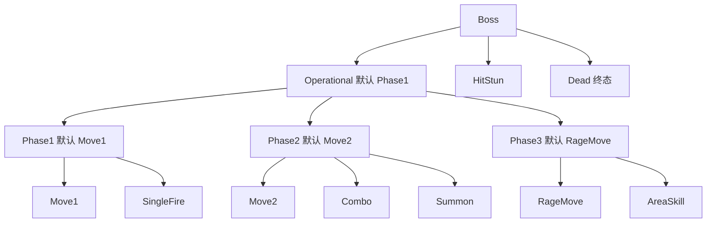
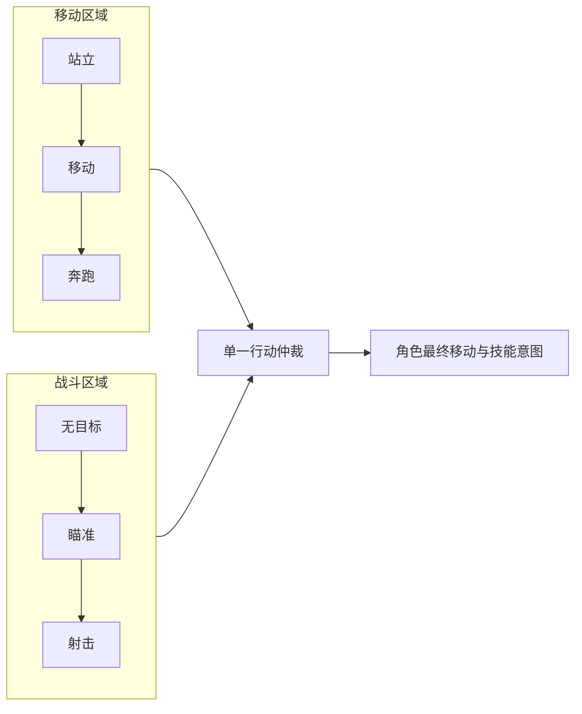

# 02 状态机与层次状态机（FSM / HSM）

> 知识成熟度：L2。主要承诺是具名一手资料的静态核对，以及完整写明规则的纸面案例；不是状态机库、可直接编译的 UE 实现或性能证明。`verified: []` 不变。
> 知识基线：2026-10-10 实际核对 W3C SCXML 1.0 的 2015-09-01 固定 Recommendation、Boost.Statechart 1.87.0 教程，以及 Nystrom 作者仓库 `master/book/state.markdown` 当日返回。后者未锁定提交，不能当不可变版本。本文规则与这些框架的具体规则分别标明。
> 适用范围：NPC 巡逻、警觉、攻击、搜索和逃跑；Boss/任务阶段、受击中断与恢复；策划状态图、表驱动与状态模式选型；服务端权威意图及客户端表现衔接。
> 事实边界：所有伪代码、图、数值与轨迹都是本文自定义的 `PAPER_EXPECTED` 教学合同。未运行目标算法、模型、编译、UE/UHT/PIE、PowerShell、网络探测、实际移动/动画/战斗或性能实验；没有认证私有引擎版本/CL。SCXML、Boost、UE StateTree 和动画状态机不是同一套 API 或调度语义。
> 最后更新：2026-10-10，修正事件与目标混用、Alert 不可达后续行为、子级遮蔽父级、进入退出域和共享运行数据问题；保留原有守卫、Boss、并行、历史、防抖、选型与排障用途。

## 一、先把“当前模式”和“这次发生什么”分开

守卫平时巡逻，听到声音去查看，看到敌人先警告，满足距离与警告时间后攻击；丢失目标去最后已知位置搜索，超时回岗，低血时优先逃跑。每个动词都可以成为模式，但把它们改成枚举并不会自动解决事件顺序、优先级、资源清理或网络同步。

旧守卫例先执行 `state != attack && saw_enemy`，即使已经在 Alert 也直接返回。因此，只要持续看见敌人，后面的 Alert → Attack 判断和警觉动作都到不了；它的标题称“三状态”，实际又列了六种状态。正确的修订必须给出可到达的后续路径，不能只把该段标成“示意”。本篇第三节给出含逃跑的七状态合同。

| 名称 | 本文中的职责 | 最容易混淆的边界 |
| --- | --- | --- |
| 状态 State | 当前持续模式，如 Alert | 状态是决策配置，不等于动画姿势、任务对象或函数调用栈 |
| 事件 Event | 本次交给机器处理的输入，如 Decide、Hit、SkillDone | SeeEnemy 是输入名称，不能放到表的目标状态列 |
| 守卫 Guard | 在本次固定输入/实例数据上判定边是否可选 | 无副作用；计算计时器、扣血、发移动请求不是守卫职责 |
| 转换 Transition | 从源状态出发，带事件、守卫、目标与规则的边 | 多条成立时必须有确定的选择规则；“成立”不等于都执行 |
| 动作 Action | 进入、退出、边动作或持续输出 | 持续动作与一次性进入动作的频率不同 |
| 状态表 | 保存只读定义与边的表示方式 | 可共享定义，不代表可共享计时器和活动子状态 |
| 状态模式 | 将行为分散到状态类/对象的表示方式 | 仍需机器拥有转换提交、对象寿命和资源权限 |
| HSM / HFSM | 把状态嵌套，活动叶子带着祖先路径 | “向父级冒泡”是显式分发规则，不是语言继承自动完成 |
| 正交区域 | 同时活动的几个模式维度 | 逻辑并行不等于多线程，也不等于各区可以直接争写角色 |
| 历史 History | 保存离开某个复合状态时的状态身份 | 不会自动保存协程栈、移动句柄、技能进度或世界快照 |

纯 DFA 的状态/事件/转换定义不能直接完整表达这里的时间、目标和动作：带连续计时器或任意黑板值的工程机器常是扩展状态机。本文使用“有限控制状态 + 每实例数据”的合同，不把旧 `(S,E,T,s0,A)` 当唯一正式定义，也不承诺全部运行时数据构成有限集合。

FSM 也可以用清楚的 `switch` / `if` 实现。真正的差别在于：是否明确当前状态、只读判定、稳定优先级与转换提交，而不是有没有多态。Nystrom 的 State 章节展示了从枚举分支到状态对象的演化；共享无状态对象与携带角色私有计时器的对象必须分开处理。[来源 N](https://github.com/munificent/game-programming-patterns/blob/master/book/state.markdown)

## 二、先定运行合同，再挑数据结构

### 2.1 一个事件的处理阶段

以下是本文单线程、单活动叶子教学机器的约定，不是所有 FSM 的定义，也不是 SCXML 解释器实现。一个事件包含 `owner_id、event_seq、kind、payload`；同一对象按事件序号串行处理，重复/旧序号不再次触发副作用。异步完成事件还必须通过 2.4 的激活与请求身份检查。

| 阶段 | 输入与操作 | 对后续的影响 |
| --- | --- | --- |
| 1 接收 | 取下一个合法事件；冻结本次感知快照和时间输入 | 同一批守卫看到同一份数据，不边查世界边改判断 |
| 2 选择 | 当前叶子可用边按声明顺序检查；普通 HSM 再向父级找；遇到第一条成立边停止 | 选择阶段不调用进入/退出、发请求或改活动状态 |
| 3 提交 | 先验证目标、转换类型和目标数据；再计算退出/进入集合 | 目标不存在或无默认子状态时拒绝配置，不能先拆掉当前状态再找目标 |
| 4 生命周期 | 退出 → 边动作 → 进入；一次完整提交完成前不递归分发；事件由拥有者设上限并分批接收，超限报告故障而非静默丢重要事件 | 回调产生的事件排队，下一轮处理，避免退出一半又进入另一条边 |
| 5 输出 | 读取提交后的有效配置，生成意图；记录路径、边 ID、原因和身份 | 意图消费者仍需负责真实导航、动画和技能的成败 |

本文每次分发最多选择一条状态变化边；没有无事件自动链。守卫案例每次 Decide 最多一次转换，不等于“每渲染帧最多一次”，更不等于紧急事件零延迟。帧内可能处理多个事件；排队、感知频率与调度预算都会影响响应。其他框架可有内部事件、完成事件或多个微步，需要另外规定终止条件与预算。

SCXML 的事件选择、无目标边、自转换、内部/外部转换、进入退出集合都有正式规则；其 run-to-completion 也不是“每帧只走一条边”。本文仅用该标准核对术语与生命周期边界，不宣称实现兼容。[来源 S：§3.5、§3.13、附录 D](https://www.w3.org/TR/2015/REC-scxml-20150901/)

### 2.2 状态表必须同时写出事件与目标

边定义采用 `id、source、event、guard、target、mode、effect`，同一源/事件的优先级由行序决定。`target=—` 表示消费事件并执行边动作，状态不变；未匹配任何边表示 Unhandled，HSM 才继续向父级找。二者不能都用 `None` 暗示。

```text
PAPER_EXPECTED：局部表，完整守卫表见第三节
id   source        event   guard                         target       mode
T1   Patrol        Decide  visible_target                Alert        replace
T2   Patrol        Decide  noise_position_valid          Investigate  replace
T3   Alert         Decide  visible && near && warned     Attack       replace
T4   Alert         Decide  no_fresh_target               Search       replace
T5   Alert         Rewarn  permitted                     —            stay，播放一次提示
```

如果 T1、T2 同时成立，取 T1；如果 Alert 仍看见敌人但警告时间未到，没有转换，继续本状态输出，不能“没改状态也提前返回并跳过动作”。查询是否可转换与真正变更状态是两个步骤。

同状态目标也必须明确：`stay` 不退出、不重置计时器；`external-self` 退出后重新进入，重置该次激活。不能用 `new_state == current` 就一律跳过，亦不能每次持续条件成立都重入。第四节另说明复合状态指向自身后代时的规则。

### 2.3 表驱动与状态模式共享同一所有权原则

| 问题 | 状态表方式 | 状态模式方式 |
| --- | --- | --- |
| 定义放哪里 | 不可变表、状态 ID、默认子状态、回调定义可共享 | 无角色私有字段的行为对象可共享 |
| 每个 NPC 自己拥有什么 | 活动路径、计时器、历史、目标、队列、操作身份 | 同样；或由该 NPC 专用状态实例拥有激活期数据 |
| 谁提交转换 | 机器执行一个统一提交步骤 | 状态方法返回边/请求，回到机器后再提交，避免在方法中销毁自己后继续访问 |
| 调试与配置 | 表可导出图，但需校验悬空目标、顺序和默认态 | 类可封装复杂行为，但需导出转换信息，不能只靠断点理解全图 |
| 生命周期代价 | 共享只读表不要求逐边堆分配 | 按实例创建、值存储、arena 或池都可；池化必须清理上次数据 |

不以 8、15 个状态或固定层数作为普遍分界。真正要看重复边、配置变更方式、复用边界和团队工具。Boost.Statechart 的状态局部数据随状态对象寿命管理是一个具体设计；它不是“所有状态机都靠构造/析构切状态”的保证。[来源 B：Hello World / State-local storage](https://www.boost.org/doc/libs/1_87_0/libs/statechart/doc/tutorial.html)

### 2.4 每对象、每次激活、每个操作分别隔离

定义可共享，但运行字段按下面的责任划分。若复用池对象，也要重新初始化这些字段；地址相同不意味着是同一次操作。

| 数据 | 所有者与生命周期 | 退出或重用时的动作 |
| --- | --- | --- |
| `current/path、event_seq、queue` | 某个 NPC 的机器 | Stop 结束机器输入；重新启用提升 `lifecycle_epoch` |
| `age、stable_time、target` | 某个状态的本次激活 | 进入初始化；退出后不可被旧完成事件写回 |
| `history_path` | 某个 NPC、某个复合状态 | 离开该复合状态前记录身份；重新进入时验证；无效就选默认态 |
| `request_id、activation_id` | 某个移动/技能操作 | 退出先撤销决策写回权限；原请求记录保留到资源结算，必要时请求取消；旧信号不得推进新状态 |
| 只读 StateDef / TransitionDef | 多个机器可共享 | 不存上述可变字段，不捕获另一个 NPC 的 ctx |

本文仅对 Move/Skill 及合并后的 Approach 操作约定一个有限适配边界。请求身份为 `(owner_id,lifecycle_epoch,activation_id,request_id)`；**在发布意图或调用适配器之前**，先分配四元身份并登记原请求记录，记下决策写回有效、尚未终结、尚未请求取消、是否已尝试启动，以及所涉及的资源。新进入分配新的激活 ID，操作 ID 在该机器生命期内不复用。不能先外调、等函数返回后才补登记。

同步启动失败、同步完成和异步回调都只携带已登记的身份入队，由该原请求的适配器进入同一条结算路径；不得在外调调用栈内递归推进机器。启动失败也要终结已经登记的操作，并清理启动过程中实际获得的资源，不能因没有成功启动就漏记这一项。重复或冲突结果不二次结算同一结果；冲突结果记录故障，不能静默把成功改失败或反过来。若返回结果携带资源，原适配器先按原请求及结果身份处理每项资源的一次释放/转交，再产生供机器读取的信号；本例机器输入明确限定为**已结算后的无所有权信号**。没有可识别原记录的带资源结果停在适配边界报告 Fault，不能转给新请求，也不能只记日志后丢弃。

退出只先撤销该激活的决策写回权限，不等于操作已经终结或物理动作已停止。已尝试启动、尚未终结且尚未请求取消的旧操作才发一次 Cancel；从未外调的待发布意图直接在原记录内终结，已成功/失败终结的操作不再 Cancel。重复失效输入不重复取消。原请求记录保留到应有结果和资源的结算完成；旧/重复信号不能改变新状态，但不能以身份过期为由跳过旧资源结算。只有四元身份匹配当前请求、决策写回仍有效的已结算结果，才能提供一次性完成/失败标志。

逻辑失权不等于物理静默：新状态可以提出意图，实际独占资源在旧操作取消已确认且静默、正常结束已确认释放，或明确验证隔离成功之前，不得交给新操作。待确认期间，新意图只登记为未启动并停在此适配边界，不外调启动；确认后仍需核对新意图的激活有效性，失效则结算未启动记录。取消失败、结果丢失或无法判定是否安全复用时，按拥有者的有限等待期限报告 Fault/停止，不猜测取消成功，也不让新旧操作同时使用该独占资源。本篇不实现这个确认/隔离机制，后文纸面成功轨迹明确以该门槛满足为输入前提。

`PAPER_EXPECTED`：NPC A、B 同用 Attack 定义；A 的激活 12 请求 31，B 的激活 4 请求 8。A 退出后再入激活 13 请求 32。收到 `(A,本生命期,12,31)` 后先由原请求适配器结算其结果/资源一次；无所有权的旧信号不改变 A 的 13/32，也不接触 B 的数据。只保存 `state == Attack` 或共享 `attack_timer` 都不足以实现隔离。

进入或退出动作失败时，本文停止机器输出、标记 Fault 并交给拥有者清理已获得资源；不自动回滚外部世界、不吞掉异常继续发招。真实项目可用显式 Canceling 状态/协议承接上述等待，但不能省略取消确认/隔离门槛；本篇不伪造这个引擎级实现。

## 三、守卫七状态：一份可逐行手算的合同

本节只输出意图记录，不访问世界；七个状态是 Patrol、Investigate、Alert、Attack、Search、Return、Flee。Stop/Fault 是拥有者结束执行的结果，不是还能继续自行转移的第八个 AI 状态。所有秒数、距离与血量阈值都是本例参数，不是性能预算或通用设计值。

### 3.1 输入、数据与时间

Stop 是独立的拥有者命令，按输入队列顺序提交后结束本轮机器。每个 Decide 输入包括：单调递增 `seq`、有限且 `dt >= 0` 的时间增量、`hp01`（0～1）、`visible`、`target_valid`、可选 `target_id`、`distance`（有可见有效目标时才使用）、可选 `noise_point`、可选 `seen_point`、`safe`，以及已由原请求适配器完成结算、且身份仍匹配当前有效请求的无所有权 `move_done / move_failed / skill_done / skill_failed` 信号。输入发生冲突（如同一请求既成功又失败）、血量越界或应有位置/距离缺失时记 Fault，停止输出。重复/旧 seq 不推进时间。

初始化执行一次 Patrol 的进入动作并发出 Move(P0)。本例位置只用不透明标签 `P0、P1、H、N、E、C`，分别代表两个巡逻点、岗哨、声音点、目标最后位置与预先给定掩体；不涉及路径算法。每实例保存 `state、age、lost_age、patrol_index、goal、last_seen、activation_id、attack_target_id、attack_canceled`；初始 Patrol、age=0、lost_age=0、patrol_index=0、goal=P0、last_seen=空、attack_target_id=空、attack_canceled=false。`visible` 必须同时有有效目标、target_id 和 seen_point；每次合法 Decide 先更新 last_seen，再使进入前当前态的 age 加 dt。Alert/Attack 在目标不可见或无效时累计 lost_age，可见时清零；其他状态的 lost_age 为 0。

输入序列是唯一时间来源，未给 Decide 就不推进本例时钟。本例持续丢目标宽限为 1 秒；宽限期间立即禁止攻击与追逐陈旧目标，仅等待有效输入恢复。Search 允许在 last_seen 为空时原地搜索，因此没有凭空生成目标位置。

### 3.2 转换、初始化与输出

先执行全局顺序：Stop 或 hp01=0 → 停止并清理；其次非 Flee 且 hp01≤0.2 → Flee；然后检查当前状态下表。全局低血规则是本文的设计，不是放进父级就自然最高优先级。进入 Flee 不因再次看见敌人回到 Alert；必须先满足该态恢复条件。

| 当前态 | 按从上到下顺序检查的条件 → 结果 | 进入后初始化与持续意图 |
| --- | --- | --- |
| Patrol | 可见有效目标 → Alert；有有效 noise_point → Investigate；move_failed → Stop；move_done → `external-self` 且巡逻点 P0/P1 交替；否则保持 | 进入发一次 Move(goal=当前巡逻点)；保持时保留该请求 |
| Investigate | 可见有效目标 → Alert；move_failed 或 move_done 或 age≥4 → Search；否则保持 | 进入复制本次 noise_point 为 goal，发一次 Move(goal)；后续声音不暗中改写正在执行的目标 |
| Alert | lost_age≥1 → Search；当前移动失败 → Return；可见有效目标且 distance≤3 且 age≥0.5 → Attack；否则保持 | 进入只播放一次警告、age=0；可见时输出 Face(target) 与 ApproachIntent(target)，无效时停止该追近意图；疑心显示值为 min(100,60+20×age)，不额外阻塞转换 |
| Attack | skill_failed → Stop；lost_age≥1 → Search；可见且 distance≥4 → Alert；skill_done → Alert；否则保持 | 进入时记录 attack_target_id，且目标有效才发一次 Skill(target)；保持不逐帧重发；丢目标立即撤销输出/当前技能的决策写回权限，等待 lost_age 达到 1 或目标恢复 |
| Search | 可见有效目标 → Alert；age≥5 → Return；否则保持 | 进入 age=0，若 last_seen 有值，发一次 Move(last_seen)；到达/失败后原地观察，不重复重试该移动；保持输出 SearchIntent |
| Return | 可见有效目标 → Alert；move_failed → Stop；move_done → Patrol；否则保持 | 进入发一次 Move(H)，不因新声音离岗；任务超时由拥有者输入 move_failed，不能无限挂起 |
| Flee | safe 且 hp01≥0.5 → Return；move_failed 或 age≥4 → Stop；否则保持 | 进入取消攻击并发一次 Move(C)；看到敌人只更新记忆；到达掩体后保持，不以到达替代 safe/血量条件 |

表中的进入动作只在真正进入时发生；发布 Move/Skill/合并后的 Approach 之前按 §2.4 先登记原请求。所有退出先撤销该激活的决策写回权限，只有已尝试启动且未终结、未请求取消的旧操作才发一次 Cancel。此处保证的是逻辑写回资格唯一；旧 Move 若仍可能物理执行，新 Skill 必须等取消确认且静默或隔离成功才可获得相同独占资源。待确认只登记新意图而不启动；无法确定时停在适配边界并 Fault/停止，不能把一句“旧请求失效”当成互斥已完成。持续 ApproachIntent 由适配层合并为目标意图，不能把每次 Decide 当成新移动请求；其故障也要带所属激活身份。Search 的 Move 失败是表内已定义的原地搜索分支，Return 的失败则停止；这保留了可结束性，未把所有失败都永久重试。

Attack 丢目标而未到宽限时，原技能已经失效；若目标在宽限内重新出现，先转 Alert，再经过新的警告窗口进入新 Attack。此条“取消后的重新获取 → Alert”排在 Attack 的距离/完成判断之前；不能原地把取消的技能继续当活动技能。因此实例还记录 `attack_canceled`，进入 Attack 为 false，丢目标取消时置 true；它只属于该次激活。与 attack_target_id 不同的新目标出现时，也先取消旧技能、清掉本次旧请求的完成/失败标志，再按此重新获取路径处理，不能将 A 的技能悄悄改给 B。

```text
PAPER_EXPECTED：第三节的调度步骤，不是可运行 Python/C++
接受一个未处理的合法 Decide
更新本对象记忆；为进入前的状态累计 age 与 lost_age
若当前 Attack 丢目标或目标身份改变：取消本激活技能，attack_canceled = true
  清掉已撤销请求在本次输入中的完成/失败标志；原适配器仍结算迟到资源，旧信号按身份拒绝
按全局规则，再按当前状态表选至多一条边
  Attack 中 attack_canceled 且重新有有效可见目标：选择 Alert
若选中边：完整退出，执行该边的数据修改，完整进入；新 age = 0
若结果为 Stop/Fault：清理后结束，不发持续意图
否则按最终状态登记并提出意图；旧独占资源确认静默或隔离成功后才外调启动
回调只入队，原适配器先结算，再给机器无所有权信号；不递归分发
```

这里有意使用事件表和动作表来完成示例，不再留下 `Memory()`、`home_position`、`phase2` 等未定义符号并称“完整程序”。事件源怎样感知、怎样真正移动/施法仍是集成边界，但对给定输入应该选哪个状态、登记几个意图、取消哪个旧操作已经确定；这些意图能否实际启动还必须满足 §2.4 的资源交接门槛。

### 3.3 正例与能暴露旧缺陷的反例

下表每个用例可以包含多次新的 Decide，每次输入至多一条状态变化边。连续主链是 **G1→G2→G3→G5→G6**；G4 从 G3 的快照另起一个完成分支，不接入 G5。其他用例按所注明的独立起点处理，不将上一行结果暗中沿用。主链初始 hp01=1、Patrol、无目标/声音和完成/失败信号；接续用例未列血量/目标快照沿用前一步合法值，但声音、完成/失败标志只作用于指定的那次输入，下一次默认空/false，未写 dt 时取 0。表中实际启动的成功轨迹假定各次独占资源交接已确认静默/隔离成功且启动获准；若不满足，按 §2.4 停在适配边界，不能把表中状态/意图预期当实际动作已执行。返回中的数字是纸面预期，不是测试输出。

| 用例 | 输入与初态 | PAPER_EXPECTED | 为什么 |
| --- | --- | --- | --- |
| G1 基本攻击可达 | Patrol；dt=0，看见 E、distance=2 | Alert，警告一次，age=0 | T1 不绕过进入动作 |
| G2 等待警告 | 接 G1；dt=0.25，仍看见 E | 仍 Alert，age=0.25，Face/Approach 意图正常 | 没有转换也要执行当前态输出 |
| G3 进入攻击 | 接 G2；dt=0.25，仍看见 E | Attack，Skill 请求一次，age=0 | 0.5 秒警告已满足；旧提前 return 会让本行永远停 Alert |
| G4 完成再行动 | 从 G3 快照独立分支；当前技能匹配的 skill_done，dt=0.1 | Alert，退出旧技能，新警告一次 | 不重复处理旧完成；下次攻击是新的激活 |
| G5 丢失并搜索 | 接 G3 的 Attack；目标失效 dt=0.4，再 dt=0.6 | 第一次取消技能并保持；第二次 Search，age=0，去 last_seen | 不能边等待丢失宽限边继续攻击 |
| G6 搜索回岗 | 接 G5；dt=5 → Return；当前回岗 move_done、dt=0 → Patrol | Search 移动被取消，Move(H)，再 Move(P0) | 每次 Decide 最多一条边；不会一次 dt=5 自动连跳回 Patrol |
| G7 查看声音 | 独立初始化 Patrol；noise_point=N → Investigate；匹配 move_done → Search | Move(N) 一次，随后观察/搜索 | 声音点来自输入，不把事件名当目标状态 |
| G8 危险竞争 | 独立初始化 Patrol；同次 hp01=0.2、可见 E、有声音 | Flee | 全局低血优先；不是依赖条件恰好排列 |
| G9 逃跑恢复 | 独立起点为合法进入的 Flee、age=0；hp01=0.4、safe=true；再 hp01=0.5、safe=true | 先保持，后 Return | 血量恢复阈值不同，看到 E 不能抢回攻击 |
| G10 取消后重获 | 从 G3 快照独立分支；失去 E 0.1 秒，再看见 E、dt=0.1 | 取消后先 Alert，不复用旧 Skill | 激活身份与丢目标宽限是两个不同责任 |
| G11 失败停止 | 从 G6 第一次输入后的 Return 快照独立分支；匹配 move_failed | Stop，清理且不再发 Move | “兜底”有结束条件，不回 Patrol 重试同一坏路径 |

## 四、HSM：父级规则、转换域与历史恢复

### 4.1 嵌套减少重复，但不会自动消灭组合

在树状单区域 HSM 中，活动配置是一条祖先到叶子的路径，例如 `Boss / Operational / Phase2 / Combo`。Phase2 活动时有且只有一个活动子状态；离开 Phase2 必须退出该子状态。共享“死亡/中断”规则可避免给每个招式重复一条边，但三个阶段的三个不同招式仍是不同状态身份；不能直接宣称“24 个状态降到 8 个”。复用动作实现也不等于同一有状态对象挂到多个父级。



图中的实线表示包含关系，不是转换。招式完成 → 该阶段默认移动态；受击 → 离开 Operational 进入 HitStun；匹配当前硬直激活的 StunDone → 经校验的历史路径；死亡 → Dead。Phase1/2 的阶段跳转由下文明确规则承担。硬直在本图是 Operational 的兄弟，由公共策略触发，不能在运行时把仍属于某阶段的同一子对象挪进另一父状态。

另一个小型 Combat 例保留近战/远程/回避的意义：`Combat` 有 `Melee、Ranged、Dodge` 三个子态；距离拉远的普通事件可从 Melee 到 Ranged，贴近则反向，DodgeDone 回 Melee。这三个边只改变子态，公共 Combat 资源不必被释放重建；需全程处理的 LowHP 另按紧急策略选择。

### 4.2 “子级优先”与“紧急优先”不能同时靠默认冒泡实现

普通分发约定：从活动叶子开始，按本层边序找成立边；本层 Unhandled 才看父级；`HandledStay` 已消费事件，不冒泡。低层的 Tick 如果总能匹配，父级同 Tick 的 LowHP 条件可能永远到不了。把“低血边写在父级”说成“必对所有子态优先执行”是不成立的。

本文 Boss 选择显式的前置策略：每次有效输入先更新 hp，再按死亡 → 阶段升级 → 受击中断 → 普通叶到根分发的次序选择一条边。死亡不受防抖；阶段升级先于旧招式完成。该策略在普通分发外执行，不能同时宣称采用无修改的某个库默认优先级。使用真实框架时，可以设计不会被子态消费的专用事件或集中仲裁，但必须按其实际合同验证。

`PAPER_EXPECTED`：活动 `Phase1/SingleFire`，一次输入 hp=0.25 且 SkillDone=true。普通子级先消费 SkillDone 可能回 Move1；按本例前置策略应直接进入 Phase2/Move2，旧 SingleFire 完成被此次退出撤销。两个结果代表不同合同，不能用“都叫 HSM”掩盖。

### 4.3 从声明源计算转换域，不能只比较旧叶和新叶

本文给树状单区域教学机提供三种明确类型；`Machine` 是不可选择的虚拟根。所有目标先展开到默认叶子，但计算转换域使用边的声明源与显式目标。资源只在对应状态真正离开时释放。

| 类型 | 保留的边界 | 退出/进入语义 |
| --- | --- | --- |
| stay，无目标 | 整个当前配置 | 只做边动作；消费事件；无进入退出 |
| external | 声明源和显式目标最深的共同“严格祖先”（不包括它们自身） | 退出该边界以下所有活动状态；边动作；进入目标路径并补默认子态 |
| local-descendant | 声明源本身，且它必须是复合态，目标必须是它的严格后代 | 保留源；退出其活动后代；边动作；进入目标及默认子态；其他形状视为非法配置 |

`external-self` 是 external 的源=目标情况。这里 `local-descendant` 是本文标签，不是 UE API；不要把 stay 和 SCXML 的 `type="internal"` 视作同义。后者具有指定条件下保留复合源的语义，并非一律不发生子状态进入退出。

```text
PAPER_EXPECTED：树 Machine/A/{B/{B1,B2},C}
当前路径 A/B/B1
边声明源 B1，external 目标 B2：Exit B1 → 边动作 → Enter B2；保留 A/B
边声明源 B，external 目标 B2：Exit B1 → Exit B → 边动作 → Enter B → Enter B2
边声明源 B，local-descendant 目标 B2：Exit B1 → 边动作 → Enter B2；保留 A/B
边声明源 B1，external 目标 B1：Exit B1 → 边动作 → Enter B1；新的激活身份
边声明源 B1，stay：只有边动作；旧计时器、激活身份不变
边声明源 B1，external 目标 C：Exit B1 → Exit B → 边动作 → Enter C；保留 A
```

实际提交时先拍下旧活动路径和退出复合态的历史身份，再撤销待退出状态的操作决策写回权限，然后由叶到根退出；边动作之后由根到叶进入。保留边界不重复进入。在进入/退出动作均成功的正常路径上，每个仍活动状态的 Enter 数比 Exit 数多 1；停止且清理成功后才期望全部配平，不能要求任意时刻计数相等。默认子态缺失、父子成环、目标跨树或同一有状态实例挂多父级均是配置错误。

### 4.4 Boss 三阶段、任务推进与中断恢复

本例 hp01 只用于示意：Phase1 在 hp≤0.30 升到 Phase2，hp≤0.15 则选 Phase3；Phase2 到 Phase3；Phase3 不因回血降级。一次伤害可直接跨到 Phase3，以免进入已经过期的 Phase2 招式。若产品要求每段转场演出都必须发生，应另设显式过渡态和完成事件，而不是暗中循环过渡或把某段技能误发出来。

阶段进入负责阶段专属技能表、场地机制和演出意图；阶段退出只清理该阶段拥有的召唤物、计时器和操作。共享战斗目标等数据放 Operational 或 Boss 层。是否清除异常、玩家伤害效果或保留召唤物是具体游戏规则，要逐资源指定；HSM 不自动提供“清空旧状态就更好玩”的设计结论。血量阈值、演出节奏和新招式只是这个模式的用法。

任务阶段也可同构为 `Quest/Travel、Quest/Interact、Quest/Complete`：到达完成才进入交互，交互成功才到 Complete；取消退出当前操作；不可恢复失败转 Failed，由拥有者决定重新启动。Complete/Failed 可以是合法终态，不需要再配一个“超时回默认态”把已完成任务重做。

历史有两种用途：浅历史只保存直接子态身份，深历史保存到叶子的配置；两者都不等于挂起调用栈。本文 Boss 在离开 Operational 进 HitStun 前保存旧路径及阶段编号；HitStun 恢复时先核对死亡、阶段合法性和目标，再重新进入。时间与请求默认重新创建，而不是把已取消技能继续执行。[来源 S：§3.10](https://www.w3.org/TR/2015/REC-scxml-20150901/)

| 恢复时情况 | PAPER_EXPECTED 处理 | 避免的问题 |
| --- | --- | --- |
| 从未记录历史，或首次恢复没有可用历史 | 进入当前合法阶段的默认子态 | 不解引用空历史，也不猜测旧招式 |
| 深历史为 Phase2/Combo，阶段/目标仍有效 | 重新进入 Phase2/Combo，新的技能激活与请求 | 不把旧 SkillDone 接到新 Combo |
| 浅历史只记 Phase2 | 进入 Phase2 默认 Move2 | 不假称恢复到了上次招式中间 |
| 历史指向不存在状态，或 Combo 目标已死亡 | 进入当前合法阶段的默认移动/待机态；失效目标不发招 | 历史身份不是无条件准入证 |
| 受击期间 hp 降到 Phase3 区间 | 更新应有阶段；保持 HitStun，恢复时进入 Phase3/RageMove | 不为了升级阶段提前结束硬直，也不倒退回 Phase2 |
| hp=0 或 Stop | 去 Dead/结束；撤销恢复请求 | 死亡后不能被 StunDone 复活 |

Boss 处于 HitStun 时，前置“阶段升级”只更新恢复所用的期望阶段，不提交离开 HitStun 的状态边；死亡仍可立即抢占。只有 Operational 活动时才提交阶段边。连续受击本例用 stay 更新硬直剩余时间，保持同一激活；若要每次受击重新进入，必须显式选 external-self 并接受重置资源的后果。

### 4.5 正交区域：先各自产生意图，再由一个拥有者裁决



本文扩展示例让两个区域读取同一版本的只读感知快照，各有自己的状态与计时器，输出暂存后由行动层统一提交；不允许移动区域改黑板后令战斗区域看到另一份输入。两个区域可各自转换一次，故不能把单区域“一次一条边”未经修改套过来。若一条全局边退出整个并行复合状态，应一次退出其全部活动区域；不能让已退出父级的射击区继续发招。

`PAPER_EXPECTED`：移动区给 RunTo(C)，战斗区给 Fire(E)。本例规则为“Flee/HitStun/Dead 禁止射击；否则移动与射击可共存，身体朝向归移动、武器瞄准归战斗”；Flee 时最后只选择 RunTo(C) 意图，已经启动的射击也需取消；若新移动与旧射击争用同一独占资源，实际启动仍须通过 §2.4 的静默/隔离门槛。权重混合、资源锁或上层互斥都可以形成其他合同，但“各区独立更新”本身不会解决冲突。该结构同样适用于行走/表情/战斗等维度；逻辑独立不承诺物理动作互不干扰。

## 五、防抖、重入与时钟：状态对象共享最容易在这里出错

持续窗口与滞回解决不同问题。窗口要求观察条件稳定一段时间；滞回使用不同进入/退出阈值形成中间保持区。本例 Attack 进入距离≤3，离开距离≥4，距离在 3～4 间保持；这只减少距离噪声导致的往返，不阻止死亡、失效目标或完成事件。

下面是一个独立的 0.2 秒窗口合同，不叠加到第三节的默认攻击规则，避免读者不知道需要同时满足几个延时。它属于 `(owner_id,transition_id,source_activation_id,target_id)`，不是整个游戏共用的 `TimedTransition` 对象。

```text
PAPER_EXPECTED：每个合法 Decide 最多更新一次
如果源状态不活动、目标身份改变或条件为假：accumulated = 0
否则：accumulated = min(required, accumulated + dt)
ready = 条件为真 且 accumulated >= required
离开源状态、重新进入源状态或池对象换主人：accumulated = 0
required 为非负有限值；dt 为非负有限值；错误输入拒绝并诊断
```

这里 dt 表示本次输入声称覆盖的稳定采样区间；离散采样无法证明两次采样之间真实世界始终满足条件。若只有采样瞬间事实，应从首次为真的时间戳开始计时并明确中间不可观测边界，不能把 0.2 秒直接称作连续物理证据。

| 输入序列 | PAPER_EXPECTED | 反例说明 |
| --- | --- | --- |
| 同一目标条件真：0.10 秒、0.10 秒 | 累计 0.10、0.20；第二次 ready | 同一帧因两个守卫重复调用而累计两次，会错误提前触发 |
| 真 0.10、假 0.05、真 0.10 | 累计 0.10、0、0.10；未 ready | 只在真时加、不在假时清零是“总时长”，不是连续窗口 |
| A 累计 0.15，B 新激活真 0.05 | B 为 0.05，未 ready | 共享可变计时器让 B 借用 A 的历史 |
| 本对象离态后重新进入，真 0.05 | 从零累计到 0.05 | 状态类地址/池对象复用不能继承旧窗口 |
| 大 dt=1.0 且条件只在当前瞬间观察为真 | 不能证明此前 1 秒稳定 | 按选定的采样语义补时间戳/采样，不能直接推断 |

事件驱动不会自动使空闲 NPC 零成本：仍可能维护定时器、感知、队列、同步或资源。只计算状态表查询次数也不能推出整条 AI 决策耗时。不要将旧“极低”“10 倍”“24→8”或固定状态数阈值当测量结论。

## 六、选型、潜行/日常与服务端落地

### 6.1 按问题选，按真实工具比较

| 实际问题 | 可采用的结构 | 必须补齐的合同 |
| --- | --- | --- |
| 少数稳定模式及明确边，如 UI/任务阶段 | FSM，表或 switch 均可 | 输入事件、边优先级、合法终态和失败恢复 |
| 阶段共享规则，子动作不同，如 Boss/NPC 活动 | HSM | 活动路径、源/目标转换域、默认子态、中断与恢复 |
| 流程分解、重复动作组合较多 | 行为树或脚本任务组合 | 成功/失败/运行中、重评估、取消与节点实例归属 |
| 移动与武器等正交维度 | 分区机器或明确的并行任务结构 | 快照一致性、事件广播与消费、行动仲裁 |
| 大量相似 NPC | 共享只读定义 + 每实例数据，可用 FSM/HSM/BT | 数据布局、调度、感知与动作成本；实测后再比容量 |

行为树不天然更快、FSM 不天然不会乱；有些行为树有可视化工具，有些状态机也有。异步能力取决于任务生命周期和取消协议，不能以 Wait/Success 等节点名直接得出“BT 天然支持、FSM 不擅长”。详见[行为树通用原理](03-行为树通用原理.md)；UE 具体任务与 StateTree 的生命周期分属[行为树详解](01-行为树详解.md)和[StateTree 状态树](05-StateTree状态树.md)。本篇不给它们复制一份 API 实现。

三个组合案例均为设计示例，不宣称《合金装备》《模拟人生》某版本的真实实现：

- 潜行：外层 FSM 管 Patrol → Alert → Combat → Search → Return，内层任务执行绕路、呼叫或查看。外层离开时给内层一次取消，并以激活 ID 拒绝已结算后的迟到信号写回；旧任务结果/资源仍由原操作负责结算；警戒等级只有建成独立区域时才是正交状态，不能只因“像另一层”就称并发
- Boss：HSM 管阶段和招式选择，技能执行器/动画负责实际动作；阶段退出撤销旧技能权限。若 BT 作为子执行器，完成事件必须指回启动它的阶段/激活，不能反向无限重入父机器
- NPC 日常：效用系统选择“去吃饭”，执行层 FSM 为 Travel → Sit → Eat → Leave；无法到座位 → Failed 返回选择层；被打断时取消本轮行动而不是每帧重新选座。[Utility 与 GOAP](04-Utility与GOAP.md)负责意图选择，不代替执行状态的生命周期

### 6.2 AI 状态、动画状态与网络状态分别负责什么

AI 输出“追近目标、请求攻击、已受击”等意图；动画系统根据速度、朝向、动作请求与自身状态决定混合/表现。动画完成只是某个带身份操作的输入，不能随意改全局 AI state。小型玩法可以共用某些状态，但仍要明确谁拥有转换与取消，不能因为同名就让动画图与 AI 图互相驱动循环。[动画蓝图与状态机](../../04-图形动画与物理仿真/动画求值与角色表现/01-动画蓝图与状态机.md)单独负责动画求值语义。

服务端权威设计的一种最小消息合同是 `(entity_id,lifecycle_epoch,state_seq,phase,state,target_id,start_server_time)`；这是本文建议的意图快照字段，不是引擎原生网络结构，也不是完整存档格式。客户端只接受同实体生命期中更新的 state_seq，按该意图驱动表现；目标尚未复制到达时进入等待/无目标表现，不凭 ID 猜对象，不用旧动画完成回调把权威状态切回去。迟到、丢包、重连、对象销毁和完整快照重建需要复制层另行实现。

若要求确定性回放，仅固定随机种子不够：还要固定输入快照、事件顺序、时间步、随机调用顺序、配置/规则版本，以及可能影响分支的数值语义。同步“当前状态 + 若干参数”是否足够取决于未来所需的数据；计时器、历史、队列、请求、冷却或随机状态未重建会造成分歧。异步世界完成时刻不同，也会改变事件顺序。此处不声称确定性、带宽、吞吐或客户端/服务端实际同步已经验证。

## 七、验证与基准建议：只报告 PAPER_EXPECTED

本次只有静态检查与手算合同，无目标程序测试结果；下面是以后实现的验收输入，不把不存在的 `tests/test_fsm_hsm.py` 命令当复现入口。照表记录每次输入、旧/新路径、选中边、退出/进入序列、owner/epoch/activation/request 身份、动作意图与拒绝原因即可纸面核对。要变成运行证据，必须另行提供实际实现、依赖、命令和原始输出。

| 编号 | 固定输入/反例 | PAPER_EXPECTED 判定 |
| --- | --- | --- |
| V1 基本可达 | 主链 G1→G2→G3→G5→G6；G4 另起完成分支 | Alert 能推进至 Attack，再到 Search/Return/Patrol；每次进入只发对应的一次性动作 |
| V2 竞争 | 同时低血、看见敌人、声音；HSM 同时阶段变化与 SkillDone | 按声明的全局规则选择，不受未定义容器遍历序影响 |
| V3 不消费/已消费 | 子态无匹配；子态 stay | 前者到父级，后者停止；不能一个空返回混用两种意思 |
| V4 转换域 | 4.3 六条输入逐条从同一初态执行 | 精确匹配各自退出/进入序列；父级保留与重入不同 |
| V5 生命周期 | 当前态运行中统计，再 Stop | 活动态 Enter−Exit=1；清理后为0；终态/停止不需要继续超时返回 |
| V6 重入与迟到 | A 退出/再入后旧请求完成；B 同定义并行存在 | 原请求先结算结果/资源；旧无所有权信号不得写新激活/B；回调只排队 |
| V6a 同步启动结果 | Move 已先登记四元身份；外调在返回前即同步报告失败/完成，又重复通知一次 | 两次通知均入同一原记录结算队列；同一结果只结算一次，无内联状态转换；合格信号最多一次；启动失败所获资源也结算 |
| V6b 旧资源与独占交接 | 旧 Move 失去写回权限；带资源的旧结果晚到，新 Skill 想启动但取消尚未确认 | 原适配器结算旧资源一次，旧信号不改新状态；新 Skill 只登记，等静默/隔离确认后才外调，无法确认则 Fault/停止 |
| V7 历史 | 浅/深历史、无首次历史、状态删除、目标死亡、硬直中升级 | 明确默认/恢复/拒绝路径；不复用取消后的句柄，不绕过硬直 |
| V8 时间 | 5节五行、dt=0、负数、NaN、重复 seq | 非法输入拒绝；重复事件不重复累计；离态/换目标重置窗口 |
| V9 并行 | RunTo 与 Fire 同时输出、父级退出 | 仲裁只提交合法动作；全局退出清掉所有区域 |
| V10 失败与边界 | 空事件队列、未知事件、移动失败、进入失败、阶段阈值精确命中 | 空队列不推进；未知事件记录后丢弃；进入失败 Fault；hp≤0.15 可直达Phase3 |
| V11 恢复/网络 | Stop 后重新启用、旧生命期快照、丢目标后重获 | epoch 更新；旧信息不覆盖新生命期；新攻击走新的激活 |

状态图不可达/死态检查只回答结构问题，不能证明目标永远有效或副作用成功。调试“卡住”先检查最近接收/拒绝的事件、活动路径、匹配边与 guard 值，再看动作结果和时间是否推进；不要第一反应加“5 秒回默认”掩盖资源故障。合法等待/终态应有明确拥有者，意外无出口才是缺陷。

将来若获准做性能测量，应分开转换候选数、边评估数、路径深度、队列等待、感知/动作适配成本，以及完整决策的 P50/P95/P99；报告对象数、负载、时间步、实现版本、机器和原始样本。这里没有预设延迟/容量数字，也没有将既有其他 Linux 模型 CI 当本文验证。

## 八、来源定位与继续阅读

| 来源 | 实际核对位置、用途 | 不支持什么 |
| --- | --- | --- |
| [S：SCXML 1.0 固定 Recommendation](https://www.w3.org/TR/2015/REC-scxml-20150901/) | 2015-09-01；§3.1、3.5、3.10、3.11、3.13 与附录 D；区分事件选择、活动配置、历史和转换语义 | 不支持本文守卫阈值、Boss 游戏规则、UE API 或运行/性能结论 |
| [B：Boost.Statechart 1.87.0 Tutorial](https://www.boost.org/doc/libs/1_87_0/libs/statechart/doc/tutorial.html) | 固定版本路径；State-local storage、Guards、In-state reactions、Transition actions、Posting events、History；理解状态数据寿命与显式事件处理 | 不代表本文调用了 Boost，也不代表各框架取消/异常/优先级相同 |
| [N：Nystrom State 作者仓库](https://github.com/munificent/game-programming-patterns/blob/master/book/state.markdown) | 2026-10-10 的 master 返回；The State Pattern、Static states、Instantiated states、Enter and Exit Actions；区分共享定义与角色私有状态 | 不是固定 commit；不能据此保证某池实现、UE 编译或真实游戏采用该设计 |

原文把 [Epic 官方文档总页](https://dev.epicgames.com/documentation/en-us/unreal-engine)放作通用来源；保留其导航用途，但总页不足以支持本文 FSM/HSM 的具体规则。本轮官网章节直达失败的 Nystrom 页面通过作者 GitHub 正文核对；Qt 页面打开失败，未用于形成版本/API 结论。检索结果的“当前版本”提示可能变化，因此本篇只承诺上表实际读取的固定版本/日期快照。

- [AI 总体架构与感知](01-AI总体架构与感知.md)：给转换提供可追溯的输入与记忆
- [行为树通用原理](03-行为树通用原理.md)：流程组合、重评估与取消的另一种组织方式
- [Utility 与 GOAP](04-Utility与GOAP.md)：目标/意图选择与状态执行层的组合
- [UE 行为树详解](01-行为树详解.md)、[StateTree 状态树](05-StateTree状态树.md)：各自实例数据与生命周期的具体合同；不把本篇伪代码替代其接口
- [行为树与 AI 源码专题](12-行为树与AI源码.md)：公开合同与历史源码片段的边界，需按该文版本定位
- [游戏 AI 学习路线](../../../00_Index/学习路线/游戏AI.md)：保留旧分类总导航的学习用途
