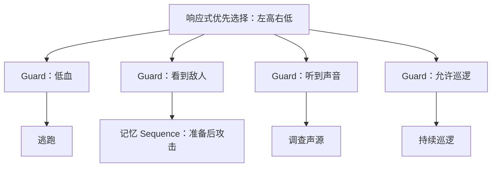
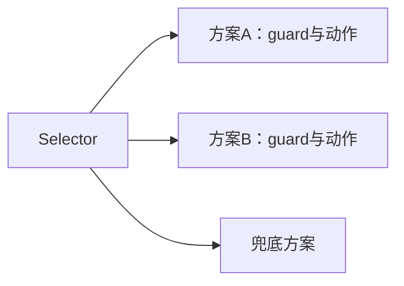
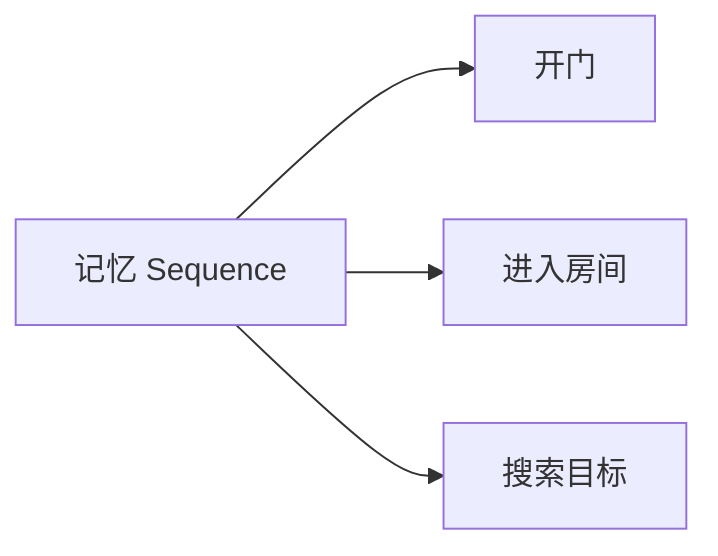
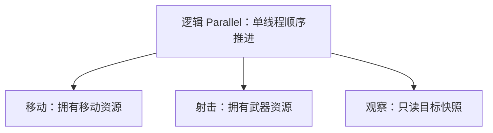
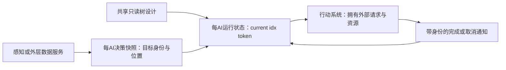
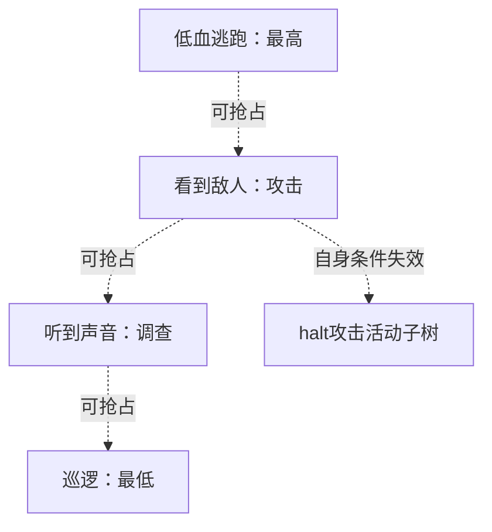
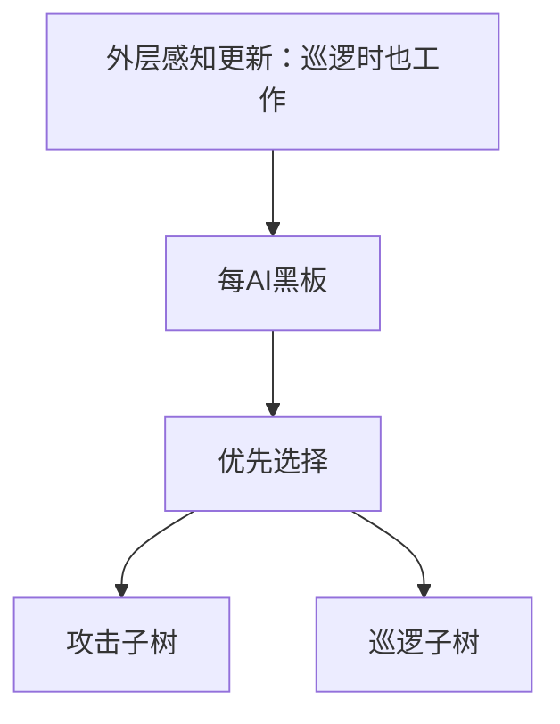

# 03 行为树通用原理（Behavior Tree）

> 知识成熟度：L2。主要承诺是具名一手资料的机制核对，以及一套明确作者模型的因果解释和正反例。局部 Python 功能检查不提升全文等级，也不是 UE 运行证据。
> 最后更新：2026-10-05
> 知识基线：2026-10-05 核对 BehaviorTree.CPP 文档显示的 4.8、Epic 文档显示的 UE 5.8，以及 Opsive 指定插件的公开条件中止页；网页不是不可变源码 revision。
> 适用范围：学习 NPC 决策的优先级、跨次推进、状态归属和取消；用于读懂或设计运行时合同，不承诺直接可用的游戏 AI 或统一引擎语义。
> 证据边界：第四节是本文自定义、单线程、非重入、同步取消的 Python 教学例；其余图、并行策略和异步生命周期是明确的纸面模型。真实导航、动画、线程、UE 编译/UHT/PIE、引擎取消时序及性能均 NOT_RUN。UE 的实际接口与用法见[行为树详解](01-行为树详解.md)。

## 一、先解决一个完整问题

哨兵有四条需求：低血时先逃跑；否则看到敌人就追击并攻击；否则听到声音就去查看；都没有就巡逻。这里“低血”的阈值属于游戏规则，本文只接收已计算的布尔输入，不把某个百分比当通用常量。



这张图表达的是选择顺序，不是四个动作同时启动。关键问题也不仅是“下一步做什么”：巡逻已经占着移动资源时，逃跑如何接管？敌人消失时，旧攻击如何停止？同一棵设计用于两个 AI 时，谁保存各自进度？

行为树把这些问题拆成可组合的控制规则：Selector 尝试替代方案，Sequence 表达先后依赖，Task 拥有动作的执行与收尾。它能减少某些流程的显式状态转换连线，但加分支仍须检查优先级、资源和退出责任；不能仅凭树形外观保证正确。

### 本文贯穿始终的作者模型

1. 响应式优先选择每次从左侧重新检查**纯 guard**；遇到第一个可尝试的分支，先同步停止旧分支，再推进该分支。得到 Running 或 Success 就停止本轮选择；Failure 则同轮继续右侧候选
2. Sequence 记住 Running 的位置，不重复此前已成功的步骤；成功、失败或 halt 后回到索引 0。这里“记忆”指本合同，不等于库中名为 SequenceWithMemory 的节点
3. Guard 在每次受调度时重查；变假就递归 halt 活动子树。Task 仍检查业务 guard、目标身份和运行期资源有效性
4. halt 是同步、递归、幂等的取消操作；返回前旧动作资源已释放。自然终态同样完成清理；一次调用结束后，只有 Running 可以保留 current 或活动叶子
5. 一次推进单线程、不可重入，guard 无副作用，同次推进内决策输入不变。每 AI 独立节点状态和上下文；可共享的是只读设计，不是本例的可变节点对象
6. 每轮每分支最多尝试一次，不在同一调用内无限重试。停止宿主后不再推进；显式重启从已重置的树开始

这些是为了让例子可逐步推导而选定的规则，不是所有行为树的唯一标准，更不是 UE 每帧从根全扫的实现描述。

## 二、节点为何这样传播结果

### 2.1 三态、生命周期与调度是三个层次

| 概念 | 本文含义 | 不应混同 |
| --- | --- | --- |
| Success | 本次子任务达成约定目标 | 不保证整个游戏目标完成 |
| Failure | 本次方案不成立或执行失败 | 不是程序崩溃；父节点可以选择替代方案 |
| Running | 本次动作尚未终止，控制权已经交还宿主 | 不代表另开线程，也不代表必须每帧调用 |
| Root / 宿主入口 | 获得一次推进机会，接收根的结果 | 不自动规定感知、条件和动作的更新频率 |
| halt / 取消 | 放弃当前激活，撤销它拥有的活动资源 | 不额外伪造自然 Success；实际框架可有独立取消状态 |
| 黑板 | 跨节点交换决策输入的一种办法 | 不是所有可变状态的唯一归宿 |
| Service | 某些运行时提供的周期/事件辅助更新扩展 | 不是三态模型必备节点 |

长动作不应把“等到完成”写成一个阻塞整个调度线程的循环。它保存本次激活的进度，及时返回 Running；下一次轮询或有效事件再推进。BT.CPP 的 [StatefulActionNode 教程](https://www.behaviortree.dev/docs/tutorial-basics/tutorial_04_sequence/)区分启动、运行和 halt 回调；本文借此解释生命周期，没有复制它的 C++ 运行时。

### 2.2 Selector：寻找一个可行方案



子项 Failure 才轮到下一个；Success 令父节点成功；Running 令父节点等待，右侧不执行。全失败则失败。因此 `Selector[Condition, Action]` **不是**“条件成立就行动”：Condition 为真时已经 Success，Action 反而被跳过；为假时才可能执行 Action。

本文优先选择器还会在下次推进重查左侧 guard，因而可以抢占；普通记忆选择器可能先恢复当前 Running 子项。BT.CPP 的 [Fallback 比较表](https://www.behaviortree.dev/docs/nodes-library/FallbackNode/)明确区分普通与 Reactive 节点；“失败后如何继续”和“下次从哪里检查”要分别读合同。

### 2.3 Sequence：表达前置依赖，但记忆不等于持续守护



Success 才推进下一项，Failure 立即令序列失败，Running 留在该项。 对 `Sequence[Condition, Action]`，首次 Condition 真才调用 Action，假则直接 Failure、Action 不启动。本文一轮可连续处理多个即时成功项；Running 后再次推进不重新开门。若门必须一直保持打开，应给运行中的流程加持续 Guard，而不是指望已经成功的“开门”步骤自动再执行。

| 组合 | 条件为真时首次调用 | 动作 Running 后条件变假 |
| --- | --- | --- |
| 本文记忆 Sequence[Condition, Action] | 进入 Action | 仍从 Action 继续；不会自动重查先前 Condition |
| Guard(condition, 记忆 Sequence) | 条件成立才进入流程 | Guard 先停止活动子树，再返回 Failure |
| 每次重启检查的响应式序列 | 每次从前置项检查 | 可重查并取消，但须避免重复有副作用的成功步骤 |

不同库也可能在子项失败后保留索引。[BT.CPP Sequence 比较表及 ReactiveSequence 段](https://www.behaviortree.dev/docs/nodes-library/SequenceNode/)给出了具体差异。本文失败归零的 Sequence 不冒充该库的 SequenceWithMemory，也不把整个 BT 简化为“有记忆/无记忆”二选一。

### 2.4 装饰器：改变条件或结果时，仍要承担退出责任

`Guard(condition, child)` 是本文持续条件装饰器：先读条件；真则推进 child；假则 halt 活动 child 后失败。仅返回 Failure 而不取消会使树看似离开，实际移动请求仍在执行。

其他常见设计包括取反、有限重复、有限重试、超时、概率门控、冷却和强制结果。需要补齐各自合同：

- Inverter 只交换 Success/Failure，不能把 Running 当成功
- 超时或强制提前结束必须明确如何取消 Running 子项；不能先把父标成功却遗留动作
- Retry 限定总尝试数、间隔和耗尽后的 Failure；例如最多两次的纸面轨迹是“失败、让出调度、失败、结束”，不是同一调用里无限再试
- Repeat 即使子项每次都 Success，也可能在单次调用内忙循环；设置让出调度或迭代上限。树结构无环不证明执行有进展
- 冷却应说明起算点是启动、成功还是任意退出；概率决定只在何时采样也要固定，避免每次重查把动作抖掉

第四节仅实现 Condition 和 Guard，不实现上述其他装饰器；这里是设计推导，NOT_RUN。

### 2.5 Parallel：多项在活动，不是多线程许可证



先写清阈值和收尾，才谈“并行”。以下是**本文用于纸面推导的策略**，未实现于第四节：N 个子项，成功阈值 K，失败阈值 N-K+1，要求 1≤K≤N，空列表拒绝配置。每轮按固定顺序推进尚未终态子项，锁存每项终态；每推进一项就检查阈值。达到任一阈值即返回对应终态，先 halt 其余 Running 子项，再清聚合状态供下次激活。

| 策略 | 成功门槛 | 失败门槛 | 剩余动作 |
| --- | --- | --- | --- |
| AND | N 项成功 | 1 项失败 | 达门槛时取消剩余 Running |
| OR | 1 项成功 | N 项失败 | 达门槛时取消剩余 Running |
| K-of-N | K 项成功 | N-K+1 项失败 | 同上；本合同不允许两个门槛同时达到 |

手算两项 A/B：第一轮 A Running、B Running；第二轮 A Success、B 仍 Running。OR 在 A 成功时取消 B 一次；AND 锁存 A 的成功，只继续 B，不重复 A 的副作用。若 A 第一轮立即成功且排在 B 前，OR 可以根本不启动 B。重入时清空锁存，按新一次激活重新开始。另有“等待全部结束再汇总”的政策，应换合同，不能与提前终止混写。

[BT.CPP Parallel](https://www.behaviortree.dev/docs/nodes-library/ParallelNode/)说明顺序 Tick 下的逻辑并发、阈值及剩余 Running 的 halt，并另列 ParallelAll；它支持这一设计问题的必要性，不认证本文纸面算法是其逐字实现。

即使同线程，两项也可能争抢朝向、路径或写同一键。行动层应有资源所有者和仲裁：例如移动提供目标速度、射击请求朝向，由明确的朝向策略合成；两个独占移动请求则不能同时获准。Parallel 本身不保证数据竞争安全，也不授权工作线程访问引擎对象。

## 三、输入、运行状态与中止如何接起来

### 3.1 四类数据分别归谁



- 只读设计：节点类型、分支顺序、参数；可被多个 AI 使用
- 每 AI 运行状态：Sequence 索引、Selector 当前项、Guard 活动标记、Task 请求票据；独立黑板不能替共享的 `idx/current` 隔离状态
- 决策数据：可见目标、声音、血量等；常放黑板，也可用类型化输入或端口
- 外部行动请求：导航、动画、能力系统实际拥有的资源与回调；把布尔 `moving` 清掉不等于真正撤销请求

[UE Node Instancing Policy](https://dev.epicgames.com/documentation/en-us/unreal-engine/behavior-tree-node-reference-in-unreal-engine)也区分默认共享节点、显式实例化以及每 AI 内存。它不是“几百个 AI 共用同一可变 Python 对象”可以安全运行的证据。

一次追击的数据流应能追踪身份：

```text
感知发布：(target_id=A, generation=7, position=PA, visible=true, sample_time=t0)
选择读取：同一份快照，决定是否进入攻击分支
行动请求：捕获 A/7 和本次 activation_id，拥有自己的 request_id
目标切成 B：不能把旧 PA 当作 B 的位置；更新完整快照，旧请求取消或安全失败
目标消失：visible=false，并清当前目标或明确标为失效
最后已知位置：若需保留，另存 last_known(A/7, PA, t0)，只供有时效限制的搜索使用
晚到通知：AI身份、激活代次、request_id 不匹配就丢弃，不结束新请求
```

键名集中、类型固定、写者清晰有助于诊断；是否清空某键由数据所有者决定，不应把仍有业务价值的最后已知位置与已失效当前目标混为一谈。第四节用字符串目标和令牌模拟上述一小部分，不含对象生命周期或真实回调队列。

### 3.2 什么触发重选，什么负责取消

本文约定左侧高优先级。逃跑能抢占攻击、调查和巡逻；攻击不能反抢逃跑。当前条件变假导致自身退出与更高条件变真导致抢占，是两种不同原因。



在本文模型里，每次 `step()` 的顺序是：

1. 从左到右检查纯 guard，不启动候选动作
2. 首个 guard 合格项与 current 不同，先递归 halt current；同步返回说明旧资源已撤销
3. 推进候选一次；仅 Running 保留 current，Success/Failure 都清空
4. Failure 就继续右侧；全不合格或全失败返回 Failure 并确保无活动旧分支

当前高优先级仍返回 Running 时，右侧根本不会被尝试，因而不能反抢占。如果较高候选接管后立即失败，本文选择同轮继续 fallback，包括必要时重新启动刚被取消的旧低优先分支。这是明确的代价：安全交接可能造成重启；“试启动新动作再取消旧动作”不能用来省略该责任。

这里只有一份选择器实现，见第四节；不另留一个独立 `abort_conditions` 数组与分支条件互相错绑。

在事件型框架中，“观察到变化→请求重选”和“取消旧任务”仍是两个阶段。只有无观察也无重查的记忆分支才可能一直等到自然完成；轮询并不天然不能抢占，事件驱动也不保证没有延迟。[Epic Overview 的 Event-Driven 段](https://dev.epicgames.com/documentation/en-us/unreal-engine/behavior-tree-in-unreal-engine---overview)明确说明 UE 避免每帧全树检查；[Decorator 参考](https://dev.epicgames.com/documentation/en-us/unreal-engine/unreal-engine-behavior-tree-node-reference-decorators)将 Self、Lower Priority、Both 与通知选项分开。普通世界变量变了却没有对应采样或通知，不能承诺树已知道。

### 3.3 Service 是扩展，活动范围与计时都要说清



若“发现敌人”的 Service 只在尚未进入的攻击分支活动，它就不能负责第一次从巡逻发现敌人。应把必要信息源放在巡逻时仍活动的外层，或由独立感知系统发布。Service 可更新缓存、目标候选或焦点；不必一律写黑板。

下面只展示一种“丢弃超额时间、每次至多更新一次”的**计时伪码**，不是精确周期调度器：

```text
激活：acc = 0
每次获准更新(dt)：要求 dt >= 0 且有限、interval > 0
    acc += dt
    若 acc >= interval：执行一次更新；acc = 0
停用：不再更新；下次激活重新计时
```

纸面输入 interval=0.2、连续 dt=0.15：第一次 acc=0.15 不更新；第二次执行一次并归零，舍弃 0.10。若要保余量、限制追赶或按绝对截止时刻调度，必须另定政策。这些数字只是算例，不是 NPC 推荐频率；本计时伪码 NOT_RUN。

UE 的 [Service 参考](https://dev.epicgames.com/documentation/en-us/unreal-engine/unreal-engine-behavior-tree-node-reference-services)说明可挂 Composite 或 Task，且有周期、随机偏移、搜索起点调用和再激活重计时等选项。本文伪码不模拟这些选项，也不声称所有运行时必有 Service。

## 四、一份可提取运行的通用教学例

### 4.1 范围和核心实现

将本节与 4.2 的两个 Python 块按顺序存成一个文件，用 Python 3 执行，无第三方依赖。代码内所有类和接口均为本文自定义，不是 UE 或 BT.CPP API。

`Context.live` 是一个独占动作资源的教学账本，`outcomes` 是人工指定结果的输入；没有寻路、攻击或时间模拟。Task 首次成功取得令牌才记 start，自然终态或 halt 时释放一次。`valid` 检查资源与目标有效性，`goal` 变化使原激活安全失败；下一次激活才能捕获新目标。本例的账本断言用于发现动作重叠，不代表生产资源系统。

停止树后 `step()` 返回 Failure 作为此宿主的拒绝推进结果；它不再 Tick 节点。`start()` 重新开放调度；已经运行时再次 start 不重置进度。传入错误结果会释放本例资源、停止宿主并抛 ValueError，不将程序错误伪装成业务 fallback。自定义条件/回调必须短时、无异常、不修改决策快照；任意用户回调的事务回滚不在本例承诺中。

```python
from dataclasses import dataclass, field
from enum import Enum, auto

class Status(Enum):
    SUCCESS = auto()
    FAILURE = auto()
    RUNNING = auto()

@dataclass
class Context:
    bb: dict = field(default_factory=dict)
    outcomes: dict = field(default_factory=dict)
    live: dict = field(default_factory=dict)
    trace: list = field(default_factory=list)
    serial: int = 0

class Node:
    def tick(self, c):
        raise NotImplementedError
    def halt(self, c):
        raise NotImplementedError

class Condition(Node):
    def __init__(self, predicate):
        self.predicate = predicate
    def tick(self, c):
        return Status.SUCCESS if self.predicate(c) else Status.FAILURE
    def halt(self, c):
        pass  # 纯条件从不持有活动资源

class Task(Node):
    def __init__(self, name, guard, valid=lambda c: True,
                 goal=lambda c: None):
        self.name, self.guard, self.valid, self.goal = name, guard, valid, goal
        self.token = None
        self.captured_goal = None
    def _end(self, c, reason):
        if self.token is not None:
            del c.live[self.token]
            c.trace.append(f"{reason}:{self.name}")
            self.token = None
            self.captured_goal = None
    def tick(self, c):
        if not self.guard(c) or not self.valid(c):
            self._end(c, "FAILURE")
            return Status.FAILURE
        goal = self.goal(c)
        if self.token is not None and goal != self.captured_goal:
            self._end(c, "FAILURE")
            return Status.FAILURE
        if self.token is None:
            assert not c.live, "old action must stop before new action starts"
            c.serial += 1
            self.token = (self.name, c.serial)
            self.captured_goal = goal
            c.live[self.token] = self.name
            c.trace.append(f"start:{self.name}")
        result = c.outcomes.get(self.name, Status.RUNNING)
        if not isinstance(result, Status):
            self._end(c, "ERROR")
            raise ValueError("outcome must be a Status")
        if result is not Status.RUNNING:
            self._end(c, result.name)
        return result
    def halt(self, c):
        self._end(c, "halt")

class Sequence(Node):
    def __init__(self, children):
        self.children = list(children)
        self.idx = 0
        self.active = None
    def tick(self, c):
        while self.idx < len(self.children):
            child = self.children[self.idx]
            self.active = child  # 调用前登记，异常时也能递归复位
            result = child.tick(c)
            if result is Status.RUNNING:
                self.active = child
                return result
            self.active = None
            if result is Status.FAILURE:
                self.idx = 0
                return result
            self.idx += 1
        self.idx = 0
        return Status.SUCCESS  # 空序列也成功
    def halt(self, c):
        if self.active is not None:
            self.active.halt(c)
        self.active = None
        self.idx = 0

class Guard(Node):
    def __init__(self, predicate, child):
        self.predicate, self.child = predicate, child
        self.running = False
    def eligible(self, c):
        return bool(self.predicate(c))  # 只读，不得启动动作
    def tick(self, c):
        if not self.eligible(c):
            self.halt(c)
            return Status.FAILURE
        self.running = True  # 推进中的临时活动链，供异常清理
        result = self.child.tick(c)
        self.running = result is Status.RUNNING
        return result
    def halt(self, c):
        if self.running:
            self.child.halt(c)
        self.running = False

class PrioritySelector(Node):
    def __init__(self, branches):
        self.branches = list(branches)  # 每项必须是 Guard
        if not all(isinstance(b, Guard) for b in self.branches):
            raise TypeError("branches must be Guards")
        self.current = None
    def tick(self, c):
        for branch in self.branches:
            if not branch.eligible(c):
                continue
            if branch is not self.current:
                self.halt(c)  # 先停止旧动作，后启动新动作
            self.current = branch  # 首次推进抛异常时，根 halt 仍能到达它
            result = branch.tick(c)
            self.current = branch if result is Status.RUNNING else None
            if result is not Status.FAILURE:
                return result
        self.halt(c)
        return Status.FAILURE  # 空选择器、无候选、全失败
    def halt(self, c):
        if self.current is not None:
            self.current.halt(c)
        self.current = None

class Tree:
    def __init__(self, root, context):
        self.root, self.context = root, context
        self.enabled, self.busy = True, False
    def step(self):
        if self.busy:
            raise RuntimeError("reentrant tree call")
        if not self.enabled:
            return Status.FAILURE
        self.busy = True
        try:
            return self.root.tick(self.context)
        except Exception:
            self.root.halt(self.context)
            self.enabled = False
            raise
        finally:
            self.busy = False
    def stop(self):
        if self.busy:
            raise RuntimeError("stop during step is not supported")
        self.root.halt(self.context)
        self.enabled = False
    def start(self):
        if self.busy:
            raise RuntimeError("start during step is not supported")
        self.enabled = True
```

读取消链时从根往下追：Selector.current → Guard.running → Sequence.active → Task.token。父节点在调用子项前先登记临时活动链，使首次推进抛异常时也能到达尚未返回 Running 的后代；这不是对外返回 Running，而是非重入调用内部的清理责任。只有这条活动链拥有资源；halt 逐级向下，随后 `current=None`、`running=False`、`active=None`、`idx=0`。再次 halt 找不到活动叶子，因而不会第二次释放。自然 Success/Failure 由叶子先收尾，再向上传播终态，不能只把根的 current 清掉。非法 outcome 会由 Task 释放令牌并抛 ValueError，随后宿主通过已登记链递归复位所有祖先；只清资源而留下 Sequence.idx，重启就可能跳过入口条件。

### 4.2 按同一优先级组装哨兵

```python
def build_sentry(c):
    low = lambda c: c.bb.get("health_low") is True
    enemy = lambda c: c.bb.get("see_enemy") is True
    noise = lambda c: c.bb.get("heard_noise") is True
    patrol = lambda c: c.bb.get("patrol_allowed", True) is True
    resource = lambda c: c.bb.get("resource_ok", True) is True
    target_ok = lambda c: (resource(c)
                          and isinstance(c.bb.get("target"), str)
                          and bool(c.bb["target"])
                          and c.bb.get("target_alive") is True)
    attack = Sequence([
        Condition(target_ok),  # 本次入口准备；Running 后不会重复它
        Task("attack", enemy, target_ok, lambda c: c.bb["target"]),
    ])
    root = PrioritySelector([
        Guard(low, Task("flee", low, resource)),
        Guard(enemy, attack),
        Guard(noise, Task("investigate", noise, resource)),
        Guard(patrol, Task("patrol", patrol, resource)),
    ])
    return Tree(root, c)

if __name__ == "__main__":
    c = Context()
    tree = build_sentry(c)
    inputs = [
        {},
        {"heard_noise": True},
        {"see_enemy": True, "target": "A", "target_alive": True},
        {"health_low": True},
        {"heard_noise": True},  # 低优先输入不能反抢逃跑
        {"health_low": False},
        {"see_enemy": False},
    ]
    for changes in inputs:
        c.bb.update(changes)
        result = tree.step()
        print(result.name, list(c.live.values()))
    tree.stop()
    tree.stop()
    assert not c.live and tree.root.current is None
    print(" | ".join(c.trace))
```

`see_enemy` 是进入/持续攻击的业务条件，`target_ok` 是任务能安全操作目标的运行前提。即使记忆 Sequence 不重跑入口 Condition，Task 也持续检查 `target_ok`。感知尚未把 `see_enemy` 清掉、目标却已失效时，Task 会失败释放，然后同轮调查或巡逻；不会继续使用旧目标。目标 A 换成 B 时也先终止旧激活，按本文规则在**下一次推进**才能重新尝试已在本轮失败的攻击分支。

巡逻默认持续 Running，每次很快返回且可以被 halt，所以不是死锁。生产巡逻如何更新路径、调查何时成功、攻击如何输出效果，均为本例没有实现的行动层工作；不能从这些名称推断已实现游戏行为。

### 4.3 逐步预期、实际检查与反例

上述 main 的七行预期分别为 `RUNNING ['patrol']`、`RUNNING ['investigate']`、`RUNNING ['attack']`、`RUNNING ['flee']`、`RUNNING ['flee']`、`RUNNING ['attack']`、`RUNNING ['investigate']`。最后的轨迹应严格是：

```text
start:patrol | halt:patrol | start:investigate | halt:investigate | start:attack | halt:attack | start:flee | halt:flee | start:attack | halt:attack | start:investigate | halt:investigate
```

这使“旧动作先停，新动作后起”可直接检查；两次 stop 只产生最后一次 `halt:investigate`。停止后再 step 无新轨迹，start 后才重新读取 guard 并激活。自然成功时也会清 current，下一次调用视为新一轮行为；持续业务宿主是否重复调用由它负责。

以下是这份例子的功能边界矩阵；给定输入可以手算，也可在导入两块代码后断言。原先“可见敌人却错选声音分支”的反例由第一行明确检出。

| 情境 | 输入/操作 | 本模型预期及检出点 |
| --- | --- | --- |
| 原错误 guard 绑错 | 新树：敌人真、目标有效、声音假、低血假 | attack Running；不能先进入听觉分支返回 Failure |
| 优先与 Self | 按 main 七次输入 | 巡逻→调查→攻击→逃跑→仍逃跑→攻击→调查；低优先不能反抢，Self 消失撤资源 |
| 当前动作失败 | 攻击 Running 后令 outcomes['attack']=Failure | 先 FAILURE:attack，再同轮调查/巡逻；终态攻击不残留 |
| 抢占后立即成功 | 巡逻中低血真且 flee=Success | halt:patrol→start:flee→SUCCESS:flee；根 Success，current 空 |
| 抢占后立即失败 | 同上但 flee=Failure，敌人有效 | halt:patrol→start:flee→FAILURE:flee→start:attack；根 Running |
| 全失败与无候选 | 所有候选结果 Failure；或所有 guard 假且禁巡逻 | Failure、current 空、live 空；本轮没有无限重试 |
| Sequence 记忆 | 第一项计数 Condition 成功，第二项 Task Running；再 step | 计数仍为 1；第二项 Failure 后 idx=0；下轮重入重新计数 |
| 嵌套取消 | 外层 Sequence 套内层 Sequence，孙 Task Running；halt 两次 | 孙 Task 只停一次，两层 idx=0、active 空；改入口条件为假后重入不能跳过它 |
| 空组合 | Sequence([])、PrioritySelector([]) | 分别 Success、Failure，均无资源；这是显式选定的空值合同 |
| 运行期目标丢失/换人 | see_enemy 仍真，但 target_alive=false 或 target A→B | 原 Task Failure 并释放；换人不能把旧请求当 B 的请求 |
| 缺目标与资源失败 | see_enemy 真而 target 缺失；或 resource_ok=false | 缺目标攻击不启动；资源全不可用时所有可选任务失败且 live 空 |
| 错误结果与嵌套重启 | 入口 Condition 成功后孙 Task outcome='bad'；错误后 stop，入口改假，再 start/step | ValueError，释放资源、所有祖先索引/活动标记复位；重新检查入口后 Failure，不能再次启动孙 Task |
| 两个 AI | 两次 build_sentry，A 攻击、B 巡逻；stop A | B 的 current、token、进度与轨迹不变；不能共享 A 的可变节点树 |
| 重入与停树 | step 尚在调用栈时再 step/stop/start；正常 stop 后 step | 前者明确拒绝；后者不推进旧动作，显式 start 后重新进入 |

2026-10-05 实际将**候选正文的两个 Python 块直接提取**到仓外，以 Python 3.12.14 / Linux x86_64 运行：`python -B sentry_candidate.py` 得到上列七步和结束轨迹；`python -B check_candidate.py` 的原 20 项有限功能检查通过；首次推进的嵌套非法结果→stop/start→入口条件变假回归也通过，独审提供的原复现脚本重跑通过。另从旧正文原样提取旧核心，用三个反例实际检出 guard 错绑、低优先反抢和即时成功残留 current。命令、完整 stdout/stderr、输入断言及过程失败记录随修订交付保存；仓库未新增 runner。检查对象仅是此教学例；并行聚合、Service 计时、异步取消与迟到回调只做纸面推导，NOT_RUN。全文仍按主要文证承诺标 L2，不把局部检查升级为生产运行时验证。

共享可变树的反例也容易手算：A 将同一个 Sequence.idx 推到 1，B 接着用这个对象就从 1 开始，跳过 B 自己的入口 Condition。即使 A/B 黑板完全不同，串扰仍在节点上。正确做法是本例每次 build 新节点，或另行实现按 AI/树实例索引的外置运行内存。

### 4.4 真实长任务：三条推进路线，两种取消协议

以下是**引擎无关生命周期示意**，所有词都是职责名，不是可编译 API。它替代近似 UE C++ 签名，避免读者照抄出不存在的 override。

```text
同步任务：校验输入 → 执行有限工作 → 清理 → Success / Failure
事件任务：校验输入 → 建立本次请求与订阅 → Running
          匹配的完成事件 → 清理本次请求/订阅 → 通知终态（无需周期 Task Tick）
轮询任务：校验输入 → 建立本次请求 → Running
          后续获准 Tick → 校验身份/资源 → 推进或读结果 → Running / 清理后终态
同步取消：标记不再接受普通完成 → 撤请求/订阅 → 幂等清理 → 取消已完成
延迟取消：标记 cancelling → 发取消请求 → 等取消确认 → 清理 → 通知取消完成
```

以移动为例，目标来自当前有效快照；每次激活获取新请求 ID。无目标或建路失败直接 Failure，途中目标销毁/路径失效则失败收尾；到达才 Success；被抢占先取消。不要用共享 `ctx.has_path` 表示“所有移动任务是否初始化”，因为不同动作和不同代请求会互相借用错误的路径状态。

延迟取消仍有资源在用时，不能仅把字段归零、马上启动争用相同资源的新动作。应由拥有者在取消确认后交接；若永不确认，采用项目定义的超时/升级路径，不谎称已停止。旧完成通知也不能顶替取消确认：A 的第 7 次请求被取消后，第 8 次已经启动，带第 7 次票据的事件必须忽略。动画播放同理。

[UBTTaskNode 公开接口](https://dev.epicgames.com/documentation/en-us/unreal-engine/API/Runtime/AIModule/UBTTaskNode)分别提供正常潜伏完成和潜伏中止完成，Tick 是可选通知路线；同步 Abort 与延迟 Abort 不是同一种等待。具体 UE 接口、每 AI 内存和回调配对见[行为树详解](01-行为树详解.md)，本例的同步 halt 不能验证 UE 的实际取消顺序。

## 五、跨运行时和决策技术怎么选

### 5.1 只比较已核对的具体合同

| 实现 | 已核对的区别 | 不外推的部分 |
| --- | --- | --- |
| 本文 Python 模型 | 每次调用从左检查 Guard；记忆序列；同步 halt；独占动作资源 | 不提供观察注册、异步取消、并行或引擎集成 |
| BT.CPP 4.8 文档 | 多种 Sequence/Fallback 的恢复规则不同；Parallel 与 ParallelAll 另有政策 | 不把同名节点等同本文代码；未安装或运行此库 |
| UE 5.8 公开文档 | 事件驱动；Simple Parallel 是一个主 Task 加背景子树 | 不是任意子项阈值 Parallel；公开页不认证具体私有源码 revision |
| Opsive Behavior Designer 指定文档 | Conditional Aborts 区分 None/Self/Lower Priority/Both，作用受所属组合关系约束 | 不代表 Unity 内置统一语义；不比较未核对的 Service/API/学习成本 |

UE 的 Simple Parallel 在主任务结束时，可按配置立即取消背景树，或允许背景树完成，见 [Composite 参考](https://dev.epicgames.com/documentation/en-us/unreal-engine/unreal-engine-behavior-tree-node-reference-composites)。Opsive 一列仅依据其 [Conditional Aborts 页](https://opsive.com/support/documentation/behavior-designer/conditional-aborts/)。共同术语能帮助提问，不能代替逐节点阅读合同。

### 5.2 BT、FSM/HSM、Utility 与 GOAP 的互补

| 读者要表达的问题 | 可以优先考虑的表达方式 | 需要付出的代价 |
| --- | --- | --- |
| 紧急→重要→日常，流程可复用 | BT 的优先分支和序列 | 顺序、持续条件、取消和失败策略须显式设计 |
| 模式/阶段及严格合法转换 | FSM/HSM | 转换关系与进入/退出责任须维护 |
| 多候选按上下文择优 | Utility 评分 | 分数可比性、稳定性、重选成本 |
| 从当前状态组合动作达到目标 | GOAP 等规划方式 | 动作模型、搜索边界及计划失效后的处理 |

这是设计取舍，不是性能排名。成本取决于节点实际工作、候选数量、唤醒频率和数据访问，不能只按算法名字断言“BT 低、FSM 最低、GOAP 最高”。可以用 FSM 表达警戒阶段、BT 编排阶段内行动，或让 BT 调用效用选择/规划子模块；每层仍须约定谁拥有运行状态和取消权。详见[状态机与层次状态机](02-状态机与层次状态机.md)、[Utility 与 GOAP](04-Utility与GOAP.md)。

## 六、工程选择与反模式

### 6.1 频率、响应延迟和性能的因果链

把感知采样、条件重评、任务推进分别量测。纸面假设感知周期 P、树轮询周期 T、调度延迟 D、旧动作取消耗时 C，且没有积压：最坏相位下，新事实可能刚错过一次感知，再错过一次树调用，动作交接延迟可逼近 P+T+D+C。若用事件唤醒，可能减少第二项等待，但排队、漏通知、资源取消和负载仍影响结果。这里是有前提的上界分解，不是性能实测或现实硬实时保证。

因此先查“事实何时被看见→何时通知→何时选择→何时旧请求真正停止”，再决定降频、分帧、事件唤醒或稳定窗口。固定 10Hz、五层树、两三个中止分支都不是通用门槛。深树若职责清楚未必错误，浅树也可能塞满高成本任务。共享只读配置可以减少重复数据，但本例每 AI 仍需独立运行状态；收益必须在实际负载下测量。

任务自己的稳定化也要有业务依据：逃跑阈值可使用进入/退出不同门槛，声音调查可锁定一段有界时间；不能为了防抖让必须响应的危险条件永远失效。感知入口见[AI 总体架构与感知](01-AI总体架构与感知.md)；分层预算和证据边界见[AI 与寻路时间预算](../../07-网络与游戏服务端/运行调度与过载保护/11-AI与寻路时间预算.md)，时间单位、上限和余量相位见[ServerMainLoop 与 TickScheduler](../../07-网络与游戏服务端/运行调度与过载保护/01-ServerMainLoop与TickScheduler.md)。本篇不另建性能模型或重跑这些实验。

### 6.2 设计规范和诊断表

| 反模式 | 为什么失败 | 更明确的设计 |
| --- | --- | --- |
| Selector[Condition, Action] 当条件动作单元 | 条件真就短路，动作不执行 | Sequence 用于一次前置；Guard 用于持续条件 |
| 条件里发导航或开火请求 | 候选重查也产生副作用，抢占交接顺序失效 | 纯条件先选；动作持有请求并有收尾 |
| 用“动作不判断”禁止安全检查 | 选择时有效不保证执行时仍有效 | Task 重查业务 guard、目标/资源及请求身份 |
| 只清 current 不 halt 叶子 | 逻辑离开，外部动作仍占资源 | 递归取消活动链，完成后重置索引 |
| 每 AI 只有黑板独立 | idx/current/token 可能仍共享 | 只读设计共享，执行状态独立 |
| 把永远 Running 一律当卡死 | 合法巡逻被迫伪造完成 | 检查是否让出控制、可取消、符合业务活性要求 |
| 同一调用无限 Repeat/Retry | 即时终态仍能造成忙循环 | 有界尝试、让出调度、超时或失败出口 |
| 所有变化都靠提频 | 可能根本没更新观察输入，或旧资源取消阻塞 | 记录数据版本、重选理由、动作与取消票据 |
| 只看节点高亮不看请求 | 树已换枝却仍在移动 | 联合记录节点状态、输入快照、请求/释放轨迹 |

子树参数化比复制固定黑板键更利于复用；输入、输出和资源所有者随子树一起说明。树资产纳入版本管理，调试日志记录具体事件，不能用“80% 的问题都能靠三件套定位”代替证据。本文哨兵就是教学案例，没有来自商业项目的生产测量。

### 6.3 历史项目例称的身份

旧版曾把《光环》系列的 Boss/精英攻击、撤退、召唤及手雷冷却归因于具体 BT 装饰器；把《生化危机》的攻击/接近取舍归因于 BT 中止；把《蝙蝠侠：阿卡姆》的杂兵差异归因于共享模板和黑板巡逻/武器参数。这些**原作者例称本轮未找到可定位的一手项目材料**，在此保留为历史待核线索，不作为这些游戏实际实现的结论，也不支撑本篇选型或成熟度。旧版“绝大多数商业项目以 BT 为主”的普遍比例判断同样不采用。

## 七、常见问题 FAQ

### Q1：低优先任务 Running 时一定不能响应吗？

取决于组合策略和观察源。本文响应式选择会在下一次 step 检查高优先 guard；纯记忆且没有观察/重查才可能等自然结束。事件驱动有自己的通知与搜索调度，不能按本文轮询频率推 UE 行为。

### Q2：中止后怎么恢复？

本文 halt 重置 current/idx，重新进入从开头开始。若业务要保留已搜索地点等进度，应存为显式、带版本与有效期的业务数据，再由新请求读取；不能复用失效 token。当某个库提供恢复型节点时，以那个节点合同为准。

### Q3：为什么有时条件真但动作仍失败？

guard 决定“该不该尝试”，不保证目标存在、路径可达、资源可用或执行成功。本文可见标志为真但 target 缺失就不会启动攻击；运行中失效则收尾失败。需要重试时给出次数、退避和终止策略，不能由选择器同一轮无限重试。

### Q4：一棵设计如何给许多 NPC 用？

共享只读结构/参数，每 AI 保存运行内存、决策数据与请求身份；不要共享本例的节点对象。具体引擎若默认共享节点，就使用其每实例存储或显式节点实例化机制；独立黑板不是完整隔离证明。

### Q5：Service 和 Task Tick 有何不同？

Service 是宿主提供的数据维护扩展，何时 relevant、是否周期调用、是否在搜索起点调用由实现决定；Task Tick 是可选的动作推进途径。事件型任务可完全不需周期 Tick；两者不能互相代替，未活动分支也不能替自身发现首次入场条件。

### Q6：Parallel 为什么仍会冲突？

多项 Running 只说明逻辑重叠，不能决定谁控制朝向或移动。先分配资源所有权、仲裁和结束规则，再启用并行；结束父节点时仍须按政策取消未完成项。UE Simple Parallel 的主/背景二元政策与任意阈值 Parallel 不同。

### Q7：BT 能直接播放动画吗？

可以通过受控接口发起动画；[Epic Task 参考的 Play Animation](https://dev.epicgames.com/documentation/en-us/unreal-engine/unreal-engine-behavior-tree-node-reference-tasks)就是具体反例。输出意图让动画状态机消费是架构选项，不是平台禁令。无论哪种方式，必须说明谁拥有播放请求、自然完成和取消如何收尾，以及旧动画通知如何避免完成下一次激活。

### Q8：服务端怎样保证确定性？

固定 dt 只是一个条件，还要控制输入快照及次序、随机序列、迭代顺序、外部完成事件、浮点行为和资源仲裁。记录版本与输入才能讨论回放；不能仅把树降频就声称确定或达到容量目标。客户端表现与权威决策可分层，但此处没有服务端运行或性能数据。

### Q9：什么算真正卡住？

持续巡逻每次返回 Running 且可取消是合法合同；等待有目标的操作则需要成功、失败、超时或取消出口。对“迟迟不动”先检查是否缺通知、是否等待取消确认、是否有界重试耗尽，以及宿主是否停止。无界同步 Repeat 即使每个子项都 Success，也会卡住调用线程。

## 八、来源定位与验证边界

本轮核对日期为 2026-10-05。以下位置支撑具名运行时的公开合同；本文代码、哨兵顺序、空组合、失败重试政策和资源账本是作者选择，不能借来源名认证成库实现。

| 一手资料及定位 | 用于核对 | 本轮未验证 |
| --- | --- | --- |
| [BT.CPP Sequences](https://www.behaviortree.dev/docs/nodes-library/SequenceNode/)，Comparison table / ReactiveSequence | 前置条件重查与记忆是节点政策 | BT.CPP 编译与运行 |
| [BT.CPP Fallbacks](https://www.behaviortree.dev/docs/nodes-library/FallbackNode/)，Comparison table / ReactiveFallback | Failure 继续、Running 恢复/重查差异 | 本文选择器等同库实现 |
| [BT.CPP Reactive and Asynchronous](https://www.behaviortree.dev/docs/tutorial-basics/tutorial_04_sequence/)，StatefulActionNode / Event Driven trees | 短时推进、启动/取消与事件唤醒 | 实际导航或线程取消 |
| [BT.CPP Parallel](https://www.behaviortree.dev/docs/nodes-library/ParallelNode/)，Parallel / ParallelAll | 逻辑并发、门槛及剩余活动收尾 | 本文纸面 Parallel 的实现运行 |
| [Epic Overview](https://dev.epicgames.com/documentation/en-us/unreal-engine/behavior-tree-in-unreal-engine---overview)，Event-Driven / Concurrent Behaviors | UE 事件驱动和不同并发方案 | 私有引擎 revision、内部调用顺序 |
| [Epic Node Reference](https://dev.epicgames.com/documentation/en-us/unreal-engine/behavior-tree-node-reference-in-unreal-engine)，Node Instancing Policy | 共享定义、实例化与每 AI 内存 | 任何具体工程的对象生命周期 |
| [Epic UBTTaskNode](https://dev.epicgames.com/documentation/en-us/unreal-engine/API/Runtime/AIModule/UBTTaskNode)，ExecuteTask / AbortTask / TickTask | 同步/潜伏正常结束、取消结束、可选 Tick | UE 编译/UHT/PIE |
| [Epic Composites](https://dev.epicgames.com/documentation/en-us/unreal-engine/unreal-engine-behavior-tree-node-reference-composites)，Simple Parallel | 主 Task、背景子树及 Finish Mode | 一般 Parallel 可移植等价性 |
| [Epic Services](https://dev.epicgames.com/documentation/en-us/unreal-engine/unreal-engine-behavior-tree-node-reference-services)，首段 / Custom Services | Task/Composite 挂载与调度选项 | 更新频率/负载实测 |
| [Epic Decorators](https://dev.epicgames.com/documentation/en-us/unreal-engine/unreal-engine-behavior-tree-node-reference-decorators)，Blackboard | 观察选项和中止作用域不同 | 任意世界变量自动被观察 |
| [Epic Tasks](https://dev.epicgames.com/documentation/en-us/unreal-engine/unreal-engine-behavior-tree-node-reference-tasks)，Play Animation | 存在播放动画的任务能力 | 真实动画取消与晚到通知 |
| [Opsive Conditional Aborts](https://opsive.com/support/documentation/behavior-designer/conditional-aborts/)，四类说明 | 特定插件的中止范围 | 所有 Unity 行为树或插件当前二进制 |

## 九、关联阅读

- [状态机与层次状态机](02-状态机与层次状态机.md)：模式、转换和混合使用
- [AI 总体架构与感知](01-AI总体架构与感知.md)：感知事实如何进入决策
- [Utility 与 GOAP](04-Utility与GOAP.md)：择优与规划的不同责任
- [行为树详解](01-行为树详解.md)：UE 编辑器、真实 API、观察与任务生命周期
- [行为树与 AI 源码](12-行为树与AI源码.md)：公开合同与所保留片段的源码阅读边界
- [感知系统与 EQS](02-感知系统与EQS.md)：UE 数据源与查询集成
- [游戏 AI 学习路线](../../../00_Index/学习路线/游戏AI.md)：本知识域导航
