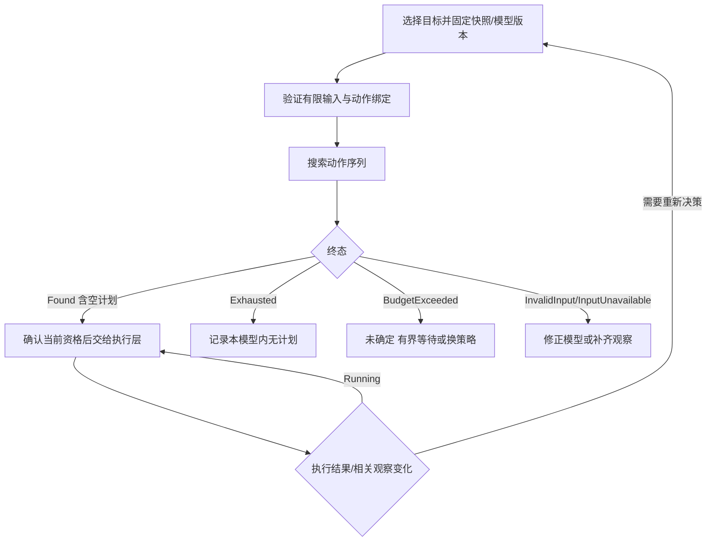
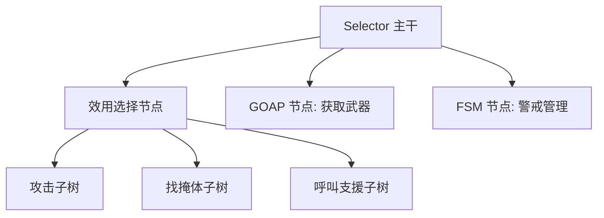
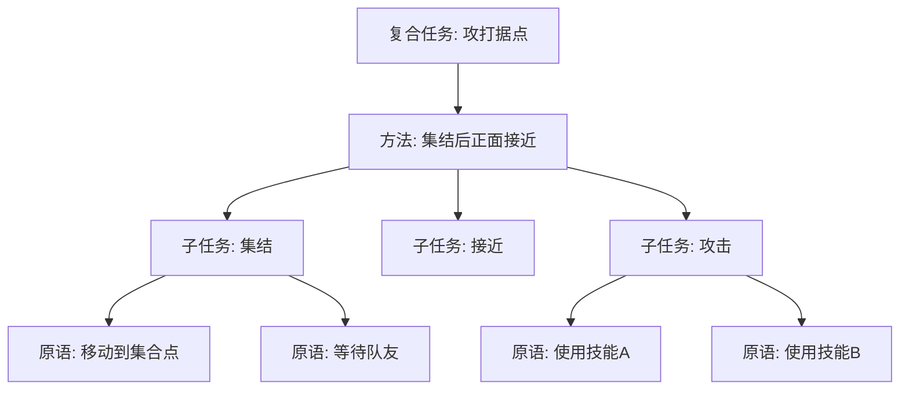

# 04 效用 AI 与 GOAP（Utility AI / GOAP / HTN）

> 知识成熟度：L2。主要承诺是具名原始资料的机制核对、选型边界与原创纸面正反例；保留 L2，不新增验证事件。
> 知识基线：Graham 2013 第 9 章、Orkin GDC 2006 论文、Erol 等 1994 UMCP 论文；2026-10-10 核对可访问的指定章节。论文年份是版本定位，网页不是不可变源码 revision。
> 适用范围：NPC 的多因素择优、有限确定性模型中的动作序列规划、设计者编写的层次任务分解，以及它们与 BT/FSM 的接口。服务端权威、未知观察、异步取消与资源归属另有显式合同。
> 证据边界：下文代码是未运行的 Python 风格伪代码，数值与轨迹为手算推导；不提供完整 AI 框架。未运行算法、引擎、编译、网络、性能或遥测检查，也未核对特定 UE checkout 或插件版本。
> 最后更新：2026-10-10，修正评分、搜索、执行与选型因果；原有概念、图示、代码教学用途、FAQ 与跨篇导航继续保留。

## 一、先分清三个问题

哨兵既可以攻击，也可以撤退、找掩体或支援队友。**Utility 解决候选之间怎样权衡**；选定“拿到武器”后，**GOAP 解决哪些动作能把当前模型状态变为目标状态**；若设计者要求“集结后接近，再按指定战术攻击”，**HTN 解决怎样按允许的方法分解任务**。具体移动、动画、攻击和停止仍由执行层完成。

行为树能复用子树、组合条件、重查优先级，也能加入评分选择器；它不要求为所有输入组合穷举分支。只有项目选择把每个权衡组合硬编码成独立分支时，维护量才会膨胀。同样，GOAP 减少手写动作之间的转换，不会免除动作模型、执行器和失败策略的设计。

### 1.1 真实案例与教学类比分开

- **《模拟人生》系列的需求选择**：Graham 的 [§9.5.4、§9.6、§9.7](https://www.gameaipro.com/GameAIPro/GameAIPro_Chapter09_An_Introduction_to_Utility_Theory.pdf)讨论饥饿曲线、需求分桶与行动惯性，可作为 Utility 的有来源实例；不能从中推断所有版本只用一个加权平均公式
- **《F.E.A.R.》**：Orkin 的 [GDC 2006 论文 pp.10–13](https://www.gamedevs.org/uploads/three-states-plan-ai-of-fear.pdf)说明失败知识参与重规划、动作成本、程序化前置检查，以及计划如何驱动执行状态机。论文 pp.13–15 还区分队伍协调与玩家感受到的战术效果，不能把所有“包抄、增援”表现都归因于单个 GOAP 搜索器
- **生产/生存类教学模型**：“采矿→冶炼→搬运”和“找药→使用药品”适合练习前置与效果建模。这里不把《异星工厂》列为已证实采用 GOAP 的作品；生产依赖图也可以由配方调度、脚本或其他系统实现

### 1.2 输入、输出与责任

| 技术 | 主要输入 | 主要输出 | 输出不保证什么 |
| --- | --- | --- | --- |
| Utility | 可尝试候选、同一时刻的输入、曲线、权重、选择策略 | 一个意图/行为候选，或无候选 | 分高不等于能执行，更不等于长期最优 |
| GOAP | 初始状态、目标条件、动作前置/效果/成本、搜索预算 | 模型内计划，或明确搜索终态 | 预测效果不等于现实已发生 |
| HTN | 初始任务网络、方法、原语及世界约束 | 满足分解与约束的原语计划 | 有任务层级不等于自动无冲突或无需搜索 |
| BT/FSM 执行层 | 当前意图/步骤、业务条件与运行资源 | Running、成功、失败或取消结果 | 控制流退出不等于外部动作已停止 |

## 二、Utility：让分数表达可比较的偏好

### 2.1 概念与计算顺序

| 概念 | 含义 | 例子与边界 |
| --- | --- | --- |
| Consideration | 一个决策因素 | 距离、血量、弹药；输入可能过期或未知 |
| Normalization | 按约定范围转换量纲 | 血量/最大血量；分母必须有效 |
| Response Curve | 把输入映射为偏好 | 低血时提高逃跑分；曲线方向由语义决定 |
| Weight | 汇总因素时的相对重要性 | 非负权重适用于本文加权平均模型 |
| Utility | 候选在当前上下文中的分数 | 本文用有限的 `[0,1]`，不是成功概率 |
| Arbiter | 执行选择策略 | 最高分、受限加权随机、优先分组 |
| Utility Selector | 把评分接入行为树的选择点 | 接口仍需约定 Running、抢占与取消 |


Graham [§9.4–9.7](https://www.gameaipro.com/GameAIPro/GameAIPro_Chapter09_An_Introduction_to_Utility_Theory.pdf)给出因素组合、曲线、选择及惯性的基础。下面采用一个更窄的**作者教学合同**：候选和因素均有限；一次评分使用不可变快照；评分无副作用；所有数值先检查有限性；硬条件失败的行为直接排除。分数模型由项目选择，不是 Utility 的唯一标准。

```text
x_i = clamp((raw_i - low_i) / (high_i - low_i), 0, 1)
s_i = curve_i(x_i)
U(B) = sum(w_i * s_i) / sum(w_i)
```

此式要求 `high_i > low_i`，输入、范围、权重、曲线输出及累计值均为有限数，`w_i >= 0` 且总权重正。零权重因素不参与计算；总权重为零、未知输入、NaN/无穷值或越界曲线输出应返回“该候选分数无效”并定位配置/数据原因，不能让它参与排序。按业务约定裁剪正常越界的原始输入，与把损坏的数据悄悄夹到 0，是两回事。

加权平均允许因素互相补偿：弹药得分为 0，其他因素高，仍可能得到高总分。因此“没有弹药不能开枪”“目标不允许攻击”必须是硬条件，不能只做低权重考虑因素。乘积汇总有不同含义：一个零因子使整体为零，因素数量也影响总分；不可在候选之间混用未经标定的求和、平均和乘积。

### 2.2 曲线要与问题一致

令 `x` 已归一化至 `[0,1]`，下表都是数学示意，不是已调好的战斗参数。

| 曲线 | 公式/形状 | 适合表达 |
| --- | --- | --- |
| 线性/反向线性 | `x` / `1-x` | 越多越值得 / 越少越紧迫 |
| 幂函数 | `x²` / `sqrt(x)` | 推迟增长 / 较早增长；输入需非负 |
| Logistic S 型 | `1/(1+exp(-k*(x-c)))`，`k>0` | 越过阈值后增加；单调，不是中段峰值 |
| 分段/阶梯 | 按区间指定并定义端点归属 | 弹药档位、策划需要精确控制的阈值 |
| 峰形 | `max(0, 1-abs(x-c)/width)`，`width>0` | 太近和太远都差，中距离最佳 |
| 高斯形 | `exp(-0.5*((x-c)/sigma)²)`，`sigma>0` | 平滑的最佳距离附近偏好 |

```text
效用 1.0 ┤         ╭──╮
       │        ╭──╯  ╰──╮
       │      ╭─╯        ╰─╮
       │   ╭──╯            ╰──╮
       │ ╭─╯                  ╰─╮
效用 0.0 ┼╯──────────────────────╰──
        距离 0        中距离          远
        峰形示意；不是单调的 S 型曲线
```

攻击评分可先验证攻击资格与武器射程，再把距离映射成峰形、血量映射成线性、弹药映射成分段分数。手算例：三个分数为 `0.8、0.4、1.0`，权重为 `0.5、0.3、0.2`，则攻击效用为 `0.72`。若逃跑分为 `0.75`，最高分策略选逃跑；若攻击硬条件已失效，即使旧分数为 `0.99` 也不得保留攻击。

### 2.3 可读的评分与选择伪代码

以下保留原文“Consideration → Action → Brain”的代码教学用途，仅展示数值检查和决策边界；辅助操作按注释定义，未运行。曲线参数也须预先验证，计算过程需稳定且有界；例如指数求值溢出应报告无效分数，不能把异常值交给排序。

```python
def score_action(action, snapshot):
    if action.eligible(snapshot) is not True:  # 纯检查；未知硬条件不算成立
        return None                        # None 表示不参与评分，不是 0 分
    numerator, denominator = 0.0, 0.0
    for c in action.considerations:        # 有限、稳定顺序
        w = c.weight
        if not finite(w) or w < 0:
            return None
        if w == 0:
            continue
        raw = c.input(snapshot)
        if not all_finite(raw, c.low, c.high) or c.high <= c.low:
            return None
        offset, span = raw - c.low, c.high - c.low
        if not all_finite(offset, span) or span <= 0:
            return None
        normalized = offset / span
        if not finite(normalized):
            return None
        x = clamp(normalized, 0.0, 1.0)
        s = c.curve(x)
        if not finite(s) or not 0.0 <= s <= 1.0:
            return None
        numerator += w * s
        denominator += w
        if not all_finite(numerator, denominator):
            return None
    if denominator <= 0:
        return None
    return numerator / denominator

def choose_max(scored, current_id, margin):
    # scored 仅含本次有效、符合当前硬条件的 (stable_id, score)
    # margin 是同一归一化尺度上的有限非负绝对差；不合法则拒绝配置
    if not scored:
        return None
    best = min(scored, key=lambda row: (-row.score, row.stable_id))
    current = find_by_id(scored, current_id)
    if current is not None and best.score <= current.score + margin:
        return current.stable_id
    return best.stable_id
```

并列时先保持仍合法的当前行为；没有当前行为则以稳定 ID 决胜。绝对迟滞的方向是**挑战者分数大于当前分数加 margin 才切换**。例如当前 `0.60`、margin `0.05`，挑战者 `0.64` 或 `0.65` 都保持，`0.66` 才切换。若采用相对比例，要另定当前分数为零时的规则，不能混用两种阈值。

最高分策略可以选择合法的 0 分候选；项目若要求“所有分数为零就休息”，应在选择前显式设置此规则。加权随机则只保留正分候选，以 `score/sum(scores)` 作为本次抽样概率；正分集合为空时返回无候选或经资格检查的兜底，不能除以零或默认取第一个。对过宽集合随机会选择明显差的行为，可先定义允许的分数窗口/分组，再在其中抽样。一次决策采样一次，随机结果不在每次推进时重抽。

冷却和迟滞分工不同：迟滞保持当前承诺；冷却限制再次选择某行为，必须说明从启动、成功还是任意退出开始计时。持续惩罚“刚启动的当前动作”可能反而促使切走。这里的日常例约定“行为自然完成后进入该行为冷却”，时间使用单调时钟；取消后是否冷却由业务另定，不在评分函数里改时间戳。

### 2.4 日常行为与调参边界

保留 `eat / chat / rest / wander` 四种日常候选：饥饿、孤独和疲劳分别经曲线转换成偏好；吃饭另需可用食物，聊天另需可交互对象，休息另需可用位置。`wander` 可设常量低分，但也要有可行的移动目的地。没有任何合法候选时进入明确的安全等待状态，不强行启动“兜底移动”。

权重表达的是同一行为内部因素的相对重要性。若 `rest` 只有一个考虑因素，公式 `(0.8*s)/0.8` 仍是 `s`，把唯一权重改成 `0.8` 不会降低它相对其他行为的分数。要调行为整体偏好，应另定义并标定候选偏置或不同响应曲线，保持各候选最终分数的可比性。

Utility 的优势是把多因素权衡数据化，代价是需要解释输入、曲线和选择政策共同形成的结果。单次择优本身不搜索未来序列，但每个输入查询可能包含寻路、目标枚举或环境评分，不能由“无搜索”推导“总是廉价”；也不能保证长期收益最优。

## 三、GOAP：在有限模型中连接动作

### 3.1 定义与模型假设

Orkin 在 [pp.4–5、10–13](https://www.gamedevs.org/uploads/three-states-plan-ai-of-fear.pdf)用前置、效果、成本和执行连接解释 GOAP。本文不将解释性转述伪装成作者原话，也不把 GOAP 定义为唯一搜索方向：可以前向应用动作，也可以从目标回归；方向、表示和启发式是实现选择。

| 概念 | 本文合同 | 易混点 |
| --- | --- | --- |
| World State | 固定 schema、有限取值、不可变且可作 key 的状态 | AI 信念快照，不是全知世界；缺失值不自动等于 false |
| Goal | 状态条件谓词；条件全集已固定 | 优先级是选目标的策略，不能当搜索成本 |
| Action | 已绑定有限参数的动作模型与执行器 ID | `move_to(?place)` 是模板，不是已绑定可执行动作 |
| Preconditions | 当前模型状态中必须成立的条件 | 空前置只表示模型无约束，不保证现实总能执行 |
| Effects | 纯函数生成的预测后继状态 | 必须包含消耗、删除或替换；不得修改真实世界 |
| Cost | 同一度量上的有限非负边代价 | 时间、危险、资源可加权，但要说明单位和偏好 |
| Plan | 从初态逐步应用动作可达目标的序列 | 现实执行资格仍须重查；非空不等于成功 |
| Replanning | 新快照/目标/模型下重新求计划 | 超时、执行失败与模型内无解是不同事实 |

本文搜索例进一步限定：一次调用不改变动作库、成本与快照；状态覆盖所有影响后继与成本的信息；`applicable/apply/cost` 有界、确定、无外部副作用。位置和库存用有限离散域表示，参数候选先收敛为有限集合；不在搜索中无界产生对象或数值。模型允许未知值时，须把 `Unknown` 当显式取值并定义其传播；本例改由适配层在缺少必需观察时返回 `InputUnavailable`，不猜测目标是否存在。

### 3.2 取武器：一条可逐步核对的动作链

作者模型初态：`Place=Gate, WeaponAtShelf=true, HasWeapon=false, RouteOpen=true`，目标为 `HasWeapon=true`。位置只取 `Gate/Shelf`；表中成本是假设单位，不是秒数。

| 动作 | 前置条件 | 预测效果 | 成本 |
| --- | --- | --- | --- |
| MoveToShelf | `Place=Gate && RouteOpen` | `Place=Shelf` | 2 |
| PickUpWeapon | `Place=Shelf && WeaponAtShelf && !HasWeapon` | `HasWeapon=true; WeaponAtShelf=false` | 1 |
| MoveToGate | `Place=Shelf && RouteOpen` | `Place=Gate` | 2 |

前向推导得到 `MoveToShelf → PickUpWeapon`，累计成本 `2+1=3`。`Place` 用枚举替换，不能只追加 `AtShelf=true` 而遗留 `AtGate=true`；拾取也必须消耗货架武器，否则模型会凭空允许第二个使用者再拾取。同一计划的预测不能代替真实库存的原子领取/占用检查。

负例：初态 `WeaponAtShelf=false`，且动作库没有补充武器的动作，在这个封闭模型中穷尽搜索可以报告无计划；若该值只是没观察到，则应先解决输入缺口。目标一开始已满足时，空计划是成功的 `Found([])`，不是等待重规划的失败。

### 3.3 有预算的前向搜索伪代码



下面保留 A* 的教学入口，默认 `h=0`，即一致代价搜索。`Queue` 按 `(f, insertion_order)` 出队，避免并列时比较状态对象；`reconstruct` 沿父指针返回动作列表。`push_checked` 在入队前检查队列容量，返回布尔值，调用者在超限时返回 `BudgetExceeded`。代码表达关键不变量，不是可直接运行的完整模块。

```python
def plan(start, goal, actions, h, pop_limit, open_limit):
    # 先验证 schema、有限绑定/状态域、非负有限成本和启发值合同
    # 输入/配置不合法返回 InvalidInput；缺观察返回 InputUnavailable
    if goal(start):
        return Found([], cost=0)             # 空计划也是已找到解
    open_set = Queue()
    best_g = {start: 0}
    parent = {}
    if not push_checked(open_set, f=h(start), g=0, state=start, limit=open_limit):
        return BudgetExceeded()
    pops = 0
    while not open_set.empty():
        if pops >= pop_limit:
            return BudgetExceeded()
        f, g, state = open_set.pop()
        pops += 1                           # 陈旧条目也消耗工作预算
        if g != best_g.get(state):
            continue
        if goal(state):                     # 在最小有效条目出队时接受
            return Found(reconstruct(parent, state), cost=g)
        for action in actions:              # 本次固定的有限稳定顺序
            if not action.applicable(state):
                continue
            nxt = action.apply(state)       # 新不可变值；不启动现实动作
            cost = action.cost(state)
            candidate_g = g + cost           # 累计成本，不是 len(plan)
            estimate = h(nxt)
            if not valid_transition(nxt, cost, candidate_g, estimate):
                return InvalidInput()       # 拒绝负成本、非有限值等
            if candidate_g < best_g.get(nxt, infinity):
                best_g[nxt] = candidate_g
                parent[nxt] = (state, action)
                if not push_checked(open_set, f=candidate_g + estimate,
                                    g=candidate_g, state=nxt, limit=open_limit):
                    return BudgetExceeded()
    return Exhausted()                      # 仅本次完整模型的可达图耗尽
```

`valid_transition` 还检查后继遵守 schema、`f=g+h` 不溢出；入队上限的失败要向上传播为终态，不能吞掉后继续声称穷尽。有限图中只有严格更小的 `g` 才更新，可避免零成本回路反复插入；找到较小代价时允许重开状态，不按“第一次见过”永久封闭。存储状态数也应有上限；省略的父表/去重表容量检查同样只能返回预算耗尽。

默认 `h=0`、有限非负边成本、严格松弛与正确最小队列是本例讨论成本的前提。若改用一般 A*，要保证启发值有限非负、目标处为零，并证明其不高估剩余成本；不一致但可采纳的启发式需要允许重开。否则 `Found` 只表示找到了模型内计划，不能顺手标成最优。用“未满足条件数”也不天然可采纳：一个成本为 1 的动作同时满足三个条件时，计数 3 已高估。启发式选择参见[图搜索算法](../../02-数学与游戏算法/路径搜索与导航/01-图论基础与搜索算法.md)。

累计成本反例：一条两步链成本 `8+1=9`，另一条三步链成本 `1+1+1=3`。按步数偏爱短链就会选错；原始前缀成本必须随状态一起传播。不同目标的效用与同一目标下的路径成本也不能混作一个量。

搜索预算限制的是允许做多少工作，不证明硬实时耗时。即使动作/状态有限，单次 `applicable` 的外部查询仍可能昂贵，因此本模型把它限定为纯、有界检查；导航等慢查询由适配层管理。`BudgetExceeded` 表示尚未判定，`Exhausted` 表示本次有限模型内无计划，`Found` 表示可逐步验证的模型解；三者不能统一为 `None` 后宣布“目标不可达”。预算中断时不把未到目标的前缀当完成计划。

### 3.4 模型可行与现实可执行

计划找到后至少要核对三层条件：

1. **模型链成立**：每步前置在预测状态成立，效果产生下一预测状态，最终满足目标
2. **现在可以启动这一步**：目标对象/身份仍有效，权限、路径、资源与当前前置满足；需要共享资源时由执行器完成实际预约或原子取得
3. **现实结果得到确认**：请求被接受只是启动；完成回执与最新观察确认效果，下一步才可依赖它

例如规划期间 `RouteOpen=true`，提交移动前门被关上，模型曾经可行并不意味着当前仍可执行。若移动失败，更新路线失败知识后再规划；不更新输入而立即重复同一计划只会形成失败循环。若搜索过程内采用程序化前置查询，也必须清楚其快照和成本边界，不能将“曾查到可走”升级为资源预留。

对攻击、制作等可能失败或结果随机的动作，本文有限确定性模型只是预测。不能在发送攻击后直接写 `TargetDead=true`，或在制作启动后提前加库存。需要未知结果分支、概率优化或部分可观测信念规划时，应显式扩展问题模型；单条确定性 GOAP 计划加重规划不自动获得这些保证。

## 四、把选择、计划与动作生命周期接起来

### 4.1 三种版本与更新点

以下是本文提出的单宿主串行调度合同，用来说明竞态边界；不是任何引擎 API 的默认保证。

| 数据 | 何时更新 | 作用 |
| --- | --- | --- |
| 观察快照及 `observation_revision` | 接收已验证的新观察，在决策边界发布 | 评分/搜索读取一致版本；未知、过期与 false 分开 |
| `goal_id / goal_revision / model_revision` | 意图、参数、动作库或评分/模型配置改变 | 判断返回的候选计划是否属于当前请求 |
| `plan_generation / action_token` | 接纳新计划或启动一次动作 | 隔离旧动作回执；不得以相同动作名字代替一次激活身份 |

搜索结果带上请求时的目标、模型和观察版本。迟到结果若已不属于当前目标/模型就丢弃；观察变了则按明确策略重验全部依赖或重搜，不能直接装入。执行中的每步还要重查最新资格。自身动作成功本来就会改变观察，不能把任何 revision 增加一律视为计划错误；先按动作结果与预期效果核对，再判断后续依赖是否仍成立。

观察更新不直接重入正在执行的选择器；先排队，在下一调度边界处理。真实多线程宿主还需要自己的同步与对象寿命合同，本文未实现。

### 4.2 启动一次，推进多次，终止后清理

本节限定单宿主串行消费结果，每次外部调用须在有限时间内返回；同步回调可以发生在 `start` 调用栈内，但只收件，**不内联消费结果、推进计划或启动下一步**。若底层会无界阻塞或在其他线程直接修改本状态，本合同不适用，不能据此声称调度/取消时限已保证。

外调前先登记稳定的 `operation/token`、结果接收关联及资源责任记录，并保留该操作所需的冲突资源交接权；这只表示归属与清理责任，尚未返回的句柄不能记作已经取得。`start` 同步返回的结果、同步回调和异步回执都进入同一个串行收件通道，按 operation 和事件身份去重；同一权威终态只能接纳一次。调用返回时把迟到的句柄仍挂回原 operation，记录 `start_returned`，再将返回结果入队，不能直接写回 Running。同步成功或失败可直接成为终态，不要求先经 Running。收件时终态优先于“已接受/仍在运行”通知；已接纳终态不被后者或重复回执覆盖。互相矛盾的权威终态属于适配器错误，保留清理责任且不重复推进。

| 阶段/结果 | 调度器应做什么 | 不允许的捷径 |
| --- | --- | --- |
| Starting | 重查前置，先登记 operation/token、收件关联与资源责任，再调用一次 `start`；未返回时保留记录 | 回调先到而没有归属，或假定句柄已存在 |
| StartRejected | 接纳拒绝结果并记录原因；待 start 返回，清理其实际取得/迟返的资源 | 将拒绝当作“绝无残留资源”而直接交接 |
| Running | 仅在未接纳终态时进入；保留同一激活，匹配回执或 `poll` 结果也经收件通道 | 每帧重发请求，或返回后覆盖同步完成 |
| AwaitingConfirmation | 底层报告完成但必需效果尚未确认时，等待权威结果/新观察，按限定期限转入明确失败或重新观察 | 把未知效果当 true，或把重复完成通知再推进一次 |
| Succeeded | 接纳成功结果；效果确认、start 已返回且资源已静默后，才结束记录并推进步骤一次 | 以成功回执代替效果/资源确认；同步成功被迫再经 Running |
| Failed | 保存失败和实际变化，终止剩余计划；start 已返回且资源已静默后才撤销记录 | 丢弃失败知识，或失败后遗失迟返句柄 |
| Cancelling | 先记取消意图；可安全撤销时发一次 cancel，未到手句柄保留为原 operation 的待清理责任 | 清空队列、删除记录或提前启动冲突动作 |
| Cancelled | start 已返回且旧资源实际静默后释放归属，允许新计划启动 | 把取消请求/取消回执本身等同资源静默 |

结果、效果确认和资源静默是分开的条件；表中接纳终态不等于 operation 已可删除。伪代码只展示该合同，不是完整 GOAPAgent：

```text
on_decision_boundary:
    在外调栈退出后串行消费观察与动作收件，按 operation 去重并接纳结果
    检查目标与计划依赖；应撤销时先进入 Cancelling，再按原 operation 清理
    若 start 尚未返回：保留记录，等待外调返回，不重入该外调
    否则若仍 Running/AwaitingConfirmation：只推进或确认原 operation
    否则若需清理或资源未静默：推进原 operation 的清理，继续保留记录
    否则若终态且可退役：解除关联，仅当前计划内未撤销 activation 的成功推进一步
    只有没有未退役 operation 时，才处理后续选择：
        有下一步：先登记 operation/token/收件关联/资源责任，再 start 一次
            返回时将句柄归原 operation、记已返回、返回结果入队；本栈不消费
        否则若目标已满足：报告完成，等待相关变化
        否则按退避/事件策略请求一次有预算规划
```

自然成功、拒绝、失败和取消都要由原 operation 幂等清理实际取得的资源，停止其工作/订阅/计时器；须保留接收完成与清理确认的关联，直到 start 已返回、资源确认静默才可解除并退役。句柄迟返时按原操作当前阶段继续清理，不能移交给新 activation。旧 token 的重复结果不能推动新计划；单纯忽略它也不会停止旧导航或动画。取消超时仍保留记录并阻塞冲突资源，按项目恢复流程处理，不能凭超时宣称静默。失败已造成的现实变化保留为新观察，不用预测状态覆盖或回滚。

纸面同步轨迹：先登记 A → `start(A)` 栈内完成回调入队 → start 返回句柄 H 与“已接受”通知，H 仍归 A → 下一边界接纳 A 的成功，重复成功与“已接受”都不能再推进或改成 Running → 效果确认后清理 H，确认静默才退役 A 并启动下一步 B。A 的任何迟到结果均不能推进 B；若 start 尚未返回，即使已收成功通知也不能提前退役 A。

纸面延迟成功轨迹：规划 `MoveToShelf, PickUpWeapon` → 登记并启动 A → 两次 Running 均不重发 → A 成功且观察确认在货架 → A 已返回并释放移动资源、确认静默 → 才启动拾取 B → B 同样完成确认/清理后目标满足。干扰轨迹：A Running 时切换“逃跑” → 记录取消、等待实际停止 → 新动作 C 才接管移动资源；A 的迟到成功不能让 C 跳步。货架武器被别人拿走时，拾取前检查或原子领取失败，记录 `WeaponAtShelf=false` 后再决策。

### 4.3 Utility、GOAP 与行为树的组合



此图保留“把不同决策组件嵌入主干”的用途；Root 仍需要定义优先级、Running 与抢占规则，图上的连线不代表所有分支同时执行。另一种分层方式是 Utility 选目标、GOAP/HTN 提供计划、BT/FSM 执行步骤；若每一层都能独立抢占，必须指定唯一意图仲裁者和资源所有者，否则新目标、旧计划与旧移动会互相争用。

详细控制流与同步/异步取消边界见[行为树通用原理](03-行为树通用原理.md)、[状态机与层次状态机](02-状态机与层次状态机.md)及[StateTree 状态树](05-StateTree状态树.md)。这些运行时与 GOAP 的状态搜索不是同一层，不能把 StateTree 的 Task、HTN 的 task 和 GOAP 的 action 仅因名字相似就当成同一对象。

## 五、HTN：分解方法是规划知识

[Erol、Hendler、Nau 的 UMCP 论文 pp.1–3](https://www.cs.umd.edu/~nau/papers/erol1994umcp.pdf)区分 primitive、compound、goal task，定义任务网络与方法。这里采用便于游戏教学的复合/原语视图；不声称覆盖论文所有形式化规则，也不把所有 HTN 规划器写成同一种前向递归算法。

| 概念 | 含义 | 战术教学例 |
| --- | --- | --- |
| Compound Task | 需要由方法展开的任务 | `AttackOutpost(site)` |
| Primitive Task | 交由动作操作符实现的原语 | `Move(rally)`、`UseSkillA(target)` |
| Method | 对某类任务的一种合法分解及适用约束 | 集结路线可用时，分解为集结→接近→攻击 |
| Task Network | 任务实例及顺序、绑定等约束 | 等待队友须在集合后，攻击须在接近后 |



图展示分解关系；顺序另约定为 `S1 < S2 < S3`、`T1 < T2`、`T3 < T4`，接近任务再分解为移动原语。不能从几条父子连线推断这些节点并行。另一方法可在侧路可用时分解为“绕行→攻击”。方法本身不移动角色；原语执行成功与资源清理由执行层负责。

纸面推导：目标任务为攻打据点，正面集结路线关闭、侧路可用，则正面方法不适用，选择侧路方法并继续展开原语；若两种方法都不适用，结果是当前方法库无法给出计划，不代表现实中绝无其他办法。若选中的方法展开后发现共享资源冲突，规划器可能需回溯、换方法或失败，不是“方法条件通过就必定可执行”。

HTN 限制哪些行动组合属于允许的过程，因此能表达设计者的战术规范；GOAP 的目标条件主要描述想得到的状态，只有当前动作模型允许的状态路径才可选。二者都要考虑世界状态和搜索，不能把区别说成“HTN 不搜索状态、必然比 GOAP 快”。方法递归、分支与任务交互仍可使搜索昂贵，需定义深度/工作预算与终态；偏序允许多种顺序，也不自动授权实际并发占用同一资源。SHOP2 是进一步阅读的规划器名称，本文未读其具体实现，不据此声称某一游戏运行时的性质。

## 六、选型与工程实践

### 6.1 按要解决的问题选，而不按“聪明程度”排名

| 需求 | 可考虑的起点 | 主要代价与验证点 |
| --- | --- | --- |
| 已知条件下的流程与优先级 | BT | 节点结果传播、重查时机、资源退出 |
| 明确阶段/模式切换 | FSM/HSM | 转换条件、层级共享和退出路径 |
| 多个合理选择的连续权衡 | Utility | 输入一致性、曲线标定、并列与迟滞 |
| 达到状态目标有多种可组合路径 | GOAP | 状态/动作建模、有限搜索、执行再确认 |
| 过程需遵守设计者指定战术分解 | HTN | 方法覆盖、约束交互、递归和回溯预算 |
| 战斗阶段中少量动态规划 | FSM + GOAP，或 BT + Utility | 分清仲裁与执行职责，先证明组合收益 |

不能仅按架构名断言可预测性、性能、抗干扰能力或策划参与度高低。BT 可以对变化作出反应；Utility 可以稳定且可解释；确定的输入、顺序和成本可使 GOAP 得到可复现计划；HTN 也可能有大量解。编辑器和调试工具影响使用门槛，不是算法固有的“只能程序员参与”。

### 6.2 保持小而完整的运行合同

1. 先写行为硬条件与状态 schema，再设计评分和成本；库存消耗、位置互斥、对象身份及未知值必须有语义
2. 只筛掉经分析不影响目标、前置、效果、成本和执行资格的数据；单看目标字段就删键会漏掉“钥匙开门后才能取武器”之类依赖
3. 候选参数枚举、评分查询、搜索与执行分别设预算/失败策略；移除“少于 10 个键、30 个动作就保证毫秒级”的无证据承诺
4. 事件或时间驱动都可以，频率按更新需求和实测确定；“Utility 10–20Hz、GOAP 每秒一次”不是通用合同。紧急取消不能被普通重规划冷却阻塞
5. 因失败而重试前，说明新信息、可替代路径或退避到期；同一失败原因无变化时进入等待/换目标，避免每帧重搜
6. 给调试视图保留候选资格原因、原始输入、各因素分数、选中理由、目标/模型/观察版本、计划成本、终态与当前 action token；本文仅说明这些信息的排查用途，没有采集或开启遥测
7. 先在少量具代表性的 NPC 行为上检查成功、输入未知、无候选、预算耗尽、执行失败、取消和迟到事件，再决定扩展；这些是后续项目验证建议，不是本次测试结果

### 6.3 服务端与多人边界

Utility/GOAP 可以放在服务端，但部署依据是权威需求和实际成本。服务端权威通常由服务器决定状态变化，客户端接收需要表现的结果；不要求每个客户端用相同种子重跑所有决策。若项目确实采用确定性同步/回放，除种子外，还需固定候选顺序、浮点/取整规则、随机调用次数、观察时点、版本以及预算调度。墙钟预算和异步到达顺序可改变搜索终点，种子本身不足以保证一致。同步哪些状态取决于项目协议，不由“只同步当前行为+关键输入”一句话解决。

## 七、常见问题 FAQ

### Q1：Utility 和行为树怎么分工？

评分决定候选排序，BT 管条件、流程和动作推进；先约定何时重评、何时允许抢占，以及旧子树停止后资源何时可接管。纯粹加一个“最高分节点”不会自动解决 Running 与取消。

### Q2：GOAP 怎样控制状态爆炸？

收敛状态域和动作参数，保留正确的依赖闭包，去重并用累计成本剪枝；给工作量与存储设上限。达到上限是未确定，不是无解。是否能满足帧预算必须在真实实现、查询成本和负载下另测。

### Q3：规划结果多样，怎样验证？

先检查计划不变量：每步前置成立、效果/消耗正确、累计成本一致、终态满足目标。只有并列政策和最优性前提都固定时才断言唯一序列；有多条合法计划时不应把其他正确解误报失败。运行集成还需验证启动一次、实际效果、取消静默和旧回执隔离。本次只有静态核对与纸面推导，没有执行这些测试。

### Q4：Utility 怎么调参？

固定输入含义和正常范围，从少量曲线模板与可解释场景开始；先核硬条件，再看分数分解与切换原因。单因子的归一化权重会抵消；常量偏置和响应曲线才会改变该候选输出。需要随机多样性时，先界定哪些候选允许被随机选中。

### Q5：HTN 和 GOAP 选哪个？

关键看知识表达：主要关心达到某种状态，考虑 GOAP；需要由方法约束“必须怎么做”，考虑 HTN。两者都能借 Utility 排目标/方法，都需要终态、预算和执行层；没有通用速度或可控性排序。

### Q6：在 UE 中怎么集成？

可通过项目组件、自定义行为树节点或经评估的插件接入，但必须按目标 UE/插件版本检查输入绑定、运行实例、异步请求与退出合同。本文未做当前 UE 功能清单审计，不沿用“UE 没有任何内置 Utility/GOAP 框架”的跨版本断言。EQS 的环境候选评分也不自动等于完整的意图选择器。具体入口见[行为树详解](01-行为树详解.md)、[感知系统与 EQS](02-感知系统与EQS.md)和[游戏 AI 路线](../../../00_Index/学习路线/游戏AI.md)。

### Q7：适合服务端吗？

可用于权威 NPC 决策；先计算候选查询与规划的实际成本，控制工作预算，再决定更新频率和复制内容。随机种子只是确定性条件之一，见 §6.3。

### Q8：为什么总在两个行为之间跳？

检查同一快照、输入噪声、评分交叉、每帧重抽随机和冷却起算点。保持合法当前行为，只有挑战者超过阈值才切换；行为已不合法时必须退出，迟滞不能掩盖失效。减少决策频率或平滑输入也会增加反应延迟，应保留紧急路径。

## 八、来源定位与关联阅读

| 来源 | 本次实际核对范围 | 不据此声称 |
| --- | --- | --- |
| [Graham，Game AI Pro，第 9 章，2013](https://www.gameaipro.com/GameAIPro/GameAIPro_Chapter09_An_Introduction_to_Utility_Theory.pdf) | §9.4 因素；§9.5 曲线；§9.6 选择/分桶；§9.7 惯性；PDF pp.3–10 | 本文伪代码来自该书源码、本文阈值是标准参数、最新《模拟人生》实现已核对 |
| [Orkin，GDC 2006](https://www.gamedevs.org/uploads/three-states-plan-ai-of-fear.pdf) | 公开镜像中的作者论文：pp.4–5 前置/效果；pp.10–13 成本、表示、程序化检查与执行；pp.13–15 队伍/表现边界 | 官方镜像认证、现成通用框架、任何给定动作数下的性能保证 |
| [Erol/Hendler/Nau，UMCP，1994](https://www.cs.umd.edu/~nau/papers/erol1994umcp.pdf) | 作者所在院系托管 PDF pp.1–3 的 task、network、method 与约束定义 | 全文证明已复核、SHOP2 实现已读、本文 HTN 例已运行 |

作者原站的 Orkin 历史入口本次未能读取；现引用明确标识的作者论文镜像，不能写成成功访问原站。三篇资料支持各自机制，本文的数值防护、版本/token、预算终态与取消合同是有边界的工程推导，不是引用论文所实现的统一标准。

- [01-AI总体架构与感知](01-AI总体架构与感知.md)：感知与黑板提供输入；更新、过期和未知语义要先确定
- [02-状态机与层次状态机](02-状态机与层次状态机.md)：阶段、转换和混合模式
- [03-行为树通用原理](03-行为树通用原理.md)：条件、Running、抢占与资源退出
- [游戏 AI 学习路线](../../../00_Index/学习路线/游戏AI.md)：原 UE AI 总导航的现行入口
- [01-行为树详解](01-行为树详解.md)：UE 的实现边界
- [02-感知系统与EQS](02-感知系统与EQS.md)：环境质量评分与候选提供
- [12-行为树与AI源码](12-行为树与AI源码.md)：引擎专题；其版本与证据须按该页独立阅读
- [Unreal Engine 官方文档总页](https://dev.epicgames.com/documentation/en-us/unreal-engine)：保留版本导航用途，不作为本文通用算法的直接证据

> 本文不承诺“最聪明”的组合。选择、模型规划与现实执行各自具备可说明的输入、状态变化和失败出口，才便于实现、排查和扩展。
