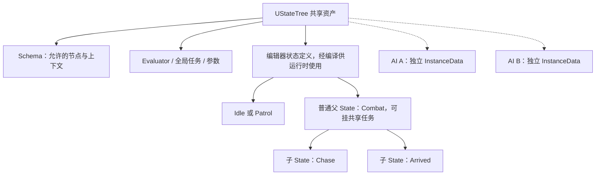
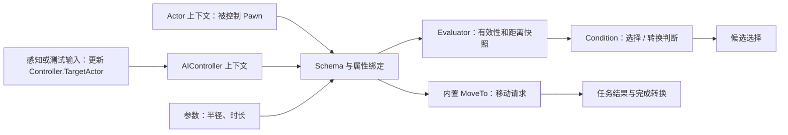
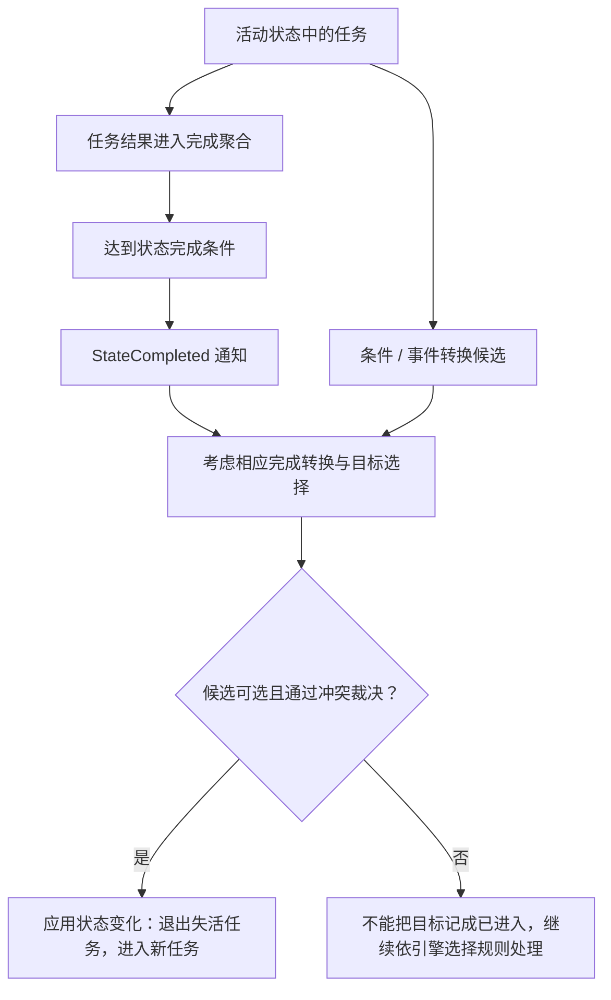
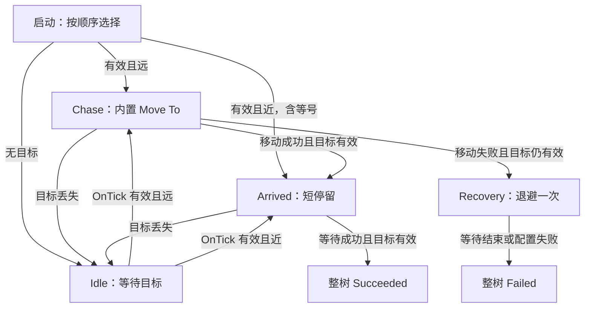
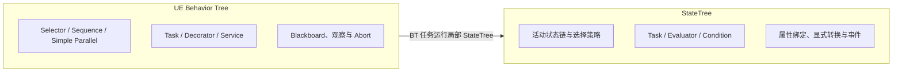

# 05 StateTree 状态树（State Tree）

> 知识成熟度：L2。主要结论来自 Epic 公开文档/API 的静态核对；代码是原创教学候选，轨迹是纸面推导，不是引擎日志。
> 版本基准：2026-10-05 访问的当前公开页面，页面标题为 UE 5.8；个别回调的签名来源另标为 UE 5.5。没有访问可认证的本机 UE checkout，原文的“UE 5.8.0 / CL 55116800 / 全部源码已验证”不能继续作为证据。
> 适用范围：组件驱动的 Actor/Pawn AI 与 StateTree 通用执行模型。Mass 仅说明集成边界；不推断 UE4、早期 UE5 或特定项目完全兼容。
> 未验证项：UHT、UE 编译/链接、PIE、StateTree Debugger、实际移动取消/销毁重入和性能均未运行。最后更新：2026-10-05，实质修订执行、数据及失败路径。

## 1. 为什么需要 StateTree

考虑一个守卫：没有目标时巡逻；有远处目标时追击；抵达后停留；寻路失败时退避；目标丢失时取消追击。只写一个枚举和若干回调很快会遇到三个问题：谁更新目标，哪个状态拥有移动请求，退出后旧回调还能不能改变新状态？StateTree 把这些责任组织为**层级状态、显式转换、节点及数据绑定**。

它把状态机的状态/转换与树式选择组合起来。树形结构解决“共享一段行为和转移”的组织问题，转换解决“何时重新选择”，Task 负责动作，Condition 负责判断，Evaluator 提供可绑定数据。资产编辑器能帮助检查连接，但不会替项目决定失败策略、对象寿命或线程权限。

[官方总览的 Selection Flow 与 Data Flow](https://dev.epicgames.com/documentation/en-us/unreal-engine/overview-of-state-tree-in-unreal-engine)是概念入口。其中“第一个任务完成触发转换”的简述，须结合第 3 节当前完成聚合配置理解；不能用它覆盖所有版本与 All/Any 配置。

### 1.1 先分开资产、编辑器定义和运行实例

| 层 | 类型 / 职责 | 不能混同的东西 |
| --- | --- | --- |
| 共享资产 | `UStateTree`，保存可执行配置和绑定等编译结果 | 不是每个 AI 的可变进度 |
| 编辑器状态 | `UStateTreeState`，状态类型、子状态、条件、任务、转换、参数 | 来自 `StateTreeEditorModule`，不是运行时逐个持有的 UObject 状态图 |
| 运行实例 | `FStateTreeInstanceData`，保存本实例的执行状态和节点数据 | A、B 两个 AI 必须使用各自的实例存储 |
| 一次驱动视图 | `FStateTreeExecutionContext`，对实例执行 Start/Tick/Stop 等操作 | 是临时对象，不跨帧缓存 |
| 外部世界 | AIController、Pawn、目标、Subsystem 等 | 存储独立不等于这些外部对象也独立或永远有效 |



模块定位按公开 API 页的 Header / Include 栏核对：`StateTreeModule` 提供原生节点与执行上下文；`StateTreeEditorModule` 提供编辑器定义；`GameplayStateTreeModule` 提供组件、AI Schema 和 MoveTo 等任务。本文不将这些路径说成已在本机源码树逐文件查验。

### 1.2 选择的是一条活动状态链

固定采用“按子状态顺序尝试”的策略时，选择会检查候选 Enter Conditions，并继续寻找可进入的子状态。选中叶子后，从根到叶的相关状态一起活动。普通父 State 可以挂共享任务，不能只让叶状态有任务；`Group` 的组织用途与这种带任务的普通父状态应分开。

例如 `Root → Combat → Chase`：Combat 的朝向任务可以与 Chase 的移动任务同时活动。“同时”描述逻辑活动关系，不保证在不同线程上运行，更不允许任意工作线程读写 UObject。

- Enter Conditions 决定**这次选择是否可以进入**，不是永久监视器。进入后目标变远，不会单凭该进入条件变假就自动退出
- Transition Conditions 决定**本次触发是否允许尝试转换**。条件表达式可能有组合；本文只使用单条件或明确的 AND，不把任意列表都解释为无条件全 AND
- 转换指向一个状态，不等于已经成功选中它。如果它要求选子状态而所有子状态都不可选，候选选择会失败
- 当前 API 有顺序、随机、Utility 等选择策略；本文不依赖默认选项、随机平局规则或某个未经核对的效用公式

具体字段见 [UStateTreeState](https://dev.epicgames.com/documentation/en-us/unreal-engine/API/Plugins/StateTreeEditorModule/UStateTreeState)。转换的目标与实际选中结果是不同概念，见 [FStateTreeTransitionResult](https://dev.epicgames.com/documentation/en-us/unreal-engine/API/Plugins/StateTreeModule/FStateTreeTransitionResult)。

## 2. 数据放在哪里，能活多久

### 2.1 持久存储和临时 Context

[ExecutionContext 的官方说明](https://dev.epicgames.com/documentation/en-us/unreal-engine/API/Plugins/StateTreeModule/FStateTreeExecutionContext)明确要求它是短期辅助对象；Owner 的寿命至少覆盖所用 InstanceData。Owner 是 UObject 语义，用于实例化对象的归属和日志，不隐含 AActor，更不隐含被控制的 Pawn。

下面是寿命伪代码，不是省略 Schema 初始化后仍可直接复制的 C++ 实现：

```text
宿主 A 持有：共享 StateTree 资产引用 + A 的持久 InstanceData
宿主 B 持有：同一资产引用 + B 的持久 InstanceData

启动 A：
    构造临时 Context(A 的 Owner, 资产, A 的 InstanceData)
    提供 Schema Context Data 和节点所需 External Data，验证有效
    Start；保存宿主需要的运行结果；函数结束即丢弃 Context
下一次推进 A：
    用同一份 A 的 InstanceData 构造新的临时 Context
    重新满足并验证数据要求，再 Tick
停止 A：
    在 Owner/实例存储仍可用时构造临时 Context，Stop
    撤销宿主自己的订阅/请求，之后才释放对应持久存储
任何异步回调：不得捕获上述 Context 引用或借用的数据视图
```

每帧同时重建 InstanceData 会丢掉进度；每帧保存 Context 又会把短期视图当持久状态。二者都错。节点数据是否跨退出保留，取决于具体存储种类和执行寿命，也不能从“实例容器是持久的”推导出每个节点的所有数据一直存在。

在普通组件集成中优先让官方组件负责驱动；只有自己实现宿主才需要直接组装 Context。Schema 声明的 Context Data 与节点请求的 External Data 是不同入口：前者要按 Schema 设置，后者由收集机制提供；不能笼统说“全由构造回调自动注入”。

### 2.2 绑定的是数据来源，不是全能安全保证

| 数据 | 来源与责任 | 本例用法 |
| --- | --- | --- |
| Schema Context | 宿主提供符合 Schema 的对象 | AIController；Actor context 对应被控制 Pawn |
| 外部业务输入 | 项目自己的感知/Controller 更新 | `TargetActor`；丢失、失效或退出玩法时清空 |
| Evaluator Output | 由输入计算的快照 | `bHasTarget`、`Distance`，无目标时显式无效 |
| 参数 | 资产/状态/引用中的配置 | 距离阈值、等待时长、是否允许部分路径 |
| Task InstanceData | 该实例本次动作的进度/资源 | 剩余时间；内置 MoveTo 的任务对象 |



绑定源有可见性限制：进入条件可以读公共数据和父状态任务的可用数据；当前状态尚未进入，不能要求它未启动的任务先产生自己的进入条件输入。任务能读前面的可用任务输出，也不等于能随意反向依赖之后的任务。相关范围见总览 Data Flow。

A、B 的 InstanceData 分开，但若二者绑定到同一个可变目标管理对象、静态成员或共享容器，仍可能耦合。反射属性、强引用、弱引用和玩法有效性各有不同职责：`TObjectPtr` 非空不能证明 Actor 仍参与当前玩法，`TWeakObjectPtr` 不保活，解析成功也不授权跨线程使用。保持与 [UObject 与反射](../../03-引擎架构与资源系统/对象模型与生命周期/01-UObject与反射系统.md)及 [Actor/Component 生命周期](../../03-引擎架构与资源系统/对象模型与生命周期/02-Actor与Component生命周期.md)的边界一致。

## 3. Task 完成、State 完成、转换和退出是四件事

### 3.1 原生节点与 Blueprint 节点分层

原生基类为 `FStateTreeTaskBase`、`FStateTreeEvaluatorBase`、`FStateTreeConditionBase`，是 USTRUCT 路线；用于一般 Schema 的 CommonBase 仍属于这套 F 结构体继承体系。Blueprint 扩展对应 `UStateTreeTaskBlueprintBase`、`UStateTreeEvaluatorBlueprintBase`、`UStateTreeConditionBlueprintBase`，是 UObject 路线。不能写 `UCLASS : UStateTreeTaskBase` 再拼原生回调。

| 原生入口 | 返回 / 责任 |
| --- | --- |
| Task `EnterState(Context, Transition) const` | `EStateTreeRunStatus`：本任务开始后的结果 |
| Task `Tick(Context, DeltaTime) const` | `EStateTreeRunStatus`，由 Tick 开关和宿主调度决定是否调用；不是 `void` |
| Task `ExitState(Context, Transition) const` | `void`，退出该动作时释放自己拥有的资源 |
| Task `StateCompleted(Context, Status, ActiveStates) const` | `void`，完成后、新选择前的通知；不是通用析构入口 |
| Evaluator `TreeStart / Tick / TreeStop` | 更新或撤销树级数据来源，不以 Task 状态返回完成 |
| Condition `TestCondition(Context) const` | `bool`，本次条件结果；它自己不发起移动 |

[原生 Task API](https://dev.epicgames.com/documentation/en-us/unreal-engine/API/Plugins/StateTreeModule/FStateTreeTaskBase)列出 Tick、绑定复制、重选与完成参与开关。Blueprint 任务则遵循其 [FinishTask/事件 API](https://dev.epicgames.com/documentation/en-us/unreal-engine/API/Plugins/StateTreeModule/UStateTreeTaskBlueprintBase)，不要将旧带返回值的 Blueprint 事件与原生 Tick 混用。

### 3.2 显式配置谁负责状态完成

当前公开编辑器 API 有 `UStateTreeState.TasksCompletion`，枚举 [EStateTreeTaskCompletionType](https://dev.epicgames.com/documentation/en-us/unreal-engine/API/Plugins/StateTreeModule/EStateTreeTaskCompletionType)包含 `All` / `Any`。Task 有 `bConsideredForCompletion`。因此“Task 返回 Succeeded”到“State 完成”之间有参与集合与聚合规则，再由完成转换决定去哪；不是返回成功就直接结束整棵树。

以下只推导非混合失败的清楚分支，不假定默认值：

| 配置与输入 | 可以推导的结果 |
| --- | --- |
| All；移动与监视都参与；移动 Succeeded，监视一直 Running | 不能靠“所有参与者完成”产生正常完成；若唯一出口是 OnStateCompleted，业务会卡住 |
| All；仅移动参与，监视不参与且始终 Running；移动 Succeeded | 正常完成由移动负责；随后转移退出时，监视仍需清理 |
| Any；移动与有限等待都参与；等待先 Succeeded，移动 Running | 已有参与者完成，可以触发完成转换；若因此退出，移动必须被取消 |
| 上述任一配置；运行期间合法条件/事件转换选中别的状态 | 可以在自然完成之前退出，不必等待每个 Task 返回终态 |

本例每个叶状态只放**一个负责完成的 Task**，显式设 All 且该 Task 参与完成。可选监视任务只能在另行验证后加入。未核对实现细节的分支包括：默认 All/Any、参与集合为空、混合 Succeeded/Failed 的优先级、非参与任务返回 Failed 的影响；本文不靠字段名称推断这些行为。

### 3.3 完成通知不能替代退出清理



这是因果关系图，不是未经源码核对的逐函数调用顺序。优先级、可选性及选择策略都参与结果，不能将“从叶到根检查”简化为不论 Priority 都是叶子胜出，也不能先画“无条件退出旧状态”再假装失败候选已经提交。

[StateCompleted 专页](https://dev.epicgames.com/documentation/en-us/unreal-engine/API/Plugins/StateTreeModule/FStateTreeTaskBase/StateCompleted)说明完成通知采用逆序，且条件转换改变状态时不调用它。因此：

- 完成通知用于需要的完成处理；本次移动请求、委托、Timer 等由拥有者在实际退出/停止协议中撤销
- 清理需幂等：正常完成后再 Exit，或停止时再次清理，都不能重复提交完成、重发请求或影响别人的动作
- 清理只针对自己创建的资源。不要为了取消本任务随意调用会中断同 Controller 其他动作的全局停止操作
- 宿主的 EndPlay/停止入口要在可用阶段停止树，并撤销宿主建立的感知/事件订阅；不能依赖所有外部资源都由 StateTree 自动发现

### 3.4 持续父状态、重选和迟到回调

[EStateTreeStateChangeType](https://dev.epicgames.com/documentation/en-us/unreal-engine/API/Plugins/StateTreeModule/EStateTreeStateChangeType)区分 Changed（激活/失活）与 Sustained（保持活动关系）。`bShouldStateChangeOnReselect` 决定原已活动任务是否也接收 Enter/Exit；转换的重激活设置又会影响状态变化。故 `Combat/Chase → Combat/Arrived` 不意味着整个 Combat 或 InstanceData 都重建。

第 5 节等待任务选择“保持中的状态不重新计时”：关闭重选回调开关，并在收到 Sustained 时保留进度。主例无自转换；如业务需要强制重启，必须另选明确重激活策略并成对撤销旧动作、初始化新动作，不能只把开关打开就沿用旧清理分支。

自定义异步动作还需分开三件事：Owner/存储仍有效、本次状态仍活动、回调属于当前请求。旧请求 g1 退出，新请求 g2 开始后，g1 的迟到成功不能完成 g2。[FStateTreeWeakExecutionContext](https://dev.epicgames.com/documentation/en-us/unreal-engine/API/Plugins/StateTreeModule/FStateTreeWeakExecutionContext)提供可保存的弱上下文，其有效性涉及状态身份、Owner、Tree 和 Storage；它不是普通 Context 的长寿命许可，也不自动提供线程安全。项目仍须处理请求身份、订阅撤销、取消确认及调用线程。

## 4. 把真实移动接进完整行为片段

### 4.1 宿主、输入和起始前提

使用 `UStateTreeAIComponent` 与 `UStateTreeAIComponentSchema`。这里把组件装在项目 AIController 上，由它控制具备导航移动能力的 Pawn；Schema 的 Actor context 用作 SelfActor。[AI Schema 文档](https://dev.epicgames.com/documentation/en-us/unreal-engine/API/Plugins/GameplayStateTreeModule/UStateTreeAIComponentSchema)明确给出 AIController 与被控制 Pawn 的上下文关系，不能改用 `Context.GetOwner()` 猜测 Pawn。

准备步骤：

1. 启用 StateTree / GameplayStateTree 插件，创建资产，明确选 AI Component Schema。项目 Controller 蓝图增加可反射的 Actor 引用 `TargetActor`，Schema 的 Controller Class 设为该项目类型，使该属性可绑定
2. 在开始树前确认 Controller 已 Possess 正确 Pawn，Pawn 的移动组件与 NavMesh 配置匹配。无 Pawn 或 Context 不匹配属于启动/集成错误，应停止并修正，不伪装成“没目标”后继续移动
3. 测试先用受控输入设置/清空 TargetActor；接感知系统后仍保留同一合同：目标丢失、死亡或退出玩法时清空，目标保持同一个 Actor 而位置改变时不要依赖“引用值改变”通知距离变化
4. 绑定 Evaluator 的 SelfActor ← Schema Actor；Target ← Controller.TargetActor。初次 TreeStart 即计算快照，后续每次树推进刷新；输入失效时明确输出无目标。本文用持续推进下的 OnTick 转换，未配置按需休眠
5. 编译资产，检查节点是否被 Schema 接受、每条绑定是否可见且类型匹配，再启动树。节点未显示时先查 CommonBase/Schema，而不是删除类型约束

这是具体装配合同与待运行步骤，不是已建立的工程。输入生产者是外部前置条件，示例不假称实现了完整的敌我筛选/感知系统。

### 4.2 真实 Chase 使用内置 Move To

[FStateTreeMoveToTask](https://dev.epicgames.com/documentation/en-us/unreal-engine/API/Plugins/GameplayStateTreeModule/FStateTreeMoveToTask)经 AITask_MoveTo 移动给定 AIController 的 Pawn，移动抵达时成功、无法移动时失败。它的 [InstanceData](https://dev.epicgames.com/documentation/en-us/unreal-engine/API/Plugins/GameplayStateTreeModule/FStateTreeMoveToTaskInstanceData)有 AIController、TargetActor、Destination、移动选项和瞬态 MoveToTask/TaskOwner。此处由内置任务持有动作；不要再并排启动一个自己的 MoveTo，也不在每次 Tick 重建请求。

| Chase 字段 | 本例显式值 / 绑定 |
| --- | --- |
| `AIController` | Schema 中的 Controller；确认它控制的就是 SelfActor |
| `TargetActor` | Controller.TargetActor；追击期间本例使用同一固定目标 Actor 验证一次抵达，换目标前先清空、退出旧 Chase |
| `Destination` | 本追击分支不另绑位置目标；用于下文纯位置巡逻分支时才单独配置 |
| `AcceptableRadius` | 示例 100 cm（1 m），与几何分流阈值同单位 |
| `bAllowPartialPath` | false，防止把走到不完整路径末端当成本例成功 |
| `bReachTestIncludesAgentRadius` / `bReachTestIncludesGoalRadius` | 均 false，避免教学阈值又隐含添加两个胶囊半径 |
| `bProjectGoalLocation` / `bRequireNavigableEndLocation` | 本例均 true，目标必须满足项目导航要求 |
| `bTrackMovingGoal` | false；本例验证一次抵达，固定目标不启用持续追踪 |
| 状态完成 | `TasksCompletion=All`；该移动任务参与完成，无第二个完成责任者 |

移动目标是另一个合同：需要核对所用版本如何更新路径及何时终止，不能把“持续追踪”与“到达后自然成功”同时当作无条件承诺。底层 [SetContinuousGoalTracking](https://dev.epicgames.com/documentation/en-us/unreal-engine/API/Runtime/AIModule/UAITask_MoveTo/SetContinuousGoalTracking)明确将持续追踪与失败/外部取消联系；本文不推断所有 StateTree 选项与该底层开关的逐行映射。

几何距离分流只用于初始决定“已近 / 需要尝试移动”，不等价于导航系统完整的到达测试（还涉及实际位置、投影与垂直容差等）。进入 Chase 后以内置任务结果为准，不用另一个纯距离监视器冒充移动成功。故移动成功的出口 Arrived **只要求目标有效，不再要求几何距离快照恰好 ≤100**。

任务的 Enter/Tick/Exit 由集成调用，内置任务负责其 MoveToTask 生命周期；底层 [UAITask_MoveTo](https://dev.epicgames.com/documentation/en-us/unreal-engine/API/Runtime/AIModule/UAITask_MoveTo)有请求结果、观察器/Timer 重置与销毁入口。本文没有读取这些函数体或运行取消时序，不能承诺任何旧版本所有退出路径都已验证；落地时必须用下表核查退出后旧移动不再影响 Pawn。宿主仍负责自己的外部订阅。

### 4.3 状态与出口：成功不回到 NoTarget-only 的 Idle

此主例是一次“等目标 → 追击/已近 → 短停留 → 报告结果”的片段，不自动无限重试。根显式按顺序选子状态：Chase、Arrived、Idle；Recovery 排在最后，作为失败时直接指定的无条件兜底目标；健康起始输入由前三个状态覆盖，不会落到它。

- Chase：进入条件 `bHasTarget && Distance > 100`；内置 Move To
- Arrived：进入条件是有效目标，排在 Chase 后；初始近距（包括等号）落在这里，Chase 成功也能直接选它。等待 0.25 s 后树 Succeeded
- Idle：无目标；等待任务设为无限等待。OnTick 有效远目标 → Chase；OnTick 有效近目标 → Arrived
- Recovery：无进入条件限制；等待 1 s 后树 Failed，不回到 Chase。停止本片段后由上层根据目标、导航修复或明确重试意图决定是否启动下一次

所有叶状态都显式设 All，且唯一 Task 参与完成。Idle/Arrived/Recovery 使用第 5 节等待任务。Chase 的 OnStateSucceeded → Arrived（条件：有效目标）；若完成时目标已失效则 → Idle。Chase 的 OnStateFailed 在目标有效时 → Recovery，无效时 → Idle；运行中丢目标的 OnTick 条件转换也优先去 Idle。Arrived 的 OnTick 丢目标 → Idle；OnStateSucceeded 在目标有效时 → 树 Succeeded，无效时 → Idle。Recovery 是 Patrol/Chase 共用的一次退避：不配置任何按目标存在性返回 Idle/Chase 的边，无论目标随后存在、丢失或本来就为空，都等待结束后树 Failed；只有宿主 Stop 可以从外部取消这一等待。等待配置异常失败 → 树 Failed，Recovery 内部失败也直接树 Failed。



实际配置还要补两层防线：丢目标边的优先级高于本状态普通完成边；完成边自身也检查最新的有效性条件，不能只凭优先级假设消除竞态。条件读取该次树推进可见的输入快照，因此感知变更到响应有调度延迟；不承诺事件发出的同一瞬间已切换。请求事件方案见第 6 节。

**保留实际巡逻入口：**要演示“巡逻中发现目标”，可把无目标起始分支替换为 Patrol：预先提供一个本次固定的有效导航位置 `PatrolDestination`，内置 Move To 的 TargetActor 保持空，Destination 只绑定该位置，其余移动选项明确配置。Patrol 内有效远/近目标的 OnTick 边与 Idle 相同，抢占后退出本次巡逻移动；Patrol 成功 → Idle，失败 → Recovery。Idle 在本片段中不自动跳回 Patrol，避免同一失败点立即重试。多点循环巡逻需要另加点位更新、失败次数与退避策略，不能假称本例已实现。

## 5. 原生扩展示例：感知快照、条件、等待

这三个块是原创候选头文件，放入同一游戏模块的 Private 目录示意，故不跨模块导出；若移动到公共模块接口，应补该模块实际的导出宏。模块依赖为 `Core`、`CoreUObject`、`Engine`、`StateTreeModule`；组件和 MoveTo 集成另依赖 `AIModule`、`GameplayTasks`、`GameplayStateTreeModule`，直接使用导航类型时加 `NavigationSystem`。不要把 `StateTreeEditorModule` 加进打包运行时依赖来获取编辑器状态类。

每块的 generated.h 必须最后 include，由 UHT 生成；这里只写候选，不手造 generated.h 或 UE 类型桩。`FInstanceDataType` 别名与 `GetInstanceDataType()` 注册要配套，回调中的 `Context.GetInstanceData(*this)` 才是读写该运行实例，而不是修改共享节点模板。

API 证据边界：当前页可核原生/CommonBase 继承、实例数据接口、Task 三个回调、条件派生类的 `TestCondition`。当前 Evaluator 专页未展开 TreeStart/Tick 函数，签名交叉来源是明确的 [UE 5.5 TreeStart](https://dev.epicgames.com/documentation/en-us/unreal-engine/API/Plugins/StateTreeModule/FStateTreeEvaluatorBase/TreeStart?application_version=5.5)及 [UE 5.5 Evaluator Wrapper 回调](https://dev.epicgames.com/documentation/unreal-engine/API/Plugins/StateTreeModule/Blueprint/FStateTreeBlueprintEvaluatorWrap-?application_version=5.5)。这不是对当前 SDK 二进制兼容性的认证，落地须以所用头文件/UHT 核验。

### 5.1 Evaluator：先表达有效性，再表达距离

```cpp
// TargetSnapshotEvaluator.h — 原创教学候选，未通过 UHT/UE 编译
#pragma once
#include "CoreMinimal.h"
#include "GameFramework/Actor.h"
#include "StateTreeEvaluatorBase.h"
#include "StateTreeExecutionContext.h"
#include "TargetSnapshotEvaluator.generated.h"

USTRUCT()
struct FTargetSnapshotData
{
    GENERATED_BODY()

    UPROPERTY(EditAnywhere, Category = "Input")
    TObjectPtr<AActor> SelfActor = nullptr;

    UPROPERTY(EditAnywhere, Category = "Input")
    TObjectPtr<AActor> Target = nullptr;

    UPROPERTY(EditAnywhere, Category = "Output")
    bool bHasTarget = false;

    UPROPERTY(EditAnywhere, Category = "Output")
    float Distance = MAX_flt;
};

USTRUCT(meta = (DisplayName = "Target Snapshot"))
struct FTargetSnapshotEvaluator : public FStateTreeEvaluatorCommonBase
{
    GENERATED_BODY()
    using FInstanceDataType = FTargetSnapshotData;

    virtual const UStruct* GetInstanceDataType() const override
    {
        return FInstanceDataType::StaticStruct();
    }

    static void Refresh(FInstanceDataType& Data)
    {
        Data.bHasTarget = false;
        Data.Distance = MAX_flt;
        if (!IsValid(Data.SelfActor.Get()) || !IsValid(Data.Target.Get()))
        {
            return;
        }
        const double Value = FVector::Distance(
            Data.SelfActor->GetActorLocation(), Data.Target->GetActorLocation());
        if (FMath::IsFinite(Value) && Value >= 0.0 && Value < MAX_flt)
        {
            Data.Distance = static_cast<float>(Value);
            Data.bHasTarget = true;
        }
    }

    virtual void TreeStart(FStateTreeExecutionContext& Context) const override
    {
        Refresh(Context.GetInstanceData(*this));
    }

    virtual void Tick(FStateTreeExecutionContext& Context,
        const float DeltaTime) const override
    {
        Refresh(Context.GetInstanceData(*this));
    }
};
```

`bHasTarget=false` 和无效 Distance 是一对输出，不能只设置“大距离”然后让 `Distance > Radius` 自动等同于可追击。TreeStart 调用与 Tick 共用计算，防止初次选择把默认零距离误当已到达。它不持有订阅，也不发起移动；Owner 完全不参与 Pawn 类型推断。

该快照以有效 SelfActor/Target 和已绑定输入为前提。`IsValid` 是对象检查，不等于完整玩法检查；感知生产者还必须在 EndPlay/死亡等业务失效时清空 Target。树外更新与树推进之间可能有一帧可见性差异，要在目标版本调试器检查绑定刷新；不要拿一份陈旧距离解释实时命中判定。

### 5.2 Condition：有效目标的近 / 远比较

```cpp
// TargetRangeCondition.h — 原创教学候选，未通过 UHT/UE 编译
#pragma once
#include "CoreMinimal.h"
#include "StateTreeConditionBase.h"
#include "StateTreeExecutionContext.h"
#include "TargetRangeCondition.generated.h"

USTRUCT()
struct FTargetRangeData
{
    GENERATED_BODY()

    UPROPERTY(EditAnywhere, Category = "Input")
    bool bHasTarget = false;

    UPROPERTY(EditAnywhere, Category = "Input")
    float Distance = MAX_flt;

    UPROPERTY(EditAnywhere, Category = "Parameter", meta = (ClampMin = "0.0"))
    float Radius = 100.0f;

    UPROPERTY(EditAnywhere, Category = "Parameter")
    bool bRequireFar = true;
};

USTRUCT(meta = (DisplayName = "Valid Target In Range"))
struct FTargetRangeCondition : public FStateTreeConditionCommonBase
{
    GENERATED_BODY()
    using FInstanceDataType = FTargetRangeData;

    virtual const UStruct* GetInstanceDataType() const override
    {
        return FInstanceDataType::StaticStruct();
    }

    virtual bool TestCondition(FStateTreeExecutionContext& Context) const override
    {
        const FInstanceDataType& Data = Context.GetInstanceData(*this);
        if (!Data.bHasTarget || !FMath::IsFinite(Data.Distance)
            || !FMath::IsFinite(Data.Radius) || Data.Distance < 0.0f
            || Data.Radius < 0.0f || Data.Distance == MAX_flt)
        {
            return false;
        }
        return Data.bRequireFar ? Data.Distance > Data.Radius
                                : Data.Distance <= Data.Radius;
    }
};
```

绑定 bHasTarget/Distance 到 Evaluator 输出。Chase 进入条件用 `bRequireFar=true`；Idle → Arrived 的近距边用 false；Arrived 本身进入条件只用 bHasTarget 的 Bool Compare，不能套近距比较来否认一个已经由 MoveTo 确认的成功。

无目标条件使用显式 Bool Compare（bHasTarget=false），不要简单反转“有效且远”条件：后者的反面还包含“有效且近”，并不等于无目标。当前原生条件路线与回调可交叉看 [FStateTreeCompareBoolCondition](https://dev.epicgames.com/documentation/unreal-engine/API/Plugins/StateTreeModule/FStateTreeCompareBoolCondition)；本文自写类保留独立的极性参数，避免图写大于而代码写小于。

### 5.3 Task：可取消的等待，不冒充移动

```cpp
// EpisodeWaitTask.h — 原创教学候选，未通过 UHT/UE 编译
#pragma once
#include "CoreMinimal.h"
#include "StateTreeTaskBase.h"
#include "StateTreeExecutionContext.h"
#include "StateTreeExecutionTypes.h"
#include "EpisodeWaitTask.generated.h"

USTRUCT()
struct FEpisodeWaitData
{
    GENERATED_BODY()

    UPROPERTY(EditAnywhere, Category = "Parameter")
    bool bWaitIndefinitely = false;

    UPROPERTY(EditAnywhere, Category = "Parameter", meta = (ClampMin = "0.0"))
    float DurationSeconds = 0.25f;

    UPROPERTY(Transient)
    float RemainingSeconds = 0.0f;

    UPROPERTY(Transient)
    bool bActive = false;
};

USTRUCT(meta = (DisplayName = "Episode Wait"))
struct FEpisodeWaitTask : public FStateTreeTaskCommonBase
{
    GENERATED_BODY()
    using FInstanceDataType = FEpisodeWaitData;

    FEpisodeWaitTask()
    {
        bShouldCallTick = true;
        bShouldCallTickOnlyOnEvents = false;
        bShouldCopyBoundPropertiesOnTick = false;
        bShouldCopyBoundPropertiesOnExitState = false;
        bShouldStateChangeOnReselect = false;
        bConsideredForCompletion = true;
    }

    virtual const UStruct* GetInstanceDataType() const override
    {
        return FInstanceDataType::StaticStruct();
    }

    static void Release(FInstanceDataType& Data)
    {
        Data.bActive = false;
        Data.RemainingSeconds = 0.0f;
    }

    virtual EStateTreeRunStatus EnterState(FStateTreeExecutionContext& Context,
        const FStateTreeTransitionResult& Transition) const override
    {
        FInstanceDataType& Data = Context.GetInstanceData(*this);
        if (Transition.ChangeType == EStateTreeStateChangeType::Sustained)
        {
            return Data.bActive ? EStateTreeRunStatus::Running
                                : EStateTreeRunStatus::Failed;
        }
        Release(Data);
        if (!Data.bWaitIndefinitely
            && (!FMath::IsFinite(Data.DurationSeconds) || Data.DurationSeconds < 0.0f))
        {
            return EStateTreeRunStatus::Failed;
        }
        if (!Data.bWaitIndefinitely && Data.DurationSeconds == 0.0f)
        {
            return EStateTreeRunStatus::Succeeded;
        }
        Data.RemainingSeconds = Data.DurationSeconds;
        Data.bActive = true;
        return EStateTreeRunStatus::Running;
    }

    virtual EStateTreeRunStatus Tick(FStateTreeExecutionContext& Context,
        const float DeltaTime) const override
    {
        FInstanceDataType& Data = Context.GetInstanceData(*this);
        if (!Data.bActive || !FMath::IsFinite(DeltaTime) || DeltaTime < 0.0f)
        {
            Release(Data);
            return EStateTreeRunStatus::Failed;
        }
        if (Data.bWaitIndefinitely)
        {
            return EStateTreeRunStatus::Running;
        }
        Data.RemainingSeconds = FMath::Max(0.0f, Data.RemainingSeconds - DeltaTime);
        if (Data.RemainingSeconds > 0.0f)
        {
            return EStateTreeRunStatus::Running;
        }
        Release(Data);
        return EStateTreeRunStatus::Succeeded;
    }

    virtual void ExitState(FStateTreeExecutionContext& Context,
        const FStateTreeTransitionResult& Transition) const override
    {
        if (Transition.ChangeType != EStateTreeStateChangeType::Sustained)
        {
            Release(Context.GetInstanceData(*this));
        }
    }
};
```

本任务没有移动请求、Timer、委托或异步捕获，全部进度在当前节点 InstanceData 内。一次真正激活先清旧状态；有限等待可同步成功、Tick 成功或参数失败；实际退出清理可重复调用。持续保留的父状态不清掉仍在用的计时状态；不要把这套 Sustained 分支直接搬到要求强制重启的任务。

Idle 的无限等待不是“漏写完成”的 bug：它的离开路径是条件转换。Arrived 配 0.25 s，Recovery 配 1 s；这些数字只用于纸面例子，时长随实际树推进而累计，不是实时期限或性能指标。结束玩法时宿主应停止树，不能继续靠存活的对象地址计时。

## 6. 事件、编辑器观察与排错

### 6.1 事件是另一种触发源，不是自动更新全部数据

StateTree 支持带 GameplayTag 和载荷的事件。组件宿主用 [SendStateTreeEvent](https://dev.epicgames.com/documentation/en-us/unreal-engine/API/Plugins/GameplayStateTreeModule/UStateTreeComponent/SendStateTreeEvent)入口；直接 Context 的 SendEvent 与宿主如何唤醒/推进是不同层的问题，不能统一要求“发事件后都必须手调 ScheduleNextTick”，也不能统一保证自定义驱动器自动唤醒。

把本例换成 TargetAcquired/TargetLost 事件时，应先更新真实输入，再发送已注册 Tag；接收状态的 OnEvent 转换还要检查目标有效性及目标状态可选性。距离随 Actor 位置变化没有必然的“引用变化事件”，要持续更新快照或让事件生产者维护近/远跨阈值事件。事件载荷类型与绑定、GameplayTag 精确/层级匹配配置都需核对；不要把它解释成普通字符串大小写比较，也不凭 Origin 字段假定系统自动过滤来源。

### 6.2 在编辑器看什么

先检查资产编译与绑定，再检查组件启动、Schema Context、实际活动链和转换结果。用目标版本的 StateTree 调试器或项目日志观察以下字段，而不是只看“树亮了没有”：

- Controller 与 Pawn 身份是否一致，Target 的有效性与快照更新时间
- 当前活动根到叶链、请求的转换目标和实际选择结果
- Chase 中内置任务的运行结果；是否允许部分路径、实际目标和接受设置
- Task 的 Enter/Tick/Exit、Changed/Sustained、StateCompleted 是否属于同一次激活
- 停止/丢失目标后是否还有本次移动、Timer 或订阅回调；旧请求结果是否误伤新一次行为

这些是待执行观察点。本文没有打开 PIE 或 Debugger，也不把某个控制台命令、显示颜色或调试面板布局说成已验证。

### 6.3 FAQ：从数据到动作逐层排查

**树未启动：**先看组件/资产/Schema 是否匹配、Controller 是否控制 Pawn、必需 Context 是否有效，再看根是否有可选路径。恢复错误前不循环强行 Start。

**条件成立却没有转换：**Enter Condition 变真不主动要求转换；检查触发源、数据可见时机、条件表达式、目标及子状态可选性、Priority 和延迟配置。进入条件通过也不保证孩子可选。

**任务永远 Running：**确认它是 Idle 这种刻意等待外部转移的任务，还是必须有限完成的动作；然后看参与标志、All/Any、任务回调是否真的被调度。不能说所有 Running 状态永不退出。

**TargetLost 后还在走：**检查是否真正选中退出 Chase 的转换、Exit 路径是否撤销自己那次动作、是否还有另一个系统给同 Pawn 下达移动。不要仅在 StateCompleted 清理，也不要直接停止不属于本任务的请求。

**两只 AI 串状态：**检查是否误共用 InstanceData、修改共享节点成员，或绑定到同一个可变外部对象。强/弱引用形式不自动解决业务共享。

**同状态重选后订阅翻倍：**先明确重选是否需要重启；核对 Changed/Sustained 与回调开关，再检查每次登记有唯一匹配撤销。弱 Owner 尚有效不是“旧请求仍应被接受”的证据。

**普通参数覆盖与 LinkedStateTreeOverrides：**前者改本次配置值；后者替换链接状态树引用。它们不是同一个“覆盖参数”操作。按 [UStateTreeComponent](https://dev.epicgames.com/documentation/unreal-engine/API/Plugins/GameplayStateTreeModule/UStateTreeComponent)和所用引用 API 核对，本文不复用旧版本 Start 重载拼一段通用代码。

## 7. 纸面追踪与反例

以下是给定装配合同的推导预期，尚未采集 UE 运行日志。调试时既查最终状态，也查动作所有权是否闭合。

| 输入与操作 | 推导预期 / 判定 | 暴露的错误模式 |
| --- | --- | --- |
| Pawn/Controller 有效，Target 空 | 初始选 Idle，等待 Running；没有移动请求 | 以 MAX_flt 直接比较“远”会误进 Chase |
| 有效目标距离 1500 cm，阈值 100 cm | 刷新后远条件为真；Idle/Patrol → Chase，启动内置移动 | 距离监视 Task 本身不会让 Pawn 开始走 |
| 有效目标距离恰好 100 cm | 远为 false、近为 true；初始选 Arrived | 两边都用严格不等号会漏掉边界 |
| Chase 移动成功，目标仍有效 | 单一完成责任者成功 → Arrived；短停留后树 Succeeded | 成功送到只允许 NoTarget 的 Idle 可能选不进 |
| Chase 请求无法完成，目标有效 | Failed → 无条件可选 Recovery；退避一次后树 Failed | 直接重选 Chase 会对同一失败立即重发 |
| Running Chase 中清空 Target | 输入刷新后丢目标条件退出 Chase → Idle；旧动作应撤销 | 清理仅放 StateCompleted 会漏掉条件退出 |
| Patrol 移动中发现目标 | 退出当前巡逻动作，再进入 Chase/Arrived | 同时保留巡逻和追击请求造成抢控制 |
| 无目标 Patrol 的移动失败 | 进入 Recovery，仍等待 1 s 后树 Failed | Recovery 若按 NoTarget 立即回 Idle，会绕过约定退避 |
| 已进入 Recovery 后目标丢失或出现 | 继续本次等待后树 Failed；不因目标变化重试，宿主 Stop 仍可取消 | 共用恢复态必须保持同一个终止合同 |
| 停止树或 Controller 结束玩法 | 停止活动任务，宿主撤销自己的订阅；不再接受旧结果 | UObject 未被回收不代表还可继续玩法 |
| Combat 父任务持续，Chase → Arrived | 父仍活动时保留其资源；子移动退出，子等待进入 | 将所有转移解释为整实例释放 |
| 同状态 Sustained 重选，等待开关不重启 | 保持剩余时长；真正 Changed 新激活才复位 | 无条件 Enter 初始化会无限重置等待 |
| 一帧返回后下一帧继续 | 新临时 Context 使用同一 InstanceData；等待进度延续 | 保存栈上 Context 引用，或每帧清空存储 |
| 同 Owner 上旧 g1 回调晚于新 g2 | 旧状态/请求身份不符应被丢弃；不能完成 g2 | 仅检查弱 Owner 存活不够 |
| 目标父状态的所有候选子条件为 false | 不能报告已进入该目标；检查 fallback/失败处理 | “先 Exit 再找新状态”的伪源码顺序 |

负向控制还应包括：清掉 Schema 的 Pawn 绑定、错绑另一 Controller、无导航、被销毁但未清空的目标、等待时长为负数、调度被禁用。前两项是集成错误，不能用 Recovery 的业务退避掩盖；必须停止并修正配置。

## 8. 与行为树、Mass 及其他系统配合



| 决策问题 | UE 行为树 | StateTree |
| --- | --- | --- |
| 如何表达结构 | 复合节点、条件和任务，优先级分支常用于决策 | 活动状态链与显式转换，适合表达阶段与退出规则 |
| 如何推进 | 活动任务完成、观察/事件及执行请求；UE BT 本身是事件驱动 | 任务结果、转换触发与宿主调度；也可以需要 Tick |
| 状态放哪里 | 共享节点配置与每 AI NodeMemory/黑板；可选节点实例化 | 共享资产配置与每运行实例数据；外部对象仍须单独管理 |
| 并发意味着什么 | Simple Parallel 有主任务和后台子树等约束 | 多个活动状态/Task 可逻辑并发；不授予线程安全 |
| 容易踩的坑 | 观察源缺失、Abort 协议或共享成员错误 | 目标不可选、完成参与误设、退出/重选和 Context 寿命错误 |
| 如何选 | 按现有行为树工具链、优先级抢占需求与团队经验 | 按阶段结构、数据来源、转移可维护性与所用集成 |

UE BT 的事件合同见 [Behavior Tree Overview](https://dev.epicgames.com/documentation/en-us/unreal-engine/behavior-tree-in-unreal-engine---overview)。不能为了突出 StateTree，把 BT 描述为“没有原生事件、每帧只会轮询黑板”。也没有本次测量证明 StateTree 普遍更快、转换超过固定条数就必须拆，或万级实体是无需实测的推荐容量。

`UBTTask_RunStateTree` 可作为 BT 内运行局部状态机的集成方向；这不等于本文实现了双向任意嵌套。GAS 更关注能力执行、成本和冷却等职责，可以由决策层调用；不应仅因为使用 GAS 就取消决策层的动作所有权与退出协议。

Mass 方面优先研究已有 Mass StateTree / Signals 集成，而不是默认自建每实体永久 Context 的 Processor。[Mass Gameplay Overview](https://dev.epicgames.com/documentation/en-us/unreal-engine/overview-of-mass-gameplay-in-unreal-engine)提供这些入口，以及 SmartObject 交互职责。Mass 数据、表现 Actor、StateTree 实例与调度属于不同层；表现切换成 Actor 不自动代表 UStateTreeComponent 接管决策。本文没有验证 Lyra 全部采用 StateTree+Mass，也没有给出通用吞吐或实例数量保证。

实践上，绑定和 Schema 用于显式依赖与类型约束，状态层级用于共同动作/转换，事件与 Tick 按真实输入频率选，参数与链接资产按各自覆盖语义配置。需要优化时测量具体任务成本、活动实例数、更新频率和唤醒延迟，再决定拆树、批处理或降低频率。

## 9. 来源定位、进一步阅读与验证边界

本次实际核对的接口重点：Task 的 Enter/Tick 返回值、Exit/StateCompleted、完成参与与重选开关；Node 的实例类型接口；State 的 TasksCompletion；MoveTo 与其 InstanceData；Context 的临时寿命、Schema 与外部数据；Weak Context 的有效性及线程安全责任。Evaluator 原生继承可由[当前 Evaluator 页](https://dev.epicgames.com/documentation/en-us/unreal-engine/API/Plugins/StateTreeModule/FStateTreeEvaluatorBase)确认，CommonBase 用途见[Evaluator CommonBase](https://dev.epicgames.com/documentation/en-us/unreal-engine/API/Plugins/StateTreeModule/FStateTreeEvaluatorCommonBase)、[Condition CommonBase](https://dev.epicgames.com/documentation/en-us/unreal-engine/API/Plugins/StateTreeModule/FStateTreeConditionCommonBase)、[Task CommonBase](https://dev.epicgames.com/documentation/en-us/unreal-engine/API/Plugins/StateTreeModule/FStateTreeTaskCommonBase)。签名页面不完整的地方已在代码前标出，未用旧文的本机 CL 声明填补。

- [01-行为树详解](01-行为树详解.md)：UE BT 的事件、存储和取消模型；与本文比较时保持引擎实现边界
- [02-感知系统与EQS](02-感知系统与EQS.md)：进一步选择目标/提供输入，本例仅规定生产者合同，没有完成该专题的全面审计
- [03-NavMesh寻路](../导航移动与群体协同/03-NavMesh寻路.md)：路径与移动前提；几何近距、导航投影、路径成功不是同一结论
- [04-Mass实体框架与群集模拟](../导航移动与群体协同/04-Mass实体框架与群集模拟.md)、[07-GameplayTasks-StateTree-GAS-AI协同](07-GameplayTasks-StateTree-GAS-AI协同.md)：集成阅读，不能代替本轮具体 API 的证据
- [02-状态机与层次状态机](02-状态机与层次状态机.md)：引擎无关状态机模型
- [03-行为树通用原理](03-行为树通用原理.md)：通用 BT 模型、选择与取消的纸面示例；不将自定义轮询模型当成 UE 当前回调模型
- [12-行为树与AI源码](12-行为树与AI源码.md)：历史摘录与当前公开合同的分层阅读，涵盖任务完成、中止和黑板观察；未认证私有源码版本与行号
- [21-Mass与StateTree源码](../导航移动与群体协同/21-Mass与StateTree源码.md)：补充 Mass 信号、查询、实例存储与临时 Context 的组合边界及停止责任；历史摘录仍不认证私有版本、完整内部时序或运行结果
- [World/Subsystem 体系](../../03-引擎架构与资源系统/世界组织与资源加载/07-World关卡与Subsystem体系.md)：清理自己建立的资源，不假设同伴 Subsystem 在退出时必然仍有效

这些链接保留知识导航，不表示关联旧文或整个 AI 主题已经闭合。本篇下一步验证应在实际项目版本完成 UHT/编译、绑定可见性、首次选择、成功/失败/目标丢失、Sustained/重激活、Stop/EndPlay 和两 AI 隔离；随后才有资格讨论运行证据或性能。本次仍为 L2，`verified: []`。
