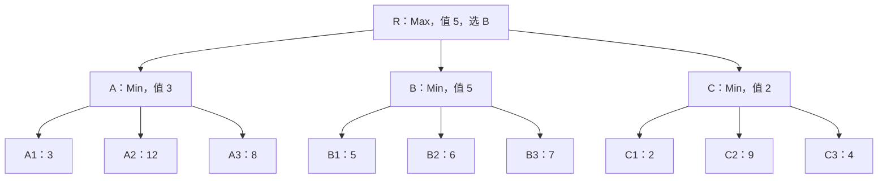
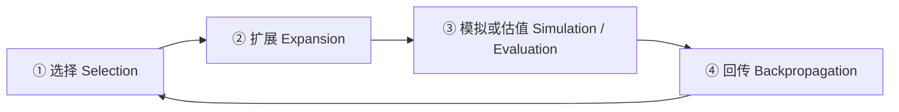
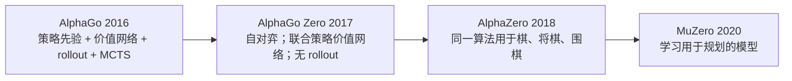

# 05 博弈搜索与对战 AI（Minimax / Alpha-Beta / MCTS）
> 知识成熟度：L2。本文给出原理、固定博弈树的完整 Python 示例与手算预期；运行验证状态见第五节，不把教学例推广为项目棋力或实时性证明。

> 知识基线：引擎无关的游戏 AI 通用原理。博弈搜索与状态机、行为树、效用 AI、GOAP 都是决策工具；UE 集成参阅[游戏 AI 学习路线](../../../00_Index/学习路线/游戏AI.md)。
> 适用范围：本文 Minimax / Alpha-Beta 的精确结论以**两人、零和、确定性、完全信息、顺序行动、有限搜索树**为前提。机会节点、隐藏信息、同时行动、多人非零和需要改变模型，不能直接套用这些结论。
> 事实边界：搜到真实终局得到该模型的博弈值；在深度边界使用启发式，只得到截断树的值。MCTS 的有限采样结果是估计，渐近结论有条件。性能、棋力和时间预算要结合规则、实现与硬件验证；本文不声称所有引擎都内置或都不内置搜索框架。
> 最后更新：2026-10-10。
> 一手来源：Shannon（1950）、Knuth / Moore（1975）、Kocsis / Szepesvári（2006）、Silver 等（2016、2017、2018），固定版本与阅读范围见第九节。

> 本分类前四篇主要回答“AI 下一步做什么”，本文加入一个条件：**对手会根据我的行动作出回应**。搜索显式比较这些后续变化，但强 AI 也可能由规则、规划、学习策略或混合系统构成，不能把所有对战 AI 都归结为博弈搜索。

---

## 一、概述

### 1.1 什么是博弈搜索

博弈树把局面表示为节点、合法动作表示为边。内部节点记录**谁有权选择下一步**；叶子可以是真实终局，也可以只是本次搜索的深度边界。

假设所有分数始终从 Max 一方看：Max 选择最大的后继值，Min 选择最小的后继值。这样求的是面对最优对手时可保证的收益，不是面对任意实际玩家时的最高平均得分。[Knuth / Moore 1975，§1](https://doi.org/10.1016/0004-3702(75)90019-3)

| 维度 | 行为树 / 效用 AI | 博弈搜索 |
| --- | --- | --- |
| 决策依据 | 规则或当前候选评分 | 行动与对手回应构成的未来局面 |
| 对手 | 可以通过规则、特征或专门模块表达 | 在树中明确建模行动权与回应 |
| 计算成本 | 取决于规则、评分与所调用任务 | 全宽搜索通常随深度指数增长 |
| 适用场景 | NPC 决策编排 | 需要比较对抗后果的决策；也可嵌入行为树 |

### 1.2 本文路线

1. 先固定收益视角，理解 Minimax 的回推
2. 用 Alpha-Beta 的窗口说明为什么一些分支无需继续
3. 比较 Negamax 写法和 MCTS 的采样搜索
4. 读一个完整输入、完整程序、完整预期输出的固定树例子
5. 再讨论时间预算、置换表、随机性与隐藏信息等工程边界

---

## 二、核心概念

| 概念 | 英文 | 一句话定义 | 需要注意 |
| --- | --- | --- | --- |
| 博弈树 | Game Tree | 局面为节点，动作为边 | 状态必须包含行动权与影响规则的历史 |
| 零和博弈 | Zero-sum Game | 双方收益互为相反数 | 不等于自动具备完全信息或确定性 |
| 最大最小 | Minimax | Max 取最大，Min 取最小 | 本文所有值从同一 Max 视角解释 |
| 剪枝 | Pruning | 不继续访问某些分支 | 只有满足条件的剪枝才保持原问题结果 |
| Alpha / Beta | Search Window | 当前搜索使用的下界 / 上界窗口 | 窗口外返回值可能只是界 |
| 负极大 | Negamax | 利用零和对称性减少重复分支 | 每条边取负还要求该边切换玩家 |
| 蒙特卡洛树搜索 | MCTS | 通过反复采样扩展并估计搜索树 | 选择、扩展、模拟或估值、回传 |
| UCT | UCB applied to Trees | 用置信上界选择探索动作 | 奖励范围、初始化与收益视角必须明确 |
| 评估函数 | Evaluation Function | 为未搜到终局的局面估值 | 不等于规则定义的真实终局收益 |
| 迭代加深 | Iterative Deepening | 依次完成深度 1、2、3…的搜索 | 中止时保留最后完成的一轮 |
| 置换表 | Transposition Table | 复用相同状态的搜索信息 | 区分精确值、上界、下界与适用深度 |
| 开局库 | Opening Book | 预存适用开局下的合法走法 | 必须匹配规则版本与当前状态 |
| 学习型评估 | Learned Evaluation | 通过数据训练价值或策略模型 | 学习和搜索是可组合的两个维度 |

---

## 三、原理详解

### 3.1 Minimax 原理

#### 3.1.1 递归定义：先终局，再深度边界

设 `V(s,d)` 为从 Max 视角看的值，`d` 是还允许向下走的动作数：

- `s` 已终局：返回规则给出的 `Utility(s)`
- 未终局且 `d == 0`：返回启发式 `Evaluate(s)`
- Max 行动：返回所有合法后继 `V(next,d-1)` 的最大值
- Min 行动：返回所有合法后继 `V(next,d-1)` 的最小值

```text
function minimax(state, depth):
    if terminal(state): return terminal_utility_for_max(state)
    if depth == 0: return evaluate_for_max(state)
    values = [minimax(apply(state, move), depth-1)
              for move in legal_moves(state)]
    return max(values) if player_to_move(state) == Max else min(values)
```

这里按状态中的行动权选择 Max 或 Min，而不是无条件在每层翻转布尔值。因此规则允许“奖励回合”时，同一玩家可连续选择。没有合法动作不一定等于输：可能是和局、将死，也可能必须 pass；由规则层提供终局或合法 pass 后继，不能让空集合偷偷返回无穷大。

终局优先很重要。棋已经赢了，即使恰好 `d == 0`，也应返回真实胜负而不是子力估值。若只搜索到中间局面，Minimax 正确回推的是这组估值，不能证明真实游戏的胜负。[Shannon 1950，§2、§4](https://archive.computerhistory.org/projects/chess/related_materials/text/2-0%20and%202-1.Programming_a_computer_for_playing_chess.shannon/2-0%20and%202-1.Programming_a_computer_for_playing_chess.shannon.062303002.pdf)

#### 3.1.2 一棵可以手算的树

Max 在根 `R` 选择 A、B 或 C，然后 Min 选该分支中的一个终局。终局分数是 Max 所得的分数，Min 得相反数；数值不是胜率。



*图释：三条根走法对应 Min 的三组完整回应。A 取 `min(3,12,8)=3`，B 取 `min(5,6,7)=5`，C 取 `min(2,9,4)=2`；根取 `max(3,5,2)=5`，选择 B。不能因为 A 中有 12 就选 A，因为 Min 不会配合选择 A2。第五节程序使用完全相同的输入。*

若每层约有 b 个动作、搜索深度为 d，全宽节点量为 `O(b^d)`。大游戏难以穷举到终局，因而使用截断估值、剪枝和复用；Minimax 仍是这类搜索的基础，不应说它“从未用于强棋力”。分支数随规则和局面变化，不把一个典型数字当作普遍常数。

### 3.2 Alpha-Beta 剪枝

#### 3.2.1 为什么可以少看分支

Alpha-Beta 保留同一棵树和同一叶值，用祖先已经找到的替代选项限制搜索：

- `alpha` 是 Max 已有选项建立的下界
- `beta` 是 Min 已有选项建立的上界
- 当 `alpha >= beta`，剩余子节点已无法改变祖先对这个分支的取舍，可以停止访问

在上图按 A、B、C 顺序搜索时，A 完成后根已有 3；B 完成后根已有 5。到 C 只读到 C1=2，就知道 Min 至少有一个能把 Max 限制在 2 的回应。无论 C2、C3 是多少，C 都不会胜过根已有的 B=5，故可跳过 C2、C3。

根从 `(-∞,+∞)` 开始，完整完成搜索后，Alpha-Beta 与同一深度、同一估值、同一合法动作树的 Minimax 得到相同根值。并列最优动作可能因访问顺序或并列规则不同而不同。剪枝并不声称被跳过节点对所有其他根、深度、窗口也无关。[Knuth / Moore 1975，§2–3](https://doi.org/10.1016/0004-3702(75)90019-3)

```text
function alphabeta(state, depth, alpha, beta):
    if terminal(state): return terminal_utility_for_max(state)
    if depth == 0: return evaluate_for_max(state)
    if player_to_move(state) == Max:
        best = -infinity
        for move in legal_moves(state):
            best = max(best, alphabeta(apply(state, move), depth-1, alpha, beta))
            alpha = max(alpha, best)
            if alpha >= beta: break
    else:
        best = +infinity
        for move in legal_moves(state):
            best = min(best, alphabeta(apply(state, move), depth-1, alpha, beta))
            beta = min(beta, best)
            if alpha >= beta: break
    return best
```

这个 fail-soft 写法返回已找到的 `best`，可能超出传入窗口。窄窗口调用的返回值不一定是节点精确值：未达到下界可给上界，超过上界可给下界，置换表必须记录这一差别。

#### 3.2.2 走法排序与选择性搜索不是一回事

在规则整齐、叶深相同的 b 叉树中，理想排序可把叶访问量降到约 `O(b^(d/2))`；最差仍是 `O(b^d)`。这说明排序有价值，不保证项目运行时间减半或深度翻倍。[Knuth / Moore 1975，§6](https://doi.org/10.1016/0004-3702(75)90019-3)

常见排序线索包括上轮最佳走法、置换表走法、杀手走法、历史启发式、吃子优先（如 MVV-LVA）。**排序仍保留全部合法走法**；只保留 Top-K、空着裁剪或减少部分分支深度，会改变被搜索的问题，需要单独评估误判，不能借用纯 Alpha-Beta 的精确保证。

### 3.3 Negamax：什么时候每层都能取负

若双方收益互为相反数，可以让函数返回“对当前行棋方有多好”。在**每步都切换到另一玩家**的两人游戏中：

```text
function negamax(state, depth, alpha, beta):
    if terminal(state): return terminal_utility_for_side_to_move(state)
    if depth == 0: return evaluate_for_side_to_move(state)
    best = -infinity
    for move in legal_moves(state):
        score = -negamax(apply(state, move), depth-1, -beta, -alpha)
        best = max(best, score)
        alpha = max(alpha, best)
        if alpha >= beta: break
    return best
```

取负是在把对方视角转换回来，窗口也必须同时变为 `(-beta,-alpha)`。若某动作让同一玩家继续行动，这条边就不应无条件取负或交换窗口；若仍想用 Negamax，需要显式按玩家身份转换。教学或规则复杂时，先用固定 Max 视角的 Minimax 更容易查错。[Knuth / Moore 1975，§1–2](https://doi.org/10.1016/0004-3702(75)90019-3)

Negamax 能减少双份逻辑，但不自动保证 bug 更少，也不是所有棋类引擎、所有 MCTS 的共同实现形式。

### 3.4 MCTS（蒙特卡洛树搜索）

#### 3.4.1 四阶段循环



*图释：反复把计算投入有希望或尚未充分探索的分支。经典 rollout 版本模拟至终局；其他版本可在边界调用估值。时间到时只能安全地使用已完成并回传的统计。*

1. **选择**：从根沿已建树选择动作，例如使用 UCT；遇到可扩展节点或终局停止下降
2. **扩展**：按具体实现加入一个或若干尚未探索的合法后继；终局不扩展
3. **模拟 / 估值**：用默认策略随机或启发式 rollout 到终局，或在明确的截断点使用价值估计
4. **回传**：沿本轮路径更新访问次数与累计收益；每条边使用约定的玩家视角

搜索结束后的根动作选择也是设计项。常见对战 MCTS 选择访问次数最多的合法动作，AlphaGo 2016 采用这一做法；UCT 原论文的规划框架按平均估计收益选根动作，不能把二者写成同一个固定规则。零次完成采样时需要另备合法回退动作。

#### 3.4.2 UCT：公式之前先约定收益

对于节点 s 的边 i，令 `N_i` 是访问次数，`W_i` 是**s 的行动方**所得累计收益，`N_s` 为父节点访问次数。约定胜=1、和=0.5、负=0，访问过的边可用：

```text
UCT_i = W_i / N_i + C * sqrt(ln(N_s) / N_i)
```

第一项利用已有平均结果，第二项鼓励探索。`N_i == 0` 时不能直接相除；先选未访问边（或在选择逻辑中赋予无穷探索优先级），全部边已访问后才代入公式。父节点计数也必须有效，不能求 `ln(0)`。[Kocsis / Szepesvári 2006，§2.2–2.3、脚注 3](https://doi.org/10.1007/11871842_43)

收益视角错误会让对手“帮我赢”：如果存根玩家的胜率，却在对手节点继续选最大根胜率，就不是对抗搜索。可像这里按**父节点行动方**保存每条边的收益；回传时根据实际玩家身份将根结果转换到该边视角。使用 `[0,1]` 胜率时对手值为 `1-v`，使用 `[-1,1]` 零和分数时才是 `-v`，不可混用。

一个手算选择：父访问 10 次，A 边 `W=6,N=8`，B 边 `W=1,N=2`，临时取 `C=1`。A 的 UCT 约为 `0.75+0.536=1.286`，B 约为 `0.5+1.073=1.573`，这轮探索 B；不代表最终就选 B。C 的合适尺度依赖奖励范围、公式约定和任务，不能统一给所有游戏一个“1.0–1.4”。

#### 3.4.3 能保证什么

| 特性 | 条件与限制 |
| --- | --- |
| 可不手写静态评估 | 前提是 rollout 能到终局且有可计算收益；截断 rollout 仍需要边界估值 |
| 增量计算 | 每次完成采样后都有可用统计；单次 rollout 或网络调用也可能超时 |
| 分配大分支下的预算 | 不穷举整个树，但大分支、稀有关键反驳、差的默认策略都可能导致有限预算失败 |
| 渐近一致性 | UCT 论文在有界回报、相应探索条件及有限时域等模型下给出结论；样本趋于无限不是几毫秒内必然正确 |

UCT 的原始定理主要针对有限时域 MDP，并讨论折扣问题与博弈树实验。不能从一个公式直接推得“任意隐藏信息、多人、学习模型或截断采样都收敛到真实最优对抗策略”。[Kocsis / Szepesvári 2006，§2.4、定理 6、§3.1](https://doi.org/10.1007/11871842_43)

### 3.5 评估函数设计

评估函数决定在看不完的地方相信什么。常见起点是特征加权 `E(s)=Σ w_i f_i(s)`：子力、位置表、兵形、王安全、机动性、控制区域与威胁。国际象棋常用的兵 1、马/象约 3、车 5、后 9 是教学权重起点，不是跨规则通用常量。

- **统一视角**：Minimax 全程用固定 Max 视角；Negamax 使用当前行棋方视角，并满足零和转换
- **胜负与估值分开**：和局通常为 0，不应和将死一样返回“极端值”。若用 `M-ply` 表示胜、`-M+ply` 表示负，应让 M 足够大以压过非终局估值，并覆盖支持的最大 ply；这样偏好快赢、在必败时尽量延后
- **地平线效应**：在交换进行到一半时截断，会把暂时多一子误认成收益。可在边界继续搜索关键战术直到较安静局面，但必须定义候选动作、深度/节点上限与将军等特殊情况
- **调参要看决策错误**：回放局面，分开检查规则错误、漏掉反驳、估值偏差与预算不足；用棋谱、自对弈、回归或时序差分学习辅助调整权重

“越深估值越保守”不是通用修复规则。先保证分值语义一致，再比较不同深度和预算下的实测决策。[Shannon 1950，§3–4、§6](https://archive.computerhistory.org/projects/chess/related_materials/text/2-0%20and%202-1.Programming_a_computer_for_playing_chess.shannon/2-0%20and%202-1.Programming_a_computer_for_playing_chess.shannon.062303002.pdf)

### 3.6 工程技巧：预算、置换表与选择性搜索

#### 3.6.1 迭代加深不等于硬截止

依次搜索深度 1、2、3…，既能复用上一轮结果排序，也能在更深一轮被中止时退回最后完成结果。仅在外层 `while now < deadline` 检查时间，无法阻止一次递归搜索跨过 deadline。

搜索需要在递归节点、动作生成或其他可取消操作处检查预算，传播“未完成”状态；**不得把未完成子树的分数当成精确值回传，也不把未完成一轮覆盖到已完成结果**。开始前先取一个合法回退动作；终局返回“无动作”，不能调用不存在的 `first_legal_move`。

```text
best = legal_fallback_or_none(state)
for depth in 1..max_depth:
    result = search_with_cancellation(state, depth, deadline)
    if result.incomplete: break
    best = result.move
return best
```

这段只表达发布结果的规则，完整可运行算法见第五节。节点间检查属于合作式中止；长时间不可中断的评估、系统调度与通信仍会延迟返回。需要由独立监督者限制计算任务并预留回传余量；即使有超时回收，也不能据此承诺普通操作系统下“杜绝一步超时”。MCTS 的外层迭代同样有这个边界。

#### 3.6.2 置换表：相同哈希不等于可用精确值

同一局面可能由不同走法顺序到达，缓存可复用其搜索信息。建议条目至少携带状态校验信息、搜索深度、分值、`EXACT / LOWER / UPPER` 标记、最佳走法和必要的规则/估值版本标识。

对没有额外窗口收缩的 fail-soft 搜索，记调用入口窗口为 `(alpha0,beta0)`，完整完成后的返回值为 v：

| 结果位置 | 可保存的语义 | 命中后的用途 |
| --- | --- | --- |
| `v <= alpha0` | `UPPER`：真实搜索值不大于 v | 收紧 beta |
| `v >= beta0` | `LOWER`：真实搜索值不小于 v | 抬高 alpha |
| `alpha0 < v < beta0` | `EXACT` | 在其他上下文匹配时可直接复用 |

这是由搜索窗口语义得到的工程处理，不能用搜索结束时已修改的 alpha/beta 反推标记。若先用已有条目收紧窗口，必须同时跟踪已有界和本轮真正证成的界，避免误标精确值。未完成搜索不按普通完成结果入表。

复用还需检查：

1. **状态是否完整**：行动方、易位权、吃过路兵、抽取资源、重复局面或其他与规则有关的历史都可能改变值；不能只哈希棋子位置
2. **深度语义是否一致**：较浅结果不能代替要求更深的搜索。工程上常接受更深条目，但它可能不同于“恰好 d 层启发式截断”的结果；若在证明与固定深度 Minimax 等价，须用相同深度/边界语义，或已解到终局的值
3. **分值视角是否一致**：根身份、估值版本、路径相关的和棋判定必须匹配；将杀距离分数还要转换 root-ply，不能原样跨不同根复用
4. **碰撞如何处理**：Zobrist 是常用增量哈希，不是唯一性证明。桶位置相同要校验完整 key；完整有限位 key 也可能碰撞。要求无碰撞的教学验证可存完整状态并比较，工程上使用校验与替换策略且承认残余碰撞风险

最佳走法命中也要重新检查当前合法性。命中率、表容量和提速没有通用保证，应按内存与局面分布测量。

#### 3.6.3 保留有用技巧，但分清代价

| 技巧 | 用途 | 边界 |
| --- | --- | --- |
| 开局库 | 省掉重复开局计算；可按玩家水平配置不同变例 | 匹配规则和当前状态；不保证中盘实力 |
| 每步时间分配 | 用剩余时间、预期剩余回合和局面复杂度安排预算 | 保留通信/回传余量，不能单靠预算公式保证实时性 |
| 空着裁剪（Null-move） | 用“假设跳过本方行动仍占优”快速判断部分分支 | 这是搜索假设，通常不是游戏合法动作；zugzwang 等局面可能误判，需适用限制或验证搜索 |
| 战术扩展 / 静态搜索（quiescence） | 减少在吃子、将军等不稳定位置截断的误差 | 不等于“只要吃子就无限加一层”；需要终止条件与预算 |
| 可观测性 | 记录完成深度、访问节点、剪枝数、耗时、回退次数 | 节点少不自动意味着墙钟更快或棋力更强 |

### 3.7 与强化学习的关系：分清 AlphaGo 的版本



*图释：演进重点是哪些组件来自学习、搜索怎样调用它们。不能把后续版本的“无 rollout”倒写进 AlphaGo 2016，也不能把学习模型说成没有模型。*

- **AlphaGo 2016**：选择使用 `argmax_a [Q(s,a)+u(s,a)]`，策略先验 P 进入探索奖励 u，不是再独立加一项 P。叶子同时经价值网络和快速 rollout 评估，组合为 `V=(1-λ)vθ+λz`。论文的策略训练包含人类棋谱监督学习及自对弈强化学习。[Silver 等 2016，p.486、图 3](https://doi.org/10.1038/nature16961)
- **AlphaGo Zero 2017**：用联合策略/价值网络与自对弈训练，搜索不再运行快速 rollout；已知游戏规则仍用于状态推进和合法行动。[Silver 等 2017，p.354](https://doi.org/10.1038/nature24270)
- **AlphaZero 2018**：把同一学习与搜索方法用于国际象棋、将棋和围棋，结论是论文设定下这些游戏的实验结果，不是任意游戏中 RL 都优于经典搜索。[Silver 等 2018](https://doi.org/10.1126/science.aar6404)
- **MuZero**：在学习的表示和动力学中预测奖励、策略与价值，用这些量规划；“不要求提供真实转移模型”不等于“无环境模型”。此处仅据固定预印本摘要说明范围，不展开训练和搜索实现。[Schrittwieser 等，arXiv:1911.08265v2](https://arxiv.org/abs/1911.08265v2)

对项目的启示：先用明确规则、简单评估与可回归的搜索建立基线，再判断学习是否能改善评估或动作先验。不能仅凭“加了 Alpha-Beta”承诺超过大多数玩家，也不能仅凭“用了 RL”承诺顶尖棋力。

### 3.8 游戏类型改变了什么

| 类型 | 可以考虑的搜索形态 | 不能省略的模型问题 |
| --- | --- | --- |
| 象棋 / 五子棋 | Alpha-Beta、迭代加深、置换表；也可学习估值 | 合法动作、终局、重复规则与估值质量 |
| 围棋 | MCTS 配合 rollout 或网络策略/价值 | 大分支、劫与历史、终局计分、网络调用成本 |
| 带骰子等公开随机结果 | Expectiminimax 或采样 | 机会节点按已知概率加权，不由任一玩家挑最优结果 |
| 卡牌等隐藏信息游戏 | 信息集搜索、信念状态采样或专门博弈算法 | 决策必须仅依赖可见信息；不能把抽到的隐藏手牌当成已知事实 |
| 自走棋 / 战棋 | 买、摆位、战斗等分层搜索 | 每层控制权、随机战斗模型和有限候选是否改变目标 |
| 格斗 | 依赖帧数据的短期对策搜索 | 同时输入、可观察延迟与预测错误，不能默认轮流行动 |
| 即时策略（RTS） | 局部微操搜索配全局策略 | 同时动作、部分可观测、状态变化速度与预算 |

机会节点的值为 `Σ p(outcome)·V(outcome)`。直接把它当 Min 或 Max 节点是另一种问题；普通 Alpha-Beta 的剪枝条件不能不加推导地照搬到期望节点。隐藏信息更不同：对同一信息集，不能根据自己尚未观察到的真实世界选择不同动作。简单“采样几个手牌，各自完全信息最优后平均”可能产生 strategy fusion（把不能同时实现的策略拼在一起），因此不继承完全信息 Minimax 的精确保证。

---

## 四、选型对比：搜索方法与学习方法

| 维度 | Alpha-Beta 系 | MCTS | RL / 学习策略与价值 |
| --- | --- | --- | --- |
| 叶子信息 | 终局收益；截断时需估值 | rollout 结果或截断估值 | 通过训练提供策略、价值或模型 |
| 预算 | 在取消检查点中止，保留已完成迭代 | 在完成采样间取结果；采样内也需预算 | 推理成本依赖网络和设备；训练另有成本 |
| 实现成本 | 完整规则、评估与剪枝；优化会增加复杂度 | 树统计、采样与回传视角 | 数据、训练、评估、部署流程 |
| 可解释线索 | 候选值、反驳线、窗口与剪枝原因 | 访问次数、平均结果、探索分配 | 可配搜索轨迹与专门分析 |
| 棋力判断 | 取决于模型、估值和预算 | 取决于模型、采样/价值质量和预算 | 取决于训练目标、数据与计算；可与前两者组合 |

先比较同一规则、同一对手集和可比计算预算下的结果。搜索与 RL 不是互斥的三档产品，也不存在只看名字就能确定的强弱顺序。

---

## 五、完整最小例：把同一棵树算两遍

### 5.1 输入与约定

本例只实现上图的有限评分游戏，没有引擎、网络、第三方包或隐藏接口：

- `TREE` 完整列出合法动作，根 R 由 Max 行动，A/B/C 由 Min 行动
- `UTILITY` 列出九个真实终局分数，始终从 Max 看
- `HEURISTIC` 列出四个内部节点的截断估值；特意把 A、B、C 估为 4、1、6，用来演示深度 1 的判断可能与终局搜索不同
- `depth` 以动作边计；同值保留当前顺序中先遇到的走法；每次进入递归计一个节点
- 此例没有环、机会节点、隐藏信息、置换表、时间取消或胜负学习；这些能力不能由例子通过而推定

把下面完整代码保存为 `game_tree_example.py`，用已有的 Python 3.8+ 执行即可。下一节列出预先冻结的全部手算预期输出；本次固定运行已与其逐字核对，验证范围见 5.4。

```python
"""Fixed, finite game tree. No files, network, random numbers or subprocesses."""

TREE = {
    "R": ("A", "B", "C"),
    "A": ("A1", "A2", "A3"),
    "B": ("B1", "B2", "B3"),
    "C": ("C1", "C2", "C3"),
}
PLAYER = {"R": "MAX", "A": "MIN", "B": "MIN", "C": "MIN"}
UTILITY = {
    "A1": 3, "A2": 12, "A3": 8,
    "B1": 5, "B2": 6, "B3": 7,
    "C1": 2, "C2": 9, "C3": 4,
}
HEURISTIC = {"R": 0, "A": 4, "B": 1, "C": 6}


def leaf_value(node, depth, stats):
    # Terminal utility takes priority even when depth == 0.
    if node in UTILITY:
        value = UTILITY[node]
    elif depth == 0:
        value = HEURISTIC[node]
    else:
        return None
    stats["leaves"].append(f"{node}:{value}")
    return value


def minimax(node, depth, tree, stats):
    stats["nodes"] += 1
    value = leaf_value(node, depth, stats)
    if value is not None:
        return value, None
    maximizing = PLAYER[node] == "MAX"
    best = float("-inf") if maximizing else float("inf")
    move = None
    for child in tree[node]:
        score, _ = minimax(child, depth - 1, tree, stats)
        if (maximizing and score > best) or (not maximizing and score < best):
            best, move = score, child
    return best, move


def alphabeta(node, depth, tree, stats, alpha=float("-inf"), beta=float("inf")):
    stats["nodes"] += 1
    value = leaf_value(node, depth, stats)
    if value is not None:
        return value, None
    maximizing = PLAYER[node] == "MAX"
    best = float("-inf") if maximizing else float("inf")
    move = None
    for index, child in enumerate(tree[node]):
        score, _ = alphabeta(child, depth - 1, tree, stats, alpha, beta)
        if (maximizing and score > best) or (not maximizing and score < best):
            best, move = score, child
        if maximizing:
            alpha = max(alpha, best)
        else:
            beta = min(beta, best)
        if alpha >= beta:
            skipped = tree[node][index + 1:]
            if skipped:
                stats["cuts"].append(node + "->" + ",".join(skipped))
            break
    return best, move


def run(method, depth, order=("A", "B", "C"), node="R"):
    # This teaching interface accepts only the fixed input domain below.
    if type(depth) is not int or not 0 <= depth <= 2:
        raise ValueError("depth must be an integer in [0, 2]")
    if type(order) is not tuple or sorted(order) != ["A", "B", "C"]:
        raise ValueError("order must be a permutation of ('A', 'B', 'C')")
    if node not in TREE and node not in UTILITY:
        raise ValueError("unknown node")
    tree = dict(TREE)
    tree["R"] = order
    stats = {"nodes": 0, "leaves": [], "cuts": []}
    value, move = method(node, depth, tree, stats)
    leaves = ",".join(stats["leaves"])
    cuts = ";".join(stats["cuts"]) or "-"
    print(f"{method.__name__}: value={value} move={move} nodes={stats['nodes']} "
          f"leaves={leaves} cuts={cuts}")
    return value, move


if __name__ == "__main__":
    cases = (
        (1, ("A", "B", "C"), (6, "C")),
        (2, ("A", "B", "C"), (5, "B")),
        (2, ("B", "A", "C"), (5, "B")),
    )
    for depth, order, expected in cases:
        print(f"depth={depth} order={','.join(order)}")
        mm = run(minimax, depth, order)
        ab = run(alphabeta, depth, order)
        assert mm == ab == expected
    print("terminal=A1 depth=0")
    assert run(minimax, 0, node="A1") == (3, None)
    assert run(alphabeta, 0, node="A1") == (3, None)
```

### 5.2 完整手算预期

输出中的 `nodes` 包含根和叶子；`leaves` 按访问顺序列出本次真正读取的值；`cuts` 只列出实际跳过的兄弟节点。以下是**运行前冻结的手算预期，本次实际合并输出与之逐字一致**：

```text
depth=1 order=A,B,C
minimax: value=6 move=C nodes=4 leaves=A:4,B:1,C:6 cuts=-
alphabeta: value=6 move=C nodes=4 leaves=A:4,B:1,C:6 cuts=-
depth=2 order=A,B,C
minimax: value=5 move=B nodes=13 leaves=A1:3,A2:12,A3:8,B1:5,B2:6,B3:7,C1:2,C2:9,C3:4 cuts=-
alphabeta: value=5 move=B nodes=11 leaves=A1:3,A2:12,A3:8,B1:5,B2:6,B3:7,C1:2 cuts=C->C2,C3
depth=2 order=B,A,C
minimax: value=5 move=B nodes=13 leaves=B1:5,B2:6,B3:7,A1:3,A2:12,A3:8,C1:2,C2:9,C3:4 cuts=-
alphabeta: value=5 move=B nodes=9 leaves=B1:5,B2:6,B3:7,A1:3,C1:2 cuts=A->A2,A3;C->C2,C3
terminal=A1 depth=0
minimax: value=3 move=None nodes=1 leaves=A1:3 cuts=-
alphabeta: value=3 move=None nodes=1 leaves=A1:3 cuts=-
```

### 5.3 沿输出走一遍

1. **深度 1**：只能读到 A=4、B=1、C=6 这组启发式，两个算法都选 C。它们一致，只说明都正确搜索了这棵截断树
2. **深度 2，A/B/C 顺序**：Minimax 读完九个终局，得到 A=3、B=5、C=2，选 B；Alpha-Beta 在 C1=2 时已有根下界 5，因此跳过 C2/C3。访问节点从 13 变为 11，根结果相同
3. **深度 2，B/A/C 顺序**：先完整搜索 B 得到 5；A 读到 3、C 读到 2 后均可停止。访问节点变为 9，仍选 B。这里只证明该输入下少访问了节点，没有测量耗时
4. **终局 A1，深度 0**：返回真实收益 3、无下一动作。`HEURISTIC` 没有 A1，因此把深度判断放到终局之前会暴露错误

真正执行对局时，根走 B，Min 会从 B1/B2/B3 中选 B1，得到 Max=5、Min=-5。搜索评估其他分支并不会让真实对局同时走那些分支。

本例刻意不用置换表、学习模型或计时器，使读者先看清输入、递归和剪枝。将它接入真实游戏时，用规则层实现状态转移与合法动作，先让无剪枝 Minimax 成为小局面的对照，再逐项加入优化；不把抽象接口清单当成已经可运行的游戏 AI。

### 5.4 本次固定运行的实际结果

2026-10-10 使用已有 Python 3.12.14 对上述固定源码执行一次。三组深度/顺序输入和两个终局调用合计八次搜索、56 次节点进入；目标退出码为 0，stdout/stderr 的完整合并输出为 675B，与运行前冻结的全部黄金逐字一致。

监督器在 2 秒目标预算内读至合并管道 EOF 并完成进程回收，捕获未达到 4096B 上限，没有截断或额外合并字节。stderr 未单独采集，因此不能据此声称独立 stderr 为空。没有运行超时、强制终止等失败分支实验。

这个结果只验证所列固定输入与完整轨迹。它不是任意游戏或输入的正确性证明，也不验证 MCTS、置换表、引擎接入、性能、棋力或硬实时性；正文的 L2 与 `verified: []` 保持不变。

---

## 六、最佳实践

1. **先确认博弈类型**：区分谁能看到什么、谁能同时行动、随机性来自哪里，以及是否零和；据此选择状态与节点类型
2. **先有小局面对照**：用可手算输入核对终局、估值、收益视角与回推，再比较搜索深度；不要只凭走法“像不像人”判断正确性
3. **预算要穿透递归**：准备合法回退，只发布已完成结果；合作式取消和外部超时回收分别验证，不能从迭代加深推得硬实时
4. **先排序，再审查选择性裁剪**：杀手走法、历史表和上轮最佳走法可以帮助排序；过滤合法动作会损失原树的精确保证
5. **置换表保存界和上下文**：Zobrist 哈希、深度、状态校验、分数视角、规则和估值版本共同决定能否复用
6. **针对地平线效应设置战术边界**：静态搜索、吃子/将军扩展需要清晰的候选与终止条件，避免无限延伸或漏掉必须应将
7. **开局库服务目标水平**：休闲与竞技可使用不同变例；检查合法性与规则兼容，再测实际体验
8. **记录可解释的统计**：完成深度、节点数、剪枝数、采样次数、耗时及回退次数；分清搜索次数、真实时间和对局质量
9. **与行为树 / 效用层混合**：战略层编排目标，搜索处理适合前瞻的局部对抗；让两层使用同一真实局面与行动权限
10. **用对局回放定位错误**：规则回归、小树对照、战术局面和匹配对手的胜率分别回答不同问题；棋谱一致率也不是完整棋力指标

---

## 七、常见问题 FAQ

1. **Q：Minimax 和 MCTS 哪个更强？** A：没有通用排序。评估、默认策略、分支结构、稀有战术反驳和预算都会影响结果；二者也都能结合网络。先用目标游戏的局面与对手比较
2. **Q：剪枝会改变结果吗？** A：纯 Alpha-Beta 对同一合法动作树、同一叶值和同一深度，完整根搜索保持 Minimax 值；并列动作可能不同。Top-K、空着裁剪、降深、错误置换表或未完成搜索不在此保证内
3. **Q：分支因子很大怎么办？** A：先做排序、复用或用 MCTS 分配采样；动作过滤和渐进扩展可以作为工程方案，但要说明漏解风险及是否仍保留探索所有动作的条件
4. **Q：游戏有骰子或抽牌怎么办？** A：已知概率的机会节点取期望，采样是其估计方法；隐藏手牌还需信息集或信念状态。未知信息不能直接当作当前玩家可见的状态
5. **Q：搜索深度多少够用？** A：没有跨游戏可用的“2–4 层就够”。先定义一层是一动作还是一回合，再在目标局面上测预算、完成深度和决策错误；选择性扩展后的深度也不能简单横比
6. **Q：评估函数怎么调权重？** A：先用规则与领域知识给初值，再检查回放和战术反例；可用棋谱、自对弈回归或时序差分学习。训练目标必须匹配想优化的实际收益
7. **Q：AI 总走出看起来很蠢的棋怎么办？** A：先排除非法动作、终局漏判、收益符号、未完成结果、置换表误命中，再检查估值和深度；保存能复现该走法的局面、规则版本和预算
8. **Q：MCTS 什么时候考虑换成 Minimax 系？** A：当可写出有用估值、关键战术适合系统枚举且预算允许时值得对比。先区分问题是采样不足、默认策略差还是模型不对，不能仅凭“时间敏感”决定
9. **Q：RL 和博弈搜索要一起用吗？** A：可以，但不是必须。AlphaGo / AlphaZero 展示了网络与搜索在指定棋类中的成功，不能推出所有项目都应如此。先建立经典搜索或策略基线，再验证学习的收益与成本
10. **Q：多人在线对战能用博弈搜索吗？** A：能，但多人非零和通常不能继续用简单 Max/Min 两方模型。竞争性联机游戏应按其权威架构安排最终决策与校验；离线、合作和客户端预测的部署要求不同，不是所有搜索都必须在服务端

---

## 八、关联阅读

- 本分类：[01-AI总体架构与感知.md](01-AI总体架构与感知.md) —— 感知/黑板为博弈搜索提供局面输入；
- 本分类：[02-状态机与层次状态机.md](02-状态机与层次状态机.md) —— 战略层状态机 + 战术层搜索的混合结构；
- 本分类：[04-Utility与GOAP.md](04-Utility与GOAP.md) —— 效用评分与搜索的互补（评估函数即效用思想的延伸）；
- 本分类：[03-行为树通用原理.md](03-行为树通用原理.md) —— 行为树中嵌入"搜索节点"的集成方式；
- 移动学习：[03-学习型AI.md](../学习适应与社会行为/03-学习型AI.md) —— RL 与博弈搜索的关系、自对弈训练；
- 算法基础：[游戏算法/01-寻路与图论/01-图论基础与搜索算法.md](../../02-数学与游戏算法/路径搜索与导航/01-图论基础与搜索算法.md) —— 树/图搜索与启发式的数学基础；
- 采样与统计：[游戏算法/03-工程与实用技巧/07-概率分布与采样工程.md](../../02-数学与游戏算法/随机采样与程序化生成/07-概率分布与采样工程.md) —— MCTS rollout、共同随机数、分层场景和置信区间；
- UE 侧：[游戏知识/05-AI系统/README.md](../../../00_Index/学习路线/游戏AI.md) —— UE 行为树/EQS 等实现层指路。

---

## 九、一手来源与核对范围

以下固定论文用于核对概念与版本，不把二手百科当作算法保证的依据。只链接论文，不在仓库复制外部全文或实现源码。

- [Shannon, Programming a Computer for Playing Chess, 1950](https://archive.computerhistory.org/projects/chess/related_materials/text/2-0%20and%202-1.Programming_a_computer_for_playing_chess.shannon/2-0%20and%202-1.Programming_a_computer_for_playing_chess.shannon.062303002.pdf)：Computer History Museum 保存的论文文本；核对 §2–4 的状态、完全信息、回推与截断评估，以及安静局面问题
- [Knuth / Moore, An Analysis of Alpha-Beta Pruning, 1975](https://doi.org/10.1016/0004-3702(75)90019-3)：Artificial Intelligence 6，293–326；[大学课程公开副本](https://webdocs.cs.ualberta.ca/~mmueller/courses/657-Fall2025/readings/1975-AIJ-Knuth-Moore-alphabeta.pdf)。核对 §1–4 的假设、Negamax、窗口与正确性，以及 §6 的排序条件；没有重新证明全文全部复杂度定理
- [Kocsis / Szepesvári, Bandit based Monte-Carlo Planning, ECML 2006](https://doi.org/10.1007/11871842_43)：[大学课程公开副本](https://deeprl.cs.washington.edu/files/reading/bandit_mc.pdf)。核对 §2 的公式、零分母提示、定理 6 的有限时域与回报条件及 §3.1 的博弈树实验范围；作者站点此次超时，成功阅读的是同名论文副本
- [Silver 等, Mastering the game of Go with deep neural networks and tree search, Nature 2016](https://doi.org/10.1038/nature16961)：[公开课程副本](https://ailab-ua.github.io/courses/resources/mastering_the_game_of_go_with_deep_neural_networks_and_tree_search.pdf)。核对 p.486 的选择公式、混合叶值和图 3；出版社正文入口此次重定向失败，没有据此声称已在出版社站点读完全文
- [Silver 等, Mastering the game of Go without human knowledge, Nature 2017](https://doi.org/10.1038/nature24270)：[公开论文副本](https://augmentingcognition.com/assets/Silver2017a.pdf)。核对 p.354 中与 AlphaGo 2016 的差异，尤其联合网络、自对弈与无 rollout
- [Silver 等, A general reinforcement learning algorithm that masters chess, shogi, and Go through self-play, Science 2018](https://doi.org/10.1126/science.aar6404)：[UCL 作者稿记录](https://discovery.ucl.ac.uk/id/eprint/10069050/)。本次读到文献记录及摘要，作者稿下载失败；本文只引用题名、年份与三种棋类的范围，不据此展开未读取的算法细节
- [Schrittwieser 等, Mastering Atari, Go, Chess and Shogi by Planning with a Learned Model, arXiv:1911.08265v2](https://arxiv.org/abs/1911.08265v2)：固定为 2020-02-21 版本；本次只核对摘要中的学习模型、奖励、策略和价值表述，不声称审读其完整实现

---

## 更新日志

- 2026-08-07：初稿。补齐"博弈搜索"这一决策技术谱系空白（P0）；涵盖 Minimax/Alpha-Beta/Negamax/MCTS/评估函数/工程技巧/RL 演进；为引擎无关通用层，UE 实现仅指路。
- 2026-10-10：澄清算法前提、终局与估值、窗口/置换表、UCT 视角和 AlphaGo 版本；把抽象骨架补成固定树的完整输入、程序与手算预期，并保留 MCTS 四步、演进图、选型和 FAQ 用途。按固定源码和输入完成一次运行，八次搜索的完整合并输出与预先冻结黄金一致；仅回填这一有限结果，未验证引擎集成、性能或棋力，成熟度与 verified 不提升。
