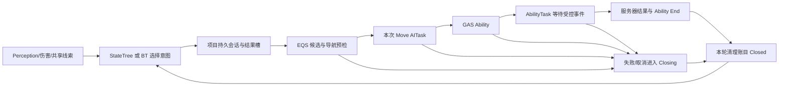
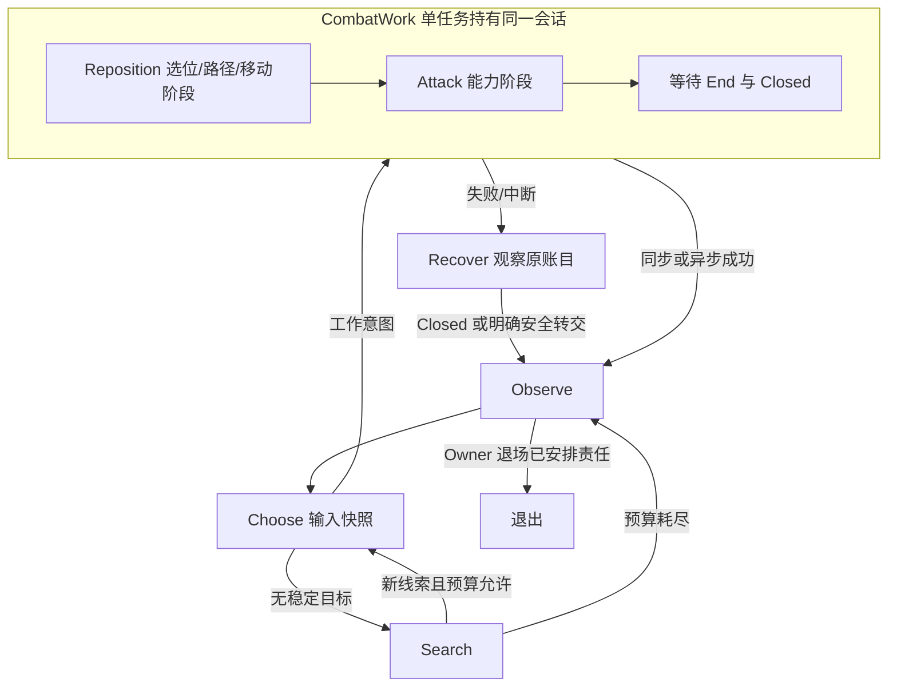
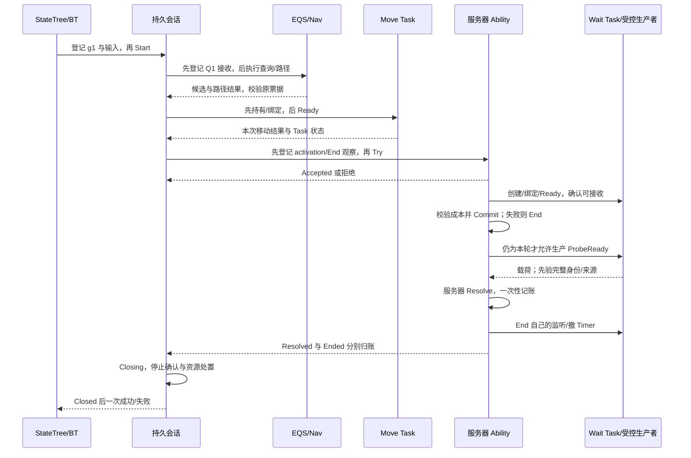
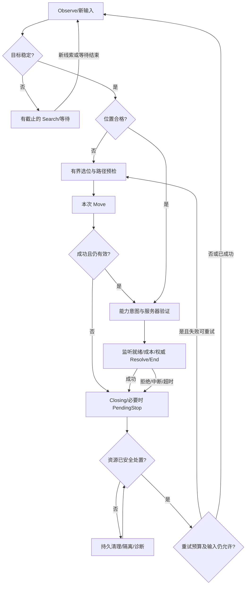

# 07 GameplayTasks、StateTree、GAS 与 AI 协同闭环

> 知识成熟度：L2。主要承诺是按当前官方公开合同解释组合接线、失败出口与责任边界；不是已编译、已运行的 UE 工程。
> 版本基准：2026-10-05 实际访问的 Epic Unreal Engine 5.8 Documentation 页面；这里只认证已读接口说明，不认证历史 UE5.8.0 / CL55116800 或任何私有源码函数体。
> 适用范围：服务器控制的单体 NPC、既有 BT 向 StateTree 迁移；玩家预测、SmartObject 和 Mass 是有明确额外前提的扩展。
> 最后更新：2026-10-05。重写启动、取消、潜伏任务和能力结果接线，保留选位、移动、预算、观测、失败恢复及历史记录。
> 未运行：UE/UHT/UBT/PIE、真实 GameplayTasks/StateTree/BT/GAS、导航、动画、网络、Gauntlet 与线程/性能测试。第 6.5 节只有宿主整数到浮点转换的局部观察；第 15 节全部是 `PAPER_EXPECTED`。

## 0. 怎样使用本文

目标不是造一个同时继承所有框架的“万能任务类”，而是让同一次动作始终能回答：谁选择、谁启动、谁仍在执行、谁能结算、谁在收尾。

本文使用三种证据身份：

- **公开 API 合同**：就近链接到已核官方类页/成员页，说明它实际承诺什么
- **项目协议**：会话、票据、结果槽、资源账、准入及重试政策由本文设计；不是 UE 内置类或枚举
- **目标工程待核**：实际工厂/取消/暂停的内部调用顺序、资源重算时点、回调线程及资产配置，要在选定版本的合法源码与工程中核实

所有流程图、短协议、Trace 和测试情境都是作者教学内容。没有把协议函数名伪装成引擎源码。第 19 节逐字保存两段旧版本/路径核验记录，其旧路径和旧“已核验”措辞只属于历史记录；当前阅读链接见第 18 节。

前置知识是 AIController/Pawn、异步回调、BT 或 StateTree 基本节点，以及 ASC/Ability 的基本职责。先在两个 NPC 的小地图中接通一个**不造成伤害的服务器测试能力**：到点后通过受控事件完成一次服务器计数，再返回决策。这样可以先排除接线和生命周期问题，再加入命中判定、伤害、预测与复杂动画。

## 1. 闭环：选择、执行和结果分别由谁负责

完整动作链是：输入快照 → 选位 → 路径检查 → 本次实际移动 → 能力意图 → 等待权威结果 → 停止/收尾 → 下一决策。



外部会话不必再是一个占用相同资源的 GameplayTask。`UAbilityTask` 本来就继承 `UGameplayTask`；外层已占 Movement/Weapon、内层又等待相同资源，可能把设计变成自锁。是否经同一组件仲裁、具体 Task 声明了什么资源，应逐个记录。[UGameplayTask 继承关系](https://dev.epicgames.com/documentation/en-us/unreal-engine/API/Runtime/GameplayTasks/UGameplayTask)

| 问题 | 负责者 | 输出，不应混成的事实 |
| --- | --- | --- |
| 看见了谁、线索何时过期 | Perception 与输入快照生产者 | 刺激和记忆，不是攻击命令 |
| 追击、攻击、搜索还是撤退 | StateTree 或 BT | 唯一决策源和本次意图 |
| 哪个位置适合、当前能否走到 | EQS 与导航适配器 | 候选/路径，不是已经到达 |
| 本次角色实际移动是否完成 | Move 适配器、控制器/路径跟随 | 本次请求的结果与接受条件 |
| 能否激活、成本/冷却、能力生命周期 | GAS | 激活尝试、成本提交、能力结束分别观察 |
| 命中/效果是否成立 | 服务器玩法结算 | 受验证的权威结果，不由本地 Tag 授权 |
| 退出后还欠哪些停止/释放 | 持久会话及各资源的唯一负责人 | 清理确认，不是仅清空句柄 |

最小迁移不必改全部 AI：先把 BT 的一个叶任务接到此会话，再让 StateTree 使用同一个执行协议；测试两种入口给出的结果和取消语义一致后，才讨论 Mass 批量化。决策源用 `DecisionSource` 记录，重复拥有同一动作返回 `AlreadyOwned`，或者走显式抢占；两个系统不能各自偷偷重启同一攻击。

## 2. Owner、活动身份和三套状态

### 2.1 不能都叫“Owner”

| 维度 | 本例存在哪里/如何取得 | 它没有自动提供什么 |
| --- | --- | --- |
| GameplayTask Owner/Avatar | 通过 `IGameplayTaskOwnerInterface` 解析实际任务组件；Owner 可是控制器，Avatar 可是 Pawn | 网络伤害权限、世界槽位预约 |
| 树的运行数据 | StateTree InstanceData 或 BT 每 AI 节点实例 | 临时上下文的永久寿命 |
| 外部会话 | 由寿命覆盖该次异步工作与收尾的项目宿主持有 | 对已失效 Actor/World 的访问资格 |
| ASC ActorInfo | 明确 `OwnerActor` 与 `AvatarActor`，换 Pawn 时按工程生命周期更新 | 单凭旧 ActorInfo 就代表当前玩法期 |
| 权威执行者 | 主例为服务器 Ability/玩法规则 | 接收任意客户端载荷即可结算 |

[任务 Owner/Avatar 入口](https://dev.epicgames.com/documentation/en-us/unreal-engine/API/Runtime/GameplayTasks/UGameplayTask)与 [InitAbilityActorInfo](https://dev.epicgames.com/documentation/en-us/unreal-engine/API/Plugins/GameplayAbilities/UAbilitySystemComponent/InitAbilityActorInfo)解决的是不同问题。

本例把 registry（会话表）放在项目持久执行宿主中，由它持有会话、适配器和必要的 UObject 引用，树中只留小句柄。可选按 World 管理的服务，但必须实现真实 Tick/定时和退出路径，不能只写“放进 Subsystem”就假定会被驱动。宿主在 Pawn/Controller 仍合法的 EndPlay/Stop 阶段封闭新请求并安排收尾；若其自身先退场，则**明确转交仍可执行的账目**，否则报告未完成。World 已 teardown 后不调用失效的 Subsystem 来补 Free。

`FStateTreeExecutionContext` 是临时访问视图，不跨帧保存。回调不捕获 `Context&`、借用 `InstanceData&`、BT 的裸 `NodeMemory*` 或 Mass 的 Fragment 引用；只带值票据和必要结果，在合法宿主中重新验证、重新取当前视图。[ExecutionContext 的寿命说明](https://dev.epicgames.com/documentation/en-us/unreal-engine/API/Plugins/StateTreeModule/FStateTreeExecutionContext)

### 2.2 最小票据与输入/输出

以下字段是**项目协议含义**，可以由一个不可复用 ID 索引不可变记录，不要求每层复制整个结构。

| 字段 | 用途与约束 |
| --- | --- |
| World 身份、Owner/Avatar 身份、玩法期 | 区分旧世界、换 Pawn、复活/重新加入；弱对象仍有效不等于当前玩法期有效 |
| DecisionSource、Activation | 区分 BT/ST 与同一节点/能力的再激活 |
| RequestId | 关联一次逻辑意图；有限重试可继续使用，但不单独代表一次执行 |
| Attempt / OperationId | 区分子尝试；另保存 QueryId、MoveRequestId、Ability spec 与本次执行映射 |
| InputRevision、Target | 标明依赖的目标/感知输入；只让相关输入变化使结果过期 |
| DesiredLocation、AbilityTag | 候选位置与能力白名单；不是授权凭据 |
| Deadline、ClockDomain | 有限等待；同一时钟口径比较，不能混客户端时间与服务器单调时间 |
| ResultCode、Detail | 一次业务结果与诊断；和 CleanupState 分开 |
| Acquisition / EffectJournal | 谁取得了什么、谁负责停止、谁可释放、已发生哪些不可逆效果 |

`FObjectKey` 是真实 UE 类型，可作为应用运行期间的对象标识；它不是保活引用、跨进程 NetId 或本轮活动凭据。[FObjectKey](https://dev.epicgames.com/documentation/en-us/unreal-engine/API/Runtime/CoreUObject/FObjectKey)

**本例 ID 政策**：尚未闭合、仍可能有回调的活动/子操作身份不复用。有限计数器将回绕时先停止发新请求或切换可区分的新玩法期，不能让旧值重新代表新动作。精确整数只解决表示精度，不能单独解决 ID 重用、回绕、ABA 或授权；见第 6.5 节。

### 2.3 三套状态各自回答一个问题

| 层 | 状态/事实 | 例子 |
| --- | --- | --- |
| Native Task | `Uninitialized / AwaitingActivation / Paused / Active / Finished` | Paused 不等于失败；Finished 不等于业务成功或对象已被 GC |
| 业务进度/结果 | 准备、选位、移动、能力等待；最终 `Succeeded / Failed / Canceled / TimedOut` | `CostCommitted`、`Resolved` 是独立事实，不是通用 Task state |
| 会话清理 | `Starting / Open / Closing / PendingStop / Closed` | Timeout 已选定，移动仍待停止，故可以是 PendingStop |

原生五态来自 [EGameplayTaskState](https://dev.epicgames.com/documentation/en-us/unreal-engine/API/Runtime/GameplayTasks/EGameplayTaskState)。其余是本文项目模型。这里业务结果第一次合法胜出后不改写；之后发生的取消/清理异常单列诊断。主例对树发布的完成结果还要求本轮 Closed；强制树退出的责任另见第 7、8 节。

## 3. GameplayTasks：资源声明、激活与结束

### 3.1 一条有实际 API 的接线

| 阶段 | 原生入口 | 适配器责任 |
| --- | --- | --- |
| 创建/初始化 | 具体 factory，或合法 `NewTask` 路线；`InitTask` 是受保护初始化入口 | 工厂可能有自己的配置路径，不在外部硬调 protected 函数；先有原 operation 账目 |
| 资源配置 | `AddRequiredResource`、相应 required/claimed set 配置 | 在交给组件消费前完成，声明不等于取得或开始副作用 |
| 接收准备 | 具体 Task 的结果委托 | 先持有任务、记录委托并绑定，再请求运行 |
| 请求运行 | `ReadyForActivation`，或所选工厂约定的 `RunGameplayTask` 路线 | 两种入口不盲目重复；请求可能等待，不能当已执行 |
| 实际执行 | Task 自己的 `Activate` | 启动其合法副作用；外部会话不直接调用 protected 生命周期 |
| 暂停/恢复 | 组件机制调用 Task 的 `Pause/Resume` | 核实具体 Task 的移动/动画是否配合；恢复不是新逻辑请求 |
| 正常结束/外部取消/Owner 结束 | `EndTask / ExternalCancel / TaskOwnerEnded` | 分别记录原因、native 结束与外部操作停止；具体取消语义按任务实现 |

[AddRequiredResource](https://dev.epicgames.com/documentation/unreal-engine/API/Runtime/GameplayTasks/UGameplayTask/AddRequiredResource)说明交给组件后改声明不能据此改变既有消费；[GameplayTasksComponent](https://dev.epicgames.com/documentation/en-us/unreal-engine/API/Runtime/GameplayTasks/UGameplayTasksComponent)根据 required resources、priority 和 overlap policy 决定立即触发或等待。

`Required` 表达可运行条件，`Claimed` 表达占用声明，两者不应从名字推成数据库锁。当前公开页不足以认证默认 required→claimed 合并、所有排队集合更新与释放全序。2016 年 [GameplayTask Resources 论坛归档](https://forums.unrealengine.com/t/gameplaytask-resources/361237)中署名 mieszko 的说明可帮助理解此区分，但页面现归 Answers.Archive；其 4.12 建议不是当前 5.8 配置合同。

### 3.2 仲裁域是实际组件，不是抽象的“每 NPC 一把全局锁”

任务经 Owner 路由到哪个 `GameplayTasksComponent`，就要核对那个调度域。同一 NPC 的 AIController Task 和 ASC AbilityTask 未必路由到同一组件；两个 NPC 也可以被项目明确安排共用组件。相同 resource 类型 ID 不会自动跨组件互斥，更不会为 World 中每个 slot 创建 reservation。

| 冲突层 | 正确例 | 不能由这一层推出的结论 |
| --- | --- | --- |
| GameplayTask 资源 | 同一仲裁域两个动作同时写移动目标、交互驱动或武器姿态 | 已取得某个世界座位/掩体槽 |
| GAS 能力规则 | 激活阻断标签、成本、冷却、能力取消规则 | 所有非 GAS 移动已停止；任何客户端请求都获授权 |
| World reservation | SmartObject 的完整 Object/Slot/User claim | 所有本地动画/移动已经收尾 |
| 项目配额/公平队列 | EQS 并发上限、跨 NPC 公平排队 | 原生 GameplayTasks 自动提供读写锁、FIFO 或饥饿补偿 |

`Movement / Weapon / Ability / Interaction / RootMotion / PerceptionQuery` 在本文是设计资源名，实际类型与集合必须映射到工程。感知读取可能与移动并行；朝向/Root Motion 会写位移或姿态，不能因类名不同就假定无冲突。世界 claim 的细节沿用 [ZoneGraph 与 SmartObjects](../导航移动与群体协同/06-ZoneGraph与SmartObjects.md)。

### 3.3 四个 overlap 值保留各自边界

当前 [ETaskResourceOverlapPolicy](https://dev.epicgames.com/documentation/en-us/unreal-engine/API/Runtime/GameplayTasks/ETaskResourceOverlapPolicy)的公开含义如下：

| 值 | 文档所述边界 |
| --- | --- |
| `StartOnTop` | 暂停同优先级且资源重叠的任务 |
| `StartAtEnd` | 等其他同优先级任务结束 |
| `RequestCancelAndStartOnTop` | 请求取消同级或低优先级任务；未结束时，暂停重叠的同优先级任务 |
| `RequestCancelAndStartAtEnd` | 请求取消同级或低优先级任务；等待剩余重叠的同优先级任务结束 |

“请求取消”不保证被请求方同步停止。这里没有替引擎补出所有低优先级任务、外部移动、资源重算和回调的统一全序。项目若要求“旧写者停止以后才启动新冲突动作”，必须在自己的准入账中保持这一条件。

### 3.4 结束通知不能偷换成清理确认

`OnGameplayTaskDeactivated` 可以来自结束，也可以来自暂停；不要直接映射为 Succeeded 或 CleanupCompleted。[组件通知说明](https://dev.epicgames.com/documentation/en-us/unreal-engine/API/Runtime/GameplayTasks/UGameplayTasksComponent)

[EndTask](https://dev.epicgames.com/documentation/en-us/unreal-engine/API/Runtime/GameplayTasks/UGameplayTask/EndTask)要求表示“本 Task 已完成”的通知在 Task 结束后发出；这不是要求所有中间事件都先结束 Task。[ExternalCancel](https://dev.epicgames.com/documentation/en-us/unreal-engine/API/Runtime/GameplayTasks/UGameplayTask/ExternalCancel)的基类默认行为只是结束 Task，不能据此宣布 owning Ability、导航、动画或远端业务都停止。

`OnDestroy` 不直接调用；结束入口进入它，自定义 override 清理自有资源，并按公开说明最后调用 `Super::OnDestroy`。[OnDestroy](https://dev.epicgames.com/documentation/en-us/unreal-engine/API/Runtime/GameplayTasks/UGameplayTask/OnDestroy) 这里的 Task 结束不等于 UObject 的 GC。不能改 resource mask 或只清 handle，伪装已归还真实占用。

## 4. 持久会话：启动前登记，关闭前领清理责任

### 4.1 会话与局部操作怎样分工

会话保存不可变输入、业务结果槽、当前 phase 和各 operation 的账目。局部适配器负责 EQS/path、Move、Ability 及其监听，外部树只提交/观察会话。

以下 helper 是**待工程实现的项目协议**；表格给出实现时不能省略的合同，后面的原生入口表用于接线，不构成完整可编译宿主。

| 项目操作 | 输入与持有状态 | 输出与失败出口 |
| --- | --- | --- |
| `OpenSession` | 已验证 Owner/World/玩法期、输入快照、DecisionSource；registry 分配唯一活动记录 | 无宿主/过期/冲突时拒绝且不启动副作用；成功返回 Starting 句柄 |
| `BeginOperation` | 原会话票据、子操作 ID、具体适配器、结果/停止观察渠道 | 先登记 acquisition、增加在途启动计数，再允许外调；登记失败则不调用启动器 |
| `ReturnFromStart` | 原 operation、实际返回句柄/已取得资源、同步结果槽 | 归账后检查原 phase；继续等待、同步终态或进入本轮清理；部分失败也不丢资源 |
| `AcceptBusinessResult` | 值票据、来源、payload、当前合法宿主 | 全身份/输入/阶段匹配才推进；拒绝旧业务，同时把其资源/停止消息路由回原操作 |
| `RequestClose` | 首个合法结果或取消原因、原账目 | 先封闭业务并领取清理责任，再外调；返回 Closed、PendingStop 或诊断，不能统一返回“已清理” |
| `PumpClose` | 原 operation 的停止/结束/释放事实、尚在途的 acquisition | 条件未齐保持 PendingStop；明确转交或全部满足后封存 Closed，再通知一次 |

每个 operation 至少记录：所属票据、`StartInFlight`、实际句柄、业务监听、清理确认监听、停止是否请求/拒绝/确认、释放责任是否已领取、结果是否已消费。记录不是一张“所有锁都可随便 Free”的表，而是逐项指向第 4.4 节的唯一负责人。

### 4.2 启动顺序与迟返句柄

```text
项目协议 Start(g1, op1)：
  1. registry 先保存 g1/op1/acquisition；安装接收路由，标 StartInFlight
  2. 创建具体 Task；立即归入 op1；配置、绑定输出与 stop/end 观察
  3. 调用所选启动入口；同栈回调只锁存，不越过尚未返回的树入口终结
  4. 返回时把全部实际所得句柄/资源写入原 op1，结束其 StartInFlight
  5. 重新核 g1 的身份、phase、deadline 和本次调用结果
     - 仍 Open 且 Pending：继续等待
     - 同步终态：走本次同步出口，不先 Finish 再报 Running
     - 已 Closing：由 op1 处置迟返资源，不写 g2，也不能只丢 H1
  6. 所有已取得资源均归账后，才允许判断 g1 是否 Closed
```

反例：`CurrentHandle = Start(g1)` 在 Start 内重入取消 g1、启动 g2；返回后 H1 覆盖 g2。这里 g2 若与旧工作冲突，本来就应被准入阻挡；非冲突活动也不能被旧句柄覆盖。仅在普通完成回调里检查 generation 修不了这个问题，因为 H1 在调用返回时仍需要清理。修复是调用前有独立的 op1，返回后无论业务是否过期，都先把 H1 交回 op1。

对于尚未返回的工厂，关闭时不能假定“没有句柄，所以没有资源”。Closing 等待 acquisition 结账；若具体调用完全同步、明确未取得任何资源，可当场结束此项。本文是在防御可能重入的**项目适配器合同**，没有断言每个 UE 工厂一定同步回调。

### 4.3 关闭顺序：取消请求与停止确认分开

```text
项目协议 RequestClose(g1, reason)：
  已 Closed：返回原结果；不再释放或广播
  已 Closing/PendingStop：只查看/更新尚欠确认，不重放已领取动作
  首次关闭：
    先记 Closing，封闭普通结果接纳，锁存首个结果/原因
    先对 g1 各项清理动作标记责任已领取/调用中
    撤销业务推进资格；按项解绑不再需要的业务监听
    保留或替换 g1 的 stop/end 确认渠道，再请求停止自己的子操作
    外调返回后重核 g1/op；记录同步已停、等待、拒绝或失败
    回滚 g1 明确拥有的可逆效果；按实际条件释放/撤销/转交资源
    等所有 StartInFlight 归账、写者满足停止合同、资源处置有记录
    先封存 Closed/通知已领取，再发一次完成通知
```

关键是**先写 Closing 和本轮资源账，再调用可能重入的取消、解绑或释放**。如果取消内又触发一次取消，第二次只看到已领取责任，不能再 Stop/Free；如果广播后立刻开始 g2，旧关闭逻辑也不再去清 `CurrentHandle`。

普通成功监听与 cleanup-ack 是两种责任。先解绑“所有监听”，然后等待原来那条委托送来停止确认，会把会话永远挂住。可保留专用 end/stop 监听，或者使用经核实的状态查询；不假造所有 UE 子系统都有统一 `CancelAck` API。

- 适配器明确保证同步取消已完成**全部所需停止和清理**时，可以立即 Closed，树也可立即返回终态
- 异步请求停止只进入 PendingStop。拒绝取消的 Ability 可以继续到合法 End，或由明确负责人接管；不得谎报停止
- 清理超时触发隔离、保护性升级和诊断。超时本身不证明资源可复用，不能销毁仍被操作引用的存储
- 若 native Task 先 End 而外部写者仍在停止，原生资源声明不能被假称仍持有；项目准入必须继续阻挡冲突写者，或有明确接管者维持安全责任
- 业务成功已胜出后再 Cancel，不改写为 Canceled；清理失败仍需要可见的 `CleanupFailed`，不能把成功候选伪装成完整闭环成功

### 4.4 唯一清理责任表

| 工作/资源 | 唯一负责人 | 正常、失败、取消都要留下的事实 |
| --- | --- | --- |
| EQS/路径请求与回调存储 | 原 query/path adapter | 本次 QueryId、输入版本、已终结或仍可能回调；取消只自己的请求 |
| Move Task 与路径跟随 | 原 move adapter + 具体 Task | 原 Move 身份、结果、Task 结束与实际停止边界；不得用旧回调停掉控制器的新移动 |
| GameplayTask 资源 | native Task/解析出的 component；会话只记观察 | 声明、排队、激活、暂停、结束分别记录；不能手改掩码冒充释放 |
| Ability 执行 | 该次 Ability/ASC 执行映射 | 激活拒绝、成本失败、正常 End、取消拒绝、取消 End 均能回到原 operation |
| WaitGameplayEvent Task | owning Ability 的本轮任务 | 创建/绑定/Ready、持续监听、有效终态后 End；不结束其他能力的监听 |
| 业务 delegate 与 timer | 创建它的 adapter | 先记处置责任，再撤销；记录 native handle 的解绑/撤销，而非仅置空变量 |
| stop/end 观察 | 原清理负责人 | 直到停止被确认或可靠查询接管才撤；业务监听撤销不影响它 |
| 预测动画/特效、临时黑板值 | 原 effect journal | 只撤自己仍拥有的表现；黑板还需比来源/版本，不能覆盖后来者 |
| SmartObject claim | 真正成功取得或明确接管的那一方 | 完整 Object/Slot/User、仍归己/已失效/已释放/已转交；不释放新用户票据 |
| 成本、已结算伤害/计数 | GAS/服务器业务账本 | 已发生事实保留；退款/补偿是另一条规则，重复结果不重复结算 |

发生 claim invalidation 时先记失去预约资格并停自有动作；不能一边说“被抢占”，一边声称继续持有旧预约等 ack。旧 claim 是否还能调用清理 API 取决于当前合法性；清空本地值不等于 World 已 Free。本文不改变 [06 的 reservation/停止责任合同](../导航移动与群体协同/06-ZoneGraph与SmartObjects.md)。

## 5. 从输入到实际到达：不要在候选点处提前成功

### 5.1 感知只生产事实

| 输入 | 快照 | 本例失效政策 |
| --- | --- | --- |
| 视觉 | 可见、LastSeenTime、LastSeenLocation | 记忆到期转 Search；短遮挡是否容忍由玩法决定 |
| 听觉 | NoiseLocation、NoiseStrength | 作为线索，不直接变成精确敌人身份 |
| 伤害 | DamageSource、DamageTime | 重新评估目标/警戒，不绕过阵营验证 |
| 队友共享 | SharedTarget、SourceRevision、有效期 | 检查共享范围与来源；过期不继续攻击 |
| 导航 | 代理配置、候选路径状态、剩余距离 | 所依赖路径/代理条件改变时重验 |

感知快照在进入意图时冻结；过程中目标死亡、阵营变化或相关输入更新，触发新鲜度判断。不是任何全局 revision 增加都使全部工作无效，也不是“NavMesh 某处重建”就必然取消所有 NPC。深入背景见 [感知系统与 EQS](02-感知系统与EQS.md)。

### 5.2 查询、路径与移动是三次不同的承诺

```text
项目请求 R / activation g / input revision v
  -> EQS 子操作 Q：生成并评分候选
  -> 候选点 L：校验目标、输入依赖和有效期
  -> 路径预检 P：匹配代理/过滤器，判完整、部分、无路
  -> Move 子操作 M：角色真的朝 L 移动
  -> 本次 M 成功 + 接受半径/位置条件成立
  -> 才允许发能力意图；任一失败进入本次 Closing/有限重试
```

具体入口和局部合同如下；它们不替代 Query 资产、导航数据与地图的实际配置。

| 适配器 | 本例入口和输入 | 接收/失败/停止责任 |
| --- | --- | --- |
| EQS | `FEnvQueryRequest` 指定真实 Query 资产、Querier、参数及 RunMode；`Execute` 接完成委托并返回 QueryId | 调用前建 Q 记录与接收者；返回后绑定原 QueryId。失败/空结果/超时不产生 PositionReady；结果先核票据和输入，再复制所需候选 |
| 路径预检 | 主例采用 `UNavigationSystemV1::FindPathSync`，传合法代理属性、NavData/Filter 与起终点 | 同步调用的成本仍计入预算；完整路径才接受，部分/无路换点；保留结果用到的安全持有方式，预检不预订未来路径 |
| 实际移动 | `UAITask_MoveTo`，由合法任务 Owner 初始化并 `SetUp` 移动请求，绑定完成后 `ReadyForActivation` | 原 op 持有 Task；回调到本次 Task 才读取 `WasMoveSuccessful`、`WasMovePartial`/结果。失败与取消单列；本轮 Task 未结束前不丢账 |

来源：[FEnvQueryRequest](https://dev.epicgames.com/documentation/en-us/unreal-engine/API/Runtime/AIModule/FEnvQueryRequest)、[UNavigationSystemV1](https://dev.epicgames.com/documentation/en-us/unreal-engine/API/Runtime/NavigationSystem/UNavigationSystemV1)、[UAITask_MoveTo](https://dev.epicgames.com/documentation/en-us/unreal-engine/API/Runtime/AIModule/UAITask_MoveTo)。

EQS 取消使用当前 World 的 `UEnvQueryManager::AbortQuery(QueryId)`，只针对自己的 Q。类页只保证这是指定查询的中止入口；其 bool、回调是否同步以及取消后存储的实际寿命，需按目标实现核定，不能用它替所有异步停止作保证。[UEnvQueryManager](https://dev.epicgames.com/documentation/en-us/unreal-engine/API/Runtime/AIModule/UEnvQueryManager)

如果把同步路径预检换成 `FindPathAsync`，另建 path operation，先登记 delegate 再调用，迟返 query ID 归旧账；`AbortAsyncFindPathRequest` 文档只说从待处理队列移除指定请求，不应扩大成所有已执行导航工作已停的确认。[导航查询接口](https://dev.epicgames.com/documentation/en-us/unreal-engine/API/Runtime/NavigationSystem/UNavigationSystemV1)

### 5.3 主例移动设置与结果门

为使测试可重复，本例移动到**固定候选位置**，不用持续跟踪目标；接受半径由测试地图显式给定（例如 50 cm，仅是例值），启用寻路，拒绝部分路径，明确是否把 agent/goal 半径计入到达判断。`FAIMoveRequest` 提供这些独立选项，不能把一个 `IsValid` 当路径可达或已经到达。[FAIMoveRequest](https://dev.epicgames.com/documentation/en-us/unreal-engine/API/Runtime/AIModule/FAIMoveRequest)

主例不额外请求 AI logic lock；若采用 `AIMoveTo` 工厂，显式选 `bLockAILogic=false`、`bUseContinuousGoalTracking=false`，其余路径/接受参数与上述输入一致。目标工程应只选一条创建/配置路径，核清工厂与 Ready 的职责，不重复激活。持续追踪会自动重启朝 GoalActor 的移动，与“一次到点后攻击”的终态合同不同。[MoveTo 参数与持续跟踪说明](https://dev.epicgames.com/documentation/en-us/unreal-engine/API/Runtime/AIModule/UAITask_MoveTo)

`OnMoveTaskFinished` 是 Task 的完成观察入口；若工程改用 Controller/PathFollowing 结果桥，则还要校验本次 `FAIRequestID` 和 `FPathFollowingResult`。[AAIController](https://dev.epicgames.com/documentation/unreal-engine/API/Runtime/AIModule/AAIController?lang=en-US) 不能把所有 `MoveFinished` 都解释为成功到达。主例统一映射：

| 观察 | 会话动作 |
| --- | --- |
| 有候选，无完整路径 | `PathFailed`；在剩余选位预算内换点，否则 Search |
| 原 M 成功、未过期且位置仍合格 | 记录 MoveSucceeded，结束本阶段责任，重新核能力条件 |
| 原 M 完成但被阻挡/中止/部分路径不被接受 | 稳定失败码，进入 Closing；不播放到达后的攻击 |
| g1 已 Closing，旧 M 成功晚到 | 只更新 g1 的停止/结束账；不启动 Ability，不清 g2 的移动 |
| 取消只提出请求，尚无所需停止证据 | PendingStop；实际停止以具体 Move Task/路径跟随合同为准 |

不要为了取消旧 M 无条件调用共享控制器的全局 StopMovement，误杀之后启动的新 M。主例由同一准入方禁止冲突新移动，停止原 Task；若项目允许并存或替换，必须有能定位原请求的具体接线。

## 6. GAS：先闭合服务器 AI，再扩展预测

### 6.1 主例的工程前提

使用 `ServerOnly`、`InstancedPerActor` 的测试 Ability，同一个 ASC/spec 同时只允许本例一个活动。每 NPC 的 ASC ActorInfo 已初始化，能力由服务器授予；标签、依赖模块与资产已配置。`GameplayAbilities / GameplayTasks / GameplayTags / AIModule / NavigationSystem / StateTree` 等是应核对的模块入口，不是复制这一串就完成 Build.cs/插件设置的保证。[Ability 使用与策略](https://dev.epicgames.com/documentation/en-us/unreal-engine/using-gameplay-abilities-in-unreal-engine)

本例不用“允许预测或有权威”的单个 bool 包住服务器结算。服务器端仍检查发起者、当前 Owner/Avatar、目标、阵营、距离、能力白名单及活动资格。`HasAuthorityOrPredictionKey` 允许合法预测分支，不等于 `HasAuthority`，也不替代项目目标/来源验证。[UGameplayAbility 权限入口](https://dev.epicgames.com/documentation/en-us/unreal-engine/API/Plugins/GameplayAbilities/UGameplayAbility)

### 6.2 不把 SpecHandle 当作一次能力执行

`TryActivateAbility(SpecHandle, bAllowRemoteActivation)` 不接收本文的 DecisionContext。为避免伪造一个能传任意参数的重载，主例采用明确的**本地服务器 activation mailbox**：

1. 移动成功后，registry 先登记 Ability operation、不可变输入、`ASC + spec + 项目 activation` 映射，并占住本例的单活动准入槽
2. 临时通过 `FindAbilitySpecFromHandle` 查 spec，取得 `GetPrimaryInstance()` 的 PerActor 实例；null、策略不符或已有活动则拒绝。不要把 spec 的 `Ability` 字段当实例，它是 CDO
3. 在调用 Try 之前，由原 operation 绑定该实例的结束观察，并登记委托责任；然后调用服务器本地 `TryActivateAbility(..., false)`
4. 本项目 Ability 的 `ActivateAbility` 从 mailbox 消费与当前 ASC/spec 相符的唯一待启动输入，复制为本次执行数据；无匹配记录就安全结束，不猜“最新请求”
5. Ability 内的每个回调仍携带该次 activation。PerActor 对象会复用，旧回调不能仅凭 `this` 相同改写新执行；原映射在 End/清理完成前不回收或复用
6. Try 返回后按原 operation 归并同步回调与返回值，检查 phase；即使 true，也继续等待真正的启动/失败/结束结果。false 且无活动仍需解除本轮观察、释放准入；若已有部分启动事实则按账收尾

[FindAbilitySpecFromHandle](https://dev.epicgames.com/documentation/en-us/unreal-engine/API/Plugins/GameplayAbilities/UAbilitySystemComponent/FindAbilitySpecFromHandle)特别说明返回的 spec 指针很短命，后续调用 ASC 可使它失效，因此不能捕获跨回调保存。[FGameplayAbilitySpec](https://dev.epicgames.com/documentation/en-us/unreal-engine/API/Plugins/GameplayAbilities/FGameplayAbilitySpec)给出 primary instance 与 CDO 区分；结束委托见 [UGameplayAbility](https://dev.epicgames.com/documentation/en-us/unreal-engine/API/Plugins/GameplayAbilities/UGameplayAbility)。

这张 mailbox 是本例特定的输入传递合同，不是通用 GAS 机制。每个 `ASC + spec` 槽容量明确为一：待启动、执行中及仍需隔离晚回执的旧 operation 未 Closed 时，重入请求返回 AlreadyOwned，不覆盖槽值；取消后记录仍由原持久 owner 持有。Activate 消费后不把槽立即当作空闲，结束回执要匹配原 activation，最后才撤映射。服务器 AI 不借通常无预测意义的 PredictionKey 充当唯一活动 ID；本例独立分配活动票据。所有本例激活必须经相同准入入口，禁止绕过门面塞入另一个同 spec 请求。若项目需要并发 execution，就换成可逐执行定位的输入映射并重做终结测试。

### 6.3 四个回执与 Prepare/Commit/Resolve/Finish

| 回执/阶段 | 真正含义 | 不能推导什么 |
| --- | --- | --- |
| AbilityGranted | ASC 已被授予能力 | 当前可以或已经激活 |
| 请求返回 true | Try 认为启动成功，但仍可能在后续激活中失败 | 成本已付、命中成功、最终权威结果 |
| `AbilityAccepted`（项目）/Prepare | 本次 Activate 已取得合法输入并接纳本次执行 | 已完成后续 Commit/Resolve |
| `CostCommitted`/Commit | 本例 CommitAbility 成功，按实现提交成本/冷却 | 命中证明、任意服务器伤害已发生 |
| `Resolved`/Resolve | 服务器按本例规则完成一次计数或真实玩法结算，记录精确结果 | Ability/动画/Task 都已停止 |
| `Ended`/Finish | 本次 Ability 结束已被观察 | 所有外部资源清理完成 |

[TryActivateAbility](https://dev.epicgames.com/documentation/en-us/unreal-engine/API/Plugins/GameplayAbilities/UAbilitySystemComponent/TryActivateAbility)明确允许 true 后又失败。[CommitAbility 的公开说明](https://dev.epicgames.com/documentation/en-us/unreal-engine/using-gameplay-abilities-in-unreal-engine)主要是成本和冷却；项目 override 可能扩展，必须审自己的实现。本文不把一个 CommitPoint 当成本、命中和所有不可逆效果的共同证明。

已付成本不代表不能停止余下动画/等待/能力。取消又可能被 `CanBeCanceled` 拒绝；请求被拒绝时仍需等合法 End 或转交，而成功取消也不自动退款或抹除已发生伤害。正常路径要显式结束能力，异常路径要把拒绝、超时、中断和结束映射回同一个 operation。[能力取消与结束](https://dev.epicgames.com/documentation/en-us/unreal-engine/using-gameplay-abilities-in-unreal-engine)、[EndAbility](https://dev.epicgames.com/documentation/en-us/unreal-engine/API/Plugins/GameplayAbilities/UGameplayAbility/EndAbility)

### 6.4 先建立监听，再让生产者发事件

主例 Ability 在输入校验通过后建立 `UAbilityTask_WaitGameplayEvent`，等待注册过的项目 Tag `Event.AI.ProbeReady`。它是“允许服务器尝试本次无伤害结算”的信号；不是已经命中的事实。真正 `Resolved` 在服务器验证与结算后写入原结果槽。

| 顺序 | 实际接线与责任 |
| --- | --- |
| 登记 | 创建本次 wait operation，绑定 owning Ability、activation、目标与预期 payload schema；持久记录已存在 |
| 创建 | `WaitGameplayEvent(OwningAbility, Tag, OptionalExternalTarget, OnlyTriggerOnce, OnlyMatchExact)`；主例明确观察自己能力对应 ASC，不随意选外部 Actor |
| 持有/绑定 | Ability 以引擎可识别的引用方式持有 Task，绑定其 `EventReceived`；记录本次绑定，失败进入本轮收尾 |
| 请求激活 | 调 `ReadyForActivation`；回调仍可能同栈发生，只写本轮结果槽。进入下述 ListenerReady 核验门，不凭 Task 指针或 Ready 调用已返回作证明 |
| 成本提交 | 监听就绪且原 activation 仍可推进，才执行本例 `CommitAbility`；失败记 CostFailed 并关闭，成功单独记 CostCommitted；调用后重核 phase |
| 允许生产 | 只有接收门与阶段均满足，才启动服务器受控 Timer/事件生产者；不使用可能早于订阅的外部动画通知作唯一依据 |
| 接收 | 查类型、完整票据、当前阶段、目标/输入、新鲜度与来源；非法旧载荷只拒业务，不消费本轮有效终态 |
| 有效结果 | 先领取本轮 Resolve 的一次性责任，再做服务器计数/结算；外部调用后重核原活动，保留已发生效果事实，禁止二次结算 |
| 收尾 | 结束自己的 wait Task/解绑自己的输出、撤本轮 Timer；正常结束 Ability，观察其 End 后继续总清理。取消/超时/能力先 End 同样走这一责任表 |

**ListenerReady 的具体合同**：输入是原 wait operation、预期 ASC/Tag 和 owning Ability activation；核验点是所选 Task 的实际 `Activate` 已向该 ASC 的预期事件通道登记本次 callback，并把登记 handle 归入该 Task 的清理路径；随后本次 Task/Ability 仍处于允许接收状态、会话未 Closing。`GetTargetASC` 和公开 `MyHandle` 可定位应核对象，但指针非空、Task Active 或 handle 数值有效单独都不证明监听仍实际登记。

当前官方类页展示这些字段/入口，没有给出完整 `Activate/OnDestroy` 函数体，故本文没有认证该门在目标工程已经满足。落地时先读选定 revision 的实现，核 ASC 登记、保存 handle、注销的对应关系；如果封装另有延迟登记，就由真正完成登记的路径发带原 op 身份的 ready ack，不能从外层 Ready 返回伪造 ack。核验失败或就绪等待超时映射为 `ListenerNotReady`，生产者保持未启动，按本轮责任关闭。需要容忍任意早到事件时，则先把事件数据存入原 operation 的持久结果槽、由合法消费者补读并幂等消费，再把 Tag 仅当唤醒；这个替代需要真实缓存/消费实现，也不是 Wait 的自动重播。

关键设置是 **`OnlyTriggerOnce=false`、`OnlyMatchExact=true`**。官方监听按 Tag 触发；同 Tag 的 g1 旧载荷先来，如果 native 一次性监听已经耗尽，上层再 `if (ticket != current) return` 并不能复活监听。持续监听会让后续 g2 合法载荷仍有接收通道；接受一次合法终态后由本轮主动 End。精确匹配避免子 Tag 无意触发；若设计需要子 Tag，必须另定义匹配范围。[WaitGameplayEvent](https://dev.epicgames.com/documentation/en-us/unreal-engine/API/Plugins/GameplayAbilities/UAbilityTask_WaitGameplayEvent/WaitGameplayEvent)、[EventReceived 与生命周期入口](https://dev.epicgames.com/documentation/en-us/unreal-engine/API/Plugins/GameplayAbilities/UAbilityTask_WaitGameplayEvent)

共享 Tag 只是路由键。`ShouldBroadcastAbilityTaskDelegates` 的 owning Ability 活跃检查不能代替项目票据、当前 activation 和来源校验。[该广播检查](https://dev.epicgames.com/documentation/en-us/unreal-engine/API/Plugins/GameplayAbilities/UAbilityTask/ShouldBroadcastAbilityTaskDelega-)

**缺事件/缺回执的出口**：Timer/真实宿主 Tick 检查 deadline，锁存 TimedOut 并关闭普通接收；请求本次 Ability 的取消，保留 End 确认。Ability 已结束却没有 Resolved，记失败；Resolved 到了但 End 没到，等待或升级清理，不向树报告整个会话成功。Try=false、Commit=false、错误 payload、Owner 退场和取消拒绝都有对应出口，不以“等命中”涵盖它们。

### 6.5 GameplayEvent 的载荷、精度和信任

本地服务器主例定义一个项目 UObject 载荷，内容只表达协议，以下不是完整 UCLASS/网络序列化代码：

| 载荷字段 | 类型/持有方式 | 接收约束 |
| --- | --- | --- |
| SchemaVersion | 固定整数版本 | 类型/版本不匹配拒绝 |
| Ticket、OperationId | 第 2.2 节的精确值或不可变 registry key | 不能只比较 Tag/Owner 地址 |
| InputRevision、ServerRevision | 明确 `uint32` 等整数字段 | 不经过 EventMagnitude 编码 |
| TargetIdentity、ResultCode | 本地合法对象键/独立网络 ID、明确结果枚举 | 检查目标、阶段与来源；不靠字符串 AddNamedResult 虚构 API |

发送端由本轮 Ability/adapter 的 UPROPERTY 持有载荷，直到本地接收完成或异步消费者复制完必要值；接收时 Cast/校验类型，排队只传值，不能保存借用 `FGameplayEventData*`。`OptionalObject` 的存在本身不证明用户自建持有路径正确，也不代表自定义对象能自动跨网。[FGameplayEventData](https://dev.epicgames.com/documentation/en-us/unreal-engine/API/Plugins/GameplayAbilities/FGameplayEventData)

旧方案把 `ServerRevision` 转成 `EventMagnitude`。本次复核的一段**宿主 C++ 数值例**输入 16,777,216 和 16,777,217，在 float 为 IEC559、radix=2、4 bytes、24 位有效精度的宿主上得到：

```text
宿主观察，非 UE/GAS：
uint32 16777216 -> float 16777216
uint32 16777217 -> float 16777216
distinct_uint32_same_float = 1
```

以下为该宿主程序的完整源码，可另存为 `numeric_revision_only.cpp` 复现；它不是 UE 代码：

```cpp
#include <cstdint>
#include <iomanip>
#include <iostream>
#include <limits>
// Standalone arithmetic check only. No UE, GAS, event transport, or RPC code.
int main() {
    static_assert(std::numeric_limits<float>::is_iec559);
    static_assert(std::numeric_limits<float>::digits == 24);
    const std::uint32_t a = 16777216u, b = 16777217u;
    const float fa = static_cast<float>(a), fb = static_cast<float>(b);
    std::cout << "float_is_iec559=" << std::numeric_limits<float>::is_iec559 << '\n'
              << "float_radix=" << std::numeric_limits<float>::radix << '\n'
              << "float_bytes=" << sizeof(float) << '\n'
              << "uint32_digits=" << std::numeric_limits<std::uint32_t>::digits << '\n'
              << "uint32_bytes=" << sizeof(std::uint32_t) << '\n'
              << "float_digits=" << std::numeric_limits<float>::digits << '\n'
              << std::fixed << std::setprecision(0)
              << a << " -> " << fa << '\n'
              << b << " -> " << fb << '\n'
              << "distinct_uint32_same_float=" << (a != b && fa == fb) << '\n';
    return (a != b && fa == fb) ? 0 : 1;
}
```

实际编译/运行入口为 `g++ -std=c++17 -Wall -Wextra -Werror numeric_revision_only.cpp -o /tmp/gameplay_independent_numeric_revision`，随后执行 `/tmp/gameplay_independent_numeric_revision`。

编译器为 `g++ (Debian 14.2.0-19) 14.2.0`，参数为 `-std=c++17 -Wall -Wextra -Werror`；源码、编译器查询、编译/运行 stdout/stderr 和 exit=0 已保留。程序只做整数到 float 的比较，无 `UINT32_MAX` 转 float 后再越界强转回 uint32。这个观察只证明该映射存在碰撞，不证明 UE 事件、网络传输或完整身份协议已经正确。

`EventMagnitude` 留给实际数值量。即使载荷全是精确整数，伪造的 Owner/Target/Tag 仍不带权限。普通 `SendGameplayEventToActor` 是事件路由入口，不能凭一次本地调用断言远端收到；GAS 有专门的激活/复制路径，项目扩展仍须明确选用哪个 RPC、复制字段、Context/TargetData 通道，谁能发、谁验证、怎样序列化以及重复/丢失处理。[事件路由入口](https://dev.epicgames.com/documentation/en-us/unreal-engine/API/Plugins/GameplayAbilities/UAbilitySystemBlueprintLibrary)

## 7. StateTree 适配：任务结果与状态退出分开

### 7.1 资产选择和真实入口

Evaluator 读取快照，Condition 做廉价硬判断，Consideration 用于效用选择，Task 接执行协议，Transition 决定下一状态。不要在 Condition 里每次跑完整 EQS，也不要把扣血和 RPC 混进树节点。

本例树的 `CombatWork` 叶状态只设一个主完成任务，持同一会话贯通选位、移动、能力到 Closed，`bConsideredForCompletion=true`，显式采用 `All`；Observe/Search/Recover 是外层选择与恢复，监听型辅助任务是否参与另行配置。这是本例资产选择，不是 StateTree 默认，也不能泛化为“任意 Task 一完成状态就结束”。[任务完成参与](https://dev.epicgames.com/documentation/en-us/unreal-engine/API/Plugins/StateTreeModule/FStateTreeTaskBase)、[All/Any](https://dev.epicgames.com/documentation/en-us/unreal-engine/API/Plugins/StateTreeModule/EStateTreeTaskCompletionType)

当前 C++ 基类映射是：`EnterState(Context, Transition) const` 与 `Tick(Context, DeltaTime) const` 返回 `EStateTreeRunStatus`；`ExitState(Context, Transition) const` 返回 void。不要照旧示意删掉 Transition/const 后宣称可编译。[FStateTreeTaskBase](https://dev.epicgames.com/documentation/en-us/unreal-engine/API/Plugins/StateTreeModule/FStateTreeTaskBase)

### 7.2 实例数据与 Enter/Tick/Exit 合同

CombatWork 的 InstanceData 只存会话句柄、activation 和当前结果摘要；Reposition/Attack 等内部阶段由同一会话推进，不因阶段改变再次调用 OpenSession。运行配置在共享节点/资产，跨帧活动数据在该实例或外部会话。本文主路线采用轮询结果槽：任务设置 `bShouldCallTick=true`、`bShouldCallTickOnlyOnEvents=false`，宿主实际驱动树；会话宿主同时有真实 Tick/Timer 处理 deadline 和 pending cleanup。仅返回 Running 不会创造一个未来调度器。

| 入口 | 必要步骤 | 输出/退出责任 |
| --- | --- | --- |
| Enter，新活动 | 取得合法宿主和输入；先 OpenSession 并把原句柄写入 InstanceData，再 Start；同栈结果锁存 | 创建失败返回 Failed；同步 Closed 按结果返回 Succeeded/Failed；其余 Running，返后不把已 Closing 写回 Open |
| Tick | 当前合法 Context 重新取 InstanceData，按句柄读结果；超时先 RequestClose | 主例在本状态等 Closed，再返回 Succeeded/Failed；PendingStop 继续 Running并可见诊断 |
| 条件/事件转换触发 Exit | 先使本任务普通消费资格失效；对任何未 Closed 会话请求关闭，不只检查 native IsActive | Exit 不等待异步返回；registry 保留旧会话、推进停止与准入阻挡 |
| 树 Stop/Owner 退场 | 在仍合法的宿主阶段关闭新输入，安排所有本轮未结责任 | 不从过期 Context 补清理；无法完成的必须移交或报告 |

同步 Cancel 若合同已完成全部清理，可以在 Tick 立即 Failed。异步 Cancel 后也可选择立即转入项目 `Recover`，但必须先把旧句柄交给仍存活的负责人，且 Recover 从 registry 观察 PendingStop；**不能声称 ExitState 会阻挡引擎转换**。这里主例自然完成等待 Closed，强制退出允许树离开，两条并不冲突。



图中 Reposition/Attack 是 **同一会话内部阶段**，不是两个分别 OpenSession 的 StateTree 叶节点。位置已经合格时会话可直接进入 Attack。若外部条件直接跳过 Recover，也必须遵守第 4 节的持久清理和冲突准入，不能因节点不再 Tick 就丢掉 PendingStop。

### 7.3 Sustained、重选与完成通知

既有资产若把工作拆到多个子状态，共同父状态可能在子状态切换时持续；这时将会话句柄放到明确的持续父活动，子任务仅提交/观察自己的阶段，不在每个叶 Exit 关闭整轮。这个多状态变体中，持有会话的父 Task 选择 `bShouldStateChangeOnReselect=false`，不配置强制重激活；保持该活动时继续用原句柄，不盲目清空/重新分配 RequestId。若资产要求重选重启，就明确把旧活动先关闭/转交，再建新 generation。[Changed/Sustained](https://dev.epicgames.com/documentation/en-us/unreal-engine/API/Plugins/StateTreeModule/EStateTreeStateChangeType)、[重选通知开关](https://dev.epicgames.com/documentation/en-us/unreal-engine/API/Plugins/StateTreeModule/FStateTreeTaskBase)

`StateCompleted` 不覆盖条件转换，因此正常 completion 与所有 Exit/Stop 都要有各自责任入口；不要把清理只写在正常成功钩子里。[StateCompleted](https://dev.epicgames.com/documentation/en-us/unreal-engine/API/Plugins/StateTreeModule/FStateTreeTaskBase/StateCompleted) 详细状态聚合和宿主条件沿用 [05 StateTree](05-StateTree状态树.md)，Mass 的 Fragment/调度视图另见 [21 Mass 与 StateTree](../导航移动与群体协同/21-Mass与StateTree源码.md)。

## 8. BT 适配：四个出口必须各自闭合

### 8.1 选择每 AI 实例化节点

本例自定义 C++ Task 继承 `UBTTaskNode`，明确 `bCreateNodeInstance=true`，节点持有小会话句柄、activation、执行/中止阶段；外部 registry 保活操作。共享资产不会因此把 A 的当前会话放到 B 的运行字段里。但同一节点实例仍会再次 Execute，所以实例化不能替代 activation 检查。

另一种合法路线是共享模板 + `GetInstanceMemorySize / InitializeMemory / CleanupMemory` 管理 NodeMemory；须处理非平凡对象寿命、恢复与销毁模式，以及 UObject 保活，不能捕获原始内存到晚回调。本文不混用两种实现。[UBTTaskNode](https://dev.epicgames.com/documentation/en-us/unreal-engine/API/Runtime/AIModule/UBTTaskNode)、[UBTNode](https://dev.epicgames.com/documentation/en-us/unreal-engine/API/Runtime/AIModule/UBTNode)

### 8.2 正常与 Abort 两条通道

| 情况 | 唯一 BT 出口 | 本轮先做什么 |
| --- | --- | --- |
| Execute 内同步成功/失败且会话退场合同满足 | 直接 return `Succeeded` / `Failed` | 先登记 run/operation，Start 返后核原代次，消费同步结果 |
| Execute 已返回 InProgress，后续正常完成 | `FinishLatentTask(OwnerComp, Result)` 一次 | 只在本次 Executing 仍合法且退场条件满足时调用 |
| Abort 内同步完成所需停止/清理或合法移交 | `AbortTask` return `Aborted` | 先置 Aborting，关闭普通完成通道，再取消 |
| Abort 后仍欠确认 | `AbortTask` return `InProgress`；之后 `FinishLatentAbort(OwnerComp)` 一次 | 保留本次取消确认；不能用普通 FinishLatentTask 结束 Aborting |

这些是 [UBTTaskNode 的 Execute/Abort/FinishLatent 合同](https://dev.epicgames.com/documentation/en-us/unreal-engine/API/Runtime/AIModule/UBTTaskNode)，不存在写个 void `OnAbort` 就自动完成潜伏中止的保证。

### 8.3 入口在栈上时只锁存

```text
项目 BT bridge：
ExecuteTask：
  先核当前 bridge 注册代次、真实驱动与准入；不满足则 Failed，不 Start 子操作
  建立 per-AI run g；先保存会话句柄和接收路由；标 Executing、NativeCallDepth++
  Start(g)；其回调只写 g 的 mailbox
  返后核 g；NativeCallDepth--
  同步 Closed -> return Succeeded/Failed；否则标 latent executing -> return InProgress
AbortTask：
  原 g 先置 Aborting，禁止普通成功；NativeCallDepth++
  RequestClose(g, BTAbort)；同步 ack 只锁存
  返后核 g；NativeCallDepth--
  已满足退场 -> return Aborted；否则标 latent aborting -> return InProgress
合法后续派发：
  只处理 NativeCallDepth==0 且原 run 仍合法的通知
  Executing + Closed -> 先领取正常终结责任，再 FinishLatentTask
  Aborting + 退场已确认 -> 先领取中止终结责任，再 FinishLatentAbort
```

本例选择一个**独立注册并启用游戏线程 Tick 的项目 bridge 组件**，每次只排队值通知，在其后续 `TickComponent` 消费 mailbox；不在 Execute/Abort 或 native delegate 内主动 drain，也不在这些入口中递归驱动 World Tick。bridge 的 Tick 不依赖 BT Task 在 Aborting 时继续 Tick，所以异步 Abort 仍有消费入口。这是必须在工程里接上的调度政策，不是 UE 自动增加的组件。

消费时逐项核对弱 BT component/实例化节点、World、Owner/Pawn、玩法期、当前 run 票据，以及 `NativeCallDepth==0`。再用 `GetTaskStatus(TaskNode)` 核 native 状态：Executing 对应 Active 才走正常 Finish，Aborting 对应 Aborting 才走 FinishLatentAbort；Inactive、树/节点已移除则撤观察，不向旧组件补 Finish。[任务状态查询](https://dev.epicgames.com/documentation/en-us/unreal-engine/API/Runtime/AIModule/UBehaviorTreeComponent)、[EBTTaskStatus](https://dev.epicgames.com/documentation/en-us/unreal-engine/API/Runtime/AIModule/EBTTaskStatus__Type)

领取终结责任并从待派发集合移走后才调用 Finish，调用后不清全局 CurrentRun，以免重入启动的新 run 被误删。若工程改用 `TickTask` 或 BT message，则重新核通知 flags 和中止期间的派发，不能假定一次 `AsyncTask(GameThread)` 自动保证已退栈。P08/P09 要验证上述调度实际发生，本文没有实跑。

正常成功与 Abort 按当前合法阶段占对应出口；已经 Aborting 时普通 success 只更新原账，不再发正常 Finish。节点重新执行分配新 run，即使原生状态又为 Active，旧票据仍不能完成它。

### 8.4 派发器的注册、禁用与退场也要闭环

四个 BT 出口不仅需要“结果已算完”，还需要有人把潜伏结果交回仍合法的树。本例为 bridge 指定唯一生命周期负责人，并选择**有合法 latent 观察者时保持派发，直到它们正常完成或中止完成**的主策略。`Draining` 是项目门控状态：停止接纳新 run，但继续原 run 的 Tick、结果接收和 Finish；它不是原生 BT 状态，也不是立刻禁用组件。

| 生命周期点 | 唯一负责者的具体动作 | 放行/失败条件 |
| --- | --- | --- |
| 注册或重新启用 | bridge 生命周期负责人在正确 World 注册组件及 Tick、启用真实游戏线程派发；增加项目 DriverEpoch，先置 DriverReady=false | 本代首次合法 `TickComponent` 到达后才记 DriverReady；没有真实驱动、暂停/退场政策不允许派发时不开放准入，不能只查一个 enabled 标志 |
| Execute 的 Start 之前 | BT adapter 核宿主/World/玩法期、同一 DriverEpoch、注册/启用状态、DriverReady 和未 Draining；先登记原 run 的观察责任再 Start | 不满足返回 `Failed`，记录项目原因 `DispatcherUnavailable`，不创建子操作；一次历史 Tick 不承诺永远有驱动，后续依赖下面禁用门维持 |
| Executing 或 Aborting | bridge 保留原票据的合法观察者集合，后续 Tick 消费 mailbox；即使清理在 registry 已完成，BT 观察也要独立终结 | 按第 8.3 节检查当前 native 状态及 run，领取一次性责任后发正确 Finish；不能以 Session Closed 替代潜伏 BT 完成 |
| 项目请求禁用/移除 bridge | 生命周期负责人先关闭新准入并标 Draining，保持实际 Tick；可请求原会话关闭，但不撤掉尚需使用的结果/取消确认路由 | 所有仍合法的 latent 观察者终结，相关在途派发已结账或明确接管后才允许停 Tick/注销；等待超时只诊断/升级，不偷偷强制停派发 |
| 项目需要先停止/分离树 | 在 bridge 仍工作时，由树的生命周期负责人执行目标工程已核实的合法停止/分离路线；观察树是否还在等待原 run 的正常/Abort出口 | 若该停止路线会等潜伏 Abort，bridge 必须继续驱动到确认；不得先关 bridge，再用 Safe 停止等待同一条已失去驱动的 ack |
| Owner 的预退场/EndPlay | 在仍可合法访问时，停止新输入，按上一行终结/分离树的观察责任；把尚未完成的资源账、安全存储与确认渠道交给仍有驱动的持久清理 owner | 如果退场窗口不足以完成 latent 终结，必须在停派发前证明树已合法解除该等待，或由已注册且真的有驱动的替代 bridge 接管原票据的必要派发；仅转交资源清理并不足够 |
| Owner/World 已失效或强制销毁已发生 | 不再向失效 BT 调 Finish，不使用旧节点/NodeMemory；撤销失效的观察资格，只把可安全持有的原账留给合法清理方 | 这不是 Finish 成功，也不是 CleanupCompleted；无法合法处置的记录为未完成退场/清理诊断。不能声称事后丢旧回调已经补救全部遗漏 |
| 安全停用后再启用 | 新 DriverEpoch 重新建立驱动与准入；旧 run/旧 ready 不能被复用 | 旧票据只回原账，不完成新树活动；registry 的剩余清理驱动不能随 BT bridge 停用一起误关 |

上表规定项目需要满足的依赖关系，不认证 `StopTree`、`StopLogic`、Safe/Forced 或 EndPlay 的原生内部全序。选择“停止/分离”或“替代派发”退场路线前，须在目标工程核实具体合法入口、观察资格何时解除、谁继续驱动原 ack；缺少这些条件时，项目控制的禁用请求保持待处理并报告阻断。外部强制 World 销毁不能被此门控保证继续 Tick，必须走其专门的合法退场合同，不能给无效对象补 Finish。

**P09 的可核轨迹，PAPER_EXPECTED**：g1 先返回 InProgress；Abort(g1) 仍欠 stop-ack，再返回 InProgress。此时请求关闭 bridge，只变 Draining，不能停 Tick。ack 到原 registry、g1满足退场后，下一合法 bridge Tick 调一次 `FinishLatentAbort`；观察集合归零且派发结账后，才允许禁用。反例是先停 Tick 再等 ack：即使 registry 已 Closed，BT 仍 Aborting，无人 Finish，这条路径判为协议失败。

P11 则验证另一条边界：Owner/World 将退场时先处理树的等待资格或必要派发接管；已失效后到达的 ack 不能补 Finish，仍欠资源不能因观察者被撤销而记为已清理。这与正常禁用时“继续派发直到合法终结”是不同的条件，不能混成一个无条件 `UnbindAll`。

迁移前后比较同一黑板/输入快照、失败码、有限重试和资源准入；只替入口，不让 BT 与 StateTree 各自维护两套成本/取消政策。细节与 [01 行为树详解](01-行为树详解.md)、[12 行为树与 AI 源码](12-行为树与AI源码.md)保持一致。

## 9. 把一轮动作从头走到尾

### 9.1 小地图中的接线顺序

1. 两个 NPC A/B 使用同一树资产，各自有 Owner/Avatar、ASC、运行数据和会话；记录实际任务组件 CA/CB。如果故意共用组件 C，单独测试共享仲裁
2. 固定可注入目标和候选点，先接实际 Move 成功/无路/中断；再接 Perception 与 EQS。输入、接受半径、部分路径政策和 deadline 都记录在测试配置
3. 每 NPC 授予第 6 节服务器测试能力；服务器 Timer 只在 wait 就绪后发带完整本轮载荷的 ProbeReady，服务器验证后计数一次
4. 自然终态要求 Resolved、Ability Ended、Task 结束及本轮资源 Closed；超时/取消仍保留旧 operation 的清理账
5. 让 A 的旧事件投到新 A 或 B 的同 Tag 通道，确认只能拒旧业务；让 Cancel 在外调内重入，确认旧账没有双重处置

### 9.2 时序：接收准备必须在结果生产之前



图中登记/归账是项目操作，原生入口见前文。主例都在服务器，不画一个凭普通 GameplayEvent 自动跨网络的箭头；预测扩展必须另外接真实网络通道。

### 9.3 正反两条纸面追踪

**正常，PAPER_EXPECTED**：A/g1 输入 v10，Q1 给 L1，路径完整；M1 成功且位置合格。Ability operation a1 接纳输入，W1 就绪，成本成功，ProbeReady(a1) 合法；服务器只计数一次。W1 结束，Ability End 归账，g1 Closed；BT 正常通道或 StateTree 成功一次，再做下一决策。

**失败，PAPER_EXPECTED**：M1 到达前目标换为 v11，g1 进入 Closing。M1 停止未确认时树被条件转换，registry 仍持 g1，阻挡冲突新移动；旧 ProbeReady 或旧 M1 成功只更新 g1 的清理事实。停止与处置确认后才能释放准入。新 g2 有自己的子请求；g1 迟返句柄不能丢，更不能写进 g2。



PendingStop 的环不是游戏线程忙等；由真正的确认/查询/定时触发继续，超时会升级诊断而不假报已停止。重复 EQS/Move 也不是无限回环：次数、时间和冲突资格按下一节约束。

## 10. 资源竞争、公平与有限重试

### 10.1 原生调度与项目政策分别配置

调度回答“现在能否开始”，决策回答“为什么选择它”。硬约束包括 Owner 失效、deadline、当前资源冲突；软排序可以把受击逃生放在巡逻之前。公平、FIFO、距离排序、跨 NPC 饥饿补偿和 EQS 配额是项目政策，不由一组 priority 数值自动得到。

| 粒度 | 收益 | 代价/边界 |
| --- | --- | --- |
| 粗粒度 Combat 准入 | 原型容易推理 | 感知、转身、攻击可能被过度串行化；域必须写清 |
| Movement/Weapon 分开 | 允许更多独立动作 | RootMotion、朝向与武器姿态仍需定义重叠 |
| GAS 标签分组 | 能表达能力间的阻断/取消 | 标签规划及外部非 GAS 动作仍需接线 |
| 项目资源组/读写锁/配额 | 共享读取或限流 | 需要额外实现与死锁/公平审查，不是 native Resource 的默认能力 |

若项目确实分步向多个外部 broker 取得资源，应固定获取顺序，例如 `TargetSelection → Query → Navigation → Ability → Weapon → RootMotion → Interaction`，并且失败释放自己已取得的项。这只是该项目的锁顺序例，不是 GameplayTasks 逐 bit 加锁算法。持 Weapon 等 Navigation、同时另一动作反向等待，是需要检查的循环依赖；更好的方案常是缩短持有范围、先准备后准入，而不是把所有东西锁到能力结束。

### 10.2 项目抢占协议

```text
项目 Admission(request)：
  验 Owner/输入/Deadline/DecisionSource
  无冲突旧写者 -> 建本次 operation，再进入 native 调度
  有冲突且政策允许抢占 -> 对原会话 RequestClose(Preempted)
      同步 Closed -> 在预算内重新检查一次准入
      PendingStop/CancelRejected -> 排队等确认或选无冲突备用动作
      CleanupFailed -> 隔离冲突，报告；不能以超时当作资源空闲
  不能抢占但允许排队 -> 记录 deadline 与公平票据
  不允许排队/预算已尽 -> ResourceBusy/ResourceStarved
```

“再检查一次”是一个项目上限，防止同一帧无限抢占；不替原生 overlap 的四种选择。一个逻辑 RequestId 可沿用，但新的启动尝试分配新 Attempt/OperationId，旧回调不能与新尝试合并。

主例配置最多两次选位尝试、一次冲突消退后的重试，并设总 deadline 与退避；具体常量是教学政策，不是 UE 性能建议。预算耗尽转 Search/Wait 或返回失败，不能持续每帧开新 EQS。低优先级长等返回 `ResourceStarved`，让决策层看见代价。

| 竞争情境 | 合理政策 |
| --- | --- |
| 发现目标时巡逻仍在动 | 关闭巡逻移动；确认无旧冲突写者后准入战斗移动 |
| 受击硬直/Root Motion | 依 Ability 可取消规则处理，移动和动画各有停止责任 |
| 成本已提交 | 仍可按能力规则请求停止余段；成本/已发生效果不自动退回 |
| EQS 等待中 | 取消或允许返回后丢旧结果均可，但回调存储与Query处置不能遗忘 |
| SmartObject 已认领 | 只处理本轮完整 claim；失效时失去资格，不释放后来者 |

## 11. 失败、回滚与目标更换

### 11.1 稳定失败码给决策层可执行的下一步

| 失败码 | 触发 | 恢复/停止条件 |
| --- | --- | --- |
| `OwnerUnavailable` | 宿主、World、Owner/玩法期不可用 | 不新建异步工作；合法退场路径处理已有责任 |
| `AlreadyOwned` | 同一动作另有决策源/活动 | 拒绝重复启动，或显式抢占 |
| `TargetInvalid` | 销毁、阵营/可攻击性改变 | 关闭依赖旧目标的未完工作，回 Observe |
| `QueryTimeout` | EQS 超预算/无结果 | 回收本次请求；预算内用可靠备用点，否则 Search |
| `PathFailed` | 无路、部分路径不接受、相关路径失效 | 换点或等待导航条件变化；不伪造到达 |
| `ResourceBusy` / `ResourceStarved` | 准入冲突/等待预算耗尽 | 有限排队、退避、备用行为，不忙等 |
| `AbilityRejected` / `CostFailed` / `ListenerNotReady` | 激活、目标、成本/冷却不满足，或监听登记无法确认 | 不启动缺接收者的生产者；结束本轮监听/能力，收尾后重选 |
| `StaleResponse` / `PayloadInvalid` | 旧活动、类型/字段/来源不符 | 不推进当前业务；旧资源/ack 仍路由原账 |
| `Interrupted` / `TimedOut` | 决策中断/截止 | 锁存结果，RequestClose；停止未确认保持 PendingStop |
| `CancelRejected` | 能力不允许取消 | 等合法 End 或明确转交；保持冲突阻挡 |
| `CleanupFailed` | 无法证实停止/释放异常 | 保留诊断、隔离、保护性升级，不假报 Closed |

取消来源包括状态改变、目标替换、Owner 退场、资源抢占、网络拒绝和 deadline；都进入同一账目，不各写一套“全部清空”。目标变化时为新意图创建新活动，输入 revision 递增；只取消确实依赖旧输入的未完工作，已发生的权威伤害不会因旧请求过期而变回零。

### 11.2 回滚账本不是全局撤销键

| 已发生效果 | 本轮记录 | 回滚范围 |
| --- | --- | --- |
| 预测动画/特效 | 具体实例/句柄、本轮所有权、开始点/恢复姿态 | 可撤自己的可逆部分；真正停止动画/root motion仍需接线 |
| 临时黑板标记 | 旧值、写者、版本 | 只有仍由本轮写者拥有才恢复，避免覆盖新状态 |
| native Task 占用 | Task/组件与生命周期观察 | 走真实结束合同，不手动修改 native mask 假释放 |
| 世界预约 | 完整 claim、状态与唯一处置者 | 仍归己才按合同归还；失效不是可释放新票据 |
| Ability 成本/冷却 | 实际提交事实 | 不默认退款；项目补偿要另行定义 |
| 服务器伤害/无伤害测试计数 | 权威结果与一次性结算身份 | 不能把 Cancel 当时间倒流；纠错/补偿另记一笔 |

首个业务终态与清理结果分栏，便于解释“服务器已计数，但收尾异常”或“未产生效果就被中止”。这比一个 `CommitPoint` 布尔值更能解释事故。

## 12. 线程、网络和扩展边界

### 12.1 本例采用保守的游戏线程接线

本例在合法游戏线程入口改变 Actor、ASC、BT/StateTree 和真实导航请求。后台只做可复制快照的纯值计算：无 UObject 写、无共享容器竞态，完成后将值送回宿主重新验证。它不是“EQS 的所有评分天然可以随便搬线程”的保证。

| 工作 | 可以放到项目后台的部分 | 消费时重新核对 |
| --- | --- | --- |
| 候选/目标排序 | 自己实现的纯位置/权重快照计算 | World、Owner、目标、相关输入版本 |
| 路径代价估算 | 有明确线程合同的数据或查询服务 | 真实导航 API 与当前代理/数据 |
| GAS 结算/树转换 | 本例不在后台直接执行 | 权威、宿主和当前活动 |
| Trace 汇总 | 本地值聚合 | 关联票据与统一时钟口径 |

弱引用不会自动赋予线程安全；回调在何线程触发必须逐适配器核实。排队时先复制必要值，不把借出的 Context、Fragment 或 EventData 引用带过去。

### 12.2 预测只是额外通道

| 状态/动作 | 客户端可承担 | 服务器责任 |
| --- | --- | --- |
| Predicted | 合法预测窗口内的可撤销表现 | 重新验证本次请求与目标 |
| Confirmed | 消费可信服务器回执 | 确认对应逻辑请求、activation 与实际效果 |
| Rejected | 撤本轮预测、恢复姿态 | 给出可区分的拒绝/失败 |
| Corrected | 按协议校正参数 | 提供匹配本次请求的权威版本 |
| 本地选点/移动表现 | 按项目移动/预测合同运行 | 验证关键位置、速度、战斗条件 |
| GameplayEvent | 本地路由或真实网络接收后的本地派发 | 不把 Tag/Instigator 字段当发送者权限 |

允许预测不等于允许客户端最终扣血。网络扩展要记录 PredictionKey 的实际有效窗口和 continuation 规则；旧 key 不能永久授权。精确的 payload、单调序号与服务器回执也不能替代传输渠道的身份验证。

跨端时间不能直接相减作为延迟实测，除非有可解释的时钟同步/关联方法。网络丢包、乱序、拒绝、断连与重复回执均未在本次运行，不能将纸面流程当已验证的 GAS 网络安全。

### 12.3 Mass 不是单体闭环的先决条件

只有在大量同构实体与批量更新成为明确需求时，再迁移到 Mass + StateTree。保存完整实体/实例/活动身份，消费时验证 Manager、当前组成、查询访问和调度资格，重新取得合法 Fragment 视图；Signal/Running 不保证下一渲染帧运行，失效实体不能用旧 Fragment 补 Free。[Mass 与 StateTree 执行机制](../导航移动与群体协同/21-Mass与StateTree源码.md)

保持 UObject/Actor 桥接的实际线程与寿命责任；不把“数据驱动”翻译成整个系统不存在 UObject。

## 13. 性能预算与降级

以下保留**项目初始预算示例**，不是 Unreal Engine 的容量、性能保证或本次测量。按目标平台、地图流送、NPC 数量和战斗密度在 Unreal Insights 校准。

| 单个活跃 NPC 工作项 | 初始目标示例 | 策略 |
| --- | --- | --- |
| 输入快照 | 每帧小于 0.05 ms | 复用快照，避免重复查找 |
| StateTree/BT 评估 | 每帧小于 0.10 ms | 事件驱动或合适 Tick 频率；仍保证 deadline 被检查 |
| GameplayTask 调度 | 每帧小于 0.05 ms | 减少无意义对象/重复通知；是否池化需实测生命周期安全 |
| Perception | 按间隔批处理 | 按视距、队伍、LOD 分组 |
| EQS | 限候选数、并发与 deadline | 缓存上下文、过期重验、超时降级 |
| NavMesh/路径 | 必要时重查 | 相关路径脏化或代理变化触发，避免全体同帧查询 |
| Ability 等待 | 不在 Tick 自旋 | 委托/事件加有限 deadline；低频受控轮询也是合法实现 |
| Trace/日志 | 每请求少量关键点 | 正常采样，失败完整保留 |

总体成本还包括活跃 NPC 数量、导航重建、动画、网络复制与渲染；不能把几个单体均值乘一下就称容量测试。还要测集体感知、流送和查询同时完成时的尖峰，以及 PendingStop 会话积累。

降级顺序：延长非战斗感知间隔 → 限 EQS 候选/并发 → 复用带有效期的候选/路径 → 远处 AI 低频评估 → 降正常 Trace 采样但保失败 → 最后才调整战斗确认频率，并单独评估玩法风险。任何降频都不能使停止确认/退出责任失去驱动。

InstanceData/BT 节点只保存小句柄与版本，大候选数组留在查询的明确拥有方。调试数组按开关/采样保留。结束后撤自己委托、释放不再需要的强引用，同时保持 PendingStop 所需存储。UE UObject GC 按可达引用图处理，不能一概声称“有循环引用就永远回收不了”；裸指针也不自动保活。[Unreal Object Handling](https://dev.epicgames.com/documentation/unreal-engine/unreal-object-handling-in-unreal-engine)

## 14. Trace、Unreal Insights 与排错

### 14.1 足以关联一轮动作的字段

| 字段组 | 解释 |
| --- | --- |
| World/Owner/玩法期、DecisionSource | 多 AI、换 Pawn、不同入口隔离 |
| RequestId、Activation、Attempt/OperationId | 逻辑意图与真实子尝试分开 |
| QueryId、MoveRequestId、Ability spec/activation | 连到原生请求；没有的 ID 不伪造 |
| InputRevision、Target、State/TaskName | 解释旧结果与选择原因 |
| 实际 component、资源集合/claim 身份 | 区分本地仲裁、GAS 规则与世界预约 |
| AuthorityMode、PredictionKey/ServerRevision | 区分预测、权威与校正，不把 payload 当权限 |
| NativeState、Outcome、CleanupState | 暂停/结束、业务结果与清理确认分别可见 |
| ClockDomain、时间、deadline | 同端时间段与跨端关联有明确口径 |

### 14.2 应记录哪些边界

| 边界事件（项目命名） | 必要信息 |
| --- | --- |
| `AI.State.Enter/Exit` | 原活动、输入、转换原因；Exit 不代表 Closed |
| `Session.Operation.Register/StartReturn` | 原 acquisition、同步结果、迟返资源 |
| `GameplayTask.Wait/Activate/Pause/Resume/Finished` | component、资源、等待时长；Deactivated 不冒充成功 |
| `AI.Query.Result / AI.Navigation.Result` | 原请求、候选/路径/移动结果与接受判据 |
| `GAS.Ability.Request/Accepted/CostCommitted/Resolved/Ended` | 每种回执独立，不合成一个 Confirm |
| `Session.CloseRequested/StopAck/ResourceDisposed/Closed` | 原票据、每项责任、拒绝/待停/释放异常 |
| `StaleResponse / CleanupFailed` | 拒绝原因、所属旧 operation 和仍欠责任 |

```text
项目 Trace 意图，非内置日志、非本次运行记录：
StateEnter(ticket, state)
OperationRegistered(ticket, op, acquisition)
StartReturned(ticket, op, handle_identity, latched_result)
CloseRequested(ticket, reason, outstanding_operations)
StopObserved(ticket, op, native_state, stop_evidence)
SessionClosed(ticket, outcome, disposition_summary)
Counter(active_sessions, pending_stop_sessions, stale_responses)
```

这些事件需要在项目里注册 Trace 通道/字段、编写生产者和分析器或导出日志关联。CPU scope 标记也要真实启用；只写一个 `ProjectTrace` 名称，不会让 Insights 自动能搜 RequestId。不要每 Tick 输出完整 Blackboard、候选数组或 GameplayEffect；失败保输入摘要，复现时再开小范围高详细度。

### 14.3 排查顺序

1. 看 Game Thread 峰值、活跃 NPC 与 PendingStop 数量
2. 按完整票据定位 Enter → 子操作 → 业务终态 → Closed；先确认不是 A/B 或新旧代混线
3. 将资源排队、实际执行、网络/结果等待和清理等待分开，不把排队都算 Ability 慢
4. 查重复 Query/Move/Ability 启动、过期输入、迟返句柄和同栈双终结
5. 查请求取消与停止观察之间的缺口：监听是否被先撤、能力是否拒绝取消、宿主是否已不再驱动
6. 网络扩展才比较预测/确认/校正，按时钟口径关联；汇总 ResourceBusy、QueryTimeout、StaleResponse、CleanupFailed

## 15. 16 个纸面情境与真实工程验收

### 15.1 所有下列情境均为 PAPER_EXPECTED

这是输入、操作和判据，不是 UE 测试 PASS，不带虚构时间、通过率或引擎日志。局部数值观察只在 P15 另注明，不能替代 GAS。

| ID | 输入与操作 | PAPER_EXPECTED：应观察/可证伪的合同 |
| --- | --- | --- |
| P01 正常纵向链 | A/g1 选位、完整路径、M1 成功，服务器无伤害 Ability 结算一次并 End | Task/Ability/自有资源各结束；Closed 后树成功一次；只播动画不算闭环 |
| P02 两 AI 与仲裁域 | A/B 同树同资源名，CA/CB 独立；再改共用 C，并争同一世界 slot | 独立组件不自动互阻，共用 C 按实际资源调度；slot 另需 World claim；A 事件不推进 B |
| P03 新轮已开始后旧结果到达 | g1/Q1 取消，g2 已成立，再注入旧 Query/Hit/Move 成功 | 不改 g2；g1 携资源的结果归旧账，丢业务不等于归还资源 |
| P04 Start 同步重入 | Start(g1) 中取消 g1/安排 g2，随后返回 H1；另测部分启动失败 | 原 acquisition 收回 H1，不覆盖 g2，不先 Finish 再写 Running；未返启动不虚假 Closed |
| P05 Cancel 同步重入/重复 | stop/unbind/free 内再次 Cancel；State Exit 与 EndPlay 又取消 | Closing/责任先写，处置与最终广播不重复；不清新轮字段 |
| P06 异步停止与 StateTree Exit | deadline 到，停止未确认，同时条件转换或树 Stop | Timeout 可见，清理仍 PendingStop；Exit 不阻挡转换；旧 Context 不跨帧，持久负责人继续，冲突新动作被挡 |
| P07 排队/暂停/饥饿 | overlap 使旧 Task pause/deactivated；低优先级等待超预算 | deactivation 不成功；副作用暂停按真实实现；有限重试/稳定失败；timeout 不等于停止或释放 |
| P08 BT 正常两出口与派发准入 | 一次 Start 同步 Closed，一次先 InProgress 后 Closed；另在 bridge 未注册/本代尚无真实Tick/Draining 时请求启动 | 前两者分别同步返回和 FinishLatentTask；驱动不就绪者 Failed/DispatcherUnavailable且不启动子操作，同轮不双终结 |
| P09 BT Abort 两出口与关闭派发器 | 一次取消同步闭合，一次异步 ack；后者在 Aborting 时请求关闭 bridge，并注入普通成功/旧ack | 同步者 Aborted；异步者先保持Draining派发，匹配ack后 FinishLatentAbort，再允许停Tick。先停Tick即使registry已Closed仍无BT出口，判失败；旧ack不结束新run |
| P10 StateTree 持续父态 | 切子状态保持父活动，再真正 Changed 离开；另测重选重启配置 | 按明确政策保留或建新代，不盲清父句柄；completion 不替代 Exit/Stop |
| P11 Owner/World 与 bridge 退场 | 仍有latent观察者时预退场/EndPlay；安排合法树停止/分离或已就绪替代派发，之后Owner失效、旧ack晚到或重新入场 | 停bridge前等待资格已合法解除或必要派发被接管；失效后不补Finish，不用旧Context。原资源账继续合法清理或报告未完成，撤观察不等Closed；新代须重新获得DriverReady |
| P12 激活/成本失败 | Try=true 后激活失败；或 Commit=false；或 End 到但无 Resolved | 不报命中/成功；本轮 wait/timer/能力/准入均有失败收尾 |
| P13 预测/取消拒绝/重复结果 | 允许预测后被服务器拒绝；已付成本取消被拒；合法 Resolve 重复到达 | 预测只撤本轮表现；余段等合法 End或移交；已发生成本/效果保留；服务器不二次结算 |
| P14 同 Tag 错载荷先到 | W2 先收到旧 g1、错误类型或 B 的载荷，再收到合法 g2 | OnlyTriggerOnce=false 保持接收，OnlyMatchExact 按政策；合法一次后 End 自己 Task；错载荷不能耗尽唯一监听 |
| P15 revision 精度与复用 | 比较 16,777,216/16,777,217 的整数字段和 float 编码；再模拟旧ID被复用 | float 碰撞仅有宿主数值证据；完整票据与未结束ID不复用仍是项目断言；精确整数不等于授权 |
| P16 reservation 被撤销 | g1/C1 被合法替换，另一用户取得 C2，旧移动/动画尚待停 | 立刻失去预约资格、停自有操作；不假称仍握 C1，不对 C2 Free；失败处置有诊断 |

### 15.2 分层运行，不用桩冒充引擎

| 层 | 要做什么 | 本次状态 |
| --- | --- | --- |
| 纯单元 | 票据比较、有限重试、效果账本与责任一次性 | 仅列工程测试目标；没有用 FakeFacade 给 UE 结论背书 |
| 适配器功能 | 受控同步返回/晚到/重入/取消拒绝 | 未运行；Mock 只能验证项目协议，不能认证 native 实现 |
| UHT/UBT | 真正模块依赖、反射声明、头文件/委托/override 签名 | NOT_RUN |
| PIE/地图 | 两 NPC、可达/不可达点、真实树/Move/GAS/动画 | NOT_RUN |
| 网络 | 客户端/服务器、预测拒绝、断连、重复/乱序、真实 transport | NOT_RUN |
| Gauntlet | 多地图、流送、长时间退出/复入、资源残留 | NOT_RUN |
| Insights 性能 | 正常/尖峰、排队/清理、查询/动画/网络成本 | NOT_RUN |

Gauntlet 使用项目实际测试类与脚本，不在这里编造固定命令。每个场景至少输出配置/随机种子、NPC 数量、网络模式与流送状态，预期/实际结果计数、最大状态/资源等待时长、取消拒绝/旧响应/重复清理计数，以及完整票据和 Trace 文件位置。检查不是只看“不崩溃”。

最低实机进入条件：选定实际 UE revision 与合法源码，建立真实测试资产和宿主调度，核清每种启动/暂停/取消的停止证据、Wait 的订阅时点、Ability 映射与 End 路径；通过 UHT/UBT 后先跑 P01/P03–P06/P08–P12/P14，再做网络和性能。未取得这些证据前全文维持 L2，`verified: []` 不由静态审阅自动改变。

## 16. 落地时随身带的检查清单

1. 同一动作只有一个 DecisionSource；每次新活动/子尝试都有可隔离晚结果的身份
2. 开始前先登记原 acquisition 和接收，返回后先归账再核 phase
3. 原生声明、排队、Active、Pause、Finished 与业务结果分开
4. 查询点、路径、本次实际到达分别判断，目标与输入按依赖重验
5. AbilityAccepted、CostCommitted、Resolved、Ended 分层；服务器独占权威结算
6. 同 Tag 后筛票据需要持续监听或已证明可靠的重建，不让错事件先耗尽监听
7. Closing 与本轮清理责任先写，再 Stop/解绑/Free；业务与清理确认通道分开
8. PendingStop 有真实驱动、deadline/升级及冲突准入；不能以超时宣称已停
9. StateTree Exit 不等待；BT 正常/Abort 各自使用合法出口
10. 只回滚自己仍拥有的可逆效果，成本/伤害等实际事实另记
11. Trace 保原代次、原生状态、业务结果及清理状态；预算须用真实地图校准
12. 先完成服务器单体闭环，再迁移入口、加入预测、SmartObject 或 Mass

## 17. 常见问题 FAQ

### Q1：GameplayTasks 能否替代 StateTree？

不能直接替代。前者提供局部执行/资源调度的入口，后者组织状态、条件、完成和转换；项目会话负责把局部异步责任连接起来，两者都不自动替另一层处理全部失败。

### Q2：为什么不直接在 StateTree Task 调用 Ability？

可以发能力意图，但应把成本、冷却、目标/权威规则留在 GAS/能力适配器。树只持小句柄和结果，不在共享节点里散落跨帧监听、扣血和网络规则。

### Q3：BT 与 StateTree 同时运行会重复攻击吗？

可能。共享执行门面还不够，还需唯一 DecisionSource、活动准入和真实资源路由；重复启动返回 AlreadyOwned，抢占走同一个 Closing 协议。

### Q4：EQS 已选到点，为什么 Move 仍失败？

候选来自旧时刻，路径预检也不预订未来通行；代理、障碍、目标或相关路径条件可以变化。必须检查本次移动结果和到达接受条件，再发能力意图。

### Q5：客户端看到攻击动作后能发 HitConfirmed 吗？

可以按项目协议发预测线索，但不能把它作为服务器最终伤害事实。服务器要校验真实来源、本次执行和目标，再产生权威结果；Tag 名称不是权限。

### Q6：已经 Commit 的 Ability 能完全回滚吗？

不默认能。成本/冷却与已发生效果各有规则；仍可以按能力政策请求停止余段，取消也可能被拒绝。退款/伤害纠错是额外补偿，不是 Cancel 的自动副作用。

### Q7：资源要覆盖整个 StateTree 状态吗？

只在全程确实需要时才这样设计。先声明不等于取得；native Task 的激活/结束与项目清理账分别观察。长时间持有会放大等待，Task 结束却有旧写者时仍需项目准入阻挡。

### Q8：后台线程可以直接更新黑板或 StateTree 吗？

本例不这样做。后台仅处理满足线程合同的值数据；回到合法宿主，重验身份再取当前视图。弱引用和投递本身不会赋予跨线程写权限。

### Q9：怎样区分决策慢和排队慢？

按同一完整票据分开计 State 评估、资源等待、Task Active、Query/Nav、能力等待与 PendingStop。没有注册项目 Trace/消费者前，Insights 不会凭 RequestId 名字自动完成关联。

### Q10：一定要 Mass + StateTree 吗？

不需要。先用单体 AIController 与 BT/StateTree 完成闭环；只有数量与同构工作带来实际需求时再批量化，同时保留合法 Fragment 视图和真实宿主调度约束。

### Q11：没有服务器确认能怎样简化？

单机原型可固定为本地权威，保留票据、结果槽、取消/失败码和唯一责任。以后接网络时替换真实传输/权威接收，不能把原本的本地 GameplayEvent 直接说成已复制。

### Q12：怎样处理旧 GameplayEvent？

按 World/Owner/玩法期、activation、Request/子操作、目标/输入、来源和 phase 核验；错事件不推进业务，相关旧资源归原账。共享 Tag 的持续监听不能被第一个旧 payload 消耗；合法终态后只结束自己的监听。

## 18. 当前关联阅读与一手依据范围

### 18.1 仓内阅读

- [GameplayTasks 源码](../../05-Gameplay与交互系统/玩法架构与任务协作/29-GameplayTasks源码.md)：组件、资源和 Owner 背景；不是本轮私有源码核验的替代
- [GameplayTask 任务框架](../../05-Gameplay与交互系统/玩法架构与任务协作/09-GameplayTask任务框架.md)：任务机制背景；协同接线的当前约束以本文公开来源和目标工程核验为准
- [GAS 能力系统源码](../../05-Gameplay与交互系统/技能战斗与属性结算/05-GAS能力系统源码.md)：ASC、预测与效果背景
- [行为树与 AI 源码](12-行为树与AI源码.md)、[行为树详解](01-行为树详解.md)：共享节点、每 AI 数据、正常/Abort 和宿主入口
- [感知系统与 EQS](02-感知系统与EQS.md)、[NavMesh 寻路](../导航移动与群体协同/03-NavMesh寻路.md)：输入、候选和真实移动背景
- [StateTree 状态树](05-StateTree状态树.md)：完成聚合、实例与退出
- [ZoneGraph 与 SmartObjects](../导航移动与群体协同/06-ZoneGraph与SmartObjects.md)：世界 reservation 与唯一处置
- [Mass 与 StateTree 源码](../导航移动与群体协同/21-Mass与StateTree源码.md)：批量宿主、实例句柄、合法视图与信号

上述链接保留阅读关系，不表示本轮联修或重新认证每篇的全部内容。

### 18.2 官方来源支持到哪里

| 来源组 | 本次可定位的支持 | 未据此认证的部分 |
| --- | --- | --- |
| GameplayTask/Component、State、Overlap、End/Cancel/OnDestroy | 原生生命周期、声明与调度输入、公开暂停/等待/取消边界 | required 默认合并、内部队列/释放完整顺序、外部副作用停止 |
| StateTree Task/ExecutionContext、Completion/ChangeType、StateCompleted | 入口签名、完成参与、All/Any、持续/重选及临时上下文 | 所有资产默认、任意 Exit 异步等待、实际每帧驱动 |
| BT Task/Node/Component | per-AI/NodeMemory 约束、四出口、任务状态查询 | 项目 bridge 已接好、任何迟到 callback 都可 Finish |
| EQS Request/Manager、NavSystem、MoveTo/MoveRequest | 查询、路径和真实移动的入口与配置 | 目标地图可达、取消全序、真实耗时 |
| Ability/Spec/ASC、TryActivate、WaitGameplayEvent、EventData | 激活/成本/结束区分、实例映射、持续监听及载荷字段 | 自定义服务器校验、安全传输、项目 override 和预测运行 |
| FObjectKey、Object Handling、SmartObject | 本地对象键/GC、claim 身份与合法访问边界 | 自动保活、跨进程 ID、旧 claim 可释放新 owner |

所有采用的一手 URL 已就近列出。当前页面版本标签不认证第 19 节旧 CL，也不证明函数体已读。

**访问限制如实保留**：本轮资料核对中，StateTree 的 Enter/Exit 成员专页曾只返回空元数据；BT Execute/Abort 成员专页、Ability CommitAbility/CommitExecute、AbilityTask OnDestroy、SendGameplayEventToActor 等专页出现不可访问或无正文，以可读类页/官方说明支持有限合同。EGameplayTaskRunResult 的旧 5.7 空页及 bClaimRequiredResources 的旧版本搜索不用于断言当前实现。补核时 `GetPrimaryInstance`、`FindPathToLocationSynchronously` 专页仅为一行空正文，`AbortQuery`、`GetTaskStatus` 专页不可访问，相关类页可读。没有把访问失败当作 API 不存在，也没有借旧 5.5 或 2016 归档认证当前函数体。

### 18.3 推荐落地顺序

先实现会话/原 operation/失败码 → 实际 Move 及取消 → 无伤害服务器 Ability 与完整结束 → BT/ST 两入口迁移回归 → 事件或受控轮询的可靠终态接收 → 预测、世界交互与高密度性能。最终验收应能解释每次动作为什么开始、哪项事实成立、谁还在写、哪些责任已经结束，而不止“攻击动画播了”。

## 19. 历史记录：原字节保留，不作本轮环境证明

以下 H01/H02 是旧稿留下的版本与路径核验身份。它们不是引擎逐字源码；本次没有访问旧机器的 Build.version，也没有重认证该 CL、Test-Path 或旧日期所指的观察。旧路径有迁移，现行链接使用第 18 节；保留历史原文不等于把旧“本次”改成 2026-10-05。

### H01：旧版本声明原件

> 版本基准：UE5.8.0 / CL55116800 / ++UE5+Release-5.8。
> 适用范围：单体 NPC、玩家与 AI 共用的战斗能力、带感知和导航的实时战斗，以及需要把行为树逐步迁移到 StateTree 的 UE5 项目。
> 兼容性边界：本文以本机 `Engine/Build/Build.version` 的版本元数据为基准；代码块是示意 C++ 或伪代码，不宣称已经逐行核对 UE5.8 的每个函数签名。UE4.27、早期 UE5、Mass 大规模实体和项目自定义任务系统只作为迁移或扩展讨论，落地前必须以实际插件启用状态、头文件和目标平台编译结果为准。
> 官方参考：[Unreal Engine 官方文档](https://dev.epicgames.com/documentation/en-us/unreal-engine)。
> 最后更新：2026-08-06。
### H02：旧路径核验声明原件

本次已用 `Test-Path` 核验以下相对文件存在，正文只创建指向这些实际文件的链接。

| 核验目标 | 相对路径 | 核验结果 |
| --- | --- | --- |
| GameplayTasks 源码专题 | `../12-引擎源码分析/29-GameplayTasks源码.md` | 已存在 |
| Mass 与 StateTree 源码专题 | `../12-引擎源码分析/21-Mass与StateTree源码.md` | 已存在 |
| GAS 源码专题 | `../12-引擎源码分析/05-GAS能力系统源码.md` | 已存在 |
| 行为树与 AI 源码专题 | `../12-引擎源码分析/12-行为树与AI源码.md` | 已存在 |
| 本分类行为树正文 | `01-行为树详解.md` | 已存在 |
| 本分类感知与 EQS 正文 | `02-感知系统与EQS.md` | 已存在 |
| 本分类 NavMesh 正文 | `03-NavMesh寻路.md` | 已存在 |
| 本分类 StateTree 正文 | `05-StateTree状态树.md` | 已存在 |
| 本分类 SmartObjects 正文 | `06-ZoneGraph与SmartObjects.md` | 已存在 |

本文只把本地版本文件和上述链接作为已核验事实。
未在本次任务中逐行验证的引擎实现，用“示意”“方案”“需要在项目中确认”等词明确隔离。
特别是调度器内部线程模型、具体 Trace 通道和某些插件 API 的重载，不应仅凭本文代码片段判断。
