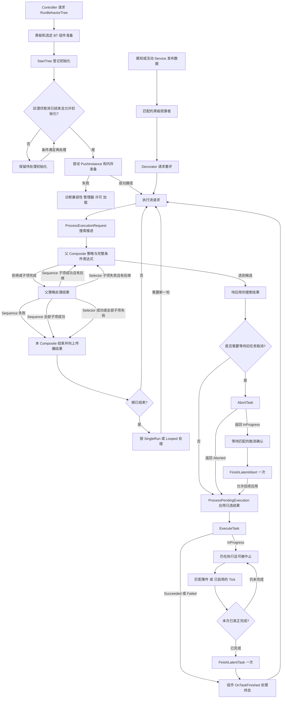

# UE 行为树执行机制：公开合同与历史源码片段对照

> 知识成熟度：L2。本文的主要承诺是把已核对的公开执行合同连成因果链，并对留存片段做有边界的静态阅读；不是已认证私有引擎的完整实现报告。
> 版本基准与证据范围：2026-10-05 实际访问的 Epic 公开文档/API，主要页面显示 UE 5.8；个别历史页另标版本。未访问旧文声称的 UE 5.8.0 安装目录或 5.8.2 checkout，未核 `Engine/Build/Build.version`、私有 revision、CL、行号或抽取过程。
> 本文 32 个 `cpp` 围栏是逐字保留的历史材料，来源身份均未认证。围栏外的“片段可见”只描述眼前文本；“公开合同”才指这次访问的原始资料。缺失的函数尾部不会由同名 API 自动补齐。
> UHT、UE 编译/链接、PIE、Debugger、真实移动/动画取消与重入、GC/线程及性能运行均 **NOT_RUN**；纸面轨迹不是测试日志。最后更新：2026-10-05。旧版本、机器和 2026-09-15 检索记录完整保留于文末历史区。

## 一、从一个守卫的问题进入执行引擎

一棵树让守卫平时巡逻，有目标则追击。两个 AI 可以共用资产，但不能共用“当前移动请求”；巡逻可能还没结束，目标事件已经来了；中止请求发出后，移动系统又可能晚到一个完成事件。读源码真正要追的是：谁拥有状态，谁提交执行意图，何时只是选出候选，何时才允许下一任务使用资源。

本篇沿 Controller/资产 → Component/运行实例 → 搜索与选中结果应用 → Task/Decorator/Service → 黑板观察 → 完成或取消展开，回答六个问题：

1. `AAIController::RunBehaviorTree` 怎样把请求交给运行组件，启动在哪些地方还会失败？
2. `Succeeded / Failed / Aborted / InProgress` 怎样影响父 Composite 的选择？
3. Task 的执行、可选 Tick、完成通知与取消分别承担什么责任？
4. 条件求值、观察注册、Self/LowerPriority 中止为何是三件事？
5. Service 的搜索入口和间隔工作怎样与 Task 推进区别开？
6. 写黑板怎样到达观察者，又为什么不能把所有通知都当成延迟队列？

[01-行为树详解](01-行为树详解.md)承担编辑器组装、C++ 候选与外部请求协议；[03-行为树通用原理](03-行为树通用原理.md)承担引擎无关模型。本篇不把通用逐帧递归解释成 UE 调度器，也不再提供另一套近似 UE 的实现。

### 1.1 三层材料的读法

| 层次 | 本文可以据此说明 | 仍然不能说明 |
|---|---|---|
| 当前公开文档/API | 指定接口的用途、返回合同、配置及数据角色 | 私有 5.8.2 函数体的逐字来源、完整内部调用顺序 |
| 留存代码片段 | 本块可见的条件、赋值、调用以及据此手算的路径 | 未见分支不存在、完整函数已覆盖、目标版本已编译 |
| 2026-09-15 历史作者记录 | 当时写下的环境、命令、行号、结果与修订声称 | 本次已复验；“0 命中”已经证明所有版本都不存在 |

原 L2 曾与“本机源码逐字核实”绑定，那一身份保证没有本次证据。现在 L2 的范围收敛为公开原始资料支持的执行/所有权合同及静态对照；32 个历史块依旧是未认证材料，不能据它们升级到 L3。当前文档也不是不可变 revision。

## 二、源码定位与阶段地图

以下相对路径是回源入口。32 块自己的历史来源行号各随块保留；表格不是“本次检查这些文件存在”的清单。

| 阶段 | 相对位置 | 要追的责任 |
|---|---|---|
| 控制器入口 | `Engine/Source/Runtime/AIModule/Private/AIController.cpp` | `RunBehaviorTree`、黑板准备、选定 BrainComponent |
| 运行组件 | `Engine/Source/Runtime/AIModule/Classes/BehaviorTree/BehaviorTreeComponent.h`、`Engine/Source/Runtime/AIModule/Private/BehaviorTree/BehaviorTreeComponent.cpp` | 启动/停止、执行请求、搜索、pending 结果应用、取消等待 |
| 模板与内存 | `Engine/Source/Runtime/AIModule/Classes/BehaviorTree/BTNode.h`、`Engine/Source/Runtime/AIModule/Classes/BehaviorTree/BehaviorTreeTypes.h` | 节点配置、每实例存储、节点对象实例、初始化/清理模式 |
| 子项选择 | `Engine/Source/Runtime/AIModule/Private/BehaviorTree/BTCompositeNode.cpp` | 候选策略、条件表达式、激活和失活通知 |
| 条件与事件 | `Engine/Source/Runtime/AIModule/Private/BehaviorTree/BTDecorator.cpp`、`Engine/Source/Runtime/AIModule/Private/BehaviorTree/Decorators/BTDecorator_BlackboardBase.cpp` | 计算条件、观察键、请求执行流变化 |
| 任务与服务 | `Engine/Source/Runtime/AIModule/Classes/BehaviorTree/BTTaskNode.h`、`Engine/Source/Runtime/AIModule/Private/BehaviorTree/BTService.cpp` | 工作完成/取消、间隔与搜索通知 |
| 数据与通知 | `Engine/Source/Runtime/AIModule/Classes/BehaviorTree/BlackboardData.h`、`Engine/Source/Runtime/AIModule/Private/BehaviorTree/BlackboardComponent.cpp` | 键定义、值访问、观察者派发 |

阅读时可以先看第四节的职责图，再沿第三节逐块核对。图只合并有依据的职责，不声称复原未展示的私有调用栈。

## 三、沿状态变化阅读保留片段

### 3.1 启动：准备条件与尝试建实例

#### 3.1.1 Controller 选择一个执行组件

[AAIController 公开 API](https://dev.epicgames.com/documentation/en-us/unreal-engine/API/Runtime/AIModule/AAIController)提供 `RunBehaviorTree` 与 `UseBlackboard`；组件自身也有公开 `StartTree`。因此前者是常见控制器入口，不能称唯一入口。

**历史片段 A2-B01：AAIController::RunBehaviorTree。** 文本形状：函数形片段，历史声称完整范围；只读可见文本，不认证私有版本来源。

历史来源声称（2026-09-15，未认证）：摘自 `Engine/Source/Runtime/AIModule/Private/AIController.cpp`（第 1001 行起）

```cpp
bool AAIController::RunBehaviorTree(UBehaviorTree* BTAsset)
{
	// @todo: find BrainComponent and see if it's BehaviorTreeComponent
	// Also check if BTAsset requires BlackBoardComponent, and if so
	// check if BB type is accepted by BTAsset.
	// Spawn BehaviorTreeComponent if none present.
	// Spawn BlackBoardComponent if none present, but fail if one is present but is not of compatible class
	if (BTAsset == NULL)
	{
		UE_VLOG(this, LogBehaviorTree, Warning, TEXT("RunBehaviorTree: Unable to run NULL behavior tree"));
		return false;
	}

	bool bSuccess = true;

	// see if need a blackboard component at all
	UBlackboardComponent* BlackboardComp = Blackboard;
	if (BTAsset->BlackboardAsset && (Blackboard == nullptr || Blackboard->IsCompatibleWith(BTAsset->BlackboardAsset) == false))
	{
		bSuccess = UseBlackboard(BTAsset->BlackboardAsset, BlackboardComp);
	}

	if (bSuccess)
	{
		UBehaviorTreeComponent* BTComp = Cast<UBehaviorTreeComponent>(BrainComponent);
		if (BTComp == NULL)
		{
			UE_VLOG(this, LogBehaviorTree, Log, TEXT("RunBehaviorTree: spawning BehaviorTreeComponent.."));

			BTComp = NewObject<UBehaviorTreeComponent>(this);
			BTComp->RegisterComponent();
			REDIRECT_OBJECT_TO_VLOG(BTComp, this);
		}

		// make sure BrainComponent points at the newly created BT component
		BrainComponent = BTComp;

		check(BTComp != NULL);
		BTComp->StartTree(*BTAsset, EBTExecutionMode::Looped);
	}

	return bSuccess;
}
```

**片段可见**：空资产立即返回 false。若资产要求黑板且现有组件不匹配，才调用 `UseBlackboard`；只有 `bSuccess` 仍真才尝试把 `BrainComponent` 转成 BT 组件，失败则创建并注册一个，再写回 `BrainComponent`，最后调用 `StartTree`。

这里复用的是这个成员指向的组件，不是枚举 Controller 上的所有组件；即使另挂一个 BT 组件，`Cast` 也不会自动发现它。`bSuccess` 初始为 true，只有所示黑板准备分支会修改它，因此不应把 true 解释成“首任务已开始”或“黑板必然创建过”。`StartTree` 无返回值，同根启动被忽略也不是从此处返回的失败。

**纸面检查**：`BTAsset=null` 不进入后续分支；资产无黑板要求时不调用 `UseBlackboard`；有要求且 `UseBlackboard=false` 时不调用 `StartTree`。后者为 true 则只说明进入了转交路径，下一阶段仍有自己的守卫。

#### 3.1.2 StartTree 登记请求，不检测一切递归

**历史片段 A2-B02：UBehaviorTreeComponent::StartTree。** 文本形状：函数形片段；只读可见文本，不认证私有版本来源。

历史来源声称（2026-09-15，未认证）：摘自 `Engine/Source/Runtime/AIModule/Private/BehaviorTree/BehaviorTreeComponent.cpp`（第 240 行起）

```cpp
void UBehaviorTreeComponent::StartTree(UBehaviorTree& Asset, EBTExecutionMode::Type ExecuteMode /*= EBTExecutionMode::Looped*/)
{
	// clear instance stack, start should always run new tree from root
	UBehaviorTree* CurrentRoot = GetRootTree();

	if (CurrentRoot == &Asset && TreeHasBeenStarted())
	{
		UE_VLOG(GetOwner(), LogBehaviorTree, Log, TEXT("Skipping behavior start request - it's already running"));
		return;
	}
	else if (CurrentRoot)
	{
		UE_VLOG(GetOwner(), LogBehaviorTree, Log, TEXT("Abandoning behavior %s to start new one (%s)"),
			*GetNameSafe(CurrentRoot), *Asset.GetName());
	}

	StopTree(EBTStopMode::Safe);

	TreeStartInfo.Asset = &Asset;
	TreeStartInfo.ExecuteMode = ExecuteMode;
	TreeStartInfo.bPendingInitialize = true;

	ProcessPendingInitialize();
}
```

**片段可见**：`GetRootTree()==&Asset && TreeHasBeenStarted()` 时直接返回。否则先调用 `StopTree(Safe)`，登记资产、执行模式与待初始化标志，再调用 `ProcessPendingInitialize`。这串写入解释了为什么“请求启动”与“初始化完成”需要分开观察。

令根为 A、活动子树为 B：调用 `StartTree(A)` 且已启动会命中本块去重；调用 `StartTree(B)` 不会仅因 B 活动就满足根比较。不能由此推出防止任意子树递归。子树许可还要看 `PushInstance` 与父节点合同。

公开[停止模式枚举](https://dev.epicgames.com/documentation/en-us/unreal-engine/API/Runtime/AIModule/EBTStopMode__Type)列出 Safe/Forced，但没有提供足以认证二者全部清理顺序的说明；本篇未保存 `StopTree` 完整实现。后块能看到等待潜伏取消的路径，不能将 Forced 教成“跳过所有 Abort 并直接丢弃资源”。

**历史片段 A2-B03：EBTExecutionMode。** 文本形状：枚举声明形片段；只读可见文本，不认证私有版本来源。

历史来源声称（2026-09-15，未认证）：摘自 `Engine/Source/Runtime/AIModule/Classes/BehaviorTree/BehaviorTreeTypes.h`（第 99 行起）

```cpp
namespace EBTExecutionMode
{
	enum Type
	{
		SingleRun,
		Looped,
	};
}
```

**片段可见**：枚举列出 `SingleRun` 与 `Looped`。公开 `StartTree` 使用这个模式参数；根结束后的具体循环/停止实现不在此块。枚举不能证明 StartTree 自 UE4 起从未变化，也不能给未知教程里的 `ExecuteTree` 建立等价替换关系。

#### 3.1.3 初始化先处理未结束的旧工作

**历史片段 A2-B04：ProcessPendingInitialize。** 文本形状：函数形片段；只读可见文本，不认证私有版本来源。

历史来源声称（2026-09-15，未认证）：摘自 `Engine/Source/Runtime/AIModule/Private/BehaviorTree/BehaviorTreeComponent.cpp`（第 265 行起）

```cpp
void UBehaviorTreeComponent::ProcessPendingInitialize()
{
	if ((SuspendedBranchActions & EBTBranchAction::ProcessPendingInitialize) != EBTBranchAction::None)
	{
		UE_VLOG(GetOwner(), LogBehaviorTree, Verbose, TEXT("ProcessPendingInitialize(%s) queued up"), *GetNameSafe(TreeStartInfo.Asset));
		PendingBranchActionRequests.Emplace(nullptr, EBTBranchAction::ProcessPendingInitialize);
		return;
	}

	StopTree(EBTStopMode::Safe);
	if (bWaitingForLatentAborts)
	{
		return;
	}

	// finish cleanup
	RemoveAllInstances();

	bLoopExecution = (TreeStartInfo.ExecuteMode == EBTExecutionMode::Looped);
	bIsRunning = true;

#if USE_BEHAVIORTREE_DEBUGGER
	DebuggerSteps.Reset();
#endif

	UBehaviorTreeManager* BTManager = UBehaviorTreeManager::GetCurrent(GetWorld());
	if (BTManager)
	{
		BTManager->AddActiveComponent(*this);
	}

	// push new instance
	const bool bPushed = PushInstance(*TreeStartInfo.Asset);
	TreeStartInfo.bPendingInitialize = false;
}
```

**片段可见**：第一道守卫检查挂起动作位，排入 `PendingBranchActionRequests` 后返回；第二道相关守卫是在 `StopTree(Safe)` 后检查 `bWaitingForLatentAborts`。只有越过它，才 `RemoveAllInstances`、设置循环/运行标志、尝试登记 manager、在函数内部调用 `PushInstance`，随后清待初始化标志。

这不是“首次与重入”二选一判定。设置 `bIsRunning=true` 发生在 `PushInstance` 之前，且此块没有使用 `bPushed`；因此不能用标志赋值证明初始化成功，也不能编造“失败后必空转”的后续行为。manager 为空的原因未在块中说明，不能一概归于 World 已销毁。位掩码与队列体现执行流重入控制，不是跨线程互斥锁。

#### 3.1.4 PushInstance：失败门槛、存储、根服务与执行请求

**历史片段 A2-B05：PushInstance。** 文本形状：93内容行函数形片段，原 prose错称43行；只读可见文本，不认证私有版本来源。

历史来源声称（2026-09-15，未认证）：摘自 `Engine/Source/Runtime/AIModule/Private/BehaviorTree/BehaviorTreeComponent.cpp`（第 2707 行起）

```cpp
bool UBehaviorTreeComponent::PushInstance(UBehaviorTree& TreeAsset)
{
	// check if blackboard class match
	if (TreeAsset.BlackboardAsset && BlackboardComp && !BlackboardComp->IsCompatibleWith(TreeAsset.BlackboardAsset))
	{
		UE_VLOG(GetOwner(), LogBehaviorTree, Warning, TEXT("Failed to execute tree %s: blackboard %s is not compatibile with current: %s!"),
			*TreeAsset.GetName(), *GetNameSafe(TreeAsset.BlackboardAsset), *GetNameSafe(BlackboardComp->GetBlackboardAsset()));

		return false;
	}

	UBehaviorTreeManager* BTManager = UBehaviorTreeManager::GetCurrent(GetWorld());
	if (BTManager == NULL)
	{
		UE_VLOG(GetOwner(), LogBehaviorTree, Warning, TEXT("Failed to execute tree %s: behavior tree manager not found!"), *TreeAsset.GetName());
		return false;
	}

	// check if parent node allows it
	const UBTNode* ActiveNode = GetActiveNode();
	const UBTCompositeNode* ActiveParent = ActiveNode ? ActiveNode->GetParentNode() : NULL;
	if (ActiveParent)
	{
		uint8* ParentMemory = GetNodeMemory((UBTNode*)ActiveParent, InstanceStack.Num() - 1);
		int32 ChildIdx = ActiveNode ? ActiveParent->GetChildIndex(*ActiveNode) : INDEX_NONE;

		const bool bIsAllowed = ActiveParent->CanPushSubtree(*this, ParentMemory, ChildIdx);
		if (!bIsAllowed)
		{
			UE_VLOG(GetOwner(), LogBehaviorTree, Warning, TEXT("Failed to execute tree %s: parent of active node does not allow it! (%s)"),
				*TreeAsset.GetName(), *UBehaviorTreeTypes::DescribeNodeHelper(ActiveParent));
			return false;
		}
	}

	UBTCompositeNode* RootNode = NULL;
	uint16 InstanceMemorySize = 0;

	const bool bLoaded = BTManager->LoadTree(TreeAsset, RootNode, InstanceMemorySize);
	if (bLoaded)
	{
		FBehaviorTreeInstance& NewInstance = InstanceStack.AddDefaulted_GetRef();
		NewInstance.InstanceIdIndex = UpdateInstanceId(&TreeAsset, ActiveNode, InstanceStack.Num() - 1);
		NewInstance.RootNode = RootNode;
		NewInstance.ActiveNode = NULL;
		NewInstance.ActiveNodeType = EBTActiveNode::Composite;

		// initialize memory and node instances
		FBehaviorTreeInstanceId& InstanceInfo = KnownInstances[NewInstance.InstanceIdIndex];
		int32 NodeInstanceIndex = InstanceInfo.FirstNodeInstance;
		const bool bFirstTime = (InstanceInfo.InstanceMemory.Num() != InstanceMemorySize);
		if (bFirstTime)
		{
			InstanceInfo.InstanceMemory.AddZeroed(InstanceMemorySize);
			InstanceInfo.RootNode = RootNode;
		}

		NewInstance.SetInstanceMemory(InstanceInfo.InstanceMemory);
		NewInstance.Initialize(*this, *RootNode, NodeInstanceIndex, bFirstTime ? EBTMemoryInit::Initialize : EBTMemoryInit::RestoreSubtree);


		const int32 InstanceIndex = InstanceStack.Num() - 1;
		ActiveInstanceIdx = IntCastChecked<uint16>(InstanceIndex);

		// start root level services now (they won't be removed on looping tree anyway)
		for (int32 ServiceIndex = 0; ServiceIndex < RootNode->Services.Num(); ServiceIndex++)
		{
			UBTService* ServiceNode = RootNode->Services[ServiceIndex];
			uint8* NodeMemory = (uint8*)ServiceNode->GetNodeMemory<uint8>(InstanceStack[ActiveInstanceIdx]);

			// send initial on search start events in case someone is using them for init logic
			ServiceNode->NotifyParentActivation(SearchData);

			InstanceStack[ActiveInstanceIdx].AddToActiveAuxNodes(*this,ServiceNode);
			ServiceNode->WrappedOnBecomeRelevant(*this, NodeMemory);
		}

		FBehaviorTreeDelegates::OnTreeStarted.Broadcast(*this, TreeAsset);

		if ((SuspendedBranchActions & EBTBranchAction::SubTreeEvaluate) != EBTBranchAction::None)
		{
			UE_VLOG(GetOwner(), LogBehaviorTree, Verbose, TEXT("Evaluate sub tree(%s) root(%s) queued up"), *TreeAsset.GetName(), *UBehaviorTreeTypes::DescribeNodeHelper(RootNode));
			PendingBranchActionRequests.Emplace(RootNode, EBTBranchAction::SubTreeEvaluate);
			return true;
		}

		// start new task
		RequestExecution(RootNode, ActiveInstanceIdx, RootNode, 0, EBTNodeResult::InProgress);
		return true;
	}

	return false;
}
```

这个保留块有 93 行内容，文本上呈现从函数头到闭合的形状；旧解说的“43 行”不正确，函数形完整仍不等于来源已认证。

**按可见路径追踪**：

1. 黑板不兼容、manager 缺失、已有活动父节点拒绝子树，各自提前返回 false。这些路径含日志/调用，不能笼统称完全无副作用；也不能由 `CanPushSubtree` 的名字猜某个内置 Task 必被拒绝。
2. `LoadTree` 返回 false 时不进入新增运行实例分支。公开 [Manager](https://dev.epicgames.com/documentation/en-us/unreal-engine/API/Runtime/AIModule/UBehaviorTreeManager)说明它获取模板，并另列节点内存排序/对齐辅助。不能把大小说成 C++ 编译期简单相加。
3. 加入 `InstanceStack` 后关联 `KnownInstances`，按现有内存长度与本次大小的比较选择 Initialize/RestoreSubtree。这个条件只证明本块的选择依据，不能充作所有历史激活的身份判断，更不是游戏存档协议。
4. `SetInstanceMemory` 后调用 `Initialize`，再设置活动实例下标。未见 `SetInstanceMemory` 函数体，不能断言运行内存和持久副本共享同一块字节。
5. 根 Composite 的服务逐一收到父激活通知、加入活动辅助节点并收到相关性回调；随后广播 `OnTreeStarted`。原注释谈 looping tree，不能扩为服务永不移除或这个广播是所有场景的唯一通知。
6. 若子树评估动作挂起，加入请求队列并返回 true；否则调用 `RequestExecution` 并返回 true。块中没有直接调用 Task 执行入口，但被调用函数的后续/调度未完整给出，不能保证首任务一定在下一帧才执行。

**启动失败的纸面轨迹**：假设 B04 已设运行标志，B05 却因缺 manager 返回 false，本块不会建立新实例、启动根服务或提出末尾执行请求。反之 `LoadTree=true` 且许可通过，则出现实例、内存准备和一次队列/执行请求。诊断应记录这些阶段，不能只检查入口 bool 或某一个运行标志。

### 3.2 资产、运行实例与节点内存是不同身份

**历史片段 A2-B06：FBehaviorTreeInstance。** 文本形状：结构体成员片段，未含结构体闭合；只读可见文本，不认证私有版本来源。

历史来源声称（2026-09-15，未认证）：摘自 `Engine/Source/Runtime/AIModule/Classes/BehaviorTree/BehaviorTreeTypes.h`（第 319 行起）

```cpp
struct FBehaviorTreeInstance
{
	/** root node in template */
	TObjectPtr<UBTCompositeNode> RootNode;

	/** active node in template */
	TObjectPtr<UBTNode> ActiveNode;

	/** active auxiliary nodes */
	TArray<TObjectPtr<UBTAuxiliaryNode>> ActiveAuxNodes;

	/** active parallel tasks */
	TArray<FBehaviorTreeParallelTask> ParallelTasks;

	/** memory: instance */
	TArray<uint8> InstanceMemory;

	/** index of identifier (BehaviorTreeComponent.KnownInstances) */
	uint8 InstanceIdIndex;

	/** active node type */
	TEnumAsByte<EBTActiveNode::Type> ActiveNodeType;

	/** delegate sending a notify when tree instance is removed from active stack */
	FBTInstanceDeactivation DeactivationNotify;
```

**片段可见**：这只是结构体成员前缀，缺结构体闭合。`RootNode/ActiveNode`、辅助节点、`ParallelTasks`、`InstanceMemory` 与标识下标分别存在。公开 [FBehaviorTreeInstance](https://dev.epicgames.com/documentation/en-us/unreal-engine/API/Runtime/AIModule/FBehaviorTreeInstance)也分别列出这些角色；不能仅盯着 `ActiveNode` 就断言所有任务只能是一条活动叶。

共享树资产/节点配置、每个组件的运行实例、节点专用字节内存、显式实例化 UObject 是四层。默认非实例化节点不能把某个 AI 的可变进度写到共享成员；显式 `bCreateNodeInstance=true` 可以存本实例成员，`UBTTask_BlueprintBase` 就采用实例化。黑板适合决策输入，并不因此成为所有任务资源的拥有者。[官方实例化策略](https://dev.epicgames.com/documentation/en-us/unreal-engine/behavior-tree-node-reference-in-unreal-engine)

**历史片段 A2-B07：UBTNode::GetNodeMemory overloads。** 文本形状：头尾裁切片段，开头含上段的}且末函数缺闭合；只读可见文本，不认证私有版本来源。

历史来源声称（2026-09-15，未认证）：摘自 `Engine/Source/Runtime/AIModule/Classes/BehaviorTree/BTNode.h`（第 350 行起）

```cpp
}

template<typename T>
T* UBTNode::GetNodeMemory(FBehaviorTreeSearchData& SearchData) const
{
	return GetNodeMemory<T>(SearchData.OwnerComp.InstanceStack[SearchData.OwnerComp.GetActiveInstanceIdx()]);
}

template<typename T>
const T* UBTNode::GetNodeMemory(const FBehaviorTreeSearchData& SearchData) const
{
	return GetNodeMemory<T>(SearchData.OwnerComp.InstanceStack[SearchData.OwnerComp.GetActiveInstanceIdx()]);
}

template<typename T>
T* UBTNode::GetNodeMemory(FBehaviorTreeInstance& BTInstance) const
{
	return (T*)(BTInstance.GetInstanceMemory().GetData() + MemoryOffset);
}

template<typename T>
const T* UBTNode::GetNodeMemory(const FBehaviorTreeInstance& BTInstance) const
{
	return (const T*)(BTInstance.GetInstanceMemory().GetData() + MemoryOffset);
```

**片段可见**：开头含前一段的右括号，末尾函数未闭合，不能当完整可编译例。给定某个 `FBehaviorTreeInstance` 时，重载使用其内存起始地址加 `MemoryOffset`；SearchData 重载则先选择活动实例。这解释同一个模板偏移如何作用于不同实例的存储，但没有证明偏移的完整计算、对齐及对象构造规则。

若 A/B 共享模板且 `MemoryOffset` 相同，A 的进度仍应写入 A 实例那块存储，B 写 B 的。若改写共享节点成员 `Remaining`，A 写 2、B 写 5 后 A 再读就是同一字段；加 `UPROPERTY` 不改变共享身份。

**历史片段 A2-B08：UBehaviorTreeComponent protected fields。** 文本形状：类内部成员片段；只读可见文本，不认证私有版本来源。

历史来源声称（2026-09-15，未认证）：摘自 `Engine/Source/Runtime/AIModule/Classes/BehaviorTree/BehaviorTreeComponent.h`（第 306 行起）

```cpp
protected:
	/** stack of behavior tree instances */
	TArray<FBehaviorTreeInstance> InstanceStack;

	/** list of known subtree instances */
	TArray<FBehaviorTreeInstanceId> KnownInstances;

	/** instanced nodes */
	UPROPERTY(transient)
	TArray<TObjectPtr<UBTNode>> NodeInstances;

	/** search data being currently used */
	FBehaviorTreeSearchData SearchData;

	/** execution request, search will be performed when current task finish execution/aborting */
	FBTNodeExecutionInfo ExecutionRequest;

	/** result of ExecutionRequest, will be applied when current task finish aborting */
	FBTPendingExecutionInfo PendingExecution;
```

**片段可见**：组件把实例栈、已知子树实例、节点对象实例、搜索数据、请求与待应用结果放在不同成员里。`KnownInstances` 的角色不能缩成仅调试；公开组件还列出运行内存与持久内存之间的双向拷贝及回滚职责。实际容器别名/复制细节没有由这份声明证明。

一个有界推导是：若搜索前运行值 R=1、快照 P=1，试探时 R=2，回滚要能恢复 R=1；仅说二者永远是同一份可变字节不能解释独立快照。这里区分的是保存/恢复责任，不认证某个私有分配策略。`ExecutionRequest` 表达要搜索什么，`PendingExecution` 表达上次搜索已经选出的结果，二者还会在 3.6.3 再对照。

### 3.3 初始化、恢复与每次激活不能混为一谈

**历史片段 A2-B09：UBTNode初始化/内存声明。** 文本形状：声明节选；只读可见文本，不认证私有版本来源。

历史来源声称（2026-09-15，未认证）：摘自 `Engine/Source/Runtime/AIModule/Classes/BehaviorTree/BTNode.h`（第 53 行起）

```cpp
	/** fill in data about tree structure */
	AIMODULE_API void InitializeNode(UBTCompositeNode* InParentNode, uint16 InExecutionIndex, uint16 InMemoryOffset, uint8 InTreeDepth);

	/** initialize any asset related data */
	AIMODULE_API virtual void InitializeFromAsset(UBehaviorTree& Asset);

	/** initialize memory block. InitializeNodeMemory template function is provided to help initialize the memory. */
	AIMODULE_API virtual void InitializeMemory(UBehaviorTreeComponent& OwnerComp, uint8* NodeMemory, EBTMemoryInit::Type InitType) const;

	/** cleanup memory block. CleanupNodeMemory template function is provided to help cleanup the memory. */
	AIMODULE_API virtual void CleanupMemory(UBehaviorTreeComponent& OwnerComp, uint8* NodeMemory, EBTMemoryClear::Type CleanupType) const;

	/** gathers description of all runtime parameters */
	AIMODULE_API virtual void DescribeRuntimeValues(const UBehaviorTreeComponent& OwnerComp, uint8* NodeMemory, EBTDescriptionVerbosity::Type Verbosity, TArray<FString>& Values) const;

	/** size of instance memory */
	AIMODULE_API virtual uint16 GetInstanceMemorySize() const;
```

**片段可见**：`InitializeNode` 接结构索引/偏移，`InitializeFromAsset` 面向资产，`InitializeMemory/CleanupMemory` 带各自模式，`GetInstanceMemorySize` 只报告普通节点内存需求。公开 [UBTNode](https://dev.epicgames.com/documentation/en-us/unreal-engine/API/Runtime/AIModule/UBTNode)还区分 special memory、子树初始化与节点实例创建/销毁；这些接口职责不证明每一个回调发生于某次 Execute 的精确位置。

| 层次 | 应保存的不变量 | 不能偷换成 |
|---|---|---|
| 结构/资产初始化 | 配置、键选择、索引与偏移属于相应资产/布局 | 每次执行都重新构造整棵树 |
| 原始内存 Initialize / RestoreSubtree | 初次建立 C++ 对象寿命与恢复已有状态要分开 | 恢复时无条件重复 placement-new |
| Cleanup 的 StoreSubtree / Destroy | 保存退出与真正销毁需要不同处理 | 一次 Task 成功就析构全部 NodeMemory |
| 节点对象实例 | 隔离某个运行者的成员状态 | 每次激活都有一个新 UObject |
| 每次激活 | 重置本次请求状态、配对正常完成/取消 | 对象还有效就允许旧回调完成新一轮 |

NodeMemory 不在 UObject 反射/GC 扫描范围内。里面写一个指针，甚至模仿 `UPROPERTY` 声明形式，都不会自动保活对象。弱引用可用于观察身份但不保活；确需强持有时需引擎能识别的拥有路径。原始内存非平凡成员还需匹配构造/清理模式，详见 [01 的状态与生命周期合同](01-行为树详解.md)。

**历史片段 A2-B10：UBTDecorator lifecycle declarations。** 文本形状：声明节选；只读可见文本，不认证私有版本来源。

历史来源声称（2026-09-15，未认证）：摘自 `Engine/Source/Runtime/AIModule/Classes/BehaviorTree/BTDecorator.h`（第 102 行起）

```cpp
	/** called when underlying node is activated
	 * this function should be considered as const (don't modify state of object) if node is not instanced!
	 * bNotifyActivation must be set to true for this function to be called
	 * Calling INIT_DECORATOR_NODE_NOTIFY_FLAGS in the constructor of the decorator will set this flag automatically */
	AIMODULE_API virtual void OnNodeActivation(FBehaviorTreeSearchData& SearchData);

	/** called when underlying node has finished
	 * this function should be considered as const (don't modify state of object) if node is not instanced!
	 * bNotifyDeactivation must be set to true for this function to be called
	 * Calling INIT_DECORATOR_NODE_NOTIFY_FLAGS in the constructor of the decorator will set this flag automatically */
	AIMODULE_API virtual void OnNodeDeactivation(FBehaviorTreeSearchData& SearchData, EBTNodeResult::Type NodeResult);

	/** called when underlying node was processed (deactivated or failed to activate)
	 * this function should be considered as const (don't modify state of object) if node is not instanced!
	 * bNotifyProcessed must be set to true for this function to be called
	 * Calling INIT_DECORATOR_NODE_NOTIFY_FLAGS in the constructor of the decorator will set this flag automatically */
	AIMODULE_API virtual void OnNodeProcessed(FBehaviorTreeSearchData& SearchData, EBTNodeResult::Type& NodeResult);
```

**片段可见**：三个 Decorator 通知分别受 `bNotifyActivation`、`bNotifyDeactivation`、`bNotifyProcessed` 控制；Processed 的结果参数是引用。这些是执行流通知，不等于辅助节点 `OnBecomeRelevant/OnCeaseRelevant` 的观察注册。不能因方法都含 Activation 就把全部服务、观察者合并成一个启停点。

当前公开类分别提供 Task、Composite、Decorator、Auxiliary 的接口；本文不以“UE4 有统一 ExecuteNode，UE5 才拆开”的未核历史来解释这种职责分工。旧说法与当时未核声明保留在历史区，升级代码应查真正的前后版本。

### 3.4 Task：一次自然执行与一次取消的不同出口

#### 3.4.1 同步返回、事件完成和可选 Tick

**历史片段 A2-B11：UBTTaskNode declarations。** 文本形状：拼接声明片段，历史省略84–119共36行标记原样保留；只读可见文本，不认证私有版本来源。

历史来源声称（2026-09-15，未认证）：摘自 `Engine/Source/Runtime/AIModule/Classes/BehaviorTree/BTTaskNode.h`（第 37 行起）

```cpp
	/** starts this task, should return Succeeded, Failed or InProgress
	 *  (use FinishLatentTask() when returning InProgress)
	 * this function should be considered as const (don't modify state of object) if node is not instanced! */
	AIMODULE_API virtual EBTNodeResult::Type ExecuteTask(UBehaviorTreeComponent& OwnerComp, uint8* NodeMemory);

	AIMODULE_API virtual uint16 GetSpecialMemorySize() const override;

protected:
	/** aborts this task, should return Aborted or InProgress
	 *  (use FinishLatentAbort() when returning InProgress)
	 * this function should be considered as const (don't modify state of object) if node is not instanced! */
	AIMODULE_API virtual EBTNodeResult::Type AbortTask(UBehaviorTreeComponent& OwnerComp, uint8* NodeMemory);

	/** sets next tick time */
	AIMODULE_API void SetNextTickTime(uint8* NodeMemory, float RemainingTime) const;

public:
#if WITH_EDITOR
	AIMODULE_API virtual FName GetNodeIconName() const override;
#endif // WITH_EDITOR
	AIMODULE_API virtual void OnGameplayTaskDeactivated(UGameplayTask& Task) override;

	/** message observer's hook */
	AIMODULE_API void ReceivedMessage(UBrainComponent* BrainComp, const FAIMessage& Message);

	/** wrapper for node instancing: ExecuteTask */
	AIMODULE_API EBTNodeResult::Type WrappedExecuteTask(UBehaviorTreeComponent& OwnerComp, uint8* NodeMemory) const;

	/** wrapper for node instancing: AbortTask */
	AIMODULE_API EBTNodeResult::Type WrappedAbortTask(UBehaviorTreeComponent& OwnerComp, uint8* NodeMemory) const;

	/** wrapper for node instancing: TickTask
	  * @param OwnerComp	The behavior tree owner of this node
	  * @param NodeMemory	The instance memory of the current node
	  * @param DeltaSeconds		DeltaTime since last call
	  * @param NextNeededDeltaTime		In out parameter, if this node needs a smaller DeltaTime it is the node's responsibility to change it
	  * @returns	True if it actually done some processing or false if it was skipped because of not ticking or in between time interval */
	AIMODULE_API bool WrappedTickTask(UBehaviorTreeComponent& OwnerComp, uint8* NodeMemory, float DeltaSeconds, float& NextNeededDeltaTime) const;

	/** wrapper for node instancing: OnTaskFinished */
	AIMODULE_API void WrappedOnTaskFinished(UBehaviorTreeComponent& OwnerComp, uint8* NodeMemory, EBTNodeResult::Type TaskResult) const;

	/** helper function: finish latent executing */
	AIMODULE_API void FinishLatentTask(UBehaviorTreeComponent& OwnerComp, EBTNodeResult::Type TaskResult) const;

	/** helper function: finishes latent aborting */
	AIMODULE_API void FinishLatentAbort(UBehaviorTreeComponent& OwnerComp) const;
// …（节选：省略第 84~119 行，共 36 行）
	/** register message observer */
	AIMODULE_API void WaitForMessage(UBehaviorTreeComponent& OwnerComp, FName MessageType) const;
	AIMODULE_API void WaitForMessage(UBehaviorTreeComponent& OwnerComp, FName MessageType, int32 RequestID) const;

	/** unregister message observers */
	AIMODULE_API void StopWaitingForMessages(UBehaviorTreeComponent& OwnerComp) const;
```

**片段可见**：这是一份拼接声明，原省略第 84–119 行的注记保持原样。`ExecuteTask` 注释列成功/失败/未完成，`AbortTask` 列已取消/取消未完成；消息订阅与停止订阅另有入口。`Wrapped*` 声明处理节点实例分派，不能仅由名称补写其完整函数体。

**历史片段 A2-B12：EBTNodeResult。** 文本形状：枚举形片段；只读可见文本，不认证私有版本来源。

历史来源声称（2026-09-15，未认证）：摘自 `Engine/Source/Runtime/AIModule/Classes/BehaviorTree/BehaviorTreeTypes.h`（第 82 行起）

```cpp
UENUM(BlueprintType)
namespace EBTNodeResult
{
	// keep in sync with DescribeNodeResult()
	enum Type : int
	{
		// finished as success
		Succeeded,
		// finished as failure
		Failed,
		// finished aborting = failure
		Aborted,
		// not finished yet
		InProgress,
	};
}
```

**片段可见**：四种结果中 `InProgress` 表示尚未终结。`Aborted` 注释中的 failure 不把取消过程变成普通业务失败，也不意味着每次取消都必须潜伏。

[Task 公开合同](https://dev.epicgames.com/documentation/en-us/unreal-engine/API/Runtime/AIModule/UBTTaskNode)支持以下互斥路径：

| 入口/阶段 | 合法结果与后续责任 |
|---|---|
| Execute 同步完成 | 返回 Succeeded 或 Failed；不再 latent 完成一次 |
| Execute 返回 InProgress | 等有效事件，或由启用的 Tick 推进，正常结束时 `FinishLatentTask` 一次 |
| Abort 同步清理完毕 | 返回 Aborted；不再调用 `FinishLatentAbort` |
| Abort 尚待取消确认 | 返回 InProgress；确认安全停止后 `FinishLatentAbort` 一次 |
| Task 的完成通知 | 需要 `bNotifyTaskFinished`；做幂等收尾，不能再报告第二个终态 |

`TickTask` 需要 `bNotifyTick` 及调度条件；通知宏是设置标志的辅助，不是唯一合法设置法，也不代表“零成本”。块中还有 `SetNextTickTime` 与 wrapper 的下一次调度参数，不能将潜伏等同每帧 Tick。无 Tick 的事件等待任务完全可以结束，也可被观察驱动的取消打断。

`WaitForMessage/OnMessage` 是一种事件完成接口。当前 [MoveTo API](https://dev.epicgames.com/documentation/en-us/unreal-engine/API/Runtime/AIModule/UBTTask_MoveTo)同时出现 `OnMessage`、`OnGameplayTaskDeactivated`、`PrepareMoveTask`；本次未读它的目标版本 cpp，不能把所有 MoveTo 完成认证为同一 FAIMessage 路径。

#### 3.4.2 OnTaskFinished 处理当前结果，不封锁所有重选来源

**历史片段 A2-B13：OnTaskFinished。** 文本形状：67内容行函数形片段；只读可见文本，不认证私有版本来源。

历史来源声称（2026-09-15，未认证）：摘自 `Engine/Source/Runtime/AIModule/Private/BehaviorTree/BehaviorTreeComponent.cpp`（第 517 行起）

```cpp
void UBehaviorTreeComponent::OnTaskFinished(const UBTTaskNode* TaskNode, EBTNodeResult::Type TaskResult)
{
	if (TaskNode == NULL || InstanceStack.Num() == 0 || !IsValidChecked(this))
	{
		return;
	}

	UE_VLOG(GetOwner(), LogBehaviorTree, Log, TEXT("Task %s finished: %s"),
		*UBehaviorTreeTypes::DescribeNodeHelper(TaskNode), *UBehaviorTreeTypes::DescribeNodeResult(TaskResult));

	// notify parent node
	UBTCompositeNode* ParentNode = TaskNode->GetParentNode();
	const int32 TaskInstanceIdx = FindInstanceContainingNode(TaskNode);
	if (!InstanceStack.IsValidIndex(TaskInstanceIdx))
	{
		return;
	}

	uint8* ParentMemory = ParentNode->GetNodeMemory<uint8>(InstanceStack[TaskInstanceIdx]);

	ParentNode->ConditionalNotifyChildExecution(*this, ParentMemory, *TaskNode, TaskResult);

	if (TaskResult != EBTNodeResult::InProgress)
	{
		StoreDebuggerSearchStep(TaskNode, IntCastChecked<uint16>(TaskInstanceIdx), TaskResult);

		// cleanup task observers
		UnregisterMessageObserversFrom(TaskNode);

		// notify task about it
		uint8* TaskMemory = TaskNode->GetNodeMemory<uint8>(InstanceStack[TaskInstanceIdx]);
		TaskNode->WrappedOnTaskFinished(*this, TaskMemory, TaskResult);

		// update execution when active task is finished
		if (InstanceStack.IsValidIndex(ActiveInstanceIdx) && InstanceStack[ActiveInstanceIdx].ActiveNode == TaskNode)
		{
			FBehaviorTreeInstance& ActiveInstance = InstanceStack[ActiveInstanceIdx];
			const bool bWasAborting = (ActiveInstance.ActiveNodeType == EBTActiveNode::AbortingTask);
			ActiveInstance.ActiveNodeType = EBTActiveNode::InactiveTask;

			// request execution from parent
			if (!bWasAborting)
			{
				RequestExecution(TaskResult);
			}
			// schedule an update to process a pending execution when task is done aborting
			else if (PendingExecution.IsSet())
			{
				ScheduleExecutionUpdate();
			}
		}
		else if (TaskResult == EBTNodeResult::Aborted && InstanceStack.IsValidIndex(TaskInstanceIdx) && InstanceStack[TaskInstanceIdx].ActiveNode == TaskNode)
		{
			// active instance may be already changed when getting back from AbortCurrentTask
			// (e.g. new task is higher on stack)

			InstanceStack[TaskInstanceIdx].ActiveNodeType = EBTActiveNode::InactiveTask;
		}
	}

	TrackNewLatentAborts();

	if (TreeStartInfo.HasPendingInitialize())
	{
		ProcessPendingInitialize();
	}
}
```

本块有 67 行内容、完整函数形。**逐分支阅读**：

1. 空任务、空实例栈或对象状态检查不通过就返回；之后还检查任务所在实例下标。`IsValidChecked(this)` 是一个守卫，不能当作任意 GC 阶段/线程安全或未来存活保证。可读的 [IsValidChecked 历史 API](https://dev.epicgames.com/documentation/unreal-engine/API/Runtime/CoreUObject/UObject/IsValidChecked?application_version=5.5)明确是 UE 5.5，仅支持有限状态检查说明，不认证本历史块。
2. 父 Composite 收到 `TaskResult` 引用，可能影响结果。3.5.4 的失活通知也展示了结果处理机会，所以这里不是全引擎唯一改写点，不能把 ForceSuccess 精确塞进一个未经核对的调用点。
3. 若最终 `TaskResult != InProgress`，块内注销该任务的消息观察者、调用完成包装器，并在匹配当前活动节点时改变节点状态。若此前不是 AbortingTask，请求下一次执行流更新；若此前正在取消且有 pending 结果，则调度其后续更新。
4. 若原任务所属实例与当前活动实例不同，另一条 Aborted 分支只改匹配的原实例。最后的 `TrackNewLatentAborts` 与待初始化处理位于结果条件之外，不能说 InProgress 一返回就连这些尾部也都不跑。

这个函数某一分支没有提交新请求，并不阻止 Decorator 从别处提出重选；自然 InProgress 不是“禁止搜索”。组件处理完成事件也不同于 Task 自己的 `OnTaskFinished` 虚函数，后者仍受通知标志约束。

**资源边界**：块内注销的是框架消息观察者，不能替项目解除所有 Timer、外部委托、导航或动画请求。[Blueprint Task 说明](https://dev.epicgames.com/documentation/en-us/unreal-engine/API/Runtime/AIModule/UBTTask_BlueprintBase)也特别区分 latent action 清理与外部事件。取消确认前仍被操作使用的存储不能提前释放；对象还有效但已退出玩法/换激活，也不能接纳旧完成。第四节用同一守卫给出具体晚到轨迹。

### 3.5 搜索候选：父策略、条件表达式与通知

#### 3.5.1 子链接保存条件，Composite 决定尝试策略

**历史片段 A2-B14：FBTCompositeChild。** 文本形状：结构体形片段；只读可见文本，不认证私有版本来源。

历史来源声称（2026-09-15，未认证）：摘自 `Engine/Source/Runtime/AIModule/Classes/BehaviorTree/BTCompositeNode.h`（第 65 行起）

```cpp
USTRUCT(BlueprintType)
struct FBTCompositeChild
{
	GENERATED_USTRUCT_BODY()

	/** child node */
	UPROPERTY(BlueprintReadOnly, Category = BehaviorTree)
	TObjectPtr<UBTCompositeNode> ChildComposite = nullptr;

	UPROPERTY(BlueprintReadOnly, Category = BehaviorTree)
	TObjectPtr<UBTTaskNode> ChildTask = nullptr;

	/** execution decorators */
	UPROPERTY(BlueprintReadOnly, Category = BehaviorTree)
	TArray<TObjectPtr<UBTDecorator>> Decorators;

	/** logic operations for decorators */
	UPROPERTY(BlueprintReadOnly, Category = BehaviorTree)
	TArray<FBTDecoratorLogic> DecoratorOps;
};
```

**片段可见**：一个子项区分 ChildComposite 与 ChildTask，还带 Decorators 和 DecoratorOps。前者提供条件节点集合，后者描述如何组合条件。字段存在于这个留存声明，不证明旧文所述其他模块写入行号已复验，也不包含跨 UE4/UE5 更名史。

追击与巡逻放在 Selector 的相邻子链接上，是“先尝试谁”的问题；追击链接上 `HasTarget` 与 `WithinRange` 怎样组合，是另一个问题。把这两层混起来，就容易将任何条件失败都画成继续下一个动作。

#### 3.5.2 请求描述要从哪里继续，不是立即执行新任务

**历史片段 A2-B15：FBTNodeExecutionInfo。** 文本形状：结构体形片段；只读可见文本，不认证私有版本来源。

历史来源声称（2026-09-15，未认证）：摘自 `Engine/Source/Runtime/AIModule/Classes/BehaviorTree/BehaviorTreeComponent.h`（第 25 行起）

```cpp
struct FBTNodeExecutionInfo
{
	/** index of first task allowed to be executed */
	FBTNodeIndex SearchStart;

	/** index of last task allowed to be executed */
	FBTNodeIndex SearchEnd;

	/** node to be executed */
	TObjectPtr<const UBTCompositeNode> ExecuteNode;

	/** subtree index */
	uint16 ExecuteInstanceIdx;

	/** result used for resuming execution */
	TEnumAsByte<EBTNodeResult::Type> ContinueWithResult;

	/** if set, tree will try to execute next child of composite instead of forcing branch containing SearchStart */
	uint8 bTryNextChild : 1;

	/** if set, request was not instigated by finishing task/initialization but is a restart (e.g. decorator) */
	uint8 bIsRestart : 1;

	FBTNodeExecutionInfo() : ExecuteNode(NULL), bTryNextChild(false), bIsRestart(false) { }
};
```

**片段可见**：请求保存起止索引、请求执行的 Composite、实例下标与继续结果；`bTryNextChild` 表达是按父策略继续候选还是朝包含 SearchStart 的分支重选，`bIsRestart` 表达另一维度的重启来源。构造函数明确将两者设为 false，不能把某类请求惯常填值写成字段“默认 true”。

当前 [Component API](https://dev.epicgames.com/documentation/en-us/unreal-engine/API/Runtime/AIModule/UBehaviorTreeComponent)把执行流请求、搜索后的结果应用和取消状态分开。为了读懂后续片段，可把它们看成“请求描述 → 搜索候选 → pending 结果 → 满足取消等条件后应用”。这是职责关系；不承诺每次都新建独立请求、不合并请求，或精确到同帧/下一帧的私有顺序。

#### 3.5.3 FindChildToExecute：失败要交给具体父策略

**历史片段 A2-B16：FindChildToExecute。** 文本形状：34内容行函数形片段；只读可见文本，不认证私有版本来源。

历史来源声称（2026-09-15，未认证）：摘自 `Engine/Source/Runtime/AIModule/Private/BehaviorTree/BTCompositeNode.cpp`（第 35 行起）

```cpp
int32 UBTCompositeNode::FindChildToExecute(FBehaviorTreeSearchData& SearchData, EBTNodeResult::Type& LastResult) const
{
	FBTCompositeMemory* NodeMemory = GetNodeMemory<FBTCompositeMemory>(SearchData);
	int32 RetIdx = BTSpecialChild::ReturnToParent;

	if (Children.Num())
	{
		int32 ChildIdx = GetNextChild(SearchData, NodeMemory->CurrentChild, LastResult);
		while (Children.IsValidIndex(ChildIdx) && !SearchData.bPostponeSearch)
		{
			// check decorators
			if (DoDecoratorsAllowExecution(SearchData.OwnerComp, SearchData.OwnerComp.ActiveInstanceIdx, ChildIdx))
			{
				OnChildActivation(SearchData, ChildIdx);
				RetIdx = ChildIdx;
				break;
			}
			else
			{
				LastResult = EBTNodeResult::Failed;

				const bool bCanNotify = !bUseDecoratorsFailedActivationCheck || CanNotifyDecoratorsOnFailedActivation(SearchData, ChildIdx, LastResult);
				if (bCanNotify)
				{
					NotifyDecoratorsOnFailedActivation(SearchData, ChildIdx, LastResult);
				}
			}

			ChildIdx = GetNextChild(SearchData, ChildIdx, LastResult);
		}
	}

	return RetIdx;
}
```

**片段可见**：先按 `CurrentChild/LastResult` 问 `GetNextChild`；候选有效且未推迟搜索才进循环。条件放行时通知激活并返回该子下标；拒绝时先记 Failed，按配置通知失败激活，再把可能经通知处理的结果交回 `GetNextChild`。本函数没有直接执行叶任务。

因此“条件被拒绝”必须与“父节点下一步策略”连起来。没有结果改写装饰器时，Selector 的第一个子项失败会尝试后继，全部失败才向上失败；Sequence 的任何一步失败即停止，后继不执行。这与[官方 Composite 规则](https://dev.epicgames.com/documentation/en-us/unreal-engine/unreal-engine-behavior-tree-node-reference-composites)一致，原文把两者写反了。若配置了结果改写，还须追踪改写后的结果，不能只看最初的 Failed 赋值。

`bPostponeSearch` 在循环条件处检查；不能从这一个条件推断求值中设置该标志就立刻越过当前循环体所有语句。搜索调用者如何处理“推迟”也不在此函数内。

（作者绘制：保留原调用层级图的用途，区分候选策略、条件与通知；不是引擎源码。）
```text
FindChildToExecute
  ├─ GetNextChild：结合当前子项与结果选择候选
  │    └─ GetNextChildHandler：具体 Composite 的策略入口
  ├─ DoDecoratorsAllowExecution：求整个条件表达式
  ├─ 放行 → OnChildActivation → 返回候选下标
  └─ 拒绝 → Failed / 失败通知 → 再交父策略
       ├─ Selector：失败后尝试后继
       └─ Sequence：失败后停止并向上失败
```

**纸面正反例**：Selector[A 被条件拒绝，B 同步成功] 中 A 不执行、B 执行，最终成功；同样两个子项放入 Sequence，A 被拒绝后 B 不执行、最终失败。Sequence[A 同步成功，B 未完成] 才会进入 B 并等待其终态；不能因 B 仍运行就继续 C。

**历史片段 A2-B18：DoDecoratorsAllowExecution declaration。** 文本形状：2内容行声明片段；只读可见文本，不认证私有版本来源。

历史来源声称（2026-09-15，未认证）：摘自 `Engine/Source/Runtime/AIModule/Classes/BehaviorTree/BTCompositeNode.h`（第 183 行起）

```cpp
	/** is child execution allowed by decorators? */
	AIMODULE_API bool DoDecoratorsAllowExecution(UBehaviorTreeComponent& OwnerComp, const int32 InstanceIdx, const int32 ChildIdx) const;
```

这两行只是条件检查入口声明。它和下面的函数形材料各自保留；声明提供 bool 结果，不定义所有父 Composite 的失败策略。

**历史片段 A2-B19：DoDecoratorsAllowExecution。** 文本形状：109内容行函数形片段；只读可见文本，不认证私有版本来源。

历史来源声称（2026-09-15，未认证）：摘自 `Engine/Source/Runtime/AIModule/Private/BehaviorTree/BTCompositeNode.cpp`（第 432 行起）

```cpp
bool UBTCompositeNode::DoDecoratorsAllowExecution(UBehaviorTreeComponent& OwnerComp, const int32 InstanceIdx, const int32 ChildIdx) const
{
	ensure(Children.IsValidIndex(ChildIdx));
	if (Children.IsValidIndex(ChildIdx) == false)
	{
		UE_VLOG(OwnerComp.GetOwner(), LogBehaviorTree, Error, TEXT("%s: DoDecoratorsAllowExecution called with ChildIdx = %d which is not a valid child index")
			, *UBehaviorTreeTypes::DescribeNodeHelper(this), ChildIdx);
		return false;
	}

	const FBTCompositeChild& ChildInfo = Children[ChildIdx];
	bool bResult = true;

	if (ChildInfo.Decorators.Num() == 0)
	{
		return bResult;
	}

	FBehaviorTreeInstance& MyInstance = OwnerComp.InstanceStack[InstanceIdx];

	const uint16 InstanceIdxUint16 = IntCastChecked<uint16>(InstanceIdx);

	if (ChildInfo.DecoratorOps.Num() == 0)
	{
		// simple check: all decorators must agree
		for (int32 DecoratorIndex = 0; DecoratorIndex < ChildInfo.Decorators.Num(); DecoratorIndex++)
		{
			const UBTDecorator* TestDecorator = ChildInfo.Decorators[DecoratorIndex];
			const bool bIsAllowed = TestDecorator ? TestDecorator->WrappedCanExecute(OwnerComp, TestDecorator->GetNodeMemory<uint8>(MyInstance)) : false;
			OwnerComp.StoreDebuggerSearchStep(TestDecorator, InstanceIdxUint16, bIsAllowed);

			const UBTNode* ChildNode = GetChildNode(ChildIdx);

			if (!bIsAllowed)
			{
				UE_VLOG(OwnerComp.GetOwner(), LogBehaviorTree, Verbose, TEXT("Child[%d] \"%s\" execution forbidden by %s"),
					ChildIdx, *UBehaviorTreeTypes::DescribeNodeHelper(ChildNode), *UBehaviorTreeTypes::DescribeNodeHelper(TestDecorator));

				bResult = false;
				break;
			}
			else
			{
				UE_VLOG(OwnerComp.GetOwner(), LogBehaviorTree, Verbose, TEXT("Child[%d] \"%s\" execution allowed by %s"),
					ChildIdx, *UBehaviorTreeTypes::DescribeNodeHelper(ChildNode), *UBehaviorTreeTypes::DescribeNodeHelper(TestDecorator));
			}
		}
	}
	else
	{
		// advanced check: follow decorator logic operations (composite decorator on child link)
		UE_VLOG(OwnerComp.GetOwner(), LogBehaviorTree, Verbose, TEXT("Child[%d] execution test with logic operations"), ChildIdx);

		TArray<FOperationStackInfo> OperationStack;
		FString Indent;

		// debugger data collection:
		// - get index of each decorator from main AND test, they will match graph nodes
		// - if first operator is not AND it means, that there's only single composite decorator on line
		// - while updating top level stack, grab index of first failed node

		int32 NodeDecoratorIdx = INDEX_NONE;
		int32 FailedDecoratorIdx = INDEX_NONE;
		bool bShouldStoreNodeIndex = true;

		for (int32 OperationIndex = 0; OperationIndex < ChildInfo.DecoratorOps.Num(); OperationIndex++)
		{
			const FBTDecoratorLogic& DecoratorOp = ChildInfo.DecoratorOps[OperationIndex];
			if (IsLogicOp(DecoratorOp))
			{
				OperationStack.Add(FOperationStackInfo(DecoratorOp));
				Indent += TEXT("  ");
				UE_VLOG(OwnerComp.GetOwner(), LogBehaviorTree, Verbose, TEXT("%spushed %s:%d"), *Indent,
					*DescribeLogicOp(DecoratorOp.Operation), DecoratorOp.Number);
			}
			else if (DecoratorOp.Operation == EBTDecoratorLogic::Test)
			{
				const bool bHasOverride = OperationStack.Num() ? OperationStack.Last().bHasForcedResult : false;
				const bool bCurrentOverride = OperationStack.Num() ? OperationStack.Last().bForcedResult : false;

				// debugger: store first decorator of graph node
				if (bShouldStoreNodeIndex)
				{
					bShouldStoreNodeIndex = false;
					NodeDecoratorIdx = DecoratorOp.Number;
				}

				UBTDecorator* TestDecorator = ChildInfo.Decorators[DecoratorOp.Number];
				const bool bIsAllowed = bHasOverride ? bCurrentOverride : TestDecorator->WrappedCanExecute(OwnerComp, TestDecorator->GetNodeMemory<uint8>(MyInstance));
				UE_VLOG(OwnerComp.GetOwner(), LogBehaviorTree, Verbose, TEXT("%s%s %s: %s"), *Indent,
					bHasOverride ? TEXT("skipping") : TEXT("testing"),
					*UBehaviorTreeTypes::DescribeNodeHelper(TestDecorator),
					bIsAllowed ? TEXT("allowed") : TEXT("forbidden"));

				bResult = UpdateOperationStack(OwnerComp, Indent, OperationStack, bIsAllowed, FailedDecoratorIdx, NodeDecoratorIdx, bShouldStoreNodeIndex);
				if (OperationStack.Num() == 0)
				{
					UE_VLOG(OwnerComp.GetOwner(), LogBehaviorTree, Verbose, TEXT("finished execution test: %s"),
						bResult ? TEXT("allowed") : TEXT("forbidden"));

					OwnerComp.StoreDebuggerSearchStep(ChildInfo.Decorators[FMath::Max(0, FailedDecoratorIdx)], InstanceIdxUint16, bResult);
					break;
				}
			}
		}
	}

	return bResult;
}
```

**片段可见的三条路**：子下标不合法返回 false；没有 Decorator 时以初始 true 返回；有 Decorator 而没有 Ops 时逐个做隐式 AND，遇 false 即退出。简单分支并不调用 `UpdateOperationStack`，不能声称所有非空条件最终都由它覆写结果。

有 Ops 时，先遇逻辑运算符就把它压入“待收结果”的运算栈，遇 Test 才送入条件值。这是运算符在前的层次表达式处理，不能叫逆波兰后缀序列。当前[装饰器参考](https://dev.epicgames.com/documentation/en-us/unreal-engine/unreal-engine-behavior-tree-node-reference-decorators)支持 AND/OR/NOT 组合；具体编码与 helper 的完整运算不由该网页认证。

本块还显示 `bHasForcedResult` 时直接用强制结果，不再调用该次 `WrappedCanExecute`。所以不能依赖每个条件都执行副作用。`UpdateOperationStack` 的函数体未保存在这里，精确的强制结果传播/弹栈细节需回源；本文只按可见编码入口和布尔规则手算：

| 表达式输入 | 纸面求值 | 父链接结果 |
|---|---|---|
| Or(2), TestA=false, TestB=true | OR 收到 false 后仍需 B；B=true 足够使整体为真 | 可以放行，不要求全部为真 |
| And(2), TestA=false, TestB=昂贵检查 | A 已足以决定 false；若运算栈据此强制后续结果，B 的求值可被跳过 | 拒绝，不把 B 必被调用当合同 |
| Not(1), TestA=false | 单个子表达式取反 | true |

`GetNodeMemory` 只是提供本实例的内存参数，不禁止条件读取模板只读配置、黑板或其他合法输入。调试字段还传给 helper，不能在未见 helper 时断言它们绝不影响任何判定或仅在某个日志宏下存在。

**历史片段 A2-B20：EBTDecoratorLogic and FBTDecoratorLogic。** 文本形状：枚举+结构体形片段；只读可见文本，不认证私有版本来源。

历史来源声称（2026-09-15，未认证）：摘自 `Engine/Source/Runtime/AIModule/Classes/BehaviorTree/BTCompositeNode.h`（第 31 行起）

```cpp
UENUM()
namespace EBTDecoratorLogic
{
	// keep in sync with DescribeLogicOp() in BTCompositeNode.cpp

	enum Type : int
	{
		Invalid,
		/** Test decorator conditions. */
		Test,
		/** logic op: AND */
		And,
		/** logic op: OR */
		Or,
		/** logic op: NOT */
		Not,
	};
}

USTRUCT(BlueprintType)
struct FBTDecoratorLogic
{
	GENERATED_USTRUCT_BODY()

	UPROPERTY()
	TEnumAsByte<EBTDecoratorLogic::Type> Operation;

	UPROPERTY()
	uint16 Number;

	FBTDecoratorLogic() : Operation(EBTDecoratorLogic::Invalid), Number(0) {}
	FBTDecoratorLogic(uint8 InOperation, uint16 InNumber) : Operation(InOperation), Number(InNumber) {}
};
```

**片段可见**：Operation 与 Number 组成一个条目，Test/And/Or/Not 都列在枚举内。结合上块可观察 Test 用 Number 索引 Decorators；其他逻辑条目先进入运算栈。子项数和层次应按相应运算编码解释，不应把 Number 一律当装饰器数组下标。

#### 3.5.4 执行通知、pending 更新和观察相关性分开

**历史片段 A2-B21：OnChildActivation/Deactivation and OnNodeActivation/Deactivation。** 文本形状：连续裁切：末OnNodeDeactivation无闭合，绝非四完整函数；只读可见文本，不认证私有版本来源。

历史来源声称（2026-09-15，未认证）：摘自 `Engine/Source/Runtime/AIModule/Private/BehaviorTree/BTCompositeNode.cpp`（第 100 行起）

```cpp
void UBTCompositeNode::OnChildActivation(FBehaviorTreeSearchData& SearchData, int32 ChildIndex) const
{
	const FBTCompositeChild& ChildInfo = Children[ChildIndex];
	FBTCompositeMemory* NodeMemory = GetNodeMemory<FBTCompositeMemory>(SearchData);

	// pass to decorators before changing current child in node memory
	// so they can access previously executed one if needed
	const bool bCanNotify = !bUseDecoratorsActivationCheck || CanNotifyDecoratorsOnActivation(SearchData, ChildIndex);
	if (bCanNotify)
	{
		NotifyDecoratorsOnActivation(SearchData, ChildIndex);
	}

	// don't activate task services here, it's applied BEFORE aborting (e.g. abort lower pri decorator)
	// use UBehaviorTreeComponent::ExecuteTask instead

	// pass to child composite
	if (ChildInfo.ChildComposite)
	{
		ChildInfo.ChildComposite->OnNodeActivation(SearchData);
	}

	// update active node in current context: child node
	NodeMemory->CurrentChild = IntCastChecked<int8>(ChildIndex);
}

void UBTCompositeNode::OnChildDeactivation(FBehaviorTreeSearchData& SearchData, const UBTNode& ChildNode, EBTNodeResult::Type& NodeResult, const bool bRequestedFromValidInstance) const
{
	OnChildDeactivation(SearchData, GetChildIndex(SearchData, ChildNode), NodeResult, bRequestedFromValidInstance);
}

void UBTCompositeNode::OnChildDeactivation(FBehaviorTreeSearchData& SearchData, int32 ChildIndex, EBTNodeResult::Type& NodeResult, const bool bRequestedFromValidInstance) const
{
	const FBTCompositeChild& ChildInfo = Children[ChildIndex];

	// pass to task services
	if (ChildInfo.ChildTask)
	{
		for (int32 ServiceIndex = 0; ServiceIndex < ChildInfo.ChildTask->Services.Num(); ServiceIndex++)
		{
			SearchData.AddUniqueUpdate(FBehaviorTreeSearchUpdate(ChildInfo.ChildTask->Services[ServiceIndex], SearchData.OwnerComp.GetActiveInstanceIdx(), EBTNodeUpdateMode::Remove));
		}
	}
	// pass to child composite
	else if (ChildInfo.ChildComposite)
	{
		ChildInfo.ChildComposite->OnNodeDeactivation(SearchData, NodeResult);
	}

	// pass to decorators after composite is updated (so far only simple parallel uses it)
	// to have them working on correct result + they must be able to modify it if requested (e.g. force success)
	const bool bCanNotify = !bUseDecoratorsDeactivationCheck || CanNotifyDecoratorsOnDeactivation(SearchData, ChildIndex, NodeResult);
	if (bCanNotify)
	{
		NotifyDecoratorsOnDeactivation(SearchData, ChildIndex, NodeResult, bRequestedFromValidInstance);
	}
}

void UBTCompositeNode::OnNodeActivation(FBehaviorTreeSearchData& SearchData) const
{
	OnNodeRestart(SearchData);

	if (bUseNodeActivationNotify)
	{
		NotifyNodeActivation(SearchData);
	}

	for (int32 ServiceIndex = 0; ServiceIndex < Services.Num(); ServiceIndex++)
	{
		// add services when execution flow enters this composite
		SearchData.AddUniqueUpdate(FBehaviorTreeSearchUpdate(Services[ServiceIndex], SearchData.OwnerComp.GetActiveInstanceIdx(), EBTNodeUpdateMode::Add));

		// give services chance to perform initial tick before searching further
		Services[ServiceIndex]->NotifyParentActivation(SearchData);
	}
}

void UBTCompositeNode::OnNodeDeactivation(FBehaviorTreeSearchData& SearchData, EBTNodeResult::Type& NodeResult) const
{
	if (bUseNodeDeactivationNotify)
	{
		NotifyNodeDeactivation(SearchData, NodeResult);
	}

	// remove all services if execution flow leaves this composite
	for (int32 ServiceIndex = 0; ServiceIndex < Services.Num(); ServiceIndex++)
	{
		SearchData.AddUniqueUpdate(FBehaviorTreeSearchUpdate(Services[ServiceIndex], SearchData.OwnerComp.GetActiveInstanceIdx(), EBTNodeUpdateMode::Remove));
	}
```

**片段边界**：末尾 `OnNodeDeactivation` 未闭合，不能称四个函数完整实现。它仍提供足够可见分支解释三个区别：

- `OnChildActivation` 先通知 Decorator，再更新 CurrentChild；本块的调用是 `NotifyDecoratorsOnActivation`，不是 `OnBecomeRelevant` 的同义词。它还明确注释不要在这里激活 Task Services，指向组件的 ExecuteTask 入口；后者完整函数未在本文展示。
- Composite 自己的 `OnNodeActivation` 把 Services 的 Add 写入 SearchData，并给父激活通知；记录 Add 不等于所有活动列表更新已在该行完成。Task 子项失活则记录其 Services 的 Remove；Composite 失活处理自身服务。
- 子项失活会把 `NodeResult` 引用交给 Decorator 通知，块内注释也谈结果改写。它反证“父收到任务完成是唯一改写机会”，但不能从这里补全每个派生类内部顺序。

观察相关性决定某个观察者应何时保留，不等于被观察的 Task 已经执行。若追击在左、巡逻在右，LowerPriority 就需要在巡逻活动时观察追击条件；“追击没运行，所以其条件都不观察”会使这种抢占无法成立。具体观察 scope 和添加/移除时机还受配置与搜索更新控制。[观察中止公开语义](https://dev.epicgames.com/documentation/en-us/unreal-engine/behavior-tree-in-unreal-engine---overview)

搜索进入服务时可以做瞬时前置检查，不保证一个刚启动的异步 EQS 已产出结果。如果追击资格要靠持续刷新，数据生产者必须在巡逻期间也有效，例如放到持续活动的外层 Composite；只挂在尚未选中的追击分支不能替巡逻发现敌人。

### 3.6 条件改变怎样成为取消与重选请求

#### 3.6.1 求值只回答此刻真假

**历史片段 A2-B22：UBTDecorator::WrappedCanExecute。** 文本形状：5内容行函数形片段；只读可见文本，不认证私有版本来源。

历史来源声称（2026-09-15，未认证）：摘自 `Engine/Source/Runtime/AIModule/Private/BehaviorTree/BTDecorator.cpp`（第 46 行起）

```cpp
bool UBTDecorator::WrappedCanExecute(UBehaviorTreeComponent& OwnerComp, uint8* NodeMemory) const
{
	const UBTDecorator* NodeOb = bCreateNodeInstance ? (const UBTDecorator*)GetNodeInstance(OwnerComp, NodeMemory) : this;
	return NodeOb ? (IsInversed() != NodeOb->CalculateRawConditionValue(OwnerComp, NodeMemory)) : false;
}
```

**片段可见**：`bCreateNodeInstance` 决定计算条件的对象为实例还是 `this`；NodeOb 为空直接 false。有效对象时，`IsInversed()` 在当前包装调用的对象上取值，`CalculateRawConditionValue` 在选中的 NodeOb 上调用。不能先说反转开关在实例上再说它取模板开关。

对本 API 的 bool 返回值，`inverse != condition` 的真值为：false/false→false，false/true→true，true/false→true，true/true→false。这个 bool 类型来自函数签名；`!=` 本身也能比较整数，例如 1 != 2，不能说它强迫两个操作数都是 bool。[UBTDecorator](https://dev.epicgames.com/documentation/en-us/unreal-engine/API/Runtime/AIModule/UBTDecorator)、[C++ 工作草案 expr.eq](https://eel.is/c++draft/expr.eq)

原文的三元表达式只能示意有效条件的反转，不能替代保留块中的实例选择和空对象分支。基类默认条件函数体也不在本块，不能把未展示的 return true 当作本次已核源码。自定义条件需明确自己读什么、谁更新输入、谁发变化通知。

**历史片段 A2-B23：EBTFlowAbortMode。** 文本形状：枚举形片段；只读可见文本，不认证私有版本来源。

历史来源声称（2026-09-15，未认证）：摘自 `Engine/Source/Runtime/AIModule/Classes/BehaviorTree/BehaviorTreeTypes.h`（第 141 行起）

```cpp
UENUM()
namespace EBTFlowAbortMode
{
	// keep in sync with DescribeFlowAbortMode()

	enum Type : int
	{
		None				UMETA(DisplayName="Nothing"),
		LowerPriority		UMETA(DisplayName="Lower Priority"),
		Self				UMETA(DisplayName="Self"),
		Both				UMETA(DisplayName="Both"),
	};
}
```

保留枚举与当前公开参考都区分 None、Self、LowerPriority、Both。None 不发这种观察中止；Self 涵盖自己的活动分支及其内部子树；LowerPriority 针对相应控制流范围内右侧较低优先级分支；Both 合并两种范围。它们不是旧解说中的 Descend/Siblings API，也不等于“所有执行序号更大的任务无条件取消”。整条候选分支还必须满足进入条件。

#### 3.6.2 检测变化、提交请求、执行变化是不同层

**历史片段 A2-B24：RequestBranch* and OnTaskFinished declarations。** 文本形状：声明节选；只读可见文本，不认证私有版本来源。

历史来源声称（2026-09-15，未认证）：摘自 `Engine/Source/Runtime/AIModule/Classes/BehaviorTree/BehaviorTreeComponent.h`（第 163 行起）

```cpp
	/** request branch evaluation: helper for active node (ex: tasks) */
	AIMODULE_API void RequestBranchEvaluation(EBTNodeResult::Type ContinueWithResult);

	/** request branch evaluation: helper for decorator */
	AIMODULE_API void RequestBranchEvaluation(const UBTDecorator& RequestedBy);

	/** request branch activation: helper for decorator */
	AIMODULE_API void RequestBranchActivation(const UBTDecorator& RequestedBy, const bool bRequestEvenIfExecuting);

	/** request branch deactivation: helper for decorator */
	AIMODULE_API void RequestBranchDeactivation(const UBTDecorator& RequestedBy);

	/** finish latent execution or abort */
	AIMODULE_API void OnTaskFinished(const UBTTaskNode* TaskNode, EBTNodeResult::Type TaskResult);
```

**片段可见**：组件提供按结果或按 Decorator 请求评估、请求激活、请求失活以及任务完成入口。这是声明集合，不证明每个函数都以同样的队列分支起头。当前公开组件把两个旧 `RequestExecution` 重载指向 `RequestBranchEvaluation`；它支持接口对照，不提供哪一年重构的历史证据。

**历史片段 A2-B25：ConditionalFlowAbort。** 文本形状：33内容行函数形片段；只读可见文本，不认证私有版本来源。

历史来源声称（2026-09-15，未认证）：摘自 `Engine/Source/Runtime/AIModule/Private/BehaviorTree/BTDecorator.cpp`（第 88 行起）

```cpp
void UBTDecorator::ConditionalFlowAbort(UBehaviorTreeComponent& OwnerComp, EBTDecoratorAbortRequest RequestMode) const
{
	if (FlowAbortMode == EBTFlowAbortMode::None)
	{
		return;
	}

	const int32 InstanceIdx = OwnerComp.FindInstanceContainingNode(GetParentNode());
	if (InstanceIdx == INDEX_NONE)
	{
		return;
	}

	uint8* NodeMemory = OwnerComp.GetNodeMemory((UBTNode*)this, InstanceIdx);

	const bool bPass = WrappedCanExecute(OwnerComp, NodeMemory);
	const bool bAlwaysRequestWhenPassing = (RequestMode == EBTDecoratorAbortRequest::ConditionPassing);

	UE_VLOG(OwnerComp.GetOwner(), LogBehaviorTree, Verbose, TEXT("%s, ConditionalFlowAbort(%s) pass:%s"),
		*UBehaviorTreeTypes::DescribeNodeHelper(this),
		bAlwaysRequestWhenPassing ? TEXT("always when passing") : TEXT("on change"),
		*LexToString(bPass));


	if (!bPass)
	{
		OwnerComp.RequestBranchDeactivation(*this);
	}
	else
	{
		OwnerComp.RequestBranchActivation(*this, bAlwaysRequestWhenPassing);
	}
}
```

**片段可见**：FlowAbortMode 为 None 或找不到父 Composite 所在实例时早返；否则取得内存、求条件。false 请求失活；true 请求激活，并由 RequestMode 决定“条件通过时仍请求”的参数。组件如何将该请求合并到现有执行流、是否/何时开始新搜索，要继续看组件实现，不能说调用链绝不可能触发搜索。

`ConditionalFlowAbort` 在当前 [Decorator API](https://dev.epicgames.com/documentation/en-us/unreal-engine/API/Runtime/AIModule/UBTDecorator)是 protected。它属于 Decorator 自身的事件处理路线，普通 Service 不能直接把它当自己的成员调用。可用的数据链是 Service/感知适配层写键 → 已注册观察者 → Decorator 请求重评；自定义事件需明确订阅与注销。

**反例**：只在 `CalculateRawConditionValue` 里读取 Actor 距离，再设置 Both，并没有订阅 Actor 运动。若没有更新被观察键或其他事件，请求就没有来源，不能保证巡逻立即切为追击。Object 键仍指同一个 Actor，也不等于该键发出位置变化通知。

组件公开 Suspend/ResumeBranchActions 说明特定动作可缓冲后重放；历史 B04/B05 能看到具体排队分支。它不是跨线程锁，也不保证业务 A 写键→观察者 B 写回 A 永不递归。回调需要终止条件、幂等状态与合适的调用线程，不能靠框架局部缓冲取消这些责任。

#### 3.6.3 搜索准备与应用已选结果

**历史片段 A2-B26：ProcessExecutionRequest。** 文本形状：函数前129内容行片段，末else/if/作用域未闭合；只读可见文本，不认证私有版本来源。

历史来源声称（2026-09-15，未认证）：摘自 `Engine/Source/Runtime/AIModule/Private/BehaviorTree/BehaviorTreeComponent.cpp`（第 1953 行起）

```cpp
void UBehaviorTreeComponent::ProcessExecutionRequest()
{
	bRequestedFlowUpdate = false;
	if (!IsRegistered() || !InstanceStack.IsValidIndex(ActiveInstanceIdx))
	{
		// it shouldn't be called, component is no longer valid
		return;
	}

	if (bIsPaused)
	{
		UE_VLOG(GetOwner(), LogBehaviorTree, Verbose, TEXT("Ignoring ProcessExecutionRequest call due to BTComponent still being paused"));
		return;
	}

	if (bWaitingForLatentAborts)
	{
		UE_VLOG(GetOwner(), LogBehaviorTree, Verbose, TEXT("Ignoring ProcessExecutionRequest call, aborting task must finish first"));
		return;
	}

	UE_VLOG(GetOwner(), LogBehaviorTree, VeryVerbose, TEXT("%hs Active Node %s"), __FUNCTION__, *UBehaviorTreeTypes::DescribeNodeHelper(InstanceStack[ActiveInstanceIdx].ActiveNode));

	if (PendingExecution.IsSet())
	{
		ProcessPendingExecution();
		return;
	}

	if (ExecutionRequest.ExecuteNode == nullptr)
	{
		UE_VLOG(GetOwner(), LogBehaviorTree, Display, TEXT("Ignoring ProcessExecutionRequest call, node to be executed is not set."));
		return;
	}

	bool bIsSearchValid = true;
	SearchData.RollbackInstanceIdx = ActiveInstanceIdx;
	SearchData.RollbackDeactivatedBranchStart = SearchData.DeactivatedBranchStart;
	SearchData.RollbackDeactivatedBranchEnd = SearchData.DeactivatedBranchEnd;

	// Setting search root node here it can be refer to when calling 'DeactivateUpTo'
	SearchData.SearchRootNode = FBTNodeIndex(ExecutionRequest.ExecuteInstanceIdx, ExecutionRequest.ExecuteNode->GetExecutionIndex());

	EBTNodeResult::Type NodeResult = ExecutionRequest.ContinueWithResult;
	UBTTaskNode* NextTask = NULL;

	{
		SCOPE_CYCLE_COUNTER(STAT_AI_BehaviorTree_SearchTime);

#if !UE_BUILD_SHIPPING
		// Code for timing BT Search
		CSV_SCOPED_TIMING_STAT_EXCLUSIVE(BehaviorTreeSearch);

		FScopedSwitchedCountedDurationTimer ScopedSwitchedCountedDurationTimer(FrameSearchTime, NumSearchTimeCalls, CVarBTRecordFrameSearchTimes.GetValueOnGameThread() != 0);
#endif

		// copy current memory in case we need to rollback search
		CopyInstanceMemoryToPersistent();

		// deactivate up to ExecuteNode
		if (InstanceStack[ActiveInstanceIdx].ActiveNode != ExecutionRequest.ExecuteNode)
		{
			int32 LastDeactivatedChildIndex = INDEX_NONE;
			const bool bDeactivated = DeactivateUpTo(ExecutionRequest.ExecuteNode, ExecutionRequest.ExecuteInstanceIdx, NodeResult, LastDeactivatedChildIndex);
			if (!bDeactivated)
			{
				// error occurred and tree will restart, all pending deactivation notifies will be lost
				// this should never happen

				BT_SEARCHLOG(SearchData, Error, TEXT("Unable to deactivate up to %s. Active node is %s. All pending updates will be lost!"),
					*UBehaviorTreeTypes::DescribeNodeHelper(ExecutionRequest.ExecuteNode),
					*UBehaviorTreeTypes::DescribeNodeHelper(InstanceStack[ActiveInstanceIdx].ActiveNode));
				SearchData.PendingUpdates.Reset();

				return;
			}
			else if (LastDeactivatedChildIndex != INDEX_NONE)
			{
				// Calculating/expanding the deactivated branch for filtering execution request while applying changes.
				FBTNodeIndex NewDeactivatedBranchStart(ExecutionRequest.ExecuteInstanceIdx, ExecutionRequest.ExecuteNode->GetChildExecutionIndex(LastDeactivatedChildIndex, EBTChildIndex::FirstNode));
				FBTNodeIndex NewDeactivatedBranchEnd(ExecutionRequest.ExecuteInstanceIdx, ExecutionRequest.ExecuteNode->GetChildExecutionIndex(LastDeactivatedChildIndex + 1, EBTChildIndex::FirstNode));

				ensureMsgf(!SearchData.DeactivatedBranchStart.IsSet(), TEXT("There should not have more than one deactivated branch. (Previous start:%s, New start:%s"), *SearchData.DeactivatedBranchStart.Describe(), *NewDeactivatedBranchStart.Describe());
				SearchData.DeactivatedBranchStart = NewDeactivatedBranchStart;
				ensureMsgf(!SearchData.DeactivatedBranchEnd.IsSet(), TEXT("There should not have more than one deactivated branch. (Previous end:%s, New end:%s"), *SearchData.DeactivatedBranchEnd.Describe(), *NewDeactivatedBranchEnd.Describe());
				SearchData.DeactivatedBranchEnd = NewDeactivatedBranchEnd;
			}
		}

		FBehaviorTreeInstance& ActiveInstance = InstanceStack[ActiveInstanceIdx];
		const UBTCompositeNode* TestNode = ExecutionRequest.ExecuteNode;
		SearchData.AssignSearchId();
		SearchData.bPostponeSearch = false;
		SearchData.bSearchInProgress = true;

		// activate root node if needed (can't be handled by parent composite...)
		if (ActiveInstance.ActiveNode == NULL)
		{
			ActiveInstance.ActiveNode = InstanceStack[ActiveInstanceIdx].RootNode;
			ActiveInstance.RootNode->OnNodeActivation(SearchData);
			BT_SEARCHLOG(SearchData, Verbose, TEXT("Activated root node: %s"), *UBehaviorTreeTypes::DescribeNodeHelper(ActiveInstance.RootNode));
		}

		// additional operations for restarting:
		if (!ExecutionRequest.bTryNextChild)
		{
			// mark all decorators less important than current search start node for removal
			const FBTNodeIndex DeactivateIdx(ExecutionRequest.SearchStart.InstanceIndex, ExecutionRequest.SearchStart.ExecutionIndex - 1);
			UnregisterAuxNodesUpTo(ExecutionRequest.SearchStart.ExecutionIndex ? DeactivateIdx : ExecutionRequest.SearchStart);

			// reactivate top search node, so it could use search range correctly
			BT_SEARCHLOG(SearchData, Verbose, TEXT("Reactivate node: %s [restart]"), *UBehaviorTreeTypes::DescribeNodeHelper(TestNode));
			ExecutionRequest.ExecuteNode->OnNodeRestart(SearchData);

			SearchData.SearchStart = ExecutionRequest.SearchStart;
			SearchData.SearchEnd = ExecutionRequest.SearchEnd;

			BT_SEARCHLOG(SearchData, Verbose, TEXT("Clamping search range: %s .. %s"),
				*SearchData.SearchStart.Describe(), *SearchData.SearchEnd.Describe());
		}
		else
		{
			// mark all decorators less important than current search start node for removal
			// (keep aux nodes for requesting node since it is higher priority)
			if (ExecutionRequest.ContinueWithResult == EBTNodeResult::Failed)
			{
				BT_SEARCHLOG(SearchData, Verbose, TEXT("Unregistering aux nodes up to %s"), *ExecutionRequest.SearchStart.Describe());
				UnregisterAuxNodesUpTo(ExecutionRequest.SearchStart);
			}
```

**片段边界**：这里只有 `ProcessExecutionRequest` 的前 129 行内容，末尾 else/if/作用域未闭合，没有完整搜索主循环与最终应用。非 Shipping 计时块确实在保留文本中；当时删假省略标记的记录保存在第八节。

按可见语句，先清请求更新标志，再依次检查注册/实例、暂停、潜伏取消；已有 PendingExecution 则转其处理后返回，没有 ExecuteNode 也返回。暂停早返仅证明本次没有继续，不能推出 ExecutionRequest 永久丢弃，也不能从这里承诺恢复的精确时刻。

越过守卫后保存回滚索引/分支范围，设置 SearchRootNode，复制运行内存供必要回滚。`DeactivateUpTo` 失败时清 pending updates 并返回；成功且存在最后失活子项时更新失活范围，块内可见两处 ensure，不能夸为三个检查或全引擎唯一不变量。随后建立搜索状态，必要时激活根 Composite。

最后展示的 `bTryNextChild=false` 分支设置 SearchStart/SearchEnd 并调用 OnNodeRestart；true 分支又有 ContinueWithResult==Failed 的清理条件。不能由此把所有请求都写成从根全扫，也不能写成永远只从 Decorator 父节点开始：根启动、正常完成、观察重选各有请求节点与有效范围。

这里必须保留两个不同的出口概念：`ProcessExecutionRequest` 处理执行流/搜索推进；`ProcessPendingExecution` 应用上次任务搜索的待执行结果。后者不是“新一轮受限搜索”。当前 API 的职责说明与 B08 两成员注释相互对照，仍不认证未给出的完整尾部。

**为何分开**：选到追击候选时，旧巡逻可能还等取消确认；候选可用与旧操作已安全停止并非同一事实。B13 显示取消结束且存在 pending 结果时调度更新，能解释等待后的衔接，但没有给出整个引擎精确调用顺序。框架持久内存恢复也不会自动撤销你在条件求值中产生的任意外部副作用。

### 3.7 Service：活动范围、搜索通知和周期工作

**历史片段 A2-B27：UBTService declaration。** 文本形状：类声明节选，无类闭合；只读可见文本，不认证私有版本来源。

历史来源声称（2026-09-15，未认证）：摘自 `Engine/Source/Runtime/AIModule/Classes/BehaviorTree/BTService.h`（第 33 行起）

```cpp
UCLASS(Abstract, MinimalAPI)
class UBTService : public UBTAuxiliaryNode
{
	GENERATED_UCLASS_BODY()

	AIMODULE_API virtual FString GetStaticDescription() const override;

	AIMODULE_API void NotifyParentActivation(FBehaviorTreeSearchData& SearchData);

protected:

	// Gets the description of our tick interval
	AIMODULE_API FString GetStaticTickIntervalDescription() const;

	// Gets the description for our service
	AIMODULE_API virtual FString GetStaticServiceDescription() const;

	/** defines time span between subsequent ticks of the service */
	UPROPERTY(Category=Service, EditAnywhere, meta=(ClampMin="0.001"))
	float Interval;

	/** adds random range to service's Interval */
	UPROPERTY(Category=Service, EditAnywhere, meta=(ClampMin="0.0"))
	float RandomDeviation;

	/** call Tick event when task search enters this node (SearchStart will be called as well) */
	UPROPERTY(Category = Service, EditAnywhere, AdvancedDisplay, meta=(EditCondition = bCanTickOnSearchStartBeExposed, EditConditionHides))
	uint32 bCallTickOnSearchStart : 1;

	/** if set, next tick time will be always reset to service's interval when node is activated */
	UPROPERTY(Category = Service, EditAnywhere, AdvancedDisplay)
	uint32 bRestartTimerOnEachActivation : 1;

	/** if set, service will be notified about search entering underlying branch */
	uint32 bNotifyOnSearch : 1;

#if WITH_EDITORONLY_DATA
	/** if set, the service exposes the option to call Tick event when task search enters this node */
	UPROPERTY(transient)
	uint32 bCanTickOnSearchStartBeExposed : 1;
#endif // WITH_EDITORONLY_DATA

	/** update next tick interval
	 * this function should be considered as const (don't modify state of object) if node is not instanced!
	 * bNotifyTick must be set to true for this function to be called
	 * Calling INIT_SERVICE_NODE_NOTIFY_FLAGS in the constructor of the service will set this flag automatically */
	AIMODULE_API virtual void TickNode(UBehaviorTreeComponent& OwnerComp, uint8* NodeMemory, float DeltaSeconds) override;
```

**片段可见**：这是未闭合的类声明节选。Interval/RandomDeviation、搜索时补 Tick、激活重计时、搜索通知开关是不同字段。公开 [Service API](https://dev.epicgames.com/documentation/en-us/unreal-engine/API/Runtime/AIModule/UBTService)要求搜索前置检查能即时完成；[Service 参考](https://dev.epicgames.com/documentation/en-us/unreal-engine/unreal-engine-behavior-tree-node-reference-services)说明可附 Composite 或 Task。服务不返回 Task 结果，但写决策数据可能间接导致执行流变化。

**历史片段 A2-B28：FBTAuxiliaryMemory and Tick declarations。** 文本形状：拼接片段，历史省略14–94共81行标记保留；只读可见文本，不认证私有版本来源。

历史来源声称（2026-09-15，未认证）：摘自 `Engine/Source/Runtime/AIModule/Classes/BehaviorTree/BTAuxiliaryNode.h`（第 9 行起）

```cpp
struct FBTAuxiliaryMemory : public FBTInstancedNodeMemory
{
	float NextTickRemainingTime;
	float AccumulatedDeltaTime;
};
// …（节选：省略第 14~94 行，共 81 行）
	/** tick function
	 * this function should be considered as const (don't modify state of object) if node is not instanced!
	 * bNotifyTick must be set to true for this function to be called
	 * Calling INIT_AUXILIARY_NODE_NOTIFY_FLAGS in the constructor of the node will set this flag automatically */
	AIMODULE_API virtual void TickNode(UBehaviorTreeComponent& OwnerComp, uint8* NodeMemory, float DeltaSeconds);

	/** sets next tick time */
	AIMODULE_API void SetNextTickTime(uint8* NodeMemory, float RemainingTime) const;

	/** gets remaining time for next tick */
	AIMODULE_API float GetNextTickRemainingTime(uint8* NodeMemory) const;
```

**片段可见**：这份拼接材料保留了第 14–94 行省略注记。`FBTAuxiliaryMemory` 中出现剩余时间与累计时间，后面有 Tick 和下次时间接口；没有展示 `WrappedTickNode` 完整实现，不能据此认证所有未到期路径或 exact 秒数。普通 NodeMemory 和内部 special memory 的申请责任也不能混为同一个 `sizeof`。

**历史片段 A2-B29：UBTService constructor and NotifyParentActivation。** 文本形状：拼接片段，历史省略23–33共11行标记保留；只读可见文本，不认证私有版本来源。

历史来源声称（2026-09-15，未认证）：摘自 `Engine/Source/Runtime/AIModule/Private/BehaviorTree/BTService.cpp`（第 9 行起）

```cpp
UBTService::UBTService(const FObjectInitializer& ObjectInitializer) : Super(ObjectInitializer)
{
	bNotifyTick = true;
	bNotifyOnSearch = true;
	bTickIntervals = true;
#if WITH_EDITORONLY_DATA
	bCanTickOnSearchStartBeExposed = true;
#endif // WITH_EDITORONLY_DATA
	bCallTickOnSearchStart = false;
	bRestartTimerOnEachActivation = false;

	Interval = 0.5f;
	RandomDeviation = 0.1f;
}
// …（节选：省略第 23~33 行，共 11 行）
void UBTService::NotifyParentActivation(FBehaviorTreeSearchData& SearchData)
{
	if (bNotifyOnSearch || bNotifyTick)
	{
		UBTNode* NodeOb = bCreateNodeInstance ? GetNodeInstance(SearchData) : this;
		if (NodeOb)
		{
			UBTService* ServiceNodeOb = (UBTService*)NodeOb;
			uint8* NodeMemory = GetNodeMemory<uint8>(SearchData);

			if (bNotifyTick)
			{
				const float RemainingTime = bRestartTimerOnEachActivation ? 0.0f : GetNextTickRemainingTime(NodeMemory);
				if (RemainingTime <= 0.0f)
				{
					ServiceNodeOb->ScheduleNextTick(SearchData.OwnerComp, NodeMemory);
				}
			}

			if (bNotifyOnSearch)
			{
				UE_VLOG(SearchData.OwnerComp.GetOwner(), LogBehaviorTree, VeryVerbose, TEXT("OnSearchStart: %s"), *UBehaviorTreeTypes::DescribeNodeHelper(ServiceNodeOb));
				ServiceNodeOb->OnSearchStart(SearchData);
			}

			if (bCallTickOnSearchStart)
			{
				UE_VLOG(SearchData.OwnerComp.GetOwner(), LogBehaviorTree, VeryVerbose, TEXT("TickNode (bCallTickOnSearchStart): %s"), *UBehaviorTreeTypes::DescribeNodeHelper(ServiceNodeOb));
				ServiceNodeOb->TickNode(SearchData.OwnerComp, NodeMemory, 0.0f);
			}
		}
	}
}
```

**片段可见**：构造段把 bNotifyTick/bNotifyOnSearch/bTickIntervals 置 true，补 Tick 与重计时开关置 false，写了 0.5/0.1 的初值；它们只是历史块显示的默认配置，不是项目最终设置的保证。拼接的 `NotifyParentActivation` 先进入总开关，再选实例；有 Tick 通知时根据剩余时间决定是否排下一次；有搜索通知才调 OnSearchStart；补 Tick 开启才以 DeltaSeconds=0 调 TickNode。

因此三个纸面情境不同：只启用周期工作时等间隔调度；开启搜索补 Tick 时，进入搜索可多一次回调；开启每次激活重计时时，再激活可重新安排下一次时间。还要考虑随机偏移、当前分支是否活动及组件调度，不能承诺每 0.5 秒精确执行，也不能将 Task 的可选 Tick 与 Service 的间隔混同。

对于异步 EQS，OnSearchStart 发起查询不代表结果已返回。工程上应标记未知/旧结果/就绪，按请求身份确认结果仍相关后再发布黑板；本次搜索只能使用当时确实可用的数据。这里只给责任边界，没有实现或运行感知系统。

内置服务也不是一律“Tick 写黑板”：Default Focus 读取 Actor 键以设置 Controller 焦点；Run EQS 周期查询并可把结果写入指定键。读输入与产生输出要分清。旧 `UBTService_UpdateBoundingBox` “已移除”以及目录全量列表是未复验的历史声称，第八节保留原结果，当前不据空页面或旧 0 命中认证不存在。

### 3.8 黑板：写数据、观察通知、执行更新不是一件事

#### 3.8.1 类型化入口与键身份

**历史片段 A2-B30：UBlackboardComponent Get/Set typed wrappers。** 文本形状：多个完整函数形拼接范围；只读可见文本，不认证私有版本来源。

历史来源声称（2026-09-15，未认证）：摘自 `Engine/Source/Runtime/AIModule/Private/BehaviorTree/BlackboardComponent.cpp`（第 678 行起）

```cpp
bool UBlackboardComponent::GetValueAsBool(const FName& KeyName) const
{
	return GetValue<UBlackboardKeyType_Bool>(KeyName);
}

FString UBlackboardComponent::GetValueAsString(const FName& KeyName) const
{
	return GetValue<UBlackboardKeyType_String>(KeyName);
}

FName UBlackboardComponent::GetValueAsName(const FName& KeyName) const
{
	return GetValue<UBlackboardKeyType_Name>(KeyName);
}

FVector UBlackboardComponent::GetValueAsVector(const FName& KeyName) const
{
	return GetValue<UBlackboardKeyType_Vector>(KeyName);
}

FRotator UBlackboardComponent::GetValueAsRotator(const FName& KeyName) const
{
	return GetValue<UBlackboardKeyType_Rotator>(KeyName);
}

void UBlackboardComponent::SetValueAsObject(const FName& KeyName, UObject* ObjectValue)
{
	const FBlackboard::FKey KeyID = GetKeyID(KeyName);
	SetValue<UBlackboardKeyType_Object>(KeyID, ObjectValue);
}

void UBlackboardComponent::SetValueAsClass(const FName& KeyName, UClass* ClassValue)
{
	const FBlackboard::FKey KeyID = GetKeyID(KeyName);
	SetValue<UBlackboardKeyType_Class>(KeyID, ClassValue);
}

void UBlackboardComponent::SetValueAsEnum(const FName& KeyName, uint8 EnumValue)
{
	const FBlackboard::FKey KeyID = GetKeyID(KeyName);
	SetValue<UBlackboardKeyType_Enum>(KeyID, EnumValue);
}

void UBlackboardComponent::SetValueAsInt(const FName& KeyName, int32 IntValue)
{
	const FBlackboard::FKey KeyID = GetKeyID(KeyName);
	SetValue<UBlackboardKeyType_Int>(KeyID, IntValue);
}

void UBlackboardComponent::SetValueAsFloat(const FName& KeyName, float FloatValue)
{
	const FBlackboard::FKey KeyID = GetKeyID(KeyName);
	SetValue<UBlackboardKeyType_Float>(KeyID, FloatValue);
}

void UBlackboardComponent::SetValueAsBool(const FName& KeyName, bool BoolValue)
{
	const FBlackboard::FKey KeyID = GetKeyID(KeyName);
	SetValue<UBlackboardKeyType_Bool>(KeyID, BoolValue);
}

void UBlackboardComponent::SetValueAsString(const FName& KeyName, FString StringValue)
{
	const FBlackboard::FKey KeyID = GetKeyID(KeyName);
	SetValue<UBlackboardKeyType_String>(KeyID, StringValue);
}

void UBlackboardComponent::SetValueAsName(const FName& KeyName, FName NameValue)
{
	const FBlackboard::FKey KeyID = GetKeyID(KeyName);
	SetValue<UBlackboardKeyType_Name>(KeyID, NameValue);
}

void UBlackboardComponent::SetValueAsVector(const FName& KeyName, FVector VectorValue)
{
	const FBlackboard::FKey KeyID = GetKeyID(KeyName);
	SetValue<UBlackboardKeyType_Vector>(KeyID, VectorValue);
}

void UBlackboardComponent::SetValueAsRotator(const FName& KeyName, FRotator RotatorValue)
{
	const FBlackboard::FKey KeyID = GetKeyID(KeyName);
	SetValue<UBlackboardKeyType_Rotator>(KeyID, RotatorValue);
}
```

**片段可见**：一组按名读写 wrapper；写入口逐次先 `GetKeyID(KeyName)` 再调用对应 KeyType 的 SetValue。它直接反证“运行期没有任何按名查找”。缓存正确解析的 KeyID 可以省去重复按名查找，但要绑定正确的黑板资产/实例语境；`GetSelectedKeyID()` 取已解析结果，不是每次调用都完成解析。

保留 `FBlackboard::FKey` 类型抽象。2026-10-05 访问的 [FKey 页面](https://dev.epicgames.com/documentation/unreal-engine/API/Runtime/AIModule/FKey)说明默认键宽度 16 位、Key 成员为 uint16；不能缩写成 uint8，也不能从“now”猜首次变化版本。纸面 KeyID=300 缩窄到 8 位会丢信息，足以说明不能自作替换；这里没有认证旧私有 checkout 的实际定义。

缺键、错误 KeyType、值未设置分别检查，不能把它们统称“读取 0”。公开 [Blackboard API](https://dev.epicgames.com/documentation/en-us/unreal-engine/API/Runtime/AIModule/UBlackboardComponent)提供 IsValidKey、KeyType 与 IsVectorValueSet；未设置/无效 Vector 不能冒充原点作为导航目标。上块没有 SetValue 模板函数体，也没有完整通知派发实现。

#### 3.8.2 资产描述与每个 AI 的值

**历史片段 A2-B31：FBlackboardEntry and UBlackboardData。** 文本形状：Entry结构体完整形+Data类前缀节选无闭合；只读可见文本，不认证私有版本来源。

历史来源声称（2026-09-15，未认证）：摘自 `Engine/Source/Runtime/AIModule/Classes/BehaviorTree/BlackboardData.h`（第 12 行起）

```cpp
/** blackboard entry definition */
USTRUCT()
struct FBlackboardEntry
{
	GENERATED_USTRUCT_BODY()

	UPROPERTY(EditAnywhere, Category=Blackboard)
	FName EntryName;

#if WITH_EDITORONLY_DATA
	UPROPERTY(EditAnywhere, Category=Blackboard, Meta=(ToolTip="Optional description to explain what this blackboard entry does."))
	FString EntryDescription;

	UPROPERTY(EditAnywhere, Category=Blackboard)
	FName EntryCategory;
#endif // WITH_EDITORONLY_DATA

	/** key type and additional properties */
	UPROPERTY(EditAnywhere, Instanced, Category = Blackboard, meta = (AllowEditInlineCustomization))
	TObjectPtr<UBlackboardKeyType> KeyType;

	/** if set to true then this field will be synchronized across all instances of this blackboard */
	UPROPERTY(EditAnywhere, Category=Blackboard)
	uint32 bInstanceSynced : 1;

	FBlackboardEntry()
		: KeyType(nullptr), bInstanceSynced(0)
	{}

	AIMODULE_API bool operator==(const FBlackboardEntry& Other) const;
};

UCLASS(BlueprintType, AutoExpandCategories=(Blackboard), MinimalAPI)
class UBlackboardData : public UDataAsset
{
	GENERATED_UCLASS_BODY()
	DECLARE_MULTICAST_DELEGATE_OneParam(FKeyUpdate, UBlackboardData* /*asset*/);

	/** parent blackboard (keys can be overridden) */
	UPROPERTY(EditAnywhere, Category=Parent)
	TObjectPtr<UBlackboardData> Parent;

#if WITH_EDITORONLY_DATA
	/** all keys inherited from parent chain */
	UPROPERTY(VisibleDefaultsOnly, Transient, Category=Parent)
	TArray<FBlackboardEntry> ParentKeys;
#endif

	/** blackboard keys */
	UPROPERTY(EditAnywhere, Category=Blackboard)
	TArray<FBlackboardEntry> Keys;
```

**片段可见**：FBlackboardEntry 结构体有闭合，UBlackboardData 只给到 Keys 成员、未闭合类。EntryName/KeyType 定义键；bInstanceSynced 明示某键可跨黑板实例同步；ParentKeys 在 `WITH_EDITORONLY_DATA` 内，不能依赖它解释运行期父资产键继承。

通常的每 AI 黑板隔离也有配置前提：为共同同步特意启用 InstanceSynced 的键不能再当完全私有输入。共享资产的键定义不是共享所有运行值，两个 AI 的独立 NodeMemory 也不会自动隔离它们共同引用的外部对象。

#### 3.8.3 普通通知与 Pause/Resume 队列

**历史片段 A2-B32：UBlackboardComponent observer declarations。** 文本形状：声明节选；只读可见文本，不认证私有版本来源。

历史来源声称（2026-09-15，未认证）：摘自 `Engine/Source/Runtime/AIModule/Classes/BehaviorTree/BlackboardComponent.h`（第 72 行起）

```cpp
	/** register observer for blackboard key */
	AIMODULE_API FDelegateHandle RegisterObserver(FBlackboard::FKey KeyID, const UObject* NotifyOwner, FOnBlackboardChangeNotification ObserverDelegate);

	/** unregister observer from blackboard key */
	AIMODULE_API void UnregisterObserver(FBlackboard::FKey KeyID, FDelegateHandle ObserverHandle);

	/** unregister all observers associated with given owner */
	AIMODULE_API void UnregisterObserversFrom(const UObject* NotifyOwner);

	/** pause observer change notifications, any new ones will be added to a queue */
	AIMODULE_API void PauseObserverNotifications();

	/** resume observer change notifications and, optionally, process the queued observation list */
	AIMODULE_API void ResumeObserverNotifications(bool bSendQueuedObserverNotifications);
```

**片段可见**：Register/Unregister 用 KeyID、owner 与 handle 标识订阅；Pause 的注释才说新通知加入队列，Resume 带是否派发排队通知的参数。这与当前公开 Blackboard 合同相符。正常未暂停写入必须按“可能在写入调用链上通知观察者”设计，不能假定一律等安全帧再统一派发；本文未取得完整 NotifyObservers 实现，不进一步承诺所有内部派发分支。

值是否改变、是否有匹配观察者、通知是否暂停都会影响后续。通知同步到达也不等于新 Task 立即执行，组件的执行请求/搜索缓冲是另一层。暂停通知同样不是任意多字段事务或线程安全机制：恢复可选派发，其他读取者也可能看到写入中的状态。

**纸面情境**：先写 HasTarget=true 再写 WithinRange=false，普通通知可能使回调在第二次写前读取旧 WithinRange。数据生产者应确定可接受的中间态/发布协议，不能靠“肯定排队”逃避这个问题。若显式暂停通知，两次变化按暂停合同积累，Resume(true) 才处理队列；不应承诺保存每一次瞬间状态或 exactly-once 事件计数。

**历史片段 A2-B33：UBTDecorator_BlackboardBase observer callbacks。** 文本形状：三函数形片段；只读可见文本，不认证私有版本来源。

历史来源声称（2026-09-15，未认证）：摘自 `Engine/Source/Runtime/AIModule/Private/BehaviorTree/Decorators/BTDecorator_BlackboardBase.cpp`（第 34 行起）

```cpp
void UBTDecorator_BlackboardBase::OnBecomeRelevant(UBehaviorTreeComponent& OwnerComp, uint8* NodeMemory)
{
	UBlackboardComponent* BlackboardComp = OwnerComp.GetBlackboardComponent();
	if (BlackboardComp)
	{
		auto KeyID = BlackboardKey.GetSelectedKeyID();
		BlackboardComp->RegisterObserver(KeyID, this, FOnBlackboardChangeNotification::CreateUObject(this, &UBTDecorator_BlackboardBase::OnBlackboardKeyValueChange));
	}
}

void UBTDecorator_BlackboardBase::OnCeaseRelevant(UBehaviorTreeComponent& OwnerComp, uint8* NodeMemory)
{
	UBlackboardComponent* BlackboardComp = OwnerComp.GetBlackboardComponent();
	if (BlackboardComp)
	{
		BlackboardComp->UnregisterObserversFrom(this);
	}
}

EBlackboardNotificationResult UBTDecorator_BlackboardBase::OnBlackboardKeyValueChange(const UBlackboardComponent& Blackboard, FBlackboard::FKey ChangedKeyID)
{
	UBehaviorTreeComponent* BehaviorComp = (UBehaviorTreeComponent*)Blackboard.GetBrainComponent();
	if (BehaviorComp == nullptr)
	{
		return EBlackboardNotificationResult::RemoveObserver;
	}

	if (BlackboardKey.GetSelectedKeyID() == ChangedKeyID)
	{
		BehaviorComp->RequestExecution(this);
	}
	return EBlackboardNotificationResult::ContinueObserving;
}
```

**片段可见**：这个黑板观察型基类在相关时取选中键并注册，在不相关时按 owner 注销；回调拿不到 BrainComponent 时返回 RemoveObserver，键匹配则请求执行更新，否则继续观察。它没有在 SetValue wrapper 里出现，也没有将任意 Actor 字段自动变成通知。

当前 [UBTDecorator_BlackboardBase](https://dev.epicgames.com/documentation/en-us/unreal-engine/API/Runtime/AIModule/UBTDecorator_BlackboardBase)列出这些相关性/观察回调。普通自定义 Decorator 未必使用这个基类。对标准 Blackboard Decorator，还要分清 On Value Change 与 On Result Change 的观察策略及 Abort 范围；条件改变但没有数据更新源、观察已注销、键选错或整条分支仍不合格，都可能没有预期抢占。

至此闭环是：世界变化由明确生产者发布 → 匹配的观察者收到通知 → 条件/执行请求更新 → 合适范围内重新选择 → 必要时取消旧任务 → 允许应用所选结果。每个箭头各有前提，不是“写一次黑板就无条件从根再跑整棵树”。

## 四、用一条执行故事检验模型

### 4.1 职责图：搜索、取消和应用分开

（作者绘制：替换原总图，综合公开合同与保留片段的可见职责；箭头表示条件关系，不是已认证的私有逐调用时序。辅助节点的执行通知、相关性与搜索更新未合并成同一个步骤。）


图中的“向上传播”也可能使根执行结束；SingleRun/Looped 后续按执行模式处理，只有需要继续处理的执行流才汇入 R。暂停、无效实例、搜索被推迟/丢弃及取消等待仍可能阻止本次推进，3.6.3 已列可见守卫；这不是每次 Tick 必走完一圈的循环。Sequence 的子项成功且还有后继时继续选候选，全部成功才向上传播成功结果；统一的上返节点也承载失败结果。Task 收到 Tick 或进度事件后仍可能未完成，此时回到运行状态，只有真正结束才调用 FinishLatentTask 一次。

Simple Parallel 另有主 Task 与背景子树：Immediate 在主任务完成时请求中止背景，Delayed 等背景完成。逻辑并发不是多线程许可，Immediate 也不免除潜伏取消的资源责任。本图用单一候选主线解释请求/应用分层，不能用它否定 `ParallelTasks`。[Simple Parallel](https://dev.epicgames.com/documentation/en-us/unreal-engine/unreal-engine-behavior-tree-node-reference-composites)

### 4.2 固定输入与可复核的纸面轨迹

以下全部是静态推导，未执行 UE。固定前提：左侧追击分支受标准黑板 HasTarget 条件控制，Observer Aborts=Both；右侧巡逻任务能取消；生产者在巡逻期间仍活动。每次异步激活有独立票据 `(玩法期间 s, 激活 g, 请求 r)`，事件交付满足项目线程合同。票据是工程协议，不是新增 UE 类型。

| 场景/给定输入 | 按步骤追踪的结果 | 判定点与来源边界 |
|---|---|---|
| 同步成功：Sequence[A 成功，B 成功] | Execute A→Succeeded；父策略有后继，沿 P→T 选择 B；B 成功后全部子项成功，沿 P→U 向上传播成功 | 同步返回者不再 FinishLatentTask；依据 Composite/Task 合同 |
| Tick 推进但尚未完成 | 第一次推进后仍未到期，沿 EV→DONE→IP 回到运行状态，不调用 Finish；后续推进真正到期且仍属本次 Running，才沿 DONE→LF 报告一次完成 | Tick 通知不是终态，事件进度通知同样不能自动当作完成 |
| 同步失败：A Failed | Sequence 不执行 B；Selector 则尝试 B，只有全部失败才失败 | B16 的失败结果与父策略分开，除非另有显式结果改写 |
| 追击条件拒绝，巡逻可用 | 追击任务不执行；Selector 选择巡逻，巡逻 g1 返回 InProgress | 高优先级任务未活动不阻止其有效 LowerPriority 观察 |
| 事件型任务关闭 Tick | g1 Execute 注册 r1 成功→InProgress；有效成功事件检查 s/g/r 与 Running→先终结/解绑→FinishLatentTask(Succeeded) 一次 | 不需要 TickTask；注册失败应同步 Failed；若注册会同步回调，适配器先缓冲/选择同步结果，不在 Execute 未返回时重复 latent 完成 |
| 巡逻运行时发现目标，同步取消 | 数据生产者写 HasTarget=true→观察请求重选；整条追击分支合格；巡逻 Abort 撤资源后返回 Aborted；允许应用追击结果 | 自然 InProgress 不封锁重选；没有 FinishLatentAbort 这一步 |
| 同样输入，但巡逻取消需确认 | Abort 先使普通完成失效，阶段设 Cancelling→InProgress；保留仍被移动系统使用的存储；匹配取消确认后清剩余资源→FinishLatentAbort 一次；此后才允许依赖取消结束的应用 | 本表描述安全协议与允许条件，不认证搜索/请求/确认的精确帧序 |
| 取消途中旧成功事件到达 | g1 已是 Cancelling，普通成功事件不调用 FinishLatentTask；取消仍由其确认路径收尾 | 不能拿自然完成替代取消确认 |
| 已开始 g2，g1 回调晚到 | g1 的普通完成/取消确认均不修改 g2 状态或句柄，不完成 g2；旧请求持有者只收自己资源 | UObject 此刻有效仍不足以授权旧激活回调；链接 01 的协议 |
| 目标失去，Self 生效 | 生产者将 HasTarget=false；有效观察请求退出追击；按追击任务取消合同结束，再由父策略选择巡逻/回退 | 失去目标不是必须等当前动作自然成功 |
| 只有 Actor 移动，键引用不变 | 没有键变化或自定义通知来源，就不能预测本次条件重评；加入持续活动的距离更新源才建立后续链 | 条件计算不自动观察世界 |
| 服务发起 EQS，结果尚未到 | 本次搜索使用明确的未知/已有状态；结果到达且请求仍有效后发布数据，才可能发下一次请求 | OnSearchStart 不是异步完成屏障 |
| A/B 共用默认模板 | 配置相同；A 的实例内存写进度2、B写5，分别读取各自值；A取消只清A请求 | 若写共享成员则产生串扰；实例化成员可隔离A/B，但共同外部对象仍需独立所有权 |
| 保存退出、恢复与最终销毁 | 完成本次任务不等于 Destroy 内存；StoreSubtree/RestoreSubtree保留匹配状态；真正Destroy时结束相应对象寿命 | 不把恢复重复构造、不把节点实例当每次激活新建；具体回调序待真实checkout核 |
| OR(false,true) | 整体true；AND(false,...)整体false且后续Test可短路；NOT(false)=true | B19显示求值入口，缺helper，不冒充执行过编码器 |
| 未暂停/暂停黑板通知 | 未暂停时允许写键调用链通知；暂停时积累，Resume(true)请求处理队列 | 通知到达与实际应用新任务是两层，暂停不保证事务或事件次数 |
| 10个无更新时段，第11个发生事件 | 前10段没有导致流变化的输入，也无完成/重启等其他来源，可以0次搜索；第11段产生一次重选请求，实际处理受调度/合并影响 | 不是请求数=搜索数=帧数，更不是性能测量 |

对潜伏任务，最终判定应看“正常完成一次”或“取消完成一次”，而不是要求两者都出现。若宿主已退出、取消无法确认或资源合同不清，不应假装任务已经安全结束；先停止产生新工作，按外部拥有方的真实协议收尾。完整的宿主退出/重新进入与请求适配写法由 [01](01-行为树详解.md)及其生命周期关联文负责。

## 五、业务排查与成本口径

### 5.1 沿责任链排查，别只盯着当前叶子

| 症状 | 首先区分 | 下一定位 |
|---|---|---|
| RunBehaviorTree 返回 true，但未见任务执行 | 转交成功、初始化尝试、实例存在、候选可用是不同状态 | B01→B04/B05 的失败条件，再看请求/搜索 |
| 巡逻不让位给追击 | 是否有持续有效的数据生产者与观察者，整条追击是否合格 | B23 的范围、B33 的订阅与回调、搜索起点 |
| Task 没结束 | 有意持续、正常事件丢失、已开始取消三种情形 | Task结果/阶段、请求身份、取消确认；不要求空 Tick |
| 取消后又开始移动 | 旧请求/回调、宿主玩法期间或激活身份未隔离 | 项目导航/动画/Timer所有者；框架消息注销不包办 |
| 多 AI 互相改进度 | 共享模板字段、InstanceSynced、共同外部对象分别检查 | B06–B09、B31；不是所有问题都换NodeMemory就消失 |
| Service 看似不按周期 | 活动范围、通知标志、随机、搜索补Tick、再激活重置、调度延迟 | B27–B29；先确认发生的是哪种回调 |
| 黑板目标读成错误位置 | 键身份/KeyType/值有效性分别检查 | 保留FKey，检查Vector是否有效，不把无效值当原点 |

### 5.2 一次搜索的费用不能记成每帧固定费用

B26 中的持久内存拷贝位于越过若干守卫之后的搜索阶段。框架事件驱动意味着没有必要每帧全树遍历，但 Task/Service 或外部动作仍可各自需要工作。一个合理的观测口径是分开统计：实际执行的搜索次数、每次候选与条件求值数、拷贝内存量、任务/服务推进次数、外部移动/感知费用以及取消等待延迟。

这是待测方案，不是瓶颈排名或预算。请求可能被延后/合并，配置改变还会改变活动范围；不能说每次 RequestExecution 都立即全搜，更不能凭代码形状称高频搜索为“头号性能杀手”。十帧无搜索就没有十次搜索拷贝，但也不能由此推出总 AI 成本为零。

旧文列过 `stat AI`、`stat BehaviorTree`、`STAT_AI_BehaviorTree_Tick`、`STAT_AI_BehaviorTree_SearchTime`、`STAT_AI_BehaviorTree_StopTree`，以及 `LogBehaviorTree`/Visual Logger 的定位。它们现保留为**历史排查线索**：本次没有执行控制台命令、打开 Debugger 或验证统计组映射。B26 可见 SearchTime 与 CSV 计时宏，只能证明保留文本包含它们。当前公开 Component 的 debugger/调度接口可作为查阅入口，不证明项目构建已启用采集。第八节原“0 命中所以无此命令”仍是旧作者记录。

## 六、常见问题 FAQ

### Q1：InProgress 后没 FinishLatentTask，树一定卡死、不能抢占吗？

没有正常完成会阻碍这项任务的自然推进，但不阻止合法观察中止。有意持续的巡逻也可以一直 InProgress，前提是可取消、不会阻塞驱动。若 Abort 同步清理后返回 Aborted，就不等 FinishLatentAbort；只有 Abort 返回 InProgress 才进入取消确认协议。真正要排查的是缺少哪一种终态/事件，而不是强迫所有任务 Tick。

### Q2：Self 与 LowerPriority 的观察时间有什么不同？

Self 面向自身正在运行的分支；LowerPriority 使相关右侧低优先级分支让位，因而高优先级 Task 没开始时其条件观察也可能必须有效。范围受控制流与配置约束。Both 合并两类，并不保证某个单独条件一变真就无条件进入该分支。

### Q3：条件已变，为什么没有 Abort？

先检查是谁检测变化、谁写被观察键或发事件，以及观察订阅是否仍存在。再核标准黑板键/类型/Notify Observer、FlowAbortMode、其他 Decorator 的组合结果和取消是否已在等待。只改变目标 Actor 的位置而没有变化通知，不等于对象键改变；仅实现 CalculateRawConditionValue 不会自动生成观察源。

### Q4：蓝图 Access None 能归因于默认共享模板吗？

不能一概归因。`UBTTask_BlueprintBase` 采用节点实例化；检查对象是否有效、宿主是否已退出、票据是否属于当前激活、外部订阅是否撤销更直接。默认非实例化的原生节点才须避免个体可变成员；加 UPROPERTY 既不使共享模板变私有，也不自动令 NodeMemory 被 GC 扫描。

### Q5：Service 的 Interval=0.5，为什么不是每半秒一次？

先确认是周期 Tick 还是搜索补 Tick，再看随机偏移、活动范围、再激活计时和组件调度。B29 展示历史构造初值与开关分支，不能当作项目配置或精确墙钟保障。若从搜索回调启动异步查询，也不能把那个时刻当作新结果可用时间。

### Q6：旧教程里的 SetNextBranch/ExecuteNode 应怎样迁移？

本文没有取得足以确立前后版本更名关系的一手材料。现行公开接口与职责可查，但不能据此断言 UE5.0 才重构、全部业务代码无需改动，或旧 UE4 签名确实如此。文末保留旧说法及未核说明，真正迁移需对照项目实际版本/分支的声明和调用者。

### Q7：ExecuteTree 可以直接当成 StartTree 吗？

不能仅按词相近替换。当前组件公开 StartTree/RestartTree；未知资料可能是项目封装、另一框架或误称，应先找定义、返回合同、参数和调用目的。旧记录中的检索范围及0命中不能证明所有历史版本不存在同名符号。

### Q8：黑板会排队，所以回调不会重入？

不是通用保障。暂停通知有明确的排队/恢复合同；正常通知可能在写入链上发生。组件的分支动作缓冲是另一层，既不是线程锁，也不能保证用户观察者彼此循环写键安全。让回调幂等、验证当前阶段，并避免依赖多字段写入的隐含原子性。

## 七、当前来源、未核范围与关联阅读

### 7.1 本次实际核对的位置

下表各当前页均于 **2026-10-05** 实际访问，页面显示 UE 5.8；例外单列。这里的“支持”只到指定合同，不认证任何历史块的版本/字节/行号，也不含运行证据。

| 原始来源与核对位置 | 支持的主要合同 | 仍缺什么 |
|---|---|---|
| [BT Overview](https://dev.epicgames.com/documentation/en-us/unreal-engine/behavior-tree-in-unreal-engine---overview)：Event-Driven / Observer Aborts / Concurrent Behaviors | 事件驱动、低优先级让位、逻辑并发 | 具体请求合并、时延、线程与性能测量 |
| [AAIController](https://dev.epicgames.com/documentation/en-us/unreal-engine/API/Runtime/AIModule/AAIController)：RunBehaviorTree / UseBlackboard / BrainComponent | 控制器入口与组件角色 | 全局组件唯一性、首任务已成功执行 |
| [UBehaviorTreeComponent](https://dev.epicgames.com/documentation/en-us/unreal-engine/API/Runtime/AIModule/UBehaviorTreeComponent)：StartTree / ProcessExecutionRequest / ProcessPendingExecution / CopyInstanceMemory / Suspend 与 Resume | 启动、执行流处理、应用已选结果、保存/恢复与缓冲职责 | 搜索主循环、StopTree全过程、私有版本的精确时序 |
| [Manager](https://dev.epicgames.com/documentation/en-us/unreal-engine/API/Runtime/AIModule/UBehaviorTreeManager)：LoadTree / GetAlignedDataSize / InitializeMemoryHelper；[Instance](https://dev.epicgames.com/documentation/en-us/unreal-engine/API/Runtime/AIModule/FBehaviorTreeInstance)：字段/Initialize/Cleanup | 模板装载、排序对齐、实例存储与并行任务角色 | SetInstanceMemory 底层复制/别名实现 |
| [UBTNode](https://dev.epicgames.com/documentation/en-us/unreal-engine/API/Runtime/AIModule/UBTNode)：内存/实例生命周期；[节点实例化策略](https://dev.epicgames.com/documentation/en-us/unreal-engine/behavior-tree-node-reference-in-unreal-engine)：Instancing / Node memory | 默认共享、实例化成员、原始内存不被GC扫描 | 项目非平凡内存实现、每次回调顺序和真实GC安全 |
| [UBTTaskNode](https://dev.epicgames.com/documentation/en-us/unreal-engine/API/Runtime/AIModule/UBTTaskNode)：Execute/Abort/Finish/Tick/OnTaskFinished/OnMessage；[BlueprintBase](https://dev.epicgames.com/documentation/en-us/unreal-engine/API/Runtime/AIModule/UBTTask_BlueprintBase)：外部事件警告 | 两类完成协议、可选通知、外部订阅责任 | 实际导航/动画取消确认与晚到回调行为 |
| [Composites](https://dev.epicgames.com/documentation/en-us/unreal-engine/unreal-engine-behavior-tree-node-reference-composites)：Selector/Sequence/Simple Parallel；[UBTCompositeNode](https://dev.epicgames.com/documentation/en-us/unreal-engine/API/Runtime/AIModule/UBTCompositeNode)：结果通知 | 父策略、并行结束策略及不同结果处理入口 | DecoratorOps helper 的完整内部算法 |
| [Decorators](https://dev.epicgames.com/documentation/en-us/unreal-engine/unreal-engine-behavior-tree-node-reference-decorators)：Blackboard/Composite/ForceSuccess；[UBTDecorator](https://dev.epicgames.com/documentation/en-us/unreal-engine/API/Runtime/AIModule/UBTDecorator)：Protected/条件接口 | 观察与中止范围、布尔组合、protected 请求入口 | 任意自定义条件的自动观察、历史迁移关系 |
| [UBTService](https://dev.epicgames.com/documentation/en-us/unreal-engine/API/Runtime/AIModule/UBTService)：OnSearchStart/Tick/Schedule；[Services](https://dev.epicgames.com/documentation/en-us/unreal-engine/unreal-engine-behavior-tree-node-reference-services)：Default Focus/Run EQS/设置 | 瞬时搜索检查、调度因素、读键设焦点与查询写键不同 | 异步查询即时就绪、固定墙钟频率 |
| [Blackboard](https://dev.epicgames.com/documentation/en-us/unreal-engine/API/Runtime/AIModule/UBlackboardComponent)：FName/FKey、IsVectorValueSet、Pause/Resume、Register；[观察基类](https://dev.epicgames.com/documentation/en-us/unreal-engine/API/Runtime/AIModule/UBTDecorator_BlackboardBase)：相关性/变化回调 | 类型与有效值、暂停时排队、观察接口 | 全部NotifyObservers分支、多键事务或不重入保证 |
| [FKey](https://dev.epicgames.com/documentation/unreal-engine/API/Runtime/AIModule/FKey)：简介/Key成员；[MoveTo](https://dev.epicgames.com/documentation/en-us/unreal-engine/API/Runtime/AIModule/UBTTask_MoveTo)：OnMessage/GameplayTask接口 | 当前默认16位类型；移动任务具有多种相关接口 | 首次更改键宽度的版本；具体移动完成唯一调用路径 |
| [版本字段](https://dev.epicgames.com/documentation/unreal-engine/versioning-of-assets-and-packages-in-unreal-engine)：Build.version；[StopMode](https://dev.epicgames.com/documentation/en-us/unreal-engine/API/Runtime/AIModule/EBTStopMode__Type)：Values | Changelist与CompatibleChangelist不同；Safe/Forced枚举存在 | 原机器真实Build.version、兼容号等于精确revision、Forced清理实现 |
| [IsValidChecked，UE5.5历史页](https://dev.epicgames.com/documentation/unreal-engine/API/Runtime/CoreUObject/UObject/IsValidChecked?application_version=5.5)：Remarks；[C++工作草案](https://eel.is/c++draft/expr.eq)：expr.eq/2、/9 | 有限对象检查；不等运算的操作数不限bool | 不认证UE5.8.2实现、项目编译标准、线程/GC运行 |

未取得真实 UE checkout 的身份认证、完整搜索/回滚/应用内部序列及运行结果仍是明确缺口；表格不把这些缺口伪装成“已有同名API所以通过”。本篇不提供可独立编译程序，保留片段的未闭合函数/类是来源形状而非待自动补全的代码。

### 7.2 关联阅读与回源练习

- [01-行为树详解](01-行为树详解.md)：事件驱动、完整巡逻追击组装及每次激活的外部请求协议
- [03-行为树通用原理](03-行为树通用原理.md)：通用父策略、取消及运行状态模型，与UE具体调度分开
- [感知系统与EQS](02-感知系统与EQS.md)：数据生产者如何把结果交给决策
- [NavMesh寻路](../导航移动与群体协同/03-NavMesh寻路.md)：移动与导航任务的职责
- [Tick与模块系统源码](../../03-引擎架构与资源系统/运行架构与任务调度/08-Tick与模块系统源码.md)：组件调度的相邻阅读入口
- [Actor与Component生命周期源码](../../03-引擎架构与资源系统/对象模型与生命周期/03-Actor与Component生命周期源码.md)：宿主退出、清理与复入边界
- [UObject与垃圾回收源码](../../03-引擎架构与资源系统/对象模型与生命周期/02-UObject与垃圾回收源码.md)：引用、对象有效性与保活
- [性能分析工具与Profiling](../../08-工程实践与质量/调试与性能分析/03-性能分析工具与Profiling.md)：把猜测转成测量的方法

有授权源码时，先记录实际 Build.version、revision 与文件指纹，再在 `Engine/Source/Runtime/AIModule/Private/BehaviorTree/BehaviorTreeComponent.cpp` 依符号检查完整搜索与应用函数、StopTree 和回滚；沿 `BTDecorator.cpp` 与黑板通知实现核对观察链。不要把旧绝对路径重映射成当前环境，也不要靠旧行号替代符号与版本定位。这是未来回源步骤，本次未执行。

### 7.3 历史身份与版本说法原记录（未复验）

下面保留原文顶部/元数据的环境与抽取声称。所说“本机”“本轮”“已核实”均属于 **2026-09-15 原作者记录**；不承接为当前保证。兼容号不能当精确 Changelist，原来两套机器路径/两个版本口径也不能混成一次可重复观察。

> > 源码基线：UE 5.8.0（本机 `Engine/Build/Build.version`：Major 5 / Minor 8 / Patch 0 / CL 55116800，分支 `++UE5+Release-5.8`）。
> > 行号口径：本文行号以 **5.8.2 checkout** 为准（`C:\Users\zhaozhiqi\Documents\GitHub\UnrealEngine`，`Engine/Build/Build.version`：Major 5 / Minor 8 / Patch 2 / `CompatibleChangelist` 55116800 / 分支 `UE5`）。安装版 **UE 5.8.0**（CL 55116800）的同名文件可能相差数行，定位以「符号名 + 引用句」为主、行号为辅。
> > 验收边界：以本机 `C:\Program Files\Epic Games\UE_5.8\Engine` 只读源码为准；未在本文落地的主题不视为已完成源码覆盖。
> > 官方参考：[Unreal Engine 官方文档总页](https://dev.epicgames.com/documentation/en-us/unreal-engine)。
> > 最后更新：2026-09-15（补深：全部引擎代码块改为按「文件 + 行区间」机械抽取并补齐引用句；逐条核实 5.8 真实符号与行号；补「元数据」小节与第八节）。
>
> > 对应知识点：[05-AI系统/01 行为树详解](01-行为树详解.md)
> >
> > 适用版本：UE 5.8（本机 `C:\Program Files\Epic Games\UE_5.8` 安装源码为基准，逐行核对）；UE 4.27 / 早期 5.x 的差异（如 `ExecuteTree`/`SetNextBranch` 等 API 演进）已单独标注。源码路径基于 `Engine/Source/Runtime/AIModule`。
> > 文中所有类名 / 函数名 / 宏名均为 UE 真实 API；标注"节选"的代码是对超长函数做了裁剪、未改动任何符号；标注"示意"的片段仅用于表达调用结构。
>
> ---
>
> ## 元数据
>
> - **版本基准**：源码证据源为 5.8.2 checkout `C:\Users\zhaozhiqi\Documents\GitHub\UnrealEngine`（`Engine/Build/Build.version`：Major 5 / Minor 8 / Patch 2 / `CompatibleChangelist` 55116800 / 分支 `UE5`）；安装版 UE 5.8.0（CL 55116800，分支 `++UE5+Release-5.8`）同名文件可能相差数行。
> - **适用范围**：AIModule 行为树运行时执行引擎的源码层深读——启动链路、实例与节点内存、任务/复合节点/装饰器/服务生命周期、黑板观察者；概念与业务用法见 [05-AI系统/01 行为树详解](01-行为树详解.md)。
> - **行号口径**：全文行号以该 5.8.2 checkout 为准；安装版 UE 5.8.0（CL 55116800）的同名文件可能相差数行，定位以「符号名 + 引用句」为主、行号为辅。
> - **验收边界**：本文所有 `cpp` 代码块均由脚本按 `文件 + 行区间` 机械抽取（剥除行尾空白、保留行首缩进与英文原注释），不做手打、不做等价重写；确需截断时在块内标注省略的真实行区间与行数（K = B-A+1）。作者绘制的 `mermaid` / `text` 图已显式标注「作者绘制」，不计入源码块。
> - **源码依据**（2026-09-15 本轮逐字引用的文件与行区间）：`Engine/Source/Runtime/AIModule/Private/AIController.cpp` 第 1001~1043 行；`Engine/Source/Runtime/AIModule/Classes/BehaviorTree/BehaviorTreeComponent.h` 第 25~49、163~176、306~324 行；`Engine/Source/Runtime/AIModule/Private/BehaviorTree/BehaviorTreeComponent.cpp` 第 240~263、265~299、517~583、1953~2081、2707~2799 行；`Engine/Source/Runtime/AIModule/Classes/BehaviorTree/BehaviorTreeTypes.h` 第 82~97、99~106、319~343 行；`Engine/Source/Runtime/AIModule/Classes/BehaviorTree/BTNode.h` 第 53~69、350~373 行；`Engine/Source/Runtime/AIModule/Classes/BehaviorTree/BTTaskNode.h` 第 37~83、120~125 行；`Engine/Source/Runtime/AIModule/Classes/BehaviorTree/BTCompositeNode.h` 第 31~63、65~84、183~184 行；`Engine/Source/Runtime/AIModule/Private/BehaviorTree/BTCompositeNode.cpp` 第 35~68、100~188、432~540 行；`Engine/Source/Runtime/AIModule/Classes/BehaviorTree/BTDecorator.h` 第 102~118 行；`Engine/Source/Runtime/AIModule/Private/BehaviorTree/BTDecorator.cpp` 第 46~50、88~120 行；`Engine/Source/Runtime/AIModule/Classes/BehaviorTree/BTService.h` 第 33~79 行；`Engine/Source/Runtime/AIModule/Private/BehaviorTree/BTService.cpp` 第 9~22、34~66 行；`Engine/Source/Runtime/AIModule/Classes/BehaviorTree/BTAuxiliaryNode.h` 第 9~13、95~105 行；`Engine/Source/Runtime/AIModule/Classes/BehaviorTree/BlackboardData.h` 第 12~62 行；`Engine/Source/Runtime/AIModule/Classes/BehaviorTree/BlackboardComponent.h` 第 72~85 行；`Engine/Source/Runtime/AIModule/Private/BehaviorTree/BlackboardComponent.cpp` 第 678~761 行；`Engine/Source/Runtime/AIModule/Private/BehaviorTree/Decorators/BTDecorator_BlackboardBase.cpp` 第 34~66 行。
> - **本轮补深摘要**：原 29 个 `cpp` 块全部补齐/外移引用句并补成 checkout 完整相对路径，另新增 3 个逐字块（`BTDecorator.h`、`BTAuxiliaryNode.h`、`BTService.cpp`），全文共 32 个源码块；3 个无引用句的块（`BTTaskNode.h`、`EBTNodeResult`、`DoDecoratorsAllowExecution` 声明）改为逐字抽取；5 条与事实不符的「节选」标记删除；逐条核实并改写 `bUseBlackboardKey`、`BehaviorTree.Debugger`、`AIController::RunBehaviorTree`、`UBTNode::ExecuteNode`、`FBTServiceMemory` 等记号（见第八节）。

**历史迁移说法，仅作追查线索**：旧文曾称“UE5.1 起 UBlackboard 更名为 UBlackboardData，4.x 叫 UBlackboard”；称 UE4 的 UBTNode 有 `ExecuteNode(UBehaviorTreeComponent& OwnerComp, uint8* NodeMemory)`，UE5 拆成子类回调；又称 `SetNextBranch(UBTNode* Node, EBTNodeResult::Type LastResult)` 在 UE5.0 被请求/搜索模型替代、业务节点无需修改；还称 UE4 枚举旧名 `EBTDecoratorAbortType`。旧文同时写旧签名未核，且将 `ExecuteTree(UBehaviorTree& InAsset, UBTNode* InRootOverride)` 描述为非官方方法并建议直接按 StartTree 理解。这些互有张力的历史叙述不再作为现行迁移指导。本次没有前后版本源码足以认证首次变化点，也没有以当前同名接口或失败的历史页面请求推定过去不存在。

原文还曾将 `UBTService::ScheduleNextTick` 的随机公式定位到 `Engine/Source/Runtime/AIModule/Private/BehaviorTree/BTService.cpp` 第105–107行：`FMath::FRandRange(FMath::Max(0.0f, Interval - RandomDeviation), (Interval + RandomDeviation))`。这是未复验的历史函数体线索；当前调度解释只采用公开配置与 B29 可见分支，不把该公式认证为目标私有版本逐字实现。

**以下第八节完整原样保留。** 日期、命令、0命中、行号、修订说明及8.3未核项都属于2026-09-15历史记录，2026-10-05没有重跑其中命令。保留历史不表示认可其中“移除”“不存在”“拆分”的当前或跨版本结论；本次支持范围以上文7.1为准。

## 八、本轮（2026-09-15）符号核实与引用核验（本轮新增）

### 8.1 逐条核实「看着像 API、其实 5.8 不存在」的记号

| 记号（原文写法） | 检索范围与命令 | 5.8 结论 | 真实替身（含行号） |
| --- | --- | --- | --- |
| `bUseBlackboardKey` | `Engine/Source` 全树 `rg -n 'bUseBlackboardKey'` | **0 命中，5.8 无此符号** | 装饰器选键的真实载体是 `FBlackboardKeySelector`（`Engine/Source/Runtime/AIModule/Classes/BehaviorTree/BehaviorTreeTypes.h` 第 623 行）的字段 `SelectedKeyName`（第 637 行），运行时由 `GetSelectedKeyID()`（第 661 行）解析；装饰器上的成员名是 `BlackboardKey`（`Engine/Source/Runtime/AIModule/Classes/BehaviorTree/Decorators/BTDecorator_BlackboardBase.h`） |
| `BehaviorTree.Debugger` | `Engine/Source` 全树 `rg -n 'BehaviorTree\.Debug'` 与 `rg -ni 'BehaviorTreeDebugger'` | **`BehaviorTree.Debugger` 0 命中，5.8 无此控制台命令** | 编译开关 `USE_BEHAVIORTREE_DEBUGGER`（`Engine/Source/Runtime/AIModule/Private/BehaviorTree/BehaviorTreeComponent.cpp` 第 24 / 286 / 2089 / 3274 行等）；`FBehaviorTreeDebugger`（`Engine/Source/Runtime/AIModule/Classes/BehaviorTree/BehaviorTreeComponent.h` 第 15 行前置声明、第 542 行 `friend`）；`FBehaviorTreeDebuggerInstance`（`Engine/Source/Runtime/AIModule/Classes/BehaviorTree/BehaviorTreeTypes.h` 第 231 行）；编辑器面板 `Engine/Source/Editor/BehaviorTreeEditor/Public/BehaviorTreeEditor.h` 第 321 行；项目设置 `bAlwaysGatherBehaviorTreeDebuggerData`（`Engine/Source/Editor/UnrealEd/Classes/Editor/EditorPerProjectUserSettings.h` 第 42 行，读取点 `BehaviorTreeComponent.cpp` 第 3612 行） |
| `AIController::RunBehaviorTree` | `rg -n 'AAIController::RunBehaviorTree'` | 类名大小写错误 | `AAIController::RunBehaviorTree`（`Engine/Source/Runtime/AIModule/Private/AIController.cpp` 第 1001 行）；`AIController` 只是文件名，5.8 中不存在名为 `AIController` 的类 |
| `FBehaviorTreeInstance::ActiveAuxNodes` / `ActiveNode` / `InstanceMemory` | `Engine/Source/Runtime/AIModule/Classes/BehaviorTree/BehaviorTreeTypes.h` 第 319~343 行 | 成员**都存在**；带 `FBehaviorTreeInstance::` 的限定写法不以字符串形式出现，只是 C++ 成员限定名 | `RootNode` 第 322 行、`ActiveNode` 第 325 行、`ActiveAuxNodes` 第 328 行、`InstanceMemory` 第 334 行 |
| `UBehaviorTree::RootNode` | `Engine/Source/Runtime/AIModule/Classes/BehaviorTree/BehaviorTree.h` | 成员存在（第 21 行），限定写法不出现 | `TObjectPtr<UBTCompositeNode> RootNode;` 第 21 行；`BlackboardAsset` 第 42 行；`RootDecoratorOps` 第 50 行 |
| `UBlackboardData::Keys` | `Engine/Source/Runtime/AIModule/Classes/BehaviorTree/BlackboardData.h` | 成员存在（第 62 行），限定写法不出现 | `TArray<FBlackboardEntry> Keys;` 第 62 行 |
| `FBTCompositeChild::DecoratorOps` | `Engine/Source/Runtime/AIModule/Classes/BehaviorTree/BTCompositeNode.h` 第 83 行 | **真符号**，且在其它模块被直接使用（不是 5.8 改名，也不是自造） | 声明第 83 行 `TArray<FBTDecoratorLogic> DecoratorOps;`；写入点 `Engine/Source/Editor/BehaviorTreeEditor/Private/BehaviorTreeGraph.cpp` 第 588 行 `ChildInfo.DecoratorOps = DecoratorOperations;`；消费点 `Engine/Source/Developer/AITestSuite/Private/Tests/BTTest.cpp` 第 669 行 `TArray<FBTDecoratorLogic>& CompositeOps = CompNode.Children.Last().DecoratorOps;` |
| `UBTNode::ExecuteNode` | `Engine/Source/Runtime/AIModule` 全模块 `rg -n 'ExecuteNode\b'` | **无该虚函数**：只命中 `FBTNodeExecutionInfo::ExecuteNode` 字段（`BehaviorTreeComponent.h` 第 34 行）与 `ExecutionRequest.ExecuteNode` 用法 | 5.8 拆分为 `UBTTaskNode::ExecuteTask`（`BTTaskNode.h` 第 40 行）与 `UBTCompositeNode::OnNodeActivation / OnNodeDeactivation / OnNodeRestart`（`BTCompositeNode.h` 第 134 / 137 / 140 行） |
| `FBTServiceMemory` | `Engine/Source` 全树 `rg -n 'FBTServiceMemory'` | **0 命中，5.8 无此结构** | 周期记账用 `FBTAuxiliaryMemory`（`Engine/Source/Runtime/AIModule/Classes/BehaviorTree/BTAuxiliaryNode.h` 第 9~13 行：`NextTickRemainingTime` / `AccumulatedDeltaTime`），属于 **special memory**（`Engine/Source/Runtime/AIModule/Private/BehaviorTree/BTAuxiliaryNode.cpp` 第 143 行 `return bTickIntervals ? sizeof(FBTAuxiliaryMemory) : Super::GetSpecialMemorySize();`） |
| `UBTService_UpdateBoundingBox` | `Engine/Source` 全树 `rg -n 'UBTService_UpdateBoundingBox'` | **0 命中** | 5.8 的 `Engine/Source/Runtime/AIModule/Classes/BehaviorTree/Services` 只有 `BTService_BlackboardBase` / `BTService_BlueprintBase` / `BTService_DefaultFocus` / `BTService_RunEQS` |

### 8.2 本轮修正的引用缺陷（块级）

| # | 位置 | 原文问题 | 本轮处理 |
| --- | --- | --- | --- |
| 1 | 原有全部 29 个 `cpp` 块 | 「摘自 …」写在**围栏内部**，位置敏感核验脚本解析不到 → 19 个 NOCITE + 10 个引用被正文散文（如 §3.1.1 的 `Engine/Source/Runtime/AIModule/Classes/AIController.h` 第 140 行）劫持成 MISMATCH | 全部移到围栏外紧邻位置，并把路径补成从 checkout 根开始的完整相对路径（`Engine/Source/Runtime/AIModule/...`） |
| 2 | §3.4.1 `BTTaskNode.h` 块 | 无引用句（NOCITE） | 补 `第 37 行起` 逐字块（第 37~83 行）+ 真实省略标记（第 84~119 行，共 36 行）+ 第 120~125 行 |
| 3 | §3.4.1 `EBTNodeResult` 块 | 无引用句；且注释被改写成中文（违反逐字口径） | 替换为 `BehaviorTreeTypes.h` 第 82~97 行逐字版（英文原注释、含 `UENUM(BlueprintType)`） |
| 4 | §3.5.3 `DoDecoratorsAllowExecution` 声明块 | 无引用句 | 补 `BTCompositeNode.h` 第 183 行起（第 183~184 行，注释 + 声明） |
| 5 | §3.5.3 / §3.5.4 / §3.6.2 / §3.8.1 / §3.8.2 的 5 个块 | 标了「节选第 A~B 行」，但块内**逐字包含**了该区间（标记与事实不符） | 删除 5 条假标记（分别在 §3.5.3、§3.5.4、§3.6.2、§3.8.1、§3.8.2），并在 §3.5.4、§3.6.2 正文就地留痕更正 |
| 6 | §3.6.1 | 同一节里先给真实实现（`IsInversed() != CalculateRawConditionValue(...)`），又保留一句三元表达式版本并称其为「默认语义」 | 补上「原文此写法不是 5.8 源码原文」的更正说明 |
| 7 | §3.7 | `WrappedTickNode` 段落称 tick 记账「无独立结构」 | 补 `BTAuxiliaryNode.h` 第 9~13 / 95~105 行与 `BTService.cpp` 第 9~22 / 34~66 行逐字块，并更正为 `FBTAuxiliaryMemory`（special memory） |
| 8 | §2 源码定位表、§5.2 | 表格与性能小结里的相对路径无 checkout 前缀 | 全文路径统一补成 `Engine/Source/Runtime/AIModule/...` |

### 8.3 仍未能核实的点（请回源文件）

- UE 4.x 的 `UBTNode::ExecuteNode` 确切签名：本 checkout 只有 5.8.2，无 4.x 源码可比对；本轮只核实了「5.8 的 `UBTNode` 不再声明 `ExecuteNode`」。请查阅 4.x 的 `Engine/Source/Runtime/AIModule/Classes/BehaviorTree/BTNode.h` 中 `ExecuteNode` 的声明行。
- UE 4.x 旧名 `EBTDecoratorAbortType`（本文 §3.6.1 提到 4.x 曾用此名）：未核实其历史定义行，请查阅 4.x 的 `Engine/Source/Runtime/AIModule/Classes/BehaviorTree/BehaviorTreeTypes.h`。
- `UBTService::ScheduleNextTick` 之外，`UBTAuxiliaryNode::WrappedTickNode` 内「未到期直接返回 false」的完整分支（`Engine/Source/Runtime/AIModule/Private/BehaviorTree/BTAuxiliaryNode.cpp` 第 45~93 行）本轮只按行号引用、未逐字摘录——如需逐字核对请查阅该文件的第 45 行起。
