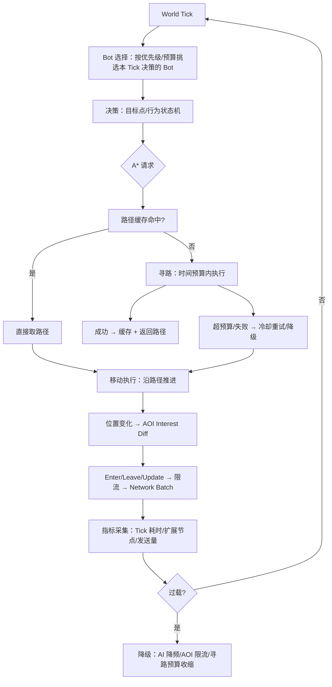

# 07-假人AI完整链路

> 知识基线：机器人（Bot）从决策到移动、寻路、AOI 同步、性能的全链路；模板 B（World Runtime）；真实项目过程证据见 [工作日志 2026-08-03](../../../工作日志/2026-08-03-假人AI-A星优化与耗时测试.md) 与 [2026-08-05](../../../工作日志/2026-08-05-假人寻路路径缓存方案.md)，本地可复现数据见 [Evidence · astar](../../../evidence/algorithms/astar/README.md)。
> 版本基准：本次代理实验为 8 方向静态网格 + Octile，正交1/对角√2，性能组禁止穿角；不能推定它与历史工作日志中的项目实现相同。服务器链路为 MMO 假人 AI 的 Tick 驱动设计。A* 算法参考：[Red Blob Games - A* Introduction](https://www.redblobgames.com/pathfinding/a-star/introduction.html)。
> 适用范围：假人 AI 与 Bot 压测的系统设计、寻路优化、时间预算；读者前置：A* 基础（[游戏算法/01-寻路与图论/02-A星算法与优化](../../02-数学与游戏算法/路径搜索与导航/02-A星算法与优化.md)）。
> 最后更新：2026-10-04（撤回旧伪缓存计时/最优性与22%故障结论，接入新A*/LRU合同，保留三层节拍与端到端边界）。
> 知识成熟度：L2（整篇）。完整Bot调度、移动、AOI/网络、UE接入与生产容量仍是设计/关联资料范围，没有端到端L4或真实项目复盘L5证据。第5节的本地A*/LRU子项已有运行证据，但局部实验不代表整篇等级。verified保持空，不冒充人工审核。

## 1. 概述

假人 AI 是 MMO 服务器容量验证与内容填充的"隐形基础设施"：**Bot 要像玩家一样决策、移动、寻路、被 AOI 看到、占用网络带宽**，否则压测和线上表现失真。本链路把散落在 AI、算法、性能、工作日志里的知识串成一条完整流水线：

本篇将过程材料、本地实验与系统设计连接起来。过程日志不因后来补一个代理实验就变成项目实测；本地A*/缓存数据也不能替代移动、同步与玩家体验的验收。

```text
World Tick → Bot 选择 → 决策 → A* 请求 → 路径缓存/预算 → 移动执行 → AOI/网络更新
→ 性能采集（插桩/perf）→ 过载降级 → 回放与测试 → 容量结论
```

链路应回答五个问题；局部功能测试通过不能代替整条链路的回答：

1. 谁拥有权威状态？——服务器（Bot 状态与寻路结果以服务器为准）；
2. 数据从哪里来、到哪里去？——决策 → 路径 → 移动 → AOI → 网络包 → 客户端；
3. 失败时怎么办？——寻路超预算/失败 → 缓存、降级、冷却重试；
4. 如何证明逻辑正确？——路径有效性/最优性断言 + 回放；
5. 如何证明性能够用？——P50/P95/P99 + 扩展节点 + 机器人压测。

目标读者：做假人 AI、Bot 压测或服务端寻路的工程师；前置：A* 基础、Tick 调度、AOI 概念。

## 2. 链路类型与依赖模块

链路类型：**World Runtime（Template B）**——以 World Tick 为驱动源，逐环节消费与产出状态。

| 环节 | 依赖模块 | 本文/仓库中的支撑 |
| --- | --- | --- |
| World Tick | 主循环/调度器 | [01-ServerMainLoop与TickScheduler](../../07-网络与游戏服务端/运行调度与过载保护/01-ServerMainLoop与TickScheduler.md) |
| Bot 生命周期 | 实体管理 | [03-Entity生命周期与组件模型](../../07-网络与游戏服务端/世界权威与故障恢复/03-Entity生命周期与组件模型.md)（已落地） |
| 决策 | AI 架构 | [游戏AI/02-移动学习与服务端/04-服务端AI与性能](../评测安全与运行预算/04-服务端AI与性能.md) |
| A* 请求 | 寻路服务 | [02-A星算法与优化](../../02-数学与游戏算法/路径搜索与导航/02-A星算法与优化.md)、[笔记/A星算法优化](../../02-数学与游戏算法/路径搜索与导航/A星算法优化.md) |
| 路径缓存 | LRU 缓存 | [2026-08-05 工作日志](../../../工作日志/2026-08-05-假人寻路路径缓存方案.md)、[Evidence · astar](../../../evidence/algorithms/astar/README.md) |
| 寻路预算 | 时间片 | [11-AI与寻路时间预算](../../07-网络与游戏服务端/运行调度与过载保护/11-AI与寻路时间预算.md)（已落地） |
| 移动执行 | 移动系统 | 移动/寻路算法层 |
| AOI/网络 | 兴趣管理 | [05-AOI与InterestManagement](../../07-网络与游戏服务端/状态复制与兴趣管理/05-AOI与InterestManagement.md) |
| 性能采集 | 插桩/perf | [笔记/插桩测试](../../08-工程实践与质量/调试与性能分析/插桩测试.md)、[笔记/perf性能分析](../../08-工程实践与质量/调试与性能分析/perf性能分析.md) |

### 2.1 各环节设计要点

**Bot 生命周期**（状态机）：

```text
Spawn（进入场景、登记 AOI）→ Active（决策/移动循环）→ Pause（过载暂停）→ Despawn（退出场景、注销 AOI）
```

生命周期事件挂在 Tick 边界处理（与 [03-Entity生命周期与组件模型](../../07-网络与游戏服务端/世界权威与故障恢复/03-Entity生命周期与组件模型.md) 一致）：Spawn 时生成实体 ID、注册 AOI；Despawn 时广播 Leave、清理寻路缓存条目。

**决策频率**：决策（选目标/切状态）5~10Hz，移动执行 20Hz，寻路按需——三层频率解耦，各自有预算片。决策输出是"目标点 + 行为"；寻路消费目标点。

**移动执行**：沿路径按速度推进，逐 Tick 更新位置；位置变化喂给 AOI（跨格触发 diff）。移动被障碍截断时标记"需重规划"。

**AOI 接入点**：Bot 与玩家同网格；Bot 的 Enter/Leave/Update 走同一套限流/批量通道（关联 [05-AOI与InterestManagement](../../07-网络与游戏服务端/状态复制与兴趣管理/05-AOI与InterestManagement.md)）——否则压测时 Bot 的同步流量与线上不一致。

**性能采集**：插桩（阶段耗时）与 perf（热点采样）两条线，见 [笔记/插桩测试](../../08-工程实践与质量/调试与性能分析/插桩测试.md) 与 [笔记/perf性能分析](../../08-工程实践与质量/调试与性能分析/perf性能分析.md)。

**网络/同步接入**：Bot 的 Enter/Leave/Update 与玩家共用发送管线；压测时统计每 Tick 发送量与带宽，作为容量结论的一部分（关联 [05-AOI与InterestManagement](../../07-网络与游戏服务端/状态复制与兴趣管理/05-AOI与InterestManagement.md) 的发送估算）。

**降级接入**：过载检测（Tick P99 超阈值/队列积压）触发 Bot 降级——AI 降频、寻路预算收缩、非关键 Bot 暂停；降级与恢复都有日志与计数（关联 [01-ServerMainLoop与TickScheduler](../../07-网络与游戏服务端/运行调度与过载保护/01-ServerMainLoop与TickScheduler.md) 的降级预案）。

## 3. 完整数据流（Template B：World Runtime）



关键设计决策：

1. **决策频率低于 Tick 频率**：Bot 不需要每 Tick 决策（常见 5~10Hz），决策与移动解耦；
2. **寻路按需 + 预算**：目标/导航条件变化才搜；在安全点分片执行。预算耗尽表示尚未完成，不等于不可达；只消费经过验证的连通前缀，不能默认直线穿过未知障碍；
3. **路径缓存有语义键**：起终点、导航版本、agent能力/半径与过滤/代价策略必须一致；是否有足够重复由请求分布决定，见第5节冷热/容量压力对照；
4. **失败冷却**：寻路失败后指数退避重试，避免每 Tick 空转。

### 3.1 决策-寻路-移动的节拍协同

```text
Tick 0:   决策（5Hz）→ 目标点变化 → 发起寻路请求
Tick 1~3: 寻路（预算片内执行）→ 完成 → 写入路径缓存
Tick 4+:  移动执行（20Hz）沿路径推进；路径被截断 → 标记重规划
```

关键约束：

- **结果身份不只Tick**：携带entity generation、request/goal revision、nav/profile/filter revision与deadline；同Tick两次换目标也必须区分。世界线程提交时复查，并验证当前位置接入段，过期结果不可覆盖新决策；
- **决策与移动解耦**：决策只改"目标点 + 行为"，移动系统消费路径，互不阻塞；
- **预算片按环节分**：决策片、寻路片、移动片独立计时（关联 [01-ServerMainLoop与TickScheduler](../../07-网络与游戏服务端/运行调度与过载保护/01-ServerMainLoop与TickScheduler.md) 的预算表）。

## 4. 权威状态与失败路径

### 4.1 权威状态

- **服务器权威**：Bot 位置、路径、状态机都在服务器；客户端只消费同步数据；
- 路径是"建议路径"：移动系统沿路径推进，但 AOI/碰撞结果以服务器为准；
- 回放记录输入快照、随机状态与结果接纳的逻辑Tick；固定seed不能固定墙钟分片或异步完成顺序。采用固定工作量与稳定提交顺序，或记录完成事件，与 [01-ServerMainLoop与TickScheduler](../../07-网络与游戏服务端/运行调度与过载保护/01-ServerMainLoop与TickScheduler.md) 的确定性要求一致。
- 移动/位置也纳入权威状态：客户端预测只是表现，服务器位置是结算与 AOI 的依据。
- 寻路结果带 Tick 序号与地图版本，过期即弃（见 3.1）。

### 4.2 失败路径与处理

| 失败 | 表现 | 处理 |
| --- | --- | --- |
| 寻路超预算 | InProgress，本 Tick 未搜完 | 保存搜索上下文，下Tick续搜；旧路径/部分路径先验证，不能证明安全则停留并退避 |
| 目标不可达 | 搜索完成且确认Unreachable | 可按导航版本缓存负结果；冷却退避，环境变化后再搜 |
| 路径被新障碍截断 | 移动卡住 | 周期性校验 + 触发重规划 |
| 缓存失效 | key/版本不匹配，或走廊已失效 | 拒绝复用并重新规划；LRU只管容量，不能证明语义有效 |
| Bot 过载 | Tick 超预算 | AI 降频 → 决策间隔拉长 → 暂停非关键 Bot |

### 4.3 回放与测试设计

回放以"Tick 序号 + 决策输入流"记录，重放时逐 Tick 重算：

```text
录制：Bot ID+代次、输入/目标版本、导航快照版本、随机状态、完成事件与接纳Tick
重放：相同工作量/tie-break/提交政策，或回放外部完成事件 → 检查路径与关键状态
边界：相同seed不保证墙钟截止与多线程完成次序一致
```

- 确定性要求来自 [01-ServerMainLoop与TickScheduler](../../07-网络与游戏服务端/运行调度与过载保护/01-ServerMainLoop与TickScheduler.md) 的 3.6 节（随机/时钟/遍历顺序注入）；
- 压测场景脚本化（Bot 出生/移动/聚集/战斗混合），压测结果可复现可比对。

## 5. 本地证据如何支持链路，而不是替代链路

### 5.1 先撤回不可用的旧结论

旧[实验原始记录](../../../evidence/algorithms/astar/results/astar_benchmark_win_x64_msvc.txt)保留原字节，不能静默改成“干净的结果”。旧程序命中分支直接填入0.001ms，未计时/返回路径/更新recency；所以“约33倍”没有测量依据。旧输出的扩展倍率还受`%d`接double影响，不能把异常整数摘要成1.0x。

本篇原来把“堆与线性代价相同”写成“同最优”，也撤回：相同错误的两份实现可以一致。`257`与`258`本来就不相等，同启发仍可能因tie-break改变展开数。旧“heapIdx未维护导致多扩展22%”没有对应故障版本、输入和原始输出，**不再作为已发生且已复现的失败方案**。可靠的队列反例另见[A*合同实验](../../../evidence/algorithms/astar-contract/README.md)，不能拿另一个反例替这22%背书。

### 5.2 新实验实际测到了什么

[新A*/LRU实验说明](../../../evidence/algorithms/astar/README.md)维护唯一的运行配方、口径和完整结果。本地A*/LRU子项可单列L4：已有实际执行的独立oracle、LRU故障对照、runner合同与固定网格测量；范围限于下表，不上推为整篇或完整链路的成熟度。本篇只消费这些边界：

| 子项 | 本次证据 | 不能推出 |
| --- | --- | --- |
| 搜索正确性 | 两种OPEN实现与独立Bellman-Ford比较；3×3全部障碍图、两种穿角政策共23040查询合同；另有5×5回归与端点/路径校验负例 | 所有生产NavMesh、动态代价或agent几何都正确 |
| LRU | 容量0/1/多槽、命中touch、覆盖、miss、淘汰、负结果、独立返回、epoch/profile隔离 | 共享多线程缓存或真实动态障碍失效已实现 |
| 负对照 | 故意取消命中touch后，指定recency测试失败并退出1 | 所有缓存缺陷都可被这些用例发现 |
| 计时 | GCC14.2.0、C++17、Linux；相同请求交换测量顺序，5轮原始样本，实际返回并消费路径 | MSVC复测、独占CPU稳定倍率、UE或线上性能 |
| 现有正文合同 | 原astar-contract测试保持原样并重跑 | 它验证了本次大图性能或整条Bot链路 |

新性能组禁止对角穿角，旧组允许；新旧报告不能合成性能A/B。端点可走不保证可达；缓存的空不可达结果有独立hit标志，不能当成没有缓存。

### 5.3 从机制到可证伪的实验

缓存查询平均O(1)不意味着路径复制O(1)。长度L的路径必须被复制并消费，成本随L变化。容量2时`put(A),put(B),get(A),put(C)`应淘汰B：这条负例解释了为什么命中必须touch，也能抓住“名字叫LRU、行为是FIFO”。

本次同一地图分别测：空缓存首次装填、64-key预热热点、256-key容量压力混合序列。25%障碍阈值组中，完整返回+消费的加权均值为：cold无缓存113.368μs/缓存114.953μs；warm125.059μs/0.169μs；mixed121.075μs/51.662μs。**冷缓存略慢也保留**，没有“缓存必须快10倍”的门槛。

mixed总体命中57.3%，安排重复子集100%；40%组分别56.4%与100%。不能只拿子集的100%宣称真实Bot会同样命中。warm/mixed数值来自批均值，**不是逐请求P99**；不可达负缓存比例、路径长度和机器噪声也影响比较。

[原始CSV](../../../evidence/algorithms/astar/results/astar-measurement-2026-10-04/samples.csv.gz)、[逐命令输出](../../../evidence/algorithms/astar/results/astar-measurement-2026-10-04/commands.json)及[统计口径](../../../evidence/algorithms/astar/results/astar-measurement-2026-10-04/summary.json)支持重算。没有CPU隔离/亲和或生产场景校准，不能把本次均值/倍率写成容量承诺。

### 5.4 项目证据仍缺什么

[2026-08-03日志](../../../工作日志/2026-08-03-假人AI-A星优化与耗时测试.md)和[2026-08-05日志](../../../工作日志/2026-08-05-假人寻路路径缓存方案.md)保留历史原件，不回填成后来实验当时已经完成。它们与代理实验有关联，但不是同一份构建、输入和测量。

本地C++实验是一次执行完成的搜索，没有实现InProgress/分帧续搜；前文续搜和提交策略是待接入验证的系统设计。

完整链路还需目标地图/agent分布、调度准入与过期、移动碰撞、AOI发送与真实接收端、断线/重试、整体Tick长尾和玩家体验证据。只有同发送管线是必要条件，不足以证明Bot负载等价线上用户。当前没有据此完成L5项目复盘。

## 6. 验证矩阵：功能合同与性能观察分开

| 验证项 | 方法 | 通过标准或观察边界 |
| --- | --- | --- |
| 路径有效性 | 校验起终点、每条合法边、障碍、穿角、代价 | 非法起点/首格/跳格/代价负例必须被拒 |
| 最优性 | 小图独立Bellman-Ford oracle | 代价/可达性一致；不以两份A*互证替代 |
| 缓存状态 | LRU/空结果/覆盖/epoch/profile测试 | 输出正确且不会错误淘汰或复用旧版本 |
| 缓存所有权 | 修改调用者返回的vector后再次读取 | 缓存内部值未被别名修改 |
| 性能 | 相同请求、返回语义与结果消费，冷热/混合分组 | 保存全部原始样本；无固定加速断言，慢结果不能丢 |
| 分位数 | 分清单请求、批均值、端到端Tick | 不将三种分母互换，不把P99当硬上界 |
| 异步提交 | 同Tick换目标、实体重生、导航变化、迟到结果 | 错代次/版本/截止的结果被拒，正确结果可接纳；项目层待测 |
| 安全降级 | 有墙/落差、超预算与动态障碍 | 不穿越未验证路段；停留/取消可接受，项目层待测 |
| 容量 | 真实行为混合、移动/AOI/网络与接收端压测 | 满足整体Tick和体验SLO，不能由本地A*乘玩家数得出 |
| 并发（若启用） | 独立上下文、同步、TSan及压力测试 | 本实验单线程，尚未提供该证据 |

## 7. 最佳实践

1. **寻路预算独立于 AI 预算**：决策与寻路各占时间片，超时各自降级；
2. **缓存键覆盖语义**：起终点、nav/profile/filter版本一致；地图修改使旧epoch失效，复用仍需验证当前位置接入段；
3. **按分配剖面优化**：可考虑寻路节点池/预分配数组（工作日志"对象池"项）；本地实验仍有数组、路径与缓存分配，没有证明零分配；
4. **优先级**：玩家附近 Bot 优先决策与同步（对体验影响大）；
5. **长尾与整体预算都测**：单请求P99、缓存批均值与Tick P99分开，记录吞吐、排队和过期浪费，不能互相替代；
6. **回放与压测复用同一确定性**：Bot 行为脚本化，压测场景可回放复现；
7. **新结果独立归档**：记录构建、输入、测量范围、原始样本和失败方案；历史日志原件保全，用新的证据说明链接，不倒填旧事实。
8. **三层频率解耦**：决策/移动/寻路各自独立节拍与预算，在安全点让出；共享CPU/锁仍可能互相影响。
9. **Bot 与玩家同通道仍需校准**：共用AOI/网络能减少偏差，还要核对行为分布、真实接收/ACK、重试和资源竞争。
10. **先测正确性再测性能**：路径有效性/最优性断言不过，P99 再漂亮也不能上线。
11. **寻路结果带代次和请求版本**：Tick只是一个维度，提交时复查目标/导航/profile与截止，防止同帧重入或ID复用（见3.1）。
12. **失败要有可观测性**：寻路超时/失败/缓存失效都有计数与日志，能定位"是负载问题还是逻辑问题"。
13. **压测场景脚本化入库**：Bot 出生/移动/聚集/战斗混合脚本随仓库版本管理，回归可复现。
14. **容量结论要带环境**：CPU 型号、核数、Tick 频率、Bot 数量与行为混合一起记录，跨机器对比才有意义。

## 8. 常见问题

**Q1：为什么决策频率要低于 Tick 频率？**
决策（选目标、切状态）成本高且不需要每 Tick；移动执行才需要高频。典型：Tick 20Hz、决策 5Hz、寻路按需。

**Q2：寻路超预算时直接返回空路径吗？**
先区分InProgress、Unreachable和Found。未完成搜索可保留上下文，但不能把未知直线当安全路径；旧路径/连通前缀经过几何与版本验证才可继续。无法证明安全时停留、取消或退避是正确降级，不应为避免“发呆”而穿墙。

**Q3：路径缓存什么时候失效？**
导航、目标、agent/profile/filter或代价策略变化时拒绝旧语义；当前位置漂移还需验证接入段。LRU仅管理容量，不能证明路径仍安全。

**Q4：压测 Bot 和线上假人是一回事吗？**
同一套 AI 框架两种用途：压测 Bot 侧重并发与带宽压力，线上假人侧重行为真实度；建议共用代码，参数分离。

**Q5：本链路的数据能当线上容量结论吗？**
不能。本地实验只证明列出的合同和固定场景观测；线上容量需机器人压测（[游戏测试与质量](../../../00_Index/学习路线/工程实践与质量.md) 03/07 篇）按实体数、行为混合、带宽做校准。

**Q6：为什么先测正确性再测性能？**
性能优化（堆、缓存）不改语义，但实现 bug（decrease-key 书签、懒删除校验）会悄悄破坏最优性；正确性需要独立oracle、完整路径校验与能失败的负对照；两实现代价一致只是一致性检查。功能门禁不得要求固定提速。

**Q7：假人 AI 的"行为真实度"怎么衡量？**
用行为分布对比：决策频率、移动速度分布、聚集比例、技能使用率与线上玩家数据对齐；压测 Bot 至少覆盖"移动/静止/聚集/战斗"四种形态。

**Q8：寻路预算片怎么分给多个 Bot？**
按优先级挑选本 Tick 的寻路请求（玩家附近优先），每个请求分固定时间片；时间片内没搜完就暂停，下 Tick 续搜或降级——这需要 A* 支持"可中断/续搜"（增量搜索的工程形态）。

**Q9：路径缓存的内存上限怎么定？**
先按条目数、路径节点/字节分布、map/list与分配器开销估算，再设置字节和条目双上限。128只是本实验参数，不保证真实假人群体够用；epoch切换不再复用旧路径。

**Q10：多线程寻路有必要吗？**
先测单线程端到端预算，不拿旧0.03~0.1ms作为通用成本。多线程寻路引入任务队列与结果合并（原子计数 + 无锁队列，关联 04-并发篇），只有单线程预算确实不够时才引入。

**Q11：Bot 的"决策多样性"怎么保证？**
决策参数（目标偏好、行为权重、速度扰动）按 Bot 模板配置，避免所有 Bot 行为雷同导致压测失真；扰动必须基于确定性随机（Tick 种子），保证可回放。

**Q12：压测报告至少包含哪些字段？**
环境（CPU/核数/频率）、Bot 数量与行为混合、Tick P50/P95/P99、寻路预算占用、发送带宽、降级事件计数、与上次跑批的 diff——缺环境或混合的结论不可对比。

### 8.1 常见反模式

| 反模式 | 后果 | 正确做法 |
| --- | --- | --- |
| 每 Tick 全量决策 | 决策成本爆炸 | 5~10Hz 决策 + 移动解耦 |
| 寻路无预算 | 单查询卡死 Tick | 时间片 + 可中断/续搜 |
| 缓存无版本 | 地图更新后旧路径复用 | 版本号整体失效 |
| 失败无冷却 | 不可达目标每 Tick 空转 | 指数退避 + 换目标 |
| Bot 与玩家不同通道 | 压测结果失真 | 同一 AOI/网络管线 |
| 只测平均不测 P99 | 长尾尖峰漏掉 | P50/P95/P99 全记录 |
| 优化不留 before/after | 无法归因 | 每次优化按 5.3 证据链留档 |

### 8.2 容量结论模板

```text
场景：1000 Bot，移动 60% / 静止 20% / 聚集战斗 20%，Tick 20Hz
环境：CPU 型号 / 核数 / 频率 / 内存
指标：Tick P50=__ms  P95=__ms  P99=__ms（预算 __ms）
寻路：查询数/秒=__，预算占用=__%，缓存命中率=__%
网络：发送量/帧=__，带宽=__Mbps（预算 __Mbps）
降级：触发次数=__，恢复时间=__
结论：容量拐点=__ Bot；建议上限=__ Bot（预留 30%）
```

每份压测报告按此模板填写，缺失字段标注"未测"而非编造。

模板预算须由目标场景与硬件实测批准；[Tick调度专题](../../07-网络与游戏服务端/运行调度与过载保护/01-ServerMainLoop与TickScheduler.md)提供设计入口。生产证据还要匹配版本、输入、口径和失败复验，不能填上几个毫秒数就宣布整条链路闭环。

> 这条链路用于暴露各环节还缺什么证据。A*/LRU局部实验已经可复现；其余模块仍须各自验收，不能因引用同一Evidence就继承验证结论。

## 9. 关联阅读

- [Evidence · astar](../../../evidence/algorithms/astar/README.md)：本链路的本地复现数据。
- [工作日志 2026-08-03](../../../工作日志/2026-08-03-假人AI-A星优化与耗时测试.md)、[2026-08-05](../../../工作日志/2026-08-05-假人寻路路径缓存方案.md)：真实项目过程证据。
- [02-A星算法与优化](../../02-数学与游戏算法/路径搜索与导航/02-A星算法与优化.md)、[笔记/A星算法优化](../../02-数学与游戏算法/路径搜索与导航/A星算法优化.md)：算法细节。
- [04-服务端AI与性能](../评测安全与运行预算/04-服务端AI与性能.md)：服务端 AI 工程视角。
- [01-ServerMainLoop与TickScheduler](../../07-网络与游戏服务端/运行调度与过载保护/01-ServerMainLoop与TickScheduler.md)、[05-AOI与InterestManagement](../../07-网络与游戏服务端/状态复制与兴趣管理/05-AOI与InterestManagement.md)：Tick 预算与同步链路。
- [游戏测试与质量](../../../00_Index/学习路线/工程实践与质量.md)：机器人压测与容量评估方法。
- [02-Atomic与C++内存模型](../../01-编程与计算机基础/并发与同步/02-Atomic与C%2B%2B内存模型.md)：并发计数与任务队列的底层（多线程寻路时）。
- [系统实战/03-技能释放完整链路](../../05-Gameplay与交互系统/技能战斗与属性结算/03-技能释放完整链路.md)（已落地）：玩法侧链路的对照。
- [笔记/A星算法优化](../../02-数学与游戏算法/路径搜索与导航/A星算法优化.md)：A* 优化的速查笔记。
- [11-AI与寻路时间预算](../../07-网络与游戏服务端/运行调度与过载保护/11-AI与寻路时间预算.md)（已落地）：预算片机制的正式章节。
- [游戏AI/02-移动学习与服务端/04-服务端AI与性能](../评测安全与运行预算/04-服务端AI与性能.md)：服务端 AI 的性能工程视角。
- [笔记/perf性能分析](../../08-工程实践与质量/调试与性能分析/perf性能分析.md)：perf 采样定位热点的实战方法。
