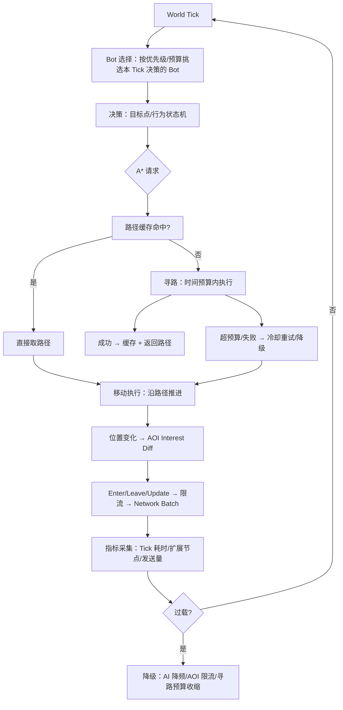

# 07-假人AI完整链路

> 知识基线：机器人（Bot）从决策到移动、寻路、AOI 同步、性能的全链路；模板 B（World Runtime）；真实项目过程证据见 [工作日志 2026-08-03](../../../工作日志/2026-08-03-假人AI-A星优化与耗时测试.md) 与 [2026-08-05](../../../工作日志/2026-08-05-假人寻路路径缓存方案.md)，本地可复现数据见 [Evidence · astar](../../../evidence/algorithms/astar/README.md)。
> 版本基准：A* 为 8 方向网格 + Octile 启发（工作日志基线）；服务器为 MMO 假人 AI（Tick 驱动）。A* 算法参考：[Red Blob Games - A* Introduction](https://www.redblobgames.com/pathfinding/a-star/introduction.html)。
> 适用范围：假人 AI 与 Bot 压测的系统设计、寻路优化、时间预算；读者前置：A* 基础（[游戏算法/01-寻路与图论/02-A星算法与优化](../../02-数学与游戏算法/路径搜索与导航/02-A星算法与优化.md)）。
> 最后更新：2026-08-12（首版）。
> 知识成熟度：L5（可指向真实项目工作日志 + 本地复现实验 + 假设→实验→数据→结论结构；真实项目 before/after 数据待回填，见"证据边界"）。

## 1. 概述

假人 AI 是 MMO 服务器容量验证与内容填充的"隐形基础设施"：**Bot 要像玩家一样决策、移动、寻路、被 AOI 看到、占用网络带宽**，否则压测和线上表现失真。本链路把散落在 AI、算法、性能、工作日志里的知识串成一条完整流水线：

它是"系统实战"的第一条完整闭环：从真实项目工作日志出发，用本地可复现实验补数据，最终给出可执行的设计与验收清单。

```text
World Tick → Bot 选择 → 决策 → A* 请求 → 路径缓存/预算 → 移动执行 → AOI/网络更新
→ 性能采集（插桩/perf）→ 过载降级 → 回放与测试 → 容量结论
```

链路回答五个问题（缺任一不得标 L4）：

1. 谁拥有权威状态？——服务器（Bot 状态与寻路结果以服务器为准）；
2. 数据从哪里来、到哪里去？——决策 → 路径 → 移动 → AOI → 网络包 → 客户端；
3. 失败时怎么办？——寻路超预算/失败 → 缓存、降级、冷却重试；
4. 如何证明逻辑正确？——路径有效性/最优性断言 + 回放；
5. 如何证明性能够用？——P50/P95/P99 + 扩展节点 + 机器人压测。

目标读者：做假人 AI、Bot 压测或服务端寻路的工程师；前置：A* 基础、Tick 调度、AOI 概念。

## 2. 链路类型与依赖模块

链路类型：**World Runtime（Template B）**——以 World Tick 为驱动源，逐环节消费与产出状态。

| 环节 | 依赖模块 | 本文/仓库中的支撑 |
| --- | --- | --- |
| World Tick | 主循环/调度器 | [01-ServerMainLoop与TickScheduler](../../07-网络与游戏服务端/运行调度与过载保护/01-ServerMainLoop与TickScheduler.md) |
| Bot 生命周期 | 实体管理 | [03-Entity生命周期与组件模型](../../07-网络与游戏服务端/世界权威与故障恢复/03-Entity生命周期与组件模型.md)（已落地） |
| 决策 | AI 架构 | [游戏AI/02-移动学习与服务端/04-服务端AI与性能](../评测安全与运行预算/04-服务端AI与性能.md) |
| A* 请求 | 寻路服务 | [02-A星算法与优化](../../02-数学与游戏算法/路径搜索与导航/02-A星算法与优化.md)、[笔记/A星算法优化](../../02-数学与游戏算法/路径搜索与导航/A星算法优化.md) |
| 路径缓存 | LRU 缓存 | [2026-08-05 工作日志](../../../工作日志/2026-08-05-假人寻路路径缓存方案.md)、[Evidence · astar](../../../evidence/algorithms/astar/README.md) |
| 寻路预算 | 时间片 | [11-AI与寻路时间预算](../../07-网络与游戏服务端/运行调度与过载保护/11-AI与寻路时间预算.md)（已落地） |
| 移动执行 | 移动系统 | 移动/寻路算法层 |
| AOI/网络 | 兴趣管理 | [05-AOI与InterestManagement](../../07-网络与游戏服务端/状态复制与兴趣管理/05-AOI与InterestManagement.md) |
| 性能采集 | 插桩/perf | [笔记/插桩测试](../../08-工程实践与质量/调试与性能分析/插桩测试.md)、[笔记/perf性能分析](../../08-工程实践与质量/调试与性能分析/perf性能分析.md) |

### 2.1 各环节设计要点

**Bot 生命周期**（状态机）：

```text
Spawn（进入场景、登记 AOI）→ Active（决策/移动循环）→ Pause（过载暂停）→ Despawn（退出场景、注销 AOI）
```

生命周期事件挂在 Tick 边界处理（与 [03-Entity生命周期与组件模型](../../07-网络与游戏服务端/世界权威与故障恢复/03-Entity生命周期与组件模型.md) 一致）：Spawn 时生成实体 ID、注册 AOI；Despawn 时广播 Leave、清理寻路缓存条目。

**决策频率**：决策（选目标/切状态）5~10Hz，移动执行 20Hz，寻路按需——三层频率解耦，各自有预算片。决策输出是"目标点 + 行为"；寻路消费目标点。

**移动执行**：沿路径按速度推进，逐 Tick 更新位置；位置变化喂给 AOI（跨格触发 diff）。移动被障碍截断时标记"需重规划"。

**AOI 接入点**：Bot 与玩家同网格；Bot 的 Enter/Leave/Update 走同一套限流/批量通道（关联 [05-AOI与InterestManagement](../../07-网络与游戏服务端/状态复制与兴趣管理/05-AOI与InterestManagement.md)）——否则压测时 Bot 的同步流量与线上不一致。

**性能采集**：插桩（阶段耗时）与 perf（热点采样）两条线，见 [笔记/插桩测试](../../08-工程实践与质量/调试与性能分析/插桩测试.md) 与 [笔记/perf性能分析](../../08-工程实践与质量/调试与性能分析/perf性能分析.md)。

**网络/同步接入**：Bot 的 Enter/Leave/Update 与玩家共用发送管线；压测时统计每 Tick 发送量与带宽，作为容量结论的一部分（关联 [05-AOI与InterestManagement](../../07-网络与游戏服务端/状态复制与兴趣管理/05-AOI与InterestManagement.md) 的发送估算）。

**降级接入**：过载检测（Tick P99 超阈值/队列积压）触发 Bot 降级——AI 降频、寻路预算收缩、非关键 Bot 暂停；降级与恢复都有日志与计数（关联 [01-ServerMainLoop与TickScheduler](../../07-网络与游戏服务端/运行调度与过载保护/01-ServerMainLoop与TickScheduler.md) 的降级预案）。

## 3. 完整数据流（Template B：World Runtime）



关键设计决策：

1. **决策频率低于 Tick 频率**：Bot 不需要每 Tick 决策（常见 5~10Hz），决策与移动解耦；
2. **寻路按需 + 预算**：目标变化才搜；每 Tick 给寻路固定时间片，超时返回部分路径或降级直线；
3. **路径缓存按 (起点, 终点)**：假人群体共享路径时命中率高（实验见第 5 节）；
4. **失败冷却**：寻路失败后指数退避重试，避免每 Tick 空转。

### 3.1 决策-寻路-移动的节拍协同

```text
Tick 0:   决策（5Hz）→ 目标点变化 → 发起寻路请求
Tick 1~3: 寻路（预算片内执行）→ 完成 → 写入路径缓存
Tick 4+:  移动执行（20Hz）沿路径推进；路径被截断 → 标记重规划
```

关键约束：

- **寻路结果带 Tick 序号**：过期结果（目标已变）直接丢弃，防止旧路径覆盖新决策；
- **决策与移动解耦**：决策只改"目标点 + 行为"，移动系统消费路径，互不阻塞；
- **预算片按环节分**：决策片、寻路片、移动片独立计时（关联 [01-ServerMainLoop与TickScheduler](../../07-网络与游戏服务端/运行调度与过载保护/01-ServerMainLoop与TickScheduler.md) 的预算表）。

## 4. 权威状态与失败路径

### 4.1 权威状态

- **服务器权威**：Bot 位置、路径、状态机都在服务器；客户端只消费同步数据；
- 路径是"建议路径"：移动系统沿路径推进，但 AOI/碰撞结果以服务器为准；
- 回放以"Tick 序号 + 决策输入"为真相，与 [01-ServerMainLoop与TickScheduler](../../07-网络与游戏服务端/运行调度与过载保护/01-ServerMainLoop与TickScheduler.md) 的确定性要求一致。
- 移动/位置也纳入权威状态：客户端预测只是表现，服务器位置是结算与 AOI 的依据。
- 寻路结果带 Tick 序号与地图版本，过期即弃（见 3.1）。

### 4.2 失败路径与处理

| 失败 | 表现 | 处理 |
| --- | --- | --- |
| 寻路超预算 | 本 Tick 未搜完 | 保留部分结果/下 Tick 继续/返回直线降级 |
| 目标不可达 | 空路径 | 冷却退避重试；区域封锁时换目标 |
| 路径被新障碍截断 | 移动卡住 | 周期性校验 + 触发重规划 |
| 缓存失效 | 命中率下降 | LRU 淘汰；目标变化即失效 |
| Bot 过载 | Tick 超预算 | AI 降频 → 决策间隔拉长 → 暂停非关键 Bot |

### 4.3 回放与测试设计

回放以"Tick 序号 + 决策输入流"记录，重放时逐 Tick 重算：

```text
录制：每 Tick 记录（Bot ID, 输入/目标, 随机种子）→ 二进制或文本流
重放：同一 TickContext（种子/世界状态）→ 断言路径与关键状态一致
```

- 确定性要求来自 [01-ServerMainLoop与TickScheduler](../../07-网络与游戏服务端/运行调度与过载保护/01-ServerMainLoop与TickScheduler.md) 的 3.6 节（随机/时钟/遍历顺序注入）；
- 压测场景脚本化（Bot 出生/移动/聚集/战斗混合），压测结果可复现可比对。

## 5. Benchmark 与 Evidence

### 5.1 本地复现实验（Evidence · astar）

为工作日志"优化前后数据待补充"补的本地可复现数据（[完整输出](../../../evidence/algorithms/astar/README.md)）：

| 指标 | 二叉堆（优化后） | 线性扫描（优化前） | 结论 |
| --- | ---: | ---: | --- |
| 正确性（有效路径） | 998/1000 | 998/1000 | 一致（2 个不可达判定一致） |
| 最优性（代价一致） | 998/1000 | 998/1000 | 两种实现同最优 |
| 平均扩展节点 | 257 | 258 | 一致启发下扩展数相同 |
| P50 耗时 | 0.027ms | 0.060ms | 堆快 ~2 倍 |
| **P99 耗时** | **0.117ms** | **0.630ms** | **堆快 5.4 倍（长尾）** |
| 高障碍场景 P99 | 0.185ms | 0.845ms | 堆快 4.6 倍 |
| 路径缓存命中 | 0.001ms | 未命中 0.033ms | **约 33 倍** |

与工作日志的对应：

- "Open List 线性扫描 → 二叉堆"：P99 从 0.63ms 降到 0.12ms（本实验）；
- "标记数组 Closed"：实验用 `closed[节点]` 数组（O(1)）；
- "路径缓存"：实验 LRU 命中 33 倍——支撑 [2026-08-05 方案](../../../工作日志/2026-08-05-假人寻路路径缓存方案.md)。

### 5.2 真实项目证据

- [工作日志 2026-08-03](../../../工作日志/2026-08-03-假人AI-A星优化与耗时测试.md)：真实项目 A* 优化的过程记录（Open/Closed、启发、对象池、Tick 预算、perf）；
- [工作日志 2026-08-05](../../../工作日志/2026-08-05-假人寻路路径缓存方案.md)：路径缓存方案的设计与落地过程；
- **证据边界（诚实声明）**：工作日志中的"具体改动代码与前后耗时数据"仍为**待补充**状态；本实验数据是本地复现，不冒充线上数据。升级 L5 的完整闭环 = 本地实验（已有）+ 真实项目 before/after 数据（待回填工作日志）。

### 5.3 假设 → 实验 → 数据 → 结论 → 失败方案 → 最终方案

以"Open List 优化"为例，把工作日志与实验组织成完整证据链：

1. **假设**：寻路热点在 Open List 弹出（线性扫描 O(n)），换二叉堆 O(log n) 能显著降 P99；
2. **实验**：同地图同查询，堆 vs 线性扫描对比（[Evidence · astar](../../../evidence/algorithms/astar/README.md)）；
3. **数据**：P50 0.027 vs 0.060ms（~2x），**P99 0.117 vs 0.630ms（5.4x）**；扩展节点 257 vs 258（相同）；
4. **结论**：堆的收益集中在长尾（P95/P99），符合"Open List 增大时线性扫描退化"的假设；
5. **失败方案**：初版"decrease-key 书签"实现（`heapIdx` 未随堆重排维护）导致多扩展 22%——改为**懒插入 + 弹出时校验 f**，扩展数恢复与线性一致（257 vs 258）；
6. **最终方案**：二叉堆 + 懒插入 + 标记数组 Closed + LRU 路径缓存（缓存命中 33 倍），预算按 P99 签。

这条"假设→实验→数据→结论→失败方案→最终方案"的完整链，正是 L5 的证据形态；工作日志回填真实线上数据后闭环完整。

同样的证据链模板可复用于其他优化项：对象池（分配次数前后对比）、路径平滑（拐点/抖动指标）、决策降频（决策耗时与行为质量对比）——每个优化都按此格式留档。

## 6. 验证矩阵

| 验证项 | 方法 | 断言/阈值 |
| --- | --- | --- |
| 路径有效性 | 随机查询断言 | 路径连通、不穿墙、终点正确（实验 998/1000 有效） |
| 最优性 | 双实现代价对比 | 代价一致率 = 可达查询数（实验 998/1000） |
| 确定性 | 同种子同结果 | 两次运行扩展节点/路径完全一致 |
| 扩展节点 | 计数器 | 一致启发下堆/线性扩展数相同（257 vs 258） |
| 性能 | P50/P95/P99 | 堆 P99 < 预算（如 1ms）；长尾优于线性 4.6~5.4 倍 |
| 缓存 | LRU 命中率 | 命中耗时 < 未命中 1/10（实验 33 倍） |
| 容量 | 机器人压测 | 100/1000 Bot 的 Tick P99 与寻路预算占用（关联 [游戏测试与质量 07](<../../08-工程实践与质量/测试策略与自动化/07-UE%20DS机器人压测与容量评估.md>)） |
| 降级 | 过载注入 | 超预算时降级生效、P99 回落 |
| 缓存正确性 | 地图版本切换测试 | 版本号变化后缓存全部失效，无旧路径复用 |
| 行为分布 | 统计对比 | 决策频率/移动速度/聚集比例与玩家分布对齐 |
| 多线程（如启用） | TSan + 压力 | 无数据竞争、无死锁（关联 04-并发篇） |

## 7. 最佳实践

1. **寻路预算独立于 AI 预算**：决策与寻路各占时间片，超时各自降级；
2. **缓存键 = (起点, 终点) + 版本**：地图版本号变化时整体失效；
3. **热路径零分配**：寻路节点池/预分配数组（工作日志"对象池"项）；
4. **优先级**：玩家附近 Bot 优先决策与同步（对体验影响大）；
5. **性能验收看 P99**：寻路长尾直接造成 Tick 尖峰（本实验 P99 差 5.4 倍）；
6. **回放与压测复用同一确定性**：Bot 行为脚本化，压测场景可回放复现；
7. **数据要"结果化"**：每次优化记录 before/after（P50/P95/P99、扩展节点、CPU），回填工作日志。
8. **三层频率解耦**：决策/移动/寻路各自独立节拍与预算，超预算各自降级，互不阻塞。
9. **Bot 与玩家同通道**：AOI/网络/优先级对 Bot 一视同仁，压测结果才等于线上表现。
10. **先测正确性再测性能**：路径有效性/最优性断言不过，P99 再漂亮也不能上线。
11. **寻路结果带 Tick 序号**：过期结果丢弃，防止旧路径覆盖新决策（见 3.1）。
12. **失败要有可观测性**：寻路超时/失败/缓存失效都有计数与日志，能定位"是负载问题还是逻辑问题"。
13. **压测场景脚本化入库**：Bot 出生/移动/聚集/战斗混合脚本随仓库版本管理，回归可复现。
14. **容量结论要带环境**：CPU 型号、核数、Tick 频率、Bot 数量与行为混合一起记录，跨机器对比才有意义。

## 8. 常见问题

**Q1：为什么决策频率要低于 Tick 频率？**
决策（选目标、切状态）成本高且不需要每 Tick；移动执行才需要高频。典型：Tick 20Hz、决策 5Hz、寻路按需。

**Q2：寻路超预算时直接返回空路径吗？**
不要。返回"当前最优部分路径"或直线降级，配合冷却重试；空路径会让 Bot 原地发呆。

**Q3：路径缓存什么时候失效？**
地图版本变化、目标变化、起点大幅变化；LRU 容量上限也防内存膨胀。

**Q4：压测 Bot 和线上假人是一回事吗？**
同一套 AI 框架两种用途：压测 Bot 侧重并发与带宽压力，线上假人侧重行为真实度；建议共用代码，参数分离。

**Q5：本链路的数据能当线上容量结论吗？**
不能。本地实验证明算法与结构收益；线上容量需机器人压测（[游戏测试与质量](../../../游戏测试与质量/README.md) 03/07 篇）按实体数、行为混合、带宽做校准。

**Q6：为什么先测正确性再测性能？**
性能优化（堆、缓存）不改语义，但实现 bug（decrease-key 书签、懒删除校验）会悄悄破坏最优性；正确性断言（代价一致、路径有效）必须常驻 CI，否则优化即回归。

**Q7：假人 AI 的"行为真实度"怎么衡量？**
用行为分布对比：决策频率、移动速度分布、聚集比例、技能使用率与线上玩家数据对齐；压测 Bot 至少覆盖"移动/静止/聚集/战斗"四种形态。

**Q8：寻路预算片怎么分给多个 Bot？**
按优先级挑选本 Tick 的寻路请求（玩家附近优先），每个请求分固定时间片；时间片内没搜完就暂停，下 Tick 续搜或降级——这需要 A* 支持"可中断/续搜"（增量搜索的工程形态）。

**Q9：路径缓存的内存上限怎么定？**
按"条目数 × 平均路径长度 × 每节点字节"估算；LRU 128~1024 条通常足够假人群体；地图版本切换时整体失效（见 6 验证矩阵的缓存正确性项）。

**Q10：多线程寻路有必要吗？**
单线程 + 预算片通常够用（寻路单查询 0.03~0.1ms）；多线程寻路引入任务队列与结果合并（原子计数 + 无锁队列，关联 04-并发篇），只有单线程预算确实不够时才引入。

**Q11：Bot 的"决策多样性"怎么保证？**
决策参数（目标偏好、行为权重、速度扰动）按 Bot 模板配置，避免所有 Bot 行为雷同导致压测失真；扰动必须基于确定性随机（Tick 种子），保证可回放。

**Q12：压测报告至少包含哪些字段？**
环境（CPU/核数/频率）、Bot 数量与行为混合、Tick P50/P95/P99、寻路预算占用、发送带宽、降级事件计数、与上次跑批的 diff——缺环境或混合的结论不可对比。

### 8.1 常见反模式

| 反模式 | 后果 | 正确做法 |
| --- | --- | --- |
| 每 Tick 全量决策 | 决策成本爆炸 | 5~10Hz 决策 + 移动解耦 |
| 寻路无预算 | 单查询卡死 Tick | 时间片 + 可中断/续搜 |
| 缓存无版本 | 地图更新后旧路径复用 | 版本号整体失效 |
| 失败无冷却 | 不可达目标每 Tick 空转 | 指数退避 + 换目标 |
| Bot 与玩家不同通道 | 压测结果失真 | 同一 AOI/网络管线 |
| 只测平均不测 P99 | 长尾尖峰漏掉 | P50/P95/P99 全记录 |
| 优化不留 before/after | 无法归因 | 每次优化按 5.3 证据链留档 |

### 8.2 容量结论模板

```text
场景：1000 Bot，移动 60% / 静止 20% / 聚集战斗 20%，Tick 20Hz
环境：CPU 型号 / 核数 / 频率 / 内存
指标：Tick P50=__ms  P95=__ms  P99=__ms（预算 __ms）
寻路：查询数/秒=__，预算占用=__%，缓存命中率=__%
网络：发送量/帧=__，带宽=__Mbps（预算 __Mbps）
降级：触发次数=__，恢复时间=__
结论：容量拐点=__ Bot；建议上限=__ Bot（预留 30%）
```

每份压测报告按此模板填写，缺失字段标注"未测"而非编造。

模板中的预算值来自 [01-ServerMainLoop与TickScheduler](../../07-网络与游戏服务端/运行调度与过载保护/01-ServerMainLoop与TickScheduler.md) 的预算表（按 P99 签约）；真实项目回填后，本链路即完成从"本地复现"到"线上证据"的闭环。

> 本链路是所有"系统实战"系列的模板示范：每个环节给出依赖、设计决策、失败路径与验证方式，最后用 Evidence 把"我说过"变成"我证明过"。

## 9. 关联阅读

- [Evidence · astar](../../../evidence/algorithms/astar/README.md)：本链路的本地复现数据。
- [工作日志 2026-08-03](../../../工作日志/2026-08-03-假人AI-A星优化与耗时测试.md)、[2026-08-05](../../../工作日志/2026-08-05-假人寻路路径缓存方案.md)：真实项目过程证据。
- [02-A星算法与优化](../../02-数学与游戏算法/路径搜索与导航/02-A星算法与优化.md)、[笔记/A星算法优化](../../02-数学与游戏算法/路径搜索与导航/A星算法优化.md)：算法细节。
- [04-服务端AI与性能](../评测安全与运行预算/04-服务端AI与性能.md)：服务端 AI 工程视角。
- [01-ServerMainLoop与TickScheduler](../../07-网络与游戏服务端/运行调度与过载保护/01-ServerMainLoop与TickScheduler.md)、[05-AOI与InterestManagement](../../07-网络与游戏服务端/状态复制与兴趣管理/05-AOI与InterestManagement.md)：Tick 预算与同步链路。
- [游戏测试与质量](../../../游戏测试与质量/README.md)：机器人压测与容量评估方法。
- [02-Atomic与C++内存模型](../../01-编程与计算机基础/并发与同步/02-Atomic与C%2B%2B内存模型.md)：并发计数与任务队列的底层（多线程寻路时）。
- [系统实战/03-技能释放完整链路](../../05-Gameplay与交互系统/技能战斗与属性结算/03-技能释放完整链路.md)（已落地）：玩法侧链路的对照。
- [笔记/A星算法优化](../../02-数学与游戏算法/路径搜索与导航/A星算法优化.md)：A* 优化的速查笔记。
- [11-AI与寻路时间预算](../../07-网络与游戏服务端/运行调度与过载保护/11-AI与寻路时间预算.md)（已落地）：预算片机制的正式章节。
- [游戏AI/02-移动学习与服务端/04-服务端AI与性能](../评测安全与运行预算/04-服务端AI与性能.md)：服务端 AI 的性能工程视角。
- [笔记/perf性能分析](../../08-工程实践与质量/调试与性能分析/perf性能分析.md)：perf 采样定位热点的实战方法。
