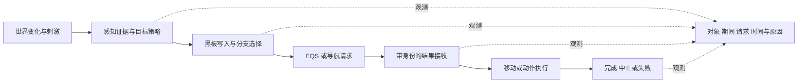

# 08 AI 调试与性能分析（AI Debugging & Performance Analysis）

> 知识成熟度：L2。核对官方文档与公开 API，形成 AI 问题的观测和对照方法；示例、纸面轨迹和测量方案均未在 UE 执行，不能视为功能或性能验证。
> 版本基准：固定 UE 5.5 的 AI Debugging、Behavior Tree、Perception、Navigation、Visual Logger 和 Unreal Insights 文档；补充页面按本次实际返回标题的 5.8 或 5.7 分别标注，见第 12 节。文档版本不拼成一个已验证引擎构建。
> 知识基线：2026-10-10 实际读取的官方返回与现行关联专题；本次未读取本机 Engine/Build/Build.version 或引擎实现。旧文的 UE 5.8.0、CL 55116800、源码行号和“本机已核对”仅作为历史记录保留，不是本次证据。
> 适用范围：开发期 AI 的逻辑故障、陈旧结果、状态可见性、预算与调试开销排查。目标项目的构建开关、模块、配置、权限和实际采集端须先确认。
> 最后更新：2026-10-10。全篇按“观测→假设→前提→对照→结论/未知”重建；保留 BT、感知/EQS、导航、人群和 Mass 的诊断用途，修正工具快捷键、统计命令与预算混淆。

## 1. 从“AI 不动”拆出能验证的问题

屏幕上的角色不动，可能是没有得到目标、行为树没选中分支、查询尚未完成、路径只到达部分路段、移动被取消，也可能只是观察了另一个 Pawn。第一步不是把所有调试分类打开，而是明确期望在哪一段发生什么变化。

以下是项目诊断链，不是引擎固定调用栈：



每个箭头都应有输入、拥有者、接收条件和失败出口。能看到箭头后面的数据，不证明前面每一步都正确；看不到数据，也不证明没有执行。采集未开启、对象被过滤、采样间隔太长和切错 World 都可能造成“空白”。

| 读者问题 | 首选观察 | 该观察不能单独证明什么 |
| --- | --- | --- |
| 为什么没有进入追击分支 | 同一实例的黑板、Decorator、活动节点与执行历史 | 当前键为真不证明变更时触发过中止 |
| 为什么没有看到敌人 | 对应 Sense 的刺激结果、源/监听者、目标策略 | 有一条历史刺激不等于此刻可见或已获准攻击 |
| 为什么 EQS 选择这个点 | 同一查询的 Querier、Context、过滤理由与评分 | 高分不等于可达、最新或最终被业务接受 |
| 为什么网格有绿色但走不到 | Agent/NavData/Filter、完整性、MoveId 和最终结果 | 画出网格或路径不等于胶囊成功到达 |
| 为什么一帧突然很慢 | 对应进程和时间窗的统计/Trace、请求与实例数量 | 只看帧率不能把瓶颈归到行为树 |
| 为什么事后无法解释 | 事件日志、会话标识和已录制字段 | 事后打开工具不能补录过去的数据 |

本篇负责把这些观察接成诊断过程。BT 节点内存、EQS 结果接收、导航请求取消以及 GDT 注册/复制实现分别交给第 13 节的主责文章；不要在调试文章里另造一套业务实现。

## 2. 先对齐对象、版本和观察期间

一次可交接的复现至少记录：项目/资产版本、引擎版本与构建配置、地图和输入步骤、独立/监听/专用服务器拓扑、进程与 World、Pawn/Controller、调试器观察者、录制起止和已知缺口。界面上的相同对象名称不是跨重生、跨 PIE 或跨进程的永久身份。

在项目记录中增加“会话 + World + Pawn/Controller 的本次拥有期间 + 请求/任务代次”。这些期间与代次是项目的诊断字段，不是假定 UE 统一提供的 API。EQS 查询 ID、导航查询 ID、移动 MoveId、BT 激活代次分别属于不同命名空间，不能只用一个整数互相匹配。

同一事件到不同工具可能经历不同的采样和传输时间。先按对象、期间和共享事件标识对齐，再讨论时间顺序；没有校时证据时，不能直接相减两个进程的时间戳。GDT 快照、BT 执行历史、Visual Logger 和 Trace 各自只覆盖实际采到的数据。

| 状态 | 对报告的含义 |
| --- | --- |
| 已观察 | 有对应版本、对象、时间和原始记录，可以指出具体事实 |
| 假设 | 能解释现象，仍需要一个能区分其他原因的观察或对照 |
| PAPER_EXPECTED | 根据给定合同推导的有限预期，尚未运行 |
| NOT_RUN / 不可观测 | 未执行或工具没有所需数据；结果未知，不能记为通过或“没有发生” |

停止和重启 PIE、UnPossess、换 Pawn、地图切换或资产重载都会改变观察上下文。退场时停止本次采集/刷新并结束会话，配对清理自己安装的订阅；已有诊断文件保留，新的期间重新绑定对象。只解绑回调不保证已排队事件消失，业务接收门仍由对应系统负责。

## 3. GameplayDebugger：选中谁，比显示多少更重要

### 3.1 激活、分类和目标是三个动作

固定 5.5 的 AI Debugging 文档以单引号 `'` 激活，数字小键盘 0～4 分别显示导航、基础 AI、BT、EQS、Perception；这是文档中的默认布局。当前项目可改 ActivationKey、分类行和槽位键，实际使用先核对界面/配置。键盘布局、窗口焦点和输入冲突都可能使默认操作无效。〔S01、S02〕

`CategoryRowNextKey` / `CategoryRowPrevKey` 的 API 说明是切换分类行，不是选择下一个 AI；十个槽位键也不是十个分类上限。旧例把 `gdt.SelectNextRow` 写成切目标操作撤下：本次未读其命令注册实现，不把名字相似视为语义证据。实际通过目标版本支持的选择交互选定 Pawn，再核对显示的 Pawn 与 Controller 身份。〔S02、S03〕

操作顺序是：确认工具可用 → 激活 → 选择已知 Pawn → 确认基础 AI 身份 → 只开启当前问题所需类别 → 观察并记录。若没有合法目标，先停在选择/上下文问题，不用“打开更多分类”掩盖它。

### 3.2 采集端和显示端要同时明确

Category API 区分可采集的 AUTH 与可显示的 LOCAL，也存在 `ShouldCollectDataOnClient()`；Replicator 有自己的 Owner、DebugActor 和目标变化计数。通常服务器承载权威 AI，不等于任意客户端的任意 GDT HUD 都显示当前服务器状态。必须核对实际 World、Owner、目标、类别启用、采集角色和接收时间。〔S03、S04〕

BT 编辑器与 GDT 不一致时，先查是不是同一实例、同一期间、同一采样，而不是规定“联机一律以 GDT 为准”。Dedicated Server 没有本地游戏视口，服务器日志与客户端显示也不是同一份观察。项目应只提供已授权的诊断字段；调试输入的传输位置不能替代业务访问许可。

| 观察方向 | AI 排查用途 | 缺数据时先查 |
| --- | --- | --- |
| 基础 AI | Pawn/Controller、正在运行的行为和移动概况 | 控制关系、所选目标、World 和采集端 |
| BehaviorTree / Blackboard | 当前分支和条件输入 | 树实例是否运行、键由谁写、历史是否属于当前期间 |
| Perception | 各 Sense 的刺激与已知位置 | 监听配置、来源、成功标志和记录时刻 |
| EQS | 本次候选、失败理由和评分 | Querier、查询身份、调试数据是否保留 |
| NavMesh / Crowd | 导航区域、路径及避障关系 | Agent 数据集、实际避障实现、当前移动请求 |

这张表是观察目的，不认证“恰好七个内置分类”、固定类名、默认启用项或每个发行包都有同一菜单。`PerceptionSystem`、`NavLocalGrid` 等历史类名仍可作目标源码检索线索；未核对模块和实现前，不承诺它们显示全局队列、所有感官的统一衰减或动态障碍的自动导航。

自定义 AI 分类只在已有工具确实缺少必要证据时增加。先约定允许读取的状态、无目标结果、快照时间、有限字段和数组上限；采集仅读取已存在的业务状态，不为了绘图额外发起 EQS/寻路。注册、反注册、模块关闭、DataPack 寿命和序列化以[GameplayDebugger 主篇](../../08-工程实践与质量/调试与性能分析/05-GameplayDebugger与运行时调试.md)及目标版本合同为准。本篇不保留缺少 MakeInstance 定义、Build.cs 和 Shutdown 的半套注册示例，也不假定内置 AI 分类可直接作为项目可见的继承基类。

## 4. 行为树：沿“写键→观察→中止→执行”追踪

UE BT 的事件驱动设计与“每帧遍历所有条件”不同；Service 仍可能按频率运行，Task 也可能有 Tick。先看谁把世界变化写入 Blackboard，再看 Decorator 的观察/中止设置是否覆盖活动分支；提高全树更新频率不能修复写错键或遗漏中止。〔S05〕

以“巡逻中看见玩家但不追击”为例，固定同一个 AI 实例，按以下顺序取证：

1. 在感知/项目目标选择处记录目标被接受的原因和期间，确认目标策略确实写了追击所读的键
2. 在 BT 编辑器查看对应调试实例，核对键类型、值、写入时刻和分支优先级；在相关节点设断点或查看执行历史，避免只看事后值
3. 核对 Decorator 监听哪个键、何种变化触发、Abort 范围是否包含旧巡逻分支，以及目标分支其他条件是否满足
4. 记录旧 Task 的中止和新 Task 的启动；潜伏任务的启动、正常完成和中止分别统计，不能把 InProgress 当成功
5. 恢复连续运行验证同样输入；断点会改变调度和时序，断点状态下的耗时不进入性能结论

官方 BT 资料支持 Blackboard、Decorator/Service 的分工以及断点/历史；任务 API 区分 `FinishLatentTask` 与 `FinishLatentAbort`，默认不实例化的节点对象不能存放每只 AI 的可变运行状态。具体接线和每次激活身份继续遵守[行为树主篇](../感知决策与行为规划/01-行为树详解.md)。〔S05、S06、S07〕

**正反对照**：给定巡逻分支持续 InProgress、目标键从空变为 A，设置允许该变化中止低优先级分支时，纸面预期是先结束旧激活的发布资格，再转入合法追击；若观察中止设为 None，不能期待单凭键变化立即抢占。两组只改变观察条件，保持目标输入相同。此为 `PAPER_EXPECTED / NOT_RUN`，没有断言所有树资产都按同一节点布局执行。

若 Task 一直停在 InProgress，要观察完成源是否触发、回调是否被正确身份拒绝、Abort 是否正在收尾，以及是否重复绑定。若多只 AI 的状态串扰，核对节点对象/NodeMemory、Instance Synced 黑板键和共享外部对象；不能靠“切到另一个目标看着正常”排除生命周期错误。

## 5. 感知与 EQS：证据、选择和结果接受分开

### 5.1 看见刺激不等于已决定追击

先确认当前监听者的 Sense 配置、来源/事件入口、启用状态、范围/队伍筛选，再看该 Sense 的 `Successfully Sensed`、刺激位置与时间。`Currently Perceived` 和“已知但尚未遗忘”的查询回答不同问题；Sight 丢失、某条刺激过期和整个 Actor 遗忘不能合成一个时点。调试颜色和球只辅助定位，不能替代事件字段。〔S08〕

随后跟踪项目如何把证据变成目标：一次 Hearing 失败不能未经目标策略就清掉仍被 Sight 确认的目标；目标销毁、换队或重新 Possess 时也要重新验证拥有期间。具体 Max Age、Forget Stale Actors、源注册和黑板所有权沿用[感知系统与 EQS 主篇](../感知决策与行为规划/02-感知系统与EQS.md)，不在本篇再造统一“强度衰减低于阈值”公式。

最小对照可以保持目标、距离和场景不变，只改变一个已确认的遮挡或监听前提。预期应分别写“感知事件字段如何变化”和“项目目标策略是否接受”，不能用角色最终转身一个现象同时证明两层成功。若没有刺激录制，结论保留未知。

### 5.2 EQS 调试要复现同一个问题

EQS 从 Generator 产生候选，Context 提供参照，Test 过滤并评分；诊断应保留 Query/资产版本、Querier、Context 的实际对象或位置、命名参数、RunMode、查询 ID、项目目标代次、提交和完成时刻。沿用主篇的 Pawn Querier 合同：Testing Pawn、标准 BT 请求与手工蓝图/C++ 请求不能仅因资产相同就认为上下文一致。〔S09、S10〕

按阶段问四个问题：候选是否生成 → 为什么被过滤 → 保留下来的项怎样评分 → 结果为什么被业务接受或拒绝。过滤后的项不能靠提高权重“救回”；只看赢家颜色会丢掉排除原因。EQS Testing Pawn 能在编辑器检查查询，但其位置、Nav Agent 属性和 Context 必须与要比较的运行请求匹配。调试步骤索引不保证就是资产图上的视觉顺序。〔S10〕

例如，测试 Pawn 能找到射击位，运行时却无结果：先比较 Querier/Context、目标有效性、过滤参数和实际导航数据，再查场景差异；不要立即归因于异步 EQS 出错。运行结果成功后仍要检查当前 World、Pawn、目标代次、查询身份与结果类型/数量，拒绝已过期的结果。成功回调不是当前移动的授权。

目标由 A 切到 B 时，A 的查询即使稍后正常完成，也不能覆盖 B 的黑板目标或移动点。取消入口、失效顺序、请求拥有者及资源收尾遵守 EQS 主篇；`AbortQuery` 或 World Cleanup 的存在不足以推定所有取消都回调或都静默。〔S11〕

### 5.3 三种“刷新”不能互相代替

| 调节层 | 改变什么 | 必须另查什么 |
| --- | --- | --- |
| 调试数据采集/显示间隔 | 观察频率、可视信息的陈旧程度、部分工具开销 | 生产查询发起次数及业务结果延迟是否变化 |
| 请求方 Service/事件的提交频率 | 实际查询到达量与目标响应速度 | 旧请求是否仍在飞、是否去重、丢失/过期结果比例 |
| EQS 测试调度/预算 | 更新间的测试工作安排 | Generator、完成委托和单项不可切分工作是否仍形成峰值 |

公开 `FEnvQueryManagerConfig` 将 `MaxAllowedTestingTime` 描述为每次更新的测试时间，另列生成、执行和完成委托告警阈值；告警阈值不是强制终止或硬实时上限。Testing Pawn 的 Time Limit Per Step 文档明确不限制 Generator 生成位置的耗时。不能用“设了预算”保证所有 EQS 工作永远不超帧。〔S10、S12〕

`FEnvQueryInstanceCache` 的公开说明是带已排序测试的实例缓存，字段含 Template 和用于复制的 Instance；这不是动态世界查询结果自动复用的证明。若项目自行缓存结果，必须界定 Querier/Context、目标/策略版本、位置和环境失效条件，并重新测正确率和陈旧性。旧“提高缓存命中就能改善 EQS”改为先证实究竟缓存了什么。〔S13〕

## 6. NavMesh 与人群：把图形解释到实际移动结果

NavMesh 描述特定代理条件下的导航空间；Agent、NavData、区域过滤、目的地和局部几何都会影响请求。网格可见仅帮助检查覆盖，不证明从当前起点存在完整路径。导航公开 API 分别暴露 partial、ready、up-to-date 和 valid 等状态；最终是否到达还需要同一 MoveId 的路径跟随结果。〔S14、S15〕

“有路但不走”的最小排查顺序：

1. 对齐当前 Pawn 的 Agent 参数、实际使用的 NavData 和 Filter，标出起终点；区别投影成功、可达、完整路径与到达
2. 记录移动提交结果与最终完成结果，不能把请求已接受当移动成功；保留取消/替换原因与所属 MoveId
3. 路径失效或障碍变化时，检查数据生成/更新、路径重算和业务等待策略；不要把一次调试绘图当重建完成
4. 若路径存在但速度异常，再查 Movement、碰撞和实际使用的避障系统；画出的路径不保证真实胶囊可以穿过

RVO 与 Detour Crowd 是不同避障路径。官方指南说明 CharacterMovement RVO 不依赖 NavMesh，并可能走出导航边界；Detour Crowd 有不同控制器/组件和代理容量配置。只有目标确实接入 Crowd 时，Crowd 诊断才对应其运动；不要同时把两种避障打开当默认修复。具体组装以[NavMesh 主篇](../导航移动与群体协同/03-NavMesh寻路.md)为准。〔S16〕

检查人群瓶颈时分别记录代理数量、邻居/采样工作、路径重算和调试绘制，不把“关掉邻居画线帧率变好”当成避障算法已经更快。有限寿命的路径/邻居形状应带请求和采样身份；换目标、换 Pawn、停止录制后不继续刷新旧数据。

## 7. 用 Visual Logger 留下能解释的事件

Visual Logger 按对象和时间回看已采集的文本、状态和形状。它适合解释短暂条件改变，不能回放从未记录的全部游戏世界。对象状态快照与同帧文本列表分开：快照覆盖的说明不能扩大为“同帧只留一条日志”。详细记录/过滤/落盘及蓝图入口由 GameplayDebugger 主篇维护。〔S17〕

本篇推荐记录决策边界：证据到达、目标接受/拒绝、任务开始/中止、查询提交/完成/过期、移动提交/最终结果。每条事件带本次拥有期间和请求身份，原因码由项目定义；高频位置可以低频快照，关键转换用事件。已经重定向到 Pawn 的控制器日志，在换 Pawn 后必须重新审查归属。

下面是有限的 C++ 埋点函数节选，`NOT_RUN`。调用方在安全的对象/线程上下文中提供事件发生时保存的值；函数只记录，既不查询世界也不提交行动。Session/Pawn 的本次身份要由调用者的会话上下文补齐，不能用此函数代替完整关联协议。

```cpp
#include "CoreMinimal.h"
#include "GameFramework/Actor.h"
#include "VisualLogger/VisualLogger.h"

DEFINE_LOG_CATEGORY_STATIC(LogAIDecisionAudit, Log, All);

static void RecordAIDecisionAudit(AActor* LogOwner,
    uint32 OwnerEpoch, uint32 DecisionGeneration,
    int32 QueryId, const FName& Phase, const FName& Reason)
{
    if (!IsValid(LogOwner))
    {
        return;
    }
    UE_VLOG(LogOwner, LogAIDecisionAudit, Log,
        TEXT("Epoch=%u Generation=%u QueryId=%d Phase=%s Reason=%s"),
        OwnerEpoch, DecisionGeneration, QueryId,
        *Phase.ToString(), *Reason.ToString());
}
```

`QueryId` 在此仅指 EQS 查询标识；没有查询的事件使用项目约定的缺省值并明确其含义，不把它混作 MoveId。Phase/Reason 来自事件分支，不能在迟到回调到达后读取“当前目标”来冒充提交时目标。失效回调只记拒绝和自身收尾，不能为了补日志访问已经销毁的对象。

实际接入时先开启记录并验证一条必然发生的标记，确认对象/分类未被过滤；按有限时间窗复现，停止录制，核对输出文件并读回目标事件。空白要区分代码未执行、记录未开、被过滤、对象选择错和保存失败。运行时关闭记录不等于外部准备字符串/遍历数据的工作自动消失；统计录制和 Trace 也有各自停止动作，不以关窗口代替结束。〔S17、S18、S19〕

## 8. 性能：先分离业务工作与观察成本

### 8.1 使用真实命令名并检查构建能力

当前官方 Stat Commands 页面给出以下名称；这些是未来在目标开发构建中按需执行的入口，本次均 `NOT_RUN`。先确认 `stat help` / 当前菜单中存在；缺失则记录构建能力或命令未知，不能按显示名称猜拼写。〔S18〕

```text
stat help
stat unit
stat AI
stat AIBehaviorTree
stat AI_EQS
stat AICrowd
```

`Behavior Tree` / `Environment Query` 可以是显示标题，但控制台输入不是把标题里的空格照抄。`stat AI` 提供总体 AI/感知方向，BT/EQS/Crowd 组帮助缩小范围；具体计时项、单位、启用条件仍以目标构建为准。`stat unit` 用来先分辨 Game、Draw、GPU 等方向，不能把总帧时间直接当 AI 时间。

需要较长时间窗时，Unreal Insights 提供事件采集和 CPU/GPU 时间轨道等分析；应记录相应进程、通道、采集范围和输出，核对是否真的包含要分析的工作。父子计时可能嵌套，不重复相加；排队等待、执行耗时和结果可用延迟分别衡量。录制方法和门禁详见[性能分析工具与 Profiling](../../08-工程实践与质量/调试与性能分析/03-性能分析工具与Profiling.md)。〔S19〕

### 8.2 一个可判定的对照方案

固定地图、构建、机器条件、AI 数量/行为、输入序列和预热口径，在重复运行中保留原始记录。建议先比较三组：A 保留相同最低测量通道、关闭额外 AI 可视化；B 同样业务负载，开启仅本问题需要的类别/日志；C 在 A 的观察条件下只改变一个业务策略。A 与 B 估计额外观察的影响，A 与 C 检查业务改变；不要拿“B 全开调试”对“C 全关调试”证明业务优化。

每组记录业务产出和代价：活动 AI 数、每秒提交/完成/取消/过期查询量、活跃请求或队列、目标响应延迟、移动成功/中止原因，以及选定时间窗的 CPU/内存/记录量。按问题选择均值、峰值或分位数并保留样本，不规定一个没有测量依据的统一毫秒预算。

| 观察到的证据 | 可提出的干预 | 需要一起检查的代价 |
| --- | --- | --- |
| 相同事件反复发起 EQS/MoveTo | 修重复订阅、去重或限制同时在飞请求 | 新目标是否仍及时响应，旧请求是否正确失效 |
| Generator 或 Test 对大量候选工作 | 缩小候选范围、调整生成密度/测试安排 | 是否漏掉合法候选、选点质量是否下降 |
| Service 高频重算同一事实 | 事件更新、适当降频或共享只读结果 | 最坏陈旧时间、作用范围与失效规则 |
| 完成委托堆在同一帧 | 缩小单次结果处理、改变提交节奏 | 端到端结果延迟和取消清理是否恶化 |
| 可视化开销显著 | 限定对象、类别、字段/形状数量和录制窗口 | 关键事件是否因此漏采，是否需要独立事件日志 |
| 大量代理的模拟/表现开销 | 分别评估模拟调度、表示和 LOD | 行为反应、表现切换、实体寿命与网络需要 |

Mass/LOD 不是看到某个 AI 数量就必须切换的答案。按[Mass 主篇](../导航移动与群体协同/04-Mass实体框架与群集模拟.md)区分模拟与表现消费者，再决定测量范围；不把旧文的 MassAIDebug 安装路径当本次插件存在证明。

### 8.3 历史 CVar 线索如何使用

以下保留旧文的检索用途，**不是已认证的执行清单**。本次未读目标引擎的注册、默认值、编译条件或具体实现，因而不提供批量设置脚本，也不把名称中有 debug 的变量都当纯绘制开关。

| 旧稿线索 | 先核对的合同 |
| --- | --- |
| `gdt.Enable`、`gdt.Toggle`、`EnableGDT`、`gdt.SelectLocalPlayer`、`gdt.SelectPreviousRow`、`gdt.SelectNextRow`、`gdt.ToggleCategory`、`gdt.EnableCategoryName`、`gdt.fontsize` | 命令是否注册、参数与默认、作用的玩家/World；分类行不能当 AI 目标 |
| `ai.debug.DrawOverheadIcons`、`ai.debug.DrawPaths` | 是否只有绘制消费者，依赖哪个类别，目标构建是否包含 |
| `ai.debug.EQS.RefreshInterval`、`ai.debug.nav.RefreshInterval`、`ai.debug.nav.DisplaySize`、`ai.debug.nav.DrawExcludedFlags` | 改的是采集还是绘制、范围及单位；不能据名称推定查询或导航生成预算 |
| `ai.crowd.DebugSelectedActors`、`ai.crowd.DebugVisLog`、`ai.crowd.DrawDebugCorners`、`ai.crowd.DrawDebugCollisionSegments`、`ai.crowd.DrawDebugPath`、`ai.crowd.DrawDebugVelocityObstacles`、`ai.crowd.DrawDebugPathOptimization`、`ai.crowd.DrawDebugNeighbors`、`ai.crowd.DrawDebugBoundaries` | 是否确实使用 Crowd、消费者与采集路径、对象筛选和日志成本 |
| `BehaviorTree.RecordFrameSearchTimes` | 是否存在、记录落点与计时开销；不能承诺某 stat 项一定因此出现 |
| `BehaviorTree.ApplyAuxNodesFromFailedSearches` | 是否改变搜索/辅助节点行为；未读实现前不能当无副作用调试开关 |
| `NavMesh.*`、`AI_LOG` | 泛称或历史符号不足以组成可执行命令/API；先查具体注册/宏定义 |

如果后续核对并试用某项，应保存原值、变更目的、实际值和恢复结果。只恢复自己改变的选项，结束自己的录制；不以“全部置 0”作为通用清理。Shipping/Development、宏裁剪、运行时开关和普通日志各有边界，不能宣称所有 debug CVar 在 Shipping 自动关闭或零开销。

## 9. 纵向例：旧查询回来后，AI 又转向旧目标

**问题和前提**：同一 World、同一已受控 Pawn，项目使用 Perception 选择目标、BT 发起 EQS 选点，再提交 MoveTo。目标策略、EQS 接收门和移动接收门已有自己的身份合同。怀疑的现象是切到 B 后又朝 A 走；以下是待采集的有限事件方案，`PAPER_EXPECTED / NOT_RUN`。

| 顺序 | 输入或事件 | 应记录 | 按合同应得的结果 |
| --- | --- | --- | --- |
| 1 | 目标策略接受 A | 期间 e1、目标代次 g1、原因 | Blackboard 写入 A，后续请求绑定 g1 |
| 2 | EQS 提交 Q1 | Pawn Querier、A Context、资产/参数、Q1、g1 | 记录“已提交”，不伪造结果 |
| 3 | 策略接受 B | g1 失效原因、g2、B，旧请求处置 | 禁止旧 g1 正常发布，再按其拥有关系取消/收尾 |
| 4 | Q1 完成 | Q1/g1 的原上下文、当前 g2、完成状态 | 记为陈旧拒绝，只收旧资源；不覆盖 B 或新点位 |
| 5 | Q2/g2 合法完成 | 接受原因、结果类型/数量、点位 | 由当前动作拥有者提交移动，记录独立 MoveId |
| 6 | 移动完成或被替换 | 本次 MoveId、g2、最终结果和原因 | 只有仍属于当前期间的结果可结算本次动作 |

这张表能区分两类错误：若第 3 步没有 g1 失效记录，可能是目标策略/取消所有权缺口；若失效已发生而第 4 步仍写键，查接收门。若第 4 步正确拒绝但角色仍转向 A，继续看是否有旧 MoveId、另一个移动拥有者或陈旧表现，不能把 EQS 拒绝记录当整条链已正确。

负向控制是回看时故意选择另一个 Pawn 或上一次 PIE 会话，确认身份字段能暴露误配；业务负向轨迹是 Q1 在换目标后迟到，检查没有旧发布。前者测观察能否分辨对象，后者测业务门禁，两者不能互相替代。没有步骤 2 的请求身份或步骤 3 的目标转换记录时，结论是“证据不足”，下一轮补埋点，不能按屏幕上的相似时间猜顺序。

## 10. 有限检查矩阵与未知结果

本节每一行均为 `PAPER_EXPECTED`，实际状态均为 `NOT_RUN`；未建立新小模型、引擎模拟或合成性能数据。

| 编号 | 给定输入与操作 | 有限预期与判定 | 不覆盖/失败时下一步 |
| --- | --- | --- | --- |
| A01 | 两个 Pawn 使用同一树，只对 A 写目标 | 同时记录对象身份；不能把 B 的黑板当 A 的输入 | 不证明 Instance Synced 或节点内存已正确，继续检查共享状态 |
| A02 | 目标键变化，分别使用覆盖旧分支的 Abort 与 None | 前者按树条件允许抢占；后者不承诺立即抢占 | 具体树与回调未运行，检查其他 Decorator |
| A03 | Q1/g1 在 g2 接管后完成 | 旧结果拒绝，g2 黑板和移动不被改写 | 取消物理停止/回调静默未获保证 |
| A04 | Testing Pawn 与运行 Pawn 的 Context 或 Agent 不同 | 标为前提不一致，不能声称同资产结果矛盾 | 先对齐，再做单变量对照 |
| A05 | 只降低调试显示频率，提交请求频率不变 | 不据界面变慢宣称业务查询变少 | 成本和延迟须实测；可能丢短事件 |
| A06 | 路径对象有效但 partial，目标要求完整到达 | 不把画线/有效对象接受为完成 | 查 Agent、Filter、终点和导航数据 |
| A07 | 实际是 CharacterMovement RVO，却只看 Crowd 统计 | 观察对象错配，不能据空统计说没有避障 | 确认真正的执行组件和计时来源 |
| A08 | Visual Logger 关闭或对象被过滤 | 没有日志的原因未知，先检查已知标记 | 不得推断目标事件没有发生 |
| A09 | UnPossess 后旧回调到达，同名新 Pawn 已开始 | 以期间/请求身份拒绝旧发布，旧资源单独收尾 | 不访问失效 Owner；生命周期合同由主篇执行 |
| A10 | 全开可视化的 B 与少量采集的 A 对照 | 差值只支持观察成本方向，不能当业务优化收益 | 保持业务负载和测量通道一致，保留重复样本 |
| A11 | EQS Testing Pawn 大 Generator，设有限步时限 | 不能声称生成阶段受该上限保护 | 缩小查询编辑负载，实际风险依目标工程确认 |
| A12 | 行键改变分类行，目标身份未变 | 不能把它记成成功切换 AI | 使用已确认的目标选择交互并重新核身份 |

若要形成运行证据，需在确定的目标项目逐项执行，保存输入、原始日志/Trace、明确断言、失败样本与退场恢复结果。仅手算或文档核对不足以确认网络可见性、取消时序、弱网表现、Shipping 可用性或任何数量的 AI 容量。

## 11. 常见问题与停止条件

| 问题 | 先做什么 | 什么时候停止当前推断 |
| --- | --- | --- |
| GDT 打开但没有 AI 类别/数据 | 查构建能力、模块/类别、当前目标与采集上下文 | 没有采集证据前，不先判定网络丢包 |
| 头顶图标或路径不显示 | 查类别、目标、实际变量消费者和视图条件 | 未核对 CVar 前，不给全局开启脚本 |
| BT 编辑器与 GDT 不一致 | 对齐实例、World、期间与采样时刻 | 无法对齐则保留两份观察，不选一个为绝对真相 |
| EQS 看起来很卡 | 分开生成、测试、完成委托和绘制成本 | 不把 RefreshInterval 当全查询预算 |
| 大量 AI 时难以观察 | 限定目标与短时间窗，关键转换保留事件 | 采样漏事件时补事件入口，不宣称没发生 |
| 找不到 Behavior Tree 统计组 | 查 stat help 和 stat AIBehaviorTree | 目标构建不提供时记录不可观测，不能猜带空格命令 |
| 人群无邻居绘制 | 查真正使用 RVO 还是 Crowd，及类别/日志条件 | 工具不对应执行系统时，空白不能当算法证据 |
| 记录搜索耗时后找不到结果 | 查目标版本变量注册、消费位置和计时开关 | 未读实现就不保证显示在某个统计项 |
| AIDebugger 插件在哪里 | 先取得目标版本官方插件/工具资料与实际安装证据 | 本次旧 AIDebugger 链接失败，不能认证“5.4 引入”或“5.8 发行版缺失” |
| 调试结束如何交接 | 记录复现输入、变化原因、原始证据和未覆盖项，停止自己的采集并恢复原值 | 只有截图、缺身份/期间或缺原始数据时，结论保持受限 |

“AI Debugging”是已读官方工具页面的名称；它不自动证明另有一个特定路径的实验性 `AIDebugger` 插件。一次 URL 失败和一次检索无结果同样不能证明插件不存在。旧插件路径/发行版/本机检索声明保存在原文历史中，本篇不据此指导下载、改构建或源码编译。

## 12. 来源定位与本次证据范围

核对日期为 2026-10-10。固定版本 URL 表示所请求并返回的文档版本，仍不是不可变引擎源码；版本无参数的页面按本次返回标题记录。仅使用实际返回的段落/接口，不把链接存在、空页或失败当源码核对。

| 标识 | 官方来源与版本 | 本次实际使用范围 |
| --- | --- | --- |
| S01 | [AI Debugging](https://dev.epicgames.com/documentation/en-us/unreal-engine/ai-debugging-in-unreal-engine?application_version=5.5)，固定 5.5 | 默认激活/类别方向、BT/黑板和感知/EQS 的观察用途 |
| S02 | [UGameplayDebuggerConfig](https://dev.epicgames.com/documentation/en-us/unreal-engine/API/Runtime/GameplayDebugger/UGameplayDebuggerConfig)，返回 5.8 | ActivationKey、分类行/槽位的独立含义；不核默认值 |
| S03 | [AGameplayDebuggerCategoryReplicator](https://dev.epicgames.com/documentation/en-us/unreal-engine/API/Runtime/GameplayDebugger/AGameplayDebuggerCategoryReplica-)，返回 5.8 | Owner、DebugActor、计数、启用与本地状态；未读传输实现 |
| S04 | [FGameplayDebuggerCategory](https://dev.epicgames.com/documentation/en-us/unreal-engine/API/Runtime/GameplayDebugger/FGameplayDebuggerCategory)，返回 5.8 | AUTH/LOCAL、采集/显示、客户端采集入口；不认证项目权限 |
| S05 | [Behavior Tree Overview](https://dev.epicgames.com/documentation/en-us/unreal-engine/behavior-tree-in-unreal-engine---overview?application_version=5.5)，固定 5.5 | 事件驱动、执行历史、Service 与 Observer Aborts |
| S06 | [Behavior Tree User Guide](https://dev.epicgames.com/documentation/en-us/unreal-engine/behavior-tree-in-unreal-engine---user-guide?application_version=5.5)，固定 5.5 | Blackboard、Task/Decorator/Service 的编辑与职责 |
| S07 | [UBTTaskNode](https://dev.epicgames.com/documentation/en-us/unreal-engine/API/Runtime/AIModule/UBTTaskNode)，返回 5.8 | 共享节点/NodeMemory、潜伏完成与中止分别结算 |
| S08 | [AI Perception](https://dev.epicgames.com/documentation/en-us/unreal-engine/ai-perception-in-unreal-engine?application_version=5.5)，固定 5.5 | Sense 配置、事件字段、当前/已知目标查询和遗忘前提 |
| S09 | [Environment Query System](https://dev.epicgames.com/documentation/en-us/unreal-engine/environment-query-system-in-unreal-engine?application_version=5.5)，固定 5.5 | Generator、Context、Test 的分工 |
| S10 | [Environment Query Testing Pawn](https://dev.epicgames.com/documentation/en-us/unreal-engine/environment-query-testing-pawn-in-unreal-engine)，返回 5.8 | 测试上下文、Agent、步骤绘制、过滤/评分与生成成本限制 |
| S11 | [UEnvQueryManager](https://dev.epicgames.com/documentation/en-us/unreal-engine/API/Runtime/AIModule/UEnvQueryManager)，返回 5.8 | 查询、取消、World Cleanup 和配置入口；未推断所有时序 |
| S12 | [FEnvQueryManagerConfig](https://dev.epicgames.com/documentation/en-us/unreal-engine/API/Runtime/AIModule/FEnvQueryManagerConfig)，返回 5.8 | 测试更新预算与生成/执行/完成委托告警分别存在 |
| S13 | [FEnvQueryInstanceCache](https://dev.epicgames.com/documentation/en-us/unreal-engine/API/Runtime/AIModule/FEnvQueryInstanceCache)，返回 5.7 | 带已排序测试的实例缓存、Template/Instance；不是结果缓存证明 |
| S14 | [Navigation System](https://dev.epicgames.com/documentation/en-us/unreal-engine/navigation-system-in-unreal-engine?application_version=5.5)，固定 5.5 | 导航网格、成本与生成/避障方向 |
| S15 | [FNavigationPath](https://dev.epicgames.com/documentation/en-us/unreal-engine/API/Runtime/NavigationSystem/FNavigationPath)，返回 5.8 | partial/ready/up-to-date/valid、失效重算、实际导航数据入口 |
| S16 | [Using Avoidance](https://dev.epicgames.com/documentation/en-us/unreal-engine/using-avoidance-with-the-navigation-system-in-unreal-engine?application_version=5.5)，固定 5.5 | RVO/Detour Crowd 的组件、边界与分别选用 |
| S17 | [Visual Logger](https://dev.epicgames.com/documentation/en-us/unreal-engine/visual-logger-in-unreal-engine?application_version=5.5)，固定 5.5 | 对象/时间、快照与文本、UE_VLOG 参数与编译边界 |
| S18 | [Stat Commands](https://dev.epicgames.com/documentation/en-us/unreal-engine/stat-commands-in-unreal-engine)，返回 5.8 | AI/AIBehaviorTree/AI_EQS/AICrowd/Help/Unit 名称及独立停止录制 |
| S19 | [Unreal Insights](https://dev.epicgames.com/documentation/en-us/unreal-engine/unreal-insights-in-unreal-engine?application_version=5.5)，固定 5.5 | Trace 采集/分析职责和 CPU/GPU 轨道；未执行服务器/设置 |

若干固定 5.5/5.8 API、旧 AIDebugger 和 Testing Pawn 路径返回失败，Timing Insights 固定页只返回标题；改用上表实际返回内容并分别记录版本。FEnvQueryInstanceCache 页的导航报错之外仍返回结构体说明和字段，仅使用该有效正文。未读 cpp 实现、默认 CVar 值、插件安装和引擎构建都保持未知；没有 UE、PIE、网络目标、编译、模型执行或性能实测。

## 13. 关联阅读与历史用途

- [行为树详解](../感知决策与行为规划/01-行为树详解.md)：节点内存、黑板写者、每次激活、完成与 Abort；本文只给观测顺序
- [感知系统与 EQS](../感知决策与行为规划/02-感知系统与EQS.md)：Sense、Pawn Querier/Context、结果接受和取消拥有者；本文不重写其实现合同
- [NavMesh 寻路](../导航移动与群体协同/03-NavMesh寻路.md)：投影、完整路径、请求身份、跟随与取消；本文不把绘制当最终到达
- [Mass 实体框架与群集模拟](../导航移动与群体协同/04-Mass实体框架与群集模拟.md)：模拟、表示、LOD 和实体生命周期的独立预算
- [GameplayDebugger 与运行时调试](../../08-工程实践与质量/调试与性能分析/05-GameplayDebugger与运行时调试.md)：注册、实例、复制、输入权限、Visual Logger 通用接入；本篇没有新增第二套 GDT 实现
- [性能分析工具与 Profiling](../../08-工程实践与质量/调试与性能分析/03-性能分析工具与Profiling.md)：Trace 与测量合同，实际结果仍须独立验证

2026-08-07 旧稿贡献是把 AI 工具、BT、感知/EQS、NavMesh/Crowd、统计和团队复现组织到一起。本次保留这些教学用途，原字节与历史差异保存在原 Git 和仓外审计材料，不把旧本机 CL/插件/CVar 断言伪装成本次验证。2026-10-10 修订仅达到官方资料静态核对的 L2，`verified: []` 保持。
